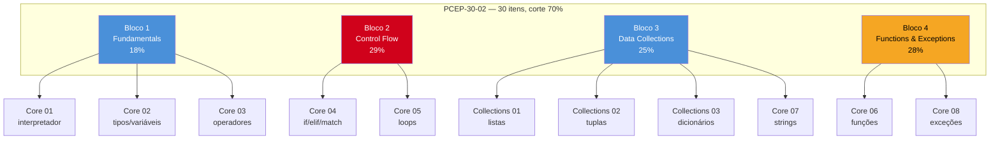

# PCEP na prática — fundamentos, controle de fluxo e coleções

> [!abstract] TL;DR
> O **PCEP-30-02** (Certified Entry-Level Python Programmer) tem 4 blocos de syllabus, e nenhum deles é conteúdo novo pra quem já passou pelos [[03-Dominios/Tecnologia/Python/Core/index|Galho 1 (Core)]] e [[03-Dominios/Tecnologia/Python/Collections e Comprehensions/index|Galho 2 (Collections e Comprehensions)]] desta trilha. Esta nota não reensina nada — ela pega os 4 blocos oficiais, com seus pesos exatos, e aponta cada um pra nota exata onde o conteúdo já foi ensinado, junto com o que merece uma segunda passada de atenção antes da prova: a cláusula `else` de loop (a pegadinha mais citada do bloco de maior peso), a hierarquia de exceções built-in, e a diferença entre `.get()`/`.setdefault()`/`.pop()` em dicionários. Termina onde a trilha PCAP começa: [[03 - PCAP — módulos, exceções e strings|03 — PCAP: módulos, exceções e strings]].

## Por que este mapeamento existe

Se você chegou até aqui tendo feito os 18 galhos anteriores da trilha Python, tem uma vantagem estranha em relação à maioria de quem estuda pra PCEP: você já sabe **mais** do que o exame cobre. O PCEP-30-02 é a certificação de entrada da Python Institute — pensada pra quem está aprendendo a programar pela primeira vez, com Python como primeira linguagem. Ele testa fundamentos absolutos: literais, operadores, `if`/`while`/`for`, listas, dicionários, funções, exceções básicas. Nada de orientação a objetos, nada de comprehensions avançadas, nada de módulos externos. Isso é exatamente o conteúdo do [[03-Dominios/Tecnologia/Python/Core/index|Galho 1]] e das quatro primeiras notas do [[03-Dominios/Tecnologia/Python/Collections e Comprehensions/index|Galho 2]].

O risco pra quem já programa bem não é "não saber a matéria" — é errar questões por **excesso de confiança**, pulando o detalhe exato que a Python Institute gosta de testar: o comportamento exato de `//` com números negativos, a ordem `except`/`else`/`finally`, a cláusula `else` de loop que ninguém usa no dia a dia mas que aparece toda hora em prova de certificação porque é justamente o tipo de sintaxe "correta mas obscura" que separa quem decorou padrões de quem leu a especificação. Esta nota é o filtro: qual nota-fonte olhar de novo, e o que especificamente revisar dentro dela.

## Tabela-mapa: os 4 blocos do PCEP-30-02

| # | Bloco oficial | Peso | Itens | Nota(s)-fonte |
|---|---|---|---|---|
| 1 | Computer Programming and Python Fundamentals | 18% | 7 | [[03-Dominios/Tecnologia/Python/Core/01 - O que é Python e como ele executa\|01]], [[03-Dominios/Tecnologia/Python/Core/02 - Tipos e variáveis\|02]], [[03-Dominios/Tecnologia/Python/Core/03 - Operadores e expressões\|03]] |
| 2 | Control Flow – Conditional Blocks and Loops | **29%** (maior peso) | 8 | [[03-Dominios/Tecnologia/Python/Core/04 - Controle de fluxo — if-elif-else e match-case\|04]], [[03-Dominios/Tecnologia/Python/Core/05 - Loops — for, while, range, enumerate, zip\|05]] |
| 3 | Data Collections – Tuples, Dictionaries, Lists, and Strings | 25% | 7 | [[03-Dominios/Tecnologia/Python/Collections e Comprehensions/01 - Listas — criação, métodos e slicing avançado\|Listas]], [[03-Dominios/Tecnologia/Python/Collections e Comprehensions/02 - Tuplas e desempacotamento\|Tuplas]], [[03-Dominios/Tecnologia/Python/Collections e Comprehensions/03 - Dicionários\|Dicionários]], [[03-Dominios/Tecnologia/Python/Core/07 - Strings e formatação\|Strings]] |
| 4 | Functions and Exceptions | 28% | 8 | [[03-Dominios/Tecnologia/Python/Core/06 - Funções — definição, argumentos e escopo básico\|06]], [[03-Dominios/Tecnologia/Python/Core/08 - Erros e exceções\|08]] |

Nota de corte: **70% cumulativo** sobre os 30 itens (dado confirmado no [[01 - Panorama — PCEP e PCAP, o que são e pra quem|panorama]] deste galho). Repare que os blocos 2 e 4, sozinhos, já somam 57% da prova — controle de fluxo e funções/exceções merecem mais tempo de revisão do que os outros dois juntos, apesar de serem, subjetivamente, os assuntos que "parecem mais óbvios" pra quem já programa.



O diagrama já entrega a leitura estratégica: os dois blocos coloridos em destaque (Control Flow e Functions/Exceptions) somam mais da metade da prova. As seções a seguir seguem essa mesma ordem de prioridade — não a ordem numérica do syllabus, mas a ordem de peso, começando pelo bloco de fundamentos (base necessária) e terminando no de maior peso combinado.

## Bloco 1 — Computer Programming and Python Fundamentals (18%)

Este bloco testa se você entende o que acontece "por baixo" antes mesmo do primeiro `if`: como o interpretador processa um programa, o que é um literal, como variáveis se comportam, e a álgebra básica de operadores. A Python Institute costuma cobrar aqui:

- **Interpretação vs. compilação, e como o CPython executa um script** — item que soa acadêmico mas aparece em forma de múltipla escolha ("o que acontece quando você roda `python app.py`?"). Coberto em profundidade em [[03-Dominios/Tecnologia/Python/Core/01 - O que é Python e como ele executa|Core 01]], que descreve o pipeline tokenizer → AST → bytecode → VM.
- **Keywords, literais, comentários, PEP 8 básico** — o que é um identificador válido, a diferença entre `#` de comentário e docstring, convenções de nomenclatura. Não há uma nota dedicada só a isso na trilha (é considerado óbvio demais pra merecer nota própria), mas o vocabulário aparece espalhado em [[03-Dominios/Tecnologia/Python/Core/02 - Tipos e variáveis|Core 02]].
- **Tipos primitivos (`int`, `float`, `bool`, `str`) e o modelo de variável como rótulo** — o núcleo de [[03-Dominios/Tecnologia/Python/Core/02 - Tipos e variáveis|Core 02]]: dynamic typing vs. strong typing, mutabilidade, `is` vs `==`.
- **Entrada e saída básica** (`input()`, `print()`, conversão de tipo do que `input()` devolve) — tema que atravessa exemplos práticos em [[03-Dominios/Tecnologia/Python/Core/05 - Loops — for, while, range, enumerate, zip|Core 05]] e [[03-Dominios/Tecnologia/Python/Core/09 - Módulos e imports|Core 09]], mas o ponto de exame é simples e merece registro isolado aqui: `input()` **sempre** devolve `str`, mesmo quando o usuário digita um número — `idade = input("Idade: ")` guarda a string `"30"`, não o inteiro `30`. Esquecer o `int(input(...))` explícito é a pegadinha número 1 deste sub-tópico em prova.
- **Operadores e expressões** — aritméticos, de comparação, o comportamento peculiar de `and`/`or` (retornam operando, não `bool`), tudo coberto em [[03-Dominios/Tecnologia/Python/Core/03 - Operadores e expressões|Core 03]].

> [!tip] O que revisar com mais atenção neste bloco
> Duas coisas erram mais gente experiente do que iniciante: (1) `/` sempre devolve `float`, mesmo `10 / 2` (`5.0`, não `5`) — comparado a Java, onde a divisão inteira é implícita entre dois `int`; e (2) o resultado de `**` associa **à direita** (`2 ** 3 ** 2` é `512`, não `64`) — o único operador aritmético com essa regra. Ambos estão detalhados em [[03-Dominios/Tecnologia/Python/Core/03 - Operadores e expressões|Core 03]].

> [!question]- A prova cobra `match`/`case` no bloco 1?
> Não — `match`/`case` (structural pattern matching, PEP 634) é sintaxe do Python 3.10+, e o PCEP-30-02 é agnóstico a versões recentes desse tipo, focado no núcleo estável da linguagem. Ele aparece no bloco 2 (Control Flow) apenas como pano de fundo geral de "condicionais", não como item obrigatório de prova — mas vale saber que existe, caso apareça como distrator numa questão de múltipla escolha sobre `if`/`elif`.

## Bloco 2 — Control Flow: Conditional Blocks and Loops (29%, maior peso da prova)

Este é o bloco que decide se você passa ou não — quase um terço da prova inteira. E é justamente aqui que a intuição de quem já programa em outra linguagem pode trair: o Python tem construções de controle de fluxo que **parecem** familiares mas se comportam diferente o suficiente pra virar pegadinha de exame.

- **`if`/`elif`/`else` e truthiness** — o que conta como "falso" além de `False` literal (`0`, `""`, `[]`, `None`, coleções vazias) é o núcleo de [[03-Dominios/Tecnologia/Python/Core/04 - Controle de fluxo — if-elif-else e match-case|Core 04]]. A prova gosta de testar código que usa `if lista:` em vez de `if len(lista) > 0:` — se você não sabe que lista vazia é falsy, o trecho parece incompleto.
- **Expressões condicionais (o "ternário" de Python)** — `x if condicao else y`, também em Core 04. Diferente da sintaxe `condicao ? x : y` de Java/C/JS, e a prova costuma testar exatamente essa tradução de sintaxe.
- **Loops `for` e `while`** — a mecânica de `range()`, `enumerate()`, `zip()`, `break`/`continue`, tudo em [[03-Dominios/Tecnologia/Python/Core/05 - Loops — for, while, range, enumerate, zip|Core 05]]. A prova adora perguntar "o que este código imprime" com `range(inicio, fim, passo)` usando passo negativo ou combinações que confundem quem decorou só o caso `range(n)`.
- **A cláusula `else` de loop** (`for...else`, `while...else`) — o item mais citado como "pegadinha PCEP/PCAP" em qualquer fórum de preparação. Coberto na íntegra em [[03-Dominios/Tecnologia/Python/Core/05 - Loops — for, while, range, enumerate, zip|Core 05]], seção "A cláusula `else` de loop".

> [!warning] `for...else` e `while...else` — a construção que ninguém usa no código real mas todo mundo erra em prova
> O `else` de um loop **não** significa "senão" no sentido de `if`/`else`. Ele significa: "execute este bloco se o loop terminou normalmente, **sem** ter sido interrompido por um `break`". Se o loop rodar até o fim (ou nunca executar, no caso de um `for` sobre sequência vazia), o `else` roda. Se um `break` interromper o loop no meio do caminho, o `else` é **pulado**.
> ```python
> for n in range(2, 10):
>     if n % 7 == 0:
>         print(f"múltiplo de 7: {n}")
>         break
> else:
>     print("nenhum múltiplo de 7 encontrado")
> ```
> Como a maioria dos devs nunca usa essa construção no dia a dia (a comunidade em geral prefere uma flag booleana explícita ou reestruturar a lógica), ela é rara o bastante pra soar "nova" mesmo pra quem já programa há anos — e é exatamente por isso que a Python Institute testa ela com frequência: separa quem estudou a especificação de quem só decorou padrões de código que já viu em produção.

> [!tip] O que revisar com mais atenção neste bloco
> Três armadilhas concentram a maior parte dos erros de prova neste bloco: (1) `range(inicio, fim, passo)` é **exclusivo** no `fim` — `range(1, 5)` gera `1, 2, 3, 4`, nunca `5`; (2) `zip()` trunca silenciosamente no iterável mais curto, sem erro nem aviso; (3) modificar uma lista dentro do `for` que itera sobre ela pula elementos de forma sutil (índices deslocam conforme o tamanho muda). Os três estão detalhados com exemplo de código em [[03-Dominios/Tecnologia/Python/Core/05 - Loops — for, while, range, enumerate, zip|Core 05]], seção "Armadilhas".

## Bloco 3 — Data Collections: Tuples, Dictionaries, Lists, and Strings (25%)

Este bloco troca sintaxe de controle por estrutura de dados — as quatro coleções nativas que carregam praticamente todo estado de um programa Python simples. A cobertura técnica completa está no [[03-Dominios/Tecnologia/Python/Collections e Comprehensions/index|Galho 2]] (para listas, tuplas e dicionários) e no Galho 1 (para strings, que tecnicamente é uma nota de fundamentos, não de coleções, mas que a Python Institute agrupa aqui por ser também uma sequência iterável).

- **Listas: criação, indexação, slicing, métodos mutantes vs. não-mutantes** — [[03-Dominios/Tecnologia/Python/Collections e Comprehensions/01 - Listas — criação, métodos e slicing avançado|Collections 01]]. A distinção `.sort()` (in-place, devolve `None`) vs. `sorted()` (devolve lista nova) é item clássico de prova.
- **Tuplas: criação, imutabilidade, desempacotamento (unpacking)** — [[03-Dominios/Tecnologia/Python/Collections e Comprehensions/02 - Tuplas e desempacotamento|Collections 02]]. A prova gosta de testar a sintaxe da tupla de um elemento (`(3,)` vs. `(3)`, que é só um `int` entre parênteses) e o swap idiomático `a, b = b, a`.
- **Dicionários: criação, acesso, `.keys()`/`.values()`/`.items()`, `.get()`** — [[03-Dominios/Tecnologia/Python/Collections e Comprehensions/03 - Dicionários|Collections 03]]. A prova testa `d[chave]` (levanta `KeyError` se ausente) contra `d.get(chave, padrao)` (nunca levanta, devolve `None` ou o padrão) — sabe a diferença exata entre os dois é item garantido.
- **Strings como sequência: indexação, slicing, métodos, imutabilidade** — [[03-Dominios/Tecnologia/Python/Core/07 - Strings e formatação|Core 07]]. Slicing negativo (`s[-3:]`) e o fato de que todo método "que parece mutar" (`.upper()`, `.replace()`) na verdade devolve um objeto novo são pontos recorrentes.

> [!warning] Slicing com índice negativo é a pegadinha número 1 deste bloco
> `lista[-1]` é o último elemento; `lista[-3:]` são os últimos três; `lista[:-1]` é tudo **menos** o último. A confusão mais comum é misturar índice negativo com o comportamento exclusivo do limite final: `lista[2:-1]` corta do índice 2 até o penúltimo elemento (excluindo o último), não "do índice 2 até -1 posições do fim, inclusive". A regra que resolve qualquer confusão: o slice `[a:b]` sempre pega do índice `a` (inclusive) até o índice `b` (exclusive), independente de `a`/`b` serem positivos ou negativos — contar em `-1, -2, -3...` a partir do fim é só outra forma de nomear a mesma posição. Esse comportamento é idêntico para `list`, `tuple` e `str`, porque as três são sequências no mesmo sentido do data model.

> [!tip] O que revisar com mais atenção neste bloco
> Fixe a diferença entre `.append()` (adiciona 1 elemento, mesmo que esse elemento seja uma lista) e `.extend()` (adiciona cada elemento de um iterável, achatando um nível) — [[03-Dominios/Tecnologia/Python/Collections e Comprehensions/01 - Listas — criação, métodos e slicing avançado|Collections 01]] tem o exemplo lado a lado. E memorize que tupla é hasheável **somente se todos os seus elementos também forem** — uma tupla contendo uma lista não pode ser chave de dicionário nem elemento de set, e a prova adora testar essa exceção pontual.

> [!question]- A prova cobra sets neste bloco?
> Não — repare que o nome oficial do bloco 3 é "Tuples, Dictionaries, Lists, and Strings", sem menção a `set`. O PCEP-30-02 (nível entry) deixa `set`/`frozenset` de fora do syllabus formal; eles aparecem só no PCAP-31-03 (bloco 5, Miscellaneous), coberto na nota [[05 - PCAP — miscellaneous, comprehensions, lambdas, closures e arquivos|05 deste galho]]. Se você já leu [[03-Dominios/Tecnologia/Python/Collections e Comprehensions/04 - Sets|Collections 04]], guarde esse conhecimento pra mais adiante — pra PCEP especificamente, é excedente.

## Bloco 4 — Functions and Exceptions (28%)

Segundo maior peso da prova, e o bloco que mistura dois assuntos que, à primeira vista, parecem não ter relação — mas que a Python Institute agrupa porque ambos giram em torno de "como um bloco de código se comunica com quem o chamou" (retorno de valor, ou propagação de erro).

- **`def`, parâmetros, argumentos, valores default** — [[03-Dominios/Tecnologia/Python/Core/06 - Funções — definição, argumentos e escopo básico|Core 06]]. O item mais previsível de prova aqui é a diferença entre argumento posicional e nomeado, e a ordem obrigatória posicional → `*args` → nomeado com default → `**kwargs`.
- **`*args`/`**kwargs`** — mesma nota, seção dedicada. A prova costuma dar um trecho de código com `*args` e pedir o que é impresso quando a função é chamada com um número variável de argumentos.
- **Escopo e a regra LEGB (Local, Enclosing, Global, Built-in)** — mesma nota, seção "Escopo e a regra LEGB". `UnboundLocalError` por reatribuição acidental de uma variável global dentro de uma função (sem `global` declarado) é uma pegadinha clássica: o interpretador decide, na hora de compilar a função, que aquele nome é local em **toda** a função, mesmo antes da linha onde a reatribuição acontece — e isso quebra até tentativas de só *ler* a variável antes de reatribuí-la mais adiante no mesmo corpo.
- **`try`/`except`/`else`/`finally`, hierarquia de exceções built-in** — [[03-Dominios/Tecnologia/Python/Core/08 - Erros e exceções|Core 08]], a nota mais densa deste bloco. A ordem exata das cláusulas, o que cada uma faz e quando roda, é item quase garantido em prova.

> [!warning] A hierarquia de exceções built-in é testada por posição na árvore, não por nome solto
> A prova não pergunta só "o que é `ValueError`" — ela pergunta coisas como "qual dessas alternativas captura tanto `ZeroDivisionError` quanto `ValueError`, sem capturar `KeyboardInterrupt`?", forçando você a saber que `ZeroDivisionError` é subclasse de `ArithmeticError`, que `ArithmeticError` e `ValueError` são ambas subclasses de `Exception`, e que `Exception` **não** é a raiz de tudo — `BaseException` é, e `KeyboardInterrupt`/`SystemExit` herdam diretamente dela, fora da árvore de `Exception`. Isso é o motivo exato pelo qual `except Exception:` genérico não captura `Ctrl+C` nem `sys.exit()`, mas `except:` nu (sem tipo nenhum) captura os dois — e captura os dois é quase sempre um bug, não uma feature. A árvore completa, com diagrama, está em [[03-Dominios/Tecnologia/Python/Core/08 - Erros e exceções|Core 08]], seção "A hierarquia de exceções built-in".

> [!tip] O que revisar com mais atenção neste bloco
> A ordem `try` → `except` → `else` → `finally` é testada com trechos de código que combinam `return` dentro de mais de uma cláusula — e a resposta certa depende de saber que `finally` **sempre** roda, mesmo depois de um `return` dentro do `try` ou do `except`, e que um `return` dentro de `finally` **descarta silenciosamente** qualquer exceção que estivesse se propagando. [[03-Dominios/Tecnologia/Python/Core/08 - Erros e exceções|Core 08]] tem essa armadilha isolada e nomeada ("`finally` com `return` engolindo exceção") — vale reler antes da prova especificamente por essa seção.

> [!question]- O bloco 4 cobra exceções customizadas (`class MinhaExcecao(Exception)`)?
> O syllabus oficial do PCEP-30-02 foca em `try`/`except`/`else`/`finally` e na hierarquia built-in — criar hierarquias próprias de exceção é conteúdo mais associado ao PCAP (bloco 2, Exceptions, 14%), coberto na nota [[03 - PCAP — módulos, exceções e strings|03 deste galho]]. Não custa nada já ter lido a seção "Exceções customizadas" de [[03-Dominios/Tecnologia/Python/Core/08 - Erros e exceções|Core 08]], mas não é o foco do PCEP especificamente.

## O formato das questões: por que "saber o assunto" não basta

Antes do mini-simulado, vale nomear uma coisa que muda como você deve revisar: o PCEP-30-02 não usa só múltipla escolha clássica. O syllabus oficial da Python Institute descreve quatro formatos de item, misturados ao longo da prova:

- **Single-choice** — uma pergunta, quatro alternativas, uma correta. O formato mais comum, principalmente nos blocos 1 e 3.
- **Multiple-choice** — mais de uma alternativa correta, sem indicação de quantas; marcar de menos ou de mais zera a questão. Aparece com frequência no bloco 4 (exceções), onde várias respostas podem "parecer" certas por capturarem a exceção certa por um caminho diferente.
- **Drag-and-drop** — normalmente pra reordenar linhas de código ou blocos de um algoritmo (ex.: montar a ordem certa de `try`/`except`/`else`/`finally`, ou a sequência de um loop com `break`). Testa se você sabe a **ordem de execução**, não só o vocabulário.
- **Gap-fill** — preencher uma lacuna num trecho de código funcional, geralmente com um operador, um método ou uma palavra-chave (`elif`, `//`, `.get`, `else` de loop). Esse formato pune quem sabe reconhecer a sintaxe mas não sabe reproduzi-la de memória — motivo a mais pra praticar escrevendo, não só lendo.

> [!tip] A implicação prática pra sua revisão
> Formatos como drag-and-drop e gap-fill significam que ler passivamente as notas-fonte não é suficiente — você precisa conseguir **reproduzir** a sintaxe exata (não só reconhecê-la numa lista de alternativas) e prever a **ordem** de execução de um bloco de código, não só o resultado final. Ao revisar cada nota-fonte linkada nesta página, tente fechar o editor de vez em quando e escrever o trecho de cor antes de conferir.

## Mini-simulado: quatro questões no estilo PCEP

Um simulado completo, com gabarito comentado e cobertura proporcional aos pesos oficiais, é o capítulo final do galho — [[08 - Capstone — simulado comentado PCEP + PCAP|08 — Capstone]]. Aqui vão só quatro questões de aquecimento, uma por bloco, no formato "o que este código imprime" que domina a prova real, pra você calibrar se a leitura das seções acima realmente colou.

**Questão 1 (Bloco 1 — Fundamentals).** O que este trecho imprime?

```python
x = 7
y = 2
print(x / y, x // y, x % y)
```

> [!question]- Resposta e explicação
> `3.5 3 1`. `/` é sempre divisão verdadeira e devolve `float` (`7/2 = 3.5`); `//` é divisão inteira com arredondamento pra baixo (`3`); `%` é o resto da divisão (`1`). Ver [[03-Dominios/Tecnologia/Python/Core/03 - Operadores e expressões|Core 03]], seção "Operadores aritméticos" — a pegadinha clássica aqui é achar que `/` se comporta como em Java quando os dois operandos são `int`.

**Questão 2 (Bloco 2 — Control Flow).** O que este trecho imprime?

```python
for i in range(3):
    if i == 5:
        print("achei")
        break
else:
    print("não achei")
print("fim")
```

> [!question]- Resposta e explicação
> `não achei` seguido de `fim`. O `for` percorre `0, 1, 2` sem nunca encontrar `i == 5`, então nenhum `break` acontece — e por isso o `else` do loop **roda**, imprimindo "não achei". Se o `break` tivesse sido disparado, o `else` seria pulado. Essa é a construção coberta em detalhe em [[03-Dominios/Tecnologia/Python/Core/05 - Loops — for, while, range, enumerate, zip|Core 05]], seção "A cláusula `else` de loop" — o item mais citado como pegadinha do bloco de maior peso da prova.

**Questão 3 (Bloco 3 — Data Collections).** O que este trecho imprime?

```python
dados = {"a": 1, "b": 2}
print(dados.get("c", 0), dados.get("a"))
print(dados["c"])
```

> [!question]- Resposta e explicação
> Primeiro `print` imprime `0 1` (`.get("c", 0)` não encontra a chave e devolve o padrão `0`; `.get("a")` encontra e devolve `1`). O segundo `print` **levanta `KeyError`** — `dados["c"]` com colchetes não tem padrão e explode quando a chave não existe. Essa distinção `[]` vs. `.get()` é item quase garantido do bloco 3; ver [[03-Dominios/Tecnologia/Python/Collections e Comprehensions/03 - Dicionários|Collections 03]], seção "Acesso: `d[key]` vs `d.get(key, default)`".

**Questão 4 (Bloco 4 — Functions and Exceptions).** O que este trecho imprime?

```python
def dividir(a, b):
    try:
        return a / b
    except ZeroDivisionError:
        return None
    finally:
        print("cleanup")

print(dividir(10, 0))
```

> [!question]- Resposta e explicação
> Imprime `cleanup` (do `finally`, que **sempre** roda, mesmo com um `return` dentro do `except`) e depois `None` (o valor de retorno). A ordem importa: o `finally` executa **antes** do valor de retorno ser efetivamente entregue a quem chamou a função, mas **depois** de o `except` já ter decidido qual valor retornar. Ver [[03-Dominios/Tecnologia/Python/Core/08 - Erros e exceções|Core 08]], seção "A ordem completa: `try` → `except` → `else` → `finally`".

Se você acertou as quatro sem precisar abrir um interpretador, os quatro blocos estão em boa forma. Se alguma travou, essa é exatamente a nota-fonte linkada na explicação — vale reler a seção específica citada antes de seguir para o galho PCAP.

## Amarrando os 4 blocos: um exemplo único

Para fechar, vale um exercício no espírito exato do formato de prova da Python Institute — "o que este código imprime" — que atravessa os quatro blocos de uma vez: fundamentos (tipos), controle de fluxo (`for`/`else`), coleções (dicionário) e funções/exceções (`try`/`except`).

```python
def processar_pedidos(pedidos):
    resumo = {}
    for pedido in pedidos:
        try:
            valor = float(pedido["valor"])
        except (KeyError, ValueError):
            continue
        else:
            categoria = pedido.get("categoria", "outros")
            resumo[categoria] = resumo.get(categoria, 0) + valor
    else:
        print(f"processados: {len(resumo)} categorias")
    return resumo

pedidos = [
    {"valor": "100.0", "categoria": "livros"},
    {"valor": "abc", "categoria": "livros"},   # ValueError — pulado
    {"valor": "50.5"},                          # sem "categoria" — vai pra "outros"
]

print(processar_pedidos(pedidos))
```

O que a Python Institute quer que você saiba, linha a linha, pra prever a saída sem rodar: que `float("abc")` levanta `ValueError`, capturado pelo `except`, que dispara `continue` (não `break` — o `for...else` no final **ainda roda**, porque não houve `break`); que `pedido.get("categoria", "outros")` nunca levanta erro mesmo quando a chave está ausente; e que `resumo.get(categoria, 0) + valor` é o idioma EAFP-friendly de "soma acumulando, com valor inicial padrão" sem precisar checar `if categoria in resumo` antes. Rodar mentalmente esse tipo de trecho, sem abrir o interpretador, é exatamente o exercício que a prova cobra — e é o motivo de esta nota apontar pra cada peça em vez de reexplicá-la: o conhecimento já está nas notas-fonte, o que falta é o hábito de ler código como quem vai ser avaliado por múltipla escolha, sob tempo.

## How to explain in English

Se o seu plano de certificação inclui também entrevistas técnicas em inglês (comum pra quem está usando a PCEP/PCAP como credencial num processo seletivo internacional), vale ter pronta a versão em inglês de como você descreveria sua preparação:

> "I used the PCEP-30-02 syllabus as a checklist against material I'd already studied in depth — fundamentals, control flow, collections, and functions/exceptions — rather than learning Python from the syllabus itself. The block I spent the most time re-reviewing was Control Flow, at 29% of the exam, specifically the `for...else`/`while...else` clause, which is rarely used in real code but is exactly the kind of 'correct but obscure' syntax certification exams like to test."

Essa frase funciona bem porque responde a pergunta implícita de qualquer entrevistador técnico diante de uma certificação de nível entry-level no currículo de alguém sênior: "por que isso, se você já sabe mais do que a prova cobre?" — a resposta honesta é credencial formal + disciplina de revisão, não lacuna de conhecimento.

## Vocabulário

| Termo PT | Termo EN |
|---|---|
| bloco do syllabus | syllabus block/section |
| peso do item / da questão | item weight |
| nota de corte | passing score |
| verdade/falsidade contextual | truthiness |
| cláusula else de loop | loop else clause |
| desempacotamento | unpacking |
| hierarquia de exceções | exception hierarchy |
| captura de exceção | exception handling / catching |
| escopo | scope |
| argumento nomeado | keyword argument |
| questão de escolha única | single-choice question |
| questão de múltipla escolha | multiple-choice question |
| arrastar e soltar | drag-and-drop |
| preencher lacuna | gap-fill |
| divisão inteira | floor / integer division |
| fatiamento | slicing |

## Checklist de revisão rápida antes da prova

Uma passada final, bloco a bloco, pensada pra quem já leu as notas-fonte e só quer confirmar que os pontos de maior risco de erro estão fixados. Se qualquer item da lista não estiver automático, essa é a seção exata da nota-fonte a reabrir.

**Bloco 1 — Fundamentals (18%)**
- [ ] Sei explicar, em uma frase, o caminho `.py` → tokenizer → AST → bytecode → VM ([[03-Dominios/Tecnologia/Python/Core/01 - O que é Python e como ele executa|Core 01]]).
- [ ] Sei que `input()` sempre devolve `str`, mesmo quando o usuário digita um número.
- [ ] Sei explicar a diferença entre dynamic typing e strong typing sem confundir os dois eixos ([[03-Dominios/Tecnologia/Python/Core/02 - Tipos e variáveis|Core 02]]).
- [ ] Sei que `/` sempre devolve `float` e que `**` associa à direita ([[03-Dominios/Tecnologia/Python/Core/03 - Operadores e expressões|Core 03]]).

**Bloco 2 — Control Flow (29%)**
- [ ] Sei listar o que conta como falsy além de `False` (`0`, `""`, `[]`, `{}`, `None`) ([[03-Dominios/Tecnologia/Python/Core/04 - Controle de fluxo — if-elif-else e match-case|Core 04]]).
- [ ] Sei que `range(a, b)` é exclusivo em `b`, e sei o efeito de um `passo` negativo.
- [ ] Sei prever, sem rodar, quando o `else` de um `for`/`while` executa e quando é pulado ([[03-Dominios/Tecnologia/Python/Core/05 - Loops — for, while, range, enumerate, zip|Core 05]]).
- [ ] Sei que `zip()` trunca silenciosamente no iterável mais curto, sem erro.

**Bloco 3 — Data Collections (25%)**
- [ ] Sei a diferença exata entre `.append()` e `.extend()` ([[03-Dominios/Tecnologia/Python/Collections e Comprehensions/01 - Listas — criação, métodos e slicing avançado|Collections 01]]).
- [ ] Sei que `.sort()` muta e devolve `None`; `sorted()` devolve uma lista nova.
- [ ] Sei desempacotar com `*` no meio de uma atribuição múltipla, e sei que a tupla de um elemento exige vírgula (`(3,)`) ([[03-Dominios/Tecnologia/Python/Collections e Comprehensions/02 - Tuplas e desempacotamento|Collections 02]]).
- [ ] Sei a diferença entre `d[chave]` (levanta `KeyError`) e `d.get(chave, padrao)` (nunca levanta) ([[03-Dominios/Tecnologia/Python/Collections e Comprehensions/03 - Dicionários|Collections 03]]).
- [ ] Sei fatiar string/lista com índice negativo sem hesitar (`s[-3:]`, `s[:-1]`) ([[03-Dominios/Tecnologia/Python/Core/07 - Strings e formatação|Core 07]]).

**Bloco 4 — Functions and Exceptions (28%)**
- [ ] Sei a ordem obrigatória de parâmetros: posicional → `*args` → nomeado com default → `**kwargs` ([[03-Dominios/Tecnologia/Python/Core/06 - Funções — definição, argumentos e escopo básico|Core 06]]).
- [ ] Sei explicar a regra LEGB e por que `UnboundLocalError` acontece mesmo antes da linha de reatribuição.
- [ ] Sei a ordem exata `try` → `except` → `else` → `finally` e o que roda em cada cenário (sucesso, erro capturado, erro não capturado) ([[03-Dominios/Tecnologia/Python/Core/08 - Erros e exceções|Core 08]]).
- [ ] Sei posicionar pelo menos três exceções built-in na hierarquia (`ZeroDivisionError` → `ArithmeticError` → `Exception`; `KeyboardInterrupt` → `BaseException`, fora de `Exception`).

Uma passada honesta por essa lista, marcando só o que realmente sai de cabeça sem consultar a nota, é mais confiável do que reler o galho inteiro de novo — o objetivo da certificação não é reaprender Python, é confirmar que o que você já sabe está endereçável sob pressão de tempo.

## O que vem a seguir

Esta nota fechou o mapeamento do PCEP-30-02 inteiro — os 4 blocos, com pesos e notas-fonte. A partir daqui o galho muda de alvo: [[03 - PCAP — módulos, exceções e strings|03 — PCAP: módulos, exceções e strings]] começa o mapeamento da certificação **Associate** (PCAP-31-03), que pressupõe tudo que foi coberto aqui e adiciona módulos/pacotes, exceções em profundidade maior e strings com métodos menos comuns — os três primeiros dos cinco blocos do PCAP.

## Fontes

- Python Institute. *PCEP-30-02 Exam Syllabus*. pythoninstitute.org. https://pythoninstitute.org/pcep-exam-syllabus (consultado em 2026-07-12, status "Live & Active")
- Python Institute. *PCEP – Certified Entry-Level Python Programmer*. pythoninstitute.org. https://pythoninstitute.org/pcep (consultado em 2026-07-12)
- OpenEDG Python Institute. *PCEP-30-02 Certification Exam Blocks and Objectives*. (referenciado a partir do syllabus oficial acima)

Consultado em 2026-07-12.
