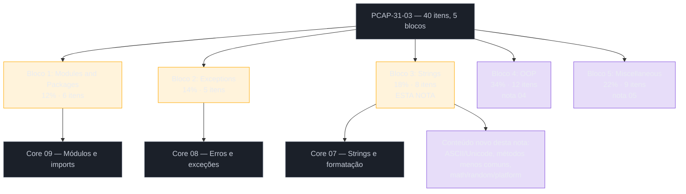
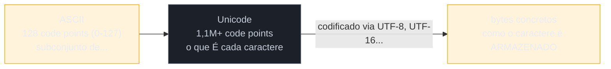

# PCAP — módulos, exceções e strings

> [!abstract] TL;DR
> Os três primeiros blocos do **PCAP-31-03** somam 44% da prova: **Modules and Packages** (12%, 6 itens), **Exceptions** (14%, 5 itens) e **Strings** (18%, 8 itens) — o bloco de strings, sozinho, já vale quase tanto quanto módulos e exceções somados. Os dois primeiros blocos são cobertos em profundidade pelas notas [[03-Dominios/Tecnologia/Python/Core/09 - Módulos e imports|09 — Módulos e imports]] e [[03-Dominios/Tecnologia/Python/Core/08 - Erros e exceções|08 — Erros e exceções]] do Galho 1 — esta nota não reexplica, aponta e destaca o que a Python Institute gosta de testar. O bloco de strings tem uma parte já coberta pela nota [[03-Dominios/Tecnologia/Python/Core/07 - Strings e formatação|07 — Strings e formatação]] (imutabilidade, slicing, `.strip()`/`.split()`/`.join()`/`.replace()`, f-strings) e uma parte genuinamente nova aqui: representação de caracteres (ASCII/Unicode/`ord()`/`chr()`) e um conjunto de métodos de string — `.isalpha()`, `.isdigit()`, `.find()` vs `.index()`, `.count()`, `.startswith()`/`.endswith()` — que aparecem o tempo todo em questão de prova mas não tinham nota própria até agora. Fecha também os módulos `math`, `random` e `platform` da standard library, que o syllabus cita nominalmente e que nenhuma nota do Galho 1-6 cobriu em detalhe.

## Como este bloco se encaixa na prova

O PCAP-31-03 (Certified Associate in Python Programming) tem 40 itens em 5 blocos, nota de corte 70% cumulativo. Os três blocos desta nota — Modules and Packages, Exceptions, Strings — formam a "primeira metade" temática do exame, antes de Object-Oriented Programming (34%, o bloco de maior peso, coberto na [[04 - PCAP — orientação a objetos, o bloco de maior peso|nota 04]]) e Miscellaneous (22%, [[05 - PCAP — miscellaneous, comprehensions, lambdas, closures e arquivos|nota 05]]).



> [!tip] Ordem de estudo sugerida
> Se você já fez o Galho 1 inteiro, os blocos 1 e 2 são pura revisão dirigida — vale ler as duas notas-fonte de novo com a tabela desta nota do lado, marcando mentalmente os pontos assinalados como "armadilha de prova". O bloco 3 (Strings) é onde vale mais tempo novo: a parte de `.strip()`/`.split()`/`.join()`/f-strings já está internalizada pelo Galho 1, mas os métodos booleanos (`.isX()`) e a distinção `.find()`/`.index()` raramente aparecem em código de aplicação do dia a dia — e são exatamente o tipo de detalhe que a Python Institute adora cobrar.

## Bloco 1 — Modules and Packages (12%, 6 itens)

| Item do syllabus | Nota-fonte | O que merece atenção extra pra prova |
|---|---|---|
| Formas de `import` (`import x`, `from x import y`, `import x as apelido`, `from x import *`) | [[03-Dominios/Tecnologia/Python/Core/09 - Módulos e imports#As três formas de `import`\|Core 09 — As três formas de import]] | A prova gosta de testar se você sabe **qual nome fica vinculado** em cada forma: `import math` vincula `math` (precisa de prefixo); `from math import sqrt` vincula só `sqrt` (sem prefixo, e `math` **não** existe nesse namespace). Questão clássica: código com `from math import sqrt` seguido de `math.pi` — `NameError`, não `AttributeError`. |
| `sys.path` e como o Python resolve um módulo | [[03-Dominios/Tecnologia/Python/Core/09 - Módulos e imports#Como o Python encontra um módulo `sys.path`\|Core 09 — sys.path]] | Saber a **ordem** de busca (diretório do script → `PYTHONPATH` → biblioteca padrão → site-packages) é testável como pergunta direta. A armadilha mais citada: um arquivo próprio chamado `math.py` na pasta do projeto "sequestra" `import math`, porque o diretório local vem primeiro. |
| `__name__` e o idioma `if __name__ == "__main__":` | [[03-Dominios/Tecnologia/Python/Core/09 - Módulos e imports#`if __name__ == "__main__"` — por que existe\|Core 09 — __name__]] | Pergunta de "o que este código imprime" clássica: um módulo com `print(__name__)` solto no topo, importado de outro arquivo — a resposta é o nome do módulo (`"nome_do_arquivo"`), nunca `"__main__"`, a não ser que o arquivo seja o ponto de entrada. |
| Módulos `math`, `random`, `platform` da standard library | (conteúdo novo, ver seção abaixo) | O syllabus cita esses três módulos nominalmente — vale saber de cor as funções/constantes mais comuns de cada um, cobertas na próxima seção. |
| Construção e import de pacotes (`__init__.py`) | [[03-Dominios/Tecnologia/Python/Core/09 - Módulos e imports#Pacotes pastas que viram módulos importáveis\|Core 09 — Pacotes]] | A prova assume o modelo "pacote regular com `__init__.py`" — não costuma testar namespace packages (PEP 420) em profundidade, mas vale saber que `__init__.py` roda automaticamente na primeira importação de qualquer módulo do pacote. |
| Imports absolutos vs. relativos dentro de um pacote | [[03-Dominios/Tecnologia/Python/Core/09 - Módulos e imports#Imports absolutos vs relativos PEP 328\|Core 09 — Absoluto vs relativo]] | Saber a sintaxe de pontos (`.` = pacote atual, `..` = pacote pai) e o erro que ela produz fora de um pacote (`ImportError: attempted relative import with no known parent package`) — testável como "o que este código faz ao rodar `python arquivo.py` diretamente". |

### `math`, `random`, `platform`: os três módulos que o syllabus cita nominalmente

Nenhuma nota do Galho 1-6 cobriu esses três módulos em detalhe — a trilha os usa pontualmente ao longo de exemplos, mas nunca parou pra listar a API. Como o syllabus os cita por nome (diferente da maioria dos itens, que fala em "módulos da standard library" de forma genérica), vale fechar essa lacuna aqui, de forma direta:

```python
import math

print(math.pi)              # 3.141592653589793 — constante
print(math.e)                # 2.718281828459045 — constante
print(math.sqrt(16))         # 4.0 — raiz quadrada
print(math.ceil(4.1))        # 5  — arredonda pra CIMA
print(math.floor(4.9))       # 4  — arredonda pra BAIXO
print(math.trunc(4.9))       # 4  — trunca a parte decimal (igual floor para positivos)
print(math.factorial(5))     # 120
print(math.hypot(3, 4))      # 5.0 — hipotenusa: sqrt(3**2 + 4**2)
```

```python
import random

print(random.random())          # float entre 0.0 (inclusive) e 1.0 (exclusive)
print(random.randint(1, 6))      # int entre 1 e 6, AMBOS inclusive — simula um dado
print(random.choice([1, 2, 3]))  # um elemento aleatório da sequência
print(random.sample([1, 2, 3, 4, 5], 2))  # amostra SEM reposição, k elementos distintos
random.seed(42)                   # fixa a semente — reprodutibilidade em teste/prova
```

```python
import platform

print(platform.python_version())        # ex.: "3.12.4" — string
print(platform.python_version_tuple())    # ex.: ('3', '12', '4') — tupla de strings
print(platform.system())                  # "Linux", "Windows", "Darwin"
```

> [!warning] `math.ceil`/`math.floor` devolvem `int`, não `float`
> Diferente do que a intuição de "arredondamento" sugere, `math.ceil(4.1)` e `math.floor(4.9)` devolvem `int` (`5` e `4`), não `5.0`/`4.0`. Isso costuma aparecer em questão de "qual o tipo do resultado" — uma pegadinha de tipo, não de valor.

> [!question]- `randint(1, 6)` inclui o 6 ou não?
> Inclui — `random.randint(a, b)` é inclusivo nos dois extremos (`a <= n <= b`), diferente de `random.randrange(a, b)`, que segue a mesma semântica de `range()` (exclusivo no limite superior). Essa assimetria entre `randint` e `randrange` é um dos detalhes mais citados como pegadinha de prova envolvendo o módulo `random` — vale memorizar a diferença explicitamente, porque o nome sozinho não deixa óbvio qual dos dois é exclusivo.

## Bloco 2 — Exceptions (14%, 5 itens)

| Item do syllabus | Nota-fonte | O que merece atenção extra pra prova |
|---|---|---|
| `try`/`except`/`else`/`finally` — ordem e semântica | [[03-Dominios/Tecnologia/Python/Core/08 - Erros e exceções#A ordem completa `try` → `except` → `else` → `finally`\|Core 08 — try/except/else/finally]] | Pergunta clássica de "o que este código imprime" envolvendo `finally` com `return` dentro — a Python Institute testa exatamente a armadilha de `finally` mascarando uma exceção, já documentada no `[!warning]` da nota-fonte. |
| Hierarquia de exceções built-in (`BaseException` → `Exception` → subtipos) | [[03-Dominios/Tecnologia/Python/Core/08 - Erros e exceções#A hierarquia de exceções built-in\|Core 08 — Hierarquia]] | A prova gosta de testar `except` genérico antes de específico (código morto) e a distinção `ValueError` vs `TypeError` — ver tabela de tipos comuns na nota-fonte. Também é comum perguntar "qual dessas NÃO herda de `Exception`" (resposta: `SystemExit`, `KeyboardInterrupt`, `GeneratorExit`). |
| Múltiplos `except` e captura por tupla `except (E1, E2):` | [[03-Dominios/Tecnologia/Python/Core/08 - Erros e exceções#Múltiplos `except` e captura de mais de um tipo\|Core 08 — Múltiplos except]] | Testam se você sabe que só o **primeiro** `except` compatível roda — inclusive quando um tipo é subclasse de outro já testado acima. |
| `raise`, `raise` sozinho (re-raise), `raise ... from ...` | [[03-Dominios/Tecnologia/Python/Core/08 - Erros e exceções#`raise` levantando exceções\|Core 08 — raise]] e [[03-Dominios/Tecnologia/Python/Core/08 - Erros e exceções#Re-raise `raise` sozinho preserva o traceback\|re-raise]] | A prova diferencia `raise` sozinho (relança a exceção capturada) de `raise NovaExcecao()` (levanta uma exceção nova, possivelmente encadeada via `from`). Vale saber que `raise` fora de um bloco `except` ativo levanta `RuntimeError: No active exception to re-raise`. |
| Exceções auto-definidas (custom exceptions) | [[03-Dominios/Tecnologia/Python/Core/08 - Erros e exceções#Exceções customizadas\|Core 08 — Exceções customizadas]] | Padrão de questão: uma classe que herda de `Exception` (às vezes com `__init__` sobrescrito chamando `super().__init__(mensagem)`) e um trecho de código que a levanta — pede pra identificar o que é impresso ou qual exceção efetivamente propaga. O Galho 3 (OO e Data Model) não tem nota dedicada a hierarquia de exceções customizadas — o conteúdo relevante pra prova está inteiro na nota 08 do Core. |

> [!tip] O padrão de questão mais comum deste bloco
> A Python Institute raramente pergunta teoria pura sobre exceções — o formato dominante é um trecho de código com `try`/`except`/`else`/`finally` (às vezes aninhado) e a pergunta "o que é impresso" ou "que exceção, se alguma, propaga pra fora". Treinar leitura de código com múltiplos `except` empilhados, prestando atenção em qual bate primeiro, rende mais do que decorar a hierarquia de cor.

## Bloco 3 — Strings (18%, 8 itens — o maior peso desta nota)

A parte de operações básicas de string (`.strip()`, `.split()`, `.join()`, `.replace()`, slicing, f-strings) já está coberta em profundidade na nota [[03-Dominios/Tecnologia/Python/Core/07 - Strings e formatação|07 — Strings e formatação]] do Galho 1. O que falta — e que o syllabus cobra explicitamente — são duas frentes: representação de caracteres (ASCII/Unicode/UTF-8, `ord()`/`chr()`) e um conjunto de métodos booleanos e de busca que raramente aparecem em código de aplicação do dia a dia, mas que a prova testa com frequência.

| Item do syllabus | Nota-fonte / cobertura | O que merece atenção extra pra prova |
|---|---|---|
| `str` como sequência imutável; indexação e slicing | [[03-Dominios/Tecnologia/Python/Core/07 - Strings e formatação#Strings são imutáveis o que isso implica além do já visto\|Core 07 — Imutabilidade]] e [[03-Dominios/Tecnologia/Python/Core/07 - Strings e formatação#Slicing de strings\|Slicing]] | `s[::-1]` para reverter é o truque mais cobrado de slicing; a prova também gosta de índices negativos combinados (`s[-3:-1]`) e slices fora do range que **não** levantam erro (diferente de indexação simples fora do range, que levanta `IndexError`). |
| Operadores de string: concatenação (`+`), repetição (`*`), `in`/`not in`, comparação | (conteúdo novo, ver abaixo) | `"ab" * 3` → `"ababab"`; `"a" in "abc"` → `True`; comparação de strings é lexicográfica, byte a byte pelo valor Unicode de cada caractere — `"Z" < "a"` é `True` porque `ord("Z")` (90) < `ord("a")` (97). |
| Caracteres de escape (`\n`, `\t`, `\\`, `\'`, `\"`) | (conteúdo novo, ver abaixo) | Testável como "quantos caracteres tem esta string" contando `\n` como um único caractere, não dois. |
| `.strip()`/`.lstrip()`/`.rstrip()`, `.split()`, `.join()`, `.replace()` | [[03-Dominios/Tecnologia/Python/Core/07 - Strings e formatação#Os métodos mais usados `.strip()`, `.split()`, `.join()`, `.replace()`\|Core 07 — Métodos mais usados]] | Já coberto em detalhe na nota-fonte; o ponto mais testável é `str.join(iterável)` — não `lista.join(str)` — e por que (ver `[!question]` na nota-fonte). |
| Métodos booleanos `.isX()` (`.isalpha()`, `.isdigit()`, `.isalnum()`, `.isspace()`, `.isupper()`, `.islower()`) | (conteúdo novo, ver abaixo) | Bloco inteiro de métodos que a prova adora, porque são fáceis de testar em uma linha de código e têm casos de borda óbvios (string vazia, string com espaço, string mista). |
| `.find()` vs `.index()`, `.count()` | (conteúdo novo, ver abaixo) | A diferença de comportamento quando a substring não é encontrada é o ponto mais cobrado: `.find()` devolve `-1`; `.index()` levanta `ValueError`. |
| `.upper()`, `.lower()`, `.swapcase()`, `.capitalize()`, `.title()` | (conteúdo novo, ver abaixo) | Diferença entre `.capitalize()` (só a primeira letra da string inteira) e `.title()` (primeira letra de cada palavra) é testável. |
| Representação de caracteres: ASCII, Unicode, UTF-8, `ord()`/`chr()` | (conteúdo novo, ver abaixo) e [[03-Dominios/Tecnologia/Python/Core/07 - Strings e formatação#`str` vs `bytes` a fronteira que causou o erro da abertura\|Core 07 — str vs bytes]] | `ord()`/`chr()` não aparecem na nota 07 (que foca em `.encode()`/`.decode()`) — cobertos abaixo, porque a prova testa esses dois de forma isolada e frequente. |

### Representação de caracteres: ASCII, Unicode, UTF-8, `ord()`/`chr()`

A nota 07 já cobre a fronteira `str`/`bytes` (imutabilidade, `.encode()`/`.decode()`, `UnicodeDecodeError`) — o que falta é a peça mais granular, testada isoladamente na prova: **cada caractere tem um número inteiro associado**, seu *code point*, e Python expõe a conversão nos dois sentidos com duas funções built-in simétricas:

```python
print(ord("A"))       # 65  — code point do caractere "A"
print(ord("a"))       # 97
print(ord("0"))       # 48
print(chr(65))         # "A" — caractere correspondente ao code point 65
print(chr(97))         # "a"
print(chr(0x1F600))    # "😀" — Unicode vai muito além da tabela ASCII de 128 posições
```

**ASCII** é uma tabela de 128 caracteres (código 0-127) — letras maiúsculas/minúsculas do alfabeto latino sem acento, dígitos, pontuação básica, caracteres de controle. **Unicode** é o padrão moderno que estende essa ideia para mais de 1,1 milhão de *code points* possíveis, cobrindo praticamente todo sistema de escrita humano (e emojis). **UTF-8** não é um conjunto de caracteres — é uma **codificação**, uma forma específica de representar cada *code point* Unicode como uma sequência de 1 a 4 bytes; é compatível com ASCII byte a byte para os primeiros 128 caracteres, o que é uma das razões da sua adoção quase universal.



> [!question]- `ord()` e ler bytes de um arquivo são a mesma coisa?
> Não — são conceitos relacionados, mas em camadas diferentes. `ord(caractere)` devolve o *code point* Unicode de um caractere já decodificado (um `str` de comprimento 1) — é aritmética sobre texto, não sobre bytes de disco/rede. `.encode("utf-8")` (coberto na nota 07) é a operação que de fato transforma uma sequência de *code points* numa sequência concreta de bytes, que pode usar de 1 a 4 bytes por *code point* dependendo do caractere. `ord("A")` e `"A".encode("utf-8")` chegam a resultados relacionados (65 e `b'A'`, que também é o byte 65) só porque `"A"` está na faixa ASCII — para um caractere fora do ASCII, como `"é"`, `ord("é")` é `233` (um único inteiro, o code point), mas `"é".encode("utf-8")` é `b'\xc3\xa9'` (dois bytes) — os números não batem, porque um é code point e o outro é a representação em bytes daquele code point.

### Operadores de string e caracteres de escape

```python
# Concatenação e repetição
print("ab" + "cd")     # "abcd"
print("ab" * 3)         # "ababab"

# Pertencimento
print("a" in "abc")      # True
print("z" not in "abc")  # True

# Comparação lexicográfica (por code point, caractere a caractere)
print("apple" < "banana")   # True  — "a" (97) < "b" (98)
print("Z" < "a")             # True  — ord("Z")=90 < ord("a")=97: MAIÚSCULAS vêm antes de minúsculas
print("10" < "9")            # True  — comparação de STRING, não numérica: "1" (49) < "9" (57)
```

```python
# Caracteres de escape mais comuns
print("linha1\nlinha2")     # quebra de linha — \n conta como UM caractere
print("coluna1\tcoluna2")   # tab
print("aspas: \"citação\"")  # aspas duplas escapadas
print('não\'contração')      # aspas simples escapadas
print("caminho\\arquivo")    # barra invertida literal
print(len("a\nb"))            # 3 — "a", "\n", "b": três caracteres, não quatro
```

> [!warning] Comparação de string é sempre lexicográfica, nunca numérica
> `"10" < "9"` dá `True` porque Python compara **strings** caractere a caractere pelo *code point* — `"1"` (49) é menor que `"9"` (57), então `"10"` "perde" já no primeiro caractere, independente do valor numérico que os dígitos representam. Esse é um padrão de pegadinha recorrente: qualquer comparação `<`/`>`/`<=`/`>=` entre duas strings que "parecem números" (`"10"`, `"9"`, `"100"`) deve ser lida como comparação de texto, nunca como comparação matemática — a conversão teria que ser explícita via `int()` para comparar como número.

### Métodos booleanos: `.isalpha()`, `.isdigit()`, `.isalnum()`, `.isspace()`, `.isupper()`, `.islower()`

Esses métodos devolvem `True`/`False` e testam uma propriedade da string inteira — todos compartilham a mesma armadilha de borda: **uma string vazia sempre devolve `False`**, mesmo quando parece que "não tem nada pra contradizer".

```python
print("abc".isalpha())        # True  — só letras
print("abc123".isalpha())      # False — tem dígito
print("".isalpha())             # False — string vazia: False, não True!

print("123".isdigit())          # True  — só dígitos
print("12.3".isdigit())         # False — ponto não é dígito
print("-5".isdigit())            # False — sinal de menos não é dígito

print("abc123".isalnum())        # True  — letras E/OU dígitos, sem espaço/pontuação
print("abc 123".isalnum())       # False — tem espaço

print("   ".isspace())            # True  — só espaços em branco (inclui \t, \n)
print("".isspace())                # False — vazia: False de novo

print("PYTHON".isupper())          # True
print("Python".isupper())          # False — precisa ser TUDO maiúsculo
print("PYTHON3".isupper())          # True  — dígitos não contam contra a checagem

print("python".islower())           # True
print("Python".islower())           # False
```

> [!warning] String vazia devolve `False` em TODOS os métodos `.isX()`
> `"".isalpha()`, `"".isdigit()`, `"".isalnum()`, `"".isspace()` — todos devolvem `False` para a string vazia, nunca `True`. É um caso de borda que a documentação oficial resolve dizendo, para cada método, algo como "returns `True` if all characters … **and there is at least one character**". A prova adora testar exatamente esse detalhe, porque a intuição ingênua ("não tem nada que contradiga, então devia ser True") está errada.

### `.find()` vs `.index()`, e `.count()`

`.find()` e `.index()` fazem a mesma busca — a posição da primeira ocorrência de uma substring — mas divergem radicalmente quando a substring **não** existe:

```python
frase = "python é divertido"

print(frase.find("é"))          # 7  — posição encontrada
print(frase.find("java"))        # -1 — não encontrado: devolve -1, NÃO levanta erro

print(frase.index("é"))          # 7  — mesma posição
print(frase.index("java"))        # ValueError: substring not found — LEVANTA exceção

print(frase.count("i"))            # 2 — número de ocorrências não sobrepostas
```

> [!question]- Quando usar `.find()` e quando usar `.index()`, na prática (e na prova)?
> `.find()` é o jeito certo quando a ausência da substring é um resultado esperado e legítimo — você checa o retorno (`if frase.find("x") != -1:`) sem precisar de `try`/`except`. `.index()` é o jeito certo quando a ausência representa um erro genuíno de dados que você quer que estoure logo, seguindo o espírito EAFP já visto na nota de exceções: `try: pos = frase.index("x") except ValueError: ...`. Na prova, a pegadinha mais comum é confundir os dois retornos — assumir que `.index()` também devolve `-1`, ou que `.find()` também levanta exceção. Memorizar par: **find → -1, index → ValueError**.

### `.upper()`, `.lower()`, `.swapcase()`, `.capitalize()`, `.title()`

```python
s = "python É Divertido"

print(s.upper())         # "PYTHON É DIVERTIDO"
print(s.lower())          # "python é divertido"
print(s.swapcase())        # "PYTHON é dIVERTIDO" — inverte maiúscula<->minúscula de cada caractere
print(s.capitalize())       # "Python é divertido" — só o PRIMEIRO caractere da STRING INTEIRA vira maiúsculo, resto vira minúsculo
print(s.title())             # "Python É Divertido" — primeira letra de CADA PALAVRA vira maiúscula
```

> [!warning] `.capitalize()` não é `.title()`
> `.capitalize()` maiusculiza só o primeiro caractere da string **inteira** e força todo o resto para minúsculo — inclusive a primeira letra de outras palavras. `.title()` maiusculiza a primeira letra de **cada palavra**. `"python É Divertido".capitalize()` vira `"Python é divertido"` (repare o "é" e o "d" de "divertido" virando minúsculos), enquanto `.title()` preserva o padrão "uma maiúscula por palavra". É um par de métodos com nomes parecidos e comportamento bem diferente — item clássico de confusão em prova.

## Simulado rápido: 6 questões no estilo PCAP

O formato dominante da Python Institute nestes três blocos é "o que este código imprime" ou "qual exceção, se alguma, é levantada". Seis questões curtas, uma de cada armadilha já discutida acima, no estilo single-choice da prova real:

**1. (Modules)** O que este trecho imprime, ao rodar `python b.py`, sabendo que `a.py` contém só `print(__name__)`?

```python
# a.py
print(__name__)

# b.py
import a
print(__name__)
```

<details>
<summary>Resposta</summary>

```
a
__main__
```

`a.py` é importado, não executado diretamente — seu `__name__` vale `"a"` (o nome do módulo). `b.py` é o ponto de entrada — seu `__name__` vale `"__main__"`. Ver [[03-Dominios/Tecnologia/Python/Core/09 - Módulos e imports#`if __name__ == "__main__"` — por que existe|Core 09]].
</details>

**2. (Modules)** `sys.path` inclui, entre outras entradas, o diretório do script em execução. Em que posição da lista essa entrada aparece?

<details>
<summary>Resposta</summary>

Primeira posição (índice 0) — é por isso que um `math.py` próprio "sequestra" `import math` antes mesmo de a busca chegar à biblioteca padrão.
</details>

**3. (Exceptions)** Qual exceção este código levanta?

```python
try:
    resultado = [1, 2, 3][10]
except KeyError:
    print("chave ausente")
except IndexError:
    print("índice inválido")
```

<details>
<summary>Resposta</summary>

Imprime `"índice inválido"` — acessar um índice fora do range de uma lista levanta `IndexError`, não `KeyError` (que é específico de mapeamentos como `dict`). Os dois `except` estão na ordem certa aqui (não importaria de qualquer forma, já que são tipos irmãos sob `LookupError`, sem relação de subclasse entre si). Ver [[03-Dominios/Tecnologia/Python/Core/08 - Erros e exceções#A hierarquia de exceções built-in|Core 08 — Hierarquia]].
</details>

**4. (Exceptions)** O que este código imprime?

```python
def f():
    try:
        raise ValueError("erro original")
    finally:
        return "valor do finally"

print(f())
```

<details>
<summary>Resposta</summary>

Imprime `"valor do finally"` — o `return` dentro de `finally` engole silenciosamente a `ValueError`, que nunca chega a se propagar. Padrão de pegadinha já coberto no `[!warning]` de `finally` em [[03-Dominios/Tecnologia/Python/Core/08 - Erros e exceções#A ordem completa `try` → `except` → `else` → `finally`|Core 08]].
</details>

**5. (Strings)** O que estas três expressões devolvem, em ordem?

```python
"".isalpha()
"Python3".isalpha()
"Python".isupper()
```

<details>
<summary>Resposta</summary>

`False`, `False`, `False` — string vazia é sempre `False` em qualquer `.isX()`; `"Python3".isalpha()` é `False` porque tem um dígito; `"Python".isupper()` é `False` porque nem todo caractere é maiúsculo (só o "P" é).
</details>

**6. (Strings)** Qual o valor de `"café".find("z")` e de `"café".index("z")`?

<details>
<summary>Resposta</summary>

`"café".find("z")` devolve `-1`; `"café".index("z")` levanta `ValueError: substring not found`. O par find/index é o item mais citado como pegadinha do bloco Strings — memorizar: find nunca levanta erro, index sempre levanta quando não encontra.
</details>

> [!tip] Como usar este simulado de verdade
> Não leia as respostas antes de tentar resolver mentalmente cada questão primeiro — o valor do exercício está em prever o comportamento sem rodar o interpretador, exatamente como a prova exige (sem acesso a um ambiente Python durante o exame real). Errar uma questão aqui é mais informativo do que acertar: releia a nota-fonte apontada na explicação antes de seguir para a próxima nota do galho.

## Vocabulário PT/EN

| Termo PT | Termo EN |
|---|---|
| ponto de código | code point |
| busca de substring | substring search |
| método booleano de string | boolean string method |
| encontrar / localizar | to find |
| índice (posição) | index |
| levantar (uma exceção) | to raise (an exception) |
| exceção auto-definida / customizada | self-defined / custom exception |
| relançar | to re-raise |
| caminho de busca de módulo | module search path |
| pacote | package |
| caractere de escape | escape character |
| maiusculizar | to capitalize / to uppercase |

## O que vem a seguir

Com os blocos de menor peso individual mapeados (Modules 12%, Exceptions 14%, Strings 18% — 44% do exame juntos), a [[04 - PCAP — orientação a objetos, o bloco de maior peso|nota 04]] cobre o bloco que sozinho vale mais que os três juntos: Object-Oriented Programming, 34% da prova, mapeado ao Galho 3 (OO e Data Model).

## Veja também

- [[03-Dominios/Tecnologia/Python/Certificação (PCEP-PCAP)/index|Certificação (PCEP/PCAP)]] — MOC do galho
- [[01 - Panorama — PCEP e PCAP, o que são e pra quem|01 — Panorama: PCEP e PCAP]] — nota anterior deste galho
- [[02 - PCEP na prática — fundamentos, controle de fluxo e coleções|02 — PCEP na prática]] — os 4 blocos do PCEP-30-02
- [[03-Dominios/Tecnologia/Python/Core/07 - Strings e formatação|Core 07 — Strings e formatação]] — base do bloco Strings desta nota
- [[03-Dominios/Tecnologia/Python/Core/08 - Erros e exceções|Core 08 — Erros e exceções]] — base do bloco Exceptions desta nota
- [[03-Dominios/Tecnologia/Python/Core/09 - Módulos e imports|Core 09 — Módulos e imports]] — base do bloco Modules and Packages desta nota
- [[03-Dominios/Tecnologia/Python/Core/index|Core]] — MOC do Galho 1
- [[03-Dominios/Tecnologia/Python/index|Trilha Python]] (MOC central)

## Fontes

- Python Institute / OpenEDG. *PCAP-31-03 Exam Syllabus*. pythoninstitute.org. https://pythoninstitute.org/pcap-exam-syllabus (acessado em 2026-07-12, pesquisa registrada no roadmap deste galho — status "Live & Active")
- Python Software Foundation. *Built-in Types — Text Sequence Type — str*. docs.python.org, versão 3.14. https://docs.python.org/3/library/stdtypes.html#text-sequence-type-str (acessado em 2026-07-12)
- Python Software Foundation. *`math` — Mathematical functions*. docs.python.org, versão 3.14. https://docs.python.org/3/library/math.html (acessado em 2026-07-12)
- Python Software Foundation. *`random` — Generate pseudo-random numbers*. docs.python.org, versão 3.14. https://docs.python.org/3/library/random.html (acessado em 2026-07-12)
- Python Software Foundation. *`platform` — Access to underlying platform's identifying data*. docs.python.org, versão 3.14. https://docs.python.org/3/library/platform.html (acessado em 2026-07-12)
- Python Software Foundation. *Built-in Functions — `ord()`, `chr()`*. docs.python.org, versão 3.14. https://docs.python.org/3/library/functions.html (acessado em 2026-07-12)
- Python Software Foundation. *Built-in Exceptions*. docs.python.org, versão 3.14. https://docs.python.org/3/library/exceptions.html (acessado em 2026-07-12)
