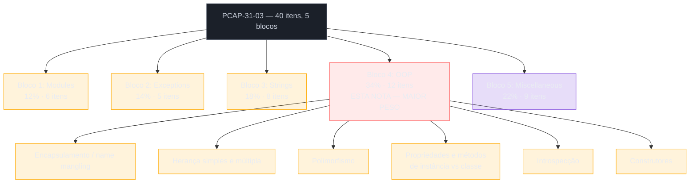
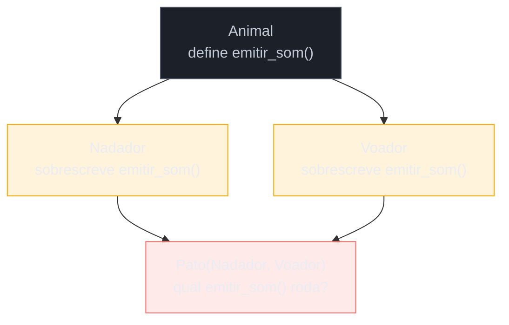

# PCAP — orientação a objetos, o bloco de maior peso

> [!abstract] TL;DR
> O bloco 4 do **PCAP-31-03** — **Object-Oriented Programming** — sozinho vale **34% da prova** (12 dos 40 itens), mais que os três blocos anteriores somados ([[03 - PCAP — módulos, exceções e strings|Modules 12% + Exceptions 14% + Strings 18% = 44%]] contra os 34% deste bloco isolado — a comparação mostra a concentração: nenhum outro bloco individual chega perto). O syllabus cobre seis frentes — encapsulamento/name mangling, herança (simples e múltipla), polimorfismo, propriedades e métodos de instância vs. classe, introspecção, e construtores — e todas já foram ensinadas em profundidade no [[03-Dominios/Tecnologia/Python/OO e Data Model/index|Galho 3 (OO e Data Model)]]. Esta nota não reexplica nada: mapeia cada item do syllabus à nota-fonte exata, com ênfase nas pegadinhas que a Python Institute mais testa — MRO em diamante, `__init__` que não roda sozinho sob herança sem `super()`, atributo de classe mutável compartilhado, e a diferença de comportamento entre `_nome` (convenção) e `__nome` (name mangling real). Por ser o bloco de maior peso do exame, esta é a nota mais longa do galho.

## Como este bloco se encaixa na prova

O PCAP-31-03 tem 40 itens em 5 blocos, nota de corte 70% cumulativo. As três primeiras seções ([[03 - PCAP — módulos, exceções e strings|nota 03]]) já cobriram Modules and Packages, Exceptions e Strings — 44% da prova, "espalhados" em blocos de peso moderado. Este bloco 4, sozinho, concentra 34% num único tema: orientação a objetos. Depois dele, a [[05 - PCAP — miscellaneous, comprehensions, lambdas, closures e arquivos|nota 05]] fecha com Miscellaneous (22%).



> [!tip] Por que este bloco pesa tanto
> A Python Institute organiza o PCAP-31-03 assumindo que quem chega até aqui já domina módulos, exceções e strings de nível PCEP — o que sobra de "diferencial associado" é justamente a capacidade de desenhar e ler classes. Não é acidente que OOP seja o bloco isolado de maior peso: é o critério que separa "sabe escrever scripts" de "sabe estruturar um programa Python de tamanho médio". Na prática de estudo, isso significa que revisar este bloco rende mais pontos por hora investida do que qualquer outro — vale ler as quatro notas-fonte do Galho 3 ([[03-Dominios/Tecnologia/Python/OO e Data Model/01 - Classes — definição, atributos e métodos|01]], [[03-Dominios/Tecnologia/Python/OO e Data Model/02 - Herança e MRO|02]], [[03-Dominios/Tecnologia/Python/OO e Data Model/03 - O Data Model — dunder methods essenciais|03]], [[03-Dominios/Tecnologia/Python/OO e Data Model/04 - Properties e encapsulamento|04]]) de novo antes de tentar o simulado no fim desta nota.

## Tabela-mestra: os 12 itens do bloco 4

| Item do syllabus | Nota-fonte (Galho 3) | Cobertura nesta nota |
|---|---|---|
| Encapsulamento — o que é, `_nome` como convenção | [[03-Dominios/Tecnologia/Python/OO e Data Model/04 - Properties e encapsulamento#`_nome` convenção social não imposição\|04 — `_nome`]] | [[#Encapsulamento — `_nome` convenção `__nome` mecanismo real]] |
| Name mangling (`__nome` → `_Classe__nome`) | [[03-Dominios/Tecnologia/Python/OO e Data Model/04 - Properties e encapsulamento#`__nome` name mangling é mecanismo real, mas não é sobre privacidade\|04 — name mangling]] | [[#Encapsulamento — `_nome` convenção `__nome` mecanismo real]] |
| Herança — sintaxe, `class Filha(Mae)` | [[03-Dominios/Tecnologia/Python/OO e Data Model/02 - Herança e MRO#O que é\|02 — O que é]] | [[#Herança simples herança múltipla e a MRO]] |
| Herança única vs. herança múltipla | [[03-Dominios/Tecnologia/Python/OO e Data Model/02 - Herança e MRO#Herança múltipla o que Python permite que Java não permite\|02 — Herança múltipla]] | [[#Herança simples herança múltipla e a MRO]] |
| MRO e o diamond problem | [[03-Dominios/Tecnologia/Python/OO e Data Model/02 - Herança e MRO#C3 linearization o algoritmo por trás da MRO\|02 — C3 linearization]] | [[#Herança simples herança múltipla e a MRO]] |
| `super()` e encadeamento cooperativo | [[03-Dominios/Tecnologia/Python/OO e Data Model/02 - Herança e MRO#`super()` o que ele realmente faz\|02 — super()]] | [[#Construtores `__init__` e encadeamento via `super`]] |
| Polimorfismo — override e Data Model | [[03-Dominios/Tecnologia/Python/OO e Data Model/02 - Herança e MRO#O que é\|02]] + [[03-Dominios/Tecnologia/Python/OO e Data Model/03 - O Data Model — dunder methods essenciais#O que é\|03 — Data Model]] | [[#Polimorfismo — override e a forma idiomática via dunders]] |
| Propriedades de instância vs. de classe | [[03-Dominios/Tecnologia/Python/OO e Data Model/01 - Classes — definição, atributos e métodos#Atributos de instância vs atributos de classe\|01 — Atributos]] | [[#Atributos e métodos de instância vs de classe]] |
| Métodos de instância, `@classmethod`, `@staticmethod` | [[03-Dominios/Tecnologia/Python/OO e Data Model/01 - Classes — definição, atributos e métodos#Comparando os três tipos de método\|01 — Três tipos de método]] | [[#Atributos e métodos de instância vs de classe]] |
| Introspecção — `isinstance()`, `issubclass()`, `type()`, `__class__` | [[03-Dominios/Tecnologia/Python/OO e Data Model/02 - Herança e MRO#`isinstance()` e `issubclass()` por que preferir a checagem de hierarquia\|02 — isinstance/issubclass]] | [[#Introspecção `isinstance` `issubclass` `type` e `__class__`]] |
| Construtores — `__init__` | [[03-Dominios/Tecnologia/Python/OO e Data Model/01 - Classes — definição, atributos e métodos#`__init__` inicializa `__new__` constrói introdução\|01 — __init__ vs __new__]] | [[#Construtores `__init__` e encadeamento via `super`]] |
| Encadeamento de construtores em herança | [[03-Dominios/Tecnologia/Python/OO e Data Model/02 - Herança e MRO#`super()` o que ele realmente faz\|02 — super() em __init__]] | [[#Construtores `__init__` e encadeamento via `super`]] |

> [!question]- Por que a contagem chega a 12 itens se a tabela lista menos linhas de tópico?
> Porque o syllabus oficial da Python Institute enumera alguns subitens separadamente que esta nota agrupa por afinidade temática (por exemplo, "herança única" e "herança múltipla" contam como itens distintos no documento oficial, mas são tratados juntos aqui porque a nota-fonte do Galho 3 já os apresenta como uma progressão única). O agrupamento por afinidade não muda a cobertura — cada célula da tabela acima resolve pelo menos um item do syllabus oficial.

## Encapsulamento — `_nome` convenção, `__nome` mecanismo real

O syllabus testa duas coisas distintas sob "encapsulamento", e a prova adora explorar exatamente a diferença entre elas. `_nome` (um underscore) é **pura convenção social** — o interpretador não faz absolutamente nada com esse nome além de tratá-lo como um atributo comum; `obj._nome` funciona de fora da classe sem erro nenhum, sem aviso, sem restrição. `__nome` (dois underscores iniciais, no máximo um final) aciona **name mangling**: o interpretador reescreve textualmente `__nome` para `_Classe__nome` durante a compilação do corpo da classe — um mecanismo real, mas cujo propósito documentado é evitar colisão de nomes em herança, não impor privacidade.

```python
class Conta:
    def __init__(self, saldo):
        self._saldo = saldo      # convenção — nada impede acesso externo
        self.__pin = "1234"       # vira self._Conta__pin

    def mostrar_pin(self):
        return self.__pin          # resolve para self._Conta__pin, funciona normal


c = Conta(100)
print(c._saldo)              # 100 — funciona, Python não reclama
print(c.mostrar_pin())        # 1234 — funciona de dentro da classe
print(c.__pin)                 # AttributeError! __pin não existe com esse nome exato
print(c._Conta__pin)            # 1234 — o nome mangled continua acessível
```

> [!warning] Name mangling não é privacidade — é proteção contra colisão em herança
> A prova costuma testar isso com uma pergunta do tipo "o que este código imprime" envolvendo `obj.__atributo` acessado de fora da classe — a resposta certa é `AttributeError`, não o valor. Mas a pergunta seguinte, mais traiçoeira, costuma pedir o valor via `obj._Classe__atributo` (o nome mangled), testando se o candidato entende que o mecanismo **reescreve o nome**, não bloqueia o acesso. Ver detalhamento completo, com o exemplo canônico `Mapeamento`/`SubMapeamento` da documentação oficial, em [[03-Dominios/Tecnologia/Python/OO e Data Model/04 - Properties e encapsulamento#`__nome` name mangling é mecanismo real, mas não é sobre privacidade|04 — name mangling]].

> [!question]- Name mangling acontece com um único underscore no final também?
> Não — o padrão documentado é "pelo menos dois underscores iniciais, **no máximo um** underscore final". `__nome` (zero ou um underscore final) aciona mangling; `__nome__` (dois underscores em cada ponta, o padrão dos dunders como `__init__`, `__repr__`) está explicitamente **isento** do mangling — é assim que o Data Model consegue usar `__eq__`, `__len__`, `__iter__` como nomes reservados sem que cada classe os reescreva de forma diferente. Confundir "dunder" (`__nome__`, sem mangling, reservado pela linguagem) com "name-mangled" (`__nome`, com mangling, específico da classe) é um erro comum — e exatamente o tipo de nuance que separa quem decorou a regra de quem entendeu o mecanismo.

## Herança simples, herança múltipla e a MRO

Herança simples (`class Cachorro(Animal)`) funciona como em qualquer linguagem OO — a subclasse herda atributos e métodos, e pode sobrescrever (*override*) qualquer um deles. A diferença estrutural que a prova cobra pesado é a **herança múltipla real**: Python permite `class C(A, B)` com `A` e `B` sendo duas classes concretas, com estado e implementação — algo que Java/C# proíbem (só permitem múltipla herança de interfaces). Isso reabre o **diamond problem**: duas classes-mãe com um ancestral comum, ambas sobrescrevendo o mesmo método.



Python resolve a ambiguidade de forma determinística com o algoritmo **C3 linearization**, que produz a **MRO** (Method Resolution Order) — consultável via `Classe.__mro__` ou `Classe.mro()`. A regra prática mais testável: **a ordem declarada das classes-mãe é o primeiro critério** que a MRO respeita.

```python
class A:
    def cumprimentar(self):
        return "Olá de A"


class B:
    def cumprimentar(self):
        return "Olá de B"


class C(A, B):
    pass


print(C().cumprimentar())     # "Olá de A" — A vem primeiro na declaração
print(C.__mro__)
# (<class 'C'>, <class 'A'>, <class 'B'>, <class 'object'>)
```

> [!question]- "O que este código imprime" clássico de MRO em diamante
> ```python
> class Base:
>     def falar(self):
>         return "Base"
>
> class Esquerda(Base):
>     def falar(self):
>         return "Esquerda -> " + super().falar()
>
> class Direita(Base):
>     def falar(self):
>         return "Direita -> " + super().falar()
>
> class Filha(Esquerda, Direita):
>     pass
>
> print(Filha().falar())
> ```
> Resposta: `"Esquerda -> Direita -> Base"`. A MRO de `Filha` é `Filha → Esquerda → Direita → Base → object` (C3 linearization: preserva a ordem declarada `(Esquerda, Direita)` e insere `Base` só depois de **ambas**, nunca duplicada). `Filha().falar()` não existe em `Filha`, sobe para `Esquerda.falar()`, que chama `super().falar()` — e `super()` aqui **não** é "o pai de `Esquerda`" (que seria só `Base`, isoladamente) — é "o próximo na MRO de `Filha`", que é `Direita`. `Direita.falar()` roda, chama `super().falar()` de novo — agora sim chega em `Base`. Esse é o padrão de questão mais citado sobre diamond problem: quem espera `super()` "pular direto pro avô" erra, porque `super()` segue a MRO linearizada da instância concreta, não a hierarquia declarada isoladamente em cada classe. Ver a explicação completa do mecanismo em [[03-Dominios/Tecnologia/Python/OO e Data Model/02 - Herança e MRO#`super()` o que ele realmente faz\|02 — super()]].

> [!warning] `TypeError: Cannot create a consistent MRO` — quando a prova testa hierarquias inválidas
> Se duas bases declaram ordens conflitantes entre si (`class A(X, Y)` e `class B(Y, X)`, seguido de `class Z(A, B)`), o C3 linearization **falha explicitamente** em tempo de **definição da classe** — não em tempo de chamada de método. A prova pode apresentar esse cenário perguntando "o que acontece ao executar este código" — a resposta certa é a exceção no momento em que `class Z(A, B):` é processado, não um comportamento silenciosamente arbitrário.

## Polimorfismo — override e a forma idiomática via dunders

O syllabus trata polimorfismo de forma ampla, e a prova cobra duas manifestações dele que a trilha já ensinou separadamente:

1. **Override clássico via herança** — uma subclasse redefine um método já existente na superclasse, e o objeto "certo" responde de acordo com seu tipo real em tempo de execução, não com o tipo declarado da variável que o referencia.
2. **Polimorfismo via Data Model** — a forma mais idiomática e mais "pythônica" de polimorfismo: qualquer classe que implemente os dunders certos (`__len__`, `__eq__`, `__iter__`, `__add__`...) participa das mesmas operações de linguagem (`len()`, `==`, `for`, `+`) que os tipos nativos, **sem herdar de uma interface comum** — é o oposto de Java, onde polimorfismo depende de `implements`/`extends` declarados explicitamente.

```python
class Forma:
    def area(self):
        raise NotImplementedError


class Quadrado(Forma):
    def __init__(self, lado):
        self.lado = lado

    def area(self):
        return self.lado ** 2


class Circulo(Forma):
    def __init__(self, raio):
        self.raio = raio

    def area(self):
        return 3.14159 * self.raio ** 2


formas = [Quadrado(4), Circulo(3)]
for forma in formas:
    print(forma.area())      # 16, depois 28.27... — mesmo código, comportamento por tipo real
```

```python
# Polimorfismo via Data Model: nenhuma das duas classes herda de nada em comum,
# mas ambas participam de len() porque implementam __len__
class Fila:
    def __init__(self):
        self._itens = []

    def __len__(self):
        return len(self._itens)


class Pilha:
    def __init__(self):
        self._itens = []

    def __len__(self):
        return len(self._itens)


for estrutura in [Fila(), Pilha()]:
    print(len(estrutura))     # 0, 0 — len() funciona igual, sem hierarquia comum
```

> [!tip] Como a prova formula "polimorfismo" — e como reconhecer a pergunta
> A Python Institute costuma apresentar polimorfismo com um laço `for` percorrendo uma lista de instâncias de subclasses diferentes, todas chamando o mesmo método sobrescrito — pedindo pra prever a sequência de saídas na ordem certa. É essencialmente o mesmo formato do exemplo `Forma`/`Quadrado`/`Circulo` acima. Menos comum, mas também testável, é reconhecer polimorfismo via dunder — por exemplo, perguntar "por que `len(fila)` funciona mesmo sem `Fila` herdar de `list`" — a resposta correta aponta para o Data Model, não para herança. Ver o tratamento completo do Data Model, incluindo o exemplo canônico `FrenchDeck` de *Python Fluente*, em [[03-Dominios/Tecnologia/Python/OO e Data Model/03 - O Data Model — dunder methods essenciais#O que é\|03 — Data Model]].

## Atributos e métodos de instância vs. de classe

Essa distinção é uma das mais testadas do bloco inteiro, porque tem um caso de borda genuinamente perigoso: **atributo de classe mutável compartilhado**.

| | Declarado | Acesso | Compartilhamento |
|---|---|---|---|
| Atributo de instância | `self.x = valor` dentro de `__init__` (ou outro método) | `objeto.x` | um valor por instância |
| Atributo de classe | `x = valor` no corpo da classe, fora de qualquer método | `Classe.x` ou `objeto.x` (busca sobe) | um único valor, compartilhado por todas as instâncias |
| Método de instância | `def metodo(self, ...)` | `objeto.metodo()` | opera nos dados daquela instância |
| Método de classe | `@classmethod` + `def metodo(cls, ...)` | `Classe.metodo()` ou `objeto.metodo()` | opera na classe; usado para factory methods alternativos |
| Método estático | `@staticmethod` + `def metodo(...)` | `Classe.metodo()` ou `objeto.metodo()` | nem `self` nem `cls`; função agrupada por namespace |

```python
class Carrinho:
    itens = []  # ATRIBUTO DE CLASSE — um único objeto lista, compartilhado

    def adicionar(self, produto):
        self.itens.append(produto)


carrinho_ana = Carrinho()
carrinho_bia = Carrinho()

carrinho_ana.adicionar("Livro")
carrinho_bia.adicionar("Caneta")

print(carrinho_ana.itens)   # ['Livro', 'Caneta'] — Bia "vazou" pro carrinho da Ana!
print(carrinho_bia.itens)   # ['Livro', 'Caneta'] — mesmo objeto lista dos dois
```

> [!warning] Atributo de classe mutável declarado no corpo da classe é a pegadinha mais citada deste sub-item
> `itens = []` no corpo da classe (fora de `__init__`) cria **um único objeto lista**, no momento em que a classe é definida — não um valor inicial por instância. Toda instância que não tem `itens` próprio sobe a busca de atributo, encontra a lista da classe, e faz `append` **naquela mesma lista**. A correção é mover a criação do objeto mutável para dentro de `__init__`, atribuído a `self`: `self.itens = []`. A prova costuma apresentar duas ou três instâncias mutando um atributo de classe mutável em sequência, pedindo o estado final de cada uma — quem não reconhece o padrão de compartilhamento erra a contagem. Detalhamento completo, incluindo o paralelo com o argumento default mutável do Core, em [[03-Dominios/Tecnologia/Python/OO e Data Model/01 - Classes — definição, atributos e métodos#Atributos de instância vs atributos de classe\|01 — Atributos de instância vs de classe]].

```python
class Usuario:
    total_criados = 0   # atributo de classe imutável — seguro, uso intencional

    def __init__(self, nome):
        self.nome = nome
        Usuario.total_criados += 1   # nome da CLASSE, não self


Usuario("Ana")
Usuario("Bia")
print(Usuario.total_criados)   # 2
```

> [!question]- Por que `self.total_criados += 1` não incrementaria o contador de classe?
> Porque `self.total_criados += 1` é lido pelo interpretador como `self.total_criados = self.total_criados + 1` — a leitura do lado direito sobe a busca de atributo e encontra o valor em `Usuario` normalmente, mas a **escrita** do lado esquerdo é sempre em `self`, criando um novo **atributo de instância** que sombreia o de classe a partir dali (sem nunca mutar o valor compartilhado). É a mesma categoria de armadilha do `UnboundLocalError` do Core: leitura e escrita seguem caminhos de resolução diferentes. A forma correta usa o nome da classe explicitamente (`Usuario.total_criados += 1`). Esse padrão — contador de classe incrementado errado — é item recorrente de "o que este código imprime" na prova.

Sobre `@classmethod` vs `@staticmethod`, a distinção que a prova testa em código curto é: `@classmethod` recebe `cls` e é usado sobretudo para *factory methods* alternativos (respeitando herança, porque `cls` aponta para a subclasse que efetivamente chamou); `@staticmethod` não recebe nada implícito, é só uma função agrupada dentro do namespace da classe.

```python
class Pizza:
    def __init__(self, ingredientes):
        self.ingredientes = ingredientes

    @classmethod
    def margherita(cls):
        return cls(["muçarela", "tomate", "manjericão"])

    @staticmethod
    def eh_vegetariana(ingredientes):
        return "bacon" not in ingredientes and "presunto" not in ingredientes


p = Pizza.margherita()
print(p.ingredientes)                          # ['muçarela', 'tomate', 'manjericão']
print(Pizza.eh_vegetariana(p.ingredientes))    # True
```

Ver a comparação completa dos três tipos de método, com a tabela e o diagrama de decisão, em [[03-Dominios/Tecnologia/Python/OO e Data Model/01 - Classes — definição, atributos e métodos#Comparando os três tipos de método\|01 — Comparando os três tipos de método]].

## Introspecção: `isinstance()`, `issubclass()`, `type()` e `__class__`

Quatro ferramentas de introspecção que a prova testa isoladamente e em combinação:

```python
class Animal:
    pass


class Cachorro(Animal):
    pass


rex = Cachorro()

print(isinstance(rex, Animal))       # True — Cachorro é subclasse de Animal
print(isinstance(rex, Cachorro))      # True
print(type(rex) == Animal)             # False — tipo EXATO de rex é Cachorro, não Animal
print(type(rex) == Cachorro)            # True
print(rex.__class__)                     # <class '__main__.Cachorro'>
print(rex.__class__ is type(rex))         # True — __class__ e type() concordam pra instâncias comuns
print(issubclass(Cachorro, Animal))         # True
print(issubclass(Animal, Cachorro))          # False — a relação não é simétrica
```

> [!warning] `isinstance()` respeita hierarquia; `type(x) == Y` não
> `isinstance(objeto, Classe)` percorre toda a MRO do objeto, aceitando qualquer subclasse. `type(objeto) == Classe` checa o tipo **exato**, ignorando herança — quebra silenciosamente assim que uma subclasse legítima é introduzida no código. A prova costuma apresentar as duas checagens lado a lado sobre a mesma instância de uma hierarquia com pelo menos um nível de herança, pedindo pra identificar qual delas retorna `True` e qual retorna `False` — a resposta correta é sempre que `isinstance()` "enxerga mais" que `type() ==`. Ver detalhamento completo, incluindo o comportamento com herança múltipla, em [[03-Dominios/Tecnologia/Python/OO e Data Model/02 - Herança e MRO#`isinstance()` e `issubclass()` por que preferir a checagem de hierarquia\|02 — isinstance() e issubclass()]].

`isinstance()` também aceita uma tupla de tipos, testável em uma linha:

```python
print(isinstance(3.0, (int, float)))   # True — é float, um dos dois tipos da tupla
print(isinstance("3", (int, float)))    # False — string não é nem int nem float
```

> [!question]- `type(rex)` e `rex.__class__` sempre devolvem a mesma coisa?
> Na prática, para o caso comum (sem metaclasses customizadas, sem sobrescrever `__class__`), sim — `type(objeto)` e `objeto.__class__` são equivalentes. A diferença sutil, fora do escopo direto do PCAP mas útil para não estranhar código avançado, é que `__class__` é um atributo consultável e, em teoria, reatribuível (embora isso seja incomum e perigoso), enquanto `type()` é uma função que sempre reflete o tipo real do objeto em memória. Para os fins da prova, tratar os dois como equivalentes é seguro.

## Construtores: `__init__` e encadeamento via `super()`

O syllabus chama `__init__` de "construtor" — a nomenclatura comum, ainda que tecnicamente imprecisa (o construtor real é `__new__`, que cria o objeto antes de `__init__` configurá-lo; ver [[03-Dominios/Tecnologia/Python/OO e Data Model/01 - Classes — definição, atributos e métodos#`__init__` inicializa `__new__` constrói introdução\|01 — __init__ vs __new__]]). Para os fins da prova, o ponto mais testado é o **encadeamento de `__init__` em herança**.

```python
class Animal:
    def __init__(self, nome):
        self.nome = nome
        print(f"Animal.__init__ rodou para {nome}")


class Cachorro(Animal):
    def __init__(self, nome, raca):
        self.raca = raca
        print(f"Cachorro.__init__ rodou para {nome}")


c = Cachorro("Rex", "Labrador")
print(c.nome)
```

Esse código quebra: `AttributeError: 'Cachorro' object has no attribute 'nome'`. `Cachorro.__init__` sobrescreve completamente `Animal.__init__` — Python **não** chama o `__init__` da superclasse automaticamente quando a subclasse define o seu próprio. `self.nome = nome` nunca roda, porque só existe dentro de `Animal.__init__`, que nunca é invocado.

```python
class Cachorro(Animal):
    def __init__(self, nome, raca):
        super().__init__(nome)   # encadeia explicitamente — só assim Animal.__init__ roda
        self.raca = raca
        print(f"Cachorro.__init__ rodou para {nome}")


c = Cachorro("Rex", "Labrador")
# Animal.__init__ rodou para Rex
# Cachorro.__init__ rodou para Rex
print(c.nome)   # Rex — agora existe
```

> [!warning] `__init__` de uma subclasse NÃO chama automaticamente o `__init__` da superclasse
> Esta é, isoladamente, uma das pegadinhas mais citadas de todo o bloco 4. Diferente de linguagens onde o construtor da superclasse roda implicitamente antes do corpo do construtor da subclasse (Java chama o construtor sem argumentos da superclasse automaticamente, a menos que `super(...)` seja chamado explicitamente com outros argumentos), Python **não tem esse comportamento implícito de forma alguma**: se `Cachorro` define `__init__` e não chama `super().__init__(...)` (ou `Animal.__init__(self, ...)` explicitamente), o `__init__` de `Animal` simplesmente **nunca roda**. Qualquer atributo que só seria criado ali (`self.nome`, no exemplo) não existe na instância de `Cachorro`, e acessá-lo levanta `AttributeError`. A prova formula isso quase sempre como "o que este código imprime" ou "que exceção este código levanta", com uma subclasse que sobrescreve `__init__` sem chamar `super()`.

`super().__init__(...)` é preferível a `Animal.__init__(self, ...)` explícito pelos mesmos motivos já detalhados em [[03-Dominios/Tecnologia/Python/OO e Data Model/02 - Herança e MRO#`super()` o que ele realmente faz\|02 — super()]]: `super()` segue a MRO calculada dinamicamente (correto sob refatoração e herança múltipla), enquanto o nome hardcoded da superclasse quebra assim que a hierarquia muda.

```python
# Encadeamento em herança múltipla cooperativa — cada __init__ chama super().__init__()
class A:
    def __init__(self):
        print("A")
        super().__init__()


class B:
    def __init__(self):
        print("B")
        super().__init__()


class C(A, B):
    def __init__(self):
        print("C")
        super().__init__()


C()
# C
# A
# B
```

> [!question]- Por que `B` roda, se `A` não herda de `B` e não sabe que ela existe?
> Porque `super()` dentro de `A.__init__` não resolve "o pai de `A`" isoladamente — resolve "o próximo passo na MRO da instância concreta que está sendo criada". A MRO de `C` é `C → A → B → object`; quando `A.__init__` chama `super().__init__()`, o próximo elo daquela MRO específica é `B`, não `object`. Esse é o mesmo mecanismo do diamond problem tratado na seção anterior — a chave é sempre "MRO da instância", nunca "hierarquia declarada isoladamente por classe". Ver o mecanismo completo em [[03-Dominios/Tecnologia/Python/OO e Data Model/02 - Herança e MRO#`super()` o que ele realmente faz\|02 — super()]].

## Simulado rápido: 8 questões no estilo PCAP

O bloco de maior peso da prova merece mais questões de treino que os blocos anteriores. Oito questões curtas, cobrindo cada sub-item do syllabus, no estilo single-choice característico da Python Institute.

**1. (Encapsulamento)** O que este código imprime?

```python
class Cofre:
    def __init__(self, senha):
        self.__senha = senha


c = Cofre("1234")
print(c.__senha)
```

<details>
<summary>Resposta</summary>

`AttributeError: 'Cofre' object has no attribute '__senha'` — name mangling reescreveu o atributo para `_Cofre__senha` durante a definição da classe; `c.__senha` (sem o nome mangled) não existe. `c._Cofre__senha` funcionaria. Ver [[03-Dominios/Tecnologia/Python/OO e Data Model/04 - Properties e encapsulamento#`__nome` name mangling é mecanismo real, mas não é sobre privacidade|04 — name mangling]].
</details>

**2. (Herança múltipla / MRO)** Qual a MRO de `D`?

```python
class A: pass
class B(A): pass
class C(A): pass
class D(B, C): pass
```

<details>
<summary>Resposta</summary>

`D → B → C → A → object`. C3 linearization preserva a ordem declarada `(B, C)` e só insere `A` depois que ambas `B` e `C` já apareceram. Ver [[03-Dominios/Tecnologia/Python/OO e Data Model/02 - Herança e MRO#C3 linearization o algoritmo por trás da MRO|02 — C3 linearization]].
</details>

**3. (Polimorfismo)** O que este código imprime?

```python
class Ave:
    def voar(self):
        return "voo genérico"

class Pinguim(Ave):
    def voar(self):
        return "pinguins não voam"

aves = [Ave(), Pinguim()]
for a in aves:
    print(a.voar())
```

<details>
<summary>Resposta</summary>

```
voo genérico
pinguins não voam
```

Cada elemento da lista chama `voar()` de acordo com seu tipo real em tempo de execução (override clássico) — polimorfismo por herança, o formato mais comum de questão sobre este item.
</details>

**4. (Propriedades e métodos de instância vs classe)** O que este código imprime?

```python
class Contador:
    total = 0

    def __init__(self):
        Contador.total += 1

Contador()
Contador()
Contador()
print(Contador.total)
```

<details>
<summary>Resposta</summary>

`3` — `Contador.total += 1` usa o nome da classe explicitamente, incrementando de fato o atributo de classe compartilhado. Se o código usasse `self.total += 1`, o resultado seria `0` (cada instância criaria seu próprio atributo sombreando o de classe, sem nunca incrementar o original). Ver [[03-Dominios/Tecnologia/Python/OO e Data Model/01 - Classes — definição, atributos e métodos#Atributos de instância vs atributos de classe|01 — Atributos de instância vs classe]].
</details>

**5. (Introspecção)** O que estas três expressões devolvem, em ordem?

```python
class Veiculo: pass
class Carro(Veiculo): pass

c = Carro()
print(isinstance(c, Veiculo))
print(type(c) == Veiculo)
print(issubclass(Carro, Veiculo))
```

<details>
<summary>Resposta</summary>

`True`, `False`, `True` — `isinstance()` percorre a MRO e aceita a superclasse; `type(c) == Veiculo` checa o tipo exato (`Carro`, não `Veiculo`) e falha; `issubclass()` confirma a relação de herança entre as classes. Ver [[03-Dominios/Tecnologia/Python/OO e Data Model/02 - Herança e MRO#`isinstance()` e `issubclass()` por que preferir a checagem de hierarquia|02 — isinstance/issubclass]].
</details>

**6. (Construtores)** Que exceção, se alguma, este código levanta?

```python
class Base:
    def __init__(self, x):
        self.x = x

class Derivada(Base):
    def __init__(self, x, y):
        self.y = y

d = Derivada(1, 2)
print(d.x)
```

<details>
<summary>Resposta</summary>

`AttributeError: 'Derivada' object has no attribute 'x'` — `Derivada.__init__` sobrescreve `Base.__init__` sem chamar `super().__init__(x)`, então `self.x` nunca é criado. A pegadinha mais citada do item "construtores" do syllabus.
</details>

**7. (Herança múltipla cooperativa)** O que este código imprime?

```python
class Registrador:
    def __init__(self):
        print("Registrador")
        super().__init__()

class Validador:
    def __init__(self):
        print("Validador")
        super().__init__()

class Formulario(Registrador, Validador):
    def __init__(self):
        print("Formulario")
        super().__init__()

Formulario()
```

<details>
<summary>Resposta</summary>

```
Formulario
Registrador
Validador
```

Segue a MRO de `Formulario`: `Formulario → Registrador → Validador → object`. Cada `__init__` delega cooperativamente via `super()`, então os três rodam na ordem da MRO — nenhum precisa saber explicitamente da existência do próximo.
</details>

**8. (Encapsulamento)** Qual o valor impresso?

```python
class A:
    def __init__(self):
        self.__valor = 10

class B(A):
    def __init__(self):
        super().__init__()
        self.__valor = 20   # NÃO sobrescreve o __valor de A

    def mostrar(self):
        return self.__valor

b = B()
print(b.mostrar())
print(b._A__valor)
```

<details>
<summary>Resposta</summary>

`20`, depois `10` — `b.mostrar()` roda dentro de `B`, onde `self.__valor` foi reescrito para `_B__valor` (name mangling usa o nome da classe **onde o código está escrito**, não da instância) — então devolve o `20` atribuído em `B.__init__`. `b._A__valor` acessa o atributo mangled criado por `A.__init__`, que continua existindo separadamente com valor `10`. Este é o exemplo mais avançado da nota — mostra exatamente por que name mangling existe: evitar que `B` acidentalmente sobrescreva o `__valor` interno de `A`, mesmo usando o mesmo nome de atributo nas duas classes.
</details>

> [!tip] Como usar este simulado de verdade
> Assim como no simulado da nota anterior, resolva mentalmente antes de abrir a resposta — a prova real não dá acesso a um interpretador. Errar a questão 8 não é motivo de alarme: é o item mais avançado de todo o bloco, combinando name mangling com herança, e mesmo desenvolvedores experientes hesitam nele na primeira leitura. Releia [[03-Dominios/Tecnologia/Python/OO e Data Model/04 - Properties e encapsulamento#`__nome` name mangling é mecanismo real, mas não é sobre privacidade|04 — name mangling]] se ela confundiu.

## Vocabulário PT/EN

| Termo PT | Termo EN |
|---|---|
| encapsulamento | encapsulation |
| ofuscação de nome | name mangling |
| herança simples | single inheritance |
| herança múltipla | multiple inheritance |
| ordem de resolução de métodos | Method Resolution Order (MRO) |
| problema do diamante | diamond problem |
| polimorfismo | polymorphism |
| sobrescrever (um método) | to override (a method) |
| atributo de instância | instance attribute |
| atributo de classe | class attribute |
| método de instância | instance method |
| método de classe | class method |
| método estático | static method |
| introspecção | introspection |
| construtor | constructor |
| inicializador | initializer |
| encadeamento cooperativo | cooperative chaining |

## O que vem a seguir

Com o bloco de maior peso da prova mapeado — OOP, 34%, o item isolado mais cobrado do PCAP-31-03 — a [[05 - PCAP — miscellaneous, comprehensions, lambdas, closures e arquivos|nota 05]] fecha o mapeamento de blocos oficiais com Miscellaneous (22%): list comprehensions, lambdas, closures e uma introdução a file I/O, território parcialmente novo que os Galhos 2 e 4 não cobrem em profundidade suficiente para a prova.

## Veja também

- [[03-Dominios/Tecnologia/Python/Certificação (PCEP-PCAP)/index|Certificação (PCEP/PCAP)]] — MOC do galho
- [[03 - PCAP — módulos, exceções e strings|03 — PCAP: módulos, exceções e strings]] — nota anterior deste galho
- [[05 - PCAP — miscellaneous, comprehensions, lambdas, closures e arquivos|05 — PCAP: miscellaneous]] — próxima nota deste galho
- [[03-Dominios/Tecnologia/Python/OO e Data Model/index|OO e Data Model]] — MOC do Galho 3, base técnica completa deste bloco
- [[03-Dominios/Tecnologia/Python/OO e Data Model/01 - Classes — definição, atributos e métodos|OO e Data Model 01 — Classes]]
- [[03-Dominios/Tecnologia/Python/OO e Data Model/02 - Herança e MRO|OO e Data Model 02 — Herança e MRO]]
- [[03-Dominios/Tecnologia/Python/OO e Data Model/03 - O Data Model — dunder methods essenciais|OO e Data Model 03 — Data Model]]
- [[03-Dominios/Tecnologia/Python/OO e Data Model/04 - Properties e encapsulamento|OO e Data Model 04 — Properties e encapsulamento]]
- [[03-Dominios/Tecnologia/Python/index|Trilha Python]] (MOC central)

## Fontes

- Python Institute / OpenEDG. *PCAP-31-03 Exam Syllabus*. pythoninstitute.org. https://pythoninstitute.org/pcap-exam-syllabus (acessado em 2026-07-12, pesquisa registrada no roadmap deste galho — status "Live & Active")
- Python Software Foundation. *The Python Tutorial — 9. Classes*. docs.python.org, versão 3.14. https://docs.python.org/3/tutorial/classes.html (acessado em 2026-07-09, via Galho 3)
- Python Software Foundation. *The Python Tutorial — 9.3.5. Class and Instance Variables*. docs.python.org. https://docs.python.org/3/tutorial/classes.html#class-and-instance-variables (acessado em 2026-07-09, via Galho 3)
- Python Software Foundation. *The Python 2.3 Method Resolution Order*. docs.python.org. https://docs.python.org/3/howto/mro.html (acessado em 2026-07-09, via Galho 3)
- Python Software Foundation. *Built-in Functions — super(), isinstance(), issubclass()*. docs.python.org, versão 3.14. https://docs.python.org/3/library/functions.html (acessado em 2026-07-09, via Galho 3)
- Python Software Foundation. *Data Model*. docs.python.org, versão 3.14. https://docs.python.org/3/reference/datamodel.html (acessado em 2026-07-09, via Galho 3)
- Ramalho, L. *Fluent Python*, 2ª ed. — Capítulos 1 (Data Model), 9 (A Pythonic Object), e capítulos sobre herança múltipla. O'Reilly Media, 2022.
- Hettinger, R. *Python's super() considered super!*. Deep Thoughts by Raymond Hettinger. https://rhettinger.wordpress.com/2011/05/26/super-considered-super/ (acessado em 2026-07-09, via Galho 3)
