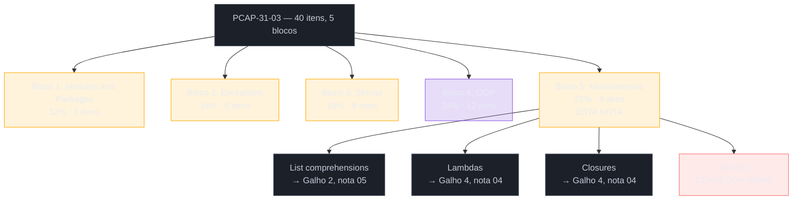
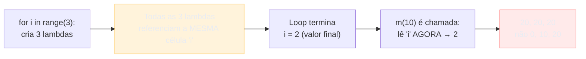
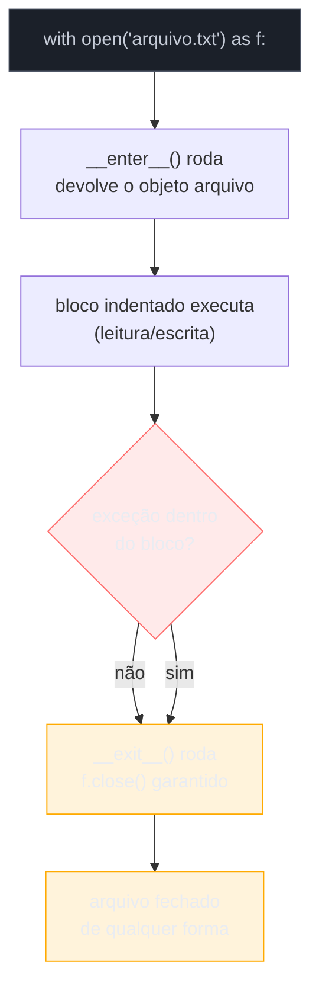

# PCAP — miscellaneous, comprehensions, lambdas, closures e arquivos

> [!abstract] TL;DR
> O quinto e último bloco do **PCAP-31-03**, batizado genericamente de **Miscellaneous**, vale 22% da prova (9 itens) — o segundo maior peso depois de OOP. Apesar do nome vago, o syllabus é preciso sobre o que cobra: **list comprehensions** (revisão dirigida da nota [[03-Dominios/Tecnologia/Python/Collections e Comprehensions/05 - Comprehensions — list, dict, set e generator expressions|05 do Galho 2]]), **lambdas** e **closures** (revisão mais rasa do que o Galho 4 ensinou, focada no que aparece em prova de múltipla escolha) e **operações com arquivos** — que é a única fatia genuinamente nova desta nota, porque nenhuma nota dos Galhos 1-6 tratou `open()`, modos de abertura e leitura/escrita de arquivo em profundidade. Esta nota fecha o mapeamento do PCAP-31-03 inteiro: depois dela, os cinco blocos oficiais (Modules 12%, Exceptions 14%, Strings 18%, OOP 34%, Miscellaneous 22%) estão todos cobertos.

## Como este bloco se encaixa na prova

O PCAP-31-03 soma 40 itens em 5 blocos, nota de corte 70% cumulativo. Miscellaneous é o bloco que fecha o syllabus — na ordem oficial ele vem depois de Object-Oriented Programming, mas nada obriga a estudar nessa ordem, e como esta nota reaproveita conteúdo já ensinado nos Galhos 2 e 4, faz sentido revisá-la logo após a [[04 - PCAP — orientação a objetos, o bloco de maior peso|nota 04]].



| Item do syllabus | Peso relativo dentro do bloco | Nota-fonte |
|---|---|---|
| List comprehensions | revisão dirigida | [[03-Dominios/Tecnologia/Python/Collections e Comprehensions/05 - Comprehensions — list, dict, set e generator expressions\|Collections 05]] |
| Lambdas: sintaxe, `sorted(key=)`, `map()`, `filter()` | revisão dirigida | [[03-Dominios/Tecnologia/Python/Funcional e idiomas avançados/04 - Closures de verdade\|Funcional 04]] (lambdas aparecem ali como exemplo central) |
| Closures | revisão dirigida (mais rasa que a nota-fonte) | [[03-Dominios/Tecnologia/Python/Funcional e idiomas avançados/04 - Closures de verdade\|Funcional 04]] |
| Operações com arquivos: `open()`, modos, leitura, escrita | conteúdo novo, ver seção dedicada abaixo | — |

> [!tip] Onde investir o tempo de revisão neste bloco
> As três primeiras linhas da tabela — comprehensions, lambdas, closures — já foram ensinadas com profundidade nos Galhos 2 e 4; revisá-las aqui é reconhecer o subconjunto que a prova de fato testa, sem reler as notas inteiras. A parte de arquivos é onde vale investir tempo novo: é o único pedaço deste bloco (e um dos poucos de todo o PCAP-31-03) que a trilha ainda não tinha coberto.

## List comprehensions — revisão dirigida

A nota [[03-Dominios/Tecnologia/Python/Collections e Comprehensions/05 - Comprehensions — list, dict, set e generator expressions|05 do Galho 2]] cobre list, dict, set comprehension e generator expression em profundidade — performance, PEPs de origem, comprehensions aninhadas, as duas formas de `if`. O PCAP-31-03 testa um subconjunto bem mais estreito: só **list comprehension**, sem dict/set/generator, e num nível de sintaxe pura, não de otimização de bytecode.

```python
# Sintaxe básica: [expressao for item in iteravel]
quadrados = [x**2 for x in range(5)]
print(quadrados)
# [0, 1, 4, 9, 16]

# Com filtro: [expressao for item in iteravel if condicao]
pares = [x for x in range(10) if x % 2 == 0]
print(pares)
# [0, 2, 4, 6, 8]

# Comprehension aninhada: achatando uma lista de listas
matriz = [[1, 2], [3, 4], [5, 6]]
achatada = [x for linha in matriz for x in linha]
print(achatada)
# [1, 2, 3, 4, 5, 6]
```

Os três pontos que a Python Institute mais gosta de testar dentro deste sub-item, todos já detalhados na nota-fonte:

1. **A posição do `for` no meio, não no início** — quem lê comprehension pela primeira vez tende a esperar `for x in range(5): x**2`, mas a ordem correta é expressão → `for` → `if` opcional. Ver [[03-Dominios/Tecnologia/Python/Collections e Comprehensions/05 - Comprehensions — list, dict, set e generator expressions#Anatomia de uma comprehension|Collections 05 — Anatomia]].
2. **`if` sozinho no fim filtra; `if...else` no início é ternário.** É o ponto mais cobrado do bloco inteiro de comprehensions em qualquer prova da Python Institute — ver [[03-Dominios/Tecnologia/Python/Collections e Comprehensions/05 - Comprehensions — list, dict, set e generator expressions#O condicional dentro if...else no início muda o jogo|Collections 05 — if...else]].
3. **Comprehension aninhada com dois `for`** achata; comprehension *dentro* de outra comprehension cria uma nova estrutura (ex.: transposição de matriz). São construções sintaticamente parecidas mas semanticamente diferentes — ver [[03-Dominios/Tecnologia/Python/Collections e Comprehensions/05 - Comprehensions — list, dict, set e generator expressions#Comprehensions aninhadas — achatando listas de listas|Collections 05 — aninhadas]].

> [!question]- A prova cobra dict/set comprehension ou generator expression?
> O syllabus oficial do PCAP-31-03 lista o item como "list comprehensions" especificamente, sem mencionar dict/set/generator expression por nome nesse bloco. Isso não significa que valha ignorá-las por completo — a distinção `[]`/`{}`/`()` pode aparecer de raspão numa questão sobre outra coisa —, mas o foco declarado de estudo, se o tempo for curto, deve ser list comprehension: sintaxe, filtro, aninhamento.

## Lambdas — revisão dirigida

A palavra-chave `lambda` cria uma **função anônima** — uma função sem nome, definida inline, restrita a uma única expressão (sem `return` explícito, sem múltiplas instruções, sem anotações de tipo no PCAP). A sintaxe:

```python
lambda argumentos: expressao
```

```python
dobro = lambda x: x * 2
print(dobro(5))
# 10

soma = lambda a, b: a + b
print(soma(3, 4))
# 7

# Lambda sem argumentos
sempre_dez = lambda: 10
print(sempre_dez())
# 10
```

Uma lambda é equivalente, em comportamento, a uma função `def` de uma linha — a diferença é só sintática (sem nome, sem `return`, corpo limitado a uma expressão):

```python
# Equivalentes
def dobro_def(x):
    return x * 2

dobro_lambda = lambda x: x * 2
```

O uso que a prova mais testa não é atribuir a lambda a uma variável (isso raramente é idiomático em produção) — é passar a lambda **inline**, como argumento de outra função, principalmente `sorted(key=)`, `map()` e `filter()`:

```python
pessoas = [("Ana", 30), ("Bruno", 25), ("Carla", 35)]

# sorted(key=): a lambda extrai o critério de ordenação
por_idade = sorted(pessoas, key=lambda p: p[1])
print(por_idade)
# [('Bruno', 25), ('Ana', 30), ('Carla', 35)]

# map(): aplica a lambda a cada item, devolve um objeto map (iterável preguiçoso)
numeros = [1, 2, 3, 4]
dobrados = list(map(lambda x: x * 2, numeros))
print(dobrados)
# [2, 4, 6, 8]

# filter(): mantém só os itens em que a lambda devolve valor truthy
pares = list(filter(lambda x: x % 2 == 0, numeros))
print(pares)
# [2, 4]
```

> [!warning] `map()` e `filter()` devolvem iteradores, não listas
> `map(lambda x: x * 2, numeros)` não devolve uma lista pronta — devolve um objeto `map`, que é um **iterador**: preguiçoso, de uso único, e que só produz valores quando alguém itera sobre ele (`for`, `list()`, `next()`). Esquecer de envolver em `list(...)` é um erro comum de quem espera o retorno de `map()`/`filter()` já materializado, e é testável como "o que este código imprime": `print(map(lambda x: x*2, [1,2,3]))` imprime algo como `<map object at 0x...>`, não `[2, 4, 6]`.

> [!question]- Por que a comunidade Python geralmente prefere comprehension a `map()`/`filter()` com lambda?
> Porque `[x * 2 for x in numeros]` é considerado mais idiomático (mais "Pythonic") do que `list(map(lambda x: x * 2, numeros))` para o mesmo resultado — integra a transformação numa sintaxe só, sem precisar de uma lambda extra nem de envolver o resultado em `list()`. Isso não torna `map()`/`filter()` obsoletos: eles continuam relevantes quando já existe uma função **nomeada** pronta para reaproveitar (`map(str.upper, palavras)`, sem lambda nenhuma) ou em pipelines funcionais explícitos, onde encadear pequenas transformações lidas da esquerda pra direita é mais claro do que uma comprehension densa. A prova, no entanto, não pune uma forma em favor da outra — ela testa se você entende o comportamento das três (comprehension, `map`, `filter`) igualmente bem, porque as três aparecem em código legado e em exemplos de livro-texto.

Uma lambda pode capturar variáveis do escopo em que foi criada — exatamente o mecanismo de closure discutido na próxima seção — e é justamente essa combinação (lambda + captura de variável de loop) que produz a armadilha mais citada de toda a Python Institute neste bloco, coberta a seguir.

## Closures — revisão dirigida, mais rasa que o Galho 4

A nota [[03-Dominios/Tecnologia/Python/Funcional e idiomas avançados/04 - Closures de verdade|04 do Galho 4]] trata closures em profundidade — o que exatamente é guardado (uma referência à célula de memória, não o valor), `nonlocal`, factory functions, a comparação com Java, as três formas idiomáticas de consertar a armadilha do loop. O PCAP-31-03 testa uma fatia bem mais estreita: **o conceito básico** de que uma função interna pode "lembrar" de uma variável do escopo que a envolve, e **um** padrão de pegadinha — a armadilha de closures criadas dentro de um `for`.

```python
def fazer_multiplicador(fator):
    def multiplicar(numero):
        return numero * fator   # 'fator' é capturado do escopo externo
    return multiplicar

dobrar = fazer_multiplicador(2)
triplicar = fazer_multiplicador(3)

print(dobrar(5))       # 10
print(triplicar(5))    # 15
```

`multiplicar` é uma **closure**: ela referencia `fator`, uma variável que não é parâmetro nem atribuição local sua, mas do escopo de `fazer_multiplicador` que a envolve (o nível **Enclosing** do LEGB, já visto no Galho 1). Mesmo depois de `fazer_multiplicador(2)` terminar de executar, `dobrar` continua enxergando `fator = 2` — é isso que torna `dobrar` e `triplicar` duas funções independentes, cada uma com seu próprio valor de `fator` "grudado".

O nível de profundidade que o PCAP realmente cobra para de existir aqui — não é esperado que o candidato explique células de memória, `__closure__`, `co_freevars` ou `nonlocal` em detalhe (tudo isso é conteúdo do Galho 4, além do escopo da prova). O que é testável, e aparece com frequência em formato "o que este código imprime", é a armadilha de late binding em loops:

```python
multiplicadores = []
for i in range(3):
    multiplicadores.append(lambda x: x * i)

for m in multiplicadores:
    print(m(10))
```

A saída, contraintuitivamente, não é `0`, `10`, `20` — é:

```text
20
20
20
```

Todas as três lambdas compartilham a **mesma** variável `i`, e só consultam o valor dela no momento em que são *chamadas*, não no momento em que foram *criadas*. Como o `for` já terminou (com `i = 2`) quando `m(10)` é invocado pela primeira vez, as três lambdas enxergam `i = 2` — daí `2 * 10 = 20` nas três chamadas. O tratamento completo desse mecanismo (por que se chama late binding, por que não é um bug do interpretador, as formas idiomáticas de consertar) está em [[03-Dominios/Tecnologia/Python/Funcional e idiomas avançados/04 - Closures de verdade#O bug que abre esta nota|Funcional 04 — O bug que abre esta nota]]. Para os fins da prova, basta reconhecer o padrão e saber prever a saída.

> [!tip] O conserto mais citado, resumido em uma linha
> Um parâmetro default captura o valor **no momento em que a função é definida**, não em que é chamada — por isso `lambda x, i=i: x * i` (repetindo o nome do parâmetro) corrige a armadilha: `i=i` congela o valor de `i` daquela iteração específica, em vez de deixar a lambda continuar referenciando a variável compartilhada do loop.



## File I/O — conteúdo novo

Nenhuma nota dos Galhos 1-6 tratou operações de arquivo em profundidade — a trilha usou `open()` pontualmente em exemplos ao longo do caminho, mas nunca parou para explicar modos de abertura, os métodos de leitura/escrita, ou o motivo de `with` ser a forma recomendada. Como o syllabus do PCAP-31-03 cita este item nominalmente, esta seção fecha a lacuna do zero.

### `open()` e os modos de abertura

`open(caminho, modo)` devolve um objeto arquivo (file object), a partir do qual se lê ou escreve. O segundo argumento, o **modo**, controla tanto a operação permitida quanto o formato de leitura/escrita:

| Modo | Significado | Comportamento se o arquivo já existe / não existe |
|---|---|---|
| `'r'` | leitura (read) — **padrão** se omitido | existe: abre normalmente; não existe: `FileNotFoundError` |
| `'w'` | escrita (write) | existe: **trunca** (apaga todo o conteúdo antes de escrever); não existe: cria |
| `'a'` | anexação (append) | existe: escreve a partir do fim, preservando o conteúdo; não existe: cria |
| `'x'` | criação exclusiva (exclusive creation) | existe: `FileExistsError`; não existe: cria |
| `'r+'` | leitura **e** escrita | existe: abre sem truncar; não existe: `FileNotFoundError` |
| `'rb'`, `'wb'`, `'ab'` | qualquer um dos anteriores, em modo **binário** (bytes, não str) | mesmo comportamento de existência, mas lê/escreve `bytes`, não `str` |

```python
# Leitura de texto (modo padrão, equivalente a 'rt')
arquivo = open("dados.txt", "r")

# Escrita, truncando o conteúdo anterior
arquivo = open("saida.txt", "w")

# Anexação — preserva o que já existe, escreve a partir do fim
arquivo = open("log.txt", "a")

# Leitura em binário — devolve bytes, não str
arquivo = open("imagem.png", "rb")
```

> [!warning] `'w'` apaga o conteúdo existente ao abrir, não ao escrever
> `open("arquivo.txt", "w")` já trunca o arquivo para zero bytes **no momento em que é chamado** — antes mesmo de qualquer `.write()` acontecer. Abrir em modo `'w'` e nunca chamar `.write()` ainda assim deixa o arquivo vazio. Essa é uma pegadinha clássica de prova: "o que acontece se você abrir um arquivo existente em modo `'w'` e fechar sem escrever nada?" — resposta: o arquivo fica vazio, o conteúdo anterior já foi descartado.

### Lendo um arquivo: `.read()`, `.readline()`, `.readlines()`, iteração direta

```python
# .read() — devolve o conteúdo INTEIRO como uma única string
with open("dados.txt", "r") as f:
    conteudo = f.read()
    print(conteudo)   # string com todo o arquivo, incluindo quebras de linha '\n'

# .readline() — devolve UMA linha por vez, incluindo o '\n' no final
with open("dados.txt", "r") as f:
    primeira_linha = f.readline()
    segunda_linha = f.readline()

# .readlines() — devolve uma LISTA de strings, uma por linha
with open("dados.txt", "r") as f:
    linhas = f.readlines()
    print(linhas)   # ['linha1\n', 'linha2\n', 'linha3\n']

# Iterar diretamente sobre o objeto arquivo — forma mais idiomática
with open("dados.txt", "r") as f:
    for linha in f:
        print(linha.strip())   # .strip() remove o '\n' final de cada linha
```

> [!question]- Qual a diferença real entre `.readlines()` e iterar direto com `for linha in f`?
> `.readlines()` carrega o arquivo **inteiro** na memória de uma vez, como uma lista de strings — para um arquivo de alguns megabytes isso é irrelevante, mas para um arquivo de gigabytes é o mesmo problema de memória já visto na comparação entre list comprehension e generator expression. Iterar diretamente sobre o objeto arquivo (`for linha in f:`) lê **uma linha por vez**, sob demanda, sem nunca materializar o arquivo inteiro na memória — é a versão "arquivo" do mesmo princípio de avaliação preguiçosa. Para provas e exercícios pequenos a diferença não importa; a prova costuma testar isso como conhecimento teórico ("qual das opções consome menos memória para um arquivo grande"), não como pegadinha de saída de código.

### Escrevendo em um arquivo: `.write()` e `.writelines()`

```python
# .write() — escreve uma string; NÃO adiciona '\n' automaticamente
with open("saida.txt", "w") as f:
    f.write("primeira linha\n")
    f.write("segunda linha\n")

# .writelines() — escreve uma lista de strings, sem separador automático
with open("saida.txt", "w") as f:
    f.writelines(["linha1\n", "linha2\n", "linha3\n"])
```

> [!warning] `.write()` não adiciona quebra de linha sozinho
> Diferente de `print()`, que adiciona `\n` ao final por padrão, `.write()` escreve exatamente a string passada, sem nada a mais. `f.write("a"); f.write("b")` produz o arquivo com o conteúdo `"ab"`, tudo numa linha só — quem quer linhas separadas precisa incluir `"\n"` explicitamente em cada chamada, como nos exemplos acima. O mesmo vale para `.writelines()`: ele não insere separador nenhum entre os elementos da lista, cada string precisa já vir com seu próprio `\n` se for esse o efeito desejado.

### `with open(...) as f:` — o context manager aplicado a arquivo

A forma recomendada de abrir um arquivo não é `open()`/`.close()` manual — é `with`, o mesmo protocolo de **context manager** (`__enter__`/`__exit__`) já coberto em profundidade na nota [[03-Dominios/Tecnologia/Python/Funcional e idiomas avançados/08 - Context managers via generator|08 do Galho 4]]. Aqui o objeto arquivo devolvido por `open()` já implementa esse protocolo nativamente: `__enter__` devolve o próprio objeto arquivo (por isso o `as f`), e `__exit__` chama `.close()` automaticamente — mesmo que uma exceção seja levantada dentro do bloco.

```python
# Forma manual — funciona, mas arrisca vazar o recurso
f = open("dados.txt", "r")
conteudo = f.read()
f.close()   # se uma exceção acontecer ANTES desta linha, o arquivo nunca fecha

# Forma recomendada — o 'with' garante o fechamento, mesmo com exceção
with open("dados.txt", "r") as f:
    conteudo = f.read()
# f.close() já rodou automaticamente aqui, garantido
```

```python
# A armadilha da forma manual, tornada concreta
f = open("dados.txt", "r")
resultado = 10 / 0   # ZeroDivisionError — o programa quebra ANTES de f.close()
f.close()             # esta linha nunca é alcançada: o arquivo fica aberto
```

A diferença prática entre as duas formas é exatamente a mesma razão de existir de qualquer context manager: fechar um arquivo é uma responsabilidade que **não pode depender** do fluxo normal de execução chegar até o fim — um erro no meio do bloco, um `return` antecipado dentro de uma função, ou qualquer exceção inesperada, todos pulariam a chamada manual a `.close()`, deixando o arquivo aberto (um *file descriptor* vazado, que em sistemas com limite de arquivos abertos por processo pode eventualmente causar `OSError: too many open files`). `with` resolve isso na raiz: o `__exit__` do objeto arquivo roda **sempre**, seja a saída do bloco normal ou por exceção — o mesmo mecanismo de garantia que `try`/`finally` oferece, só que embutido na sintaxe do próprio objeto.



> [!question]- `with` fecha o arquivo mesmo se eu der `return` no meio da função?
> Sim — esse é justamente o caso mais citado para preferir `with` a `open()`/`.close()` manual. Se o bloco `with` está dentro de uma função e um `return` acontece no meio do bloco, o `__exit__` do objeto arquivo ainda roda antes da função efetivamente retornar, fechando o arquivo normalmente. O mecanismo por trás disso é idêntico ao de `finally`, já visto na nota de exceções: o Python garante que a "saída" de um bloco protegido — seja por fim normal, `return`, `break`, `continue` ou exceção — sempre passa pela limpeza registrada, seja num `finally` explícito ou no `__exit__` implícito de um context manager.

### Fechamento explícito vs `with`: quando ainda se usa `.close()`

`.close()` continua existindo e sendo válido — é a forma pré-`with` (herdada de versões antigas da linguagem e de outras linguagens) e ainda aparece em código legado ou em casos onde o arquivo precisa ficar aberto por um período que não se encaixa num único bloco `with` (por exemplo, um objeto que guarda um arquivo aberto como atributo, ao longo de vários métodos). Nesses casos mais raros, o padrão correto ainda envolve `try`/`finally` para garantir o fechamento:

```python
f = open("dados.txt", "r")
try:
    conteudo = f.read()
finally:
    f.close()   # roda mesmo se f.read() levantar exceção
```

Esse `try`/`finally` manual é, na prática, exatamente o que `with` faz por baixo dos panos — por isso a prova (e a comunidade Python de forma geral) trata `with open(...) as f:` como a forma idiomática por padrão, reservando `.close()` manual para os casos em que o escopo de vida do arquivo genuinamente não cabe num bloco `with` só.

## Simulado rápido: 5 questões no estilo PCAP

**1. (Comprehension)** O que este código imprime?

```python
resultado = [x if x % 2 == 0 else -x for x in range(5)]
print(resultado)
```

<details>
<summary>Resposta</summary>

`[0, -1, 2, -3, 4]` — é um ternário (`if...else` antes do `for`), então todos os 5 elementos permanecem, cada um com um dos dois valores possíveis: pares ficam iguais, ímpares viram negativos.
</details>

**2. (Lambda)** O que `list(filter(lambda x: x > 2, [1, 2, 3, 4]))` devolve?

<details>
<summary>Resposta</summary>

`[3, 4]` — `filter()` mantém só os itens em que a lambda devolve valor truthy; `1` e `2` não satisfazem `x > 2`, então são descartados.
</details>

**3. (Closure)** O que este código imprime?

```python
funcoes = []
for i in range(3):
    funcoes.append(lambda: i)

print([f() for f in funcoes])
```

<details>
<summary>Resposta</summary>

`[2, 2, 2]` — as três lambdas compartilham a mesma variável `i` (late binding); no momento em que cada uma é chamada, `i` já vale `2`, o valor final do loop. Ver a seção de closures acima.
</details>

**4. (File I/O)** Qual o conteúdo do arquivo `saida.txt` depois deste código?

```python
with open("saida.txt", "w") as f:
    f.write("linha1")
    f.write("linha2")
```

<details>
<summary>Resposta</summary>

`"linha1linha2"`, tudo numa linha só — `.write()` não adiciona `\n` automaticamente, então as duas chamadas ficam concatenadas sem separador.
</details>

**5. (File I/O)** O que acontece ao tentar `open("nao_existe.txt", "r")`?

<details>
<summary>Resposta</summary>

`FileNotFoundError` — modo `'r'` exige que o arquivo já exista; para criar um arquivo novo seria necessário `'w'`, `'a'` ou `'x'`.
</details>

> [!tip] Como usar este simulado
> Como nos simulados das notas anteriores deste galho: tente prever a saída antes de abrir os `<details>`. A questão 3 (closures em loop) é, isoladamente, uma das perguntas mais repetidas em bancos de questão não-oficiais da Python Institute — vale garantir que o raciocínio de late binding esteja automático antes da prova.

## Vocabulário PT/EN

| Termo PT | Termo EN |
|---|---|
| função anônima | anonymous function |
| variável livre / capturada | free variable |
| vinculação tardia | late binding |
| modo de abertura (de arquivo) | file mode |
| truncar (um arquivo) | to truncate (a file) |
| anexar (a um arquivo) | to append (to a file) |
| ler linha a linha | to read line by line |
| objeto arquivo | file object |
| descritor de arquivo | file descriptor |
| fechar (um recurso) | to close (a resource) |
| gerenciador de contexto | context manager |

## O que vem a seguir

Com os cinco blocos oficiais do PCAP-31-03 mapeados (Modules 12%, Exceptions 14%, Strings 18%, OOP 34%, Miscellaneous 22% — 100% do exame), a [[06 - Armadilhas comuns e o estilo de questão da Python Institute|nota 06]] muda de eixo: em vez de percorrer blocos do syllabus, ela reúne os padrões de pegadinha que atravessam **todos** os blocos — mutação inesperada, escopo como armadilha, `is` vs `==`, argumento mutável como default — sob o ângulo específico de "como a Python Institute testa isso".

## Veja também

- [[03-Dominios/Tecnologia/Python/Certificação (PCEP-PCAP)/index|Certificação (PCEP/PCAP)]] — MOC do galho
- [[03 - PCAP — módulos, exceções e strings|03 — PCAP: módulos, exceções e strings]] — blocos 1-3 do PCAP-31-03
- [[04 - PCAP — orientação a objetos, o bloco de maior peso|04 — PCAP: orientação a objetos]] — bloco 4, maior peso do exame
- [[03-Dominios/Tecnologia/Python/Collections e Comprehensions/05 - Comprehensions — list, dict, set e generator expressions|Collections 05 — Comprehensions]] — base do sub-item de list comprehensions desta nota
- [[03-Dominios/Tecnologia/Python/Funcional e idiomas avançados/04 - Closures de verdade|Funcional 04 — Closures de verdade]] — base dos sub-itens de lambda e closures desta nota
- [[03-Dominios/Tecnologia/Python/Funcional e idiomas avançados/08 - Context managers via generator|Funcional 08 — Context managers via generator]] — protocolo `__enter__`/`__exit__` que `with open(...)` usa
- [[03-Dominios/Tecnologia/Python/Collections e Comprehensions/index|Collections e Comprehensions]] — MOC do Galho 2
- [[03-Dominios/Tecnologia/Python/Funcional e idiomas avançados/index|Funcional e idiomas avançados]] — MOC do Galho 4
- [[03-Dominios/Tecnologia/Python/index|Trilha Python]] (MOC central)

## Fontes

- Python Institute / OpenEDG. *PCAP-31-03 Exam Syllabus*. pythoninstitute.org. https://pythoninstitute.org/pcap-exam-syllabus (acessado em 2026-07-12, pesquisa registrada no roadmap deste galho — status "Live & Active")
- Python Software Foundation. *Built-in Functions — `open()`*. docs.python.org, versão 3.14. https://docs.python.org/3/library/functions.html#open (acessado em 2026-07-12)
- Python Software Foundation. *7. Input and Output — Reading and Writing Files*. docs.python.org, versão 3.14. https://docs.python.org/3/tutorial/inputoutput.html#reading-and-writing-files (acessado em 2026-07-12)
- Python Software Foundation. *Built-in Functions — `map()`, `filter()`*. docs.python.org, versão 3.14. https://docs.python.org/3/library/functions.html (acessado em 2026-07-12)
- Python Software Foundation. *8. Compound statements — Lambda*. docs.python.org, versão 3.14. https://docs.python.org/3/reference/expressions.html#lambda (acessado em 2026-07-12)
