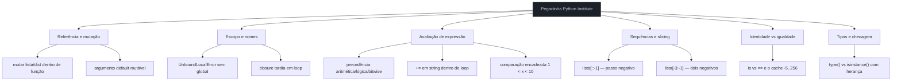
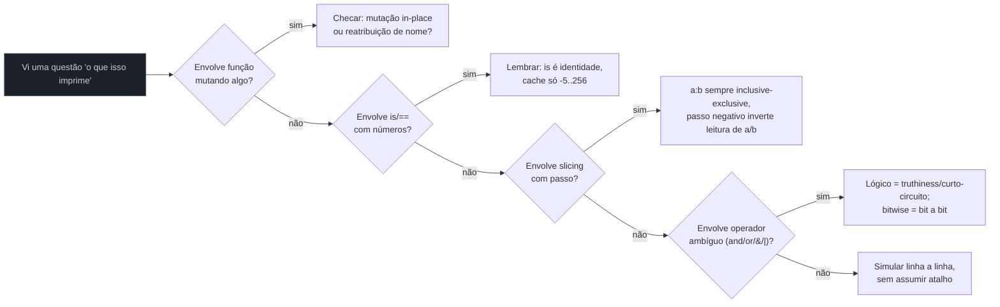

# Armadilhas comuns e o estilo de questão da Python Institute

> [!abstract] TL;DR
> As notas 02 e 03 deste galho mapearam os blocos oficiais do syllabus às notas-fonte dos Galhos 1-6. Esta nota faz outra coisa: isola o **padrão de pegadinha** que se repete de questão em questão na Python Institute, independente de qual bloco ela está testando. Toda prova PCEP/PCAP é dominada por uma pergunta: "o que este código imprime?" — e a Python Institute tem um catálogo relativamente pequeno de armadilhas que reaparecem disfarçadas em sintaxes diferentes: mutação por referência disfarçada de "só li a variável", escopo LEGB armado pra explodir com `UnboundLocalError`, precedência de operador que separa `bool` de `int` no resultado, slicing com passo negativo, o cache de inteiros pequenos do CPython fazendo `is` "funcionar por acidente", o argumento default mutável, `+=` custando O(n²) sem avisar, comparação encadeada, e `type()` vs `isinstance()` sob herança. Cada armadilha aqui é **nova** em relação às notas 02/03 (que já cobriram `else` de loop, `finally`/`return`, `find`/`index`, comparação de strings) — o objetivo é fechar o catálogo antes do simulado final da nota 08.

## Por que a Python Institute pergunta assim

Questões de múltipla escolha que testam "o que aparece na tela" são baratas de corrigir automaticamente e caras de acertar no chute — exigem simular o interpretador na cabeça, sem rodar nada. É o formato dominante nas provas PCEP-30-02 e PCAP-31-03 (confirmado nas notas 02 e 03 deste galho, syllabus oficial pythoninstitute.org). O padrão se repete porque as armadilhas exploram um número pequeno de comportamentos "não óbvios mas documentados" do Python — a mesma dezena de armadilhas reaparece vestida com nomes de variável diferentes, tipos diferentes, valores numéricos diferentes. Decorar a lista de armadilhas vale mais, ponto a ponto, do que decorar sintaxe: quem já fez os Galhos 1-6 sabe a sintaxe; o que falta é o reflexo de "opa, isso é uma das armadilhas conhecidas".



## Mutação por referência disfarçada de leitura

O erro mental mais caro em prova: olhar `def f(lista):` e assumir que, como Python "passa tudo por valor" (mito comum de quem vem de C), a função não pode afetar o chamador. Python passa **referências a objetos** — se o objeto é mutável (lista, dict, set) e a função chama um método que muta in-place (`.append()`, `.pop()`, `[chave] = valor`), o objeto original muda, porque não existe cópia nenhuma no meio do caminho. Isso já foi explicado em profundidade em [[03-Dominios/Tecnologia/Python/Core/02 - Tipos e variáveis|Core 02]] (mutabilidade) — o ângulo novo aqui é o formato exato como a prova testa isso: uma função que parece "só processar" a lista, sem `return`, e a pergunta é sobre o estado da variável **depois** da chamada.

```python
def processa(dados):
    dados.append(99)
    dados = dados + [100]   # reatribuição LOCAL — não afeta o chamador
    dados.append(101)

numeros = [1, 2, 3]
processa(numeros)
print(numeros)
```

> [!question]- O que este código imprime?
> `[1, 2, 3, 99]`. A primeira linha (`dados.append(99)`) muta o objeto original — `dados` e `numeros` apontam pra mesma lista na memória, então `.append()` afeta ambos os nomes. A segunda linha (`dados = dados + [100]`) **não** muta nada: `dados + [100]` cria uma lista *nova*, e `dados = ...` só reaponta o nome local `dados` pra essa lista nova, sem tocar no objeto que `numeros` ainda referencia. A terceira linha (`.append(101)`) muta essa lista nova, que só existe dentro da função e é descartada quando `processa` retorna. Essa mistura de mutação in-place com reatribuição no mesmo bloco de código é o formato exato que a Python Institute usa pra testar se você entende a diferença entre "mutar o objeto" e "reatribuir o nome" — ver [[03-Dominios/Tecnologia/Python/Core/02 - Tipos e variáveis|Core 02]], seção de mutabilidade e identidade.

O mesmo padrão aparece com dicionários — e a prova gosta de combinar com `.get()` pra criar uma armadilha dupla:

```python
def atualiza(cache, chave):
    valor = cache.get(chave, 0)
    valor += 1
    cache[chave] = valor

contagem = {"a": 1}
atualiza(contagem, "a")
atualiza(contagem, "b")
print(contagem)
```

> [!question]- O que este código imprime?
> `{'a': 2, 'b': 1}`. Repare que `valor += 1` opera numa variável **local** de tipo `int` (imutável) — isso não muta nada por referência, é reatribuição pura. A mutação real acontece só na linha `cache[chave] = valor`, que grava de volta no dicionário compartilhado. A pegadinha é achar que, como a função "trabalha com" `cache`, qualquer coisa dentro dela é automaticamente uma mutação — quando na verdade o que muta é só o que passa por atribuição de item (`cache[chave] = ...`) ou método mutante (`.append()`, `.update()`, `.pop()` etc.), nunca reatribuição de variável local.

## Argumento default mutável — a pegadinha clássica, com uma volta a mais

[[03-Dominios/Tecnologia/Python/Core/06 - Funções — definição, argumentos e escopo básico|Core 06]] já documenta a regra: um valor default é avaliado **uma única vez**, no momento em que a `def` é executada (não a cada chamada), e fica gravado no objeto função — se esse default é mutável, toda chamada que não passa o argumento explicitamente compartilha o **mesmo** objeto. A versão que a prova mais gosta de testar não é o exemplo isolado — é o efeito acumulado ao longo de **várias chamadas em sequência**, porque é isso que separa quem decorou a regra de quem entende o mecanismo por trás dela:

```python
def historico(item, log=[]):
    log.append(item)
    return log

a = historico("x")
b = historico("y")
c = historico("z", log=[])
d = historico("w")
print(a, b, c, d)
```

> [!question]- O que este código imprime?
> `['x', 'y', 'w'] ['x', 'y', 'w'] ['z'] ['x', 'y', 'w']`. `a`, `b` e `d` são o **mesmo objeto lista** — cada chamada que não passa `log` explicitamente reaproveita a lista default criada uma única vez quando `def historico(...)` foi executada, então os `.append()` de `a`, `b` e `d` se acumulam todos na mesma lista, e por isso os três nomes imprimem o conteúdo final idêntico (a lista mudou de baixo dos seus pés depois que `a` e `b` já tinham sido atribuídos — o valor "congelado" que você esperava nunca existiu, porque nomes de lista sempre apontam pro objeto vivo). `c` é diferente porque a chamada passou `log=[]` explicitamente, criando uma lista nova só pra essa chamada. A correção padrão — usar `None` como sentinela e criar a lista dentro do corpo da função (`if log is None: log = []`) — está detalhada no `[!warning]` de [[03-Dominios/Tecnologia/Python/Core/06 - Funções — definição, argumentos e escopo básico|Core 06]], seção "Valores default". A mesma regra vale para `dict()` e `set()` como default.

## Escopo LEGB armado pra explodir

[[03-Dominios/Tecnologia/Python/Core/06 - Funções — definição, argumentos e escopo básico|Core 06]] já explica a regra LEGB e o `UnboundLocalError` por reatribuição sem `global`. O ângulo novo desta nota é o formato de **closure tardia** dentro de loop — uma armadilha de escopo diferente, que não aparece na nota-fonte porque pertence mais à interseção entre loops e funções do que a escopo básico isolado:

```python
funcoes = []
for i in range(3):
    funcoes.append(lambda: i)

resultados = [f() for f in funcoes]
print(resultados)
```

> [!question]- O que este código imprime?
> `[2, 2, 2]`, não `[0, 1, 2]` como a intuição sugere. Cada `lambda: i` não captura o **valor** de `i` no momento em que foi criada — captura o **nome** `i`, que é resolvido no escopo envolvente (enclosing, o `E` do LEGB) só na hora em que a lambda é *chamada*, não na hora em que é *definida*. Quando o loop termina, `i` vale `2` (o último valor atribuído), e como as três lambdas compartilham a mesma variável `i` do escopo da função/módulo que as contém, todas devolvem `2`. O fix clássico é forçar a captura por valor via um argumento default (`lambda i=i: i`), porque valores default *são* avaliados no momento da definição — a mesma regra que vira pegadinha com listas mutáveis, aqui usada a favor. Essa armadilha combina escopo (LEGB) com o momento de avaliação de expressão, os dois eixos mais testados da prova.

## Precedência de operadores além da tabela decorada

[[03-Dominios/Tecnologia/Python/Core/03 - Operadores e expressões|Core 03]] já tem a tabela completa de precedência e cobre a mistura de bitwise com comparação. O que a prova gosta de fazer — e que vale destacar isolado — é misturar aritmética com exponenciação e criar a ilusão de associatividade errada, porque `**` é o único operador aritmético binário em Python que associa **à direita**:

```python
print(2 + 3 * 2 ** 2)
print(2 ** 3 ** 2)
```

> [!question]- O que estas duas linhas imprimem?
> `14` e `512`. Na primeira, `**` tem precedência mais alta que `*`, que por sua vez tem precedência mais alta que `+`: primeiro `2 ** 2 = 4`, depois `3 * 4 = 12`, depois `2 + 12 = 14`. Na segunda, a pegadinha é a **associatividade**: `**` associa à direita, então `2 ** 3 ** 2` é `2 ** (3 ** 2)` = `2 ** 9` = `512`, **não** `(2 ** 3) ** 2` = `64` (que seria o resultado se você (erradamente) assumisse associatividade à esquerda, como a maioria dos outros operadores binários de Python). Nenhum outro operador aritmético comum se comporta assim — é o único caso de associatividade à direita fora dos operadores de atribuição, e a Python Institute testa exatamente essa exceção.

A segunda armadilha de precedência mistura operador lógico (`and`/`or`, que trabalha com truthiness e devolve um dos operandos) com operador bitwise (`&`/`|`, que trabalha bit a bit em inteiros e sempre devolve `int` ou `bool` conforme o tipo dos operandos):

```python
a = 6   # 0b110
b = 3   # 0b011
print(a and b)
print(a & b)
print(bool(a) and bool(b))
```

> [!question]- O que estas três linhas imprimem?
> `3`, `2`, `True`. `a and b` é lógico: como `a` (`6`) já é truthy, o `and` avalia e devolve o **segundo operando** (`b`, valor `3`) — não um booleano, o valor de `b` em si (comportamento já coberto em [[03-Dominios/Tecnologia/Python/Core/03 - Operadores e expressões|Core 03]], "Assumir que `and`/`or` sempre retornam `bool`"). `a & b` é bitwise: `0b110 & 0b011 = 0b010 = 2`, uma operação bit a bit que não tem nada a ver com truthiness. `bool(a) and bool(b)` converte ambos pra `bool` antes do `and`, então devolve `True` de fato. A prova adora trocar `and`/`or` por `&`/`|` (ou vice-versa) num trecho de código e perguntar o resultado — os símbolos parecem intercambiáveis pra quem vem de linguagens onde só existe uma família de operador lógico, mas em Python são dois mundos com semânticas completamente diferentes.

## `+=` em string dentro de loop

Strings são imutáveis — isso já está em [[03-Dominios/Tecnologia/Python/Core/07 - Strings e formatação|Core 07]]. O que a prova testa aqui não é o valor final (que costuma ser óbvio), mas o **custo** e o **mecanismo**: cada `+=` numa string dentro de um loop não modifica nada in-place, porque não existe "in-place" possível para um `str` — cria uma string totalmente nova a cada iteração e reatribui o nome pra ela.

```python
resultado = ""
for c in "abc":
    resultado += c.upper()
print(resultado)
```

> [!question]- O que este código imprime, e por que a prova destaca esse padrão?
> Imprime `"ABC"` — o valor não surpreende ninguém. O que a Python Institute testa com essa construção é o **entendimento do mecanismo**, geralmente numa questão teórica separada: cada `resultado += c.upper()` descarta a string antiga e aloca uma nova, copiando todo o conteúdo anterior mais o caractere novo. Para um loop de `n` iterações, isso é O(n²) no total (cada concatenação copia uma string cada vez maior), enquanto o idiomático `"".join(c.upper() for c in "abc")` é O(n) porque o `.join()` sabe o tamanho final antecipadamente e aloca o buffer uma vez só. A prova não costuma pedir a notação Big-O explicitamente (isso é PCAP-adjacente, não exigido no syllabus), mas testa se você sabe apontar `"".join(...)` como a alternativa correta quando a pergunta é "qual destas opções constrói a string de forma mais eficiente".

## Comparação encadeada além do básico

[[03-Dominios/Tecnologia/Python/Core/03 - Operadores e expressões|Core 03]] já menciona `1 < x < 10` na seção "Em entrevista" como equivalente a `1 < x and x < 10`. A armadilha nova aqui é o que acontece quando a cadeia mistura tipos ou quando um dos operandos tem **efeito colateral** — porque `x` só é avaliado **uma vez**, mesmo aparecendo logicamente duas vezes na comparação:

```python
def registra(n):
    print(f"avaliando {n}")
    return n

if 1 < registra(5) < 10:
    print("dentro do intervalo")
```

> [!question]- O que este código imprime?
> `avaliando 5` seguido de `dentro do intervalo` — a função `registra` é chamada **uma única vez**, não duas. Diferente de `1 < registra(5) and registra(5) < 10` (que chamaria a função duas vezes), a comparação encadeada `1 < registra(5) < 10` avalia `registra(5)` só uma vez e reaproveita o valor pros dois lados da cadeia. Essa diferença — encadeamento nativo vs. `and` manual com a expressão repetida — é o ponto exato que separa "sei que `1 < x < 10` funciona" de "sei por que ele é mais seguro que a versão equivalente com `and`" quando a expressão do meio tem efeito colateral (I/O, mutação, chamada de função cara).

## Slicing com passo negativo em coleções, não só strings

A nota 03 já cobriu `s[::-1]` e `s[-3:-1]` para strings. A mesma sintaxe se aplica **identicamente** a listas e tuplas (todas são sequências no mesmo sentido do data model — ver [[03-Dominios/Tecnologia/Python/Collections e Comprehensions/01 - Listas — criação, métodos e slicing avançado|Collections 01]]), e a prova gosta de testar o passo negativo combinado com limites explícitos, que é onde a intuição costuma falhar de verdade:

```python
lista = [10, 20, 30, 40, 50]
print(lista[::-1])
print(lista[-3:-1])
print(lista[::-2])
print(lista[4:1:-1])
```

> [!question]- O que estas quatro linhas imprimem?
> `[50, 40, 30, 20, 10]`, `[30, 40]`, `[50, 30, 10]`, `[50, 40, 30]`. A primeira é a reversão total via passo `-1` sem limites — o idioma mais cobrado de slicing em toda a prova. A segunda pega do índice `-3` (`30`) até o índice `-1` **exclusive** (`50` fica de fora) — a mesma regra "`[a:b]` sempre inclusive-exclusive" vale igual com índices negativos. A terceira reversão-com-salto pega elementos de trás pra frente pulando de 2 em 2, começando no último. A quarta é a mais traiçoeira: quando o passo é negativo, os limites `início:fim` também são lidos "de trás pra frente" — `lista[4:1:-1]` começa no índice `4` (`50`) e anda pra trás **até o índice `1` exclusive** (`20` fica de fora), então devolve `[50, 40, 30]`. Trocar a ordem dos limites (`lista[1:4:-1]`, início menor que fim com passo negativo) não levanta erro — devolve uma lista **vazia** `[]`, silenciosamente, porque não existe caminho válido "pra trás" de um índice menor pra um maior. Slicing nunca levanta `IndexError` mesmo quando o resultado é vazio ou os limites estão fora do range — só indexação simples (`lista[10]`) levanta.

## `is` vs `==` — o cache de inteiros pequenos do CPython

Este é o item mais citado em qualquer fórum de preparação pra PCEP/PCAP, e a razão de fundo está em [[03-Dominios/Tecnologia/Python/CPython internals/02 - Objetos em CPython — PyObject, refcounting e tipos internos|CPython internals, nota 02]] (Galho 6) — esta nota não repete a explicação de *por que* o cache existe (interning de inteiros de `-5` a `256`, decisão de implementação do CPython, não parte da especificação da linguagem), só o efeito **observável** que a prova cobra:

```python
a = 100
b = 100
print(a is b)

c = 300
d = 300
print(c is d)

e, f = 300, 300
print(e is f)
```

> [!question]- O que estas três linhas imprimem?
> `True`, `False` (na maioria dos casos — depende do interpretador e do modo de execução), `True`. A primeira: `100` está dentro do intervalo `-5..256` cacheado pelo CPython, então `a` e `b` apontam pro **mesmo objeto** `int` na memória, e `is` (identidade) dá `True`. A segunda: `300` está fora do cache, então cada literal `300` — avaliado como expressão separada, em declarações separadas — costuma criar um objeto `int` novo, e `is` dá `False` mesmo os **valores** sendo iguais (`==` sempre daria `True` nos três casos, porque `==` compara valor, não identidade). A terceira é a mais traiçoeira: quando os dois literais `300` aparecem na **mesma linha de código**, compilados no mesmo bloco (`e, f = 300, 300`), o compilador do CPython pode aplicar *peephole optimization* e reaproveitar a mesma constante — nesse caso, `is` dá `True` por um motivo totalmente diferente do cache de small ints. O ponto que a prova testa, no fim, é sempre o mesmo: **`is` nunca é a ferramenta certa pra comparar valor** — o fato de "às vezes funcionar" pra inteiros pequenos é um detalhe de implementação do CPython, não uma garantia da linguagem, e código que depende disso é um bug esperando a versão errada do interpretador (ou o valor errado, fora do intervalo `-5..256`) pra explodir. Regra de prova: `==` para valor, `is` só para `None`/identidade de objeto deliberada.

> [!warning] O intervalo exato não é garantia de linguagem
> `-5` a `256` é o comportamento do CPython especificamente (a implementação de referência, a que a prova assume) — não está na especificação da linguagem Python e pode variar em outras implementações (PyPy, por exemplo, cacheia de forma diferente). A prova testa o comportamento observável do CPython porque é nele que ela roda, mas a lição de fundo — nunca usar `is` pra comparar valor de `int`/`str`/`float` — vale universalmente, independente do intervalo exato.

## `type()` vs `isinstance()` sob herança

Território de OO ([[03-Dominios/Tecnologia/Python/OO e Data Model/index|Galho 3]]), mas a prova testa como pegadinha de sintaxe isolada, então vale o exemplo aqui: `type(obj) == Classe` compara o tipo **exato**, enquanto `isinstance(obj, Classe)` também aceita subclasses — a diferença só aparece quando existe hierarquia.

```python
class Animal:
    pass

class Cachorro(Animal):
    pass

rex = Cachorro()
print(type(rex) == Animal)
print(type(rex) == Cachorro)
print(isinstance(rex, Animal))
print(isinstance(rex, Cachorro))
```

> [!question]- O que estas quatro linhas imprimem?
> `False`, `True`, `True`, `True`. `type(rex)` devolve exatamente `Cachorro` — nunca uma superclasse, mesmo que `Cachorro` herde de `Animal` — então só a comparação com `Cachorro` bate. `isinstance(rex, Animal)` dá `True` porque `isinstance` percorre toda a cadeia de herança (o MRO), perguntando "`rex` é um `Animal`, considerando toda a árvore de classes?", não "o tipo exato de `rex` é `Animal`?". Essa diferença é a razão pela qual `isinstance()` é considerado o idioma correto pra checagem de tipo em Python (inclusive dentro de `duck typing`/EAFP) — usar `type(obj) == Classe` quebra silenciosamente assim que alguém introduz uma subclasse legítima, um bug de design que `isinstance()` evita por construção.

## Atributo de classe mutável — a mesma armadilha, um nível acima

O default mutável de função tem uma prima próxima em OO ([[03-Dominios/Tecnologia/Python/OO e Data Model/index|Galho 3]]): um atributo mutável definido no **corpo da classe** (não dentro de `__init__`) é compartilhado por **todas as instâncias**, pelo mesmo motivo — ele é avaliado uma única vez, quando a classe é definida, e vive como atributo da classe até que alguma instância o sobrescreva explicitamente.

```python
class Carrinho:
    itens = []   # atributo de CLASSE, não de instância

    def adiciona(self, item):
        self.itens.append(item)

c1 = Carrinho()
c2 = Carrinho()
c1.adiciona("maçã")
c2.adiciona("pão")
print(c1.itens)
print(c2.itens)
```

> [!question]- O que este código imprime?
> `['maçã', 'pão']` e `['maçã', 'pão']` — as duas listas são idênticas, e é o mesmo objeto pros dois carrinhos. `itens = []` no corpo da classe cria uma lista **uma vez**, na definição de `Carrinho`, e essa lista vira um atributo de classe: `self.itens.append(item)` resolve `self.itens` via a regra de busca de atributo (primeiro na instância, sem achar, depois na classe), acha a lista da classe, e `.append()` muta esse objeto compartilhado — nenhuma instância nunca teve sua própria lista. A correção é a mesma ideia do default mutável de função: inicializar `self.itens = []` dentro de `__init__`, criando uma lista nova por instância. A prova testa essa armadilha com menos frequência que o default mutável de função, mas ela aparece especificamente no bloco Object-Oriented Programming (34% da prova PCAP, o de maior peso) — vale ter o reflexo pronto.

## Simulado rápido de aquecimento

Seis perguntas curtas, misturando os padrões desta nota, no estilo "single-choice" da prova real — sem consultar as respostas antes de tentar prever o resultado mentalmente:

**1.** `print(True + True + False)`

> [!question]- Resposta
> `2`. `bool` é subclasse de `int` em Python — `True` vale `1`, `False` vale `0` em qualquer contexto aritmético, então a soma é tratada como `1 + 1 + 0`. A prova adora essa combinação porque parece um erro de tipo à primeira vista, mas é aritmética válida.

**2.** `x = [1, 2, 3]` `y = x` `y.append(4)` `print(x)`

> [!question]- Resposta
> `[1, 2, 3, 4]`. `y = x` não copia a lista — só cria um segundo nome apontando pro mesmo objeto. `.append()` em `y` muta o único objeto que existe, então `x` "vê" a mudança. Copiar de verdade exigiria `y = x.copy()` ou `y = list(x)` (cópia rasa) ou `copy.deepcopy(x)` (cópia profunda, necessária quando a lista contém objetos mutáveis aninhados).

**3.** `print(10 // 3 ** 2)`

> [!question]- Resposta
> `1`. `**` tem precedência mais alta que `//`: `3 ** 2 = 9`, depois `10 // 9 = 1`.

**4.** `def f(a, b=[]):` `    b.append(a)` `    return b` `print(f(1) is f(2))`

> [!question]- Resposta
> `True`. Os dois `f(1)` e `f(2)` reaproveitam a mesma lista default — não só o *valor* é igual, é literalmente o mesmo objeto na memória, por isso `is` (identidade) também dá `True`, não só `==`.

**5.** `print(list(range(10, 0, -3)))`

> [!question]- Resposta
> `[10, 7, 4, 1]`. Com passo negativo, `range` também precisa que `início > fim` pra gerar algo — aqui desce de `10` até (mas sem incluir) `0`, pulando de 3 em 3: `10, 7, 4, 1`, parando antes de chegar a `-2` (que já passou de `0`).

**6.** `class A: pass` `class B(A): pass` `print(issubclass(B, A), issubclass(A, B), isinstance(B(), A))`

> [!question]- Resposta
> `True False True`. `issubclass(B, A)` pergunta se `B` herda de `A` — sim. `issubclass(A, B)` é o inverso — não, `A` não herda de `B`. `isinstance(B(), A)` cria uma instância de `B` e pergunta se ela "é um" `A` — sim, porque `B` herda de `A`, a mesma lógica de `isinstance` já vista na seção de `type()` vs `isinstance()` acima.

## Desempacotamento com número errado de valores

[[03-Dominios/Tecnologia/Python/Collections e Comprehensions/02 - Tuplas e desempacotamento|Collections 02]] cobre desempacotamento em profundidade — o ângulo de prova que vale isolar é o que acontece quando a contagem de nomes à esquerda não bate com a de valores à direita, incluindo o uso do operador `*` pra capturar "o resto":

```python
a, b, *c = [1, 2, 3, 4, 5]
print(a, b, c)

x, *y, z = "abcde"
print(x, y, z)
```

> [!question]- O que estas duas linhas imprimem?
> `1 2 [3, 4, 5]` e `a ['b', 'c', 'd'] e`. Na primeira, `a` e `b` pegam os dois primeiros valores, e `*c` absorve **todo o resto** numa lista nova — mesmo que sobrem 0, 1 ou muitos valores, `*c` sempre vira lista (mesmo que vazia). Na segunda, o mesmo princípio vale iterando sobre uma string: `x` pega o primeiro caractere, `z` pega o último, e `*y` absorve tudo do meio numa lista de caracteres individuais — string não devolve substring nesse tipo de desempacotamento, devolve uma lista de caracteres um a um. Se a contagem de nomes sem `*` for maior que os valores disponíveis (`a, b, c = [1, 2]`), a prova espera que você reconheça `ValueError: not enough values to unpack` — o padrão exato de erro que a Python Institute testa em questões de "qual exceção é levantada".

## Mapa de decisão rápido pra revisão



## Vocabulário PT/EN

| Termo PT | Termo EN |
|---|---|
| mutação por referência | mutation by reference |
| argumento default mutável | mutable default argument |
| escopo envolvente | enclosing scope |
| captura tardia (de variável) | late binding (closure) |
| associatividade (de operador) | associativity |
| associa à direita | right-associative |
| operador bitwise | bitwise operator |
| curto-circuito (avaliação) | short-circuit evaluation |
| passo (de slice) | step |
| interning de inteiros | integer interning |
| cache de inteiros pequenos | small integer cache |
| identidade de objeto | object identity |
| checagem de tipo | type checking |
| tipo exato | exact type |

## Armadilhas comuns

- **Achar que "Python passa por valor"** — não passa; passa referência a objeto, e o efeito observável depende só de o objeto ser mutável e de a operação dentro da função ser mutação in-place ou reatribuição de nome local.
- **Confiar no intervalo exato do small int cache (`-5` a `256`)** como se fosse parte da linguagem — é detalhe de implementação do CPython, não garantia da especificação Python.
- **Usar `type() ==` em vez de `isinstance()`** quando existe (ou pode vir a existir) hierarquia de classes — quebra silenciosamente com subclasses.
- **Esquecer que `**` associa à direita** — é o único operador aritmético binário comum com essa propriedade em Python.
- **Assumir que uma expressão dentro de comparação encadeada (`a < f(x) < b`) é avaliada duas vezes** — é avaliada uma vez só, e isso importa quando `f(x)` tem efeito colateral.

## Em entrevista

- **"Por que `def f(lista=[])` é considerado um anti-padrão em Python?"** Porque o valor default é avaliado uma única vez, na definição da função, e objetos mutáveis usados como default ficam compartilhados entre todas as chamadas que não passam o argumento — o fix padrão é usar `None` como sentinela e criar o objeto mutável dentro do corpo da função.
- **"Quando `is` e `==` podem divergir para dois inteiros com o mesmo valor?"** Fora do intervalo cacheado pelo CPython (`-5` a `256`), cada literal pode virar um objeto `int` distinto na memória — `==` continua `True` (mesmo valor), mas `is` pode dar `False` (identidade diferente), a não ser que o compilador funda os literais por otimização dentro do mesmo bloco de código.

### How to explain in English

"A classic Python Institute exam pattern is testing whether a function mutates a shared object or just rebinds a local name — the two look identical at a glance but behave completely differently when the object is passed by reference."

## O que vem a seguir

Com o catálogo de armadilhas fechado, a [[07 - Estratégia de prova e plano de estudo|nota 07]] vira pra outro problema: não o que estudar, mas como se preparar e atacar a prova sob tempo — gestão de tempo, ordem de ataque das questões, recursos oficiais de prática.

## Veja também

- [[03-Dominios/Tecnologia/Python/Certificação (PCEP-PCAP)/index|Certificação (PCEP/PCAP)]] — MOC do galho
- [[02 - PCEP na prática — fundamentos, controle de fluxo e coleções|02 — PCEP na prática]] — cobre `else` de loop, `range`/`zip`, `.get()` vs `[]`, divisão `/`/`//`/`%`
- [[03 - PCAP — módulos, exceções e strings|03 — PCAP: módulos, exceções e strings]] — cobre `finally`/`return`, `find`/`index`, comparação de strings, `math.ceil`/`floor`
- [[03-Dominios/Tecnologia/Python/Core/02 - Tipos e variáveis|Core 02 — Tipos e variáveis]] — mutabilidade, `is` vs `==`
- [[03-Dominios/Tecnologia/Python/Core/03 - Operadores e expressões|Core 03 — Operadores e expressões]] — tabela de precedência completa, operadores lógicos e bitwise
- [[03-Dominios/Tecnologia/Python/Core/06 - Funções — definição, argumentos e escopo básico|Core 06 — Funções]] — LEGB, `UnboundLocalError`, valores default
- [[03-Dominios/Tecnologia/Python/Core/07 - Strings e formatação|Core 07 — Strings e formatação]] — imutabilidade, slicing básico
- [[03-Dominios/Tecnologia/Python/Collections e Comprehensions/01 - Listas — criação, métodos e slicing avançado|Collections 01 — Listas]] — slicing avançado em sequências
- [[03-Dominios/Tecnologia/Python/CPython internals/02 - Objetos em CPython — PyObject, refcounting e tipos internos|CPython internals 02 — Objetos em CPython]] — Galho 6, explicação de fundo do cache de inteiros pequenos
- [[03-Dominios/Tecnologia/Python/OO e Data Model/index|OO e Data Model]] — Galho 3, `isinstance`/MRO em profundidade

## Fontes

- Python Institute / OpenEDG. *PCEP-30-02 Exam Syllabus*. pythoninstitute.org. https://pythoninstitute.org/pcep-exam-syllabus (acessado em 2026-07-12, pesquisa registrada no roadmap deste galho — status "Live & Active")
- Python Institute / OpenEDG. *PCAP-31-03 Exam Syllabus*. pythoninstitute.org. https://pythoninstitute.org/pcap-exam-syllabus (acessado em 2026-07-12, pesquisa registrada no roadmap deste galho — status "Live & Active")
- Python Software Foundation. *Expressions — Operator precedence*. docs.python.org, versão 3.14. https://docs.python.org/3/reference/expressions.html#operator-precedence (acessado em 2026-07-12)
- Python Software Foundation. *Data Model — `object.__eq__`, identity vs equality*. docs.python.org, versão 3.14. https://docs.python.org/3/reference/datamodel.html (acessado em 2026-07-12)
- Python Software Foundation. *Built-in Functions — `isinstance()`, `type()`*. docs.python.org, versão 3.14. https://docs.python.org/3/library/functions.html (acessado em 2026-07-12)
- CPython source (referenciado indiretamente via [[03-Dominios/Tecnologia/Python/CPython internals/02 - Objetos em CPython — PyObject, refcounting e tipos internos|CPython internals 02]]). *`Objects/longobject.c` — small integer cache*. github.com/python/cpython (acessado em 2026-07-10, já citado na nota-fonte do Galho 6)
