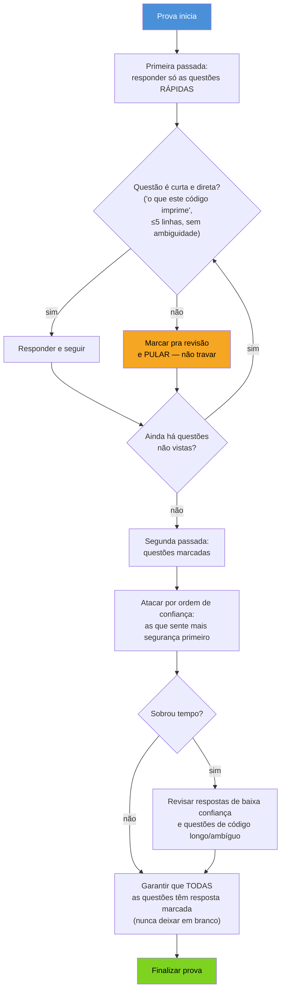
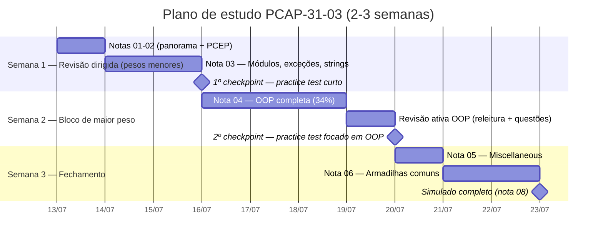

# Estratégia de prova e plano de estudo

> [!abstract] TL;DR
> As notas 02-06 mapearam o conteúdo técnico da prova (blocos oficiais + armadilhas) — o que falta agora não é aprender mais Python, é se preparar pro **formato**. Esta nota cobre três coisas: os recursos oficiais de prática (Python Institute Practice Tests, materiais OpenEDG, docs.python.org como árbitro final de dúvida), uma estratégia de ataque às questões sob tempo cronometrado (rápidas primeiro, longas/ambíguas depois, marcar e seguir em vez de travar), e um plano de estudo de 2-3 semanas que cruza os pesos oficiais dos blocos do PCAP-31-03 com os Galhos 1-6 já estudados nesta trilha — dando mais tempo de revisão ao bloco de Orientação a Objetos (34%, o de maior peso, coberto na [[04 - PCAP — orientação a objetos, o bloco de maior peso|nota 04]]) na proporção exata do seu peso na prova. Quem já fez os Galhos 1-6 completos já tem o conhecimento técnico — o que falta é treino de formato, não conteúdo novo.

## O que já está resolvido, e o que ainda falta

Antes de montar qualquer plano, vale nomear com clareza o que separa quem chega até aqui de um candidato médio à PCAP-31-03: **o conteúdo técnico já foi estudado**. Os Galhos 1-6 desta trilha cobrem tipos, controle de fluxo, coleções, funções, exceções, módulos, OO completa (herança, polimorfismo, MRO, encapsulamento) e idiomas avançados que vão além do que a prova cobra — generics, GIL, decorators avançados. As notas 02-06 deste galho já fizeram o trabalho de mapear cada bloco oficial do syllabus às notas-fonte correspondentes e isolar o catálogo de pegadinhas da Python Institute.

O que resta, então, não é "estudar mais Python" — é converter um conhecimento sólido, mas espalhado por meses de estudo em profundidade, num reflexo rápido sob as condições específicas de uma prova cronometrada de múltipla escolha: sem IDE, sem autocomplete, sem rodar o código, com um relógio contando e um formato de pergunta ("o que este código imprime") que é diferente de escrever código em produção.

> [!tip] A certificação valida o que o estudo real já deu
> Isso vale repetir de forma direta: se os Galhos 1-6 foram estudados de verdade — não só lidos, mas com os exercícios mentais de cada `[!question]` resolvidos —, a barreira entre "sei Python" e "passo no PCAP" não é conhecimento, é familiaridade com o formato. O plano desta nota trata a preparação como treino de formato, não como curso de reforço.

## Recursos oficiais de prática

A regra de ouro aqui é a mesma da nota 01 sobre o tempo de prova: usar apenas fontes que a própria Python Institute/OpenEDG endossa, e tratar `docs.python.org` como árbitro final sempre que uma dúvida técnica aparecer no meio da preparação — nunca um blog de terceiros, um fórum, ou uma IA generalista sem verificação.

- **Python Institute Practice Tests** — a própria Python Institute disponibiliza testes de prática gratuitos, acessíveis a partir do portal oficial (pythoninstitute.org), com questões no formato e estilo da prova real (múltipla escolha, "single-choice"/"multiple-choice"/"gap-fill"/"drag-and-drop" conforme o bloco). É o recurso de maior fidelidade ao formato real, porque é escrito pela mesma organização que escreve a prova — nenhum simulado de terceiros reproduz o estilo de pegadinha da Python Institute com a mesma precisão.
- **Materiais OpenEDG** — a OpenEDG (organização-mãe da Python Institute, já apresentada na [[01 - Panorama — PCEP e PCAP, o que são e pra quem|nota 01]]) mantém, via a plataforma OpenEDG Python Institute, cursos e materiais de apoio estruturados no mesmo syllabus oficial que fundamenta PCEP-30-02 e PCAP-31-03 — úteis como segunda fonte de exercícios no mesmo eixo do exame, não como substituto do estudo técnico já feito nos Galhos 1-6.
- **docs.python.org** — a documentação oficial do CPython é o árbitro de última instância para qualquer dúvida que sobrar durante a preparação. Se um practice test ou um exercício gerar uma dúvida sobre comportamento exato de uma função built-in, um método de string, ou a hierarquia de uma exceção, a resposta correta é consultar a documentação oficial da versão relevante — não confiar em memória, nem em explicação de terceiros sem verificação cruzada.

> [!warning] Simulados de terceiros existem, mas com um filtro
> Cursos pagos e bancos de questões de terceiros (Udemy, sites de preparação dedicados) circulam bastante para PCEP/PCAP — mas nenhum deles é endossado oficialmente pela Python Institute, e a fidelidade ao estilo real de pegadinha varia muito. Se forem usados como material extra, o critério de qualidade é: a explicação da resposta cita o comportamento documentado da linguagem (idealmente com referência a `docs.python.org`), ou só afirma "a resposta é X" sem justificar o mecanismo? Simulados que não explicam o *porquê* treinam memorização de gabarito, não o reflexo que a prova de fato testa.

## Estratégia de ataque sob tempo

A [[01 - Panorama — PCEP e PCAP, o que são e pra quem|nota 01]] já registrou o ponto central sobre tempo de prova: **não há confirmação oficial de duração exata** nas fontes consultadas (pythoninstitute.org) — números como "~40-45 minutos" para o PCEP ou "~65 minutos + 10 de tutorial" para o PCAP circulam em fontes terceirizadas, sem garantia. A estratégia abaixo é robusta a essa incerteza justamente por não depender de saber o número exato: ela otimiza a ordem de ataque das questões, não o cronômetro.

O princípio por trás dessa ordem: **nem toda questão vale o mesmo esforço**. Uma pergunta de bloco Modules and Packages tipo "qual instrução importa só o nome `funcao` de um módulo" tem resposta objetiva, sem ambiguidade, e não deveria consumir mais que alguns segundos. Uma pergunta que pede pra simular mentalmente 15 linhas de código com herança múltipla e overriding de método (bloco OOP, 34% do PCAP) exige mais tempo de raciocínio — e travar nela cedo, sem saber quantas questões rápidas ainda esperam resposta, é o erro mais caro de gestão de tempo numa prova cronometrada.

> [!tip] Nota de corte é 70% cumulativo — errar algumas questões é matematicamente aceitável
> Isso muda o cálculo de risco de cada questão difícil: não é preciso acertar tudo, é preciso acertar 70% do total. Numa prova de 40 itens (PCAP-31-03), isso significa que há margem pra errar até 12 questões e ainda passar. Gastar 5 minutos travado numa única questão ambígua de código longo, à custa de deixar 3 questões rápidas sem resposta no fim por falta de tempo, é uma troca ruim sob quase qualquer cenário — melhor marcar, seguir, e voltar se sobrar tempo.

> [!question]- Por que "nunca deixar questão em branco" é uma regra tão específica
> Porque provas de múltipla escolha da Python Institute não penalizam resposta errada além de simplesmente não valer o ponto — não há desconto por chute errado (diferente de alguns exames que aplicam penalidade negativa). Isso significa que uma resposta em branco e uma resposta errada valem exatamente a mesma coisa (zero), enquanto um chute educado — eliminando pelo menos uma ou duas alternativas obviamente erradas antes de escolher — tem valor esperado positivo. Não confirmar isso no material oficial antes da prova é um risco desnecessário: a regra de "sempre marcar algo, nunca branco" é segura em qualquer exame sem penalidade negativa, e comum o suficiente em provas de certificação de TI que vale adotar como padrão salvo indicação contrária explícita no momento da inscrição.

## Tipos de questão e o tempo que cada um pede

A [[01 - Panorama — PCEP e PCAP, o que são e pra quem|nota 01]] já registrou que o syllabus oficial descreve formatos variados dentro da categoria geral "múltipla escolha" — "single-choice", "multiple-choice", "gap-fill" e "drag-and-drop", conforme o bloco. Cada formato pede uma leitura diferente de tempo:

- **Single-choice** ("qual das alternativas abaixo é verdadeira") — o formato mais rápido de resolver quando a questão é teórica e direta (ex: "qual é a hierarquia correta de `ValueError`"). Se a resposta não vem em poucos segundos de reconhecimento, provavelmente é candidata a "marcar e seguir", porque insistir não costuma acelerar o reconhecimento — ou a memória tem o fato, ou não tem.
- **Multiple-choice** ("marque todas as alternativas corretas") — mais lento por natureza, porque cada alternativa precisa ser avaliada individualmente, não basta achar uma resposta "boa o suficiente". Vale reservar mais tempo mentalmente pra esse formato antes mesmo de ler as opções.
- **Gap-fill** ("complete o código para que ele produza X") — geralmente o formato mais próximo de "o que este código imprime" ao contrário: em vez de prever a saída, é preciso prever a entrada/expressão que produz uma saída dada. Pede simulação mental do interpretador, então tende a consumir tempo parecido com uma questão de código médio.
- **Drag-and-drop** (reordenar trechos de código, ou associar conceito a definição) — variável: pode ser rápido (associação direta de termo-definição, ex: qual exceção pertence a qual categoria) ou lento (reordenar um bloco de código com múltiplas dependências lógicas entre linhas). A heurística de "rápida vs. longa" da seção anterior se aplica igual aqui — se a resposta salta aos olhos, resolver; se exige rastrear várias dependências, marcar e voltar.

> [!question]- Vale a pena tentar decorar em qual bloco cada formato aparece?
> Não é necessário memorizar isso — o syllabus oficial não publica essa granularidade de forma que valha o esforço de decorar, e a distribuição pode variar de aplicação para aplicação da prova. O que vale reter é o princípio geral: o tempo que uma questão exige não depende só do bloco de conteúdo (OOP, Strings etc.), depende também do formato de resposta. Uma questão single-choice sobre OOP pode ser mais rápida que uma questão gap-fill sobre Modules and Packages, mesmo o bloco de OOP sendo "mais difícil" em peso. A heurística de tempo (curta vs. longa) da seção anterior já cobre isso na prática, sem precisar de uma tabela de formato×bloco memorizada.

## Ordem de ataque dentro do conteúdo: pesos primeiro

Gestão de tempo dentro da prova é uma parte da estratégia — a outra é gestão de tempo de **estudo**, antes da prova. A tabela abaixo cruza os pesos oficiais dos blocos do PCAP-31-03 (já registrados na nota 01 e detalhados nas notas 03-05) com a nota deste galho que os cobre, ordenada por peso decrescente — é a ordem de prioridade de revisão, não a ordem de leitura original do galho:

| Bloco (peso) | Nota deste galho | Galho-fonte |
|---|---|---|
| Object-Oriented Programming — **34%** | [[04 - PCAP — orientação a objetos, o bloco de maior peso\|04]] | Galho 3 (OO e Data Model) |
| Miscellaneous — 22% | [[05 - PCAP — miscellaneous, comprehensions, lambdas, closures e arquivos\|05]] | Galhos 2 e 4 |
| Strings — 18% | [[03 - PCAP — módulos, exceções e strings\|03]] | Galho 1 (Core) |
| Exceptions — 14% | [[03 - PCAP — módulos, exceções e strings\|03]] | Galho 1 (Core) |
| Modules and Packages — 12% | [[03 - PCAP — módulos, exceções e strings\|03]] | Galho 1 (Core) |

O bloco de Orientação a Objetos, sozinho, vale mais de um terço da prova inteira — mais que Strings e Exceptions somados. Isso justifica, de forma direta, por que a [[04 - PCAP — orientação a objetos, o bloco de maior peso|nota 04]] é a mais longa do galho (651 linhas) e por que o plano de estudo abaixo reserva proporcionalmente mais tempo de revisão a herança, MRO, polimorfismo e encapsulamento do que a qualquer outro tópico isolado.

## Plano de estudo de 2-3 semanas

O plano assume o cenário mais comum de quem chega a este galho: os Galhos 1-6 já foram estudados, então não há "aprender do zero" em nenhum ponto — só revisão dirigida, prática de simulado, e reforço do bloco de maior peso. A duração de 2-3 semanas é deliberadamente curta porque o gargalo real é familiaridade de formato, não conteúdo; alongar o plano além disso tende a virar procrastinação disfarçada de preparação.

**Semana 1 — Revisão dirigida, começando pelos blocos de peso menor:**

- **Dias 1-2:** reler as notas [[01 - Panorama — PCEP e PCAP, o que são e pra quem|01]] e [[02 - PCEP na prática — fundamentos, controle de fluxo e coleções|02]] rápido — não é conteúdo novo pra quem já fez os Galhos 1-2, é confirmação de que os fundamentos de PCEP (que são a base do PCAP) continuam frescos. Se algum item do checklist de autoavaliação da nota 02 falhar, essa é a hora de voltar ao Galho 1 ou 2 correspondente.
- **Dias 3-4:** reler [[03 - PCAP — módulos, exceções e strings|nota 03]] (blocos Modules and Packages 12%, Exceptions 14%, Strings 18% — 44% da prova somados, mas cada bloco individualmente menor que OOP). Fazer o exercício mental de cada `[!question]` sem espiar a resposta antes.
- **Checkpoint 1:** fazer um bloco curto do Python Institute Practice Test focado nesses três blocos (ou um simulado equivalente), sem cronômetro ainda — o objetivo aqui é calibrar onde a confiança já está sólida e onde falta reforço, não simular a prova real ainda.

**Semana 2 — O bloco de maior peso, com tempo proporcional a 34%:**

- **Dias 1-3:** reler [[04 - PCAP — orientação a objetos, o bloco de maior peso|nota 04]] por completo, devagar — é a nota mais longa do galho por um motivo, e o tempo investido aqui tem o maior retorno esperado por ponto percentual da prova. Prestar atenção especial a MRO com herança múltipla, `super()`, name mangling e a diferença `isinstance()`/`type()` (já reforçada como pegadinha na nota 06).
- **Dia 4:** revisão ativa — sem reler a nota, tentar responder de memória as perguntas de `[!question]` da nota 04, e só depois conferir contra o texto. Esse é o exercício que separa reconhecimento passivo ("ah sim, lembro disso") de recall ativo sob pressão, que é o que a prova de fato exige.
- **Checkpoint 2:** um practice test (oficial, se disponível segmentado por bloco, ou um simulado próprio) focado especificamente em questões de OOP — herança, polimorfismo, encapsulamento, introspecção.

**Semana 3 — Miscellaneous, armadilhas, e fechamento:**

- **Dia 1:** reler [[05 - PCAP — miscellaneous, comprehensions, lambdas, closures e arquivos|nota 05]] (22% do exame — comprehensions, lambdas, closures, file I/O).
- **Dias 2-3:** reler [[06 - Armadilhas comuns e o estilo de questão da Python Institute|nota 06]] por inteiro, resolvendo cada `[!question]` sem consultar a resposta primeiro — essa é a nota que mais se aproxima do formato real de pergunta da prova, então é o treino de formato mais direto disponível no galho.
- **Antes da prova (último passo, dia final):** reler a [[06 - Armadilhas comuns e o estilo de questão da Python Institute|nota 06]] mais uma vez — rápido, como lista de checagem mental — e fazer o simulado completo da [[08 - Capstone — simulado comentado PCEP + PCAP|nota 08]], sob condição de tempo o mais próxima possível da prova real (sem consultar nada durante, conferir gabarito só depois). Esse simulado é o último checkpoint antes de agendar ou fazer a prova de verdade.

> [!question]- Por que revisar as armadilhas por último, e não no meio do plano?
> Porque o catálogo de pegadinhas da nota 06 funciona melhor como "lente final" sobre um conteúdo já revisado do que como primeira exposição. Ler sobre o cache de inteiros pequenos ou o argumento default mutável antes de ter revisado OOP e Miscellaneous a fundo tende a virar memorização isolada de casos ("ah, é a pegadinha do `is`") em vez do reflexo integrado que a prova de fato testa — reconhecer o padrão dentro de um código que também está testando outra coisa ao mesmo tempo (ex: uma pegadinha de mutação escondida dentro de uma questão que parece ser sobre herança). Revisar as armadilhas por último, com o resto do conteúdo fresco, é o que faz esse reflexo integrado se formar.

## Se o tempo disponível for menor que 2-3 semanas

Nem todo mundo tem duas ou três semanas livres antes de uma data de prova já marcada. Para quem tem menos tempo, a compressão segura do plano acima segue a mesma lógica de pesos:

1. **Nunca cortar a revisão da nota 04 (OOP, 34%)** — é o maior bloco de risco se comprimido demais.
2. Comprimir Semana 1 (blocos de peso somado 44%, mas individualmente menores) é mais seguro que comprimir Semana 2.
3. O simulado final da nota 08 nunca deve ser cortado, mesmo sob pressão de tempo — é o único ponto do plano que testa o formato completo, sob todos os blocos, de uma vez, e é o melhor preditor de prontidão real disponível neste galho.

Uma compressão para **uma semana só**, no limite do razoável, ficaria assim: dia 1 revisão rápida das notas 01-03 (56% da prova somados, mas individualmente os blocos mais leves); dias 2-4 nota 04 (OOP, 34%, sem cortar); dia 5 nota 05 (Miscellaneous, 22%); dia 6 nota 06 (armadilhas); dia 7 simulado da nota 08 seguido de agendamento da prova (se o resultado confirmar prontidão) ou mais um ciclo de revisão dirigida aos blocos que o simulado revelou como fracos (se não confirmar). Essa versão comprimida é viável, mas deixa pouca margem pra reforço caso o simulado do dia 7 revele lacunas — o plano de 2-3 semanas tem essa margem embutida e por isso é a recomendação padrão.

> [!warning] Compressão não é desculpa pra pular o simulado
> É tentador, sob pressão de tempo, cortar o simulado da nota 08 pra "ganhar" mais um dia de leitura de conteúdo. É a troca errada: ler mais uma vez uma nota já lida tem retorno marginal decrescente, enquanto o simulado é a única forma de descobrir, antes da prova real, se o conhecimento sobrevive ao formato cronometrado — que é justamente o que este galho inteiro existe pra treinar.

## PCEP como alvo isolado — uma nota sobre este plano

Todo o plano acima assume o PCAP-31-03 como alvo, consistente com a decisão já registrada na [[01 - Panorama — PCEP e PCAP, o que são e pra quem|nota 01]]: quem fez os Galhos 1-6 não ganha muito estudando pro PCEP primeiro, porque o PCAP cobre estritamente mais conteúdo, no mesmo nível de rigor ou maior. Para o caso raro de alguém usar este galho como referência tendo o PCEP como alvo isolado (por exemplo, preparando um currículo introdutório para terceiros, não pra si mesmo), o mesmo esqueleto de estratégia se aplica, só trocando a base de pesos: os 4 blocos do PCEP-30-02, já tabelados na [[02 - PCEP na prática — fundamentos, controle de fluxo e coleções|nota 02]], têm Control Flow (29%) e Functions and Exceptions (28%) como blocos de maior peso — não Orientação a Objetos, que sequer aparece no syllabus do PCEP. A lógica de "revisar proporcionalmente ao peso" continua valendo; só o alvo de maior peso muda.

## Logística de agendamento e dia da prova

Estratégia de conteúdo e gestão de tempo resolvem a parte técnica da preparação — falta a parte operacional, que também gera atrito desnecessário se deixada pra última hora.

- **Agendamento:** tanto PCEP-30-02 quanto PCAP-31-03 são exames aplicados via parceiros de testagem da Python Institute (tipicamente Pearson VUE, em centro de testes ou remoto com proctoring online, dependendo da região). O passo de agendamento é o momento certo de confirmar, diretamente na plataforma oficial, os dois pontos que este galho deliberadamente não afirma sem fonte primária: duração exata da prova e formato de aplicação disponível na região do candidato (presencial vs. remoto).
- **Modalidade remota:** se a opção escolhida for prova com proctoring remoto, os requisitos técnicos (webcam, ambiente sem interferência, identificação por documento) valem confirmar com antecedência — problemas de conexão ou webcam no início da janela de prova consomem tempo que deveria ir para a prova em si.
- **Véspera:** o [[06 - Armadilhas comuns e o estilo de questão da Python Institute|catálogo de armadilhas da nota 06]] e o simulado da nota 08 são o último estudo ativo — na própria véspera, o retorno marginal de estudar mais conteúdo é baixo comparado ao custo de uma noite de sono ruim. Uma prova cronometrada de reconhecimento de padrão (o que domina o formato da Python Institute, como visto na nota 06) depende mais de atenção e memória de trabalho frescas do que de exposição de última hora a conteúdo novo.

> [!tip] Checklist mínimo de véspera
> Confirmar local/link de acesso e horário exato; ter documento de identificação válido em mãos (presencial) ou testado (remoto); reler rapidamente a nota 06; não abrir conteúdo técnico novo — só revisão do que já foi estudado.

## Autoavaliação antes de agendar a prova de verdade

Antes de marcar a data oficial (que costuma ter custo de reagendamento se cancelada em cima da hora), vale confirmar, com honestidade, que os checkpoints do plano acima realmente indicam prontidão — não just "terminei de ler todas as notas":

- [ ] Fiz pelo menos um Python Institute Practice Test (ou simulado de fidelidade equivalente) e superei 70% de acerto, sem consultar as notas durante.
- [ ] Consigo resolver as questões da [[04 - PCAP — orientação a objetos, o bloco de maior peso|nota 04]] (OOP) de memória, sem reler o texto antes de tentar responder.
- [ ] Reconheço, sem precisar pensar muito, pelo menos seis das armadilhas catalogadas na [[06 - Armadilhas comuns e o estilo de questão da Python Institute|nota 06]] ao ver o padrão de código correspondente.
- [ ] Fiz o simulado completo da [[08 - Capstone — simulado comentado PCEP + PCAP|nota 08]] sob condição de tempo, e o resultado ficou consistentemente acima de 70%.
- [ ] Confirmei duração exata da prova e modalidade de aplicação (presencial/remota) diretamente na plataforma oficial de agendamento, não em fonte terceirizada.

Se algum item dessa lista falhar de forma recorrente — não uma vez isolada, mas um padrão —, o ajuste certo não é "estudar mais Python", é voltar à nota correspondente e repetir a revisão ativa daquele bloco especificamente, respeitando a proporção de pesos já estabelecida: um item falho no bloco OOP pesa mais que um item falho em Modules and Packages.

## Em entrevista

Se a pergunta em entrevista for sobre como a pessoa se preparou para uma certificação técnica (não só PCAP, o raciocínio generaliza), a resposta que demonstra maturidade não é "estudei os slides do curso" — é nomear a diferença entre conhecimento técnico e familiaridade de formato: "eu já tinha o conteúdo técnico consolidado de estudo prévio; a preparação específica pra certificação foi sobre o formato da prova — simulados oficiais, gestão de tempo sob pressão, e um catálogo de padrões de pegadinha específicos daquele exame". Isso mostra que a pessoa entende certificação como credencial formal em cima de conhecimento real, não como o próprio aprendizado.

## How to explain in English

> "My prep strategy for PCAP-31-03 wasn't about learning new Python — the technical content was already solid from prior study. The gap was exam format: official Python Institute practice tests, time management under a timed multiple-choice format, and a targeted review weighted by the syllabus's official block percentages — spending proportionally more time on Object-Oriented Programming, since it's 34% of the exam, the single heaviest block. During the exam itself, the strategy is to answer short 'what does this print' questions first, flag longer or ambiguous code questions to revisit, and never leave an item blank — since the passing score is a cumulative 70%, there's room to miss some questions, and getting stuck on one hard item at the cost of skipping easier ones later is the costliest mistake in a timed exam."

| PT | EN |
|----|----|
| Recursos oficiais | Official resources |
| Simulado / teste de prática | Practice test |
| Gestão de tempo | Time management |
| Marcar pra revisão | Flag for review |
| Chute educado | Educated guess |
| Revisão ativa | Active recall |
| Checkpoint | Checkpoint |
| Prova cronometrada | Timed exam |

## Armadilhas comuns

- **Tratar o estudo pré-prova como reaprendizado de Python** — se os Galhos 1-6 já foram feitos, o gargalo é formato, não conteúdo; alongar o plano além de 2-3 semanas tende a virar procrastinação.
- **Travar numa questão difícil de código longo** — com nota de corte de 70% cumulativo, marcar e seguir é estrategicamente superior a insistir e arriscar não completar a prova.
- **Deixar questão em branco** — sem confirmação de penalidade negativa nas fontes oficiais, chute educado tem valor esperado positivo; branco nunca tem.
- **Pular o simulado final da nota 08** sob pressão de tempo — é o único ponto do plano que testa o formato completo, e o melhor preditor de prontidão disponível.
- **Confiar em simulados de terceiros sem verificar se a explicação da resposta cita o comportamento documentado da linguagem** — gabarito sem justificativa treina memorização, não o reflexo que a prova exige.

## O que vem a seguir

Com a estratégia de prova e o plano de estudo definidos, a [[08 - Capstone — simulado comentado PCEP + PCAP|nota 08]] fecha o galho — e a trilha Python inteira (19/19) — com um simulado de ~15-20 questões no estilo real da Python Institute, gabarito comentado, e links de volta a cada nota-fonte do conceito testado.

## Veja também

- [[03-Dominios/Tecnologia/Python/Certificação (PCEP-PCAP)/index|Certificação (PCEP/PCAP)]] — MOC do galho
- [[01 - Panorama — PCEP e PCAP, o que são e pra quem|01 — Panorama]] — formato de prova, nota de corte 70%, aviso sobre tempo de prova não confirmado
- [[02 - PCEP na prática — fundamentos, controle de fluxo e coleções|02 — PCEP na prática]] — blocos do PCEP mapeados aos Galhos 1-2
- [[03 - PCAP — módulos, exceções e strings|03 — PCAP: módulos, exceções e strings]] — blocos 1-3 do PCAP (44% somados)
- [[04 - PCAP — orientação a objetos, o bloco de maior peso|04 — PCAP: orientação a objetos]] — bloco de maior peso (34%)
- [[05 - PCAP — miscellaneous, comprehensions, lambdas, closures e arquivos|05 — PCAP: miscellaneous]] — bloco de 22%
- [[06 - Armadilhas comuns e o estilo de questão da Python Institute|06 — Armadilhas comuns]] — catálogo de pegadinhas, revisão final antes da prova
- [[08 - Capstone — simulado comentado PCEP + PCAP|08 — Capstone: simulado comentado]] — próxima nota, fecha o galho e a trilha
- [[03-Dominios/Tecnologia/Python/index|Trilha Python]] (MOC central)

## Fontes

- Python Institute / OpenEDG. *PCEP-30-02 Exam Syllabus*. pythoninstitute.org. https://pythoninstitute.org/pcep-exam-syllabus (acessado em 2026-07-12, status "Live & Active")
- Python Institute / OpenEDG. *PCAP-31-03 Exam Syllabus*. pythoninstitute.org. https://pythoninstitute.org/pcap-exam-syllabus (acessado em 2026-07-12, status "Live & Active")
- Python Institute. *Practice Tests*. pythoninstitute.org. https://pythoninstitute.org/practice-tests (acessado em 2026-07-12) — simulados gratuitos oficiais, formato e estilo alinhados à prova real.
- OpenEDG Python Institute. *OpenEDG Python Institute — Home*. openedg.org / pythoninstitute.org (acessado em 2026-07-12) — organização-mãe da Python Institute, materiais de apoio estruturados no mesmo syllabus oficial.
- Python Software Foundation. *Python 3 Documentation* (referência definitiva em caso de dúvida técnica durante a preparação). docs.python.org, versão 3.14. https://docs.python.org/3/ (acessado em 2026-07-12)

Consultado em 2026-07-12.
