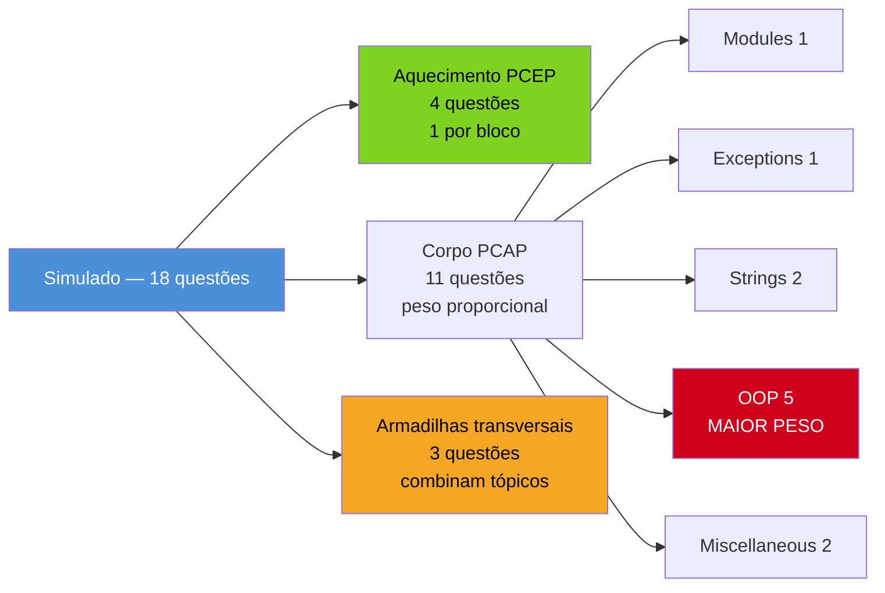
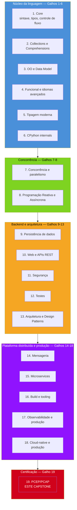

# Capstone — simulado comentado PCEP + PCAP

> [!abstract] TL;DR
> Esta é a última nota do Galho 19 (Certificação PCEP/PCAP) — e a última nota da **trilha Python inteira, 19/19 galhos**. O capstone é um simulado de 18 questões no estilo real da Python Institute — trecho curto de código, quatro alternativas, gabarito comentado em callout colapsável — distribuído proporcionalmente aos pesos oficiais do PCAP-31-03 (mais peso em Orientação a Objetos, 34% da prova) com uma amostra dos quatro blocos do PCEP-30-02 no início, e um bloco final dedicado só a armadilhas transversais. Cada questão linka de volta à nota-fonte exata do conceito — deste galho ou dos Galhos 1-6 do núcleo da linguagem. Depois do simulado, a nota fecha com uma recapitulação da jornada completa: seis galhos de núcleo da linguagem, dois de concorrência, cinco de backend e arquitetura, cinco de plataforma distribuída e produção, e este último de certificação — dezenove galhos que começaram em "o que é Python" e terminam aqui, numa prova de múltipla escolha que testa uma fração pequena, mas real, de tudo que foi construído no caminho.

## Como usar este simulado

Resolva cada questão mentalmente antes de abrir o gabarito — a prova real não dá acesso a um interpretador, e o valor do exercício está exatamente em prever a saída (ou identificar a exceção, ou escolher a alternativa correta) sem rodar nada. As 18 questões estão organizadas em quatro blocos: um aquecimento de PCEP (4 questões, uma por bloco oficial), o corpo principal de PCAP na proporção dos pesos do syllabus (11 questões: Modules, Exceptions, Strings, OOP com peso extra, Miscellaneous), e um bloco final de armadilhas transversais (3 questões) que combina padrões de mais de um tópico ao mesmo tempo — exatamente como a prova real costuma fazer nas questões mais difíceis.



A nota de corte real é **70% cumulativo** — no PCAP-31-03, isso significa acertar pelo menos 28 de 40 itens (documentado na [[01 - Panorama — PCEP e PCAP, o que são e pra quem|nota 01]]). Aplicando a mesma régua a este simulado de 18 questões: 13 acertos ou mais é o sinal de prontidão equivalente. Errar uma questão aqui não é motivo de alarme — é o roteiro exato de qual nota-fonte reabrir antes da prova real.

## Bloco 1 — Aquecimento PCEP (4 questões, uma por bloco oficial)

**Questão 1 (PCEP Bloco 1 — Fundamentals, 18%).** O que este trecho imprime?

```python
x = 9
y = 4
print(x / y)
print(x // y)
print(2 ** 10)
```

A) `2.25`, `2`, `1024` B) `2`, `2.25`, `1024` C) `2.25`, `2.0`, `1024` D) `2.25`, `2`, `100`

> [!question]- Resposta e explicação
> **A) `2.25`, `2`, `1024`.** `/` é sempre divisão verdadeira e devolve `float` (`9/4 = 2.25`); `//` é divisão inteira, devolve `int` quando os dois operandos são `int` (`2`, não `2.0` — a alternativa C erra nesse detalhe de tipo); `**` é potenciação (`2**10 = 1024`, não `100`, que seria `2*10*5` por engano de quem confunde `**` com multiplicação). Ver [[03-Dominios/Tecnologia/Python/Core/03 - Operadores e expressões|Core 03 — Operadores e expressões]].

**Questão 2 (PCEP Bloco 2 — Control Flow, 29%, maior peso do PCEP).** O que este trecho imprime?

```python
for i in range(1, 10, 3):
    if i > 8:
        break
else:
    print("loop completo")
print(i)
```

A) `loop completo` seguido de `10` B) apenas `7` C) `loop completo` seguido de `7` D) nada é impresso, `NameError`

> [!question]- Resposta e explicação
> **C) `loop completo` seguido de `7`.** `range(1, 10, 3)` gera `1, 4, 7` (o próximo seria `10`, que já está fora do range exclusivo em `10`). Nenhum desses três valores é maior que `8`, então o `if i > 8` nunca dispara `break` — o `for` termina normalmente e o `else` do loop **roda**, imprimindo `"loop completo"`. Depois do loop, `i` ainda existe com o último valor atribuído (`7` — a variável de loop não é apagada ao sair do `for`, diferente de outras linguagens com escopo de bloco). Ver [[03-Dominios/Tecnologia/Python/Core/05 - Loops — for, while, range, enumerate, zip|Core 05 — Loops]] e a versão detalhada da armadilha do `else` de loop em [[02 - PCEP na prática — fundamentos, controle de fluxo e coleções|02 deste galho]].

**Questão 3 (PCEP Bloco 3 — Data Collections, 25%).** O que este trecho imprime?

```python
dados = ("a", "b", "c", "d", "e")
print(dados[1:4])
print(dados[-2:])
print(dados[::2])
```

A) `('b', 'c', 'd')`, `('d', 'e')`, `('a', 'c', 'e')` B) `('a', 'b', 'c')`, `('d', 'e')`, `('a', 'c', 'e')` C) `('b', 'c', 'd')`, `('e',)`, `('a', 'c')` D) `('b', 'c', 'd', 'e')`, `('d', 'e')`, `('a', 'c', 'e')`

> [!question]- Resposta e explicação
> **A) `('b', 'c', 'd')`, `('d', 'e')`, `('a', 'c', 'e')`.** Tuplas fatiam exatamente como listas e strings — todas são sequências no mesmo sentido do data model. `dados[1:4]` pega os índices 1, 2, 3 (exclusivo em 4). `dados[-2:]` pega os dois últimos elementos. `dados[::2]` pega todo elemento de índice par (passo 2, sem limites explícitos). Ver [[03-Dominios/Tecnologia/Python/Collections e Comprehensions/02 - Tuplas e desempacotamento|Collections 02 — Tuplas]] e a nota sobre slicing negativo em [[06 - Armadilhas comuns e o estilo de questão da Python Institute|06 deste galho]].

**Questão 4 (PCEP Bloco 4 — Functions and Exceptions, 28%).** Qual exceção, se alguma, este código levanta?

```python
def dividir_lista(numeros, divisor):
    resultado = []
    for n in numeros:
        resultado.append(n / divisor)
    return resultado

print(dividir_lista([10, 20, 30], 0))
```

A) Nenhuma — imprime `[inf, inf, inf]` B) `ZeroDivisionError` C) `TypeError` D) `ValueError`

> [!question]- Resposta e explicação
> **B) `ZeroDivisionError`.** Diferente de linguagens com ponto flutuante IEEE 754 "puro" (onde `1.0 / 0.0` pode devolver `inf`), Python levanta `ZeroDivisionError` para divisão por zero em qualquer contexto — `int / 0`, `float / 0.0`, `//`, `%` — não existe `inf` implícito por divisão de número por zero na aritmética padrão de Python. A exceção acontece já na primeira iteração do `for`, então a função nunca chega a devolver nada. Ver a hierarquia de exceções em [[03-Dominios/Tecnologia/Python/Core/08 - Erros e exceções|Core 08 — Erros e exceções]].

## Bloco 2 — Corpo PCAP: Modules and Packages (12%)

**Questão 5.** Sabendo que `utils.py` contém apenas `def dobrar(x): return x * 2`, o que este trecho imprime?

```python
from utils import dobrar

print(dobrar(21))
print(utils.dobrar(21))
```

A) `42` seguido de `42` B) `42` seguido de `NameError` C) `NameError` na primeira linha D) `42` seguido de `AttributeError`

> [!question]- Resposta e explicação
> **B) `42` seguido de `NameError`.** `from utils import dobrar` vincula **só** o nome `dobrar` ao namespace atual — o nome `utils` (o módulo em si) nunca é criado nesse namespace, então `utils.dobrar(21)` falha com `NameError: name 'utils' is not defined`. Para acessar via `utils.dobrar`, seria preciso `import utils` (forma completa, que vincula o módulo, exigindo prefixo em todo acesso). É a pegadinha mais citada do bloco Modules. Ver [[03-Dominios/Tecnologia/Python/Core/09 - Módulos e imports|Core 09 — Módulos e imports]] e o mapeamento em [[03 - PCAP — módulos, exceções e strings|03 deste galho]].

## Bloco 3 — Corpo PCAP: Exceptions (14%)

**Questão 6.** O que este código imprime?

```python
def processa(valor):
    try:
        if valor < 0:
            raise ValueError("negativo")
        resultado = 100 / valor
    except ZeroDivisionError:
        return "erro: zero"
    except ValueError as e:
        return f"erro: {e}"
    else:
        return f"ok: {resultado}"
    finally:
        print("processamento finalizado")

print(processa(0))
print(processa(-5))
print(processa(10))
```

A) três linhas de `"processamento finalizado"`, seguidas de `erro: zero`, `erro: negativo`, `ok: 10.0` B) `erro: zero`, `processamento finalizado`, `erro: negativo`, `processamento finalizado`, `ok: 10.0`, `processamento finalizado` C) `processamento finalizado`, `erro: zero`, `processamento finalizado`, `erro: negativo`, `processamento finalizado`, `ok: 10.0` D) `erro: zero`, `erro: negativo`, `ok: 10.0`, sem nenhum `processamento finalizado`

> [!question]- Resposta e explicação
> **C.** `finally` **sempre** roda, mesmo quando `except`/`else` já decidiu o valor de retorno via `return` — mas ele roda **antes** do `print()` externo receber o valor de volta, porque a função só efetivamente retorna depois que `finally` termina. Para cada chamada: `processa(0)` cai em `ZeroDivisionError`, `finally` imprime primeiro, depois a string retornada é impressa pelo `print()` de fora. O mesmo padrão se repete para as outras duas chamadas. A ordem entre "o que a função imprime internamente" (`finally`) e "o que o `print()` externo imprime depois" é o ponto exato que separa quem entende a mecânica completa de `try`/`except`/`else`/`finally` de quem decorou só a ordem das cláusulas. Ver [[03-Dominios/Tecnologia/Python/Core/08 - Erros e exceções|Core 08 — Erros e exceções]] e [[03 - PCAP — módulos, exceções e strings|03 deste galho]].

## Bloco 4 — Corpo PCAP: Strings (18%)

**Questão 7.** O que este trecho imprime?

```python
s = "Python Institute"
print(s.find("z"))
print(s.count("t"))
print(s[7:].lower().startswith("in"))
```

A) `-1`, `4`, `True` B) `-1`, `2`, `True` C) `ValueError`, `4`, `True` D) `-1`, `4`, `False`

> [!question]- Resposta e explicação
> **A) `-1`, `4`, `True`.** `.find("z")` não encontra a substring e devolve `-1` (sem levantar erro — diferente de `.index()`, que levantaria `ValueError`). `.count("t")` é **case-sensitive** e conta só `"t"` minúsculo: um em `"Python"` e três em `"Institute"` (`Ins-t-i-t-u-t-e`), totalizando `4` — o `"T"` maiúsculo de "Python" não conta, porque `.count()` não ignora maiúsculas/minúsculas por padrão. `s[7:]` fatia a partir do índice 7 (`"Institute"`, já que o espaço está no índice 6), `.lower()` vira `"institute"`, `.startswith("in")` é `True`. Ver [[03-Dominios/Tecnologia/Python/Core/07 - Strings e formatação|Core 07]] e [[03 - PCAP — módulos, exceções e strings|03 deste galho]], seção `.find()` vs `.index()`.

**Questão 8.** O que estas três expressões devolvem, em ordem?

```python
print("".isdigit())
print("3.14".isdigit())
print(ord("a") - ord("A"))
```

A) `False`, `True`, `32` B) `True`, `False`, `32` C) `False`, `False`, `32` D) `False`, `False`, `26`

> [!question]- Resposta e explicação
> **C) `False`, `False`, `32`.** String vazia devolve `False` em **todos** os métodos `.isX()` — nunca `True`, mesmo "não tendo nada que contradiga". `"3.14".isdigit()` é `False` porque o ponto (`.`) não é dígito. `ord("a")` é `97`, `ord("A")` é `65` — a diferença `32` é constante para qualquer par de letras minúscula/maiúscula correspondente no alfabeto latino (é o deslocamento fixo entre os blocos de maiúsculas e minúsculas na tabela ASCII/Unicode). Ver [[03 - PCAP — módulos, exceções e strings|03 deste galho]], seções de métodos booleanos e `ord()`/`chr()`.

## Bloco 5 — Corpo PCAP: Object-Oriented Programming (34%, maior peso — 5 questões)

**Questão 9 (Encapsulamento / name mangling).** O que este código imprime?

```python
class Configuracao:
    def __init__(self):
        self.__valor = 42

class ConfiguracaoEstendida(Configuracao):
    def __init__(self):
        super().__init__()
        self.__valor = 100

    def mostrar_proprio(self):
        return self.__valor

c = ConfiguracaoEstendida()
print(c.mostrar_proprio())
print(c._Configuracao__valor)
```

A) `100`, `100` B) `100`, `42` C) `42`, `100` D) `AttributeError` na primeira linha

> [!question]- Resposta e explicação
> **B) `100`, `42`.** Name mangling reescreve `__valor` usando o nome da classe **onde o código está escrito**, não da instância concreta. Dentro de `ConfiguracaoEstendida`, `self.__valor` vira `self._ConfiguracaoEstendida__valor` — um atributo distinto do `self._Configuracao__valor` criado por `Configuracao.__init__`. `mostrar_proprio()` está definido em `ConfiguracaoEstendida`, então lê o atributo mangled dessa classe (`100`). Acessar `c._Configuracao__valor` diretamente pega o atributo mangled criado pelo `__init__` da superclasse, que continua existindo separadamente (`42`) — as duas atribuições nunca colidiram, que é exatamente o propósito documentado do name mangling. Ver [[04 - PCAP — orientação a objetos, o bloco de maior peso|04 deste galho]] e [[03-Dominios/Tecnologia/Python/OO e Data Model/04 - Properties e encapsulamento|OO e Data Model 04 — Properties e encapsulamento]].

**Questão 10 (Herança múltipla / MRO).** Qual é a MRO de `Z`?

```python
class Base: pass
class Esquerda(Base): pass
class Direita(Base): pass
class Meio(Esquerda, Direita): pass
class Z(Meio, Base): pass
```

A) `Z → Meio → Esquerda → Direita → Base → object` B) `Z → Base → Meio → Esquerda → Direita → object` C) `Z → Meio → Base → Esquerda → Direita → object` D) Erro: `TypeError: Cannot create a consistent MRO`

> [!question]- Resposta e explicação
> **A) `Z → Meio → Esquerda → Direita → Base → object`.** O C3 linearization preserva a ordem declarada em cada nível e só insere uma classe-ancestral depois que **todas** as suas subclasses diretas já apareceram na linearização. `Z(Meio, Base)` declara `Meio` primeiro — a MRO de `Meio` já é `Meio → Esquerda → Direita → Base → object`; juntando com `Z`, o algoritmo mantém essa cadeia intacta e não duplica `Base`, que já apareceria naturalmente ao final. Não há conflito de ordem entre os merges, então a linearização é válida — a alternativa D existe pra testar se você reconhece um MRO **válido** vs. um genuinamente impossível (que exigiria ordens conflitantes entre duas classes-base, não é o caso aqui). Ver [[04 - PCAP — orientação a objetos, o bloco de maior peso|04 deste galho]] e [[03-Dominios/Tecnologia/Python/OO e Data Model/02 - Herança e MRO|OO e Data Model 02 — Herança e MRO]].

**Questão 11 (Atributos de instância vs. classe).** O que este código imprime?

```python
class Equipe:
    membros = []

    def __init__(self, nome):
        self.nome = nome
        self.membros = self.membros + [nome]

e1 = Equipe("Ana")
e2 = Equipe("Bia")

print(e1.membros)
print(e2.membros)
print(Equipe.membros)
```

A) `['Ana', 'Bia']`, `['Ana', 'Bia']`, `['Ana', 'Bia']` B) `['Ana']`, `['Bia']`, `[]` C) `['Ana']`, `['Ana', 'Bia']`, `[]` D) `['Ana']`, `['Bia']`, `['Ana', 'Bia']`

> [!question]- Resposta e explicação
> **B) `['Ana']`, `['Bia']`, `[]`.** Este é o inverso da pegadinha clássica de atributo de classe mutável — repare que aqui o código usa `self.membros = self.membros + [nome]`, **reatribuição**, não `.append()` (mutação in-place). A leitura do lado direito (`self.membros`) sobe a busca de atributo e encontra a lista vazia da classe; a criação de `self.membros + [nome]` gera uma lista **nova**; a atribuição `self.membros = ...` cria um **atributo de instância** que sombreia o de classe a partir dali, sem nunca mutar o objeto original. Por isso `e1.membros` e `e2.membros` são listas independentes, e `Equipe.membros` (o atributo de classe original) permanece intocado, ainda `[]`. Se o código usasse `self.membros.append(nome)` em vez de reatribuir, o resultado seria a pegadinha inversa: as três listas apareceriam idênticas e compartilhadas. Ver [[04 - PCAP — orientação a objetos, o bloco de maior peso|04 deste galho]] e [[03-Dominios/Tecnologia/Python/OO e Data Model/01 - Classes — definição, atributos e métodos|OO e Data Model 01 — Classes]].

**Questão 12 (Polimorfismo via Data Model).** O que este código imprime?

```python
class Caixa:
    def __init__(self, itens):
        self._itens = itens

    def __len__(self):
        return len(self._itens)

    def __eq__(self, outra):
        return len(self) == len(outra)

c1 = Caixa([1, 2, 3])
c2 = Caixa(["a", "b", "c"])
c3 = Caixa([1, 2])

print(len(c1))
print(c1 == c2)
print(c1 == c3)
```

A) `3`, `True`, `False` B) `3`, `False`, `False` C) `3`, `True`, `True` D) `AttributeError` na segunda linha

> [!question]- Resposta e explicação
> **A) `3`, `True`, `False`.** `Caixa` não herda de nenhuma classe com noção de tamanho ou igualdade — ela participa de `len()` e `==` só por implementar `__len__` e `__eq__`, o polimorfismo idiomático via Data Model. `len(c1)` chama `c1.__len__()`, que devolve `len(self._itens) = 3`. `c1 == c2` chama `c1.__eq__(c2)`, que compara `len(c1) == len(c2)` — `3 == 3`, `True`, mesmo os itens sendo tipos completamente diferentes (inteiros vs. strings), porque `__eq__` foi definido para comparar só o tamanho, não o conteúdo. `c1 == c3` compara `3 == 2`, `False`. Ver [[04 - PCAP — orientação a objetos, o bloco de maior peso|04 deste galho]] e [[03-Dominios/Tecnologia/Python/OO e Data Model/03 - O Data Model — dunder methods essenciais|OO e Data Model 03 — Data Model]].

**Questão 13 (Construtores e herança).** Que exceção, se alguma, este código levanta?

```python
class Veiculo:
    def __init__(self, rodas):
        self.rodas = rodas

class Carro(Veiculo):
    def __init__(self, rodas, portas):
        self.portas = portas
        super().__init__(rodas)

c = Carro(4, 2)
print(c.rodas, c.portas)
```

A) `AttributeError: 'Carro' object has no attribute 'rodas'` B) Nenhuma — imprime `4 2` C) `TypeError: __init__() missing argument` D) Nenhuma — imprime `2 4` (ordem trocada)

> [!question]- Resposta e explicação
> **B) Nenhuma — imprime `4 2`.** Diferente da armadilha clássica (subclasse que sobrescreve `__init__` e **esquece** de chamar `super().__init__(...)`), este código **chama** `super().__init__(rodas)` — só o faz depois de já ter atribuído `self.portas`, não antes. A ordem das duas linhas dentro de `Carro.__init__` não importa para o resultado final: ambos os atributos (`self.portas` e o `self.rodas` criado por `Veiculo.__init__` via `super()`) acabam existindo na instância antes do `print()` rodar. É uma questão desenhada para testar se o candidato assume, por reflexo condicionado do padrão mais comum, que "chamar `super()` depois de outros atributos" é sempre um erro — não é; o erro real é **não chamar** `super().__init__(...)` de forma alguma. Ver [[04 - PCAP — orientação a objetos, o bloco de maior peso|04 deste galho]], seção "Construtores".

## Bloco 6 — Corpo PCAP: Miscellaneous (22%)

**Questão 14 (List comprehension).** O que este código imprime?

```python
matriz = [[1, 2, 3], [4, 5, 6]]
resultado = [linha[i] for linha in matriz for i in range(len(linha)) if linha[i] % 2 == 0]
print(resultado)
```

A) `[2, 4, 6]` B) `[2, 6, 4]` C) `[4, 6, 2]` D) `[2, 4]`

> [!question]- Resposta e explicação
> **A) `[2, 4, 6]`.** Dois `for` numa comprehension avaliam da esquerda pra direita, como loops aninhados: o `for linha in matriz` externo é o loop de fora, o `for i in range(len(linha))` é o de dentro. Para `linha = [1, 2, 3]`: `i` percorre `0, 1, 2`, e o filtro `linha[i] % 2 == 0` mantém só `linha[1] = 2`. Para `linha = [4, 5, 6]`: mantém `linha[0] = 4` e `linha[2] = 6`. A ordem final segue a ordem de iteração natural: `[2, 4, 6]`. Ver [[05 - PCAP — miscellaneous, comprehensions, lambdas, closures e arquivos|05 deste galho]] e [[03-Dominios/Tecnologia/Python/Collections e Comprehensions/05 - Comprehensions — list, dict, set e generator expressions|Collections 05 — Comprehensions]].

**Questão 15 (Closures e late binding).** O que este código imprime?

```python
somadores = []
for i in range(3):
    somadores.append(lambda x, passo=i: x + passo)

print([f(10) for f in somadores])
```

A) `[10, 10, 10]` B) `[10, 11, 12]` C) `[12, 12, 12]` D) `TypeError`

> [!question]- Resposta e explicação
> **B) `[10, 11, 12]`.** Diferente da armadilha clássica de late binding (`lambda x: x + i`, que produziria `[12, 12, 12]` porque as três lambdas compartilhariam a mesma variável `i`, lida só na hora da chamada), este código usa o conserto padrão: `passo=i` é um **argumento default**, avaliado no momento em que **cada** lambda é criada, dentro daquela iteração específica do loop — não no momento em que é chamada. Isso congela o valor de `i` de cada iteração dentro do parâmetro `passo` de cada lambda individualmente. `f(10)` para cada uma soma `10 + passo`, com `passo` valendo `0`, `1`, `2` respectivamente: `10, 11, 12`. Ver [[05 - PCAP — miscellaneous, comprehensions, lambdas, closures e arquivos|05 deste galho]] e [[03-Dominios/Tecnologia/Python/Funcional e idiomas avançados/04 - Closures de verdade|Funcional 04 — Closures de verdade]].

**Questão 16 (File I/O).** Assumindo que `log.txt` não existe antes da execução, o que este código produz como conteúdo final do arquivo?

```python
with open("log.txt", "a") as f:
    f.write("evento 1\n")

with open("log.txt", "a") as f:
    f.write("evento 2\n")

with open("log.txt", "w") as f:
    f.write("reiniciado\n")
```

A) `evento 1\nevento 2\nreiniciado\n` B) `evento 1\nevento 2\n` C) `reiniciado\n` D) `FileNotFoundError`, porque `log.txt` não existia antes do primeiro `open()`

> [!question]- Resposta e explicação
> **C) `reiniciado\n`.** Os dois primeiros blocos usam modo `'a'` (append) — cada um cria o arquivo se ele não existir e escreve a partir do fim, então depois deles o arquivo contém `"evento 1\nevento 2\n"`. Mas o terceiro bloco abre em modo `'w'` (write), que **trunca o arquivo imediatamente ao ser aberto**, descartando todo o conteúdo anterior antes mesmo de qualquer `.write()` rodar — o conteúdo final é só o que o último bloco escreveu. A alternativa D testa se o candidato confunde os modos: `'a'` cria o arquivo se não existir (diferente de `'r'`, que levantaria `FileNotFoundError` num arquivo inexistente). Ver [[05 - PCAP — miscellaneous, comprehensions, lambdas, closures e arquivos|05 deste galho]], seção "`open()` e os modos de abertura".

## Bloco 7 — Armadilhas transversais (3 questões, combinando tópicos)

**Questão 17 (Mutação vs. reatribuição + escopo).** O que este código imprime?

```python
contador_global = {"total": 0}

def incrementar(contador, chave):
    valor_atual = contador.get(chave, 0)
    contador[chave] = valor_atual + 1
    contador = {"outro": 999}   # reatribuição LOCAL — não afeta o chamador

incrementar(contador_global, "total")
incrementar(contador_global, "total")
incrementar(contador_global, "novo")
print(contador_global)
```

A) `{'outro': 999}` B) `{'total': 2, 'novo': 1}` C) `{'total': 0, 'novo': 0}` D) `{'total': 2}`

> [!question]- Resposta e explicação
> **B) `{'total': 2, 'novo': 1}`.** As duas primeiras linhas de `incrementar` mutam o dicionário compartilhado via atribuição de item (`contador[chave] = ...`), que afeta o objeto original independente do nome usado para acessá-lo. A terceira linha (`contador = {"outro": 999}`) é reatribuição pura do nome **local** `contador` — não muta nada, só faz o nome local apontar para um dicionário novo que é descartado quando a função retorna. `contador_global` nunca perde a referência ao dicionário original, que foi mutado duas vezes (`"total"` chega a `2`) e uma vez com chave nova (`"novo"` chega a `1`). Essa combinação — mutação real seguida de reatribuição inofensiva no mesmo bloco de código — é o padrão exato descrito em [[06 - Armadilhas comuns e o estilo de questão da Python Institute|06 deste galho]], seção "Mutação por referência disfarçada de leitura".

**Questão 18 (Identidade, precedência e verdade booleana — as três num só código).** O que este código imprime?

```python
a = 200
b = 200
resultado = (a is b) and (2 + 3 * 2 == 8) or bool([])
print(resultado)

c = 300
d = 300
print(c is d or c == d)
```

A) `True`, `True` B) `False`, `True` C) `True`, `False` D) `False`, `False`

> [!question]- Resposta e explicação
> **A) `True`, `True`.** Primeira linha: `a = 200`, `b = 200` — ambos dentro do intervalo `-5..256` cacheado pelo CPython, então `a is b` é `True` (mesmo objeto na memória). `2 + 3 * 2` respeita precedência (`*` antes de `+`): `3 * 2 = 6`, `2 + 6 = 8`, então `8 == 8` é `True`. A expressão completa, por precedência de operador lógico (`and` mais forte que `or`), lê-se `((a is b) and (2 + 3 * 2 == 8)) or bool([])` = `(True and True) or False` = `True or False` = `True` — o `or bool([])` sequer precisaria ser avaliado por curto-circuito, já que o lado esquerdo do `or` já é `True`. Segunda linha: `c = 300`, `d = 300` estão fora do intervalo cacheado — `c is d` tipicamente dá `False` (dois objetos `int` distintos, cada literal `300` avaliado em sua própria atribuição), mas `c == d` é sempre `True` (mesmo valor, comparação por igualdade, não identidade) — `False or True` é `True`. Este é o item mais denso do simulado porque combina três eixos na mesma questão: precedência aritmética/lógica, curto-circuito, e o cache de inteiros pequenos do CPython — exatamente o tipo de composição que a prova real usa nas questões mais difíceis de cada bloco. Ver [[06 - Armadilhas comuns e o estilo de questão da Python Institute|06 deste galho]], seções "`is` vs `==`" e "Precedência de operadores".

## Gabarito consolidado

| Questão | Bloco | Resposta |
|---|---|---|
| 1 | PCEP Fundamentals | A |
| 2 | PCEP Control Flow | C |
| 3 | PCEP Data Collections | A |
| 4 | PCEP Functions/Exceptions | B |
| 5 | PCAP Modules | B |
| 6 | PCAP Exceptions | C |
| 7 | PCAP Strings | A |
| 8 | PCAP Strings | C |
| 9 | PCAP OOP | B |
| 10 | PCAP OOP | A |
| 11 | PCAP OOP | B |
| 12 | PCAP OOP | A |
| 13 | PCAP OOP | B |
| 14 | PCAP Miscellaneous | A |
| 15 | PCAP Miscellaneous | B |
| 16 | PCAP Miscellaneous | C |
| 17 | Armadilha transversal | B |
| 18 | Armadilha transversal | A |

> [!tip] Como interpretar o resultado
> 13 acertos ou mais (72%) é o equivalente proporcional à nota de corte real de 70% cumulativo. Se o bloco 5 (OOP, questões 9-13) concentrou a maioria dos erros, isso não é coincidência de sorte — é o bloco de maior peso e maior complexidade da prova real também; volte à [[04 - PCAP — orientação a objetos, o bloco de maior peso|nota 04]] antes de mais uma tentativa. Se os erros se espalharam por vários blocos sem padrão, revisar o [[06 - Armadilhas comuns e o estilo de questão da Python Institute|catálogo de armadilhas da nota 06]] tende a render mais que reler qualquer bloco isolado.

## Fechando o Galho 19 — e a trilha Python inteira

Chegar até aqui significa ter percorrido as oito notas deste galho — mas também significa ter terminado os **dezenove galhos da trilha Python** deste vault, do primeiro `print("Hello, World")` implícito no Galho 1 até este simulado de certificação. Vale nomear essa jornada por completo antes de fechar, porque é fácil, numa trilha tão longa, perder de vista o tamanho real do que foi construído.



A jornada, em cinco frases: os [[03-Dominios/Tecnologia/Python/index|Galhos 1-6]] construíram o **núcleo da linguagem** — do `if`/`for` mais básico até os internals do CPython (GIL, GC geracional, ceval loop), passando por OO completa, idiomas funcionais (generators, closures, decorators) e tipagem moderna com generics. Os [[03-Dominios/Tecnologia/Python/Concorrência e paralelismo/index|Galhos 7-8]] resolveram **concorrência e execução assíncrona** — threading, multiprocessing, e o mergulho fundo em `asyncio`/ASGI que a maioria dos devs Python nunca faz por completo. Os [[03-Dominios/Tecnologia/Python/Persistência de dados/index|Galhos 9-13]] viraram a chave para **backend e arquitetura** — persistência, APIs REST, segurança, testes, e os padrões de design (Repository, Unit of Work, hexagonal) que separam scripts de sistemas. Os [[03-Dominios/Tecnologia/Python/Mensageria/index|Galhos 14-18]] elevaram tudo isso a **plataforma distribuída e produção** — mensageria, microservices, tooling de build, observabilidade e Kubernetes/serverless. E este [[03-Dominios/Tecnologia/Python/Certificação (PCEP-PCAP)/index|Galho 19]] fecha com **certificação**: não conteúdo novo, mas a conversão formal de tudo isso — 18 galhos de aprendizado real — num selo verificável por terceiros, com a honestidade documentada logo na primeira nota deste galho de que PCAP-31-03 testa uma fração conservadora do que a trilha inteira ensinou.

> [!question]- Por que terminar a trilha com uma certificação de nível "associate", depois de galhos que chegam a Kubernetes e sistemas distribuídos?
> Porque os dois servem propósitos diferentes, e colocá-los na ordem certa importa. Os Galhos 1-18 constroem competência real — o tipo de conhecimento que aparece em código de produção, em decisão de arquitetura, em debugging sob pressão. O Galho 19 constrói **legibilidade externa** desse conhecimento: uma credencial que um recrutador ou um sistema de triagem consegue verificar sem ler uma linha do que foi escrito nos 18 galhos anteriores. Fazer isso por último, e não primeiro, é deliberado — o PCAP-31-03 teria sido trivial se atacado logo depois do Galho 3 (OO e Data Model), mas o objetivo desta trilha nunca foi "passar rápido numa prova de entrada", foi construir o conhecimento de verdade primeiro. A certificação, no fim, é o ponto de exclamação formal numa frase que já estava completa sem ela.

## Vocabulário PT/EN

| Termo PT | Termo EN |
|---|---|
| simulado | practice exam / mock test |
| gabarito comentado | annotated answer key |
| questão de múltipla escolha | multiple-choice question |
| alternativa | option / choice |
| nota de corte | passing score |
| distribuição de peso | weight distribution |
| capítulo de fechamento | capstone |
| trilha completa | complete track |
| credencial formal | formal credential |
| legibilidade externa | external legibility (of skill) |

## Em entrevista

Se a pergunta em entrevista técnica for algo como "como você valida seu conhecimento de Python", a resposta mais forte depois de completar este galho e esta trilha não é listar dezenove nomes de galho — é uma frase curta que sinaliza profundidade real com prova formal por trás: "tenho PCAP-31-03 da Python Institute, cobrindo módulos, exceções, strings e OO completa com 70% de corte — mas o estudo de fato foi mais profundo que a prova: cobri concorrência com asyncio, arquitetura hexagonal, mensageria, e deploy em Kubernetes/serverless. A certificação valida o núcleo formal; o resto eu demonstro com código". Essa resposta nomeia o que a credencial prova e o que ela não chega perto de provar — a mesma honestidade que abriu este galho na [[01 - Panorama — PCEP e PCAP, o que são e pra quem|nota 01]].

## How to explain in English

> "I closed out a nineteen-branch Python track with the Python Institute's PCAP-31-03 certification — not as a starting point, but as the formal capstone on top of material that already went well past the exam's syllabus: core language internals, async concurrency, backend architecture, distributed messaging, and Kubernetes/serverless deployment. The exam itself is a 40-item, multiple-choice test at a 70% cumulative passing score, weighted heavily toward object-oriented programming (34% of the exam). I built a full mock exam covering all five official blocks, proportional to their real weights, plus a batch of cross-cutting gotcha questions — the kind that combine two or three concepts in a single short code snippet, which is exactly how the hardest real exam items are constructed. The honest framing throughout: the certification is portable, third-party-verifiable proof of a conservative slice of the language — not a ceiling on what was actually learned."

## Fontes

- Python Institute / OpenEDG. *PCEP-30-02 Exam Syllabus*. pythoninstitute.org. https://pythoninstitute.org/pcep-exam-syllabus (acessado em 2026-07-12, status "Live & Active")
- Python Institute / OpenEDG. *PCAP-31-03 Exam Syllabus*. pythoninstitute.org. https://pythoninstitute.org/pcap-exam-syllabus (acessado em 2026-07-12, status "Live & Active")
- Python Software Foundation. *Python 3 Documentation*, versão 3.14. docs.python.org. https://docs.python.org/3/ (acessado em 2026-07-12) — árbitro de verificação para cada questão do simulado.
- [[01 - Panorama — PCEP e PCAP, o que são e pra quem|01 deste galho]] até [[07 - Estratégia de prova e plano de estudo|07 deste galho]] — todas as sete notas anteriores, fonte direta de cada questão deste simulado.
- [[03-Dominios/Tecnologia/Python/index|Trilha Python]] (MOC central) — os 19 galhos completos recapitulados na seção de fechamento.

Consultado em 2026-07-12. Esta é a última nota da trilha Python — Galho 19/19, nota 8/8.
