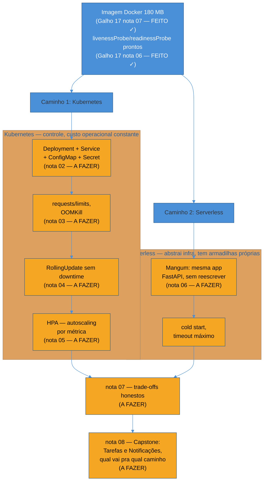

# Panorama — orquestrar de verdade

> [!abstract] TL;DR
> Os dois serviços da trilha — Tarefas e Notificações — saem do [[03-Dominios/Tecnologia/Python/Observabilidade e produção/index|Galho 17]] com um `Dockerfile` multi-stage de 180 MB, health checks que distinguem liveness de readiness, graceful shutdown e métricas expostas. Isso é o artefato — não é produção. Uma imagem Docker parada num registry não atende ninguém: falta algo que a baixe, a rode, a mantenha rodando depois de um crash, e a substitua sem downtime quando uma versão nova chegar. Este galho cobre os dois caminhos reais pra isso: **Kubernetes** (manifests que fazem um cluster consumir o contrato que o Galho 17 já expõe) e **serverless** (AWS Lambda via Mangum, pra cargas esporádicas onde manter um processo sempre ligado é dinheiro jogado fora). Nenhum dos dois é gratuito em complexidade — a honestidade sobre esse custo é o fio condutor do galho inteiro.

## A cena: a imagem que builda, sobe pro registry, e não vai a lugar nenhum

O pipeline de CI/CD da [[03-Dominios/Tecnologia/Python/Observabilidade e produção/07 - Deploy básico — Dockerfile e CI-CD|nota 07 do Galho 17]] termina exatamente onde parece que deveria terminar: `docker push`. A imagem do serviço de Notificações está lá, versionada pelo `github.sha`, 180 MB, pronta. Alguém do time comemora — "pronto, tá em produção" — e alguém mais experiente faz a pergunta desconfortável: **rodando onde?**

A resposta, nesse momento, é "em lugar nenhum". A imagem existe num registry (`ghcr.io/org/notificacoes:abc123`), o que é necessário mas longe de ser suficiente. Ninguém puxou essa imagem pra executar. Se alguém puxasse e rodasse `docker run` manualmente numa máquina, o serviço subiria — e continuaria dependendo inteiramente dessa pessoa pra notar quando o processo morresse, pra saber quantas réplicas rodar, pra fazer o deploy da próxima versão sem simplesmente matar o container antigo e esperar o novo subir rápido o suficiente pra ninguém notar a lacuna. Não existe reinício automático depois de um crash, não existe distribuição de carga entre réplicas, não existe nada consumindo os `livenessProbe`/`readinessProbe` que a [[03-Dominios/Tecnologia/Python/Observabilidade e produção/06 - Health checks e probes|nota 06 do Galho 17]] deixou prontos — porque esses endpoints só têm efeito prático se **alguma coisa** os consulta periodicamente e age sobre o resultado.

> [!question]- Isso não é só rodar `docker run` numa VM e configurar um `systemd` pra reiniciar se cair?
> Funcionaria, tecnicamente, pra uma réplica única de um serviço pequeno — e é exatamente assim que muita gente começa. O problema aparece na segunda pergunta óbvia: e quando o tráfego dobra e uma réplica não é mais suficiente? E quando uma versão nova precisa substituir a antiga sem que exista um segundo em que zero réplicas estão de pé? E quando a réplica está numa VM que caiu inteira, não só o processo? `systemd` reinicia um processo morto na mesma máquina — não reagenda esse processo numa máquina diferente, não distribui carga entre réplicas, não coordena um rollout gradual. Esse é exatamente o espaço que Kubernetes ocupa: um orquestrador que trata "quantas réplicas, onde elas rodam, o que fazer quando uma cai, como substituir sem downtime" como responsabilidades do cluster, não de scripts costurados à mão por serviço.

## Dois caminhos, uma pergunta em comum: quem mantém isso rodando?

A partir daqui, o galho segue dois caminhos que respondem à mesma pergunta — "o que roda essa imagem, de fato, em produção?" — com respostas estruturalmente diferentes.

O primeiro caminho é **Kubernetes de fato**: não o Dockerfile (isso já está pronto), mas os manifests — `Deployment`, `Service`, `ConfigMap`, `Secret` — que dizem ao cluster quantas réplicas manter, como distribuir tráfego entre elas, e como consumir os health checks que o Galho 17 já expõe pra decidir quando reiniciar um Pod e quando só tirá-lo da rotação. É o caminho de quem precisa de controle fino sobre a infraestrutura, de quem tem tráfego constante o suficiente pra justificar processos sempre ligados, e de quem está disposto a pagar o custo operacional de manter um cluster — porque Kubernetes não é grátis em conhecimento: alguém precisa entender `kubectl`, YAML de manifest, o modelo de rede interno do cluster, o que fazer quando um `Pod` fica em `CrashLoopBackoff`.

O segundo caminho é **serverless com AWS Lambda**, via `Mangum` — um adapter que traduz eventos do Lambda para o protocolo ASGI que a trilha já usa desde o [[03-Dominios/Tecnologia/Python/Web e APIs REST/index|Galho 8]], permitindo rodar a *mesma* aplicação FastAPI como função Lambda sem reescrever a lógica de negócio. Não existe cluster pra administrar, não existe réplica pra dimensionar manualmente — a AWS aloca capacidade sob demanda, por invocação, e cobra por isso. O custo operacional despenca, mas não desaparece: ele se desloca para dois problemas novos e específicos de serverless — **cold start** (a primeira invocação depois de um período ocioso paga o preço de inicializar o processo do zero, alguns segundos de latência que não existem num container sempre ligado) e **timeout** (uma função Lambda tem um limite máximo de execução — não serve pra processamento longo, e um handler mal dimensionado é abortado no meio, não fica só "mais lento").

O diagrama acima é o placar deste galho: a imagem Docker e o contrato de health check já estão prontos (azul, herdado do Galho 17); tudo o que orquestra essa imagem — dos dois lados — ainda está por fazer (âmbar, notas 02 a 08).

> [!tip] Kubernetes e serverless não são "melhor" e "pior" — são otimizados pra padrões de tráfego diferentes
> É tentador tratar essa escolha como uma hierarquia — "serverless é mais moderno, Kubernetes é legado" ou o oposto, "Kubernetes é sério, serverless é brinquedo". Nenhum dos dois enquadramentos sobrevive ao primeiro contato com custo real. Um serviço com tráfego constante, alto o suficiente pra manter processos ocupados a maior parte do tempo, paga menos rodando em containers sempre ligados — o custo por requisição cai quanto mais a capacidade alocada é de fato usada. Um serviço com tráfego esporádico ou em rajadas paga menos em serverless, porque não existe capacidade alocada (e cobrada) durante os períodos ociosos, que costumam ser a maior parte do tempo. A pergunta certa não é "qual tecnologia é melhor", é "qual é o formato do tráfego deste serviço específico" — e é exatamente essa pergunta que a [[07 - Containers vs serverless — trade-offs honestos|nota 07]] deste galho desenvolve a fundo.

## O custo que ninguém tira da equação

Vale nomear, já neste panorama, o que os dois caminhos custam — não em dinheiro, em conhecimento e atenção contínua — porque é fácil escolher um caminho pela promessa ("Kubernetes escala automaticamente", "serverless não tem infra pra administrar") sem contabilizar o que cada promessa exige de quem a sustenta.

Kubernetes exige que alguém no time entenda o vocabulário de cluster — `Pod`, `Deployment`, `Service`, `namespace` — e mais do que vocabulário, exige operação contínua: alguém precisa monitorar o cluster em si (não só os serviços que rodam nele), atualizar versões do próprio Kubernetes, entender por que um `Pod` ficou preso em `Pending` ou por que um `RollingUpdate` travou na metade. É poder real sobre a infraestrutura — mas poder que precisa ser exercido, não só possuído. Um cluster mal operado não é mais seguro que nenhum cluster.

Serverless abstrai boa parte disso — não existe cluster pra atualizar, não existe `Pod` preso em `Pending` — mas troca esse custo por um conjunto diferente de armadilhas, específicas do modelo: cold start que degrada latência de forma imprevisível justamente nos momentos de menor tráfego (quando o processo já esfriou), timeout que corta uma execução no meio sem aviso se ela ultrapassar o limite configurado, e um modelo de custo que parece simples ("paga por invocação") até alguém descobrir, tarde demais, que um padrão de tráfego mal compreendido pode custar mais em Lambda do que custaria em um container sempre ligado.

> [!warning] Escolher serverless só porque "não quero lidar com Kubernetes"
> **O que acontece:** um time evita aprender Kubernetes — decisão legítima, dado o custo de aprendizado real — e escolhe serverless por eliminação, sem examinar se o padrão de tráfego do serviço de fato se encaixa no modelo. Meses depois, o serviço tem tráfego constante e alto, e a fatura mensal do Lambda supera, de longe, o que o mesmo processamento custaria rodando continuamente em containers. **Por quê:** o preço por invocação do Lambda é competitivo justamente quando a maior parte do tempo não há invocação nenhuma acontecendo — é aí que "pagar só pelo que usa" bate um processo sempre ligado e ocioso na maior parte do tempo. Um serviço com tráfego alto e constante inverte essa vantagem: ele está, na prática, sempre invocando, e o preço por invocação deixa de competir com o custo (mais baixo, nesse regime) de manter capacidade fixa alocada. **Como evitar:** a decisão entre Kubernetes e serverless nunca deveria partir de "qual é mais fácil de operar hoje" isoladamente — ela precisa nascer do formato real do tráfego do serviço, o assunto central da [[07 - Containers vs serverless — trade-offs honestos|nota 07]] deste galho.

## O roteiro deste galho

O galho separa fisicamente os dois caminhos, e só os reúne no fim, quando a decisão específica dos dois serviços da trilha precisa ser tomada com todos os trade-offs já na mesa:

1. **[[02 - Kubernetes na prática — Deployment, Service, ConfigMap e Secret|Kubernetes na prática: Deployment, Service, ConfigMap e Secret]]** — os quatro manifests essenciais aplicados aos serviços da trilha: `Deployment` (réplicas, template do Pod, as probes que a [[03-Dominios/Tecnologia/Python/Observabilidade e produção/06 - Health checks e probes|nota 06 do Galho 17]] já deixou prontas), `Service` (roteamento interno), `ConfigMap` e `Secret` (configuração não-sensível e sensível, respectivamente).
2. **[[03 - Recursos e limites — requests, limits e OOMKill|Recursos e limites: requests, limits e OOMKill]]** — `resources.requests`/`resources.limits`, e o que acontece quando um Pod excede o limite de memória — um `OOMKill` abrupto, sem o graceful shutdown que a [[03-Dominios/Tecnologia/Python/Observabilidade e produção/05 - Configuração de servidor de produção — workers, timeouts e graceful shutdown|nota 05 do Galho 17]] já configurou para outros cenários de desligamento.
3. **[[04 - Rolling deploy sem downtime no Kubernetes|Rolling deploy sem downtime no Kubernetes]]** — como `RollingUpdate` coordena com `readinessProbe` e graceful shutdown pra garantir que nenhuma requisição em andamento seja cortada durante um deploy — a peça que faltava no [[03-Dominios/Tecnologia/Python/Observabilidade e produção/06 - Health checks e probes|Cenário 1 da nota 06 do Galho 17]].
4. **[[05 - Autoscaling — HPA baseado em métrica|Autoscaling: HPA baseado em métrica]]** — `HorizontalPodAutoscaler` reagindo não só a CPU, mas às métricas que a [[03-Dominios/Tecnologia/Python/Observabilidade e produção/03 - Métricas com OpenTelemetry e Prometheus client|nota 03 do Galho 17]] já expõe.
5. **[[06 - Serverless com AWS Lambda — Mangum e cold start|Serverless com AWS Lambda: Mangum e cold start]]** — a mesma aplicação FastAPI, sem reescrita, rodando como função Lambda; cold start e como mitigá-lo.
6. **[[07 - Containers vs serverless — trade-offs honestos|Containers vs serverless: trade-offs honestos]]** — a comparação direta de custo, latência e controle operacional que fundamenta a decisão do capstone.
7. **[[08 - Capstone — os dois serviços em produção de verdade|Capstone: os dois serviços em produção de verdade]]** — a decisão de fato, aplicada aos dois serviços reais da trilha.

> [!question]- Dá pra adiantar aqui qual serviço vai pra qual caminho?
> A resposta completa, com os números e trade-offs desenvolvidos, é do capstone — não faria sentido antecipá-la sem o ferramental das notas 02 a 07. Mas o formato de tráfego de cada serviço já foi nomeado ao longo da trilha, e vale deixar a pista: o serviço de Tarefas atende requisições HTTP diretas de usuários, em um volume que tende a ser mais constante ao longo do dia — o perfil onde manter processos sempre ligados costuma compensar. O serviço de Notificações, por outro lado, consome eventos de uma fila RabbitMQ ([[03-Dominios/Tecnologia/Python/Mensageria/index|Galho 14]]) — um padrão inerentemente mais irregular, com rajadas seguidas de silêncio, o formato onde pagar só por invocação tende a fazer mais sentido. Isso não é a decisão final — é o tipo de raciocínio que a nota 07 formaliza e que o capstone aplica com números.

## Em entrevista

Uma pergunta comum de entrevista sênior é "quando você escolheria Kubernetes e quando escolheria serverless" — e a resposta fraca trata isso como preferência de ferramenta ("eu prefiro Kubernetes porque dá mais controle"). A resposta forte nomeia o eixo real da decisão: formato de tráfego (constante vs. esporádico/em rajadas), o trade-off de custo que decorre disso (capacidade fixa paga por tempo vs. capacidade sob demanda paga por invocação), e reconhece que a decisão não é definitiva — dois serviços do mesmo sistema podem, legitimamente, tomar caminhos diferentes, porque o padrão de tráfego é uma propriedade do serviço, não da organização inteira.

## How to explain in English

> "Having a Docker image sitting in a registry isn't 'being in production' — nothing is pulling it, running it, restarting it after a crash, or replacing it without downtime. This module covers the two real paths to close that gap. Kubernetes gives you fine-grained control: manifests that tell the cluster how many replicas to run, how to route traffic, and how to consume the liveness/readiness contract the service already exposes — but that control comes with real, ongoing operational cost: someone has to actually run the cluster, not just configure it once. Serverless, via AWS Lambda and Mangum, runs the exact same FastAPI app without rewriting business logic, and removes most of that operational burden — but trades it for cold starts and hard execution timeouts. Neither is strictly better; the right choice depends on whether a service's traffic is steady or bursty, and that's a property of the service, not a company-wide preference."

| PT | EN |
|----|----|
| Orquestrador | Orchestrator |
| Réplica | Replica |
| Substituição sem downtime | Zero-downtime deployment |
| Autoscaling | Autoscaling |
| Início a frio | Cold start |
| Tempo limite de execução | Execution timeout |
| Capacidade sob demanda | On-demand capacity |
| Custo operacional | Operational overhead |

## Fontes

- Kubernetes. *What is Kubernetes?*. kubernetes.io. https://kubernetes.io/docs/concepts/overview/ (acessado em 2026-07-12) — visão geral do modelo de orquestração que as notas 02-05 deste galho desenvolvem.
- Kubernetes. *Deployments*. kubernetes.io. https://kubernetes.io/docs/concepts/workloads/controllers/deployment/ (acessado em 2026-07-12) — o objeto central que a nota 02 constrói sobre os serviços da trilha.
- AWS. *AWS Lambda Developer Guide — What is AWS Lambda?*. docs.aws.amazon.com. https://docs.aws.amazon.com/lambda/latest/dg/welcome.html (acessado em 2026-07-12) — modelo de execução e cobrança por invocação, base da nota 06.
- Jordaneremieff. *Mangum documentation*. mangum.io. https://mangum.io/ (acessado em 2026-07-12) — o adapter ASGI↔Lambda que a nota 06 usa pra rodar a mesma aplicação FastAPI sem reescrever.
- [[03-Dominios/Tecnologia/Python/Observabilidade e produção/07 - Deploy básico — Dockerfile e CI-CD|Deploy básico — Dockerfile e CI/CD]] — Galho 17 nota 07 — a imagem Docker que este galho orquestra, reusada sem reconstrução.
- [[03-Dominios/Tecnologia/Python/Observabilidade e produção/06 - Health checks e probes|Health checks e probes]] — Galho 17 nota 06 — o contrato de liveness/readiness que os manifests deste galho consomem.

Consultado em 2026-07-12.
