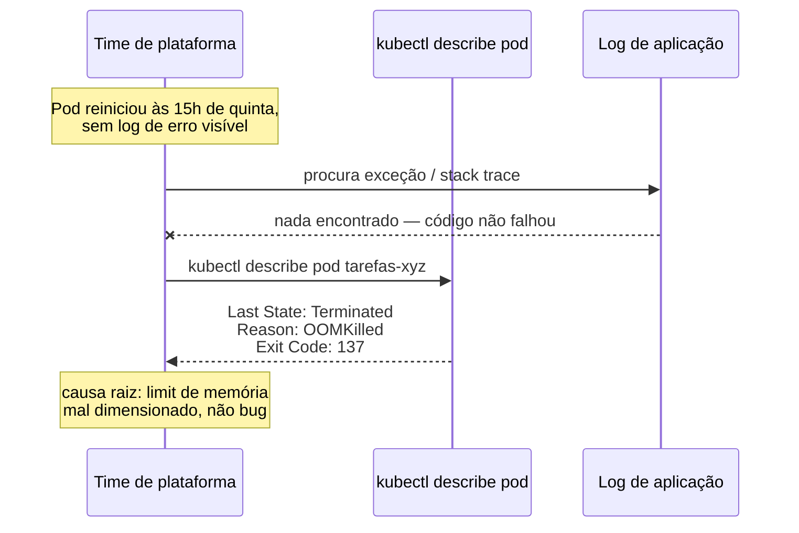
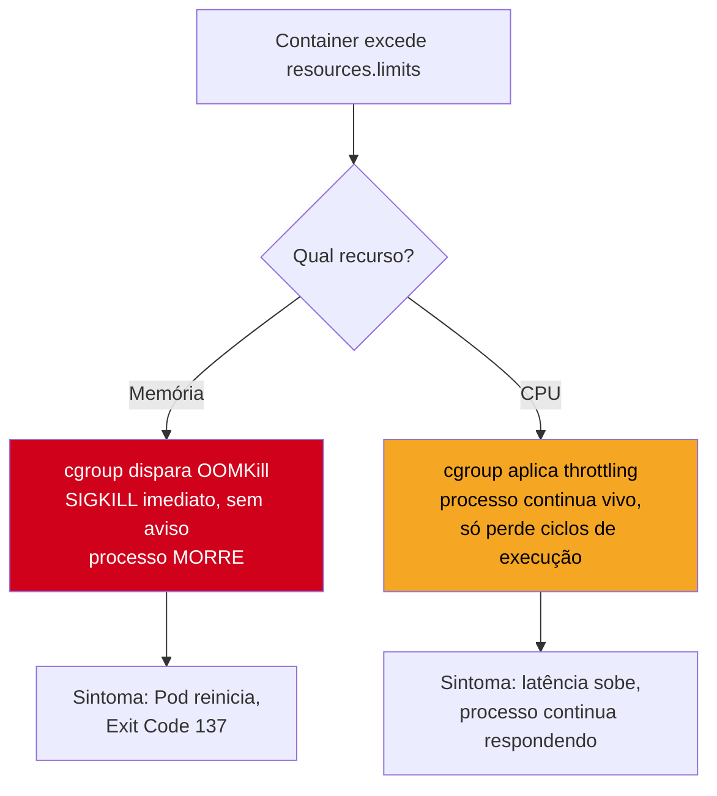
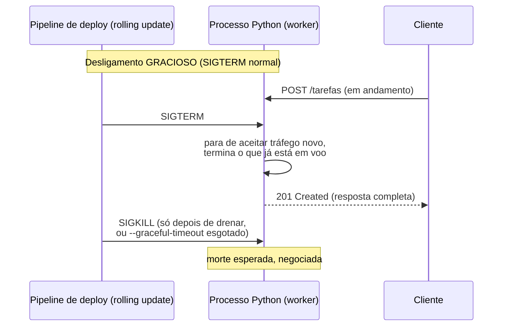
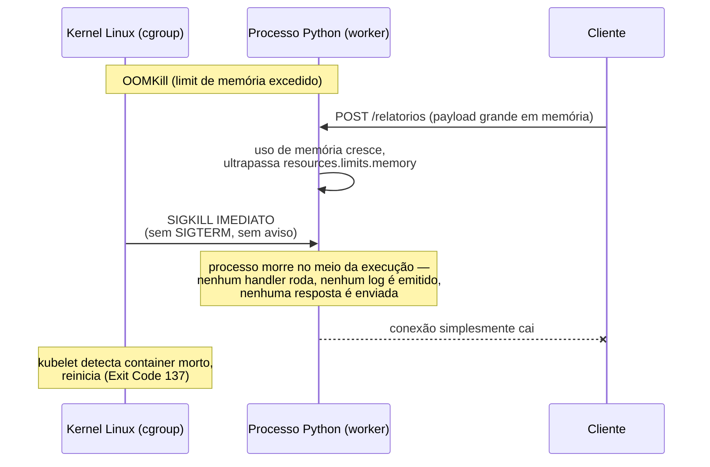
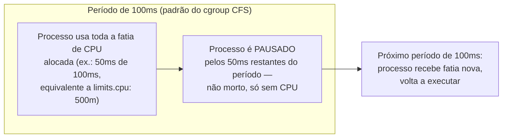

# Recursos e limites — requests, limits e OOMKill

> [!abstract] TL;DR
> `--graceful-timeout` no gunicorn ([[03-Dominios/Tecnologia/Python/Observabilidade e produção/05 - Configuração de servidor de produção — workers, timeouts e graceful shutdown|Galho 17 nota 05]]) resolve o desligamento **gracioso** de um processo — `SIGTERM`, drena, `SIGKILL` só depois. Esta nota é sobre o desligamento que não é gracioso de jeito nenhum: quando um Pod excede o `resources.limits.memory` configurado no manifest do Kubernetes, o **kernel do Linux** mata o processo direto, via cgroup, com `SIGKILL` — sem `SIGTERM`, sem handler, sem chance de terminar uma requisição em voo. É o **OOMKill**. `resources.requests` é o que o `kube-scheduler` reserva pra um Pod num nó; `resources.limits` é o teto que, se estourado em memória, mata o container instantaneamente — mas, se estourado em CPU, só joga fora ciclos de processamento (*throttling*), sem matar nada, o que costuma confundir quem diagnostica o sintoma errado. Dimensionar esses dois números não é achismo: são as métricas já expostas pelo `prometheus_client`/OpenTelemetry ([[03-Dominios/Tecnologia/Python/Observabilidade e produção/03 - Métricas com OpenTelemetry e Prometheus client|Galho 17 nota 03]]) que dizem quanto o processo realmente usa, em percentil, ao longo do tempo — não um número redondo copiado de um tutorial.

## A cena: o Pod que "morre sem motivo" toda quinta à tarde

O serviço de Tarefas, já rodando em Kubernetes com os manifests básicos de [[02 - Kubernetes na prática — Deployment, Service, ConfigMap e Secret|nota 02 deste galho]], começa a apresentar um padrão estranho: toda quinta-feira, por volta das 15h — o horário em que o time de operações roda um relatório semanal pesado, que agrega dados de milhares de tarefas num único payload processado em memória — um dos Pods do Deployment simplesmente reinicia. Sem exceção no log, sem stack trace, sem nada que aponte pra uma falha de código. O `kubectl get pods` mostra o Pod com `RESTARTS` incrementado; o `kubectl describe pod` traz uma linha que ninguém no time reconhece de cara:

```
Last State:     Terminated
Reason:         OOMKilled
Exit Code:      137
```

A primeira reação do time é procurar um bug — um vazamento de memória recém-introduzido, uma query que carrega dados demais. A investigação de código não encontra nada de novo: o relatório semanal sempre carregou um payload grande na memória, isso nunca mudou. O que mudou foi o manifest do Kubernetes, ajustado semanas antes por alguém que copiou `resources.limits.memory: "256Mi"` de um exemplo de blog, sem medir quanto o processo de fato usa sob esse workload específico. O relatório pesado da quinta-feira empurra o processo pra além de 256Mi de uso real de memória — e o kernel, não o código Python, decide que aquele processo precisa morrer, imediatamente, sem aviso prévio.

> [!warning] "O container morreu, deve ser bug no código" — o mito mais caro desta nota
> **O que acontece:** um Pod reinicia sem exceção no log, sem stack trace, sem nada que aponte pra uma falha de lógica — e o instinto natural é vasculhar o código em busca de um bug recém-introduzido, gastando horas numa investigação que não vai encontrar nada, porque não há nada de errado no código. **Por quê:** um `OOMKill` não é um erro de aplicação — é uma decisão do **kernel do Linux**, tomada fora do processo Python, sem consultar exception handler nenhum. O processo não recebe `SIGTERM`, não recebe `SIGKILL` gracioso, não tem chance de logar "estou morrendo" — porque o mecanismo que o mata é o mesmo cgroup que limita seus recursos, agindo no nível do sistema operacional, não da aplicação. **Como evitar:** antes de procurar bug de código quando um Pod reinicia sem log de erro, o primeiro comando é `kubectl describe pod <nome>` — se `Last State: Terminated` mostra `Reason: OOMKilled` e `Exit Code: 137`, a causa é **dimensionamento de recursos**, não lógica de aplicação. O resto desta nota é sobre como diagnosticar e corrigir isso com dados reais, em vez de aumentar o limite "até parar de acontecer", sem entender por quê.



## `requests` e `limits`: dois números com papéis diferentes

O bloco `resources` do manifest de um Pod Kubernetes tem duas seções, e confundir o papel de cada uma é a origem de boa parte dos incidentes desta nota:

```yaml
apiVersion: apps/v1
kind: Deployment
metadata:
  name: tarefas-service
spec:
  replicas: 3
  template:
    spec:
      containers:
        - name: tarefas-service
          image: registro/tarefas-service:1.4.0
          resources:
            requests:
              cpu: "250m"
              memory: "192Mi"
            limits:
              cpu: "500m"
              memory: "384Mi"
```

`cpu: "250m"` usa a notação de **millicores** — `1000m` equivale a um núcleo de CPU inteiro; `250m` é um quarto de um núcleo. `memory: "192Mi"` usa **mebibytes** (potência de 2: `1Mi = 2^20 bytes`), não megabytes (`1M = 10^6 bytes`) — a diferença é pequena, mas o Kubernetes distingue os dois sufixos, e usar o errado por hábito (`192M` em vez de `192Mi`) reserva um valor ligeiramente diferente do pretendido.

### `requests`: o que o scheduler garante

`resources.requests` é o valor que o `kube-scheduler` usa pra decidir **em qual nó** colocar o Pod. Um nó com 4 núcleos e 8Gi de memória, já hospedando Pods que somam `requests.cpu: 3500m` e `requests.memory: 6Gi`, só tem espaço pra um novo Pod se o `requests` dele couber no restante — `500m` de CPU e `2Gi` de memória livres, nesse exemplo. O scheduler soma `requests`, nunca `limits`, pra essa decisão: é uma **garantia mínima reservada**, não um teto.

### `limits`: o teto — e o que acontece ao estourá-lo depende do recurso

`resources.limits` é o teto que o kubelet, via cgroup, impõe ao container em runtime — mas o que acontece ao estourar esse teto **difere fundamentalmente** entre CPU e memória, e é exatamente essa diferença que confunde quem diagnostica o problema errado:



Memória excedida mata o processo. CPU excedida não mata nada — só reduz a fatia de tempo de processador que o container recebe, um mecanismo completamente diferente, coberto adiante nesta nota.

> [!question]- Por que memória mata e CPU não? Não seria mais consistente os dois se comportarem igual?
> Não, porque a natureza dos dois recursos é diferente. CPU é um recurso **compressível** — um processo pode receber menos ciclos de processador por segundo e continuar existindo, só mais devagar; não há como "devolver" CPU já usada, mas dá pra restringir o quanto ainda vai ser usado daqui pra frente sem destruir nada. Memória é um recurso **incompressível** — uma vez que um processo alocou 300Mi de heap, não existe um mecanismo do kernel pra "forçar" ele a devolver 100Mi sem intervir ativamente derrubando alguma coisa; o kernel não sabe *qual* parte da memória alocada é segura de liberar (isso é decisão da aplicação, não do sistema operacional). Diante de um processo que insiste em usar mais memória do que o cgroup permite, a única ação que o kernel pode tomar pra respeitar o limite é matar o processo inteiro e liberar tudo de uma vez — não existe equivalente a "throttling de memória" que preserve o processo vivo.

## OOMKill: o kernel mata, não a aplicação

O nome completo do mecanismo é **cgroup OOM killer** — um componente do kernel Linux que monitora o uso de memória de cada *control group* (cgroup) e, quando um processo dentro daquele cgroup tenta alocar memória além do limite configurado, seleciona um processo pra matar e envia `SIGKILL` diretamente a ele. É o mesmo mecanismo de OOM killer que existe há décadas no Linux pra proteger o sistema inteiro contra ficar sem memória — o Kubernetes só o aplica de forma isolada, por container, via cgroups, em vez de deixá-lo agir apenas no nível do sistema operacional inteiro.

### Contraste explícito: `SIGTERM` gracioso vs `SIGKILL` do OOM killer

A [[03-Dominios/Tecnologia/Python/Observabilidade e produção/05 - Configuração de servidor de produção — workers, timeouts e graceful shutdown|Galho 17 nota 05]] já construiu o mecanismo de desligamento gracioso: um deploy normal manda `SIGTERM`, o gunicorn para de aceitar conexões novas, drena as que já estão em andamento, e só manda `SIGKILL` depois de `--graceful-timeout` segundos, ou quando o worker já terminou de responder. É um desligamento **negociado** — o processo sabe que vai morrer, e tem uma janela pra se despedir direito.



O `OOMKill` não tem nenhuma dessas etapas — não existe negociação nenhuma:



A diferença central: o `SIGTERM` do deploy normal é um sinal que a aplicação **pode escolher como tratar** — é por isso que o gunicorn/uvicorn tem lógica de graceful shutdown pra reagir a ele. O `SIGKILL` do OOM killer **não pode ser interceptado, tratado ou ignorado por design** — é o mesmo `SIGKILL` que o próprio gunicorn usa como último recurso depois do `--graceful-timeout` esgotar, só que aqui é o primeiro e único sinal, sem `SIGTERM` antes. Nenhum handler de sinal em Python, nenhum bloco `finally`, nenhum `atexit` registrado tem chance de rodar — o processo simplesmente deixa de existir no meio da instrução que estava executando.

> [!tip] `Exit Code: 137` não é arbitrário
> `137 = 128 + 9`. Em Unix, um processo terminado por sinal reporta o código de saída como `128 + número do sinal`; `SIGKILL` é o sinal 9. Ver `Exit Code: 137` no `kubectl describe pod` é, na prática, o kubelet confirmando "este processo morreu por `SIGKILL`" — e, combinado com `Reason: OOMKilled` na mesma saída, a causa está identificada sem ambiguidade, sem precisar adivinhar.

## Por que processos Python têm uso de memória imprevisível

O incidente de abertura desta nota — o relatório semanal que empurra o processo além do limite — não é um caso isolado; é um padrão comum em serviços Python, por um motivo estrutural: o uso de memória de um processo Python **não é constante ao longo do tempo**, e o pico de uso muitas vezes não tem relação nenhuma com o tráfego médio.

Algumas fontes recorrentes de picos imprevisíveis de memória:

- **Payload grande sendo processado**: um endpoint que recebe um upload, um relatório que agrega milhares de registros num único objeto em memória antes de serializar a resposta, uma query que carrega uma lista inteira em vez de paginar — qualquer um desses pode multiplicar o uso de memória do processo por um fator de 10x ou mais, só naquele instante, voltando ao normal logo depois.
- **Memory leak não percebido**: um cache que cresce sem TTL, uma referência circular que o garbage collector geracional do CPython não coleta em determinadas condições, um listener de evento nunca removido — o tipo de vazamento que [[03-Dominios/Tecnologia/Python/Observabilidade e produção/05 - Configuração de servidor de produção — workers, timeouts e graceful shutdown|Galho 17 nota 05]] já cobriu como algo que `--max-requests` mitiga (reciclando o worker antes que o vazamento vire crash), mas que, sem essa mitigação, cresce indefinidamente até estourar qualquer `limit` configurado, por maior que seja.
- **Fragmentação do alocador do CPython**: o gerenciamento interno de memória do processo — como o `pymalloc` organiza arenas e pools pra objetos pequenos — pode manter memória reservada mesmo depois que os objetos que a ocupavam foram coletados, porque o alocador nem sempre devolve memória ao sistema operacional de imediato. Esse mecanismo é tratado em profundidade em [[03-Dominios/Tecnologia/Python/CPython internals/07 - Memory management — allocators, pymalloc e arenas|CPython internals, nota 07]] — aqui, o que importa reter é só que o número que o cgroup vê ("quanto este processo está usando, agora") pode ficar acima do que a aplicação "acha" que está usando, por causa de memória retida internamente pelo alocador, não por vazamento real de objetos vivos.

> [!question]- Isso é o mesmo assunto de gerenciamento de memória do CPython internals?
> Não — são dois níveis diferentes, olhando pra fora e pra dentro do mesmo processo. [[03-Dominios/Tecnologia/Python/CPython internals/07 - Memory management — allocators, pymalloc e arenas|CPython internals, nota 07]] e [[03-Dominios/Tecnologia/Python/CPython internals/03 - Reference counting e o Garbage Collector geracional|nota 03 do mesmo galho]] explicam como o **processo Python por dentro** gerencia memória — `pymalloc`, arenas, refcounting, o coletor geracional que limpa referências circulares. Esta nota olha o problema de **fora pra dentro**: não importa quão bem o CPython gerencia sua própria memória internamente, o cgroup do container não enxerga esse detalhe — ele só vê um número agregado, "quantos bytes este processo (e todos os seus filhos, se houver) estão usando agora", e mata o processo se esse número cruzar o `limit`. Um processo Python com gerenciamento de memória interno impecável ainda pode ser `OOMKilled` se o `limit` do container foi dimensionado pequeno demais pro workload real — as duas coisas são ortogonais.

A colisão entre uso imprevisível e um `limit` mal dimensionado é o padrão exato do incidente de abertura: o `limit` de `256Mi` foi copiado de um exemplo genérico, sem medir o comportamento real do serviço sob o workload do relatório semanal — que só acontece uma vez por semana, e por isso nunca apareceu nos testes de carga do dia a dia, que simulam tráfego típico, não o pico raro.

## Dimensionando com dados reais, não com achismo

A pergunta certa nunca é "que valor de `limit` é seguro?" isolada — é "qual é a distribuição real de uso de memória e CPU deste processo, ao longo do tempo, incluindo os picos legítimos?". E essa distribuição já está sendo coletada, se o serviço segue o que [[03-Dominios/Tecnologia/Python/Observabilidade e produção/03 - Métricas com OpenTelemetry e Prometheus client|Galho 17 nota 03]] instrumentou: um `Gauge`/`ObservableGauge` de uso de memória do processo (via `psutil` ou o próprio `resource` module lendo `/proc/self/status`, exportado como métrica), somado às métricas de infraestrutura que o `kubelet`/`cAdvisor` já expõe nativamente pra todo Pod, sem instrumentação de aplicação nenhuma — `container_memory_working_set_bytes` e `container_cpu_usage_seconds_total`, coletadas automaticamente pelo Prometheus quando faz *scrape* do `cAdvisor`.

```promql
# p95 de memória usada pelo container, na última semana,
# a base real pra dimensionar resources.limits.memory
quantile_over_time(0.95, container_memory_working_set_bytes{pod=~"tarefas-service-.*"}[7d])

# p95 de CPU usada, em núcleos, na última semana
quantile_over_time(0.95, rate(container_cpu_usage_seconds_total{pod=~"tarefas-service-.*"}[5m])[7d:])
```

> [!question]- `container_memory_working_set_bytes` é o mesmo número que `psutil.Process().memory_info().rss` dentro da aplicação Python?
> Não exatamente, e a diferença importa na hora de comparar os dois números lado a lado. O *working set* que o `cAdvisor`/kubelet reporta é uma métrica de nível de cgroup: memória residente (RSS) do processo, **menos** as páginas de cache de arquivos que o kernel considera facilmente reclamáveis sob pressão (ex.: páginas de I/O em cache que não pertencem a nenhuma alocação ativa da aplicação). É esse número — não o RSS bruto — que o cgroup usa como referência pra decidir se o container estourou `limits.memory`, porque o kernel primeiro tenta liberar cache reclamável antes de partir para o OOMKill. Já `psutil.Process().memory_info().rss` mede o RSS bruto do processo Python, sem esse ajuste. Na prática, os dois números costumam ficar próximos para um serviço web típico (que não faz I/O de arquivo pesado), mas divergem bastante em serviços que leem/escrevem muito em disco — e é o `working set` do `cAdvisor`, não o `psutil` da aplicação, que decide se o OOMKill dispara, então ele é a fonte de verdade pra dimensionar `limits.memory`.

O procedimento prático de dimensionamento, nesta ordem:

1. **Rodar em produção (ou staging com tráfego representativo) por um período que cubra os picos legítimos** — no incidente de abertura, isso significa pelo menos uma semana inteira, pra capturar o relatório de quinta-feira, não só um dia útil comum.
2. **Consultar o p95 (ou p99, dependendo da tolerância a risco) de uso de memória e CPU** — não o pico absoluto (que pode ser um outlier raro demais pra dimensionar em torno dele) nem a média (que esconde exatamente os picos que interessam).
3. **Configurar `requests` próximo da mediana/p50** de uso típico — é o que o scheduler reserva; superdimensionar aqui desperdiça capacidade do cluster (Pods reservam mais do que usam na maior parte do tempo), subdimensionar arrisca o Pod competir por recursos que na prática precisa.
4. **Configurar `limits.memory` acima do p95/p99 observado, com margem de segurança** — margem suficiente pra picos legítimos não medidos ainda (um relatório maior no futuro, uma campanha de marketing), mas não tão generosa a ponto de mascarar um vazamento real que deveria disparar `OOMKill` e ser investigado, em vez de silenciosamente tolerado por um limite folgado demais.
5. **Configurar `limits.cpu` com folga sobre o p95 de uso** — já que CPU não mata o processo ao estourar, o risco de um `limit` de CPU um pouco apertado é menor (throttling, não crash), mas ainda vale medir em vez de adivinhar, porque throttling demais também degrada a experiência do usuário, só que de um jeito mais silencioso.

> [!warning] Ajustar `limits` só depois do incidente é reativo — o certo é medir antes de fixar o valor pela primeira vez
> Copiar um `resources.limits.memory: "256Mi"` de um tutorial genérico, sem medir o workload real do serviço, é a origem mais comum do padrão "Pod que morre sem motivo aparente". A prática correta inverte a ordem: instrumentar as métricas de memória/CPU (Galho 17 nota 03) e os equivalentes de infraestrutura do `cAdvisor` **antes** de fixar `requests`/`limits` pela primeira vez, rodar sob carga representativa, e só então escrever o número no manifest — nunca o contrário. Ajustar depois de um `OOMKill` em produção funciona, mas significa que o incidente já aconteceu; medir antes evita que aconteça.

## CPU throttling: o erro de diagnóstico mais comum

Diferente de memória, estourar `resources.limits.cpu` não mata o processo — o cgroup aplica **throttling**: o container recebe uma fatia fixa de tempo de CPU a cada período de tempo (por padrão, 100ms), e se o processo já consumiu essa fatia inteira antes do período terminar, ele é pausado (não morto) até o próximo período começar.



O sintoma que isso produz em produção é enganoso: o serviço continua respondendo, os health checks continuam passando (o processo está vivo, só mais lento em certos instantes), mas a **latência** sobe de forma intermitente e difícil de correlacionar com uso de CPU olhando só pra fora, porque o processo parece "responder normal" na maior parte do tempo — o throttling acontece em rajadas curtas, dentro de períodos de 100ms, difíceis de perceber sem uma métrica específica.

> [!warning] Latência intermitente sob carga que "não bate" com o gráfico de CPU médio é o padrão clássico de throttling
> **O que acontece:** o time observa latência p99 subindo sob carga moderada, mas o gráfico de uso médio de CPU do Pod mostra, por exemplo, "só 60% do limit configurado" — e a conclusão errada é "não é CPU, deve ser I/O ou banco", investigando na direção errada. **Por quê:** o uso **médio** de CPU ao longo de um minuto pode estar bem abaixo do `limit`, e ainda assim o processo sofrer throttling em rajadas curtas, dentro de janelas de 100ms específicas, sempre que o processamento de uma requisição concentra CPU num instante muito curto (ex.: serialização pesada de um payload grande, um cálculo síncrono não otimizado). A média de um minuto inteiro esconde esses picos de sub-segundo — o throttling é medido e aplicado numa granularidade muito mais fina do que a maioria dos dashboards exibe por padrão. **Como evitar:** a métrica certa pra confirmar ou descartar throttling é `container_cpu_cfs_throttled_periods_total` (o número de períodos de 100ms em que o cgroup CFS pausou o processo por estourar a fatia), comparada com `container_cpu_cfs_periods_total` (o total de períodos observados) — ambas expostas nativamente pelo `cAdvisor`, sem instrumentação de aplicação. Uma razão alta entre as duas (`throttled_periods / periods`) confirma throttling como causa da latência, mesmo quando o uso médio de CPU parece confortavelmente abaixo do `limit`.

```promql
# Razão de períodos throttled — confirma CPU throttling como
# causa de latência, mesmo com uso médio de CPU aparentemente OK
rate(container_cpu_cfs_throttled_periods_total{pod=~"tarefas-service-.*"}[5m])
  /
rate(container_cpu_cfs_periods_total{pod=~"tarefas-service-.*"}[5m])
```

> [!question]- Por que não simplesmente não configurar `limits.cpu`, já que ele não mata o processo mesmo?
> É uma prática defensável em alguns times — deixar `requests.cpu` configurado (pro scheduler) e omitir `limits.cpu`, permitindo que o container use CPU ociosa do nó além do que reservou, quando disponível ("CPU sem teto"). O trade-off é previsibilidade: sem `limits.cpu`, um Pod com um bug de loop apertado pode consumir toda a CPU disponível de um nó, afetando outros Pods vizinhos que competem pelo mesmo recurso — o chamado *noisy neighbor*. Times que priorizam performance máxima por Pod, aceitando o risco de um vizinho barulhento, omitem `limits.cpu`; times que priorizam isolamento previsível entre Pods do mesmo nó configuram os dois. Não existe resposta universal — é uma escolha de trade-off explícita, não um default óbvio.

## QoS: como `requests` e `limits` juntos decidem quem morre primeiro

A relação entre `requests` e `limits` de um Pod não serve só pra scheduling e para o teto de cgroup — ela também define a **classe de Quality of Service (QoS)** daquele Pod, que o Kubernetes usa pra decidir a **ordem de prioridade de OOMKill** quando um nó inteiro (não só um container) fica sob pressão de memória.

```yaml
# Guaranteed: requests == limits, para CPU e memória
resources:
  requests:
    cpu: "500m"
    memory: "384Mi"
  limits:
    cpu: "500m"
    memory: "384Mi"
```

```yaml
# Burstable: requests < limits (o caso mais comum na prática)
resources:
  requests:
    cpu: "250m"
    memory: "192Mi"
  limits:
    cpu: "500m"
    memory: "384Mi"
```

```yaml
# BestEffort: nenhum requests/limits declarado (implícito, sem bloco resources)
```

- **`Guaranteed`**: `requests` igual a `limits`, para CPU **e** memória. É a classe de maior prioridade — o kubelet só mata um Pod `Guaranteed` por pressão de memória do nó como último recurso, depois de já ter matado todos os `Burstable` e `BestEffort` disponíveis. O trade-off é desperdício: o Pod reserva sempre o valor máximo que pode vir a usar, mesmo na maior parte do tempo em que usa menos.
- **`Burstable`**: `requests` menor que `limits`, em pelo menos um dos dois recursos — o padrão mais comum, e o que o manifest de exemplo desta nota usa. O Pod reserva só o que tipicamente precisa (`requests`), mas pode consumir até o teto (`limits`) nos picos, às custas de ser um candidato mais provável a OOMKill do nó do que um `Guaranteed`, se o nó inteiro ficar sob pressão.
- **`BestEffort`**: nenhum `requests`/`limits` declarado. É a classe de menor prioridade — o primeiro tipo de Pod que o kubelet mata quando o nó fica sob pressão de memória, independente de quanto aquele Pod específico estava de fato usando.

> [!tip] `Burstable` é o ponto de partida certo pra maioria dos serviços desta trilha
> `Guaranteed` desperdiça capacidade do cluster (reserva o pico como se fosse o normal); `BestEffort` é arriscado demais pra um serviço de produção (primeiro candidato a morrer sob pressão do nó, mesmo se comportando bem). `Burstable`, com `requests` calibrado no p50 de uso real e `limits` no p95/p99 com margem (o procedimento da seção anterior), é o equilíbrio que a maioria dos serviços web da trilha — Tarefas, Notificações — deveria usar. `Guaranteed` fica reservado pra cargas de trabalho realmente sensíveis a variação de performance, onde o custo de superdimensionar `requests` compensa a garantia extra de prioridade.

## Casos práticos

### Cenário 1: o relatório semanal, revisitado com dimensionamento correto

Voltando ao incidente de abertura: depois do `OOMKill` de quinta-feira, o time consulta `quantile_over_time(0.95, container_memory_working_set_bytes{pod=~"tarefas-service-.*"}[7d])` e descobre que o p95 real de uso de memória, incluindo a janela do relatório semanal, é `340Mi` — bem acima dos `256Mi` copiados do tutorial original. O `limits.memory` é revisado para `512Mi` (margem sobre o p95 medido, não um número redondo arbitrário), e `requests.memory` é calibrado em `200Mi` (próximo do p50 de uso em dias sem relatório). Na quinta seguinte, o mesmo relatório roda, o uso de memória sobe do mesmo jeito — só que agora fica dentro do `limit`, e nenhum `OOMKill` acontece. O comportamento do processo não mudou nada; só o número que o cgroup usa pra decidir quando matar passou a refletir a realidade medida, em vez de um palpite.

### Cenário 2: throttling mascarado de "problema de banco de dados"

Um serviço com `limits.cpu: "300m"` começa a apresentar p99 de latência subindo sob carga moderada. A primeira hipótese do time é o banco de dados — índice faltando, connection pool saturado (o mesmo tipo de investigação que [[03-Dominios/Tecnologia/Python/Observabilidade e produção/03 - Métricas com OpenTelemetry e Prometheus client|Galho 17 nota 03]] ensinou a fazer via o `Gauge` de saturação de pool). As métricas de banco, porém, mostram tudo normal — sem saturação de pool, sem queries lentas. Só ao consultar `rate(container_cpu_cfs_throttled_periods_total[5m]) / rate(container_cpu_cfs_periods_total[5m])` o time encontra uma razão de throttling acima de 40% durante os picos de latência — o processo estava sendo pausado por CPU insuficiente, não esperando por I/O de banco nenhum. `limits.cpu` é ajustado para `750m`, calibrado pelo p95 real de uso de CPU sob o mesmo tráfego, e a latência intermitente desaparece sem nenhuma mudança de código ou de configuração de banco de dados.

## `LimitRange` e `ResourceQuota`: rede de segurança no nível do namespace

Duas peças de configuração, no nível do **namespace** (não do Pod individual), valem menção porque previnem justamente o cenário do incidente de abertura — um `Deployment` sem `resources` nenhum declarado, virando `BestEffort` por omissão.

Um `LimitRange` define valores **default** de `requests`/`limits` que se aplicam automaticamente a qualquer container criado no namespace sem declarar `resources` explicitamente — e também pode impor um mínimo e um máximo permitido, rejeitando um manifest que tente declarar um `limit` absurdamente alto ou baixo:

```yaml
apiVersion: v1
kind: LimitRange
metadata:
  name: default-resources
  namespace: producao
spec:
  limits:
    - default:
        cpu: "500m"
        memory: "384Mi"
      defaultRequest:
        cpu: "250m"
        memory: "192Mi"
      type: Container
```

Um `ResourceQuota`, por sua vez, limita o **total agregado** de `requests`/`limits` que todos os Pods de um namespace, juntos, podem consumir — evitando que um único time, com dezenas de Deployments no mesmo namespace, esgote sozinho a capacidade do cluster inteiro sem ninguém perceber até faltar espaço para outro time:

```yaml
apiVersion: v1
kind: ResourceQuota
metadata:
  name: quota-producao
  namespace: producao
spec:
  hard:
    requests.cpu: "10"
    requests.memory: "20Gi"
    limits.cpu: "20"
    limits.memory: "40Gi"
```

Nenhuma das duas peças substitui o dimensionamento cuidadoso desta nota, por container — elas são uma **rede de segurança** no nível de namespace/cluster, garantindo que um manifest esquecido (sem `resources` nenhum) não vire `BestEffort` silenciosamente, e que a soma de todos os serviços de um time não ultrapasse o que o cluster de fato comporta. Esta nota não desenvolve a administração completa de `LimitRange`/`ResourceQuota` — isso é território de quem administra o cluster (plataforma/SRE), não de quem escreve o manifest de um serviço específico; o que importa reter aqui é que essas peças existem, e que um `Deployment` sem `resources` declarado não fica necessariamente "sem limite nenhum" se o namespace tiver um `LimitRange` configurado.

## Automatizando o dimensionamento: onde o `Vertical Pod Autoscaler` entra (e onde esta nota para)

O procedimento manual desta nota — consultar percentis, ajustar o manifest, medir de novo depois de um período — tem um equivalente automatizado no Kubernetes: o `Vertical Pod Autoscaler` (VPA), um componente (não embutido no core do Kubernetes; instalado à parte) que observa o uso real de CPU/memória de um workload ao longo do tempo e recomenda — ou, em modo automático, aplica diretamente — valores de `requests`/`limits` ajustados, sem intervenção manual.

> [!warning] VPA e o `HorizontalPodAutoscaler` da [[05 - Autoscaling — HPA baseado em métrica|nota 05 deste galho]] não se combinam ingenuamente no mesmo recurso
> Usar VPA (ajusta `requests`/`limits` de **cada Pod**, verticalmente) e HPA baseado em CPU/memória (ajusta o **número de réplicas**, horizontalmente) sobre o mesmo `Deployment`, ambos observando o mesmo sinal de CPU, cria um conflito: o VPA muda o `requests.cpu` de referência que o HPA usa como base percentual pro cálculo de escala, potencialmente fazendo os dois mecanismos reagirem um ao ajuste do outro em ciclo. A combinação segura, quando necessária, é VPA cuidando de CPU/memória e HPA escalando por uma métrica **diferente** (latência, tamanho de fila — o caso de métrica customizada que a nota 05 deste galho desenvolve), nunca os dois brigando pelo mesmo sinal de CPU.

Esta nota não desenvolve a instalação e configuração do VPA — é um componente de infraestrutura de cluster, com seu próprio ciclo de vida de instalação e seus próprios riscos operacionais (o modo automático reinicia Pods pra aplicar novos valores, um trade-off que precisa ser avaliado por quem administra o cluster). O que importa reter é que o **raciocínio** desta nota — dimensionar com percentis medidos, não com achismo — é o mesmo raciocínio que o VPA automatiza; entender o procedimento manual primeiro é o que torna possível avaliar se vale a pena, mais tarde, confiar esse trabalho a um componente automatizado.

## Síntese: os dois recursos, os dois comportamentos, o mesmo cuidado

| | Memória excedida | CPU excedida |
|---|---|---|
| Ação do cgroup | `SIGKILL` imediato (OOMKill) | Throttling (pausa até o próximo período) |
| Processo morre? | Sim, sem aviso | Não — continua vivo, mais lento |
| Sintoma visível | Pod reinicia, `Exit Code: 137` | Latência intermitente sob carga |
| Métrica de diagnóstico | `container_memory_working_set_bytes` vs `limits.memory` | `container_cpu_cfs_throttled_periods_total` / `_periods_total` |
| Como dimensionar | p95/p99 de uso real + margem | p95/p99 de uso real + margem |

Os dois compartilham a mesma raiz de solução: medir o uso real com as métricas já expostas ([[03-Dominios/Tecnologia/Python/Observabilidade e produção/03 - Métricas com OpenTelemetry e Prometheus client|Galho 17 nota 03]] no nível de aplicação, `cAdvisor` no nível de infraestrutura), antes de fixar `requests`/`limits` no manifest, em vez de copiar um número redondo de um exemplo genérico e só descobrir que estava errado quando um `OOMKill` inesperado — ou uma onda de latência intermitente sem causa óbvia — já aconteceu em produção.

O desligamento gracioso da [[03-Dominios/Tecnologia/Python/Observabilidade e produção/05 - Configuração de servidor de produção — workers, timeouts e graceful shutdown|Galho 17 nota 05]] e o `OOMKill` desta nota são as duas faces de "como um processo Python termina em produção" — uma negociada, dentro do controle da aplicação; a outra imposta de fora, pelo kernel, sem negociação nenhuma. Saber diferenciar os dois pelo `Exit Code` e pela ausência (ou presença) de log de shutdown gracioso é o primeiro passo de qualquer investigação de Pod que reinicia inesperadamente.

## Em entrevista

Uma pergunta comum em entrevista sênior sobre Kubernetes é "o que você configura em `resources` de um manifest, e por quê?" — a resposta fraca é "requests e limits, pra CPU e memória". A resposta forte distingue os dois comportamentos ao estourar: memória excedida é `SIGKILL` imediato via cgroup (OOMKill, sem graceful shutdown possível), CPU excedida é throttling (processo sobrevive, só perde ciclos) — e explica que o dimensionamento correto vem de métricas de uso real ao longo do tempo (p95/p99), não de um valor arbitrário copiado de outro serviço. Um sinal ainda mais forte é mencionar que `Exit Code: 137` é `128 + SIGKILL(9)`, e que `container_cpu_cfs_throttled_periods_total` é a métrica que confirma throttling quando a latência sobe sem o uso médio de CPU parecer alto — evidência de que a pessoa já debugou isso de verdade, não só leu a definição uma vez.

## How to explain in English

> "Kubernetes resource limits behave completely differently depending on the resource. Exceed a memory limit, and the kernel's cgroup OOM killer sends SIGKILL immediately — no SIGTERM, no graceful shutdown handler, no chance for the process to finish an in-flight request or even log that it's dying. It's a hard kill from outside the process, completely different from a normal SIGTERM during a rolling deploy, where the app gets to drain connections first. Exceed a CPU limit, on the other hand, and nothing dies — the cgroup just throttles the container, pausing it for the rest of each 100ms period once it's used its allotted CPU slice. That shows up as intermittent latency, not a crash, which is why teams often misdiagnose it: average CPU usage looks fine over a minute, but short bursts get throttled within 100ms windows the dashboard doesn't show by default. The fix for both is the same discipline: measure real memory and CPU usage percentiles from metrics before setting requests/limits, instead of copying a round number from a tutorial and finding out it was wrong when a pod restarts unexpectedly in production."

| PT | EN |
|----|----|
| Requisição de recurso | Resource request |
| Limite de recurso | Resource limit |
| Millicores | Millicores |
| Mebibyte | Mebibyte (Mi) |
| Escalonador do Kubernetes | kube-scheduler |
| Morte por falta de memória | Out-of-memory kill (OOMKill) |
| Estrangulamento de CPU | CPU throttling |
| Vizinho barulhento | Noisy neighbor |
| Percentil | Percentile |

## O que vem a seguir

Com `requests`/`limits` dimensionados e a diferença entre OOMKill e throttling entendida, o próximo passo natural é usar esse mesmo cuidado com recursos dentro de um mecanismo mais amplo: como o Kubernetes coordena a substituição de Pods durante um deploy sem derrubar tráfego, e como escalar o número de réplicas automaticamente com base em métricas reais — os dois assuntos das próximas notas do galho.

- [[04 - Rolling deploy sem downtime no Kubernetes|04 — Rolling deploy sem downtime no Kubernetes]] — como o Kubernetes coordena `readinessProbe` e o graceful shutdown do processo (Galho 17 nota 05) durante um rolling update; um Pod com `resources` mal dimensionado e sujeito a OOMKill sob carga do deploy também compromete essa coordenação.
- [[05 - Autoscaling — HPA baseado em métrica|05 — Autoscaling: HPA baseado em métrica]] — o `HorizontalPodAutoscaler` usa exatamente o mesmo tipo de métrica de uso de CPU/memória desta nota (via `requests` como referência percentual) pra decidir quando criar réplicas novas — dimensionar `requests` errado nesta nota distorce diretamente o gatilho de autoscaling da próxima.

## Veja também

- [[index|Cloud-native e produção]] — MOC deste galho.
- [[02 - Kubernetes na prática — Deployment, Service, ConfigMap e Secret|02 — Kubernetes na prática: Deployment, Service, ConfigMap e Secret]] — o manifest do `Deployment` onde o bloco `resources` desta nota se encaixa.
- [[03-Dominios/Tecnologia/Python/Observabilidade e produção/05 - Configuração de servidor de produção — workers, timeouts e graceful shutdown|Galho 17 nota 05 — Configuração de servidor de produção]] — o desligamento gracioso (`SIGTERM`) contrastado nesta nota com o `SIGKILL` abrupto do OOMKill.
- [[03-Dominios/Tecnologia/Python/Observabilidade e produção/03 - Métricas com OpenTelemetry e Prometheus client|Galho 17 nota 03 — Métricas com OpenTelemetry e Prometheus client]] — as métricas de aplicação usadas para dimensionar `requests`/`limits` com dados reais.
- [[03-Dominios/Tecnologia/Python/CPython internals/07 - Memory management — allocators, pymalloc e arenas|CPython internals, nota 07 — Memory management]] — gerenciamento de memória dentro do processo, complementar ao limite imposto de fora pelo cgroup.

## Fontes

- Kubernetes. *Resource Management for Pods and Containers*. kubernetes.io. https://kubernetes.io/docs/concepts/configuration/manage-resources-containers/ (acessado em 2026-07-12) — referência canônica de `requests`/`limits`, unidades de CPU (millicores) e memória (Mi/Gi), e como o `kube-scheduler` usa `requests` para colocação de Pods.
- Kubernetes. *Configure Quality of Service for Pods*. kubernetes.io. https://kubernetes.io/docs/tasks/configure-pod-container/quality-service-pod/ (acessado em 2026-07-12) — como a relação entre `requests` e `limits` determina a classe de QoS (`Guaranteed`/`Burstable`/`BestEffort`) e a ordem de prioridade de OOMKill entre Pods do mesmo nó sob pressão de memória.
- Kubernetes. *Node-pressure Eviction*. kubernetes.io. https://kubernetes.io/docs/concepts/scheduling-eviction/node-pressure-eviction/ (acessado em 2026-07-12) — comportamento do kubelet e do OOM killer do kernel sob pressão de memória no nível do nó, além do OOMKill por container.
- Red Hat / Kernel.org. *cgroups(7) — Linux manual page*. man7.org. https://man7.org/linux/man-pages/man7/cgroups.7.html (acessado em 2026-07-12) — mecanismo de control groups do kernel Linux, base de como o cgroup aplica limites de memória (OOM killer) e CPU (CFS bandwidth control / throttling).
- Kubernetes Blog. *Grokking the Kubernetes container resource limits*. kubernetes.io/blog. Referenciado via documentação oficial de gerenciamento de recursos (link acima) — comportamento de CPU CFS quota/period e a origem das métricas `container_cpu_cfs_throttled_periods_total`/`container_cpu_cfs_periods_total` expostas pelo cAdvisor.
- [[03-Dominios/Tecnologia/Python/Observabilidade e produção/05 - Configuração de servidor de produção — workers, timeouts e graceful shutdown|Configuração de servidor de produção — workers, timeouts e graceful shutdown]] — Galho 17, nota 05 — o desligamento gracioso (`SIGTERM`) contrastado nesta nota com o `SIGKILL` abrupto do OOMKill.
- [[03-Dominios/Tecnologia/Python/Observabilidade e produção/03 - Métricas com OpenTelemetry e Prometheus client|Métricas com OpenTelemetry e Prometheus client]] — Galho 17, nota 03 — as métricas de memória/CPU usadas nesta nota para dimensionar `requests`/`limits` com dados reais.
- [[03-Dominios/Tecnologia/Python/CPython internals/07 - Memory management — allocators, pymalloc e arenas|Memory management — allocators, pymalloc e arenas]] — CPython internals, nota 07 — gerenciamento de memória DENTRO do processo Python, complementar (não repetido) ao limite imposto de FORA pelo container/cgroup.

Consultado em 2026-07-12.
