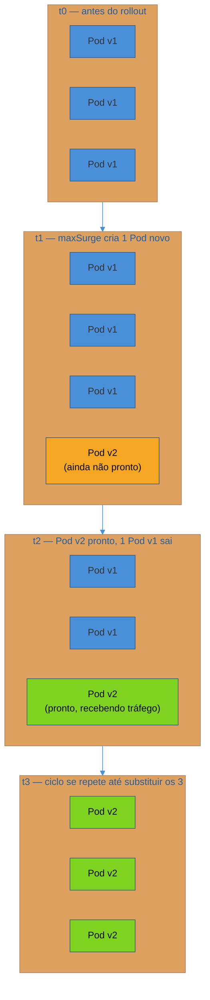
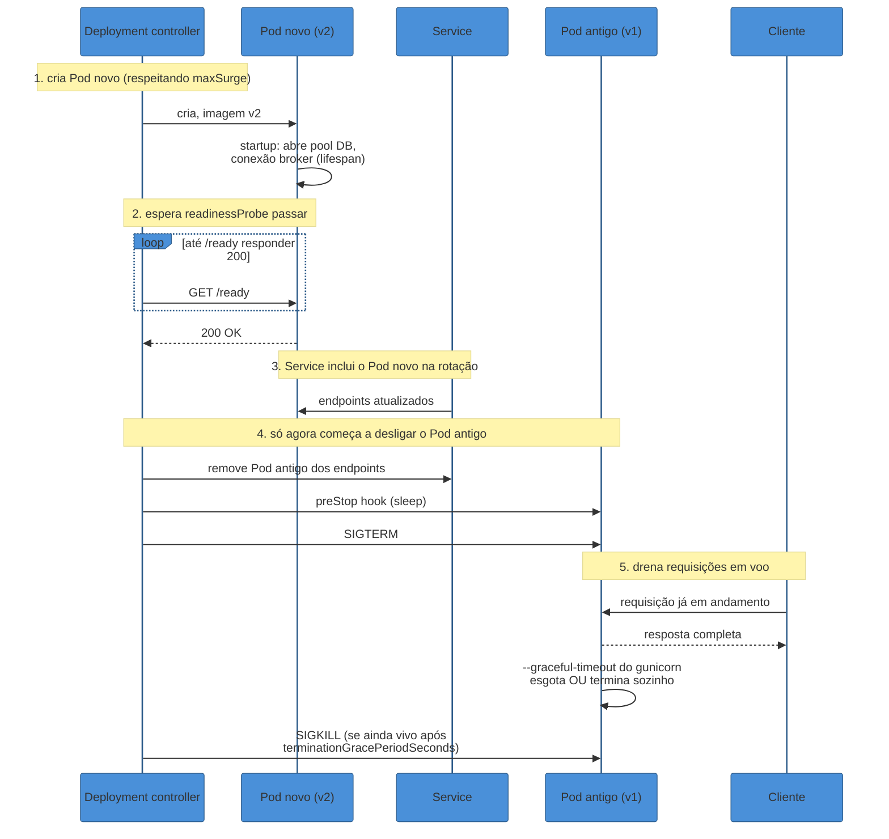
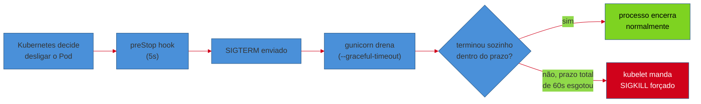
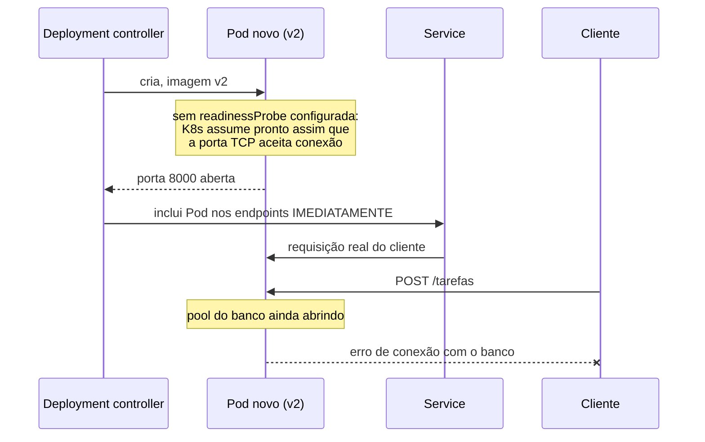

# Rolling deploy sem downtime no Kubernetes

> [!abstract] TL;DR
> O `Deployment` do serviço de Tarefas ([[02 - Kubernetes na prática — Deployment, Service, ConfigMap e Secret|nota 02 deste galho]]) já tem `readinessProbe` no manifest, e o processo Python já sabe fazer graceful shutdown com `SIGTERM` ([[03-Dominios/Tecnologia/Python/Observabilidade e produção/05 - Configuração de servidor de produção — workers, timeouts e graceful shutdown|Galho 17 nota 05]]). Esta nota é sobre a peça que amarra os dois: a estratégia `RollingUpdate` do `Deployment` (`maxSurge`/`maxUnavailable`, controlando quantos Pods novos sobem e quantos antigos podem sair de circulação ao mesmo tempo) e o algoritmo com que o Kubernetes coordena um Pod novo nascendo com um Pod antigo morrendo — sem nunca, num rollout saudável, deixar um cliente sem resposta. O algoritmo tem cinco passos, e cada um depende de um mecanismo específico: cria o Pod novo → espera o `readinessProbe` passar → só então o `Service` inclui o Pod na rotação de tráfego → só então começa a desligar o Pod antigo, com um `preStop` hook seguido de `SIGTERM` → o processo Python dentro do Pod antigo drena requisições em voo até o `terminationGracePeriodSeconds` esgotar, ou até terminar sozinho — o que vier primeiro. Zero downtime não é uma propriedade do Kubernetes; é o resultado de dois contratos, um de cada lado da fronteira YAML/código, calibrados pra bater exatamente no meio.

## A cena: o rollout que "funcionou", mas cortou tráfego mesmo assim

O time do serviço de Tarefas, com o manifest completo da [[02 - Kubernetes na prática — Deployment, Service, ConfigMap e Secret|nota 02]] já em produção — três réplicas, `readinessProbe` apontando pra `/ready`, `livenessProbe` apontando pra `/health` —, publica uma correção pequena numa sexta-feira de manhã. `kubectl set image deployment/tarefas-service tarefas-service=ghcr.io/org/tarefas-service:b7e2c14` dispara o rollout. Alguns minutos depois, `kubectl rollout status deployment/tarefas-service` reporta sucesso: `deployment "tarefas-service" successfully rolled out`. Sem erro nenhum no pipeline, sem alerta disparado, tudo verde.

Só que o dashboard de erros do serviço mostra, exatamente na janela do deploy, um punhado de `502 Bad Gateway` — poucos, menos de uma dúzia, mas reais, e visíveis pra clientes reais que mandaram requisição naquele instante específico. O time já corrigiu esse exato sintoma antes, na [[03-Dominios/Tecnologia/Python/Observabilidade e produção/05 - Configuração de servidor de produção — workers, timeouts e graceful shutdown|nota 05 do Galho 17]] — `--graceful-timeout` configurado no `gunicorn`, `SIGTERM` tratado corretamente, requisições em voo drenadas antes do processo morrer. Mas aquela correção rodava fora do Kubernetes, num ambiente onde o próprio `gunicorn` controlava o ciclo completo do sinal. Agora, dentro de um cluster, existe uma camada nova entre "o deploy decide trocar o Pod" e "o processo Python recebe `SIGTERM`" — e é justamente nessa camada que os `502`s desta sexta-feira nascem.

A investigação encontra dois problemas, dos dois lados da fronteira YAML/código, cada um suficiente sozinho pra produzir exatamente esse sintoma:

1. O `Deployment` não tinha `strategy.rollingUpdate` configurado explicitamente — o Kubernetes usa os padrões (`maxSurge: 25%`, `maxUnavailable: 25%`), que funcionam, mas ninguém tinha verificado se esses percentuais eram os certos pro tráfego real do serviço.
2. O `terminationGracePeriodSeconds` do Pod — o prazo que o **Kubernetes** dá antes de forçar `SIGKILL` — estava no padrão de 30 segundos, mas o `--graceful-timeout` do `gunicorn` **dentro** do processo estava configurado em 45 segundos, herdado de um ajuste feito meses antes pra um endpoint de relatório mais lento. O Kubernetes matava o processo à força **antes** do gunicorn ter terminado de drenar sozinho.

Nenhum dos dois problemas aparece em `kubectl rollout status` — ele só reporta se o número de réplicas prontas bateu com o desejado, não se alguma requisição foi cortada no meio do caminho. "Rollout com sucesso" e "rollout sem downtime" são afirmações diferentes, e confundir as duas é o erro de raiz desta cena.

> [!warning] `kubectl rollout status` verde não significa zero downtime
> **O que acontece:** um time confia que "o rollout terminou sem erro" equivale a "nenhum cliente sentiu o deploy" — e só descobre o contrário quando um dashboard de erros, monitorado separadamente, mostra um pico correlacionado com o horário do deploy. **Por quê:** `kubectl rollout status` mede só uma coisa: se o `Deployment` atingiu o estado desejado (réplicas novas prontas, réplicas antigas removidas). Ele não tem visibilidade nenhuma sobre o que aconteceu com requisições individuais durante a transição — isso depende inteiramente da coordenação entre `readinessProbe`, `Service`, `preStop`/`SIGTERM` e o graceful shutdown do processo, os mecanismos que o resto desta nota desenvolve. **Como evitar:** tratar "rollout sem erro" e "rollout sem downtime" como duas garantias separadas, verificadas por instrumentos diferentes — a primeira por `kubectl rollout status`, a segunda por uma métrica de taxa de erro HTTP durante a janela do deploy (o mesmo `prometheus_client` do [[03-Dominios/Tecnologia/Python/Observabilidade e produção/03 - Métricas com OpenTelemetry e Prometheus client|Galho 17 nota 03]]), correlacionada explicitamente com o timestamp de cada rollout.

## `RollingUpdate`: `maxSurge` e `maxUnavailable`

Todo `Deployment` do Kubernetes tem um campo `strategy`, com dois valores possíveis: `Recreate` (mata todos os Pods antigos antes de criar os novos — downtime garantido, útil só quando duas versões não podem coexistir, ex: uma migração de schema incompatível) e `RollingUpdate` — o padrão, e o único relevante pra esta nota, porque substitui Pods gradualmente, mantendo o serviço no ar durante a transição inteira.

```yaml
# deployment-tarefas.yaml — trecho de strategy, complementando a nota 02
apiVersion: apps/v1
kind: Deployment
metadata:
  name: tarefas-service
spec:
  replicas: 3
  strategy:
    type: RollingUpdate
    rollingUpdate:
      maxSurge: 1
      maxUnavailable: 0
  # ... selector, template (livenessProbe/readinessProbe já na nota 02)
```

Dois números controlam o ritmo da substituição, e ambos podem ser um valor absoluto (`1`) ou uma porcentagem das réplicas desejadas (`25%`):

- **`maxSurge`** — quantos Pods **a mais** do número de réplicas desejadas o Kubernetes tem permissão de criar temporariamente, durante o rollout. Com `replicas: 3` e `maxSurge: 1`, o cluster pode ter até 4 Pods do `tarefas-service` rodando ao mesmo tempo — 3 antigos ainda servindo, 1 novo subindo — antes de começar a remover algum antigo.
- **`maxUnavailable`** — quantos Pods, do total desejado, podem estar **indisponíveis** (fora da rotação de tráfego, seja porque ainda não passaram no `readinessProbe`, seja porque já estão sendo desligados) ao mesmo tempo, durante o rollout. `maxUnavailable: 0` significa que o Kubernetes nunca reduz a capacidade real de atendimento abaixo do número de réplicas desejadas — ele só remove um Pod antigo depois que um Pod novo já estiver pronto pra substituí-lo.



`maxUnavailable: 0` com `maxSurge: 1` — a combinação do exemplo acima — é a escolha mais conservadora possível: capacidade nunca cai abaixo do desejado, à custa de usar temporariamente um Pod a mais de recursos do cluster durante cada rollout. É o par de valores certo quando o serviço não tolera nenhuma redução de capacidade, nem por alguns segundos — o caso do `tarefas-service`, que atende tráfego constante o dia inteiro.

> [!tip] O padrão do Kubernetes (`25%`/`25%`) não é "seguro por definição" — depende do número de réplicas
> Sem `rollingUpdate` explícito no manifest, o Kubernetes usa `maxSurge: 25%` e `maxUnavailable: 25%`. Com `replicas: 3`, `25%` de 3 arredonda pra 1 — então o comportamento acaba sendo parecido com o exemplo desta nota, por acidente. Mas com `replicas: 4`, `25%` de `maxUnavailable` já permite 1 Pod indisponível ao mesmo tempo — uma fatia real de capacidade reduzida durante o rollout, que pode ou não ser aceitável dependendo do tráfego do serviço. Confiar no padrão sem calcular o que ele significa pro número de réplicas real do seu `Deployment` é a mesma armadilha do `resources.limits` copiado sem medir, já coberta na [[03 - Recursos e limites — requests, limits e OOMKill|nota 03 deste galho]]: um número que "parece razoável" em abstrato pode ser errado pro caso concreto.

> [!question]- Por que não simplesmente usar `maxSurge` alto e `maxUnavailable: 0` sempre, pra rollout mais rápido e sem risco?
> Porque `maxSurge` alto consome mais recursos do cluster **de uma vez** — cada Pod extra criado durante o rollout precisa que o `kube-scheduler` encontre um nó com `resources.requests` livres pra ele (o mesmo mecanismo de scheduling coberto na [[03 - Recursos e limites — requests, limits e OOMKill|nota 03 deste galho]]). Um `maxSurge` de `100%` num `Deployment` com 20 réplicas tentaria criar 20 Pods novos simultaneamente, exigindo que o cluster tenha capacidade sobrando pra dobrar o serviço momentaneamente — capacidade que, em muitos clusters, simplesmente não existe de forma ociosa. `maxSurge: 1` (ou uma porcentagem pequena) troca velocidade de rollout por um consumo de recursos incremental, mais fácil de o cluster absorver sem competir por capacidade com outros serviços rodando ao lado.

## O algoritmo, passo a passo

Com `RollingUpdate` configurado, o controller do `Deployment` executa uma sequência coordenada pra cada Pod substituído — e é exatamente essa sequência, não a estratégia em si, que decide se o rollout corta tráfego ou não.



Os cinco passos, em prosa:

1. **Cria o Pod novo**, respeitando `maxSurge` — o controller nunca ultrapassa o teto de Pods simultâneos configurado.
2. **Espera o `readinessProbe` passar** — o Pod novo existe, o processo Python já iniciou, mas o Kubernetes não considera esse Pod "pronto pra tráfego" até `/ready` responder `200` de forma consistente (respeitando `failureThreshold`, já coberto na [[03-Dominios/Tecnologia/Python/Observabilidade e produção/06 - Health checks e probes|nota 06 do Galho 17]]). É a mesma janela de warm-up — abertura do pool de banco, conexão com o broker — descrita naquela nota, agora amarrada explicitamente ao rollout.
3. **Só então o `Service` inclui o Pod na rotação de tráfego** — o `kube-proxy` atualiza a lista de `endpoints` do `Service` (o objeto coberto na [[02 - Kubernetes na prática — Deployment, Service, ConfigMap e Secret|nota 02 deste galho]]), e requisições novas passam a poder cair nesse Pod. Antes deste passo, zero tráfego real chega ao Pod novo — mesmo que ele já esteja "Running".
4. **Só então começa a desligar um Pod antigo** — com `maxUnavailable: 0`, esse passo só acontece depois que o passo 3 já garantiu que a capacidade total não caiu. O Kubernetes remove o Pod antigo dos `endpoints` do `Service` primeiro (parando de rotear tráfego **novo** pra ele), dispara um `preStop` hook se configurado, e então envia `SIGTERM`.
5. **O processo Python drena requisições em voo** — o mesmo `--graceful-timeout` do `gunicorn` da [[03-Dominios/Tecnologia/Python/Observabilidade e produção/05 - Configuração de servidor de produção — workers, timeouts e graceful shutdown|nota 05 do Galho 17]] entra em ação aqui, dentro do contexto de um Pod Kubernetes: para de aceitar conexão nova, termina o que já estava em andamento. Se o processo não terminar sozinho dentro do `terminationGracePeriodSeconds` do Pod, o kubelet manda `SIGKILL` — a mesma morte abrupta que o `OOMKill` já mostrou na [[03 - Recursos e limites — requests, limits e OOMKill|nota 03 deste galho]], só que aqui por estouro de prazo, não de memória.

> [!question]- O passo 3 e o passo 4 não podem acontecer ao mesmo tempo, "por acaso", numa condição de corrida?
> Não por design — o controller do `Deployment` trata os dois como sequenciais, respeitando `maxUnavailable` como invariante durante o rollout inteiro: ele só inicia a remoção de um Pod antigo depois de confirmar que o número de Pods disponíveis (prontos e recebendo tráfego) continua igual ou acima do limite que `maxUnavailable` permite. Na prática, isso significa que, com `maxUnavailable: 0`, o Kubernetes literalmente não começa o passo 4 até o passo 3 do Pod novo correspondente já ter concluído. É esse encadeamento — não uma coincidência de timing — que garante zero redução de capacidade durante o rollout inteiro, não só no início e no fim.

## `preStop`: o hook que dá tempo pro `Service` se atualizar antes do `SIGTERM`

Um detalhe fino do passo 4, fácil de subestimar: a remoção de um Pod dos `endpoints` do `Service` (feita pelo `kube-proxy`, atualizando regras de rede) e o envio de `SIGTERM` pro processo dentro do Pod **não são instantâneos nem perfeitamente sincronizados** — existe uma janela pequena, tipicamente de menos de um segundo mas não garantida como zero, entre "o Kubernetes decidiu remover este Pod do Service" e "toda réplica do `kube-proxy` no cluster já propagou essa mudança". Se `SIGTERM` chega ao processo **antes** dessa propagação terminar, existe uma chance real de uma requisição nova ainda ser roteada pro Pod que já está desligando.

```yaml
          lifecycle:
            preStop:
              exec:
                command: ["sh", "-c", "sleep 5"]
```

O `preStop` hook, declarado no mesmo bloco `containers` do `Deployment`, executa **antes** do Kubernetes enviar `SIGTERM` — não depois. Um `sleep 5` simples aqui não faz nada dentro do processo Python; ele só atrasa deliberadamente o envio de `SIGTERM`, dando tempo suficiente pra propagação da remoção do `Service` terminar em todo o cluster, antes do processo começar a recusar conexões novas. É uma técnica de sincronização de infraestrutura, não uma correção de código — o gunicorn continua aceitando tráfego normalmente durante esses 5 segundos, porque ainda não recebeu sinal nenhum.

> [!tip] `preStop` com `sleep` é mais comum em clusters grandes ou com muitos nós
> A janela de propagação do `kube-proxy` tende a crescer com o tamanho do cluster — mais nós, mais réplicas do `kube-proxy` sincronizando regras de `iptables`/`IPVS`, mais tempo até a última réplica se atualizar. Em clusters pequenos, de poucos nós, essa janela costuma ser pequena o suficiente para não gerar erro perceptível mesmo sem `preStop`; em clusters grandes, de dezenas ou centenas de nós, ignorar esse detalhe é uma fonte real, embora sutil, de erros esporádicos durante rollout — o tipo de coisa que só aparece sob medição cuidadosa, não em teste manual local.

## `terminationGracePeriodSeconds`: o prazo do Kubernetes, versus o `--graceful-timeout` do processo

O incidente de abertura desta nota nasceu exatamente aqui: dois prazos, configurados em lugares diferentes, por pessoas diferentes, em momentos diferentes, que precisam estar alinhados — e não estavam.

```yaml
apiVersion: apps/v1
kind: Deployment
metadata:
  name: tarefas-service
spec:
  template:
    spec:
      terminationGracePeriodSeconds: 60
      containers:
        - name: tarefas-service
          lifecycle:
            preStop:
              exec:
                command: ["sh", "-c", "sleep 5"]
```

`terminationGracePeriodSeconds` (padrão do Kubernetes: 30 segundos) é o prazo **total** que o kubelet espera, desde o momento em que decide desligar um Pod, até forçar `SIGKILL` — e esse prazo inclui, dentro dele, tanto a duração do `preStop` hook quanto o tempo que o processo tem, depois do `SIGTERM`, para terminar de drenar sozinho. Não são dois orçamentos de tempo separados — é um único orçamento, compartilhado.



A regra prática, direta: `preStop.sleep` + `--graceful-timeout` do gunicorn precisa ser **menor** que `terminationGracePeriodSeconds` — com margem, não no limite exato. No exemplo desta nota, `5s` de `preStop` mais `40s` de `--graceful-timeout` (um valor calibrado pelo p99 real de latência do serviço, seguindo a orientação já dada na [[03-Dominios/Tecnologia/Python/Observabilidade e produção/05 - Configuração de servidor de produção — workers, timeouts e graceful shutdown|nota 05 do Galho 17]]) soma `45s`, deixando `15s` de margem dentro do `terminationGracePeriodSeconds: 60`. Foi exatamente essa conta que faltou no incidente de abertura: `--graceful-timeout: 45` contra um `terminationGracePeriodSeconds` que ainda estava no padrão de `30` — o kubelet forçava `SIGKILL` 15 segundos antes do gunicorn ter chance de terminar de drenar sozinho, cortando exatamente as requisições mais lentas em voo naquele instante.

> [!question]- Por que não simplesmente aumentar o `terminationGracePeriodSeconds` pra um valor bem alto e nunca mais pensar nisso?
> Porque um `terminationGracePeriodSeconds` alto demais atrasa **todo** desligamento de Pod que dependa dele — não só um rollout específico, mas também escalonamento pra baixo (`kubectl scale --replicas=2`), remoção de um nó do cluster para manutenção, e qualquer operação que precise esperar o Pod encerrar antes de prosseguir. Um valor de `300s` "pra garantir" significa que toda operação desse tipo pode levar até cinco minutos por Pod, multiplicado pelo número de Pods envolvidos numa operação em lote — o mesmo trade-off entre "seguro" e "lento demais" já discutido pro `--graceful-timeout` isolado, na [[03-Dominios/Tecnologia/Python/Observabilidade e produção/05 - Configuração de servidor de produção — workers, timeouts e graceful shutdown|nota 05 do Galho 17]], só que agora multiplicado pela escala do cluster inteiro. O valor certo é calibrado pelo p99 real de latência do serviço, com margem — não maximizado por precaução.

## O que acontece quando um dos dois elos falha

Os dois mecanismos — `readinessProbe` decidindo quando um Pod novo está pronto pra tráfego, e o graceful shutdown do processo decidindo quanto tempo um Pod antigo tem pra terminar requisições em voo — precisam funcionar **juntos** pra garantir zero downtime. Cada um, isolado, tem um jeito específico de falhar, e os dois produzem o mesmo sintoma de superfície (`502`/`503` durante deploy), mas por causas raiz completamente diferentes.

### Falha 1: `readinessProbe` mal configurada — tráfego perdido para um Pod que não está pronto



Sem `readinessProbe` — ou com uma configurada de forma solta demais, como a checagem TCP genérica que a [[03-Dominios/Tecnologia/Python/Observabilidade e produção/06 - Health checks e probes|nota 06 do Galho 17]] já descreveu em detalhe — o passo 2 do algoritmo desta nota deixa de existir na prática: o Kubernetes trata "porta aceita conexão" como sinônimo de "pronto pra tráfego real", e o passo 3 (`Service` inclui o Pod na rotação) acontece cedo demais. Cada Pod novo criado durante o rollout gera sua própria janela de erro, durante os segundos em que o processo ainda está abrindo pool de banco e conexão com o broker — multiplicado pelo número de Pods do rollout, exatamente o cenário 1 já descrito na nota 06 do Galho 17, agora amarrado explicitamente ao mecanismo de rollout.

### Falha 2: `terminationGracePeriodSeconds` menor que o graceful shutdown do app — requisições cortadas no meio

Já demonstrado no incidente de abertura desta nota: se o prazo que o Kubernetes concede (`terminationGracePeriodSeconds`, menos o tempo do `preStop`) é menor que o tempo que o `gunicorn` precisa pra drenar sozinho (`--graceful-timeout`), o kubelet manda `SIGKILL` **antes** do processo terminar de responder às requisições que já estavam em andamento no momento do `SIGTERM`. O resultado é indistinguível, do ponto de vista do cliente, de nunca ter configurado graceful shutdown nenhum — a diferença só aparece quando alguém compara os dois números lado a lado, algo que nenhuma ferramenta faz automaticamente por padrão.

> [!warning] Os dois prazos vivem em arquivos diferentes, mantidos por pessoas diferentes — e isso é o motivo real de desalinharem
> **O que acontece:** `--graceful-timeout` do gunicorn normalmente vive num `gunicorn.conf.py`, versionado junto do código da aplicação, ajustado por quem trabalha no time de backend. `terminationGracePeriodSeconds` vive no manifest `Deployment` do Kubernetes, num repositório de infraestrutura (ou numa seção diferente do mesmo repositório), ajustado por quem trabalha em plataforma/SRE. Os dois valores raramente são revisados na mesma pull request, porque raramente são revisados pela mesma pessoa — um ajuste no `--graceful-timeout` pra acomodar um endpoint novo mais lento não dispara, automaticamente, uma revisão do `terminationGracePeriodSeconds` correspondente. **Por quê:** não existe validação automática, nativa do Kubernetes, que impeça um `Deployment` de subir com esses dois valores desalinhados — o cluster aceita a configuração sem reclamar, e o problema só aparece como sintoma em produção, tipicamente sob a forma dos erros esporádicos e intermitentes que caracterizam esta nota inteira. **Como evitar:** tratar os dois valores como um único contrato, documentado explicitamente num lugar visível pros dois times (um comentário no manifest, como o exemplo YAML desta nota já mostra, apontando pro `--graceful-timeout` correspondente) — e, sempre que um dos dois mudar, checar o outro deliberadamente, como parte do checklist de revisão do pull request, não como algo descoberto depois de um incidente.

## Checklist prática: rolling deploy sem downtime

Cruzando aplicação e manifest, os itens que precisam estar todos verdadeiros ao mesmo tempo:

- [ ] `strategy.type: RollingUpdate` explícito no `Deployment`, com `maxSurge`/`maxUnavailable` calculados pro número real de réplicas do serviço — não o padrão `25%`/`25%` aceito sem verificar o que significa pra essa contagem específica.
- [ ] `readinessProbe` apontando pro `/ready` que de fato checa as dependências críticas do serviço (banco, broker — [[03-Dominios/Tecnologia/Python/Observabilidade e produção/06 - Health checks e probes|Galho 17 nota 06]]), nunca uma checagem TCP genérica ou um endpoint que sempre responde `200`.
- [ ] `livenessProbe` separado de `readinessProbe`, apontando pro `/health` minimalista — a mesma distinção liveness/readiness já fixada no Galho 17, agora consumida pelo rollout.
- [ ] `--graceful-timeout` (ou equivalente) configurado no processo Python, calibrado pelo p99 real de latência ([[03-Dominios/Tecnologia/Python/Observabilidade e produção/05 - Configuração de servidor de produção — workers, timeouts e graceful shutdown|Galho 17 nota 05]]) — nunca o padrão genérico sem revisão.
- [ ] `terminationGracePeriodSeconds` do Pod **maior** que `preStop.sleep` + `--graceful-timeout` somados, com margem — não igual, não menor.
- [ ] `preStop` hook com um atraso pequeno (segundos, não minutos) antes do `SIGTERM`, se o cluster for grande o suficiente pra propagação do `Service` levar tempo perceptível.
- [ ] Uma métrica de taxa de erro HTTP correlacionada com o timestamp de cada rollout — porque `kubectl rollout status` verde não garante zero downtime, só garante que o número de réplicas bateu.
- [ ] Os dois prazos — `--graceful-timeout` e `terminationGracePeriodSeconds` — revisados juntos sempre que um dos dois mudar, mesmo vivendo em arquivos e times diferentes.

## Casos práticos

### Cenário 1: rollout de 10 Pods sem `readinessProbe`, cada um gerando sua própria janela de erro

Um serviço com `replicas: 10` publica uma versão nova sem `readinessProbe` configurada. Cada Pod novo criado durante o rollout — respeitando `maxSurge`, um de cada vez ou poucos por vez — entra na rotação de tráfego assim que a porta TCP abre, não quando o processo de fato está pronto. Isso gera 10 janelas de erro pequenas, uma por Pod, espalhadas ao longo dos minutos que o rollout inteiro leva — o mesmo padrão do cenário 1 já descrito na [[03-Dominios/Tecnologia/Python/Observabilidade e produção/06 - Health checks e probes|nota 06 do Galho 17]], multiplicado pelo número de réplicas do serviço em produção, não só uma vez.

### Cenário 2: `maxUnavailable: 0` num cluster sem capacidade sobrando

Um time configura `maxUnavailable: 0` e `maxSurge: 2` num `Deployment` de `replicas: 3`, buscando o rollout mais conservador possível. O cluster, porém, está com pouca folga de `resources.requests` disponível nos nós — o mesmo mecanismo de scheduling da [[03 - Recursos e limites — requests, limits e OOMKill|nota 03 deste galho]]. O `kube-scheduler` não consegue encontrar espaço pros 2 Pods extras de `maxSurge` simultaneamente, e o rollout **trava** — não corta tráfego (porque `maxUnavailable: 0` impede isso), mas também não progride, até alguém liberar capacidade no cluster ou reduzir `maxSurge`. É um lembrete de que os números de `RollingUpdate` não são só sobre tráfego — são também sobre quanto de capacidade extra o cluster de fato tem pra sustentar um rollout com essas garantias.

## Em entrevista

"Como você garante zero downtime num deploy Kubernetes?" é uma pergunta que testa exatamente a integração entre os mecanismos desta nota. A resposta fraca cita só "usamos rolling update" sem detalhar o que isso significa de fato. A resposta forte nomeia os dois lados do contrato — o `readinessProbe` decidindo quando um Pod novo entra na rotação de tráfego, o `terminationGracePeriodSeconds` (maior que o graceful shutdown interno da aplicação) decidindo quanto tempo um Pod antigo tem pra terminar requisições em voo — e sabe explicar por que "o rollout terminou sem erro" (`kubectl rollout status` verde) não é a mesma garantia que "nenhum cliente sentiu o deploy". Um candidato que só sabe dizer "o Kubernetes cuida disso sozinho" revela que nunca calibrou esses dois prazos um contra o outro em produção.

## Síntese

Zero downtime num rolling update não é uma propriedade automática do Kubernetes — é o resultado de dois contratos calibrados pra se encaixar exatamente: `RollingUpdate` com `maxSurge`/`maxUnavailable` calculados pro número real de réplicas decide o ritmo da substituição; o algoritmo de cinco passos — cria Pod novo, espera `readinessProbe`, inclui no `Service`, remove o Pod antigo do `Service`, drena e desliga com `preStop`/`SIGTERM`/`terminationGracePeriodSeconds` — garante que nenhum Pod recebe tráfego antes de estar pronto e nenhum Pod é morto antes de terminar de responder o que já estava atendendo. Os dois elos que sustentam esse algoritmo já foram construídos em notas anteriores da trilha — `readinessProbe` no Galho 17 nota 06, graceful shutdown do processo no Galho 17 nota 05 — e esta nota é onde os dois, finalmente, se encontram dentro do mecanismo real de orquestração. Falha num elo (`readinessProbe` solta demais) perde tráfego para Pods despreparados; falha no outro (`terminationGracePeriodSeconds` menor que o graceful shutdown) corta requisições em Pods que já estavam indo embora — dois sintomas superficialmente idênticos, duas causas raiz completamente distintas, e a única defesa real é verificar os dois lados do contrato juntos, não um de cada vez.

## Como explicar em inglês

> "Zero-downtime rolling deploys aren't automatic — Kubernetes coordinates a five-step handoff, and each step depends on a contract the application has to hold up its end of. The controller creates a new pod, waits for its readinessProbe to pass, only then adds it to the Service's endpoints, only then starts removing an old pod — via a preStop hook, then SIGTERM — and gives the old pod's process a grace period to drain in-flight requests before forcing SIGKILL. Two failure modes produce the exact same symptom, intermittent errors during deploy, from opposite causes: a readinessProbe that's too loose routes traffic to a pod that isn't actually ready yet, and a terminationGracePeriodSeconds that's shorter than the app's own graceful shutdown timeout kills the old pod mid-drain, cutting off requests that were already in flight. `kubectl rollout status` reporting success only means the replica count matched — it says nothing about whether any request was ever dropped during the transition."

| PT | EN |
|----|----|
| Estratégia de atualização gradual | Rolling update strategy |
| Excedente máximo | Max surge |
| Indisponibilidade máxima | Max unavailable |
| Gancho de pré-parada | preStop hook |
| Prazo de graça de terminação | Termination grace period |
| Rotação de tráfego | Traffic rotation |
| Janela de propagação | Propagation window |
| Drenar requisições em voo | Drain in-flight requests |

## O que vem a seguir

Com o rollout coordenado e sem downtime, o `Deployment` do serviço de Tarefas ainda tem um número fixo de réplicas, escolhido manualmente — o que funciona bem pra tráfego previsível, mas não reage sozinho a um pico inesperado nem economiza recursos numa madrugada de tráfego baixo.

- [[05 - Autoscaling — HPA baseado em métrica|05 — Autoscaling: HPA baseado em métrica]] — `HorizontalPodAutoscaler`, o mecanismo que ajusta o número de réplicas automaticamente, com base nas mesmas métricas já expostas pelo Galho 17.

## Veja também

- [[index|Cloud-native e produção (Galho 18)]] — MOC deste galho.
- [[02 - Kubernetes na prática — Deployment, Service, ConfigMap e Secret|02 — Kubernetes na prática: Deployment, Service, ConfigMap e Secret]] — o `Deployment` e o `Service` que esta nota estende com `strategy.rollingUpdate`, `preStop` e `terminationGracePeriodSeconds`.
- [[03 - Recursos e limites — requests, limits e OOMKill|03 — Recursos e limites: requests, limits e OOMKill]] — o outro jeito de um Pod morrer sem negociação (`SIGKILL` do OOM killer), contrastado nesta nota com a morte negociada de um rollout saudável.
- [[03-Dominios/Tecnologia/Python/Observabilidade e produção/06 - Health checks e probes|Galho 17 nota 06 — Health checks e probes]] — o contrato `/health`/`/ready` que o passo 2 do algoritmo desta nota consome.
- [[03-Dominios/Tecnologia/Python/Observabilidade e produção/05 - Configuração de servidor de produção — workers, timeouts e graceful shutdown|Galho 17 nota 05 — Configuração de servidor de produção]] — o `--graceful-timeout` do gunicorn que o passo 5 do algoritmo desta nota depende.
- [[03-Dominios/Tecnologia/Java/Cloud-native e produção/index|Java — Cloud-native e produção]] — trilha irmã, mesmo mecanismo de rolling update, ótica de `readinessProbe` do Spring Boot Actuator em vez de FastAPI.

## Fontes

- Kubernetes. *Performing a Rolling Update*. kubernetes.io. https://kubernetes.io/docs/tutorials/kubernetes-basics/update/update-intro/ (acessado em 2026-07-12) — visão geral do mecanismo de rolling update.
- Kubernetes. *Deployments — Rolling Update Deployment*. kubernetes.io. https://kubernetes.io/docs/concepts/workloads/controllers/deployment/#rolling-update-deployment (acessado em 2026-07-12) — semântica de `maxSurge`/`maxUnavailable`, valores absolutos vs porcentagem.
- Kubernetes. *Pod Lifecycle — Termination of Pods*. kubernetes.io. https://kubernetes.io/docs/concepts/workloads/pods/pod-lifecycle/#pod-termination (acessado em 2026-07-12) — sequência completa de terminação de um Pod, `terminationGracePeriodSeconds`, e a interação entre `preStop` e `SIGTERM`.
- Kubernetes. *Attach Handlers to Container Lifecycle Events*. kubernetes.io. https://kubernetes.io/docs/tasks/configure-pod-container/attach-handler-lifecycle-event/ (acessado em 2026-07-12) — configuração do `preStop` hook e sua ordem de execução em relação a `SIGTERM`.
- Kubernetes. *Configure Liveness, Readiness and Startup Probes*. kubernetes.io. https://kubernetes.io/docs/tasks/configure-pod-container/configure-liveness-readiness-startup-probes/ (acessado em 2026-07-12) — semântica de `readinessProbe` já referenciada nas notas 02 e 06 do Galho 17, aqui amarrada ao algoritmo de rollout.
- [[03-Dominios/Tecnologia/Python/Observabilidade e produção/05 - Configuração de servidor de produção — workers, timeouts e graceful shutdown|Configuração de servidor de produção]] — Galho 17 nota 05, o `--graceful-timeout` que precisa ficar alinhado com `terminationGracePeriodSeconds`.
- [[03-Dominios/Tecnologia/Python/Observabilidade e produção/06 - Health checks e probes|Health checks e probes]] — Galho 17 nota 06, o contrato `/health`/`/ready` consumido pelo algoritmo de rollout.

Consultado em 2026-07-12.
