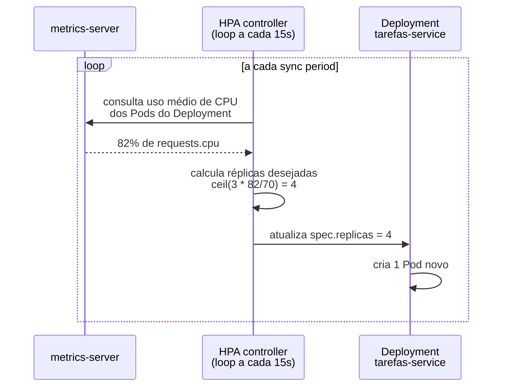
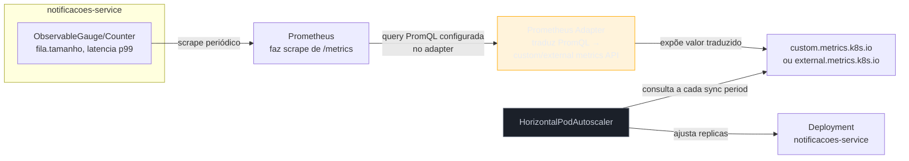
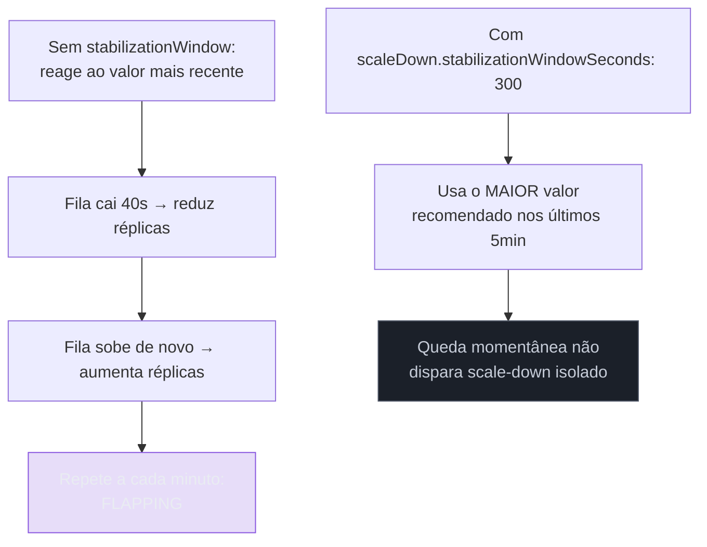

# Autoscaling — HPA baseado em métrica

> [!abstract] TL;DR
> `replicas: 3` fixo no [[02 - Kubernetes na prática — Deployment, Service, ConfigMap e Secret|Deployment da nota 02]] é um número escolhido uma vez, não um número que reage à realidade — tráfego dobra às 9h da manhã, uma fila de notificações incha durante uma promoção, e ninguém está olhando `kubectl scale` em tempo real. O `HorizontalPodAutoscaler` (HPA) resolve isso reagindo sozinho: observa uma métrica, compara com um alvo, e ajusta o número de réplicas. Na forma básica, a métrica é **CPU** — e só funciona porque `resources.requests.cpu`, já configurado na [[03 - Recursos e limites — requests, limits e OOMKill|nota 03 deste galho]], dá ao HPA a referência percentual de que ele precisa. Mas CPU é o sinal errado para o `notificacoes-service`, um worker que consome fila e gasta a maior parte do tempo esperando I/O (rede, RabbitMQ, provedor de push) — a fila pode crescer sem controle com a CPU praticamente ociosa. Para esse caso, o **Prometheus Adapter** traduz uma consulta PromQL (tamanho da fila, latência p99) numa métrica que o HPA nativamente só sabe consumir se vier no formato certo — a `custom.metrics.k8s.io` API. Esta nota cobre os dois caminhos, com `minReplicas`/`maxReplicas` e `stabilizationWindowSeconds` para evitar oscilação, e fecha com o contraste rápido contra o VPA.

## A cena: três réplicas fixas não sabem que é sexta-feira de promoção

O serviço de Tarefas, com os manifests da [[02 - Kubernetes na prática — Deployment, Service, ConfigMap e Secret|nota 02]] e os `resources` calibrados na [[03 - Recursos e limites — requests, limits e OOMKill|nota 03]], já roda em produção com `replicas: 3` — um número escolhido pela mesma pessoa que dimensionou `requests`/`limits`, olhando o tráfego médio de um dia comum. Numa sexta-feira de promoção, o tráfego triplica em vinte minutos. As três réplicas continuam de pé — nenhuma cai, nenhum `OOMKill` acontece, porque `resources.limits` foi bem calibrado — mas cada uma está processando três vezes mais requisições do que o normal, e a latência p95 sobe visivelmente, exatamente o tipo de curva que o `Histogram` da [[03-Dominios/Tecnologia/Python/Observabilidade e produção/03 - Métricas com OpenTelemetry e Prometheus client|nota 03 do Galho 17]] já sabe expor. Ninguém no time está olhando um dashboard às 9h de uma sexta específica para rodar `kubectl scale deployment tarefas-service --replicas=6` manualmente — e mesmo que alguém estivesse, a reação humana chega minutos depois do pico já ter degradado a experiência de quem estava comprando.

O mesmo padrão aparece, de forma ainda mais enganosa, no `notificacoes-service`. Esse serviço não atende requisição HTTP síncrona — ele consome eventos de uma fila RabbitMQ, o mesmo desenho que a [[03-Dominios/Tecnologia/Python/Mensageria/05 - aio-pika — RabbitMQ assíncrono|nota 05 de Mensageria]] construiu com `aio-pika`: três produtores publicam eventos numa exchange topic, o `notificacoes-service` consome com `async for message in queue.iterator()` e despacha notificações. Durante a mesma promoção, o volume de eventos de pagamento confirmado dispara, a fila `notificacoes.fila` cresce de algumas dezenas para milhares de mensagens em minutos — e o gráfico de CPU do `notificacoes-service`, olhado isoladamente, mostra... quase nada de diferente. CPU continua baixa. Um número fixo de réplicas continua processando a fila no mesmo ritmo de sempre, cada mensagem levando o mesmo tempo de sempre, só que agora chegam mensagens novas mais rápido do que o serviço consegue drenar — a fila cresce, o atraso entre "evento aconteceu" e "notificação enviada" aumenta, e nenhum sinal de CPU aponta pra isso.

> [!question]- Por que a CPU não sobe se a fila está crescendo — não deveria haver mais trabalho pra fazer?
> Há mais trabalho, mas "mais trabalho" para um worker `asyncio` I/O-bound não significa necessariamente "mais CPU". Cada mensagem processada pelo `notificacoes-service` passa a maior parte do tempo **esperando** — esperando o RabbitMQ entregar a próxima mensagem, esperando a resposta HTTP do provedor de push notification, esperando I/O de rede que o event loop do `asyncio` (já coberto em [[03-Dominios/Tecnologia/Python/Programação Reativa e Assíncrona/01 - Event loop por dentro — selectors, callbacks e a relação Future-Task|Event loop por dentro]]) sabe suspender sem bloquear a thread. O tempo de CPU efetivamente gasto processando cada mensagem — desserializar o JSON, montar o payload de notificação — é uma fração minúscula do tempo total de processamento; a maior parte é espera de rede. Quando a fila cresce, o que satura primeiro não é CPU: é o **atraso** entre mensagens chegarem e serem processadas, porque o número de réplicas continua fixo enquanto o volume de trabalho pendente cresce. É exatamente o padrão que uma métrica de CPU nunca vai capturar — e é o motivo desta nota existir.

O resto desta nota resolve os dois cenários com o mesmo objeto do Kubernetes — o `HorizontalPodAutoscaler` — mas com duas fontes de métrica completamente diferentes: CPU para o `tarefas-service`, tamanho de fila (ou latência) para o `notificacoes-service`.

## `HorizontalPodAutoscaler` básico: CPU e a dependência silenciosa de `requests.cpu`

Um `HorizontalPodAutoscaler` é um controller que roda um laço de reconciliação parecido com o do `Deployment` — só que, em vez de reconciliar "quantos Pods existem" contra um número fixo declarado no manifest, ele reconcilia "quantos Pods existem" contra um **cálculo dinâmico**, derivado de uma métrica observada continuamente.

```yaml
# hpa-tarefas-cpu.yaml
apiVersion: autoscaling/v2
kind: HorizontalPodAutoscaler
metadata:
  name: tarefas-service
spec:
  scaleTargetRef:
    apiVersion: apps/v1
    kind: Deployment
    name: tarefas-service
  minReplicas: 3
  maxReplicas: 10
  metrics:
    - type: Resource
      resource:
        name: cpu
        target:
          type: Utilization
          averageUtilization: 70
```

`scaleTargetRef` aponta para o `Deployment` `tarefas-service` da [[02 - Kubernetes na prática — Deployment, Service, ConfigMap e Secret|nota 02]] — o mesmo objeto, não um novo Deployment paralelo; o HPA nunca cria Pods diretamente, ele só edita o campo `replicas` do Deployment alvo, e deixa o Deployment de fato criar/remover Pods, exatamente como qualquer outra edição manual desse campo faria. `metrics[0].resource.name: cpu` com `target.type: Utilization` e `averageUtilization: 70` diz: "mantenha o uso médio de CPU de todos os Pods deste Deployment em torno de 70% do que cada um **pediu**" — e é aqui que a dependência com a [[03 - Recursos e limites — requests, limits e OOMKill|nota 03 deste galho]] deixa de ser implícita: `averageUtilization: 70` é 70% de `resources.requests.cpu`, não de `resources.limits.cpu`, nem de um valor absoluto de núcleos.

> [!warning] HPA de CPU sem `requests.cpu` definido não funciona — e falha de forma silenciosa
> **O que acontece:** um time aplica um `HorizontalPodAutoscaler` do tipo `Utilization`/CPU sobre um `Deployment` cujo container não declara `resources.requests.cpu` — o objeto `HorizontalPodAutoscaler` é criado sem erro, `kubectl get hpa` mostra o objeto existindo, mas a coluna `TARGETS` fica marcada como `<unknown>/70%` indefinidamente, e o número de réplicas nunca muda, mesmo sob carga real. **Por quê:** `averageUtilization` é uma **porcentagem de `requests.cpu`**, por definição — o HPA controller literalmente não tem como calcular "70% de quê" se o `requests.cpu` do container é zero ou ausente. Sem essa referência, o cálculo não tem denominador, e o HPA fica preso em `<unknown>`, sem nunca escalar nada, sem lançar um erro explícito que aponte pra causa raiz. **Como evitar:** todo `Deployment` que vai ser alvo de um HPA de CPU precisa ter `resources.requests.cpu` declarado explicitamente — a mesma disciplina de dimensionamento por percentil (p50 de uso real) que a [[03 - Recursos e limites — requests, limits e OOMKill|nota 03 deste galho]] já ensinou não é só boa prática de scheduling: aqui, ela é um pré-requisito funcional para o autoscaling nem sequer começar a operar.

O laço de controle do HPA não roda em tempo real, evento a evento — ele consulta métricas periodicamente (a cada 15 segundos, por padrão, configurável via `--horizontal-pod-autoscaler-sync-period` no `kube-controller-manager`), calcula o número desejado de réplicas, e aplica a mudança se ela ultrapassar uma tolerância mínima (10% de diferença, por padrão — evitando reescalar por flutuações minúsculas de 1-2% que não significam nada).



O `metrics-server` — um componente separado, geralmente pré-instalado em qualquer cluster gerenciado (EKS, GKE, AKS) — é quem de fato coleta uso de CPU/memória de cada Pod via `kubelet`, agrega, e expõe pela `metrics.k8s.io` API que o HPA consulta. Sem `metrics-server` rodando no cluster, nenhum HPA de CPU/memória funciona, independente de `requests.cpu` estar certo ou não — é uma peça de infraestrutura de cluster, não algo que este galho instala, mas que precisa existir para o exemplo acima funcionar.

A fórmula que o HPA usa para calcular réplicas desejadas, de forma simplificada, é:

```
réplicasDesejadas = ceil(réplicasAtuais × (valorMétricaAtual / valorMétricaAlvo))
```

No exemplo do diagrama: `ceil(3 × (82 / 70)) = ceil(3.51) = 4`. Se o uso médio de CPU cair para 40%, a mesma fórmula devolve `ceil(3 × (40/70)) = ceil(1.71) = 2` — mas o HPA nunca reduz abaixo de `minReplicas` (3, no manifest acima), então o resultado real seria `max(2, 3) = 3`.

> [!tip] `targetCPUUtilizationPercentage` (v1) vs `metrics.resource.cpu` (v2) — a mesma coisa, sintaxes diferentes
> A API `autoscaling/v1`, mais antiga, expõe a mesma configuração de forma mais enxuta — `spec.targetCPUUtilizationPercentage: 70`, sem o array `metrics`. A API `autoscaling/v2` (estável desde o Kubernetes 1.23) generaliza isso para o array `metrics`, permitindo múltiplas fontes — o que abre caminho justamente para a métrica customizada da próxima seção, algo que `autoscaling/v1` não suporta. Todo manifest novo deveria usar `autoscaling/v2` — `v1` só aparece em exemplos legados ou em clusters muito antigos.

## O limite do HPA nativo: só enxerga CPU e memória por padrão

O `metrics-server` da seção anterior resolve exatamente um problema: CPU e memória agregadas por Pod, via a `metrics.k8s.io` API. É deliberadamente minimalista — não fala PromQL, não conhece o vocabulário de métricas de aplicação (`http_server_duration_seconds`, tamanho de fila, taxa de erro por rota) que a [[03-Dominios/Tecnologia/Python/Observabilidade e produção/03 - Métricas com OpenTelemetry e Prometheus client|nota 03 do Galho 17]] já instrumentou nos dois serviços da trilha. Um HPA que precisa escalar com base em "tamanho da fila RabbitMQ" ou "latência p99 do endpoint" não tem, no `metrics-server`, nenhuma fonte de dado que sirva.

O Kubernetes resolve essa lacuna com um segundo conjunto de APIs, que o HPA também sabe consultar — não só `metrics.k8s.io`, mas também `custom.metrics.k8s.io` (métricas associadas a um objeto do cluster, como um Pod ou um Deployment) e `external.metrics.k8s.io` (métricas que não vêm de nenhum objeto do Kubernetes — o tamanho de uma fila num broker externo é o exemplo canônico). Nenhuma dessas duas APIs vem implementada por padrão em um cluster comum — alguém precisa rodar um **adapter** que as implemente, traduzindo de uma fonte de métricas real (quase sempre Prometheus, na prática de mercado) para o formato que essas APIs exigem.



O papel do **Prometheus Adapter** (`k8s-prometheus-adapter`) é exatamente essa camada de tradução: um administrador de cluster configura, no adapter, uma regra que mapeia um nome de métrica customizada (ex.: `notificacoes_fila_tamanho`) para uma consulta PromQL real (ex.: `rabbitmq_queue_messages_ready{queue="notificacoes.fila"}`), e o adapter passa a responder, na `custom.metrics.k8s.io` API, com o resultado dessa consulta sempre que alguém — nesse caso, o HPA — perguntar por aquela métrica. Do ponto de vista do HPA, não existe diferença estrutural entre consultar `metrics.k8s.io` para CPU ou `custom.metrics.k8s.io` para tamanho de fila — as duas são só APIs Kubernetes que devolvem um número; a diferença inteira está em quem implementa cada uma por trás.

> [!question]- Por que não configurar o HPA para consultar o Prometheus diretamente, sem esse adapter no meio?
> Porque o `HorizontalPodAutoscaler`, como objeto nativo do Kubernetes, só sabe falar com APIs registradas no formato das *aggregated APIs* do Kubernetes (`metrics.k8s.io`, `custom.metrics.k8s.io`, `external.metrics.k8s.io`) — ele não tem, embutido, um cliente PromQL genérico capaz de consultar qualquer servidor Prometheus arbitrário. O Prometheus Adapter existe exatamente para preencher essa lacuna de protocolo: ele é um servidor HTTP que implementa o contrato da `custom.metrics.k8s.io`/`external.metrics.k8s.io` API por fora (registrado no cluster via `APIService`), e por dentro, sempre que recebe uma consulta nesse formato, a traduz para uma query PromQL real contra um Prometheus já rodando. Sem esse tradutor, o HPA simplesmente não tem como pedir "me dê o resultado desta expressão PromQL" — o vocabulário dos dois lados é incompatível sem essa ponte.

Esta nota não desenvolve a instalação e a configuração de regras do Prometheus Adapter em profundidade — isso é infraestrutura de cluster (um Helm chart, um `ConfigMap` de `seriesQuery`/`metricsQuery` mapeando nomes PromQL para nomes de métrica Kubernetes), com seu próprio ciclo de vida operacional, tipicamente mantido pelo time de plataforma/SRE, não pelo time que escreve o código do `notificacoes-service`. O que importa reter, no nível conceitual, é a cadeia completa: métrica de aplicação/infraestrutura → Prometheus faz *scrape* → Prometheus Adapter traduz uma PromQL configurada → `custom.metrics.k8s.io` expõe o resultado → HPA consulta e decide. No nível conceitual, uma regra do adapter tem essa forma — não para instalar, só para reconhecer o formato quando aparecer num manifest de cluster:

```yaml
# Trecho conceitual de configuração do Prometheus Adapter
# (não faz parte do código da aplicação — vive no Helm values do adapter)
rules:
  external:
    - seriesQuery: 'rabbitmq_queue_messages_ready{queue="notificacoes.fila"}'
      resources:
        overrides:
          namespace: { resource: "namespace" }
      name:
        as: "rabbitmq_queue_messages_ready"
      metricsQuery: '<<.Series>>{<<.LabelMatchers>>}'
```

`seriesQuery` seleciona quais séries do Prometheus o adapter deve considerar (aqui, a métrica nativa que o plugin `rabbitmq_prometheus` já expõe, filtrada pela fila de interesse); `name.as` é o nome pelo qual essa métrica passa a existir na `external.metrics.k8s.io` API — o mesmo nome que o `metrics[0].external.metric.name` do manifest `HorizontalPodAutoscaler` da próxima seção referencia. É essa ponte de nomes — configurada uma vez do lado do cluster — que faz o restante desta nota (o YAML do HPA em si) funcionar sem que o time de aplicação precise entender PromQL avançado ou tocar no adapter depois da configuração inicial.

### Os quatro tipos de métrica que um HPA `autoscaling/v2` aceita

O array `metrics` de um `HorizontalPodAutoscaler` aceita quatro formas de `type`, cada uma respondendo a uma pergunta ligeiramente diferente sobre de onde o número vem:

| `type` | Fonte | Exemplo de uso | API consultada |
|---|---|---|---|
| `Resource` | `metrics-server`, agregado por Pod | CPU, memória — uso médio como % de `requests` | `metrics.k8s.io` |
| `Pods` | Prometheus Adapter, métrica associada a cada Pod individualmente | uma métrica de aplicação exposta por Pod, com média calculada entre réplicas | `custom.metrics.k8s.io` |
| `Object` | Prometheus Adapter, métrica associada a outro objeto do cluster | tamanho de fila exposto como métrica de um objeto `Service` ou `Ingress` específico | `custom.metrics.k8s.io` |
| `External` | Prometheus Adapter, métrica sem associação a nenhum objeto do Kubernetes | tamanho de fila de um broker externo, fila SQS, latência agregada de um LB externo | `external.metrics.k8s.io` |

O exemplo de CPU desta nota usa `Resource`; o exemplo de fila RabbitMQ usa `External`, porque a métrica — tamanho de uma fila num broker que existe fora do cluster Kubernetes, do ponto de vista lógico — não está associada a nenhum Pod ou objeto específico do cluster, mesmo que o RabbitMQ em si esteja rodando dentro do cluster. `Pods` e `Object` aparecem com menos frequência nesta trilha porque a maior parte das métricas de negócio dos dois serviços (fila, latência p99) já são agregadas antes de chegar ao HPA — não fazem sentido "por Pod individual", que é o caso de uso mais natural de `Pods`.

## Exemplo concreto: escalando `notificacoes-service` pelo tamanho da fila, não por CPU

Com o adapter configurado (do lado do cluster) para expor `rabbitmq_queue_messages_ready` como uma métrica externa, o HPA do `notificacoes-service` troca inteiramente o bloco `metrics` — em vez de `type: Resource` com `cpu`, usa `type: External`, referenciando a métrica pelo nome que o adapter registrou:

```yaml
# hpa-notificacoes-fila.yaml
apiVersion: autoscaling/v2
kind: HorizontalPodAutoscaler
metadata:
  name: notificacoes-service
spec:
  scaleTargetRef:
    apiVersion: apps/v1
    kind: Deployment
    name: notificacoes-service
  minReplicas: 2
  maxReplicas: 15
  metrics:
    - type: External
      external:
        metric:
          name: rabbitmq_queue_messages_ready
          selector:
            matchLabels:
              queue: notificacoes.fila
        target:
          type: AverageValue
          averageValue: "50"
```

`target.type: AverageValue` com `averageValue: "50"` diz: "mantenha, em média, 50 mensagens não processadas por réplica" — não um percentual (que não faz sentido aqui; não existe "100% de fila"), um **valor absoluto** dividido pelo número de réplicas atuais. Se a fila tem 500 mensagens `ready` e existem 2 réplicas rodando, a razão é `500/2 = 250` mensagens por réplica — bem acima do alvo de 50 — e o HPA calcula quantas réplicas trariam essa razão de volta perto de 50: `ceil(2 × (250/50)) = 10` réplicas (respeitando o teto de `maxReplicas: 15`).


Uma alternativa igualmente válida — e às vezes mais correta que tamanho de fila puro — é escalar pela **latência p99** do processamento de cada evento, a mesma métrica que o `Histogram` da [[03-Dominios/Tecnologia/Python/Observabilidade e produção/03 - Métricas com OpenTelemetry e Prometheus client|nota 03 do Galho 17]] e a comparação de throttling da [[03 - Recursos e limites — requests, limits e OOMKill|nota 03 deste galho]] já usaram como sinal de saúde:

```yaml
  metrics:
    - type: External
      external:
        metric:
          name: notificacoes_processamento_p99_segundos
        target:
          type: Value
          value: "2"
```

Aqui, `target.type: Value` (sem "average", porque a série já é um resultado agregado — um `histogram_quantile(0.99, ...)` calculado no lado do Prometheus, não algo que faça sentido dividir pelo número de réplicas) diz "escale enquanto o p99 de tempo de processamento estiver acima de 2 segundos" — um sinal de saturação mais direto que tamanho de fila bruto, porque responde diretamente "o serviço está conseguindo acompanhar o ritmo?", em vez de um proxy (tamanho de fila) que também pode crescer por outros motivos, como um pico de publicação sem relação nenhuma com a capacidade de consumo.

> [!question]- Por que tamanho de fila em vez de CPU é a escolha certa para este worker especificamente?
> Porque tamanho de fila mede diretamente a coisa que importa — "há trabalho pendente se acumulando" — enquanto CPU mede um proxy indireto que, para um worker I/O-bound como o `notificacoes-service`, simplesmente não se move na mesma direção do problema real. A cena de abertura desta nota já descreveu o mecanismo: o `notificacoes-service` passa a maior parte do tempo de cada mensagem esperando I/O de rede (RabbitMQ, provedor de push), não computando — então um pico de volume de mensagens não necessariamente eleva CPU o suficiente para cruzar um `averageUtilization: 70%`, mesmo com a fila crescendo sem controle. Escalar por tamanho de fila resolve isso porque a métrica reflete exatamente o sintoma que o time quer evitar — atraso crescente entre evento e notificação — sem depender de um proxy que, para este tipo específico de workload, mede a coisa errada.

Os três exemplos de `target.type` usados nesta nota — `Utilization`, `AverageValue`, `Value` — não são intercambiáveis; cada um responde a uma forma diferente de normalizar o número bruto que a métrica devolve:

| `target.type` | O que significa | Usado nesta nota para |
|---|---|---|
| `Utilization` | Percentual de `requests` (só válido para `type: Resource`) | CPU do `tarefas-service` — 70% de `requests.cpu` |
| `AverageValue` | Valor bruto dividido pelo número de réplicas atuais | Tamanho de fila do `notificacoes-service` — 50 mensagens por réplica |
| `Value` | Valor bruto, sem dividir por réplicas (a série já é agregada) | Latência p99 do `notificacoes-service` — 2 segundos, o mesmo para o serviço inteiro |

A escolha errada aqui produz um HPA que "funciona" sem lançar erro, mas escala de forma matematicamente sem sentido: usar `AverageValue` para uma métrica que já é um agregado global (como um `histogram_quantile` de latência) faria o HPA dividir esse número pelo número de réplicas a cada cálculo, tratando "p99 de 2 segundos" como se fosse "2 segundos ÷ 3 réplicas" — uma divisão que não corresponde a nada real sobre o sistema, e que faria o alvo efetivo mudar sozinho toda vez que o número de réplicas mudasse, mesmo sem a latência real ter mudado nada.

> [!tip] A escolha entre fila e latência não é excludente
> Um HPA aceita múltiplas entradas no array `metrics` simultaneamente — o controller calcula o número de réplicas desejado para **cada** métrica independentemente, e usa o **maior** valor resultante entre todas elas. Um `notificacoes-service` de produção madura frequentemente combina tamanho de fila (sinal de volume) e latência p99 (sinal de saturação real de processamento) no mesmo `HorizontalPodAutoscaler`, deixando o mais conservador dos dois vencer — evitando que um sinal isolado, sozinho, escale insuficientemente diante de um cenário que o outro sinal já capturaria melhor.

## `minReplicas`/`maxReplicas` e `stabilizationWindowSeconds`: evitando o flapping

Dois números aparecem em todos os exemplos acima sem explicação até aqui — `minReplicas` e `maxReplicas` — e um terceiro, ausente dos exemplos por simplicidade, é o que evita o comportamento mais irritante de um autoscaler mal configurado: escalar para cima e para baixo repetidamente em minutos, um padrão chamado **flapping**.

`minReplicas` é o piso — nunca menos que esse número de réplicas, mesmo com a métrica em zero. Existe por dois motivos: disponibilidade (uma única réplica é um ponto único de falha, o mesmo argumento já levantado na [[02 - Kubernetes na prática — Deployment, Service, ConfigMap e Secret|nota 02 deste galho]]) e latência de partida (escalar de 0 para 1 réplica, do zero absoluto, adiciona o tempo de start do Pod inteiro — pull de imagem, inicialização do processo, `readinessProbe` passando — antes de qualquer capacidade nova estar de fato disponível; manter um piso maior que zero garante que sempre existe capacidade pronta enquanto o autoscaler reage). `maxReplicas` é o teto — o limite superior que existe para conter custo (mais réplicas, mais consumo de `requests` reservado no cluster) e para proteger recursos downstream que não escalam na mesma velocidade — um banco de dados com um número fixo de conexões máximas no pool, por exemplo, que dez réplicas a mais poderiam saturar mesmo que o `notificacoes-service` em si escalasse sem problema.

O comportamento de escala, por padrão, é assimétrico: o HPA sobe réplicas rápido (reagindo a um pico de carga sem demora, porque o custo de escalar demais por um instante é baixo) e desce devagar (porque o custo de escalar de menos, sob carga real, é maior — uma requisição lenta ou uma fila que volta a crescer). Essa assimetria é configurável explicitamente via `behavior`:

```yaml
apiVersion: autoscaling/v2
kind: HorizontalPodAutoscaler
metadata:
  name: notificacoes-service
spec:
  scaleTargetRef:
    apiVersion: apps/v1
    kind: Deployment
    name: notificacoes-service
  minReplicas: 2
  maxReplicas: 15
  behavior:
    scaleUp:
      stabilizationWindowSeconds: 0
      policies:
        - type: Percent
          value: 100
          periodSeconds: 30
    scaleDown:
      stabilizationWindowSeconds: 300
      policies:
        - type: Pods
          value: 1
          periodSeconds: 60
  metrics:
    - type: External
      external:
        metric:
          name: rabbitmq_queue_messages_ready
          selector:
            matchLabels:
              queue: notificacoes.fila
        target:
          type: AverageValue
          averageValue: "50"
```

`scaleUp.stabilizationWindowSeconds: 0` significa "reaja imediatamente a um sinal de que precisa escalar para cima, sem esperar" — combinado com `policies: [{type: Percent, value: 100, periodSeconds: 30}]`, que limita o crescimento a, no máximo, dobrar (100%) o número de réplicas a cada 30 segundos, evitando um salto absurdo de 2 para 15 réplicas numa única iteração do laço de controle, mesmo que a métrica justificasse matematicamente esse salto.

`scaleDown.stabilizationWindowSeconds: 300` é o parâmetro que resolve o flapping diretamente: em vez de reduzir réplicas assim que a métrica cair momentaneamente, o HPA olha para a **janela inteira** dos últimos 300 segundos (5 minutos) e usa o maior número de réplicas recomendado dentro dessa janela — não o valor mais recente. Se a fila cai para zero por 40 segundos e volta a crescer no minuto seguinte (um padrão comum quando o tráfego chega em rajadas curtas, não uma queda sustentada), o HPA nunca chega a remover réplicas no meio dessa oscilação, porque a janela de 5 minutos ainda contém a recomendação alta de minutos atrás.



> [!warning] Flapping não é só desconfortável de assistir — tem custo real
> **O que acontece:** um `HorizontalPodAutoscaler` sem `behavior.scaleDown` configurado (usando o default do Kubernetes, que já inclui uma janela razoável, mas que pode não ser suficiente para um sinal ruidoso como tamanho de fila) escala para cima e para baixo repetidamente em ciclos de minutos, sob um padrão de tráfego que naturalmente oscila em rajadas curtas. **Por quê:** cada ciclo de scale-up/scale-down tem custo real — Pods novos passam por pull de imagem (se não estiver em cache no nó), inicialização, `readinessProbe` até serem considerados prontos; Pods removidos precisam terminar processamento em voo antes do graceful shutdown completar. Um HPA que oscila gasta esse custo repetidamente, sem nunca estabilizar num número de réplicas que reflita a demanda real — na prática, o sistema passa mais tempo escalando do que servindo tráfego de forma estável. **Como evitar:** configurar `scaleDown.stabilizationWindowSeconds` explicitamente — um valor de 300-600 segundos é um ponto de partida razoável para a maioria dos workloads desta trilha — e escolher `scaleUp.policies` com um limite de crescimento por período (`type: Percent` ou `type: Pods`, com um `periodSeconds` razoável), em vez de permitir saltos irrestritos que também podem sobrecarregar recursos downstream de uma vez.

## Contraste rápido: por que HPA, não VPA, é o padrão para este tipo de workload

A [[03 - Recursos e limites — requests, limits e OOMKill|nota 03 deste galho]] já introduziu o `Vertical Pod Autoscaler` (VPA) como o componente que ajusta `requests`/`limits` de cada Pod automaticamente, em vez de o número de réplicas — e já registrou, num `[!warning]`, que combinar VPA e HPA de CPU sobre o mesmo Deployment, observando o mesmo sinal, cria um conflito real. Vale fixar aqui, brevemente, por que HPA — escalar horizontalmente, adicionando réplicas — é o padrão default para workloads stateless como os dois serviços desta trilha, e VPA fica reservado para casos mais específicos:

- **HPA se encaixa no modelo de `Service`/competing consumers sem fricção**: mais réplicas atrás do mesmo `Service` da [[02 - Kubernetes na prática — Deployment, Service, ConfigMap e Secret|nota 02]] significa mais capacidade distribuída automaticamente pelo `kube-proxy` (para HTTP) ou pelo mecanismo de competing consumers do RabbitMQ (para o `notificacoes-service`, como a [[03-Dominios/Tecnologia/Python/Mensageria/05 - aio-pika — RabbitMQ assíncrono|nota 05 de Mensageria]] já mostrou) — nenhuma reconfiguração extra é necessária.
- **VPA, em modo automático, precisa reiniciar Pods para aplicar novos valores de `requests`/`limits`** — um Pod não pode ter seus recursos redimensionados em runtime sem recriação (fora de versões muito recentes do Kubernetes com suporte experimental a resize in-place), o que introduz uma interrupção que HPA simplesmente não tem: adicionar uma réplica nova não afeta as réplicas já rodando.
- **HPA responde a picos de tráfego em minutos**; VPA é pensado para tendências de médio prazo (dias/semanas de dados de uso), não para reagir a uma promoção que dura uma tarde.

Esta nota não desenvolve VPA além deste contraste — instalação, modos de operação (`Off`/`Initial`/`Auto`), e os riscos operacionais já foram registrados como fora de escopo na [[03 - Recursos e limites — requests, limits e OOMKill|nota 03 deste galho]]. O que importa reter aqui é só a divisão de trabalho: HPA escala **quantidade** de réplicas em resposta a demanda variável, de forma compatível com o resto da infraestrutura desta trilha (Service, competing consumers); VPA ajusta **tamanho** de cada réplica, uma preocupação ortogonal, tratada como responsabilidade de quem administra o cluster.

## Casos práticos

### Cenário 1: `tarefas-service` sob pico de tráfego HTTP, escalando por CPU

Voltando à cena de abertura: com o `HorizontalPodAutoscaler` de CPU aplicado (`minReplicas: 3`, `maxReplicas: 10`, `averageUtilization: 70`), a sexta-feira de promoção dispara o mesmo pico de tráfego — mas agora, quando o uso médio de CPU das três réplicas cruza 70% de `requests.cpu`, o HPA calcula e aplica o número de réplicas necessário, em incrementos limitados por `behavior.scaleUp`, até estabilizar em torno de 6-7 réplicas enquanto o pico dura. O time de plataforma não recebe um alerta às 9h de sexta pedindo para rodar `kubectl scale` manualmente — a curva de latência p95, monitorada pelo mesmo `Histogram` da [[03-Dominios/Tecnologia/Python/Observabilidade e produção/03 - Métricas com OpenTelemetry e Prometheus client|nota 03 do Galho 17]], sobe bem menos do que subiria com réplicas fixas, porque a capacidade cresceu junto com a demanda, dentro de minutos, sem intervenção humana. Quando o pico passa, `scaleDown.stabilizationWindowSeconds` mantém a capacidade extra por um tempo antes de reduzir de volta a 3, evitando remover réplicas cedo demais caso o tráfego ainda esteja instável.

### Cenário 2: `notificacoes-service` sob backlog de fila, escalando pela métrica de negócio

O cenário da fila crescendo durante a mesma promoção — descrito na abertura desta nota — é resolvido pelo `HorizontalPodAutoscaler` externo baseado em `rabbitmq_queue_messages_ready`. Com `minReplicas: 2` e `maxReplicas: 15`, e o alvo de 50 mensagens por réplica, a fila que cresceu para 500 mensagens dispara o cálculo que leva o Deployment a 10 réplicas em poucos ciclos do laço de controle — cada réplica nova é um consumer adicional na mesma queue `notificacoes.fila`, tornando-se automaticamente um **competing consumer**, exatamente como a [[03-Dominios/Tecnologia/Python/Mensageria/05 - aio-pika — RabbitMQ assíncrono|nota 05 de Mensageria]] já descreveu: nenhuma reconfiguração de binding ou de exchange é necessária, o RabbitMQ simplesmente distribui as mensagens entre os consumers conectados, respeitando o `prefetch_count` de cada um. Se a mesma promoção tivesse sido monitorada só por CPU — o erro que a abertura desta nota descreveu — o time só perceberia o atraso crescente de notificações depois que um cliente reclamasse, sem nenhum sinal automático de que havia capacidade insuficiente.

## Verificando que o HPA está de fato decidindo, não só existindo

Como já aconteceu com o `Service` da [[02 - Kubernetes na prática — Deployment, Service, ConfigMap e Secret|nota 02 deste galho]] — onde `kubectl get endpoints` vazio com Pods `Running` era o sintoma de um `selector` errado —, um `HorizontalPodAutoscaler` pode existir, aplicado sem erro, e ainda assim não estar fazendo nada útil. Um punhado de comandos confirma que a cadeia inteira — métrica coletada, cálculo aplicado, réplicas ajustadas — está funcionando de ponta a ponta:

```bash
# O HPA está calculando um valor real, ou preso em <unknown>?
# TARGETS mostra "82%/70%" (funcionando) ou "<unknown>/70%" (métrica não disponível).
kubectl get hpa tarefas-service

# Histórico de decisões do HPA — cada scale up/down, com o motivo.
# Mostra também o erro exato quando a métrica falha (ex.: "requests.cpu ausente").
kubectl describe hpa tarefas-service

# Confirma que o metrics-server está respondendo com dados de CPU/memória
# por Pod — pré-requisito para qualquer HPA do tipo Resource.
kubectl top pods -l app=tarefas-service

# Confirma que a custom.metrics.k8s.io API está registrada e respondendo
# (útil para diagnosticar se o Prometheus Adapter está de pé).
kubectl get apiservices | grep custom.metrics.k8s.io

# Consulta bruta à external metrics API — o mesmo valor que o HPA
# de notificacoes-service está lendo, fora do ciclo do HPA.
kubectl get --raw "/apis/external.metrics.k8s.io/v1beta1/namespaces/default/rabbitmq_queue_messages_ready" | jq .
```

> [!tip] `kubectl describe hpa` é o primeiro comando, sempre — antes de suspeitar da métrica em si
> A seção `Events` do `kubectl describe hpa <nome>` registra cada decisão do controller em texto legível — `"New size: 6; reason: cpu resource utilization (percentage of request) above target"` ou, no caso de falha, `"failed to get cpu utilization: unable to get metrics for resource cpu: no metrics returned from resource metrics API"`. Esse segundo tipo de mensagem, especificamente, é o sinal mais direto de que `requests.cpu` está ausente ou o `metrics-server` está indisponível — economiza a etapa de adivinhar entre as duas causas possíveis do `<unknown>` já descrito no `[!warning]` da primeira seção desta nota.

## Armadilhas comuns

> [!warning] `metrics-server` (CPU/memória) e Prometheus Adapter (customizada) são componentes DIFERENTES, com falhas independentes
> **O que acontece:** um HPA que combina uma métrica `Resource` (CPU, via `metrics-server`) e uma métrica `External` (fila, via Prometheus Adapter) no mesmo objeto continua funcionando parcialmente mesmo se um dos dois componentes cair — `kubectl describe hpa` mostra um dos dois valores como `<unknown>` enquanto o outro segue reportando normalmente, e times às vezes não percebem a degradação parcial porque o HPA "ainda está escalando", só que baseado em metade dos sinais configurados. **Por quê:** `metrics-server` e Prometheus Adapter são dois processos completamente independentes, cada um implementando uma API Kubernetes diferente (`metrics.k8s.io` vs `custom.metrics.k8s.io`/`external.metrics.k8s.io`) — a queda de um não afeta o outro, mas também não é sinalizada de forma óbvia no objeto `HorizontalPodAutoscaler` além do `<unknown>` numa das linhas de `TARGETS`. **Como evitar:** monitorar a saúde dos dois componentes (`metrics-server` e Prometheus Adapter) como parte da observabilidade de infraestrutura do cluster, não assumir que "o HPA existe" significa "todas as métricas configuradas estão de fato sendo coletadas" — `kubectl describe hpa <nome>` é o primeiro comando de diagnóstico, e qualquer `<unknown>` ali é sinal de que uma das duas fontes está indisponível.

> [!warning] Latência de coleta na métrica customizada faz o HPA reagir a dados velhos
> **O que acontece:** um HPA baseado em tamanho de fila parece "atrasado" para reagir — a fila já subiu visivelmente num dashboard, mas o HPA só começa a escalar réplicas alguns minutos depois. **Por quê:** existem três atrasos empilhados entre o evento real e a reação do HPA: o intervalo de *scrape* do Prometheus (tipicamente 15-30 segundos), o cache interno do Prometheus Adapter (que não necessariamente consulta o Prometheus a cada requisição do HPA, para não sobrecarregar o backend), e o próprio `--horizontal-pod-autoscaler-sync-period` do HPA (15 segundos, por padrão). Cada camada adiciona uma janela de dados potencialmente desatualizados, e a soma dos três pode facilmente passar de um minuto antes que o HPA veja um valor que já reflete a realidade. **Como evitar:** dimensionar `minReplicas` com folga suficiente para absorver esse atraso de detecção sem degradação severa, e tratar o autoscaling baseado em métrica customizada como uma resposta em **minutos**, não em segundos — para picos extremamente súbitos e curtos, um `minReplicas` mais generoso (capacidade sempre disponível) é mais confiável do que confiar inteiramente na velocidade de reação do laço de controle.

> [!warning] `maxReplicas` alto demais empurra o gargalo para um recurso que não escala junto
> **O que acontece:** um `notificacoes-service` com `maxReplicas: 50`, sob um pico de fila severo, de fato escala para perto do teto — e, em vez de resolver o backlog, começa a gerar uma onda de erros de conexão recusada contra o Postgres que o serviço consulta para buscar preferências de notificação de cada usuário, um recurso completamente não relacionado à fila que originou a escala. **Por quê:** o `HorizontalPodAutoscaler` só enxerga a métrica que foi configurada para observar — ele não tem visibilidade nenhuma sobre a capacidade de recursos downstream (pool de conexões do banco, limite de rate de uma API externa de push notification, cota de outro serviço chamado via HTTP). Cada réplica nova assume um pool de conexões próprio; 50 réplicas, cada uma abrindo seu próprio pool com um mínimo de conexões, podem facilmente exceder o `max_connections` configurado no Postgres, mesmo que o dimensionamento de CPU/memória de cada réplica individual esteja perfeito. **Como evitar:** `maxReplicas` não é só "o máximo que o cluster suporta" — é o máximo que **toda a cadeia de dependências downstream** suporta, calculado considerando o consumo por réplica de cada recurso compartilhado (conexões de banco, limites de rate externos). Definir esse teto exige olhar não só para o `notificacoes-service` isoladamente, mas para o orçamento de conexões que o Postgres, o provedor de push e qualquer outro recurso compartilhado conseguem absorver com segurança quando multiplicados pelo `maxReplicas` configurado.

### Cenário 3: `maxReplicas` como rede de segurança, não só como teto de custo

Um mês depois de configurar o HPA do `notificacoes-service` com `maxReplicas: 15`, um bug num dos produtores (`pagamentos-service`) começa a republicar o mesmo evento de pagamento confirmado repetidamente, num loop acidental introduzido por um deploy com uma regressão — o volume de mensagens na fila `notificacoes.fila` cresce de forma anormal, muito além de qualquer pico de tráfego legítimo já visto. Sem um `maxReplicas` configurado (ou com um valor generoso demais, como 200), o HPA continuaria escalando réplicas do `notificacoes-service` indefinidamente, tentando processar um volume de mensagens que, na realidade, é lixo duplicado que deveria ser corrigido na origem — consumindo capacidade do cluster e potencialmente derrubando o Postgres compartilhado, como o `[!warning]` anterior já descreveu. Com `maxReplicas: 15` configurado deliberadamente, o HPA satura no teto, a fila continua crescendo além do que 15 réplicas conseguem drenar, e — porque a fila que não para de crescer é um sintoma claro e visível, não mascarado por um autoscaling que "resolveria sozinho" — o time de plataforma investiga a causa raiz no `pagamentos-service` mais rápido do que investigaria se o sintoma tivesse sido silenciosamente absorvido por uma escala descontrolada.

## Em entrevista

Uma pergunta comum de entrevista sênior sobre Kubernetes é "como você escalaria automaticamente um worker de fila, e por que CPU não é a métrica certa?" — a resposta fraca responde só "configuraria um HPA com CPU alta". A resposta forte nomeia a lacuna: workers I/O-bound gastam a maior parte do tempo esperando rede, não computando, então CPU não se move na mesma direção do sintoma real (fila crescendo, atraso subindo); a métrica certa é o próprio sinal de negócio — tamanho de fila ou latência de processamento — exposta via `custom.metrics.k8s.io`/`external.metrics.k8s.io`, alimentada por um Prometheus Adapter que traduz uma consulta PromQL configurada no cluster. Um sinal ainda mais forte é mencionar `stabilizationWindowSeconds` como o mecanismo específico que evita flapping (não só "o HPA escala automaticamente"), e citar a dependência silenciosa entre HPA de CPU e `requests.cpu` estar corretamente dimensionado — um candidato que já debugou um HPA preso em `<unknown>/70%` sabe, de cor, a causa mais provável.

## Como explicar em inglês

> "A `HorizontalPodAutoscaler` adjusts replica count by watching a metric and comparing it to a target — the basic form watches CPU utilization as a percentage of `resources.requests.cpu`, which is why that field has to be set correctly for CPU-based autoscaling to work at all; without it, the HPA gets stuck reporting `<unknown>` and never scales. CPU utilization is the wrong signal for an I/O-bound worker, though — a service consuming from a RabbitMQ queue spends most of its time waiting on network I/O, not computing, so queue backlog can grow with CPU staying flat. For that case, a Prometheus Adapter translates a PromQL query into the `custom.metrics.k8s.io` or `external.metrics.k8s.io` API the HPA can consume — I'd scale that worker on queue depth or p99 processing latency instead, both exposed as external metrics. `minReplicas`/`maxReplicas` bound the range, and `behavior.scaleDown.stabilizationWindowSeconds` is what prevents flapping — instead of reacting to the latest data point, the controller uses the highest recommendation seen within that window before scaling down, so a brief dip doesn't trigger a scale-down that immediately reverses. HPA is the default for stateless services because adding replicas plugs into the existing Service/competing-consumers model without friction; VPA, which resizes each pod's requests/limits instead, usually requires a pod restart to apply, which is a different trade-off entirely."

| PT | EN |
|----|----|
| Escalonamento horizontal automático | Horizontal autoscaling |
| Escalonamento vertical automático | Vertical autoscaling |
| Utilização (de CPU) | Utilization |
| Métrica de recurso | Resource metric |
| Métrica customizada | Custom metric |
| Métrica externa | External metric |
| Janela de estabilização | Stabilization window |
| Oscilação (escala pra cima/baixo repetidamente) | Flapping |
| Consumidores concorrentes | Competing consumers |
| Laço de controle | Control loop |

## O que vem a seguir

Com o `tarefas-service` e o `notificacoes-service` escalando automaticamente — CPU para o primeiro, fila/latência para o segundo — o galho já cobriu como rodar, dimensionar, atualizar sem downtime e escalar dois serviços em Kubernetes. O que ainda não foi explorado é a alternativa inteira a manter um cluster rodando o tempo todo: e se um dos dois serviços simplesmente não precisasse de réplicas mínimas sempre ativas?

- [[06 - Serverless com AWS Lambda — Mangum e cold start|06 — Serverless com AWS Lambda: Mangum e cold start]] — o `notificacoes-service`, com seu padrão de tráfego em rajadas que esta nota acabou de escalar horizontalmente, é justamente o candidato mais interessante a avaliar como Lambda — a nota seguinte explica por quê, e por que o `tarefas-service` não é.

## Veja também

- [[index|Cloud-native e produção (Galho 18)]] — MOC deste galho.
- [[02 - Kubernetes na prática — Deployment, Service, ConfigMap e Secret|02 — Kubernetes na prática: Deployment, Service, ConfigMap e Secret]] — o `Deployment` que o `scaleTargetRef` desta nota referencia, e o `Service` que absorve as réplicas novas sem reconfiguração.
- [[03 - Recursos e limites — requests, limits e OOMKill|03 — Recursos e limites: requests, limits e OOMKill]] — `resources.requests.cpu`, a referência percentual que o HPA de CPU desta nota exige; e o aviso original sobre VPA vs HPA competindo pelo mesmo sinal.
- [[03-Dominios/Tecnologia/Python/Observabilidade e produção/03 - Métricas com OpenTelemetry e Prometheus client|Galho 17 nota 03 — Métricas com OpenTelemetry e Prometheus client]] — o `Histogram` de latência p99 e o vocabulário de métrica de aplicação que alimenta a métrica customizada desta nota.
- [[03-Dominios/Tecnologia/Python/Mensageria/05 - aio-pika — RabbitMQ assíncrono|Mensageria nota 05 — aio-pika: RabbitMQ assíncrono]] — o `notificacoes-service` e a fila `notificacoes.fila` usados como exemplo concreto de métrica customizada; competing consumers como o mecanismo que absorve réplicas novas.
- [[03-Dominios/Tecnologia/Python/Programação Reativa e Assíncrona/01 - Event loop por dentro — selectors, callbacks e a relação Future-Task|Event loop por dentro]] — por que um worker `asyncio` I/O-bound não move CPU proporcionalmente ao volume de trabalho pendente.

## Fontes

- Kubernetes. *Horizontal Pod Autoscaling*. kubernetes.io. https://kubernetes.io/docs/tasks/run-application/horizontal-pod-autoscale/ (acessado em 2026-07-12) — mecanismo do controller, fórmula de cálculo de réplicas desejadas, tolerância padrão, sync period.
- Kubernetes. *HorizontalPodAutoscaler Walkthrough*. kubernetes.io. https://kubernetes.io/docs/tasks/run-application/horizontal-pod-autoscale-walkthrough/ (acessado em 2026-07-12) — exemplos práticos de manifest `autoscaling/v2`, `metrics.resource`, `behavior.scaleUp`/`scaleDown`, `stabilizationWindowSeconds`.
- Kubernetes. *Horizontal Pod Autoscaler API Object — autoscaling/v2*. kubernetes.io. https://kubernetes.io/docs/reference/kubernetes-api/workload-resources/horizontal-pod-autoscaler-v2/ (acessado em 2026-07-12) — referência de campos `metrics` (`Resource`, `Pods`, `Object`, `External`), `target.type` (`Utilization`, `AverageValue`, `Value`).
- Kubernetes SIG. *Kubernetes Metrics Server*. github.com/kubernetes-sigs/metrics-server. https://github.com/kubernetes-sigs/metrics-server (acessado em 2026-07-12) — componente que implementa `metrics.k8s.io`, consumido pelo HPA para CPU/memória.
- Kubernetes SIG. *Prometheus Adapter for Kubernetes Metrics APIs*. github.com/kubernetes-sigs/prometheus-adapter. https://github.com/kubernetes-sigs/prometheus-adapter (acessado em 2026-07-12) — implementação de `custom.metrics.k8s.io`/`external.metrics.k8s.io` traduzindo PromQL, formato de `seriesQuery`/`metricsQuery` nas regras de configuração.
- Kubernetes. *Vertical Pod Autoscaler*. github.com/kubernetes/autoscaler/tree/master/vertical-pod-autoscaler. https://github.com/kubernetes/autoscaler/tree/master/vertical-pod-autoscaler (acessado em 2026-07-12) — contraste rápido HPA vs VPA, modos de operação, necessidade de recriação de Pod para aplicar novos valores.
- RabbitMQ. *Prometheus & Grafana Monitoring*. rabbitmq.com. https://www.rabbitmq.com/docs/prometheus (acessado em 2026-07-12) — métricas nativas do plugin `rabbitmq_prometheus`, incluindo `rabbitmq_queue_messages_ready`, usada como exemplo de métrica externa nesta nota.
- [[03-Dominios/Tecnologia/Python/Observabilidade e produção/03 - Métricas com OpenTelemetry e Prometheus client|Métricas com OpenTelemetry e Prometheus client]] — Galho 17, nota 03 — instrumentação de latência e saturação que alimenta a métrica customizada desta nota.
- [[03-Dominios/Tecnologia/Python/Mensageria/05 - aio-pika — RabbitMQ assíncrono|aio-pika — RabbitMQ assíncrono]] — Mensageria, nota 05 — o `notificacoes-service` e o modelo de competing consumers usado como exemplo concreto.

Consultado em 2026-07-12.
