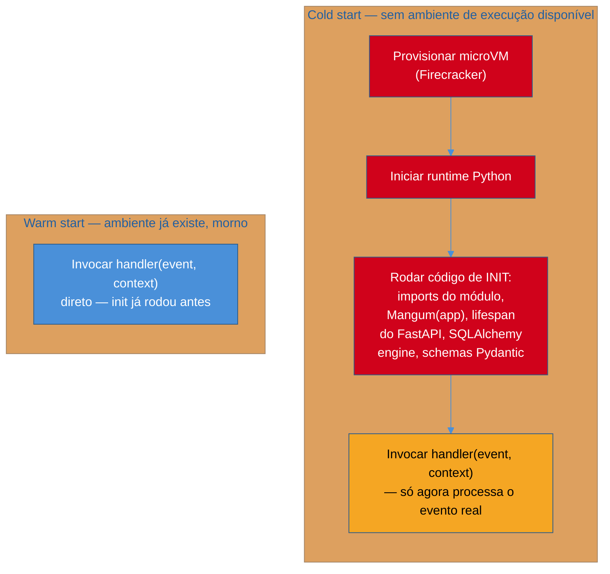

# Serverless com AWS Lambda — Mangum e cold start

> [!abstract] TL;DR
> `notificacoes-service` ([[03-Dominios/Tecnologia/Python/Microservices e sistemas distribuídos/08 - Capstone — extraindo o serviço de Notificações|Galho 15 capstone]]) recebe tráfego em rajadas — reage a eventos do RabbitMQ ([[03-Dominios/Tecnologia/Python/Mensageria/index|Galho 14]]) e fica ocioso na maior parte do tempo entre elas. Manter um container sempre ligado pra isso é pagar por capacidade que não é usada. **Mangum** resolve o problema sem reescrever a aplicação: é um adapter que traduz o evento que a AWS Lambda recebe (API Gateway, Function URL) para o protocolo ASGI que o FastAPI já fala — `handler = Mangum(app)`, e o **mesmo** `app` que roda sob Uvicorn num container passa a rodar dentro de uma função Lambda. O preço dessa simplicidade é o **cold start**: a primeira invocação depois de um período ocioso paga o custo de inicializar um ambiente de execução do zero — importar módulos, instanciar clientes, montar schemas do Pydantic — antes de processar a primeira requisição de verdade. Dependências pesadas (SQLAlchemy, clientes HTTP configurados, muitos `BaseModel`) alongam esse custo. Mitiga-se com **provisioned concurrency** (paga pra manter ambientes sempre quentes — o oposto de "pagar só pelo que usa") ou com imports preguiçosos que adiam o custo pesado pra fora do caminho crítico do cold start.

## A cena: um container ligado 24 horas pra atender rajadas de 40 minutos

A [[01 - Panorama — orquestrar de verdade|nota 01 deste galho]] já nomeou a pista: `notificacoes-service` não atende requisições de usuário final diretamente — ele existe porque o consumer `aio-pika` do [[03-Dominios/Tecnologia/Python/Mensageria/08 - Capstone — processamento assíncrono na API de Tarefas|Galho 14]] precisava rodar em algum lugar, e a [[03-Dominios/Tecnologia/Python/Microservices e sistemas distribuídos/08 - Capstone — extraindo o serviço de Notificações|capstone do Galho 15]] moveu esse consumer para dentro do processo do serviço de notificações, junto com um endpoint HTTP `POST /notificacoes` fino em cima do mesmo `AbstractNotificador`/`SlackAdapter` que já existia desde o Galho 13.

O padrão de tráfego desse serviço é irregular por construção: ele só tem trabalho a fazer quando alguém conclui uma tarefa (publicando `TarefaConcluida` na exchange `eventos.dominio`) ou quando o serviço de Tarefas chama `POST /notificacoes` diretamente via `httpx`. Num time pequeno, isso pode significar rajadas de dezenas de eventos durante o horário comercial e silêncio total à noite — e, se `notificacoes-service` estiver rodando como um `Deployment` do Kubernetes com uma réplica mínima sempre de pé (o padrão da [[02 - Kubernetes na prática — Deployment, Service, ConfigMap e Secret|nota 02 deste galho]]), esse container está alocado, e sendo cobrado, mesmo nas 20 horas por dia em que não há uma única mensagem pra processar.

> [!question]- Por que não simplesmente reduzir o `Deployment` pra zero réplicas quando ocioso?
> Porque Kubernetes puro não faz *scale-to-zero* de forma nativa — o HPA da [[05 - Autoscaling — HPA baseado em métrica|nota 05 deste galho]] escala entre um mínimo e um máximo de réplicas, mas o mínimo, por padrão, é pelo menos 1 (existem extensões como KEDA que adicionam scale-to-zero em cima do Kubernetes, mas isso é exatamente o tipo de complexidade operacional adicional que o [[01 - Panorama — orquestrar de verdade|panorama deste galho]] já apontou como custo real do caminho Kubernetes). AWS Lambda, por outro lado, já nasce com scale-to-zero como comportamento padrão: se não há evento pra processar, não existe nenhum ambiente de execução rodando, e não existe cobrança nenhuma. É essa propriedade — não "Lambda é mais moderno" — que faz dela um candidato genuinamente melhor pro formato de tráfego deste serviço específico.

A pergunta prática que sobra é: dá pra rodar a mesma aplicação FastAPI de `notificacoes-service` — o mesmo `app = FastAPI(lifespan=lifespan)`, o mesmo `AbstractNotificador`, o mesmo `SlackAdapter` — como função Lambda, sem reescrever a lógica de negócio do zero num formato diferente? A resposta é sim, e o nome da peça que faz essa ponte é **Mangum**.

## Mangum: o adapter que traduz evento Lambda em requisição ASGI

`Mangum` é uma biblioteca open source (`pip install mangum`, disponível no PyPI) que resolve exatamente um problema: a AWS Lambda não fala ASGI nativamente — ela fala um formato de evento JSON próprio, moldado pelo serviço que invocou a função (API Gateway, Application Load Balancer, Lambda Function URL, entre outros). O FastAPI, por outro lado, foi desenhado desde a raiz sobre ASGI — o protocolo que a [[03-Dominios/Tecnologia/Python/Web e APIs REST/01 - Django vs FastAPI vs Flask — panorama e filosofias|nota 01 do Galho 8 sobre Web e APIs REST]] já descreveu como a fundação que separa FastAPI de frameworks WSGI-first como Flask. Mangum é a peça que faz essas duas pontas conversarem, sem que o Uvicorn precise existir na equação: ele traduz o evento JSON da Lambda para um *ASGI scope* — a mesma estrutura que o Uvicorn constrói a partir de uma conexão TCP real — e entrega esse scope para `app`, exatamente como se a requisição tivesse chegado por HTTP direto.

```python
"""notificacoes_service/lambda_handler.py — o mesmo app, sem reescrita."""

from mangum import Mangum

from notificacoes_service.main import app  # o MESMO FastAPI da nota 08 do Galho 15

handler = Mangum(app)
```

Três linhas — e nenhuma delas toca `notificacoes_service/main.py`. O `app = FastAPI(lifespan=lifespan)` que a [[03-Dominios/Tecnologia/Python/Microservices e sistemas distribuídos/08 - Capstone — extraindo o serviço de Notificações|capstone do Galho 15]] construiu continua definindo `POST /notificacoes` exatamente como antes, com o mesmo `Depends(get_notificador)`, o mesmo `NotificacaoIn`/`NotificacaoOut` do Pydantic. `Mangum(app)` não é um wrapper que reimplementa roteamento ou validação — ele delega o processamento inteiro da requisição para o `app` ASGI, e só cuida da tradução nas duas pontas: evento de entrada vira ASGI scope, resposta ASGI vira o formato de resposta que o serviço invocador (API Gateway, por exemplo) espera receber de volta.

```mermaid
%%{init: {"theme": "base", "themeVariables": {"primaryColor": "#4A90D9", "primaryBorderColor": "#2E5C8A", "lineColor": "#4A90D9"}}}%%
flowchart LR
    CLIENT["Cliente HTTP\n(ex: tarefas-service via httpx)"] -->|"POST /notificacoes"| APIGW["API Gateway\n(ou Lambda Function URL)"]
    APIGW -->|"evento JSON\n(formato API Gateway)"| RUNTIME["Runtime Lambda Python\ninvoca lambda_handler(event, context)"]
    RUNTIME --> MANGUM["Mangum(app)\ntraduz evento → ASGI scope"]
    MANGUM -->|"scope ASGI\n(igual ao que o Uvicorn monta)"| APP["app = FastAPI(...)\nroteamento, Depends, Pydantic\n— inalterado desde o Galho 15"]
    APP -->|"resposta ASGI"| MANGUM
    MANGUM -->|"resposta traduzida\n(formato API Gateway)"| RUNTIME
    RUNTIME --> APIGW
    APIGW -->|"202 Accepted"| CLIENT

    style MANGUM fill:#F5A623,color:#000
    style APP fill:#4A90D9,color:#fff
```



O ponto que vale grifar no diagrama: tudo que fica **dentro** da caixa `app` — roteamento, `Depends`, validação Pydantic, a chamada a `AbstractNotificador.enviar()` — é idêntico ao que já existia desde o Galho 15. `Mangum` só existe nas duas bordas, e é justamente por ficar só nas bordas que a mesma aplicação continua rodando, sem alteração, tanto sob Uvicorn num container ([[02 - Kubernetes na prática — Deployment, Service, ConfigMap e Secret|nota 02 deste galho]]) quanto sob Lambda.

> [!tip] Mangum suporta mais de um formato de evento — e isso importa na hora de configurar o gatilho
> A AWS tem, historicamente, dois formatos de evento pra integração de API Gateway com Lambda: o formato REST API (v1, mais verboso) e o formato HTTP API (v2, mais enxuto, também usado por Lambda Function URLs). Mangum detecta e traduz os dois automaticamente — não é preciso configurar isso manualmente no código da aplicação. O que muda entre um e outro é só a configuração do lado da AWS (qual tipo de API Gateway, ou se o gatilho é uma Function URL direta); o `handler = Mangum(app)` do lado do código Python é o mesmo nos dois casos.

Vale ver, ainda que resumido, o formato bruto que Mangum recebe e traduz — porque é esse formato, não uma requisição HTTP crua, que o runtime da Lambda de fato entrega ao handler. Um `POST /notificacoes` chegando via API Gateway (formato HTTP API, v2) vira um dicionário parecido com este:

```json
{
  "version": "2.0",
  "routeKey": "POST /notificacoes",
  "rawPath": "/notificacoes",
  "headers": {"content-type": "application/json"},
  "requestContext": {
    "http": {"method": "POST", "path": "/notificacoes"}
  },
  "body": "{\"usuario_id\": 42, \"mensagem\": \"Tarefa concluída\", \"canal\": \"#tarefas-concluidas\"}",
  "isBase64Encoded": false
}
```

É esse dicionário — método, path, headers, corpo como string, tudo aninhado num formato específico da AWS — que `Mangum(app)` recebe como `event` e converte para um ASGI scope: `{"type": "http", "method": "POST", "path": "/notificacoes", "headers": [...], ...}`, o formato que o Starlette (e, por baixo dele, o roteador do FastAPI) já sabe interpretar porque é o mesmo formato que o Uvicorn monta a partir de uma conexão TCP real. Sem Mangum, alguém precisaria escrever esse parsing à mão — ler `event["body"]`, decodificar o JSON, extrair `event["requestContext"]["http"]["method"]` — reimplementando, evento a evento, uma fatia do que o FastAPI já resolve de graça pra requisições HTTP normais. É esse trabalho de tradução, especificamente, que justifica a existência da biblioteca em vez de escrever um `lambda_handler` do zero.

## Handler pattern: `Mangum(app)` literalmente *é* o `lambda_handler`

Toda função Lambda em Python precisa expor um **handler** — uma função com a assinatura `lambda_handler(event, context)` que o runtime da AWS invoca a cada evento recebido, onde `event` é o dicionário JSON com os dados do gatilho (o corpo da requisição HTTP, os headers, o path — no caso de API Gateway) e `context` carrega metadados de execução (tempo restante antes do timeout, request ID, nome da função). Esse é o contrato mínimo que a AWS espera — nada mais, nada menos.

```python
# o contrato mínimo que a AWS Lambda espera, sem Mangum nem FastAPI
def lambda_handler(event, context):
    # event: dict com os dados do gatilho (payload HTTP, mensagem SQS, etc.)
    # context: objeto com metadados de execução (tempo restante, request_id...)
    return {"statusCode": 200, "body": "..."}
```

`Mangum(app)` não chama essa função por baixo dos panos — ele **é** essa função. A classe `Mangum` implementa `__call__(self, event, context)`, então a instância `handler = Mangum(app)` satisfaz exatamente a assinatura que a AWS espera, sem que o código da aplicação precise escrever um `def lambda_handler(event, context)` explícito. A configuração da função Lambda na AWS aponta pro identificador `notificacoes_service.lambda_handler.handler` — módulo, ponto, nome da variável — e o runtime importa esse módulo e invoca `handler(event, context)` a cada requisição.

> [!question]- Isso quer dizer que dá pra combinar `Mangum(app)` com lógica de handler escrita à mão, no mesmo arquivo?
> Sim — nada impede envolver a chamada, por exemplo pra adicionar logging estruturado antes/depois, ou pra rotear pra um handler diferente dependendo do tipo de evento (útil quando a mesma função Lambda processa tanto requisições HTTP quanto eventos de fila, ver a seção de SQS mais abaixo). O padrão mais comum, porém, é manter `handler = Mangum(app)` como o handler de fato pra tráfego HTTP, e uma função Lambda **separada** — com seu próprio `lambda_handler`, sem Mangum — pra gatilhos que não são HTTP. Misturar os dois formatos de evento num único handler cresce em complexidade rápido, e a AWS já resolve essa separação de forma mais limpa deixando a decisão de "qual handler roda" no próprio gatilho configurado (API Gateway aponta pra um, a fila SQS aponta pra outro).

O outro parâmetro de `Mangum` que vale nomear é `lifespan`, porque ele decide **se** o evento `startup`/`shutdown` do ASGI — o mesmo `@asynccontextmanager async def lifespan(app: FastAPI)` que a [[03-Dominios/Tecnologia/Python/Microservices e sistemas distribuídos/08 - Capstone — extraindo o serviço de Notificações|capstone do Galho 15]] usa pra instanciar `SlackAdapter` — chega a rodar dentro do handler Lambda:

```python
from mangum import Mangum

from notificacoes_service.main import app

# "auto" (padrão): Mangum detecta se o app declara lifespan e o executa;
# "on": força a execução do lifespan mesmo que Mangum não o detecte automaticamente;
# "off": ignora o lifespan por completo — útil quando o app declara lifespan
#        que só faz sentido num processo de longa duração (como o consumer
#        de fila da capstone do Galho 15), e não dentro de uma invocação Lambda isolada.
handler = Mangum(app, lifespan="auto")
```

Com `lifespan="auto"` (o padrão), Mangum roda o `startup` do FastAPI antes de despachar a primeira requisição de cada ambiente de execução — o que, na prática, instancia `SlackAdapter` uma vez por cold start, não uma vez por invocação, porque o `app.state.notificador` sobrevive entre invocações warm do mesmo ambiente. É essa mesma reexecução do `startup` que a advertência sobre o consumer `aio-pika` (mais abaixo) explica em detalhe: rodar o `lifespan` de novo a cada cold start é seguro pra instanciar um cliente HTTP como `SlackAdapter`, mas não é seguro pra disparar uma `asyncio.Task` de background que depende de um processo vivo continuamente.

## Cold start: o preço de escalar de zero

**Cold start** é o nome que a comunidade AWS deu a um comportamento específico do modelo de execução da Lambda: quando não existe nenhum **ambiente de execução** (execution environment — um microVM Firecracker, isolada, com o runtime já carregado) disponível e pronto pra processar um evento novo, a AWS precisa criar um do zero antes de rodar a primeira linha do handler. Esse processo de criação — baixar o código da função, iniciar o runtime Python, e executar todo o código que existe **fora** do handler (imports no topo do módulo, instanciação de objetos globais, o `lifespan` do FastAPI) — é o **init phase**, e o tempo que ele consome aparece separado, como `Init Duration`, nas linhas `REPORT` que a Lambda escreve no CloudWatch Logs a cada invocação.

Depois que um ambiente de execução existe e processou pelo menos um evento, a AWS o mantém "morno" por um tempo (minutos, não configurável diretamente) esperando o próximo evento. Se o próximo evento chegar dentro dessa janela, ele reaproveita o mesmo ambiente — sem repetir o init phase, só invocando o handler direto. Essa é a invocação de **warm start**, ordens de grandeza mais rápida que a primeira.



O detalhe que separa esse custo de "irrelevante" para "problema de produção real": tudo dentro da caixa vermelha do diagrama acontece **antes** de qualquer requisição ser efetivamente atendida — e o tempo que isso consome escala com a quantidade e o peso do que o módulo importa no escopo global. `notificacoes-service` importa `mangum`, `fastapi`, o `SlackAdapter` (que só depende de `requests`, relativamente leve) — mas o mesmo padrão de arquitetura aplicado a um serviço que também abre uma engine SQLAlchemy no `lifespan`, ou que carrega dezenas de `BaseModel` do Pydantic no módulo de schemas, paga um init phase proporcionalmente mais longo. Cada import adicional no caminho do cold start é I/O de disco (ler o pacote), bytecode a compilar, e, no caso do Pydantic v2, validadores de schema a construir em cima do núcleo escrito em Rust — trabalho real de CPU, não overhead artificial.

Existe ainda um segundo fator, menos óbvio, que contribui pro mesmo custo: o **tamanho do pacote de deploy**. Antes de rodar qualquer linha de Python, a Lambda precisa baixar e extrair o pacote da função — seja um `.zip` com o código e as dependências, seja uma imagem de container (a mesma imagem multi-stage de 180 MB da [[03-Dominios/Tecnologia/Python/Observabilidade e produção/07 - Deploy básico — Dockerfile e CI-CD|nota 07 do Galho 17]] pode, inclusive, ser reaproveitada como pacote de deploy da Lambda, já que a AWS suporta funções empacotadas como imagem de container OCI). Um pacote maior — mais dependências de terceiros, mais arquivos estáticos — significa mais tempo de download e descompactação antes mesmo do runtime Python começar a importar módulos. É outro motivo concreto, além do peso dos imports em si, pra manter o `requirements.txt` de uma função Lambda deliberadamente mais enxuto do que o de um monólito rodando em container: cada dependência a mais paga duas vezes — no tamanho do pacote e no tempo de import.

> [!question]- Dá pra medir o `Init Duration` de verdade, ou isso fica só na teoria?
> Dá, e vale medir antes de decidir se provisioned concurrency é necessário. Toda invocação de uma função Lambda gera uma linha `REPORT` no CloudWatch Logs; quando essa invocação envolveu um cold start, a linha inclui um campo `Init Duration` separado do `Duration` normal — por exemplo, `REPORT ... Duration: 45.12 ms Init Duration: 890.34 ms`. Comparar esse `Init Duration` entre uma função com poucos imports (só `mangum` e `fastapi`) e uma com uma engine SQLAlchemy configurada no escopo global costuma mostrar a diferença de forma direta, sem precisar de nenhuma ferramenta além do próprio CloudWatch — é esse número, não uma estimativa, que deveria orientar a decisão de investir em provisioned concurrency ou em lazy imports.

> [!warning] "Minha função é rápida nos testes locais" não prova nada sobre cold start
> **O que acontece:** um time testa a função Lambda localmente ou via invocações repetidas manuais durante o desenvolvimento — todas warm, porque o ambiente de execução já existe do teste anterior — e conclui que a latência está ótima. Em produção, os primeiros usuários depois de qualquer período ocioso (a rajada da manhã, depois da noite inteira sem tráfego) sentem uma latência muito maior que a medida em desenvolvimento, sem nenhuma mudança de código.
> **Por quê:** testes manuais repetidos in artificialmente mantêm o ambiente sempre morno — o cenário exatamente oposto ao que o tráfego real, em rajadas separadas por silêncio, provoca. Medir latência sem forçar um cold start deliberado (esperar o ambiente esfriar, ou invocar com concorrência acima do que já está morno) mede só metade do comportamento real da função.
> **Como evitar:** medir explicitamente `Init Duration` no CloudWatch em condições de cold start forçado — nova versão da função, ou depois de um período ocioso deliberado — antes de declarar uma latência-alvo como cumprida. É essa métrica, não a latência de invocações warm, que determina se `notificacoes-service` precisa de provisioned concurrency.

## Mitigando cold start: provisioned concurrency e imports preguiçosos

A AWS oferece uma saída direta pra quem não pode tolerar cold start em nenhuma invocação: **provisioned concurrency**. Configurar um número de ambientes de execução provisionados faz a AWS manter esses ambientes já inicializados — init phase já executado, código já importado — esperando prontos, mesmo sem nenhum evento chegando. A primeira invocação de cada um desses ambientes provisionados é tratada como warm, não cold, porque o trabalho pesado já foi feito antecipadamente.

O trade-off é direto e vale nomear sem meias palavras: **provisioned concurrency é pagar por capacidade alocada, o oposto exato da promessa de "pagar só por invocação" que torna serverless atraente pra tráfego em rajadas em primeiro lugar**. Configurar dois ambientes provisionados pra `notificacoes-service` significa pagar por essa capacidade 24 horas por dia, esteja ela sendo usada ou não — a mesma característica de custo que motivou não deixar esse serviço como container sempre ligado no Kubernetes.

> [!question]- Então provisioned concurrency não anula a vantagem de custo do serverless?
> Anula parcialmente, e só até o ponto configurado — é uma faixa, não um interruptor binário. A decisão prática não é "tudo provisionado" ou "nada provisionado": é dimensionar provisioned concurrency pro **piso** de tráfego que precisa de latência garantida (por exemplo, o volume mínimo esperado durante o horário comercial) e deixar o resto — os picos acima desse piso, e todo o período realmente ocioso — escalando sob demanda, pagando cold start só nos casos em que o tráfego já ultrapassou a capacidade pré-aquecida. Pra um serviço como `notificacoes-service`, onde a notificação chegando com 1-2 segundos de atraso adicional raramente é crítico (o próprio contrato HTTP retorna `202 Accepted`, não uma confirmação síncrona de entrega — ver a nota 08 do Galho 15), a resposta mais honesta costuma ser **não provisionar nada** e aceitar o cold start ocasional, reservando provisioned concurrency pra serviços onde a latência de cold start quebraria uma SLA de verdade.

A segunda via de mitigação não custa dinheiro, só disciplina de código: reduzir o que o init phase precisa fazer. Duas táticas concretas:

```python
"""notificacoes_service/lambda_handler.py — import pesado adiado pro caminho quente,
não pro init phase."""

from mangum import Mangum

from notificacoes_service.main import app

handler = Mangum(app)

# ANTI-PADRÃO: importar um cliente pesado no escopo do módulo
# roda no init phase de TODO cold start, mesmo que o evento
# específico não precise dele.
#
#   from notificacoes_service.integrations.push_mobile import PushClient
#   push_client = PushClient()

# PREFERÍVEL: import dentro da função que de fato usa o cliente —
# só paga o custo se o caminho de código for de fato exercitado.
def enviar_push_urgente(usuario_id: int, mensagem: str) -> None:
    from notificacoes_service.integrations.push_mobile import PushClient

    push_client = PushClient()
    push_client.enviar(usuario_id, mensagem)
```

**Lazy imports** — adiar `import` de dependências caras para dentro da função que as usa, em vez do topo do módulo — não elimina o custo de importar, mas o desloca do init phase (que roda em todo cold start, sempre) para o caminho de código que só executa quando aquela funcionalidade específica é de fato invocada. Se `notificacoes-service` tem um caminho raro (envio de push mobile via um SDK pesado) e um caminho comum (mensagem via Slack, já leve), adiar o import do SDK de push evita que **toda** invocação — inclusive as que só usam Slack — pague o custo de carregar um módulo que nem vai usar. **Reduzir dependências no cold path** é a versão mais estrutural da mesma ideia: cada biblioteca a menos importada no módulo principal é menos bytecode pra compilar e menos trabalho de inicialização — o que, para um serviço como `notificacoes-service`, que não precisa de ORM nenhum (não persiste estado próprio, só encaminha), significa manter o `requirements.txt` da função Lambda deliberadamente enxuto, sem herdar dependências que fazem sentido no monólito mas não em cada função isolada.

Uma terceira alavanca, menos ligada a disciplina de código e mais a configuração pura: a memória alocada pra função Lambda não controla só o limite de RAM disponível — a AWS aloca **poder de CPU proporcional à memória configurada**. Uma função com mais memória alocada tem mais CPU disponível durante o init phase, o que encurta o tempo de import e de construção de schemas do Pydantic, além de acelerar a execução normal do handler. Isso não é lazy import nem provisioned concurrency — é simplesmente reconhecer que uma função subdimensionada em memória (configurada no mínimo técnico só porque "o handler não usa muita RAM") pode estar pagando cold start mais longo do que precisaria, porque o gargalo real era CPU disponível durante a inicialização, não memória em si. Vale medir o `Init Duration` (a mesma métrica do CloudWatch já mencionada) em duas configurações de memória diferentes antes de assumir que subir memória não afeta latência de cold start.

> [!tip] Cold start em uma frase
> Cold start é o preço de escalar de zero — pago em latência na primeira invocação de um ambiente novo, proporcional ao que o código faz *antes* do handler processar o evento, mitigável com dinheiro (provisioned concurrency) ou com disciplina de import (lazy imports, dependências enxutas).

> [!tip] Mangum não é a única forma de rodar um app web numa Lambda — mas é a mais direta pra ASGI
> Existe uma alternativa real, o [AWS Lambda Web Adapter](https://github.com/awslabs/aws-lambda-web-adapter), mantido pela própria AWS: em vez de traduzir o evento pra ASGI dentro do processo Python, ele roda a aplicação como um servidor HTTP normal (Uvicorn escutando numa porta local, exatamente como no container) e coloca um proxy na frente que fala com a Lambda de um lado e com esse servidor local do outro. A vantagem é rodar literalmente qualquer stack web (não só Python/ASGI) sem tocar no código da aplicação; a desvantagem é manter um processo de servidor HTTP completo vivo dentro do ambiente de execução, com uma camada de proxy adicional entre o evento e a aplicação. Mangum, por comparação, faz a tradução dentro do próprio processo Python, sem servidor HTTP nenhum de fato escutando uma porta — mais próximo do modelo "função pura que processa um evento" que a Lambda foi desenhada para otimizar, e por isso a escolha mais natural quando a aplicação já é ASGI nativo, como o `notificacoes-service`.

## Casos práticos

### Cenário 1: empacotando `notificacoes-service` como imagem de container na Lambda

Uma dúvida comum de quem já tem o Dockerfile pronto (Galho 17) é se precisa recriar o empacotamento do zero pra rodar em Lambda. Não precisa: a AWS Lambda aceita funções empacotadas como imagem de container OCI, desde que a imagem implemente a interface de runtime da Lambda (o `Runtime Interface Client`, que a AWS distribui como base images oficiais, ex: `public.ecr.aws/lambda/python:3.12`). Na prática, isso significa ajustar o `CMD` do Dockerfile existente pra apontar pro handler, em vez de pro comando que sobe o Uvicorn:

```dockerfile
# Dockerfile — variante do multi-stage do Galho 17, apontando
# pro handler em vez de subir um servidor Uvicorn de verdade.
FROM public.ecr.aws/lambda/python:3.12

COPY requirements.txt .
RUN pip install --no-cache-dir -r requirements.txt

COPY notificacoes_service ${LAMBDA_TASK_ROOT}/notificacoes_service
COPY domain ${LAMBDA_TASK_ROOT}/domain
COPY infra ${LAMBDA_TASK_ROOT}/infra

CMD ["notificacoes_service.lambda_handler.handler"]
```

O `CMD` aponta pro mesmo `handler = Mangum(app)` já mostrado — não existe `uvicorn.run(...)` nenhum nessa imagem, porque não existe um servidor HTTP de verdade escutando uma porta: o Runtime Interface Client da AWS é quem invoca `handler(event, context)` a cada evento recebido, exatamente como faria com um pacote `.zip`. A vantagem prática de reusar o container em vez de migrar pra um pacote `.zip` puro é reaproveitar o mesmo processo de build e o mesmo `requirements.txt` que o time já mantém pro caminho Kubernetes — o preço é que a imagem de container tende a ser maior que um `.zip` enxuto com só as dependências estritamente necessárias, o que, como a seção de cold start já registrou, pesa no tempo de download antes do init phase.

### Cenário 2: falha parcial de um lote SQS — nem tudo processa junto

O handler SQS mostrado mais acima processa todo o `event["Records"]` num laço só e não levanta exceção — mas o que acontece se uma das dez mensagens do lote falha (por exemplo, o webhook do Slack está fora do ar) e as outras nove processam bem? Sem configuração adicional, uma exceção levantada no meio do laço faz a Lambda tratar o **lote inteiro** como falho, devolvendo as dez mensagens pra fila — inclusive as nove que já foram enviadas com sucesso, gerando notificações duplicadas quando o lote for reprocessado. A AWS resolve isso com **batch item failures**: configurar `ReportBatchItemFailures` no mapeamento de evento SQS e o handler retornar explicitamente quais `messageId` falharam, deixando os demais confirmados:

```python
def lambda_handler(event, context):
    falhas = []
    for record in event["Records"]:
        try:
            evento = json.loads(record["body"])
            notificador.enviar(
                destinatario="#tarefas-concluidas",
                mensagem=f"Tarefa '{evento['titulo']}' foi concluída pelo usuário {evento['usuario_id']}",
            )
        except Exception:
            falhas.append({"itemIdentifier": record["messageId"]})

    return {"batchItemFailures": falhas}
```

É o equivalente funcional do `message.ack()`/`message.nack()` mensagem-a-mensagem do consumer `aio-pika` original — só que expresso como uma lista de exceções ao final do lote, em vez de uma chamada explícita por mensagem durante o loop. A mecânica de fundo (confirmar o que processou, devolver à fila só o que falhou) é a mesma; muda só a forma como a confirmação é comunicada de volta ao broker.

## Quando faz sentido: `notificacoes-service` sim, `tarefas-service` não

A pergunta que fecha esta nota não é "Lambda é bom ou ruim" — é a mesma pergunta que a [[01 - Panorama — orquestrar de verdade|nota 01 deste galho]] já cravou como o eixo real da decisão entre os dois caminhos: qual é o formato do tráfego deste serviço específico?

`notificacoes-service` reage a eventos — mensagens da fila do RabbitMQ, chamadas HTTP do serviço de Tarefas quando alguém conclui uma tarefa. O volume é inerentemente irregular, com picos correlacionados à atividade dos usuários e vales onde literalmente não há trabalho pra fazer. Cold start ocasional, nesse perfil, custa pouco: a pior consequência é uma notificação chegando alguns segundos mais tarde, num sistema cujo próprio contrato HTTP (`202 Accepted`) já é honesto sobre não garantir entrega síncrona. É exatamente o formato de tráfego onde "pagar só por invocação" bate "pagar por capacidade sempre alocada" — o candidato natural a Lambda via Mangum.

`tarefas-service`, por outro lado, é a API pública que os clientes do sistema (aplicativos, integrações externas) chamam diretamente, com um volume que tende a ser mais constante ao longo do dia útil — o padrão descrito na [[02 - Kubernetes na prática — Deployment, Service, ConfigMap e Secret|nota 02]] e desenvolvido a fundo na [[05 - Autoscaling — HPA baseado em métrica|nota 05]] deste galho, onde o `HorizontalPodAutoscaler` reage a métricas reais de carga pra manter réplicas suficientes sempre de pé. Cold start ocasional, nesse perfil, é uma degradação de experiência real e recorrente — um cliente que chama a API pela primeira vez depois de um período ocioso paga a latência extra, e como o tráfego é frequente o bastante pra manter processos ocupados a maior parte do tempo, a vantagem de custo do serverless (pagar só pelos vales) simplesmente não se manifesta com a mesma força. Kubernetes com HPA, containers já quentes, réplicas sempre de pé — o caminho certo pra esse padrão de tráfego, mesmo pagando o custo operacional constante que o [[01 - Panorama — orquestrar de verdade|panorama do galho]] já nomeou como o preço de Kubernetes.

| Característica | `notificacoes-service` | `tarefas-service` |
|---|---|---|
| Origem do tráfego | Eventos de fila (Galho 14) + chamadas internas via `httpx` (Galho 15) | Requisições HTTP diretas de clientes externos |
| Formato do tráfego | Em rajadas, com vales longos e ociosos | Constante ao longo do dia útil |
| Sensibilidade a cold start | Baixa — `202 Accepted` já não promete entrega síncrona | Alta — latência de primeira requisição é visível ao cliente |
| Caminho recomendado | Serverless (Lambda + Mangum) | Kubernetes com HPA (nota 05 deste galho) |
| Escala em zero tráfego | Sim, nativamente | Não sem extensão (KEDA), fora do escopo deste galho |
| Custo dominante | Por invocação — cresce e encolhe com o uso real | Capacidade fixa — paga mesmo com tráfego baixo |

A tabela não é uma regra fixa gravada em pedra — é a fotografia do padrão de tráfego de cada serviço *hoje*, o mesmo raciocínio que a [[07 - Containers vs serverless — trade-offs honestos|nota 07]] generaliza com números concretos de custo por unidade de tráfego.

> [!question]- E se `notificacoes-service` crescer até ter tráfego constante também?
> Então a decisão deveria ser revisitada — nada nessa análise é permanente, é uma leitura do padrão de tráfego atual, não um veredito arquitetural definitivo. Se o volume de eventos crescer até o ponto de manter o serviço ocupado a maior parte do tempo, a vantagem de custo do serverless se inverte exatamente como o [[01 - Panorama — orquestrar de verdade|panorama do galho]] já alertou — e nesse ponto migrar `notificacoes-service` de volta pra um `Deployment` do Kubernetes, reusando os mesmos manifests já escritos pra `tarefas-service`, é uma mudança de infraestrutura, não de código: `app = FastAPI(...)` continua sendo o mesmo objeto, só o processo que o hospeda muda de novo. Essa reversibilidade — o mesmo `app` correndo sob Uvicorn num container ou sob Mangum numa Lambda — é exatamente a razão de a decisão ter sido feita sem reescrever nada de lógica de negócio. A [[07 - Containers vs serverless — trade-offs honestos|nota 07 deste galho]] desenvolve os números por trás dessa reversão com mais profundidade.

## Fundamento teórico: por que utilização baixa favorece pagar por invocação

A intuição de "rajadas favorecem serverless, tráfego constante favorece container sempre ligado" tem uma base econômica simples, que vale nomear explicitamente porque é a mesma que aparece em qualquer discussão sênior sobre dimensionamento de capacidade: o custo de manter capacidade sempre alocada (um container rodando 24 horas) é fixo, independentemente de quanto dessa capacidade é de fato usada — enquanto o custo por invocação da Lambda escala linearmente com o uso real. A métrica que separa um regime do outro é a **taxa de utilização** — a fração do tempo em que a capacidade alocada está de fato processando trabalho.

Um serviço com utilização alta (`tarefas-service`, ocupado a maior parte do horário comercial) já está "aproveitando" a maior parte da capacidade fixa que paga — o custo por requisição, nesse regime, tende a ficar mais baixo em capacidade fixa do que pagando por invocação individual. Um serviço com utilização baixa (`notificacoes-service`, ocioso na maior parte do tempo entre rajadas) paga, em capacidade fixa, pela capacidade ociosa junto com a capacidade usada — e é exatamente essa fração ociosa que o modelo de pagamento por invocação elimina da equação de custo. Não é uma vantagem inerente de "serverless é mais barato": é uma consequência direta de como cada modelo de cobrança lida com o tempo em que não há trabalho a fazer, que a [[07 - Containers vs serverless — trade-offs honestos|nota 07 deste galho]] transforma em números concretos de custo por unidade de tráfego.

## E o consumer aio-pika? O lado que Mangum não resolve

Vale nomear explicitamente uma peça do `notificacoes-service` que `Mangum(app)` **não** cobre: o consumer da fila. A [[03-Dominios/Tecnologia/Python/Microservices e sistemas distribuídos/08 - Capstone — extraindo o serviço de Notificações|capstone do Galho 15]] subiu esse consumer como uma `asyncio.Task` de background, criada dentro do `lifespan` do FastAPI (`asyncio.create_task(iniciar_consumer_eventos(...))`) — um padrão que pressupõe um processo **vivo continuamente**, escutando a fila em loop com `async for message in fila_iter`. Esse padrão simplesmente não existe em Lambda: cada invocação roda num ambiente que pode ser congelado (freeze) entre eventos e potencialmente destruído a qualquer momento — não há garantia de um processo de longa duração pra manter uma conexão `aio_pika.connect_robust()` aberta esperando mensagens indefinidamente.

> [!warning] Levar o `lifespan` com `asyncio.create_task` direto pra dentro de `Mangum(app)` não funciona
> **O que acontece:** alguém empacota `notificacoes_service/main.py` inteiro — endpoint HTTP **e** o `lifespan` que sobe o consumer `aio-pika` em background — atrás de `Mangum(app)`, esperando que o mesmo processo sirva as duas responsabilidades como fazia no container.
> **Por quê:** `Mangum` invoca o `lifespan` do FastAPI (por padrão) só ao redor do ciclo de vida de **cada invocação** — não mantém uma task de background viva entre uma invocação HTTP e a próxima, porque não existe "entre invocações" garantido em Lambda. A `asyncio.Task` do consumer, se sobreviver, sobrevive só até o ambiente de execução ser congelado ou reciclado — sem garantia nenhuma de que mensagens da fila continuam sendo consumidas de fato.
> **Como evitar:** separar as duas responsabilidades em duas funções Lambda distintas. O endpoint HTTP fica atrás de `handler = Mangum(app)`, como já mostrado. O consumo de eventos vira uma **segunda** função Lambda, sem Mangum, acionada diretamente por um gatilho **SQS** — a AWS entrega lotes de mensagens da fila como `event["Records"]` no próprio evento do handler, sem que o código precise manter uma conexão de fila aberta:

```python
"""notificacoes_service/consumer_handler.py — versão SERVERLESS do
consumer do Galho 14, acionada por evento SQS em vez de loop aio-pika."""

import json

from domain.notificador import AbstractNotificador
from infra.notificador_slack import SlackAdapter
from notificacoes_service.config import settings

notificador: AbstractNotificador = SlackAdapter(webhook_url=settings.slack_webhook_url)


def lambda_handler(event, context):
    """Acionado pela AWS a cada lote de mensagens SQS —
    sem `connect_robust()`, sem `async for`: a AWS já entregou o lote."""
    for record in event["Records"]:
        evento = json.loads(record["body"])
        notificador.enviar(
            destinatario="#tarefas-concluidas",
            mensagem=f"Tarefa '{evento['titulo']}' foi concluída pelo usuário {evento['usuario_id']}",
        )
    # sem exceção levantada = lote inteiro processado com sucesso;
    # a AWS remove as mensagens da fila. Uma exceção levantada aqui
    # devolve o lote inteiro (ou as mensagens falhas, com batch item
    # failures configurado) de volta à fila — o equivalente serverless
    # do message.nack() do consumer aio-pika original.
```

A lógica de negócio — `notificador.enviar(...)` chamando o mesmo `AbstractNotificador`/`SlackAdapter` do Galho 13 — é idêntica à do consumer original. O que muda é só o mecanismo de entrega: em vez do código abrir uma conexão AMQP e ficar em loop esperando (`aio_pika.connect_robust()` + `async for`), a AWS entrega o lote pronto no `event`, e a função Lambda só processa e retorna — a mesma inversão de controle que já separa "processo de longa duração escutando uma fila" de "função efêmera acionada por evento". Isso exigiria trocar RabbitMQ por SQS na infraestrutura — RabbitMQ não é um gatilho nativo de Lambda — uma decisão de infraestrutura mais ampla que foge do escopo desta nota, mas vale nomear que o **padrão** (handler acionado por evento de fila, sem loop explícito) é o mesmo raciocínio de "reagir a eventos sem processo sempre ligado" que já motivou considerar Lambda pro endpoint HTTP.

## Armadilhas comuns

> [!warning] Expor uma Lambda Function URL sem autenticação — e transformar um serviço interno em endpoint público
> **O que acontece:** ao migrar `notificacoes-service` de um `Service` interno do Kubernetes (ClusterIP, sem IP público — [[02 - Kubernetes na prática — Deployment, Service, ConfigMap e Secret|nota 02 deste galho]]) pra uma Lambda Function URL, alguém configura o gatilho mais simples possível pra "testar rápido" — `AuthType: NONE` — e esquece de revisitar essa configuração antes de considerar o serviço pronto pra produção. `POST /notificacoes`, que antes só era alcançável de dentro do cluster pelo `httpx.AsyncClient` do serviço de Tarefas, passa a ser um endpoint HTTP público na internet, sem exigir credencial nenhuma.
> **Por quê:** Function URLs, ao contrário de um `Service` ClusterIP, não têm isolamento de rede implícito — o padrão mais permissivo (`AuthType: NONE`) prioriza simplicidade de teste sobre segurança por padrão, e migrar de um modelo onde o isolamento de rede fazia esse trabalho sozinho pra um modelo onde a autenticação precisa ser configurada explicitamente é exatamente o tipo de mudança de fronteira que passa despercebida quando a atenção está no código da aplicação, não na configuração do gatilho.
> **Como evitar:** usar `AuthType: AWS_IAM` na Function URL (ou, mais robusto ainda, manter o tráfego atrás de um API Gateway com autenticação própria) e emitir credenciais apenas para o principal que representa `tarefas-service` — o mesmo raciocínio de autenticação serviço-a-serviço já cravado na [[03-Dominios/Tecnologia/Python/Microservices e sistemas distribuídos/04 - Cliente de API Gateway — autenticação serviço-a-serviço|nota 04 do Galho 15]], só que aplicado a um gatilho AWS em vez de um API Gateway próprio. Configuração de secrets e variáveis sensíveis desse tipo de credencial segue o mesmo padrão da [[03-Dominios/Tecnologia/Python/Segurança/06 - Secrets e configuração segura|nota 06 do Galho 11]], reusado sem reinvenção.

> [!warning] Identificador de handler apontando pro módulo errado
> **O que acontece:** a função Lambda é configurada com o identificador de handler `notificacoes_service.main.app` — o objeto FastAPI em si — em vez de `notificacoes_service.lambda_handler.handler`, o objeto `Mangum` que de fato satisfaz o contrato `(event, context)`. A função falha imediatamente em toda invocação, com um erro de runtime dizendo que o objeto apontado não é chamável (ou, dependendo do caso, chamável com uma assinatura incompatível) — não um erro de lógica de negócio, um erro de configuração de infraestrutura que só aparece na primeira invocação real.
> **Por quê:** `app` (o `FastAPI`) e `handler` (o `Mangum(app)`) são dois objetos diferentes, e só o segundo implementa `__call__(event, context)`. O padrão comum de nomeação — arquivo separado `lambda_handler.py`, variável `handler` — existe justamente pra deixar essa distinção visível na estrutura do projeto, e não só no nome de uma variável dentro de `main.py`.
> **Como evitar:** manter o padrão desta nota — `lambda_handler.py` como arquivo dedicado, importando `app` de `main.py` e expondo só `handler = Mangum(app)` — e configurar o identificador da função Lambda como `notificacoes_service.lambda_handler.handler`, testado localmente antes do deploy com uma ferramenta como o AWS SAM CLI ou invocando o handler diretamente num script Python simulando um evento de exemplo.

## Como explicar em inglês

> "Mangum is an ASGI adapter for AWS Lambda — it translates the Lambda event format (API Gateway, Function URL) into an ASGI scope, so a FastAPI app that already runs under Uvicorn in a container can run unchanged inside a Lambda function: `handler = Mangum(app)`. The `Mangum` instance literally satisfies the `lambda_handler(event, context)` contract the AWS runtime expects. The trade-off is cold start — the first invocation after an idle period pays the cost of spinning up a fresh execution environment and running all module-level code (imports, client instantiation) before the handler processes the actual event. Services with heavy dependencies pay a longer cold start; provisioned concurrency removes that latency by keeping environments pre-warmed, at the cost of paying for idle capacity — the opposite of pay-per-invocation. The right call depends on traffic shape: a service with bursty, event-driven traffic is a natural serverless candidate, while a service with steady, constant HTTP traffic is usually cheaper and more predictable running on Kubernetes with autoscaling."

| PT | EN |
|----|----|
| Início a frio | Cold start |
| Início morno | Warm start |
| Ambiente de execução | Execution environment |
| Fase de inicialização | Init phase |
| Concorrência provisionada | Provisioned concurrency |
| Import preguiçoso | Lazy import |
| Escalar a partir de zero | Scale from zero |
| Gatilho | Trigger |

## O que vem a seguir

Esta nota respondeu "como" rodar `notificacoes-service` como Lambda e "quando" isso compensa em relação a Kubernetes — mas a comparação ficou concentrada num único serviço e num critério principal (formato de tráfego). A [[07 - Containers vs serverless — trade-offs honestos|próxima nota deste galho]] generaliza essa comparação: custo por unidade de tráfego, controle operacional, e o limite de tempo de execução da Lambda (que corta processamento longo no meio, ao contrário de um container) — os trade-offs completos que fundamentam a decisão final do capstone.

- [[07 - Containers vs serverless — trade-offs honestos|07 — Containers vs serverless: trade-offs honestos]] — generaliza a comparação desta nota (custo, controle, timeout) além do único critério de formato de tráfego.
- [[08 - Capstone — os dois serviços em produção de verdade|08 — Capstone: os dois serviços em produção de verdade]] — aplica a decisão desta nota aos dois serviços reais da trilha, com números.
- [[03-Dominios/Tecnologia/Python/Microservices e sistemas distribuídos/08 - Capstone — extraindo o serviço de Notificações|Capstone do Galho 15]] — o `app` FastAPI e o consumer `aio-pika` que esta nota adapta para Lambda, sem alterar a lógica de negócio.
- [[03-Dominios/Tecnologia/Python/Mensageria/05 - aio-pika — RabbitMQ assíncrono|Galho 14, nota 05]] — o consumer original em loop contínuo, contrastado aqui com a versão acionada por evento SQS.

> [!tip] Mangum em uma frase
> Mangum não adiciona funcionalidade nova ao FastAPI — ele traduz nas duas bordas (evento Lambda → ASGI scope, resposta ASGI → resposta Lambda) pra que o mesmo `app`, com a mesma lógica de negócio, rode tanto atrás de um Uvicorn num container quanto atrás de um `lambda_handler` sem reescrever uma linha de rota, validação ou injeção de dependência.

## Fontes

- Mangum. *Mangum documentation*. mangum.io. https://mangum.io/ (acessado em 2026-07-12) — a biblioteca em si: instalação, uso com FastAPI/Starlette, formatos de evento suportados.
- Kludex/Mangum. *mangum — GitHub repository*. github.com. https://github.com/Kludex/mangum (acessado em 2026-07-12) — código-fonte e exemplos, incluindo a implementação de `__call__(event, context)` que satisfaz o contrato de handler da Lambda.
- AWS. *AWS Lambda Developer Guide — Lambda execution environment*. docs.aws.amazon.com. https://docs.aws.amazon.com/lambda/latest/dg/lambda-runtime-environment.html (acessado em 2026-07-12) — o modelo de ambiente de execução, init phase, e o que caracteriza cold start vs warm start.
- AWS. *AWS Lambda Developer Guide — Configuring provisioned concurrency*. docs.aws.amazon.com. https://docs.aws.amazon.com/lambda/latest/dg/provisioned-concurrency.html (acessado em 2026-07-12) — mecanismo e trade-off de custo da mitigação de cold start.
- AWS. *AWS Lambda Developer Guide — Using Lambda with Amazon SQS*. docs.aws.amazon.com. https://docs.aws.amazon.com/lambda/latest/dg/with-sqs.html (acessado em 2026-07-12) — o gatilho SQS usado na versão serverless do consumer de eventos.
- [[03-Dominios/Tecnologia/Python/Web e APIs REST/01 - Django vs FastAPI vs Flask — panorama e filosofias|Django vs FastAPI vs Flask]] — Galho 8, nota 01 — o protocolo ASGI que Mangum traduz para o formato de evento da Lambda.
- [[03-Dominios/Tecnologia/Python/Microservices e sistemas distribuídos/08 - Capstone — extraindo o serviço de Notificações|Capstone — extraindo o serviço de Notificações]] — Galho 15, nota 08 — o `app` FastAPI e o consumer `aio-pika` originais, adaptados nesta nota.

Consultado em 2026-07-12.
