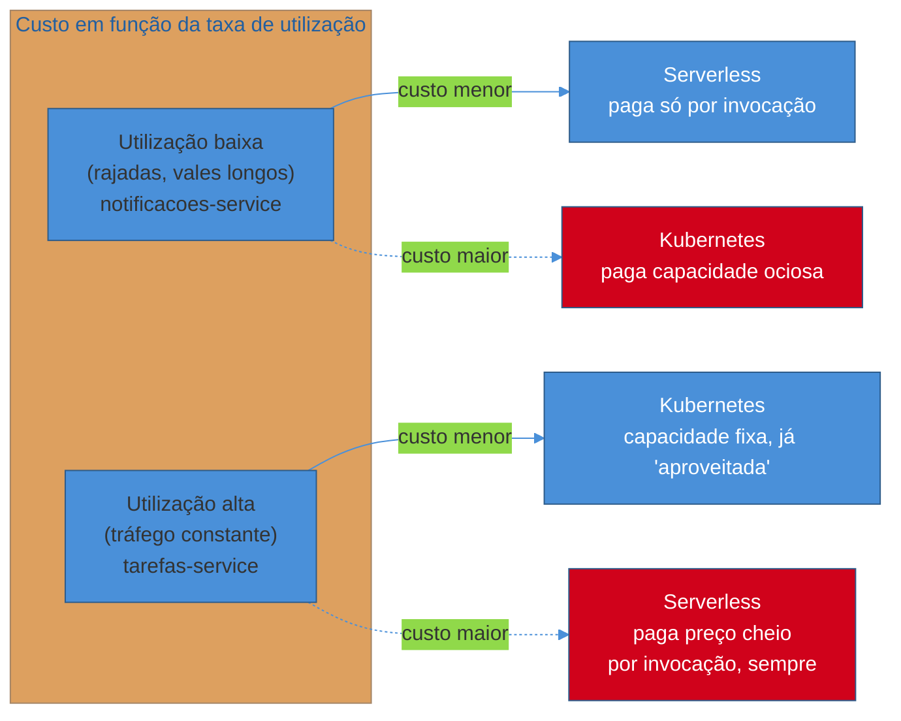
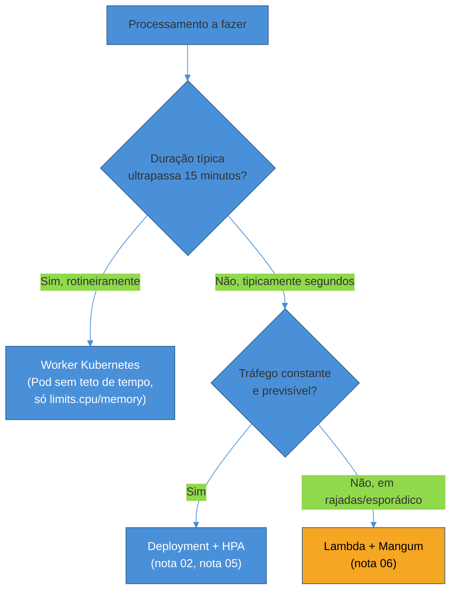
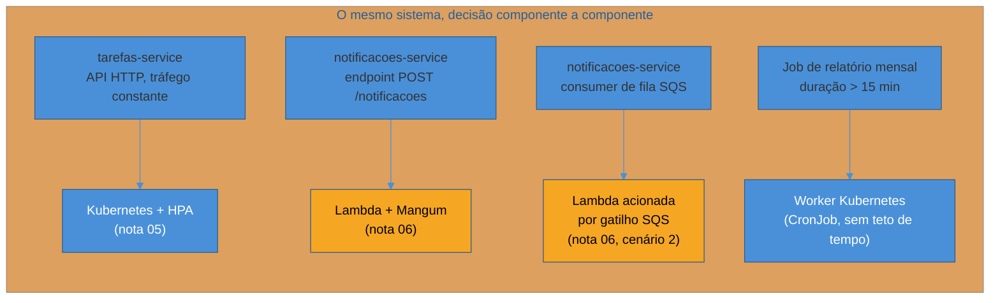

# Containers vs serverless — trade-offs honestos

> [!abstract] TL;DR
> As notas 02 a 06 deste galho construíram os dois caminhos separadamente — Kubernetes com `Deployment`/`Service`/`ConfigMap`/`Secret`, requests/limits, rolling deploy, HPA de um lado; Lambda com Mangum e cold start do outro. Esta nota puxa os fios de todas e generaliza a comparação em quatro eixos: **custo** (capacidade fixa paga por tempo rodando vs. pagamento por invocação — cada um vence num regime de tráfego diferente), **latência** (cold start ocasional vs. um Pod que, uma vez de pé, nunca esfria), **controle operacional** (Kubernetes dá acesso total ao runtime, à rede, ao disco — e cobra esse acesso em conhecimento e atenção contínua; serverless abstrai isso e tira controle junto), e **limites de execução** (Lambda tem teto de 15 minutos por invocação, um worker Kubernetes não tem teto nenhum). Não existe vencedor universal — existe uma função de três variáveis: padrão de tráfego, orçamento, e capacidade operacional do time. O capstone aplica essa função aos dois serviços reais da trilha.

## A cena: dois times, a mesma pergunta, respostas diferentes

Imagine dois times dentro da mesma organização, ambos terminando o mesmo Galho 17 — uma imagem Docker pronta, health checks respondendo, graceful shutdown configurado. O time do serviço de Tarefas olha pro painel de métricas e vê uma linha quase reta: tráfego HTTP entrando o dia inteiro, picos moderados no horário comercial, nunca zero. O time do serviço de Notificações olha pro mesmo tipo de painel e vê outra coisa — picos abruptos de alguns minutos, seguidos de vales longos e silenciosos, o formato de quem reage a eventos de fila em vez de atender requisição direta de cliente.

Os dois times, olhando pra artefatos tecnicamente idênticos (a mesma stack FastAPI, o mesmo Dockerfile multi-stage, o mesmo contrato de health check), deveriam tomar a **mesma** decisão de infraestrutura? A [[01 - Panorama — orquestrar de verdade|nota 01 deste galho]] já negou isso de forma direta: "Kubernetes e serverless não são melhor e pior, são otimizados pra padrões de tráfego diferentes". Esta nota é onde essa afirmação vira número — porque uma afirmação sem número é opinião, e uma decisão de arquitetura em produção merece mais do que opinião.

> [!question]- Por que essa comparação não veio antes, junto com a nota 06 sobre Lambda?
> Porque a nota 06 precisava primeiro estabelecer *como* Mangum funciona e *o que* cold start é, em profundidade — sem esse alicerce, uma comparação de custo seria só números soltos sem o raciocínio por trás. Esta nota pressupõe que o leitor já sabe o que é cold start, o que é `resources.requests`/`resources.limits` (nota 03), e o que HPA faz (nota 05) — e usa esse vocabulário já estabelecido pra generalizar, em vez de reexplicar.

## Eixo 1: custo — capacidade fixa vs. pagamento por invocação

O núcleo da diferença de custo entre os dois modelos é simples de enunciar e fácil de aplicar mal: **Kubernetes cobra pelo tempo que a capacidade fica alocada, independentemente de quanto trabalho ela processa nesse tempo; Lambda cobra por invocação, proporcionalmente ao tempo de execução e à memória alocada durante essa execução específica.** Um Pod rodando 24 horas custa o mesmo nas 20 horas ociosas e nas 4 horas de pico. Uma função Lambda que processa zero eventos num período custa zero nesse período.

Essa diferença de modelo de cobrança não torna nenhum dos dois "mais barato" em abstrato — ela desloca o ponto de equilíbrio conforme a **taxa de utilização** da capacidade, o mesmo conceito que a [[06 - Serverless com AWS Lambda — Mangum e cold start|nota 06]] já nomeou ao fechar a comparação `notificacoes-service`/`tarefas-service`. Vale tornar isso concreto com um exemplo numérico — ilustrativo, com valores redondos e não uma cotação real de preço (preços da AWS mudam; o raciocínio proporcional é o que importa, não o terceiro dígito decimal).

### Exemplo numérico: `tarefas-service` em Kubernetes

A [[02 - Kubernetes na prática — Deployment, Service, ConfigMap e Secret|nota 02]] fixou `tarefas-service` com `replicas: 3`; a [[03 - Recursos e limites — requests, limits e OOMKill|nota 03]] dimensionou cada Pod com `requests.cpu: 250m` e `requests.memory: 192Mi`. Considerando um nó de cluster cobrado por hora de vCPU e GB de memória alocados — o modelo de cobrança típico de um cluster gerenciado (EKS, GKE, AKS) somado ao custo dos próprios nós —, o custo de manter esses 3 Pods de pé é **fixo por hora**, 24 horas por dia, 30 dias por mês, esteja o serviço recebendo 5 requisições por segundo ou 500. O HPA da [[05 - Autoscaling — HPA baseado em métrica|nota 05]] pode elevar isso pra `maxReplicas: 15` em pico — mas o piso de `minReplicas: 2` (ou os 3 réplicas fixos, dependendo de qual manifest está ativo) nunca some, porque `tarefas-service` nunca fica ocioso o suficiente pra justificar escalar a zero.

### O mesmo tráfego, hipoteticamente, em Lambda

Agora, hipoteticamente, se o mesmo volume de tráfego de `tarefas-service` — constante, várias requisições por segundo o dia inteiro — rodasse como Lambda: cada invocação cobra por milissegundos de execução multiplicados pela memória alocada (o modelo de cobrança "GB-segundo" da AWS). Com tráfego alto e constante, o número de invocações por mês é grande o suficiente pra que o custo total, somado invocação a invocação, ultrapasse o que as mesmas 3 réplicas custariam rodando continuamente — porque não existe desconto por volume no sentido de "capacidade parada que já foi paga"; cada invocação paga o preço cheio, sempre. É o cenário que o [!warning] da nota 01 já batizou: escolher serverless por eliminação, sem examinar o padrão de tráfego, e descobrir meses depois que a fatura mensal supera de longe o que o mesmo processamento custaria em containers.

### O mesmo raciocínio, invertido, pra `notificacoes-service`

`notificacoes-service`, com o padrão em rajadas que a nota 06 já descreveu, inverte a conta: se ele rodasse como um `Deployment` de 1-2 réplicas sempre de pé — a única opção nativa em Kubernetes puro, que não faz scale-to-zero sem extensões como KEDA —, essas réplicas ficariam ociosas na maior parte das 24 horas do dia, cobrando o preço cheio de capacidade alocada mesmo nos vales longos e silenciosos entre rajadas. Como Lambda, o mesmo serviço custa próximo de zero nesses vales — não existe ambiente de execução rodando, não existe cobrança — e paga só pelos segundos de CPU efetivamente usados durante as rajadas.

> [!tip] A pergunta certa não é "qual é mais barato", é "em que ponto da curva de utilização meu serviço está"
> Não existe um número mágico de requisições por segundo que separa "use Kubernetes" de "use Lambda" — o ponto de equilíbrio depende do preço específico de cada provedor, do tamanho do Pod, da memória da função. O que é universal é a forma da curva: abaixo de um certo nível de utilização, pagar por invocação vence; acima dele, capacidade fixa vence. Medir a taxa de utilização real do serviço — não estimar de cabeça — é o primeiro passo antes de qualquer decisão, e é exatamente o dado que o capstone usa pra decidir os dois serviços da trilha com números, não com intuição.

### O cálculo de bolso, com números redondos

Vale colocar o raciocínio anterior num formato que sobrevive a uma pergunta de entrevista ou a uma decisão real de orçamento — não como cotação oficial, mas como ordem de grandeza que qualquer engenheiro deveria saber montar em cinco minutos com uma calculadora. Os números abaixo são deliberadamente redondos e fictícios; o que importa é a relação entre eles, não os valores exatos (que mudam por provedor, região e desconto negociado).

| Cenário | Kubernetes (3 Pods fixos) | Lambda (pay-per-invocation) |
|---|---|---|
| `tarefas-service` — ~50 req/s constantes, 24h/dia | Custo fixo mensal, ~100% de utilização da capacidade paga | Milhões de invocações/mês, cada uma cobrando o preço cheio — custo total tende a superar a capacidade fixa equivalente |
| `notificacoes-service` — rajadas de ~5 min, 3-4x/dia, resto ocioso | Mesmo custo fixo mensal que `tarefas-service` (a capacidade não sabe que está ociosa) | Só cobra durante os minutos de rajada — o restante do mês (~95% do tempo) não gera cobrança nenhuma |

A leitura direta da tabela: o custo do caminho Kubernetes **não muda** entre os dois cenários — 3 Pods de pé custam o mesmo estejam eles ocupados o dia inteiro ou ociosos 23 das 24 horas. É o custo do caminho Lambda que varia dramaticamente conforme o padrão de tráfego, porque só ele é sensível à utilização real. É essa assimetria — um modelo indiferente à utilização, o outro proporcional a ela — que faz a mesma pergunta ("qual é mais barato?") ter respostas opostas para os dois serviços da trilha.

> [!question]- Por que não existe um ponto em que os dois custam exatamente o mesmo, sempre?
> Existe, mas ele é específico de cada combinação de preço-por-GB-segundo do provedor com preço-por-hora da capacidade fixa equivalente — não é uma constante universal. É esse número — a taxa de utilização de equilíbrio, abaixo da qual Lambda vence e acima da qual Kubernetes vence — que ferramentas de calculadora de custo cloud (a própria calculadora da AWS, ou ferramentas de terceiros) ajudam a encontrar para um serviço real, com os preços vigentes no momento da decisão. O raciocínio desta nota generaliza a existência desse ponto de equilíbrio; encontrar o número exato é trabalho de calculadora, não de memorização.

## Eixo 2: cold start vs. sempre-quente

A [[06 - Serverless com AWS Lambda — Mangum e cold start|nota 06]] já desenvolveu cold start em profundidade — init phase, `Init Duration` no CloudWatch, lazy imports, provisioned concurrency. O que vale generalizar aqui é o contraste direto com o outro lado: **um Pod do Kubernetes, uma vez de pé, não tem esse problema.** Depois que o `readinessProbe` da [[02 - Kubernetes na prática — Deployment, Service, ConfigMap e Secret|nota 02]] confirma que o Pod está pronto pra receber tráfego, ele processa cada requisição com a mesma latência — não existe "primeira requisição depois de um período ocioso paga um preço extra", porque o processo Python nunca desliga entre requisições. O `app = FastAPI(...)` está carregado na memória, a engine SQLAlchemy (se houver) já abriu suas conexões, os schemas do Pydantic já compilaram seus validadores — tudo isso aconteceu **uma vez**, no momento em que o Pod subiu, não a cada requisição nem a cada "reaquecimento".

Essa diferença não é sutil em serviços sensíveis a latência de cauda (p99). Um cliente que bate em `tarefas-service` às 3 da manhã, num momento de tráfego baixo mas não zero, recebe a mesma latência que bateria às 14h no pico — porque os Pods já estavam de pé, prontos, o tempo inteiro. O mesmo cliente batendo numa Lambda que esfriou durante a noite paga o `Init Duration` inteiro na primeira invocação da manhã — segundos, não milissegundos, de latência adicional, justamente no momento em que menos gente está olhando pra confirmar que está tudo bem.

| Tipo de requisição | Kubernetes (Pod quente) | Lambda (warm start) | Lambda (cold start) |
|---|---|---|---|
| Latência típica adicional | ~0 ms (já está de pé) | ~0 ms (ambiente já morno) | Centenas de ms a poucos segundos, proporcional ao peso dos imports |
| Frequência do evento | Nunca acontece em regime normal | A maioria das invocações, em tráfego frequente | Primeira invocação após um vale ocioso, ou pico de concorrência acima do que já está morno |
| Quem sente o custo | Ninguém — não existe esse cenário | Ninguém — é o caminho comum | O usuário daquela invocação específica, e só ela |

A leitura útil dessa tabela não é "Lambda é sempre mais lenta" — na maior parte das invocações reais (warm), a latência de Lambda e de um Pod quente são comparáveis. O que separa os dois modelos é a **cauda**: Kubernetes não tem uma cauda de cold start pra falar, enquanto Lambda sempre tem, com frequência proporcional a quão ocioso o serviço fica entre picos.

> [!question]- Isso quer dizer que Kubernetes sempre tem latência melhor?
> Latência de estado estacionário, sim — um Pod quente responde de forma consistente. Mas "sempre de pé" tem seu próprio custo de latência em outro momento: durante um rolling deploy (nota 04) ou um evento de scale-up do HPA (nota 05), um Pod **novo** também passa por um tipo de "cold start" — start do processo Python, conexões de banco sendo abertas, o `readinessProbe` aguardando confirmação antes de receber tráfego. A diferença é de frequência e previsibilidade: um Pod novo sobe em eventos raros e planejados (deploy, autoscaling), enquanto uma função Lambda esfria e reaquece continuamente, toda vez que o tráfego cai abaixo do que mantém um ambiente morno — múltiplas vezes por dia, num serviço com vales frequentes como `notificacoes-service`.

## Eixo 3: controle operacional — o que cada modelo tira e o que cada modelo dá

As notas 02 a 05 deste galho ensinaram, na prática, o que "controle total sobre o runtime" significa em Kubernetes: escolher a versão exata da imagem base (`python:3.12-slim`, `distroless`, o que for), configurar `resources.requests`/`resources.limits` com precisão de megabyte (nota 03), decidir a estratégia exata de rollout — `maxSurge`/`maxUnavailable` (nota 04) —, e reagir a uma métrica customizada própria via `HorizontalPodAutoscaler` (nota 05). Nada disso é opcional em Kubernetes: alguém precisa decidir cada um desses valores, e decidir mal custa incidentes reais — um `limits.memory` baixo demais é OOMKill (nota 03), um `maxUnavailable` alto demais é downtime durante deploy (nota 04).

Serverless troca esse controle por simplicidade — e é uma troca real, nos dois sentidos. **A versão do runtime deixa de ser escolha livre**: a AWS publica um conjunto fixo de runtimes Python suportados (3.12, 3.13 no momento desta nota) e depreca versões antigas em um cronograma que a própria AWS controla, não o time. Rodar uma versão de Python fora desse conjunto exige empacotar como imagem de container customizada — o Cenário 1 da [[06 - Serverless com AWS Lambda — Mangum e cold start|nota 06]] — o que reintroduz parte da complexidade de manutenção de imagem que serverless prometia eliminar em primeiro lugar. **Não existe filesystem persistente entre invocações**, com uma exceção estreita: o diretório `/tmp` sobrevive só enquanto o mesmo ambiente de execução permanece morno entre invocações (o mesmo "warm" da nota 06), e desaparece quando o ambiente é reciclado — não é um substituto pra armazenamento de verdade. Um serviço que precisa gravar arquivos de forma durável precisa de S3 ou de um volume externo, nunca do disco local da função. E **existe um teto rígido de tempo de execução** — o próximo eixo desta nota, e talvez o mais categórico dos quatro.

| Dimensão de controle | Kubernetes | Lambda |
|---|---|---|
| Versão do runtime Python | Escolha livre (qualquer imagem base) | Conjunto fixo, no cronograma da AWS |
| Filesystem persistente | Sim — `PersistentVolume`, disco do nó | Não — só `/tmp` efêmero entre invocações warm |
| Acesso à rede interna do cluster | Total — DNS interno, `NetworkPolicy` | Só via VPC configurada explicitamente na função |
| Quem atualiza a "plataforma" em si | O time (versão do Kubernetes, nós, patches de SO) | A AWS (o runtime, a infraestrutura física) |
| Superfície de configuração por deploy | `Deployment`, `Service`, `ConfigMap`, `Secret`, HPA | Memória, timeout, gatilho, variáveis de ambiente |

Em troca, ninguém no time do serviço serverless precisa saber o que é `CrashLoopBackoff`, não existe versão do próprio Kubernetes pra atualizar, não existe decisão de dimensionamento de nó a tomar. A operação que sobra é bem mais estreita: configurar memória da função, o gatilho (API Gateway, SQS, Function URL), e — se necessário — provisioned concurrency. É objetivamente menos coisa pra saber, o que é exatamente a razão de serverless ser um caminho atraente pra times pequenos ou pra serviços onde o padrão de tráfego já favorece o modelo por custo.

> [!warning] "Serverless" não quer dizer "sem operação nenhuma"
> **O que acontece:** um time trata a migração pra Lambda como eliminação total de trabalho operacional — "não tem servidor, não tem o que administrar" — e para de monitorar o serviço com o mesmo rigor que monitorava o `Deployment` no Kubernetes. **Por quê:** a superfície de operação encolhe, mas não desaparece. Cold start ainda precisa ser medido (`Init Duration` no CloudWatch, nota 06). Timeout ainda precisa ser dimensionado corretamente pro handler. Memória subdimensionada ainda derruba a função — só que com um erro de `Out of Memory` da Lambda em vez de um OOMKill do Kubernetes, o mesmo problema com um nome diferente. "Sem servidor" descreve quem gerencia a infraestrutura física, não quem é responsável por garantir que o código rodando nela se comporta. **Como evitar:** manter a mesma disciplina de observabilidade — métricas, logs estruturados, alertas — que a trilha já construiu no Galho 17, adaptada aos sinais específicos de Lambda (`Init Duration`, `Duration`, `Throttles`, taxa de erro por invocação) em vez dos sinais de Pod.

## Eixo 4: limites de execução — o teto que Kubernetes não tem

Toda função AWS Lambda tem um **timeout máximo configurável de até 15 minutos por invocação** — depois disso, a AWS mata a execução no meio, não importa em que ponto do processamento ela esteja, e devolve um erro de timeout pra quem chamou (ou, no caso de um gatilho SQS com batch item failures, devolve a mensagem à fila pra reprocessamento). Não existe forma de configurar mais que isso — é um teto rígido da plataforma, não um parâmetro de aplicação.

Isso descarta Lambda, sem meio-termo, pra qualquer processamento que rotineiramente ultrapasse esse teto: um relatório que agrega meses de dados, um job de reprocessamento em lote de milhões de registros, um pipeline de ETL de longa duração. Um **worker Kubernetes** — um Pod comum, sem nenhum `Service` na frente, processando itens de uma fila em loop — não tem teto de tempo de execução nenhum. Ele roda o tempo que o processamento exigir, limitado só pelos `resources.limits` de CPU/memória (nota 03) e pela disponibilidade do próprio cluster, não por um limite de tempo artificial imposto pela plataforma.

> [!question]- E se um processamento estiver perto do limite, tipo 12-13 minutos — dá pra confiar em Lambda mesmo assim?
> Tecnicamente cabe, mas é uma escolha frágil. Um processamento que já roda perto do teto hoje tende a crescer — mais dados, mais registros, um novo passo de validação adicionado meses depois — e o dia em que ultrapassa 15 minutos, a função simplesmente começa a falhar em produção, sem aviso prévio no código, só no comportamento observado. A prática mais robusta é reservar Lambda pra processamento que fica confortavelmente abaixo do teto (minutos, não a fração de uma hora) e mover qualquer coisa que já flerta com o limite pra um worker Kubernetes ou pra um serviço gerenciado de processamento em lote (AWS Batch, Step Functions com espera longa), que não têm esse teto embutido.

## Zona cinzenta — quando a resposta é "os dois, para partes diferentes do mesmo serviço"

Os quatro eixos anteriores tratam a decisão como binária — um serviço inteiro vai pra Kubernetes ou pra Lambda — mas a fronteira real, na prática, costuma cortar **dentro** de um serviço, não entre serviços. A própria [[06 - Serverless com AWS Lambda — Mangum e cold start|nota 06]] já mostrou o exemplo: `notificacoes-service` não é uma coisa só — é um endpoint HTTP (`POST /notificacoes`, atendido por `Mangum(app)`) **e** um consumer de fila (originalmente uma `asyncio.Task` de longa duração no Galho 15, reformulado como uma segunda função Lambda acionada por gatilho SQS). As duas metades do mesmo serviço podem, legitimamente, tomar caminhos diferentes — ou até ficar as duas em Lambda, ou uma em cada modelo, dependendo de como cada metade se comporta sob os quatro eixos desta nota.

Esse padrão generaliza bem além do caso específico da trilha. Um sistema real raramente é "tudo Kubernetes" ou "tudo serverless" — é comum ver a API pública de alto tráfego em containers com HPA, um job de geração de relatório noturno como worker Kubernetes (porque ultrapassa o teto de 15 minutos), e um handler de webhook esporádico de terceiros como função Lambda (porque o tráfego é imprevisível e raro). Tratar a decisão como "escolher uma plataforma pra empresa inteira" é o mesmo erro de enquadramento que o [!warning] da nota 01 já nomeou — só que em escala maior.

> [!tip] "Híbrido" não é indecisão — é aplicar o mesmo critério peça por peça
> Rodar parte de um sistema em Kubernetes e parte em Lambda não é uma solução de compromisso frouxa, "não sabíamos escolher, então usamos os dois" — é a aplicação consistente do mesmo critério (formato de tráfego, duração, controle necessário) a cada componente individualmente, em vez de a um sistema inteiro de uma vez. A inconsistência real estaria em usar o mesmo critério e chegar em respostas diferentes sem justificativa — não em ter respostas diferentes para componentes genuinamente diferentes.

## Armadilhas comuns

> [!warning] Comparar o custo de um Pod isolado com o custo de uma invocação isolada
> **O que acontece:** alguém pega o preço por hora de um único Pod pequeno e o preço por invocação de uma única chamada Lambda, compara os dois números diretamente, e conclui que um modelo é sempre mais barato que o outro — ignorando que os dois números não são comparáveis sem multiplicar pelo volume real de tráfego do serviço. **Por quê:** o preço por unidade (por hora de Pod, por invocação de Lambda) não diz nada sozinho sobre custo total — só multiplicado pelo volume real (quantas horas o Pod fica de pé, quantas invocações o serviço recebe por mês) a comparação vira significativa. Um Pod "caro por hora" pode ser mais barato no total se atende milhões de requisições nessa hora; uma invocação "barata" pode somar mais que um Pod se o volume de invocações for alto o suficiente. **Como evitar:** sempre multiplicar pelo volume mensal esperado antes de comparar — exatamente o exercício da tabela de custo desta nota — e, sempre que possível, usar dados reais de tráfego (não estimativa) antes de comprometer uma decisão de arquitetura.

> [!warning] Migrar pra serverless só nas partes fáceis, e deixar a parte difícil pra trás sem decisão explícita
> **O que acontece:** um time migra o endpoint HTTP simples de um serviço pra Lambda (o caminho feliz, bem documentado pela [[06 - Serverless com AWS Lambda — Mangum e cold start|nota 06]]) e adia indefinidamente a decisão sobre a parte que não se encaixa tão bem — um job de processamento longo, uma conexão com estado que precisa persistir. Meses depois, essa parte ainda está rodando "temporariamente" numa VM solta, sem os manifests, sem os health checks, sem nada do rigor operacional que o resto do sistema já tem. **Por quê:** a decisão de infraestrutura, quando fica pela metade, tende a acumular dívida silenciosa exatamente na parte mais frágil — porque é a parte que não teve um caminho óbvio (nem Kubernetes puro, nem Lambda puro) e por isso foi adiada em vez de resolvida. **Como evitar:** tratar cada componente do sistema — não o sistema inteiro de uma vez — com a mesma pergunta explícita: formato de tráfego, duração, controle necessário, e então decidir Kubernetes ou Lambda pra aquele componente especificamente, documentando a decisão (mesmo que seja "worker Kubernetes, porque ultrapassa 15 minutos") em vez de deixá-la implícita numa VM que ninguém revisitou.

## Casos práticos

### Cenário 1: um relatório mensal que cresceu até estourar o teto da Lambda

Um time decide, com razão, rodar um job de geração de relatório financeiro como função Lambda — ele roda uma vez por mês, processa um volume modesto de dados, e leva cerca de 4 minutos. Tráfego esporádico (uma invocação por mês), duração confortavelmente abaixo do teto: a decisão bate certo com os quatro eixos desta nota. Seis meses depois, o volume de dados cresceu — mais clientes, mais transações por cliente — e o mesmo job, sem nenhuma mudança de código, passa a levar 11 minutos. Ninguém percebeu, porque 11 minutos ainda cabe dentro do teto de 15. Mais alguns meses de crescimento normal do negócio, e o job ultrapassa 15 minutos — a função começa a falhar todo mês, sempre no mesmo ponto do processamento, sem que nenhuma linha de código tenha mudado.

O problema aqui não foi a escolha original — foi a ausência de um sinal de alerta antes do teto. A correção correta não é simplesmente aumentar algo que já está no máximo permitido pela plataforma (não dá, 15 minutos é hard limit); é migrar esse job específico pra um worker Kubernetes — um `CronJob` do próprio Kubernetes, ou um Pod disparado por um agendador externo, que roda o mesmo código Python sem teto de tempo, limitado só pelos `resources.limits` de CPU/memória (nota 03). A lição generaliza: qualquer processamento cuja duração típica tende a crescer com o volume de negócio — relatórios, agregações, batch jobs — merece monitorar a proximidade do teto de 15 minutos como uma métrica de produção, não descobrir o estouro só quando ele já quebrou algo.

### Cenário 2: o breakeven informal que um time calcula antes de migrar

Antes de decidir se migra um serviço de Kubernetes pra Lambda (ou vice-versa), um exercício rápido e honesto — sem precisar de uma calculadora sofisticada — costuma bastar pra evitar a armadilha da nota 01: pegar o custo mensal atual da capacidade fixa (o que os Pods já custam hoje, número real da fatura de cloud, não estimativa) e o volume real de invocações que o serviço processaria em Lambda num mês típico (extraído das métricas já expostas desde o Galho 17, não adivinhado). Multiplicar o volume de invocações pelo preço por invocação e por GB-segundo do provedor dá uma estimativa de custo em Lambda comparável, dígito a dígito, ao que a fatura atual já mostra. Se a estimativa em Lambda ficar visivelmente abaixo da fatura atual, a migração provavelmente compensa; se ficar próxima ou acima, o serviço provavelmente já está no regime de utilização onde capacidade fixa vence — e a migração, nesse caso, só faria sentido por outro motivo que não custo (por exemplo, reduzir superfície operacional).

## Tabela de decisão honesta

Nenhuma linha desta tabela é uma regra fixa — é um resumo dos quatro eixos, pra consulta rápida na hora de decidir, não um substituto pra medir o padrão de tráfego real de cada serviço.

| Critério | Favorece Kubernetes | Favorece Serverless (Lambda) |
|---|---|---|
| Padrão de tráfego | Constante, previsível, utilização alta | Em rajadas, esporádico, vales longos |
| Sensibilidade a latência de primeira requisição | Baixa tolerância — precisa de resposta consistente sempre | Tolerável — alguns segundos extras ocasionais não quebram o produto |
| Duração do processamento | Pode ultrapassar 15 minutos (workers, batch, ETL) | Confortavelmente abaixo de 15 minutos |
| Orçamento e maturidade operacional do time | Time já sabe operar cluster, ou tem orçamento pra aprender | Time pequeno, prioriza reduzir superfície operacional |
| Necessidade de runtime/rede/disco customizados | Alta — controle fino sobre versão, filesystem, rede interna | Baixa — a aplicação já se encaixa no modelo de função stateless |
| Previsibilidade de custo mês a mês | Alta — capacidade fixa, fatura estável | Variável — cresce e encolhe com o uso real, pode surpreender se mal medido |

> [!tip] A pergunta que resume os quatro eixos
> "Qual é o formato do tráfego, quanto tempo cada execução leva, quanto controle eu preciso sobre a infraestrutura, e quem no time vai operar isso?" — responder essas quatro perguntas honestamente, com números reais do serviço em questão (não intuição, não moda de mercado), é o que separa uma decisão de arquitetura sólida de uma aposta.

## Os dois candidatos da trilha, revisitados

Ao longo deste galho, dois serviços serviram de estudo de caso constante: `tarefas-service`, com tráfego HTTP direto de clientes e um volume que se mantém razoavelmente constante ao longo do dia útil — o candidato que a [[02 - Kubernetes na prática — Deployment, Service, ConfigMap e Secret|nota 02]] deployou com `Deployment`/`Service`/`ConfigMap`/`Secret`, que a [[03 - Recursos e limites — requests, limits e OOMKill|nota 03]] dimensionou com requests/limits, que a [[04 - Rolling deploy sem downtime no Kubernetes|nota 04]] fez rolar sem downtime, e que a [[05 - Autoscaling — HPA baseado em métrica|nota 05]] fez escalar automaticamente por métrica. E `notificacoes-service`, com tráfego em rajadas via consumo de fila RabbitMQ e chamadas internas esporádicas — o candidato que a [[06 - Serverless com AWS Lambda — Mangum e cold start|nota 06]] mostrou rodando, sem reescrever uma linha de lógica de negócio, atrás de `Mangum(app)`.

Esta nota generalizou os quatro eixos que separam os dois caminhos — custo, latência, controle, limites de execução — mas deliberadamente não fechou a decisão final pra nenhum dos dois serviços com números concretos de produção. Essa decisão, aplicada de fato, com os manifests completos de um lado e a avaliação formal do outro, é o trabalho do [[08 - Capstone — os dois serviços em produção de verdade|capstone deste galho]] — a última nota antes de fechar o bloco "Plataforma distribuída e produção" (Galhos 14-18) da trilha Python inteira.

## O que vem a seguir

Esta nota generalizou os trade-offs entre Kubernetes e serverless em quatro eixos, com números ilustrativos e uma tabela de decisão — mas nenhum dos dois serviços reais da trilha foi decidido de fato. Isso é intencional: o capstone é o lugar certo pra essa decisão, porque ela precisa amarrar tudo que este galho construiu — os manifests completos da nota 02, o dimensionamento de recursos da nota 03, o rolling deploy da nota 04, o HPA da nota 05, e o handler Lambda da nota 06 — num cenário único e coerente, não numa generalização abstrata como esta.

- [[08 - Capstone — os dois serviços em produção de verdade|08 — Capstone: os dois serviços em produção de verdade]] — aplica os quatro eixos desta nota, com números concretos, pra decidir de fato `tarefas-service` (Kubernetes com HPA) e avaliar `notificacoes-service` como candidato a Lambda — e fecha o bloco "Plataforma distribuída e produção" (Galhos 14-18) da trilha Python.

## Em entrevista

Uma pergunta sênior comum — "como você decide entre Kubernetes e serverless pra um novo serviço" — tem uma resposta fraca e uma forte. A fraca lista tecnologias como se fossem posições num ranking ("eu prefiro Kubernetes, dá mais controle" ou "serverless é o futuro"). A forte nomeia os eixos concretos da decisão — formato de tráfego e taxa de utilização (o fator dominante de custo), sensibilidade a latência de primeira requisição, duração típica de processamento contra o teto de 15 minutos da Lambda, e a capacidade operacional real do time — e reconhece explicitamente que a resposta pode ser diferente para dois serviços do mesmo sistema, porque padrão de tráfego é uma propriedade de cada serviço, não uma escolha de plataforma corporativa única. Trazer um exemplo concreto — "no sistema em que trabalhei, o serviço de API ficou em Kubernetes com HPA porque o tráfego era constante, e o serviço de notificações foi pra Lambda porque reagia a eventos em rajadas" — demonstra que o raciocínio não é teórico.

Uma variação comum da mesma pergunta é "quais são as desvantagens do serverless que as pessoas não mencionam o suficiente" — e aqui a resposta forte evita o clichê de "vendor lock-in" isolado (que é real, mas genérico) e vai direto pros dois pontos concretos que esta nota desenvolveu: o teto rígido de execução, que descarta Lambda de forma categórica pra processamento longo, e o risco de custo invertido quando o padrão de tráfego muda ao longo do tempo — um serviço que nasceu esporádico e cresceu até ficar constante, sem que ninguém revisitasse a decisão original de infraestrutura. Nomear esse segundo ponto — que a decisão não é permanente, e que revisitá-la é parte do trabalho, não uma falha do julgamento original — costuma diferenciar uma resposta sênior de uma resposta que só decorou os prós e contras de um blog post.

## How to explain in English

> "There's no universal winner between Kubernetes and serverless — the decision is a function of traffic shape, budget, and the team's operational capacity. Kubernetes charges for allocated capacity regardless of utilization, so it's cheaper when traffic is steady and utilization is high; Lambda charges per invocation, so it's cheaper when traffic is bursty with long idle valleys. A warm Kubernetes Pod never pays a cold-start tax, while a Lambda function that's been idle pays the init phase cost on its next invocation — a real latency difference for traffic that's sporadic by nature. Kubernetes gives full control over runtime, networking, and storage, but that control has to be operated continuously — someone patches the cluster, tunes resource limits, watches rollouts. Serverless abstracts that away but removes the same control: you don't pick the runtime version freely, there's no persistent filesystem, and every invocation has a hard 15-minute execution ceiling — long-running batch processing simply doesn't fit the model. The right call is never 'which technology is better' — it's 'what does this specific service's traffic actually look like.'"

| PT | EN |
|----|----|
| Taxa de utilização | Utilization rate |
| Capacidade alocada | Allocated capacity |
| Pagamento por invocação | Pay-per-invocation |
| Latência de cauda (p99) | Tail latency (p99) |
| Teto de execução | Execution ceiling |
| Superfície operacional | Operational surface |
| Ponto de equilíbrio (custo) | Break-even point |
| Worker de longa duração | Long-running worker |

## Fontes

- AWS. *AWS Lambda pricing*. aws.amazon.com. https://aws.amazon.com/lambda/pricing/ (acessado em 2026-07-12) — modelo de cobrança por invocação e GB-segundo usado no eixo de custo desta nota.
- AWS. *AWS Lambda Developer Guide — Lambda quotas*. docs.aws.amazon.com. https://docs.aws.amazon.com/lambda/latest/dg/gettingstarted-limits.html (acessado em 2026-07-12) — o teto de 15 minutos de execução por invocação e demais limites da plataforma.
- Kubernetes. *Managing Resources for Containers*. kubernetes.io. https://kubernetes.io/docs/concepts/configuration/manage-resources-containers/ (acessado em 2026-07-12) — o modelo de `requests`/`limits` que fundamenta o custo de capacidade fixa em Kubernetes, já aplicado na nota 03.
- Martin Fowler. *Serverless Architectures*. martinfowler.com. https://martinfowler.com/articles/serverless.html (acessado em 2026-07-12) — discussão independente dos trade-offs estruturais entre FaaS e infraestrutura sempre ligada.
- [[01 - Panorama — orquestrar de verdade|Panorama — orquestrar de verdade]] — nota 01 deste galho — primeira nomeação do eixo "formato de tráfego" que esta nota desenvolve com números.
- [[03 - Recursos e limites — requests, limits e OOMKill|Recursos e limites — requests, limits e OOMKill]] — nota 03 deste galho — os valores de `requests`/`limits` usados no exemplo numérico de custo.
- [[05 - Autoscaling — HPA baseado em métrica|Autoscaling — HPA baseado em métrica]] — nota 05 deste galho — `minReplicas`/`maxReplicas` usados no exemplo de `tarefas-service`.
- [[06 - Serverless com AWS Lambda — Mangum e cold start|Serverless com AWS Lambda — Mangum e cold start]] — nota 06 deste galho — cold start, provisioned concurrency e o fundamento de utilização baixa que esta nota generaliza.

Consultado em 2026-07-12.
