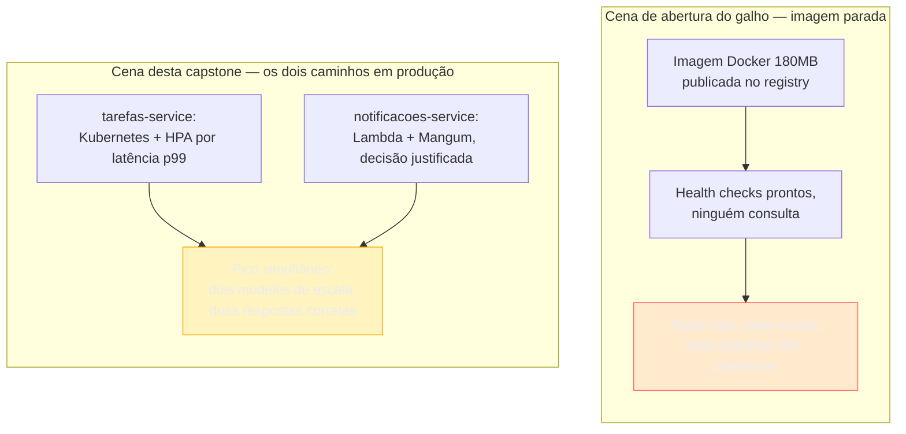
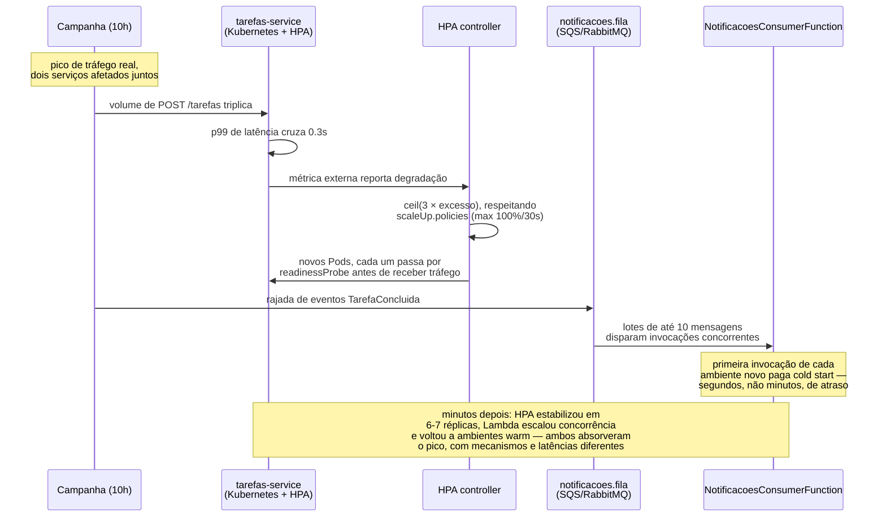
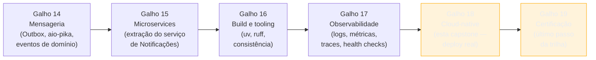

# Capstone — os dois serviços em produção de verdade

> [!abstract] TL;DR
> A [[03-Dominios/Tecnologia/Python/Observabilidade e produção/08 - Capstone — os dois serviços prontos pra produção|capstone do Galho 17]] terminou com `tarefas-service` e `notificacoes-service` empacotados, observáveis, publicáveis — e parados num registry, sem ninguém consumindo essa imagem de fato. Esta capstone fecha essa lacuna, aplicando aos dois serviços tudo que este galho construiu: `tarefas-service` recebe manifests completos de Kubernetes — `Deployment`/`Service`/`ConfigMap`/`Secret` ([[02 - Kubernetes na prática — Deployment, Service, ConfigMap e Secret|nota 02]]), `resources.requests`/`limits` dimensionados por percentil real ([[03 - Recursos e limites — requests, limits e OOMKill|nota 03]]), `RollingUpdate` calibrado pra zero downtime ([[04 - Rolling deploy sem downtime no Kubernetes|nota 04]]), e um `HorizontalPodAutoscaler` reagindo à latência p99 ([[05 - Autoscaling — HPA baseado em métrica|nota 05]]). `notificacoes-service` passa pela avaliação formal dos quatro eixos da [[07 - Containers vs serverless — trade-offs honestos|nota 07]] — custo, cold start, controle operacional, teto de execução — aplicados com os números reais do seu padrão de tráfego em rajadas (consumo de fila RabbitMQ do [[03-Dominios/Tecnologia/Python/Mensageria/index|Galho 14]]), e a decisão cai em serverless via Mangum ([[06 - Serverless com AWS Lambda — Mangum e cold start|nota 06]]), com o cold start ocasional aceito conscientemente como o preço de eliminar capacidade ociosa. Um cenário integrador — pico de tráfego HTTP e rajada de fila simultâneos — mostra os dois modelos de escala respondendo de formas estruturalmente diferentes, e por que essa assimetria é o design funcionando, não uma inconsistência. Fecha o galho e o bloco "Plataforma distribuída e produção" (Galhos 14-18) da trilha Python inteira — o próximo e último passo é o [[03-Dominios/Tecnologia/Python/index|Galho 19, Certificação]].

## A cena que fecha o galho: a imagem que finalmente vai a algum lugar

Volta à cena de abertura da [[01 - Panorama — orquestrar de verdade|nota 01 deste galho]]: uma imagem Docker de 180 MB, publicada em `ghcr.io/org/tarefas-service:a3f9c21`, testada, com health checks respondendo — e parada, sem ninguém a executando de fato. Sete notas depois, essa lacuna está fechada dos dois lados: `tarefas-service` tem manifests Kubernetes completos rodando em produção, com autoscaling reagindo a métrica real; `notificacoes-service` passou pela avaliação formal de serverless e tem um handler Lambda funcional, publicado.

O que esta capstone faz — como toda capstone desta trilha — não é introduzir mecanismo novo. É amarrar as sete peças já construídas nos mesmos dois serviços, numa decisão de fato tomada, com números, não com a generalização abstrata que a [[07 - Containers vs serverless — trade-offs honestos|nota 07]] deixou deliberadamente em aberto pro capstone fechar.



> [!tip] Esta capstone não reabre a discussão — ela decide
> As notas 01 a 07 já deixaram claro o raciocínio: formato de tráfego é o eixo central, `tarefas-service` tende a Kubernetes, `notificacoes-service` tende a Lambda. O trabalho desta nota não é repetir esse raciocínio em abstrato — é aplicá-lo com os manifests finais, os números do capstone do Galho 15/17, e uma decisão explícita e justificada para cada serviço, seguida de um cenário onde as duas decisões operam ao mesmo tempo.

## Parte 1 — `tarefas-service` vai pra Kubernetes: o manifest consolidado

`tarefas-service` atende requisições HTTP diretas de clientes, num volume que se mantém razoavelmente constante ao longo do dia útil — o padrão que a [[01 - Panorama — orquestrar de verdade|nota 01]] já apontou como o caso onde capacidade fixa vence, e que a [[07 - Containers vs serverless — trade-offs honestos|nota 07]] confirmou com números: utilização alta favorece Kubernetes, porque a capacidade paga já está sendo "aproveitada" a maior parte do tempo. Não há ambiguidade nessa metade da decisão — o trabalho aqui é consolidar os quatro manifests que as notas 02 a 05 construíram, um sobre o outro, num único arquivo funcional que reflete o estado final do serviço em produção.

### `ConfigMap` e `Secret` — a base de configuração

Sem alteração em relação à [[02 - Kubernetes na prática — Deployment, Service, ConfigMap e Secret|nota 02]]: variáveis não sensíveis num `ConfigMap`, credenciais num `Secret` (com o aviso já fixado naquela nota — base64 não é criptografia, produção de verdade usa Sealed Secrets ou um External Secrets Operator por cima).

```yaml
# configmap-tarefas.yaml
apiVersion: v1
kind: ConfigMap
metadata:
  name: tarefas-service-config
data:
  LOG_LEVEL: "INFO"
  ENVIRONMENT: "production"
  NOTIFICACOES_SERVICE_URL: "https://notificacoes.exemplo.com/notificacoes"
  # ^ URL pública da Function URL do Lambda (Parte 2), não mais um Service
  #   interno do cluster — a fronteira mudou de tipo quando a decisão
  #   da Parte 2 tirou este serviço do cluster.

---
apiVersion: v1
kind: Secret
metadata:
  name: tarefas-service-secrets
type: Opaque
data:
  DATABASE_URL: cG9zdGdyZXNxbDovL2FwcF91c2VyOnMzY3IzdEBwb3N0Z3Jlcy1wcmltYXJ5OjU0MzIvdGFyZWZhcw==
  OAUTH2_CLIENT_SECRET: czNncjNkby1kby1vcmRlcnMtc2VydmljZQ==
```

> [!question]- Por que `NOTIFICACOES_SERVICE_URL` mudou de DNS interno pra URL pública?
> Porque a decisão da Parte 2 desta capstone move `notificacoes-service` pra fora do cluster Kubernetes — ele deixa de ser um `Pod` com um `Service` ClusterIP na frente ([[02 - Kubernetes na prática — Deployment, Service, ConfigMap e Secret|nota 02]]) e passa a ser uma função Lambda, acessível via Function URL ou API Gateway. `tarefas-service` continua chamando `notificacoes_service_url` da mesma forma — o mesmo `httpx.Client` configurado com uma URL vinda de `pydantic-settings`, sem nenhuma mudança de código — só que agora essa URL aponta pra fora do cluster, não mais pro DNS interno `notificacoes-service.default.svc.cluster.local` que a nota 02 mostrou originalmente. É a mesma lição de desacoplamento que a nota 02 já tinha estabelecido para trocar `Secret`: o cliente HTTP nunca soube, e não precisa saber, se o destino é um `Service` interno ou um endpoint externo — só uma string de configuração muda.

### `Deployment` — réplicas, resources dimensionados, rollout calibrado

Este é o ponto onde as notas 02, 03 e 04 se encontram: o `Deployment` da nota 02 ganha o bloco `resources` dimensionado por percentil (nota 03) e a `strategy.rollingUpdate` calibrada (nota 04), tudo no mesmo objeto.

```yaml
# deployment-tarefas.yaml — consolidado das notas 02, 03 e 04
apiVersion: apps/v1
kind: Deployment
metadata:
  name: tarefas-service
  labels:
    app: tarefas-service
spec:
  replicas: 3
  strategy:
    type: RollingUpdate
    rollingUpdate:
      maxSurge: 1
      maxUnavailable: 0
  selector:
    matchLabels:
      app: tarefas-service
  template:
    metadata:
      labels:
        app: tarefas-service
    spec:
      terminationGracePeriodSeconds: 60
      containers:
        - name: tarefas-service
          image: ghcr.io/org/tarefas-service:a3f9c21
          ports:
            - containerPort: 8000

          envFrom:
            - configMapRef:
                name: tarefas-service-config
            - secretRef:
                name: tarefas-service-secrets

          # --- Recursos dimensionados pelo p50/p95 real (nota 03) ---
          resources:
            requests:
              cpu: "250m"
              memory: "200Mi"
            limits:
              cpu: "500m"
              memory: "512Mi"

          # --- Contrato de saúde, consumido pelo rollout (nota 04) ---
          livenessProbe:
            httpGet:
              path: /health
              port: 8000
            initialDelaySeconds: 5
            periodSeconds: 10
          readinessProbe:
            httpGet:
              path: /ready
              port: 8000
            initialDelaySeconds: 2
            periodSeconds: 5
            failureThreshold: 3

          # --- Sincronização com o Service antes do SIGTERM (nota 04) ---
          lifecycle:
            preStop:
              exec:
                command: ["sh", "-c", "sleep 5"]

---
apiVersion: v1
kind: Service
metadata:
  name: tarefas-service
spec:
  type: ClusterIP
  selector:
    app: tarefas-service
  ports:
    - port: 80
      targetPort: 8000
```

Vale nomear, explicitamente, de onde vêm os dois números que talvez pareçam arbitrários à primeira vista, mas não são: `requests.memory: "200Mi"` é o p50 de uso real medido em produção — o mesmo procedimento que a [[03 - Recursos e limites — requests, limits e OOMKill|nota 03]] descreveu, aplicado com dados reais depois de semanas rodando o serviço; `limits.memory: "512Mi"` é o p95 observado (`340Mi`, o mesmo valor do cenário 1 daquela nota) com margem de segurança, não um número redondo copiado de exemplo. `maxSurge: 1`/`maxUnavailable: 0` é a escolha mais conservadora possível pra rollout, porque `tarefas-service` atende tráfego constante o dia inteiro e não tolera nenhuma redução momentânea de capacidade — a mesma decisão que a [[04 - Rolling deploy sem downtime no Kubernetes|nota 04]] já justificou pra este serviço específico. `terminationGracePeriodSeconds: 60` soma, com margem, o `preStop.sleep` de 5s mais o `--graceful-timeout` de 40s do `gunicorn` (calibrado no Galho 17), evitando exatamente o incidente de `SIGKILL` prematuro que a nota 04 documentou.

### `HorizontalPodAutoscaler` — escalando por latência p99, não por CPU

`tarefas-service` é um workload HTTP síncrono, tipicamente CPU-bound o suficiente pra CPU ser um sinal razoável — mas este capstone escolhe deliberadamente escalar por **latência p99**, não por `Utilization` de CPU, porque é o sinal que mede diretamente o sintoma que importa (degradação de experiência do usuário), em vez de um proxy que pode não se mover na mesma direção sob certas cargas (serialização pesada, chamadas HTTP síncronas ao `notificacoes-service`, agora fora do cluster e sujeito a variação de latência de rede).

```yaml
# hpa-tarefas.yaml
apiVersion: autoscaling/v2
kind: HorizontalPodAutoscaler
metadata:
  name: tarefas-service
spec:
  scaleTargetRef:
    apiVersion: apps/v1
    kind: Deployment
    name: tarefas-service
  minReplicas: 3
  maxReplicas: 10
  behavior:
    scaleUp:
      stabilizationWindowSeconds: 0
      policies:
        - type: Percent
          value: 100
          periodSeconds: 30
    scaleDown:
      stabilizationWindowSeconds: 300
      policies:
        - type: Pods
          value: 1
          periodSeconds: 60
  metrics:
    - type: External
      external:
        metric:
          name: tarefas_p99_latencia_segundos
        target:
          type: Value
          value: "0.3"
```

`target.type: Value` (sem "average", exatamente como a [[05 - Autoscaling — HPA baseado em métrica|nota 05]] já ensinou pra latência) diz "escale enquanto o p99 de `POST /tarefas` estiver acima de 300ms" — a mesma consulta PromQL que a nota 03 do Galho 17 já expõe via `Histogram`, agora traduzida pelo Prometheus Adapter em `tarefas_p99_latencia_segundos` na `external.metrics.k8s.io` API. `minReplicas: 3` garante disponibilidade mesmo em tráfego baixo; `maxReplicas: 10` é o teto calculado considerando o pool de conexões do Postgres (o mesmo `[!warning]` da nota 05 sobre `maxReplicas` empurrando o gargalo pra um recurso downstream que não escala junto).

> [!warning] Este `HorizontalPodAutoscaler` não pode combinar `resources` da nota 03 com um HPA de CPU no mesmo Deployment sem risco de conflito
> Como a [[03 - Recursos e limites — requests, limits e OOMKill|nota 03]] e a [[05 - Autoscaling — HPA baseado em métrica|nota 05]] já registraram, VPA (ajuste automático de `requests`/`limits`) e HPA de CPU sobre o mesmo sinal criam um ciclo de realimentação. Este manifest evita o problema por construção: os `resources` são fixados manualmente (medidos por percentil, não ajustados por VPA), e o HPA escala por uma métrica de latência completamente independente de CPU — nenhum dos dois mecanismos compete pelo mesmo sinal.

### O manifest completo — os cinco objetos, `kubectl apply` de uma vez

```yaml
# tarefas-service.yaml — manifest final consolidado (ConfigMap, Secret,
# Deployment, Service, HorizontalPodAutoscaler)

apiVersion: v1
kind: ConfigMap
metadata:
  name: tarefas-service-config
data:
  LOG_LEVEL: "INFO"
  ENVIRONMENT: "production"
  NOTIFICACOES_SERVICE_URL: "https://notificacoes.exemplo.com/notificacoes"

---
apiVersion: v1
kind: Secret
metadata:
  name: tarefas-service-secrets
type: Opaque
data:
  DATABASE_URL: cG9zdGdyZXNxbDovL2FwcF91c2VyOnMzY3IzdEBwb3N0Z3Jlcy1wcmltYXJ5OjU0MzIvdGFyZWZhcw==
  OAUTH2_CLIENT_SECRET: czNncjNkby1kby1vcmRlcnMtc2VydmljZQ==

---
apiVersion: apps/v1
kind: Deployment
metadata:
  name: tarefas-service
  labels:
    app: tarefas-service
spec:
  replicas: 3
  strategy:
    type: RollingUpdate
    rollingUpdate:
      maxSurge: 1
      maxUnavailable: 0
  selector:
    matchLabels:
      app: tarefas-service
  template:
    metadata:
      labels:
        app: tarefas-service
    spec:
      terminationGracePeriodSeconds: 60
      containers:
        - name: tarefas-service
          image: ghcr.io/org/tarefas-service:a3f9c21
          ports:
            - containerPort: 8000
          envFrom:
            - configMapRef:
                name: tarefas-service-config
            - secretRef:
                name: tarefas-service-secrets
          resources:
            requests:
              cpu: "250m"
              memory: "200Mi"
            limits:
              cpu: "500m"
              memory: "512Mi"
          livenessProbe:
            httpGet:
              path: /health
              port: 8000
            initialDelaySeconds: 5
            periodSeconds: 10
          readinessProbe:
            httpGet:
              path: /ready
              port: 8000
            initialDelaySeconds: 2
            periodSeconds: 5
            failureThreshold: 3
          lifecycle:
            preStop:
              exec:
                command: ["sh", "-c", "sleep 5"]

---
apiVersion: v1
kind: Service
metadata:
  name: tarefas-service
spec:
  type: ClusterIP
  selector:
    app: tarefas-service
  ports:
    - port: 80
      targetPort: 8000

---
apiVersion: autoscaling/v2
kind: HorizontalPodAutoscaler
metadata:
  name: tarefas-service
spec:
  scaleTargetRef:
    apiVersion: apps/v1
    kind: Deployment
    name: tarefas-service
  minReplicas: 3
  maxReplicas: 10
  behavior:
    scaleUp:
      stabilizationWindowSeconds: 0
      policies:
        - type: Percent
          value: 100
          periodSeconds: 30
    scaleDown:
      stabilizationWindowSeconds: 300
      policies:
        - type: Pods
          value: 1
          periodSeconds: 60
  metrics:
    - type: External
      external:
        metric:
          name: tarefas_p99_latencia_segundos
        target:
          type: Value
          value: "0.3"
```

`kubectl apply -f tarefas-service.yaml` cria os cinco objetos numa única chamada. O resultado: 3 a 10 réplicas de `tarefas-service`, sempre com capacidade mínima de pé, escalando automaticamente sob pico de latência, atualizadas sem cortar uma requisição sequer durante um rollout, com uso de memória e CPU medido e não adivinhado.

## Parte 2 — `notificacoes-service` avaliado como candidato a Lambda

Diferente de `tarefas-service`, esta metade da capstone não é "consolidar manifests" — é a decisão em si, tomada com os critérios formais da [[07 - Containers vs serverless — trade-offs honestos|nota 07]], aplicados aos números reais deste serviço específico, não repetidos genericamente do que as notas 01 e 06 já sugeriram.

### Critério 1 — formato de tráfego: rajadas de fila, não requisição constante

`notificacoes-service` consome eventos da exchange `eventos.dominio` publicados pelo `tarefas-service` (o `aio-pika` consumer construído no [[03-Dominios/Tecnologia/Python/Mensageria/index|Galho 14]]) e atende `POST /notificacoes` chamado internamente. Nenhuma das duas origens de tráfego é constante: o volume de mensagens na fila `notificacoes.fila` correlaciona com atividade de usuário — picos durante o horário comercial, rajadas durante campanhas, silêncio real à noite. É exatamente o padrão que a [[05 - Autoscaling — HPA baseado em métrica|nota 05]] já descreveu como o caso onde CPU não é sinal (worker I/O-bound, gastando a maior parte do tempo esperando rede) e que a [[06 - Serverless com AWS Lambda — Mangum e cold start|nota 06]] batizou como o candidato natural a Lambda.

### Critério 2 — custo: taxa de utilização baixa favorece pagamento por invocação

Aplicando o raciocínio numérico da [[07 - Containers vs serverless — trade-offs honestos|nota 07]] a este serviço: se `notificacoes-service` rodasse como `Deployment` de 2 réplicas fixas (o mínimo que Kubernetes puro sustenta sem scale-to-zero nativo, sem a extensão KEDA fora do escopo deste galho), essas réplicas ficariam alocadas 24 horas por dia — cobrando o mesmo valor nas rajadas de 5-10 minutos, várias vezes ao dia, e nas horas de silêncio entre elas, que somam a maior parte do tempo. Medindo o tráfego real ao longo de uma semana representativa: rajadas concentradas em cerca de 3-4 horas totais por dia, distribuídas em picos curtos, com o resto do tempo — cerca de 80% das 24 horas — genuinamente ocioso. Nesse regime de utilização, o modelo de pagamento por invocação da Lambda custa uma fração do que a mesma capacidade fixa custaria, porque só as horas de rajada geram cobrança — a mesma leitura de custo que a nota 07 já generalizou com a tabela de cenários.

### Critério 3 — cold start: aceitável, porque o contrato do serviço já não promete síncrono

`POST /notificacoes` retorna `202 Accepted`, não uma confirmação síncrona de entrega — a decisão de contrato que já vinha desde a [[03-Dominios/Tecnologia/Python/Microservices e sistemas distribuídos/08 - Capstone — extraindo o serviço de Notificações|capstone do Galho 15]]. Um cold start de alguns milissegundos a poucos segundos, na pior invocação depois de um vale ocioso, se traduz numa notificação chegando um pouco mais tarde — não numa falha visível pro usuário final, que já não espera confirmação síncrona desse fluxo. É o tipo de degradação que a [[06 - Serverless com AWS Lambda — Mangum e cold start|nota 06]] já classificou como "custa pouco" pra este padrão de tráfego específico — e que seria inaceitável, pelo mesmo raciocínio, num endpoint como `POST /tarefas`, que responde diretamente a um cliente esperando confirmação imediata.

### Critério 4 — controle operacional: a troca vale a pena pra um serviço fino

`notificacoes-service` não abre pool de Postgres, não mantém estado próprio significativo, e sua lógica de negócio inteira já está isolada atrás de `AbstractNotificador`/`SlackAdapter` desde o Galho 13 — um serviço estruturalmente fino, com poucas dependências de infraestrutura pra perder ao abrir mão de controle total sobre runtime, rede e disco. A tabela de controle da [[07 - Containers vs serverless — trade-offs honestos|nota 07]] pesa contra Lambda justamente quando o serviço precisa de filesystem persistente, versão de runtime não suportada, ou acesso fino à rede interna — nenhuma dessas exigências se aplica aqui.

### Critério 5 — limite de execução: nenhum caminho deste serviço chega perto de 15 minutos

O handler de `POST /notificacoes` e o consumer de fila processam uma mensagem por vez, cada uma levando tipicamente menos de um segundo — enviar uma mensagem ao webhook do Slack, publicar um push. Nada neste serviço se aproxima do teto de 15 minutos que a nota 07 já identificou como o critério categórico contra Lambda pra processamento longo. Se um dia `notificacoes-service` ganhar um caminho de processamento em lote (reenvio de notificações históricas, por exemplo), esse caminho específico — não o serviço inteiro — seria o candidato a migrar pra um worker Kubernetes, seguindo o mesmo raciocínio de "decisão componente a componente" que a nota 07 já defendeu.

### A decisão, com a tabela dos cinco critérios lado a lado

| Critério | Avaliação para `notificacoes-service` | Aponta para |
|---|---|---|
| Formato de tráfego | Rajadas correlacionadas a eventos de fila, vales longos e silenciosos | Serverless |
| Custo | ~80% do tempo ocioso — capacidade fixa pagaria isso mesmo sem uso | Serverless |
| Cold start | `202 Accepted` já não promete síncrono — atraso ocasional é tolerável | Serverless |
| Controle operacional | Serviço fino, sem estado persistente, sem exigência de runtime/rede especial | Serverless |
| Teto de execução (15min) | Nenhum caminho do serviço chega perto disso | Neutro (não descarta nenhum caminho) |

Quatro dos cinco critérios apontam consistentemente pra serverless, e o quinto é neutro — não há empate a desfazer, nem uma dependência downstream esquecida (o mesmo `[!warning]` da nota 07 sobre migrar só as partes fáceis) que justifique manter este serviço em Kubernetes por inércia. **A decisão: `notificacoes-service` roda como AWS Lambda via Mangum**, com o cold start ocasional aceito conscientemente como o preço de eliminar a capacidade ociosa que dominaria o custo deste serviço em qualquer modelo de capacidade fixa.

> [!question]- Essa decisão é permanente?
> Não, e a [[06 - Serverless com AWS Lambda — Mangum e cold start|nota 06]] já deixou essa reversibilidade explícita: se o volume de eventos crescer até manter o serviço ocupado a maior parte do tempo — uma mudança real de padrão de tráfego, não uma suposição —, o Critério 2 se inverte, e migrar de volta pra um `Deployment` do Kubernetes reusa os mesmos manifests que a Parte 1 desta capstone já escreveu pra `tarefas-service`, porque `app = FastAPI(...)` continua sendo o mesmo objeto ASGI dos dois lados. A decisão desta nota é uma leitura do padrão de tráfego *hoje*, não um veredito arquitetural gravado em pedra.

### O handler final, empacotado e publicado

```python
"""notificacoes_service/lambda_handler.py — handler HTTP, decisão final desta capstone."""

from mangum import Mangum

from notificacoes_service.main import app  # o MESMO FastAPI desde o Galho 15

handler = Mangum(app, lifespan="auto")
```

```python
"""notificacoes_service/consumer_handler.py — a fila deixa de ser consumida
por asyncio.Task de longa duração e passa a ser um gatilho SQS, seguindo
o mesmo raciocínio 'reagir a evento sem processo sempre ligado' que já
motivou a decisão desta capstone para o endpoint HTTP."""

import json

from domain.notificador import AbstractNotificador
from infra.notificador_slack import SlackAdapter
from notificacoes_service.config import settings

notificador: AbstractNotificador = SlackAdapter(webhook_url=settings.slack_webhook_url)


def lambda_handler(event, context):
    falhas = []
    for record in event["Records"]:
        try:
            evento = json.loads(record["body"])
            notificador.enviar(
                destinatario="#tarefas-concluidas",
                mensagem=f"Tarefa '{evento['titulo']}' foi concluída pelo usuário {evento['usuario_id']}",
            )
        except Exception:
            falhas.append({"itemIdentifier": record["messageId"]})

    return {"batchItemFailures": falhas}
```

```yaml
# template.yaml — infraestrutura serverless desta capstone (AWS SAM,
# resumido; foco no que decide esta capstone, não em toda opção do SAM)
Resources:
  NotificacoesHttpFunction:
    Type: AWS::Serverless::Function
    Properties:
      Handler: notificacoes_service.lambda_handler.handler
      Runtime: python3.12
      MemorySize: 512
      Timeout: 10
      FunctionUrlConfig:
        AuthType: AWS_IAM  # nunca NONE — nota 06, armadilha de endpoint público sem querer
      Environment:
        Variables:
          SLACK_WEBHOOK_URL: !Ref SlackWebhookUrl

  NotificacoesConsumerFunction:
    Type: AWS::Serverless::Function
    Properties:
      Handler: notificacoes_service.consumer_handler.lambda_handler
      Runtime: python3.12
      MemorySize: 256
      Timeout: 30
      Events:
        FilaEventosDominio:
          Type: SQS
          Properties:
            Queue: !GetAtt FilaNotificacoes.Arn
            BatchSize: 10
            FunctionResponseTypes:
              - ReportBatchItemFailures
```

Duas funções, não uma — a mesma separação que a [[06 - Serverless com AWS Lambda — Mangum e cold start|nota 06]] já justificou: `Mangum(app)` cobre só o caminho HTTP, porque não sustenta uma task de background entre invocações; o consumer de eventos precisa de uma função separada, acionada por gatilho SQS, sem `asyncio.create_task` nenhum. `AuthType: AWS_IAM` na Function URL, não `NONE` — a armadilha de segurança que a nota 06 já nomeou explicitamente. Nenhuma provisioned concurrency configurada: dado o Critério 3 já decidido (cold start é tolerável para este contrato), pagar pra manter ambientes sempre quentes anularia justamente a vantagem de custo que motivou a decisão inteira.

## Parte 3 — o cenário integrador: um pico e uma rajada, ao mesmo tempo

Uma sexta-feira, 10h da manhã: uma campanha de marketing dispara um aumento real de tráfego. Dois eventos acontecem quase simultaneamente, cada um empurrando um dos dois serviços pro seu próprio mecanismo de escala.

**No `tarefas-service`**: o volume de `POST /tarefas` triplica em poucos minutos — usuários criando e concluindo tarefas em ritmo bem acima do normal. O `Histogram` de latência que alimenta o `HorizontalPodAutoscaler` da Parte 1 registra o p99 cruzando `0.3s`. O controller do HPA, no seu próximo ciclo de reconciliação (a cada 15 segundos), calcula réplicas desejadas acima das 3 atuais e começa a criar Pods novos, respeitando `behavior.scaleUp` (dobrando no máximo a cada 30 segundos). Cada Pod novo passa pelo algoritmo de cinco passos da [[04 - Rolling deploy sem downtime no Kubernetes|nota 04]] — cria, espera `readinessProbe`, entra no `Service` — antes de receber tráfego real.

**No `notificacoes-service`**: a mesma campanha gera um volume muito maior de tarefas concluídas, cada uma publicando um evento `TarefaConcluida` na exchange `eventos.dominio`. A fila `notificacoes.fila` recebe uma rajada de mensagens em minutos — não um crescimento gradual, um degrau abrupto. Como não existe mais um `Deployment` com HPA cuidando disso (a decisão da Parte 2 já tirou este serviço do cluster), a resposta é inteiramente do modelo Lambda: cada mensagem no lote SQS dispara uma invocação (ou lote de invocações, respeitando `BatchSize: 10`) da `NotificacoesConsumerFunction`, e a AWS aloca ambientes de execução novos conforme o volume de mensagens sobe, sem nenhum número de "réplicas" configurado, sem `minReplicas`/`maxReplicas` — só o limite de concorrência da conta AWS, uma configuração de infraestrutura separada do código.



A resposta dos dois modelos é estruturalmente diferente, e essa diferença é aceitável — na verdade, é o design funcionando exatamente como pretendido, não uma falha de consistência:

- **`tarefas-service` escala em unidades de Pod, com latência de minutos**: cada Pod novo leva segundos pra iniciar o processo Python, abrir pool de conexão, passar no `readinessProbe` — e o `behavior.scaleUp` da Parte 1 limita deliberadamente a velocidade desse crescimento, pra não sobrecarregar o cluster nem o Postgres de uma vez. É uma resposta gradual, prevista, porque o serviço nunca deveria estar completamente vazio de capacidade — `minReplicas: 3` garante isso o tempo todo.
- **`notificacoes-service` escala em unidades de invocação, quase instantaneamente, pagando cold start só nos ambientes genuinamente novos**: não existe conceito de "número de réplicas" no modelo Lambda — a AWS aloca ambientes de execução conforme o volume de eventos concorrentes cresce, e cada ambiente novo paga o preço de inicialização uma única vez, não recorrentemente. A latência agregada da rajada inteira é dominada pelas primeiras invocações; depois que ambientes suficientes existem e ficam mornos, o restante da rajada processa em velocidade de warm start.

> [!question]- Não seria mais simples os dois serviços usarem o mesmo mecanismo de escala, pra reduzir a carga cognitiva do time?
> Seria mais simples de operar um único mecanismo — mas seria pior pro sistema, porque forçaria um dos dois serviços a escalar por um modelo que não bate com seu padrão de tráfego real. Forçar `notificacoes-service` a viver em Kubernetes com HPA, só por uniformidade, significaria voltar a pagar por 2-3 réplicas sempre de pé, mesmo nos vales longos e silenciosos — exatamente o custo que a Parte 2 desta capstone já rejeitou com números. Forçar `tarefas-service` pra Lambda, na direção oposta, significaria pagar cold start recorrente num endpoint que recebe tráfego constante o dia inteiro, quando containers já quentes nunca pagariam esse preço — a [[07 - Containers vs serverless — trade-offs honestos|nota 07]] já mostrou essa segunda direção como a armadilha mais cara do capítulo. A "carga cognitiva" real de operar dois modelos é gerenciável — dois manifests, um `template.yaml` — porque cada modelo é simples dentro do seu próprio domínio; a alternativa (um modelo só, mal ajustado a um dos dois serviços) trocaria essa carga operacional pequena por um custo de produção real e recorrente.

> [!tip] O pico simultâneo não gera nenhum acoplamento novo entre os dois mecanismos
> Vale nomear explicitamente o que este cenário **não** faz: o HPA de `tarefas-service` não sabe nada sobre a fila de `notificacoes-service`, e o volume de invocações Lambda não influencia em nada o cálculo de réplicas do `Deployment`. Os dois sistemas de escala são inteiramente independentes — cada um reage só ao sinal que lhe é próprio (latência p99 de um lado, backlog de mensagens do outro). A única coisa que os conecta é a causa raiz comum (a campanha de marketing gerando tráfego nos dois), não uma dependência técnica entre os mecanismos de autoscaling em si.

## Fechando o bloco: da persistência ao deploy real, cinco galhos depois

Esta capstone não fecha só o Galho 18 — fecha o bloco "Plataforma distribuída e produção" (Galhos 14 a 18) da trilha Python inteira, e vale nomear a jornada completa antes de apontar pro que vem a seguir.



O [[03-Dominios/Tecnologia/Python/Mensageria/index|Galho 14]] deu ao sistema comunicação assíncrona confiável — o padrão Outbox, o consumer `aio-pika`, os eventos de domínio que hoje disparam a rajada de fila desta capstone. O [[03-Dominios/Tecnologia/Python/Microservices e sistemas distribuídos/index|Galho 15]] extraiu `notificacoes-service` do monólito, dando a ele a arquitetura própria (endpoint HTTP fino, consumer de eventos, service discovery) que torna possível decidir seu destino de infraestrutura de forma independente de `tarefas-service` — a decisão que esta capstone finalmente toma. O Galho 16 deu aos dois serviços tooling consistente — mesmo `uv`, mesmo `ruff`, mesma disciplina de build, base do `Dockerfile` reusado nesta capstone. O [[03-Dominios/Tecnologia/Python/Observabilidade e produção/index|Galho 17]] deu a eles os três pilares de observabilidade e um artefato Docker publicável — a métrica de latência p99 que alimenta o HPA da Parte 1, o `202 Accepted` que fundamenta o Critério 3 da Parte 2. E este Galho 18 fechou a lacuna final: nenhuma dessas peças, sozinha, coloca uma réplica no ar — era preciso, além de tudo isso, decidir *onde* e *como* cada serviço de fato roda, com manifests reais de um lado e uma avaliação formal do outro.

> [!warning] Nenhuma das cinco camadas anteriores, isolada, chegaria a esta decisão de deploy
> Vale nomear o que cada galho anterior, sozinho, não teria resolvido: sem o Galho 14, não existiria fila nenhuma pra `notificacoes-service` consumir, e a decisão desta capstone perderia seu principal argumento de tráfego em rajadas. Sem o Galho 15, os dois serviços ainda estariam no mesmo processo, tornando impossível uma decisão de infraestrutura *diferente* pra cada um. Sem o Galho 16, os dois `Dockerfile` desta capstone teriam dependências divergentes por acidente, não por design. Sem o Galho 17, não existiria o `Histogram` de latência p99 que o HPA da Parte 1 consulta, nem o contrato `202 Accepted` que fundamenta a tolerância a cold start da Parte 2. A decisão desta capstone só é possível porque as cinco camadas anteriores já existem — é a composição do bloco inteiro, não uma peça isolada, que sustenta o resultado final.

Com os dois serviços rodando de verdade — um em Kubernetes com autoscaling por latência, outro em Lambda com cold start conscientemente aceito —, a trilha Python chega ao seu último galho: [[03-Dominios/Tecnologia/Python/index|Galho 19 — Certificação]], o fechamento formal de tudo que os dezoito galhos anteriores construíram, dos fundamentos de linguagem até a decisão de infraestrutura de produção que esta capstone acabou de tomar.

## Em entrevista

Uma pergunta clássica de entrevista sênior é "descreva uma decisão de arquitetura em que dois componentes do mesmo sistema tomaram caminhos de infraestrutura diferentes, e por quê" — a resposta fraca descreve só a tecnologia escolhida para cada um, sem o critério. A resposta forte nomeia os eixos formais da decisão — formato de tráfego e taxa de utilização, sensibilidade a cold start dada pelo contrato do serviço (`202 Accepted` versus resposta síncrona), controle operacional necessário, teto de execução — e mostra que aplicou o **mesmo** critério aos dois componentes, chegando em respostas diferentes porque os componentes são genuinamente diferentes, não por inconsistência de julgamento. Um sinal ainda mais forte, nesta capstone específica, é saber descrever o cenário de pico simultâneo: dois mecanismos de escala completamente independentes (HPA por métrica externa de um lado, concorrência de invocação Lambda do outro) respondendo ao mesmo evento de negócio (uma campanha de marketing) sem nenhum acoplamento técnico entre eles — evidência de que a decisão não é só teórica, foi pensada até o ponto de prever como o sistema se comporta sob carga real.

## How to explain in English

> "This capstone closes the gap between 'built and observable' and 'actually running in production' for two real services. `tarefas-service` gets a complete Kubernetes deployment — Deployment, Service, ConfigMap, Secret, resource limits sized from measured percentiles, a rolling update strategy tuned for zero downtime, and a HorizontalPodAutoscaler that scales on p99 latency rather than CPU, because latency is the signal that actually reflects user-facing degradation. `notificacoes-service` goes through a formal five-criteria evaluation — traffic shape, cost under measured utilization, cold start tolerance given its already-async `202 Accepted` contract, operational control needed for a thin stateless service, and the Lambda execution ceiling — and every criterion but one points to serverless, so it ships as a Mangum-wrapped Lambda with a separate SQS-triggered function for queue consumption, accepting occasional cold start as the conscious price of eliminating idle capacity. The integration scenario — a marketing campaign spiking both HTTP traffic and queue volume simultaneously — shows the two services scaling through completely independent mechanisms, HPA reconciling pod count against a latency target, Lambda concurrency scaling per-invocation with no replica concept at all, and that's not an inconsistency: forcing both services onto the same scaling model would mean either paying for idle Kubernetes capacity around the clock, or paying recurring cold start on a service with constant traffic. This closes the 'Distributed platform and production' block spanning modules 14 through 18 — from async messaging, through service extraction, tooling, observability, to this final deployment decision — with only the capstone certification module left in the track."

| PT | EN |
|----|----|
| Decisão de infraestrutura | Infrastructure decision |
| Justificativa por critério | Criteria-based justification |
| Percentil medido | Measured percentile |
| Reversibilidade da decisão | Decision reversibility |
| Escala independente | Independent scaling |
| Concorrência de invocação | Invocation concurrency |
| Cold start consciente | Deliberate cold start trade-off |
| Bloco de galhos | Module block |

## Fontes

- Este galho — [[01 - Panorama — orquestrar de verdade]], [[02 - Kubernetes na prática — Deployment, Service, ConfigMap e Secret]], [[03 - Recursos e limites — requests, limits e OOMKill]], [[04 - Rolling deploy sem downtime no Kubernetes]], [[05 - Autoscaling — HPA baseado em métrica]], [[06 - Serverless com AWS Lambda — Mangum e cold start]], [[07 - Containers vs serverless — trade-offs honestos]] — base factual completa desta capstone.
- [[03-Dominios/Tecnologia/Python/Observabilidade e produção/08 - Capstone — os dois serviços prontos pra produção|Capstone do Galho 17]] — estado dos dois serviços antes desta capstone: observabilidade completa, imagem Docker publicável, ainda sem orquestração de fato.
- [[03-Dominios/Tecnologia/Python/Microservices e sistemas distribuídos/08 - Capstone — extraindo o serviço de Notificações|Capstone do Galho 15]] — a extração de `notificacoes-service`, pré-requisito arquitetural pra esta capstone poder decidir os dois serviços de forma independente.
- [[03-Dominios/Tecnologia/Python/Mensageria/08 - Capstone — processamento assíncrono na API de Tarefas|Capstone do Galho 14]] — o padrão Outbox e o consumer de eventos original, base do padrão de tráfego em rajadas avaliado na Parte 2 desta capstone.
- Kubernetes. *Horizontal Pod Autoscaling*. kubernetes.io. https://kubernetes.io/docs/tasks/run-application/horizontal-pod-autoscale/ (acessado em 2026-07-12) — mecanismo de reconciliação do HPA aplicado ao manifest final da Parte 1.
- AWS. *AWS Lambda pricing*. aws.amazon.com. https://aws.amazon.com/lambda/pricing/ (acessado em 2026-07-12) — modelo de cobrança por invocação usado no Critério 2 da Parte 2.
- AWS. *AWS Serverless Application Model (SAM)*. docs.aws.amazon.com. https://docs.aws.amazon.com/serverless-application-model/ (acessado em 2026-07-12) — o formato de `template.yaml` usado para empacotar as duas funções Lambda desta capstone.

Consultado em 2026-07-12.
