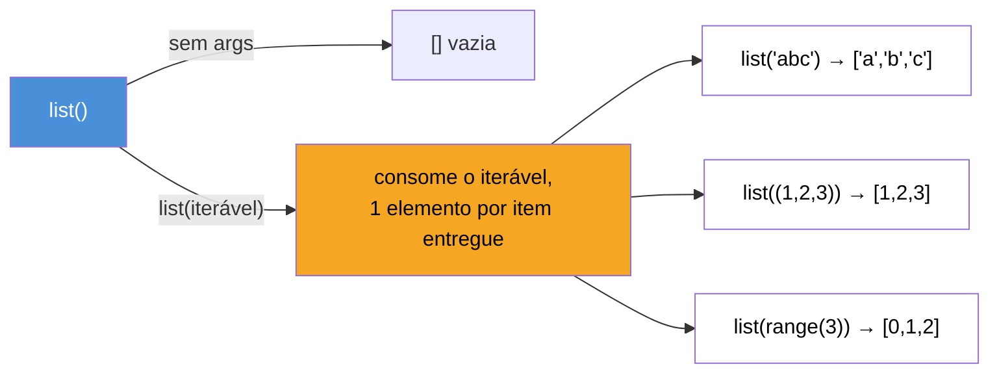
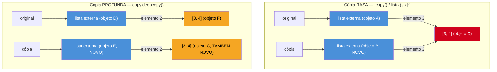

# Listas — criação, métodos e slicing avançado

> [!abstract] TL;DR
> `list` é a sequência mutável de uso geral do Python — o equivalente funcional a `ArrayList`/`Array` de outras linguagens, mas sem tipo fixo de elemento e redimensionável sem aviso. `.append()` adiciona **um** item (mesmo que esse item seja outra lista); `.extend()` despeja os itens **de dentro de** um iterável. `.sort()` ordena in-place e devolve `None`; `sorted()` devolve uma lista nova e aceita qualquer iterável. Slicing (`lista[start:stop:step]`) é a ferramenta mais subestimada da linguagem — índices negativos, passo negativo (`[::-1]`) e slice assignment (`lista[1:3] = [...]`, que pode até *mudar o tamanho* da lista) fazem parte do vocabulário idiomático. E toda cópia feita com `.copy()`, `list(lista)` ou `lista[:]` é **rasa** — o que explica por que `[[0]*3]*3` não cria uma matriz 3×3, mas três rótulos apontando pra mesma linha.

## O bug que engana até quem já sabe de mutabilidade

Você já leu, na nota [[03-Dominios/Tecnologia/Python/Core/02 - Tipos e variáveis|Tipos e variáveis]], que uma variável Python é um rótulo, não uma caixa, e que `list` é mutável. Agora um exercício clássico de entrevista técnica: criar um tabuleiro de jogo da velha, uma matriz 3×3 de zeros.

```python
tabuleiro = [[0] * 3] * 3
print(tabuleiro)
# [[0, 0, 0], [0, 0, 0], [0, 0, 0]]  -- parece perfeito

tabuleiro[0][0] = 1
print(tabuleiro)
# [[1, 0, 0], [1, 0, 0], [1, 0, 0]]  -- "1" apareceu em TODAS as linhas??
```

A saída parece impossível: você mudou só `tabuleiro[0][0]`, mas o `1` vazou para `tabuleiro[1][0]` e `tabuleiro[2][0]` também. Não é um bug do interpretador — é a consequência direta e correta de como `*` (multiplicação de lista) e o modelo de referência funcionam juntos, e é provavelmente a armadilha mais reincidente entre quem está aprendendo listas em Python, porque **parece** ter dado certo no primeiro `print()`.

O motivo mora exatamente no assunto desta nota: como listas são criadas, o que `.copy()` promete de verdade (uma cópia **rasa**, não uma cópia total), e por que multiplicar uma lista por um inteiro não é o mesmo que criar N listas independentes. Ao final, você vai saber não só corrigir o tabuleiro, mas reconhecer a mesma armadilha disfarçada em qualquer lugar onde uma lista mutável é "duplicada" por atalho.

## O que é

`list` é uma das quatro coleções nativas do Python (junto com `tuple`, `dict` e `set`) e a mais usada no dia a dia. Três propriedades definem o que ela é:

1. **Sequência ordenada** — os elementos têm posição, indexável por número inteiro (`lista[0]`, `lista[-1]`).
2. **Mutável** — pode crescer, encolher e ter elementos trocados no lugar, sem trocar de identidade (`id()` continua o mesmo).
3. **Heterogênea** — uma mesma lista pode misturar `int`, `str`, outra `list`, um objeto qualquer; Python não força um tipo único de elemento (embora, na prática, código idiomático evite misturar tipos sem necessidade — e a nota do Galho 5, Tipagem moderna, mostra como `list[int]` documenta a intenção).

Quem vem de Java ou C# pensa em `List<T>`/`ArrayList` — mas lá o `T` é fixado na declaração e o container é uma classe da biblioteca padrão em cima de um array redimensionável. Quem vem de JavaScript já tem a metáfora mais próxima: `Array` do JS também é dinâmico, heterogêneo e mutável — mas os métodos têm nomes diferentes (`push`/`pop` viram `append`/`pop`, `slice` continua `slice` só que com colchetes em vez de método) e, principalmente, `list.sort()` do Python é **estável e in-place por padrão**, enquanto `Array.prototype.sort()` do JS também é in-place mas historicamente teve pegadinhas de comparação (ordenar números como string) que o Python simplesmente não tem, porque `sort()` usa `<` diretamente.

## Por que importa

Listas aparecem em praticamente todo programa Python de tamanho não-trivial — filas de tarefas, resultados de query, buffers de linha, pilhas de chamadas manuais, matrizes simples. Errar o modelo de cópia (rasa vs profunda) ou confundir `.append()` com `.extend()` produz bugs que **não** disparam exceção — o programa continua rodando, só que com dados errados, o pior tipo de bug para depurar. E slicing mal compreendido é meio caminho andado para "reescrever em 8 linhas o que uma linha de slice faria" — o tipo de código que entrevistadores técnicos usam para calibrar quão fluente alguém é na linguagem, não só se sabe resolver o problema.

## Como funciona

### Criando listas: literal, `list()` e a diferença entre eles

A forma mais comum é o literal com colchetes:

```python
vazia = []
numeros = [1, 2, 3]
mista = [1, "dois", 3.0, [4, 5]]
```

`list()` (o construtor do tipo) é usado de duas formas bem diferentes, e a confusão entre elas é comum em quem está começando:

```python
list()              # [] -- lista vazia, sem argumento
list("abc")          # ['a', 'b', 'c'] -- CADA caractere vira um elemento
list((1, 2, 3))      # [1, 2, 3] -- converte QUALQUER iterável em lista
list([1, 2, 3])      # [1, 2, 3] -- copia uma lista existente (cópia RASA — ver seção de cópia)
```

`list(iterável)` não é "coloque este argumento dentro de uma lista de um item" — é "**consuma** este iterável e produza uma lista com cada elemento que ele entregou". `list("abc")` não devolve `['abc']`; devolve `['a', 'b', 'c']`, porque `str` é, ela mesma, um iterável de caracteres. Isso é o mesmo comportamento — "iterável vira sequência de elementos" — que reaparece em `.extend()` mais adiante, e vale a pena gravar já: em Python, praticamente toda API que recebe um iterável itera sobre ele, não o embrulha como um único item.



### `.append()` vs `.extend()`: a confusão mais comum de métodos de lista

Segundo a documentação oficial (`docs.python.org/3/tutorial/datastructures.html`), `list.append(x)` "adiciona um item ao final da lista. Equivalente a `a[len(a):] = [x]`" — ou seja, sempre adiciona **exatamente um** elemento, seja lá o que esse elemento for. `list.extend(iterável)` "estende a lista anexando todos os itens do iterável. Equivalente a `a[len(a):] = iterável`" — consome o iterável e anexa cada item dele, um a um.

```python
a = [1, 2, 3]
a.append([4, 5])
print(a)   # [1, 2, 3, [4, 5]]  -- UM item novo: a lista [4, 5] inteira, aninhada

b = [1, 2, 3]
b.extend([4, 5])
print(b)   # [1, 2, 3, 4, 5]    -- DOIS itens novos: 4 e 5, achatados no nível de b
```

> [!question]- "Por que `append` com uma lista dentro não achata automaticamente, tipo `extend`?"
> Porque `.append()` não sabe (nem deveria saber) que o argumento é uma lista — ele trata qualquer objeto passado como **um único valor a colocar no final**, seja um `int`, uma `str`, um `dict` ou outra `list`. É o mesmo espírito de "não adivinhar intenção" que você já viu em `"2" + 2` explodindo em vez de concatenar ou somar silenciosamente: `.append()` sempre faz uma coisa só, previsível, independente do tipo do argumento. Se você quer "juntar duas listas em uma sequência achatada", o nome do método que expressa essa intenção é `.extend()` — ou, para criar uma lista nova em vez de mutar, o operador `+` (`a + b`) ou `[*a, *b]`.

O erro mais comum na prática é escrever `lista.append(outra_lista)` querendo o efeito de `.extend()`, produzindo uma lista aninhada por acidente — e só perceber quando `len(lista)` ou uma iteração posterior dá um resultado "errado" que na verdade é exatamente o que foi pedido.

### Inserindo, removendo e uma segunda confusão: `.remove()` vs `.pop()`

```python
lista = [10, 20, 30, 40]

lista.insert(1, 15)      # insere 15 na posição 1 (antes do elemento que estava lá)
print(lista)               # [10, 15, 20, 30, 40]

lista.insert(len(lista), 50)  # equivalente a .append(50) -- a doc oficial cita essa equivalência
print(lista)               # [10, 15, 20, 30, 40, 50]
```

`.remove(valor)` e `.pop(índice)` resolvem problemas diferentes, e o nome sozinho não deixa isso óbvio para quem está começando:

- **`.remove(valor)`** busca a **primeira ocorrência** de um valor e a apaga. Levanta `ValueError` se o valor não existe na lista. Você passa o **valor**, não a posição.
- **`.pop(índice=-1)`** remove o elemento numa **posição** (índice) e **devolve** esse elemento — por isso o nome "pop", como uma pilha. Sem argumento, remove e devolve o último item. Levanta `IndexError` se o índice não existe (ou se a lista está vazia).

```python
frutas = ["maçã", "banana", "maçã", "uva"]

frutas.remove("maçã")     # remove a PRIMEIRA "maçã" encontrada
print(frutas)               # ['banana', 'maçã', 'uva']

item = frutas.pop(0)       # remove e RETORNA o item na posição 0
print(item)                  # 'banana'
print(frutas)               # ['maçã', 'uva']

ultimo = frutas.pop()      # sem índice: remove e retorna o ÚLTIMO
print(ultimo)                # 'uva'
```

`.clear()` remove todos os elementos de uma vez (equivalente a `del a[:]`, segundo a documentação oficial) — diferente de reatribuir `lista = []`, que **não** afeta outras variáveis que apontem para a mesma lista (lembra do modelo de rótulos: `lista = []` faz `lista` apontar para um objeto novo; `.clear()` esvazia o objeto existente no lugar, visível por qualquer outro rótulo que aponte para ele).

### `.sort()` in-place vs `sorted()` que retorna nova lista

Esta é uma distinção estrutural, não só de conveniência, e aparece com frequência em código de produção e em entrevistas:

| | `list.sort()` | `sorted(iterável)` |
|---|---|---|
| Onde funciona | só em `list` (é um método) | qualquer iterável (função embutida) |
| O que devolve | `None` (muta a lista original) | uma **lista nova**, ordenada |
| Efeito colateral | sim — a lista original é reordenada | não — o iterável original não é tocado |

```python
a = [5, 2, 3, 1, 4]
resultado = a.sort()
print(a)           # [1, 2, 3, 4, 5] -- a lista original mudou
print(resultado)   # None -- essa é a armadilha: quem espera a lista de volta se engana

b = [5, 2, 3, 1, 4]
c = sorted(b)
print(b)   # [5, 2, 3, 1, 4] -- b NÃO mudou
print(c)   # [1, 2, 3, 4, 5] -- c é uma lista nova
```

> [!warning] `nova = lista.sort()` é um erro clássico
> Como `.sort()` devolve `None`, escrever `nova_lista = minha_lista.sort()` deixa `nova_lista` valendo `None` — não a lista ordenada. O interpretador não avisa, porque atribuir `None` a uma variável é uma operação perfeitamente válida. O bug só aparece adiante, quando você tenta iterar ou indexar `nova_lista` e recebe `TypeError: 'NoneType' object is not subscriptable`. A regra prática: se você precisa manter o original **e** ter uma versão ordenada, use `sorted()`; se pode descartar a ordem original, use `.sort()` sem reatribuir o retorno.

Ambos aceitam os mesmos parâmetros nomeados de customização, conforme o HOWTO oficial de ordenação (`docs.python.org/3/howto/sorting.html`):

```python
palavras = ["banana", "kiwi", "maçã", "uva"]

palavras.sort(key=len)               # ordena pelo comprimento da string
print(palavras)                        # ['kiwi', 'uva', 'maçã', 'banana']

pessoas = [("Ana", 30), ("Bruno", 25), ("Carla", 25)]
por_idade = sorted(pessoas, key=lambda p: p[1])
print(por_idade)   # [('Bruno', 25), ('Carla', 25), ('Ana', 30)]

decrescente = sorted(palavras, key=len, reverse=True)
print(decrescente)  # ['banana', 'maçã', 'kiwi', 'uva']
```

`key=` recebe uma função aplicada **uma vez por elemento antes** da comparação — não uma função de comparação entre pares (diferente do `comparator` do Java ou do callback de `Array.prototype.sort` do JS, que recebem dois elementos por vez). `reverse=True` inverte a ordem final sem inverter a lógica da chave. E o algoritmo de ordenação do Python (Timsort) é **estável**: elementos com a mesma chave preservam a ordem relativa original — propriedade que a documentação oficial destaca porque permite compor ordenações em múltiplas passadas (ordenar por critério secundário primeiro, depois por primário, e a ordem secundária sobrevive dentro de cada grupo do primário).

### Slicing: além do básico

Slicing usa a notação `lista[start:stop:step]`. `start` é inclusivo, `stop` é exclusivo, e qualquer um dos três pode ser omitido — omitir assume "desde o início", "até o fim" e "passo 1", respectivamente. Isso você provavelmente já viu. A parte menos óbvia é o comportamento com índices negativos e passo negativo.

```python
lista = [0, 1, 2, 3, 4, 5, 6, 7, 8, 9]

lista[2:5]     # [2, 3, 4]      -- do índice 2 até o 5 (exclusivo)
lista[:3]      # [0, 1, 2]      -- do início até o índice 3
lista[7:]      # [7, 8, 9]      -- do índice 7 até o fim
lista[-3:]     # [7, 8, 9]      -- os últimos 3 elementos
lista[:-3]     # [0, 1, ..., 6] -- tudo, exceto os últimos 3
lista[::2]     # [0, 2, 4, 6, 8]  -- passo 2, pula elemento a elemento
lista[::-1]    # [9, 8, ..., 0]   -- passo -1: a lista inteira, INVERTIDA
lista[8:2:-1]  # [8, 7, 6, 5, 4, 3] -- passo negativo: percorre de trás pra frente
```

`lista[::-1]` é o idioma canônico de "inverter uma sequência" em Python — mais curto e (para listas pequenas/médias) mais direto do que `list(reversed(lista))`, embora `reversed()` seja preferível quando você só precisa **iterar** em ordem reversa sem materializar uma cópia inteira (`reversed()` devolve um iterador preguiçoso; um slice sempre aloca uma lista nova).

Um detalhe que costuma surpreender quem vem de linguagens onde acessar um índice fora do intervalo sempre lança exceção: **slicing nunca lança `IndexError` por ultrapassar os limites** — ele simplesmente para na borda da sequência.

```python
lista[2:100]   # [2, 3, 4, 5, 6, 7, 8, 9] -- não existe índice 100, mas não dá erro
lista[100:200] # []  -- slice totalmente fora do intervalo -> lista vazia, sem erro
```

Compare com indexação simples, que **é** estrita:

```python
lista[100]   # IndexError: list index out of range
```

Essa assimetria (slicing tolerante, indexação estrita) é deliberada: um slice descreve um **intervalo**, e intervalos vazios ou parcialmente fora do domínio são um resultado válido (a lista vazia), não um erro de programação — enquanto pedir um índice específico que não existe é, quase sempre, sinal de bug.

### Slice assignment: atribuir a um slice pode mudar o tamanho da lista

Aqui mora um poder pouco explorado por quem aprende Python via outras linguagens: o lado esquerdo de uma atribuição pode ser um slice, e o lado direito não precisa ter o mesmo número de elementos que o slice substituído.

```python
lista = [0, 1, 2, 3, 4, 5]

lista[1:3] = ["a", "b", "c", "d"]
print(lista)   # [0, 'a', 'b', 'c', 'd', 3, 4, 5]
# o slice [1:3] tinha 2 elementos (1 e 2); foi substituído por 4 -- a lista CRESCEU

lista[1:5] = []
print(lista)   # [0, 3, 4, 5]
# atribuir uma sequência vazia a um slice REMOVE esses elementos -- a lista ENCOLHEU
```

Isso é o que a própria documentação oficial usa para *definir* `.append()` e `.extend()` internamente (`a[len(a):] = [x]` e `a[len(a):] = iterável`, respectivamente) — slice assignment não é um truque avançado isolado; é o mecanismo primitivo sobre o qual vários métodos de lista são construídos. Um caso especial e muito usado: `lista[:] = novos_valores` substitui **todo o conteúdo** da lista, no lugar (mesmo objeto, mesmo `id()`) — diferente de `lista = novos_valores`, que faz `lista` apontar para um objeto totalmente novo. Essa diferença importa quando outra variável ou uma estrutura de dados guarda uma referência para a lista original e você precisa que a mudança seja visível por ela também.

### `.copy()`, `list(lista)` e `lista[:]`: três jeitos de fazer a MESMA cópia rasa

Segundo a documentação oficial, `list.copy()` "retorna uma cópia rasa da lista. Equivalente a `a[:]`" — a própria doc trata os dois como sinônimos. `list(lista)` é o terceiro membro do trio: os três criam uma lista **nova**, com os mesmos elementos de nível superior, mas nenhum dos três copia recursivamente o que está *dentro* desses elementos.

```python
original = [1, 2, [3, 4]]

copia_a = original.copy()
copia_b = list(original)
copia_c = original[:]

print(copia_a is original)   # False -- objeto NOVO (lista externa não é compartilhada)
print(copia_a == original)   # True  -- mesmo conteúdo

copia_a[0] = 99
print(original)               # [1, 2, [3, 4]] -- elemento de topo NÃO afeta o original: ok

copia_a[2].append(5)
print(original)               # [1, 2, [3, 4, 5]] -- SURPRESA: o elemento aninhado mudou nos DOIS
```

O nível superior é independente (mudar `copia_a[0]` não afeta `original[0]`), mas o elemento `[3, 4]` na posição 2 é, ele mesmo, um objeto único, e tanto `original[2]` quanto `copia_a[2]` são rótulos apontando para **esse mesmo objeto**. Uma cópia rasa copia os **rótulos**, não os objetos que eles referenciam transitivamente. Para copiar tudo, recursivamente, o caminho é `copy.deepcopy()`:

```python
import copy

original = [1, 2, [3, 4]]
copia_profunda = copy.deepcopy(original)

copia_profunda[2].append(5)
print(original)          # [1, 2, [3, 4]] -- intocado
print(copia_profunda)    # [1, 2, [3, 4, 5]]
```



> [!warning] A armadilha do `[[0]*3]*3`: multiplicação de lista NÃO cria N objetos independentes
> Volte ao bug do início da nota. `[0] * 3` cria uma lista nova `[0, 0, 0]` — até aqui, tudo bem, porque cada elemento (`0`) é um `int`, imutável, e não importa quantas vezes ele é "compartilhado", ninguém consegue mutá-lo no lugar. O problema começa em `[X] * 3` quando `X` é, ele mesmo, um objeto **mutável**.
>
> `[[0, 0, 0]] * 3` não avalia `[0, 0, 0]` três vezes, criando três listas independentes. Ele avalia `[0, 0, 0]` **uma única vez**, produzindo um objeto lista único, e então repete a **referência** a esse mesmo objeto três vezes dentro da lista externa — exatamente como `carrinho=[]` na armadilha do argumento padrão mutável era avaliado uma vez só, na definição da função, e reutilizado em toda chamada. É a mesma raiz — "um objeto mutável compartilhado por múltiplos rótulos" — se manifestando em outro contexto sintático.
>
> ```python
> tabuleiro = [[0] * 3] * 3
> print(tabuleiro[0] is tabuleiro[1])   # True -- MESMO objeto lista, três vezes
> ```
>
> O fix idiomático é garantir que cada linha seja **criada de novo**, uma vez por iteração, em vez de reutilizada — o que uma list comprehension faz naturalmente, porque a expressão interna roda uma vez por passagem do loop (comprehensions são o assunto central da nota 05 deste galho; aqui a ideia basta como correção pontual):
>
> ```python
> tabuleiro_certo = [[0] * 3 for _ in range(3)]
> tabuleiro_certo[0][0] = 1
> print(tabuleiro_certo)
> # [[1, 0, 0], [0, 0, 0], [0, 0, 0]] -- só a primeira linha mudou, como esperado
> print(tabuleiro_certo[0] is tabuleiro_certo[1])   # False -- objetos DIFERENTES
> ```
>
> A regra geral, que vale para `.copy()`, `list(x)`, `x[:]` e `x * n`: nenhuma dessas operações olha para "dentro" dos elementos que está copiando ou repetindo. Se um elemento é mutável e vai ser mutado depois, pergunte sempre "isso é uma cópia rasa? existe um objeto mutável compartilhado aqui?" antes de assumir independência entre as partes.

### Quando isso importa de verdade — e quando não importa

Vale fechar com a pergunta prática: por que não usar sempre `copy.deepcopy()` para nunca correr risco? Porque tem custo — deep copy percorre recursivamente toda a estrutura, o que é desnecessário (e mais lento) quando os elementos são imutáveis ou quando você sabe que não vai mutar o conteúdo aninhado. A regra de bolso:

- Elementos são todos imutáveis (`int`, `str`, `tuple` de imutáveis) → cópia rasa é **suficiente e segura**, porque não há como um rótulo compartilhado ser "mutado por baixo" de outro.
- Existe pelo menos um nível de aninhamento mutável (`list` de `list`, `dict` de `list`, etc.) **e** você pretende mutar esse nível aninhado depois → cópia rasa é uma armadilha esperando para acontecer; use `copy.deepcopy()` ou reconstrua a estrutura explicitamente (como na list comprehension do tabuleiro).

## Na prática

Um exemplo único que passa por criação, métodos, slicing e a armadilha de cópia — processando uma lista de notas de prova e depois "arquivando" um histórico por período:

```python
import copy

notas = [7.5, 9.0, 6.0, 8.5, 10.0, 5.5, 9.5]

# 1. Métodos: adicionar uma nota tardia, remover a menor, ordenar sem perder o original
notas.append(8.0)                       # UM item novo no final
notas.remove(min(notas))                # remove a PRIMEIRA ocorrência do menor valor
notas_ordenadas = sorted(notas, reverse=True)  # nova lista, decrescente; 'notas' intacta

print("Notas (ordem original):", notas)
print("Notas (rank decrescente):", notas_ordenadas)

# 2. Slicing: top 3 e "todas menos as 2 piores"
top_3 = notas_ordenadas[:3]
print("Top 3:", top_3)

sem_as_2_piores = notas_ordenadas[:-2]
print("Sem as 2 piores:", sem_as_2_piores)

# 3. Slice assignment: substituir um trimestre inteiro de um histórico por bimestre
historico = [7.0, 7.5, 8.0, 6.5, 9.0, 8.5]   # 3 bimestres, 2 notas cada
historico[2:4] = [10.0, 9.5]                   # troca só o 2º bimestre
print("Histórico atualizado:", historico)

# 4. A armadilha da cópia rasa aplicada a um caso real: "arquivar" o histórico do aluno
arquivo_alunos = []
aluno_historico = [historico]   # lista de listas -- cada aluno tem UMA lista de notas

# ERRADO: copy() só protege o nível externo. Se o histórico do aluno for
# mutado depois, o "arquivo" muda junto, porque a lista interna é compartilhada.
arquivo_raso = aluno_historico.copy()
historico.append(6.0)   # simula uma nota nova lançada DEPOIS do "arquivamento"
print("Arquivo raso (vazou a nota nova):", arquivo_raso)   # [[..., 6.0]] -- vazou!

# CERTO: deepcopy congela o estado, nível a nível
historico.append(9.9)  # mais uma mudança tardia
arquivo_profundo = copy.deepcopy(aluno_historico)
print("Arquivo profundo (protegido até aqui):", arquivo_profundo)
```

A lição do bloco 4 é a mesma do tabuleiro: `.copy()` (e `list(x)`, e `x[:]`) protegem apenas o container de fora. Sempre que a lista guarda outras listas (ou dicts, ou qualquer mutável) que ainda serão alteradas depois da cópia, a rasa não basta.

## Armadilhas

### (1) `[[valor] * n] * m` para criar matrizes

Já coberto em detalhe no warning acima — a armadilha mais citada desta nota. Fix: list comprehension aninhada, `[[valor] * n for _ in range(m)]`.

### (2) Confundir `.append(lista)` com `.extend(lista)`

```python
resultado = []
for grupo in [[1, 2], [3, 4], [5]]:
    resultado.append(grupo)   # ERRADO se a intenção é achatar
print(resultado)   # [[1, 2], [3, 4], [5]] -- ainda aninhado
```

**Fix:** `resultado.extend(grupo)` dentro do loop, ou (mais idiomático) uma comprehension achatada — assunto da nota 05.

### (3) Esquecer que `sort()` devolve `None`

```python
notas_ordenadas = notas.sort()
print(notas_ordenadas)   # None -- não é a lista!
```

**Fix:** use `sorted(notas)` se precisa do valor de retorno; use `notas.sort()` sozinho, sem atribuir, se só quer reordenar no lugar.

### (4) `.remove()` levanta `ValueError` se o valor não existe

```python
lista = [1, 2, 3]
lista.remove(99)   # ValueError: list.remove(x): x not in list
```

**Fix:** cheque `if 99 in lista:` antes, ou capture a exceção com `try/except ValueError`, dependendo se a ausência é um caso esperado ou um erro de fato.

### (5) Slice fora do intervalo não avisa, indexação simples sim

```python
lista = [1, 2, 3]
print(lista[10:20])   # []  -- sem erro, resultado vazio, silenciosamente
print(lista[10])      # IndexError -- ESTE sim explode
```

Isso é comportamento correto e documentado, não bug — mas vale ter em mente ao validar entrada de usuário: um slice mal calculado não vai avisar sozinho que o intervalo pretendido não existia.

## Em entrevista

Pergunta recorrente: **"Qual a diferença entre `.append()` e `.extend()`?"** — resposta completa cobre não só o comportamento (um item vs. vários) mas o porquê (`.append()` trata o argumento como valor único; `.extend()` itera sobre ele), e idealmente cita o caso de erro clássico (usar `.append()` esperando achatamento).

Pergunta ainda mais recorrente, principalmente em entrevistas que testam fundamentos: **"O que `[[0]*3]*3` produz, e por quê?"** — é uma das perguntas mais eficazes para diferenciar quem decorou sintaxe de quem entende o modelo de referência de Python por baixo.

### Frase pronta (inglês)

> A list in Python is a mutable, ordered, heterogeneous sequence. `list.sort()` sorts in place and returns `None`; `sorted()` returns a new list and works on any iterable — that distinction trips people up constantly. Slicing supports negative indices and a step, so `lst[::-1]` reverses a list, and slice assignment can even change the list's length. But the thing I'd flag as the most important gotcha is that `.copy()`, `list(x)`, and `x[:]` are all shallow copies: they duplicate the outer list but not nested mutable objects inside it. That's exactly why `[[0]*3]*3` doesn't build a 3x3 matrix — it builds one inner list and repeats the *reference* to it three times, so mutating one row mutates all of them. The fix is a nested list comprehension, which actually re-evaluates the inner list on every iteration.

### Vocabulário

| Termo PT | Termo EN |
|---|---|
| lista | list |
| mutável / imutável | mutable / immutable |
| fatiamento | slicing |
| índice negativo | negative index |
| passo | step |
| atribuição de slice | slice assignment |
| cópia rasa | shallow copy |
| cópia profunda | deep copy |
| in-place (no lugar) | in-place |
| estável (ordenação) | stable (sort) |
| achatar (uma lista aninhada) | flatten |

## How to explain in English

| PT | EN |
|---|---|
| `.append()` adiciona um item; `.extend()` adiciona os itens de dentro de um iterável | `.append()` adds one item; `.extend()` adds the items from inside an iterable |
| `.sort()` ordena no lugar e retorna `None`; `sorted()` retorna uma lista nova | `.sort()` sorts in place and returns `None`; `sorted()` returns a new list |
| Fatiamento nunca lança erro por ultrapassar os limites da lista | Slicing never raises an error for going out of bounds |
| `lista[::-1]` inverte a lista usando um passo negativo | `lista[::-1]` reverses the list using a negative step |
| `.copy()`, `list(x)` e `x[:]` fazem todas o mesmo tipo de cópia: rasa | `.copy()`, `list(x)`, and `x[:]` all perform the same kind of copy: shallow |
| `[[0]*3]*3` cria três referências à mesma lista interna, não três listas independentes | `[[0]*3]*3` creates three references to the same inner list, not three independent lists |
| Para copiar recursivamente, use `copy.deepcopy()` | To copy recursively, use `copy.deepcopy()` |

## O que vem a seguir

Com listas mapeadas — criação, métodos essenciais e o modelo de cópia rasa — a próxima coleção nativa é a irmã imutável da lista: a [[02 - Tuplas e desempacotamento|nota 02, Tuplas e desempacotamento]], que cobre por que tuplas existem quando listas já fazem quase tudo, o desempacotamento múltiplo (`a, b = b, a` e variações com `*resto`), e como a imutabilidade de tupla se relaciona com a pegadinha de "tupla com lista dentro" que já apareceu brevemente na nota de Tipos e variáveis.

## Fontes

- Python documentation — "5. Data Structures" (métodos de lista, slice assignment): https://docs.python.org/3/tutorial/datastructures.html (acessado 2026-07-09)
- Python documentation — "Sorting HOW TO" (`sort()` vs `sorted()`, `key=`, `reverse=`, estabilidade/Timsort): https://docs.python.org/3/howto/sorting.html (acessado 2026-07-09)
- Python documentation — `copy` module, "Shallow and deep copy operations": https://docs.python.org/3/library/copy.html (acessado 2026-07-09)
- Real Python — "How to Copy Objects in Python: Shallow vs Deep Copy Explained": https://realpython.com/python-copy/ (acessado 2026-07-09)
- Real Python — "Create a Shallow Copy of a List" (vídeo): https://realpython.com/lessons/shallow-copy-list/ (acessado 2026-07-09)
- Python Morsels — "List slicing in Python" (notação start:stop:step, índices negativos, slice como cópia): https://www.pythonmorsels.com/slicing/ (acessado 2026-07-09)
- Real Python — "Lists and Tuples in Python" (criação, métodos essenciais): https://realpython.com/python-lists-tuples/ (acessado 2026-07-09)

## Veja também

- [[03-Dominios/Tecnologia/Python/Core/02 - Tipos e variáveis|Tipos e variáveis]] — Galho 1, o modelo de rótulos e mutabilidade que fundamenta esta nota
- [[02 - Tuplas e desempacotamento|Tuplas e desempacotamento]] — próxima nota
- [[05 - Comprehensions — list, dict, set e generator expressions|Comprehensions]] — a forma idiomática de construir listas (inclusive matrizes) sem cair na armadilha do `* n`
- [[03-Dominios/Tecnologia/Python/Collections e Comprehensions/index|Collections e Comprehensions]] — MOC do galho
- [[03-Dominios/Tecnologia/Python/index|Trilha Python]] (MOC central)
