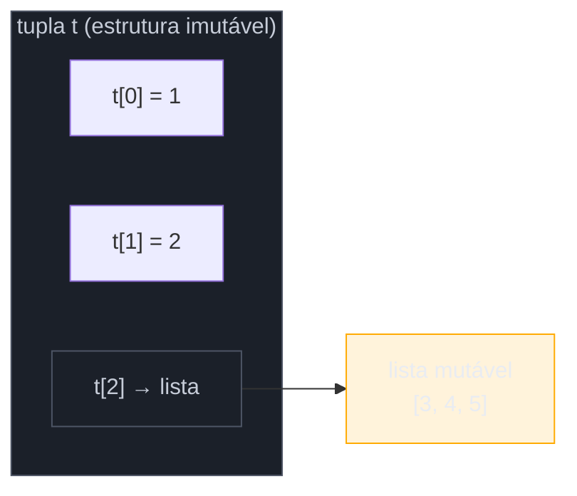
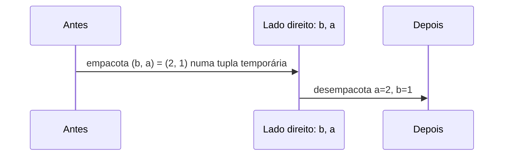

# Tuplas e desempacotamento

> [!abstract] TL;DR
> Uma `tuple` é uma sequência **imutável** — mas "imutável" descreve a estrutura (quantos elementos, em qual ordem), não necessariamente o conteúdo transitivo: uma tupla pode conter uma lista mutável, e a lista continua mutável por dentro. A distinção conceitual mais importante não é "lista vs tupla = mutável vs imutável" — é **sequência homogênea vs registro heterogêneo**: uma lista é uma coleção de itens do mesmo tipo/papel (`["maçã", "banana"]`); uma tupla é um registro de campos com posições que têm significado próprio (`(x, y)`, `(nome, idade, cidade)`). *Tuple unpacking* — `a, b = 1, 2` — é o mecanismo que lê esse registro, incluindo a forma estendida (`a, *resto = [1, 2, 3, 4]`) e o aninhamento (`(a, (b, c)) = (1, (2, 3))`).

## O bug de quem trata registro como lista

Considere uma função que calcula a distância entre dois pontos num plano 2D, representados como listas:

```python
def distancia(p1, p2):
    return ((p1[0] - p2[0]) ** 2 + (p1[1] - p2[1]) ** 2) ** 0.5

ponto_a = [3, 4]
ponto_b = [0, 0]

print(distancia(ponto_a, ponto_b))  # 5.0 — funciona
```

Funciona. O código passa nos testes. Mas seis meses depois, outro dev do time — sem saber que `ponto_a` "deveria" representar sempre exatamente duas coordenadas — escreve isto em algum lugar do mesmo módulo:

```python
ponto_a.append(10)  # "vou guardar a altitude junto, por que não?"
print(distancia(ponto_a, ponto_b))
# IndexError? Não — pior: silenciosamente ignora o terceiro elemento
# e devolve um resultado 2D "correto" pra um ponto que agora é 3D.
```

Nada explode. `ponto_a[0]` e `ponto_a[1]` continuam funcionando exatamente como antes — a lista simplesmente aceitou um terceiro elemento sem reclamar, porque **listas são projetadas para crescer**. O bug não é o `append()` em si; é que `ponto_a` nunca deveria ter sido uma lista. Um ponto 2D tem exatamente duas coordenadas, com significado fixo por posição (a primeira é `x`, a segunda é `y`) — isso é a definição de **registro**, não de **sequência**. Se `ponto_a` fosse uma tupla, `ponto_a.append(10)` levantaria `AttributeError: 'tuple' object has no attribute 'append'` na hora — o erro apareceria no exato commit que o introduziu, não meses depois como um resultado numérico sutilmente errado.

Essa nota existe para deixar essa distinção — sequência homogênea vs registro heterogêneo — tão automática quanto a diferença entre mutável e imutável que a nota anterior já cobriu. E para dar o vocabulário e a sintaxe (*unpacking*) que tornam tuplas ergonômicas de usar.

## O que é

Uma tupla é uma sequência **ordenada** e **imutável** de objetos, criada com vírgulas — os parênteses são quase sempre opcionais, mas convencionais:

```python
coordenada = (3, 4)       # com parênteses (idiomático)
coordenada = 3, 4          # sem parênteses — o que realmente cria a tupla é a VÍRGULA
tupla_unico = (3,)          # vírgula obrigatória p/ tupla de 1 elemento — (3) é só o int 3
tupla_vazia = ()
```

> [!warning] `(3)` não é uma tupla
> É fácil escrever `(3)` achando que criou uma tupla de um elemento. Não criou — parênteses ao redor de uma única expressão são só agrupamento, igual em matemática. `type((3))` é `<class 'int'>`. Quem cria a tupla é a **vírgula à direita**: `(3,)`. Isso pega até dev experiente de vez em quando — Real Python cita esse exato caso como a pegadinha número um de quem está aprendendo tuplas.

Duas propriedades definem o tipo:

1. **Sequência ordenada** — como `list`, suporta indexação (`t[0]`), slicing (`t[1:3]`), `len()`, iteração, `in`, concatenação com `+`. Tudo que é "operação comum de sequência" na documentação oficial funciona em tupla.
2. **Imutável na estrutura** — depois de criada, você não pode adicionar, remover, reordenar ou reatribuir elementos. `t[0] = 99` levanta `TypeError: 'tuple' object does not support item assignment`. Não existem `.append()`, `.remove()`, `.sort()`, `.insert()` — só os dois métodos que fazem sentido para algo imutável: `.count()` e `.index()`.

## Por que importa

A comunidade Python (Real Python, a própria documentação, e a tradição que remonta ao design original da linguagem) enfatiza uma convenção que separa dev júnior de dev que já internalizou o idioma: **listas guardam sequências homogêneas; tuplas guardam registros heterogêneos.**

| | Lista | Tupla |
|---|---|---|
| **O que representa** | Uma coleção de itens do **mesmo tipo/papel**, tamanho variável | Um **registro** de campos com significado fixo por posição |
| **Exemplo típico** | `["maçã", "banana", "uva"]` — lista de frutas | `("maçã", 3)` — nome + quantidade; `(x, y)` — coordenada |
| **Cresce/encolhe?** | Sim — é o ponto | Não — o número de campos é parte do contrato |
| **Homogeneidade esperada** | Itens intercambiáveis, mesmo tipo | Cada posição tem um significado próprio (nem sempre mesmo tipo) |
| **Analogia** | Um carrinho de compras — você adiciona/remove itens | Uma linha de banco de dados — os campos são fixos |

Essa distinção **não é imposta pelo interpretador** — Python deixa você colocar tipos misturados numa lista e criar uma tupla que cresceria bem como lista. É convenção de design, não regra da linguagem. Mas ela existe por um motivo real: quando você lê `pontos = [(0,0), (3,4), (1,1)]` no código de outra pessoa, o fato de cada ponto ser uma tupla já comunica "isso é um registro fixo de 2 campos, não espere que alguém dê `append` num ponto individual". É documentação embutida na escolha do tipo — o mesmo raciocínio, em espírito, por trás de por que a nota anterior tratou mutabilidade como parte do contrato de uma função.

> [!question]- "Isso não é só estilo? Por que o interpretador não força a diferença?"
> Porque Python historicamente prioriza **duck typing** e convenção sobre imposição rígida de tipo — "somos todos adultos aqui" é uma frase recorrente na cultura da linguagem. A tipagem estrutural moderna (`NamedTuple`, `dataclass`, tipos genéricos com `tuple[int, int]`) dá ferramentas pra quem quer a garantia formal — mas a convenção lista-homogênea/tupla-registro já existia antes dessas ferramentas, e continua sendo o sinal que a maioria do código real usa no dia a dia.

## Como funciona

### A pegadinha: tupla imutável com conteúdo mutável

A nota anterior já tocou nisso ao falar de mutabilidade em geral — aqui é o ponto central da história. Imutabilidade de tupla é sobre **o container**, não sobre tudo que ele referencia transitivamente:

```python
t = (1, 2, [3, 4])
t[2].append(5)
print(t)          # (1, 2, [3, 4, 5])  — "a tupla mudou"?

t[0] = 99          # TypeError: 'tuple' object does not support item assignment
```

A tupla, como objeto, nunca trocou de identidade nem de quantas/quais referências ela guarda — ela sempre apontou para os mesmos três objetos: `1`, `2`, e aquela lista. O que mudou foi o **conteúdo da lista**, que é mutável por conta própria. A tupla é imutável **na estrutura** (quais objetos ela referencia, em qual ordem), não necessariamente no **estado transitivo** de cada objeto referenciado.



### A consequência prática: hashability

Isso não é só curiosidade — é o motivo pelo qual uma tupla **pode ou não** ser usada como chave de `dict` ou elemento de `set`:

```python
>>> hash((1, 2, 3))
529344067295497451              # ok — todos os elementos são imutáveis/hasheáveis

>>> hash((1, 2, [3, 4]))
Traceback (most recent call last):
TypeError: unhashable type: 'list'
```

A regra, segundo a documentação oficial e reforçada por múltiplas fontes da comunidade: **uma tupla só é hasheável se TODOS os seus elementos também forem hasheáveis.** `list` e `dict` nunca são hasheáveis (porque são mutáveis — o valor de hash de um objeto não pode mudar durante sua vida), então uma tupla que contém uma lista, direta ou indiretamente, herda essa restrição. Isso importa na prática o tempo todo: você não pode usar `(nome, [tags])` como chave de cache, mas pode usar `(nome, tuple(tags))`.

> [!question]- "Por que isso importa fora de casos acadêmicos de dict/set?"
> Porque `@functools.lru_cache` e memoização em geral exigem argumentos hasheáveis — se sua função recebe uma lista e você tenta cachear, o decorator explode com `TypeError: unhashable type: 'list'`. A correção idiomática costuma ser converter a lista em tupla no ponto de entrada da função cacheada. Esse é um dos motivos práticos, além de "registro vs sequência", pelos quais escolher tupla desde o início evita retrabalho depois.

### Tuple packing e unpacking

**Packing** é o nome do que já acontece implicitamente quando você escreve uma tupla sem parênteses — múltiplos valores são "empacotados" numa tupla:

```python
coordenada = 3, 4, 5   # packing: os três valores viram uma tupla (3, 4, 5)
print(type(coordenada))  # <class 'tuple'>
```

**Unpacking** é o processo inverso e mais usado no dia a dia: distribuir os elementos de uma tupla (ou de qualquer iterável) em variáveis separadas, numa única instrução de atribuição:

```python
coordenada = (3, 4)
x, y = coordenada          # unpacking: x=3, y=4
print(x, y)                 # 3 4
```

O número de variáveis à esquerda precisa bater exatamente com o número de elementos à direita — do contrário, `ValueError`:

```python
>>> x, y = (3, 4, 5)
Traceback (most recent call last):
ValueError: too many values to unpack (expected 2)

>>> x, y, z = (3, 4)
Traceback (most recent call last):
ValueError: not enough values to unpack (expected 3, got 2)
```

Esse `ValueError` explícito é, de novo, uma vantagem de design deliberada: o interpretador se recusa a adivinhar o que fazer com sobra ou falta de valores — ele força você a lidar com a discrepância, em vez de silenciosamente ignorar ou preencher com `undefined` como JavaScript faz (mais sobre essa comparação adiante).

### O swap idiomático

Este é provavelmente o exemplo mais citado de unpacking em entrevista técnica, porque expõe algo que surpreende quem vem de C, Java ou C#:

```python
a, b = 1, 2
a, b = b, a
print(a, b)   # 2 1 — trocado, sem variável temporária
```

Em linguagens como C, trocar dois valores exige uma variável auxiliar (`tmp = a; a = b; b = tmp;`), porque a atribuição acontece uma de cada vez, sobrescrevendo o valor original antes que ele possa ser lido do outro lado. Em Python, `a, b = b, a` funciona porque o lado direito inteiro é **empacotado numa tupla temporária primeiro** (com os valores originais de `a` e `b` capturados), e só depois essa tupla é desempacotada nas variáveis à esquerda. Não há mágica de troca simultânea — é packing seguido de unpacking, na ordem certa.



### Unpacking em loops: `for k, v in dict.items()`

O padrão mais comum de unpacking no código Python do dia a dia aparece em loops — cada iteração de `dict.items()` produz uma tupla `(chave, valor)`, e o `for` desempacota automaticamente:

```python
precos = {"maçã": 3.50, "banana": 2.20, "uva": 8.00}

for nome, preco in precos.items():
    print(f"{nome}: R$ {preco:.2f}")
```

O mesmo padrão vale para `enumerate()` (produz tuplas `(índice, item)`) e para qualquer função ou biblioteca que devolva uma lista de tuplas — bancos de dados, `zip()`, resultados de parsing:

```python
frutas = ["maçã", "banana", "uva"]
for indice, fruta in enumerate(frutas):
    print(indice, fruta)   # 0 maçã / 1 banana / 2 uva
```

### Tuplas como retorno múltiplo de função

O outro uso canônico de "tupla como registro": quando uma função precisa devolver mais de um valor, o idioma Python é empacotar num retorno de tupla e desempacotar na chamada — sem precisar de uma classe, um dicionário, ou parâmetros de saída por referência (como `out` em C#):

```python
def dividir(a, b):
    quociente = a // b
    resto = a % b
    return quociente, resto     # packing implícito

q, r = dividir(17, 5)           # unpacking na chamada
print(q, r)                      # 3 2
```

Isso é exatamente o mesmo mecanismo do swap: o `return quociente, resto` empacota os dois valores numa tupla `(3, 2)`, e `q, r = dividir(17, 5)` desempacota essa tupla nas duas variáveis. Não existe "retorno múltiplo" como recurso separado da linguagem — é tuple packing/unpacking aplicado à fronteira de uma função.

### Unpacking estendido: o operador `*`

Introduzido pela [PEP 3132](https://peps.python.org/pep-3132/) em Python 3.0, o `*` permite capturar um número **variável** de elementos numa lista, quando você não sabe (ou não quer fixar) o tamanho exato da sequência de origem:

```python
numeros = [1, 2, 3, 4, 5]

primeiro, *resto = numeros
print(primeiro)   # 1
print(resto)       # [2, 3, 4, 5]  — SEMPRE uma lista, não importa o tipo de origem

*inicio, ultimo = numeros
print(inicio)       # [1, 2, 3, 4]
print(ultimo)       # 5

primeiro, *meio, ultimo = numeros
print(primeiro, meio, ultimo)   # 1 [2, 3, 4] 5
```

A regra formal, direto da PEP: no máximo **uma** expressão com `*` é permitida por atribuição, e ela pode aparecer em **qualquer posição** — início, meio ou fim. O nome com `*` sempre recebe uma `list`, mesmo que a origem seja uma tupla, uma string ou outro iterável — isso é uma decisão de design explícita da PEP, não um acidente.

> [!question]- "Se o número de elementos não bater, o `*` sempre resolve?"
> Só se sobrar pelo menos zero para ele. Se você escrever `a, b, *c = [1]`, ainda dá `ValueError: not enough values to unpack (expected at least 2, got 1)` — o `*` absorve qualquer excedente, inclusive nenhum (`c` vira `[]`), mas não inventa valores que não existem para as posições obrigatórias.

### Unpacking aninhado

Assim como uma tupla pode conter outra tupla, o padrão de unpacking pode espelhar essa estrutura aninhada — cada nível de parênteses no lado esquerdo corresponde a um nível de aninhamento no lado direito:

```python
ponto_com_cor = (1, (2, 3))
a, (b, c) = ponto_com_cor
print(a, b, c)   # 1 2 3

# Caso real: uma lista de linhas, cada uma com nome e coordenada
registros = [("origem", (0, 0)), ("destino", (5, 7))]
for nome, (x, y) in registros:
    print(f"{nome}: x={x}, y={y}")
```

Isso é comum ao processar dados estruturados vindos de JSON parseado, resultados de query, ou qualquer formato que já venha aninhado — em vez de indexar manualmente (`registro[1][0]`, `registro[1][1]`), o unpacking aninhado nomeia cada campo no próprio ponto de leitura, o que é mais legível e menos propenso a erro de índice trocado.

### Comparando com destructuring do JavaScript

Para quem já programa em JS, unpacking de tupla é conceitualmente o mesmo mecanismo que array destructuring — mas com diferenças de comportamento que vale nomear, porque cada uma já causou bug de quem assume que as duas são idênticas:

| Aspecto | Python (unpacking) | JavaScript (destructuring) |
|---|---|---|
| Sintaxe básica | `a, b = [1, 2]` | `const [a, b] = [1, 2]` |
| Nº de valores não bate | `ValueError` — falha alto e explícito | Sobra vira `undefined`; falta é ignorada — sem erro |
| Pular um valor | `_, b = (1, 2)` (convenção, `_` é variável normal) | `const [, b] = [1, 2]` (posição vazia entre vírgulas) |
| Coletar o resto (`*`/`...rest`) | `a, *resto = [1, 2, 3]` — `*` em **qualquer posição** | `const [a, ...resto] = [1, 2, 3]` — `...rest` só no **final** |
| Registro nomeado nativo | Tupla é posicional; `namedtuple`/`NamedTuple` dão nomes | Object destructuring já é por nome: `const {x, y} = obj` |

O ponto mais citado por quem faz a travessia entre as duas linguagens: Python é **estrito** por padrão (contagem errada de valores é erro imediato), enquanto JavaScript é **permissivo** (completa com `undefined` ou trunca silenciosamente). Isso reflete a mesma filosofia de "strong typing" que a nota anterior já cobriu para operadores — Python prefere falhar alto a adivinhar a intenção do programador.

### Por que tupla também costuma ser mais rápida e mais leve

A convenção sequência-homogênea/registro-heterogêneo não é a única razão prática de preferir tupla quando o dado é fixo. Como o interpretador sabe, no momento da criação, que uma tupla nunca vai crescer, o CPython pode alocar exatamente o espaço necessário — um único bloco contíguo de memória do tamanho certo. Uma lista, por precisar suportar `.append()` a qualquer momento sem realocar a cada chamada, usa uma estratégia de **over-allocation**: reserva mais espaço do que o conteúdo atual ocupa, para amortizar o custo de futuros crescimentos. O resultado, segundo comparações de desempenho da comunidade, é que tuplas pequenas tendem a ser mais rápidas de criar e ocupam menos memória do que a lista equivalente — a diferença fica menos relevante para coleções muito grandes, onde o custo de manipular os elementos em si domina.

Isso não é o motivo principal para escolher tupla — a semântica de registro continua sendo o argumento central — mas é um bônus que reforça a escolha: usar tupla para dado fixo custa menos e comunica mais, ao mesmo tempo.

### Unpacking na chamada de função: o outro lado do `*`

O mesmo operador `*` que aparece no unpacking de atribuição também desempacota uma sequência **na chamada** de uma função, espalhando seus elementos como argumentos posicionais separados — um uso irmão, mas com direção invertida (aqui a tupla existente é "explodida" em vez de "montada"):

```python
def somar_tres(a, b, c):
    return a + b + c

valores = (1, 2, 3)
print(somar_tres(*valores))   # 6 — equivalente a somar_tres(1, 2, 3)
```

E o parâmetro `*args` do lado de quem **define** a função faz o inverso: empacota qualquer quantidade de argumentos posicionais recebidos numa tupla dentro da função — é o mesmo princípio de packing que abre esta nota, só que aplicado à assinatura da função em vez de a uma atribuição:

```python
def media(*numeros):    # numeros chega aqui como uma TUPLA
    print(type(numeros))  # <class 'tuple'>
    return sum(numeros) / len(numeros)

print(media(4, 8, 15, 16, 23, 42))   # 18.0
```

Vale registrar a simetria: `*args` na definição empacota argumentos numa tupla; `*valores` na chamada desempacota uma tupla (ou qualquer iterável) em argumentos separados. É o mesmo símbolo fazendo o par packing/unpacking em dois pontos diferentes do código — definição e chamada —, o que costuma confundir quem está vendo `*` pela primeira vez em contextos diferentes.

### A ponte para `namedtuple`

Uma tupla comum como `("Ana", 28, "São Paulo")` já comunica "isso é um registro fixo de 3 campos" pela escolha do tipo — mas não comunica **quais** são os campos sem olhar o código que a criou. `namedtuple`, do módulo `collections`, resolve exatamente essa lacuna: dá nome a cada posição, mantendo tudo que uma tupla já é (imutável, leve, hasheável se o conteúdo permitir):

```python
from collections import namedtuple

Pessoa = namedtuple("Pessoa", ["nome", "idade", "cidade"])
p = Pessoa("Ana", 28, "São Paulo")

print(p.nome)     # "Ana" — acesso por nome
print(p[0])         # "Ana" — ainda funciona por índice, é uma tupla de verdade
a, i, c = p         # unpacking normal também funciona
```

Isso é só um gancho — o módulo `collections` completo (incluindo `Counter`, `defaultdict`, `deque`, e o `namedtuple` a fundo) é o assunto da [[07 - O módulo collections — Counter, defaultdict, deque, namedtuple|nota 07]] deste mesmo galho. Vale reter aqui só a ideia: quando uma tupla-registro cresce em uso ou legibilidade importa mais, `namedtuple` (ou a versão com type hints, `typing.NamedTuple`) é o próximo passo natural — sem abandonar a semântica de tupla.

## Na prática

Reescrevendo o exemplo do início da nota — a função de distância entre pontos — agora usando tupla como registro e unpacking em vez de indexação manual:

```python
def distancia(p1: tuple[float, float], p2: tuple[float, float]) -> float:
    x1, y1 = p1     # unpacking nomeia os campos no ponto de uso
    x2, y2 = p2
    return ((x1 - x2) ** 2 + (y1 - y2) ** 2) ** 0.5


def ponto_medio(*pontos: tuple[float, float]) -> tuple[float, float]:
    """Recebe um número variável de pontos e devolve o centroide."""
    soma_x = sum(x for x, y in pontos)
    soma_y = sum(y for x, y in pontos)
    n = len(pontos)
    return soma_x / n, soma_y / n   # packing implícito no return


ponto_a = (3, 4)     # tupla: registro, não sequência — não cresce por engano
ponto_b = (0, 0)

print(distancia(ponto_a, ponto_b))          # 5.0
print(ponto_medio(ponto_a, ponto_b, (6, 8)))  # (3.0, 4.0)

# ponto_a.append(10)  # AttributeError — o erro certo, na hora certa
```

Repare em três coisas que a versão com listas do início não tinha: (1) `ponto_a.append(10)` agora falha imediatamente, prevenindo o bug silencioso original; (2) o unpacking `x1, y1 = p1` documenta, no próprio corpo da função, que um ponto tem exatamente duas coordenadas com papéis fixos; (3) `ponto_medio` já usa unpacking aninhado dentro de uma generator expression (`for x, y in pontos`) — um padrão que vai reaparecer com força total na nota de comprehensions deste galho.

## Armadilhas

### (1) Esquecer a vírgula na tupla de um elemento

```python
tupla_errada = (42)     # int, não tupla!
tupla_certa = (42,)      # tupla de 1 elemento
```

**Fix:** sempre confira com `type()` quando o tamanho é 1 — ou evite parênteses redundantes e escreva só `42,` (funciona, mas é menos legível).

### (2) Achar que tupla imutável significa "totalmente congelada"

```python
config = ("producao", {"debug": False, "timeout": 30})
config[1]["debug"] = True   # funciona! o dict interno é mutável
print(config)   # ('producao', {'debug': True, 'timeout': 30})
```

**Fix:** se você precisa de imutabilidade de verdade em profundidade (deep immutability), a tupla sozinha não garante isso — seria necessário usar tipos imutáveis em cada nível (por exemplo, `frozenset`/`MappingProxyType` no lugar de `dict`), fora do escopo desta nota introdutória.

### (3) Tentar usar lista como chave de dict/set achando que "é só uma sequência"

```python
cache = {}
chave = [1, 2]
cache[chave] = "resultado"   # TypeError: unhashable type: 'list'
```

**Fix:** converta para tupla no ponto de uso: `cache[tuple(chave)] = "resultado"`.

### (4) Esperar que `*` no meio funcione como em JavaScript

```python
# Python: funciona, * pode ir no meio
a, *meio, z = [1, 2, 3, 4]

# JavaScript: ...rest só é permitido no FINAL
# const [a, ...meio, z] = [1, 2, 3, 4]  // SyntaxError em JS
```

**Fix:** não é bem uma armadilha do lado Python — é o contrário: dev vindo de JS pode subestimar o que Python permite e evitar `*` no meio por hábito. Vale saber que a flexibilidade existe.

## Em entrevista

Pergunta clássica: **"Qual a diferença entre lista e tupla em Python?"** — a resposta mais fraca é só "tupla é imutável, lista é mutável". Uma resposta que demonstra profundidade cobre três camadas: (1) mutabilidade, sim, mas (2) a convenção semântica sequência-homogênea vs registro-heterogêneo, e (3) a consequência prática de hashability — tupla pode ser chave de dict/set (se o conteúdo permitir), lista nunca pode.

### Frase pronta (inglês)

> The difference between a list and a tuple isn't just mutability — it's what they're conventionally used to represent. A list is a homogeneous sequence, usually of variable length, where items are interchangeable — like a shopping cart. A tuple is a heterogeneous record with a fixed number of fields that have positional meaning — like a 2D coordinate or a database row. That distinction matters practically: because tuples are immutable, they're hashable — as long as everything inside them is also hashable — so they can be dict keys or set elements, while lists never can. I also always remember that tuple immutability is structural, not deep: a tuple can hold a mutable list, and that inner list stays mutable — the tuple itself just can't be resized or have its references reassigned.

### Vocabulário

| Termo PT | Termo EN |
|---|---|
| desempacotamento | unpacking |
| empacotamento | packing |
| desempacotamento estendido | extended unpacking |
| operador estrela / splat | star operator / splat |
| registro | record |
| sequência homogênea | homogeneous sequence |
| hasheável / não-hasheável | hashable / unhashable |
| tupla nomeada | named tuple |
| desestruturação (JS) | destructuring |

## How to explain in English

| PT | EN |
|---|---|
| Uma tupla é imutável na estrutura, não necessariamente no conteúdo transitivo | A tuple is immutable in structure, not necessarily in transitive content |
| Tupla é registro heterogêneo; lista é sequência homogênea | A tuple is a heterogeneous record; a list is a homogeneous sequence |
| Uma tupla só é hasheável se todos os seus elementos forem hasheáveis | A tuple is only hashable if all of its elements are hashable |
| O swap `a, b = b, a` funciona porque o lado direito é empacotado numa tupla temporária antes de desempacotar | The `a, b = b, a` swap works because the right-hand side is packed into a temporary tuple before unpacking |
| O operador `*` no unpacking sempre captura o resto como uma lista | The `*` operator in unpacking always captures the remainder as a list |
| Python falha com `ValueError` quando a contagem de valores não bate; JavaScript preenche com `undefined` silenciosamente | Python raises `ValueError` on a count mismatch; JavaScript silently fills with `undefined` |

## O que vem a seguir

Com tuplas e unpacking no repertório, a [[03 - Dicionários|nota 03]] cobre `dict` — a estrutura chave-valor que também usa unpacking pesadamente (`for k, v in dict.items()`, `**kwargs`) e que, junto com listas e tuplas, completa o trio de collections que aparece em praticamente todo programa Python.

## Fontes

- Real Python — "Lists vs Tuples in Python": https://realpython.com/python-lists-tuples/ (acessado 2026-07-09)
- Real Python — "Exploring Tuple Immutability" (vídeo): https://realpython.com/lessons/tuple-immutability/ (acessado 2026-07-09)
- Real Python — "Tuple Assignment, Packing, and Unpacking" (vídeo): https://realpython.com/lessons/tuple-assignment-packing-unpacking/ (acessado 2026-07-09)
- Real Python — "Write Pythonic and Clean Code With namedtuple": https://realpython.com/python-namedtuple/ (acessado 2026-07-09)
- Real Python — "hashable" (glossário): https://realpython.com/ref/glossary/hashable/ (acessado 2026-07-09)
- PEP 3132 — "Extended Iterable Unpacking": https://peps.python.org/pep-3132/ (acessado 2026-07-09)
- Python documentation — "5. Data Structures" (Tuples and Sequences): https://docs.python.org/3/tutorial/datastructures.html (acessado 2026-07-09)
- Python documentation — "Built-in Types" (Common Sequence Operations, Immutable Sequence Types): https://docs.python.org/3/library/stdtypes.html (acessado 2026-07-09)
- Python documentation — "collections — Container datatypes" (namedtuple): https://docs.python.org/3/library/collections.html (acessado 2026-07-09)
- Python Morsels — "Tuple unpacking in Python": https://www.pythonmorsels.com/tuple-unpacking/ (acessado 2026-07-09)

## Veja também

- [[01 - Listas — criação, métodos e slicing avançado|Listas: criação, métodos e slicing avançado]] — a nota anterior deste galho
- [[03 - Dicionários|Dicionários]] — próxima nota
- [[07 - O módulo collections — Counter, defaultdict, deque, namedtuple|O módulo collections]] — aprofunda `namedtuple`
- [[03-Dominios/Tecnologia/Python/Collections e Comprehensions/index|Collections e Comprehensions]] — MOC do galho
- [[03-Dominios/Tecnologia/Python/Core/02 - Tipos e variáveis|Tipos e variáveis]] — Galho 1, mutabilidade e o modelo de rótulos
- [[03-Dominios/Tecnologia/Python/index|Trilha Python]] (MOC central)
