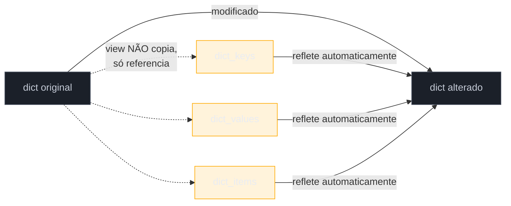
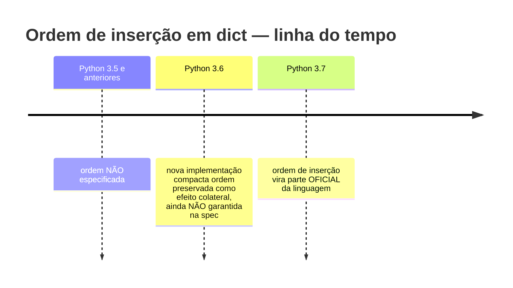
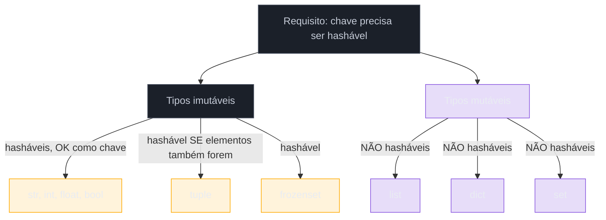

# Dicionários

> [!abstract] TL;DR
> `dict` é o mapeamento nativo de Python — chave única, hashável, aponta pra um valor qualquer. `d[key]` levanta `KeyError` se a chave não existe (padrão EAFP); `d.get(key, default)` devolve um padrão sem levantar nada (padrão LBYL-friendly). `.keys()`, `.values()` e `.items()` não são cópias — são **views dinâmicas**, uma "janela" que reflete qualquer mudança no dicionário original em tempo real, inclusive depois de já teres guardado a view numa variável. `.setdefault(key, default)` busca e, se ausente, já insere o padrão — atalho pra evitar duas buscas. `.pop(key, default)` remove e devolve o valor (ou o padrão, sem erro). `.update()` mescla outro dict (ou pares chave-valor) no atual, sobrescrevendo em conflito. Dicionários **mantêm ordem de inserção** desde Python 3.7 — antes disso era um efeito colateral não garantido da implementação do CPython 3.6. Mesclar dois dicts tem três formas: `{**d1, **d2}` (clássica, funciona desde Python 3.5), `d1 | d2` (novo dict, Python 3.9+, PEP 584) e `d1 |= d2` (in-place). Toda chave precisa ser **hashável** — por isso `list` não pode ser chave (é mutável) mas `tuple` pode (é imutável). E modificar o tamanho de um dict enquanto se itera sobre ele levanta `RuntimeError: dictionary changed size during iteration` — Python detecta a mudança e recusa continuar, em vez de produzir um resultado silenciosamente errado.

## O bug que abre esta nota

Um desenvolvedor está escrevendo uma função que limpa entradas expiradas de um cache representado como dicionário. A lógica parece óbvia: percorrer o dicionário, e remover as chaves cujo valor já venceu.

```python
cache = {
    "sessao_123": {"expira_em": 100, "usuario": "ana"},
    "sessao_456": {"expira_em": 50, "usuario": "bruno"},
    "sessao_789": {"expira_em": 200, "usuario": "carla"},
}

agora = 150

for chave, dados in cache.items():
    if dados["expira_em"] < agora:
        del cache[chave]
```

Ao rodar, o programa quebra:

```text
RuntimeError: dictionary changed size during iteration
```

A tentação é achar que é um bug de sintaxe, mas não é — é um limite estrutural de como o `dict` itera internamente. Um dicionário guarda seus pares numa tabela hash compacta; iterar sobre ele significa percorrer essa tabela posição a posição, mantendo um contador interno de tamanho. Se o tamanho muda no meio do percurso — uma chave inserida ou removida — a posição em que a iteração estava pode não fazer mais sentido: itens podem ser pulados, repetidos, ou a tabela pode até precisar ser realocada (rehashing) sob o próprio código que está lendo dela. Python detecta essa inconsistência e prefere **falhar ruidosamente** com `RuntimeError` a devolver um resultado incorreto sem avisar.

O consertos possíveis revelam algo mais profundo sobre como `dict` se comporta, e é o fio condutor desta nota: entender por que `.keys()`/`.values()`/`.items()` não são fotografias congeladas do dicionário, mas janelas vivas sobre ele — o que explica tanto o erro acima quanto uma classe inteira de bugs sutis quando dicionários são passados entre funções.

```python
# Correção 1 — iterar sobre uma cópia da lista de chaves
for chave in list(cache.keys()):
    if cache[chave]["expira_em"] < agora:
        del cache[chave]

# Correção 2 — coletar as chaves a remover primeiro, remover depois (duas passagens)
expiradas = [chave for chave, dados in cache.items() if dados["expira_em"] < agora]
for chave in expiradas:
    del cache[chave]

# Correção 3 — dict comprehension: constrói um dict NOVO, sem mutar o original
cache = {chave: dados for chave, dados in cache.items() if dados["expira_em"] >= agora}
```

O resto desta nota constrói o modelo mental completo de `dict`: criação, acesso (`[]` vs `.get()`), os métodos essenciais e por que as views são dinâmicas, a garantia de ordem, o merge moderno com `|`, e o requisito de hashability que explica por que só certos tipos servem como chave.

## O que é

Um `dict` é uma coleção de pares **chave → valor**, onde cada chave é única dentro do dicionário e serve como índice de acesso direto ao valor associado — o equivalente Python a um `Map` do Java (`HashMap`, especificamente) ou a um `Object`/`Map` do JavaScript. Ao contrário de uma lista, onde o índice é uma posição numérica sequencial, num `dict` o "índice" é a própria chave, e o acesso é feito por hashing: Python calcula um hash da chave e usa esse hash para localizar o valor quase instantaneamente, independente de quantos itens o dicionário tem — complexidade média **O(1)** para busca, inserção e remoção, contra O(n) de uma busca linear numa lista.

Dicionários são **mutáveis**: chaves e valores podem ser adicionados, alterados ou removidos depois da criação. As chaves precisam ser de um tipo **hashável e imutável** (string, número, tupla de imutáveis) — a seção sobre hashability explica o porquê. Os valores não têm essa restrição: podem ser qualquer objeto, incluindo listas, outros dicts, ou funções.

## Por que importa

Dicionários são provavelmente a estrutura de dados mais usada em código Python de verdade — configuração de aplicação, corpo de requisição/resposta JSON, contagem de frequências, cache, índice de lookup, representação de um registro antes de virar um objeto formal. Entender a diferença entre `d[key]` e `d.get(key, default)` é aplicar diretamente o par EAFP/LBYL já visto em [[03-Dominios/Tecnologia/Python/Core/08 - Erros e exceções|Erros e exceções]] — a escolha certa depende de saber se a ausência da chave é o caminho normal ou um erro de programação. E o ponto das views dinâmicas — que `.keys()`/`.values()`/`.items()` não copiam, apenas observam — é um dos aspectos mais mal-entendidos do `dict` por quem vem de outras linguagens, onde o equivalente costuma devolver uma cópia imutável (o `Map.keySet()` do Java, por sinal, também é uma view — mas `Object.keys()` do JavaScript devolve um **array**, uma cópia estática, que é o hábito mental que mais gera confusão em quem migra de JS).

## Como funciona

### Criação: literal, `dict()`, e a comprehension (adiantamento)

A forma mais comum é o literal com chaves:

```python
usuario = {"nome": "Ana", "idade": 32, "ativo": True}
```

`dict()` constrói a partir de pares chave-valor nomeados (quando as chaves são identificadores válidos), de uma lista de tuplas `(chave, valor)`, ou copiando outro mapeamento:

```python
usuario = dict(nome="Ana", idade=32, ativo=True)

pares = [("nome", "Ana"), ("idade", 32)]
usuario = dict(pares)

copia = dict(usuario)   # cópia rasa (shallow) de outro dict
```

Um dict vazio é `{}` — não `dict()` chamado sem argumentos, embora ambos funcionem; `{}` é o idioma mais comum por ser mais curto e não depender de resolver um nome de função.

Existe uma terceira forma de criar um dict a partir de outra sequência: a **dict comprehension**, `{chave: valor for ... in ...}`. Ela é poderosa o bastante — e usada o bastante em código real — para merecer nota própria: a sintaxe completa de comprehensions (list, dict, set e generator expressions) é o assunto da [[05 - Comprehensions — list, dict, set e generator expressions|nota 05]] deste galho. Aqui, um exemplo mínimo só pra situar o leitor:

```python
quadrados = {n: n**2 for n in range(5)}
# {0: 0, 1: 1, 2: 4, 3: 9, 4: 16}
```

### Acesso: `d[key]` vs `d.get(key, default)`

Duas formas de ler um valor por chave, com comportamentos diferentes na ausência:

```python
config = {"timeout": 30, "retries": 3}

# Colchetes — levanta KeyError se a chave não existe
valor = config["timeout"]        # 30
valor = config["max_conexoes"]   # KeyError: 'max_conexoes'

# .get() — devolve None (ou um padrão explícito) sem levantar nada
valor = config.get("timeout")             # 30
valor = config.get("max_conexoes")        # None
valor = config.get("max_conexoes", 100)   # 100
```

A escolha entre as duas formas é exatamente a mesma decisão EAFP/LBYL de [[03-Dominios/Tecnologia/Python/Core/08 - Erros e exceções|Erros e exceções]], aplicada a acesso de dicionário:

- **`d[key]`** — quando a ausência da chave é um **erro de programação** que deveria travar o fluxo (ex.: um campo obrigatório de um payload já validado). Deixar o `KeyError` propagar (ou capturá-lo explicitamente com `try/except KeyError`) é mais honesto do que mascarar um bug com um valor padrão silencioso.
- **`d.get(key, default)`** — quando a ausência é um **caso normal e esperado** do domínio (ex.: uma configuração opcional que tem valor padrão razoável). É o padrão EAFP mais direto: não há checagem prévia (`if key in d`), apenas uma busca que já resolve o caso de ausência inline.

```python
# Padrão inadequado — mistura LBYL com acesso, redundante e mais lento
if "timeout" in config:
    timeout = config["timeout"]
else:
    timeout = 30

# Idiomático — uma única busca, caminho feliz e padrão juntos
timeout = config.get("timeout", 30)
```

> [!question]- `d.get(key)` sem segundo argumento devolve `None` — isso não é ambíguo se o valor legítimo também puder ser `None`?
> É, e é uma armadilha real. Se `None` for um valor válido de verdade dentro do dicionário (ex.: `{"campo_opcional": None}` representando "explicitamente vazio"), `config.get("campo_opcional")` devolve `None` tanto para "a chave existe e vale `None`" quanto para "a chave não existe". Quando essa ambiguidade importa, a checagem correta é `"campo_opcional" in config` (LBYL, aqui justificado) ou usar um sentinela único que nunca aparece como valor real:
> ```python
> _AUSENTE = object()   # sentinela único, não confundível com nenhum valor de domínio
> valor = config.get("campo_opcional", _AUSENTE)
> if valor is _AUSENTE:
>     print("chave realmente não existe")
> elif valor is None:
>     print("chave existe e vale None")
> ```

### `.keys()`, `.values()`, `.items()` — views, não cópias

Os três métodos que expõem o conteúdo do dict para iteração:

```python
usuario = {"nome": "Ana", "idade": 32}

usuario.keys()     # dict_keys(['nome', 'idade'])
usuario.values()    # dict_values(['Ana', 32])
usuario.items()      # dict_items([('nome', 'Ana'), ('idade', 32)])
```

O tipo de retorno não é `list` — é `dict_keys`, `dict_values`, `dict_items`, coletivamente chamados **view objects**. A propriedade que surpreende quem espera uma cópia: uma view **não armazena dado nenhum**, apenas mantém uma referência ao dicionário original e recalcula seu conteúdo sob demanda, toda vez que é percorrida ou consultada. Se o dicionário muda depois que a view já foi criada, a view **reflete a mudança**, mesmo que já esteja guardada numa variável:

```python
inventario = {"maçã": 10, "pera": 5}
chaves = inventario.keys()
print(list(chaves))    # ['maçã', 'pera']

inventario["banana"] = 8   # modifica o dict DEPOIS de já ter capturado `chaves`
print(list(chaves))    # ['maçã', 'pera', 'banana'] — a view "viu" a mudança
```



Duas consequências práticas dessa dinamicidade:

**1. É por isso que iterar e mutar ao mesmo tempo quebra.** O erro de abertura desta nota (`RuntimeError: dictionary changed size during iteration`) acontece justamente porque `.items()` não é uma lista congelada — é uma janela ativa sobre a estrutura interna do dict, e mudar o **tamanho** dessa estrutura no meio da leitura invalida a posição em que a iteração estava. (Trocar o **valor** de uma chave já existente, sem adicionar ou remover chaves, não muda o tamanho e não levanta o erro — só inserção/remoção durante a iteração é proibida.)

**2. Views suportam operações de conjunto.** `dict_keys` e `dict_items` se comportam como `set` — suportam `&` (interseção), `|` (união), `-` (diferença) — porque chaves são garantidamente únicas, a mesma invariante de um `set`. `dict_values` **não** suporta essas operações, porque valores podem se repetir:

```python
d1 = {"a": 1, "b": 2, "c": 3}
d2 = {"b": 20, "c": 30, "d": 4}

d1.keys() & d2.keys()   # {'b', 'c'} — chaves em comum
d1.keys() - d2.keys()   # {'a'} — chaves só em d1
```

> [!warning] Guardar `list(d.keys())` quando se precisa de um snapshot congelado
> Quando o objetivo é **iterar com segurança enquanto o dict pode ser modificado** (o caso do bug de abertura), não basta guardar a view numa variável — é preciso convertê-la explicitamente numa lista com `list(d.keys())`. A view guardada ainda é dinâmica; só a conversão para `list` produz uma cópia estática, desacoplada do dicionário original.

Segundo a [documentação oficial](https://docs.python.org/3/library/stdtypes.html#dict-views), "keys views are set-like since their entries are unique and hashable... for values views, the entries are not necessarily unique... items views also have set-like operations, since the (key, value) pairs are unique and the keys are hashable."

### `.setdefault(key, default)` — busca e insere numa operação

`.setdefault()` combina duas ações: se a chave existe, devolve o valor associado (igual a `.get()`); se não existe, **insere** a chave com o valor padrão fornecido **e** devolve esse valor:

```python
contadores = {"maçã": 3}

contadores.setdefault("maçã", 0)    # 3 — já existia, nada muda
contadores.setdefault("pera", 0)    # 0 — inserida com valor 0
print(contadores)   # {'maçã': 3, 'pera': 0}
```

A diferença crucial para `.get()`: `.get()` **nunca modifica** o dicionário; `.setdefault()` **sempre garante** que a chave exista depois da chamada. Isso o torna especialmente útil para agrupar itens numa estrutura acumuladora — o padrão "buscar a lista, ou criar uma vazia, e já anexar":

```python
por_categoria = {}

produtos = [
    ("maçã", "fruta"), ("cenoura", "legume"),
    ("pera", "fruta"), ("batata", "legume"),
]

for nome, categoria in produtos:
    por_categoria.setdefault(categoria, []).append(nome)

print(por_categoria)
# {'fruta': ['maçã', 'pera'], 'legume': ['cenoura', 'batata']}
```

Sem `.setdefault()`, o mesmo padrão exigiria uma checagem LBYL explícita antes de cada `.append()`:

```python
por_categoria = {}
for nome, categoria in produtos:
    if categoria not in por_categoria:
        por_categoria[categoria] = []
    por_categoria[categoria].append(nome)
```

> [!question]- Por que não usar `.get(categoria, []).append(nome)` em vez de `.setdefault()`?
> Porque `.get()` com valor padrão **não insere** a chave no dicionário original — o `[]` devolvido por `.get()` quando a chave não existe é uma lista nova, solta, que não está conectada ao dict. `.append()` nela some no vazio, e o dict original nunca ganha essa chave. `.setdefault()` resolve isso porque a lista que ele devolve, no caso de inserção, **é** a mesma lista que acabou de entrar no dicionário — apendar nela apenda no dict de verdade. Esse é um erro clássico de quem tenta "economizar" o `.setdefault()` reimplementando com `.get()`.
>
> Uma alternativa mais eficiente para agrupamentos frequentes é `collections.defaultdict`, que automatiza esse padrão inteiro — assunto da [[07 - O módulo collections — Counter, defaultdict, deque, namedtuple|nota 07]] deste galho.

### `.pop(key, default)` — remove e devolve

`.pop()` remove uma chave e devolve seu valor numa única operação:

```python
sessoes = {"abc": "ana", "def": "bruno"}

valor = sessoes.pop("abc")           # 'ana' — remove e devolve
print(sessoes)                        # {'def': 'bruno'}

sessoes.pop("xyz")                    # KeyError: 'xyz' — chave não existe, sem padrão
sessoes.pop("xyz", None)              # None — com padrão, não levanta erro
```

Sem um segundo argumento, `.pop()` em chave ausente levanta `KeyError` — o mesmo comportamento de `d[key]`. Fornecer um padrão (mesmo `None`) troca o comportamento para "silencioso", análogo ao `.get()`. Essa simetria (`d[key]` ~ `.pop(key)` sem padrão; `.get(key, default)` ~ `.pop(key, default)` com padrão) é intencional na API do `dict` — vale internalizar o padrão em vez de decorar caso a caso.

Existe também `dict.popitem()`, que remove e devolve o **último** par inserido (comportamento LIFO garantido desde Python 3.7, junto com a ordem de inserção) — útil para esvaziar um dict de trás pra frente, menos comum no dia a dia que `.pop(key)`.

### `.update()` — mesclando em lugar

`.update()` mescla outro dicionário (ou um iterável de pares, ou argumentos nomeados) **dentro** do dicionário que chama o método, sobrescrevendo valores em caso de chave repetida:

```python
padrao = {"timeout": 30, "retries": 3, "debug": False}
usuario_definiu = {"timeout": 60, "verbose": True}

padrao.update(usuario_definiu)
print(padrao)
# {'timeout': 60, 'retries': 3, 'debug': False, 'verbose': True}
```

`.update()` modifica o dict **in place** e devolve `None` — um erro comum de quem espera um comportamento "funcional" é escrever `config = padrao.update(usuario_definiu)`, que deixa `config` como `None`. A seção seguinte cobre as alternativas que **não** mutam o original.

### Dict merge: `{**d1, **d2}`, `d1 | d2`, `d1 |= d2`

Três formas de combinar dois dicionários, com nuances de idade e semântica:

**1. Desempacotamento duplo-asterisco (`**`)** — funciona desde Python 3.5 (PEP 448), constrói um dict **novo** dentro de um literal:

```python
d1 = {"a": 1, "b": 2}
d2 = {"b": 20, "c": 3}

mesclado = {**d1, **d2}
print(mesclado)   # {'a': 1, 'b': 20, 'c': 3} — d2 sobrescreve em conflito
```

A ordem importa: o dict citado por último "ganha" em caso de chave repetida — o mesmo princípio de `.update()`, só que expresso via literal em vez de método.

**2. Operador de merge `|`** — introduzido no Python 3.9 pela [PEP 584](https://peps.python.org/pep-0584/), também constrói um dict novo, com a mesma semântica de "o da direita ganha":

```python
mesclado = d1 | d2
print(mesclado)   # {'a': 1, 'b': 20, 'c': 3}
```

**3. Operador de atualização `|=`** — também da PEP 584, modifica o dict à **esquerda** in place (equivalente a `.update()`, mas com sintaxe de operador):

```python
d1 |= d2
print(d1)   # {'a': 1, 'b': 20, 'c': 3} — d1 foi alterado
```

A [PEP 584](https://peps.python.org/pep-0584/) justifica a adição citando a inconsistência que já existia entre `list`/`set` (que já tinham `+`/`|` para união) e `dict`, que não tinha equivalente direto — `{**d1, **d2}` funciona, mas é considerado menos legível e menos descoberto por iniciantes que um operador dedicado. Uma vantagem adicional do `|` sobre `{**d1, **d2}`: o operador respeita a **classe** dos operandos — mesclar dois `defaultdict` com `|` devolve um `defaultdict` (preservando o `default_factory`), enquanto `{**d1, **d2}` sempre produz um `dict` puro, perdendo a especialização.

```python
# {**d1, **d2} funciona desde 3.5, sem restrição de versão
# d1 | d2 e d1 |= d2 exigem Python 3.9+
import sys
assert sys.version_info >= (3, 9)   # necessário para | e |=
```

| Forma | Versão mínima | Muta o original? | Resultado |
|---|---|---|---|
| `{**d1, **d2}` | 3.5+ | Não | dict novo (sempre `dict` puro) |
| `d1 \| d2` | 3.9+ | Não | dict novo (preserva subclasse) |
| `d1 \|= d2` | 3.9+ | Sim (muta `d1`) | mesmo objeto `d1`, atualizado |
| `d1.update(d2)` | qualquer | Sim (muta `d1`) | `None` (não devolve nada) |

### Ordem de inserção: efeito colateral em 3.6, garantia em 3.7

Até Python 3.5, a ordem de iteração de um `dict` era **não especificada** — na prática, dependia do hash das chaves e podia até variar entre execuções do mesmo programa (por causa da randomização de hash de strings, uma proteção de segurança). Python 3.6 trocou a implementação interna do `dict` por uma representação mais compacta, baseada numa proposta de Raymond Hettinger inspirada no dict da PyPy, que reduzia o uso de memória em 20-25% comparado ao 3.5. Um **efeito colateral** dessa nova implementação — não o objetivo original — foi que os itens passaram a ser mantidos na mesma ordem em que foram inseridos.

No entanto, no Python 3.6 essa ordem preservada era considerada **detalhe de implementação do CPython**, explicitamente não garantida — a documentação da época recomendava não depender dela, porque outras implementações de Python (PyPy, Jython, IronPython) não eram obrigadas a replicar o comportamento. Foi só no **Python 3.7** que a ordem de inserção virou parte oficial da especificação da linguagem — qualquer implementação Python compatível passou a ser obrigada a preservar ordem de inserção em `dict`.



A implicação prática: código que depende de ordem de inserção em `dict` só é seguro em Python 3.7+. Como toda versão do Python ainda em suporte ativo hoje já é 3.7+ há muito tempo, essa é hoje uma não-preocupação no dia a dia — mas vale saber a história, porque ainda aparece em pegadinhas de entrevista e em código legado que comenta "não confie na ordem do dict" (um comentário desatualizado desde 2018).

> [!question]- Ordem de inserção é o mesmo que ordem alfabética ou por valor?
> Não — "ordem de inserção" significa exatamente isso: a sequência em que as chaves foram adicionadas ao dicionário, não nenhum critério de ordenação por conteúdo. `{"z": 1, "a": 2}` itera como `z, a` (ordem de inserção), não `a, z` (ordem alfabética). Se `dict` for usado como base para algo que precisa de ordenação por chave/valor, é preciso ordenar explicitamente com `sorted(d.items())` ou `sorted(d.items(), key=lambda par: par[1])`.

### Requisito de hashability: por que `list` não pode ser chave

Um dicionário localiza valores calculando o **hash** da chave — um número inteiro derivado do conteúdo da chave, usado para determinar em qual posição da tabela interna o par fica armazenado. Para esse mecanismo funcionar de forma confiável, o hash de uma chave precisa ser **estável** durante toda a vida útil dela dentro do dicionário: se o conteúdo da chave mudasse depois de inserida, seu hash mudaria, e o dicionário não conseguiria mais localizá-la na posição onde a guardou originalmente — o dado ficaria efetivamente perdido, presente na estrutura mas inacessível pela chave que deveria apontar pra ele.

Por isso, só objetos **hasháveis** — que implementam `__hash__` de forma consistente com `__eq__`, e cujo hash não muda depois de criados — podem ser chave de `dict`:

```python
# tuple é hashável (imutável) — pode ser chave
coordenadas = {(0, 0): "origem", (1, 1): "diagonal"}

# list NÃO é hashável (mutável) — TypeError
cache = {[1, 2]: "valor"}   # TypeError: unhashable type: 'list'

# dict também não é hashável — não pode ser chave de outro dict
config = {{"a": 1}: "valor"}   # TypeError: unhashable type: 'dict'
```

A regra geral: **tipos mutáveis não são hasháveis** (`list`, `dict`, `set` puros); **tipos imutáveis geralmente são** (`str`, `int`, `float`, `bool`, `tuple` — desde que os elementos da tupla também sejam hasháveis, uma tupla contendo uma lista não é hashável). Não é coincidência que `tuple` (imutável) sirva como chave e `list` (mutável) não sirva — é a mesma lógica que explica por que `frozenset` (a versão imutável de `set`) pode ser chave e `set` normal não pode.



Segundo o [glossário oficial](https://docs.python.org/3/glossary.html#term-hashable), "an object is hashable if it has a hash value which never changes during its lifetime... hashability makes an object usable as a dictionary key and a set member, because these data structures use the hash value internally." A mesma nota vale para chaves de `dict` e para membros de `set` — os dois compartilham a exigência porque ambos são implementados com a mesma estrutura interna de tabela hash. `set` é assunto da [[04 - Sets|próxima nota]] deste galho.

> [!warning] Uma tupla só é hashável se **todos** os elementos dentro dela forem hasháveis
> ```python
> chave_ok = (1, "a", (2, 3))         # hashável — todos os elementos são imutáveis
> chave_erro = (1, "a", [2, 3])       # NÃO hashável — contém uma lista
>
> {chave_ok: "válido"}     # funciona
> {chave_erro: "erro"}     # TypeError: unhashable type: 'list'
> ```
> `TypeError: unhashable type` é sempre sinal de que algo mutável (mesmo que aninhado, dentro de uma tupla que em si parecia segura) está tentando servir de chave.

## Na prática

Um exemplo mais completo, combinando vários dos métodos vistos nesta nota — contar a frequência de palavras num texto, agrupar por categoria, e mesclar configurações com override:

```python
texto = "python é ótimo python é produtivo python vence"

# Contagem manual com .get() — o jeito EAFP sem try/except explícito
contagem = {}
for palavra in texto.split():
    contagem[palavra] = contagem.get(palavra, 0) + 1

print(contagem)
# {'python': 3, 'é': 2, 'ótimo': 1, 'produtivo': 1, 'vence': 1}

# Contagem com .setdefault() — variante equivalente, útil quando o valor
# padrão é uma estrutura mutável (lista, não um número)
posicoes = {}
for indice, palavra in enumerate(texto.split()):
    posicoes.setdefault(palavra, []).append(indice)

print(posicoes)
# {'python': [0, 3, 6], 'é': [1, 4], 'ótimo': [2], 'produtivo': [5], 'vence': [7]}

# Configuração em camadas: padrão da aplicação < config de ambiente < override de linha de comando
config_padrao = {"timeout": 30, "retries": 3, "debug": False, "log_level": "INFO"}
config_ambiente = {"timeout": 60, "log_level": "WARNING"}
config_cli = {"debug": True}

config_final = config_padrao | config_ambiente | config_cli
print(config_final)
# {'timeout': 60, 'retries': 3, 'debug': True, 'log_level': 'WARNING'}

# Iterando com segurança sobre views — sem tentar mutar durante a iteração
for chave, valor in config_final.items():
    print(f"{chave}: {valor}")

# Removendo uma configuração temporária com valor padrão seguro
config_final.pop("chave_que_nao_existe", None)   # não levanta erro
```

Repare como a linha `config_padrao | config_ambiente | config_cli` encadeia três merges numa única expressão legível — cada dict à direita sobrescreve o que colidir com o anterior, exatamente o padrão de "camadas de configuração, da mais genérica pra mais específica" comum em aplicações reais (padrão de fábrica < variáveis de ambiente < flag explícita).

## Armadilhas

### (1) `.update()` e `.pop()` sem padrão retornam `None` ou levantam `KeyError` — não presumir o comportamento

```python
resultado = meu_dict.update(outro_dict)   # resultado é None, não o dict mesclado
```

`.update()` sempre devolve `None`; quem precisa do dict resultante deve usar `|` (Python 3.9+) ou `{**d1, **d2}` em vez de `.update()`.

### (2) Confundir `.get()` com `.setdefault()` quando o objetivo é mutar

Já detalhado no callout acima: `.get(chave, [])` **não** insere a chave no dict; `.setdefault(chave, [])` insere. Usar o errado num loop de agrupamento produz um dict que parece nunca acumular nada.

### (3) Modificar chaves/tamanho durante iteração

O bug de abertura desta nota. Regra simples: para remover ou adicionar chaves com base numa condição avaliada durante a iteração, sempre itere sobre uma **cópia** (`list(d.keys())`) ou construa um **dict novo** via comprehension — nunca mute o dict original enquanto o `for` ainda está andando sobre ele.

### (4) Assumir que `dict_keys`/`dict_values`/`dict_items` são listas

```python
chaves = meu_dict.keys()
chaves[0]   # TypeError: 'dict_keys' object is not subscriptable
```

Views não suportam indexação por posição — só iteração e (no caso de `keys`/`items`) operações de conjunto. Para indexar por posição, é preciso converter explicitamente: `list(meu_dict.keys())[0]`.

### (5) Esperar que `{**d1, **d2}` preserve subclasses como `defaultdict`

```python
from collections import defaultdict

dd = defaultdict(int, {"a": 1})
comum = {"b": 2}

mesclado_asterisco = {**dd, **comum}   # dict puro — perde o default_factory
mesclado_pipe = dd | comum             # defaultdict — preserva o default_factory
```

Quando a subclasse de `dict` importa (ex.: `defaultdict`, `Counter`), preferir `|`/`|=` (Python 3.9+) sobre `{**d1, **d2}`.

### (6) Usar tupla contendo lista como chave, esperando que funcione

Coberto no `[!warning]` da seção de hashability — uma tupla só é hashável se todo elemento dentro dela também for.

## Em entrevista

Perguntas previsíveis sobre este tópico:

- **"Qual a diferença entre `d[key]` e `d.get(key)`?"** `d[key]` levanta `KeyError` se a chave não existir; `d.get(key, default)` devolve o padrão (ou `None`, sem padrão) sem levantar exceção. A escolha segue o mesmo raciocínio EAFP/LBYL: `[]` quando a ausência é erro de programação, `.get()` quando é caso normal do domínio.
- **"`.keys()`, `.values()` e `.items()` retornam cópias?"** Não — retornam **views dinâmicas** que refletem qualquer alteração feita no dicionário original depois da view ter sido criada, mesmo que a view já esteja guardada numa variável. Para obter uma cópia estática, é preciso converter explicitamente com `list(...)`.
- **"O que causa `RuntimeError: dictionary changed size during iteration`?"** Adicionar ou remover chaves de um dict enquanto se itera sobre ele (diretamente ou via view). A correção é iterar sobre uma cópia (`list(d.keys())`), coletar as chaves a alterar numa lista separada e aplicar depois, ou construir um dict novo via comprehension.
- **"Desde quando `dict` garante ordem de inserção?"** Desde Python 3.7, oficialmente na especificação da linguagem. No 3.6 já acontecia na prática (efeito colateral de uma reimplementação mais compacta do CPython), mas ainda era considerado detalhe de implementação, não garantido.
- **"Quais são as formas de mesclar dois dicionários, e quais mutam o original?"** `{**d1, **d2}` (desde 3.5) e `d1 | d2` (3.9+, PEP 584) criam um dict **novo**; `.update()` e `d1 |= d2` (3.9+) mutam o dict à esquerda **in place**. Em todos os casos, o dict "da direita" (ou o argumento de `.update()`) sobrescreve em caso de chave repetida.
- **"Por que `list` não pode ser chave de `dict`, mas `tuple` pode?"** Chaves precisam ser hasháveis, e hashability exige que o hash do objeto não mude durante sua vida útil — o que só é garantido para tipos imutáveis. `list` é mutável (o hash mudaria se o conteúdo mudasse), `tuple` é imutável (desde que seus elementos também sejam hasháveis).
- **"Qual a diferença entre `.pop(key)` e `.pop(key, default)`?"** Sem padrão, `.pop()` levanta `KeyError` se a chave não existir — igual a `d[key]`. Com padrão, devolve o padrão silenciosamente em vez de levantar erro — igual a `.get(key, default)`. É a mesma dualidade EAFP/LBYL aplicada à remoção.

### How to explain in English

> A Python `dict` is a mapping of unique, hashable keys to arbitrary values, implemented as a hash table with average O(1) lookup, insertion, and deletion. `d[key]` raises `KeyError` on a missing key (the EAFP default); `d.get(key, default)` returns a fallback instead of raising. `.keys()`, `.values()`, and `.items()` return **dynamic view objects**, not copies — they reflect any later change to the dictionary in real time, which is the root cause of `RuntimeError: dictionary changed size during iteration` when you add or remove keys while looping over the dict. `.setdefault(key, default)` looks up a key and inserts the default if absent, returning the (possibly new) value — handy for accumulator patterns like grouping items into lists. `.pop(key, default)` removes and returns a value, following the same "raises without a default, silent with one" symmetry as `.get()`. `.update()` merges another mapping into the current dict in place and returns `None`. Since Python 3.9, PEP 584 added `|` (returns a new merged dict, preserving subclass behavior like `defaultdict`) and `|=` (in-place merge) as alternatives to the older `{**d1, **d2}` unpacking idiom. Insertion order has been a guaranteed part of the language since Python 3.7 — it was already true in CPython 3.6 as a side effect of a more compact internal representation, but wasn't officially specified until 3.7. Dictionary keys must be hashable, which in practice means immutable: `str`, `int`, `tuple` (of hashable elements) work; `list`, `dict`, and plain `set` do not, because a hashable object's hash value must never change during its lifetime.

| Termo PT | Termo EN |
|---|---|
| dicionário | dictionary / dict |
| chave | key |
| valor | value |
| par chave-valor | key-value pair |
| view dinâmica | dynamic view (object) |
| hashável | hashable |
| tabela hash | hash table |
| mesclar (dicionários) | to merge (dictionaries) |
| ordem de inserção | insertion order |
| mutar in place | to mutate in place |
| copiar (rasa) | (shallow) copy |
| iterar sobre | to iterate over |

## O que vem a seguir

Com `dict` dominado — criação, acesso, views dinâmicas, merge, hashability — o galho segue pra outra estrutura que compartilha o mesmo requisito de hashability, mas troca "chave aponta pra valor" por "só a presença importa": a [[04 - Sets|nota 04]] cobre `set`, suas operações de conjunto (união, interseção, diferença) e por que ele é a ferramenta certa para "existe" e "é único", em vez de "aponta pra".

## Veja também

- [[03-Dominios/Tecnologia/Python/Core/08 - Erros e exceções|Erros e exceções]] — EAFP vs LBYL, `KeyError`, base para entender `d[key]` vs `d.get()`
- [[05 - Comprehensions — list, dict, set e generator expressions|05 — Comprehensions]] — sintaxe completa de dict comprehension
- [[07 - O módulo collections — Counter, defaultdict, deque, namedtuple|07 — O módulo collections]] — `defaultdict` automatiza o padrão `.setdefault()` de agrupamento
- [[04 - Sets|04 — Sets]] — mesma exigência de hashability, outra estrutura
- [[03-Dominios/Tecnologia/Python/Collections e Comprehensions/index|Collections e Comprehensions]] — MOC do galho
- [[03-Dominios/Tecnologia/Python/index|Trilha Python]]

## Fontes

- Python Software Foundation. *5. Data Structures — Mapping Types — dict*. docs.python.org, versão 3.14. https://docs.python.org/3/library/stdtypes.html#mapping-types-dict (acessado em 2026-07-09)
- Python Software Foundation. *Dictionary view objects*. docs.python.org, versão 3.14. https://docs.python.org/3/library/stdtypes.html#dict-views (acessado em 2026-07-09)
- Python Software Foundation. *Glossary — hashable*. docs.python.org. https://docs.python.org/3/glossary.html#term-hashable (acessado em 2026-07-09)
- Real Python. *Dictionaries in Python*. https://realpython.com/python-dicts/ (acessado em 2026-07-09)
- Real Python. *dict — Python's Built-in Data Types*. https://realpython.com/ref/builtin-types/dict/ (acessado em 2026-07-09)
- Real Python. *dictionary view — Python Glossary*. https://realpython.com/ref/glossary/dictionary-view/ (acessado em 2026-07-09)
- Real Python. *OrderedDict vs dict in Python: The Right Tool for the Job*. https://realpython.com/python-ordereddict/ (acessado em 2026-07-09)
- Lundh, F. (proposta original CPython 3.6); Hettinger, R. et al. *Compact dict implementation* — discutida em pbedn.github.io, *Python dictionary is now officially ordered!*. https://pbedn.github.io/post/2018-06-30-ordered-dict-officially-ordered/ (acessado em 2026-07-09)
- Warsaw, B.; Peterson, Y.; Reitz, B. *PEP 584 — Add Union Operators To dict*. peps.python.org. https://peps.python.org/pep-0584/ (acessado em 2026-07-09)
- Python Software Foundation. *What's New In Python 3.9 — dict merge and update operators*. docs.python.org. https://docs.python.org/3/whatsnew/3.9.html (acessado em 2026-07-09)
- Python Morsels. *Setting default dictionary values in Python*. https://www.pythonmorsels.com/default-dictionary-values/ (acessado em 2026-07-09)
- bobbyhadz. *RuntimeError: dictionary changed size during iteration*. https://bobbyhadz.com/blog/python-runtimeerror-dictionary-changed-size-during-iteration (acessado em 2026-07-09)
- Python Wiki. *DictionaryKeys — hashability requirement*. wiki.python.org. https://wiki.python.org/moin/DictionaryKeys (acessado em 2026-07-09)
- Ramalho, L. *Fluent Python*, 2ª ed. — Capítulo sobre dicionários e sets, modelo de hashing do CPython. O'Reilly Media.
