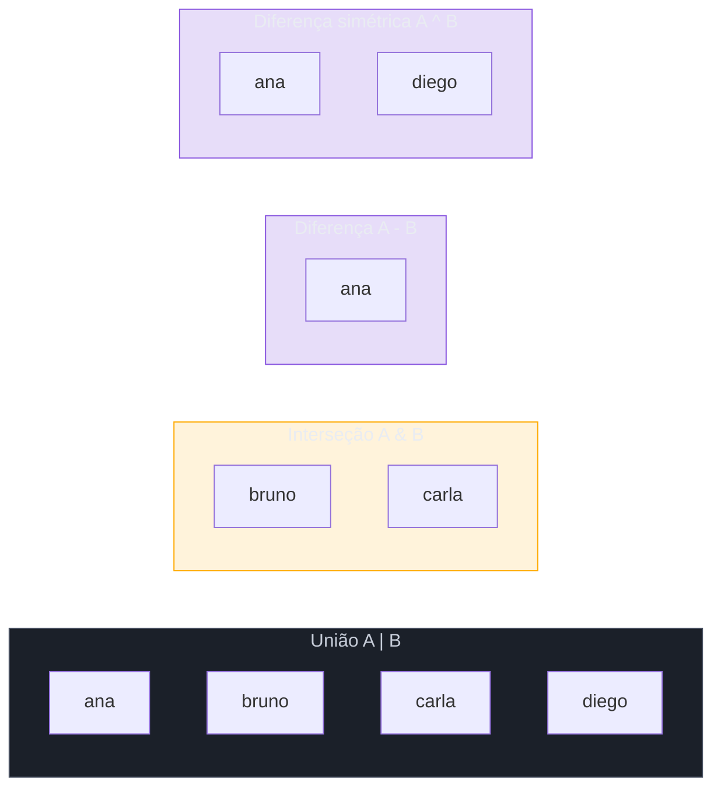
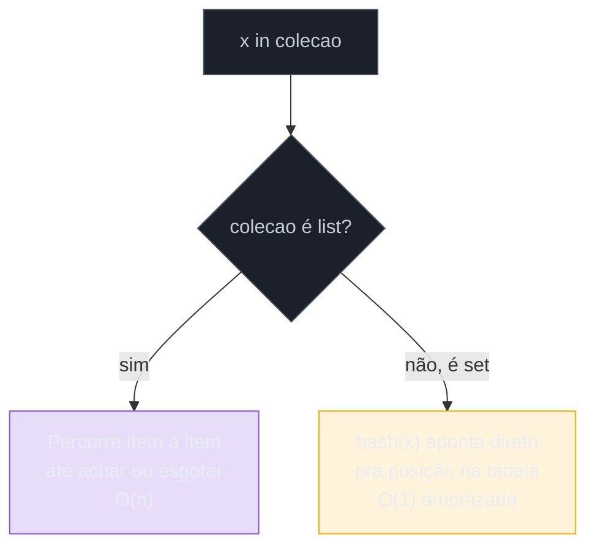

# Sets

> [!abstract] TL;DR
> `set` é o conjunto matemático do Python — uma coleção **não ordenada** de elementos **únicos** e **hasháveis**, implementada como tabela hash (a mesma estrutura interna de um `dict`, só que guardando apenas chaves, sem valor associado). A armadilha de dia um: `{}` cria um **dict vazio**, não um set vazio — o literal `{...}` só vira set quando tem pelo menos um elemento dentro; set vazio exige `set()` explícito. As operações de conjunto vêm em duas formas equivalentes: operador (`|` união, `&` interseção, `-` diferença, `^` diferença simétrica) que exige que os dois lados sejam `set`, e método (`.union()`, `.intersection()`, `.difference()`, `.symmetric_difference()`) que aceita **qualquer iterável** do lado direito. A razão de existir de `set` não é só sintática: testar `x in conjunto` é **O(1)** amortizado (hashing direto), contra **O(n)** de `x in lista` (busca linear item a item) — a diferença medida em benchmark real chega a **mais de 100.000× mais rápida** para elementos ausentes numa coleção de 1 milhão de itens. `frozenset` é a versão imutável e hashável de `set` — pode ser chave de `dict` ou elemento de outro `set`, coisa que `set` normal não pode, pela mesma exigência de hashability já vista em [[03 - Dicionários|dict]].

## O loop que devia ser um lookup

Um sistema de e-commerce precisa filtrar, de uma lista de 50 mil pedidos recebidos hoje, quais pertencem a clientes já bloqueados por fraude. A lista de IDs bloqueados tem 8 mil entradas. O código mais direto que vem à cabeça:

```python
ids_bloqueados = carregar_ids_bloqueados()   # lista com 8.000 IDs
pedidos_hoje = carregar_pedidos_hoje()        # lista com 50.000 pedidos

pedidos_suspeitos = []
for pedido in pedidos_hoje:
    if pedido.cliente_id in ids_bloqueados:    # busca linear numa lista de 8.000
        pedidos_suspeitos.append(pedido)
```

O código funciona, os testes passam com uma amostra pequena, e vai pra produção. Semanas depois, o job que roda esse filtro passa a demorar minutos em vez de segundos — sem nenhuma mudança de código, só o crescimento natural do volume de dados. O culpado não é um bug de lógica: é a complexidade escondida dentro de `in`.

`pedido.cliente_id in ids_bloqueados`, quando `ids_bloqueados` é uma `list`, não é uma operação O(1) — é uma busca **linear**: Python percorre a lista item a item, comparando um a um, até achar (ou não achar) o elemento. Isso é O(n) em relação ao tamanho de `ids_bloqueados`. E como esse `in` está **dentro de um loop** que roda uma vez por pedido, o custo total do programa não é O(n) — é O(n × m), onde `n` é o número de pedidos e `m` o número de IDs bloqueados. Com 50.000 pedidos e 8.000 IDs bloqueados, isso são até **400 milhões de comparações** no pior caso. É um clássico O(n²) disfarçado de código inocente — o mesmo padrão, em escala menor, do "aninhar um `in` de lista dentro de um `for`" que aparece o tempo todo em código que "funcionava bem em teste".

A correção é trocar o tipo da coleção de lookup, não a lógica:

```python
ids_bloqueados = set(carregar_ids_bloqueados())   # set com 8.000 IDs

pedidos_suspeitos = []
for pedido in pedidos_hoje:
    if pedido.cliente_id in ids_bloqueados:        # busca por hash, O(1) amortizado
        pedidos_suspeitos.append(pedido)
```

Uma única mudança — `list` vira `set` na estrutura usada para checar pertencimento — transforma o custo total de O(n × m) para O(n + m): O(m) para construir o set uma vez, e O(1) por checagem dentro do loop de `n` pedidos. Na prática, com as ordens de grandeza deste exemplo, isso é a diferença entre um job de minutos e um job de milissegundos.

O resto desta nota constrói o modelo mental completo por trás dessa troca: como criar um `set` (e a armadilha do `{}` vazio), as operações de conjunto que ele oferece de graça, o porquê estrutural da diferença de performance, e `frozenset`, a variante imutável que resolve o problema de "quero um set, mas preciso que ele seja hashável".

## O que é

Um `set` é uma coleção **não ordenada** de elementos **únicos**, onde a única pergunta que a estrutura responde bem é "este elemento está aqui?" — não "em que posição?", porque sets não têm posição, e não "quantas vezes?", porque cada elemento aparece no máximo uma vez. É o equivalente Python direto ao `HashSet` do Java ou ao `Set` do JavaScript/TypeScript (ES2015+): mesma ideia — coleção de valores únicos com lookup rápido — implementações diferentes de linguagem para linguagem.

Internamente, `set` é implementado com a **mesma tabela hash** que dá a `dict` seu desempenho O(1) — a diferença é que um set guarda só as chaves, sem valor associado a cada uma. Fluent Python (Ramalho) descreve essa relação explicitamente: entender o hash table de um `set` é o caminho mais simples para depois entender o de um `dict`, porque o `set` remove a complicação extra de mapear pra um valor. Por compartilhar a estrutura interna, `set` herda a mesma exigência de `dict`: todo elemento precisa ser **hashável** — a seção "Como funciona" retoma esse ponto.

## Por que importa

`set` resolve dois problemas que aparecem o tempo todo em código real, e que costumam ser resolvidos (mal) com `list` por quem ainda não internalizou a estrutura certa:

1. **"Este item já existe aqui?"** — deduplicação, checagem de pertencimento, filtragem contra uma lista de exclusão/permissão (blocklist/allowlist). O exemplo de abertura é esse caso: checar pertencimento contra uma coleção que cresce é O(n) numa lista e O(1) num set — a diferença entre "não escala" e "escala".
2. **"O que esses dois grupos têm em comum / de diferente?"** — comparar dois conjuntos de dados: tags em comum entre dois posts, permissões que um usuário ganhou ou perdeu entre duas versões de um cargo, IDs presentes num sistema mas ausentes em outro (útil pra detectar dessincronização entre bases). Isso é exatamente o vocabulário de teoria dos conjuntos — união, interseção, diferença — e `set` oferece essas operações como parte da linguagem, em vez de reimplementá-las com loops aninhados.

Quem vem de outras linguagens já reconhece a estrutura: `HashSet<T>` em Java, `Set` em JavaScript/TypeScript, `set` em C++ (embora esse último seja ordenado por padrão, uma diferença de implementação — em Python, `set` é deliberadamente **não** ordenado). A mecânica de "ordem não é garantida nem previsível" é a mesma lição já vista em `dict` **antes** do Python 3.7 — só que em `set` essa ausência de ordem nunca deixou de ser verdade; não existe uma versão de Python onde `set` preserva ordem de inserção.

## Como funciona

### Criação: `{1, 2, 3}`, `set()`, e a armadilha do `{}`

A forma mais direta de criar um set não vazio é o literal com chaves:

```python
frutas = {"maçã", "banana", "pera"}
numeros = {1, 2, 3, 2, 1}
print(numeros)   # {1, 2, 3} — duplicatas somem automaticamente
```

Repare que `{1, 2, 3, 2, 1}` vira `{1, 2, 3}` — a própria criação já aplica a regra de unicidade. Isso, sozinho, já é uma forma idiomática de deduplicar uma sequência: `set(lista)` remove duplicatas de qualquer iterável (com a ressalva de que a ordem original não é preservada — se ordem importar, ver a nota de `dict.fromkeys()` nas armadilhas abaixo).

O construtor `set()` também aceita qualquer iterável, seguindo o mesmo comportamento já visto em `list()` e `dict()`:

```python
set()                    # set() — set vazio
set([1, 2, 2, 3])        # {1, 2, 3} — a partir de uma lista
set("banana")             # {'b', 'a', 'n'} — CADA caractere vira um elemento
set({"a": 1, "b": 2})     # {'a', 'b'} — itera sobre as CHAVES de um dict
```

> [!warning] `{}` cria um dict vazio, não um set vazio
> ```python
> vazio = {}
> type(vazio)   # <class 'dict'> — SURPRESA: não é set!
>
> vazio_de_verdade = set()
> type(vazio_de_verdade)   # <class 'set'>
> ```
> A razão é histórica: `{}` já pertencia a `dict` desde as primeiras versões de Python, muito antes de `set` ganhar sintaxe de literal (isso só aconteceu no Python 2.7/3.0, via [PEP 3100](https://peps.python.org/pep-3100/) e mudanças relacionadas). Quando a sintaxe `{elem1, elem2}` foi adicionada para sets, `{}` já estava consagrado como dict vazio havia mais de uma década, e mudar esse significado quebraria compatibilidade retroativa em escala massiva. O resultado é a assimetria que sobrevive até hoje: `{1, 2, 3}` é set, mas `{}` é dict — a única forma seguro de expressar "set vazio" é escrever `set()` por extenso. Este é um erro clássico de iniciante (e às vezes de quem já é fluente, num momento de distração) que **não gera exceção nenhuma** — o código roda, só que operando sobre o tipo errado, até que algum método específico de `set` (como `.add()`) seja chamado num dict e dispare um erro tardio e confuso.

### Operações de conjunto: operador vs método

`set` implementa as quatro operações clássicas de teoria dos conjuntos, cada uma disponível em **duas formas equivalentes**: um operador (mais curto, mas exige que os dois lados já sejam `set`) e um método (mais verboso, mas aceita **qualquer iterável** do lado direito — lista, tupla, gerador, o que for).

```python
times_a = {"ana", "bruno", "carla"}
times_b = {"bruno", "carla", "diego"}

# União — elementos que estão em A OU em B (ou nos dois)
times_a | times_b               # {'ana', 'bruno', 'carla', 'diego'}
times_a.union(times_b)          # mesmo resultado

# Interseção — elementos que estão em A E em B
times_a & times_b               # {'bruno', 'carla'}
times_a.intersection(times_b)   # mesmo resultado

# Diferença — elementos que estão em A, mas NÃO em B
times_a - times_b               # {'ana'}
times_a.difference(times_b)     # mesmo resultado

# Diferença simétrica — elementos que estão em A OU em B, mas NÃO nos dois
times_a ^ times_b               # {'ana', 'diego'}
times_a.symmetric_difference(times_b)   # mesmo resultado
```



A diferença prática entre operador e método fica clara quando o lado direito **não** é já um `set`:

```python
ids_permitidos = {1, 2, 3, 4}
ids_da_requisicao = [2, 4, 6]   # lista, não set

ids_permitidos & ids_da_requisicao          # TypeError: unsupported operand type(s)
ids_permitidos.intersection(ids_da_requisicao)   # {2, 4} — funciona, aceita a lista
```

Segundo a [documentação oficial](https://docs.python.org/3/library/stdtypes.html#set), essa diferença é uma decisão deliberada de design: "the non-operator versions of the `union()`, `intersection()`, `difference()`, `symmetric_difference()` methods will accept any iterable as an argument... [enquanto] their operator based counterparts require their arguments to be sets" — a justificativa citada na própria doc é evitar construções ambíguas e propensas a erro como misturar tipos silenciosamente, preferindo que a intenção "isto é um conjunto de verdade" fique explícita quando se usa o operador.

Além das quatro operações centrais, `set` oferece três checagens booleanas — também disponíveis como operador ou método:

```python
a = {1, 2, 3}
b = {1, 2, 3, 4, 5}

a.issubset(b)      # True — a <= b: todo elemento de a está em b
a <= b              # True — mesma coisa via operador

b.issuperset(a)     # True — b >= a: todo elemento de a está em b
b >= a               # True

a.isdisjoint({7, 8})   # True — a e {7, 8} não têm elemento em comum
```

`<` e `>` (sem o `=`) testam **subconjunto/superconjunto próprio** — verdadeiro só se os conjuntos forem diferentes em tamanho, além da relação de contenção: `a < a` é `False` (um conjunto não é subconjunto próprio de si mesmo), mas `a <= a` é `True`.

> [!question]- `set` também tem métodos que mutam in place, iguais a `.update()` de dict?
> Tem — `.update()`, `.intersection_update()`, `.difference_update()` e `.symmetric_difference_update()` fazem a mesma operação, mas **modificam o set original in place** em vez de devolver um novo, análogo ao par `d1 | d2` (novo) vs `d1 |= d2` (in place) já visto em [[03 - Dicionários|dict]]:
> ```python
> ativos = {"ana", "bruno"}
> ativos.update({"carla", "diego"})    # muta ativos in place
> print(ativos)   # {'ana', 'bruno', 'carla', 'diego'}
> ```
> Assim como em dict, os operadores in-place equivalentes existem: `|=`, `&=`, `-=`, `^=` fazem exatamente o mesmo que `.update()`, `.intersection_update()`, `.difference_update()`, `.symmetric_difference_update()`, respectivamente.

Para adicionar/remover um único elemento (mutação simples, não uma operação de conjunto inteira), `set` oferece `.add(elem)`, `.remove(elem)` (levanta `KeyError` se ausente), `.discard(elem)` (não levanta erro se ausente — o equivalente do par `d[key]`/`.get()` já visto em dict, aplicado à remoção) e `.pop()` (remove e devolve um elemento **arbitrário**, já que set não tem ordem, então não existe "o primeiro" nem "o último" elemento de verdade).

### Por que `in` é O(1) num set e O(n) numa lista

A razão estrutural por trás do exemplo de abertura: uma `list` guarda seus elementos numa sequência contígua, e para checar se um valor está presente, Python **precisa** olhar elemento por elemento, comparando cada um contra o valor buscado, até achar uma correspondência ou esgotar a lista. No pior caso (elemento ausente, ou no fim da lista), isso é uma varredura completa — complexidade **O(n)**, proporcional ao tamanho da lista.

Um `set`, por ser uma tabela hash, funciona diferente: para checar `x in conjunto`, Python calcula `hash(x)` — um número que serve de "endereço" — e vai **diretamente** à posição da tabela interna correspondente a esse hash, sem precisar varrer nada. Na prática, isso significa que o tempo de checagem não cresce (de forma relevante) com o tamanho do conjunto — complexidade **O(1) amortizado** (o "amortizado" reconhece que, em casos raros, colisões de hash ou redimensionamento interno da tabela podem custar um pouco mais, mas o custo médio permanece efetivamente constante).



Benchmarks reais confirmam a magnitude dessa diferença. Sebastian Witowski, medindo membership testing com `timeit` em coleções de 1 milhão de elementos, encontrou que checar um elemento **presente no início** da coleção tem custo parecido entre `list` e `set` (~117 ns vs ~102-121 ns) — mas checar um elemento **ausente**, ou próximo do fim, é onde a diferença explode: cerca de **11,4 ms numa lista** contra **107 ns num set** — mais de **100.000× mais rápido**. Isso bate com o esperado pela teoria: o pior caso de uma busca linear (elemento não encontrado, tem que varrer tudo) é exatamente onde O(n) dói mais, enquanto o set nem sente a diferença, porque não importa onde o elemento "estaria" — o hash aponta direto.

Uma ressalva importante do mesmo estudo: **converter** uma lista existente para set tem custo (por volta de 26 ms para 1 milhão de elementos no benchmark citado) — então a conversão só compensa quando o set resultante vai ser consultado **múltiplas vezes**. Para uma única checagem isolada, o custo de conversão pode superar o ganho; o padrão do exemplo de abertura desta nota — construir o `set` uma vez, fora do loop, e checar `in` repetidamente dentro dele — é exatamente o cenário onde a conversão se paga muitas vezes.

| Operação | `list` | `set` |
|---|---|---|
| `x in colecao` | O(n) | O(1) amortizado |
| Inserir elemento | O(1) amortizado (no fim) | O(1) amortizado |
| Remover elemento específico | O(n) (precisa achar primeiro) | O(1) amortizado |
| Preserva ordem | Sim | Não |
| Permite duplicatas | Sim | Não |
| Elementos precisam ser hasháveis | Não | Sim |

### `frozenset`: a versão imutável e hashável

`frozenset` é a contraparte imutável de `set` — mesmas operações de conjunto (`union()`, `intersection()`, `difference()`, `symmetric_difference()`, os operadores `|`/`&`/`-`/`^`), mas sem nenhum método que module o conteúdo depois de criado: não tem `.add()`, `.remove()`, `.discard()`, `.pop()`, `.update()`.

```python
permissoes_leitura = frozenset({"ler", "listar"})
permissoes_admin = frozenset({"ler", "listar", "escrever", "deletar"})

permissoes_admin - permissoes_leitura   # frozenset({'escrever', 'deletar'})
permissoes_leitura.add("escrever")       # AttributeError: 'frozenset' object has no attribute 'add'
```

A propriedade que justifica a existência de `frozenset`, e que o distingue de `set`: por ser imutável, `frozenset` é **hashável** — pode ser usado como chave de `dict` ou como elemento de outro `set`, coisa que um `set` normal **não pode**, pela mesma regra de hashability de [[03 - Dicionários|dict]] (objeto mutável não é hashável, porque seu hash mudaria se seu conteúdo mudasse):

```python
# set normal NÃO é hashável — não pode ser chave nem elemento de outro set
cache = {{"a", "b"}: "valor"}          # TypeError: unhashable type: 'set'
conjunto_de_conjuntos = {{"a"}, {"b"}}  # TypeError: unhashable type: 'set'

# frozenset É hashável — funciona nos dois casos
cache = {frozenset({"a", "b"}): "valor"}                  # OK
conjunto_de_conjuntos = {frozenset({"a"}), frozenset({"b"})}   # OK
```

Um caso de uso real para essa propriedade: representar combinações de tags (ou permissões, ou features ativas) como chave de um cache de resultado, quando a ordem das tags não importa mas a combinação exata sim. Uma `tuple` também poderia servir de chave, mas `tuple` é sensível a **ordem** (`("a", "b")` e `("b", "a")` são chaves diferentes); `frozenset({"a", "b"})` e `frozenset({"b", "a"})` são a **mesma** chave, porque set (e frozenset) não têm noção de ordem — a escolha certa depende de a ordem importar ou não pro seu domínio.

```python
cache_de_resultado = {}

def calcular_caro(tags):
    chave = frozenset(tags)   # normaliza a ordem — {"a","b"} e {"b","a"} viram a mesma chave
    if chave in cache_de_resultado:
        return cache_de_resultado[chave]
    resultado = _processamento_pesado(tags)
    cache_de_resultado[chave] = resultado
    return resultado
```

### Requisito de hashability (reforço)

`set` compartilha com `dict` a mesma exigência estrutural: todo elemento precisa ser **hashável**, porque a tabela hash interna usa o hash do elemento para decidir onde ele fica armazenado. Isso já foi visto em detalhe na [[03 - Dicionários|nota anterior]] deste galho — a regra é a mesma: tipos imutáveis (`str`, `int`, `float`, `bool`, `tuple` de elementos hasháveis, `frozenset`) são hasháveis e podem ser elemento de `set`; tipos mutáveis (`list`, `dict`, `set` puro) não são, e tentar colocá-los num set levanta `TypeError`.

```python
tags_ok = {"python", "backend", ("categoria", "linguagem")}   # tuple hashável — OK

tags_erro = {"python", ["backend"]}   # TypeError: unhashable type: 'list'
```

Segundo o [glossário oficial](https://docs.python.org/3/glossary.html#term-hashable), a mesma definição de hashability que rege chaves de `dict` rege elementos de `set` — "hashability makes an object usable as a dictionary key and a set member, because these data structures use the hash value internally" — não é coincidência que as duas estruturas compartilhem a exigência: elas compartilham a implementação.

### Quando `set` não é a estrutura certa

A troca de `list` por `set` não é de graça: três propriedades de `list` somem quando se muda para `set`, e vale checar se alguma delas era, na verdade, necessária.

1. **Ordem.** Como visto acima, `set` nunca garante ordem — nem de inserção, nem qualquer outra. Se o código depois depende de "o primeiro item processado" ou "processar na ordem em que chegou", `set` corrompe silenciosamente essa garantia.
2. **Duplicatas com significado.** Se o número de ocorrências de um valor importa (ex.: "quantas vezes esse produto apareceu no carrinho"), `set` descarta essa informação na criação — todo elemento vira "presente uma vez". `collections.Counter` (assunto da [[07 - O módulo collections — Counter, defaultdict, deque, namedtuple|nota 07]]) é a ferramenta certa quando a contagem importa, não `set`.
3. **Indexação por posição.** `set` não suporta `conjunto[0]` — não existe "posição zero" numa coleção sem ordem. Qualquer código que precise acessar por índice numérico continua precisando de `list` (ou `tuple`).

A régua prática: `set` é a escolha certa quando a pergunta do domínio é "isto está presente?" ou "o que estas duas coleções têm em comum/de diferente?" — não quando a pergunta é "em que ordem?", "quantas vezes?" ou "o que está na posição N?".

## Na prática

Combinando criação, operações de conjunto e a lição de performance num exemplo mais completo — deduplicar e comparar dois conjuntos de usuários vindos de fontes diferentes (ex.: um export de CRM e um export do banco de produção), pra detectar dessincronização:

```python
usuarios_crm = {"ana@ex.com", "bruno@ex.com", "carla@ex.com", "diego@ex.com"}
usuarios_producao = {"bruno@ex.com", "carla@ex.com", "elisa@ex.com"}

# Quem está no CRM mas sumiu de produção (churn não refletido no CRM?)
so_no_crm = usuarios_crm - usuarios_producao
print(so_no_crm)   # {'ana@ex.com', 'diego@ex.com'}

# Quem está em produção mas não chegou no CRM (falha de sincronização?)
so_em_producao = usuarios_producao - usuarios_crm
print(so_em_producao)   # {'elisa@ex.com'}

# Quem está sincronizado nos dois
sincronizados = usuarios_crm & usuarios_producao
print(sincronizados)   # {'bruno@ex.com', 'carla@ex.com'}

# Todo mundo que aparece em pelo menos uma fonte
todos = usuarios_crm | usuarios_producao
print(len(todos))   # 5

# Checagem de pertencimento em escala — a razão real de usar set aqui
# Simulando 100.000 emails de um log de acesso, checando contra usuarios_producao
log_de_acessos = gerar_log_simulado(100_000)   # lista de emails
acessos_de_usuarios_validos = [
    email for email in log_de_acessos
    if email in usuarios_producao   # O(1) por checagem — o motivo de usuarios_producao ser set, não list
]
```

Repare que a mesma variável `usuarios_producao`, sendo `set`, serve tanto para as operações de conjunto (`-`, `&`, `|`) quanto para a checagem de pertencimento em massa no loop final — as duas motivações da nota convergindo no mesmo objeto.

## Armadilhas

### (1) `{}` é dict vazio, não set vazio

Já coberto no `[!warning]` acima — o erro mais comum de quem está começando com sets. `set()` é a única forma correta de expressar set vazio.

### (2) Esperar que um set preserve ordem

```python
numeros = {5, 1, 3, 2, 4}
print(numeros)   # a ordem de impressão NÃO é garantida ser 1,2,3,4,5 nem a de inserção
```

Diferente de `dict` (que garante ordem de inserção desde Python 3.7), `set` **nunca** garantiu ordem, em nenhuma versão. Se ordem importar — por exemplo, deduplicar uma lista **preservando** a ordem original de primeira aparição — a ferramenta certa não é `set`, é `dict.fromkeys()`:

```python
sequencia = ["b", "a", "b", "c", "a"]

sem_ordem = list(set(sequencia))            # ordem não garantida
com_ordem = list(dict.fromkeys(sequencia))   # ['b', 'a', 'c'] — preserva primeira aparição
```

`dict.fromkeys()` funciona porque dict garante ordem de inserção desde 3.7 e ignora automaticamente chaves repetidas — um efeito colateral útil da mesma propriedade de unicidade de chave.

### (3) Usar operador (`|`, `&`, `-`, `^`) quando o lado direito não é um `set`

```python
permitido = {1, 2, 3}
recebido = [2, 3, 4]   # lista, não set

permitido & recebido           # TypeError: unsupported operand type(s) for &
permitido.intersection(recebido)   # {2, 3} — funciona, método aceita qualquer iterável
```

Regra prática: se um dos lados pode não ser `set` (vier de uma lista, tupla, gerador, resultado de query), usar o **método**, não o operador.

### (4) Tentar colocar elemento mutável num set

```python
tags_por_post = {["python", "backend"]}   # TypeError: unhashable type: 'list'
```

Mesma regra de hashability de `dict` — troque a lista por `tuple` (se a ordem importar) ou `frozenset` (se não importar).

### (5) Confundir `set` com `frozenset` quando a mutabilidade importa

```python
def registrar_permissoes(chave_composta):
    cache[chave_composta] = "ok"   # se chave_composta for set (não frozenset), TypeError na hora do hash

grupo = {"admin", "leitura"}          # set — mutável, NÃO hashável
registrar_permissoes(grupo)            # TypeError: unhashable type: 'set'

grupo_congelado = frozenset(grupo)     # frozenset — imutável, hashável
registrar_permissoes(grupo_congelado)  # OK
```

Quando um conjunto de valores precisa virar chave (de dict, ou elemento de outro set), a conversão para `frozenset` é obrigatória — `set` normal nunca serve para isso.

## Em entrevista

Perguntas previsíveis sobre este tópico:

- **"Qual a complexidade de `in` numa lista vs num set, e por quê?"** O(n) numa lista (busca linear, item a item) contra O(1) amortizado num set (hashing direto — Python calcula `hash(x)` e vai direto à posição na tabela interna, sem varrer nada). A diferença cresce com o tamanho da coleção; em benchmarks reais, checar um elemento ausente numa coleção de 1 milhão de itens é ordens de magnitude mais rápido em set do que em lista.
- **"Por que `{}` não cria um set vazio?"** Porque `{}` já era a sintaxe de dict vazio muito antes de `set` ganhar sintaxe de literal — mudar o significado quebraria compatibilidade retroativa. `set()` é a única forma correta.
- **"Qual a diferença entre usar o operador `&` e o método `.intersection()`?"** Semanticamente equivalentes, mas o operador exige que os dois operandos já sejam `set` (levanta `TypeError` com outro tipo); o método aceita **qualquer iterável** do lado direito. Regra prática: método quando o lado direito pode não ser set.
- **"O que é `frozenset` e quando usar?"** A versão imutável de `set` — mesmas operações de conjunto, sem métodos de mutação. Por ser imutável, é **hashável**, então pode ser chave de `dict` ou elemento de outro `set`, o que `set` normal não pode.
- **"`set` preserva ordem de inserção, como `dict` faz desde 3.7?"** Não — `set` nunca garantiu ordem, em nenhuma versão de Python. Se precisar de deduplicação preservando ordem, a ferramenta certa é `dict.fromkeys()`, não `set()`.
- **"Todo objeto pode ser elemento de um set?"** Não — só objetos **hasháveis**, mesma exigência de chave de `dict`. Tipos mutáveis (`list`, `dict`, `set` puro) não são hasháveis; `str`, `int`, `tuple` (de elementos hasháveis) e `frozenset` são.

### How to explain in English

> A Python `set` is an unordered collection of unique, hashable elements, backed by the same hash-table implementation as `dict` (minus the associated value per key). The classic gotcha: `{}` creates an empty **dict**, not an empty set — set literals only resolve to `set` when they contain at least one element; an empty set requires the explicit `set()` constructor. Set operations come in two equivalent forms: operators (`|` union, `&` intersection, `-` difference, `^` symmetric difference) that require both operands to already be `set`, and methods (`.union()`, `.intersection()`, `.difference()`, `.symmetric_difference()`) that accept **any iterable** as the argument. The real reason to reach for `set` over `list` is performance: membership testing (`x in collection`) is **O(1)** amortized in a set (direct hash lookup) versus **O(n)** in a list (linear scan) — real-world benchmarks show membership checks against a 1-million-element collection running over 100,000× faster in a set than a list for absent or late elements. `frozenset` is the immutable, hashable counterpart of `set` — it supports the same set operations but no mutating methods, and because it's immutable it can be used as a dict key or as an element of another set, which a regular `set` cannot, following the same hashability rule already covered for `dict` keys.

| Termo PT | Termo EN |
|---|---|
| conjunto | set |
| conjunto imutável | frozenset / immutable set |
| união | union |
| interseção | intersection |
| diferença | difference |
| diferença simétrica | symmetric difference |
| subconjunto | subset |
| superconjunto | superset |
| conjuntos disjuntos | disjoint sets |
| hasheável | hashable |
| tabela hash | hash table |
| checagem de pertencimento | membership testing |
| busca linear | linear search |
| tempo constante amortizado | amortized constant time |

## O que vem a seguir

Com as quatro coleções nativas cobertas — `list`, `tuple`, `dict`, `set` — o galho segue pra sintaxe que constrói qualquer uma delas de forma declarativa, num único fold expressivo: a [[05 - Comprehensions — list, dict, set e generator expressions|nota 05]] cobre list/dict/set comprehensions e generator expressions em detalhe — inclusive a `set comprehension` (`{expr for x in iteravel}`) que só foi mencionada de passagem aqui.

## Veja também

- [[03 - Dicionários|03 — Dicionários]] — mesma exigência de hashability, mesma implementação de tabela hash por baixo
- [[05 - Comprehensions — list, dict, set e generator expressions|05 — Comprehensions]] — sintaxe completa de set comprehension
- [[07 - O módulo collections — Counter, defaultdict, deque, namedtuple|07 — O módulo collections]] — `Counter` usa hashing do mesmo jeito, para contagem em vez de pertencimento
- [[08 - Escolhendo a estrutura certa|08 — Escolhendo a estrutura certa]] — capstone comparativo de complexidade entre as 4 estruturas
- [[03-Dominios/Tecnologia/Python/Collections e Comprehensions/index|Collections e Comprehensions]] — MOC do galho
- [[03-Dominios/Tecnologia/Python/index|Trilha Python]]

## Fontes

- Python Software Foundation. *5. Data Structures — Set Types — set, frozenset*. docs.python.org, versão 3.14. https://docs.python.org/3/library/stdtypes.html#set-types-set-frozenset (acessado em 2026-07-09)
- Python Software Foundation. *Built-in Types — Sets*. docs.python.org, versão 3.14. https://docs.python.org/3/library/sets.html (acessado em 2026-07-09)
- Python Software Foundation. *Glossary — hashable*. docs.python.org. https://docs.python.org/3/glossary.html#term-hashable (acessado em 2026-07-09)
- Real Python. *Sets in Python*. https://realpython.com/python-sets/ (acessado em 2026-07-09)
- Witowski, S. *Membership Testing — Performance Benchmarks*. switowski.com, 2020-10-08. https://switowski.com/blog/membership-testing/ (acessado em 2026-07-09)
- note.nkmk.me. *Set Operations in Python (Union, Intersection, Symmetric Difference)*. https://note.nkmk.me/en/python-set/ (acessado em 2026-07-09)
- Ramalho, L. *Fluent Python*, 2ª ed. — capítulo sobre dicionários e sets, hash table de `set` como base para entender `dict`. O'Reilly Media.
- Python Software Foundation. *PEP 3100 — Miscellaneous Python 3.0 Plans* (contexto histórico da sintaxe de literal de set). peps.python.org. https://peps.python.org/pep-3100/ (acessado em 2026-07-09)
- GeeksforGeeks. *Python — What Makes Sets Faster Than Lists?*. https://www.geeksforgeeks.org/python/python-what-makes-sets-faster-than-lists/ (acessado em 2026-07-09)
