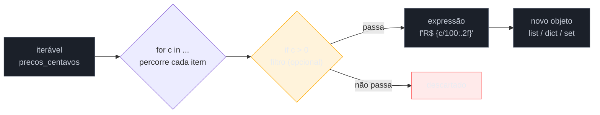

# Comprehensions — list, dict, set e generator expressions

> [!abstract] TL;DR
> Comprehension é a sintaxe que substitui "criar lista vazia + `for` + `.append()`" por uma única expressão: `[x * 2 for x in lista]`. Não é açúcar sintático inofensivo — no CPython ela roda de fato mais rápido que o loop equivalente (tipicamente 10-25% mais rápida em transformações simples), porque o compilador gera uma instrução de bytecode dedicada (`LIST_APPEND`) em vez de repetir, a cada volta, a busca do método `.append`. A mesma sintaxe serve para as quatro formas: `[...]` cria `list`, `{k: v for ...}` cria `dict`, `{x for ...}` cria `set`, e `(x for ...)` — com parênteses, não colchetes — cria um **generator expression**, que não guarda nada na memória, produz um item de cada vez, e por isso lida com datasets grandes (ou infinitos) sem estourar RAM. Dentro da comprehension, a posição do `if` muda completamente o significado: `if` **no final** filtra elementos (alguns ficam de fora); `if...else` **no início**, antes do `for`, é um operador ternário que decide *qual valor* usar para cada elemento (todos ficam, com valores diferentes). Comprehensions podem ser aninhadas para achatar listas de listas, mas o Zen of Python é claro — "readability counts" — e a comunidade Python é igualmente clara: comprehension com mais de um `for` aninhado ou mais de uma condição já é candidata a virar loop explícito de novo.

## O loop de cinco linhas que virou uma linha — e o que quase ninguém percebe primeiro

Um desenvolvedor migrando de JavaScript para Python precisa transformar uma lista de preços em centavos (`float`, com imprecisão de ponto flutuante) numa lista de preços em reais formatados, descartando os itens grátis. Em JS, o instinto é encadear `.filter()` e `.map()`. A tradução ingênua para Python, ainda pensando em loop imperativo, fica assim:

```python
precos_centavos = [1990, 0, 3550, 12000, 0, 899]

precos_formatados = []
for centavos in precos_centavos:
    if centavos > 0:
        reais = centavos / 100
        precos_formatados.append(f"R$ {reais:.2f}")

print(precos_formatados)
# ['R$ 19.90', 'R$ 35.50', 'R$ 120.00', 'R$ 8.99']
```

Funciona. Cinco linhas, três decisões implícitas: criar a lista vazia, decidir o que entra (`if`), decidir o que vira cada item (`f"..."`). Um colega revisando o código sugere: "isso é uma list comprehension". A versão reescrita:

```python
precos_formatados = [f"R$ {c / 100:.2f}" for c in precos_centavos if c > 0]
```

Uma linha. O que a maioria de quem está aprendendo não percebe de imediato é que essa reescrita **não é só estética**. Ela também roda mais rápido — o interpretador CPython trata comprehensions como um caso especial, compilando-as para um padrão de bytecode mais enxuto do que o loop equivalente com chamadas de método repetidas. E ela abre a porta pra três primas que usam exatamente a mesma gramática — dict comprehension, set comprehension e generator expression — cada uma resolvendo um problema ligeiramente diferente. O resto desta nota percorre essa família inteira, incluindo o ponto em que a mesma ferramenta que acabou de economizar quatro linhas começa a custar mais do que economiza.

## Anatomia de uma comprehension

Toda list comprehension tem a mesma estrutura, só que compactada numa ordem que engana quem vem de outras linguagens — o `for` que normalmente viria primeiro aparece no meio:

```python
[expressao for item in iteravel if condicao]
#    ↑          ↑         ↑           ↑
#  o que    de onde     de onde    filtro
#  entra    vem "item"   iterar    (opcional)
#  na lista
```



A ordem de leitura em voz alta é a chave para nunca se confundir: "**crie** `f"R$ {c/100:.2f}"` **para** cada `c` **em** `precos_centavos` **se** `c > 0`" — a mesma ordem das cláusulas na expressão, da esquerda pra direita. É essa correspondência 1:1 com a fala natural que fez o PEP 202, de 2000, descrever a sintaxe como inspirada na notação de conjuntos da matemática (`{x² | x ∈ ℕ}`) e em construções equivalentes de linguagens funcionais como Haskell — não foi um capricho estético, foi uma escolha deliberada de legibilidade.

> [!question]- Por que o `for` vem no meio, e não no começo como um loop normal?
> Porque a comprehension prioriza responder primeiro "o que estou construindo?" (a expressão) antes de "de onde vêm os dados?" (o `for`). Um loop tradicional é uma sequência de instruções — primeiro você declara de onde itera, depois decide o que fazer. Uma comprehension é uma **expressão que produz um valor** — matematicamente mais parecida com "o conjunto de todo `x²` tal que `x` pertence a N" do que com um programa passo a passo. Depois de ler algumas dezenas, a ordem para de incomodar e passa a parecer a única forma natural de escrever.

## Performance: por que a comprehension não é só mais bonita

A comparação de bytecode explica a diferença de velocidade. Um loop `for` com `.append()` gera, a cada iteração, instruções para carregar a lista, buscar o atributo `.append` nela (`LOAD_ATTR`), empilhar o argumento e **chamar** o método como uma função (`CALL_FUNCTION`). Uma list comprehension, por ser tratada como caso especial pelo compilador, usa uma instrução dedicada — `LIST_APPEND` — que insere o item diretamente, sem passar pelo protocolo genérico de chamada de método.

```python
import dis

def com_loop(dados):
    resultado = []
    for x in dados:
        resultado.append(x * 2)
    return resultado

def com_comprehension(dados):
    return [x * 2 for x in dados]

# dis.dis(com_loop) mostra LOAD_FAST, LOAD_METHOD, LOAD_FAST,
# LOAD_CONST, BINARY_MULTIPLY, CALL_METHOD, POP_TOP a cada volta

# dis.dis(com_comprehension) mostra um bytecode mais enxuto,
# com LIST_APPEND substituindo a chamada de método completa
```

Benchmarks publicados (Switowski, e outros, medindo com `timeit`) mostram list comprehensions tipicamente **10% a 25% mais rápidas** que o loop equivalente com `.append()` para transformações e filtros simples — a economia por iteração é pequena, mas soma em datasets grandes. A vantagem **encolhe** conforme o trabalho por elemento cresce: se cada iteração faz uma chamada de rede, consulta um banco de dados ou roda um cálculo pesado, o custo de `.append()` vira irrelevante perto do resto do trabalho — nesses casos, a escolha entre loop e comprehension deveria ser só sobre legibilidade, não sobre performance.

> [!warning] Comprehension não é "sempre mais rápida" — é "geralmente mais rápida para operações simples"
> Não decida entre loop e comprehension baseado em performance por padrão. Decida por legibilidade primeiro; a comprehension normalmente ganha nos dois critérios ao mesmo tempo em casos simples, o que a torna a escolha natural — mas se a lógica interna é complexa o suficiente para tornar a comprehension difícil de ler, o ganho de alguns microssegundos por iteração não compensa o custo de manutenção.

## O filtro: `if` no final

Um `if` depois do `for` funciona como filtro — decide quais itens **entram** na coleção resultante. Itens que falham na condição simplesmente não aparecem no resultado; não há "valor substituto":

```python
numeros = [1, 2, 3, 4, 5, 6, 7, 8, 9, 10]

pares = [n for n in numeros if n % 2 == 0]
print(pares)
# [2, 4, 6, 8, 10] — os ímpares desapareceram, não viraram None nem 0
```

Múltiplos filtros se encadeiam com `and`/`or` normalmente, ou empilhando vários `if` (equivalente a um `and`):

```python
# Duas formas equivalentes de "par E maior que 4"
a = [n for n in numeros if n % 2 == 0 and n > 4]
b = [n for n in numeros if n % 2 == 0 if n > 4]
print(a == b)  # True
```

A primeira forma (`and` explícito) é geralmente considerada mais legível — múltiplos `if` empilhados tendem a confundir porque lembram visualmente cláusulas independentes, não uma conjunção.

## O condicional dentro: `if...else` no início muda o jogo

Esta é a armadilha mais comum de quem começa a misturar as duas formas. Um `if...else` colocado **antes** do `for` não filtra — é um **operador ternário**, e decide **qual valor usar**, não se o item entra ou sai. Todo item do iterável original aparece no resultado, só que com um de dois valores possíveis:

```python
numeros = [1, 2, 3, 4, 5]

# if...else ANTES do for → ternário → todo item fica, com valor condicional
rotulos = ["par" if n % 2 == 0 else "ímpar" for n in numeros]
print(rotulos)
# ['ímpar', 'par', 'ímpar', 'par', 'ímpar'] — 5 itens, igual à entrada

# if SEM else, DEPOIS do for → filtro → só os pares sobrevivem
apenas_pares = [n for n in numeros if n % 2 == 0]
print(apenas_pares)
# [2, 4] — 2 itens, menos que a entrada
```

A regra prática: **`if` sozinho, no fim** = "alguns saem". **`if...else`, no começo** = "todos ficam, com aparência diferente". A sintaxe do ternário exige o `else` — não existe `x if condicao for x in lista` sem o `else` correspondente, porque o Python precisa saber que valor usar em todo caminho.

É perfeitamente válido — e comum — combinar as duas formas na mesma comprehension: um ternário decidindo o valor, e um filtro depois decidindo quem participa:

```python
# Ternário (decide o rótulo) + filtro (só positivos entram)
saldo = [-50, 120, -10, 300, 0]
classificados = [
    "alto" if v >= 100 else "baixo"
    for v in saldo
    if v > 0
]
print(classificados)
# ['baixo', 'alto', 'alto'] — 0 e os negativos foram filtrados primeiro
```

## Dict comprehension e set comprehension

A mesma gramática, trocando só o delimitador e — no caso do dict — adicionando a dupla `chave: valor`. `dict` comprehension usa `{}` com dois-pontos; `set` comprehension usa `{}` sem dois-pontos (o que os diferencia é só a presença ou não do `chave:`):

```python
palavras = ["python", "java", "go", "rust", "javascript"]

# Dict comprehension: {chave: valor for item in iteravel}
tamanhos = {p: len(p) for p in palavras}
print(tamanhos)
# {'python': 6, 'java': 4, 'go': 2, 'rust': 4, 'javascript': 10}

# Set comprehension: {valor for item in iteravel} — sem dois-pontos
tamanhos_unicos = {len(p) for p in palavras}
print(tamanhos_unicos)
# {2, 4, 6, 10} — 4 aparece só uma vez, mesmo vindo de "java" e "rust"
```

Dict comprehension foi formalizada depois da list comprehension — a PEP 274 a propôs em 2001-2002, mas ela só foi de fato incluída na linguagem no Python 2.7/3.0 (junto com set comprehension), reaproveitando a mesma gramática de `for`/`if` já validada para listas. O caso de uso mais comum de dict comprehension é **inverter** ou **reindexar** uma estrutura existente:

```python
# Invertendo um dict (chave vira valor, valor vira chave)
codigo_pais = {"BR": "Brasil", "US": "Estados Unidos", "JP": "Japão"}
pais_codigo = {nome: sigla for sigla, nome in codigo_pais.items()}
print(pais_codigo)
# {'Brasil': 'BR', 'Estados Unidos': 'US', 'Japão': 'JP'}
```

> [!warning] Invertendo um dict, cuidado com valores repetidos
> `{v: k for k, v in d.items()}` assume que todo valor de `d` é único. Se dois pares tiverem o mesmo valor original, a inversão perde um deles silenciosamente — o dict resultante só guarda a última ocorrência processada, porque chaves de dict não podem se repetir. Se a unicidade não é garantida, agrupar num `dict` de listas (ou usar `collections.defaultdict`, coberto na [[07 - O módulo collections — Counter, defaultdict, deque, namedtuple|nota 07]]) é mais seguro do que inverter direto.

Set comprehension resolve o problema equivalente a `.filter()` seguido de deduplicação — sem precisar de duas passadas nem de converter uma lista pra `set` depois de já ter montado ela:

```python
# Em vez de: set([x for x in dados if condicao]) — duas estruturas intermediárias
dados = [1, 2, 2, 3, 4, 4, 4, 5]
impares_unicos = {x for x in dados if x % 2 != 0}
print(impares_unicos)
# {1, 3, 5}
```

## Generator expressions — a mesma ideia, sem guardar nada na memória

Trocar `[]` por `()` na mesma sintaxe transforma uma list comprehension num **generator expression**: em vez de construir a lista inteira de uma vez e devolvê-la pronta, ele devolve um objeto gerador que produz **um item por vez**, sob demanda, e não guarda o restante em lugar nenhum até ser pedido.

```python
quadrados_lista = [x**2 for x in range(1_000_000)]      # list comprehension
quadrados_gerador = (x**2 for x in range(1_000_000))     # generator expression

import sys
print(sys.getsizeof(quadrados_lista))    # algo como 8_448_728 bytes (~8 MB)
print(sys.getsizeof(quadrados_gerador))  # algo como 200 bytes — tamanho fixo
```

A diferença de ordem de grandeza (megabytes contra dezenas de bytes) não é exagero didático — é o resultado direto de a lista precisar alocar espaço para **um milhão de inteiros já calculados**, enquanto o gerador só guarda o estado necessário para calcular o próximo, quando alguém pedir. Essa é a razão prática mais comum para escolher `()` no lugar de `[]`: quando o dado é grande (ou potencialmente infinito, como um stream de eventos) e você só vai **percorrer uma vez**, sem precisar indexar nem reaproveitar depois.

```python
# sum() consome o gerador item a item — nunca existe a lista inteira na memória
total = sum(x**2 for x in range(1_000_000))
```

Repare que os parênteses do generator expression puderam ser omitidos ali — quando é o único argumento de uma chamada de função, os parênteses da própria chamada já servem de delimitador. Isso funciona com `sum()`, `any()`, `all()`, `max()`, `min()`, `sorted()` e qualquer função que aceite um iterável.

> [!warning] Generator expression é de uso único
> Um gerador não pode ser "reiniciado" nem percorrido duas vezes — depois de esgotado (seja por um `for`, por `list()`, ou por qualquer função que o consuma), ele fica vazio para sempre.
> ```python
> gen = (x for x in range(3))
> print(list(gen))  # [0, 1, 2]
> print(list(gen))  # [] — já foi consumido, não há mais nada
> ```
> Se o resultado precisa ser percorrido mais de uma vez, ou acessado por índice, ele precisa virar uma estrutura concreta — `list(gen)` — e nesse ponto a vantagem de memória do gerador já foi embora, porque agora existe uma lista completa na memória de novo.

A fundamentação formal de por que isso importa em performance vem da PEP 289 (2002), que descreve generator expressions como uma generalização "de alta performance e eficiente em memória" de list comprehensions e geradores: eles evitam alocar a lista inteira, o que preserva localidade de cache e permite ao interpretador reaproveisar objetos entre iterações em vez de manter todos vivos simultaneamente. Essa nota trata generator expression como "isso existe, e resolve o problema de memória" — o mecanismo completo por trás de iteradores e geradores (o protocolo `__iter__`/`__next__`, `yield`, geradores como funções) é assunto do [[03-Dominios/Tecnologia/Python/Funcional e idiomas avançados/index|Galho 4]].

## Comprehensions aninhadas — achatando listas de listas

Uma comprehension pode conter mais de uma cláusula `for`, e elas se aninham na mesma ordem em que apareceriam como loops explícitos — a mais externa vem primeiro:

```python
matriz = [[1, 2, 3], [4, 5, 6], [7, 8, 9]]

# Equivale a:
# achatada = []
# for linha in matriz:
#     for x in linha:
#         achatada.append(x)

achatada = [x for linha in matriz for x in linha]
print(achatada)
# [1, 2, 3, 4, 5, 6, 7, 8, 9]
```

A ordem de leitura continua da esquerda pra direita, exatamente como os loops equivalentes apareceriam indentados: primeiro `for linha in matriz` (o loop externo), depois `for x in linha` (o loop interno). É comum confundir isso com uma comprehension "dentro" de outra — o que é uma construção **diferente**, usada para gerar uma matriz nova (não achatar uma existente):

```python
# Comprehension DENTRO de outra — cria uma nova matriz, não achata
transposta = [[linha[i] for linha in matriz] for i in range(3)]
print(transposta)
# [[1, 4, 7], [2, 5, 8], [3, 6, 9]]
```

Aqui a comprehension externa (`for i in range(3)`) constrói uma lista de listas, e cada elemento dela é o resultado de uma comprehension interna completa e independente — a transposição de matriz clássica, mas em uma linha.

> [!warning] Nested comprehension é onde "conciso" vira "ilegível" mais rápido
> A regra informal que a comunidade Python converge é: **no máximo dois níveis de `for`** dentro de uma comprehension, e mesmo assim só quando o corpo é simples (uma variável, sem lógica condicional pesada). Passar disso — três ou mais `for`, comprehensions aninhadas dentro de comprehensions com múltiplos `if`, ou expressões que exigem mais de 2-3 segundos de leitura para entender o que produzem — é sinal de que a comprehension parou de comunicar intenção e passou a exigir que quem lê "execute o código mentalmente" para entender. Nesse ponto, o Zen of Python é explícito: **"Readability counts"** (e também "Flat is better than nested", "Sparse is better than dense"). A correção quase sempre é uma das duas: voltar para um `for` explícito com nomes de variável descritivos, ou extrair a lógica complexa para uma função nomeada e chamá-la de dentro de uma comprehension mais simples — o nome da função já documenta o que estava escondido na expressão.

```python
# Ilegível — ninguém lê isso em menos de 10 segundos na primeira vez
resultado = [
    y for x in dados
    for y in (transformar(x) if validar(x) else [])
    if y is not None and y > limite
]

# Melhor — a lógica complexa vira uma função nomeada, a comprehension
# fica só com "o que" (filtrar e transformar), não "como"
def processar_item(x, limite):
    if not validar(x):
        return None
    resultado = transformar(x)
    return resultado if resultado is not None and resultado > limite else None

resultado = [item for x in dados if (item := processar_item(x, limite)) is not None]
```

O artigo canônico da Real Python sobre o tema — *When to Use a List Comprehension in Python* — resume o critério de forma direta: comprehensions substituem bem loops simples de transformação/filtro; quando a lógica cresce (múltiplas condições, side effects, tratamento de exceção), o loop explícito volta a ser a escolha mais legível, mesmo custando mais linhas.

## Na prática

Um exemplo combinando as quatro formas — processando uma lista de pedidos de e-commerce:

```python
pedidos = [
    {"id": 1, "cliente": "ana", "valor": 150.0, "status": "pago"},
    {"id": 2, "cliente": "bruno", "valor": 0.0, "status": "cancelado"},
    {"id": 3, "cliente": "ana", "valor": 320.0, "status": "pago"},
    {"id": 4, "cliente": "carla", "valor": 89.90, "status": "pendente"},
    {"id": 5, "cliente": "bruno", "valor": 45.0, "status": "pago"},
]

# List comprehension: valores de pedidos pagos (filtro no fim)
valores_pagos = [p["valor"] for p in pedidos if p["status"] == "pago"]
print(valores_pagos)
# [150.0, 320.0, 45.0]

# Dict comprehension: total gasto por cliente entre os pedidos pagos
# (usa um generator expression dentro de sum() para somar por cliente)
clientes = {p["cliente"] for p in pedidos}
total_por_cliente = {
    c: sum(p["valor"] for p in pedidos if p["cliente"] == c and p["status"] == "pago")
    for c in clientes
}
print(total_por_cliente)
# {'ana': 470.0, 'bruno': 45.0, 'carla': 0.0}

# Set comprehension: status distintos presentes nos pedidos
status_distintos = {p["status"] for p in pedidos}
print(status_distintos)
# {'pago', 'cancelado', 'pendente'}

# Ternário: rótulo de cada pedido, todos permanecem na saída
rotulos = ["ok" if p["status"] == "pago" else "atenção" for p in pedidos]
print(rotulos)
# ['ok', 'atenção', 'ok', 'atenção', 'ok']

# Generator expression: soma total sem materializar lista intermediária
receita_total = sum(p["valor"] for p in pedidos if p["status"] == "pago")
print(receita_total)
# 515.0
```

Repare que `total_por_cliente` já está no limite do que uma comprehension deveria carregar — um `sum()` com generator expression *dentro* de um dict comprehension, com dois filtros no meio. Ainda é legível porque cada peça é simples isoladamente, mas um passo a mais de complexidade (por exemplo, agrupar por múltiplos critérios) já justificaria quebrar em um loop explícito ou usar `collections.defaultdict` — ferramenta que a [[07 - O módulo collections — Counter, defaultdict, deque, namedtuple|nota 07]] cobre justamente para esse tipo de agregação.

## Armadilhas

### (1) Confundir `if...else` (ternário) com `if` (filtro) na hora de ler código alheio

Já coberto em detalhe: a posição do `if` em relação ao `for` muda completamente o comportamento. Ao ler uma comprehension desconhecida, a primeira pergunta deveria ser "esse `if` tem um `else` antes do `for`, ou está sozinho depois do `for`?" — a resposta determina se o resultado terá o mesmo tamanho da entrada ou não.

### (2) Reaproveitar um generator expression esperando percorrê-lo duas vezes

```python
pares = (x for x in range(10) if x % 2 == 0)
total = sum(pares)
maior = max(pares)   # ValueError: max() arg is an empty sequence
```

Depois de `sum()` consumir o gerador inteiro, não sobra nada para `max()` iterar. A correção é materializar uma vez (`pares = list(...)`) se o resultado precisa ser usado mais de uma vez, ou recriar o generator expression a cada uso.

### (3) Usar list comprehension quando o objetivo real é side effect, não construir uma lista

```python
# Errado: comprehension usada só pelo efeito colateral, descartando o resultado
[print(x) for x in dados]   # cria e joga fora uma lista de Nones
```

Se a comprehension existe só para executar algo por item — sem usar o valor produzido — ela devia ser um `for` comum. `[print(x) for x in dados]` funciona, mas cria uma lista inteira de retornos de `print()` (todos `None`) só para descartá-la em seguida; é desperdício de memória e confunde quem lê, porque comprehension sinaliza "estou construindo uma coleção".

### (4) Esquecer que o `[[0]*3]*3` visto na [[01 - Listas — criação, métodos e slicing avançado|nota 01]] também se disfarça dentro de comprehensions mal pensadas

```python
# Também compartilha referência — mesma armadilha de mutabilidade, roupagem diferente
linha_vazia = [0, 0, 0]
matriz_errada = [linha_vazia for _ in range(3)]   # 3 rótulos pra MESMA lista

matriz_errada[0][0] = 1
print(matriz_errada)
# [[1, 0, 0], [1, 0, 0], [1, 0, 0]] — vazou pras três "linhas" de novo

# Correto: a expressão cria uma lista NOVA a cada iteração
matriz_certa = [[0, 0, 0] for _ in range(3)]
matriz_certa[0][0] = 1
print(matriz_certa)
# [[1, 0, 0], [0, 0, 0], [0, 0, 0]] — só a linha 0 mudou
```

A comprehension em si não introduz o bug — quem introduz é reaproveitar o **mesmo objeto** (`linha_vazia`) como expressão em vez de criar um literal novo a cada volta. `[[0, 0, 0] for _ in range(3)]` funciona porque `[0, 0, 0]` é reavaliado (e recriado) a cada iteração do `for`.

### (5) Empilhar comprehensions aninhadas até ninguém no time conseguir revisar o Pull Request

O warning dedicado acima cobre isso, mas vale reforçar como armadilha de processo, não só de sintaxe: uma comprehension de 3+ níveis costuma passar despercebida em code review porque "está funcionando" — o problema aparece semanas depois, quando alguém precisa mudar um detalhe da lógica e não consegue nem identificar com segurança qual `for` corresponde a qual `if`.

## Em entrevista

Perguntas previsíveis sobre este tópico:

- **"List comprehension é sempre mais rápida que um `for` com `.append()`?"** Não sempre, mas **geralmente** para operações simples de transformação/filtro — tipicamente 10% a 25% mais rápida, porque o CPython compila a comprehension usando uma instrução de bytecode dedicada (`LIST_APPEND`) que evita a busca repetida do método `.append` a cada iteração. A vantagem encolhe (e pode desaparecer) quando o trabalho por item é caro — I/O, chamadas de rede, cálculo pesado — porque nesses casos o custo dominante não é a construção da lista.
- **"Qual a diferença entre `[x if cond else y for x in lista]` e `[x for x in lista if cond]`?"** A primeira é um operador ternário: **todo** elemento do iterável original aparece no resultado, com um de dois valores possíveis dependendo da condição. A segunda é um filtro: **só** os elementos que satisfazem a condição entram no resultado — os outros somem, sem substituto. A posição do `if` em relação ao `for` é o que determina o comportamento.
- **"Quando usar generator expression em vez de list comprehension?"** Quando o resultado só vai ser percorrido **uma vez**, sequencialmente, sem precisar de indexação nem de reutilização — e principalmente quando o dataset é grande o suficiente para que materializar a lista inteira na memória seja um problema (ou o dataset é potencialmente infinito, como um stream). A troca é só de `[]` para `()`; a sintaxe interna é idêntica.
- **"Por que `sum(x**2 for x in range(1_000_000))` não precisa de parênteses duplos?"** Porque quando o generator expression é o único argumento de uma chamada de função, os parênteses da própria chamada servem como delimitador do gerador — escrever `sum((x**2 for x in ...))` também funciona, mas é redundante.
- **"Como você acha o ponto em que uma comprehension deveria virar um loop explícito?"** Quando ela exige mais de ~2-3 segundos pra entender o que produz, quando tem mais de dois `for` aninhados, ou quando a expressão interna já embute lógica condicional complexa demais para caber numa linha com clareza. Nesse ponto, ou vira um `for` tradicional com nomes de variável descritivos, ou a lógica complexa é extraída para uma função nomeada, mantendo a comprehension só com a estrutura "o que entra, o que sai".
- **"`{v: k for k, v in d.items()}` sempre inverte um dict corretamente?"** Só se todos os valores de `d` forem únicos. Se dois pares tiverem o mesmo valor, a inversão perde um deles silenciosamente (a última ocorrência processada sobrevive), porque chaves de dict não podem repetir.
- **"Qual a diferença entre list comprehension e `map()`/`filter()`?"** São funcionalmente equivalentes em boa parte dos casos, mas list comprehension é geralmente considerada mais idiomática (Pythonic) em Python — integra filtro e transformação numa sintaxe só, sem precisar de `lambda` na maioria dos casos, e tende a exigir menos esforço de leitura para quem já conhece a linguagem. `map()`/`filter()` continuam relevantes quando já existe uma função nomeada (não uma `lambda` só pra isso) pronta para aplicar, ou em pipelines funcionais explícitos.

### How to explain in English

> A **list comprehension** replaces the "create an empty list, loop, `.append()`" pattern with a single expression: `[x * 2 for x in items]`. It's not just syntactic sugar — CPython compiles it into a dedicated bytecode sequence (using `LIST_APPEND` instead of a full method call per iteration), which typically makes it 10-25% faster than the equivalent explicit loop for simple transformations. The same grammar produces four different results depending on the delimiter: `[...]` builds a `list`, `{k: v for ...}` builds a `dict`, `{x for ...}` builds a `set`, and `(x for ...)` — parentheses instead of brackets — builds a **generator expression**, which produces items lazily, one at a time, without ever materializing the full collection in memory. That's the key trade-off: a list comprehension over a million items can use several megabytes, while the equivalent generator expression uses a fixed, tiny amount of memory regardless of size — at the cost of being single-use (once exhausted, it can't be iterated again). Inside the brackets, the position of `if` changes its meaning entirely: `if` **at the end**, after the `for`, is a **filter** — some elements are dropped, and the result can be shorter than the input. `if...else` **before** the `for` is a **ternary conditional expression** — every element stays, but with one of two possible values. Comprehensions can nest multiple `for` clauses to flatten nested lists (`[x for row in matrix for x in row]`), but Python's own design philosophy — "readability counts," from the Zen of Python — sets a practical ceiling: once a comprehension needs more than one or two levels of nesting, or takes more than a couple of seconds to parse mentally, the idiomatic move is to fall back to an explicit loop or extract the complex logic into a named function.

| Termo PT | Termo EN |
|---|---|
| comprehension (de lista) | list comprehension |
| comprehension de dicionário | dict comprehension |
| comprehension de conjunto | set comprehension |
| expressão geradora | generator expression |
| avaliação preguiçosa | lazy evaluation |
| filtro (dentro da comprehension) | filter clause |
| operador ternário / condicional | ternary / conditional expression |
| comprehension aninhada | nested comprehension |
| achatar (uma lista de listas) | to flatten (a nested list) |
| materializar (uma coleção) | to materialize (a collection) |
| legibilidade | readability |
| de uso único (gerador exaurido) | single-use / exhausted (generator) |

## O que vem a seguir

Comprehensions resolvem "o quê" — transformar e filtrar dados numa expressão. O "como" por trás delas fica pra depois: o protocolo de iteração (`__iter__`/`__next__`), a palavra-chave `yield` e geradores como funções completas ficam para o [[03-Dominios/Tecnologia/Python/Funcional e idiomas avançados/index|Galho 4]]. Antes disso, o próximo passo natural neste galho é conhecer as ferramentas prontas da biblioteca padrão que evitam reinventar padrões comuns de iteração — combinações, produtos cartesianos, agrupamentos e janelas deslizantes — sem escrever a comprehension (ou o loop) do zero: a [[06 - itertools — os essenciais|nota 06]] cobre `itertools`.

## Veja também

- [[01 - Listas — criação, métodos e slicing avançado|01 — Listas]] — a estrutura que a maioria das comprehensions desta nota constrói; a armadilha de referência compartilhada (`[linha_vazia for _ in range(3)]`) é a mesma de `[[0]*3]*3`
- [[03 - Dicionários|03 — Dicionários]] — dict comprehension é a forma compacta de vários padrões cobertos ali (`.setdefault()`, merge, hashability de chaves)
- [[04 - Sets|04 — Sets]] — set comprehension resolve deduplicação + filtro numa expressão só
- [[03-Dominios/Tecnologia/Python/Funcional e idiomas avançados/index|Funcional e idiomas avançados]] — Galho 4: iteradores, geradores (`yield`) e o mecanismo real por trás de generator expressions
- [[06 - itertools — os essenciais|06 — itertools]] — próxima nota deste galho
- [[03-Dominios/Tecnologia/Python/Collections e Comprehensions/index|Collections e Comprehensions]] — MOC do galho
- [[03-Dominios/Tecnologia/Python/index|Trilha Python]]

## Fontes

- Warsaw, B. *PEP 202 — List Comprehensions*. peps.python.org, 2000. https://peps.python.org/pep-0202/ (acessado em 2026-07-09)
- Hettinger, R. *PEP 289 — Generator Expressions*. peps.python.org, 2002. https://peps.python.org/pep-0289/ (acessado em 2026-07-09)
- Warsaw, B.; Hinsen, K. *PEP 274 — Dict Comprehensions*. peps.python.org, 2001. https://peps.python.org/pep-0274/ (acessado em 2026-07-09)
- Python Software Foundation. *5. Data Structures — List Comprehensions / Nested List Comprehensions*. docs.python.org, versão 3.14. https://docs.python.org/3/tutorial/datastructures.html (acessado em 2026-07-09)
- Real Python. *When to Use a List Comprehension in Python*. https://realpython.com/list-comprehension-python/ (acessado em 2026-07-09)
- Real Python. *Python List Comprehension: Tutorial With Examples*. https://realpython.com/list-comprehension-python/ (acessado em 2026-07-09)
- Real Python. *generator expression — Python Glossary*. https://realpython.com/ref/glossary/generator-expression/ (acessado em 2026-07-09)
- Real Python. *How to Use Generators and yield in Python*. https://realpython.com/introduction-to-python-generators/ (acessado em 2026-07-09)
- Real Python. *How to Flatten a List of Lists in Python*. https://realpython.com/python-flatten-list/ (acessado em 2026-07-09)
- Switowski, S. *For Loop vs. List Comprehension*. switowski.com. https://switowski.com/blog/for-loop-vs-list-comprehension/ (acessado em 2026-07-09)
- Python Morsels. *Nested list comprehensions*. https://www.pythonmorsels.com/nested-list-comprehensions/ (acessado em 2026-07-09)
- The Python Coding Stack. *If You Find if..else in List Comprehensions Confusing, Read This, Else…*. https://www.thepythoncodingstack.com/p/conditional-expression-ternary-operator-list-com (acessado em 2026-07-09)
- Python Software Foundation. *PEP 20 — The Zen of Python* (Tim Peters). peps.python.org. https://peps.python.org/pep-0020/ (acessado em 2026-07-09)
- Ramalho, L. *Fluent Python*, 2ª ed. — Capítulo sobre list comprehensions, generator expressions e a distinção entre eles. O'Reilly Media.
