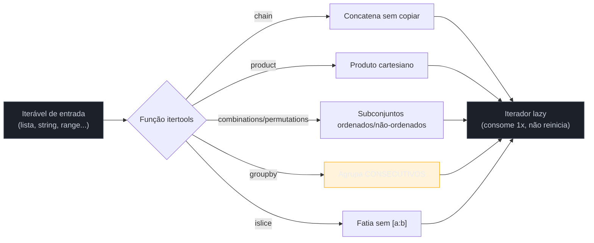

# itertools — os essenciais

> [!abstract] TL;DR
> `itertools` é o módulo padrão de "álgebra de iteração": funções que combinam, filtram e reorganizam iteráveis **sem materializar listas intermediárias** — tudo é lazy, exatamente como as generator expressions da nota anterior. `chain()` concatena iteráveis sem copiar; `product()` substitui loops aninhados por um produto cartesiano; `combinations()`/`permutations()` geram subconjuntos (ordem não importa vs. ordem importa); `islice()` fatia um iterador que não aceita `[a:b]`; `count()`/`cycle()`/`repeat()` são infinitos e exigem uma condição de parada explícita. E `groupby()` — a função mais mal-entendida do módulo — só agrupa corretamente elementos **consecutivos**, o que na prática significa que os dados precisam estar **pré-ordenados pela chave de agrupamento**, ou o resultado sai silenciosamente errado, sem exceção nenhuma.

## O bug que passa no code review

Uma tarefa comum: agrupar uma lista de pedidos por status, pra gerar um relatório.

```python
from itertools import groupby

pedidos = [
    {"id": 1, "status": "pago"},
    {"id": 2, "status": "pendente"},
    {"id": 3, "status": "pago"},
    {"id": 4, "status": "cancelado"},
    {"id": 5, "status": "pago"},
]

for status, grupo in groupby(pedidos, key=lambda p: p["status"]):
    print(status, [p["id"] for p in grupo])
```

Saída:

```text
pago [1]
pendente [2]
pago [3]
cancelado [4]
pago [5]
```

Três grupos separados de `"pago"`, cada um com um único pedido — quando a intenção óbvia era um grupo `"pago"` com `[1, 3, 5]`. Não houve exceção, não houve warning, o código "funcionou": rodou sem travar, produziu uma saída com a forma certa (uma lista de tuplas `(chave, grupo)`), e um code review apressado pode nem notar que o agrupamento está errado — porque **está** agrupando, só que agrupando errado.

O motivo é o contrato real de `groupby()`, que a documentação oficial descreve em uma frase fácil de pular: a função gera uma nova quebra de grupo **toda vez que a chave muda em relação ao elemento anterior**. Ela não olha a lista inteira procurando por elementos com a mesma chave — ela olha só o vizinho imediato. Se os dados não estiverem ordenados pela chave de agrupamento antes de chegar em `groupby()`, cada reaparição da mesma chave em uma posição não-consecutiva vira um grupo novo, isolado. É exatamente o comportamento do utilitário Unix `uniq`, que a própria documentação usa como analogia — e ninguém espera que `uniq` "agrupe" linhas repetidas que não estão adjacentes.

Esta nota resolve o bug de duas formas: entendendo por que `groupby()` funciona assim (não é um defeito, é a troca deliberada que permite ser O(n) e lazy), e estabelecendo o hábito de sempre `sorted(..., key=...)` antes de agrupar — a correção é uma linha, mas só se você souber que precisa dela.

## O que é

`itertools` é um módulo da biblioteca padrão (nenhuma instalação necessária) que oferece um conjunto de funções para criar **iteradores** — não listas, não geradores escritos à mão, mas os mesmos objetos lazy que uma generator expression produziria. A documentação oficial descreve o módulo como um "kit de ferramentas rápido e eficiente em memória", inspirado em construções de linguagens funcionais como Haskell e SML, mas reimplementado em Python puro/C para eficiência.

As funções cobertas nesta nota caem em três famílias:

1. **Combinatórias** — `chain()`, `product()`, `combinations()`, `permutations()`: pegam um ou mais iteráveis e produzem novas sequências de combinações deles.
2. **Agrupamento e fatiamento** — `groupby()`, `islice()`: reorganizam ou recortam um único iterável sem carregá-lo inteiro na memória.
3. **Infinitas** — `count()`, `cycle()`, `repeat()`: geram sequências sem fim, projetadas para serem combinadas com `zip()`, `map()` ou cortadas com `islice()`/`break`.

Quem vem de Java conhece `Stream` (`Stream.concat`, `IntStream.range` + combinações manuais) — `itertools` cobre um pedaço similar de terreno, mas como funções livres que operam sobre qualquer iterável, não como métodos encadeados numa interface de stream. Quem vem de JavaScript não tem equivalente direto na biblioteca padrão — bibliotecas como Lodash ou Ramda cobrem parte disso (`_.chunk`, `_.zip`), mas sem a garantia de laziness que `itertools` tem por construção.

## Por que importa

Sem `itertools`, os mesmos resultados são alcançáveis com loops aninhados manuais e listas intermediárias — mas a custo de memória e legibilidade. Um produto cartesiano de duas listas de 1000 elementos cada é 1 milhão de tuplas: gerar isso com `for`/`for` aninhado e uma lista acumuladora materializa 1 milhão de tuplas na memória de uma vez; `product()` gera uma de cada vez, sob demanda — se o consumidor final só precisa da primeira que bater uma condição (um `next(p for p in product(...) if condicao(p))`, por exemplo), o restante nunca chega a ser gerado. A mesma lógica vale para `chain()` (concatenar sem copiar) e para as infinitas (`count()`/`cycle()`/`repeat()`, que **não podem** ser materializadas — tentar `list(count())` trava o processo até estourar a memória).

Na prática de produção, o padrão mais comum não é "1 milhão de tuplas versus 1 milhão de tuplas em outra ordem" — é **evitar carregar um dataset inteiro na memória** quando só uma fração dele importa: `islice()` sobre um gerador que lê um arquivo linha a linha, ou `chain()` para tratar várias fontes de dados (um arquivo, depois outro, depois um resultado de query) como um único fluxo contínuo, sem primeiro concatenar tudo numa lista intermediária que pode nem caber na RAM.

Em entrevista técnica, reconhecer quando um loop aninhado é, na verdade, um `product()` ou uma chamada de `combinations()` disfarçada é um sinal de fluência — é o mesmo tipo de sinal que comprehensions dão para loops simples, só que um nível acima.

Há também uma analogia útil com SQL para quem vem de backend: `groupby()` é ao Python o que `GROUP BY` é ao SQL — com uma diferença crucial. O motor do banco de dados reordena os dados internamente antes de agrupar (ou usa um índice já ordenado), então `GROUP BY` sempre agrupa corretamente, não importa a ordem física das linhas na tabela. `itertools.groupby()` **não faz isso por você** — ela não é um `GROUP BY` completo, é só o mecanismo de "detectar fronteira de grupo em uma sequência que passa uma vez", e a responsabilidade de garantir que a sequência já chega ordenada é inteiramente de quem chama a função. É a mesma economia de esforço que torna `groupby()` O(n) em vez de O(n log n): ela não paga o custo de ordenar porque assume que alguém já pagou esse custo antes dela.

## Todos são lazy — a mesma ideia da nota anterior

A nota [[05 - Comprehensions — list, dict, set e generator expressions|05]] estabeleceu a diferença entre uma list comprehension (materializa tudo na memória, na hora) e uma generator expression (produz um item por vez, sob demanda). Toda função de `itertools` segue exatamente o modelo da generator expression: devolve um **iterador** — um objeto que só produz o próximo valor quando alguém chama `next()` nele (diretamente ou via `for`, `list()`, `sum()`, etc.).

```python
from itertools import chain

resultado = chain([1, 2], [3, 4])
print(resultado)
# <itertools.chain object at 0x...>  -- não é uma lista, é um ITERADOR

print(list(resultado))
# [1, 2, 3, 4]  -- só materializa quando você pede explicitamente

print(list(resultado))
# []  -- iterador já foi consumido; iteradores não "reiniciam"
```

Esse último ponto — um iterador consumido fica vazio para sempre, não existe "rebobinar" — vale para toda função de `itertools`, sem exceção, e é a mesma regra que já se aplica a generator expressions e a `map()`/`filter()`. Se um resultado de `itertools` precisa ser percorrido mais de uma vez, a solução é materializar (`list(...)`) uma vez e reutilizar a lista, não tentar reiterar o iterador original.



## `chain()` — concatenar sem copiar

```python
from itertools import chain

lista_a = [1, 2, 3]
lista_b = (4, 5, 6)
lista_c = "789"

for item in chain(lista_a, lista_b, lista_c):
    print(item, end=" ")
# 1 2 3 4 5 6 7 8 9
```

A alternativa óbvia, `lista_a + list(lista_b) + list(lista_c)`, cria uma lista nova, inteira, na memória — e só funciona se todos os operandos forem do mesmo tipo concatenável (misturar lista com tupla direto em `+` já dá `TypeError`). `chain()` aceita qualquer mistura de iteráveis e nunca copia nada: percorre o primeiro até esgotar, passa pro segundo, e assim por diante. Para juntar iteráveis vindos de uma coleção (uma lista de listas, por exemplo), existe a variante `chain.from_iterable(lista_de_iteraveis)`, que evita o `*` de desempacotamento quando o número de iteráveis não é conhecido de antemão:

```python
listas = [[1, 2], [3, 4], [5, 6]]

list(chain(*listas))               # funciona, mas desempacota tudo de uma vez
list(chain.from_iterable(listas))  # equivalente, mais idiomático para "iterável de iteráveis"
```

## `product()` — produto cartesiano em vez de loops aninhados

```python
from itertools import product

cores = ["P", "M", "G"]
tamanhos = ["azul", "vermelho"]

for combinacao in product(cores, tamanhos):
    print(combinacao)
# ('P', 'azul')
# ('P', 'vermelho')
# ('M', 'azul')
# ('M', 'vermelho')
# ('G', 'azul')
# ('G', 'vermelho')
```

É o resultado de um `for cor in cores: for tamanho in tamanhos: ...` — mas expresso como uma única chamada, sem aninhar níveis de indentação, e generalizável para qualquer número de iteráveis (`product(a, b, c, d)` substitui quatro `for`s aninhados). O parâmetro `repeat` multiplica o mesmo iterável contra si mesmo, útil para gerar todas as combinações de N dígitos binários, senhas de teste, coordenadas de um grid:

```python
list(product(range(2), repeat=3))
# [(0,0,0), (0,0,1), (0,1,0), (0,1,1), (1,0,0), (1,0,1), (1,1,0), (1,1,1)]
# -- as 8 combinações de 3 bits, sem escrever 3 for's aninhados
```

## `combinations()` vs `permutations()` — a diferença que confunde em entrevista

Ambas pegam um iterável e devolvem tuplas de tamanho `r` a partir dele, sem repetir o mesmo elemento de origem duas vezes dentro de uma mesma tupla. A diferença é **se a ordem dentro da tupla importa**:

```python
from itertools import combinations, permutations

letras = "ABC"

list(combinations(letras, 2))
# [('A', 'B'), ('A', 'C'), ('B', 'C')]
# -- ('B', 'A') NÃO aparece: é a mesma dupla que ('A', 'B'), ordem não importa

list(permutations(letras, 2))
# [('A', 'B'), ('A', 'C'), ('B', 'A'), ('B', 'C'), ('C', 'A'), ('C', 'B')]
# -- ('A', 'B') e ('B', 'A') são resultados DIFERENTES, ordem importa
```

> [!question]- Como lembrar qual é qual sem decorar?
> Pense em "escolher um comitê de 2 pessoas entre A, B, C" vs. "escolher quem senta na cadeira 1 e quem senta na cadeira 2". No comitê, `{A, B}` é o mesmo grupo que `{B, A}` — isso é `combinations`. Nas cadeiras, A-na-1-e-B-na-2 é um arranjo diferente de B-na-1-e-A-na-2 — isso é `permutations`. A contagem confirma: para `n=3, r=2`, `combinations` dá 3 resultados (3!/(2!·1!)) e `permutations` dá 6 (3!/1!) — o dobro, porque cada par de `combinations` "se desdobra" em 2 ordens possíveis.

Quando `r` não é passado para `permutations()`, o padrão é `r = len(iterável)` — todas as permutações completas. `combinations()` exige `r` explícito, sem padrão.

Existe uma terceira variante menos usada, `combinations_with_replacement()`, que permite repetir o mesmo elemento de origem (útil para "quantas formas de escolher 2 sabores de sorvete, podendo repetir o mesmo sabor duas vezes") — mencionada aqui porque aparece com frequência na mesma lista de resultados que as outras duas em buscas e discussões de entrevista.

```python
from itertools import combinations_with_replacement

list(combinations_with_replacement("AB", 2))
# [('A', 'A'), ('A', 'B'), ('B', 'B')]
# -- ('A', 'A') e ('B', 'B') são válidos aqui; em combinations() puro, não apareceriam
```

Uma tabela resume as quatro variantes combinatórias do módulo, todas operando sobre o mesmo iterável de entrada `n` elementos e um tamanho `r`:

| Função | Ordem importa? | Repete elemento de origem? | Contagem (n=3, r=2) |
|---|---|---|---|
| `combinations` | não | não | 3 |
| `combinations_with_replacement` | não | sim | 6 |
| `permutations` | sim | não | 6 |
| `product` (com `repeat=r`) | sim | sim | 9 |

A tabela também deixa visível por que `product(iteravel, repeat=r)` e `permutations(iteravel, r)` são frequentemente confundidos: ambos respeitam ordem, mas só `product` permite repetir o mesmo elemento na mesma posição (por isso `product` tem mais resultados — 9 contra 6 — para os mesmos `n` e `r`).

## `islice()` — fatiar um iterador que não aceita `[a:b]`

Slicing normal (`lista[2:5]`) só funciona em sequências que sabem seu próprio tamanho e suportam acesso por índice — `list`, `tuple`, `str`. Um generator ou um iterador de `itertools` não suporta:

```python
def numeros_pares():
    n = 0
    while True:
        yield n
        n += 2

gen = numeros_pares()
gen[2:5]
# TypeError: 'generator' object is not subscriptable
```

`islice()` resolve isso operando sobre qualquer iterável, incluindo os infinitos, sem exigir que ele "saiba" seu tamanho — porque, como `groupby()`, ela também é lazy e consome elemento a elemento:

```python
from itertools import islice

gen = numeros_pares()
list(islice(gen, 2, 5))
# [4, 6, 8]  -- terceiro, quarto e quinto valores gerados (índices 2, 3, 4)
```

Duas diferenças em relação a slicing de lista, ambas na documentação oficial: `islice()` não aceita índices **negativos** (não dá pra pedir "os últimos 3" de algo que ainda não terminou de ser gerado — o iterador não sabe onde é o fim até chegar lá), e ela **consome** o iterador original conforme avança — os elementos "pulados" no início não voltam.

## Iteradores infinitos: `count()`, `cycle()`, `repeat()` — e o aviso óbvio

As três funções desta seção nunca param sozinhas. Cada uma precisa de um consumidor que sabe quando parar — `islice()`, um `break` dentro do loop, ou `zip()` com um iterável finito (que trava o comprimento no menor dos dois lados).

```python
from itertools import count, cycle, repeat, islice

# count(start, step) -- contagem aritmética infinita
list(islice(count(10, 5), 4))
# [10, 15, 20, 25]

# cycle(iteravel) -- repete o iterável inteiro, indefinidamente
list(islice(cycle(["a", "b", "c"]), 7))
# ['a', 'b', 'c', 'a', 'b', 'c', 'a']

# repeat(objeto, times) -- repete o MESMO objeto (não precisa ser infinito)
list(repeat("x", 3))
# ['x', 'x', 'x']
```

> [!warning] `count()`, `cycle()` e `repeat()` sem limite travam o processo — não existe "Ctrl+C automático"
> ```python
> lista = list(count())        # trava — tentando materializar infinitos elementos
> lista = list(cycle([1, 2]))  # trava — o iterável interno é finito, o cycle não é
> ```
> Nenhuma das três funções tem proteção embutida contra uso incorreto: `list()`, `sum()`, ou qualquer operação que tente **consumir tudo** de um iterador infinito simplesmente não retorna — o processo fica ocupando CPU e memória crescente até ser morto manualmente ou estourar a RAM. A regra prática: toda vez que `count`, `cycle` ou `repeat` (sem `times`) aparecer em código, a próxima linha (ou a mesma expressão) precisa conter `islice(..., N)`, um `break` explícito dentro do `for`, ou (no caso de `zip`) a garantia de que o outro lado é finito. `repeat(objeto, times=N)` é a exceção segura — com `times` definido, ela já é finita por conta própria.

Um uso idiomático e seguro de `repeat()`: combinado com `map()`, para passar um argumento fixo repetidamente ao lado de um iterável que varia — `map(pow, range(10), repeat(2))` eleva cada número de `0` a `9` ao quadrado, sem escrever uma comprehension com `x**2` explícito. É o mesmo espírito de `zip()` com um dos lados curto, só que expressando a intenção "este valor é constante" de forma mais direta.

## `groupby()` — a armadilha em profundidade

Voltando ao bug de abertura: `groupby(iteravel, key=funcao)` percorre o iterável **uma vez**, da esquerda pra direita, e cada vez que o valor de `key(elemento)` muda em relação ao elemento anterior, fecha o grupo atual e abre um novo. Ela nunca olha pra frente, nunca reagrupa elementos que já ficaram para trás — e é exatamente esse design que permite que `groupby()` seja O(n) e não precise guardar o iterável inteiro na memória.

```python
from itertools import groupby

pedidos = [
    {"id": 1, "status": "pago"},
    {"id": 2, "status": "pendente"},
    {"id": 3, "status": "pago"},
    {"id": 4, "status": "cancelado"},
    {"id": 5, "status": "pago"},
]

# CORREÇÃO: ordenar pela MESMA chave usada no agrupamento, antes de agrupar
pedidos_ordenados = sorted(pedidos, key=lambda p: p["status"])

for status, grupo in groupby(pedidos_ordenados, key=lambda p: p["status"]):
    print(status, [p["id"] for p in grupo])
# cancelado [4]
# pago [1, 3, 5]
# pendente [2]
```

Com `sorted()` aplicando a mesma função-chave antes de `groupby()`, os três pedidos com `status="pago"` ficam adjacentes na sequência, e o agrupamento fecha certo. Note que a ordem dos grupos na saída também mudou — agora segue a ordem alfabética de `status` (efeito colateral do `sorted()`), não mais a ordem original dos pedidos. Se a ordem original dos grupos importar, é preciso um critério de ordenação que preserve isso (por exemplo, ordenar por "primeira ocorrência do status na lista original") — um detalhe que a correção ingênua de "só adicionar `sorted()`" às vezes esconde.

> [!warning] `groupby()` NUNCA valida se a entrada está ordenada — o erro é sempre silencioso
> Diferente de, por exemplo, tentar indexar fora dos limites de uma lista (`IndexError`) ou somar tipos incompatíveis (`TypeError`), usar `groupby()` sobre dados não-ordenados **não levanta exceção nenhuma**. O código roda do início ao fim, devolve uma sequência de grupos com a forma certa (tuplas `(chave, iterador_do_grupo)`), e só uma inspeção do *conteúdo* de cada grupo revela que a mesma chave apareceu fragmentada em vários grupos diferentes. É por isso que a própria documentação oficial do Python enfatiza a regra logo na primeira frase da descrição da função: "geralmente, o iterável precisa já estar ordenado pela mesma função de chave" — e por que testes automatizados que só checam "existe pelo menos um grupo com essa chave" (em vez de checar o conteúdo completo de cada grupo) não pegam essa classe de bug. Regra prática: toda chamada a `groupby()` que não vem logo depois de um `sorted(..., key=mesma_chave)` (ou de uma fonte de dados já garantidamente ordenada, como uma query SQL com `ORDER BY`) deve ser tratada como suspeita até prova em contrário.

Um segundo detalhe menos citado, mas relevante em produção: os "grupos" que `groupby()` produz são, eles mesmos, **iteradores lazy que compartilham o cursor do iterável original** — e ficam invalidados assim que o loop externo avança para o próximo grupo.

```python
grupos = list(groupby(pedidos_ordenados, key=lambda p: p["status"]))
# ARMADILHA: grupos já foi "consumido" internamente pelo groupby ao avançar
for status, grupo in grupos:
    print(status, list(grupo))
# cancelado []   -- grupo vazio! O groupby já andou pra frente antes do list() rodar
# pago []
# pendente []
```

Guardar o resultado de `groupby()` numa lista **antes** de consumir cada grupo quebra a garantia de que cada grupo é lido logo depois de aberto — quando o `for` externo já visitou todos os `(chave, grupo)` para montar a lista, os iteradores internos de cada grupo já foram avançados além do seu próprio conteúdo. A correção é sempre materializar o **conteúdo de cada grupo**, não a lista de grupos, dentro do mesmo laço que produz `groupby()`:

```python
resultado = {status: list(grupo) for status, grupo in groupby(pedidos_ordenados, key=lambda p: p["status"])}
# funciona -- list(grupo) roda ENQUANTO o groupby ainda está posicionado nesse grupo
```

## Combinando funções — um pipeline real

Um caso de uso que junta várias peças desta nota: dado um log de eventos (já ordenado por `usuario`), calcular quantos eventos consecutivos cada usuário disparou, e mostrar só os 3 primeiros grupos, para um preview:

```python
from itertools import groupby, islice

eventos = [
    {"usuario": "ana", "acao": "login"},
    {"usuario": "ana", "acao": "clique"},
    {"usuario": "bruno", "acao": "login"},
    {"usuario": "carla", "acao": "login"},
    {"usuario": "carla", "acao": "clique"},
    {"usuario": "carla", "acao": "logout"},
]
# já ordenado por "usuario" -- pré-condição do groupby

grupos = (
    (usuario, len(list(grupo)))
    for usuario, grupo in groupby(eventos, key=lambda e: e["usuario"])
)

for usuario, total in islice(grupos, 3):
    print(f"{usuario}: {total} evento(s)")
# ana: 2 evento(s)
# bruno: 1 evento(s)
# carla: 3 evento(s)
```

Aqui `groupby()` faz o agrupamento, uma generator expression transforma cada `(chave, grupo)` num `(chave, contagem)` sem materializar uma lista intermediária de tuplas, e `islice()` corta o resultado nos 3 primeiros sem que o pipeline precise processar mais do que isso — se o log tivesse 10 milhões de eventos, só a fatia necessária seria de fato percorrida além do agrupamento em si.

Note que o `groupby()` continua exigindo a pré-condição de ordenação — `eventos` já estava ordenado por `"usuario"` de propósito no exemplo. Em um cenário real, a ordenação viria de uma query com `ORDER BY usuario` no banco (deixando o SGBD fazer o trabalho, que ele já faz de forma otimizada com índice), ou de um `sorted(eventos, key=lambda e: e["usuario"])` explícito logo antes do `groupby()`, nunca "por acaso" — depender da ordem em que os dados chegaram sem garantir isso explicitamente é a própria armadilha revisitada.

### Quando `itertools` não é suficiente: `more-itertools`

A biblioteca padrão para de propósito antes de cobrir tudo — a documentação oficial do módulo é explícita sobre isso, e mantém uma seção de "recipes" (receitas) com implementações de referência para operações comuns que não viraram função embutida: `sliding_window()` (janela deslizante), `chunked()` (dividir um iterável em blocos de tamanho fixo), `unique_justseen()` (remover duplicatas consecutivas, o `uniq` de verdade), `roundrobin()` (intercalar múltiplos iteráveis). O pacote de terceiros `more-itertools` (instalável via `pip install more-itertools`) implementa essas receitas e dezenas de outras, prontas para uso — vale conhecer a existência dele antes de reescrever manualmente algo que provavelmente já existe lá.

## Armadilhas

### (1) `groupby()` sem `sorted()` prévio pela mesma chave

Já coberta em profundidade acima — é a armadilha #1 do módulo, e a única desta nota com um `[!warning]` dedicado além do próprio texto.

### (2) Reutilizar um iterador de `itertools` já consumido

```python
c = chain([1, 2], [3, 4])
list(c)   # [1, 2, 3, 4]
list(c)   # [] -- já foi consumido, não "reinicia"
```

Vale para toda função desta nota — se o resultado precisa ser percorrido mais de uma vez, materialize com `list(...)` e reutilize a lista.

### (3) Materializar um iterador infinito sem `islice`/limite

Coberta no `[!warning]` de `count`/`cycle`/`repeat` — `list(count())` trava o processo.

### (4) Confundir `combinations` com `permutations`

Coberta na seção dedicada — a pergunta a fazer é "a ordem dentro do resultado importa para o problema?".

### (5) Guardar `groupby()` numa lista antes de consumir cada grupo

Coberta na seção de `groupby()` — os iteradores internos de cada grupo invalidam quando o loop externo avança.

## Em entrevista

Perguntas previsíveis sobre este tópico:

- **"O que `itertools.groupby()` exige da entrada, e o que acontece se essa condição não for atendida?"** Exige que o iterável já esteja ordenado (ou pelo menos agrupado consecutivamente) pela mesma chave passada em `key=`. Se não estiver, `groupby()` não levanta exceção — ela silenciosamente fragmenta a mesma chave em múltiplos grupos separados, sempre que a chave "reaparece" depois de ter sido interrompida por um valor diferente. A correção é `sorted(iteravel, key=mesma_funcao)` antes de agrupar.
- **"Qual a diferença entre `itertools.combinations()` e `itertools.permutations()`?"** Ambas geram tuplas de tamanho `r` sem repetir elementos de origem dentro da mesma tupla; a diferença é que `combinations` trata `(A, B)` e `(B, A)` como o mesmo resultado (ordem não importa — "escolher um grupo"), enquanto `permutations` trata como resultados diferentes (ordem importa — "escolher uma sequência/arranjo"). Para os mesmos `n` e `r`, `permutations` sempre produz mais (ou igual) resultados que `combinations`.
- **"Por que usar `itertools.chain()` em vez de `lista1 + lista2`?"** `chain()` não copia os dados — percorre um iterável até esgotar e passa pro próximo, sem alocar uma estrutura nova pra guardar tudo concatenado; além disso, aceita misturar tipos de iterável diferentes (lista, tupla, gerador, string) numa única chamada, o que `+` não permite entre tipos incompatíveis.
- **"Como fatiar um generator, já que `gen[2:5]` não funciona?"** Com `itertools.islice(gen, 2, 5)`, que replica a semântica de `start:stop:step` operando elemento a elemento sobre qualquer iterável — inclusive um infinito — sem exigir que ele suporte indexação. A limitação é não aceitar índices negativos, porque um iterador não sabe onde termina até efetivamente chegar lá.
- **"Por que `count()`, `cycle()` e `repeat()` (sem `times`) são perigosos, e como usá-los com segurança?"** As três geram sequências sem fim; consumi-las inteiras (com `list()`, `sum()`, um `for` sem `break`) trava o processo. O uso seguro sempre combina uma delas com algo que limita o consumo: `islice(..., N)`, uma condição de parada explícita dentro do loop, ou `zip()` com um iterável finito.
- **"Todas as funções de `itertools` retornam listas?"** Não — todas retornam **iteradores** lazy, consistente com o comportamento de generator expressions: nada é computado até ser efetivamente consumido (por `for`, `list()`, `next()`, etc.), e um iterador já percorrido não "reinicia" numa segunda passagem.

### How to explain in English

> The `itertools` module is Python's standard-library toolkit for combinatorial and lazy iteration — every function returns an **iterator**, not a list, matching the same laziness contract as generator expressions: nothing is computed until something actually consumes it, and a fully-consumed iterator cannot be replayed. `chain(*iterables)` concatenates iterables without copying — it walks each one to exhaustion, then moves to the next, and accepts mixed iterable types that `+` would reject. `product(*iterables, repeat=1)` produces the Cartesian product, replacing nested `for` loops with a single expression. `combinations(iterable, r)` and `permutations(iterable, r)` both generate length-`r` tuples with no repeated source elements, but differ in whether order matters: `combinations` treats `(A, B)` and `(B, A)` as the same result (a "committee" — unordered selection), while `permutations` treats them as distinct (a "seating arrangement" — ordered selection); for the same `n` and `r`, permutations always yields at least as many results as combinations. `islice(iterable, start, stop, step)` slices any iterable — including infinite or already-consumed-once ones — the way `[start:stop:step]` slices a list, except it doesn't support negative indices, since an iterator has no way of knowing where it ends until it gets there. `count()`, `cycle()`, and `repeat()` (without a `times` argument) are **infinite** iterators — they never stop on their own, and materializing one with `list()` or an unguarded loop will hang the process; they must always be paired with `islice`, an explicit `break`, or a `zip()` against a finite iterable. The single most common bug in the module is calling `groupby(iterable, key=...)` on data that isn't sorted by that same key: `groupby` only detects a new group when the key **changes relative to the immediately preceding element** — it never looks ahead — so unsorted input silently fragments the same key into multiple separate groups instead of raising an error. The fix is always `sorted(iterable, key=same_key_function)` immediately before grouping.

| Termo PT | Termo EN |
|---|---|
| iterador (lazy) | (lazy) iterator |
| produto cartesiano | Cartesian product |
| combinação (sem ordem) | combination (unordered) |
| permutação (com ordem) | permutation (ordered) |
| agrupar por chave | to group by key |
| chave de agrupamento | grouping key |
| dados pré-ordenados | pre-sorted data |
| iterador infinito | infinite iterator |
| fatiar (um iterador) | to slice (an iterator) |
| consumir (um iterador) | to consume (an iterator) |
| concatenar sem copiar | to concatenate without copying |

## O que vem a seguir

`itertools` cobre iteração combinatória e lazy sobre iteráveis genéricos — o próximo passo é olhar para o módulo irmão que oferece **estruturas de dados especializadas**, cada uma automatizando um padrão que, sem elas, exigiria código manual repetitivo: contar frequências (`Counter`), evitar `KeyError`/`.setdefault()` (`defaultdict`), manter uma fila O(1) nas duas pontas (`deque`), e criar registros leves nomeados (`namedtuple`, que já apareceu de relance na nota [[02 - Tuplas e desempacotamento|02]]). É a [[07 - O módulo collections — Counter, defaultdict, deque, namedtuple|nota 07]].

## Veja também

- [[05 - Comprehensions — list, dict, set e generator expressions|05 — Comprehensions]] — a mesma laziness de generator expressions, base conceitual desta nota
- [[03-Dominios/Tecnologia/Python/Funcional e idiomas avançados/index|Funcional e idiomas avançados]] — Galho 4, onde iteradores/geradores são explicados "por baixo do capô" (protocolo `__iter__`/`__next__`)
- [[07 - O módulo collections — Counter, defaultdict, deque, namedtuple|07 — O módulo collections]] — próxima nota
- [[03-Dominios/Tecnologia/Python/Collections e Comprehensions/index|Collections e Comprehensions]] — MOC do galho
- [[03-Dominios/Tecnologia/Python/index|Trilha Python]]

## Fontes

- Python Software Foundation. *itertools — Functions creating iterators for efficient looping*. docs.python.org, versão 3.14. https://docs.python.org/3/library/itertools.html (acessado em 2026-07-09)
- Python Software Foundation. *Itertools Recipes*. docs.python.org, versão 3.14. https://docs.python.org/3/library/itertools.html#itertools-recipes (acessado em 2026-07-09)
- Real Python. *Python itertools By Example*. https://realpython.com/python-itertools/ (acessado em 2026-07-09)
- Real Python. *Python's itertools: A Complete Guide to Iterator Building Blocks*. https://realpython.com/python-itertools/ (acessado em 2026-07-09)
- Python Software Foundation. *Glossary — iterator*. docs.python.org. https://docs.python.org/3/glossary.html#term-iterator (acessado em 2026-07-09)
- Ramalho, L. *Fluent Python*, 2ª ed. — Capítulo sobre iteráveis, iteradores e geradores, incluindo uso de `itertools` como building blocks. O'Reilly Media.
- more-itertools (PyPI). *Extensions to the itertools module* — pacote de terceiros que implementa recipes adicionais além dos cobertos pela stdlib. https://pypi.org/project/more-itertools/ (acessado em 2026-07-09)
