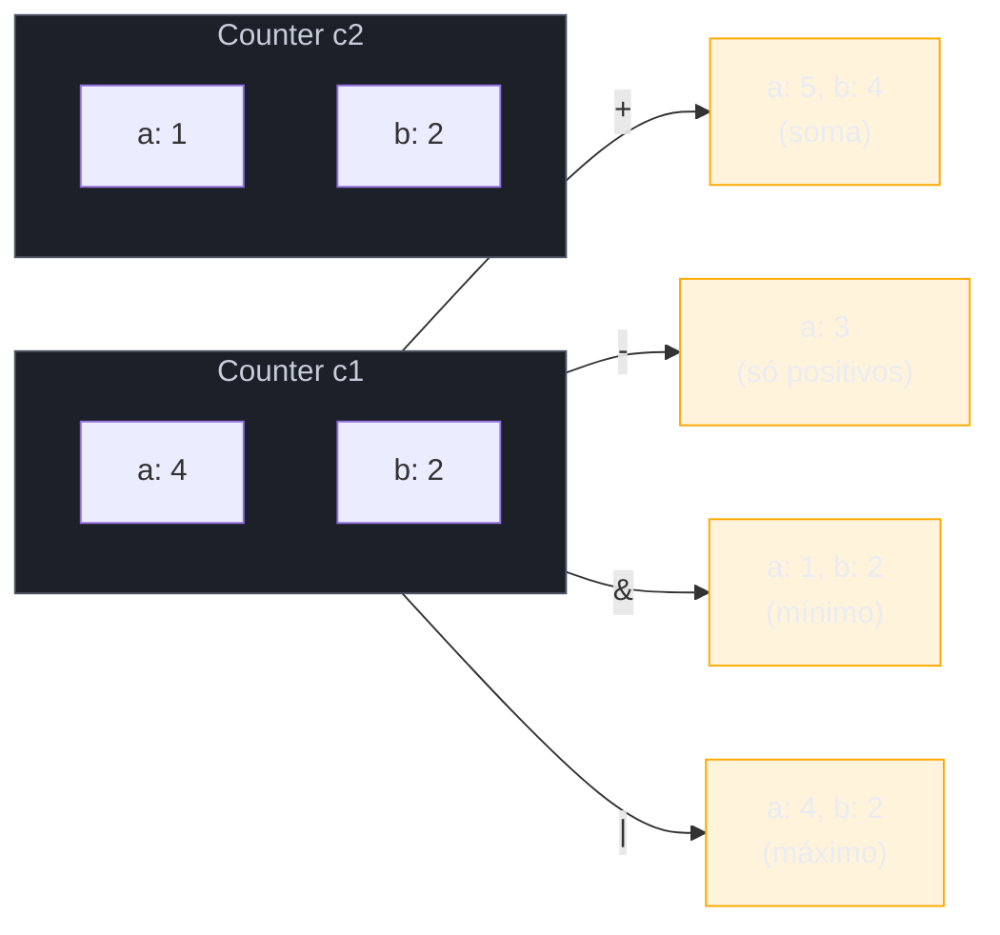
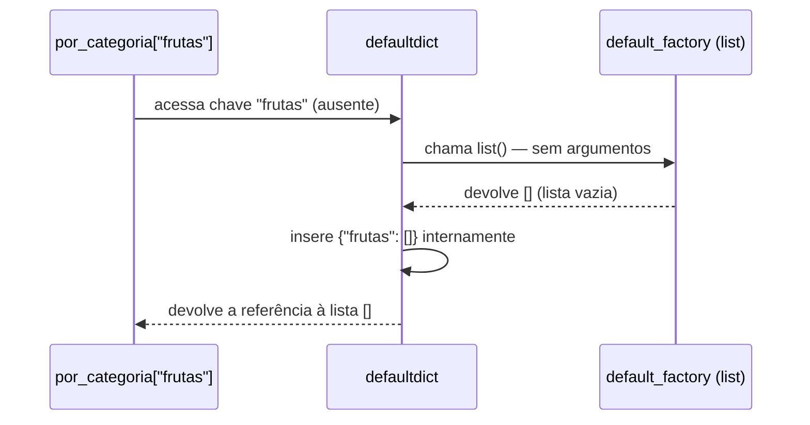

# O módulo collections — Counter, defaultdict, deque, namedtuple

> [!abstract] TL;DR
> O módulo `collections` da stdlib oferece quatro estruturas especializadas que resolvem, de forma direta e otimizada, padrões que list/dict/set puros só resolvem com código manual repetitivo. **`Counter`** é um `dict` subclasse feito pra contar — `Counter(iteravel)` conta de uma vez, `.most_common(n)` devolve os `n` mais frequentes já ordenados, e Counters suportam aritmética (`+`, `-`, `&`, `|`) entre si. **`defaultdict`** elimina o `if chave not in d: d[chave] = valor_inicial` (e o `.setdefault()` visto na nota 03) fornecendo uma *factory function* que roda automaticamente na primeira vez que uma chave ausente é acessada. **`deque`** ("deck", *double-ended queue*) é uma lista dupla-terminada com `.append()`/`.appendleft()`/`.pop()`/`.popleft()` em O(1) nas duas pontas — contra o O(n) de `list.insert(0, x)` — e ganha superpoderes com `maxlen` (buffer circular automático) e `.rotate()`. **`namedtuple`** cria classes de tupla imutáveis com campos nomeados (`p.x` em vez de `p[0]`), leves e 100% compatíveis com tupla comum — ponte direta pro `dataclass`, que cobre o mesmo problema com mais recursos (mutabilidade opcional, métodos, herança) ao custo de mais peso; `namedtuple` ainda vence quando o requisito é leveza extrema, imutabilidade real ou compatibilidade com código que já espera uma tupla.

## O código que devolveu a mesma reunião de bug três vezes

Um script de análise de logs de acesso precisa responder três perguntas: quais são as URLs mais acessadas, quantos acessos cada usuário teve, e — quando o time de segurança pediu — uma janela deslizante das últimas 100 requisições pra detectar picos suspeitos. A primeira versão, escrita sem conhecer o módulo `collections`, ficou assim:

```python
logs = [
    {"url": "/home", "usuario": "ana"},
    {"url": "/produtos", "usuario": "beto"},
    {"url": "/home", "usuario": "ana"},
    {"url": "/home", "usuario": "carla"},
    {"url": "/produtos", "usuario": "ana"},
    # ... milhares de entradas
]

# Pergunta 1: contagem de acessos por URL
contagem_url = {}
for entrada in logs:
    url = entrada["url"]
    if url not in contagem_url:
        contagem_url[url] = 0
    contagem_url[url] += 1

# Pergunta 2: quais URLs cada usuário visitou (agrupamento)
urls_por_usuario = {}
for entrada in logs:
    usuario = entrada["usuario"]
    if usuario not in urls_por_usuario:
        urls_por_usuario[usuario] = []
    urls_por_usuario[usuario].append(entrada["url"])

# Pergunta 3: top 3 URLs mais acessadas — ordenar manualmente
top_3 = sorted(contagem_url.items(), key=lambda item: item[1], reverse=True)[:3]

# Pergunta 4: janela das últimas 100 requisições
ultimas_100 = []
for entrada in logs:
    ultimas_100.append(entrada)
    if len(ultimas_100) > 100:
        ultimas_100.pop(0)   # O(n) a cada chamada — desliza a janela inteira na memória
```

O código funciona. Ele também é o tipo de código que um revisor experiente aponta em cada uma das quatro perguntas: o `if url not in contagem_url` é o padrão manual que a nota 03 já batizou de "duas buscas onde uma bastaria" (o mesmo problema que `.setdefault()` resolve pela metade); o agrupamento em `urls_por_usuario` repete a mesma estrutura; o `sorted()` pra achar o top-3 é reinventar uma roda que já vem pronta; e o `ultimas_100.pop(0)` é silenciosamente **O(n)** a cada chamada — em produção, com um fluxo de milhares de requisições por segundo, essa única linha vira o gargalo de CPU sem que ninguém entenda por quê, porque `pop(0)` "parece" tão barato quanto `append()`.

Cada uma dessas quatro perguntas tem uma resposta pronta no módulo `collections` — e é exatamente o assunto desta nota: `Counter` pra contagem e top-N, `defaultdict` pra agrupamento, `deque` pra janela deslizante O(1), e `namedtuple` pra quando os dicionários de log ganharem forma fixa o suficiente pra virar registro nomeado.

## O que é o módulo `collections`

`collections` é um módulo da biblioteca padrão que implementa **contêineres especializados** — alternativas a `dict`, `list`, `set` e `tuple` que já resolvem, internamente e de forma otimizada (em C, no caso do CPython), um padrão de uso específico. A documentação oficial lista sete tipos no total; esta nota cobre os quatro de uso mais frequente no dia a dia — `Counter`, `defaultdict`, `deque`, `namedtuple` — deixando `OrderedDict` (hoje quase redundante, já que `dict` mantém ordem de inserção desde 3.7) e `ChainMap`/`UserDict`/`UserList`/`UserString` fora do escopo por serem consultados sob demanda.

```python
from collections import Counter, defaultdict, deque, namedtuple
```

A ideia comum às quatro é: **em vez de reimplementar o padrão com `dict`/`list` puros toda vez, importe a estrutura que já o resolve** — com uma API mais expressiva e, na maioria dos casos, também mais rápida, porque a lógica repetitiva roda em C dentro do próprio tipo, não em um loop Python interpretado.

## `Counter` — contagem que já vem pronta

### O padrão manual que `Counter` substitui

Contar ocorrências é um dos loops mais escritos em qualquer linguagem. O padrão manual — visto na abertura desta nota — é sempre a mesma forma:

```python
palavras = "o rato roeu a roupa do rei de roma".split()

contagem = {}
for palavra in palavras:
    if palavra not in contagem:
        contagem[palavra] = 0
    contagem[palavra] += 1

print(contagem)
# {'o': 1, 'rato': 1, 'roeu': 1, 'a': 1, 'roupa': 1, 'do': 1, 'rei': 1, 'de': 1, 'roma': 1}
```

`Counter` substitui o loop inteiro por uma chamada:

```python
from collections import Counter

palavras = "o rato roeu a roupa do rei de roma".split()
contagem = Counter(palavras)
print(contagem)
# Counter({'o': 1, 'rato': 1, 'roeu': 1, 'a': 1, 'roupa': 1, 'do': 1, 'rei': 1, 'de': 1, 'roma': 1})
```

`Counter` é uma **subclasse de `dict`** — tudo que `dict` faz (`in`, indexação, `.items()`, `len()`) continua funcionando em um Counter. A diferença é o comportamento em três pontos: construção (aceita qualquer iterável e já conta), acesso a chave ausente (devolve `0` em vez de levantar `KeyError`), e um punhado de métodos extras que fazem sentido especificamente pra contagem.

```python
c = Counter("abracadabra")
print(c)              # Counter({'a': 5, 'b': 2, 'r': 2, 'c': 1, 'd': 1})
print(c["a"])          # 5
print(c["z"])           # 0 — chave ausente devolve 0, NUNCA levanta KeyError
print("z" in c)          # False — o acesso não criou a chave "z" no Counter
```

> [!warning] `c["chave_ausente"]` devolve `0`, mas não cria a chave
> Diferente de `defaultdict` (próxima seção), consultar uma chave ausente em um `Counter` devolve `0` sem inserir essa chave no dicionário interno. `"z" in c` continua `False` depois do acesso acima. Essa é uma decisão de design deliberada — faz sentido para contagem (uma palavra que nunca apareceu tem frequência zero, e não precisa "existir" na estrutura), mas surpreende quem espera o comportamento de `defaultdict`.

### `most_common()` — o top-N que ninguém precisa reimplementar

O método mais usado depois da própria contagem é `.most_common(n)`, que devolve uma lista de tuplas `(elemento, contagem)` ordenada da mais frequente pra menos frequente:

```python
palavras = "o rato roeu a roupa do rei de roma o rato o rato".split()
contagem = Counter(palavras)

print(contagem.most_common())     # todos, ordenados — sem argumento
print(contagem.most_common(3))    # só os 3 mais frequentes
# [('rato', 3), ('o', 3), ('roeu', 1)]
```

Se `n` for omitido, `.most_common()` devolve **todos** os elementos ordenados por frequência — não só um subconjunto. Elementos com contagens empatadas aparecem na ordem em que foram encontrados pela primeira vez (Real Python confirma esse comportamento de desempate). Esse é o método que resolve de uma vez a "Pergunta 3" (top-3 URLs) do exemplo de abertura, sem precisar de `sorted()` manual com `key=lambda`.

### Aritmética entre Counters

Um Counter não é só um dicionário de contagem — ele suporta operações aritméticas com outro Counter, o que o torna útil pra comparar dois conjuntos de dados (dois arquivos de log, dois textos, dois inventários):

```python
c1 = Counter(a=4, b=2, c=0, d=-2)
c2 = Counter(a=1, b=2, c=3, d=4)

print(c1 + c2)   # Counter({'a': 5, 'b': 4, 'c': 3, 'd': 2})  — soma as contagens
print(c1 - c2)   # Counter({'a': 3})  — mantém só contagens positivas
print(c1 & c2)   # Counter({'a': 1, 'b': 2})  — interseção: min(c1[x], c2[x])
print(c1 | c2)   # Counter({'a': 4, 'c': 3, 'd': 4, 'b': 2})  — união: max(c1[x], c2[x])
```

`+` soma as contagens de ambos os lados; `-` subtrai, mas — igual a `.most_common()` — **descarta contagens zero ou negativas do resultado**, então `c1 - c2` só mostra as chaves onde `c1` tinha estritamente mais que `c2`. `&` (interseção) mantém o **mínimo** entre as duas contagens por chave; `|` (união) mantém o **máximo**. Essas quatro operações vêm direto da documentação oficial e são exatamente o vocabulário de teoria de conjuntos aplicado a multiconjuntos (*multisets*) — um Counter é, conceitualmente, um multiconjunto: um conjunto onde cada elemento pode aparecer mais de uma vez, e a contagem é justamente "quantas vezes".



`.update()` e `.subtract()` são as versões *in-place* de `+` e `-` — úteis pra ir acumulando contagem ao longo de várias fontes sem criar um novo Counter a cada passo:

```python
inventario = Counter()
inventario.update(["maçã", "banana", "maçã"])
inventario.update(["maçã", "uva"])
print(inventario)   # Counter({'maçã': 3, 'banana': 1, 'uva': 1})

inventario.subtract(["maçã"])
print(inventario)   # Counter({'maçã': 2, 'banana': 1, 'uva': 1}) — subtrai, PERMITE negativo
```

> [!warning] `.subtract()` permite contagem negativa; `-` entre dois Counters não
> Essa é uma assimetria real da API, confirmada pela documentação: o operador `-` entre dois Counters descarta o resultado se ele não for estritamente positivo. Já `.update()`/`.subtract()`, por serem operações *in-place* que mutam o próprio Counter, não fazem essa filtragem — uma contagem pode ficar negativa depois de `.subtract()`. Se o código depois assume "toda contagem é ≥ 0", esse é um ponto de bug real quando `.subtract()` é usado sem cuidado.

> [!question]- "Por que usar `Counter` em vez de `defaultdict(int)` pra contar?"
> Funciona — `defaultdict(int)` seguido de `d[chave] += 1` é o padrão manual mais próximo de `Counter`. Mas `Counter` já vem com `.most_common()`, aritmética entre contadores, e o construtor que conta um iterável inteiro numa chamada (`Counter(lista)` em vez de um loop). Ambos existem: `defaultdict(int)` é a ferramenta genérica; `Counter` é a especializada pra esse caso de uso específico. Se o problema é "contar", `Counter` é sempre a primeira escolha — é o que a própria documentação recomenda.

## `defaultdict` — a fábrica que resolve chave ausente antes de você perguntar

### O padrão que `defaultdict` automatiza

A nota 03 já mostrou `.setdefault()` como alternativa a duas buscas manuais no dicionário — mas mesmo `.setdefault()` exige repetir a chamada em todo ponto de escrita:

```python
por_categoria = {}
produtos = [("frutas", "maçã"), ("frutas", "banana"), ("legumes", "cenoura")]

for categoria, nome in produtos:
    por_categoria.setdefault(categoria, []).append(nome)
```

`defaultdict` move essa decisão pra dentro da própria estrutura: você declara, na criação, **o que fazer quando uma chave ausente é acessada** — e nunca mais precisa pensar nisso em cada ponto de uso:

```python
from collections import defaultdict

por_categoria = defaultdict(list)   # list() roda automaticamente pra chave ausente
produtos = [("frutas", "maçã"), ("frutas", "banana"), ("legumes", "cenoura")]

for categoria, nome in produtos:
    por_categoria[categoria].append(nome)   # sem .setdefault(), sem if

print(por_categoria)
# defaultdict(<class 'list'>, {'frutas': ['maçã', 'banana'], 'legumes': ['cenoura']})
print(dict(por_categoria))   # converte pra dict comum, se precisar exibir sem o rótulo defaultdict
```

O argumento passado a `defaultdict()` — chamado `default_factory` — é qualquer **callable sem argumentos**: uma função, um construtor de tipo, ou uma `lambda`. Ele é chamado automaticamente sempre que uma chave ausente é acessada (não só atribuída), e o valor devolvido já é inserido na estrutura antes de a expressão terminar de ser avaliada.



### As três factories mais comuns

| `default_factory` | Comportamento na chave ausente | Uso típico |
|---|---|---|
| `list` | Insere `[]` | Agrupamento — `d[chave].append(item)` |
| `int` | Insere `0` | Contagem manual — `d[chave] += 1` (quando `Counter` não se aplica, ex.: contagem multidimensional) |
| `set` | Insere `set()` | Agrupamento sem duplicatas — `d[chave].add(item)` |
| `lambda: valor_padrão` | Insere o valor de `valor_padrão` | Qualquer valor inicial customizado, inclusive um dicionário aninhado |

```python
# defaultdict(int) — contagem manual (quando o dado não é um Counter direto)
contagem_por_letra_e_posicao = defaultdict(int)
for i, letra in enumerate("banana"):
    contagem_por_letra_e_posicao[(letra, i % 2)] += 1

# defaultdict(set) — agrupamento sem duplicatas
tags_por_usuario = defaultdict(set)
tags_por_usuario["ana"].add("python")
tags_por_usuario["ana"].add("python")   # não duplica — é um set
print(tags_por_usuario["ana"])           # {'python'}

# defaultdict aninhado — um truque comum pra estruturas de 2+ níveis
matriz_esparsa = defaultdict(lambda: defaultdict(int))
matriz_esparsa[3][7] += 1   # cria a linha 3 e a coluna 7, ambas sob demanda
print(matriz_esparsa[3][7])   # 1
print(matriz_esparsa[0][0])    # 0 — cria a linha 0 e a coluna 0 só de consultar
```

O `defaultdict` aninhado (`defaultdict(lambda: defaultdict(int))`) é um idioma real e citado com frequência pra representar matrizes esparsas ou contagem de duas dimensões sem alocar a matriz inteira antecipadamente — cada célula só passa a existir quando é efetivamente tocada.

> [!warning] Todo acesso de leitura em `defaultdict` cria a chave — inclusive `in` bem-intencionado
> ```python
> d = defaultdict(list)
> if d["chave_que_nao_existe"]:   # avalia False (lista vazia) — mas JÁ CRIOU a chave
>     print("tem valor")
> print(d)   # defaultdict(<class 'list'>, {'chave_que_nao_existe': []})
> ```
> Diferente de `Counter` (onde `c["z"]` devolve `0` sem criar `"z"`), acessar uma chave ausente em `defaultdict` **sempre** dispara a factory e insere o resultado — mesmo que a intenção fosse só checar se a chave existe. Se o objetivo é checagem sem efeito colateral, use `"chave" in d` (que não dispara a factory) ou `d.get("chave")`, nunca `d["chave"]` isolado numa condição. Esse comportamento é documentado, mas pega até quem já usa `defaultdict` há tempos.

### `defaultdict` vs `.setdefault()` — quando cada um vence

| | `dict.setdefault(k, v)` | `defaultdict(factory)` |
|---|---|---|
| Onde a decisão mora | Repetida em cada ponto de escrita | Uma vez, na criação da estrutura |
| Custo do valor padrão | `v` é sempre avaliado antes da chamada (mesmo se a chave já existir) | Factory só roda se a chave realmente estiver ausente |
| Tipo resultante | `dict` comum | `defaultdict` (subclasse de `dict`; converta com `dict(d)` se precisar do tipo puro) |
| Melhor quando | Uso pontual, uma ou duas linhas, sem precisar do tipo especializado depois | Padrão repetido no mesmo dicionário — agrupamento, matrizes esparsas, contagem multidimensional |

A diferença de custo do valor padrão é sutil mas real: `d.setdefault(k, calcular_padrao())` sempre executa `calcular_padrao()`, mesmo quando `k` já existe — porque Python avalia os argumentos antes de chamar a função. `defaultdict` só invoca a factory quando a chave está de fato ausente, o que importa se o valor padrão for caro de construir.

## `deque` — fila dupla-terminada O(1)

### O gargalo que uma lista esconde bem

`list` é excelente pra crescer/encolher **no final** — `.append()` e `.pop()` (sem argumento) são O(1) amortizado, porque a lista já reserva espaço extra no final (over-allocation, como a nota 02 já explicou pra tuplas vs listas). O problema aparece quando o crescimento é **no início**:

```python
fila = []
fila.append("primeiro")
fila.insert(0, "novo_primeiro")   # O(n) — desloca TODOS os elementos existentes uma posição
```

`list.insert(0, x)` precisa deslocar cada elemento existente uma posição pra frente, porque uma lista Python é implementada como um array contíguo — inserir no início não é "gratuito" como inserir no final. Com 10 elementos isso é imperceptível; com 100 mil elementos processados por segundo — o cenário de fila de mensagens ou log de eventos — vira o gargalo real de CPU, e o pior é que o código *parece* correto e barato de se ler.

`collections.deque` (de *double-ended queue*, pronunciado "deck") resolve isso sendo implementado como uma **lista duplamente encadeada de blocos** por baixo, em vez de um array contíguo único — o que torna operações nas duas pontas O(1), ao custo de indexação no meio deixar de ser O(1) (vira O(n), já que não há acesso aleatório direto como em um array).

```python
from collections import deque

fila = deque()
fila.append("primeiro")        # O(1) — igual list.append()
fila.appendleft("novo_primeiro")  # O(1) — NÃO existe equivalente eficiente em list
print(fila)   # deque(['novo_primeiro', 'primeiro'])

fila.pop()        # O(1) — remove e devolve do final
fila.popleft()     # O(1) — remove e devolve do início
```

A comparação de desempenho é dramática, não sutil: benchmarks públicos mostram `deque.appendleft()` e `deque.popleft()` ordens de grandeza mais rápidos que `list.insert(0, x)` e `list.pop(0)` à medida que a lista cresce — a diferença chega à casa de dezenas de milhares de vezes em listas grandes, exatamente porque uma é O(1) e a outra é O(n).

| Operação | `list` | `deque` |
|---|---|---|
| `.append(x)` (fim) | O(1) amortizado | O(1) |
| `.pop()` (fim) | O(1) | O(1) |
| `insert(0, x)` / `.appendleft(x)` (início) | O(n) | O(1) |
| `.pop(0)` / `.popleft()` (início) | O(n) | O(1) |
| Acesso por índice `d[i]` no meio | O(1) | O(n) |
| Uso típico | Pilha (stack), acesso aleatório | Fila (queue), fila dupla, sliding window |

> [!warning] `deque` troca acesso aleatório rápido por operações de ponta rápidas
> `deque[500]` funciona, mas percorre a estrutura internamente — é O(n), não O(1) como em `list`. Se o programa precisa de acesso aleatório frequente por índice (`d[i]` no meio, fatiamento arbitrário), `list` continua sendo a estrutura certa. `deque` é a escolha certa quando o padrão de acesso é **sempre nas pontas** — é uma troca deliberada de característica, não um "deque é sempre melhor que list".

### `maxlen` — buffer circular sem código extra

O parâmetro `maxlen`, passado na criação, transforma um `deque` em um **buffer de tamanho fixo**: ao atingir a capacidade, cada novo item inserido em uma ponta descarta automaticamente um item da ponta oposta.

```python
ultimas_5_requisicoes = deque(maxlen=5)

for i in range(8):
    ultimas_5_requisicoes.append(f"req-{i}")

print(ultimas_5_requisicoes)
# deque(['req-3', 'req-4', 'req-5', 'req-6', 'req-7'], maxlen=5)
```

Isso resolve de forma direta a "Pergunta 4" do exemplo de abertura — a janela deslizante das últimas 100 requisições — sem o `if len(...) > 100: pop(0)` manual, e sem o custo O(n) daquele `.pop(0)`:

```python
ultimas_100 = deque(maxlen=100)

for entrada in logs:
    ultimas_100.append(entrada)   # O(1); ao passar de 100, descarta a mais antiga sozinho
```

`maxlen` é frequentemente citado como o caso de uso canônico de `deque` em produção: histórico limitado de comandos, buffer de eventos recentes pra monitoramento, cache de "últimos N visualizados", janela deslizante em algoritmos de streaming. A documentação oficial descreve exatamente esse padrão como motivação de design do parâmetro.

### `.rotate()` — deslocamento circular

`.rotate(n)` desloca todos os elementos `n` posições — positivo gira pra direita (elementos do final "voltam" pro início), negativo gira pra esquerda:

```python
d = deque([1, 2, 3, 4, 5])
d.rotate(2)
print(d)   # deque([4, 5, 1, 2, 3]) — os 2 últimos foram pro início

d.rotate(-1)
print(d)   # deque([5, 1, 2, 3, 4]) — o primeiro foi pro final
```

`.rotate()` é O(k) no tamanho do deslocamento (não no tamanho total do deque), o que o torna a ferramenta certa pra qualquer algoritmo que precise "girar" uma sequência sem reconstruir a estrutura inteira manualmente — um caso de uso citado é deslizar uma janela de dados sem popular e re-popular elemento por elemento.

> [!question]- "`deque` é thread-safe?"
> As operações de ponta (`.append()`, `.appendleft()`, `.pop()`, `.popleft()`) são atômicas em relação ao GIL do CPython — seguras para o padrão produtor/consumidor entre threads sem lock explícito para essas operações específicas. Isso não torna `deque` uma estrutura de sincronização de propósito geral: operações compostas (checar e depois modificar) ainda precisam de lock. Para filas de trabalho entre threads/processos com garantias mais fortes, a stdlib oferece `queue.Queue`/`multiprocessing.Queue`, fora do escopo desta nota (assunto do galho de concorrência).

## `namedtuple` — registro nomeado, leve e imutável

### A lacuna que a nota 02 deixou em aberto

A nota 02 já mostrou o problema: uma tupla comum como `("Ana", 28, "São Paulo")` comunica "isto é um registro fixo" pela escolha do tipo, mas não diz **quais são os campos** sem olhar o código que a criou. `p[0]` funciona, mas ler `p[0]` no meio de um arquivo grande não diz se aquilo é o nome, o índice, ou qualquer outra coisa — o leitor precisa voltar pra definição pra saber.

```python
p = ("Ana", 28, "São Paulo")
print(p[0], p[1], p[2])   # funciona, mas "p[1]" não documenta "é a idade"
```

`namedtuple`, do módulo `collections`, resolve exatamente isso: cria uma **classe** de tupla — ainda uma tupla de verdade, com tudo que uma tupla já oferece — mas com nomes atribuídos a cada posição:

```python
from collections import namedtuple

Pessoa = namedtuple("Pessoa", ["nome", "idade", "cidade"])
# ou, equivalente, com string separada por espaço/vírgula:
Pessoa = namedtuple("Pessoa", "nome idade cidade")

p = Pessoa("Ana", 28, "São Paulo")

print(p.nome)      # "Ana" — acesso por nome, autodocumentado
print(p[0])          # "Ana" — ainda funciona por índice: é uma tupla de verdade
print(p == ("Ana", 28, "São Paulo"))   # True — igualdade estrutural com tupla comum
nome, idade, cidade = p   # unpacking normal também funciona
```

`namedtuple("Pessoa", [...])` é uma **fábrica de classes**: chamá-la devolve uma nova classe (aqui atribuída a `Pessoa`), que por sua vez é instanciada normalmente. O primeiro argumento (`"Pessoa"`) é o nome que a classe gerada recebe internamente — geralmente igual ao nome da variável à esquerda, por convenção, embora tecnicamente o interpretador não force essa igualdade.

### Continua sendo tupla — herda tudo, inclusive a imutabilidade

```python
p = Pessoa("Ana", 28, "São Paulo")
p.idade = 29   # AttributeError: can't set attribute
```

Como qualquer instância de `namedtuple` é, por baixo, uma tupla (a classe gerada herda de `tuple`), ela é **imutável na estrutura** exatamente como qualquer outra tupla — não é possível reatribuir um campo depois de criada. Isso é uma escolha deliberada de design, não uma limitação incidental: um `namedtuple` existe justamente pra representar um registro fixo e congelado.

### `._replace()`, `._asdict()`, `._fields` — os métodos com underscore

Como o registro é imutável, "alterar um campo" na prática significa criar uma **nova instância** com o campo trocado — é isso que `._replace()` faz:

```python
p = Pessoa("Ana", 28, "São Paulo")
p2 = p._replace(idade=29)   # NOVA instância; p original não muda
print(p)     # Pessoa(nome='Ana', idade=28, cidade='São Paulo')
print(p2)    # Pessoa(nome='Ana', idade=29, cidade='São Paulo')

print(p._asdict())   # {'nome': 'Ana', 'idade': 28, 'cidade': 'São Paulo'} — vira dict
print(p._fields)      # ('nome', 'idade', 'cidade') — os nomes dos campos, na ordem

Pessoa2 = Pessoa._make(["Beto", 35, "Recife"])   # cria instância a partir de um iterável
```

Os métodos e atributos extras de um `namedtuple` — `._replace()`, `._asdict()`, `._fields`, `._make()` — começam com underscore não porque sejam "privados" no sentido usual da convenção Python, mas justamente o oposto: o underscore existe **pra evitar colisão** com um campo de usuário chamado `replace`, `asdict` ou `fields`. Real Python confirma essa motivação de design — é a exceção que confirma a regra de que underscore geralmente significa "não mexa aqui de fora".

> [!question]- "Por que `namedtuple("Pessoa", ...)` e não só `class Pessoa: ...`?"
> Porque escrever a classe manualmente, com `__init__`, `__repr__`, `__eq__`, comparação e hash coerentes, é código repetitivo que `namedtuple` gera automaticamente a partir de uma única linha declarativa. A classe gerada já vem com um `__repr__` legível (`Pessoa(nome='Ana', idade=28, cidade='São Paulo')`), igualdade por valor (`==` compara campo a campo, não identidade), hash consistente (se hasheável, pode ser chave de dict ou elemento de set) — tudo isso é o mesmo ganho que motivou dataclasses, só que aplicado sobre tupla em vez de sobre um objeto mutável genérico.

### A variante com type hints: `typing.NamedTuple`

Além da fábrica `collections.namedtuple`, o módulo `typing` oferece uma sintaxe alternativa baseada em classe, com anotações de tipo — mesmo comportamento em runtime, ergonomia de leitura diferente:

```python
from typing import NamedTuple

class Pessoa(NamedTuple):
    nome: str
    idade: int
    cidade: str = "não informada"   # valor padrão

p = Pessoa("Ana", 28)
print(p)   # Pessoa(nome='Ana', idade=28, cidade='não informada')
```

As duas formas produzem instâncias equivalentes em tempo de execução (`typing.NamedTuple` é implementado por cima do mesmo mecanismo de `collections.namedtuple`) — a diferença é só sintática: a versão de classe permite anotações de tipo por campo, valores padrão declarados na própria definição, e métodos adicionais escritos dentro do corpo da classe. Ferramentas de análise estática como mypy/pyright entendem `typing.NamedTuple` nativamente; a versão funcional (`collections.namedtuple`) também é reconhecida, mas com menos precisão de tipo por campo sem anotação explícita.

### A ponte pra `dataclass` — por que ele geralmente vence hoje

`namedtuple` resolve "registro imutável e leve com nomes de campo". `dataclass` (introduzido no Python 3.7 via [PEP 557](https://peps.python.org/pep-0557/), coberto a fundo no [[03-Dominios/Tecnologia/Python/OO e Data Model/index|Galho 3]] desta trilha) resolve um problema mais amplo: "classe que existe principalmente pra guardar dados, com boilerplate gerado automaticamente" — mas sobre uma classe comum, mutável por padrão, com todo o resto que uma classe Python permite (métodos, herança, valores computados via `__post_init__`).

```python
from dataclasses import dataclass

@dataclass
class PessoaDC:
    nome: str
    idade: int
    cidade: str = "não informada"

p = PessoaDC("Ana", 28)
p.idade = 29   # funciona — dataclass é mutável por padrão
```

A comparação, segundo fontes que analisam as duas estruturas lado a lado (Real Python, e discussões de comunidade como "namedtuple in a post-dataclasses world"):

| | `namedtuple` | `dataclass` |
|---|---|---|
| Mutabilidade | Sempre imutável | Mutável por padrão; `frozen=True` pra imutável |
| Base | É uma `tuple` de verdade | É uma classe comum (não herda de `tuple`) |
| Compatibilidade com tupla | Total — funciona onde `tuple` é esperada, `isinstance(p, tuple)` é `True` | Nenhuma — `isinstance(p, tuple)` é `False` |
| Unpacking posicional (`a, b = p`) | Sim, nativo | Não, a menos que implementado manualmente |
| Métodos e comportamento além dos dados | Limitado (métodos extras exigem subclassificar) | Natural — é uma classe comum |
| Peso/desempenho | Mais leve — sem `__dict__` por instância | Levemente mais pesado, salvo com `slots=True` |
| Herança | Complicada — tuplas não foram desenhadas pra herança de dados | Direta — funciona como qualquer classe |
| Hasheável por padrão | Sim (se os campos forem hasheáveis) | Não, a menos que `frozen=True` |

O consenso citado pela comunidade e por Real Python: **`dataclass` é a escolha default hoje** pra registros de dados na maioria dos casos — mais flexível, mais legível para quem já conhece classes, e `@dataclass(frozen=True, slots=True)` cobre até o caso "imutável e leve" que antes era só de `namedtuple`. `namedtuple` continua vencendo em três cenários específicos, não obsoletos: (1) quando o código consumidor espera literalmente uma `tuple` (uma API de terceiros, `isinstance(x, tuple)`, ou desempacotamento posicional em massa); (2) quando peso de memória por instância é crítico e milhões de instâncias serão criadas; (3) em bases de código legado ou bibliotecas que já usam `namedtuple` como parte do contrato público — trocar quebraria compatibilidade sem necessidade real.

> [!question]- "Um namedtuple pode ter métodos além dos herdados de tuple?"
> Sim, mas exige subclassificar o resultado da fábrica — não é tão natural quanto adicionar um método a uma `class` comum: `class PessoaComMetodo(namedtuple("Base", "nome idade")): def saudacao(self): return f"Oi, {self.nome}"`. Isso funciona, mas a maioria dos guias recomenda `typing.NamedTuple` (sintaxe de classe) quando métodos extras são necessários — é mais direto escrever o método dentro do corpo da classe do que subclassificar uma fábrica.

## Na prática — reescrevendo o log de acessos

Voltando ao exemplo de abertura, agora com as quatro estruturas do módulo `collections` aplicadas:

```python
from collections import Counter, defaultdict, deque, namedtuple

Acesso = namedtuple("Acesso", ["url", "usuario"])

logs = [
    Acesso("/home", "ana"),
    Acesso("/produtos", "beto"),
    Acesso("/home", "ana"),
    Acesso("/home", "carla"),
    Acesso("/produtos", "ana"),
]

# Pergunta 1 e 3: contagem de acessos por URL + top-N — Counter faz as duas
contagem_url = Counter(entrada.url for entrada in logs)
top_3 = contagem_url.most_common(3)

# Pergunta 2: agrupamento — defaultdict elimina o if/setdefault manual
urls_por_usuario = defaultdict(list)
for entrada in logs:
    urls_por_usuario[entrada.usuario].append(entrada.url)

# Pergunta 4: janela deslizante O(1) — deque com maxlen
ultimas_100 = deque(maxlen=100)
for entrada in logs:
    ultimas_100.append(entrada)

print(contagem_url)   # Counter({'/home': 3, '/produtos': 2})
print(top_3)           # [('/home', 3), ('/produtos', 2)]
print(dict(urls_por_usuario))
# {'ana': ['/home', '/home', '/produtos'], 'beto': ['/produtos'], 'carla': ['/home']}
print(len(ultimas_100))   # 5 (menos que 100, ainda não estourou o buffer)
```

Compare com o código de abertura: o `if url not in contagem_url` sumiu (virou `Counter(...)`), o `if usuario not in urls_por_usuario` sumiu (virou `defaultdict(list)`), o `sorted()` manual pro top-3 sumiu (virou `.most_common(3)`), e o `.pop(0)` O(n) da janela sumiu (virou `deque(maxlen=100)` com `.append()` O(1)). Cada entrada de log também ganhou nomes de campo (`entrada.url`, `entrada.usuario`) em vez de acesso por chave de dicionário solto — o mesmo ganho de legibilidade que `namedtuple` trouxe pra tupla comum na nota 02, agora aplicado a um caso real.

## Armadilhas

### (1) Usar `Counter` esperando que chave ausente crie a chave (como `defaultdict`)

```python
c = Counter()
print(c["x"])       # 0 — mas NÃO cria "x" dentro do Counter
print("x" in c)       # False
```

**Fix:** se o objetivo é acumular contagem, use `c[chave] += 1` (que cria a chave via atribuição) — o problema só aparece se o código assume que um simples acesso de leitura já "registra" a chave, o que só é verdade em `defaultdict`.

### (2) Checar `if d[chave]:` em um `defaultdict` e criar chaves sem querer

Já coberta no `[!warning]` da seção de `defaultdict` — use `"chave" in d` ou `.get()` para checagens sem efeito colateral.

### (3) Usar `list.insert(0, x)` em loop achando que é barato

```python
fila = []
for item in fluxo_de_eventos:
    fila.insert(0, item)   # O(n) a CADA chamada — O(n²) no total do loop
```

**Fix:** troque `list` por `deque` e `.insert(0, x)` por `.appendleft(x)` — vira O(1) por chamada, O(n) no total do loop.

### (4) Esquecer que `namedtuple` continua imutável e tentar mutar um campo

```python
Pessoa = namedtuple("Pessoa", "nome idade")
p = Pessoa("Ana", 28)
p.idade += 1   # AttributeError: can't set attribute
```

**Fix:** use `p = p._replace(idade=p.idade + 1)` — cria uma nova instância; ou, se mutabilidade for de fato necessária no domínio do problema, `namedtuple` provavelmente é a estrutura errada — considere `dataclass` sem `frozen=True`.

### (5) Indexar no meio de um `deque` grande em loop achando que é O(1) como em `list`

```python
d = deque(range(100_000))
for i in range(len(d)):
    valor = d[i]   # cada acesso é O(n) — o loop inteiro vira O(n²)
```

**Fix:** se o padrão de acesso é por índice arbitrário no meio da estrutura, use `list`, não `deque` — `deque` só ganha de `list` nas operações de ponta.

## Em entrevista

Perguntas previsíveis sobre este tópico:

- **"Como você contaria a frequência de elementos numa lista em Python, de forma idiomática?"** `Counter(lista)` — conta tudo numa chamada; `.most_common(n)` já devolve os `n` mais frequentes ordenados, sem precisar de `sorted()` manual.
- **"Qual a diferença entre `dict.setdefault()` e `defaultdict`?"** Ambos evitam checar `if chave not in d` manualmente, mas `.setdefault(k, v)` exige repetir a chamada (e o valor `v`) em cada ponto de escrita, e sempre avalia `v` mesmo quando a chave já existe; `defaultdict(factory)` centraliza a decisão na criação da estrutura, e só invoca a factory quando a chave está de fato ausente.
- **"Por que usar `deque` em vez de `list` pra implementar uma fila?"** Porque `list.pop(0)`/`list.insert(0, x)` são O(n) — cada operação desloca todos os elementos restantes — enquanto `deque.popleft()`/`deque.appendleft()` são O(1), já que a estrutura é implementada como blocos ligados, não um array contíguo único. Para uma fila real (FIFO), `deque` é a escolha correta; `list` é melhor pra pilha (LIFO), onde as operações relevantes já são no final.
- **"O que `deque(maxlen=N)` faz, e onde isso é útil na prática?"** Cria um buffer circular: ao atingir `N` itens, cada novo `.append()` descarta automaticamente o item mais antigo na outra ponta. Útil pra histórico limitado, janela deslizante de eventos recentes, buffer de monitoramento — sem precisar checar e truncar o tamanho manualmente a cada iteração.
- **"Quando você escolheria `namedtuple` em vez de `dataclass` hoje?"** Quando o código precisa que o valor seja literalmente uma `tuple` (compatibilidade com API que espera tupla, `isinstance` check, unpacking posicional em massa), quando a leveza de memória por instância importa em escala (milhões de instâncias), ou quando o contrato público de uma biblioteca já usa `namedtuple` e trocar quebraria compatibilidade. Fora desses casos, `dataclass` é a escolha default hoje — mais flexível, e `frozen=True` cobre o caso "quero imutabilidade" sem abrir mão dos outros recursos de classe.
- **"Todas as operações de `Counter` entre dois Counters descartam contagens negativas?"** Não uniformemente — `+`, `-`, `&`, `|` (os operadores) descartam resultado não-positivo por chave; mas `.subtract()` (o método *in-place*) permite contagem negativa no resultado. É uma assimetria real da API, não um detalhe menor.

### How to explain in English

> The `collections` module provides specialized containers that solve specific, common patterns better than plain `list`/`dict`/`set`. `Counter` is a `dict` subclass built for counting: `Counter(iterable)` tallies everything in one call, missing keys return `0` without raising `KeyError` and without creating the key, `.most_common(n)` returns the n most frequent items already sorted, and Counters support set-like arithmetic (`+`, `-`, `&`, `|`) that treats them as multisets — though the `-`/`&`/`|` operators discard non-positive results while the in-place `.subtract()` method does not. `defaultdict` eliminates the manual `if key not in d: d[key] = initial_value` pattern (and even `.setdefault()`, which still repeats the call at every write site) by taking a zero-argument callable — the `default_factory` — that runs automatically the first time a missing key is accessed; the tradeoff is that any read access, including an innocuous `if d[key]:` check, silently creates that key. `deque` is a double-ended queue backed by linked blocks rather than one contiguous array, giving O(1) append/pop on **both** ends versus the O(n) cost of `list.insert(0, x)` or `list.pop(0)` — the fix for any loop that grows a list from the front. Its `maxlen` parameter turns it into an automatic circular buffer, discarding the oldest item from the opposite end once capacity is reached — the standard tool for a bounded recent-events window or history buffer. `namedtuple` creates immutable, tuple-based classes with named fields (`p.x` instead of `p[0]`), fully compatible with regular tuples — same equality, same unpacking, same hashability rules. It's the direct predecessor to `dataclass`, which solves a broader problem (data-holding classes with more flexibility: mutability by default, methods, inheritance) at a small memory cost; today `dataclass` is the default choice for data records, but `namedtuple` still wins when code needs a literal `tuple` for compatibility, when per-instance memory matters at scale, or when it's already part of a library's public contract.

### Vocabulário

| Termo PT | Termo EN |
|---|---|
| contador | counter |
| mais comuns / mais frequentes | most common |
| multiconjunto | multiset |
| fábrica de valor padrão | default factory |
| agrupamento | grouping |
| fila dupla-terminada | double-ended queue |
| buffer circular | circular buffer / ring buffer |
| janela deslizante | sliding window |
| girar / rotacionar | to rotate |
| registro nomeado | named record |
| tupla nomeada | named tuple |
| efeito colateral | side effect |

## O que vem a seguir

Agora o galho já cobriu as quatro estruturas nativas (listas, tuplas, dicionários, sets), a sintaxe de comprehension, `itertools` e `collections` — o repertório completo de "qual estrutura usar" ainda falta uma resposta explícita: dado um problema real, **como decidir** entre `list`/`tuple`/`dict`/`set`/`Counter`/`defaultdict`/`deque`/`namedtuple`? Essa é a pergunta que fecha o galho — a [[08 - Escolhendo a estrutura certa|nota 08, capstone]], que compara complexidade, mutabilidade e caso de uso lado a lado.

## Fontes

- Python Software Foundation. *collections — Container datatypes*. docs.python.org, versão 3.14. https://docs.python.org/3/library/collections.html (acessado em 2026-07-09)
- Real Python. *Python's Counter: The Pythonic Way to Count Objects*. https://realpython.com/python-counter/ (acessado em 2026-07-09)
- Real Python. *Using the Python defaultdict Type for Handling Missing Keys*. https://realpython.com/python-defaultdict/ (acessado em 2026-07-09)
- Real Python. *Python's deque: Implement Efficient Queues and Stacks*. https://realpython.com/python-deque/ (acessado em 2026-07-09)
- Real Python. *Write Pythonic and Clean Code With namedtuple*. https://realpython.com/python-namedtuple/ (acessado em 2026-07-09)
- Python Software Foundation. *dataclasses — Data Classes* (comparação implícita com namedtuple). https://docs.python.org/3/library/dataclasses.html (acessado em 2026-07-09)
- PEP 557 — *Data Classes*. https://peps.python.org/pep-0557/ (acessado em 2026-07-09)
- death and gravity. *namedtuple in a post-dataclasses world*. https://death.andgravity.com/namedtuples (acessado em 2026-07-09)
- Ramalho, L. *Fluent Python*, 2ª ed. — Capítulo sobre estruturas de dados e o módulo `collections` como parte do idioma Python. O'Reilly Media.

## Veja também

- [[02 - Tuplas e desempacotamento|Tuplas e desempacotamento]] — introduziu `namedtuple` de relance; aqui aprofundado
- [[03 - Dicionários|Dicionários]] — `.setdefault()`, que `defaultdict` automatiza
- [[06 - itertools — os essenciais|itertools: os essenciais]] — nota anterior deste galho
- [[08 - Escolhendo a estrutura certa|Escolhendo a estrutura certa]] — capstone do galho, próxima nota
- [[03-Dominios/Tecnologia/Python/OO e Data Model/index|OO e Data Model]] — Galho 3, onde `dataclass` é coberto a fundo
- [[03-Dominios/Tecnologia/Python/Collections e Comprehensions/index|Collections e Comprehensions]] — MOC do galho
- [[03-Dominios/Tecnologia/Python/index|Trilha Python]] (MOC central)
