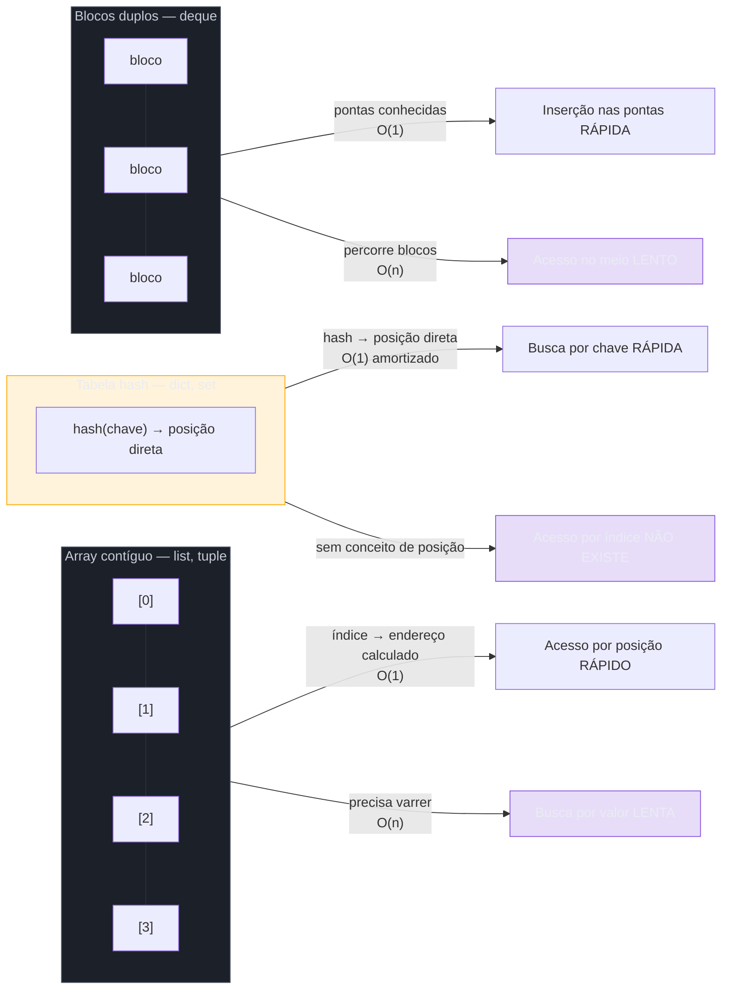
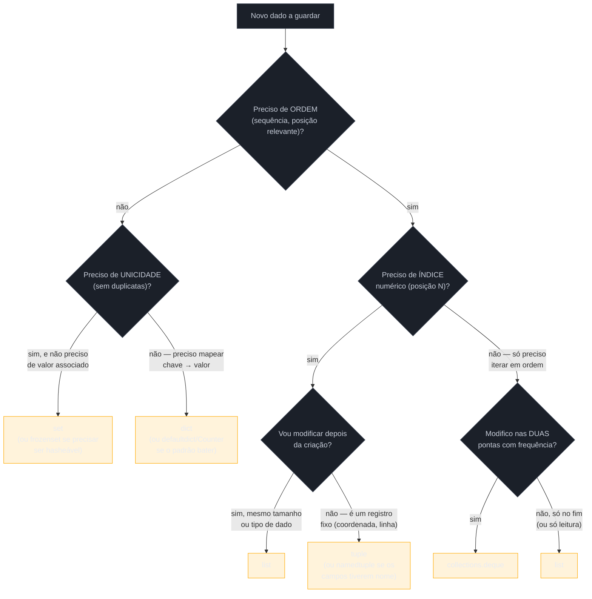

# Escolhendo a estrutura certa

> [!abstract] TL;DR
> As sete notas anteriores deste galho ensinaram `list`, `tuple`, `dict`, `set`, comprehensions, `itertools` e o módulo `collections` isoladamente. O erro mais caro e mais comum de quem já sabe a sintaxe de todas elas é escolher a estrutura errada para a pergunta que o código está fazendo — o sintoma clássico é um `in` dentro de um loop rodando contra uma `list`, quando deveria rodar contra um `set` ou `dict`. A [wiki oficial de complexidade do CPython](https://wiki.python.org/moin/TimeComplexity) é a fonte canônica: `list`/`tuple` são O(1) para acesso por índice e O(n) para busca; `dict`/`set` são O(1) amortizado para busca por chave/elemento e O(n) para acesso posicional (que nem existe); `deque` é O(1) nas duas pontas e O(n) no meio ou por índice arbitrário. Essa tabela, mais um framework de cinco perguntas (ordem? índice? unicidade? busca frequente? as duas pontas?), é a "cola" que resolve a dúvida "qual estrutura eu uso aqui" — o fechamento prático deste Galho 2.

## O loop que devia ter sido um `in`

Volte ao exemplo de abertura da nota de [[04 - Sets|Sets]]: um sistema de e-commerce filtrando pedidos contra uma lista de IDs bloqueados, com `pedido.cliente_id in ids_bloqueados` custando O(n) por checagem porque `ids_bloqueados` é uma `list`. Aquele exemplo já mostrou a correção pontual — trocar `list` por `set` — mas ele é só uma instância de um padrão que se repete, com pequenas variações, em praticamente todo código Python que cresce além do protótipo:

```python
# Variante 1 — cache de resultados já processados
processados = []
for item in fila_de_processamento:
    if item.id in processados:          # O(n) por checagem, list crescendo
        continue
    processar(item)
    processados.append(item.id)

# Variante 2 — contagem "manual" de ocorrências
contagem = {}
for palavra in texto.split():
    if palavra in contagem:              # checagem redundante — .get()/Counter resolvem em uma linha
        contagem[palavra] += 1
    else:
        contagem[palavra] = 1

# Variante 3 — fila de trabalho processada nas duas pontas
fila = []
fila.append(novo_item)                   # O(1) — ok
primeiro = fila.pop(0)                    # O(n) — desloca TODO o resto da lista
```

As três variantes têm a mesma raiz: a estrutura usada não é a que o problema pede. A Variante 1 devia usar `set` (só precisa responder "já vi isso?"). A Variante 2 devia usar `collections.Counter` (a nota [[07 - O módulo collections — Counter, defaultdict, deque, namedtuple|07]] já mostrou por quê). A Variante 3 devia usar `collections.deque` (precisa das duas pontas em O(1), não só do fim). Nenhuma dessas trocas exige aprender sintaxe nova — todas as estruturas envolvidas já foram cobertas nas sete notas anteriores. O que falta é uma pergunta sistemática: **antes de escrever o primeiro `for`, o que essa coleção realmente precisa responder?** É essa pergunta — e a tabela de custo que a sustenta — que fecha o galho.

## Por que importa

Escolher a estrutura errada raramente quebra o código na primeira execução. Ele passa nos testes (que costumam rodar com 10, 100, talvez 1.000 itens de amostra), vai pra produção, e só manifesta o problema semanas depois, quando o volume de dados cresce o suficiente para a diferença entre O(1) e O(n) — ou entre O(n) e O(n²), quando o `in` errado está dentro de um loop — deixar de ser uma curiosidade acadêmica e virar um job que travava em milissegundos e passa a travar em minutos. É o tipo de bug que **não aparece em code review superficial**, porque a sintaxe está correta e o comportamento é correto — só o custo está errado. E como o Python torna tão fácil usar `list` para tudo (é a estrutura mais "genérica" e a primeira que qualquer iniciante aprende), a tentação de nunca trocar é grande — o [Zen of Python](https://peps.python.org/pep-0020/) favorece "simples é melhor que complexo", mas simples não deveria significar "a estrutura que eu já sabia usar antes de conhecer as outras".

Entender o custo de cada operação — não de memória, mas de tempo, medido em notação Big-O — é o que separa quem escreve Python que "funciona" de quem escreve Python que **continua funcionando** quando o volume de dados sai do notebook de testes e vai pra produção com escala real.

## A tabela de complexidade

A fonte canônica para essas complexidades é a [**TimeComplexity wiki oficial do CPython**](https://wiki.python.org/moin/TimeComplexity) — mantida pelo próprio projeto Python, documentando o custo amortizado (caso médio) e o pior caso de cada operação, estrutura por estrutura, com base na implementação real do CPython (tabela hash para `dict`/`set`, array dinâmico para `list`, deque de blocos para `collections.deque`). Ela é a referência que qualquer discussão séria de performance de coleções em Python deveria citar — inclusive em entrevista técnica, como a seção "Em entrevista" adiante detalha.

| Operação | `list` | `tuple` | `dict` | `set` | `deque` |
|---|---|---|---|---|---|
| Acesso por índice `x[i]` | **O(1)** | **O(1)** | N/A¹ | N/A¹ | O(1) nas pontas / **O(n)** no meio² |
| Busca / `x in coleção` | **O(n)** | **O(n)** | **O(1)** amortizado (chave) | **O(1)** amortizado | **O(n)** |
| Inserção no fim | **O(1)** amortizado (`.append`) | N/A³ | **O(1)** amortizado (`d[k]=v`) | **O(1)** amortizado (`.add`) | **O(1)** (`.append`) |
| Inserção no início | **O(n)** (`.insert(0, x)`) | N/A³ | N/A⁴ | N/A⁴ | **O(1)** (`.appendleft`) |
| Remoção de elemento específico | **O(n)** (`.remove(x)`) | N/A³ | **O(1)** amortizado (`del d[k]`) | **O(1)** amortizado (`.remove`/`.discard`) | O(1) nas pontas / **O(n)** no meio |

> [!question]- Por que tantos "N/A" nas colunas de `dict`, `set` e `tuple`?
> Porque **a pergunta em si não se aplica** a essas estruturas — não é que a operação seja "lenta", é que ela não existe do jeito que existe em `list`/`deque`:
> - `tuple` é **imutável**: não existe "inserção" depois de criada, ponto. Leitura (índice e busca) tem o mesmo custo de `list`, porque a representação interna também é um array contíguo — só que de tamanho fixo.
> - `dict` e `set` não têm **posição numérica** — são organizados por hash, não por ordem de array. "Acesso por índice" não faz sentido para eles (`d[0]` em um dict tenta usar `0` como *chave*, não como posição); e "inserção no início" também não, porque não existe um "início" espacial — só ordem de inserção (que `dict` preserva desde Python 3.7, mas isso é uma propriedade de iteração, não de indexação).

**Notas de rodapé da tabela:**

1. `dict[i]` e `set[i]` não existem como operação — tentar `d[0]` procura a chave `0`, não a "posição 0". A pergunta certa para essas estruturas é "buscar por chave/elemento", não "acessar por posição".
2. `collections.deque` é implementado como uma lista dupla de **blocos de memória fixos** (não um único array contíguo como `list`), otimizada para inserção/remoção nas duas pontas. Indexar no meio (`d[len(d)//2]`) precisa percorrer os blocos a partir da ponta mais próxima — O(n) no pior caso, ao contrário do O(1) de `list[i]`, que salta direto ao endereço de memória calculado a partir do índice.
3. `tuple` não tem métodos de mutação — nenhuma forma de "inserir" depois de criada. Criar uma tupla nova concatenando (`t + (x,)`) é O(n), porque copia tudo.
4. `dict` e `set` não têm noção de "início"/"fim" espacial para inserção — só ordem de inserção, que é uma propriedade emergente do jeito como a tabela hash é percorrida na iteração, não algo que se controle inserindo "na frente".



O padrão estrutural por trás da tabela: cada uma dessas quatro implementações internas (array contíguo, tabela hash, blocos duplamente encadeados) é **rápida exatamente onde foi desenhada para ser rápida**, e lenta em tudo que exige um trabalho que a estrutura não foi pensada para fazer. Não existe estrutura "melhor" em abstrato — só estrutura certa para a operação que o seu código faz **com mais frequência**.

> [!warning] Big-O é sobre crescimento, não sobre "rápido" em qualquer volume
> Para 10 elementos, a diferença entre O(1) e O(n) é irrelevante — os dois terminam em microssegundos, e o overhead de calcular um hash pode até deixar o `set` mais lento que a `list` nesse volume ridiculamente pequeno. A notação Big-O descreve **como o custo cresce conforme os dados crescem**, não o tempo absoluto de uma execução isolada. A escolha de estrutura importa porque, em produção, "10 elementos hoje" vira "2 milhões de elementos em 18 meses" sem que ninguém reescreva o código — e é aí que O(n) dentro de um loop (virando O(n²) efetivo) separa um sistema que escala de um que não escala.

## O framework de decisão

Com a tabela de custo estabelecida, a pergunta prática vira: dado um problema concreto, qual estrutura escolher? O caminho mais confiável não é decorar a tabela — é fazer, na ordem, um pequeno conjunto de perguntas sobre o que os dados **precisam fazer**, não sobre que estrutura "parece mais familiar".



As cinco perguntas, com o raciocínio por trás de cada uma:

1. **"Preciso de ordem (a sequência dos elementos importa)?"** Se não — se a única coisa que interessa é "isso está presente?" ou "chave X mapeia pra qual valor?" — `set` ou `dict` já eliminam a preocupação com posição, e ganham O(1) de busca de graça. Se sim, a resposta segue para as próximas perguntas dentro do mundo de estruturas ordenadas.

2. **"Preciso de unicidade, sem valor associado a cada elemento?"** Um `set` responde "isto está presente?" com O(1) e garante que duplicatas somem sozinhas — é a estrutura certa para deduplicação, pertencimento em massa (a lição central da nota [[04 - Sets|04]]) e álgebra de conjuntos (união/interseção/diferença). Se cada elemento precisa carregar um valor associado (não só "presente", mas "presente com este dado"), a resposta é `dict`, não `set`.

3. **"Preciso de índice numérico — acessar o item na posição N diretamente?"** Se sim, a família `list`/`tuple`/`deque` (array-like) é obrigatória — `dict`/`set` não suportam indexação posicional, mesmo que preservem ordem de inserção (`dict` desde 3.7). Se não — se o código só precisa **iterar** em ordem, sem nunca pular direto pro item N — um `dict` ordenado (com chave sintética, se necessário) às vezes já resolve sem a rigidez de posição fixa de uma sequência.

4. **"Depois de criada, essa coleção vai ser modificada (itens adicionados/removidos/trocados)?"** Se não — se os dados representam um registro fixo (coordenada `(x, y)`, uma linha de resultado de query, uma constante composta) — `tuple` é a escolha certa: mais barata em memória (representação compacta, sem sobre-alocação de crescimento), sinaliza intenção ("isto não muda") e, se os campos tiverem nome semântico, `namedtuple` (nota [[07 - O módulo collections — Counter, defaultdict, deque, namedtuple|07]]) documenta a estrutura sem o overhead de uma classe cheia. Se sim — a coleção cresce, encolhe, ou tem elementos trocados ao longo do tempo — segue pra `list` ou `deque`.

5. **"Modifico as duas pontas com frequência (início E fim), ou só uma delas (tipicamente o fim)?"** Se as duas pontas são mexidas com regularidade — uma fila FIFO, um histórico limitado dos últimos N eventos, um algoritmo de busca em largura (BFS) — `collections.deque` é estritamente melhor que `list`: O(1) nas duas pontas contra O(n) no início de uma `list`. Se só o fim importa (a imensa maioria dos casos de "acumular itens" e "processar em ordem crescente"), `list` continua sendo a escolha padrão, mais simples e com o mesmo custo O(1) de `.append()`.

> [!question]- E se eu precisar de mais de uma dessas propriedades ao mesmo tempo?
> Acontece o tempo todo — e é exatamente por isso que o módulo `collections` (nota 07) e combinações de estruturas existem. Alguns exemplos comuns: precisar de ordem **e** unicidade → `dict.fromkeys(sequencia)` (visto na armadilha 2 da nota 04) preserva a primeira ocorrência de cada item, sem duplicata, em ordem de inserção — o melhor dos dois mundos porque `dict` moderno já garante ordem. Precisar de contagem **e** unicidade dos tipos → `Counter` (que é, por baixo, um `dict` especializado) devolve as chaves únicas *com* a frequência de cada uma. Precisar de índice numérico **e** busca O(1) por valor → geralmente duas estruturas em paralelo, uma `list` (ordem/índice) e um `dict` invertido (`{valor: indice}`) mantido em sincronia — um padrão comum em índices de dados em memória. A régua nunca é "uma estrutura resolve tudo" — é "qual combinação mínima resolve as propriedades que o problema exige, sem carregar peso morto que ele não pede".

## Na prática: revisitando as três variantes da abertura

Aplicando o framework às três variantes do início da nota:

```python
# Variante 1 corrigida — só precisa responder "já vi isso?" → set
processados = set()
for item in fila_de_processamento:
    if item.id in processados:          # O(1) amortizado
        continue
    processar(item)
    processados.add(item.id)

# Variante 2 corrigida — contagem de ocorrências → Counter
from collections import Counter
contagem = Counter(texto.split())        # uma linha, sem loop manual

# Variante 3 corrigida — precisa das duas pontas → deque
from collections import deque
fila = deque()
fila.append(novo_item)                   # O(1) — igual antes
primeiro = fila.popleft()                 # O(1) — em vez de O(n) com list.pop(0)
```

Nenhuma das três correções introduz uma técnica nova — cada uma delas já apareceu, isolada, em alguma das sete notas anteriores. O que mudou foi a pergunta feita **antes** de escrever o primeiro `for`: não "que estrutura eu já conheço", mas "que operação essa coleção vai sofrer com mais frequência, e qual estrutura é O(1) exatamente nela".

Um último exemplo, juntando três estruturas na mesma função — um catálogo de produtos que precisa de busca rápida por SKU (dict), lista de categorias únicas presentes (set) e um histórico limitado das últimas 5 buscas (deque, com `maxlen` — visto na nota 07):

```python
from collections import deque

class Catalogo:
    def __init__(self):
        self._por_sku = {}                    # dict: SKU → produto, busca O(1)
        self._categorias = set()               # set: quais categorias existem, sem duplicata
        self._ultimas_buscas = deque(maxlen=5)  # deque: histórico curto, sempre as 5 mais recentes

    def cadastrar(self, produto):
        self._por_sku[produto.sku] = produto           # O(1) amortizado
        self._categorias.add(produto.categoria)          # O(1) amortizado

    def buscar(self, sku):
        self._ultimas_buscas.append(sku)                 # O(1) — desloca o mais antigo sozinho
        return self._por_sku.get(sku)                     # O(1) amortizado
```

Cada estrutura resolve uma pergunta diferente do mesmo domínio — nenhuma delas seria a escolha certa para as outras duas responsabilidades.

## Armadilhas

### (1) Escolher `list` por hábito, não por necessidade

O erro mais comum não é escolher `set`/`dict` errado — é **nunca considerar** trocar de `list`, porque foi a primeira estrutura aprendida e "sempre funcionou". A pergunta "isto precisa de ordem e índice, ou só de pertencimento/mapeamento?" deveria vir antes de declarar a coleção, não depois de o código já estar lento em produção.

### (2) Converter para `set`/`dict` dentro do loop, em vez de antes

```python
# ERRADO — reconstrói o set a cada iteração
for pedido in pedidos:
    if pedido.cliente_id in set(ids_bloqueados):   # O(m) de conversão, TODA iteração
        ...

# CERTO — converte uma vez, fora do loop
ids_bloqueados_set = set(ids_bloqueados)            # O(m), uma única vez
for pedido in pedidos:
    if pedido.cliente_id in ids_bloqueados_set:      # O(1) por iteração
        ...
```

A conversão de `list` para `set` custa O(m) — pagar esse custo a cada volta do loop apaga o ganho da troca; pagar uma vez, fora do loop, é o padrão correto (o mesmo destacado no benchmark de Sebastian Witowski citado na nota 04).

### (3) Usar `deque` quando só o fim importa

`deque` não é "melhor" que `list` em todo cenário — é melhor especificamente quando as duas pontas são usadas. Se o código só faz `.append()` no fim e nunca mexe no início, `list` é igualmente O(1) nessa operação e tem indexação O(1) que `deque` não garante no meio — trocar por `deque` sem necessidade real só troca uma vantagem (indexação) por outra que não vai ser usada (pop no início).

### (4) Esquecer que `tuple`/`frozenset` resolvem o problema de "preciso que isto seja chave/elemento hasheável"

Quando o código tenta usar uma `list` ou `set` mutável como chave de `dict` ou elemento de outro `set` e recebe `TypeError: unhashable type`, a solução quase sempre já foi coberta neste galho: `tuple` no lugar de `list` (nota 02), `frozenset` no lugar de `set` (nota 04) — não uma estrutura de dados nova, só a versão imutável da mesma família.

## Em entrevista

"Qual estrutura de dados você usaria aqui, e por quê?" é uma das perguntas mais previsíveis de entrevista técnica em Python — precisamente porque testa se o candidato pensa em **custo de operação**, não só em sintaxe. Perguntas típicas e a resposta que essa nota constrói:

- **"Você tem uma lista de 1 milhão de IDs e precisa checar, repetidamente, se um ID está nela. Que estrutura você usa?"** `set`. `in` numa `list` é O(n); num `set` é O(1) amortizado — a diferença, medida em benchmark real (ver nota 04), passa de 100.000× para elementos ausentes numa coleção grande. Construir o `set` uma vez, fora do loop de checagens, é a parte que candidatos menos experientes esquecem de mencionar.
- **"Quando você usaria `tuple` em vez de `list`?"** Quando os dados representam um registro fixo e não vão ser modificados depois de criados — uma coordenada, uma linha de resultado, uma chave composta de `dict`. `tuple` é hasheável (se seus elementos forem), `list` não é; e `tuple` tem footprint de memória menor por não sobre-alocar espaço de crescimento.
- **"Por que `deque` em vez de `list` para uma fila?"** Porque `list.pop(0)` é O(n) — remove o primeiro elemento e desloca todos os outros uma posição — enquanto `deque.popleft()` é O(1), graças à implementação em blocos de memória duplamente encadeados em vez de um único array contíguo. Para qualquer padrão FIFO (fila) ou de janela deslizante, `deque` é a escolha correta.
- **"Qual a complexidade de acessar `dict[chave]`, no caso médio e no pior caso?"** O(1) amortizado no caso médio (hashing direto); O(n) no pior caso teórico, quando muitas chaves colidem no mesmo bucket da tabela hash — algo raro na prática com uma boa função de hash, mas tecnicamente possível e vale mencionar que existe, segundo a própria [TimeComplexity wiki](https://wiki.python.org/moin/TimeComplexity).
- **"Cite uma situação em que a estrutura 'óbvia' não é a certa."** Contagem de frequência: a resposta ingênua é um loop com `if chave in dict` seguido de incremento manual; a resposta correta é `collections.Counter`, que resolve isso numa linha, com a mesma complexidade amortizada, mas sem reinventar a lógica de "existe? incrementa : inicializa".

### How to explain in English

> The most expensive and most common mistake once someone already knows Python's syntax is picking the wrong data structure for the operation the code actually performs most often — the classic symptom is an `in` check running inside a loop against a `list`, when it should run against a `set` or `dict`. The [official CPython TimeComplexity wiki](https://wiki.python.org/moin/TimeComplexity) is the canonical source here: `list` and `tuple` are O(1) for index access and O(n) for membership search, because they're backed by a contiguous array; `dict` and `set` are O(1) amortized for lookup by key/element and don't support positional indexing at all, because they're backed by a hash table; `collections.deque` is O(1) at both ends and O(n) in the middle or for arbitrary indexing, because it's implemented as a doubly-linked sequence of fixed memory blocks rather than one contiguous array. The practical decision framework boils down to five questions, asked in order, before writing the first loop: do I need order at all (if not, `set`/`dict` win outright on lookup cost); do I need uniqueness without an associated value (`set`) versus a key-to-value mapping (`dict`); do I need numeric indexing (only the array-like family — `list`/`tuple`/`deque` — supports it); will this collection be mutated after creation (if not, `tuple` — cheaper in memory, hashable, signals intent); and do I mutate both ends frequently, or just the tail (only then does `deque` beat `list`, since `list.pop(0)` is O(n) while `deque.popleft()` is O(1)). None of these five answers require learning new syntax — every structure involved was already covered earlier in this branch; what changes is asking the cost question *before* reaching for the structure that's merely familiar.

| Termo PT | Termo EN |
|---|---|
| complexidade de tempo | time complexity |
| notação Big-O | Big-O notation |
| caso médio / amortizado | average case / amortized |
| pior caso | worst case |
| acesso por índice | index access / positional access |
| busca / checagem de pertencimento | search / membership testing |
| tabela hash | hash table |
| array contíguo | contiguous array |
| fila de dois lados | double-ended queue |
| estrutura de dados certa | right data structure |
| custo de conversão | conversion cost |
| escala (verbo) | to scale |

## Fechamento do Galho 2 — Collections e Comprehensions

Esta é a última nota do Galho 2. Recapitulando o que as oito notas cobriram juntas:

1. [[01 - Listas — criação, métodos e slicing avançado|01 — Listas]] estabeleceu `list` como a sequência mutável de uso geral — `.append()` vs `.extend()`, `.sort()` in-place vs `sorted()`, slicing avançado, e a armadilha da cópia rasa por trás de `[[0]*3]*3`.
2. [[02 - Tuplas e desempacotamento|02 — Tuplas]] mostrou a distinção conceitual sequência-homogênea vs registro-heterogêneo, hashability, e o desempacotamento (`a, *resto = ...`) que é o mecanismo de leitura desse registro.
3. [[03 - Dicionários|03 — Dicionários]] cobriu `d.get()` vs `d[key]` (EAFP/LBYL), views dinâmicas, o merge com `|`/`|=` (PEP 584), e a chegada da ordem de inserção garantida no Python 3.7.
4. [[04 - Sets|04 — Sets]] introduziu a estrutura de pertencimento O(1) — a mesma tabela hash de `dict`, sem valor associado — e `frozenset` como a variante hasheável para quando um conjunto precisa ser chave ou elemento de outro conjunto.
5. [[05 - Comprehensions — list, dict, set e generator expressions|05 — Comprehensions]] deu a sintaxe declarativa que constrói qualquer uma das quatro coleções nativas numa única expressão, e introduziu generator expressions — lazy, sem materializar nada na memória.
6. [[06 - itertools — os essenciais|06 — itertools]] estendeu essa laziness para combinações, produtos cartesianos e agrupamento (`groupby`, com a armadilha do "precisa estar pré-ordenado" destrinchada em detalhe).
7. [[07 - O módulo collections — Counter, defaultdict, deque, namedtuple|07 — O módulo collections]] entregou as quatro estruturas especializadas que resolvem padrões manuais repetitivos: `Counter` (contagem), `defaultdict` (evita `KeyError`), `deque` (fila O(1) nas duas pontas) e `namedtuple` (registro leve nomeado).
8. Esta nota fechou com a tabela de complexidade e o framework de decisão que amarram as sete anteriores numa única pergunta prática: qual estrutura, para qual operação?

Juntas, essas oito notas formam **o vocabulário de manipulação de dados que torna código Python reconhecível à primeira vista** — não porque a sintaxe seja bonita, mas porque cada escolha de estrutura comunica, sem comentário nenhum, qual é a pergunta que aquele pedaço de dado precisa responder. Um `set` no meio do código já diz "isto é sobre pertencimento, não ordem"; um `deque` já diz "as duas pontas importam aqui"; um `Counter` já diz "isto é uma contagem, não uma checagem manual".

## O que vem a seguir

Com o Galho 2 completo, a trilha segue para dois galhos que se apoiam diretamente nesse vocabulário de coleções:

- **[[03-Dominios/Tecnologia/Python/OO e Data Model/index|Galho 3 — OO e Data Model]]** (ainda não escrito) é onde a trilha entra em classes, dunder methods, properties, dataclasses e `Protocol`/ABC — o coração do que *Fluent Python* chama de "Pythonic Object-Oriented Programming". Muitos dos dunder methods desse galho (`__len__`, `__contains__`, `__getitem__`, `__iter__`) são exatamente os protocolos que fazem uma classe própria se comportar como as coleções nativas vistas aqui — entender por dentro `list`/`dict`/`set` neste galho é o que torna óbvio, no Galho 3, por que implementar esses métodos "transforma" um objeto comum numa coleção Pythonic.
- **[[03-Dominios/Tecnologia/Python/Funcional e idiomas avançados/index|Galho 4 — Funcional e idiomas avançados]]** (ainda não escrito) é onde os iteradores e generators — só tocados de raspão aqui, nas notas 05 e 06, como "sintaxe que produz valores sob demanda" — são explicados por baixo do capô: o protocolo `__iter__`/`__next__`, como um `yield` transforma uma função comum numa fábrica de generators, e closures/decorators que dependem desse mesmo modelo mental. Este galho usou generator expressions e `itertools` como ferramenta pronta; o Galho 4 explica como construir o equivalente do zero.

Ambos assumem que você já sabe, sem hesitar, quando um `for` deveria estar iterando sobre um `dict.items()` em vez de um `.keys()` combinado com `[chave]`, quando um `set` resolve um problema que "parecia" precisar de uma `list`, e por que `deque` existe — o vocabulário deste galho é o alicerce de manipulação de dados sobre o qual os dois próximos constroem.

## Veja também

- [[04 - Sets|04 — Sets]] — a nota que abriu a discussão de O(1) vs O(n) em detalhe, com o benchmark real citado
- [[07 - O módulo collections — Counter, defaultdict, deque, namedtuple|07 — O módulo collections]] — `deque`, `Counter` e `defaultdict`, as estruturas especializadas usadas nos exemplos desta nota
- [[03-Dominios/Tecnologia/Python/Collections e Comprehensions/index|Collections e Comprehensions]] — MOC do galho
- [[03-Dominios/Tecnologia/Python/Core/index|Core]] — Galho 1 (pré-requisito)
- [[03-Dominios/Tecnologia/Python/index|Trilha Python]]
- [[03-Dominios/Engenharia/Arquitetura/System Design/index|System Design]] — trade-offs de complexidade em escala de sistema, não só de estrutura de dados isolada

## Fontes

- Python Software Foundation / CPython contributors. *TimeComplexity — Python Wiki*. wiki.python.org, atualizada continuamente pela comunidade CPython. https://wiki.python.org/moin/TimeComplexity (acessado em 2026-07-09)
- Python Software Foundation. *5. Data Structures*. docs.python.org, versão 3.14. https://docs.python.org/3/tutorial/datastructures.html (acessado em 2026-07-09)
- Python Software Foundation. *collections — Container datatypes: deque*. docs.python.org, versão 3.14. https://docs.python.org/3/library/collections.html#deque-objects (acessado em 2026-07-09)
- Real Python. *Python's deque: Implement Efficient Queues and Stacks*. https://realpython.com/python-deque/ (acessado em 2026-07-09)
- dev.to (wnleao). *Python deque vs list: a time comparison*. https://dev.to/wnleao/python-deque-vs-list-time-comparison-5ch4 (acessado em 2026-07-09)
- Witowski, S. *Membership Testing — Performance Benchmarks*. switowski.com, 2020-10-08. https://switowski.com/blog/membership-testing/ (acessado em 2026-07-09, já citado na nota 04)
- HackerNoon. *Understanding Python Memory Efficiency: Tuples vs. Lists*. https://hackernoon.com/understanding-python-memory-efficiency-tuples-vs-lists (acessado em 2026-07-09)
- Ramalho, L. *Fluent Python*, 2ª ed. — capítulos sobre sequências, dicionários/sets e o Data Model — base conceitual para por que cada estrutura tem o custo que tem. O'Reilly Media.
- Python Software Foundation. *The Zen of Python — PEP 20*. peps.python.org. https://peps.python.org/pep-0020/ (acessado em 2026-07-09)
