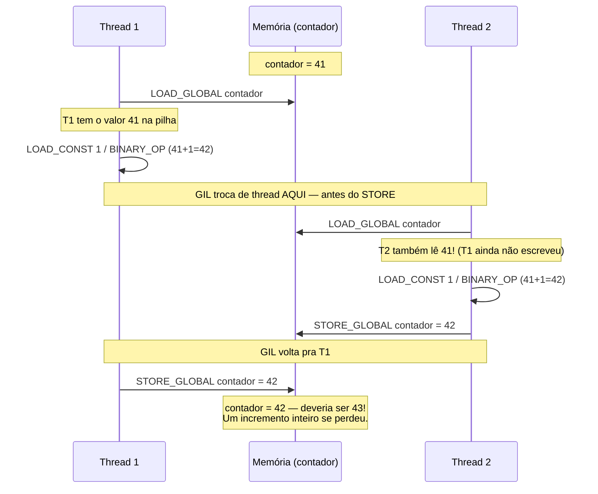
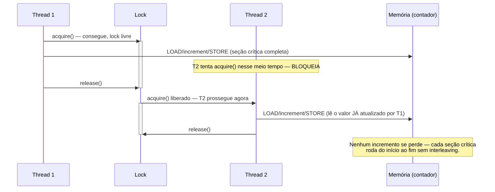

# Threading na prática — Thread, Lock e condições de corrida

> [!abstract] TL;DR
> `threading.Thread` cria threads reais do sistema operacional dentro do mesmo processo, compartilhando toda a memória — o que é conveniente até virar perigoso: operações que *parecem* atômicas em Python de alto nível (`contador += 1`) na verdade se decompõem em vários passos de bytecode, e o interpretador pode trocar de thread entre qualquer um deles. O resultado é uma **condição de corrida** (*race condition*) — incrementos que se perdem porque duas threads leem o mesmo valor antigo antes de qualquer uma escrever o novo. O GIL (visto em [[03-Dominios/Tecnologia/Python/CPython internals/04 - O GIL — o que é de verdade e por que existe|Galho 6 nota 04]]) garante que só uma thread executa bytecode por vez, mas **não** garante que uma sequência de várias instruções de bytecode execute sem interrupção — por isso "o GIL protege contra race conditions" é um dos mitos mais persistentes em Python. A solução estrutural é `threading.Lock`: um mutex que serializa o acesso à seção crítica, garantindo que a leitura-modificação-escrita aconteça como uma unidade indivisível do ponto de vista de outras threads.

## O bug que abre esta nota

Um desenvolvedor pleno, migrando um script de agregação de métricas para rodar mais rápido, decide paralelizar a contagem de eventos processados usando `threading` — afinal, são só operações de I/O leve (ler linhas de um arquivo, fazer parsing) intercaladas com um incremento de contador simples. O código parece trivial demais para dar errado:

```python
import threading

contador = 0

def processar_eventos(quantidade):
    global contador
    for _ in range(quantidade):
        contador += 1   # parece uma linha, parece atômico — não é

threads = []
for _ in range(4):
    t = threading.Thread(target=processar_eventos, args=(250_000,))
    threads.append(t)
    t.start()

for t in threads:
    t.join()

print(f"Esperado: {4 * 250_000}")
print(f"Contador final: {contador}")
```

Rodando esse código, a expectativa ingênua é `contador == 1_000_000` — quatro threads, cada uma incrementando 250 mil vezes. Na prática, o resultado varia a cada execução: `987_432`, `991_205`, `973_881`... sempre um número **menor** que o esperado, e diferente a cada rodada. Nenhuma exceção é levantada, nenhum erro aparece no console — o programa simplesmente produz um número errado, silenciosamente, de forma não determinística. Esse é o tipo de bug mais perigoso que existe em software concorrente: não trava, não avisa, só corrompe o resultado — e some ou reaparece dependendo de fatores como carga da máquina, versão do interpretador, ou pura sorte no agendamento de threads pelo sistema operacional.

> [!bug] O que está quebrado, em uma frase
> `contador += 1` não é uma operação atômica em Python — é ler o valor atual, somar 1, e escrever de volta, três passos distintos que podem ser interrompidos no meio por outra thread fazendo a mesma coisa com o mesmo valor "antigo".

Entender exatamente *por que* isso acontece — e por que o GIL, que supostamente serializa tudo, não impede esse bug — é o assunto do resto desta nota.

## `threading.Thread`: o básico de criar e coordenar threads

Antes de entender o bug em detalhe, vale fixar o vocabulário e a API básica. Uma **thread** é uma linha de execução dentro de um processo — múltiplas threads do mesmo processo compartilham o mesmo espaço de memória (heap, objetos, módulos importados), diferente de processos (`multiprocessing`), que são isolados por padrão, como visto em [[03-Dominios/Tecnologia/Python/CPython internals/05 - GIL e concorrência na prática — threading vs multiprocessing|Galho 6 nota 05]]. Em CPython, `threading.Thread` cria uma thread real do sistema operacional (não uma "thread verde" simulada pelo interpretador) — o SO agenda essas threads em núcleos de CPU como qualquer outra thread do sistema, e o GIL é quem decide, por cima disso, qual delas tem permissão para executar bytecode Python num dado instante.

```python
import threading
import time

def tarefa(nome, duracao):
    print(f"{nome}: iniciando")
    time.sleep(duracao)   # simula I/O — o GIL é solto aqui (ver nota 04 do Galho 6)
    print(f"{nome}: terminando")

# Criação explícita: instancia Thread, passa target e args
t1 = threading.Thread(target=tarefa, args=("worker-1", 2))
t2 = threading.Thread(target=tarefa, args=("worker-2", 1))

t1.start()   # dispara a thread — não bloqueia o chamador
t2.start()

print("main: threads disparadas, continuando outro trabalho...")

t1.join()    # bloqueia até t1 terminar
t2.join()    # bloqueia até t2 terminar

print("main: todas as threads terminaram")
```

Os quatro métodos que carregam praticamente todo o peso da API básica:

- **`start()`** dispara a execução da thread de forma assíncrona — o método retorna imediatamente, sem esperar a thread terminar. Chamar `start()` duas vezes na mesma instância de `Thread` levanta `RuntimeError` — uma `Thread` é de uso único.
- **`join()`** bloqueia a thread chamadora (tipicamente a thread principal) até que a thread-alvo termine. Sem `join()`, o programa principal pode terminar (e, dependendo da configuração, derrubar threads não-daemon junto ou esperar por elas silenciosamente) antes que as threads disparadas tenham concluído seu trabalho — `join()` é o mecanismo explícito de "espere aqui até esse trabalho acabar".
- **`is_alive()`** informa se a thread ainda está executando — útil para polling não-bloqueante quando `join()` com timeout não é suficiente.
- **`run()`** é o método que efetivamente contém o código a executar — na forma funcional acima ele nunca é chamado diretamente (é `target` que faz esse papel internamente); na forma por subclasse, é ele que se sobrescreve.

Também é possível criar threads por subclasse, sobrescrevendo `run()` diretamente — um estilo mais próximo do que Java faz, e ocasionalmente mais claro quando a thread precisa manter estado interno complexo além de argumentos simples:

```python
class WorkerThread(threading.Thread):
    def __init__(self, nome, duracao):
        super().__init__()
        self.nome = nome
        self.duracao = duracao
        self.resultado = None

    def run(self):
        time.sleep(self.duracao)
        self.resultado = f"{self.nome} processado"

w = WorkerThread("worker-3", 1)
w.start()
w.join()
print(w.resultado)   # "worker-3 processado" — estado acessível após join()
```

Na prática de produção, porém, a forma funcional (passar `target=`) é mais comum, e para orquestrar múltiplas threads com coleta de resultados a ferramenta preferida é `concurrent.futures.ThreadPoolExecutor` (aprofundado adiante no galho) — instanciar `Thread` diretamente é mais comum quando se precisa de controle fino sobre o ciclo de vida de uma thread individual, ou para entender o mecanismo por baixo, que é o propósito desta nota.

### Daemon threads: threads que não seguram o processo vivo

Por padrão, uma `Thread` é **não-daemon**: o processo Python não termina enquanto qualquer thread não-daemon ainda estiver rodando, mesmo que a thread principal (`main thread`) já tenha terminado seu próprio código. Isso é o comportamento certo na maioria dos casos — não faz sentido o programa "sumir" enquanto ainda há trabalho pendente sendo feito por uma thread que ele mesmo criou.

Existem casos, porém, em que uma thread executa trabalho de suporte que não deveria impedir o programa de encerrar — um heartbeat de monitoramento, um coletor de métricas em background, um watchdog que só existe enquanto o processo principal existir. Para esses casos, `daemon=True` marca a thread como **daemon**: o interpretador não espera por ela ao decidir se pode encerrar o processo — quando a última thread não-daemon termina, todas as threads daemon são simplesmente abandonadas, sem chance de executar código de limpeza (`finally`, `try`/`except` ao redor do trabalho da thread não são garantidos rodar até o fim).

```python
import threading
import time

def monitorar():
    while True:
        print("heartbeat...")
        time.sleep(1)

t = threading.Thread(target=monitorar, daemon=True)   # marca como daemon
t.start()

time.sleep(3)
print("main: terminando — a thread daemon é abandonada aqui, sem aviso")
# Sem daemon=True, o processo nunca terminaria — monitorar() é um loop infinito
```

> [!warning] Daemon threads são abandonadas, não encerradas graciosamente
> `daemon=True` não chama nenhum tipo de "sinal de parada" na thread quando o processo encerra — ela é simplesmente cortada no meio de qualquer coisa que estivesse fazendo, sem rodar blocos `finally`, sem fechar arquivos ou conexões abertas por ela. Para trabalho que precisa de limpeza garantida (fechar um arquivo, liberar um lock, notificar outro sistema), a abordagem correta é uma thread não-daemon com um mecanismo explícito de sinalização de parada (um `threading.Event`, coberto na próxima nota do galho) e `join()` com timeout, não `daemon=True` como atalho.

### Aquisição não-bloqueante e com timeout

`acquire()` aceita dois parâmetros que valem conhecer além do uso padrão bloqueante: `blocking` e `timeout`. Por padrão, `lock.acquire()` bloqueia indefinidamente até conseguir o lock — mas em código que precisa evitar ficar preso para sempre (por exemplo, para detectar um possível deadlock, ou para desistir de uma operação depois de um tempo razoável e seguir outro caminho), é possível pedir uma tentativa não-bloqueante ou limitada no tempo:

```python
import threading

lock = threading.Lock()

# Tentativa não-bloqueante: retorna imediatamente, True se conseguiu, False se não
if lock.acquire(blocking=False):
    try:
        print("consegui o lock sem esperar")
    finally:
        lock.release()
else:
    print("lock já estava em uso — seguindo outro caminho em vez de esperar")

# Tentativa com timeout: espera até N segundos, desiste depois disso
if lock.acquire(timeout=2.0):
    try:
        print("consegui o lock dentro de 2 segundos")
    finally:
        lock.release()
else:
    print("não consegui o lock a tempo — provável contenção alta ou deadlock")
```

Esse padrão é particularmente útil como estratégia defensiva contra deadlock: em vez de duas threads ficarem bloqueadas para sempre esperando uma pela outra (o cenário clássico de *lock ordering* que a próxima nota do galho aprofunda), usar `timeout` permite que uma delas desista, libere o que já tinha adquirido, e tente de novo mais tarde — trocando a garantia de "sempre espera o tempo que for preciso" por "nunca trava para sempre, mesmo que precise retentar".

### `threading.local`: dados por thread, sem precisar de lock nenhum

Vale fechar a seção de ferramentas básicas com uma alternativa estrutural ao lock, que resolve um subconjunto específico de problemas de concorrência sem exigir sincronização alguma: quando o estado não precisa ser genuinamente compartilhado entre threads — cada thread só precisa da sua **própria cópia independente** de um dado — `threading.local()` cria um objeto cujos atributos são isolados por thread automaticamente, apesar de todas as threads acessarem o mesmo objeto Python pelo mesmo nome.

```python
import threading

dados_locais = threading.local()

def processar(id_thread):
    dados_locais.id = id_thread   # cada thread escreve seu PRÓPRIO valor
    dados_locais.contador = 0
    for _ in range(1000):
        dados_locais.contador += 1   # sem lock — não há nada compartilhado aqui
    print(f"thread {dados_locais.id}: contador local = {dados_locais.contador}")

threads = [threading.Thread(target=processar, args=(i,)) for i in range(4)]
for t in threads:
    t.start()
for t in threads:
    t.join()
# Cada thread imprime seu próprio contador=1000 — nenhuma corrida,
# porque dados_locais.contador de uma thread não é o mesmo slot de memória
# que dados_locais.contador de outra, apesar de ser "o mesmo objeto" no código
```

O caso de uso canônico em produção é armazenar contexto específico de requisição/thread sem precisar passá-lo como parâmetro por toda cadeia de chamadas — frameworks web como Flask usam essa técnica internamente (via variações mais sofisticadas, como `contextvars` para código assíncrono) para manter, por exemplo, a conexão de banco de dados ou o objeto de requisição atual acessível globalmente dentro do código que atende aquela requisição específica, sem vazar entre requisições concorrentes atendidas por threads diferentes.

> [!question]- `threading.local` substitui a necessidade de `Lock` em geral?
> Não — resolve um problema diferente. `Lock` protege **estado genuinamente compartilhado**, que múltiplas threads precisam ler e escrever coordenadamente (o contador de eventos do bug de abertura, por exemplo, onde o valor final *precisa* refletir o trabalho de todas as threads juntas). `threading.local` resolve o caso em que o estado *parece* precisar ser compartilhado (mesmo nome de variável, mesmo objeto Python), mas na verdade cada thread só se importa com a própria cópia, sem nunca precisar ver ou combinar o valor das outras — nesse caso, a resposta certa não é sincronizar o acesso, é eliminar o compartilhamento por completo. Reconhecer qual dos dois cenários se aplica é, com frequência, a decisão de design mais importante ao paralelizar código com estado.

## Anatomia da condição de corrida: por que `contador += 1` não é atômico

Voltando ao bug de abertura — para entender por que ele acontece, é preciso olhar para o que `contador += 1` realmente significa em termos de bytecode, a unidade de trabalho que o interpretador CPython de fato executa (o mesmo bytecode discutido na nota sobre o GIL). Uma forma direta de ver isso é com o módulo `dis`, que desmonta código Python em bytecode:

```python
import dis

def incrementar():
    global contador
    contador += 1

dis.dis(incrementar)
```

Em versões recentes do CPython, essa única linha `contador += 1` se decompõe em algo próximo de (a codificação exata varia por versão do Python, mas os passos lógicos são estáveis):

1. `LOAD_GLOBAL contador` — lê o valor atual de `contador` da memória para a pilha de execução.
2. `LOAD_CONST 1` — empilha a constante `1`.
3. `BINARY_OP +` — soma os dois valores do topo da pilha.
4. `STORE_GLOBAL contador` — escreve o resultado de volta na variável `contador`.

São **pelo menos quatro instruções de bytecode distintas**, não uma operação única e indivisível. O GIL garante que, a qualquer instante, só uma thread está no meio de executar uma dessas instruções — mas não garante nada sobre o que acontece **entre** duas instruções consecutivas. O interpretador CPython troca a thread que detém o GIL periodicamente (por padrão, a cada `sys.getswitchinterval()` segundos — tipicamente 5 milissegundos — ou quando a thread atual bloqueia em I/O), e esse ponto de troca pode cair **entre** o `LOAD_GLOBAL` e o `STORE_GLOBAL` de uma thread, no meio da sequência de quatro passos.



O diagrama acima captura o núcleo do problema: as duas threads leem o mesmo valor de partida (`41`) porque nenhuma delas terminou de escrever antes da outra começar a ler. Cada uma calcula corretamente `41 + 1 = 42` — o bug não está na aritmética, está na **janela de tempo entre ler e escrever**, onde outra thread pode enxergar um valor que está prestes a ficar obsoleto. Dois incrementos aconteceram, mas o contador avançou só um — um incremento inteiro **desapareceu**, silenciosamente, sem erro, sem exceção, sem log. Esse padrão — ler, modificar, escrever, com uma janela vulnerável no meio — tem nome próprio: **read-modify-write não-atômico**, e é a causa raiz da vasta maioria de race conditions em qualquer linguagem, não só Python.

> [!question]- Se o GIL faz só uma thread executar bytecode por vez, por que isso conta como "concorrência real" o suficiente pra causar o bug?
> Porque "só uma thread por vez" é verdade **instrução a instrução**, não **operação lógica a operação lógica**. O GIL impede que duas threads executem a *mesma* instrução de bytecode simultaneamente (o que evitaria, por exemplo, corrupção de baixo nível dentro da própria implementação do CPython, como um `refcount` sendo incrementado por duas threads ao mesmo tempo em C) — mas não impede que a troca de qual thread está ativa aconteça **entre** instruções de uma sequência lógica que, do ponto de vista do programador Python, deveria ser uma unidade só. `contador += 1` é uma linha no código-fonte, mas quatro eventos distintos na fila de execução do interpretador — e é exatamente nessa lacuna entre "uma linha" e "quatro eventos" que a race condition mora.

### Por que o mito "o GIL torna Python thread-safe" persiste

Vale nomear esse mito diretamente, porque ele é comum o suficiente para aparecer em entrevistas técnicas como pegadinha deliberada. A confusão nasce de uma verdade parcial real: o GIL **de fato** protege a implementação interna do CPython contra um tipo específico de corrupção — operações de baixo nível em C, como incrementar o contador de referências de um objeto (`Py_INCREF`/`Py_DECREF`, o mecanismo por trás do garbage collector de contagem de referências), são atômicas graças ao GIL, porque nenhuma outra thread pode estar executando bytecode C do interpretador ao mesmo tempo. Isso é o que garante, por exemplo, que `list.append()` numa lista Python — uma operação implementada inteiramente em C dentro do CPython, sem pontos de interrupção no meio do seu próprio código C — é atômica do ponto de vista de outras threads Python: ou o append aconteceu inteiro, ou não aconteceu, nunca um estado parcial visível.

O que o GIL **não** protege é qualquer sequência de **múltiplas operações Python** compostas — e `contador += 1`, apesar de parecer uma operação única no código-fonte, é exatamente isso: uma sequência de operações Python distintas (leitura de variável, aritmética, escrita de variável), cada uma individualmente atômica, mas a **sequência como um todo** não. A regra prática e precisa: operações Python individuais embutidas inteiramente em uma única chamada C do interpretador (um `list.append()`, um `dict[key] = value` simples) são atomicamente seguras contra corrupção de baixo nível por causa do GIL; qualquer coisa que envolva ler um estado, decidir algo com base nele, e escrever de volta — mesmo que pareça uma linha só — não tem nenhuma garantia de atomicidade lógica, e precisa de sincronização explícita.

## O fix: `threading.Lock` como seção crítica

A ferramenta estrutural para consertar esse bug é `threading.Lock` — um mutex (*mutual exclusion*) que permite marcar um trecho de código como **seção crítica**: um bloco que, por convenção acordada entre todas as threads que respeitam o mesmo lock, só pode ser executado por uma thread de cada vez, do início ao fim, sem interleaving possível.

```python
import threading

contador = 0
lock = threading.Lock()

def processar_eventos(quantidade):
    global contador
    for _ in range(quantidade):
        with lock:          # adquire o lock; bloqueia se outra thread já o detém
            contador += 1   # agora as 4 instruções de bytecode rodam como unidade
        # lock liberado automaticamente ao sair do bloco `with`

threads = []
for _ in range(4):
    t = threading.Thread(target=processar_eventos, args=(250_000,))
    threads.append(t)
    t.start()

for t in threads:
    t.join()

print(f"Esperado: {4 * 250_000}")
print(f"Contador final: {contador}")
# Agora sempre 1_000_000 — determinístico, sem variação entre execuções
```

O mecanismo é direto: `lock.acquire()` (implícito no `with lock:`) bloqueia a thread chamadora até que nenhuma outra thread detenha o lock — quando ela consegue adquiri-lo, tem garantia de que é a única executando o bloco protegido até chamar `lock.release()` (implícito ao sair do `with`). Isso não elimina a troca de contexto em si — o GIL continua trocando threads livremente durante o `time.sleep` ou entre bytecodes — mas garante que, se a troca acontecer *dentro* da seção crítica, a thread que assumiu o controle vai bloquear imediatamente ao tentar `acquire()` o mesmo lock, em vez de prosseguir e ler um valor potencialmente obsoleto.



**`with lock:` vs `acquire()`/`release()` manuais:** o gerenciador de contexto (`with`) é a forma idiomática e recomendada, porque `Lock` implementa o protocolo de gerenciador de contexto (`__enter__`/`__exit__`) de forma que `release()` é chamado automaticamente mesmo se uma exceção for levantada dentro do bloco — usar `acquire()`/`release()` manualmente exige um `try`/`finally` explícito para a mesma garantia, e esquecer o `finally` é uma fonte clássica de deadlock (o lock nunca é liberado se uma exceção pula o `release()`).

```python
# Forma manual — funcionalmente equivalente, mas exige o try/finally explícito
lock.acquire()
try:
    contador += 1
finally:
    lock.release()   # sem isso, uma exceção no meio deixaria o lock travado pra sempre
```

### `Lock` vs `RLock`: reentrância

`threading.Lock` tem uma limitação importante: se a **mesma thread** que já detém o lock tentar adquiri-lo de novo (por exemplo, uma função protegida por lock chamando outra função também protegida pelo mesmo lock), ela **trava a si mesma** — um deadlock imediato, porque `Lock` não distingue "esta thread já tem o lock" de "outra thread tem o lock", e bloqueia incondicionalmente na segunda tentativa de `acquire()`.

```python
lock = threading.Lock()

def externa():
    with lock:
        interna()   # tenta adquirir o MESMO lock de novo — deadlock!

def interna():
    with lock:
        print("nunca chega aqui")

externa()   # trava para sempre — a própria thread está esperando por si mesma
```

`threading.RLock` (*reentrant lock*) resolve exatamente esse caso: ele rastreia **qual thread** o detém e **quantas vezes** essa mesma thread o adquiriu (um contador interno de reentrância), permitindo que a thread que já é dona do lock o adquira de novo sem bloquear — desde que libere o mesmo número de vezes que adquiriu, para que outras threads voltem a poder adquiri-lo.

```python
rlock = threading.RLock()

def externa():
    with rlock:
        interna()   # reentra no MESMO lock, na MESMA thread — permitido

def interna():
    with rlock:
        print("chega aqui sem problema")

externa()   # funciona: "chega aqui sem problema" é impresso
```

| Aspecto | `Lock` | `RLock` |
|---|---|---|
| Mesma thread readquire | Deadlock (bloqueia a si mesma) | Permitido (contador de reentrância) |
| Overhead | Menor (mais simples internamente) | Ligeiramente maior (rastreia thread-dona + contador) |
| Uso típico | Seção crítica simples, sem chamadas recursivas/aninhadas | Métodos de uma classe que podem se chamar entre si, todos protegidos pelo mesmo lock |
| Quem pode liberar | Qualquer thread que tenha o objeto (mas só quem o detém deveria) | Só a thread que o adquiriu — `RuntimeError` se outra tentar liberar |

> [!question]- Se `RLock` é estritamente mais permissivo, por que não usar `RLock` sempre, por segurança?
> Porque a permissividade extra tem um custo, ainda que pequeno: `RLock` precisa rastrear qual thread é dona e manter um contador de reentrância, um overhead que `Lock` não paga. Mais importante: a necessidade de reentrar no mesmo lock é frequentemente, na prática, um sinal de que o design da seção crítica está confuso — métodos que se chamam entre si e todos tentam re-adquirir o mesmo lock tendem a esconder acoplamento que vale simplificar (extrair a lógica interna para uma função que **não** adquire o lock, deixando só a função externa responsável por isso). `Lock` continua sendo a escolha padrão, mais simples e com intenção mais clara ("esta seção nunca deveria ser reentrada"); `RLock` é a ferramenta certa quando a reentrância é genuinamente necessária pelo formato do código (tipicamente classes com métodos públicos que chamam outros métodos públicos da mesma instância, todos protegidos pelo mesmo lock de instância).

## O bug de abertura, revisitado: por que o número final varia entre execuções

Vale fechar o círculo com o experimento de abertura, porque a variação do resultado entre execuções costuma intrigar quem vê o bug pela primeira vez — se o mecanismo é sempre o mesmo (leitura obsoleta entre `LOAD` e `STORE`), por que o número final de perdas muda a cada rodada?

A resposta é que o **agendamento exato** de quando o GIL troca de thread depende de fatores fora do controle determinístico do programa: a carga momentânea do sistema operacional, quantos outros processos competem por CPU, o timing exato de `sys.getswitchinterval()` em relação ao progresso de cada thread, e até jitter de hardware. Cada execução do script produz uma sequência diferente de "quem estava no meio da seção crítica quando a troca aconteceu" — às vezes duas threads colidem exatamente no read-modify-write algumas centenas de vezes, às vezes dezenas de milhares de vezes, dependendo de quão frequentemente as janelas vulneráveis de diferentes threads se sobrepõem. É esse caráter **não determinístico** — o mesmo código, rodado várias vezes, produzindo resultados diferentes sem nenhuma mudança de entrada — que torna race conditions notoriamente difíceis de reproduzir e depurar: um teste pode passar 999 vezes em CI e falhar na milésima, não porque o ambiente mudou, mas porque o agendamento de threads teve um timing específico daquela vez.

```python
# Reproduzindo o caráter não determinístico: rode este bloco várias vezes
# e observe que o "número de incrementos perdidos" muda a cada execução
import threading

for tentativa in range(3):
    contador = 0
    def incrementar():
        global contador
        for _ in range(200_000):
            contador += 1   # sem lock, de propósito, pra ilustrar a variação

    threads = [threading.Thread(target=incrementar) for _ in range(4)]
    for t in threads:
        t.start()
    for t in threads:
        t.join()

    perdidos = 800_000 - contador
    print(f"Tentativa {tentativa}: contador={contador}, perdidos={perdidos}")
    # Cada tentativa tipicamente mostra um número diferente de "perdidos"
```

## Armadilhas comuns

> [!warning] Assumir que operações "de uma linha" são atômicas
> **O que acontece:** proteger só as operações que "parecem" complexas (loops, múltiplas linhas) com lock, e deixar `contador += 1`, `lista.append(item) if item not in lista else None`, ou `dicionario[chave] = dicionario.get(chave, 0) + 1` sem proteção, por parecerem simples demais para precisar de sincronização. **Por quê:** atomicidade é uma propriedade de bytecode, não de sintaxe — o número de tokens numa linha de código Python não tem relação com o número de instruções de bytecode que ela gera, nem com se essas instruções são interrompíveis entre si. **Como evitar:** a pergunta certa não é "quantas linhas isso ocupa", é "isso envolve ler um estado compartilhado e depois escrever de volta algo derivado dele?" — se sim, é uma seção crítica, não importa quão simples pareça. Quando em dúvida, `dis.dis()` mostra a verdade.

> [!warning] Esquecer o `try`/`finally` ao usar `acquire()`/`release()` manuais
> **O que acontece:** uma exceção é levantada dentro da seção crítica, antes do `release()` manual ser alcançado — o lock fica travado para sempre, e qualquer thread futura que tente `acquire()` bloqueia indefinidamente (deadlock silencioso, sem nenhuma mensagem de erro até alguém notar que o programa "travou"). **Por quê:** `release()` só é chamado se o fluxo de controle chegar até aquela linha — uma exceção pula direto para o handler mais próximo (ou propaga para fora da função), ignorando qualquer código depois do ponto onde ela foi levantada, a menos que esteja num `finally`. **Como evitar:** usar `with lock:` sempre que possível — o protocolo de gerenciador de contexto garante `release()` mesmo em caminho de exceção. Se `acquire()`/`release()` manual for genuinamente necessário (timeout customizado, lógica condicional de aquisição), envolver com `try`/`finally` sem exceção.

> [!warning] Lock granular demais ou grosso demais
> **O que acontece:** dois extremos igualmente problemáticos — um lock único protegendo o programa inteiro (serializando tudo, eliminando qualquer ganho de concorrência, já que só uma thread por vez faz qualquer coisa), ou locks tão granulares e numerosos que a complexidade de gerenciá-los (e o risco de deadlock por lock ordering, coberto na próxima nota do galho) supera o ganho de paralelismo. **Por quê:** o tamanho certo da seção crítica é o menor trecho de código que precisa de exclusividade — nem mais (desperdiça concorrência), nem menos (deixa brechas para race conditions). **Como evitar:** proteger só a leitura-modificação-escrita do estado compartilhado em si, não trabalho independente ao redor dela — por exemplo, calcular um valor caro fora do `with lock:` e só entrar na seção crítica para a escrita final, se o cálculo não depende do estado compartilhado.

> [!warning] Confundir "thread-safe" com "correto sob qualquer condição de corrida"
> **O que acontece:** usar uma estrutura de dados documentada como thread-safe (como `queue.Queue`, coberta em nota futura do galho) mas ainda assim escrever um bug de concorrência, porque a operação problemática não é uma chamada única à estrutura, e sim uma sequência de duas chamadas relacionadas (`if fila.empty(): fila.put(item)` — o estado pode mudar entre o `if` e o `put`). **Por quê:** "thread-safe" descreve a garantia de uma **operação individual**, não de uma sequência de operações compostas por código do chamador — o mesmo princípio do read-modify-write visto nesta nota, só que aplicado a uma estrutura de dados em vez de uma variável simples. **Como evitar:** tratar qualquer decisão que dependa de "verificar um estado e depois agir com base nele" como uma seção crítica em potencial, mesmo quando as operações individuais envolvidas são, cada uma, thread-safe isoladamente.

## Em entrevista

Race condition com `threading` é um dos temas mais recorrentes em entrevistas técnicas sênior de Python — em parte porque expõe rapidamente se o candidato entende o GIL de verdade ou só decorou a frase "Python é thread-safe por causa do GIL".

> "A classic race condition example is a shared counter incremented from multiple threads without a lock: `counter += 1` looks like one line, but it compiles to multiple bytecode instructions — load the current value, add one, store it back. The GIL only guarantees that one thread executes a single bytecode instruction at a time; it says nothing about what happens *between* instructions of a logically related sequence. The scheduler can switch threads right between the load and the store, so two threads can both read the same stale value before either writes back — one increment silently disappears, no exception, no warning. That's exactly why 'the GIL makes Python thread-safe' is a myth: it protects individual atomic operations implemented in C — like a single `list.append()` — from low-level corruption, but it doesn't protect any read-modify-write sequence composed of multiple Python-level steps. The fix is `threading.Lock`: wrap the critical section — read, modify, write — so it executes as an indivisible unit from the perspective of other threads, using `with lock:` so the lock is released even if an exception is raised inside."

Uma pergunta de acompanhamento comum para checar profundidade: **"por que não usar `RLock` em todo lugar, já que ele é mais permissivo?"** — a resposta sênior nomeia o overhead extra de rastrear a thread-dona e o contador de reentrância, e argumenta que a necessidade de reentrância costuma sinalizar um design que vale simplificar, não um motivo pra trocar a ferramenta padrão.

> [!question]- E se o entrevistador perguntar sobre `sys.getswitchinterval()` especificamente?
> Vale mencionar que é o intervalo (em segundos, padrão 5 milissegundos desde o Python 3.2) que o interpretador usa como referência para considerar trocar a thread que detém o GIL — não é uma garantia rígida de troca exata nesse intervalo, é um parâmetro que o mecanismo de checagem periódica do interpretador usa. Reduzir esse valor (`sys.setswitchinterval()`) faz trocas de contexto mais frequentes (potencialmente mais "justiça" entre threads competindo por CPU, mas mais overhead de troca); aumentá-lo faz o oposto. O ponto relevante para esta nota é que esse valor **não elimina** a janela vulnerável de uma race condition — só afeta a frequência com que ela pode ser exposta, nunca a garante ausente. Detalhe de nicho; não é o núcleo da resposta esperada, mas mostra profundidade se vier como follow-up.

## Como explicar em inglês

| PT | EN |
|----|----|
| condição de corrida | race condition |
| seção crítica | critical section |
| leitura-modificação-escrita | read-modify-write |
| operação atômica | atomic operation |
| trava / mutex | lock / mutex |
| readquirir (o mesmo lock) | reacquire / reentrant acquisition |
| thread daemon | daemon thread |
| troca de contexto | context switch |
| não determinístico | non-deterministic |
| valor obsoleto/desatualizado | stale value |
| bloquear (uma thread) | block (a thread) |
| liberar (um lock) | release (a lock) |

## O que vem a seguir

Esta nota estabeleceu o par fundamental de conceitos do galho — `Thread` como unidade de execução, `Lock`/`RLock` como mecanismo básico de exclusão mútua — a partir de um bug real que expõe por que o GIL não é a proteção completa contra concorrência que parece ser à primeira vista. As próximas notas constroem sobre essa base:

- [[02 - Sincronização avançada — Semaphore, Condition, Event, Barrier|02 — Sincronização avançada: Semaphore, Condition, Event, Barrier]] — primitivas além do lock simples: limitar concorrência a N threads (`Semaphore`), coordenar espera condicional (`Condition`), sinalizar eventos (`Event`), sincronizar múltiplas threads num ponto (`Barrier`) — e os padrões clássicos de deadlock que aparecem quando múltiplos locks entram em jogo.
- [[03 - queue.Queue e o padrão produtor-consumidor|03 — queue.Queue e o padrão produtor-consumidor]] — uma estrutura de dados thread-safe de mais alto nível, que evita boa parte da necessidade de gerenciar locks manualmente para o padrão específico de produtores e consumidores.
- [[03-Dominios/Tecnologia/Python/CPython internals/04 - O GIL — o que é de verdade e por que existe|Galho 6 nota 04 — O GIL: o que é de verdade e por que existe]] — pré-requisito conceitual desta nota: o mecanismo exato do GIL (o que ele protege, quando é solto) que explica por que a atomicidade de operações C individuais existe, mas não se estende a sequências de bytecode compostas.
- [[03-Dominios/Tecnologia/Python/Concorrência e paralelismo/index|Concorrência e paralelismo (Galho 7)]] — MOC deste galho.

## Fontes

- Python Software Foundation. *threading — Thread-based parallelism*. docs.python.org, versão 3.14. https://docs.python.org/3/library/threading.html (acessado em 2026-07-10) — referência oficial de `Thread`, `Lock`, `RLock`, daemon threads.
- Python Software Foundation. *dis — Disassembler for Python bytecode*. docs.python.org, versão 3.14. https://docs.python.org/3/library/dis.html (acessado em 2026-07-10) — usado para inspecionar o bytecode gerado por `contador += 1`.
- Real Python. *An Intro to Threading in Python*. realpython.com. https://realpython.com/intro-to-python-threading/ (acessado em 2026-07-10) — exemplos de `Thread`, `Lock`, e race conditions com contadores compartilhados.
- Python Software Foundation. *sys.getswitchinterval / sys.setswitchinterval*. docs.python.org, versão 3.14. https://docs.python.org/3/library/sys.html#sys.setswitchinterval (acessado em 2026-07-10) — intervalo de checagem de troca de thread pelo GIL.
- **Fluent Python**, 2ª ed. — Luciano Ramalho, capítulo sobre concorrência com threads: discussão de race conditions, locks, e a distinção entre atomicidade de operações C individuais e sequências de bytecode.
- [[03-Dominios/Tecnologia/Python/CPython internals/04 - O GIL — o que é de verdade e por que existe|04 — O GIL: o que é de verdade e por que existe]] — nota irmã (Galho 6), pré-requisito direto: o mecanismo do GIL referenciado, não repetido, nesta nota.

Consultado em 2026-07-10.
