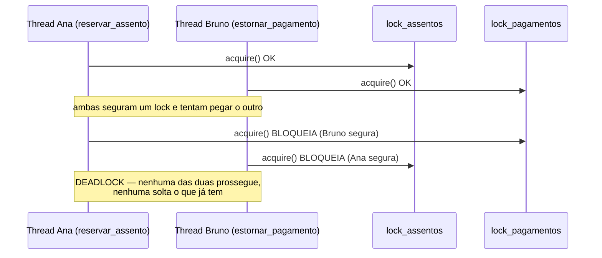
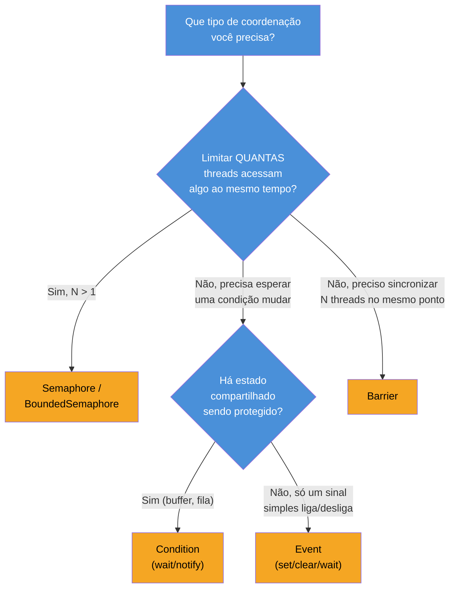

# Sincronização avançada — Semaphore, Condition, Event, Barrier

> [!abstract] TL;DR
> `Lock` resolve exclusão mútua — só uma thread por vez numa seção crítica — mas não resolve tudo: limitar *quantas* threads acessam um recurso ao mesmo tempo (não só uma) pede `Semaphore`/`BoundedSemaphore`; esperar por uma condição específica antes de prosseguir (não só por um lock livre) pede `Condition`; sinalizar "pode continuar" de forma simples e ampla pede `Event`; sincronizar N threads exatamente no mesmo ponto antes de todas avançarem juntas pede `Barrier`. O preço de introduzir múltiplos locks para coordenar essas situações é um risco novo que `Lock` sozinho quase nunca produz: **deadlock** — duas ou mais threads travadas para sempre, cada uma esperando um recurso que a outra segura, geralmente por *lock ordering* inconsistente (adquirir os mesmos locks em ordens diferentes).

## O bug que abre esta nota

Um sistema de reservas de assentos usa dois locks — um para o inventário de assentos (`lock_assentos`) e outro para o registro de pagamentos (`lock_pagamentos`) — porque as duas estruturas são atualizadas por rotinas diferentes e o desenvolvedor, corretamente, não quer um único lock gigante travando o sistema inteiro para operações que não se sobrepõem na maior parte do tempo. Duas funções, escritas por pessoas diferentes em momentos diferentes, adquirem os dois locks — mas em ordens opostas:

```python
import threading
import time

lock_assentos = threading.Lock()
lock_pagamentos = threading.Lock()

def reservar_assento(cliente):
    """Fluxo A: primeiro trava o assento, depois o pagamento."""
    with lock_assentos:
        print(f"{cliente}: assento travado, verificando pagamento...")
        time.sleep(0.1)  # simula trabalho — dá tempo pra outra thread entrar
        with lock_pagamentos:
            print(f"{cliente}: pagamento confirmado, reserva concluída")

def estornar_pagamento(cliente):
    """Fluxo B: primeiro trava o pagamento, depois o assento — ORDEM INVERTIDA."""
    with lock_pagamentos:
        print(f"{cliente}: pagamento travado, liberando assento...")
        time.sleep(0.1)
        with lock_assentos:
            print(f"{cliente}: assento liberado, estorno concluído")

t1 = threading.Thread(target=reservar_assento, args=("Ana",))
t2 = threading.Thread(target=estornar_pagamento, args=("Bruno",))
t1.start()
t2.start()
t1.join()
t2.join()
print("Fim — mas este print nunca é alcançado")
```

Rodando isso repetidas vezes, o programa quase sempre trava sem erro, sem exceção, sem stack trace — só para de responder para sempre. O que aconteceu: a thread de Ana adquiriu `lock_assentos` e, durante o `sleep`, a thread de Bruno adquiriu `lock_pagamentos`. Quando Ana tenta adquirir `lock_pagamentos`, ele já está com Bruno — Ana espera. Quando Bruno tenta adquirir `lock_assentos`, ele já está com Ana — Bruno espera. As duas threads esperam, para sempre, por um recurso que a outra segura e nunca vai soltar, porque soltar depende de terminar, e terminar depende do lock que está esperando. Isso é um **deadlock**, e o diagrama torna a armadilha visível:



Nenhum dos dois locks, isoladamente, tem defeito — `lock_assentos` e `lock_pagamentos` funcionam exatamente como `Lock` deveria funcionar. O problema é estrutural: **a ordem em que múltiplos locks são adquiridos não é a mesma em todos os caminhos do código**. Esse é o padrão-raiz por trás da maioria dos deadlocks reais, e o resto desta nota — depois de cobrir as primitivas de sincronização mais avançadas que `threading` oferece além de `Lock` — volta a ele em detalhe: como reconhecer, evitar e, quando possível, detectar.

> [!info] Pré-requisito
> Esta nota assume que [[01 - Threading na prática — Thread, Lock e condições de corrida|01 — Threading na prática: Thread, Lock e condições de corrida]] já foi lida — `Lock`/`RLock`, `acquire`/`release`, o gerenciador de contexto `with lock:`, e por que condições de corrida acontecem mesmo com o GIL. Esta nota não reexplica `Lock` básico; assume-o como ferramenta já conhecida e foca nas primitivas que resolvem problemas que `Lock` sozinho não resolve.

## O que é: quatro primitivas para quatro problemas diferentes

`Lock` responde a uma pergunta específica: "só uma thread pode estar aqui por vez — como garanto isso?" Mas nem todo problema de coordenação entre threads é esse. O módulo `threading` da biblioteca padrão ([documentado aqui](https://docs.python.org/3/library/threading.html)) oferece quatro primitivas adicionais, cada uma respondendo a uma pergunta distinta:

| Primitiva | Pergunta que resolve |
|---|---|
| `Semaphore`/`BoundedSemaphore` | "No máximo **N** threads podem estar aqui ao mesmo tempo — como garanto isso?" |
| `Condition` | "Uma thread precisa esperar até que **uma condição específica** seja verdadeira — não só até um lock ficar livre — como espero de forma eficiente e sou avisada quando a condição mudar?" |
| `Event` | "Uma ou mais threads precisam esperar até que **algo aconteça uma vez** (um sinal simples de liga/desliga) — como sinalizo isso para todas de uma vez?" |
| `Barrier` | "**N threads específicas** precisam chegar todas ao mesmo ponto antes que qualquer uma delas prossiga — como sincronizo essa barreira?" |

As quatro primitivas em uma frase: `Semaphore` generaliza `Lock` de "1 slot" para "N slots"; `Condition` combina um lock com uma fila de espera acordável por sinal; `Event` é a versão mais simples possível de sinalização, um booleano thread-safe com espera bloqueante; `Barrier` sincroniza um grupo fixo de threads num ponto de encontro comum, repetidamente.

## `Semaphore` e `BoundedSemaphore`: limitando concorrência, não eliminando-a

Um `Semaphore` mantém um contador interno. `acquire()` decrementa o contador — se o contador chegar a zero, a próxima chamada de `acquire()` bloqueia até que outra thread chame `release()` (incrementando o contador de volta). É literalmente `Lock` generalizado: um `Lock` é, na prática, um `Semaphore` inicializado com contador 1 — só uma thread passa por vez. Um `Semaphore(5)` deixa até 5 threads passarem simultaneamente; a sexta bloqueia até uma das cinco liberar.

O caso de uso canônico é limitar acesso a um recurso finito e caro — um *pool* de conexões de banco de dados, um número máximo de requisições HTTP concorrentes para uma API externa com *rate limit*, um número máximo de arquivos abertos ao mesmo tempo:

```python
import threading
import time
import random

# Simula um pool de conexões de banco com no máximo 3 conexões simultâneas
semaforo_conexoes = threading.Semaphore(3)

def consultar_banco(worker_id):
    print(f"worker {worker_id}: aguardando conexão disponível...")
    with semaforo_conexoes:   # acquire() bloqueia se as 3 já estiverem em uso
        print(f"worker {worker_id}: conexão obtida, consultando...")
        time.sleep(random.uniform(0.3, 0.8))  # simula a consulta
        print(f"worker {worker_id}: consulta concluída, liberando conexão")
    # release() acontece automaticamente ao sair do `with`

threads = [threading.Thread(target=consultar_banco, args=(i,)) for i in range(10)]
for t in threads:
    t.start()
for t in threads:
    t.join()
# No máximo 3 mensagens "conexão obtida" aparecem sem uma "liberando" entre elas —
# as outras 7 threads ficam esperando sua vez na fila implícita do semáforo.
```

`Semaphore`, assim como `Lock`, suporta o gerenciador de contexto `with` — `acquire()` ao entrar, `release()` ao sair, mesmo em caso de exceção — pelo mesmo motivo que `Lock` suporta: garantir que o slot seja devolvido independentemente do que aconteça dentro do bloco.

### `BoundedSemaphore`: a variante que detecta o erro de programação mais comum com `Semaphore`

`Semaphore` puro tem uma lacuna perigosa: nada impede que `release()` seja chamado mais vezes do que `acquire()` — o contador simplesmente sobe além do valor inicial, silenciosamente, permitindo mais threads concorrentes do que o limite pretendido. Isso costuma acontecer por um bug bobo — um `release()` duplicado por engano, ou um `release()` numa rotina de limpeza que roda mesmo quando o `acquire()` correspondente nunca aconteceu:

```python
import threading

semaforo = threading.Semaphore(2)
semaforo.acquire()
semaforo.acquire()
# ... esqueceu de um dos dois `release()`, ou chamou um a mais por engano ...
semaforo.release()
semaforo.release()
semaforo.release()  # BUG: terceiro release sem acquire correspondente
# Com Semaphore puro: nenhum erro. O contador interno passa a permitir
# 3 threads simultâneas em vez das 2 pretendidas — silenciosamente.
```

`BoundedSemaphore` é a mesma primitiva, com uma verificação a mais: `release()` levanta `ValueError` se for chamado mais vezes do que `acquire()` foi chamado, "estourando" o valor inicial. Não corrige o bug — mas o transforma de degradação silenciosa (mais concorrência do que o previsto, sem qualquer sinal de erro) em uma falha explícita e imediata, que aparece no primeiro `release()` a mais, não algum tempo depois quando o excesso de concorrência já causou dano em outro lugar. Por esse motivo, a recomendação prática — inclusive da própria documentação — é: **use `BoundedSemaphore` por padrão**; só use `Semaphore` puro se houver um motivo deliberado para permitir esse desbalanceamento (raro).

**`Semaphore`/`BoundedSemaphore` em uma frase:** um `Lock` generalizado para N slots simultâneos em vez de 1, ideal para limitar acesso a um recurso finito; prefira `BoundedSemaphore`, que transforma `release()` em excesso em erro explícito em vez de bug silencioso.

## `Condition`: esperar por uma condição específica, não só por um lock livre

`Lock` resolve "só uma thread por vez" — mas não resolve um problema diferente e muito comum: uma thread precisa **esperar até que algo específico seja verdadeiro** antes de continuar (o buffer não está mais vazio; a fila tem pelo menos um item; o estado interno mudou de "pendente" para "pronto"), e não faz sentido ela ficar checando essa condição em loop (*busy-waiting*, consumindo CPU o tempo todo só para descobrir que a condição ainda não mudou).

A solução ingênua e ruim é *polling*:

```python
import threading
import time

buffer = []
lock = threading.Lock()

def consumidor_ruim():
    while True:
        with lock:
            if buffer:
                item = buffer.pop(0)
                print(f"consumiu: {item}")
                break
        time.sleep(0.01)  # espera um pouco e checa de novo — desperdiça CPU
```

Esse padrão funciona, mas desperdiça ciclos de CPU continuamente checando uma condição que muda raramente, e introduz uma latência artificial (o `sleep`) entre a condição ficar verdadeira e a thread perceber. `threading.Condition` resolve isso de forma correta: combina um lock (para proteger o acesso ao estado compartilhado) com uma fila de espera que o sistema operacional gerencia de forma eficiente — a thread que chama `wait()` é **suspensa de verdade** (não consome CPU) até outra thread chamar `notify()`/`notify_all()`.

```python
import threading
import time

buffer = []
condicao = threading.Condition()   # cria um Lock() interno por padrão

def produtor():
    for i in range(5):
        time.sleep(0.3)
        with condicao:                     # adquire o lock interno
            buffer.append(i)
            print(f"produziu: {i}")
            condicao.notify()              # acorda UMA thread esperando (se houver)

def consumidor():
    for _ in range(5):
        with condicao:
            while not buffer:               # sempre em `while`, nunca em `if` — ver abaixo
                condicao.wait()             # solta o lock e dorme até ser notificado
            item = buffer.pop(0)
            print(f"consumiu: {item}")

t_prod = threading.Thread(target=produtor)
t_cons = threading.Thread(target=consumidor)
t_prod.start(); t_cons.start()
t_prod.join(); t_cons.join()
```

O mecanismo central de `wait()` merece destaque, porque é o que faz `Condition` funcionar sem *busy-waiting*: ao chamar `wait()`, a thread **libera o lock que está segurando** (para que outras threads — inclusive quem vai chamar `notify()` — consigam adquiri-lo) e entra em estado de espera suspensa junto ao sistema operacional. Quando `notify()`/`notify_all()` é chamado por outra thread, a thread em espera é acordada e **readquire o lock automaticamente** antes de `wait()` retornar — o desenvolvedor nunca gerencia esse reacordar/reaquisição manualmente, `Condition` cuida disso internamente.

> [!warning] `wait()` sempre dentro de um `while`, nunca de um `if`
> Isso é chamado de *spurious wakeup protection* e é uma regra sem exceção prática. Um `notify()` acorda a thread esperando, mas **não garante** que a condição que ela esperava ainda é verdadeira no momento em que ela readquire o lock — outra thread pode ter consumido o item entre o `notify()` e o momento em que esta thread específica volta a rodar (especialmente com `notify_all()`, onde várias threads acordam e competem pelo lock, mas só uma consegue o item). Testar a condição de novo em `while` depois de `wait()` retornar — em vez de assumir que ela é verdadeira só porque foi notificada — é o que evita processar dados que já não existem mais, ou continuar com um estado que mudou de novo entre a notificação e a execução.

`notify()` acorda **uma** thread em espera (arbitrária, entre as que estão esperando); `notify_all()` acorda **todas** as threads em espera — útil quando múltiplas threads podem estar esperando por condições diferentes que dependem do mesmo estado, ou quando não há garantia de que a primeira thread acordada vai de fato consumir o recurso que ficou disponível.

`Condition` aceita um lock externo (`Condition(lock=meu_lock)`) para casos em que o mesmo lock protege mais estado além do que a condição observa — mas o caso comum, como no exemplo acima, é deixar `Condition()` criar seu próprio `RLock` interno.

**`Condition` em uma frase:** um lock com uma fila de espera embutida — `wait()` libera o lock e dorme sem gastar CPU; `notify()`/`notify_all()` acorda quem está esperando, que sempre reavalia a condição num `while` antes de prosseguir.

## `Event`: sinalização simples de "algo aconteceu"

`Event` é a primitiva mais simples de todo o módulo `threading` — um booleano thread-safe (`False` por padrão) com um método de espera bloqueante. Não guarda nenhum dado, não protege nenhum estado compartilhado — só sinaliza "algo aconteceu" para quantas threads estiverem interessadas:

```python
import threading
import time

sistema_pronto = threading.Event()

def worker(worker_id):
    print(f"worker {worker_id}: aguardando sistema ficar pronto...")
    sistema_pronto.wait()          # bloqueia até .set() ser chamado, ou até timeout
    print(f"worker {worker_id}: sistema pronto, iniciando trabalho")

def inicializador():
    print("inicializador: carregando configuração...")
    time.sleep(1)
    print("inicializador: pronto — liberando todos os workers")
    sistema_pronto.set()           # acorda TODAS as threads em wait() de uma vez

workers = [threading.Thread(target=worker, args=(i,)) for i in range(4)]
for w in workers:
    w.start()
threading.Thread(target=inicializador).start()
for w in workers:
    w.join()
```

A API de `Event` é deliberadamente mínima:

- `set()` — marca o evento como verdadeiro; todas as threads bloqueadas em `wait()` são liberadas imediatamente, e chamadas futuras de `wait()` retornam sem bloquear até `clear()` ser chamado.
- `clear()` — volta o evento para falso; `wait()` voltará a bloquear.
- `wait(timeout=None)` — bloqueia até o evento ser setado, ou até o `timeout` (em segundos) expirar; devolve `True` se o evento estava setado, `False` se retornou por timeout — permitindo distinguir os dois casos sem lançar exceção.
- `is_set()` — checa o estado atual sem bloquear.

A diferença estrutural entre `Event` e `Condition` explica quando usar cada um: `Event` não tem noção de estado compartilhado nem de "quantos" — é um sinal de mão única, ligar/desligar, para "N threads esperando o mesmo sinal simples". `Condition` existe para coordenar acesso a **estado mutável compartilhado** (um buffer, uma fila, um contador) onde a condição de espera é arbitrária e pode mudar de forma complexa — `Condition` sabe proteger esse estado (via o lock interno) enquanto espera; `Event` não protege estado nenhum, só sinaliza. Um caso de uso típico de `Event`: sinalizar para um conjunto de threads *worker* que a aplicação está encerrando e devem parar (`evento_parar.set()`, e cada worker checa `evento_parar.is_set()` periodicamente ou usa `evento_parar.wait(timeout=...)` em vez de `time.sleep()` puro, para reagir imediatamente ao sinal em vez de esperar o timeout completo).

**`Event` em uma frase:** um booleano thread-safe com espera bloqueante eficiente — a ferramenta certa quando o sinal é "algo aconteceu" (sem dados, sem estado a proteger), não quando é preciso coordenar acesso a uma estrutura compartilhada.

## `Barrier`: sincronizando N threads no mesmo ponto

`Barrier` resolve um problema diferente dos três anteriores: garantir que um **número fixo e conhecido** de threads chegue todas a um determinado ponto do código antes que qualquer uma delas prossiga além dele — como um ponto de encontro que só libera quando todo mundo chegou.

```python
import threading
import time
import random

NUM_WORKERS = 4
barreira = threading.Barrier(NUM_WORKERS)

def worker(worker_id):
    tempo_preparo = random.uniform(0.1, 1.0)
    print(f"worker {worker_id}: preparando por {tempo_preparo:.1f}s...")
    time.sleep(tempo_preparo)
    print(f"worker {worker_id}: pronto, esperando os outros na barreira")

    posicao = barreira.wait()   # bloqueia até as 4 threads chegarem aqui
    # todas as 4 threads retornam de wait() aproximadamente ao mesmo tempo

    print(f"worker {worker_id}: todos chegaram (posição {posicao}), prosseguindo em paralelo")

threads = [threading.Thread(target=worker, args=(i,)) for i in range(NUM_WORKERS)]
for t in threads:
    t.start()
for t in threads:
    t.join()
```

`barreira.wait()` bloqueia a thread que a chama até que exatamente `NUM_WORKERS` threads (o número passado ao construtor) tenham chamado `wait()` — nesse momento, todas são liberadas de uma vez, de forma aproximadamente simultânea, e a barreira **automaticamente se reseta** para o próximo uso (diferente de `Event`, que precisa de `clear()` manual). Isso torna `Barrier` especialmente útil em simulações e algoritmos em fases — cada thread processa um pedaço de trabalho independente, mas todas precisam terminar a fase atual antes que qualquer uma comece a próxima (um padrão comum em simulações numéricas paralelas, onde cada fase depende do resultado completo da fase anterior).

O valor de retorno de `wait()` é um inteiro de `0` a `N-1` indicando a ordem de chegada — útil quando uma das threads precisa fazer um trabalho extra de coordenação exatamente uma vez por rodada (checar `if posicao == 0:` e usar essa thread como "líder" daquela passagem pela barreira).

`Barrier` também aceita um parâmetro `action` (uma função sem argumentos, executada exatamente uma vez, por uma das threads, no momento em que a barreira libera todo mundo — antes de qualquer thread prosseguir) e suporta `timeout` em `wait()`. Se uma thread chama `abort()` na barreira, ou se o `timeout` de qualquer `wait()` expira, a barreira entra em estado quebrado (`BrokenBarrierError` é levantado em todas as threads que estavam ou vierem a esperar nela) — um mecanismo explícito para o caso em que uma das N threads esperadas falhou e nunca vai chegar, evitando que as outras fiquem esperando para sempre por uma thread que não existe mais.

**`Barrier` em uma frase:** um ponto de encontro que bloqueia exatamente N threads até todas chegarem, libera todas juntas, e se reseta sozinho — ideal para algoritmos em fases onde cada fase depende da conclusão completa da anterior.

## Deadlock: quando os locks se travam entre si

Voltando ao bug de abertura: **deadlock** é o estado em que duas ou mais threads (ou processos, no caso de locks entre processos) ficam permanentemente bloqueadas, cada uma esperando um recurso que outra participante do ciclo segura — e nenhuma consegue prosseguir para liberar o que a outra espera. Diferente de uma condição de corrida (que corrompe dados silenciosamente, sem travar nada), deadlock trava o programa por completo, sem exceção, sem log de erro — só para de responder.

### As quatro condições clássicas (Coffman)

A literatura de sistemas operacionais (as condições de Coffman, 1971, ainda o modelo de referência hoje) descreve deadlock como a ocorrência **simultânea** de quatro condições — e evitar deadlock, na prática, é quebrar deliberadamente pelo menos uma delas:

1. **Exclusão mútua** — o recurso só pode ser usado por uma thread por vez (é literalmente o que `Lock` garante; não dá para eliminar isso sem eliminar o próprio propósito do lock).
2. **Posse e espera** (*hold and wait*) — uma thread segura pelo menos um recurso enquanto espera por outro (exatamente o padrão de Ana e Bruno no exemplo de abertura: cada uma segura um lock enquanto espera pelo outro).
3. **Não-preempção** — um recurso só pode ser liberado voluntariamente pela thread que o segura; nada nem ninguém pode "tomar" o lock de volta à força.
4. **Espera circular** — existe um ciclo de threads, cada uma esperando por um recurso que a próxima da cadeia segura (A espera B, B espera A — no caso mais simples de dois participantes, mas o ciclo pode ter qualquer tamanho: A espera B, B espera C, C espera A).

Na prática de código Python, a condição mais controlável — e a que a maioria das estratégias de prevenção ataca diretamente — é a quarta, a espera circular, porque ela é consequência direta de **lock ordering inconsistente**: se todo o código do sistema sempre adquire os mesmos locks na mesma ordem relativa, um ciclo de espera simplesmente não pode se formar.

### Lock ordering inconsistente: a causa mais comum na prática

O exemplo de abertura já mostrou o padrão: `reservar_assento` adquire `lock_assentos` → `lock_pagamentos`; `estornar_pagamento` adquire `lock_pagamentos` → `lock_assentos`. A ordem inversa entre as duas funções é o que cria a possibilidade de ciclo. A correção mais simples e mais robusta é impor **uma ordem total e global** para qualquer par de locks, e nunca violá-la em nenhum caminho do código — independente de qual operação de negócio está sendo feita:

```python
import threading
import time

lock_assentos = threading.Lock()
lock_pagamentos = threading.Lock()

# Regra do sistema, documentada e obedecida em TODO lugar que usa os dois locks:
# sempre adquirir lock_assentos ANTES de lock_pagamentos. Nunca a ordem inversa.

def reservar_assento(cliente):
    with lock_assentos:
        print(f"{cliente}: assento travado")
        time.sleep(0.1)
        with lock_pagamentos:
            print(f"{cliente}: pagamento confirmado")

def estornar_pagamento(cliente):
    # ANTES: adquiria lock_pagamentos primeiro. CORRIGIDO: mesma ordem que reservar_assento.
    with lock_assentos:
        print(f"{cliente}: assento travado (para estorno)")
        time.sleep(0.1)
        with lock_pagamentos:
            print(f"{cliente}: pagamento estornado")

t1 = threading.Thread(target=reservar_assento, args=("Ana",))
t2 = threading.Thread(target=estornar_pagamento, args=("Bruno",))
t1.start(); t2.start()
t1.join(); t2.join()
print("Fim — agora este print É alcançado, sempre")
```

Com a mesma ordem imposta em todo caminho do código, o pior cenário possível é uma thread esperar a outra terminar de usar os dois locks — uma espera de curta duração, não um travamento permanente, porque não existe mais nenhum ciclo possível: quem chega primeiro em `lock_assentos` acaba, cedo ou tarde, liberando `lock_pagamentos` também, e a outra thread prossegue.

Quando a ordem "natural" não é óbvia (por exemplo, dois locks protegendo dois objetos do mesmo tipo — duas contas bancárias distintas numa transferência), uma técnica comum é ordenar pelo identificador do objeto (um `id()`, uma chave primária, um UUID comparável) para derivar uma ordem determinística e consistente independente de qual função está chamando:

```python
def transferir(conta_origem, conta_destino, valor):
    # Ordena os locks por um identificador estável — não pela ordem dos parâmetros,
    # que varia dependendo de quem chama a função com quem primeiro.
    primeiro, segundo = sorted([conta_origem, conta_destino], key=lambda c: c.id)
    with primeiro.lock:
        with segundo.lock:
            conta_origem.saldo -= valor
            conta_destino.saldo += valor
```

Esse padrão — ordenar dinamicamente pelos identificadores, em vez de confiar na ordem em que os parâmetros chegam — é o que garante lock ordering consistente mesmo quando `transferir(conta_A, conta_B, ...)` e `transferir(conta_B, conta_A, ...)` são ambas chamadas legitimamente pelo sistema, potencialmente ao mesmo tempo, em threads diferentes.

### Locks aninhados (*nested locks*) e por que eles amplificam o risco

*Nested locks* — adquirir um lock dentro de uma seção crítica já protegida por outro lock, como no exemplo de reserva de assentos — não é, por si só, um erro; é um padrão legítimo e comum. O risco que ele introduz é justamente abrir a possibilidade de lock ordering inconsistente entre diferentes trechos de código que fazem aninhamentos parecidos, mas em ordens diferentes. Quanto mais profundo o aninhamento (locks dentro de locks dentro de locks) e quanto mais lugares no código fazem esse aninhamento de formas ligeiramente diferentes, maior a superfície para alguém, em algum ponto, inverter a ordem por engano — especialmente em bases de código grandes, onde a pessoa escrevendo uma nova função que precisa dos dois locks pode não saber (ou não lembrar) qual ordem o resto do sistema já usa.

> [!question]- `RLock` (reentrant lock) evita deadlock de aninhamento?
> `RLock` resolve um problema diferente e mais restrito: permite que **a mesma thread** adquira o mesmo lock várias vezes seguidas (contando quantas vezes precisa liberar antes de realmente soltar) — útil quando uma função que já segura o lock chama outra função que também tenta adquiri-lo, um padrão comum em código recursivo ou em métodos de uma classe que se chamam entre si. Isso evita um autodeadlock trivial (uma thread travando nela mesma ao tentar adquirir de novo um `Lock` comum que ela já segura), mas **não evita deadlock entre threads diferentes** disputando múltiplos locks distintos em ordens inconsistentes — o problema desta seção continua existindo integralmente mesmo que todos os locks envolvidos sejam `RLock`.

### `Lock.acquire(timeout=...)`: transformar travamento permanente em falha detectável

Quando eliminar completamente a possibilidade de deadlock por lock ordering não é viável de forma simples (sistemas grandes, código legado, múltiplas equipes tocando trechos diferentes), uma mitigação prática — não uma prevenção estrutural, mas uma rede de segurança — é usar `timeout` em `acquire()`:

```python
import threading

lock_a = threading.Lock()
lock_b = threading.Lock()

def operacao_com_timeout():
    adquirido_a = lock_a.acquire(timeout=2.0)
    if not adquirido_a:
        print("não conseguiu lock_a em 2s — desistindo, sem travar para sempre")
        return
    try:
        adquirido_b = lock_b.acquire(timeout=2.0)
        if not adquirido_b:
            print("não conseguiu lock_b em 2s — liberando lock_a e desistindo")
            return
        try:
            # seção crítica com os dois locks
            pass
        finally:
            lock_b.release()
    finally:
        lock_a.release()
```

`acquire(timeout=N)` devolve `True` se conseguiu o lock dentro do tempo, `False` se o timeout expirou — permitindo que o código desista de forma controlada (liberando o que já tinha adquirido) em vez de travar para sempre. Isso não elimina o deadlock potencial (a causa estrutural — lock ordering inconsistente — continua lá), mas troca "o sistema trava silenciosamente e para sempre" por "a operação falha de forma visível, logável, e o sistema como um todo continua respondendo" — uma degradação claramente preferível, especialmente em produção, onde um deadlock silencioso pode passar despercebido até um usuário reclamar que "o sistema travou" sem nenhum log indicando por quê.

### Detectando deadlock: `faulthandler` e inspeção de threads travadas

Ao contrário de uma condição de corrida (que muitas vezes passa despercebida, produzindo resultados sutilmente errados), um deadlock costuma ser óbvio em produção — o processo para de responder. O desafio é descobrir **onde**, já que não há exceção nem stack trace automático. O módulo `faulthandler` da biblioteca padrão ([documentado aqui](https://docs.python.org/3/library/faulthandler.html)) ajuda diretamente nisso: `faulthandler.dump_traceback()`, ou registrar `faulthandler.register(signal.SIGUSR1)` para disparar sob demanda, imprime a pilha de chamadas de **todas** as threads vivas no momento — inclusive as bloqueadas num `acquire()` que nunca retorna — revelando exatamente em qual linha cada thread está presa, e por extensão, qual lock cada uma está esperando.

```python
import faulthandler
import sys

# No início do programa (ou de um processo suspeito de travar):
faulthandler.enable()

# Em produção, registrar um sinal permite pedir o dump sob demanda,
# sem precisar reiniciar o processo:
# faulthandler.register(signal.SIGUSR1)
# kill -USR1 <pid> imprime a pilha de todas as threads no stderr
```

Ferramentas de depuração mais avançadas — `py-spy dump` (um profiler externo que inspeciona um processo Python rodando, sem precisar instrumentar o código antecipadamente) e o módulo `threading.enumerate()` combinado com inspeção manual de qual lock cada thread está tentando adquirir — completam o kit de diagnóstico quando `faulthandler` sozinho não é suficiente para reconstituir o ciclo completo de espera.

**Deadlock em uma frase:** um ciclo de threads esperando, cada uma, por um recurso que a próxima da cadeia segura — geralmente causado por lock ordering inconsistente; a prevenção estrutural é impor uma ordem total e determinística de aquisição de locks em todo o código, e `timeout` em `acquire()` é a rede de segurança quando a prevenção total não é garantida.

## Na prática: tabela de decisão

| Situação | Primitiva |
|---|---|
| Só uma thread por vez numa seção crítica | `Lock`/`RLock` (nota 01) |
| No máximo N threads simultâneas acessando um recurso finito (pool de conexões, rate limit) | `Semaphore`/`BoundedSemaphore` — prefira o segundo |
| Esperar até que um estado compartilhado mude de forma específica (buffer não-vazio, fila com item) sem *busy-waiting* | `Condition` |
| Sinalizar "algo aconteceu" (sem estado associado) para uma ou várias threads de uma vez | `Event` |
| Sincronizar N threads conhecidas no mesmo ponto antes de todas avançarem juntas, repetidamente | `Barrier` |
| Múltiplos locks adquiridos em sequência, por caminhos de código diferentes | impor lock ordering global consistente + considerar `timeout` em `acquire()` como rede de segurança |



## Armadilhas comuns

> [!warning] Usar `Semaphore` puro em vez de `BoundedSemaphore`
> **O que acontece:** um `release()` a mais (bug de digitação, rotina de limpeza chamada em caminho errado) passa despercebido, e o sistema passa a permitir mais concorrência do que o limite pretendido — silenciosamente, sem nenhum erro visível, até o excesso de concorrência causar outro problema (esgotamento do pool real de conexões, por exemplo) em algum ponto distante do bug original.
> **Como evitar:** usar `BoundedSemaphore` por padrão sempre que a intenção é "no máximo N" — ele levanta `ValueError` no primeiro `release()` desbalanceado, tornando o bug visível e localizável imediatamente, em vez de um sintoma distante e difícil de rastrear.

> [!warning] Chamar `Condition.wait()` fora de um `while` (usar `if`)
> **O que acontece:** a thread é acordada por `notify()`, mas a condição já não é mais verdadeira (outra thread consumiu o recurso primeiro, ou a condição mudou de novo) — e o código, assumindo erroneamente que a condição ainda vale, processa dado inexistente, levanta `IndexError` num `pop()` de lista vazia, ou opera sobre estado inconsistente.
> **Como evitar:** sempre reavaliar a condição num `while condicao_nao_satisfeita: cond.wait()`, nunca num `if` — é a proteção padrão contra *spurious wakeups* e contra corridas entre múltiplas threads acordadas pelo mesmo `notify_all()`.

> [!warning] Esquecer que `Event.wait()` sem timeout pode travar para sempre se `set()` nunca for chamado
> **O que acontece:** uma thread fica bloqueada indefinidamente esperando um evento que, por um bug em outro lugar do sistema (uma exceção não tratada que impediu o `set()` de rodar, um caminho de código que deveria sinalizar mas não sinaliza), nunca é setado — sem nenhuma mensagem de erro, o programa simplesmente para de progredir naquele ponto.
> **Como evitar:** em qualquer `wait()` que representa um recurso crítico do sistema (não um teste controlado), considerar um `timeout` explícito e tratar o retorno `False` (timeout expirou sem o evento ser setado) como um caso de erro a logar e tratar, não como algo que "nunca deveria acontecer".

> [!warning] Lock ordering inconsistente entre diferentes partes do código
> **O que acontece:** funções diferentes, escritas em momentos diferentes ou por pessoas diferentes, adquirem os mesmos dois (ou mais) locks em ordens diferentes — cada uma isoladamente correta, mas juntas criam a possibilidade de um ciclo de espera (deadlock), como no exemplo de abertura desta nota.
> **Por quê:** nada no próprio `Lock` impede isso — `acquire()` não sabe nem se importa em que ordem outros locks foram ou serão adquiridos por outras threads; a consistência de ordem é uma disciplina que só o desenvolvedor (ou uma convenção documentada e seguida por toda a equipe) garante.
> **Como evitar:** definir e documentar uma ordem total para qualquer conjunto de locks que possam ser adquiridos juntos, e nunca violá-la em nenhum caminho do código — quando a ordem "natural" não é óbvia (dois objetos do mesmo tipo, como duas contas bancárias), derivar a ordem de um identificador estável (`sorted(..., key=lambda x: x.id)`), não da ordem em que os parâmetros chegaram à função.

> [!warning] `Barrier` com número de threads que nunca vai bater
> **O que acontece:** `Barrier(N)` é criado esperando N threads, mas por algum motivo (exceção não tratada numa das threads antes de chegar em `wait()`, lógica condicional que faz uma thread pular a chamada de `wait()`) menos de N threads efetivamente chamam `wait()` — e as que chamaram ficam bloqueadas para sempre esperando as que faltam.
> **Como evitar:** garantir, com `try`/`finally` ou similar, que toda thread que deveria participar da barreira chegue até `wait()` mesmo em caminhos de erro (ou chame `barreira.abort()` explicitamente se detectar que não vai conseguir chegar, levantando `BrokenBarrierError` nas demais em vez de deixá-las esperando silenciosamente); usar `timeout` em `wait()` como rede de segurança adicional.

## Em entrevista

Deadlock é uma das perguntas mais recorrentes em entrevistas técnicas sobre concorrência — tanto a definição quanto, mais importante para sinalizar profundidade, como evitar e diagnosticar:

> "A deadlock happens when two or more threads are each waiting for a resource the other holds, and neither can proceed to release what it's holding — the classic case is two locks acquired in inconsistent order by different code paths: thread A grabs lock 1 then waits for lock 2, thread B grabs lock 2 then waits for lock 1, and now both are stuck forever with no exception, no stack trace, just a hung process. The structural fix is enforcing a single, global, deterministic ordering for acquiring any set of locks across the entire codebase — if every code path always acquires lock 1 before lock 2, a circular wait simply can't form, because whoever gets there first will eventually finish and release both. When a natural ordering isn't obvious — say, transferring between two accounts of the same type — I'd derive it from a stable identifier, like sorting by account ID, rather than trusting the order the caller happened to pass the arguments in. As a safety net on top of that, `Lock.acquire(timeout=...)` turns a permanent hang into a detectable, loggable failure instead of a silent freeze. For diagnosing a deadlock that already happened in production, `faulthandler.dump_traceback()` — or an external tool like `py-spy dump` — prints the call stack of every live thread, including the ones stuck in `acquire()`, which is usually enough to reconstruct exactly which locks each thread was waiting on."

Uma pergunta de acompanhamento comum é sobre as ferramentas de sincronização em si — "quando você usaria `Semaphore` em vez de `Lock`, ou `Condition` em vez de `Event`?" — e a resposta sênior nomeia a pergunta estrutural que cada primitiva resolve (quantidade de acesso simultâneo, coordenação de estado compartilhado versus sinal simples, sincronização de um grupo fixo de participantes) em vez de descrever a API mecanicamente.

> [!question]- E se perguntarem sobre livelock, diferente de deadlock — vale mencionar?
> Vale, brevemente, se a conversa já está no território de patologias de concorrência: **livelock** é parecido com deadlock no sintoma final (nenhuma thread progride), mas diferente no mecanismo — em vez de ficarem paradas esperando, as threads ficam ativamente reagindo uma à outra, mudando de estado repetidamente, sem nunca convergir para um estado de progresso real (a analogia clássica é duas pessoas num corredor estreito, cada uma se desviando repetidamente para o mesmo lado que a outra acabou de se mover, sem nunca conseguir passar). Em Python, livelock é bem mais raro que deadlock na prática — costuma aparecer em lógica de retry/backoff mal projetada (duas threads que, ao detectar contenção, recuam e tentam de novo exatamente no mesmo ritmo, ficando sincronizadas para sempre em vez de eventualmente uma delas conseguir passar) — mas não é o foco central desta nota, que trata das primitivas e do deadlock clássico por lock ordering.

## Como explicar em inglês

| PT | EN |
|----|----|
| semáforo | semaphore |
| exclusão mútua | mutual exclusion |
| espera em fila (sem consumir CPU) | efficient blocking wait |
| condição de espera | wait condition / predicate |
| notificar/acordar uma thread | notify / wake up a thread |
| sinalização | signaling |
| ponto de sincronização (barreira) | synchronization point / rendezvous point |
| impasse (travamento mútuo) | deadlock |
| ordem de aquisição de locks | lock acquisition order / lock ordering |
| posse e espera | hold and wait |
| espera circular | circular wait |
| detecção de impasse | deadlock detection |
| despertar espúrio | spurious wakeup |

## O que vem a seguir

Esta nota cobriu as primitivas de sincronização de `threading` além de `Lock` — `Semaphore`, `Condition`, `Event`, `Barrier` — e a patologia central que múltiplos locks introduzem, deadlock, com a causa mais comum (lock ordering inconsistente) e as estratégias de prevenção e diagnóstico. A trilha segue por:

- [[03 - queue.Queue e o padrão produtor-consumidor|03 — queue.Queue e o padrão produtor-consumidor]]: `queue.Queue` encapsula boa parte da coordenação vista aqui (na prática, uma `Queue` thread-safe é implementada internamente com um `Condition`) numa API pronta para o padrão produtor-consumidor, sem o desenvolvedor precisar orquestrar `Condition`/`wait`/`notify` manualmente na maioria dos casos.
- [[01 - Threading na prática — Thread, Lock e condições de corrida|01 — Threading na prática: Thread, Lock e condições de corrida]]: pré-requisito desta nota — `Lock`/`RLock` básico e condições de corrida, ponto de partida de tudo que foi discutido aqui.
- [[03-Dominios/Tecnologia/Python/Concorrência e paralelismo/index|Concorrência e paralelismo (Galho 7)]]: o galho completo segue por `multiprocessing`, `concurrent.futures` e `asyncio` — as primitivas equivalentes de sincronização assíncrona (`asyncio.Lock`, `asyncio.Event`, `asyncio.Condition`) aparecem, com as diferenças relevantes de modelo cooperativo, na nota 07.

## Fontes

- Python Software Foundation. *threading — Thread-based parallelism*. docs.python.org, versão 3.14. https://docs.python.org/3/library/threading.html (acessado em 2026-07-10) — documentação de referência de `Semaphore`, `BoundedSemaphore`, `Condition`, `Event`, `Barrier`.
- Python Software Foundation. *faulthandler — Dump the Python traceback*. docs.python.org, versão 3.14. https://docs.python.org/3/library/faulthandler.html (acessado em 2026-07-10) — diagnóstico de deadlock via dump de pilha de todas as threads.
- Real Python. [*An Intro to Threading in Python*](https://realpython.com/intro-to-python-threading/). realpython.com (acessado em 2026-07-10) — cobertura prática de `Lock`, `Semaphore` e padrões de sincronização com exemplos testáveis.
- Coffman, E. G.; Elphick, M. J.; Shoshani, A. *System Deadlocks*. ACM Computing Surveys, 1971 — origem das quatro condições clássicas de deadlock (exclusão mútua, posse e espera, não-preempção, espera circular), ainda o modelo de referência para análise de deadlock em qualquer linguagem.
- **Fluent Python**, 2ª ed. — Luciano Ramalho, capítulo sobre concorrência com threads: discussão de `Condition`, padrões produtor-consumidor e armadilhas de sincronização em CPython.
- [[01 - Threading na prática — Thread, Lock e condições de corrida|01 — Threading na prática: Thread, Lock e condições de corrida]] — nota irmã, pré-requisito direto desta nota.

Consultado em 2026-07-10.
