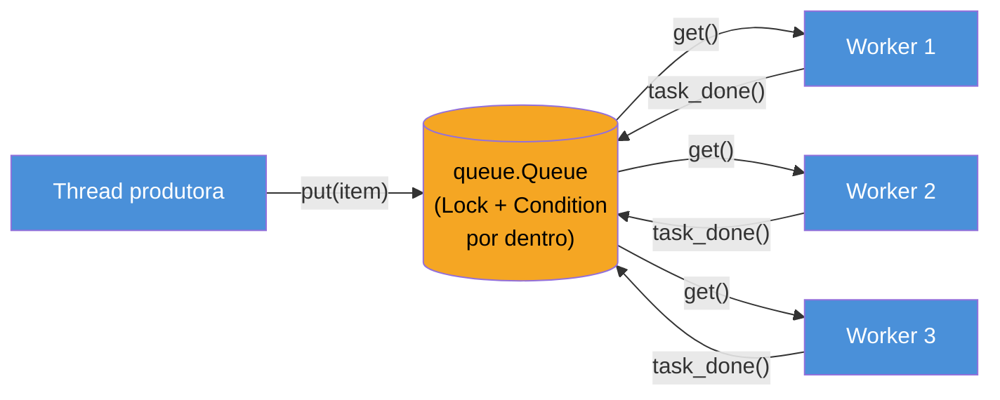
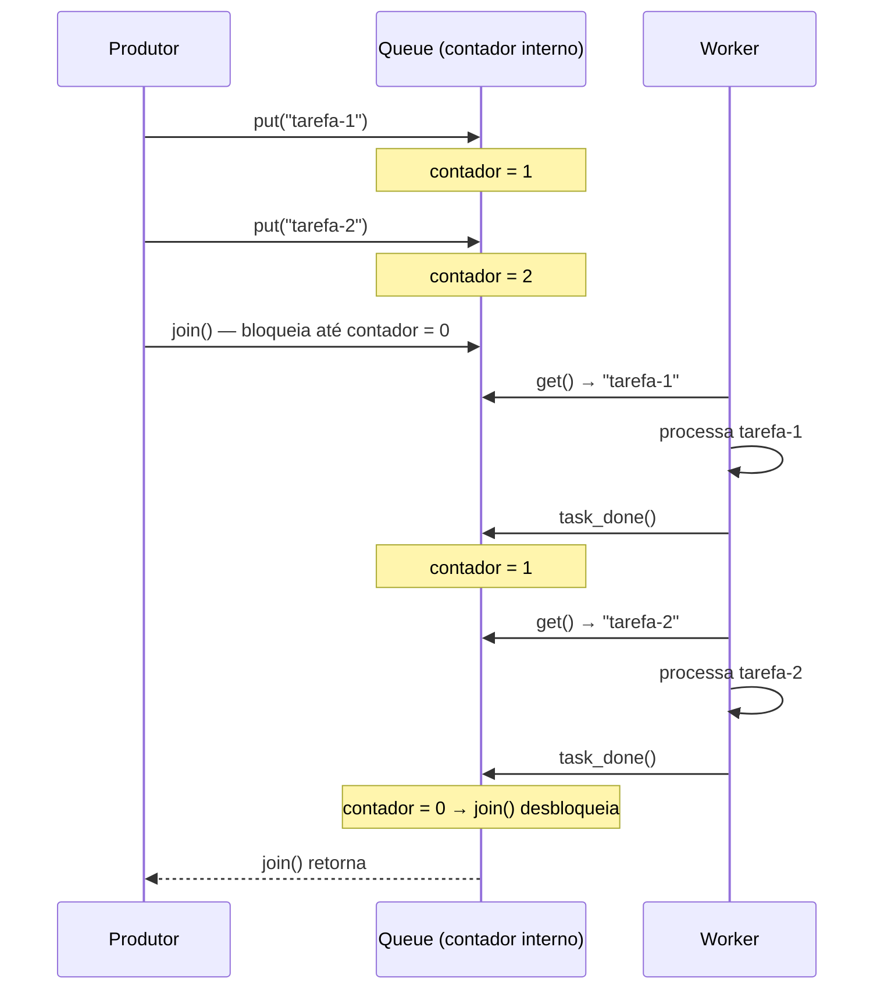
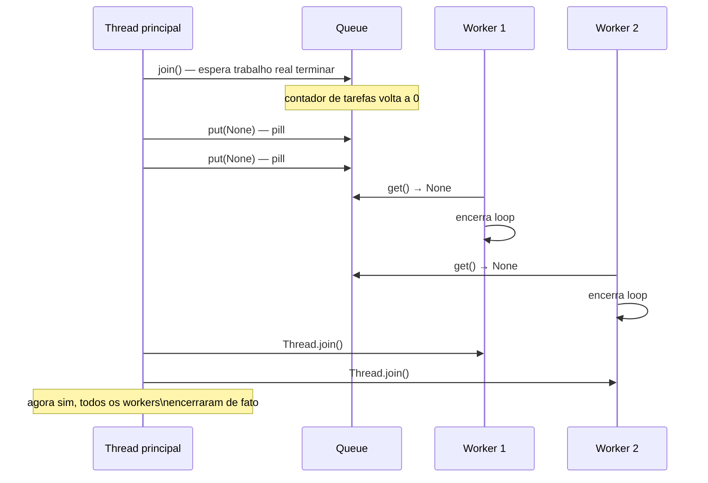

# `queue.Queue` e o padrão produtor-consumidor

> [!abstract] TL;DR
> Coordenar produtores e consumidores manualmente com `Lock`/`Condition` exige reimplementar, na mão, a lógica de "espera até ter item" e "notifica quando chega item" — código verboso e fácil de errar. `queue.Queue` é essa coordenação pronta: uma estrutura de dados **thread-safe por padrão**, que usa `Condition` por dentro (a mesma primitiva vista em [[02 - Sincronização avançada — Semaphore, Condition, Event, Barrier|02]]) para bloquear produtores/consumidores exatamente quando preciso, sem o desenvolvedor tocar em lock nenhum. O padrão canônico que ela viabiliza é o **worker pool**: N threads consumindo tarefas de uma fila compartilhada, com `task_done()`/`join()` sincronizando "todo o trabalho terminou" e o **poison pill pattern** encerrando os workers de forma graciosa. `LifoQueue` e `PriorityQueue` trocam só a política de ordem de saída — a API e as garantias de thread-safety são as mesmas.

## O bug que abre esta nota

Um desenvolvedor sênior, vindo de Java, já sabe que "produtor-consumidor" é um padrão clássico: uma ou mais threads produzem itens de trabalho, uma ou mais threads consomem e processam esses itens, e uma estrutura de dados compartilhada faz a ponte entre elas. Ele acabou de ver, na nota [[02 - Sincronização avançada — Semaphore, Condition, Event, Barrier|02]], como `Condition` resolve exatamente esse tipo de espera coordenada — então decide implementar o padrão do zero, à mão, como exercício:

```python
import threading
import collections
import time

class FilaManual:
    """Fila thread-safe implementada na mão com Lock + Condition."""

    def __init__(self, maxsize=0):
        self._itens = collections.deque()
        self._maxsize = maxsize
        self._lock = threading.Lock()
        self._nao_vazia = threading.Condition(self._lock)  # avisa consumidores
        self._nao_cheia = threading.Condition(self._lock)   # avisa produtores

    def put(self, item):
        with self._nao_cheia:
            while self._maxsize > 0 and len(self._itens) >= self._maxsize:
                self._nao_cheia.wait()          # bloqueia se a fila está cheia
            self._itens.append(item)
            self._nao_vazia.notify()            # acorda UM consumidor esperando

    def get(self):
        with self._nao_vazia:
            while not self._itens:
                self._nao_vazia.wait()          # bloqueia se a fila está vazia
            item = self._itens.popleft()
            self._nao_cheia.notify()            # acorda UM produtor esperando
            return item

def produtor(fila):
    for i in range(10):
        fila.put(f"tarefa-{i}")
        time.sleep(0.01)

def consumidor(fila, resultados):
    for _ in range(10):
        item = fila.get()
        resultados.append(item)

fila = FilaManual(maxsize=5)
resultados = []
t_prod = threading.Thread(target=produtor, args=(fila,))
t_cons = threading.Thread(target=consumidor, args=(fila, resultados))
t_prod.start(); t_cons.start()
t_prod.join(); t_cons.join()
print(f"Processados: {len(resultados)}")
```

O código funciona — mas ele já cometeu, sem perceber, dois dos erros mais comuns de implementar sincronização manualmente: usar `Condition` sem o loop `while` (proteção contra *spurious wakeups*, coberta na nota 02) teria sido um bug silencioso fácil de deixar passar; e ele ainda não resolveu duas perguntas que qualquer produtor-consumidor de verdade precisa responder — **como sei que todo o trabalho já foi processado?** (não basta contar itens produzidos, porque um consumidor pode pegar um item da fila e ainda estar processando-o quando a fila esvazia) e **como encerro os consumidores de forma graciosa** quando não há mais trabalho, sem que eles fiquem bloqueados para sempre em `wait()`?

Ele decide resolver essas duas perguntas com mais `Condition`s e contadores manuais — e o código, que já tinha ~30 linhas para uma fila fila simples, começa a crescer para 80, 100 linhas, com múltiplos locks aninhados e uma superfície grande para bugs sutis de sincronização.

Nesse ponto, ele finalmente lê a documentação da biblioteca padrão e descobre que **`queue.Queue`, do módulo `queue`, já é exatamente essa fila** — thread-safe por padrão, com `Condition` por dentro (a mesma mecânica que ele acabou de reimplementar na mão), e com uma API pronta (`task_done()`/`join()`, poison pill) para as duas perguntas que o travaram. O resto desta nota é essa API.

> [!info] Pré-requisito
> Esta nota assume que `Lock` e `Condition` — o que são, como `wait()`/`notify()` funcionam, por que o loop `while` importa — já estão claros pela nota [[02 - Sincronização avançada — Semaphore, Condition, Event, Barrier|02]]. Não reexplica `Condition` aqui; só usa o fato de que `Queue` a utiliza por dentro para justificar por que ela é thread-safe sem esforço extra do desenvolvedor.

## O que é: `Queue` como estrutura de dados thread-safe pronta

`queue.Queue` (documentado em [`queue` — A synchronized queue class](https://docs.python.org/3/library/queue.html)) é uma fila FIFO (*first-in, first-out* — primeiro a entrar, primeiro a sair) que qualquer thread pode chamar `put()`/`get()` simultaneamente, sem que o desenvolvedor precise envolver essas chamadas em `Lock` nenhum — a classe já faz isso internamente. O módulo `queue` foi desenhado, desde sempre, especificamente para comunicação segura entre threads, o que o distingue de `collections.deque` (que é *thread-safe para append/pop em cada ponta individualmente*, mas não oferece bloqueio coordenado nem as garantias de sincronização de "produtor espera se cheio, consumidor espera se vazio" que um produtor-consumidor de verdade precisa) e de listas comuns (que não são seguras para mutação concorrente sem lock externo).

Por dentro, `Queue` mantém um `Lock` e dois `Condition` associados a ele — um para sinalizar "não está mais vazia" (acorda consumidores esperando) e outro para "não está mais cheia" (acorda produtores esperando, quando há `maxsize`) — exatamente a estrutura que a implementação manual do bug de abertura reproduziu, só que já testada, já livre de *spurious wakeups*, e com uma API de mais alto nível por cima.

> [!question]- Se `Queue` só usa `Condition` por dentro, por que não usar `Condition` direto sempre, em vez de aprender mais uma API?
> Porque `Queue` já resolve, prontos, três problemas que a implementação manual do bug de abertura ainda não tinha resolvido: rastrear quando todo o trabalho colocado na fila terminou de ser *processado* (não só retirado — `task_done()`/`join()`, cobertos adiante), oferecer as três políticas de ordem de saída mais comuns (FIFO, LIFO, por prioridade) sob a mesma interface, e integrar de forma limpa com timeouts (`get(timeout=...)`) e verificações não-bloqueantes (`get_nowait()`) sem o desenvolvedor reimplementar essa lógica em cima de `Condition.wait(timeout=...)`. `Condition` continua sendo a ferramenta certa quando a condição de espera é algo mais específico do que "a fila tem/não tem itens" — um estado customizado qualquer. Para o caso específico (e extremamente comum) de "produtores colocam itens, consumidores retiram itens", `Queue` é a ferramenta que já existe pronta, testada, e usada por praticamente todo código de produção que precisa desse padrão.

**`queue.Queue` em uma frase:** uma fila FIFO thread-safe que usa `Condition` por dentro para bloquear produtores quando está cheia e consumidores quando está vazia, poupando o desenvolvedor de reimplementar essa coordenação manualmente.

## As três variantes: `Queue`, `LifoQueue`, `PriorityQueue`

O módulo `queue` oferece três classes que compartilham exatamente a mesma API (`put`, `get`, `task_done`, `join`, `qsize`, `empty`, `full`) — a única diferença entre elas é a **política de ordem de saída**, ou seja, qual item `get()` devolve quando há vários na fila:

| Classe | Ordem de saída | Quando usar |
|---|---|---|
| `queue.Queue` | FIFO — primeiro que entra, primeiro que sai | Caso geral: fila de tarefas onde a ordem de chegada deve ser respeitada (processamento justo, sem preterir tarefas antigas) |
| `queue.LifoQueue` | LIFO — último que entra, primeiro que sai (pilha) | Quando o item mais recente é o mais relevante — ex: cache de tarefas onde a mais nova costuma superseder as antigas, ou busca em profundidade paralela |
| `queue.PriorityQueue` | Menor valor primeiro (heap binário por baixo, via `heapq`) | Tarefas com prioridade explícita — ex: fila de requisições onde algumas são urgentes e devem furar a fila de itens de prioridade menor |

```python
import queue

fifo = queue.Queue()
fifo.put("primeiro")
fifo.put("segundo")
print(fifo.get())  # "primeiro" — ordem de chegada

lifo = queue.LifoQueue()
lifo.put("primeiro")
lifo.put("segundo")
print(lifo.get())  # "segundo" — o mais recente sai primeiro

prio = queue.PriorityQueue()
prio.put((3, "tarefa normal"))
prio.put((1, "tarefa urgente"))    # tupla (prioridade, item) — menor primeiro
prio.put((5, "tarefa de baixa prioridade"))
print(prio.get())  # (1, "tarefa urgente") — menor prioridade numérica sai primeiro
```

`PriorityQueue` espera itens que sejam comparáveis entre si — na prática, quase sempre tuplas `(prioridade, item)`, onde o primeiro elemento é o número usado para ordenar. Um detalhe que costuma surpreender: se dois itens tiverem a mesma prioridade, Python tenta comparar o segundo elemento da tupla para desempatar — e se esse segundo elemento não for comparável (por exemplo, um dicionário, ou uma instância de classe sem `__lt__`), a fila levanta `TypeError` no momento de desempate, não no momento de inserção. A correção comum é incluir um contador incremental como critério de desempate: `(prioridade, contador, item)`, garantindo que o desempate nunca precise comparar o `item` em si.

> [!question]- E se eu precisar de ordem de saída totalmente customizada, nem FIFO nem LIFO nem por número de prioridade?
> As três classes cobrem os casos mais comuns o suficiente para não precisar disso na maioria dos cenários — mas, para uma política verdadeiramente arbitrária, o próprio código-fonte de `PriorityQueue` é só um `heapq` por cima da classe base `Queue`, então implementar uma quarta variante (subclasse de `Queue`, sobrescrevendo `_put`/`_get`/`_qsize` — os métodos internos que `Queue` já isola exatamente para esse propósito de extensão) é um caminho documentado e relativamente direto, sem precisar reimplementar a sincronização do zero.

**As três variantes em uma frase:** mesma API, mesma thread-safety, só a política de "qual item sai primeiro" muda — FIFO por padrão, LIFO como pilha, por prioridade via heap.

## Como funciona: thread-safety nativa por dentro de `put()`/`get()`

O ponto central desta nota — e o motivo de `Queue` valer a pena sobre reimplementar manualmente — é que **cada chamada a `put()` ou `get()` já é atômica e coordenada** do ponto de vista de múltiplas threads, sem o desenvolvedor escrever `with lock:` em lugar nenhum do próprio código de aplicação. O diagrama abaixo mostra o fluxo de um worker pool: um produtor colocando itens, N threads consumidoras competindo pela mesma fila.



Cada seta que entra ou sai da fila (`put`, `get`, `task_done`) é uma operação que internamente adquire o `Lock` da fila por uma fração de segundo, faz a mutação necessária, e libera — o mesmo padrão `with self._lock:` visto na implementação manual do início desta nota, só que já implementado, testado e exposto por uma API que esconde o lock completamente. Do ponto de vista de quem usa `Queue`, não existe "adquirir o lock antes de mexer na fila" — só existe chamar `put()`/`get()`, e a fila garante, por construção, que duas threads nunca vão corromper a estrutura interna mesmo chamando esses métodos ao mesmo tempo.

> [!question]- Isso significa que meu código dentro do worker também fica automaticamente livre de condições de corrida?
> Não — e essa é uma confusão comum. `Queue` garante que a **estrutura da fila em si** (o `deque`/heap interno, os contadores de tarefas pendentes) nunca corrompe, mesmo com acesso concorrente. Ela não garante nada sobre o que os workers fazem *depois* de tirar um item da fila: se dois workers escrevem no mesmo arquivo, incrementam a mesma variável compartilhada fora da fila, ou mutam um objeto Python compartilhado que não seja o item da fila, essas operações continuam precisando da sincronização explícita de sempre (`Lock`, ou desenho que evite estado compartilhado mutável entre workers). `Queue` resolve a comunicação entre produtor e consumidores — não substitui a disciplina de sincronização para qualquer outro estado compartilhado que o código dos workers venha a tocar.

### `maxsize`: back-pressure de graça

Um parâmetro frequentemente ignorado é `maxsize` — o tamanho máximo da fila. Com `maxsize=0` (o padrão), a fila cresce sem limite: se o produtor for mais rápido que os consumidores, itens se acumulam indefinidamente na memória. Com `maxsize=N` positivo, `put()` **bloqueia** quando a fila já tem N itens não processados, até que algum consumidor retire um via `get()` — implementando, de graça, o que em sistemas distribuídos se chama *back-pressure*: o produtor é naturalmente desacelerado até o ritmo que os consumidores conseguem absorver, em vez de acumular um backlog ilimitado.

```python
fila_limitada = queue.Queue(maxsize=100)  # nunca mais que 100 itens pendentes
# put() bloqueia automaticamente se o produtor tentar ultrapassar esse limite —
# nenhuma lógica adicional de "verificar tamanho antes de inserir" é necessária.
```

## O padrão produtor-consumidor com worker pool

O padrão canônico que `Queue` viabiliza — e que a implementação manual do início desta nota tentava, sem sucesso completo, reproduzir — é o **worker pool**: N threads de vida relativamente longa, todas consumindo da mesma fila compartilhada, processando itens em paralelo (efetivo para I/O-bound, como visto em [[04 - O GIL — o que é de verdade e por que existe|a nota sobre o GIL]] do Galho 6) até que o trabalho acabe.

```python
import queue
import threading
import time

def worker(fila_tarefas, id_worker):
    """Roda em loop até receber a poison pill (None)."""
    while True:
        tarefa = fila_tarefas.get()          # bloqueia até haver item disponível
        if tarefa is None:
            fila_tarefas.task_done()          # sinaliza recebimento da própria pill
            break                              # encerra o loop, thread termina

        try:
            print(f"[worker {id_worker}] processando {tarefa}")
            time.sleep(0.05)                   # simula trabalho (I/O-bound: download, request...)
        finally:
            fila_tarefas.task_done()           # SEMPRE marca conclusão, mesmo em erro

def produtor(fila_tarefas, quantidade):
    for i in range(quantidade):
        fila_tarefas.put(f"tarefa-{i}")

def montar_worker_pool(n_workers, tarefas):
    fila_tarefas = queue.Queue()

    workers = [
        threading.Thread(target=worker, args=(fila_tarefas, i), daemon=True)
        for i in range(n_workers)
    ]
    for w in workers:
        w.start()

    for tarefa in tarefas:
        fila_tarefas.put(tarefa)

    fila_tarefas.join()                        # bloqueia até task_done() cobrir todo put()

    for _ in workers:
        fila_tarefas.put(None)                 # uma poison pill por worker
    for w in workers:
        w.join()                                # espera as threads encerrarem de fato

if __name__ == "__main__":
    tarefas = [f"item-{i}" for i in range(20)]
    montar_worker_pool(n_workers=4, tarefas=tarefas)
    print("Todo o trabalho foi processado e todos os workers encerraram.")
```

Este código já é um worker pool completo e funcional: 4 threads consumindo de uma fila compartilhada, sincronização automática via `Queue`, confirmação de que todo o trabalho terminou via `join()`, e encerramento gracioso via poison pill — as duas peças que a implementação manual do início desta nota ainda não tinha resolvido. As próximas duas seções detalham cada uma.

## `task_done()`/`join()`: sincronizando "todo o trabalho terminou"

A pergunta "como sei que todo o trabalho já foi processado?" parece, à primeira vista, simples de responder contando itens — mas não é: um worker pode ter feito `get()` num item e ainda estar processando-o quando a fila fica vazia. Se o código só checar `fila.empty()`, ele conclui erroneamente que o trabalho terminou enquanto um worker ainda está no meio do processamento daquele último item.

`Queue` resolve isso com um contador interno de **tarefas não confirmadas**: toda chamada a `put()` incrementa esse contador; toda chamada a `task_done()` decrementa. `join()` bloqueia a thread que o chama até esse contador voltar a zero — ou seja, até que cada `put()` tenha sido correspondido por exatamente um `task_done()`, o que só acontece depois que um worker terminou de fato de processar o item (não só de retirá-lo da fila).



O ponto crítico deste mecanismo — e a armadilha mais comum, coberta na próxima seção — é que `task_done()` precisa ser chamado exatamente uma vez por item retirado com `get()`, mesmo em caminhos de erro. É por isso que o código do worker acima chama `task_done()` dentro de um bloco `finally`: se `time.sleep(...)` (ou, em código real, o processamento de fato) lançar uma exceção, `task_done()` ainda é chamado, e `join()` não fica esperando para sempre por uma confirmação que nunca viria.

> [!question]- Por que `join()` na fila, e não simplesmente `Thread.join()` nas threads produtoras/consumidoras?
> São coisas diferentes, que respondem perguntas diferentes. `Thread.join()` espera a **thread terminar de executar** (o método `run()` retornar) — útil para saber que uma thread encerrou seu ciclo de vida. `Queue.join()` espera que **todo o trabalho colocado na fila tenha sido processado**, independentemente de as threads workers continuarem vivas ou não depois disso — no worker pool acima, os workers continuam rodando (em loop, esperando o próximo `get()`) mesmo depois que `fila_tarefas.join()` retorna, porque ainda não receberam a poison pill. É exatamente essa separação que permite ao código principal saber "terminei de processar o lote atual" sem precisar encerrar e recriar os workers a cada lote — um padrão comum quando o mesmo pool de workers processa múltiplos lotes de tarefas ao longo do tempo.

**`task_done()`/`join()` em uma frase:** um contador interno que só zera quando cada item colocado foi confirmado como processado (não só retirado), permitindo que o código produtor saiba com certeza quando pode prosseguir.

## O poison pill pattern: encerramento gracioso de workers

A segunda pergunta sem resposta óbvia é: como parar N threads que estão, cada uma, bloqueadas dentro de `get()` esperando o próximo item — sem matar a thread à força (o que Python, deliberadamente, não oferece uma API segura para fazer) e sem deixá-las bloqueadas para sempre?

A solução canônica, usada em praticamente todo código de produção que implementa este padrão, é o **poison pill** (também chamado *sentinel value*): um valor especial — tipicamente `None`, ou um objeto sentinela dedicado quando `None` puder ser um item de trabalho legítimo — que, ao ser retirado da fila por um worker, sinaliza "não há mais trabalho, encerre-se":

```python
SENTINELA = object()  # objeto único, garantidamente diferente de qualquer item real

def worker_com_sentinela_dedicada(fila_tarefas):
    while True:
        item = fila_tarefas.get()
        if item is SENTINELA:               # comparação por identidade, não por valor
            fila_tarefas.task_done()
            break
        # ... processa item ...
        fila_tarefas.task_done()
```

Usar `is SENTINELA` (identidade de objeto) em vez de `== None` evita qualquer ambiguidade se, por algum motivo, `None` puder legitimamente aparecer como item de trabalho — um objeto criado com `object()` é garantidamente único na memória, então a comparação nunca dá falso positivo.

O detalhe que costuma passar despercebido: **é preciso colocar uma poison pill para cada worker**, não uma única. Se o pool tem 4 workers e só uma pill é colocada na fila, apenas um dos 4 workers a consome e encerra — os outros 3 continuam bloqueados em `get()` para sempre, porque não há mais nada (nem trabalho real, nem sinal de encerramento) para eles retirarem. É por isso que o código do worker pool desta nota faz `for _ in workers: fila_tarefas.put(None)` — uma pill por worker, garantindo que todos, eventualmente, recebam seu próprio sinal de parada.



Vale notar a ordem: a poison pill só é enviada **depois** de `fila_tarefas.join()` retornar — ou seja, depois que todo o trabalho real já foi confirmado como processado. Enviar as pills antes correria o risco de um worker pegar a pill e encerrar enquanto ainda havia trabalho real esperando na fila atrás dela (a ordem FIFO garante que a pill só é consumida depois dos itens colocados antes dela, mas só se ela for colocada depois de todo o trabalho real ser enfileirado).

**Poison pill em uma frase:** um valor sentinela colocado na fila — um por worker — que, ao ser retirado, sinaliza para aquele worker específico encerrar seu loop de forma graciosa, em vez de ficar bloqueado em `get()` para sempre.

## `empty()`/`full()`/`qsize()`: informativos, não confiáveis para decisão

Um detalhe sutil, documentado explicitamente pela biblioteca padrão mas ainda assim uma fonte comum de bugs: `Queue.empty()`, `Queue.full()` e `Queue.qsize()` são **aproximações no instante da chamada**, não garantias válidas para o instante seguinte, quando múltiplas threads mexem na fila ao mesmo tempo.

```python
if not fila.empty():          # ERRADO como controle de fluxo em código concorrente
    item = fila.get()          # outra thread pode ter esvaziado a fila entre as duas linhas
```

Entre o momento em que `empty()` retorna `False` e o momento em que `get()` é de fato chamado, qualquer número de outras threads pode ter alterado o estado da fila — outro consumidor pode ter retirado o último item disponível, fazendo com que essa segunda chamada bloqueie (se não for a intenção) ou, num cenário pior com filas customizadas sem bloqueio, falhe. A documentação oficial é explícita sobre isso: *"this method is likely to be removed at some point"* já foi cogitado no passado justamente pela confusão recorrente que causa, e o texto atual recomenda não depender desses métodos para lógica de controle.

O padrão correto — usado em todo o código desta nota — é sempre deixar `get()`/`put()` bloquearem naturalmente (ou usar `get_nowait()`/`put_nowait()` com tratamento de `queue.Empty`/`queue.Full` quando uma verificação não-bloqueante é genuinamente necessária), em vez de checar o estado antes de agir:

```python
import queue

try:
    item = fila.get_nowait()          # não bloqueia; levanta queue.Empty se não houver item
except queue.Empty:
    item = None                        # trata a ausência explicitamente, sem race condition
```

`get_nowait()` e `put_nowait()` são atômicos por si só — a verificação "há item disponível?" e a remoção acontecem como uma única operação protegida pelo lock interno da fila, eliminando a janela de tempo entre checar e agir que `empty()`/`get()` separados deixam aberta.

**`empty()`/`full()`/`qsize()` em uma frase:** úteis para métricas e logging (uma leitura aproximada de "quão cheia está a fila agora"), nunca como condição para decidir se `get()`/`put()` vão bloquear ou não.

## Na prática: dois cenários de produção

### Cenário 1: pool de downloads concorrentes (I/O-bound clássico)

O caso de uso mais comum de worker pool com `threading` — porque download por rede é I/O-bound, e o GIL é solto durante a espera de rede, então threads paralelizam de verdade esse tipo de trabalho (o mecanismo é o mesmo explicado na nota sobre o GIL do Galho 6):

```python
import queue
import threading
import urllib.request
import time

def baixar_worker(fila_urls, resultados, lock_resultados):
    while True:
        url = fila_urls.get()
        if url is None:
            fila_urls.task_done()
            break
        try:
            with urllib.request.urlopen(url, timeout=5) as resp:
                conteudo = resp.read()
            with lock_resultados:                      # resultados é estado compartilhado
                resultados[url] = len(conteudo)          # à parte da fila — precisa de lock próprio
        except Exception as erro:
            with lock_resultados:
                resultados[url] = f"erro: {erro}"
        finally:
            fila_urls.task_done()

def baixar_em_paralelo(urls, n_workers=8):
    fila_urls = queue.Queue()
    resultados = {}
    lock_resultados = threading.Lock()

    workers = [
        threading.Thread(target=baixar_worker, args=(fila_urls, resultados, lock_resultados))
        for _ in range(n_workers)
    ]
    for w in workers:
        w.start()

    for url in urls:
        fila_urls.put(url)

    fila_urls.join()                    # espera todos os downloads confirmados

    for _ in workers:
        fila_urls.put(None)
    for w in workers:
        w.join()

    return resultados
```

Este cenário ilustra a armadilha conceitual mencionada mais cedo: `resultados` é um dicionário compartilhado entre workers, **fora** da fila — `Queue` protege apenas `fila_urls` em si, então `resultados` precisa do seu próprio `Lock` explícito, porque múltiplos workers escrevendo no mesmo dicionário ao mesmo tempo, sem sincronização, ainda corrompe o estado exatamente como qualquer outra escrita concorrente desprotegida.

### Cenário 2: pipeline com duas filas encadeadas (estágios de processamento)

Um padrão mais avançado, mas construído com exatamente as mesmas peças: encadear dois worker pools através de duas filas, onde a saída do primeiro estágio alimenta a entrada do segundo — útil quando o processamento tem etapas com custos muito diferentes (ex: baixar um arquivo é I/O-bound e leve; validar seu conteúdo é mais pesado) e cada etapa se beneficia de um número diferente de workers:

```python
import queue
import threading

def estagio_download(fila_entrada, fila_saida, n_workers=6):
    def worker():
        while True:
            item = fila_entrada.get()
            if item is None:
                fila_entrada.task_done()
                fila_saida.put(None)       # propaga o encerramento pro próximo estágio
                break
            dado_baixado = f"conteudo-de-{item}"   # simula download
            fila_saida.put(dado_baixado)             # entrega pro próximo estágio
            fila_entrada.task_done()

    threads = [threading.Thread(target=worker) for _ in range(n_workers)]
    for t in threads:
        t.start()
    return threads

def estagio_validacao(fila_entrada, resultados, n_workers=3):
    pills_recebidas = threading.Semaphore(0)

    def worker():
        while True:
            item = fila_entrada.get()
            if item is None:
                fila_entrada.task_done()
                break
            resultados.append(f"validado: {item}")   # simula validação (mais pesada)
            fila_entrada.task_done()

    threads = [threading.Thread(target=worker) for _ in range(n_workers)]
    for t in threads:
        t.start()
    return threads
```

Esse desenho — múltiplas filas encadeadas, cada uma com seu próprio pool de tamanho ajustado ao custo da etapa — é a base conceitual de pipelines de processamento de dados em produção (ETL simples, processamento de imagens em múltiplas etapas, pipelines de ingestão de logs). Cada estágio só conhece a fila de entrada e a fila de saída — não o estágio anterior nem o seguinte diretamente — o que torna o pipeline fácil de estender (adicionar um terceiro estágio é só mais uma fila e mais um pool) sem tocar no código dos estágios já existentes.

## Armadilhas comuns

> [!warning] Esquecer `task_done()`
> **O que acontece:** o worker chama `fila.get()`, processa o item, mas nunca chama `fila.task_done()` — seja por esquecimento simples, seja porque uma exceção no meio do processamento pula a linha de `task_done()` sem que ela esteja num `finally`. **Por quê:** o contador interno da fila (que rastreia "tarefas colocadas menos tarefas confirmadas") nunca volta a zero, porque um `put()` ficou sem seu `task_done()` correspondente. **Como evitar:** sempre envolver o processamento do item em `try/finally`, com `task_done()` no `finally` — garantindo que a confirmação aconteça independentemente de sucesso ou erro, exatamente como no worker do exemplo desta nota.

> [!warning] Deadlock em `join()` esperando confirmação que nunca vem
> **O que acontece:** `fila.join()` trava indefinidamente — o programa parece travado, sem nenhum erro visível. **Por quê:** é a consequência direta da armadilha anterior: se algum `put()` nunca recebeu seu `task_done()` correspondente (por exceção não tratada, por um worker que morreu no meio do processamento, ou por lógica que simplesmente esqueceu de chamar o método), o contador interno nunca zera, e qualquer thread chamando `join()` fica bloqueada para sempre esperando um evento que não vai acontecer. **Como evitar:** além do `try/finally` já mencionado, tratar exceções dentro do próprio worker (não deixar que uma exceção não tratada mate a thread silenciosamente antes de chegar ao `task_done()`) e, em ambientes de desenvolvimento/debug, considerar `join()` com timeout externo (via `threading.Event`/verificação periódica, já que `Queue.join()` em si não aceita `timeout` nas versões da biblioteca padrão até o momento desta nota) para detectar o travamento em vez de esperar indefinidamente.

> [!warning] Fila ilimitada consumindo memória sem controle
> **O que acontece:** um produtor mais rápido que os consumidores enche a fila com milhões de itens pendentes, e o processo consome memória sem limite até degradar o sistema ou ser encerrado pelo OOM killer do sistema operacional. **Por quê:** `Queue()` sem argumento usa `maxsize=0`, ou seja, sem limite de tamanho — `put()` nunca bloqueia, então nada impede o produtor de continuar enfileirando itens indefinidamente mais rápido do que os consumidores dão conta de retirar. **Como evitar:** definir um `maxsize` explícito e razoável para o volume de memória disponível — `Queue(maxsize=1000)`, por exemplo — transformando o crescimento ilimitado em back-pressure natural: o produtor passa a bloquear em `put()` quando o limite é atingido, desacelerando automaticamente até o ritmo que os consumidores conseguem absorver.

> [!warning] Poison pill insuficiente para o número de workers
> **O que acontece:** só uma (ou poucas) poison pills são colocadas na fila, mas o pool tem N workers — apenas alguns encerram, os demais ficam bloqueados em `get()` para sempre, e o programa nunca termina (ou o `Thread.join()` das threads restantes trava indefinidamente). **Por quê:** cada poison pill só é consumida por exatamente um worker (a semântica de `get()` é "um item, uma thread") — se há 4 workers e só 1 pill, os outros 3 nunca recebem sinal nenhum de encerramento. **Como evitar:** sempre colocar exatamente uma poison pill por worker (`for _ in workers: fila.put(None)`), nunca uma única pill independentemente do tamanho do pool.

## Em entrevista

Produtor-consumidor é uma das perguntas mais recorrentes de entrevista técnica sobre concorrência — tanto como pergunta teórica quanto como exercício de código ao vivo ("implemente um worker pool que processa uma lista de URLs com N threads").

> "I'd reach for `queue.Queue` instead of hand-rolling synchronization with `Lock`/`Condition`, because it already implements exactly that coordination internally — it's thread-safe by construction, so producers and consumers can call `put()`/`get()` concurrently without me writing any locking code myself. For a worker pool, I spin up N long-lived threads that loop on `queue.get()`, process the item, and call `task_done()` — always inside a `try/finally`, so a confirmation is sent even if processing raises. The producer side calls `queue.join()` to block until every `put()` has a matching `task_done()`, which is the reliable way to know all work actually finished, not just that the queue looks empty — a worker could have pulled the last item and still be processing it. For shutdown, I use the poison pill pattern: after `join()` confirms all real work is done, I enqueue one sentinel value per worker — `None`, or a dedicated sentinel object if `None` could be a legitimate work item — so each worker's `get()` eventually returns the pill, breaks its loop, and the thread exits cleanly. If memory is a concern, I'd also cap the queue with `maxsize`, which turns an unbounded producer into natural back-pressure — `put()` blocks once the limit is reached."

Uma pergunta de acompanhamento comum verifica se o candidato entende a diferença entre "a fila está vazia" e "o trabalho terminou": **"por que não basta checar `queue.empty()` para saber que todo o trabalho acabou?"** — a resposta correta nomeia o cenário do último item ainda em processamento por um worker no momento em que a fila fica vazia, e por isso `task_done()`/`join()` (que rastreiam confirmação de processamento, não só presença na fila) são a ferramenta certa.

> [!question]- O entrevistador pergunta como isso se compara a implementar produtor-consumidor com `multiprocessing.Queue` em vez de `queue.Queue` — o que responder?
> Vale nomear a diferença estrutural sem entrar em profundidade (assunto de outra nota do galho): `queue.Queue` sincroniza threads dentro do **mesmo processo**, então itens passam entre elas por referência direta de memória — nenhuma serialização envolvida, porque threads já compartilham o mesmo espaço de memória. `multiprocessing.Queue` tem uma API deliberadamente parecida (mesma ideia de `put`/`get`), mas sincroniza **processos** separados, e cada item que atravessa a fronteira entre processos é serializado via `pickle` e transportado via IPC do sistema operacional — o mesmo custo discutido na nota sobre GIL e concorrência na prática do Galho 6. A escolha entre uma e outra segue a mesma lógica de sempre: `queue.Queue` para coordenar threads (workers I/O-bound, como esta nota cobriu), `multiprocessing.Queue` para coordenar processos (workers CPU-bound), aprofundado na nota [[04 - multiprocessing na prática — Pool, ProcessPoolExecutor e orquestração|04]] deste galho.

## Como explicar em inglês

`queue.Queue` e o padrão produtor-consumidor aparecem com frequência em entrevistas em inglês — vale ter os termos técnicos prontos.

| PT | EN |
|----|----|
| produtor-consumidor | producer-consumer (pattern) |
| pool de workers | worker pool |
| fila thread-safe | thread-safe queue |
| encerramento gracioso | graceful shutdown |
| valor sentinela / poison pill | sentinel value / poison pill |
| contrapressão | back-pressure |
| bloquear (uma thread) | to block (a thread) |
| confirmar conclusão de tarefa | to acknowledge task completion |
| esvaziar a fila | to drain the queue |
| fila ilimitada | unbounded queue |

## O que vem a seguir

Esta nota fechou o padrão produtor-consumidor com `queue.Queue` para **threads dentro do mesmo processo** — a peça que faltava depois de `Lock` (nota 01) e `Condition`/`Semaphore`/`Event`/`Barrier` (nota 02) para construir um worker pool completo e seguro. O próximo passo natural do galho é sair da fronteira de threads e entrar na fronteira de processos, onde o mesmo padrão conceitual reaparece, mas com um custo estrutural diferente:

- [[04 - multiprocessing na prática — Pool, ProcessPoolExecutor e orquestração|04 — `multiprocessing` na prática: `Pool`, `ProcessPoolExecutor` e orquestração]] — troca threads por processos reais do sistema operacional para paralelismo de CPU de verdade; `multiprocessing.Queue` tem API parecida com a desta nota, mas paga o custo de serialização (`pickle`) e IPC que threads nunca pagam, porque processos não compartilham memória.
- [[02 - Sincronização avançada — Semaphore, Condition, Event, Barrier|02 — Sincronização avançada: Semaphore, Condition, Event, Barrier]] — pré-requisito desta nota: o mecanismo de `Condition` que `Queue` usa por dentro.

## Fontes

- Python Software Foundation. *queue — A synchronized queue class*. docs.python.org, versão 3.14. https://docs.python.org/3/library/queue.html (acessado em 2026-07-10) — API completa de `Queue`, `LifoQueue`, `PriorityQueue`, `task_done()`, `join()`.
- Python Software Foundation. *threading — Thread-based parallelism*. docs.python.org, versão 3.14. https://docs.python.org/3/library/threading.html (acessado em 2026-07-10) — `Thread`, `daemon`, `Condition`, base para o worker pool desta nota.
- Real Python. [*An Intro to Threading in Python*](https://realpython.com/intro-to-python-threading/). realpython.com (acessado em 2026-07-10) — seção sobre `queue.Queue` e worker pools com poison pill, exemplos práticos de produtor-consumidor.
- **Fluent Python**, 2ª ed. — Luciano Ramalho, capítulo sobre concorrência com threads e processos: discussão de `Queue` como estrutura idiomática para comunicação entre threads em Python.
- [[02 - Sincronização avançada — Semaphore, Condition, Event, Barrier|02 — Sincronização avançada]] — nota irmã, pré-requisito direto: o mecanismo de `Condition` que `Queue` usa internamente.
- [[03-Dominios/Tecnologia/Python/CPython internals/05 - GIL e concorrência na prática — threading vs multiprocessing|GIL e concorrência na prática]] (Galho 6) — contexto sobre quando `threading` compensa (I/O-bound) e o custo de cruzar a fronteira entre processos, relevante para a comparação com `multiprocessing.Queue`.

Consultado em 2026-07-10.
