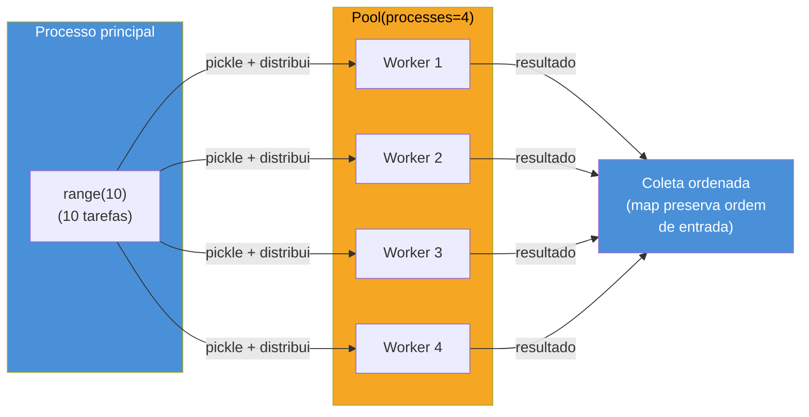
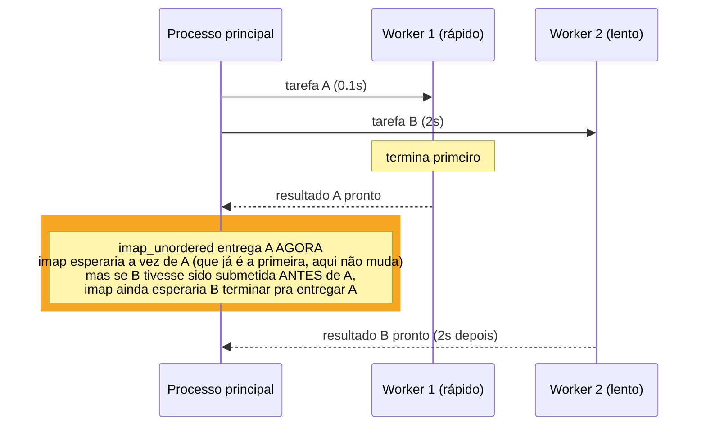
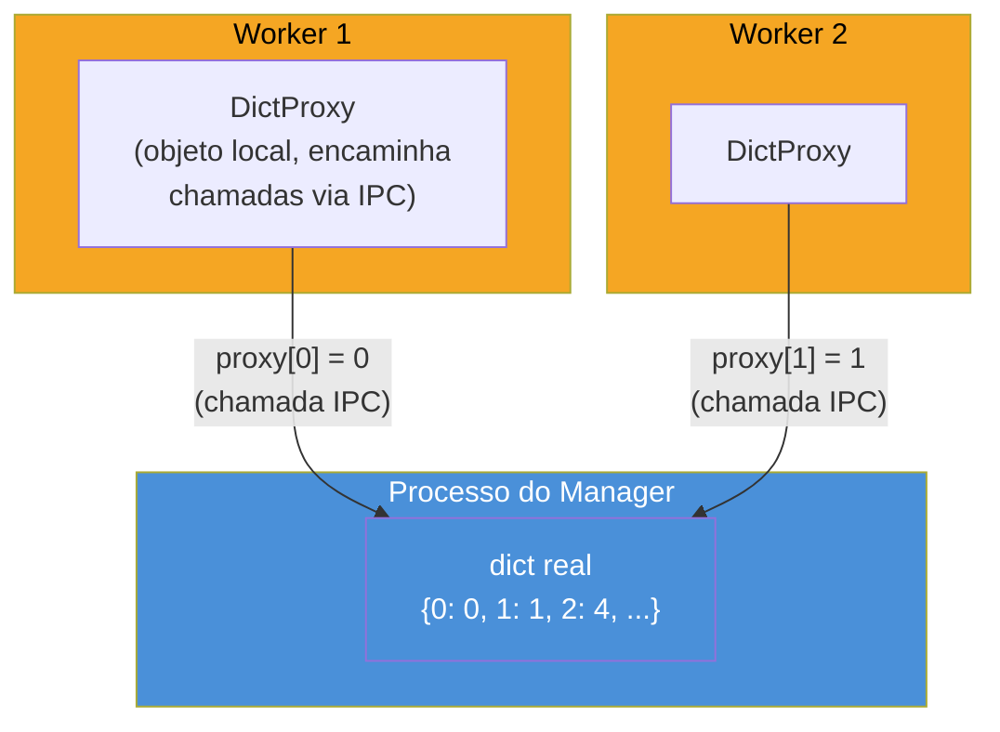
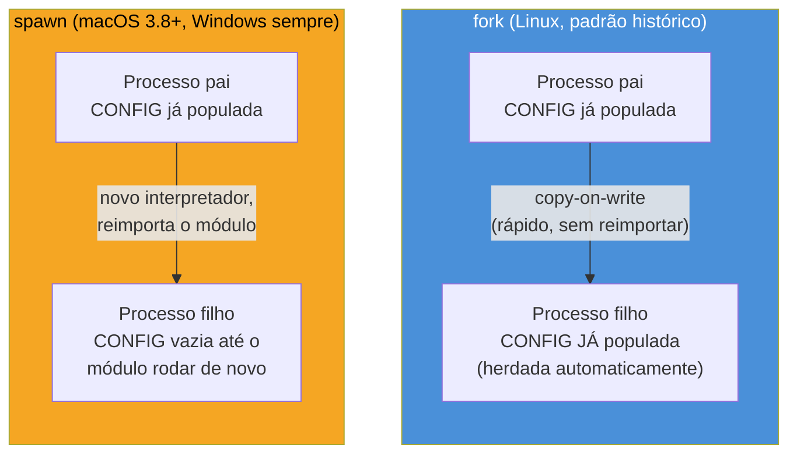
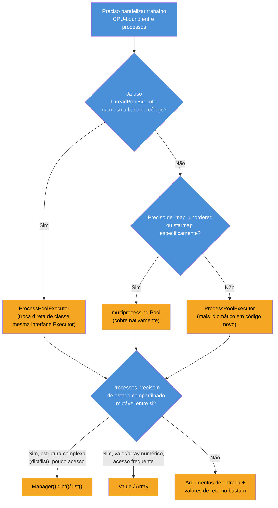

# multiprocessing na prática — Pool, ProcessPoolExecutor e orquestração

> [!abstract] TL;DR
> `multiprocessing.Pool` e `concurrent.futures.ProcessPoolExecutor` são as duas APIs de alto nível para orquestrar processos-trabalhadores em Python — ambas criam um número fixo de processos, distribuem tarefas entre eles e coletam resultados, escondendo a mecânica de serialização (`pickle`) e IPC já vista em [[03-Dominios/Tecnologia/Python/CPython internals/05 - GIL e concorrência na prática — threading vs multiprocessing|CPython internals 05]]. `Pool` tem quatro variantes de despacho — `map` (bloqueante, ordem preservada), `imap`/`imap_unordered` (iteradores preguiçosos, o segundo entrega resultados assim que ficam prontos), e `apply_async` (uma tarefa por vez, com callback) — cada uma trocando ordem de entrega, uso de memória e latência de forma diferente. `ProcessPoolExecutor` é a alternativa moderna, preferida em código novo por compartilhar a interface `Executor` com `ThreadPoolExecutor` (aprofundada na próxima nota). Estado compartilhado entre processos, quando genuinamente necessário, vem de `Manager` (um processo-servidor que hospeda estruturas proxy — `dict`, `list`, `Lock` — acessíveis por múltiplos processos via IPC, mais lento que `Value`/`Array` mas muito mais flexível) ou de `Value`/`Array` (memória compartilhada crua, tipada, mais rápida). E por baixo de tudo isso está uma decisão silenciosa que muda de comportamento entre sistemas operacionais: o **start method** — `fork` (padrão histórico no Linux, copia o processo pai via *copy-on-write*), `spawn` (padrão no macOS desde Python 3.8 e sempre no Windows, reimporta o módulo do zero) e `forkserver` (um meio-termo) — cuja escolha determina se estado global é herdado silenciosamente ou não, e é uma das causas mais comuns de "funciona no meu Linux, quebra no CI do colega".

## O bug que abre esta nota

Um time distribuído — parte da equipe em Linux, parte em macOS — mantém um script de processamento em lote que usa `multiprocessing.Pool` para paralelizar a geração de relatórios. O código lê uma configuração global uma vez, no início do script, e assume que cada processo-trabalhador vai enxergar essa configuração automaticamente:

```python
import multiprocessing
import logging

logging.basicConfig(level=logging.INFO)
logger = logging.getLogger(__name__)

CONFIG = {}  # populada por carregar_configuracao() logo abaixo

def carregar_configuracao():
    global CONFIG
    CONFIG = {"formato": "pdf", "timeout": 30, "cliente": "acme-corp"}
    logger.info("Configuração carregada: %s", CONFIG)

def gerar_relatorio(item_id):
    # assume que CONFIG já foi populada — funciona no Linux dos autores originais
    return f"relatorio-{item_id}.{CONFIG['formato']}"

carregar_configuracao()

if __name__ == "__main__":
    with multiprocessing.Pool(processes=4) as pool:
        resultados = pool.map(gerar_relatorio, range(20))
    print(resultados)
```

No Linux dos autores originais, isso roda sem erro nenhum: `carregar_configuracao()` popula `CONFIG` no processo principal, e cada processo-trabalhador, criado via `fork`, herda uma **cópia** do estado do processo pai no exato momento do `fork` — inclusive `CONFIG` já preenchida. O código parece correto, os relatórios saem certos, ninguém questiona.

Quando um colega roda o mesmo script no macOS, o resultado é `KeyError: 'formato'` dentro de `gerar_relatorio`, vindo de dentro dos processos-trabalhadores — como se `CONFIG` estivesse vazia lá. E está: no macOS, desde o Python 3.8, o *start method* padrão de `multiprocessing` é `spawn`, não `fork`. Um processo criado via `spawn` não herda memória do processo pai por cópia — ele nasce do zero, com um interpretador novo, e **reimporta o módulo principal**. Isso significa que o código de nível de módulo roda de novo dentro do processo-trabalhador — mas `carregar_configuracao()` é chamada fora de qualquer guard, então, tecnicamente, ela *deveria* rodar de novo também... exceto que, no caso comum em que essa lógica está espalhada entre módulos importados condicionalmente, ordem de inicialização diferente, ou side effects que dependem de argumentos de linha de comando não recapturados no processo-filho, o resultado observado é state parcial, inconsistente, ou simplesmente ausente — e o sintoma é sempre o mesmo tipo de superfície: **funciona onde `fork` é o padrão, quebra silenciosamente ou com erro obscuro onde `spawn` é o padrão**.

> [!bug] O que está quebrado, em uma frase
> O código assume que processos-trabalhadores herdam automaticamente qualquer estado global inicializado no processo principal — uma suposição verdadeira sob `fork`, falsa sob `spawn`, e a escolha entre os dois muda silenciosamente conforme o sistema operacional.

Entender por que isso acontece — e como escrever código que funciona igual nos dois casos — é parte do assunto desta nota, junto com a API de orquestração (`Pool`, `ProcessPoolExecutor`, `Manager`) que qualquer código de produção usando `multiprocessing` de fato utiliza no dia a dia.

> [!info] Pré-requisito
> Esta nota pressupõe o mecanismo já estabelecido em [[03-Dominios/Tecnologia/Python/CPython internals/05 - GIL e concorrência na prática — threading vs multiprocessing|CPython internals 05 — GIL e concorrência na prática]]: por que processos não compartilham memória, o custo de `pickle`, e `shared_memory` para dados volumosos. Esta nota não repete esse mecanismo — foca na **API de orquestração**: como distribuir trabalho entre processos e coletar resultados na prática, com `Pool`, `ProcessPoolExecutor` e `Manager`. Threading (criação de threads, `Lock`, condições de corrida) foi coberto em [[01 - Threading na prática — Thread, Lock e condições de corrida|nota 01]] deste galho — vale como pré-requisito conceitual de "por que paralelizar", não como dependência técnica direta.

## O que é: `Pool` como o pool de processos-trabalhadores

`multiprocessing.Pool` cria, na construção, um número fixo de processos-trabalhadores (por padrão, `os.cpu_count()`) e mantém esse conjunto vivo entre chamadas — em vez de criar um processo novo para cada unidade de trabalho (caro, como visto na nota irmã), o `Pool` reaproveita os mesmos processos, distribuindo tarefas para eles conforme ficam disponíveis.

```python
import multiprocessing
import time

def elevar_ao_quadrado(n):
    time.sleep(0.1)  # simula trabalho de CPU
    return n * n

if __name__ == "__main__":
    with multiprocessing.Pool(processes=4) as pool:
        resultados = pool.map(elevar_ao_quadrado, range(10))
    print(resultados)
    # [0, 1, 4, 9, 16, 25, 36, 49, 64, 81] — ordem sempre preservada
```

O `with` garante que o pool é fechado (`close()`, sinalizando que nenhuma tarefa nova será submetida) e aguardado (`join()`, esperando os processos-trabalhadores terminarem) automaticamente ao sair do bloco — o equivalente ao padrão `with lock:` visto na nota 01, mas para o ciclo de vida de processos inteiros em vez de uma seção crítica.



**`Pool` em uma frase:** um conjunto fixo e reaproveitável de processos-trabalhadores, com uma API de distribuição de tarefas que esconde a criação/destruição de processos e a serialização por baixo — pagando o custo de inicialização uma vez, amortizado ao longo de muitas tarefas.

## Como funciona: as quatro formas de despachar trabalho num `Pool`

A API de `Pool` oferece quatro métodos de despacho, e a escolha entre eles é uma das decisões mais concretas ao usar `multiprocessing` — cada um troca ordem de entrega, uso de memória, e latência de forma diferente.

### `map`: bloqueante, ordem preservada, simples

```python
with multiprocessing.Pool(processes=4) as pool:
    resultados = pool.map(elevar_ao_quadrado, range(10))
    # bloqueia até TODAS as 10 tarefas terminarem
    # resultados é uma lista, na MESMA ordem de range(10)
```

`pool.map(funcao, iteravel)` é a forma mais próxima do `map()` embutido do Python — mas paralela. A chamada bloqueia até que todas as tarefas terminem, e o resultado é uma lista completa, na mesma ordem do iterável de entrada, independentemente da ordem em que os processos-trabalhadores de fato terminaram cada tarefa. Esse reordenamento (o `Pool` internamente rastreia qual resultado pertence a qual posição de entrada) tem custo zero perceptível na maioria dos casos, e é o motivo pelo qual `map` é a escolha padrão quando o volume de tarefas cabe confortavelmente na memória e a ordem dos resultados importa (ou é conveniente manter).

### `imap`/`imap_unordered`: iteradores preguiçosos

```python
with multiprocessing.Pool(processes=4) as pool:
    # imap: preguiçoso, mas AINDA preserva ordem — o próximo item só
    # é entregue quando sua vez chega, mesmo que outro já esteja pronto antes
    for resultado in pool.imap(elevar_ao_quadrado, range(10)):
        print(f"recebido (em ordem): {resultado}")

    # imap_unordered: preguiçoso E sem ordem — entrega assim que QUALQUER
    # resultado fica pronto, não necessariamente na ordem de entrada
    for resultado in pool.imap_unordered(elevar_ao_quadrado, range(10)):
        print(f"recebido (assim que pronto): {resultado}")
```

A diferença estrutural para `map` é que `imap`/`imap_unordered` devolvem um **iterador**, não uma lista já completa — os resultados chegam um a um, conforme ficam disponíveis, em vez de o chamador esperar o lote inteiro terminar antes de ver qualquer coisa. Isso importa em dois cenários concretos: quando o volume de tarefas é grande o suficiente para que manter todos os resultados em memória de uma vez seja um problema (`imap` processa item a item, sem acumular a lista inteira), e quando processar resultados assim que ficam prontos — em vez de esperar o lote inteiro — reduz a latência percebida (uma barra de progresso que avança conforme cada item termina, por exemplo).

`imap_unordered` vai um passo além: abre mão da garantia de ordem em troca de entregar cada resultado **assim que ele fica pronto**, não necessariamente na ordem de entrada — se a tarefa 7 termina antes da tarefa 2 (porque demorou menos, ou porque o processo que a executou estava mais livre), `imap_unordered` entrega a 7 primeiro. Para cargas onde as tarefas têm duração muito desigual, isso evita que um resultado rápido fique esperando na fila atrás de um resultado lento só por causa da posição original — útil sempre que o consumidor do resultado não precisa da ordem original (agregação, contagem, gravação incremental num arquivo/banco sem exigir sequência).



### `apply_async`: uma tarefa por vez, com callback

```python
import multiprocessing

def processar(item):
    return item * 2

def quando_pronto(resultado):
    print(f"callback: recebi {resultado}")

def em_caso_de_erro(excecao):
    print(f"callback de erro: {excecao}")

if __name__ == "__main__":
    with multiprocessing.Pool(processes=4) as pool:
        async_result = pool.apply_async(
            processar,
            args=(21,),
            callback=quando_pronto,
            error_callback=em_caso_de_erro,
        )
        # apply_async NÃO bloqueia — retorna um AsyncResult imediatamente
        print("main: continuando outro trabalho enquanto processar(21) roda...")

        valor = async_result.get(timeout=5)  # bloqueia AQUI, se/quando precisar do valor
        print(f"resultado direto: {valor}")
```

`apply_async` despacha **uma única** tarefa (não um iterável inteiro) e retorna imediatamente um objeto `AsyncResult`, sem bloquear — o padrão certo quando as tarefas não vêm de um lote homogêneo e uniforme, mas são submetidas dinamicamente, uma a uma, talvez com argumentos diferentes entre si e callbacks distintos por tarefa. `callback` é chamado automaticamente (numa thread interna do `Pool`, não no processo-trabalhador) quando o resultado chega com sucesso; `error_callback`, se a tarefa levantar uma exceção. `.get(timeout=...)` bloqueia até o resultado estar disponível (ou levanta a exceção original, se a tarefa falhou) — útil quando o chamador eventualmente precisa do valor, mas não imediatamente.

> [!question]- Quando `apply_async` faz mais sentido que `map`/`imap`?
> Quando o padrão de submissão não é "aplique esta função em todo um iterável homogêneo", mas "submeta tarefas conforme elas surgem, possivelmente com funções ou argumentos diferentes entre si, e reaja a cada uma via callback assim que terminar" — por exemplo, um serviço que recebe requisições continuamente e delega cada uma a um processo-trabalhador do pool sem esperar um lote se formar. Para o caso comum de "tenho uma lista de N itens, quero aplicar a mesma função em todos e coletar os resultados", `map`/`imap`/`imap_unordered` são mais diretos e menos código.

| Método | Bloqueia? | Ordem preservada? | Retorno | Uso típico |
|---|---|---|---|---|
| `map` | Sim (até tudo terminar) | Sim | Lista completa | Lote homogêneo, ordem importa, cabe em memória |
| `imap` | Não (iterador) | Sim | Iterador preguiçoso | Lote grande, quer processar conforme chega, ordem ainda importa |
| `imap_unordered` | Não (iterador) | Não | Iterador preguiçoso | Lote grande, tarefas de duração desigual, ordem não importa |
| `apply_async` | Não | N/A (uma tarefa por vez) | `AsyncResult` + callback | Submissão dinâmica, tarefas heterogêneas, reação via callback |

## `chunksize`: amortizando o custo de dispatch para tarefas curtas

Um detalhe que costuma passar despercebido até virar gargalo medido: por padrão, `map`/`imap`/`imap_unordered` enviam os itens do iterável para os processos-trabalhadores em pequenos lotes (*chunks*), não um a um — o parâmetro `chunksize` controla o tamanho desses lotes.

```python
with multiprocessing.Pool(processes=4) as pool:
    # chunksize=1 (comportamento aproximado do default para iteráveis curtos):
    # cada item vira uma mensagem IPC separada — overhead de dispatch por item
    resultados = pool.map(elevar_ao_quadrado, range(10_000), chunksize=1)

    # chunksize maior: agrupa vários itens por mensagem IPC, reduzindo
    # o número de "viagens" entre processo principal e workers
    resultados = pool.map(elevar_ao_quadrado, range(10_000), chunksize=250)
```

Para tarefas que levam microssegundos a poucos milissegundos cada, o custo fixo de despachar cada uma individualmente (serializar, colocar na fila IPC, o worker desserializar, processar, serializar o resultado de volta) pode dominar o tempo total — um `chunksize` maior agrupa várias unidades de trabalho numa única "viagem" de IPC, amortizando esse custo fixo entre elas, ao preço de granularidade menor no balanceamento de carga entre workers (se um `chunk` inteiro cair num worker mais lento, ele processa aquele bloco inteiro antes de pegar o próximo, mesmo que outro worker já esteja ocioso). Não há um valor universal certo — a biblioteca padrão tenta estimar um `chunksize` razoável automaticamente quando o parâmetro não é informado, mas medir com dados reais, como sempre, é a única forma confiável de saber se ajustar esse número compensa numa carga específica.

## `ProcessPoolExecutor`: a interface moderna, unificada com threading

`concurrent.futures.ProcessPoolExecutor` é a alternativa moderna a `multiprocessing.Pool`, e a preferida em código novo — não porque `Pool` seja deficiente, mas porque `ProcessPoolExecutor` implementa a mesma interface `Executor` de `concurrent.futures` que `ThreadPoolExecutor`, a abstração unificadora que a próxima nota deste galho aprofunda em detalhe.

```python
from concurrent.futures import ProcessPoolExecutor, as_completed

def processar_item(item):
    return item ** 2

if __name__ == "__main__":
    with ProcessPoolExecutor(max_workers=4) as executor:
        # .map() tem a mesma cara de Pool.map() — bloqueante, ordem preservada
        resultados = list(executor.map(processar_item, range(10)))
        print(resultados)

        # .submit() é o equivalente a apply_async, mas devolve um Future
        # (a abstração padrão de concurrent.futures, não um AsyncResult específico)
        futures = [executor.submit(processar_item, i) for i in range(10)]
        for future in as_completed(futures):
            print(f"pronto: {future.result()}")
```

A vantagem prática concreta: o código de orquestração ao redor — criar o executor, submeter tarefas, coletar resultados, tratar exceções — é **idêntico**, símbolo por símbolo, ao equivalente com `ThreadPoolExecutor`. Trocar de threads para processos, uma vez que o perfil de carga é identificado como CPU-bound (a árvore de decisão fechada em [[03-Dominios/Tecnologia/Python/CPython internals/05 - GIL e concorrência na prática — threading vs multiprocessing|CPython internals 05]]), é literalmente trocar o nome da classe instanciada — não reescrever a lógica de submissão, coleta e tratamento de erros ao redor dela.

> [!info] Esta nota não aprofunda `Future`, `as_completed`, callbacks e tratamento de exceções
> Esses mecanismos pertencem à interface `Executor` como um todo (compartilhada entre `ThreadPoolExecutor` e `ProcessPoolExecutor`), não são específicos de processos — a próxima nota deste galho, [[05 - concurrent.futures — a abstração unificadora]], cobre `Future` em detalhe: `submit`, `result()`, `add_done_callback`, `as_completed` vs `map`, e onde a abstração unificada "vaza" (exceções levantadas dentro de um processo-trabalhador, picklability de argumentos e retornos). Aqui, o ponto é só situar `ProcessPoolExecutor` como opção de orquestração ao lado de `Pool`.

### `Pool` vs `ProcessPoolExecutor`: quando usar cada um

| Critério | `multiprocessing.Pool` | `ProcessPoolExecutor` |
|---|---|---|
| Interface compartilhada com threading | Não (`Pool` é específico de processos) | Sim (mesma interface `Executor` de `ThreadPoolExecutor`) |
| Variedade de métodos de despacho | `map`/`imap`/`imap_unordered`/`apply`/`apply_async`/`starmap` | `map`/`submit` (menos variantes, mas cobre os casos comuns) |
| `imap_unordered` (entrega assim que pronto, sem ordem) | Sim, nativo | Não diretamente — `as_completed()` sobre uma lista de `Future`s aproxima o mesmo efeito |
| Código já usa `ThreadPoolExecutor` e quer trocar por processos | N/A (reescreveria a orquestração do zero) | Troca direta — mesma interface |
| Código novo, sem restrição de compatibilidade com biblioteca legada | Preferir `ProcessPoolExecutor` (mais idiomático em código moderno) | — |
| Precisa de `imap_unordered` especificamente, ou de `starmap` para funções com múltiplos argumentos posicionais | `Pool` cobre nativamente | Precisa contornar (lambda/`functools.partial`, ou `as_completed`) |

Na prática, a maior parte do código novo em produção converge para `ProcessPoolExecutor`, justamente pela interface unificada — `Pool` continua relevante em bibliotecas mais antigas, em código que já usa `Pool` por outras razões, ou quando `imap_unordered`/`starmap` fazem falta diretamente sem rodeio.

## `Manager`: estado compartilhado entre processos, via proxy

Quando múltiplos processos-trabalhadores genuinamente precisam ler e escrever num mesmo estado compartilhado — não só receber argumentos e devolver resultados independentes, mas coordenar um dicionário, uma lista ou um lock comuns entre todos — `multiprocessing.Manager` é a ferramenta de propósito geral para isso.

```python
import multiprocessing

def registrar_progresso(item_id, progresso_compartilhado, lock):
    resultado = item_id ** 2
    with lock:  # protege a escrita concorrente no dict compartilhado
        progresso_compartilhado[item_id] = resultado
    return resultado

if __name__ == "__main__":
    with multiprocessing.Manager() as manager:
        progresso = manager.dict()   # dict "proxy", vive no processo do Manager
        lock = manager.Lock()        # lock que funciona entre PROCESSOS, não só threads

        with multiprocessing.Pool(processes=4) as pool:
            args = [(i, progresso, lock) for i in range(10)]
            pool.starmap(registrar_progresso, args)

        print(dict(progresso))  # converte o proxy pra dict normal ao final
        # {0: 0, 1: 1, 2: 4, 3: 9, ...} — populado por todos os 4 processos
```

Por baixo, `Manager()` inicia um **processo servidor separado** que hospeda os objetos reais (`dict`, `list`, `Lock`, `Namespace`, entre outros tipos suportados) — o `progresso_compartilhado` que cada processo-trabalhador recebe não é o dicionário em si, é um **objeto proxy**: toda operação (`progresso_compartilhado[item_id] = resultado`) é, por trás dos panos, uma chamada IPC para o processo servidor, que executa a operação de fato no objeto real e devolve o resultado. Isso é o que permite que estruturas de dados Python de alto nível — mutáveis, com toda a API normal de `dict`/`list` — funcionem através da fronteira entre processos que, de outra forma, não compartilham memória nenhuma.



O preço dessa flexibilidade é latência: **cada operação** no objeto proxy — mesmo uma leitura simples de chave — é uma volta completa de IPC até o processo servidor e de volta, não um acesso de memória local. Para leituras/escritas frequentes em loop apertado, isso pode ser ordens de magnitude mais lento que a alternativa mais crua a seguir.

### `Value`/`Array`: memória compartilhada tipada, sem processo servidor

Para o caso mais restrito — um único valor numérico ou um array de tamanho fixo, compartilhado entre processos, sem precisar da flexibilidade de um `dict`/`list` completo — `multiprocessing.Value` e `multiprocessing.Array` oferecem memória compartilhada de verdade (não proxy, não IPC por operação), tipada via os mesmos códigos do módulo `ctypes`/`array`:

```python
import multiprocessing

def incrementar(contador_compartilhado, lock):
    for _ in range(100_000):
        with lock:
            contador_compartilhado.value += 1

if __name__ == "__main__":
    contador = multiprocessing.Value("i", 0)  # "i" = int com sinal (ctypes)
    lock = multiprocessing.Lock()

    processos = [
        multiprocessing.Process(target=incrementar, args=(contador, lock))
        for _ in range(4)
    ]
    for p in processos:
        p.start()
    for p in processos:
        p.join()

    print(contador.value)  # 400_000 — determinístico, protegido pelo lock
```

`Value("i", 0)` aloca um bloco de memória do sistema operacional que múltiplos processos mapeiam diretamente — sem processo servidor intermediário, sem serialização por operação, mais próximo do custo de acesso de memória compartilhada real (o mesmo mecanismo de fundo de `shared_memory`, visto na nota irmã). O trade-off inverso do `Manager`: muito mais rápido para o caso restrito de valores/arrays numéricos de tamanho fixo, mas sem a flexibilidade de estruturas Python arbitrárias — não dá para colocar um `Value` compartilhando uma lista de strings de tamanho variável, por exemplo.

| Aspecto | `Manager().dict()`/`list()`/`Lock()` | `Value`/`Array` |
|---|---|---|
| Mecanismo | Processo servidor + objetos proxy (IPC por operação) | Memória compartilhada real, mapeada diretamente |
| Velocidade | Mais lenta (uma volta de IPC por operação) | Mais rápida (acesso quase direto) |
| Flexibilidade de tipo | Alta — `dict`, `list`, `Namespace`, `Queue`, `Lock`, etc. | Baixa — valores/arrays numéricos tipados (`ctypes`), tamanho fixo |
| Sincronização | `Manager().Lock()` disponível, mas ainda precisa ser usado explicitamente | `lock=True` (padrão) já embutido; ou lock explícito próprio |
| Uso típico | Estado compartilhado estruturado, complexo, acessado com pouca frequência | Contador/flag/buffer numérico compartilhado, acessado com alta frequência |

> [!warning] `Manager`/`Value`/`Array` não eliminam a necessidade de lock
> Assim como `shared_memory` puro (visto na nota irmã), tanto os proxies do `Manager` quanto `Value`/`Array` continuam sujeitos ao mesmo problema estrutural de leitura-modificação-escrita não-atômica coberto na nota 01 deste galho — `contador_compartilhado.value += 1` sem lock tem exatamente o mesmo bug do `contador += 1` sem lock entre threads, só que entre processos, e sem GIL nenhum para mitigar parcialmente (cada processo tem o seu, e eles não se comunicam). `Value`/`Array` têm um `Lock` embutido opcional (`lock=True`, o padrão) acessível via `.get_lock()`, mas o incremento `+=` em si não usa esse lock automaticamente — é preciso `with contador_compartilhado.get_lock():` ou um lock próprio, exatamente como no exemplo acima.

## `fork`, `spawn`, `forkserver`: revisitando o bug de abertura em detalhe

Voltando ao bug de abertura — a causa raiz é a diferença de comportamento entre os *start methods* disponíveis, documentados em [Contexts and start methods](https://docs.python.org/3/library/multiprocessing.html#contexts-and-start-methods) na referência oficial:

- **`fork`** — padrão histórico no Linux (não disponível no Windows, porque `fork()` não existe como syscall nativa lá). O processo-filho é uma cópia do processo pai no instante exato da chamada, via *copy-on-write* do kernel: as páginas de memória do filho inicialmente apontam para as mesmas páginas físicas do pai, e só divergem (são de fato duplicadas) quando um dos dois escreve nelas. Isso torna `fork` rápido (não precisa reimportar módulos) e faz o filho **herdar automaticamente** qualquer estado já existente no processo pai no momento do fork — inclusive variáveis globais já populadas, módulos já importados, locks e file descriptors abertos.
- **`spawn`** — padrão no macOS desde o Python 3.8 (a mudança de padrão veio justamente por segurança e previsibilidade: `fork` em processos multi-threaded pode herdar locks travados de threads que não existem mais no filho, um problema documentado e citado como motivação oficial da mudança) e o único método disponível no Windows. O processo-filho é iniciado do zero — um interpretador CPython novo, que **reimporta o módulo principal** — mais lento para iniciar, mas sem herdar nenhum estado acidental do processo pai além do que é explicitamente passado como argumento.
- **`forkserver`** — um meio-termo: um processo servidor é criado uma única vez, no início, com o mínimo de estado possível carregado; novos processos-trabalhadores nascem via `fork` a partir *desse* processo servidor limpo, não do processo principal da aplicação (que pode já ter acumulado bastante estado, threads, conexões abertas). Evita o problema de herdar estado acidental do `fork` puro, sem pagar o custo total de reimportação de módulos do `spawn` a cada processo novo.



> [!warning] `if __name__ == "__main__":` não é estilo — é exigido sob `spawn`
> Como o processo-filho sob `spawn` reimporta o módulo principal do zero, qualquer código de criação de processos (`Pool(...)`, `Process(...).start()`) que esteja no nível do módulo, sem o guard `if __name__ == "__main__":`, executa de novo a cada reimportação — cada processo-filho tentando criar seus próprios processos-filhos, numa cascata recursiva. Esse guard aparece em **todo** exemplo desta nota não por convenção arbitrária, mas porque, sob `spawn`, omiti-lo quebra o programa (ou o faz explodir em processos recursivos) de forma determinística.

### Escolhendo o start method explicitamente

Depender do padrão implícito do sistema operacional é exatamente o que causou o bug de abertura — a mitigação estrutural é escolher o *start method* explicitamente, em vez de deixá-lo implícito e variável entre ambientes:

```python
import multiprocessing

if __name__ == "__main__":
    # Força spawn explicitamente, independente do SO — código passa a se
    # comportar igual em Linux, macOS e Windows, sem depender do padrão
    ctx = multiprocessing.get_context("spawn")

    with ctx.Pool(processes=4) as pool:
        resultados = pool.map(gerar_relatorio, range(20))
```

`multiprocessing.get_context(metodo)` devolve um objeto de contexto configurado para aquele método específico, com sua própria versão de `Pool`, `Process`, `Queue` etc. — usar esse contexto em vez do módulo `multiprocessing` diretamente garante que o comportamento não varia entre sistemas operacionais nem entre versões futuras do Python (a documentação oficial nota que o padrão pode mudar novamente em versões futuras, inclusive cogitando `spawn` como padrão universal por segurança, mesmo no Linux). O preço de forçar `spawn` explicitamente é reescrever qualquer código que dependia (mesmo sem perceber) de herança implícita de estado via `fork` — inicializando esse estado explicitamente dentro de cada processo-trabalhador, tipicamente via um parâmetro `initializer`/`initargs` do `Pool`:

```python
import multiprocessing

CONFIG = {}

def inicializar_worker():
    """Roda UMA vez por processo-trabalhador, na criação do Pool —
    funciona igual sob fork OU spawn, porque não depende de herança implícita."""
    global CONFIG
    CONFIG = {"formato": "pdf", "timeout": 30, "cliente": "acme-corp"}

def gerar_relatorio(item_id):
    return f"relatorio-{item_id}.{CONFIG['formato']}"

if __name__ == "__main__":
    with multiprocessing.Pool(processes=4, initializer=inicializar_worker) as pool:
        resultados = pool.map(gerar_relatorio, range(20))
    print(resultados)
    # Funciona identicamente em Linux (fork) e macOS/Windows (spawn) —
    # CONFIG é populada explicitamente dentro de CADA worker, uma vez,
    # em vez de depender de ser herdada (ou não) do processo pai.
```

Esse é o consertos definitivo do bug de abertura: `initializer` roda explicitamente uma vez por processo-trabalhador, no momento em que ele é criado pelo `Pool` — independente de qual *start method* está em uso, o resultado é o mesmo, porque o código não depende mais de uma suposição implícita sobre herança de estado.

## Na prática: `Pool` cru vs `ProcessPoolExecutor` — quando escolher cada um

Juntando as peças desta nota numa árvore de decisão prática:



## Armadilhas comuns

> [!warning] Depender do start method padrão do sistema operacional
> **O que acontece:** código testado só em Linux (onde `fork` é o padrão histórico) assume, silenciosamente, que processos-trabalhadores herdam qualquer estado global já inicializado no processo principal — e quebra, com erro obscuro ou comportamento incorreto sem exceção nenhuma, ao rodar em macOS (`spawn` desde 3.8) ou Windows (`spawn` sempre). **Por quê:** `fork` copia o estado do processo pai por *copy-on-write*; `spawn` reimporta o módulo do zero, sem herdar nada além do que é passado explicitamente como argumento — os dois comportamentos não são intercambiáveis, e qual deles roda depende do sistema operacional, não de nada no próprio código. **Como evitar:** nunca depender de estado global "só populado antes do Pool ser criado" — inicializar qualquer estado necessário dentro de cada processo-trabalhador via `initializer`/`initargs`, ou passá-lo explicitamente como argumento de cada tarefa. Para máxima previsibilidade entre ambientes, considerar `multiprocessing.get_context("spawn")` explicitamente, mesmo em Linux, e testar nesse modo antes de assumir portabilidade.

> [!warning] Esquecer o guard `if __name__ == "__main__":`
> **O que acontece:** sob `spawn`, cada processo-filho reimporta o módulo principal — código de criação de `Pool`/`Process` fora do guard executa de novo a cada reimportação, gerando uma cascata recursiva de processos até o sistema ficar sem recursos. **Por quê:** é consequência direta do mecanismo de `spawn` — reimportação do zero do módulo `__main__`. **Como evitar:** todo script que cria processos diretamente (`Pool(...)`, `Process(...).start()`) no nível do módulo precisa desse guard, sem exceção, independente de o ambiente de desenvolvimento usar `fork` — o comportamento correto em produção (ou no ambiente de outro desenvolvedor) não pode depender de qual sistema operacional roda o código hoje.

> [!warning] Usar `Manager` para acesso de altíssima frequência
> **O que acontece:** um contador ou flag compartilhado, atualizado em loop apertado por vários processos via `Manager().Value` ou `Manager().dict()`, se torna o gargalo dominante do programa — mais lento que o próprio trabalho que estava sendo paralelizado. **Por quê:** cada operação num objeto proxy do `Manager` é uma chamada IPC completa até o processo servidor — não um acesso de memória local. Para acesso de alta frequência, esse custo de IPC repetido domina o tempo total. **Como evitar:** para valores/arrays numéricos de acesso frequente, usar `multiprocessing.Value`/`Array` (memória compartilhada real, sem processo servidor) em vez de `Manager`; reservar `Manager` para estruturas complexas (`dict`/`list` com chaves/itens arbitrários) acessadas com frequência moderada, onde a flexibilidade compensa a latência.

> [!warning] Passar objetos não-picklable como argumento ou valor de retorno
> **O que acontece:** `Pool.map()`/`ProcessPoolExecutor.submit()` levanta `PicklingError`/`TypeError` ao tentar serializar um argumento ou retorno — lambdas, closures, conexões de banco de dados abertas, sockets, generators em andamento, ou instâncias com recursos do sistema operacional embutidos. **Por quê:** como visto na nota irmã, `pickle` precisa reconstruir o objeto do zero no processo de destino — recursos que representam estado do próprio sistema operacional (um file descriptor, uma conexão TCP estabelecida) não têm representação serializável reconstruível em outro processo. **Como evitar:** passar dados "puros" (primitivos, listas, dicionários, arrays) como argumentos, e abrir recursos (conexões, arquivos) **dentro** da função que roda no processo-trabalhador — ou via `initializer` do `Pool`/`ProcessPoolExecutor`, que roda uma vez por processo-trabalhador na criação, não a cada tarefa.

> [!warning] Criar um `Pool` novo por lote em vez de reaproveitar um único pool
> **O que acontece:** código que chama `with multiprocessing.Pool(...) as pool:` dentro de um loop, criando e destruindo o pool inteiro a cada lote de trabalho, em vez de criar o pool uma vez e submeter múltiplos lotes a ele. **Por quê:** cada `Pool` novo paga o custo de criação de N processos do zero (a ordem de grandeza de milissegundos a centenas de milissegundos por processo, vista na nota irmã) — repetir isso a cada lote anula boa parte do ganho de reaproveitar processos, que é justamente a razão de existir de um *pool*. **Como evitar:** criar o `Pool`/`ProcessPoolExecutor` uma única vez, fora do loop de lotes, e submeter múltiplas rodadas de trabalho ao mesmo pool — fechando-o só ao final de todo o processamento.

## Em entrevista

Depois de estabelecer por que `multiprocessing` é a ferramenta certa para CPU-bound (assunto da nota irmã de CPython internals), a pergunta prática de acompanhamento numa entrevista sênior costuma ser exatamente sobre a API: **"na prática, como você orquestraria isso — `Pool` ou `ProcessPoolExecutor`, e como você lidaria com estado compartilhado?"**

> "In practice I default to `ProcessPoolExecutor` from `concurrent.futures` for new code, mainly because it shares the same `Executor` interface as `ThreadPoolExecutor` — if I later discover the workload is actually I/O-bound rather than CPU-bound, or vice versa, swapping between them is a one-line change, not a rewrite of the orchestration logic. I'd reach for `multiprocessing.Pool` directly when I specifically need `imap_unordered` — results delivered as soon as they're ready, not in submission order — which matters for workloads with uneven task duration, or when I need `starmap` for functions with multiple positional arguments. For shared state between processes, I'm deliberate about the tool: if it's a simple numeric counter or fixed-size array updated frequently, `multiprocessing.Value`/`Array` gives real shared memory without a server process in the middle. If it's a more complex structure — a dict or list accessed less frequently — `Manager` gives me that flexibility through proxy objects, at the cost of an IPC round-trip per operation, so I wouldn't use it in a hot loop. And regardless of which pool API I use, I always guard process creation with `if __name__ == '__main__':` and avoid relying on global state being implicitly inherited by workers — because that only works under `fork`, which is Linux's historical default but not macOS's or Windows's since Python 3.8, so code that depends on it silently breaks across environments."

Uma pergunta de acompanhamento comum para checar profundidade real: **"por que o `fork` deixou de ser o padrão no macOS a partir do Python 3.8?"** — a resposta sênior nomeia o motivo documentado oficialmente: `fork` em processos multi-threaded pode herdar estado inconsistente (locks que estavam travados por uma thread que não existe mais no processo-filho, por exemplo), um problema de segurança e previsibilidade que motivou a mudança de padrão — não uma limitação técnica do macOS em si, mas uma escolha deliberada de segurança da própria biblioteca padrão.

> [!question]- E se o entrevistador perguntar especificamente sobre `chunksize`?
> Vale mencionar que `chunksize` controla quantos itens de um iterável são agrupados numa única mensagem de IPC entre o processo principal e cada worker, em `map`/`imap`/`imap_unordered` — o valor certo depende do perfil da carga: tarefas muito curtas (microssegundos a poucos milissegundos) se beneficiam de `chunksize` maior, porque o custo fixo de despacho por item é amortizado entre mais unidades de trabalho; tarefas mais longas (segundos) tendem a preferir `chunksize` pequeno (frequentemente 1), porque isso permite melhor balanceamento de carga entre workers — um worker que termina um chunk pequeno mais cedo pega o próximo mais rápido, em vez de ficar preso processando um lote grande enquanto outro worker já está ocioso. Não é o ponto central da resposta esperada, mas mostra que o candidato já mediu isso na prática, não só leu a assinatura do parâmetro.

## Como explicar em inglês

| PT | EN |
|----|----|
| pool de processos | process pool |
| processo-trabalhador | worker process |
| despacho (de tarefas) | dispatch |
| tamanho de lote (por chamada) | chunk size |
| iterador preguiçoso | lazy iterator |
| entrega assim que pronto (sem ordem) | delivered as ready (unordered) |
| método de início (do processo) | start method |
| herdar (estado do processo pai) | inherit (parent process state) |
| reimportar (o módulo) | re-import (the module) |
| objeto proxy | proxy object |
| memória compartilhada | shared memory |
| estado global | global state |
| inicializador (do worker) | worker initializer |

## O que vem a seguir

Esta nota cobriu a API de orquestração prática de `multiprocessing` — `Pool` (`map`/`imap`/`imap_unordered`/`apply_async`), `ProcessPoolExecutor`, `Manager`/`Value`/`Array` para estado compartilhado, e a diferença real de comportamento entre start methods — sem repetir o mecanismo de custo de serialização já coberto na nota irmã de CPython internals. As próximas notas do galho constroem sobre essa base:

- [[05 - concurrent.futures — a abstração unificadora]] — aprofunda `Future` (`submit`, `result()`, `add_done_callback`), `as_completed` vs `map`, e onde a abstração unificada entre `ThreadPoolExecutor`/`ProcessPoolExecutor` vaza — exceções levantadas dentro de processos, picklability de argumentos e retornos, comportamento de timeout.
- [[03-Dominios/Tecnologia/Python/CPython internals/05 - GIL e concorrência na prática — threading vs multiprocessing|CPython internals 05 — GIL e concorrência na prática]] — pré-requisito desta nota: o mecanismo de custo (serialização via `pickle`, IPC, `shared_memory`) que motiva boa parte das decisões de orquestração vistas aqui.
- [[01 - Threading na prática — Thread, Lock e condições de corrida|01 — Threading na prática]] — a contraparte para trabalho I/O-bound: `Thread`, `Lock`, condições de corrida — o mesmo problema de leitura-modificação-escrita não-atômica que reaparece nesta nota ao discutir `Value`/`Array` sem lock, agora entre processos em vez de threads.
- [[03-Dominios/Tecnologia/Python/Concorrência e paralelismo/index|Concorrência e paralelismo (Galho 7)]] — MOC deste galho.

## Fontes

- Python Software Foundation. *multiprocessing — Process-based parallelism*. docs.python.org, versão 3.14. https://docs.python.org/3/library/multiprocessing.html (acessado em 2026-07-10) — referência completa de `Pool`, `Process`, `Manager`, `Value`/`Array`.
- Python Software Foundation. *multiprocessing — Contexts and start methods*. docs.python.org, versão 3.14. https://docs.python.org/3/library/multiprocessing.html#contexts-and-start-methods (acessado em 2026-07-10) — `fork`/`spawn`/`forkserver`, mudança de padrão por sistema operacional, motivação de segurança da mudança em macOS desde 3.8.
- Python Software Foundation. *concurrent.futures — Launching parallel tasks*. docs.python.org, versão 3.14. https://docs.python.org/3/library/concurrent.futures.html (acessado em 2026-07-10) — `ProcessPoolExecutor`, interface `Executor` unificada com `ThreadPoolExecutor`.
- Python Software Foundation. *multiprocessing.pool.Pool — map, imap, imap_unordered, apply_async*. docs.python.org, versão 3.14. https://docs.python.org/3/library/multiprocessing.html#module-multiprocessing.pool (acessado em 2026-07-10)
- Python Software Foundation. *multiprocessing.managers — Manager objects and proxies*. docs.python.org, versão 3.14. https://docs.python.org/3/library/multiprocessing.html#managers (acessado em 2026-07-10)
- Python Software Foundation. *multiprocessing — Shared ctypes objects (Value, Array)*. docs.python.org, versão 3.14. https://docs.python.org/3/library/multiprocessing.html#shared-ctypes-objects (acessado em 2026-07-10)
- Real Python. *Speed Up Your Python Program With Concurrency*. realpython.com. https://realpython.com/python-concurrency/ (acessado em 2026-07-10) — comparação prática threading/asyncio/multiprocessing com exemplos de `Pool`/`ProcessPoolExecutor`.
- **Fluent Python**, 2ª ed. — Luciano Ramalho, capítulo sobre concorrência: uso prático de `Pool`, `ProcessPoolExecutor`, e discussão de start methods.
- [[03-Dominios/Tecnologia/Python/CPython internals/05 - GIL e concorrência na prática — threading vs multiprocessing|05 — GIL e concorrência na prática: threading vs multiprocessing]] — nota irmã (Galho 6), pré-requisito direto: mecanismo de custo (pickle/IPC/shared_memory) referenciado, não repetido, nesta nota.

Consultado em 2026-07-10.
