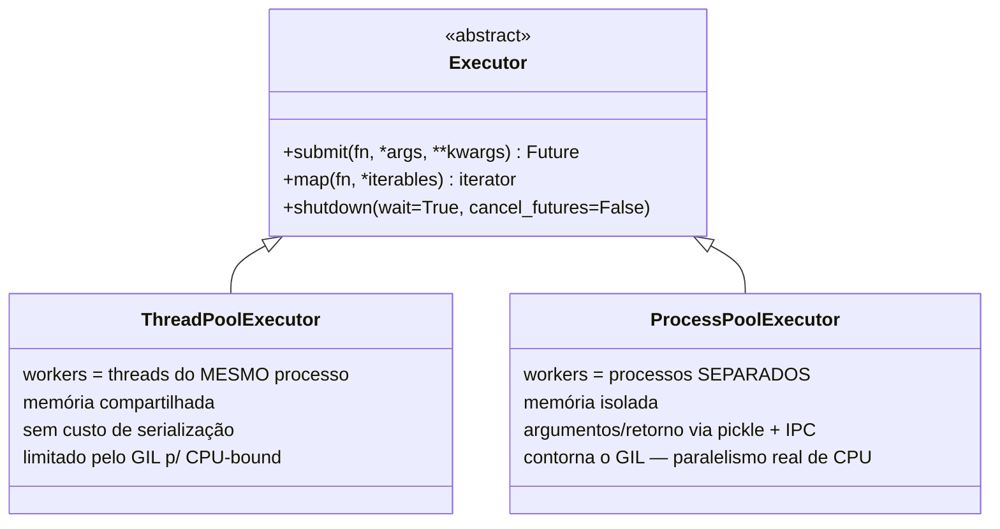
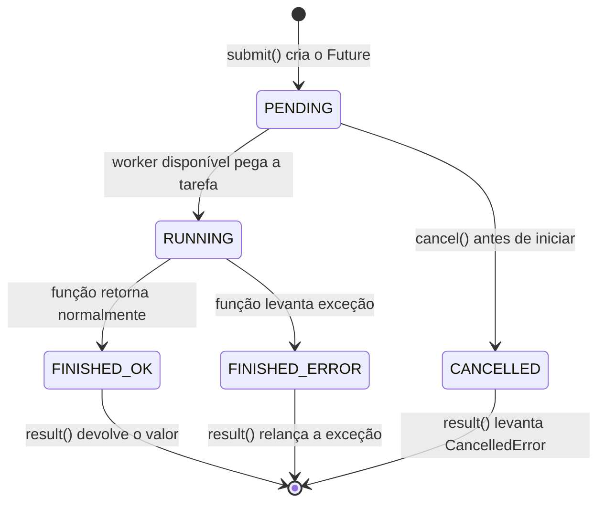
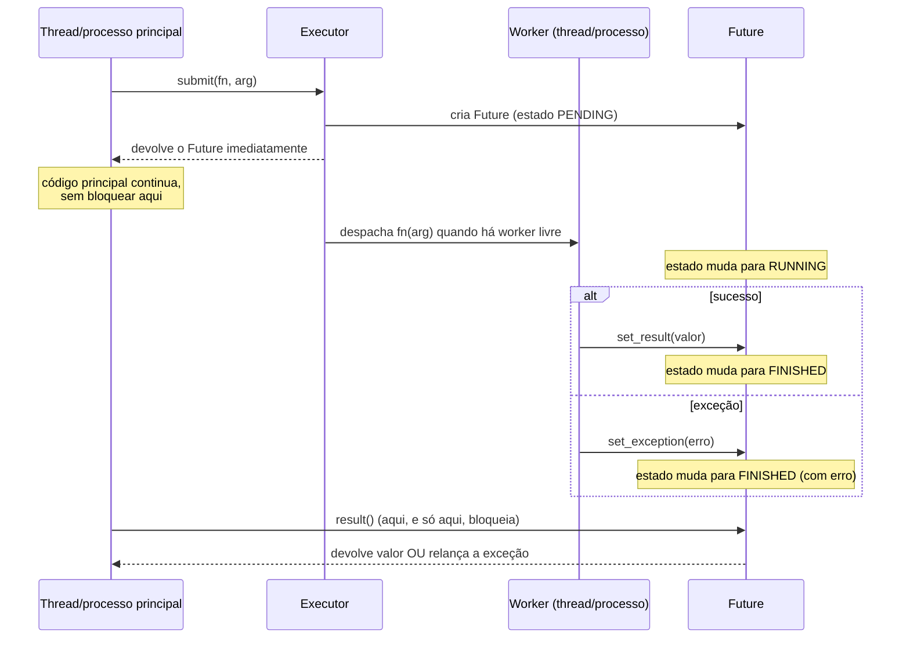

# concurrent.futures — a abstração unificadora

> [!abstract] TL;DR
> `concurrent.futures` oferece uma interface única — `Executor` — para submeter trabalho concorrente sem se comprometer, no ponto de chamada, com *como* esse trabalho vai rodar: `ThreadPoolExecutor` executa em threads (bom para I/O-bound), `ProcessPoolExecutor` executa em processos separados (bom para CPU-bound, contornando o GIL). Ambos expõem os mesmos métodos — `submit()`, `map()`, `shutdown()` — e ambos devolvem objetos `Future`, um "recibo" de um resultado que ainda não existe, com `.result()`, `.done()`, `.exception()` e `.add_done_callback()`. A promessa de design é sedutora: trocar `ThreadPoolExecutor` por `ProcessPoolExecutor` deveria ser uma mudança de uma linha, sem reescrever a orquestração. Na prática, a abstração **vaza**: exceções levantadas dentro de um worker (thread ou processo) não propagam no ponto onde ocorreram — ficam guardadas dentro do `Future` e só explodem quando alguém chama `.result()`, o que torna fácil "engolir" erros silenciosamente ao usar `submit()` sem nunca coletar o resultado. E processos, ao contrário de threads, exigem que argumentos, resultado e a própria função sejam **picklable** — um objeto que não serializa não falha na submissão, falha de forma adiada e confusa, só quando `.result()` é chamado.

## O bug que abre esta nota

Um desenvolvedor pleno decide paralelizar uma rotina de enriquecimento de pedidos: para cada pedido, chamar uma função que calcula frete, valida estoque e grava um log de auditoria. A primeira versão usa `ThreadPoolExecutor`, porque a maior parte do trabalho é I/O (chamadas de rede para o serviço de frete). Funciona bem. Alguém então percebe que uma das etapas — recalcular um score de risco de fraude — é pesada em CPU, então decide mover só essa etapa para processos, seguindo a lógica "troco `ThreadPoolExecutor` por `ProcessPoolExecutor` e pronto, a API é a mesma":

```python
from concurrent.futures import ThreadPoolExecutor, ProcessPoolExecutor

class CalculadoraDeRisco:
    def __init__(self, modelo):
        self.modelo = modelo   # um objeto carregado de um arquivo .pkl de ML

    def calcular(self, pedido):
        return self.modelo.prever(pedido)

calculadora = CalculadoraDeRisco(modelo=carregar_modelo())

def processar_pedidos(pedidos):
    # "só troquei Thread por Process, a interface é idêntica..."
    with ProcessPoolExecutor(max_workers=4) as executor:
        futures = [executor.submit(calculadora.calcular, p) for p in pedidos]
        for future in futures:
            resultado = future.result()
            print(resultado)

processar_pedidos(pedidos_do_dia)
```

Rodando isso, nada acontece na hora do `submit()` — os quatro `submit()` retornam `Future`s normalmente, sem nenhum erro visível. O programa parece estar progredindo. Só quando o primeiro `future.result()` é chamado é que ele estoura:

```
Traceback (most recent call last):
  File "processar.py", line 15, in processar_pedidos
    resultado = future.result()
                ^^^^^^^^^^^^^^^
  File "/usr/lib/python3.12/concurrent/futures/_base.py", line 456, in result
    return self.__get_result()
  File "/usr/lib/python3.12/concurrent/futures/_base.py", line 401, in __get_result
    raise self._exception
  File "/usr/lib/python3.12/concurrent/futures/process.py", line 205, in _process_worker
    call_item = call_queue.get(block=True)
  File "/usr/lib/python3.12/multiprocessing/queues.py", line 122, in get
    return _ForkingPickler.loads(res)
           ^^^^^^^^^^^^^^^^^^^^^^^^^^
_pickle.PicklingError: Can't pickle <bound method CalculadoraDeRisco.calcular
of <__main__.CalculadoraDeRisco object at 0x7f2a1c0b1d90>>: it's not the same
object as __main__.CalculadoraDeRisco.calcular
```

O erro real — `calculadora.calcular` é um método vinculado (*bound method*) de um objeto que carrega um modelo de ML potencialmente não-serializável, e `ProcessPoolExecutor` precisa **picklar** tudo que atravessa a fronteira entre o processo principal e o processo worker — nunca aparece no `submit()`, onde a decisão errada foi tomada. Aparece páginas de traceback depois, num `.result()` que, superficialmente, parece só estar "coletando" um valor já calculado. Com `ThreadPoolExecutor` esse código funcionava perfeitamente, porque threads compartilham memória — nada precisa ser serializado para atravessar a fronteira, porque não há fronteira de processo nenhuma para atravessar.

> [!bug] O que está quebrado, em uma frase
> A troca `ThreadPoolExecutor` → `ProcessPoolExecutor` não é "trocar uma linha" de fato: processos exigem que função, argumentos e retorno sejam picklable, e essa exigência só se manifesta como erro tardiamente — no `.result()`, não no `.submit()` onde o problema realmente mora.

Entender por que a interface comum de `concurrent.futures` existe, o que ela genuinamente unifica, e exatamente onde ela para de esconder a diferença entre threads e processos, é o assunto do resto desta nota.

## Por que essa API existe: uma interface, duas implementações

Antes do `concurrent.futures` (introduzido no Python 3.2), paralelizar trabalho em Python significava escolher entre duas APIs com formatos bem diferentes: `threading.Thread` com `start()`/`join()` manuais (como visto em [[01 - Threading na prática — Thread, Lock e condições de corrida]]), ou `multiprocessing.Pool` com seu próprio vocabulário de `map`/`apply_async`/`imap` (coberto em [[04 - multiprocessing na prática — Pool, ProcessPoolExecutor e orquestração]]). Migrar entre threads e processos significava reescrever a camada de orquestração inteira, porque as duas APIs não compartilhavam forma nenhuma.

`concurrent.futures` resolve isso definindo uma interface abstrata única, `Executor`, com duas implementações concretas — `ThreadPoolExecutor` e `ProcessPoolExecutor` — que expõem exatamente os mesmos métodos:



A promessa de design, explícita na documentação oficial, é que **a decisão de "threads ou processos" fica isolada num único ponto do código** — qual classe é instanciada — enquanto toda a lógica de submissão de trabalho, coleta de resultados e tratamento de erros permanece idêntica. Isso é genuinamente valioso: um script que descobre, em produção, que sua carga é mais CPU-bound do que se pensava pode trocar `ThreadPoolExecutor(max_workers=8)` por `ProcessPoolExecutor(max_workers=4)` e, na maioria dos casos simples (funções puras, argumentos e retornos picklable), o resto do código de orquestração realmente não muda uma linha. O ganho arquitetural é desacoplar "como o trabalho é submetido e coletado" de "onde o trabalho executa" — a mesma separação de responsabilidade que motiva interfaces abstratas em qualquer linguagem, aqui aplicada especificamente ao eixo thread-vs-processo do Python.

```python
from concurrent.futures import ThreadPoolExecutor, ProcessPoolExecutor

def baixar_pagina(url):
    import urllib.request
    with urllib.request.urlopen(url, timeout=5) as resp:
        return len(resp.read())

def calcular_hash_pesado(dados):
    import hashlib
    resultado = dados
    for _ in range(200_000):
        resultado = hashlib.sha256(resultado.encode()).hexdigest()
    return resultado

urls = ["https://example.com"] * 8
dados = ["semente"] * 8

# I/O-bound: threads bastam, sem custo de serialização
with ThreadPoolExecutor(max_workers=8) as executor:
    tamanhos = list(executor.map(baixar_pagina, urls))

# CPU-bound: processos contornam o GIL — mesma forma de chamada
with ProcessPoolExecutor(max_workers=4) as executor:
    hashes = list(executor.map(calcular_hash_pesado, dados))
```

O código de orquestração — `with ... as executor: executor.map(...)` — é idêntico nos dois blocos. Só o nome da classe muda, e essa é exatamente a proposta de valor da abstração: escolher a estratégia de concorrência certa para o tipo de carga (I/O-bound vs CPU-bound, a mesma árvore de decisão de [[03-Dominios/Tecnologia/Python/CPython internals/05 - GIL e concorrência na prática — threading vs multiprocessing|Galho 6 nota 05]]) sem pagar o custo de reescrever a camada que submete e coleta trabalho.

## `submit()` vs `map()`: duas formas de despachar trabalho

`Executor` expõe dois métodos para submeter trabalho, e a escolha entre eles muda o formato do que se recebe de volta.

**`submit(fn, *args, **kwargs)`** despacha **uma** chamada e devolve imediatamente um único objeto `Future` — um "recibo" que representa o resultado futuro daquela chamada específica. `submit()` é a ferramenta certa quando as chamadas têm argumentos heterogêneos, quando é preciso rastrear cada tarefa individualmente (por exemplo, associar cada `Future` a um identificador de negócio), ou quando o processamento precisa reagir a cada resultado assim que ele fica pronto, não necessariamente na ordem de submissão.

```python
from concurrent.futures import ThreadPoolExecutor

def processar_pedido(id_pedido):
    # trabalho simulado
    import time, random
    time.sleep(random.uniform(0.1, 0.5))
    return f"pedido {id_pedido} processado"

with ThreadPoolExecutor(max_workers=3) as executor:
    future_a = executor.submit(processar_pedido, 101)
    future_b = executor.submit(processar_pedido, 102)
    future_c = executor.submit(processar_pedido, 103)

    # cada Future é rastreável individualmente
    print(future_a.result())
    print(future_b.result())
    print(future_c.result())
```

**`map(fn, *iterables, timeout=None, chunksize=1)`** é o análogo do `map()` embutido do Python, mas concorrente: aplica `fn` a cada item de um ou mais iteráveis, despachando cada chamada para o pool, e devolve um iterador que produz os resultados **na ordem original dos argumentos** — não na ordem em que as tarefas terminam. `map()` é mais conciso quando todas as chamadas têm a mesma função e a ordem dos resultados importa (por exemplo, processar uma lista e manter o resultado alinhado por índice com a entrada).

```python
from concurrent.futures import ThreadPoolExecutor

def processar_pedido(id_pedido):
    import time, random
    time.sleep(random.uniform(0.1, 0.5))
    return f"pedido {id_pedido} processado"

with ThreadPoolExecutor(max_workers=3) as executor:
    # map() devolve resultados NA ORDEM DE ENTRADA, mesmo que
    # o pedido 103 termine antes do 101 na prática
    for resultado in executor.map(processar_pedido, [101, 102, 103]):
        print(resultado)
```

A diferença crucial de comportamento sob o capô: `map()` ainda despacha todas as chamadas concorrentemente (não espera uma terminar para começar a próxima) — a concorrência real é idêntica à de usar `submit()` em loop. O que `map()` garante é a **ordem de entrega dos resultados na iteração**, não a ordem de execução. Se o item 3 termina antes do item 1, `map()` ainda assim segura o resultado do item 3 internamente até que o resultado do item 1 esteja disponível para ser produzido primeiro pelo iterador.

## `Future`: o objeto que representa um resultado que ainda não existe

Tanto `submit()` quanto (internamente) `map()` produzem objetos `concurrent.futures.Future` — a peça central da API. Um `Future` é um contêiner que representa o resultado de uma computação assíncrona, com um ciclo de vida bem definido:





A API pública de `Future` mais usada:

- **`.result(timeout=None)`** bloqueia até o resultado estar disponível e o devolve — ou relança a exceção que a função levantou, se foi esse o caso. `timeout` (em segundos) levanta `concurrent.futures.TimeoutError` se o resultado não estiver pronto a tempo, sem cancelar a tarefa em execução.
- **`.done()`** verifica, de forma não-bloqueante, se a tarefa terminou (com sucesso, erro, ou cancelamento) — útil para polling sem bloquear.
- **`.exception(timeout=None)`** bloqueia (como `.result()`) até a tarefa terminar, mas devolve a exceção levantada (ou `None`, se não houve erro) em vez de relançá-la — permite inspecionar o erro sem o fluxo de `try`/`except`.
- **`.add_done_callback(fn)`** registra uma função a ser chamada automaticamente quando o `Future` terminar (com o próprio `Future` como argumento), **sem precisar bloquear em `.result()`** — o mecanismo certo para reagir a resultados de forma orientada a evento em vez de polling.
- **`.cancel()`** tenta cancelar a tarefa — só funciona se ela ainda não começou a executar (estado `PENDING`); devolve `True` se conseguiu cancelar, `False` se a tarefa já estava rodando ou terminada (não há como interromper uma tarefa já em execução via `Future`).

```python
from concurrent.futures import ThreadPoolExecutor
import time

def tarefa_lenta(segundos):
    time.sleep(segundos)
    return f"dormi {segundos}s"

with ThreadPoolExecutor(max_workers=2) as executor:
    future = executor.submit(tarefa_lenta, 2)

    print(future.done())          # False — ainda não terminou

    # add_done_callback: reage ao término sem bloquear o fluxo principal
    def ao_terminar(fut):
        print(f"callback disparado: {fut.result()}")

    future.add_done_callback(ao_terminar)

    print("main: seguindo outro trabalho enquanto a tarefa roda...")
    time.sleep(3)   # dá tempo da tarefa e do callback terminarem
    print(future.done())          # True
```

> [!warning] `add_done_callback` executa na thread do worker, não na thread principal
> O callback registrado via `add_done_callback()` é chamado **na thread (ou processo) que terminou a tarefa** — não automaticamente de volta na thread principal. Se o callback faz algo que não é thread-safe (atualizar uma estrutura de dados compartilhada sem lock, por exemplo), o mesmo cuidado de sincronização de [[01 - Threading na prática — Thread, Lock e condições de corrida]] se aplica dentro do callback. Além disso, se o `Future` já tiver terminado no momento em que `add_done_callback()` é chamado, o callback é disparado **imediatamente, na thread que chamou `add_done_callback`** — um detalhe sutil que pode confundir quem assume que o callback sempre roda "depois, em algum outro lugar".

## `as_completed()` vs `.map()`: ordem de chegada vs ordem de submissão

Quando o trabalho é submetido via `submit()` em vez de `map()`, existe a mesma decisão de "em que ordem processar os resultados" — e `concurrent.futures.as_completed()` é a ferramenta para consumir resultados **na ordem em que ficam prontos**, em vez da ordem em que foram submetidos.

```python
from concurrent.futures import ThreadPoolExecutor, as_completed
import time, random

def processar_pedido(id_pedido):
    time.sleep(random.uniform(0.1, 1.0))   # duração imprevisível
    return f"pedido {id_pedido} processado"

pedidos = [101, 102, 103, 104, 105]

with ThreadPoolExecutor(max_workers=3) as executor:
    # dicionário Future -> id_pedido, pra saber QUAL pedido terminou
    futures = {executor.submit(processar_pedido, p): p for p in pedidos}

    for future in as_completed(futures):
        id_pedido = futures[future]
        try:
            resultado = future.result()
            print(f"[chegou] {resultado}")
        except Exception as exc:
            print(f"[erro] pedido {id_pedido} falhou: {exc}")
```

Nesse exemplo, os resultados aparecem impressos na ordem em que cada tarefa efetivamente termina — que pode ser 103, 101, 105, 102, 104, dependendo de quanto tempo cada uma levou — não necessariamente 101, 102, 103, 104, 105. Uma vantagem prática de `as_completed()` (além da ordem) é que ele funciona com uma coleção heterogênea de `Future`s vindos de submissões distintas, até de executors diferentes, o que `.map()` não permite (ele opera sobre um único executor e uma função fixa aplicada a um iterável).

**Quando usar cada um:**

| Cenário | Ferramenta | Por quê |
|---|---|---|
| Mesma função, argumentos homogêneos, resultado precisa alinhar por índice com a entrada | `.map()` | Mais conciso; ordem de entrega = ordem de entrada, sem precisar rastrear qual `Future` corresponde a qual argumento |
| Precisa reagir ao resultado assim que qualquer tarefa terminar (ex: "processar o mais rápido primeiro", agregação incremental, UI que atualiza progressivamente) | `submit()` + `as_completed()` | Entrega na ordem real de conclusão — não espera a tarefa mais lenta bloquear a fila |
| Precisa rastrear cada tarefa individualmente (id de negócio, retry seletivo, cancelamento pontual) | `submit()` (com ou sem `as_completed`) | Cada `submit()` devolve um `Future` referenciável isoladamente |
| Precisa de timeout agregado para o lote inteiro | `.map(..., timeout=N)` | `map()` aplica o timeout ao tempo total de iteração, não por item |
| Quer só disparar tarefas e nunca coletar resultado individualmente (fire-and-forget) | `submit()` sem `.result()` | Mas ver a armadilha de exceções engolidas, adiante |

Um detalhe que costuma pegar quem migra de `.map()` para `as_completed()`: `.map()` propaga a exceção da **primeira** tarefa que falhar assim que a iteração chega naquele índice (interrompendo a iteração ali), enquanto `as_completed()` entrega cada `Future` conforme termina — inclusive os que falharam — deixando o código decidir, por `Future`, se quer tratar o erro e continuar processando os demais ou propagar e parar tudo.

## Onde a abstração vaza: exceções adiadas

A promessa de "interface unificada" é real para o caminho feliz — mas o comportamento de erro é onde `ThreadPoolExecutor` e `ProcessPoolExecutor`, apesar de compartilharem a mesma API, escondem diferenças importantes de custo e de timing.

### Exceções nunca aparecem no ponto onde o erro ocorreu de verdade

Em qualquer código síncrono comum, uma exceção aparece no traceback apontando para a linha exata que a causou, dentro do contexto de chamada real. Com `Executor`, isso muda estruturalmente: a função roda dentro de um worker (thread ou processo), e qualquer exceção que ela levante é **capturada pelo mecanismo interno do executor** e guardada dentro do `Future` (via `Future.set_exception()`), em vez de propagar imediatamente para algum lugar visível. A exceção só volta a existir no fluxo de controle do programa quando algum código chama `.result()` (ou `.exception()`) naquele `Future` específico — nesse momento, ela é relançada, mas o traceback exibido mistura o rastreamento original do erro dentro do worker com o ponto onde `.result()` foi chamado, tornando a depuração menos direta do que um erro síncrono comum.

```python
from concurrent.futures import ThreadPoolExecutor

def divisao_perigosa(a, b):
    return a / b   # ZeroDivisionError se b == 0

with ThreadPoolExecutor(max_workers=2) as executor:
    future = executor.submit(divisao_perigosa, 10, 0)
    print("submit() concluído, nenhum erro visível ainda")
    # ... o programa pode continuar rodando por um bom tempo aqui,
    # sem sinal nenhum de que uma exceção já aconteceu internamente ...

    resultado = future.result()   # SÓ AQUI o ZeroDivisionError é relançado
```

O ponto de atenção prático: se `future.result()` **nunca é chamado** — por exemplo, num padrão fire-and-forget onde só se dá `submit()` e se esquece do `Future` retornado — a exceção **nunca é vista por ninguém**. O trabalho falhou silenciosamente, sem log, sem crash, sem nenhum indício de que algo deu errado, exatamente o mesmo tipo de falha silenciosa que abriu a nota 01 deste galho, só que na camada de tratamento de erro em vez de na camada de sincronização de dados.

> [!warning] `submit()` sem coletar o `Future` engole exceções
> **O que acontece:** código que dispara `executor.submit(fn, arg)` dentro de um loop, sem guardar o `Future` retornado (ou guardando mas nunca chamando `.result()`/`.exception()` nele), continua rodando normalmente mesmo que `fn` levante uma exceção em toda execução — a falha simplesmente desaparece. **Por quê:** o `Executor` não tem nenhuma política padrão de "propagar erros automaticamente" — ele só guarda a exceção dentro do `Future`, esperando alguém perguntar por ela. **Como evitar:** sempre guardar os `Future`s retornados e, ao final do processamento (ou via `add_done_callback`), garantir que cada um teve `.result()` ou `.exception()` chamado — mesmo que só para logar um erro e descartar. Em processamento em lote, `as_completed()` cumpre esse papel naturalmente, porque o loop força passar por cada `Future`.

### Picklability: `ProcessPoolExecutor` falha tarde, `ThreadPoolExecutor` nunca falha por isso

O bug de abertura ilustra a segunda forma concreta de vazamento: `ProcessPoolExecutor` precisa transportar a função, seus argumentos e o valor de retorno **através da fronteira de processo**, via serialização (`pickle`) e IPC — o mesmo mecanismo de custo detalhado em [[03-Dominios/Tecnologia/Python/CPython internals/05 - GIL e concorrência na prática — threading vs multiprocessing|Galho 6 nota 05]]. `ThreadPoolExecutor` não tem essa exigência — threads compartilham o mesmo espaço de memória do processo principal, então closures, métodos vinculados a objetos complexos, lambdas, geradores, conexões de banco abertas, tudo passa direto por referência, sem nenhuma tentativa de serialização.

O que torna esse vazamento traiçoeiro é o **timing** do erro: a serialização dos argumentos para `ProcessPoolExecutor` não acontece de forma síncrona dentro do `submit()` (que sempre retorna um `Future` imediatamente, sem validar nada) — acontece de forma assíncrona, quando o item de trabalho é efetivamente colocado na fila que o processo worker consome. Isso significa que `submit()` **nunca** falha por causa de picklability — o erro só se manifesta dentro do `Future`, exatamente como qualquer outra exceção de negócio, e só é visível ao chamar `.result()`.

```python
from concurrent.futures import ProcessPoolExecutor

# Lambdas não são picklable — nem closures que capturam estado local
def gerar_tarefa():
    fator = 10
    return lambda x: x * fator   # closure sobre `fator`

tarefa = gerar_tarefa()

with ProcessPoolExecutor(max_workers=2) as executor:
    future = executor.submit(tarefa, 5)
    print("submit() aceito sem reclamar")
    resultado = future.result()   # PicklingError aqui, não antes
```

```
_pickle.PicklingError: Can't pickle <function gerar_tarefa.<locals>.<lambda> at 0x...>:
it's not the same object as __main__.gerar_tarefa.<locals>.<lambda>
```

A regra prática para evitar essa classe de bug: funções passadas a `ProcessPoolExecutor.submit()`/`.map()` devem ser definidas em **nível de módulo** (não lambdas, não closures, não métodos vinculados a objetos com estado não-picklable como conexões de rede, handles de arquivo ou modelos de ML carregados em memória de forma não-serializável) — e os argumentos e o valor de retorno devem ser tipos simples e serializáveis (dicts, listas, strings, números, dataclasses simples), não objetos complexos com estado externo embutido. Quando o estado pesado (como um modelo de ML) precisa existir dentro de cada processo worker, o padrão correto é inicializá-lo **dentro do processo**, via `initializer`/`initargs` do `ProcessPoolExecutor`, não passá-lo como argumento de cada chamada.

```python
from concurrent.futures import ProcessPoolExecutor

_modelo_global = None   # cada PROCESSO worker terá sua própria cópia disso

def inicializar_worker():
    global _modelo_global
    _modelo_global = carregar_modelo()   # carregado UMA VEZ por processo, não por chamada

def calcular_risco(pedido):
    return _modelo_global.prever(pedido)   # usa o modelo já carregado NESTE processo

with ProcessPoolExecutor(max_workers=4, initializer=inicializar_worker) as executor:
    resultados = list(executor.map(calcular_risco, pedidos_do_dia))
```

Esse é o conserto correto do bug de abertura: em vez de passar `calculadora.calcular` (um método vinculado a um objeto com um modelo potencialmente não-picklable) como a função a executar, o modelo é carregado uma vez **dentro** de cada processo worker via `initializer`, e só o pedido (presumivelmente um dict ou dataclass simples, picklable) atravessa a fronteira de processo a cada chamada.

## Tabela de decisão: `ThreadPoolExecutor` vs `ProcessPoolExecutor`

| Aspecto | `ThreadPoolExecutor` | `ProcessPoolExecutor` |
|---|---|---|
| Ideal para | I/O-bound (rede, disco, banco) | CPU-bound (cálculo pesado) |
| Memória | Compartilhada entre workers | Isolada — cada processo tem sua cópia |
| Custo de comunicação | Nenhum (referência direta) | Serialização (pickle) + IPC |
| Restrição de argumentos/retorno | Nenhuma (qualquer objeto Python) | Deve ser picklable |
| Restrição de função | Qualquer callable (lambda, closure, método) | Deve ser definida em nível de módulo (picklable) |
| Contorna o GIL? | Não | Sim — paralelismo real de CPU |
| Overhead de criação de worker | Baixo | Mais alto (novo processo do SO) |
| Estado inicializado por worker | Direto, qualquer objeto | Via `initializer`/`initargs` |
| Erro de picklability aparece em | N/A — não existe essa classe de erro | `.result()`, não em `.submit()` |

## Armadilhas comuns

> [!warning] Assumir que `submit()` bem-sucedido significa "a tarefa vai funcionar"
> **O que acontece:** tratar o retorno de `submit()` — sempre um `Future` válido, imediatamente — como confirmação de que a tarefa vai rodar sem erro, e seguir em frente sem nunca checar `.result()`/`.exception()`. **Por quê:** `submit()` só enfileira o trabalho; nenhuma validação de picklability, de argumentos, ou execução de fato acontece de forma síncrona antes dele retornar — todo o trabalho real (e todo erro possível) acontece depois, de forma assíncrona. **Como evitar:** tratar todo `Future` retornado como uma obrigação pendente de ser resolvida — via `.result()`, `.exception()`, ou consumido por `as_completed()` — nunca como um "e se der errado, vai aparecer sozinho em algum lugar".

> [!warning] Reescrever `ThreadPoolExecutor` → `ProcessPoolExecutor` sem revisar o que atravessa a fronteira
> **O que acontece:** aplicar a troca de classe esperando que a "interface idêntica" signifique "comportamento idêntico", sem revisar se a função, os argumentos, e o retorno são picklable — e sem considerar se o estado compartilhado que a versão com threads dependia implicitamente (um objeto mutável comum, uma conexão aberta) simplesmente deixa de existir com processos isolados. **Por quê:** a interface `Executor` unifica a *forma de chamada*, não o *modelo de memória* por baixo — threads compartilham tudo por padrão, processos não compartilham nada por padrão, e essa diferença nunca aparece na assinatura de `submit()`/`map()`. **Como evitar:** ao migrar para `ProcessPoolExecutor`, checar explicitamente: a função é definida em nível de módulo? Argumentos e retorno são tipos simples/serializáveis? Existe estado pesado que deveria ser inicializado por processo via `initializer` em vez de passado por chamada? Existe algum estado mutável compartilhado (contador, cache, lock) que a versão com threads dependia e que precisa virar `multiprocessing.Manager` ou memória compartilhada (ver [[04 - multiprocessing na prática — Pool, ProcessPoolExecutor e orquestração]])?

> [!warning] Usar `executor.map()` esperando comportamento "lazy" como o `map()` embutido
> **O que acontece:** assumir que `executor.map()`, como o `map()` embutido do Python (que é preguiçoso — só computa cada item quando iterado), só dispara cada tarefa quando o item correspondente é consumido do iterador retornado. **Por quê:** `executor.map()` despacha **todas** as chamadas para o pool imediatamente (de forma concorrente, respeitando `max_workers`), independentemente de quando o código itera sobre o resultado — a "preguiça" do `map()` embutido não se aplica aqui; o que é preguiçoso é só a *entrega* do resultado já calculado, não o *disparo* do trabalho. **Como evitar:** não depender de `executor.map()` para "só processar o que for efetivamente iterado" — se o objetivo é limitar quanto trabalho é submetido de uma vez (para não sobrecarregar memória com resultados pendentes, por exemplo), controlar isso explicitamente via lotes menores ou via `max_workers`, não via uma suposta preguiça do `map()`.

> [!warning] Esquecer que `Future.cancel()` não interrompe uma tarefa já em execução
> **O que acontece:** chamar `future.cancel()` esperando que uma tarefa em andamento pare de executar imediatamente, e continuar a lógica do programa assumindo que os efeitos colaterais dessa tarefa não vão acontecer. **Por quê:** `cancel()` só tem efeito sobre tarefas que ainda estão no estado `PENDING` (na fila, esperando um worker livre) — uma vez que a tarefa começou a rodar (`RUNNING`), não existe mecanismo em `concurrent.futures` para interrompê-la à força; `cancel()` devolve `False` nesse caso e a tarefa continua até terminar normalmente. **Como evitar:** se cancelamento cooperativo de trabalho em execução é um requisito real (não só "não gastar mais um worker com isso"), a função em si precisa checar periodicamente um sinal de parada (um `threading.Event` compartilhado, por exemplo) — o `Executor` não oferece isso de graça. Para cancelamento estruturado de verdade, `asyncio` (coberto na próxima nota do galho) tem primitivas mais expressivas via `Task.cancel()` e `CancelledError`.

## Em entrevista

`concurrent.futures` costuma aparecer em entrevistas sênior como pergunta sobre design de API ("por que essa abstração existe?") ou como pegadinha de debugging ("por que meu erro só aparece depois?").

> "`concurrent.futures` gives threads and processes the same `Executor` interface — `submit()`, `map()`, `shutdown()` — so the orchestration code, submitting work and collecting results, doesn't need to change when you switch the concurrency model. That's genuinely useful: I can write code against `ThreadPoolExecutor` for I/O-bound work and swap in `ProcessPoolExecutor` when a workload turns out to be CPU-bound, without rewriting how tasks are dispatched or results collected. But the abstraction leaks in two specific ways. First, exceptions: whatever a worker raises gets stored inside the `Future`, not propagated at the point where it happened — it only resurfaces when you call `.result()`, so if you `submit()` work and never collect the `Future`, the failure disappears silently. Second, and this is the one that bites people migrating from threads to processes: `ProcessPoolExecutor` has to pickle the function, its arguments, and its return value to move them across the process boundary, and `submit()` never validates that upfront — it always returns a `Future` immediately. A `PicklingError` for a lambda or a bound method on a non-picklable object only shows up when you call `.result()`, pages away from where the actual mistake was made. `ThreadPoolExecutor` never has this problem, because threads share memory — nothing needs to cross a serialization boundary at all."

Uma pergunta de acompanhamento comum: **"quando você usaria `as_completed()` em vez de `.map()`?"** — resposta sênior: quando a ordem de conclusão importa mais que a ordem de submissão (processar o mais rápido primeiro, atualizar progresso incrementalmente), ou quando é preciso rastrear cada `Future` individualmente por vir de submissões heterogêneas — `.map()` é mais simples, mas rígido nesses dois eixos.

> [!question]- E se perguntarem sobre `ThreadPoolExecutor` para CPU-bound especificamente?
> Vale nomear explicitamente que `ThreadPoolExecutor` não ajuda com CPU-bound puro em CPython por causa do GIL — threads competem pelo mesmo GIL, então código Python puro CPU-bound não ganha paralelismo real com threads (ver [[03-Dominios/Tecnologia/Python/CPython internals/04 - O GIL — o que é de verdade e por que existe|Galho 6 nota 04]]). A exceção é quando o trabalho "CPU-bound" na verdade libera o GIL internamente durante a computação — bibliotecas em C como NumPy, ou chamadas de sistema — nesses casos threads ainda ajudam. Mas como regra geral de entrevista: CPU-bound → `ProcessPoolExecutor`, I/O-bound → `ThreadPoolExecutor` (ou `asyncio`, dependendo da escala).

## Como explicar em inglês

| PT | EN |
|----|----|
| executor | executor |
| submeter uma tarefa | submit a task |
| worker (thread/processo) | worker |
| recibo de resultado futuro | future / promise of a result |
| bloquear até o resultado | block until the result is ready |
| exceção adiada / engolida | deferred / swallowed exception |
| picklable / serializável | picklable / serializable |
| fronteira de processo | process boundary |
| ordem de conclusão | completion order |
| ordem de submissão | submission order |
| callback ao terminar | done callback |
| cancelamento cooperativo | cooperative cancellation |

## O que vem a seguir

Esta nota fechou o eixo threading/multiprocessing do galho mostrando a interface que os unifica — e, mais importante, onde essa unificação para de ser verdadeira. As próximas notas mudam de eixo, para o modelo de concorrência cooperativa de único thread:

- [[06 - asyncio fundamentals — event loop, coroutines e Task|06 — asyncio fundamentals: event loop, coroutines e Task]] — o terceiro modelo de concorrência do galho, voltado para I/O-bound em escala massiva sem o overhead de threads ou processos — `async`/`await`, o event loop, e por que esse modelo não compete com threading/multiprocessing tanto quanto complementa, dependendo do formato da carga.
- [[04 - multiprocessing na prática — Pool, ProcessPoolExecutor e orquestração|04 — multiprocessing na prática: Pool, ProcessPoolExecutor e orquestração]] — para orquestração mais granular de processos (controle fino sobre `Pool.imap`, `Manager`, start methods `spawn`/`fork`/`forkserver`) além do que `ProcessPoolExecutor` expõe através da interface `Executor`.
- [[01 - Threading na prática — Thread, Lock e condições de corrida|01 — Threading na prática]] e [[03 - queue.Queue e o padrão produtor-consumidor|03 — queue.Queue e o padrão produtor-consumidor]] — as primitivas de mais baixo nível que `ThreadPoolExecutor` abstrai por baixo dos panos.
- [[03-Dominios/Tecnologia/Python/Concorrência e paralelismo/index|Concorrência e paralelismo (Galho 7)]] — MOC deste galho.

## Fontes

- Python Software Foundation. *concurrent.futures — Launching parallel tasks*. docs.python.org, versão 3.14. https://docs.python.org/3/library/concurrent.futures.html (acessado em 2026-07-10) — referência oficial de `Executor`, `ThreadPoolExecutor`, `ProcessPoolExecutor`, `Future`, `as_completed`, `wait`.
- Python Software Foundation. *pickle — Python object serialization*. docs.python.org, versão 3.14. https://docs.python.org/3/library/pickle.html (acessado em 2026-07-10) — o que é (e não é) picklable, base do erro de `ProcessPoolExecutor`.
- Python Software Foundation. *multiprocessing — Process-based parallelism*, seção sobre `initializer`/`initargs`. docs.python.org, versão 3.14. https://docs.python.org/3/library/multiprocessing.html (acessado em 2026-07-10) — padrão de inicializar estado pesado por processo worker.
- Real Python. *Speed Up Your Python Program With Concurrency*. realpython.com. https://realpython.com/python-concurrency/ (acessado em 2026-07-10) — comparação prática de `ThreadPoolExecutor` vs `ProcessPoolExecutor` vs `asyncio`.
- **Fluent Python**, 2ª ed. — Luciano Ramalho, capítulo sobre `concurrent.futures`: discussão do design da interface `Executor` e do padrão `as_completed`.
- [[03-Dominios/Tecnologia/Python/CPython internals/05 - GIL e concorrência na prática — threading vs multiprocessing|05 — GIL e concorrência na prática: threading vs multiprocessing]] — nota irmã (Galho 6), mecanismo de custo de serialização referenciado, não repetido, nesta nota.

Consultado em 2026-07-10.
