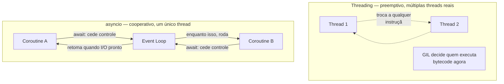
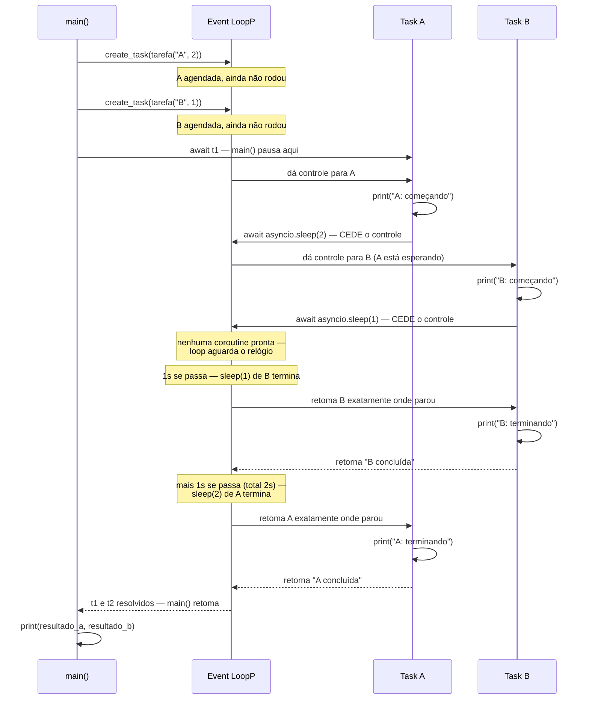
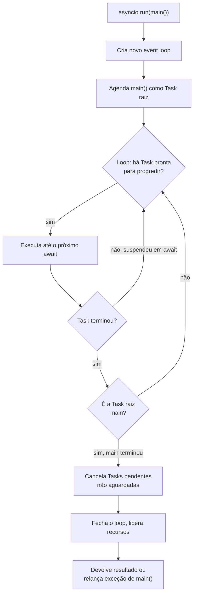
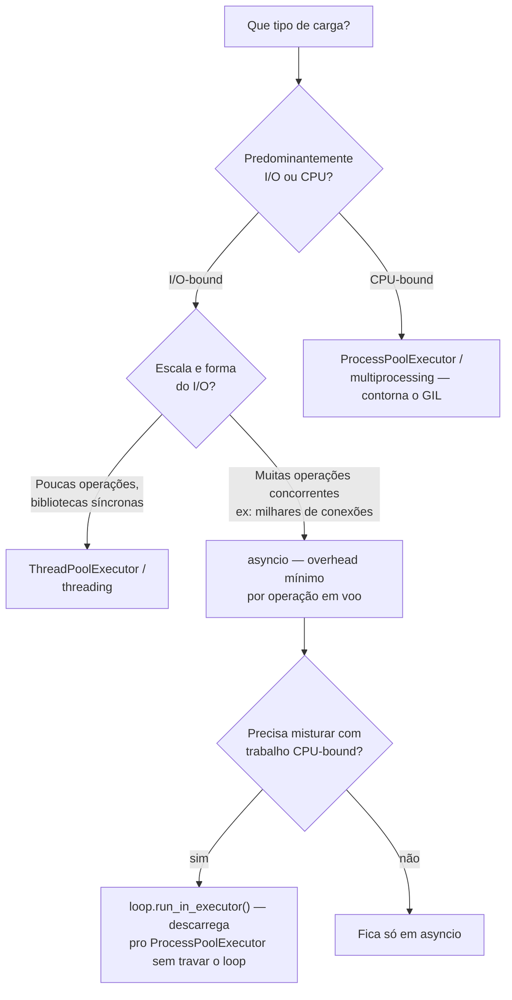

# asyncio fundamentals — event loop, coroutines e Task

> [!abstract] TL;DR
> Diferente de tudo que vimos até aqui neste galho, que usava [[01 - Threading na prática — Thread, Lock e condições de corrida|threads]] ou [[04 - multiprocessing na prática — Pool, ProcessPoolExecutor e orquestração|processos]] reais, `asyncio` roda num **único thread** — não há troca de contexto preemptiva pelo sistema operacional, não há GIL disputado entre threads, porque não existe mais de uma thread competindo. A concorrência é **cooperativa**: cada pedaço de código roda até encontrar um `await`, e é só nesse ponto — explícito, visível no código-fonte — que ele cede o controle de volta para o **event loop**, que aproveita a pausa para dar tempo de CPU a outra tarefa pendente. Uma função `async def` chamada diretamente não executa nada — ela devolve um objeto `coroutine`, uma receita de trabalho ainda não agendada; só vira execução real quando é `await`ada ou envolvida por `asyncio.create_task()`. Coroutine crua e `Task` não são a mesma coisa: `await coroutine` executa aquela coroutine *inline*, bloqueando o restante da função até ela terminar (nenhuma concorrência real acontece); `asyncio.create_task(coroutine)` agenda a coroutine no event loop *imediatamente*, permitindo que ela progrida concorrentemente com outro código enquanto ambos aguardam I/O. Esse modelo é excelente para I/O-bound em escala massiva (milhares de conexões de rede simultâneas, cada uma consumindo pouquíssima CPU enquanto espera resposta) e inútil — pior que inútil, ativamente perigoso — para CPU-bound: uma única coroutine fazendo cálculo pesado sem `await` nenhum **trava o event loop inteiro**, porque não há preempção alguma para tirá-la do lugar.

## O bug que abre esta nota

Um desenvolvedor pleno, animado por ter lido que `asyncio` é "mais rápido" que threads para I/O, decide reescrever uma rotina simples de busca de dados usando `async`/`await` pela primeira vez. A função busca informações de um usuário e, em seguida, registra um log de auditoria:

```python
import asyncio

async def buscar_usuario(user_id):
    await asyncio.sleep(0.5)   # simula uma chamada de rede
    return {"id": user_id, "nome": f"usuario-{user_id}"}

def registrar_auditoria(usuario):
    print(f"log: usuário {usuario['id']} foi consultado")

async def processar(user_id):
    usuario = buscar_usuario(user_id)   # "chamando" a função async
    registrar_auditoria(usuario)        # BUG: usuario não é um dict ainda
    return usuario

asyncio.run(processar(42))
```

Rodando esse código, nada explode de forma óbvia à primeira vista — o programa executa até o fim, sem travar. Mas o comportamento está completamente errado: `registrar_auditoria` recebe algo que não é o dicionário esperado, e o interpretador imprime um aviso estranho que parece não ter relação direta com a linha problemática:

```
sys:1: RuntimeWarning: coroutine 'buscar_usuario' was never awaited
Traceback (most recent call last):
  File "processar.py", line 10, in processar
    registrar_auditoria(usuario)
  File "processar.py", line 6, in registrar_auditoria
    print(f"log: usuário {usuario['id']} foi consultado")
                           ~~~~~~~^^^^^^
TypeError: 'coroutine' object is not subscriptable
```

O `RuntimeWarning` é a pista central, e costuma ser mal interpretada por quem vê pela primeira vez — parece um aviso "de fundo", desconectado do `TypeError` que de fato quebrou o programa. Mas os dois são o mesmo bug visto de dois ângulos: `buscar_usuario(user_id)` — chamar uma função `async def` como se fosse uma função comum — não executa o corpo da função. Ela **cria e devolve um objeto `coroutine`**, um objeto Python como qualquer outro (tem um tipo, ocupa memória, pode ser passado adiante), mas que ainda não rodou nenhuma linha do código dentro dele. `usuario` na linha seguinte não é `{"id": 42, "nome": "usuario-42"}` — é um objeto `<coroutine object buscar_usuario at 0x...>`, que não tem um `["id"]` porque não é um dicionário, é uma promessa de trabalho que ninguém pediu para começar.

> [!bug] O que está quebrado, em uma frase
> Chamar uma função `async def` só *cria* um objeto coroutine — ele não executa nada até ser `await`ado (ou agendado via `asyncio.create_task()`); esquecer o `await` deixa o trabalho real nunca acontecer, e o Python avisa disso tarde, só quando o coletor de lixo destrói a coroutine sem que ela nunca tenha rodado.

Entender exatamente o que acontece — e não acontece — quando uma coroutine é criada, e o que muda quando ela é `await`ada versus agendada como `Task`, é o assunto do resto desta nota.

## Concorrência cooperativa: um único thread, sem GIL como fator

Vale começar nomeando a mudança de modelo em relação a todo o resto deste galho. As notas anteriores trataram de duas formas de concorrência baseadas em **preempção**: o sistema operacional (ou o interpretador, no caso do GIL) decide, sem pedir permissão ao código, quando trocar de contexto — uma thread pode ser interrompida no meio de qualquer instrução de bytecode, o que é exatamente a raiz das race conditions vistas na [[01 - Threading na prática — Thread, Lock e condições de corrida|nota 01]]. Processos, cobertos na [[04 - multiprocessing na prática — Pool, ProcessPoolExecutor e orquestração|nota 04]], evitam esse problema isolando memória, ao custo de serialização e overhead de IPC.

`asyncio` propõe um terceiro modelo, estruturalmente diferente dos dois: **concorrência cooperativa em um único thread**. Não há múltiplas threads do sistema operacional competindo por CPU, não há GIL sendo passado de mão em mão entre threads (o GIL segue existindo em CPython, mas com uma única thread rodando código Python, ele nunca é sequer disputado — não é um fator relevante para entender o comportamento de um programa `asyncio` puro). Em vez disso, existe **um** loop de eventos (event loop) e várias unidades de trabalho — coroutines agendadas como `Task` — que ele alterna manualmente, uma de cada vez, **nunca duas ao mesmo tempo**, nunca por interrupção externa.

A palavra-chave que dá nome ao modelo é "cooperativa": cada pedaço de código coopera voluntariamente com o restante do programa, cedendo o controle explicitamente através do `await`. Não existe troca de contexto no meio de uma linha, no meio de uma expressão, no meio de qualquer trecho de código que não contenha um `await` — o que elimina inteiramente a classe de bug que abriu a nota 01 deste galho (`contador += 1` sendo interrompido entre `LOAD` e `STORE`). Numa coroutine `asyncio`, se não há `await` na linha, **nenhuma outra coroutine pode rodar naquele meio tempo** — o que é, ao mesmo tempo, a maior vantagem do modelo (código entre dois pontos de `await` é efetivamente uma seção crítica automática, sem precisar de `Lock` nenhum) e sua maior armadilha (visto adiante: qualquer código que bloqueie sem ceder o controle trava literalmente tudo, não só a si mesmo).



## O que `await` de fato faz: ceder o controle ao event loop

O modelo mental mais útil para `await` não é "espera aqui" no sentido de bloquear — é **"devolva o controle ao event loop até que este valor específico esteja pronto, e quando estiver, retome exatamente daqui"**. Cada `await` é um ponto de suspensão explícito e visível no código-fonte: a função em execução pausa naquele ponto exato (preservando todo o estado local — variáveis, posição no código, pilha de chamadas daquela coroutine), e o event loop fica livre para dar tempo de execução a qualquer outra coroutine que esteja pronta para progredir.

```python
import asyncio
import time

async def tarefa(nome, duracao):
    print(f"{nome}: começando às {time.strftime('%X')}")
    await asyncio.sleep(duracao)   # PONTO DE SUSPENSÃO — cede o controle aqui
    print(f"{nome}: terminando às {time.strftime('%X')}")
    return f"{nome} concluída"

async def main():
    # Sem create_task: rodaria sequencialmente (ver seção seguinte)
    t1 = asyncio.create_task(tarefa("A", 2))
    t2 = asyncio.create_task(tarefa("B", 1))

    resultado_a = await t1
    resultado_b = await t2
    print(resultado_a, resultado_b)

asyncio.run(main())
```

Rodando isso, o log mostra `A: começando` e `B: começando` quase no mesmo instante — ambas as tarefas foram agendadas e começaram a rodar antes de qualquer uma delas chegar ao seu `await asyncio.sleep()`. Quando a coroutine `A` chega em `await asyncio.sleep(2)`, ela não bloqueia o programa por dois segundos — ela devolve o controle ao event loop, que imediatamente percebe que `B` também está pronta para rodar, executa `B` até seu próprio `await asyncio.sleep(1)`, e a partir daí o loop fica livre para fazer outra coisa (ou, na ausência de qualquer outra coroutine pronta, simplesmente aguardar o relógio do sistema avisar que 1 segundo se passou). O tempo total do programa é aproximadamente 2 segundos — o tempo da tarefa mais lenta — não 3 segundos (soma sequencial), porque as duas esperas acontecem **concorrentemente**, intercaladas pelo mesmo thread.



O detalhe crucial nesse diagrama: em nenhum momento duas coroutines executam código Python **ao mesmo tempo**. `A` roda até `await`, depois `B` roda até `await`, depois o loop espera, depois retoma `B`, depois retoma `A` — tudo sequencial, um pedaço de cada vez, no mesmo thread. A concorrência não vem de execução simultânea (isso seria paralelismo, que exige múltiplos threads ou processos reais), vem de **intercalar períodos de espera** — enquanto a coroutine `A` está esperando 2 segundos de I/O simulado, o thread não fica ocioso: ele usa exatamente esse tempo ocioso para progredir `B`. É esse reaproveitamento do tempo de espera — que numa thread síncrona seria puro desperdício de CPU parada em `time.sleep()` — que faz `asyncio` valer a pena para I/O-bound: uma única thread consegue manter milhares de operações de I/O "em voo" simultaneamente, porque cada uma delas passa a maior parte do tempo apenas esperando, não computando.

> [!question]- `await` bloqueia a thread inteira, como `time.sleep()` faria?
> Não — e essa é exatamente a distinção que confunde quem vem de código síncrono. `time.sleep(2)` bloqueia o thread inteiro por 2 segundos, sem deixar nada mais acontecer nesse meio tempo, nem em outra coroutine, nem no event loop. `await asyncio.sleep(2)` faz o oposto: devolve o controle ao event loop, que registra "retome esta coroutine daqui a 2 segundos" e, enquanto isso, fica livre para rodar qualquer outra coroutine pronta. A thread nunca fica parada esperando por nada específico — ela está sempre executando alguma coroutine pronta para progredir, ou genuinamente ociosa só quando **nenhuma** coroutine tem trabalho a fazer naquele instante (nesse caso, o loop de fato espera, tipicamente via uma chamada de sistema como `select`/`epoll`, que é acordada quando o I/O real subjacente sinaliza que está pronto).

### O que uma coroutine é, de fato, por baixo do capô

Vale abrir uma camada a mais, porque entender o mecanismo concreto ajuda a fixar por que "chamar não executa" faz sentido estrutural, não é só uma regra arbitrária a decorar. Historicamente, antes de `async def`/`await` existirem como sintaxe própria (introduzidos no Python 3.5, PEP 492), código assíncrono em Python era escrito com **geradores decorados** (`@asyncio.coroutine` sobre uma função com `yield from`) — e o mecanismo interno de uma coroutine nativa de hoje ainda é, essencialmente, o mesmo de um gerador: um objeto que mantém seu próprio estado de execução suspenso entre retomadas, em vez de rodar do início ao fim numa única chamada.

Uma função geradora comum (`def` com `yield` no corpo) também não executa nada ao ser chamada — `gerador = minha_funcao_geradora()` só cria o objeto gerador, e o corpo só avança até o próximo `yield` quando algo chama `next(gerador)`. `async def` reaproveita exatamente essa mecânica: chamar uma função `async def` cria um objeto coroutine que se comporta, por baixo, como um gerador — cada `await` é, estruturalmente, um ponto de suspensão análogo a um `yield`, e o event loop é quem desempenha o papel que `next()` desempenharia manualmente: ele repetidamente "avança" cada coroutine até seu próximo ponto de suspensão, guarda a informação de por que ela parou (esperando um timer, esperando um socket ficar legível), e a retoma quando essa condição é satisfeita.

```python
# Ilustração conceitual — não é como create_task funciona de fato,
# mas mostra por que "chamar não executa": o mesmo vale para um gerador comum
def gerador_simples():
    print("primeiro pedaço")
    yield
    print("segundo pedaço")

g = gerador_simples()   # NADA imprime ainda — só criou o objeto gerador
print("gerador criado, nada rodou ainda")
next(g)                 # AGORA "primeiro pedaço" imprime, e ele pausa no yield
next(g)                 # retoma dali, imprime "segundo pedaço"
```

Essa analogia explica também por que o `RuntimeWarning: coroutine was never awaited` só aparece **tarde**, no momento em que o coletor de lixo destrói o objeto: assim como um gerador nunca avançado simplesmente nunca roda nada (sem erro nenhum na criação), uma coroutine nunca avançada também não tem como o interpretador saber, no momento da criação, que ela *deveria* ter sido avançada — só quando o objeto está prestes a ser descartado (e o CPython consegue provar que ele nunca chegou a rodar de fato) é que o aviso é emitido, como um alerta de "isso provavelmente foi um engano".

## O event loop: o que `asyncio.run()` faz por baixo

O **event loop** é o componente central de todo o modelo: um laço que mantém uma fila de tarefas prontas para rodar e, para cada uma, executa código até o próximo ponto de suspensão (`await`), decide o que fazer a seguir (retomar outra tarefa pronta, ou esperar por um evento de I/O do sistema operacional), e repete. Antes do Python 3.7, gerenciar esse loop era responsabilidade explícita do programador — obter uma referência ao loop, rodar `loop.run_until_complete(...)`, e fechar o loop manualmente ao final, um padrão verboso e fácil de errar (esquecer de fechar o loop, criar múltiplos loops por engano). `asyncio.run()`, introduzido no 3.7 e hoje o ponto de entrada padrão e recomendado, encapsula esse ciclo de vida inteiro numa única chamada.

```python
import asyncio

async def main():
    print("corpo da coroutine principal")
    await asyncio.sleep(1)
    return "resultado final"

resultado = asyncio.run(main())
print(resultado)
```

O que `asyncio.run(main())` faz, em ordem, é aproximadamente:

1. **Cria um novo event loop** — uma instância nova, isolada de qualquer loop anterior.
2. **Agenda a coroutine `main()` como a tarefa raiz** do loop (internamente, envolvendo-a numa `Task`, o mesmo mecanismo de agendamento coberto na próxima seção).
3. **Roda o loop até `main()` completar** — processando essa e qualquer outra `Task` que `main()` venha a criar, alternando entre elas nos pontos de `await`, até que a tarefa raiz termine (com resultado ou com exceção).
4. **Cancela quaisquer tarefas ainda pendentes** que não tenham sido aguardadas explicitamente (um mecanismo de limpeza para evitar corrotinas "esquecidas" vivas além do escopo pretendido).
5. **Fecha o loop e libera seus recursos** (conexões de rede internas do loop, executores de thread usados para operações que não têm equivalente assíncrono nativo, etc.).
6. **Devolve o valor de retorno** da coroutine raiz — ou relança a exceção, se `main()` tiver levantado uma.



`asyncio.run()` é, por design, a **única** chamada de alto nível que a maior parte do código de aplicação deveria precisar — ele deve ser chamado uma única vez, do ponto de entrada do programa (o `if __name__ == "__main__":` ou equivalente), nunca de dentro de uma coroutine já em execução (chamar `asyncio.run()` dentro de outra coroutine levanta `RuntimeError: asyncio.run() cannot be called from a running event loop`, porque criaria um segundo loop concorrente ao primeiro — um cenário sem sentido no modelo cooperativo, já que só pode existir um loop rodando por thread por vez).

> [!question]- Por que não simplesmente chamar `main()` diretamente, sem `asyncio.run()`?
> Porque `main()` é uma função `async def` — chamá-la diretamente (`main()`, sem `await` nem `asyncio.run()`) só cria o objeto coroutine, exatamente o bug de abertura desta nota. Uma coroutine, por si só, não tem nenhuma capacidade de se auto-executar — ela precisa de um event loop que a agende e a impulsione adiante a cada retomada. `asyncio.run()` é a ponte entre o mundo síncrono comum (o script Python rodando normalmente, sem loop nenhum) e o mundo assíncrono cooperativo — é o único ponto onde essa ponte é construída, porque só faz sentido haver um loop por vez.

## `Task` vs coroutine crua: por que uma coroutine sozinha não faz nada

Esta é a distinção mais fácil de errar na prática, e a que o bug de abertura desta nota expõe diretamente — mas vale um degrau além dele, porque mesmo depois de lembrar do `await`, ainda existe uma escolha importante entre **aguardar a coroutine diretamente** e **agendá-la como `Task` antes de aguardar**.

Uma **coroutine** (o objeto devolvido por chamar uma função `async def`) é, por si só, inerte — uma receita de execução que ainda não começou a rodar. `await coroutine` executa essa receita, mas de forma **sequencial e bloqueante para o restante daquela função**: a função que contém o `await` pausa ali, aguardando aquela coroutine específica terminar, antes de seguir para a linha seguinte. Se duas coroutines forem aguardadas assim, uma após a outra, elas rodam **sequencialmente** — sem sobreposição nenhuma, exatamente como duas chamadas de função síncronas comuns:

```python
import asyncio
import time

async def tarefa(nome, duracao):
    await asyncio.sleep(duracao)
    return f"{nome} concluída"

async def sequencial():
    inicio = time.perf_counter()
    r1 = await tarefa("A", 1)   # espera A terminar POR COMPLETO...
    r2 = await tarefa("B", 1)   # ...só então começa B
    print(f"sequencial: {time.perf_counter() - inicio:.1f}s")  # ~2.0s
    return r1, r2

asyncio.run(sequencial())
```

`asyncio.create_task(coroutine)`, em contraste, **agenda** a coroutine no event loop imediatamente — a partir daquele ponto, ela passa a competir por tempo de execução junto com qualquer outra `Task` já agendada, começando a progredir mesmo antes de qualquer `await` explícito nela. O objeto `Task` retornado é, ele mesmo, aguardável (`await task`) — mas o `await` nesse caso não *dispara* a execução (ela já começou no momento do `create_task()`), só *espera pelo resultado* de algo que já está rodando de forma independente.

```python
import asyncio
import time

async def tarefa(nome, duracao):
    await asyncio.sleep(duracao)
    return f"{nome} concluída"

async def concorrente():
    inicio = time.perf_counter()
    t1 = asyncio.create_task(tarefa("A", 1))   # agendada AGORA, já começa a rodar
    t2 = asyncio.create_task(tarefa("B", 1))   # agendada AGORA também, concorrente com A

    r1 = await t1   # só espera o RESULTADO — A já estava progredindo
    r2 = await t2
    print(f"concorrente: {time.perf_counter() - inicio:.1f}s")  # ~1.0s, não 2.0s
    return r1, r2

asyncio.run(concorrente())
```

A diferença de tempo total — 2 segundos na versão sequencial, 1 segundo na versão com `create_task` — é a demonstração direta do que "concorrência" significa nesse contexto: sem `create_task`, `async def` sozinho **não dá concorrência nenhuma**, é só uma forma diferente de escrever código sequencial que também pode ceder o controle em pontos específicos. `asyncio.create_task()` é o mecanismo explícito que transforma "várias coroutines que existem" em "várias coroutines progredindo ao mesmo tempo, intercaladas pelo mesmo thread".

| Aspecto | `await coroutine` direto | `asyncio.create_task(coroutine)` |
|---|---|---|
| Quando a execução começa | No momento do `await` | Imediatamente, na chamada de `create_task()` |
| Concorrência com outro código | Nenhuma — bloqueia a função até terminar | Sim — progride em paralelo lógico com outras `Task`s |
| Tipo do objeto | `coroutine` | `asyncio.Task` (subclasse de `Future`) |
| Cancelamento individual | Não é possível cancelar uma coroutine crua isoladamente | `task.cancel()` disponível |
| Uso típico | Uma única operação, sem necessidade de sobrepor com outra | Múltiplas operações independentes que devem progredir concorrentemente |
| Resultado se nunca aguardada | `RuntimeWarning: coroutine was never awaited` — nunca rodou | A `Task` roda de qualquer forma (já foi agendada), mas seu resultado/exceção pode ser perdido se nunca coletado |

Vale registrar uma sutileza sobre a última linha da tabela, porque ela é frequentemente mal compreendida: uma `Task` criada via `create_task()` **começa a rodar mesmo que ninguém jamais dê `await` nela** — diferente da coroutine crua, que literalmente não executa nada sem ser aguardada. O risco com `Task`s não aguardadas não é "o trabalho nunca acontece" (ele acontece), é "uma exceção levantada dentro dela nunca é vista por ninguém, e o event loop pode até coletar a `Task` como lixo no meio da execução se não houver nenhuma referência forte a ela sobrevivendo" — o análogo, no mundo assíncrono, do problema de exceções engolidas que fechou a [[05 - concurrent.futures — a abstração unificadora|nota 05]] sobre `Future`s de `concurrent.futures` nunca coletados.

> [!question]- `asyncio.gather()` é outra forma de conseguir concorrência — por que essa nota não a cobre em detalhe?
> `asyncio.gather()` e `asyncio.TaskGroup` (o mecanismo estruturado introduzido no 3.11) são, por baixo dos panos, formas mais convenientes de fazer exatamente o que `create_task()` + `await` faz manualmente aqui — orquestrar múltiplas `Task`s concorrentes e coletar seus resultados. Esta nota fica deliberadamente no nível mais fundamental (`create_task()` explícito) porque o objetivo aqui é entender o mecanismo por baixo antes de usar o açúcar sintático; a [[07 - asyncio na prática — gather, TaskGroup, timeouts e cancelamento|próxima nota do galho]] cobre `gather()`, `TaskGroup`, timeouts e cancelamento cooperativo em detalhe — inclusive as diferenças de tratamento de erro entre `gather()` e `TaskGroup` que fazem o segundo ser hoje a recomendação padrão para código novo.

## Por que asyncio é para I/O-bound, não CPU-bound

O modelo cooperativo de único thread tem uma implicação direta e inescapável sobre que tipo de carga ele serve bem — a mesma árvore de decisão I/O-bound vs CPU-bound iniciada em [[03-Dominios/Tecnologia/Python/CPython internals/05 - GIL e concorrência na prática — threading vs multiprocessing|Galho 6 nota 05]] e retomada na [[05 - concurrent.futures — a abstração unificadora|nota 05]] deste galho, agora com um terceiro ramo.

**I/O-bound é o caso ideal** porque a espera por I/O (rede, disco, resposta de uma API externa, uma query de banco) não consome CPU nenhuma — o processo fica genuinamente ocioso enquanto aguarda um dado que vem de fora. Threads também conseguem explorar essa ociosidade (o GIL é liberado durante chamadas de I/O bloqueantes, como visto na nota 01), mas cada thread do sistema operacional carrega overhead de memória (tipicamente alguns megabytes de stack por thread) e overhead de troca de contexto gerenciado pelo SO. `asyncio` consegue manter dezenas de milhares de operações de I/O "em voo" simultaneamente com uma fração desse custo, porque uma `Task` suspensa não é uma thread do SO parada — é só um objeto Python guardando onde retomar, esperando o event loop notificar que o I/O correspondente terminou.

**CPU-bound é o caso ruim, sem meio-termo.** Uma coroutine que faz um cálculo pesado sem nenhum `await` no meio não cede o controle a lugar nenhum — ela monopoliza o único thread que existe, e como não há preempção nesse modelo, **nenhuma outra coroutine roda até aquela terminar**, mesmo que dezenas delas estivessem prontas para progredir. Isso não é "mais lento que o ideal" como aconteceria com `ThreadPoolExecutor` sob o GIL (que ao menos alterna threads periodicamente) — é o event loop **inteiro parado**, toda operação de I/O pendente também travada, porque nem elas conseguem ser notificadas de que terminaram enquanto o loop está ocupado executando aquele cálculo sem nunca devolver o controle.

```python
import asyncio
import time

async def calculo_pesado():
    total = 0
    for i in range(50_000_000):   # nenhum await aqui — trava o loop inteiro
        total += i
    return total

async def heartbeat():
    for _ in range(5):
        print(f"heartbeat: {time.strftime('%X')}")
        await asyncio.sleep(0.5)

async def main():
    asyncio.create_task(heartbeat())   # deveria imprimir a cada 0.5s
    await calculo_pesado()             # mas trava o loop por vários segundos

asyncio.run(main())
# Na prática: os "heartbeat" só aparecem TODOS DE UMA VEZ, no final,
# depois que calculo_pesado() finalmente termina — nenhum rodou
# concorrentemente, porque não houve nenhum ponto de await para cedê-los espaço
```

A árvore de decisão completa do galho, agora com os três ramos:



O último ramo (`loop.run_in_executor()`) antecipa o capstone do galho — a estratégia correta quando um programa `asyncio` precisa, ocasionalmente, fazer algo genuinamente CPU-bound sem travar o loop inteiro é descarregar esse trabalho especificamente para um `ProcessPoolExecutor` via `loop.run_in_executor()`, deixando o event loop livre para continuar processando I/O enquanto aquele cálculo roda em paralelismo real, num processo separado. Essa combinação — e o resto do ferramental prático de `asyncio` (`gather`, `TaskGroup`, timeouts, cancelamento) — é o assunto da [[07 - asyncio na prática — gather, TaskGroup, timeouts e cancelamento|próxima nota do galho]]; aqui o ponto é só entender por que a pergunta "isso é I/O-bound ou CPU-bound?" continua sendo a primeira pergunta a fazer, mesmo tendo um terceiro modelo de concorrência disponível.

## Armadilhas comuns

> [!warning] Esquecer o `await` (ou o `create_task`) — o bug de abertura
> **O que acontece:** chamar uma função `async def` como se fosse síncrona (`resultado = minha_coroutine(arg)`), sem `await` nem `asyncio.create_task()`, e seguir o código como se `resultado` já contivesse o valor de retorno.
> **Por quê:** chamar uma função `async def` só cria o objeto `coroutine` — nenhuma linha do corpo dela executa até que algo explicitamente agende ou aguarde essa coroutine. `resultado` é um objeto `coroutine` inerte, nunca o valor esperado.
> **Como evitar:** todo `async def` chamado precisa terminar em `await funcao(...)` (execução sequencial) ou `asyncio.create_task(funcao(...))` seguido de `await` na `Task` em outro momento (execução concorrente). O `RuntimeWarning: coroutine '...' was never awaited` é o sinal do interpretador de que isso foi esquecido em algum lugar — nunca ignorar esse warning, mesmo quando o programa "parece" funcionar (o efeito colateral esperado da coroutine simplesmente não aconteceu).

> [!warning] Código bloqueante síncrono dentro de uma coroutine trava o loop inteiro
> **O que acontece:** usar uma chamada síncrona bloqueante — `time.sleep()`, uma biblioteca de rede síncrona (`requests`, por exemplo), uma query de banco via driver síncrono — dentro de uma função `async def`, esperando que o `async def` por si só torne aquela chamada não-bloqueante.
> **Por quê:** `async def` não muda a natureza da chamada dentro dela — `time.sleep(2)` chamado de dentro de uma coroutine ainda bloqueia o **thread inteiro** por 2 segundos, exatamente como bloquearia em código síncrono comum, porque não existe nenhum ponto de `await` ali para o event loop retomar o controle. E como só existe um thread, bloquear esse thread trava **todas** as outras coroutines pendentes, não só a que fez a chamada bloqueante.
> **Como evitar:** dentro de código assíncrono, usar sempre os equivalentes assíncronos das operações de I/O (`asyncio.sleep()` em vez de `time.sleep()`, um cliente HTTP assíncrono como `httpx.AsyncClient` ou `aiohttp` em vez de `requests`, um driver de banco assíncrono). Quando uma dependência genuinamente só tem versão síncrona e não pode ser evitada, descarregá-la para um thread separado via `asyncio.to_thread()` (3.9+) ou `loop.run_in_executor()`, para que ela bloqueie *aquele* thread auxiliar, não o thread do event loop.

> [!warning] Achar que `async def` sozinho já dá concorrência
> **O que acontece:** escrever várias funções `async def` e `await` cada uma sequencialmente, uma após a outra, esperando ganhar o mesmo tipo de ganho de tempo que threads ou processos dariam — e se surpreender ao medir que o tempo total é a soma sequencial, não o máximo entre elas.
> **Por quê:** `await coroutine` direto executa aquela coroutine e só ela até terminar, antes de seguir para a próxima linha — sem `asyncio.create_task()` (ou `gather`/`TaskGroup`, que fazem `create_task` internamente), não existe nada rodando concorrentemente para o event loop intercalar.
> **Como evitar:** para qualquer conjunto de operações independentes entre si que devem progredir ao mesmo tempo, agendar todas primeiro via `create_task()` (ou usar `asyncio.gather()`/`TaskGroup`, cobertos na próxima nota), e só então aguardar os resultados — nunca `await` uma coroutine crua dentro de um loop quando o objetivo é paralelismo lógico, não sequência.

> [!warning] Misturar `asyncio.run()` aninhado ou fora do ponto de entrada
> **O que acontece:** chamar `asyncio.run()` de dentro de uma coroutine já em execução, ou chamá-lo mais de uma vez ao longo do programa, esperando que cada chamada funcione de forma independente.
> **Por quê:** só pode existir um event loop rodando por thread por vez — `asyncio.run()` cria um loop novo e o fecha ao final; chamá-lo de dentro de outra coroutine (que já está rodando dentro de um loop) tenta criar um segundo loop dentro do primeiro, algo sem sentido no modelo, e o Python recusa isso explicitamente com `RuntimeError`.
> **Como evitar:** `asyncio.run()` deve aparecer uma única vez, no ponto de entrada do programa. Qualquer coroutine que precise chamar outra coroutine, de dentro de código já assíncrono, usa `await` diretamente — nunca `asyncio.run()` aninhado.

## Em entrevista

`asyncio` é tema recorrente em entrevistas sênior de Python porque separa quem entendeu o modelo cooperativo de quem só decorou a sintaxe `async`/`await`.

> "The core thing to understand about asyncio is that it's single-threaded cooperative concurrency, not preemptive concurrency like threading. There's one event loop, and code only yields control at explicit `await` points — nothing gets interrupted mid-statement, which is why asyncio code doesn't need locks the way threaded code does. But that cooperation is a double-edged sword: calling an `async def` function doesn't run it — it just creates a coroutine object, a scheduled-but-not-started piece of work. If you forget to `await` it, or wrap it in `asyncio.create_task()`, nothing happens, and Python only tells you late, with a `RuntimeWarning: coroutine was never awaited` when the garbage collector notices it was never run. And `await coroutine` by itself doesn't give you concurrency either — it runs that coroutine to completion before moving to the next line, same as sequential code. Real concurrency needs `asyncio.create_task()`, which schedules the coroutine on the loop immediately, so it starts progressing while other tasks are also running, interleaved at their own await points. That's also why asyncio is strictly an I/O-bound tool: since there's no preemption, one CPU-bound coroutine that never awaits will freeze the entire loop — every other pending task, no matter how ready it is, simply doesn't run until that one finishes."

Uma pergunta de acompanhamento comum: **"como você descarregaria trabalho CPU-bound de dentro de um programa asyncio sem travar o loop?"** — a resposta sênior nomeia `loop.run_in_executor()` (tipicamente com um `ProcessPoolExecutor`, já que o objetivo é contornar o GIL de verdade) ou `asyncio.to_thread()` para trabalho que só precisa deixar de bloquear o thread principal sem exigir paralelismo real de CPU.

> [!question]- E se perguntarem sobre a diferença entre concorrência e paralelismo especificamente no contexto de asyncio?
> Vale nomear a distinção com precisão: `asyncio` dá **concorrência** (múltiplas unidades de trabalho progredindo de forma intercalada, cada uma avançando enquanto as outras esperam) mas **não paralelismo** (execução simultânea de verdade, em núcleos de CPU diferentes) — porque tudo roda num único thread. `ProcessPoolExecutor` é a ferramenta certa quando paralelismo real é o objetivo (mais de um núcleo de CPU trabalhando ao mesmo tempo). `asyncio` é a ferramenta certa quando o objetivo é gerenciar um número muito grande de operações que passam a maior parte do tempo esperando, não computando — nesse cenário, paralelismo real nem ajudaria muito, porque o gargalo nunca foi CPU.

## Como explicar em inglês

| PT | EN |
|----|----|
| concorrência cooperativa | cooperative concurrency |
| ceder o controle | yield control |
| ponto de suspensão | suspension point |
| loop de eventos | event loop |
| corrotina | coroutine |
| agendar (uma tarefa) | schedule (a task) |
| aguardar / esperar por | await |
| travar o loop | block the loop / freeze the loop |
| executar concorrentemente | run concurrently |
| I/O em voo | in-flight I/O |
| descarregar (trabalho pra outro executor) | offload (work to another executor) |
| ponto de entrada | entry point |

## O que vem a seguir

Esta nota estabeleceu o modelo mental de `asyncio` — um único thread, concorrência cooperativa via `await`, o event loop como orquestrador central, e a distinção crucial entre coroutine crua (inerte até aguardada) e `Task` (agendada e progredindo desde o `create_task()`). A partir dessa base:

- [[07 - asyncio na prática — gather, TaskGroup, timeouts e cancelamento|07 — asyncio na prática: gather, TaskGroup, timeouts e cancelamento]] — o ferramental de produção construído sobre esses fundamentos: `asyncio.gather()` vs `asyncio.TaskGroup` (3.11+, tratamento estruturado de exceções), `wait_for`/timeouts, cancelamento cooperativo via `CancelledError`, e os paralelos assíncronos de `Lock`/`Queue`.
- [[08 - Capstone — escolhendo threading vs multiprocessing vs asyncio|08 — Capstone: escolhendo threading vs multiprocessing vs asyncio]] — a árvore de decisão completa do galho, com um cenário prático combinando os três modelos (um servidor asyncio que descarrega trabalho CPU-bound para um `ProcessPoolExecutor` via `loop.run_in_executor()`).
- [[05 - concurrent.futures — a abstração unificadora|05 — concurrent.futures: a abstração unificadora]] — o contraponto direto desta nota: `ThreadPoolExecutor`/`ProcessPoolExecutor` como concorrência preemptiva com múltiplas threads/processos reais, versus o modelo cooperativo de único thread visto aqui.
- [[03-Dominios/Tecnologia/Python/CPython internals/04 - O GIL — o que é de verdade e por que existe|Galho 6 nota 04 — O GIL: o que é de verdade e por que existe]] — pré-requisito conceitual do galho inteiro: por que o GIL não é sequer um fator relevante dentro de um programa `asyncio` puro (só há uma thread disputando-o).
- [[03-Dominios/Tecnologia/Python/Concorrência e paralelismo/index|Concorrência e paralelismo (Galho 7)]] — MOC deste galho.

## Fontes

- Python Software Foundation. *asyncio — Asynchronous I/O*. docs.python.org, versão 3.14. https://docs.python.org/3/library/asyncio.html (acessado em 2026-07-10) — visão geral e índice da biblioteca `asyncio`.
- Python Software Foundation. *Coroutines and Tasks*. docs.python.org, versão 3.14. https://docs.python.org/3/library/asyncio-task.html (acessado em 2026-07-10) — referência oficial de `async def`, `await`, `asyncio.create_task()`, `Task`, `asyncio.run()`.
- Python Software Foundation. *asyncio-eventloop — Event Loop*. docs.python.org, versão 3.14. https://docs.python.org/3/library/asyncio-eventloop.html (acessado em 2026-07-10) — mecanismo interno do event loop, `run_in_executor()`.
- Python Software Foundation. *What's New in Python 3.7 — asyncio.run()*. docs.python.org. https://docs.python.org/3/whatsnew/3.7.html#asyncio (acessado em 2026-07-10) — introdução de `asyncio.run()` como ponto de entrada padrão.
- Real Python. *Async IO in Python: A Complete Walkthrough*. realpython.com. https://realpython.com/async-io-python/ (acessado em 2026-07-10) — explicação aprofundada de coroutines, event loop, e concorrência cooperativa com exemplos.
- **Fluent Python**, 2ª ed. — Luciano Ramalho, capítulos sobre `asyncio`: modelo de execução, coroutines nativas, e a distinção entre concorrência e paralelismo aplicada a Python.
- [[03-Dominios/Tecnologia/Python/CPython internals/04 - O GIL — o que é de verdade e por que existe|04 — O GIL: o que é de verdade e por que existe]] — nota irmã (Galho 6), referenciada para justificar por que o GIL não é fator relevante em asyncio puro.

Consultado em 2026-07-10.
