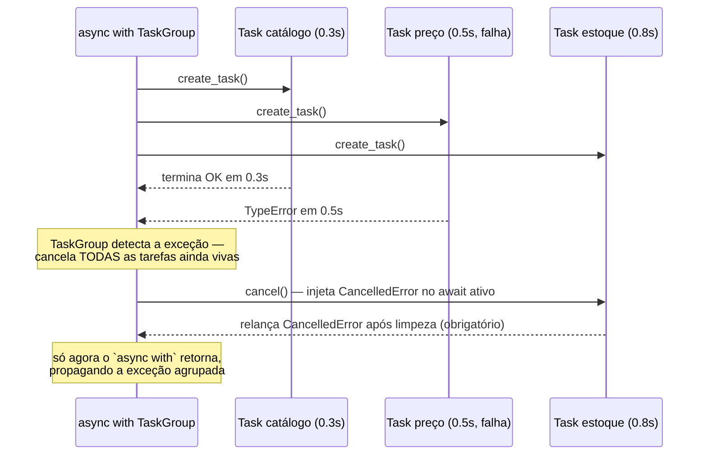
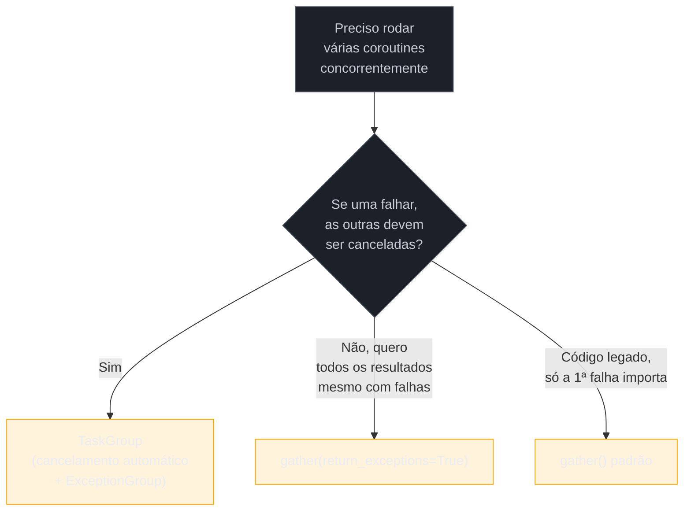

# asyncio na prática — gather, TaskGroup, timeouts e cancelamento

> [!abstract] TL;DR
> `asyncio.gather()` roda várias coroutines concorrentemente e devolve os resultados na ordem original — mas, por padrão, se **uma** delas levantar exceção, as outras continuam rodando em segundo plano sem que nada as cancele, e a exceção que `gather()` propaga é só a da primeira tarefa que falhou, silenciando qualquer coisa que aconteça com as demais depois disso. `asyncio.TaskGroup` (Python 3.11+) resolve isso estruturalmente: se qualquer tarefa do grupo falhar, todas as irmãs são canceladas automaticamente, o bloco `async with` só retorna depois que todas terminaram (com sucesso, cancelamento ou erro), e todas as exceções — não só a primeira — são agrupadas num `ExceptionGroup` só. Cancelamento em `asyncio` é **cooperativo**: `task.cancel()` não interrompe a tarefa à força, só agenda uma `CancelledError` para ser levantada no próximo ponto de `await` dentro dela — se o código engolir essa exceção com um `except` genérico, ou estiver preso num trecho síncrono que nunca dá `await`, o cancelamento nunca se completa. `asyncio.wait_for()` impõe um teto de tempo cancelando a tarefa internamente se ela estourar; `asyncio.shield()` faz o oposto — protege uma tarefa de ser cancelada pelo escopo que a envolve, deixando-a terminar mesmo que quem a lançou desista de esperar.

## O bug que abre esta nota

Um sistema busca dados de três serviços internos em paralelo — catálogo, preço e estoque — para montar a página de um produto. O código parece direto: disparar as três chamadas com `asyncio.gather()` e montar a resposta com os três resultados.

```python
import asyncio

async def buscar_catalogo(produto_id: str) -> dict:
    await asyncio.sleep(0.3)
    return {"nome": "Teclado mecânico", "categoria": "Periféricos"}

async def buscar_preco(produto_id: str) -> dict:
    await asyncio.sleep(0.5)
    # bug latente: o serviço de preços às vezes devolve None para produtos descontinuados
    dados = None
    return {"valor": dados["valor"]}   # TypeError: 'NoneType' object is not subscriptable

async def buscar_estoque(produto_id: str) -> dict:
    await asyncio.sleep(0.8)
    print("estoque: consultando o depósito central...")
    await asyncio.sleep(0.2)
    print("estoque: consulta concluída")
    return {"quantidade": 42}

async def montar_pagina(produto_id: str) -> dict:
    catalogo, preco, estoque = await asyncio.gather(
        buscar_catalogo(produto_id),
        buscar_preco(produto_id),
        buscar_estoque(produto_id),
    )
    return {**catalogo, **preco, **estoque}

asyncio.run(montar_pagina("SKU-123"))
```

Rodando isso, o programa levanta `TypeError` vindo de `buscar_preco` — até aí, esperado, é um bug real que precisa ser corrigido. O que surpreende quem debuga pela primeira vez é o que aparece no console **antes** da exceção subir: as mensagens `"estoque: consultando o depósito central..."` e, dependendo do timing, até `"estoque: consulta concluída"` aparecem no log, mesmo que `montar_pagina` já tenha lançado a exceção e a função chamadora já tenha, na cabeça de quem escreveu o código, "desistido" daquela requisição. `buscar_estoque` continua rodando em segundo plano depois que `gather()` já propagou o erro — consumindo I/O, tempo de CPU, e potencialmente terminando de gravar algo em um sistema externo, sem que nada no código tenha pedido isso explicitamente e sem que o autor do código soubesse que isso aconteceria.

> [!bug] O que está quebrado, em uma frase
> `asyncio.gather()`, no seu comportamento padrão, propaga a exceção da primeira tarefa que falhar assim que ela acontece — mas não cancela as tarefas irmãs que ainda estão rodando; elas continuam em segundo plano, órfãs, fazendo trabalho que ninguém mais está esperando ou vai usar.

Esse comportamento não é um bug do `asyncio` — é a semântica documentada de `gather()`. O problema é que ela é sutil o suficiente para pegar até quem já usa `asyncio` fundamentals ([[06 - asyncio fundamentals — event loop, coroutines e Task|nota 06]]) com conforto: código que parece "se uma falhar, as outras param" na verdade não para nada sozinho. Entender exatamente o que `gather()` garante — e o que não garante — e conhecer a alternativa estrutural (`TaskGroup`) que resolve isso por padrão, é o assunto desta nota.

> [!info] Pré-requisito
> Esta nota assume que [[06 - asyncio fundamentals — event loop, coroutines e Task|06 — asyncio fundamentals: event loop, coroutines e Task]] já foi lida — o modelo de concorrência cooperativa single-thread, `async def`/`await`, o event loop via `asyncio.run()`, e a diferença entre uma coroutine crua e uma `Task` agendada. Esta nota não reexplica esses fundamentos; assume-os como ferramenta conhecida e foca em como **orquestrar** múltiplas tarefas de forma correta — concorrência estruturada, timeouts, e o mecanismo real de cancelamento.

## `asyncio.gather()`: concorrência simples, com uma pegadinha central

`asyncio.gather()` recebe uma ou mais coroutines (ou `Task`s já criadas), agenda todas para rodar concorrentemente no event loop, e devolve uma lista de resultados **na mesma ordem em que os argumentos foram passados** — independente da ordem em que cada uma efetivamente terminou. É a ferramenta mais direta para "rode isso tudo ao mesmo tempo e me dê os resultados juntos":

```python
import asyncio
import time

async def buscar(nome: str, atraso: float) -> str:
    await asyncio.sleep(atraso)
    return f"resultado de {nome}"

async def main():
    inicio = time.perf_counter()
    resultados = await asyncio.gather(
        buscar("A", 1.0),
        buscar("B", 0.5),
        buscar("C", 0.8),
    )
    duracao = time.perf_counter() - inicio
    print(resultados)              # ['resultado de A', 'resultado de B', 'resultado de C']
    print(f"{duracao:.1f}s")       # ~1.0s — o tempo da MAIS LENTA, não a soma das três

asyncio.run(main())
```

O ganho é o mesmo princípio de qualquer concorrência de I/O-bound: as três chamadas de `asyncio.sleep()` (representando I/O real — uma requisição HTTP, uma query de banco) não competem por CPU entre si, então o tempo total é dominado pela mais lenta das três (~1.0s), não pela soma sequencial (~2.3s). A ordem dos resultados devolvidos por `gather()` é sempre a ordem dos argumentos — `resultados[0]` é sempre o resultado de `buscar("A", ...)`, mesmo que `B` (0.5s) termine antes de `A` (1.0s) na prática. Essa garantia de ordem é o que torna `gather()` conveniente para desempacotar diretamente em variáveis nomeadas, como no exemplo de abertura.

### O parâmetro que faltava no bug de abertura: `return_exceptions=True`

O comportamento padrão de `gather()` (`return_exceptions=False`) é: assim que **qualquer** uma das coroutines levanta uma exceção, `gather()` propaga essa exceção imediatamente para quem chamou `await gather(...)` — sem esperar as outras terminarem. As tarefas que ainda não terminaram continuam agendadas no event loop, rodando até completar (ou até serem canceladas por outro motivo), mas seus resultados — sejam eles valores de retorno ou exceções próprias — são descartados silenciosamente, porque ninguém mais está com uma referência viva esperando por eles no ponto de `await` que já retornou via exceção.

```python
import asyncio

async def rapida_com_erro():
    await asyncio.sleep(0.2)
    raise ValueError("falhou rápido")

async def lenta_ok():
    await asyncio.sleep(1.0)
    print("lenta_ok: terminou, mas ninguém está mais olhando pra mim")
    return "sucesso tardio"

async def main():
    try:
        resultado = await asyncio.gather(rapida_com_erro(), lenta_ok())
    except ValueError as e:
        print(f"gather propagou: {e}")
        # Nesse ponto, lenta_ok() AINDA está rodando em segundo plano —
        # ela só vai terminar ~0.8s depois deste except, e seu print vai
        # aparecer no console de forma confusa, depois que o fluxo "já acabou".

asyncio.run(main())
```

`return_exceptions=True` muda essa semântica completamente: em vez de propagar a primeira exceção, `gather()` **espera todas** as coroutines terminarem (sucesso ou erro), e devolve uma lista onde cada posição é o resultado normal **ou** o objeto de exceção correspondente — nunca levanta exceção diretamente, delegando ao chamador decidir o que fazer com cada item:

```python
async def main():
    resultados = await asyncio.gather(
        rapida_com_erro(),
        lenta_ok(),
        return_exceptions=True,
    )
    for r in resultados:
        if isinstance(r, Exception):
            print(f"falhou: {r!r}")
        else:
            print(f"ok: {r}")
    # falhou: ValueError('falhou rápido')
    # ok: resultado tardio de lenta_ok()  (só depois de ~1.0s, mas aguardado corretamente)

asyncio.run(main())
```

A diferença central entre os dois modos: `return_exceptions=False` (o padrão) prioriza reagir rápido ao primeiro erro, ao custo de deixar trabalho órfão rodando em segundo plano sem supervisão; `return_exceptions=True` prioriza esperar tudo terminar e dar ao chamador visibilidade completa sobre o que deu certo e o que falhou, ao custo de não reagir ao erro até a tarefa mais lenta também terminar. Nenhum dos dois **cancela** as tarefas irmãs quando uma falha — essa é, precisamente, a lacuna que `TaskGroup` fecha.

> [!question]- Por que `gather()` não cancela as outras tarefas automaticamente, se isso parece o comportamento "óbvio" esperado?
> Porque `gather()` foi desenhado antes de `TaskGroup` existir (`TaskGroup` só chegou no Python 3.11, em 2022; `gather()` é anterior e mais genérico), com uma filosofia diferente: ele agrupa coroutines para aguardar concorrentemente, mas deliberadamente não assume responsabilidade pelo ciclo de vida delas além disso — cancelar automaticamente teria efeitos colaterais em código legado que dependia do comportamento "deixa rodando". `TaskGroup` nasceu especificamente para corrigir essa lacuna com uma API nova, sem quebrar retrocompatibilidade da API antiga — daí a recomendação atual da documentação: para código novo em Python 3.11+, `TaskGroup` é a escolha padrão, e `gather()` continua existindo para compatibilidade e para os casos específicos em que "deixar as outras continuarem mesmo se uma falhar" é exatamente o comportamento desejado (como no exemplo com `return_exceptions=True` acima, onde o objetivo é *coletar* todos os resultados/erros, não abortar no primeiro).

## `asyncio.TaskGroup`: concorrência estruturada com cancelamento automático

`asyncio.TaskGroup`, introduzido no Python 3.11 ([PEP relacionado e changelog documentados aqui](https://docs.python.org/3/library/asyncio-task.html#task-groups)), resolve o problema do bug de abertura de forma estrutural, não como um parâmetro opcional: é um gerenciador de contexto assíncrono (`async with`) dentro do qual se criam tarefas com `tg.create_task()`, e a garantia central é — **se qualquer tarefa dentro do grupo levantar uma exceção não tratada, todas as outras tarefas do mesmo grupo são canceladas automaticamente**, e o bloco `async with` só retorna o controle depois que absolutamente todas as tarefas (incluindo as canceladas) tiverem efetivamente terminado.

```python
import asyncio

async def buscar_catalogo(produto_id: str) -> dict:
    await asyncio.sleep(0.3)
    return {"nome": "Teclado mecânico", "categoria": "Periféricos"}

async def buscar_preco(produto_id: str) -> dict:
    await asyncio.sleep(0.5)
    dados = None
    return {"valor": dados["valor"]}   # mesmo bug do exemplo de abertura

async def buscar_estoque(produto_id: str) -> dict:
    try:
        print("estoque: consultando o depósito central...")
        await asyncio.sleep(0.8)
        print("estoque: consulta concluída")   # NUNCA chega aqui, se preco falhar antes
        return {"quantidade": 42}
    except asyncio.CancelledError:
        print("estoque: cancelado pelo TaskGroup — abortando limpo")
        raise   # sempre relançar CancelledError, ver seção de cancelamento cooperativo

async def montar_pagina(produto_id: str) -> dict:
    async with asyncio.TaskGroup() as tg:
        t_catalogo = tg.create_task(buscar_catalogo(produto_id))
        t_preco = tg.create_task(buscar_preco(produto_id))
        t_estoque = tg.create_task(buscar_estoque(produto_id))
    # o bloco só sai daqui quando TODAS as tarefas terminaram —
    # sucesso, erro, ou cancelamento
    return {**t_catalogo.result(), **t_preco.result(), **t_estoque.result()}

asyncio.run(montar_pagina("SKU-123"))
```

Rodando esse código, `buscar_preco` falha em ~0.5s; `buscar_estoque`, que ainda está em `await asyncio.sleep(0.8)` nesse momento (0.5s < 0.8s), recebe `CancelledError` injetado no ponto exato onde estava esperando, imprime a mensagem de cancelamento, relança a exceção (obrigatório — ver seção seguinte), e só então o bloco `async with` termina de fato, propagando o erro para fora. `buscar_catalogo`, se ainda não tivesse terminado, seria cancelada da mesma forma.



### `ExceptionGroup`: quando mais de uma tarefa falha ao mesmo tempo

`gather()` sem `return_exceptions=True` só consegue propagar **uma** exceção — a da primeira tarefa que falhou; se uma segunda tarefa também falhasse, essa segunda exceção seria simplesmente perdida (a tarefa continua rodando em segundo plano, sua exceção nunca é observada, e o `asyncio` só emite um aviso tardio de "exception was never retrieved" no log, se emitir algo). `TaskGroup` resolve isso com o novo tipo `ExceptionGroup` (também introduzido no Python 3.11, junto com a sintaxe `except*`): se múltiplas tarefas do grupo falharem, **todas** as exceções são coletadas e agrupadas num único `ExceptionGroup`, sem descartar nenhuma.

```python
import asyncio

async def falha_a():
    await asyncio.sleep(0.1)
    raise ValueError("erro em A")

async def falha_b():
    await asyncio.sleep(0.2)
    raise KeyError("erro em B")

async def main():
    try:
        async with asyncio.TaskGroup() as tg:
            tg.create_task(falha_a())
            tg.create_task(falha_b())
    except* ValueError as eg:
        print(f"capturou ValueError(s): {eg.exceptions}")
    except* KeyError as eg:
        print(f"capturou KeyError(s): {eg.exceptions}")

asyncio.run(main())
# capturou ValueError(s): (ValueError('erro em A'),)
# capturou KeyError(s): (KeyError('erro em B'),)
```

A sintaxe `except*` (diferente de `except` comum) é o complemento necessário para lidar com `ExceptionGroup`: cada cláusula `except* TipoDeErro` captura, dentro do grupo, todas as exceções que combinam com aquele tipo — podendo haver mais de uma cláusula `except*` acionada para o mesmo `ExceptionGroup`, se ele contiver exceções de tipos diferentes (como no exemplo acima, onde tanto o `except* ValueError` quanto o `except* KeyError` são executados, um para cada exceção do grupo). Um `except` comum (sem asterisco) também funciona sobre um `ExceptionGroup` — mas captura o grupo inteiro como um objeto só, sem separar por tipo, o que é menos útil quando o tratamento precisa diferir por tipo de erro.

**`TaskGroup` em uma frase:** um `async with` que cria tarefas concorrentes com uma garantia estrutural — se uma falhar, todas as irmãs são canceladas automaticamente, o bloco só retorna quando todas realmente terminaram, e todas as exceções (não só a primeira) chegam agrupadas num `ExceptionGroup` capturável com `except*`.

## `asyncio.wait_for()`: impor um teto de tempo

Nem toda operação assíncrona deveria ter permissão para rodar indefinidamente — uma chamada de rede para um serviço externo que está degradado pode ficar pendurada por minutos sem nunca levantar exceção própria, e sem um timeout explícito o código chamador fica preso esperando para sempre. `asyncio.wait_for()` envolve uma coroutine (ou `Task`) com um teto de tempo: se ela não terminar dentro do prazo, `wait_for()` **cancela** a operação internamente e levanta `asyncio.TimeoutError` (que, desde o Python 3.11, é um alias de `TimeoutError`, a exceção nativa da linguagem).

```python
import asyncio

async def chamada_externa_lenta():
    print("chamada_externa: iniciando...")
    await asyncio.sleep(5.0)   # simula um serviço externo travado
    print("chamada_externa: terminou (nunca chega aqui, no exemplo)")
    return "dados"

async def main():
    try:
        resultado = await asyncio.wait_for(chamada_externa_lenta(), timeout=2.0)
        print(f"resultado: {resultado}")
    except TimeoutError:
        print("chamada_externa: excedeu 2s — desistindo, seguindo com fallback")
        # aqui é o lugar certo para: logar, incrementar métrica de timeout,
        # usar um valor em cache, ou propagar um erro de domínio mais claro

asyncio.run(main())
# chamada_externa: iniciando...
# (espera 2s)
# chamada_externa: excedeu 2s — desistindo, seguindo com fallback
```

O mecanismo interno de `wait_for()` é exatamente `task.cancel()` — a coroutine passada é envolvida numa `Task` (se ainda não for uma), o event loop segue rodando normalmente até o prazo expirar, e no timeout `wait_for()` chama `cancel()` na tarefa interna, espera ela reconhecer o cancelamento (a mesma mecânica de `CancelledError` explicada na próxima seção), e então levanta `TimeoutError` para quem chamou `wait_for()`. Isso implica algo importante: **o código dentro da coroutine cancelada por timeout também precisa ser cooperativo** com cancelamento para que `wait_for()` funcione de forma limpa — se a coroutine estiver presa numa chamada bloqueante síncrona (uma biblioteca de I/O que não é `async`, um `time.sleep()` em vez de `asyncio.sleep()`), o cancelamento não consegue interrompê-la, e `wait_for()` só consegue levantar `TimeoutError` depois que a operação bloqueante eventualmente terminar por conta própria — o timeout deixa de ser um teto real.

> [!warning] `wait_for()` cancela a tarefa interna, mas não "mata" trabalho síncrono bloqueante
> Se a coroutine dentro de `wait_for()` chama uma função síncrona longa (`requests.get()` em vez de um cliente HTTP assíncrono, um cálculo pesado sem `await` no meio), o cancelamento não tem onde "entrar" — `CancelledError` só é injetado em pontos de `await`, e uma chamada síncrona bloqueante não cede o controle de volta ao event loop em nenhum ponto intermediário. O timeout de `wait_for()` nesse caso só "acontece" depois que a chamada bloqueante retorna por conta própria — o que pode ser muito depois do prazo nominal, e derrota o propósito de ter um timeout. A correção é usar bibliotecas genuinamente assíncronas (`aiohttp`/`httpx.AsyncClient` em vez de `requests`) para qualquer I/O dentro de código sob `wait_for()`, ou, quando isso não for possível, delegar a chamada bloqueante a um executor (`loop.run_in_executor`) para não travar o event loop inteiro — tópico do capstone deste galho.

## Cancelamento cooperativo: por que `task.cancel()` não é um sinal do SO

O ponto conceitual mais importante desta nota — e o que explica tanto `TaskGroup` quanto `wait_for()` por baixo — é que cancelamento em `asyncio` é **cooperativo**, não preemptivo. Isso é uma diferença de modelo fundamental em relação a, por exemplo, `SIGKILL` do sistema operacional (que encerra um processo à força, sem que ele tenha chance de reagir) ou até `thread.terminate()` de algumas linguagens (inexistente em Python `threading`, por sinal, pelo mesmo motivo de fundo): `task.cancel()` **não** interrompe a execução da tarefa no instante em que é chamado.

O que `task.cancel()` de fato faz é agendar uma `asyncio.CancelledError` para ser **levantada dentro da tarefa, no próximo ponto em que ela ceder o controle via `await`** — se a tarefa estiver, naquele momento, executando código Python síncrono entre dois `await`s (um loop, um cálculo, uma chamada de função comum), o cancelamento fica pendente até o próximo `await` ser alcançado. Só nesse ponto o event loop tem uma oportunidade de injetar a exceção.

```python
import asyncio

async def tarefa_longa():
    try:
        for i in range(5):
            print(f"tarefa: passo {i}")
            await asyncio.sleep(1)   # é AQUI que CancelledError pode ser injetada
        return "completou tudo"
    except asyncio.CancelledError:
        print("tarefa: recebi CancelledError — limpando recursos...")
        # fechar conexões, liberar locks, desfazer estado parcial, etc.
        raise   # RELANÇAR é a regra — ver armadilha abaixo

async def main():
    t = asyncio.create_task(tarefa_longa())
    await asyncio.sleep(2.5)   # deixa a tarefa rodar até o meio do passo 2
    t.cancel()                  # agenda o cancelamento — não interrompe nada AINDA
    try:
        await t                 # é aqui que CancelledError efetivamente propaga pra main
    except asyncio.CancelledError:
        print("main: confirmado, a tarefa foi cancelada")

asyncio.run(main())
# tarefa: passo 0
# tarefa: passo 1
# tarefa: passo 2
# tarefa: recebi CancelledError — limpando recursos...
# main: confirmado, a tarefa foi cancelada
```

`t.cancel()` retorna imediatamente, sem esperar nada — ele só marca a tarefa para receber a exceção na próxima oportunidade. O `await t` logo depois é o que efetivamente bloqueia até a tarefa processar o cancelamento (rodar seu bloco `except`/`finally`, se houver) e a exceção realmente propagar. Entre `t.cancel()` e `await t`, a tarefa ainda pode estar "viva" por um instante, terminando de rodar o que já estava no meio de executar antes do próximo `await`.

### Por que relançar `CancelledError` é obrigatório, não estilo de código

`asyncio.CancelledError` herda de `BaseException`, não de `Exception` (desde o Python 3.8) — a mesma categoria de `KeyboardInterrupt` e `SystemExit`, exceções que representam uma intenção externa de interromper o fluxo, e que por isso não são capturadas por um `except Exception:` genérico. Ainda assim, é perfeitamente possível — e um erro comum — capturá-la explicitamente com `except asyncio.CancelledError:` (ou até `except BaseException:`) para fazer limpeza, e então **esquecer de relançá-la**:

```python
async def tarefa_com_bug():
    try:
        await asyncio.sleep(10)
    except asyncio.CancelledError:
        print("limpando...")
        # BUG: sem `raise` aqui, a exceção é engolida —
        # a tarefa termina "normalmente" do ponto de vista de quem a cancelou,
        # como se tivesse completado com sucesso, não como cancelada
```

Se `CancelledError` for engolida sem relançar, a tarefa simplesmente **retorna** — do ponto de vista de quem chamou `task.cancel()` e depois `await task`, o resultado é indistinguível de uma tarefa que terminou seu trabalho normalmente (a menos que o valor de retorno seja explicitamente diferente). Isso quebra a garantia que `TaskGroup` e `wait_for()` dependem para funcionar corretamente: `TaskGroup`, por exemplo, espera que uma tarefa cancelada **de fato termine como cancelada** para saber que pode prosseguir com a propagação da exceção original — se uma tarefa "finge" ter completado normalmente depois de engolir o cancelamento, o comportamento agregado do grupo fica inconsistente com o que o código, lido de fora, aparenta garantir.

> [!warning] Nunca engolir `CancelledError` sem relançar — regra sem exceção prática
> **O que acontece:** um `except asyncio.CancelledError:` (ou `except Exception:` — que não pega `CancelledError` desde 3.8, mas `except BaseException:` sim) captura o cancelamento para fazer alguma limpeza, e o bloco termina sem `raise`. A tarefa é tratada por quem a chamou como "aconteceu normalmente", quando na verdade um cancelamento explícito foi solicitado e ignorado. **Por quê:** `CancelledError` é o único canal pelo qual `asyncio` comunica "esta tarefa foi pedida para parar" — suprimi-la silenciosamente quebra o contrato que `cancel()`, `TaskGroup` e `wait_for()` assumem: que uma tarefa cancelada eventualmente propaga essa exceção (mesmo que depois de fazer limpeza), permitindo que o código orquestrador saiba com certeza o que aconteceu. **Como evitar:** qualquer `except asyncio.CancelledError:` deve terminar com `raise` (sem argumentos, para relançar a mesma exceção capturada) depois da limpeza necessária. Se limpeza precisa rodar independente do resultado, `finally:` é geralmente mais apropriado que `except` — ele roda tanto em caso de sucesso quanto de exceção (incluindo cancelamento), sem correr o risco de engolir nada por engano.

### Checando cancelamento explicitamente: `asyncio.CancelledError` em código sem `await` frequente

Uma tarefa que passa muito tempo entre dois pontos de `await` (um loop com muitas iterações, cada uma rápida, mas com `await` só no fim de cada N iterações) demora a reagir a um `cancel()`, porque o cancelamento só é entregue no próximo `await`. Para código que precisa reagir mais rápido, `asyncio.current_task().cancelled()` (checagem de estado, sem levantar nada) ou simplesmente estruturar o loop para dar `await asyncio.sleep(0)` periodicamente (um "yield" explícito que cede o controle ao event loop sem introduzir atraso real) são as ferramentas para tornar o cancelamento mais responsivo em trechos que, de outra forma, ficariam "surdos" ao pedido de parar por tempo demais.

## `asyncio.shield()`: protegendo uma tarefa do cancelamento do escopo em volta

Às vezes o oposto de "cancele isso quando o contexto ao redor for cancelado" é o comportamento correto: uma operação que, uma vez iniciada, **precisa** terminar de forma atômica — gravar um registro de auditoria, confirmar uma transação, liberar um recurso — mesmo que o código que a disparou seja cancelado por algum motivo externo (um `wait_for()` que estourou, um `TaskGroup` cancelando irmãs por causa de outra falha). `asyncio.shield()` protege exatamente esse caso: envolve uma tarefa de forma que um cancelamento do lado de fora **não** se propaga para dentro dela — a tarefa protegida continua rodando até seu próprio fim, independente do que aconteça no escopo que a envolve.

```python
import asyncio

async def gravar_auditoria(evento: str):
    print(f"auditoria: gravando '{evento}'...")
    await asyncio.sleep(1.0)   # simula escrita crítica — não pode ser interrompida no meio
    print(f"auditoria: '{evento}' gravado com sucesso")

async def operacao_principal():
    tarefa_auditoria = asyncio.create_task(gravar_auditoria("checkout concluído"))
    try:
        # shield() impede que um cancelamento vindo de FORA (ex: wait_for
        # estourando aqui) se propague para tarefa_auditoria
        await asyncio.shield(tarefa_auditoria)
    except asyncio.CancelledError:
        print("operacao_principal: EU fui cancelada, mas a auditoria continua rodando")
        # se quisermos garantir que ela termine antes do processo encerrar,
        # ainda precisamos aguardá-la em algum ponto — shield() não faz isso sozinho
        raise

async def main():
    try:
        await asyncio.wait_for(operacao_principal(), timeout=0.3)
    except TimeoutError:
        print("main: operacao_principal excedeu o timeout")
    # dá tempo da auditoria (protegida) terminar em segundo plano, para observar o log
    await asyncio.sleep(1.0)

asyncio.run(main())
# auditoria: gravando 'checkout concluído'...
# operacao_principal: EU fui cancelada, mas a auditoria continua rodando
# main: operacao_principal excedeu o timeout
# auditoria: 'checkout concluído' gravado com sucesso   <- termina mesmo após o cancelamento
```

O mecanismo: `shield(alguma_tarefa)` devolve um novo *awaitable* — quando **esse invólucro** é cancelado (por exemplo, porque `wait_for()` estourou o timeout ao redor dele), o cancelamento atinge só o invólucro, não `alguma_tarefa` em si, que continua no event loop de forma independente. Isso significa que quem chamou `shield()` recebe `CancelledError` normalmente (o `await` que estava fazendo foi, sim, interrompido) — mas a tarefa protegida sobrevive a esse cancelamento específico e segue seu curso.

> [!warning] `shield()` não garante que a tarefa protegida seja esperada até o fim
> **O que acontece:** `shield()` impede que a tarefa protegida seja **cancelada** pelo escopo externo, mas não a mantém "presa" a nenhum lugar que garanta que alguém vai aguardá-la (`await`) até o fim — se o processo inteiro encerrar (o loop principal parar, `asyncio.run()` retornar), qualquer tarefa ainda pendente, protegida ou não, é abandonada. **Por quê:** `shield()` resolve especificamente "não deixe este cancelamento específico atingir aquela tarefa" — é uma garantia sobre propagação de cancelamento, não sobre ciclo de vida completo do processo. **Como evitar:** se a tarefa protegida precisa terminar de fato antes do programa encerrar, ela ainda precisa ser aguardada explicitamente em algum ponto (guardar a referência à `Task` original — não ao invólucro de `shield()` — e dar `await` nela mais tarde, tipicamente num bloco `finally` do fluxo principal).

**Cancelamento cooperativo em uma frase:** `task.cancel()` só agenda uma `CancelledError` para o próximo `await`; código que ignora essa exceção sem relançar, ou que nunca dá `await`, simplesmente não reage ao pedido de parar — cancelamento em `asyncio` é uma conversa entre o event loop e o código da tarefa, não um comando executado à força.

## Primitivas assíncronas: os paralelos de `Lock`, `Queue` e `Semaphore`

As primitivas de coordenação vistas em threading — `Lock` ([[01 - Threading na prática — Thread, Lock e condições de corrida|nota 01]]), `Semaphore`/`Condition`/`Event` ([[02 - Sincronização avançada — Semaphore, Condition, Event, Barrier|nota 02]]) e `Queue` ([[03 - queue.Queue e o padrão produtor-consumidor|nota 03]]) — têm equivalentes quase idênticos em API dentro de `asyncio`: `asyncio.Lock`, `asyncio.Semaphore`, `asyncio.Event`, `asyncio.Condition` e `asyncio.Queue`. A explicação conceitual de *por que* cada uma existe (exclusão mútua, limitar concorrência a N, sinalização, coordenação produtor-consumidor) não muda — o que muda é o mecanismo por baixo e a forma de uso: em vez de bloquear a thread do sistema operacional enquanto espera, as versões assíncronas **cedem o controle ao event loop** (`await`), permitindo que outras corrotinas rodem enquanto uma espera por um lock ou por espaço numa fila.

```python
import asyncio

# asyncio.Lock — mesma API conceitual de threading.Lock, mas com `await`
lock_assincrono = asyncio.Lock()

async def secao_critica(worker_id: int):
    async with lock_assincrono:   # `async with`, não `with` — a aquisição é awaitable
        print(f"worker {worker_id}: dentro da seção crítica")
        await asyncio.sleep(0.3)
    print(f"worker {worker_id}: liberou o lock")

# asyncio.Semaphore — limitar N corrotinas concorrentes, ex: requisições HTTP simultâneas
semaforo_requisicoes = asyncio.Semaphore(3)

async def requisicao_limitada(url: str):
    async with semaforo_requisicoes:
        print(f"consultando {url}...")
        await asyncio.sleep(0.5)

# asyncio.Queue — produtor-consumidor assíncrono, mesma forma da queue.Queue de threading
fila = asyncio.Queue(maxsize=10)

async def produtor():
    for i in range(5):
        await fila.put(i)          # bloqueia (assincronamente) se a fila estiver cheia
        print(f"produziu: {i}")

async def consumidor():
    while True:
        item = await fila.get()    # bloqueia (assincronamente) se a fila estiver vazia
        print(f"consumiu: {item}")
        fila.task_done()

async def main():
    async with asyncio.TaskGroup() as tg:
        tg.create_task(secao_critica(1))
        tg.create_task(secao_critica(2))
        for url in ["a.com", "b.com", "c.com", "d.com"]:
            tg.create_task(requisicao_limitada(url))

asyncio.run(main())
```

A diferença estrutural que vale destacar, porque muda o que é seguro assumir: nenhuma dessas primitivas assíncronas é thread-safe entre threads reais do sistema operacional — `asyncio.Lock` protege corrotinas concorrentes dentro do **mesmo event loop de uma única thread**, não threads distintas. Se um sistema combina `asyncio` com `threading` de verdade (algo que o capstone deste galho explora, ao discutir `loop.run_in_executor`), a sincronização entre o mundo assíncrono e o mundo de threads exige as primitivas de `threading` (ou pontes explícitas como `asyncio.to_thread`), não as de `asyncio` — trocar uma pela outra por engano, achando que são intercambiáveis só porque têm o mesmo nome de classe (`Lock`, `Queue`), é um erro sutil e relativamente comum em código que mistura os dois modelos sem essa distinção clara em mente.

**Primitivas assíncronas em uma frase:** a mesma API conceitual de `threading` (`Lock`/`Semaphore`/`Event`/`Condition`/`Queue`), adaptada para `await` em vez de bloqueio de thread — cedem o controle ao event loop em vez de travar um núcleo de CPU, mas só coordenam corrotinas do mesmo event loop, não threads reais.

## `gather()` vs `TaskGroup`: tabela de decisão

| Situação | Ferramenta |
|---|---|
| Rodar N coroutines concorrentemente, querer que uma falha cancele as outras automaticamente | `TaskGroup` |
| Rodar N coroutines concorrentemente, querer coletar todos os resultados/erros mesmo se algumas falharem | `gather(..., return_exceptions=True)` |
| Código legado ou biblioteca que já usa `gather()` extensivamente, sem motivo para reescrever | `gather()` continua válido — só ter clareza sobre o comportamento sem `return_exceptions=True` |
| Precisar de múltiplas exceções agrupadas (não só a primeira) de forma nativa | `TaskGroup` + `ExceptionGroup`/`except*` — `gather()` sem `return_exceptions` só entrega a primeira |
| Impor um teto de tempo numa operação | `asyncio.wait_for()` |
| Proteger uma operação crítica de ser cancelada pelo escopo externo | `asyncio.shield()` |



## Armadilhas comuns

> [!warning] Usar `gather()` sem `return_exceptions=True` e esperar cancelamento automático
> **O que acontece:** uma tarefa falha, `gather()` propaga a exceção imediatamente, mas as tarefas irmãs continuam rodando em segundo plano — como no bug de abertura desta nota — consumindo recursos e potencialmente terminando efeitos colaterais (gravações, chamadas de rede) que ninguém mais está supervisionando. **Por quê:** `gather()` nunca cancelou tarefas irmãs por padrão; essa garantia só existe em `TaskGroup`, que é uma API mais recente e mais estrita. **Como evitar:** para código novo em Python 3.11+, preferir `TaskGroup` por padrão quando o comportamento "uma falha cancela tudo" é desejado (o caso mais comum); se `gather()` for necessário por outro motivo, usar `return_exceptions=True` e tratar cada resultado explicitamente, nunca assumir que "as outras vão parar sozinhas".

> [!warning] Engolir `CancelledError` sem relançar
> **O que acontece:** um `except asyncio.CancelledError:` (ou `except BaseException:`) captura o cancelamento para limpeza, mas não termina com `raise` — a tarefa "finge" ter completado normalmente para quem a estava aguardando, quebrando a garantia de que um cancelamento pedido de fato se completa. **Por quê:** `CancelledError` é o único canal de comunicação de "esta tarefa foi pedida para parar" — suprimi-la silenciosamente confunde `TaskGroup`, `wait_for()` e qualquer código orquestrador que dependa de saber com certeza o que aconteceu com a tarefa. **Como evitar:** todo `except asyncio.CancelledError:` termina com `raise` depois da limpeza; preferir `finally:` quando a limpeza deve rodar independente do resultado, para não correr o risco de engolir a exceção por acidente.

> [!warning] Código bloqueante síncrono dentro de uma coroutine sob `wait_for()` ou `TaskGroup`
> **O que acontece:** uma chamada síncrona longa (`requests.get()`, um cálculo pesado sem `await`) dentro de uma coroutine impede que `CancelledError` seja injetada até essa chamada terminar por conta própria — o timeout de `wait_for()` ou o cancelamento de `TaskGroup` deixa de ser um teto real, porque não há ponto de `await` onde a exceção possa "entrar". **Por quê:** cancelamento cooperativo só tem uma porta de entrada — pontos de `await` — e código síncrono bloqueante não passa por nenhum durante sua execução. **Como evitar:** usar bibliotecas genuinamente assíncronas para I/O dentro de coroutines (clientes HTTP async, drivers de banco async), ou delegar trabalho síncrono/bloqueante a um executor (`loop.run_in_executor` / `asyncio.to_thread`) para não bloquear o event loop nem tornar o cancelamento ineficaz.

> [!warning] Confundir `asyncio.Lock`/`Queue` com suas versões de `threading` em código misto
> **O que acontece:** um sistema que mistura `asyncio` (rodando num event loop de uma thread) com `threading`/`concurrent.futures` (threads reais fazendo trabalho paralelo) usa `asyncio.Lock` para proteger estado que é, na verdade, acessado por threads de fora do event loop — e a proteção simplesmente não funciona, porque `asyncio.Lock` só coordena corrotinas do mesmo event loop, não threads do sistema operacional. **Por quê:** as primitivas de `asyncio` são deliberadamente mais leves que as de `threading` justamente porque assumem um único fluxo de controle (o event loop) — elas não fazem nenhuma sincronização real entre threads de verdade. **Como evitar:** se estado é compartilhado entre o mundo `asyncio` e threads reais, usar as primitivas de `threading` (que funcionam entre threads) ou pontes explícitas como `asyncio.to_thread`/`loop.run_in_executor` que isolam a fronteira — nunca assumir que `asyncio.Lock` protege contra concorrência vinda de fora do event loop.

## Em entrevista

Esse é um dos temas mais discriminadores em entrevistas sênior de Python moderno, porque distingue quem só sabe usar `async`/`await` de quem entende orquestração de verdade:

> "`asyncio.gather()` runs coroutines concurrently and returns results in argument order, but by default, if one of them raises, `gather()` propagates that exception immediately without cancelling the sibling tasks — they keep running in the background, orphaned, doing work nobody's waiting on anymore. `TaskGroup`, added in Python 3.11, fixes that structurally: if any task in the group fails, all its siblings are cancelled automatically, and the `async with` block only returns once every task has actually finished — success, cancellation, or error. It also collects every exception into an `ExceptionGroup` instead of only surfacing the first one, which you handle with the new `except*` syntax. The other piece that trips people up is that cancellation in asyncio is cooperative, not preemptive — `task.cancel()` doesn't stop anything immediately, it just schedules a `CancelledError` to be raised at the next `await` point inside that task. If the code swallows that exception without re-raising, or is stuck in blocking synchronous code with no `await` in between, the cancellation never actually completes — which is exactly why `wait_for()`'s timeout can silently fail to protect you if the code inside is doing blocking I/O instead of async I/O."

Uma pergunta de acompanhamento frequente: **"quando você usaria `gather()` em vez de `TaskGroup`, hoje, em Python 3.11+?"** — a resposta sênior nomeia o caso genuíno (`return_exceptions=True` para coletar todos os resultados/erros sem abortar no primeiro) em vez de tratar `gather()` como simplesmente "a API antiga que devia sumir".

> [!question]- E se perguntarem especificamente sobre `asyncio.shield()` — quando é genuinamente necessário na prática?
> Vale nomear o caso concreto: operações que precisam de atomicidade de efeito colateral mesmo sob cancelamento externo — gravar um log de auditoria que já começou, confirmar uma escrita que não pode ficar pela metade, liberar um recurso externo (fechar uma conexão de forma limpa em vez de simplesmente abandoná-la). `shield()` não é uma ferramenta do dia a dia — é uma exceção deliberada ao princípio geral de que cancelamento deveria se propagar; o caso de uso é estreito o suficiente que, se aparecer com frequência num código, costuma ser sinal de que a fronteira entre "o que pode ser cancelado" e "o que precisa terminar de qualquer jeito" merece ser repensada em nível de design, não só resolvida com `shield()` pontualmente.

## Como explicar em inglês

| PT | EN |
|----|----|
| execução concorrente | concurrent execution |
| cancelamento cooperativo | cooperative cancellation |
| propagar exceção | propagate the exception |
| tarefa órfã (rodando sem supervisão) | orphaned task |
| grupo de exceções | exception group |
| relançar a exceção | re-raise the exception |
| ceder o controle (ao event loop) | yield control (to the event loop) |
| ponto de suspensão / ponto de `await` | suspension point / await point |
| proteger do cancelamento | shield from cancellation |
| teto de tempo / prazo | timeout / deadline |
| bloqueante (síncrono) | blocking (synchronous) |
| trabalho em segundo plano | background work |

## O que vem a seguir

Esta nota fechou o núcleo de orquestração avançada do `asyncio` — a diferença estrutural entre `gather()` e `TaskGroup`, timeouts com `wait_for()`, o mecanismo real (cooperativo, não preemptivo) por trás de `task.cancel()`, `shield()` como exceção deliberada a esse princípio, e os paralelos assíncronos das primitivas de sincronização já vistas em threading. Falta fechar o galho combinando tudo:

- [[08 - Capstone — escolhendo threading vs multiprocessing vs asyncio|08 — Capstone: escolhendo threading vs multiprocessing vs asyncio]] — recapitula o galho inteiro com a árvore de decisão completa (I/O-bound vs CPU-bound vs paralelismo massivo), um cenário prático combinando os três modelos (um servidor `asyncio` que descarrega trabalho CPU-bound para um `ProcessPoolExecutor` via `loop.run_in_executor`), e as armadilhas de misturar os modelos sem entender a fronteira entre eles.
- [[06 - asyncio fundamentals — event loop, coroutines e Task|06 — asyncio fundamentals: event loop, coroutines e Task]] — pré-requisito direto desta nota: o modelo de concorrência cooperativa, `async def`/`await`, e a diferença entre coroutine crua e `Task`, que explicam por que cancelamento só pode acontecer em pontos de `await`.
- [[03-Dominios/Tecnologia/Python/Concorrência e paralelismo/index|Concorrência e paralelismo (Galho 7)]] — MOC deste galho.

## Fontes

- Python Software Foundation. *Coroutines and Tasks — asyncio*. docs.python.org, versão 3.14. https://docs.python.org/3/library/asyncio-task.html (acessado em 2026-07-10) — referência oficial de `gather()`, `TaskGroup`, `wait_for()`, `shield()`, `Task.cancel()` e o comportamento de `CancelledError`.
- Python Software Foundation. *asyncio Synchronization Primitives*. docs.python.org, versão 3.14. https://docs.python.org/3/library/asyncio-sync.html (acessado em 2026-07-10) — `asyncio.Lock`, `asyncio.Semaphore`, `asyncio.Event`, `asyncio.Condition`.
- Python Software Foundation. *asyncio Queues*. docs.python.org, versão 3.14. https://docs.python.org/3/library/asyncio-queue.html (acessado em 2026-07-10) — `asyncio.Queue`, `put`/`get`/`task_done`/`join`.
- Python Software Foundation. *What's New in Python 3.11 — asyncio*. docs.python.org. https://docs.python.org/3/whatsnew/3.11.html#asyncio (acessado em 2026-07-10) — introdução de `TaskGroup` e mudança de `CancelledError`/`TimeoutError`.
- Python Software Foundation. *PEP 654 — Exception Groups and except\**. peps.python.org. https://peps.python.org/pep-0654/ (acessado em 2026-07-10) — especificação de `ExceptionGroup` e a sintaxe `except*` usada com `TaskGroup`.
- Łukasz Langa (core developer, autor de `asyncio`). *asyncio Cheat Sheet* e documentação de design de `TaskGroup`. Real Python. https://realpython.com/async-io-python/ (acessado em 2026-07-10) — exemplos práticos de `gather` vs `TaskGroup` e cancelamento cooperativo.
- [[06 - asyncio fundamentals — event loop, coroutines e Task|06 — asyncio fundamentals: event loop, coroutines e Task]] — nota irmã, pré-requisito direto desta nota.
- [[02 - Sincronização avançada — Semaphore, Condition, Event, Barrier|02 — Sincronização avançada: Semaphore, Condition, Event, Barrier]] — nota irmã com a explicação conceitual das primitivas cujos paralelos assíncronos são mostrados aqui.

Consultado em 2026-07-10.
