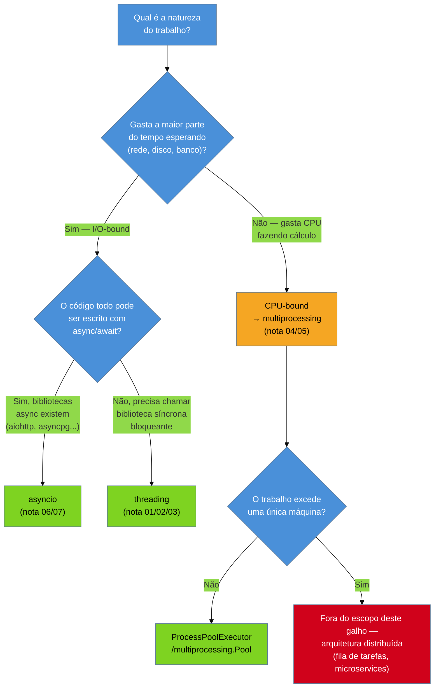
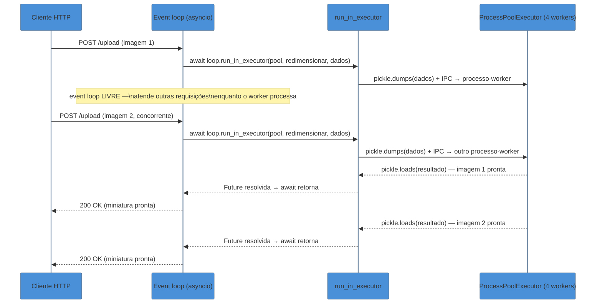

# Capstone — escolhendo threading vs multiprocessing vs asyncio

> [!abstract] TL;DR
> Esta nota fecha o Galho 7 respondendo, de uma vez por todas, à pergunta que todas as sete notas anteriores prepararam: dado um problema concreto, qual dos quatro modelos — [[01 - Threading na prática — Thread, Lock e condições de corrida|`threading`]], [[04 - multiprocessing na prática — Pool, ProcessPoolExecutor e orquestração|`multiprocessing`]], [[05 - concurrent.futures — a abstração unificadora|`concurrent.futures`]] ou [[06 - asyncio fundamentals — event loop, coroutines e Task|`asyncio`]] — usar, e por quê? A árvore de decisão final é: I/O-bound com código que pode ser 100% assíncrono → `asyncio`; I/O-bound que precisa chamar bibliotecas síncronas/bloqueantes (drivers de banco antigos, SDKs sem suporte async) → `threading`; CPU-bound → `multiprocessing`, quase sempre por trás da interface `ProcessPoolExecutor`; paralelismo que excede uma única máquina → sai do escopo de um processo Python e vira um problema de arquitetura distribuída. O cenário prático que amarra o galho inteiro é o mais comum em produção: um **servidor `asyncio`** que precisa processar uma tarefa pesada de CPU (gerar um hash criptográfico caro, redimensionar uma imagem) sem travar o event loop e sem deixar as outras centenas de conexões simultâneas esperando — a resposta é `loop.run_in_executor()` entregando o trabalho a um `ProcessPoolExecutor`, combinando de fato três dos quatro modelos do galho num único fluxo. As armadilhas mais caras do galho inteiro moram exatamente na fronteira entre modelos: um `threading.Lock.acquire()` bloqueante chamado de dentro de uma coroutine trava o event loop inteiro (não só a tarefa atual), e criar um `multiprocessing.Pool` diretamente dentro de uma coroutine — sem `run_in_executor` — bloqueia o loop no fork/spawn dos processos-filhos, o oposto exato do que `asyncio` promete.

## O problema: threading, multiprocessing, concurrent.futures e asyncio resolvem o mesmo problema?

As sete notas deste galho ensinaram quatro ferramentas distintas, cada uma com sua própria API, seu próprio vocabulário (`Thread`/`Lock` vs `Pool`/`Manager` vs `Executor`/`Future` vs `Task`/`await`) e seu próprio conjunto de armadilhas. É tentador, ao fim de um galho assim, sair da leitura com quatro caixas de ferramentas empilhadas na cabeça sem uma bússola clara de qual pegar primeiro — e é exatamente esse vácuo que gera o erro mais caro de se corrigir depois em produção: escolher o modelo errado para a natureza real do trabalho.

A pergunta que esta capstone resolve não é "como uso `Lock`" ou "como uso `TaskGroup`" — isso já foi ensinado, nota a nota. A pergunta é: **dado um pedaço de trabalho, qual das quatro ferramentas eu pego, e o que acontece se eu misturar duas delas sem cuidado?**



## Etapa 1: recapitulando o critério de cada nota, na ordem em que apareceu

### I/O-bound com bibliotecas síncronas: `threading`

As notas 01-03 abriram o galho com `threading` — não porque seja a ferramenta mais moderna (não é: `asyncio` normalmente supera `threading` em I/O-bound de alta concorrência), mas porque é a mais direta de entender primeiro: threads reais do sistema operacional, compartilhando toda a memória do processo, coordenadas por `Lock`/`Semaphore`/`Condition`/`Event`/`Barrier` (nota 02) e por `queue.Queue` no padrão produtor-consumidor (nota 03). O critério que sobrevive dessas três notas para esta capstone é específico: `threading` continua sendo a escolha certa quando o trabalho é I/O-bound **mas o código que faz esse I/O não é assíncrono** — um driver de banco de dados legado, um SDK de terceiros que só expõe chamadas bloqueantes, uma biblioteca C que libera o GIL durante I/O mas não tem (e nunca terá) uma API `async`. Reescrever essas dependências para `asyncio` normalmente não é uma opção realista; rodá-las cada uma numa thread, coordenadas por `Lock` quando compartilham estado, é.

### CPU-bound: `multiprocessing`

A nota 04 respondeu, na prática, ao motivo estrutural que a [[03-Dominios/Tecnologia/Python/CPython internals/04 - O GIL — o que é de verdade e por que existe|nota 04 do Galho 6]] já havia estabelecido: o GIL impede que `threading` acelere código Python puro CPU-bound, então a única saída dentro de um processo Python é `multiprocessing` — processos do sistema operacional, cada um com seu próprio interpretador e seu próprio GIL independente, rodando de fato em núcleos diferentes ao mesmo tempo. O preço, também herdado da nota 05 do Galho 6 e detalhado de novo na nota 04 deste galho, é a serialização via `pickle` e o IPC entre processos — um custo real, mensurável, que não existe entre threads do mesmo processo.

### A abstração que esconde a escolha: `concurrent.futures`

A nota 05 mostrou que `ThreadPoolExecutor` e `ProcessPoolExecutor` compartilham a mesma interface `Executor`/`Future` — `submit()`, `map()`, `as_completed()`, `.result()` — de propósito: trocar threading por multiprocessing (ou vice-versa) deveria, na maior parte dos casos, ser uma troca de uma linha (`ThreadPoolExecutor` → `ProcessPoolExecutor`), não uma reescrita de orquestração. Essa nota também deixou claro onde a abstração **vaza**: exceções que só aparecem em `.result()`, e picklability que só quebra tarde, na hora de despachar a tarefa para um processo. `concurrent.futures` não é um quinto modelo concorrente — é a camada de orquestração comum sobre os dois primeiros.

### I/O-bound assíncrono nativo: `asyncio`

As notas 06 e 07 trocaram de paradigma por completo: concorrência cooperativa, um único thread, sem GIL como fator relevante porque não há mais de uma thread disputando nada. `await` cede o controle explicitamente ao event loop; `asyncio.create_task()` agenda trabalho concorrente; `gather()`/`TaskGroup` orquestram várias tarefas de uma vez, com `TaskGroup` (3.11+) cancelando as irmãs automaticamente quando uma falha. O critério que sobrevive: `asyncio` vence quando o volume de operações I/O-bound concorrentes é grande (centenas a milhares de conexões simultâneas) e **as bibliotecas que fazem esse I/O já são assíncronas** — o mesmo cenário de "muitas conexões de rede esperando resposta" que `threading` também resolveria, mas com overhead de memória por unidade de concorrência ordens de magnitude menor, porque uma `Task` é muito mais barata de criar que uma `Thread` do sistema operacional.

## Etapa 2: o cenário que faltava — combinar os três modelos num fluxo só

Nenhuma das sete notas anteriores mostrou o cenário que mais aparece em produção real: um serviço que já é `asyncio` do início ao fim — um servidor HTTP que atende centenas de requisições concorrentes — mas que, no meio do fluxo, precisa executar um pedaço de trabalho genuinamente CPU-bound. Um exemplo concreto e comum: um endpoint que recebe uma imagem enviada pelo cliente e precisa gerar uma miniatura redimensionada antes de responder.

### Por que a solução ingênua trava o servidor inteiro

A tentação, para quem já está confortável com `async`/`await`, é simplesmente chamar a função de processamento de imagem dentro da coroutine do endpoint:

```python
import asyncio
import time

def redimensionar_imagem(dados_bytes: bytes) -> bytes:
    # trabalho de CPU pesado e genuíno — sem nenhum I/O
    # (aqui simulado por um cálculo síncrono custoso)
    inicio = time.monotonic()
    total = 0
    for i in range(50_000_000):
        total += i * i
    return f"miniatura-processada-{total % 997}".encode()


async def endpoint_upload(dados_bytes: bytes) -> bytes:
    # ARMADILHA: chamar uma função CPU-bound síncrona
    # direto dentro de uma coroutine
    resultado = redimensionar_imagem(dados_bytes)
    return resultado
```

O problema não é sutil, mas é fácil de não perceber em desenvolvimento local com uma única requisição por vez: `redimensionar_imagem()` roda inteiramente dentro do único thread do event loop, sem nenhum `await` no meio, e por isso **nunca cede o controle**. Enquanto essa função roda — digamos, 2 segundos de CPU pura —, o event loop fica completamente preso: nenhuma outra requisição é atendida, nenhum outro `await` progride, nem sequer um `asyncio.sleep()` de outra coroutine consegue acordar no horário certo. Um servidor que atendia 500 requisições/segundo cai, durante esses 2 segundos, para zero. É a mesma armadilha que a [[06 - asyncio fundamentals — event loop, coroutines e Task|nota 06]] já havia nomeado com o exemplo do heartbeat congelado — só que agora no contexto de um servidor real, atendendo clientes reais, não um script de demonstração.

### A solução: `loop.run_in_executor()` com `ProcessPoolExecutor`

A saída correta usa exatamente a peça que a nota 06 deixou como gancho e que esta capstone finalmente conecta: `loop.run_in_executor()`. Essa chamada pega uma função **síncrona e bloqueante**, despacha sua execução para um `Executor` (o mesmo `Executor` da [[05 - concurrent.futures — a abstração unificadora|nota 05]] — `ThreadPoolExecutor` ou `ProcessPoolExecutor`) rodando **fora** do thread do event loop, e devolve um objeto `awaitable` que a coroutine pode aguardar normalmente. Enquanto o trabalho roda no executor, o event loop **continua livre** para atender outras requisições — o `await` na chamada de `run_in_executor` é exatamente o ponto de cessão de controle que faltava.

A escolha entre `ThreadPoolExecutor` e `ProcessPoolExecutor` dentro do `run_in_executor` segue a mesma árvore de decisão da etapa 1: se o trabalho fosse I/O-bound bloqueante (uma biblioteca síncrona de banco, por exemplo), um `ThreadPoolExecutor` bastaria — as threads ficariam presas esperando I/O, mas o GIL seria solto durante a espera, exatamente como a nota 01 explicou. Como `redimensionar_imagem()` é CPU-bound puro, threads não ajudariam em nada (o GIL as manteria serializadas, pelo mesmo motivo da nota 04 do Galho 6) — a ferramenta certa é `ProcessPoolExecutor`, que dá a cada tarefa um processo com GIL próprio, rodando de fato em paralelo.

```python
import asyncio
import time
from concurrent.futures import ProcessPoolExecutor


def redimensionar_imagem(dados_bytes: bytes) -> bytes:
    """Função pura, top-level (picklable) — roda em processo separado."""
    inicio = time.monotonic()
    total = 0
    for i in range(50_000_000):
        total += i * i
    return f"miniatura-processada-{total % 997}".encode()


class ServidorUpload:
    def __init__(self, max_workers: int = 4):
        # Um único ProcessPoolExecutor reaproveitado entre requisições —
        # criar um Pool novo por requisição pagaria o custo de fork/spawn
        # a cada chamada, anulando o ganho.
        self._pool = ProcessPoolExecutor(max_workers=max_workers)

    async def endpoint_upload(self, dados_bytes: bytes) -> bytes:
        loop = asyncio.get_running_loop()
        # run_in_executor NÃO aceita kwargs — só *args posicionais via
        # functools.partial se necessário.
        resultado = await loop.run_in_executor(
            self._pool, redimensionar_imagem, dados_bytes
        )
        return resultado

    def fechar(self):
        self._pool.shutdown(wait=True)


async def simular_varias_requisicoes_concorrentes():
    servidor = ServidorUpload(max_workers=4)

    async def requisicao_simulada(id_req: int):
        print(f"[{id_req}] chegou, event loop segue livre")
        resultado = await servidor.endpoint_upload(f"imagem-{id_req}".encode())
        print(f"[{id_req}] processado: {resultado}")

    # 6 "clientes" batem no servidor ao mesmo tempo — com só 4 workers,
    # as duas últimas tarefas esperam a vez, mas o event loop nunca trava
    async with asyncio.TaskGroup() as tg:
        for i in range(6):
            tg.create_task(requisicao_simulada(i))

    servidor.fechar()


if __name__ == "__main__":
    asyncio.run(simular_varias_requisicoes_concorrentes())
```



Três dos quatro modelos do galho aparecem juntos, cada um fazendo exatamente o que sua nota de origem prometeu: `asyncio` (notas 06/07) segura a concorrência de I/O do servidor inteiro; `concurrent.futures` (nota 05) fornece a interface `Executor`/`Future` que `run_in_executor` usa por baixo; `multiprocessing` (nota 04), via `ProcessPoolExecutor`, entrega o paralelismo real de CPU sem o qual o cálculo de miniatura sufocaria o loop. `threading` não aparece neste cenário específico porque o trabalho descarregado é CPU-bound puro — mas se `redimensionar_imagem` fizesse, em vez disso, uma chamada de rede síncrona bloqueante para um serviço externo de processamento de imagem, a mesma chamada `run_in_executor(self._thread_pool, ...)` com um `ThreadPoolExecutor` resolveria igualmente bem, pelo motivo oposto: o GIL seria solto durante a espera de I/O, e várias threads bloqueadas custariam pouco.

> [!question]- Por que não simplesmente criar `ProcessPoolExecutor()` uma vez por chamada, dentro do endpoint?
> Porque criar um `ProcessPoolExecutor` — como qualquer objeto que sobe processos do sistema operacional — paga o custo de `fork`/`spawn` descrito na [[04 - multiprocessing na prática — Pool, ProcessPoolExecutor e orquestração|nota 04]] toda vez que é instanciado. Sob `spawn` (padrão em macOS/Windows), isso significa reiniciar um interpretador Python do zero, reimportar módulos, a cada requisição — um custo que domina completamente o tempo do endpoint e anula qualquer ganho de paralelismo. A prática correta, mostrada no código acima, é criar **um único pool** na inicialização do servidor (`ServidorUpload.__init__`) e reaproveitá-lo entre todas as requisições, com `shutdown(wait=True)` no encerramento gracioso do processo — o mesmo padrão de "pool de longa duração" que a nota 04 recomendou para qualquer uso de `Pool`/`ProcessPoolExecutor` em produção.

## Etapa 3: armadilhas de misturar os quatro modelos

O cenário integrador da etapa 2 resolveu a combinação **correta**. As armadilhas mais caras deste galho nascem exatamente da combinação **incorreta** — usar a primitiva errada dentro do paradigma errado, muitas vezes sem erro nenhum em tempo de execução, só degradação silenciosa de performance ou concorrência.

### Armadilha 1: `threading.Lock` (bloqueante) dentro de uma coroutine

Um erro comum de quem migra código de `threading` para `asyncio` é reaproveitar por reflexo o `Lock` que já conhece:

```python
import threading
import asyncio

lock_errado = threading.Lock()   # ARMADILHA: Lock de threading, não de asyncio

async def atualizar_saldo_errado(conta, valor):
    lock_errado.acquire()   # bloqueante — trava o THREAD inteiro
    try:
        conta["saldo"] += valor
        await asyncio.sleep(0.01)  # ex.: gravar em banco assíncrono
    finally:
        lock_errado.release()
```

`threading.Lock.acquire()` é uma chamada **bloqueante de verdade** — ela não sabe nada sobre coroutines, `await`, ou o event loop. Quando uma coroutine chama `lock_errado.acquire()` e o lock já está tomado por outra tarefa, o thread inteiro do event loop trava esperando o lock ser liberado — e como só existe um thread rodando o loop inteiro, **nenhuma outra coroutine consegue progredir enquanto isso**, mesmo as que não têm nada a ver com esse lock. É o mesmo tipo de travamento total do event loop que a etapa 2 mostrou com CPU-bound sem `await` — só que aqui a causa é sincronização, não cálculo.

A correção é trocar `threading.Lock` por `asyncio.Lock`, coberto na [[07 - asyncio na prática — gather, TaskGroup, timeouts e cancelamento|nota 07]] como o paralelo assíncrono correto: seu `acquire()` é `async` e, se o lock já estiver tomado, **cede o controle ao event loop** em vez de bloquear o thread — outras coroutines continuam progredindo enquanto esta espera sua vez.

```python
lock_correto = asyncio.Lock()

async def atualizar_saldo_correto(conta, valor):
    async with lock_correto:   # await lock.acquire() por baixo — não bloqueia o loop
        conta["saldo"] += valor
        await asyncio.sleep(0.01)
```

> [!warning] `asyncio.Lock` só coordena coroutines do mesmo event loop
> Vale reforçar o que a nota 07 já registrou: `asyncio.Lock`/`Semaphore`/`Queue` não são substitutos de `threading.Lock`/`Semaphore`/`Queue` em todo contexto — eles só coordenam tarefas dentro do **mesmo** event loop, no mesmo thread. Se o mesmo estado compartilhado for acessado tanto por coroutines quanto por threads reais rodando em paralelo (um cenário híbrido, mais raro mas real), a primitiva de `threading` continua sendo necessária para a parte que envolve threads — as duas famílias de locks não são intercambiáveis, e não protegem uma à outra.

### Armadilha 2: `multiprocessing.Pool()` criado direto dentro de uma coroutine, sem `run_in_executor`

A segunda armadilha é mais sutil porque, à primeira vista, o código parece razoável — está usando `multiprocessing`, a ferramenta certa para CPU-bound:

```python
import asyncio
from multiprocessing import Pool

async def processar_lote_errado(itens):
    # ARMADILHA: Pool() bloqueia o thread do event loop
    # durante a criação dos processos-filhos (fork/spawn)
    with Pool(processes=4) as pool:
        resultados = pool.map(redimensionar_imagem, itens)  # também bloqueante
    return resultados
```

O problema é que tanto `Pool(processes=4)` (a criação dos processos-filhos) quanto `pool.map(...)` (a chamada síncrona que só retorna quando **todo** o lote termina) são operações **bloqueantes** — nenhuma das duas tem `await` na frente porque nenhuma das duas é uma API assíncrona. Chamadas assim, direto dentro de uma coroutine, travam o event loop inteiro pela duração inteira do `fork`/`spawn` de quatro processos e depois pela duração inteira do processamento síncrono de todo o lote — exatamente o mesmo sintoma da armadilha 1, com uma causa diferente: aqui não é o cálculo em si que trava o loop, é uma chamada de API síncrona e bloqueante sendo tratada como se fosse compatível com `async`/`await` só porque está dentro de uma função `async def`.

`async def` não torna automaticamente assíncrono nada que seja chamado dentro dela — esse é, na prática, o mesmo mal-entendido que a [[06 - asyncio fundamentals — event loop, coroutines e Task|nota 06]] nomeou logo na abertura do galho com o bug de "coroutine nunca aguardada", só que invertido: lá o erro era esquecer o `await` numa chamada que precisava dele; aqui o erro é não perceber que a chamada nunca teve um `await` disponível para começo de conversa, porque `Pool()`/`pool.map()` são APIs de `multiprocessing`, desenhadas décadas antes de `asyncio` existir, sem noção nenhuma de event loop.

A correção é exatamente o padrão da etapa 2: envolver a chamada bloqueante em `run_in_executor`, deixando o `Executor` (que já sabe lidar com processos, via `ProcessPoolExecutor`) rodar fora do thread do loop:

```python
from concurrent.futures import ProcessPoolExecutor

async def processar_lote_correto(itens, pool_reaproveitado: ProcessPoolExecutor):
    loop = asyncio.get_running_loop()
    tarefas = [
        loop.run_in_executor(pool_reaproveitado, redimensionar_imagem, item)
        for item in itens
    ]
    resultados = await asyncio.gather(*tarefas)
    return resultados
```

Note que este último trecho amarra literalmente as quatro peças do galho numa função de dez linhas: `asyncio.gather` (nota 07) orquestra múltiplas chamadas de `run_in_executor` (a ponte entre `asyncio` e `concurrent.futures`, nota 05) despachadas para um `ProcessPoolExecutor` reaproveitado (nota 04) — sem nenhum `threading.Lock` envolvido porque não há estado mutável compartilhado neste trecho específico.

### Armadilha 3: usar `asyncio.Queue` para coordenar threads reais

Um terceiro deslize, menos comum mas real em bases de código que migram gradualmente de `threading` para `asyncio`: usar `asyncio.Queue` (nota 07) pensando que ela vai coordenar produtores/consumidores rodando em **threads** separadas, do jeito que `queue.Queue` (nota 03) faz.

```python
import asyncio
import threading

fila_errada = asyncio.Queue()   # ARMADILHA: pensada pra coroutines, não threads

def worker_thread_errado():
    while True:
        item = fila_errada.get_nowait()   # não é thread-safe da forma esperada
        # ... processar item ...
```

`asyncio.Queue` não é thread-safe no sentido em que `queue.Queue` é — seus métodos assumem que só o thread do event loop está chamando `put`/`get`, e não têm o mesmo mecanismo interno de `Lock`/`Condition` que a [[03 - queue.Queue e o padrão produtor-consumidor|nota 03]] descreveu para `queue.Queue`. Se um `worker` rodando numa `threading.Thread` real chamar `fila_errada.get_nowait()` diretamente, o resultado é comportamento indefinido sob concorrência — não uma exceção clara, o que torna o bug ainda mais caro de encontrar depois. A regra prática, direto da tabela de decisão desta capstone: `queue.Queue` para coordenar **threads**; `asyncio.Queue` para coordenar **coroutines do mesmo event loop**. Coordenar as duas ao mesmo tempo exige uma ponte explícita — normalmente `loop.call_soon_threadsafe()` do lado do thread, chamando de volta para dentro do loop — e não a troca ingênua de um tipo de fila pelo outro.

## Etapa 4: paralelismo além de um processo — fora do escopo deste galho

A árvore de decisão da etapa 1 tem uma quarta folha, deliberadamente não aprofundada aqui: e se o trabalho CPU-bound for grande demais até para todos os núcleos de uma única máquina? `multiprocessing` paraleliza dentro dos limites físicos de um processo host — o número de núcleos disponíveis é o teto real de ganho, e nenhuma configuração de `ProcessPoolExecutor` muda isso. Quando o volume de trabalho excede uma máquina, o problema deixa de ser "qual primitiva de concorrência do Python usar" e passa a ser um problema de **arquitetura distribuída**: filas de tarefas (Celery, RQ) despachando trabalho para múltiplos hosts, ou serviços inteiros comunicando-se entre si. Esse território pertence ao próximo galho da trilha e, mais adiante, ao domínio de sistemas distribuídos que a trilha Engenharia já cobriu em [[03-Dominios/Engenharia/Comunicação entre Sistemas/index|Comunicação entre Sistemas]] — esta capstone só nomeia a fronteira, sem cruzá-la.

## Casos práticos

### Cenário 1: um scraper que faz milhares de requisições HTTP

Um serviço precisa buscar dados de 5.000 URLs externas, uma vez por hora, e consolidar o resultado. Cada requisição individual gasta a maior parte do tempo esperando resposta de rede — pouquíssima CPU local envolvida. Pela árvore de decisão desta capstone: é I/O-bound (etapa 1), e se a biblioteca HTTP escolhida for assíncrona (`aiohttp`, `httpx` em modo async), a resposta é `asyncio` — não `threading`. Rodar 5.000 threads reais do sistema operacional seria tecnicamente possível, mas cada `Thread` custa memória de stack e overhead de agendamento do sistema operacional que uma `Task` de `asyncio` não paga; a diferença fica evidente exatamente na escala de milhares de operações concorrentes, o ponto em que a nota 06 descreveu `asyncio` como "excelente para I/O-bound em escala massiva".

```python
import asyncio
import httpx

async def buscar_uma_url(cliente: httpx.AsyncClient, url: str) -> dict:
    resposta = await cliente.get(url, timeout=10.0)
    return {"url": url, "status": resposta.status_code}

async def buscar_todas(urls: list[str]) -> list[dict]:
    async with httpx.AsyncClient() as cliente:
        async with asyncio.TaskGroup() as tg:
            tarefas = [tg.create_task(buscar_uma_url(cliente, u)) for u in urls]
    return [t.result() for t in tarefas]
```

Se, em vez disso, o único cliente HTTP disponível na organização fosse uma biblioteca síncrona legada, sem variante assíncrona (um caso real e comum em bases de código mais antigas), a resposta mudaria para `threading` com um `ThreadPoolExecutor` limitando o grau de concorrência — não porque `threading` seja preferível a `asyncio` em geral, mas porque a biblioteca disponível dita a ferramenta compatível, o mesmo critério que a etapa 1 nomeou para `threading`.

### Cenário 2: um pipeline batch que faz hash de arquivos grandes

Um serviço de backup precisa calcular o hash SHA-256 de 200 arquivos, cada um de vários gigabytes, antes de enviá-los para armazenamento. Calcular hash criptográfico é CPU-bound puro — o gargalo é ciclos de processador percorrendo os bytes do arquivo, não espera de rede ou disco (assumindo os arquivos já em disco local rápido). A árvore de decisão aponta direto para `multiprocessing`, sem passar por `asyncio` ou `threading` — não há nenhum servidor concorrente aqui esperando outras requisições, é um script batch que só precisa terminar o mais rápido possível usando todos os núcleos disponíveis.

```python
import hashlib
from concurrent.futures import ProcessPoolExecutor
from pathlib import Path

def hash_arquivo(caminho: Path) -> tuple[str, str]:
    h = hashlib.sha256()
    with open(caminho, "rb") as f:
        for bloco in iter(lambda: f.read(8 * 1024 * 1024), b""):
            h.update(bloco)
    return (str(caminho), h.hexdigest())

def processar_backup(arquivos: list[Path]) -> dict[str, str]:
    with ProcessPoolExecutor() as executor:  # usa os.cpu_count() por padrão
        resultados = executor.map(hash_arquivo, arquivos)
    return dict(resultados)
```

Este cenário não tem componente `asyncio` nenhum, de propósito — é o lembrete de que nem todo problema precisa das quatro ferramentas do galho ao mesmo tempo. Um script batch CPU-bound simples não ganha nada complicando a orquestração com um event loop; `ProcessPoolExecutor` sozinho, direto, já resolve o problema inteiro. A tentação de "usar `asyncio` porque é moderno" aqui seria um erro de julgamento — o gargalo nunca foi I/O, é puramente CPU, e `asyncio` não paraleliza CPU-bound de forma nenhuma.

### Cenário 3: o mesmo scraper do cenário 1, mas com um passo de processamento pesado no meio

Uma variação mais realista do cenário 1: depois de baixar cada resposta HTTP, o serviço precisa aplicar um parsing pesado de HTML/XML sobre o conteúdo — CPU-bound de verdade, não trivial. Aqui os três cenários desta capstone se encontram: a busca continua sendo I/O-bound assíncrono (`asyncio` + `aiohttp`/`httpx`), mas o parsing pesado, se colocado direto dentro da coroutine, recriaria a armadilha 1 da etapa 3 — travando o loop a cada resposta recebida. A correção é a mesma da etapa 2: descarregar só o passo de parsing para um `ProcessPoolExecutor` via `run_in_executor`, mantendo a busca de rede assíncrona e nativa.

```python
async def buscar_e_processar(cliente, url, pool_cpu):
    resposta = await cliente.get(url)
    loop = asyncio.get_running_loop()
    # I/O (busca) fica em asyncio; parsing pesado (CPU) vai pro pool de processos
    dados_extraidos = await loop.run_in_executor(pool_cpu, parsear_html_pesado, resposta.text)
    return dados_extraidos
```

Este é, na prática, o mesmo padrão do cenário integrador da etapa 2 — só que motivado por um pipeline de dados em vez de um servidor HTTP recebendo uploads. O reconhecimento importante é que o padrão "`asyncio` para I/O + `run_in_executor`/`ProcessPoolExecutor` para CPU" não é específico de servidores web; é o padrão geral para qualquer fluxo que mistura as duas naturezas de trabalho dentro do mesmo processo.

## Tabela-resumo: os quatro modelos lado a lado

| Dimensão | `threading` | `multiprocessing` | `concurrent.futures` | `asyncio` |
|---|---|---|---|---|
| Paralelismo real (CPU)? | Não — GIL serializa bytecode Python | Sim — processos com GIL independente | Depende do `Executor` escolhido (`Thread`/`ProcessPoolExecutor`) | Não — single-thread, cooperativo |
| Overhead de criação | Baixo-médio (thread do SO, ~KB de stack) | Alto (fork/spawn de processo inteiro) | Igual ao `Executor` escolhido por baixo | Muito baixo (`Task` é um objeto leve) |
| Melhor caso de uso | I/O-bound com bibliotecas síncronas/bloqueantes | CPU-bound puro | Orquestração unificada entre threading/multiprocessing | I/O-bound com bibliotecas assíncronas, alta concorrência |
| GIL relevante? | Sim — é o motivo de não acelerar CPU-bound | Não — cada processo tem o seu | Sim, se o `Executor` for `ThreadPoolExecutor` | Irrelevante — só um thread disputando nada |
| Complexidade de debugging | Média-alta — race conditions, deadlocks | Alta — picklability, IPC, start methods | Média — vazamentos de exceção/pickling adiados até `.result()` | Média — cancelamento cooperativo, `CancelledError`, ordem de `await` |

A leitura dessa tabela como um todo é o resumo do galho inteiro: não existe "o melhor modelo" em abstrato — existe o modelo certo para a natureza do trabalho (I/O vs CPU), para a forma da biblioteca disponível (síncrona vs assíncrona), e para o quanto o time está disposto a pagar em complexidade de orquestração e debugging pelo ganho de concorrência ou paralelismo que cada um entrega.

## Armadilhas comuns

> [!warning] Chamar código CPU-bound síncrono direto dentro de uma coroutine `async def`
> **O que acontece:** o event loop inteiro trava pela duração do cálculo — não só a requisição atual, todas as outras conexões concorrentes também param de progredir. **Por quê:** `async def` não torna a função mágica; sem nenhum `await` no meio, a coroutine roda do início ao fim como qualquer função síncrona, e o event loop não tem como interrompê-la no meio (não há preempção em `asyncio`). **Como evitar:** qualquer trabalho CPU-bound genuíno dentro de um servidor `asyncio` precisa passar por `loop.run_in_executor()` com um `ProcessPoolExecutor` — o padrão inteiro da etapa 2 desta capstone.

> [!warning] Usar `threading.Lock`/`Queue` em vez das versões `asyncio.Lock`/`Queue` dentro de coroutines
> **O que acontece:** o `acquire()`/`get()` bloqueante trava o thread único do event loop, com o mesmo efeito colateral da armadilha anterior — todas as outras tarefas param, não só a que fez a chamada. **Por quê:** as primitivas de `threading` não têm noção de event loop; foram desenhadas para coordenar threads reais do sistema operacional, décadas antes de `asyncio` existir. **Como evitar:** dentro de coroutines, sempre usar as versões `asyncio.*` das primitivas (`Lock`, `Semaphore`, `Queue`, `Event`) — elas cedem o controle ao loop em vez de bloquear o thread.

> [!warning] Criar `Pool`/`ProcessPoolExecutor` novo a cada chamada em vez de reaproveitar um único pool de longa duração
> **O que acontece:** cada requisição paga o custo completo de `fork`/`spawn` de vários processos-filhos, anulando (ou revertendo) o ganho de paralelismo que motivou usar `multiprocessing` em primeiro lugar. **Por quê:** subir processos do sistema operacional não é uma operação barata, especialmente sob `spawn` (macOS/Windows), que reimporta o interpretador do zero a cada vez — ver [[04 - multiprocessing na prática — Pool, ProcessPoolExecutor e orquestração|nota 04]] deste galho. **Como evitar:** criar o pool uma única vez, na inicialização do serviço, e reutilizá-lo entre todas as chamadas, com `shutdown(wait=True)` explícito no encerramento gracioso.

> [!warning] Misturar `asyncio.Queue` com threads reais esperando thread-safety que ela não oferece
> **O que acontece:** comportamento indefinido sob concorrência — sem exceção clara, o que torna o bug difícil de reproduzir e mais caro de diagnosticar do que um deadlock óbvio. **Por quê:** `asyncio.Queue` assume que só o thread do event loop a acessa; ela não tem o `Lock`/`Condition` interno que torna `queue.Queue` (nota 03) genuinamente thread-safe. **Como evitar:** `queue.Queue` para coordenar threads; `asyncio.Queue` para coordenar coroutines do mesmo loop; uma ponte explícita (`loop.call_soon_threadsafe()`) quando os dois mundos genuinamente precisam se falar.

## Em entrevista

A pergunta "quando você usaria threading vs multiprocessing vs asyncio?" é praticamente garantida em qualquer entrevista sênior de Python que toque concorrência — e a resposta que diferencia quem decorou os nomes de quem entende o mecanismo é justamente saber nomear a árvore de decisão junto com o *porquê* de cada ramo, não só o rótulo final.

> "I'd start from the nature of the work, not the tool. If it's CPU-bound — real computation, not waiting — threading can't help, because the GIL serializes bytecode execution across threads; multiprocessing is the only way to get real parallelism inside a single Python process, running each task in its own interpreter with its own GIL, at the cost of pickling data across process boundaries. If it's I/O-bound — waiting on network, disk, or a database — the choice depends on whether the libraries involved are async-native. If they are, asyncio wins for high concurrency: a `Task` is much cheaper to create than an OS thread, so you can hold thousands of pending connections with very little overhead. If the I/O has to go through a synchronous, blocking library — an older database driver, a third-party SDK with no async support — threading is still the right call, because the GIL is released during blocking I/O anyway. In practice, most real services need more than one of these at once. A common pattern is an asyncio server that occasionally needs to run CPU-heavy work — image processing, hashing — without blocking the event loop; the fix is `loop.run_in_executor()` handing that work off to a `ProcessPoolExecutor`, so the event loop stays free to serve other requests while the CPU-bound work runs in parallel in separate processes. The mistake I watch for is mixing primitives across paradigms — calling a blocking `threading.Lock.acquire()` or creating a `multiprocessing.Pool` directly inside a coroutine, both of which freeze the entire event loop, not just the current task, because neither API has any concept of yielding control back to a loop."

Uma pergunta de acompanhamento comum: **"e se o trabalho for grande demais para uma única máquina?"** — a resposta sênior reconhece a fronteira sem tentar improvisar uma solução dentro do processo: nesse ponto o problema deixa de ser sobre `threading`/`multiprocessing`/`asyncio` e vira uma decisão de arquitetura distribuída — filas de tarefas, múltiplos hosts, comunicação entre serviços — um território deliberadamente fora do escopo de "qual primitiva de concorrência usar dentro de um processo Python".

> [!question]- O entrevistador insiste: "mas na prática, você não deveria simplesmente usar asyncio pra tudo, já que é o mais moderno?"
> A resposta sênior resiste à tentação de tratar "mais moderno" como sinônimo de "sempre certo". `asyncio` só ajuda quando o gargalo é I/O-bound **e** as bibliotecas envolvidas são assíncronas — usá-lo para envolver uma chamada síncrona bloqueante sem `run_in_executor` recria exatamente a armadilha 2 desta capstone, travando o loop inteiro. E para CPU-bound, `asyncio` sozinho não ajuda em nada — o gargalo nunca foi concorrência de I/O, foi falta de núcleos de CPU trabalhando em paralelo, o que só `multiprocessing` resolve. A escolha certa é sempre uma função da natureza do trabalho, não da popularidade da ferramenta.

## Como explicar em inglês

> Choosing between threading, multiprocessing, and asyncio in Python comes down to one question: is the work waiting on something external, or actually computing? For CPU-bound work — real computation — threading can't parallelize it, because the GIL serializes bytecode execution across threads; multiprocessing is the only way to get true parallelism within a single Python process, at the cost of pickling data across process boundaries. For I/O-bound work, the choice depends on whether the libraries involved are async-native: if they are, asyncio scales further, because a `Task` costs far less memory than an OS thread, letting you hold thousands of pending connections concurrently; if the I/O has to go through a blocking, synchronous library, threading is still the right tool, since the GIL is released during blocking I/O regardless. Most real production services need more than one of these together — a common pattern is an asyncio server offloading occasional CPU-heavy work to a `ProcessPoolExecutor` via `loop.run_in_executor()`, so the event loop keeps serving other requests while the heavy computation runs in parallel processes. The costliest mistakes come from mixing primitives across paradigms: calling a blocking `threading.Lock` or spinning up a `multiprocessing.Pool` directly inside a coroutine both freeze the entire event loop, not just the current task, because neither API understands how to yield control back to a loop. When the workload outgrows a single machine entirely, the problem stops being about which Python concurrency primitive to reach for and becomes a distributed-systems architecture question instead.

| PT | EN |
|---|---|
| I/O-bound | I/O-bound |
| CPU-bound | CPU-bound |
| paralelismo real | true/genuine parallelism |
| concorrência cooperativa | cooperative concurrency |
| travar o event loop | block/freeze the event loop |
| descarregar trabalho | offload work |
| pool de longa duração | long-lived pool |
| primitiva de sincronização | synchronization primitive |
| fronteira de processo | process boundary |
| arquitetura distribuída | distributed architecture |

## Fechamento do Galho 7 — Concorrência e paralelismo

Esta é a última nota do Galho 7. Recapitulando o que as oito notas cobriram juntas:

1. [[01 - Threading na prática — Thread, Lock e condições de corrida|01 — Threading na prática: `Thread`, `Lock` e condições de corrida]] abriu o galho com o mito mais persistente do modelo — "o GIL torna Python thread-safe" — e mostrou, via `dis` do bytecode de `contador += 1`, exatamente onde esse mito quebra: uma sequência de instruções, não uma operação atômica.
2. [[02 - Sincronização avançada — Semaphore, Condition, Event, Barrier|02 — Sincronização avançada: `Semaphore`, `Condition`, `Event`, `Barrier`]] estendeu o vocabulário de coordenação além do `Lock` simples, e aprofundou deadlock — lock ordering, condições de Coffman, `acquire(timeout=...)` como rede de segurança.
3. [[03 - queue.Queue e o padrão produtor-consumidor|03 — `queue.Queue` e o padrão produtor-consumidor]] entregou a estrutura de dados thread-safe pronta para o padrão mais comum de concorrência com `threading`: workers consumindo trabalho de uma fila compartilhada, com poison pill para encerramento gracioso.
4. [[04 - multiprocessing na prática — Pool, ProcessPoolExecutor e orquestração|04 — `multiprocessing` na prática: `Pool`, `ProcessPoolExecutor` e orquestração]] deu a saída real para CPU-bound — processos com GIL independente — e nomeou o detalhe que mais silenciosamente quebra código entre sistemas operacionais: `fork` vs `spawn` vs `forkserver`.
5. [[05 - concurrent.futures — a abstração unificadora|05 — `concurrent.futures`: a abstração unificadora]] mostrou por que `ThreadPoolExecutor` e `ProcessPoolExecutor` compartilham a mesma interface `Executor`/`Future` — e onde exatamente essa abstração vaza (exceções adiadas, picklability tardia).
6. [[06 - asyncio fundamentals — event loop, coroutines e Task|06 — `asyncio` fundamentals: event loop, coroutines e `Task`]] trocou de paradigma por completo — concorrência cooperativa, single-thread, sem GIL como fator — e estabeleceu a distinção central entre `await coroutine` (sequencial) e `create_task()` (concorrente).
7. [[07 - asyncio na prática — gather, TaskGroup, timeouts e cancelamento|07 — `asyncio` na prática: `gather`, `TaskGroup`, timeouts e cancelamento]] aprofundou orquestração real — `TaskGroup` com cancelamento estruturado das irmãs, `wait_for`, e o mecanismo cooperativo por trás de `task.cancel()`.
8. Esta nota fechou amarrando as quatro ferramentas numa árvore de decisão única e num cenário integrador real: um servidor `asyncio` descarregando trabalho CPU-bound para um `ProcessPoolExecutor` via `run_in_executor`, com as armadilhas de misturar paradigmas nomeadas explicitamente.

Juntas, essas oito notas formam **a caixa de ferramentas de concorrência e paralelismo em Python aplicada** — não mais "o que é o GIL" (isso ficou no Galho 6), mas "dado este trabalho, qual ferramenta eu pego, e o que quebra se eu escolher errado ou misturar duas sem cuidado".

## O que vem a seguir

Esta capstone deliberadamente não aprofundou `asyncio` além do que as notas 06/07 já cobriram — não entrou em frameworks web assíncronos completos (`aiohttp`, `FastAPI`), back-pressure, streaming, ou os padrões de produção de um servidor `asyncio` real além do essencial do `run_in_executor` mostrado aqui. Também não entrou em paralelismo que ultrapassa uma única máquina — filas de tarefas distribuídas, comunicação entre serviços — deliberadamente nomeado como fora de escopo na etapa 4.

- **[[03-Dominios/Tecnologia/Python/Programação Reativa e Assíncrona/index|Galho 8 — Programação Reativa e Assíncrona]]** (ainda não escrito) — pega o `asyncio` fundamentals construído aqui e aprofunda: `aiohttp`, frameworks assíncronos completos, back-pressure, streaming — o degrau natural para quem já entende event loop, `Task` e cancelamento cooperativo.
- [[03-Dominios/Tecnologia/Python/CPython internals/index|Galho 6 — CPython internals]] — o "porquê" estrutural por trás de tudo neste galho: o GIL (nota 04), o custo de serialização do `multiprocessing` (nota 05), e o motor `ceval.c` que executa cada bytecode de cada thread, processo ou coroutine deste galho.
- [[03-Dominios/Tecnologia/Python/index|Trilha Python]] — MOC da trilha.
- [[03-Dominios/Engenharia/Comunicação entre Sistemas/index|Comunicação entre Sistemas]] — onde a fronteira nomeada na etapa 4 (paralelismo além de uma máquina) é de fato tratada, no domínio Engenharia.

## Fontes

- Python Software Foundation. *asyncio — Asynchronous I/O*, especialmente *Event Loop*, *Coroutines and Tasks*, e *Developing with asyncio*. docs.python.org, versão 3.14. https://docs.python.org/3/library/asyncio.html (acessado em 2026-07-10)
- Python Software Foundation. *asyncio — loop.run_in_executor()*. docs.python.org, versão 3.14. https://docs.python.org/3/library/asyncio-eventloop.html#asyncio.loop.run_in_executor (acessado em 2026-07-10)
- Python Software Foundation. *concurrent.futures — Launching parallel tasks*. docs.python.org, versão 3.14. https://docs.python.org/3/library/concurrent.futures.html (acessado em 2026-07-10)
- Python Software Foundation. *multiprocessing — Process-based parallelism*. docs.python.org, versão 3.14. https://docs.python.org/3/library/multiprocessing.html (acessado em 2026-07-10)
- Python Software Foundation. *threading — Thread-based parallelism*. docs.python.org, versão 3.14. https://docs.python.org/3/library/threading.html (acessado em 2026-07-10)
- Real Python. *Speed Up Your Python Program With Concurrency* e *Async IO in Python: A Complete Walkthrough*. https://realpython.com/ (acessado em 2026-07-10)
- Ramalho, L. *Fluent Python: Clear, Concise, and Effective Programming*, 2ª ed. — capítulos sobre concorrência com futures, `asyncio` e processos. O'Reilly Media, 2022.
- Miguel Grinberg. *Asyncio and the future of Python: threads vs. coroutines*. PyCon talks (transcrições/slides consultados via miguelgrinberg.com). (acessado em 2026-07-10)
- [[01 - Threading na prática — Thread, Lock e condições de corrida|01]], [[02 - Sincronização avançada — Semaphore, Condition, Event, Barrier|02]], [[03 - queue.Queue e o padrão produtor-consumidor|03]], [[04 - multiprocessing na prática — Pool, ProcessPoolExecutor e orquestração|04]], [[05 - concurrent.futures — a abstração unificadora|05]], [[06 - asyncio fundamentals — event loop, coroutines e Task|06]], [[07 - asyncio na prática — gather, TaskGroup, timeouts e cancelamento|07]] — as sete notas irmãs deste galho, cada uma fonte primária dos mecanismos amarrados nesta capstone.
- [[03-Dominios/Tecnologia/Python/CPython internals/04 - O GIL — o que é de verdade e por que existe|CPython internals 04 — O GIL]] e [[03-Dominios/Tecnologia/Python/CPython internals/05 - GIL e concorrência na prática — threading vs multiprocessing|CPython internals 05]] — o fundamento estrutural que este galho aplicou na prática, sem repetir.

Consultado em 2026-07-10.
