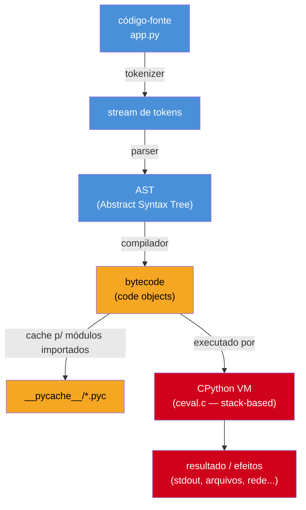

# O que é Python e como ele executa

> [!abstract] TL;DR
> Python é uma linguagem que **parece** não precisar de compilação — você digita `python app.py` e o programa roda, sem passo de `build` visível. Por baixo do capô, porém, existe sim uma etapa de compilação: o interpretador (na implementação de referência, **CPython**) faz o parsing do código-fonte, monta uma **AST** (árvore de sintaxe abstrata), compila essa árvore para **bytecode** — instruções de baixo nível só a máquina virtual do Python entende — e só então executa esse bytecode numa **VM stack-based** escrita em C. O bytecode de módulos importados é cacheado em arquivos `.pyc` dentro de pastas `__pycache__`, o que acelera execuções futuras sem mudar a natureza interpretada da linguagem. CPython é a implementação oficial e mais usada; **PyPy** (com JIT, mais rápida em cargas CPU-bound), **MicroPython** (para microcontroladores) e **Jython**/**IronPython** (legado, integração com JVM/.NET) são alternativas com o mesmo modelo mental, motores diferentes.

## O que é

Imagine a seguinte cena: você está depurando um bug esquisito. Alterou uma função em `utils.py`, salvou, rodou o script de novo — e o comportamento antigo continuou lá, como se a edição não tivesse acontecido. Depois de vinte minutos de dúvida da própria sanidade, você percebe que existe uma pasta oculta chamada `__pycache__` cheia de arquivos `.pyc`, e que um deles ainda carrega a versão velha da função. Você apaga a pasta, roda de novo, e o bug some.

Essa cena confunde muita gente que aprendeu Python "rodando scripts" sem nunca perguntar o que acontece entre o `Enter` no terminal e a primeira linha impressa na tela. E ela é o ponto de entrada perfeito para a pergunta central desta nota: **Python é uma linguagem compilada ou interpretada?** A resposta curta é "as duas coisas, numa mistura específica" — e entender essa mistura é o que separa quem só executa scripts de quem sabe explicar, com precisão, por que o Python se comporta do jeito que se comporta.

### A dicotomia falsa: compilado vs. interpretado

Quando alguém vem de uma linguagem como **Java** ou **C#**, o modelo mental de "compilar" já está formado: você roda `javac MinhaClasse.java`, o compilador produz um `.class` com bytecode JVM, e só depois a JVM executa esse `.class`. Compilação e execução são dois passos **explícitos e separados** — dois comandos, dois momentos. Quando essa mesma pessoa chega no Python e digita `python app.py`, o programa simplesmente roda. Nenhum passo de build visível. A conclusão natural — mas errada — é "então Python não compila, só interpreta linha a linha".

A [documentação de discussão oficial do Python](https://discuss.python.org/t/is-python-a-compiled-language-or-an-interpreted-language/6556) trata essa pergunta como recorrente e genuinamente ambígua, porque "compilado" e "interpretado" não são propriedades da linguagem — são propriedades de uma **implementação específica** dela. A linguagem Python (a especificação: sintaxe, semântica, gramática) não determina como o código deve ser executado; quem determina isso é o programa que você usa para rodá-lo. E a implementação de referência mais usada, **CPython**, na verdade **compila internamente** — só que faz isso de forma automática, incremental e invisível para quem só quer rodar o script.

Como resume bem um artigo frequentemente citado sobre o tema: *"Python is an interpreted language with a compiler"* — Python é uma linguagem interpretada que tem, por dentro, um compilador. O comando `python` que você chama no terminal não é "só um interpretador" no sentido ingênuo de "lê e executa linha a linha, sem preparo nenhum". Ele é, na verdade, dois programas em um: um **compilador** (que transforma seu `.py` em bytecode) e uma **máquina virtual** (que executa esse bytecode). Você só enxerga o resultado final porque os dois passos acontecem em sequência, automaticamente, dentro do mesmo processo — sem exigir um comando separado de "build".

> [!question]- Se compila por dentro, por que todo mundo chama Python de "interpretada"?
> Porque o critério que importa na prática não é "existe uma etapa de tradução?" — existe, em quase toda linguagem moderna, até em JavaScript com V8. O critério é **o que sobra depois da tradução, e quem executa isso**. Java compila para bytecode JVM que é *tipicamente* mais otimizado e pode ser reaproveitado de forma persistente entre execuções, distribuído independente do compilador-fonte, e às vezes compilado adiante (JIT) para código de máquina nativo. C compila direto para código de máquina — nada intermediário sobra. Python compila para um bytecode **interno, específico da versão do CPython, efêmero e não pensado para ser distribuído** — ele existe só para acelerar a *próxima* execução do mesmo arquivo na mesma máquina, e ainda assim precisa de uma VM (o próprio processo `python`) rodando por cima interpretando essas instruções uma a uma. Não há passo de "linkedição" que produza um executável autônomo. É essa combinação — bytecode interno + VM sempre presente + nenhum artefato final independente — que justifica chamar Python de "interpretada", mesmo sabendo que ela compila.

### CPython: a implementação de referência

Quando este artigo (e a imensa maioria do material sobre Python) diz "o Python faz X", na prática está descrevendo o comportamento de **CPython** — a implementação escrita em C, mantida pela Python Software Foundation, que é o que você baixa em [python.org](https://www.python.org/downloads/) e o que roda por trás de `python3` em praticamente qualquer sistema Linux, macOS ou Windows. CPython **é** a especificação de fato da linguagem: quando existe dúvida sobre "o que o Python deveria fazer" num caso de borda, o comportamento do CPython costuma ser a resposta.

Mas "Python, a linguagem" e "CPython, o programa" não são sinônimos perfeitos — existem outras implementações, com motores de execução diferentes, que falaremos mais adiante nesta nota. Por ora, o que importa é: tudo que descrevemos até aqui (parsing, AST, bytecode, VM, `.pyc`) é como o **CPython** especificamente resolve o problema de "rodar Python". Guarde essa distinção — ela evita um erro de entrevista clássico, que é falar "o Python funciona assim" quando na verdade quer dizer "o CPython funciona assim".

## Por que importa

Entender o pipeline de execução do Python não é curiosidade de bastidor — ele explica comportamentos reais que você vai encontrar cedo:

- **Por que `__pycache__` existe e por que é seguro apagá-lo.** Sem saber que existe uma etapa de compilação para bytecode, essa pasta parece lixo aleatório — ou, pior, algo que "não devia estar ali" e acaba sendo commitado no Git por engano.
- **Por que erros de sintaxe aparecem *antes* de qualquer linha rodar**, mesmo em scripts longos — o parser processa o arquivo inteiro antes da VM executar a primeira instrução. Um `SyntaxError` na linha 400 de um script de 500 linhas aparece imediatamente, sem que as primeiras 399 linhas cheguem a executar. Isso já é uma pista de que "interpretado linha a linha, sem preparo nenhum" está incompleto: há uma passada de compilação inteira antes da execução começar.
- **Por que Python é mais lento que Java ou C para código CPU-bound**, e por que isso não é um detalhe menor: a VM do CPython interpreta bytecode instrução a instrução, sem compilar adiante (JIT) por padrão — diferente da JVM, que tem um JIT (HotSpot) que detecta código "quente" e o compila para código de máquina nativo em tempo de execução.
- **Por que existe PyPy, e por que "trocar de interpretador" pode acelerar seu código sem mudar uma linha** — porque a lentidão relativa não é da linguagem Python, é de uma escolha de implementação (interpretação pura vs. JIT) que o CPython faz e outras implementações fazem diferente.

Em outras palavras: o modelo de execução é o alicerce que explica tanto os comportamentos "estranhos" do dia a dia quanto as decisões de arquitetura de mais alto nível (por que um time escolhe PyPy para um serviço de cálculo intensivo, por que MicroPython faz sentido num microcontrolador, por que "reescrever em Go" às vezes aparece como solução de performance). Sem esse modelo mental, cada um desses fatos parece uma regra decorada solta; com ele, todos se conectam numa única explicação.

## Como funciona

### O pipeline completo: de `.py` a resultado na tela

Quando você roda `python app.py`, o CPython percorre uma sequência de etapas. É importante notar que, num script rodado diretamente (não importado como módulo), o bytecode normalmente **não é persistido em disco** — ele existe só na memória durante aquela execução. A persistência em `.pyc` acontece para módulos **importados**, não para o script principal (mais sobre isso adiante).



Vamos abrir cada caixa.

#### 1. Tokenização e parsing

O código-fonte é, no fim das contas, uma sequência de caracteres. A primeira etapa (**tokenizer**, ou *lexer*) quebra esse texto em **tokens**: palavras-chave (`if`, `def`, `return`), identificadores (`total`, `calcular_frete`), literais (`42`, `"olá"`), operadores (`+`, `==`) e pontuação. O **parser** então organiza esses tokens numa estrutura em árvore que representa a gramática do programa — a **AST** (*Abstract Syntax Tree*, árvore de sintaxe abstrata).

Você pode literalmente ver essa árvore, sem sair do Python, usando o módulo `ast` da biblioteca padrão:

```python
import ast

codigo = "x = 1 + 2"
arvore = ast.parse(codigo)
print(ast.dump(arvore, indent=2))
```

```text
Module(
  body=[
    Assign(
      targets=[
        Name(id='x', ctx=Store())],
      value=BinOp(
        left=Constant(value=1),
        op=Add(),
        right=Constant(value=2)))],
  type_ignores=[])
```

Repare que a AST não guarda mais o texto original (`"x = 1 + 2"`) — ela guarda a *estrutura*: uma atribuição (`Assign`), cujo valor é uma operação binária (`BinOp`) de soma entre duas constantes. É nessa árvore, e não no texto bruto, que a etapa seguinte trabalha.

> [!warning] `SyntaxError` acontece aqui, não na execução
> Se o parser não consegue montar uma AST válida — parênteses desbalanceados, indentação inconsistente, `def` sem `:` — o processo para **antes** de qualquer bytecode ser gerado ou executado. É por isso que um erro de sintaxe na linha 400 de um arquivo de 500 linhas aparece instantaneamente, mesmo que as linhas 1-399 nunca cheguem a rodar: o parser processa o arquivo inteiro (ou, ao menos, até o ponto do erro) antes de a VM sequer começar a existir para aquele código.

#### 2. Compilação para bytecode

Com a AST montada, o **compilador** do CPython (parte do próprio binário, escrita em C) percorre essa árvore e emite **bytecode** — uma sequência de instruções de baixo nível, específicas de uma máquina virtual hipotética chamada **CPython VM**, que ninguém além do próprio CPython entende diretamente. O bytecode não é português nem inglês nem C: é um formato binário compacto, versionado por release do Python (o bytecode de Python 3.11 não é garantidamente compatível com o de 3.13).

Você também pode inspecionar esse bytecode, com o módulo `dis` (*disassembler*) da biblioteca padrão:

```python
import dis

def soma(a, b):
    return a + b

dis.dis(soma)
```

```text
  2           0 RESUME                   0

  3           2 LOAD_FAST                0 (a)
              4 LOAD_FAST                1 (b)
              6 BINARY_OP                0 (+)
             10 RETURN_VALUE
```

Cada linha é uma instrução: `LOAD_FAST` empilha uma variável local, `BINARY_OP` aplica um operador aos dois valores do topo da pilha, `RETURN_VALUE` devolve o resultado. Segundo o glossário técnico da [Real Python sobre bytecode](https://realpython.com/ref/glossary/bytecode/), esse bytecode é *"a special low-level, intermediary language that only CPython understands"* — uma linguagem intermediária de baixo nível que só o CPython entende, nem C nem Python "puro". A [Real Python também documenta, em detalhe, o processo completo em seu guia de código-fonte do CPython](https://realpython.com/cpython-source-code-guide/): a fonte vira tokens, os tokens viram AST, a AST vira bytecode via um gerador de código que percorre a árvore, e o bytecode é organizado em **code objects** — cada função, módulo ou classe vira um `code object` próprio, com seu bytecode, constantes e nomes de variáveis.

#### 3. Execução na CPython VM

O bytecode, sozinho, não faz nada — ele precisa ser interpretado por uma **máquina virtual**. A CPython VM é implementada, no código-fonte do próprio interpretador, principalmente no arquivo `ceval.c` (*C evaluation loop*): um laço gigantesco que lê uma instrução de bytecode por vez, decide o que ela significa, e executa o efeito correspondente (empilhar um valor, chamar uma função, comparar dois objetos, etc.).

O modelo é **stack-based**: em vez de operar sobre registradores nomeados (como a maioria dos processadores reais), a VM mantém uma pilha de valores por *frame* de execução, e cada instrução manipula essa pilha — empilha, desempilha, combina os dois valores do topo, empilha o resultado. É um modelo mais simples de implementar (e de portar entre plataformas) do que um modelo baseado em registradores, ao custo de ser um pouco menos eficiente por instrução.

Para cada chamada de função, a VM cria um **frame object**: um registro de execução que guarda o code object em uso, a pilha de valores daquela chamada, as variáveis locais e o ponto onde a execução está. É esse mecanismo de frames empilhados que, entre outras coisas, sustenta o *traceback* que você vê quando uma exceção não tratada sobe até o topo — cada linha do traceback é, literalmente, um frame na pilha de chamadas.

### `.pyc` e `__pycache__`: o cache do bytecode

Voltando à cena do início da nota: por que existe uma pasta `__pycache__` com arquivos `.pyc`?

Quando um **módulo é importado** (via `import algo`), o CPython não quer refazer o trabalho de tokenizar, parsear e compilar aquele arquivo toda vez que ele for importado de novo — seja na mesma execução (import só roda o módulo uma vez, mesmo se importado em vários lugares) seja em execuções futuras do programa. Por isso, o CPython **salva o bytecode compilado em disco**, num arquivo `.pyc`, dentro de uma pasta `__pycache__` ao lado do arquivo-fonte. Da próxima vez que aquele módulo for importado, o CPython primeiro checa se já existe um `.pyc` válido e, se existir, **pula direto para a etapa de execução** — sem tokenizar, sem parsear, sem recompilar.

Segundo a [PEP 3147](https://peps.python.org/pep-0552/) (que trata da geração determinística desses arquivos) e a documentação sobre invalidação, o CPython usa hoje dois critérios possíveis para decidir se um `.pyc` ainda é válido:

- **Timestamp** (o padrão histórico e ainda mais comum): o `.pyc` guarda o timestamp e o tamanho do arquivo-fonte no momento da compilação. Se o `.py` correspondente mudou de data de modificação ou tamanho desde então, o `.pyc` é considerado obsoleto e recompilado.
- **Hash-based**: em vez de timestamp, o `.pyc` guarda um hash do conteúdo do arquivo-fonte. Se o hash bate, o cache é reaproveitado independente de timestamp — útil em builds reprodutíveis, onde o timestamp do arquivo pode não ser confiável (ex.: checkouts de Git, containers).

O nome do arquivo `.pyc` também carrega a versão do interpretador que o gerou — por exemplo, `soma.cpython-313.pyc` — justamente para que `.pyc`s de versões diferentes do Python possam coexistir sem conflito, e para que o CPython nunca tente executar bytecode gerado por uma versão incompatível.

> [!question]- Por que meu script principal (`python app.py`) não gera `.pyc`?
> Porque o cache de bytecode existe para **acelerar imports futuros**, e o script que você roda diretamente na linha de comando não é "importado" — ele é executado como o módulo `__main__`, uma única vez, e depois o processo termina. Não há "próxima vez" a otimizar para aquele arquivo específico *como script principal*. Já os módulos que esse script **importa** (`import utils`, `import requests`) são compilados normalmente e cacheados em `__pycache__/`, porque esses sim tendem a ser importados repetidamente, entre execuções diferentes do programa.

E aqui fecha o loop com a cena de abertura: se você edita um arquivo `.py` mas, por algum motivo, o timestamp do sistema de arquivos não reflete a mudança (relógios dessincronizados, sistemas de arquivos de rede com granularidade grosseira, cópias que preservam o timestamp original), o CPython pode achar — erradamente — que o `.pyc` velho ainda é válido, e continuar executando a versão antiga. É raro, mas quando acontece, apagar `__pycache__/` manualmente força a recompilação e resolve.

### O REPL: execução interativa, sem arquivo nenhum

Até aqui, falamos de rodar um arquivo `.py`. Mas existe outro jeito, igualmente central, de rodar Python: o **REPL** (*Read-Eval-Print Loop* — leia, avalie, imprima, repita), que você obtém digitando `python` (ou `python3`) no terminal, sem nenhum argumento de arquivo.

A [documentação oficial do Python sobre o uso do interpretador](https://docs.python.org/3/tutorial/interpreter.html) descreve esse modo: quando a entrada vem de um terminal (e não de um arquivo redirecionado), o interpretador entra em **modo interativo**, exibindo um prompt primário `>>>` para novos comandos e um prompt secundário `...` para linhas de continuação (dentro de um bloco `if`, uma função, etc.):

```pycon
>>> x = 1
>>> if x == 1:
...     print("é um")
...
é um
```

O mecanismo por baixo é o **mesmo pipeline**: cada linha (ou bloco) que você digita é tokenizada, parseada, compilada para bytecode e executada — só que instrução por instrução, imediatamente, em vez de o arquivo inteiro ser processado de uma vez. É por isso que o REPL consegue mostrar o valor de retorno de cada expressão digitada sem `print()` explícito: ele avalia a expressão, e se o resultado não for `None`, imprime automaticamente.

O REPL é indispensável para explorar comportamento rapidamente — testar uma expressão regular, checar o tipo de um valor, ler a documentação embutida de uma função com `help()`. A [Real Python documenta bem essa utilidade](https://realpython.com/python-repl/): o REPL serve para "testar ideias novas, explorar bibliotecas, refatorar e depurar código, e experimentar exemplos" sem o overhead de criar um arquivo. A partir do **Python 3.13**, o REPL padrão (`PyREPL`) ganhou destaque de sintaxe, autocompletar multi-linha e mensagens de erro mais claras — recursos que, antes, só existiam em REPLs de terceiros como o **IPython**.

Um easter egg clássico para testar o REPL, e que também é uma cápsula da filosofia da linguagem: digite `import this` e o interpretador imprime o **Zen do Python** (PEP 20) — dezenove aforismos como *"Explicit is better than implicit"* e *"Readability counts"*, que orientam boa parte das decisões de design da linguagem que você vai encontrar ao longo desta trilha.

### CPython vs. outras implementações

Tudo que descrevemos — tokenizer, AST, bytecode, VM stack-based em C, `.pyc` — é o comportamento do **CPython**. Mas "Python" é uma especificação de linguagem, e existem outras implementações que seguem essa especificação com motores internos diferentes:

| Implementação | Escrita em | Modelo de execução | Quando faz sentido |
|---|---|---|---|
| **CPython** | C | Compila para bytecode próprio, interpreta numa VM stack-based (sem JIT por padrão) | Implementação de referência; o padrão de facto para quase tudo |
| **PyPy** | RPython (subset de Python) | Compila para bytecode e ainda tem um **JIT** (*just-in-time compiler*) que detecta código "quente" e o traduz para código de máquina em tempo de execução | Cargas CPU-bound de longa duração (loops pesados, processamento numérico em Python puro) — pode ficar múltiplas vezes mais rápido que CPython |
| **MicroPython** | C (subconjunto reimplementado) | VM enxuta, poucos opcodes, poucas otimizações, biblioteca padrão mínima | Microcontroladores e sistemas embarcados com pouquíssima memória (ESP32, Raspberry Pi Pico) |
| **Jython** | Java | Compila Python para **bytecode da JVM**, roda dentro da própria JVM | Legado — integração com bibliotecas Java; parado no Python 2.7, sem suporte real a Python 3 |
| **IronPython** | C# | Compila Python para IL/bytecode do **.NET CLR** | Legado/nicho — integração com o ecossistema .NET; mantido por voluntários, hoje ainda na linha do Python 3.4 |

O ponto que mais importa aqui, especialmente para quem entrevista: **PyPy usa JIT, CPython não usa por padrão**. Segundo comparações recorrentes de performance (como as compiladas pela própria [PyPy.org](https://pypy.org/performance.html) e reproduzidas em análises técnicas), PyPy costuma ser, em média geométrica, cerca de 4 vezes mais rápido que CPython em benchmarks CPU-bound — mas o ganho não é uniforme: código que já delega trabalho pesado a extensões em C (como boa parte do ecossistema científico — NumPy, pandas) não se beneficia tanto, porque o gargalo já não está no bytecode Python interpretado. E há uma reviravolta recente: o próprio CPython vem ganhando otimizações agressivas de performance — free-threading (remoção opcional do GIL) e melhorias incrementais de interpretador — que em cargas multithread já superam até o PyPy em alguns cenários, um tópico que retomamos com profundidade no [[03-Dominios/Tecnologia/Python/CPython internals/index|Galho 6 — CPython internals]].

> [!question]- Se PyPy é mais rápido, por que a indústria não usa PyPy como padrão?
> Compatibilidade. A imensa maioria do ecossistema Python de produção depende de **extensões em C** (bibliotecas que não são Python puro, mas C compilado exposto como módulo Python — NumPy, pandas, cryptography, drivers de banco de dados). Essas extensões são escritas contra a **API C do CPython**, e o PyPy — mesmo tendo uma camada de compatibilidade — historicamente tem suporte parcial e desempenho pior justamente para código que já é C por baixo. Como boa parte do "código Python lento de verdade" numa aplicação real já delega a parte pesada para extensões C (ou é I/O-bound, não CPU-bound), o ganho teórico do JIT do PyPy muitas vezes não se realiza na prática — e o custo de migrar um projeto inteiro (com todas as suas dependências) para uma implementação alternativa raramente compensa.

## Na prática

Vamos fechar o ciclo com um exemplo mão na massa. Considere um projeto pequeno:

```text
projeto/
├── app.py
└── utils.py
```

```python
# utils.py
def dobro(n):
    return n * 2
```

```python
# app.py
from utils import dobro

print(dobro(21))
```

Ao rodar `python app.py` pela primeira vez:

1. O CPython lê `app.py`, tokeniza, parseia, compila para bytecode e executa como módulo `__main__` — **sem** gerar `.pyc` para `app.py` (ele é o script principal, não um módulo importado).
2. Ao encontrar `from utils import dobro`, o CPython precisa **importar** `utils.py`. Ele checa se existe um `__pycache__/utils.cpython-3XX.pyc` válido. Na primeira execução, não existe — então ele tokeniza, parseia e compila `utils.py`, executa o bytecode resultante (definindo a função `dobro` no namespace do módulo) e **salva** o bytecode compilado em `__pycache__/utils.cpython-3XX.pyc`.
3. `dobro(21)` é chamado: a VM empilha `21`, empilha `2`, executa `BINARY_OP` de multiplicação, obtém `42`, e `print` escreve `42` no stdout.

Depois dessa execução, a estrutura de pastas fica assim:

```text
projeto/
├── app.py
├── utils.py
└── __pycache__/
    └── utils.cpython-313.pyc
```

Na **segunda** execução de `python app.py`, o passo 2 muda: o CPython encontra `__pycache__/utils.cpython-313.pyc`, confere que o timestamp/hash de `utils.py` não mudou, e **pula direto para executar o bytecode já compilado** — sem tokenizar nem parsear `utils.py` de novo. Para um módulo pequeno como esse, a diferença é imperceptível; em bibliotecas grandes (ou em toda a árvore de dependências de um projeto Django, por exemplo), evitar recompilar centenas de arquivos toda vez é uma economia real de tempo de startup.

Você pode confirmar isso experimentalmente comparando o `dis.dis` do bytecode antes e depois, ou simplesmente observando: apague `__pycache__/`, rode com `python -X importtime app.py` (uma flag de diagnóstico do próprio interpretador) e compare o tempo gasto no import de `utils` na primeira execução contra a segunda.

> [!warning] `__pycache__` não deve ir para o controle de versão
> Como o conteúdo de `__pycache__` é inteiramente derivado do código-fonte (e específico da versão do interpretador que o gerou), ele é **descartável por definição** — deletá-lo nunca perde informação, o Python recria tudo na próxima execução. A prática padrão é adicionar `__pycache__/` e `*.pyc` ao `.gitignore` do projeto. Commitar essas pastas gera ruído (diffs enormes e inúteis) e pode até causar bugs sutis se alguém rodar Python numa versão diferente da que gerou o cache.

## Armadilhas

### (1) Achar que Python "não compila nada"

Como vimos, essa é a confusão mais comum de quem vem de linguagens com um passo de `build` explícito. A frase mais precisa não é "Python não compila" — é **"Python compila automaticamente, para um formato interno e efêmero, sem produzir um executável independente"**. Java compila para um artefato (`.class`) que sobrevive, é distribuído e roda sozinho sobre qualquer JVM compatível; o `.pyc` do Python é um detalhe de cache de implementação, não um produto de distribuição — ele nem sequer existe até a primeira importação do módulo, e sua ausência nunca impede o programa de rodar (o CPython recompila na hora, silenciosamente).

### (2) Confundir "bytecode Python" com "bytecode de máquina" ou "bytecode JVM"

O bytecode gerado pelo CPython é **específico do CPython** — não roda em nenhuma outra VM, não é portável entre versões diferentes do Python (o formato muda de release para release, às vezes radicalmente), e definitivamente não é o mesmo tipo de artefato que o bytecode da JVM (que roda em qualquer implementação compatível de JVM — Java, Kotlin, Scala, Jython — e é razoavelmente estável entre versões). Achar que dá para pegar um `.pyc` de Python 3.10 e rodar num Python 3.13, ou "portar" `.pyc` entre CPython e PyPy, é um erro que aparece quando essa distinção não está clara.

### (3) Achar que trocar para PyPy é sempre um ganho de performance

Como vimos na seção anterior, o ganho do JIT do PyPy é real, mas condicional: código com uso pesado de extensões C, código I/O-bound, ou código que roda poucas iterações (o JIT precisa de "aquecimento" — milhares de execuções da mesma função antes de compensar compilar) frequentemente **não** ganha (e às vezes até perde) performance no PyPy. A decisão de trocar de implementação exige medir, não assumir.

## Em entrevista

A pergunta "Python é compilado ou interpretado?" é praticamente garantida em entrevistas técnicas de nível júnior/pleno, e a resposta que separa quem decorou de quem entende é justamente a precisão sobre o que é compilado (para bytecode interno) e o que não é (não vira código de máquina, não vira executável independente).

Outra pergunta comum, mais avançada: **"por que Python é mais lento que Java/C para código CPU-bound?"** — a resposta de nível sênior cita o fato de o CPython não ter JIT por padrão (ao contrário da JVM com HotSpot), a natureza dinamicamente tipada da linguagem (que impede várias otimizações estáticas possíveis em linguagens com tipos fixos em tempo de compilação) e cita PyPy como contraexemplo de que a linguagem *em si* não é inerentemente lenta — a implementação de referência escolheu simplicidade e portabilidade sobre velocidade bruta.

> [!question]- O entrevistador pergunta: "o que é o GIL, e ele tem a ver com isso?"
> Tem relação, mas é um tópico à parte — o **GIL** (*Global Interpreter Lock*) é um mecanismo de sincronização do CPython que impede múltiplas threads Python de executarem bytecode simultaneamente dentro do mesmo processo. Ele não é sobre "compilado vs. interpretado" — é sobre concorrência dentro da VM. Vale mencionar que ele existe e que é uma característica específica do CPython (PyPy também tem GIL na maioria das versões; Jython não tem, porque delega threading para a JVM), mas o aprofundamento fica para o [[03-Dominios/Tecnologia/Python/Concorrência e paralelismo/index|Galho 7 — Concorrência e paralelismo]]. Se o entrevistador insistir no assunto ali mesmo, é seguro dizer "essa é uma nota inteira à parte" e devolver o foco para o modelo de execução, que é o que a pergunta original pediu.

## How to explain in English

| PT-BR | English |
|---|---|
| linguagem interpretada | interpreted language |
| linguagem compilada | compiled language |
| implementação de referência | reference implementation |
| árvore de sintaxe abstrata (AST) | abstract syntax tree (AST) |
| bytecode | bytecode |
| máquina virtual baseada em pilha | stack-based virtual machine |
| objeto de quadro (frame) | frame object |
| compilador just-in-time (JIT) | just-in-time (JIT) compiler |
| cache de bytecode | bytecode cache |
| invalidação por timestamp/hash | timestamp-based / hash-based invalidation |
| laço leia-avalie-imprima (REPL) | read-eval-print loop (REPL) |
| aquecimento do JIT | JIT warm-up |

**Ready-made sentence for interviews:**

> "Python isn't purely interpreted — CPython, the reference implementation, actually compiles source code into an internal bytecode format first, through a parser that builds an abstract syntax tree, and then a stack-based virtual machine executes that bytecode instruction by instruction. What makes it 'interpreted' in practice is that this bytecode is ephemeral and version-specific — it's cached in `.pyc` files under `__pycache__` purely to speed up future imports, but there's no independent executable artifact and no ahead-of-time optimization by default, unlike the JVM's JIT. That's also why alternative implementations like PyPy, which does have a JIT, can be several times faster on CPU-bound pure-Python workloads."

## O que vem a seguir

Esta nota deu o alicerce: como um arquivo `.py` vira execução, o papel do CPython, o cache de bytecode e o panorama de implementações alternativas. A próxima nota do galho, [[02 - Tipos e variáveis|02 — Tipos e variáveis]], entra no que efetivamente vai dentro dos frames que acabamos de descrever: como o Python representa valores, o que significa ser *dynamically typed* e *strongly typed* ao mesmo tempo, a diferença entre `is` e `==`, e por que `None` não é a mesma coisa que "vazio" em outras linguagens. De lá em diante, o galho segue linear até a nota 09 (módulos e imports — que volta a este mesmo assunto de importação, agora do ponto de vista de organização de código, não de execução interna).

## Fontes

- Real Python — *Your Guide to the CPython Source Code*: https://realpython.com/cpython-source-code-guide/ (pipeline tokenizer → AST → compilador → bytecode → frame objects)
- Real Python — Glossário, verbete *bytecode*: https://realpython.com/ref/glossary/bytecode/
- Real Python — *The Python Standard REPL: Try Out Code and Ideas Quickly*: https://realpython.com/python-repl/
- Real Python — *Python 3.13: A Modern REPL*: https://realpython.com/python313-repl/
- Real Python — *What Is the __pycache__ Folder in Python?*: https://realpython.com/python-pycache/
- Real Python — *PyPy: Faster Python With Minimal Effort*: https://realpython.com/pypy-faster-python/
- Real Python — *What Exactly Is the Zen of Python?*: https://realpython.com/zen-of-python/
- Documentação oficial — *Using the Python Interpreter* (modo interativo, invocação): https://docs.python.org/3/tutorial/interpreter.html
- PEP 20 — *The Zen of Python*: https://peps.python.org/pep-0020/
- PEP 3147 / PEP 552 — *Deterministic pycs* (invalidação hash-based de `.pyc`): https://peps.python.org/pep-0552/
- Documentação oficial — módulo `compileall` (invalidation modes timestamp/hash): https://docs.python.org/3/library/compileall.html
- Documentação oficial — módulo `py_compile` e `PycInvalidationMode`: https://docs.python.org/3/library/py_compile.html
- Documentação oficial — módulo `dis` (disassembler de bytecode): https://docs.python.org/3/library/dis.html
- Documentação oficial — módulo `ast` (Abstract Syntax Trees): https://docs.python.org/3/library/ast.html
- Python.org Discussions — *Is Python a compiled language or an interpreted language?*: https://discuss.python.org/t/is-python-a-compiled-language-or-an-interpreted-language/6556
- PyPy.org — *Performance*: https://pypy.org/performance.html
- MicroPython — *Differences from CPython* (documentação oficial do projeto): https://docs.micropython.org/en/latest/genrst/index.html
- IronPython (GitHub, projeto mantido por voluntários) — status e changelog 2024-2025: https://github.com/IronLanguages/ironpython3
- Jython — *Jython 3 Roadmap*: https://www.jython.org/jython-3-roadmap.html
- Python.org — *Download Python* (versões atuais, 3.14.x): https://www.python.org/downloads/

Consultado em 2026-07-09.
