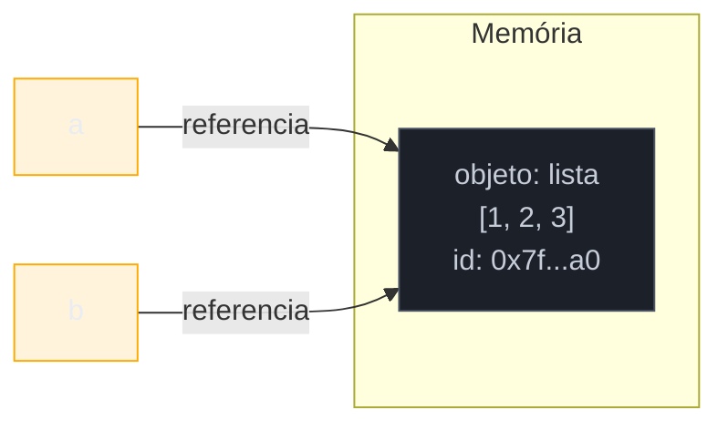

# Tipos e variáveis

> [!abstract] TL;DR
> Em Python, **variáveis não guardam valores — elas apontam para objetos**. Todo objeto tem identidade, tipo e valor; a variável é só um rótulo colado nele. Python é **dinamicamente tipado** (o tipo é checado em tempo de execução, e uma mesma variável pode reapontar para tipos diferentes) mas **fortemente tipado** (`"2" + 2` explode com `TypeError` — nada de coerção implícita silenciosa como em JavaScript). Tipos como `int`, `str` e `tuple` são **imutáveis**; `list`, `dict` e `set` são **mutáveis** — e essa diferença é a origem de uma das armadilhas mais citadas da linguagem: o argumento padrão mutável que "vaza" estado entre chamadas de função.

## O bug que todo mundo escreve uma vez

Considere esta função, aparentemente inofensiva, que acumula itens numa lista:

```python
def adicionar_item(item, carrinho=[]):
    carrinho.append(item)
    return carrinho

print(adicionar_item("maçã"))    # ['maçã']
print(adicionar_item("banana"))  # ['maçã', 'banana']  ??
```

Quem vem de Java, C# ou JavaScript espera que a segunda chamada devolva `['banana']` — afinal, `carrinho=[]` parece dizer "se ninguém passar nada, comece com uma lista vazia, de novo, a cada chamada". Mas o resultado real é `['maçã', 'banana']`: a segunda chamada **herdou** o estado da primeira, mesmo sem `carrinho` ter sido passado explicitamente. Se você não sabe por que isso acontece, ele passa despercebido durante semanas — até aparecer em produção como um caso de dados de um usuário vazando para outro.

A causa raiz mora exatamente no que esta nota existe para explicar: o que uma variável Python *é* (um rótulo, não uma caixa), a diferença entre tipos mutáveis e imutáveis, e quando um valor "por padrão" é avaliado. Ao fim desta nota o bug acima vai parecer óbvio — e você vai reconhecer a família inteira de armadilhas que nasce da mesma raiz.

## O que é

"Tipos e variáveis" em Python cobre quatro ideias que se encaixam:

1. **Dynamic typing** — o interpretador não checa tipos em tempo de compilação; ele checa no momento em que uma operação é executada.
2. **Strong typing** — apesar de dinâmico, Python não converte tipos incompatíveis silenciosamente. Um objeto tem um tipo bem definido e as regras são aplicadas com rigor.
3. **O modelo de referência** — uma variável não é uma caixa que guarda um valor; é um nome vinculado (bound) a um objeto que vive em algum lugar da memória.
4. **Mutabilidade** — se o *objeto* referenciado pode ser alterado no lugar (in-place) depois de criado, ou se qualquer "alteração" na verdade cria um objeto novo.

Essas quatro ideias formam o modelo mental correto para ler qualquer código Python daqui pra frente. Sem elas, muita coisa que parece "mágica" (ou "bug do Python") na verdade é comportamento consistente e documentado.

## Por que importa

Este é, segundo desenvolvedores que fazem a transição de linguagens estaticamente tipadas ou fracamente tipadas, um dos temas onde mais se erra em Python — e onde os erros são mais silenciosos. Um dev vindo de Java assume que "toda variável tem um tipo fixo"; um dev vindo de JavaScript assume que "operadores fazem coerção automática quando os tipos não batem". As duas suposições estão erradas em Python, e ambas geram bugs sutis: o primeiro engasga com `x = 5; x = "cinco"` (perfeitamente válido); o segundo é surpreendido pelo `TypeError` de `"2" + 2`.

Entender o modelo de referência (variável = rótulo) também é pré-requisito direto para o Galho 3 (OO e Data Model) e para entender por que `list.append()` muda a lista "por baixo" mesmo sem `return`, por que `def f(x, y=[])` é perigoso, e por que `a = b` **não** copia uma lista. Ignorar isso custa horas de debugging em qualquer projeto de porte médio.

## Como funciona

### O que muda vindo de Java, C# ou C

Antes de entrar em cada regra, vale nomear a mudança de eixo de uma vez: em linguagens como Java, C# e C, uma variável é uma **posição de memória com tipo fixo, tamanho conhecido em tempo de compilação**. `int x` reserva 4 bytes rotulados `x`; atribuir um valor grava bytes ali dentro. Em Python não existe essa reserva — `x = 5` não aloca "uma caixinha chamada x"; ela cria (ou reaproveita) um objeto `int` em algum lugar do heap e faz `x` apontar para ele. Não há tipo fixo porque não há caixa: o "tipo de x" muda de sentido — ele não existe enquanto propriedade da variável, só como propriedade do objeto atual apontado por ela. Essa diferença de eixo é a raiz de quase toda confusão coberta nesta nota, e por isso ela abre cada uma das seções seguintes.

### Dynamic typing: o tipo mora no objeto, não na variável

Em Python, uma variável não declara tipo — ela simplesmente é vinculada (bound) a um objeto no momento da atribuição:

```python
x = 5          # x aponta pra um int
print(type(x)) # <class 'int'>

x = "cinco"    # x agora aponta pra um str — nenhum erro
print(type(x)) # <class 'str'>

x = [1, 2, 3]  # x agora aponta pra uma list
print(type(x)) # <class 'list'>
```

Nada disso é permitido, por exemplo, em Java (`int x = 5; x = "cinco";` não compila) ou em C (idem). A explicação é simples uma vez que você troca a pergunta: em Python, **a pergunta certa não é "qual é o tipo da variável `x`?" — é "qual é o tipo do objeto para o qual `x` aponta agora?"**. `type()` sempre responde sobre o objeto, nunca sobre o nome.

Isso é o que a documentação oficial chama de checagem em tempo de execução: o interpretador não faz uma passada de análise de tipos antes de rodar o programa (como um compilador estaticamente tipado faria); ele descobre o tipo de cada objeto conforme o código executa.

### Strong typing: dinâmico não é sinônimo de frouxo

Aqui mora a confusão mais comum: **dynamically typed** e **weakly typed** ("fracamente tipado") são eixos diferentes, e Python é dinâmico **e forte** ao mesmo tempo. "Forte" (strong) significa que o interpretador não converte tipos incompatíveis silenciosamente — ele levanta uma exceção assim que uma operação não faz sentido para os tipos envolvidos.

```python
>>> "2" + 2
Traceback (most recent call last):
  File "<stdin>", line 1, in <module>
TypeError: can only concatenate str (not "int") to str
```

Compare com JavaScript, que é dinamicamente tipado e **fracamente** tipado — ele converte silenciosamente e some com o erro:

```javascript
"2" + 2   // "22" — coerção implícita, sem aviso
"2" - 2   // 0    — aqui já converte pro outro lado!
```

Em Python, se você quer somar um número a uma representação textual dele, a conversão precisa ser **explícita**:

```python
>>> "2" + str(2)
'22'
>>> int("2") + 2
4
```

> [!question]- "Mas Python converte `int` pra `float` automaticamente em `1 + 2.5`. Isso não é fraqueza de tipos?"
> Não — é promoção numérica dentro de uma **hierarquia compatível** (`int` → `float` → `complex`), uma decisão de design deliberada e documentada, igual ao que Java faz entre `int` e `double`. A diferença de "fracamente tipado" é converter entre famílias **incompatíveis** (texto e número) sem avisar. `1 + 2.5` é seguro e sem perda de intenção; `"2" + 2` seria ambíguo (concatenar? somar?) — e Python se recusa a adivinhar.

A regra prática: se a operação entre dois tipos tem um significado único e não-ambíguo, Python permite (com promoção, quando aplicável). Se poderia significar duas coisas diferentes, Python levanta `TypeError` e força você a decidir.

### Variáveis são rótulos, não caixas

Esta é a mudança de modelo mental mais importante da nota, e a fonte mais citada para ela é o capítulo 2 de *Python Fluente* (Luciano Ramalho), intitulado "Variáveis Não São Caixas" ("Variables Are Not Boxes"). A metáfora da "caixa" — a ideia de que `x = 10` cria uma caixinha chamada `x` com o número 10 dentro — vem de linguagens como Pascal, C ou Java, onde uma variável é literalmente um espaço de memória reservado para aquele tipo. Em Python, isso está errado.

O modelo correto: um **objeto** é criado na memória (com sua identidade, tipo e valor); uma **variável** é um nome que é vinculado a esse objeto — como uma etiqueta colada nele, não um recipiente que o contém. A instrução de atribuição em Python nunca copia dados para dentro de uma variável; ela sempre vincula um nome a um objeto que já existe (ou acabou de ser criado do lado direito do `=`).



```python
a = [1, 2, 3]
b = a               # b aponta pro MESMO objeto que a — não uma cópia
b.append(4)
print(a)             # [1, 2, 3, 4]  — a "viu" a mudança, porque é o mesmo objeto
print(a is b)         # True: mesmíssimo objeto, dois rótulos
```

Isso não é um bug de `b` "roubar" o valor de `a`; é a consequência direta e correta do modelo. `a` e `b` são dois rótulos apontando para a mesma lista. Alterar a lista por qualquer um dos rótulos é visível pelo outro, porque só existe **um** objeto.

A documentação oficial de referência da linguagem formaliza isso na seção *Data model*: todo objeto tem uma **identidade** (que nunca muda depois de criado — pense nela como o endereço de memória), um **tipo** (que também não muda) e um **valor** (que pode ou não mudar, dependendo da mutabilidade do tipo). `id(obj)` expõe a identidade; `is` compara identidades.

### Mutabilidade vs imutabilidade

A pergunta que decide o comportamento acima é: **o objeto em si pode ser alterado no lugar depois de criado?**

| Categoria | Tipos | Comportamento |
|---|---|---|
| **Imutáveis** | `int`, `float`, `bool`, `str`, `tuple`, `frozenset`, `bytes`, `complex` | Qualquer "alteração" cria um objeto novo; o original nunca muda |
| **Mutáveis** | `list`, `dict`, `set`, `bytearray`, instâncias de classes comuns | O objeto pode ser modificado in-place; o `id()` continua o mesmo |

Com tipos imutáveis, `+=` e reatribuição **parecem** mutação mas não são:

```python
s = "abc"
print(id(s))      # ex: 140234...
s += "d"           # cria um NOVO objeto str "abcd"
print(id(s))      # id diferente — "abc" original continua intacto em algum lugar
print(s)           # "abcd"
```

Com tipos mutáveis, o mesmo `+=` se comporta diferente — ele muda o objeto no lugar quando o tipo suporta:

```python
lista = [1, 2]
print(id(lista))    # ex: 140567...
lista += [3]          # equivalente a lista.extend([3]) para list — MESMO objeto
print(id(lista))    # id IGUAL — o objeto original foi mutado
print(lista)          # [1, 2, 3]
```

> [!warning] A armadilha do argumento padrão mutável
> Volte ao bug do início da nota. A causa é simples uma vez que você sabe onde procurar: **o valor padrão de um parâmetro é avaliado UMA VEZ, no momento em que a função é definida — não a cada chamada.** Quando o interpretador lê `def adicionar_item(item, carrinho=[]):`, ele cria o objeto lista vazia **imediatamente** e o anexa à assinatura da função como seu valor padrão. Esse mesmo objeto lista é reutilizado em **toda** chamada onde `carrinho` não é passado explicitamente — porque não existe recriação, só reuso do objeto padrão já existente.
>
> Se o tipo padrão fosse imutável (`str`, `int`, `tuple`), isso seria inofensivo: você não consegue mutar um `int` no lugar, então cada chamada que "modificasse" o padrão na verdade criaria (e descartaria) um objeto novo, sem afetar chamadas futuras. O problema é exclusivo de padrões **mutáveis** (`list`, `dict`, `set`), porque `.append()`, `[...] = ...` e afins alteram o objeto compartilhado diretamente.
>
> **O fix canônico**, endossado por Real Python e pela comunidade, é usar `None` como sentinela e criar o objeto mutável dentro do corpo da função, a cada chamada:
>
> ```python
> def adicionar_item(item, carrinho=None):
>     if carrinho is None:
>         carrinho = []      # objeto NOVO a cada chamada sem argumento
>     carrinho.append(item)
>     return carrinho
> ```
>
> Essa é, segundo a documentação da comunidade Python (Hitchhiker's Guide to Python, Python Morsels e outros), a gotcha mais citada da linguagem para quem está aprendendo — e o motivo pelo qual o próprio Guido van Rossum já explicou publicamente a decisão de design: avaliar o padrão uma vez, no momento da definição, é mais eficiente do que reavaliar a cada chamada. É uma escolha de performance deliberada, não um defeito — mas que exige que você saiba da regra.

### `None` e seu papel

`None` é o único valor do tipo `NoneType`, e representa "ausência de valor" — não zero, não string vazia, não falso. É o retorno implícito de qualquer função sem `return` explícito, e o sentinela idiomático para "nenhum argumento foi passado" (como acabamos de ver na correção do bug acima).

```python
def sem_retorno():
    pass

resultado = sem_retorno()
print(resultado)         # None
print(resultado is None)  # True — SEMPRE compare None com "is", nunca "=="
```

`None` é um **singleton**: existe exatamente um objeto `None` durante toda a execução do interpretador. Por isso a convenção é comparar identidade (`is None` / `is not None`), não igualdade (`== None`). Comparar com `is` também é mais rápido (não invoca `__eq__`) e evita bugs sutis caso alguma classe personalizada sobrescreva `__eq__` de forma inesperada.

### Os tipos primitivos

**`int` — precisão arbitrária.** Diferente de Java (`int` de 32 bits, estoura em overflow) ou C, o `int` do Python 3 não tem limite de tamanho fixo — ele cresce dinamicamente conforme necessário, limitado apenas pela memória disponível. Não existe overflow silencioso:

```python
>>> 2 ** 100
1267650600228229401496703205376
>>> 2 ** 1000  # continua funcionando, sem overflow
```

Internamente, o CPython representa inteiros grandes como um array de "dígitos" em base 2³⁰ (ou 2¹⁵ em builds de 32 bits) — uma implementação de *bignum* — mas isso é um detalhe de implementação que fica melhor explorado no galho de CPython internals.

**`float` — ponto flutuante de precisão dupla (double, IEEE 754).** Vem com as armadilhas usuais de ponto flutuante, comuns a praticamente toda linguagem:

```python
>>> 0.1 + 0.2
0.30000000000000004
```

Isso não é peculiaridade do Python — é como todo hardware representa frações binárias. Para dinheiro e precisão exata, o módulo `decimal` da biblioteca padrão é o caminho correto (fora do escopo desta nota introdutória).

**`bool` — subtipo de `int`.** Talvez a surpresa mais frequente para quem vem de outras linguagens: `bool` **não é um tipo independente** em Python — é uma subclasse de `int`, com apenas dois valores possíveis, `True` e `False`, que se comportam como `1` e `0` em contexto numérico:

```python
>>> isinstance(True, int)
True
>>> True + True
2
>>> True == 1
True
>>> True is 1
False   # objetos DIFERENTES — True é bool, 1 é int; == compara valor, is compara identidade
```

Isso existe por razões históricas: `bool` foi adicionado em Python 2.3 como um refinamento de um `int` que já existia (0 e 1 já serviam como "falso" e "verdadeiro"), e a compatibilidade retroativa manteve `bool` como subtipo em vez de tipo isolado.

**`str` — texto Unicode.** Toda string Python 3 é uma sequência imutável de pontos de código Unicode — não bytes. Aprofundamento fica para a nota 07 (Strings e formatação) deste galho.

**`bytes` — sequência imutável de bytes crus.** Usado para dados binários (arquivos, sockets, protocolos de rede) — distinto de `str` justamente para evitar a confusão texto/binário que assombrava o Python 2. A conversão entre os dois exige um `encoding` explícito (`str.encode()` / `bytes.decode()`), reforçando o mesmo espírito de "strong typing": Python não adivinha se seus bytes são UTF-8, Latin-1 ou outra coisa.

### A pegadinha da tupla "imutável" com conteúdo mutável

Imutabilidade em Python é sobre o **objeto container**, não necessariamente sobre tudo que ele referencia transitivamente. Uma `tuple` é imutável — você não pode adicionar, remover ou reatribuir um de seus elementos — mas se um dos elementos que ela contém for, ele mesmo, mutável, esse elemento interno continua mutável:

```python
t = (1, 2, [3, 4])
t[2].append(5)
print(t)          # (1, 2, [3, 4, 5])  — a tupla "mudou"?

t[0] = 99          # TypeError: 'tuple' object does not support item assignment
```

A tupla, como objeto, nunca trocou de identidade nem de quantidade/ordem de referências — ela continua apontando para os mesmos três objetos que apontava antes (`1`, `2`, e aquela lista). O que mudou foi o **conteúdo da lista**, que é mutável por si só. A tupla é imutável **na estrutura** (quais objetos ela referencia, em qual ordem), não necessariamente no **estado transitivo** de cada objeto referenciado. Isso é o que torna listas dentro de tuplas (ou de `frozenset`, ou usadas como chave de `dict`) uma fonte de bugs sutis — e o motivo de tipos mutáveis como `list` e `dict` não serem "hasheáveis" (não podem ser chave de dicionário nem elemento de `set`), enquanto `tuple` só é hasheável se **todos** os seus elementos também forem.

```python
>>> hash((1, 2, 3))
529344067295497451     # ok — todos os elementos são imutáveis/hasheáveis
>>> hash((1, 2, [3, 4]))
Traceback (most recent call last):
TypeError: unhashable type: 'list'
```

### Strings: imutabilidade e o custo de concatenar em loop

`str` é imutável — todo método que "parece" alterar uma string (`.upper()`, `.replace()`, `.strip()`) na verdade **retorna um objeto novo**, deixando o original intocado:

```python
s = "python"
s2 = s.upper()
print(s)    # "python"  — original não mudou
print(s2)   # "PYTHON"  — objeto novo
```

Isso tem uma implicação prática de performance que aparece com frequência em entrevistas técnicas: concatenar strings repetidamente com `+=` dentro de um loop é **O(n²)** no pior caso, porque cada `+=` precisa alocar e copiar um objeto string inteiro novo:

```python
# Ineficiente: cada += cria uma string nova, copiando tudo de novo
resultado = ""
for palavra in lista_de_palavras:
    resultado += palavra + " "   # O(n²) no total

# Idiomático: acumula referências numa lista mutável, junta uma vez só
resultado = " ".join(lista_de_palavras)  # O(n)
```

Esse é outro caso onde entender mutabilidade não é só "curiosidade teórica" — é o que explica por que `"".join(...)` é o padrão recomendado pela comunidade em vez de concatenação em loop, e por que a resposta certa numa pergunta de entrevista sobre performance de strings passa direto por este ponto.

### `is` vs `==`: identidade vs igualdade

Essa é provavelmente a confusão mais persistente entre `is` e `==`, e agora que você já entende o modelo de rótulos, a distinção fica direta:

- **`==`** chama o método `__eq__` do objeto e pergunta "esses dois objetos representam o **mesmo valor**?"
- **`is`** compara `id(a) == id(b)` diretamente e pergunta "esses dois nomes apontam para o **mesmo objeto** na memória?"

```python
a = [1, 2, 3]
b = [1, 2, 3]      # lista DIFERENTE, mesmo conteúdo
print(a == b)        # True  — mesmo valor
print(a is b)        # False — objetos diferentes na memória

c = a
print(a is c)        # True  — mesmo objeto, dois rótulos
```

> [!question]- "Já vi `x is 5` funcionar em testes. Isso é seguro?"
> Não confie nisso. O CPython mantém um **cache de small ints**: na inicialização do interpretador, ele pré-cria e reutiliza objetos `int` para o intervalo de **-5 a 256**, porque são usados com tanta frequência que vale a pena economizar criação/coleta de objeto repetida. Isso faz `a = 100; b = 100; a is b` retornar `True` — mas é um **detalhe de implementação do CPython**, não uma garantia da linguagem. Fora do intervalo cacheado, o comportamento muda:
> ```python
> >>> a = 256; b = 256
> >>> a is b
> True          # dentro do cache
> >>> a = 257; b = 257
> >>> a is b
> False         # fora do cache — dois objetos distintos (na maioria dos casos)
> ```
> CPython também faz **interning** de algumas strings literais curtas (identificadores válidos, por exemplo) pelo mesmo motivo de performance. **A regra prática nunca muda: use `==` para comparar valores, sempre.** Reserve `is` para comparar com singletons conhecidos (`None`, `True`, `False`) ou quando você deliberadamente precisa saber se dois nomes são o mesmíssimo objeto (útil, por exemplo, ao checar se um argumento default sentinela foi ou não substituído).

## Na prática

Um exemplo único que amarra tipagem forte, mutabilidade e o modelo de referência — um carrinho de compras simplificado que mostra o jeito certo (e o jeito errado) de lidar com estado mutável entre chamadas:

```python
from dataclasses import dataclass, field


@dataclass
class Carrinho:
    itens: list[str] = field(default_factory=list)  # cada instância ganha SUA lista
    total: float = 0.0


def adicionar_ao_carrinho(carrinho: Carrinho, nome_item: str, preco: float) -> Carrinho:
    # Tipagem forte em ação: se preco vier como string por engano,
    # a soma explode aqui, alto e imediatamente — não silenciosamente adiante.
    if not isinstance(preco, (int, float)):
        raise TypeError(f"preco deve ser numérico, recebido {type(preco).__name__}")

    carrinho.itens.append(nome_item)   # mutação in-place — mesmo objeto lista
    carrinho.total += preco             # float é imutável: += cria objeto novo em 'total'
    return carrinho


c1 = Carrinho()
c2 = Carrinho()  # graças a default_factory, c2.itens NÃO é o mesmo objeto de c1.itens

adicionar_ao_carrinho(c1, "teclado", 250.0)
adicionar_ao_carrinho(c2, "mouse", 80.0)

print(c1.itens)   # ['teclado']  — não vazou pro c2
print(c2.itens)   # ['mouse']
print(c1 is c2)    # False — instâncias diferentes
print(c1.itens is c2.itens)  # False — cada uma com sua própria lista
```

Repare em `field(default_factory=list)`: é a versão "certa" do padrão mutável para `@dataclass`, resolvendo o mesmo problema do `carrinho=None` visto antes, mas na sintaxe específica de dataclasses — o `dataclass` até **proíbe** você de escrever `itens: list[str] = []` diretamente, levantando `ValueError` em tempo de definição, justamente para evitar que alguém reintroduza a armadilha sem perceber.

## Armadilhas

### (1) Confundir dynamic typing com weak typing

Já coberto em detalhe acima, mas vale reforçar como armadilha isolada: assumir que, por Python não exigir declaração de tipo, ele também vai converter tipos incompatíveis silenciosamente (como JS faz). Ele não faz. `TypeError` é o comportamento correto e esperado — não um bug.

### (2) Copiar uma lista com `=`

```python
original = [1, 2, 3]
copia = original          # NÃO é cópia — é outro rótulo pro mesmo objeto
copia.append(4)
print(original)            # [1, 2, 3, 4]  — surpresa!
```

**Fix:** use `list(original)`, `original.copy()`, ou fatiamento `original[:]` para criar uma cópia rasa de verdade. Para estruturas aninhadas, `copy.deepcopy()`.

### (3) Argumento padrão mutável (já visto, mas reforçando o padrão geral)

Não é só `list=[]`. Qualquer tipo mutável como padrão tem o mesmo problema: `dict={}`, `set=set()`, ou instância de classe própria mutável passada como padrão. A regra é sempre a mesma: **default mutável → use `None` como sentinela e crie o objeto dentro da função**.

### (4) Usar `is` para comparar valores (não identidade)

```python
def eh_vazio(lista):
    return lista is []   # SEMPRE False! [] cria um objeto NOVO a cada chamada
```

**Fix:** `return lista == []` ou, mais idiomático em Python, `return not lista` (listas vazias são "falsy").

## Em entrevista

Pergunta clássica: **"Python é fortemente ou fracamente tipado?"** — e a resposta errada mais comum é "fracamente, porque não precisa declarar tipo". Isso confunde dois eixos ortogonais.

### Frase pronta (inglês)

> Python is dynamically typed — types are checked at runtime, and a variable can be rebound to a value of a different type. But it's strongly typed — it won't silently coerce incompatible types, like JavaScript does with `"2" + 2`. Instead it raises a `TypeError`. I also think about variables as labels bound to objects rather than boxes holding values — that mental model, from Fluent Python, explains why `b = a` for a mutable object like a list doesn't copy it, and it's the root cause of the classic mutable-default-argument bug, since the default is evaluated once at function-definition time and shared across calls if it's mutable.

### Vocabulário

| Termo PT | Termo EN |
|---|---|
| tipagem dinâmica | dynamic typing |
| tipagem forte | strong typing |
| coerção implícita | implicit coercion |
| rótulo / vínculo | label / binding |
| identidade do objeto | object identity |
| mutável / imutável | mutable / immutable |
| argumento padrão mutável | mutable default argument |
| cache de small ints | small integer caching |
| interning de strings | string interning |
| cópia rasa / profunda | shallow copy / deep copy |
| sentinela | sentinel value |

## How to explain in English

| PT | EN |
|---|---|
| Uma variável não guarda um valor, ela referencia um objeto | A variable doesn't hold a value, it references an object |
| Python é dinamicamente tipado mas fortemente tipado | Python is dynamically typed but strongly typed |
| O valor padrão de um argumento é avaliado uma vez, na definição da função | A default argument value is evaluated once, at function-definition time |
| `is` compara identidade; `==` compara igualdade de valor | `is` compares identity; `==` compares value equality |
| Listas, dicionários e conjuntos são mutáveis; inteiros, strings e tuplas são imutáveis | Lists, dictionaries, and sets are mutable; integers, strings, and tuples are immutable |
| `bool` é uma subclasse de `int` | `bool` is a subclass of `int` |
| O cache de small ints é um detalhe de implementação do CPython, não uma garantia da linguagem | The small integer cache is a CPython implementation detail, not a language guarantee |

## O que vem a seguir

Com o modelo de rótulos e a diferença mutável/imutável entrando no seu radar, o próximo passo natural é a [[03 - Operadores e expressões|nota 03]], que cobre operadores aritméticos, de comparação, lógicos e bitwise — incluindo como cada um deles interage com os tipos que acabamos de ver (por exemplo: por que `==` encadeado como `1 < 2 < 3` funciona diferente do que se espera vindo de outras linguagens, e o que o walrus operator `:=` faz com binding de variáveis).

## Fontes

- Real Python — "Immutable vs Mutable Types in Python": https://realpython.com/python-mutable-vs-immutable-types/ (acessado 2026-07-09)
- Real Python — "Variables in Python": https://realpython.com/python-variables/ (acessado 2026-07-09)
- Real Python — "Small Integer Caching" (vídeo): https://realpython.com/lessons/small-integer-caching/ (acessado 2026-07-09)
- Luciano Ramalho, *Fluent Python*, 2ª edição (O'Reilly, 2022) — Capítulo 2, "Variables Are Not Boxes" / "Variáveis Não São Caixas": https://www.oreilly.com/library/view/fluent-python-2nd/9781492056348/ (acessado 2026-07-09)
- Python documentation — "3. Data model": https://docs.python.org/3/reference/datamodel.html (acessado 2026-07-09)
- The Hitchhiker's Guide to Python — "Common Gotchas" (mutable default arguments): https://docs.python-guide.org/writing/gotchas/ (acessado 2026-07-09)
- Python Morsels — "Mutable default arguments": https://www.pythonmorsels.com/mutable-default-arguments/ (acessado 2026-07-09)
- tenthousandmeters.com — "Python behind the scenes #8: how Python integers work" (bignum, precisão arbitrária): https://tenthousandmeters.com/blog/python-behind-the-scenes-8-how-python-integers-work/ (acessado 2026-07-09)

## Veja também

- [[01 - O que é Python e como ele executa|O que é Python e como ele executa]] — a nota anterior deste galho
- [[03 - Operadores e expressões|Operadores e expressões]] — próxima nota
- [[03-Dominios/Tecnologia/Python/Core/index|Core]] — MOC do galho
- [[03-Dominios/Tecnologia/Python/OO e Data Model/index|OO e Data Model]] — Galho 3, aprofunda `__eq__`, `__hash__` e identidade em classes próprias
- [[03-Dominios/Tecnologia/Python/index|Trilha Python]] (MOC central)
