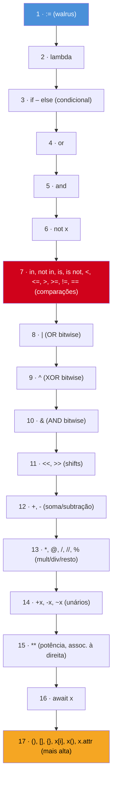

# Operadores e expressões

> [!abstract] TL;DR
> Python tem os operadores aritméticos, de comparação, lógicos e bitwise que você já conhece de outras linguagens — mas com três diferenças que mordem quem migra sem prestar atenção: `/` **sempre** devolve `float` (use `//` para divisão inteira), comparações **encadeiam** (`1 < x < 10` é uma expressão só, não um erro de digitação), e `and`/`or` **não devolvem `bool`** — devolvem um dos operandos. Some a isso o operador de atribuição aumentada `+=`, que em listas *muta* em vez de recriar, e o walrus `:=` (PEP 572, Python 3.8+), que permite atribuir dentro de uma expressão. Cada um desses detalhes já causou um bug real em produção — e cada um vira pegadinha clássica de entrevista.

## O bug que abre esta nota

Imagine uma função de desconto progressivo, escrita por alguém migrando de Java:

```python
def calcular_desconto(valor: float, cupom_valido: bool) -> float:
    desconto = 0.10 if cupom_valido else 0.05
    valor_com_desconto = valor - valor * desconto
    return valor_com_desconto // 1  # "só quero truncar pros centavos"
```

O autor queria arredondar pra baixo preservando duas casas decimais — tipo `Math.floor(x * 100) / 100` em Java. Só que `//` em Python não é "arredondar pra baixo mantendo escala": é **divisão inteira** — divide e depois trunca o quociente. `valor_com_desconto // 1` não faz nada de especial, só descarta a parte decimal inteira, virando um float "arredondado" grosseiro (`89.973 // 1` vira `89.0`, não `89.97`). O bug passou despercebido em testes porque os valores de teste eram números redondos.

O problema não é falta de cuidado — é que `//` em Python faz algo genuinamente diferente do que "divisão com truncamento" costuma significar em C-like languages, e o símbolo (`//`) não existe na maioria delas. Esta nota resolve esse tipo de ruído: o que cada operador *realmente* faz em Python, onde ele diverge de Java/JS, e onde a sintaxe nova (walrus) resolve problema real em vez de só economizar linha.

## O que é

**Operadores** são símbolos que combinam um ou mais valores (**operandos**) numa **expressão** — um pedaço de código que produz um valor. Python organiza os operadores em famílias: aritméticos, de comparação, lógicos, bitwise, de atribuição (incluindo a atribuição aumentada) e o operador de atribuição de expressão (`:=`, o walrus). A tabela oficial de precedência do Python define em que ordem operadores concorrentes numa mesma expressão são avaliados — e é a fonte de boa parte dos bugs sutis desta nota.

## Por que importa

Toda linha de Python não trivial é uma expressão feita de operadores compostos. Errar a precedência ou o comportamento de um operador não gera erro de sintaxe — gera **resultado errado silencioso**, que só aparece em produção com dados reais. É também um dos tópicos mais previsíveis de entrevista técnica em Python: perguntas sobre `and`/`or` retornando operando, sobre `is` vs `==`, sobre o walrus operator, aparecem com frequência porque são detalhes que separam quem só "sabe a sintaxe" de quem entende o modelo de execução por baixo.

## Como funciona

### Operadores aritméticos

| Operador | Nome | Exemplo | Resultado |
|---|---|---|---|
| `+` | Adição | `3 + 2` | `5` |
| `-` | Subtração | `3 - 2` | `1` |
| `*` | Multiplicação | `3 * 2` | `6` |
| `/` | Divisão (verdadeira) | `7 / 2` | `3.5` |
| `//` | Divisão inteira (floor division) | `7 // 2` | `3` |
| `%` | Módulo (resto) | `7 % 2` | `1` |
| `**` | Potenciação | `2 ** 10` | `1024` |

Duas armadilhas concentram quase todo o atrito de quem vem de Java, C# ou JavaScript:

**`/` sempre retorna `float`, mesmo dividindo dois `int` exatos.** Em Java, `7 / 2` entre dois `int` retorna `3` (divisão inteira implícita); em Python, `7 / 2` retorna `3.5` sempre — a divisão "verdadeira" (*true division*) preserva a parte fracionária, ponto. Se você quer o comportamento de divisão inteira de Java, o operador certo é `//`:

```python
>>> 7 / 2
3.5
>>> 7 // 2
3
>>> -7 // 2      # atenção: arredonda para -infinito, não trunca em direção a zero
-4
```

> [!warning] `//` arredonda para baixo (floor), não trunca para zero
> `-7 // 2` dá `-4`, não `-3`. Python define `//` como *floor division* — sempre arredonda na direção de menos infinito. Isso difere de C/Java/JS, onde a divisão inteira trunca em direção a zero (`-7 / 2` em Java dá `-3`). Se seu código depende de truncamento em direção a zero (comum em cálculos financeiros ou de índice), `//` do Python **não** é um substituto direto — use `math.trunc()` ou `int()` explicitamente.

**`**` é potência, não XOR.** Quem vem de C, Java ou JS estranha porque nessas linguagens `^` é XOR bit a bit e não existe operador nativo de potência — usa-se `Math.pow()`. Em Python, `^` é mesmo o XOR bitwise (ver seção bitwise abaixo), e `**` é o operador dedicado de potenciação, com **associatividade à direita**: `2 ** 3 ** 2` é `2 ** (3 ** 2)` = `2 ** 9` = `512`, não `(2 ** 3) ** 2` = `64`. É a única exceção relevante à regra geral de associatividade da esquerda para a direita entre os operadores aritméticos.

```python
>>> 2 ** 3 ** 2      # associativo à direita: 2 ** (3 ** 2)
512
>>> (2 ** 3) ** 2    # se você quisesse isso, precisa dos parênteses
64
```

O operador `@` também existe na família aritmética desde o Python 3.5 (PEP 465) — é multiplicação de matrizes, usado por NumPy e bibliotecas de álgebra linear; fora desse contexto não aparece em código comum.

### Operadores de comparação e o encadeamento

| Operador | Significado |
|---|---|
| `==` | igualdade de valor |
| `!=` | diferença de valor |
| `<`, `<=`, `>`, `>=` | ordem |

O detalhe que realmente separa Python de quase toda linguagem C-like é o **encadeamento de comparações** (*chained comparisons*). Em Java ou JS, `1 < x < 10` não faz o que parece — `1 < x` avalia primeiro para um `bool`, e depois esse `bool` é comparado com `10` (em JS, `true < 10` vira `1 < 10` → `true`; resultado enganoso e quase sempre um bug). Em Python, o mesmo texto é interpretado como uma cadeia lógica de verdade:

```python
>>> x = 5
>>> 1 < x < 10
True
>>> 1 < x < 10  # Python trata isso como: (1 < x) and (x < 10)
```

Segundo a [documentação oficial de expressões](https://docs.python.org/3/reference/expressions.html#comparisons), comparações podem ser encadeadas arbitrariamente: `a OP1 b OP2 c` é semanticamente equivalente a `a OP1 b and b OP2 c`, com a diferença crucial de que **`b` é avaliado uma única vez** — se `b` fosse uma chamada de função com efeito colateral, ela não roda duas vezes. É uma feature deliberada, útil para faixas de valores (`0 <= idade < 120`), não um acidente de parser.

> [!question]- Por que Python permite isso e Java/JS não?
> Porque nessas linguagens `<` retorna um `bool`, e comparar um `bool` com um número é uma operação (tecnicamente) válida — o compilador não recusa, então o encadeamento "funciona" mas com semântica errada, gerando bug silencioso. Python trata `a < b < c` como um caso sintático especial da gramática, não como duas comparações binárias comuns encadeadas por acaso — por isso o comportamento é intencional e correto, em vez de ser um efeito colateral estranho de conversão implícita de tipos.

### Identidade e associação: `is`, `is not`, `in`, `not in`

A tabela de precedência do Python agrupa `<`, `<=`, `>`, `>=`, `!=`, `==` na mesma família sintática que quatro outros operadores que não existem (como palavra reservada) em Java nem em JS: `is`, `is not`, `in`, `not in`. Todos têm a mesma precedência e todos encadeiam — é por isso que `x is not None and 0 <= x < 10` pode ser escrito sem parênteses e ainda assim ser inequívoco.

`in` e `not in` testam **associação** (*membership*): se um valor está contido numa sequência, coleção ou qualquer objeto que implemente `__contains__`.

```python
>>> "a" in ["a", "b", "c"]
True
>>> 5 not in range(10)
False
```

`is` e `is not` testam **identidade de objeto** (mesmo endereço de memória, verificável com `id()`), não igualdade de valor — a distinção que a [[03-Dominios/Tecnologia/Python/Core/02 - Tipos e variáveis|nota 02]] já cobriu em detalhe para `None`, `True`/`False` e o cache de inteiros pequenos. O erro mais comum de quem já leu sobre isso mas não internalizou:

```python
>>> a = [1, 2, 3]
>>> b = [1, 2, 3]
>>> a == b        # mesmo conteúdo → True
True
>>> a is b        # objetos DIFERENTES na memória → False
False
```

`==` compara valor (e pode ser customizado via `__eq__`); `is` compara identidade e nunca pode ser sobrescrito por uma classe. A convenção da comunidade — reforçada pelo próprio PEP 8 — é usar `is`/`is not` exclusivamente contra singletons como `None`, nunca contra valores comuns: `if x is None`, não `if x == None`. O motivo é que `== None` dispara `__eq__` do objeto (que pode ter sido sobrescrito para retornar qualquer coisa), enquanto `is None` é uma comparação de identidade que sempre funciona do mesmo jeito, mais rápida e sem ambiguidade.

### Operadores lógicos: `and`, `or`, `not` — e o segredo do que eles retornam

Aqui mora a pegadinha mais citada em entrevistas de Python. Em Java, `&&` e `||` são estritamente booleanos: sempre avaliam para `true` ou `false`. Em Python, `and` e `or` **não fazem isso** — eles retornam um dos dois operandos, não necessariamente um `bool`.

A regra, segundo a [documentação oficial](https://docs.python.org/3/reference/expressions.html#boolean-operations):

- `x or y`: se `x` é *truthy*, retorna `x` sem nem avaliar `y` (short-circuit). Senão, retorna `y` — seja lá o que `y` for.
- `x and y`: se `x` é *falsy*, retorna `x` sem avaliar `y`. Senão, retorna `y`.
- `not x`: essa sim sempre retorna `bool` puro (`True` ou `False`).

```python
>>> 2 and 3
3
>>> 0 and 3
0
>>> 5 or []
5
>>> [] or "default"
'default'
>>> None and "nunca chega aqui"
None
```

Isso não é uma curiosidade acadêmica — é a base de um idioma real do Python: usar `or` para valor default.

```python
nome_exibicao = apelido or nome_completo or "Anônimo"
```

Se `apelido` for uma string vazia (falsy) ou `None`, a expressão cai pro próximo candidato, sem `if` explícito. É elegante, mas tem uma armadilha: se `0`, `""` ou `[]` forem valores **válidos** de negócio (não "ausência de valor"), o idioma quebra silenciosamente, porque eles também são falsy.

```python
quantidade = quantidade_informada or 10   # BUG se quantidade_informada == 0 for válido!
```

> [!warning] `or` como default só é seguro quando falsy == ausência de valor
> Se `0` for uma quantidade legítima (ex.: "zero itens no carrinho"), `quantidade_informada or 10` substitui silenciosamente o `0` por `10`. O padrão correto nesse caso é explícito: `quantidade_informada if quantidade_informada is not None else 10`, ou a forma mais curta com o operador ternário condicional — nunca `or` quando zero/vazio pode ser um valor de negócio válido.

O **short-circuit evaluation** (avaliação de curto-circuito) também importa por efeito colateral, não só pelo valor de retorno: em `checar_permissao(usuario) and log_acesso(usuario)`, se `checar_permissao` retornar falsy, `log_acesso` **nunca é chamado**. É o mesmo idioma de guard clause visto em outras linguagens, mas em Python ele aparece com frequência dentro de expressões, não só em `if`s — inclusive é comum ver `condicao and funcao()` como um "if de uma linha" sem `else`, embora isso seja considerado menos legível que um `if` explícito pela maioria dos guias de estilo.

### Operadores bitwise

| Operador | Nome | Exemplo |
|---|---|---|
| `&` | AND bit a bit | `0b1100 & 0b1010` → `0b1000` |
| `\|` | OR bit a bit | `0b1100 \| 0b1010` → `0b1110` |
| `^` | XOR bit a bit | `0b1100 ^ 0b1010` → `0b0110` |
| `~` | NOT bit a bit (complemento) | `~5` → `-6` |
| `<<` | Deslocamento à esquerda | `1 << 3` → `8` |
| `>>` | Deslocamento à direita | `8 >> 3` → `1` |

Sintaticamente idênticos aos de C/Java/JS, com uma ressalva de precedência que costuma surpreender: em Python, os operadores bitwise `&`, `^`, `|` têm precedência **mais baixa** que as comparações (`<`, `==` etc.), enquanto em C e Java a relação de precedência entre bitwise e comparação é diferente o suficiente para exigir cautela. Na prática, isso significa que `x & 1 == 1` em Python é avaliado como `x & (1 == 1)`, não `(x & 1) == 1` — quase certamente não o que você queria. **Parênteses explícitos em expressões que misturam bitwise com comparação não são opcionais, são obrigatórios por convenção.**

```python
>>> x = 5
>>> x & 1 == 1       # armadilha: vira x & (1 == 1) = x & True = x & 1
1
>>> (x & 1) == 1     # o que você provavelmente queria
True
```

`~x` também merece nota: não é "inverter os bits e pronto" como intuição ingênua sugeriria — é definido como `-(x + 1)`, por causa da representação de complemento de dois que Python simula para inteiros de precisão arbitrária. `~5` não é um número de bits invertidos visível; é `-6`.

### Atribuição aumentada (`+=`, `-=`, `*=`...) e a armadilha da lista mutável

Python tem toda a família de operadores de atribuição aumentada — `+=`, `-=`, `*=`, `/=`, `//=`, `%=`, `**=`, `&=`, `|=`, `^=`, `<<=`, `>>=` — que combinam operação e atribuição numa sintaxe compacta, igual a Java/JS/C. A diferença sutil e importante: para tipos **mutáveis**, `+=` não necessariamente cria um objeto novo — ele pode **mutar o objeto existente in-place**, e isso é visível para qualquer outra variável que aponte para o mesmo objeto.

Para `int`, `str`, `float`, `tuple` (todos imutáveis), `x += 1` sempre cria um novo objeto e reatribui `x` a ele — comportamento indistinguível de `x = x + 1`. Mas para `list` (mutável), Python invoca o método especial `__iadd__` (in-place add) quando ele existe, que é implementado como `list.extend()` — mutação da lista original, não criação de uma nova.

```python
>>> a = [1, 2, 3]
>>> b = a           # b e a apontam para a MESMA lista
>>> a += [4]        # muta a lista em-lugar (chama a.extend([4]))
>>> a
[1, 2, 3, 4]
>>> b                # b também mudou! era a mesma referência
[1, 2, 3, 4]
```

Compare com o comportamento de `a = a + [4]`, que **cria uma lista nova** e só reatribui `a` — `b` não é afetado:

```python
>>> a = [1, 2, 3]
>>> b = a
>>> a = a + [4]      # cria lista NOVA, reatribui só 'a'
>>> a
[1, 2, 3, 4]
>>> b                # b permanece intacto
[1, 2, 3]
```

> [!warning] `a += [x]` e `a = a + [x]` só parecem equivalentes
> Para listas, esses dois idiomas produzem resultados observáveis diferentes sempre que outra variável compartilha a referência. O bug clássico: uma função recebe uma lista como parâmetro e faz `lista += [novo_item]` pensando que está "só somando" — mas se o chamador não esperava mutação, o objeto original dele também mudou, porque parâmetros em Python são passados por referência de objeto (nem por valor puro, nem por referência-a-variável como em C++). Esse mesmo mecanismo é a razão clássica por trás do bug "argumento default mutável" (`def f(lista=[])`) — tópico da [[03-Dominios/Tecnologia/Python/Core/06 - Funções — definição, argumentos e escopo básico|nota 06]].

### Precedência de operadores

Quando uma expressão mistura vários operadores sem parênteses, o Python segue uma tabela de precedência fixa, definida na [documentação oficial](https://docs.python.org/3/reference/expressions.html#operator-precedence) (Python 3.14). Da **menor** para a **maior** precedência:



Três pontos merecem grifo:

1. **Bitwise fica abaixo de comparação** (nível 8-10 vs nível 7) — a origem da armadilha `x & 1 == 1` já mostrada.
2. **`**` associa à direita**, único caso relevante entre os aritméticos.
3. **`:=` (walrus) tem a precedência mais baixa de todas** — por isso ele quase sempre precisa de parênteses fora de contextos sintáticos específicos (`if`, `while`, dentro de comprehensions), assunto da próxima seção.

Na dúvida entre confiar na tabela de cor e usar parênteses explícitos: **use parênteses**. Ninguém em code review vai reclamar de parênteses redundantes que deixam a intenção óbvia; todo mundo vai reclamar (ou pior, não vai notar) uma expressão ambígua que depende de decorar a tabela de precedência.

### O walrus operator (`:=`) — PEP 572, Python 3.8+

Até o Python 3.7, atribuição em Python era **só statement** — nunca podia aparecer dentro de uma expressão. Isso forçava padrões repetitivos: calcular um valor, guardar numa variável, testar a variável — três linhas para algo que em outras linguagens (C, com `while ((n = read()) != EOF)`) cabia numa condição só.

O **PEP 572** (aceito para Python 3.8, um dos processos de PEP mais controversos da história da linguagem — motivou inclusive a saída de Guido van Rossum do papel de BDFL, *Benevolent Dictator For Life*) introduziu o operador `:=`, formalmente chamado **assignment expression** (expressão de atribuição), apelidado de "walrus operator" porque `:=` lembra os dois olhos e as presas de uma morsa de lado.

A ideia central, segundo o próprio PEP: nomear o resultado de uma expressão é importante para reuso e clareza — e antes do walrus isso só era possível como statement separado, forçando repetição de subexpressões caras ou indentação extra.

**Usos idiomáticos** — onde o walrus resolve um problema real:

```python
# 1. Ler chunk de arquivo em loop, sem sentinela nem duplicação
with open("dados.bin", "rb") as f:
    while chunk := f.read(8192):
        processar(chunk)

# 2. Reaproveitar o resultado de uma regex sem chamar duas vezes
import re
if match := re.search(r"\d+", texto):
    print(f"encontrado: {match.group()}")

# 3. Evitar chamar uma função cara duas vezes dentro de uma comprehension
resultados = [y for x in dados if (y := calculo_caro(x)) is not None]
```

No caso 3, sem o walrus, a alternativa seria chamar `calculo_caro(x)` duas vezes (uma no filtro, outra no valor) — desperdiçando processamento — ou quebrar a comprehension inteira num loop `for` tradicional. O walrus preserva a forma compacta da comprehension sem pagar o custo da chamada dupla.

**Regras de sintaxe que doem na prática:**

- `:=` **não pode aparecer sozinho** como statement de topo: `y := f(x)` é erro de sintaxe; precisa de parênteses: `(y := f(x))`.
- Não pode substituir `=` no lado direito de uma atribuição comum sem parênteses: `y0 = y1 := f(x)` é inválido.
- Dentro de argumento nomeado de função, também exige parênteses: `foo(x=(y := f(x)))`.
- **Sua precedência é a mais baixa de toda a tabela** — por isso ele quase sempre aparece "protegido" dentro de um contexto sintático que já delimita a expressão (parênteses de `if`, de `while`, colchetes de comprehension).

**Onde é abuso, não idioma:**

```python
# Difícil de ler — walrus dentro de comprehension com múltiplas condições aninhadas
dados_filtrados = [
    resultado
    for x in valores
    if (temp := transformar(x)) is not None
    if (resultado := validar(temp)) and resultado > limite
]
```

Comprehensions com dois ou mais walrus encadeados, condições aninhadas e efeitos colaterais múltiplos deixam de ser "uma linha compacta e clara" e viram um quebra-cabeça. O próprio PEP 572 recomenda: *"Try to limit the use of the walrus operator to clean cases that reduce complexity and improve readability."* Quando o ganho de compactação exige que o leitor pare e reconstrua mentalmente a ordem de avaliação, a resposta certa é voltar pro `for` explícito com passos nomeados.

**Um quarto uso idiomático**, comum em scripts de processamento e no próprio código-fonte da biblioteca padrão (o PEP 572 cita exemplos reais tirados de `site.py`, `copy.py` e `datetime.py`): achatar uma cadeia de `if`/`elif` que recalcula a mesma condição em vários ramos.

```python
# Antes: cada 'elif' recalcula ou duplica a variável de contexto
def classificar(pedido):
    total = calcular_total(pedido)
    if total > 1000:
        return "grande"
    total_com_taxa = calcular_total(pedido) + taxa(pedido)  # recalculado!
    if total_com_taxa > 500:
        return "médio-alto"
    return "padrão"

# Depois: walrus nomeia o valor uma vez, dentro da própria condição
def classificar(pedido):
    if (total := calcular_total(pedido)) > 1000:
        return "grande"
    if (total_com_taxa := total + taxa(pedido)) > 500:
        return "médio-alto"
    return "padrão"
```

> [!question]- Por que o walrus dentro de list comprehension "vaza" a variável para fora?
> Diferente das variáveis normais de uma comprehension (que ficam isoladas no escopo interno da comprehension desde o Python 3), uma variável atribuída via `:=` dentro de uma comprehension **vaza para o escopo que envolve a comprehension** — de propósito, porque o walrus foi desenhado para nomear e reutilizar um valor fora do contexto imediato. Isso é documentado no próprio PEP 572, mas é considerado por muita gente uma assimetria estranha (a variável do `for` não vaza, a do `:=` vaza) e uma fonte real de bugs sutis quando o nome escolhido colide com outra variável do escopo externo.

## Na prática

Reescrevendo o bug de abertura com os operadores certos — divisão inteira de verdade (não `//` aplicado por engano) e um guard explícito em vez de `or` implícito para valor default:

```python
def calcular_desconto(valor: float, cupom_valido: bool, quantidade: int = 1) -> float:
    # quantidade pode legitimamente ser 0 (ex.: item removido do carrinho) —
    # 'or' quebraria esse caso, então o guard é explícito:
    quantidade = quantidade if quantidade is not None else 1

    desconto = 0.10 if cupom_valido else 0.05
    valor_com_desconto = valor * quantidade - (valor * quantidade * desconto)

    # arredondar pra duas casas decimais de verdade, sem abusar de // 1:
    centavos = int(valor_com_desconto * 100)  # trunca em direção a zero, via int()
    return centavos / 100
```

E um exemplo de walrus resolvendo um caso real de leitura de configuração, onde a alternativa sem `:=` exigiria duas chamadas ou uma variável solta antes do `if`:

```python
config = {}

if valor := config.get("timeout"):
    print(f"timeout configurado: {valor}")
else:
    print("usando timeout default")
```

## Armadilhas

### (1) Esperar que `//` seja "arredondar mantendo escala"

Já coberto na abertura: `//` é divisão inteira (floor division) do quociente, não arredondamento decimal. Para arredondar mantendo casas decimais, use `round(x, n)`; para truncar em direção a zero, use `math.trunc(x)` ou `int(x)`.

### (2) Assumir que `and`/`or` sempre retornam `bool`

Cobertos na seção de operadores lógicos. Se você precisa garantir um `bool` puro (por exemplo, pra serializar em JSON ou comparar com `is True`), envolva a expressão em `bool(...)` explicitamente — não confie que `and`/`or` já entregam isso.

### (3) Misturar bitwise com comparação sem parênteses

`x & 1 == 1` não faz o que parece, porque `==` tem precedência maior que `&`. Sempre parenteseie: `(x & 1) == 1`.

### (4) `+=` em lista compartilhada

Já coberto: `a += [x]` muta a lista original; qualquer outra referência ao mesmo objeto "vê" a mudança. Se o objetivo é um novo objeto independente, use `a = a + [x]` ou `a = a[:] + [x]` explicitamente.

### (5) Usar `==` para comparar com `None`

`if x == None:` funciona na maioria dos casos, mas é frágil: se `x` for uma instância de uma classe que sobrescreveu `__eq__` de forma inesperada (comum em bibliotecas de dados como NumPy/pandas, onde `==` retorna um array em vez de um `bool`), a comparação pode nem levantar `True`/`False` limpo. `is None` é imune a isso — sempre testa identidade contra o singleton `None`, nunca dispara lógica customizada de igualdade.

## Em entrevista

Perguntas previsíveis sobre este tópico:

- **"O que `and`/`or` retornam em Python — sempre `bool`?"** Resposta esperada: não — retornam um dos operandos, com short-circuit; só `not` garante `bool` puro.
- **"Qual a diferença entre `/` e `//`?"** `/` é divisão verdadeira (sempre float); `//` é divisão inteira com arredondamento para menos infinito (floor), não truncamento para zero.
- **"O que o walrus operator resolve que não dava pra fazer antes?"** Permite atribuir e testar um valor na mesma expressão — elimina duplicação de cálculo/chamada em padrões como leitura em loop e filtro de comprehension. PEP 572, Python 3.8+.
- **"Por que `1 < x < 10` funciona em Python mas seria um bug conceitual em Java?"** Encadeamento de comparação é sintaxe nativa do Python (`a < b < c` ≡ `a < b and b < c`, com `b` avaliado uma vez só); em Java, comparações não encadeiam dessa forma — não compila, ou (em linguagens com coerção implícita de bool→número, como JS) compila com semântica errada.
- **"`is` ou `==` para comparar com `None` — e por quê?"** `is None`, sempre. `is` testa identidade de objeto (imune a `__eq__` sobrescrito, sempre determinístico); `==` dispara a lógica de igualdade da classe, que em bibliotecas como NumPy pode nem retornar um `bool` simples.

### Frase pronta (inglês)

> Python's `and`/`or` are short-circuit operators that return one of the operands, not necessarily a boolean — `x or y` returns `x` if it's truthy, otherwise `y`, whatever type it is. That trips people up coming from Java, where `&&`/`||` always yield a strict boolean. Division is another classic gotcha: `/` always performs true division and returns a float, even for two integers; if you want integer division you need `//`, which floors toward negative infinity rather than truncating toward zero like C-style integer division does. And since 3.8, the walrus operator `:=` lets you assign inside an expression — it's genuinely useful for things like `while chunk := file.read(8192)`, but PEP 572 itself warns against overusing it in nested comprehensions where it hurts readability instead of helping it.

### Vocabulário

| Termo PT | Termo EN |
|---|---|
| operador aritmético | arithmetic operator |
| divisão inteira | floor division / integer division |
| divisão verdadeira | true division |
| comparação encadeada | chained comparison |
| avaliação de curto-circuito | short-circuit evaluation |
| operando | operand |
| valor verdadeiro/falso (por contexto) | truthy / falsy |
| operador bitwise | bitwise operator |
| atribuição aumentada | augmented assignment |
| mutação in-place | in-place mutation |
| operador de atribuição de expressão / walrus | assignment expression / walrus operator |
| precedência de operadores | operator precedence |
| associatividade | associativity |
| expressão | expression |

## O que vem a seguir

Com operadores e expressões no bolso, a próxima peça é usá-los para desviar o fluxo do programa: condicionais clássicas (`if`/`elif`/`else`), o conceito de *truthiness* (o que conta como "verdadeiro" além de `bool`) e o structural pattern matching moderno (`match`/`case`, PEP 634) — tema da [[04 - Controle de fluxo — if-elif-else e match-case|nota 04]].

## Veja também

- [[03-Dominios/Tecnologia/Python/Core/02 - Tipos e variáveis|02 — Tipos e variáveis]] — mutabilidade e `is` vs `==`, pré-requisito direto pra entender a armadilha do `+=` em listas
- [[03-Dominios/Tecnologia/Python/Core/04 - Controle de fluxo — if-elif-else e match-case|04 — Controle de fluxo]] — truthiness e `match`/`case`
- [[03-Dominios/Tecnologia/Python/Core/06 - Funções — definição, argumentos e escopo básico|06 — Funções]] — a mesma armadilha de mutabilidade reaparece em argumentos default
- [[03-Dominios/Tecnologia/Python/Core/index|Core]] — MOC do galho
- [[03-Dominios/Tecnologia/Python/index|Trilha Python]]

## Fontes

- Python Software Foundation. *Expressions — 6.16. Operator precedence*. docs.python.org, versão 3.14. https://docs.python.org/3/reference/expressions.html#operator-precedence (acessado em 2026-07-09)
- Python Software Foundation. *Expressions — Comparisons* (chained comparisons). docs.python.org. https://docs.python.org/3/reference/expressions.html#comparisons (acessado em 2026-07-09)
- Python Software Foundation. *Expressions — Boolean operations* (`and`/`or` retornando operando). docs.python.org. https://docs.python.org/3/reference/expressions.html#boolean-operations (acessado em 2026-07-09)
- Van Rossum, G.; Angelico, C.; Peters, T. *PEP 572 — Assignment Expressions*. peps.python.org, aceito para Python 3.8. https://peps.python.org/pep-0572/ (acessado em 2026-07-09)
- Real Python. *Using the "and" Boolean Operator in Python*. https://realpython.com/python-and-operator/ (acessado em 2026-07-09)
- Real Python. *Using the "or" Boolean Operator in Python*. https://realpython.com/python-or-operator/ (acessado em 2026-07-09)
- Real Python. *The Walrus Operator: Python's Assignment Expressions*. https://realpython.com/python-walrus-operator/ (acessado em 2026-07-09)
- Python Morsels. *Augmented assignments mutate*. https://www.pythonmorsels.com/augmented-assignments-mutate/ (acessado em 2026-07-09)
- Python Software Foundation. *PEP 465 — A dedicated infix operator for matrix multiplication* (`@`). https://peps.python.org/pep-0465/ (acessado em 2026-07-09)
