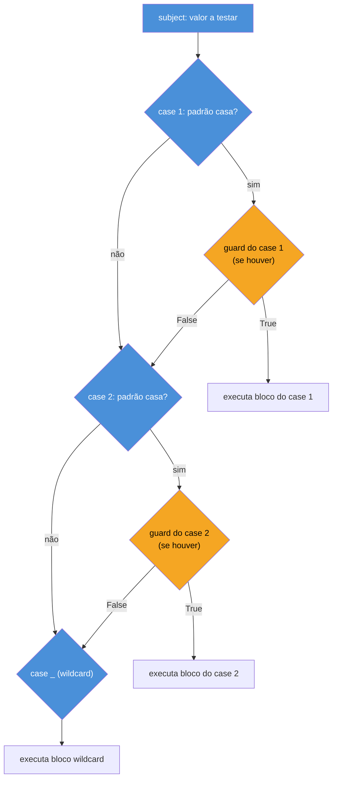

# Controle de fluxo — if/elif/else e match/case

> [!abstract] TL;DR
> `if`/`elif`/`else` em Python funciona como em qualquer linguagem C-like, mas com uma diferença estrutural: **qualquer objeto pode ser avaliado num contexto booleano**, não só expressões que já são `bool`. Isso é a **truthiness** — `0`, `""`, `[]`, `{}`, `set()`, `None` e `False` são todos **falsy**; praticamente qualquer outra coisa é **truthy**. É idiomático (`if lista:` em vez de `if len(lista) > 0:`), mas confunde "vazio" com "ausente" se você não souber a regra. Python também tem uma expressão condicional (`x if cond else y`, o "ternário" com sintaxe invertida) e, desde a versão 3.10, uma ferramenta muito mais poderosa que um `switch`: **structural pattern matching** (`match`/`case`, PEP 634) — que não apenas compara valores, mas **desestrutura** tuplas, listas, dicionários e objetos, extraindo dados no mesmo golpe em que decide qual `case` executar.

## O bug que abre esta nota

Uma função de checkout recebe uma lista opcional de cupons de desconto:

```python
def aplicar_cupons(pedido: dict, cupons: list[str] = None) -> dict:
    if cupons:
        for codigo in cupons:
            pedido = aplicar_desconto(pedido, codigo)
    return pedido
```

Parece correto — e funciona bem enquanto `cupons` for `None` (nenhum cupom) ou uma lista com itens. O bug aparece num caso que ninguém testou: o frontend manda `cupons=[]` (lista vazia, não `None`) quando o usuário abre e fecha o campo de cupom sem digitar nada. `if cupons:` também é `False` para lista vazia — então, até aqui, tudo certo, o `for` simplesmente não roda.

O problema real aparece num código *vizinho*, escrito por outra pessoa no mesmo time, que checava a mesma variável para decidir se devia **logar uma tentativa de cupom inválido**:

```python
def registrar_tentativa(cupons):
    if cupons:
        log.info("Usuário tentou aplicar cupons: %s", cupons)
    else:
        log.info("Usuário não informou cupons")  # o dev queria dizer "cupons é None"
```

A intenção do segundo autor era distinguir dois casos semanticamente diferentes — **"o campo nunca foi preenchido" (`None`)** vs **"o campo foi preenchido e depois esvaziado" (`[]`)** — que são informações de produto distintas (indicam UX diferentes: um é "nunca viu a feature", o outro é "viu e desistiu"). Só que `if cupons:` trata os dois exatamente igual, porque `None` e `[]` são **ambos falsy**. O log perdeu a distinção, e ninguém percebeu até um PM pedir uma métrica de abandono do campo de cupom que era, silenciosamente, impossível de calcular com os dados coletados.

A causa raiz não é um bug de lógica — é não saber, com precisão, **o que Python considera falso** num contexto booleano, e a diferença entre testar "é vazio/zero" (`if x:`) e testar "é ausente" (`if x is not None:`). Essa distinção — e o que fazer quando ela realmente importa — é o primeiro assunto desta nota. O segundo é uma ferramenta que teria tornado esse tipo de distinção explícita desde o início: o `match`/`case`.

## O que é

Controle de fluxo condicional em Python tem três formas, cada uma com seu papel:

1. **`if`/`elif`/`else`** — a forma clássica, presente em toda linguagem imperativa, decidindo qual bloco de código executa com base em uma ou mais condições avaliadas em sequência.
2. **Expressão condicional (`x if cond else y`)** — a versão de *expressão* do `if`, que produz um valor em vez de executar um bloco; o equivalente Python ao operador ternário `cond ? x : y` de C/Java/JS, com a ordem das palavras invertida.
3. **`match`/`case`** — introduzido no Python 3.10 (PEP 634), é *structural pattern matching*: compara a forma e o conteúdo de um valor contra um conjunto de padrões, e pode **extrair partes desse valor** (desestruturar) no mesmo passo em que decide qual ramo executar.

Amarrando tudo isso está a **truthiness**: a regra que Python usa para decidir se um valor arbitrário — não necessariamente um `bool` — conta como verdadeiro ou falso num contexto condicional (`if`, `while`, `and`, `or`, `not`).

## Por que importa

A truthiness é um dos primeiros lugares onde o modelo mental de Python diverge de linguagens estritas. Em Java ou C#, um `if` só aceita uma expressão `bool` — `if (lista)` nem compila se `lista` for uma referência de objeto. Em Python, `if lista:` é não só válido como **idiomático**: é a forma recomendada pela comunidade (e pelo PEP 8) de testar "essa coleção tem itens?", em vez de `if len(lista) > 0:`. Só que essa mesma conveniência apaga a diferença entre "vazio" e "ausente" (`None`) se você não estiver prestando atenção — como no bug acima.

O `match`/`case`, por sua vez, importa por um motivo diferente: ele não é "só um `switch` que o Python finalmente ganhou depois de 30 anos sem um" — comparação que a própria documentação e a comunidade fazem questão de desfazer. Um `switch` de Java/C compara um valor escalar contra constantes. O `match` do Python compara a **estrutura** de um valor — quantos elementos uma sequência tem, quais chaves um dicionário possui, quais atributos um objeto expõe — e faz isso vinculando nomes às partes que combinam, como um `for` faz desempacotamento (`a, b = par`), só que com múltiplos formatos candidatos e a possibilidade de falhar. Essa capacidade é o que aproxima o `match` do Python de pattern matching em linguagens funcionais (Haskell, F#, Elixir) e de Rust — não do `switch` imperativo clássico.

## Como funciona

### `if`/`elif`/`else`: a base

A sintaxe é direta, sem parênteses obrigatórios em torno da condição e com blocos delimitados por indentação (não chaves):

```python
idade = 20

if idade < 13:
    categoria = "criança"
elif idade < 18:
    categoria = "adolescente"
elif idade < 65:
    categoria = "adulto"
else:
    categoria = "idoso"

print(categoria)  # adulto
```

Diferenças notáveis vindo de Java/C/JS:

- Não existe `switch` clássico em Python antes da 3.10 — cadeias de `elif` (ou dicionários de despacho) sempre foram o idioma padrão para "múltiplos casos".
- Não há chaves `{}`; o bloco é definido pela indentação (ver nota 01 sobre como o parser lê isso).
- A condição não precisa ser `bool` — pode ser **qualquer expressão**, avaliada via truthiness (próxima seção).

### Truthiness: o que Python considera falso

Todo objeto em Python tem um valor de verdade implícito quando avaliado num contexto booleano. A regra oficial, documentada em *Truth Value Testing* na referência da linguagem, é:

> Por padrão, um objeto é considerado verdadeiro (truthy), a menos que sua classe defina um método `__bool__()` que retorne `False`, ou um método `__len__()` que retorne zero — quando chamado nesse objeto.

Na prática, os valores **falsy** embutidos são um conjunto pequeno e fixo:

| Valor falsy | Tipo |
|---|---|
| `False` | `bool` |
| `None` | `NoneType` |
| `0`, `0.0`, `0j` | `int`, `float`, `complex` |
| `""` | `str` |
| `()` | `tuple` |
| `[]` | `list` |
| `{}` | `dict` |
| `set()`, `frozenset()` | `set`, `frozenset` |
| `range(0)` | `range` |
| `b""` | `bytes` |

**Absolutamente qualquer outro valor é truthy** — incluindo `"0"` (string não vazia!), `[0]` (lista com um elemento, mesmo que o elemento seja falsy), `-1`, e qualquer instância de classe que não implemente `__bool__` nem `__len__` explicitamente.

```python
if "0":
    print("truthy")   # imprime: string "0" NÃO é vazia, logo é truthy

if [0]:
    print("truthy")   # imprime: lista com 1 elemento, não vazia

if 0.0:
    print("nunca imprime")  # 0.0 é falsy
```

> [!warning] `"0"` (string) é truthy; `0` (int) é falsy
> Essa é a pegadinha nº 1 de quem migra de shell script ou de linguagens onde string "0" costuma significar falso. Em Python, o que decide é o *tipo* e o *conteúdo* do objeto, não uma leitura semântica do texto. `"0"` é uma string não vazia — não importa que o conteúdo textual "pareça" zero. Se seu código lê `"0"` de um formulário HTML ou variável de ambiente e precisa tratá-lo como falso, você tem que converter explicitamente: `bool(int(valor))` ou uma checagem dedicada.

Isso explica o idioma mais comum do dia a dia Python:

```python
lista = obter_itens()

# Idiomático — usa truthiness diretamente
if lista:
    processar(lista)

# Redundante e menos idiomático (mas equivalente para list)
if len(lista) > 0:
    processar(lista)
```

O primeiro estilo é preferido pela comunidade (inclusive citado no próprio PEP 8) porque é mais curto, funciona uniformemente para qualquer tipo de coleção (não só as que suportam `len()` de forma barata) e expressa a intenção direta ("tem algo aqui?") em vez de uma comparação numérica acidental.

> [!question]- "Como o interpretador decide truthiness pra um objeto qualquer, não só os tipos embutidos?"
> A regra, na ordem em que o interpretador consulta:
> 1. Se a classe do objeto define `__bool__(self)`, Python chama esse método e usa o `True`/`False` retornado.
> 2. Se não define `__bool__` mas define `__len__(self)`, Python usa `len(obj) != 0` — ou seja, "vazio" é falsy, "não vazio" é truthy.
> 3. Se não define nenhum dos dois, o objeto é **sempre truthy** — mesmo que pareça "vazio" semanticamente para você.
>
> Isso é o *data model* de Python em ação (o mesmo mecanismo dunder que faz `len(lista)` funcionar chamando `lista.__len__()` por baixo). Uma classe própria só participa de truthiness customizada se implementar um desses dois métodos — caso contrário, `if minha_instancia:` é sempre `True`, mesmo que a instância "represente" um estado vazio. Esse é um gancho importante para quando você chegar no Galho 3 (OO e Data Model).

### `if x:` vs `if x is not None:` — a distinção que resolve o bug de abertura

Voltando ao bug do início: a correção certa depende de **qual pergunta você realmente quer fazer**.

```python
# Pergunta: "cupons tem algum item pra processar?"
# → truthiness resolve certo: None e [] tratados igual, o que é o comportamento certo aqui
if cupons:
    for codigo in cupons:
        ...

# Pergunta: "o campo de cupons foi preenchido pelo usuário, mesmo que vazio depois?"
# → precisa distinguir None de [] explicitamente
if cupons is not None:
    log.info("Usuário mexeu no campo de cupons (tem %d item(ns))", len(cupons))
else:
    log.info("Usuário nunca abriu o campo de cupons")
```

A regra prática: use `if x:` (truthiness) quando "vazio" e "ausente" devem ser tratados da mesma forma pela sua lógica de negócio. Use `if x is not None:` quando a distinção entre "não preenchido" e "preenchido mas vazio" carrega informação que seu código precisa preservar. O bug do início nasceu de aplicar o primeiro padrão (mais curto, mais comum) numa situação que exigia o segundo.

### Expressões condicionais (o "ternário" de Python)

Python não tem o operador `?:` de C/Java/JS. Em vez disso, tem uma expressão condicional com sintaxe em palavras, deliberadamente mais legível (e, segundo a justificativa original de Guido van Rossum na PEP 308, menos propensa a abuso em cadeias aninhadas ilegíveis):

```python
# Java/JS: idade >= 18 ? "maior" : "menor"
categoria = "maior" if idade >= 18 else "menor"
```

A ordem é: `<valor_se_verdadeiro> if <condição> else <valor_se_falso>` — o valor "principal" vem primeiro, o que aproxima a leitura de uma frase em português ("categoria é 'maior', se a idade for >= 18, senão 'menor'").

```python
desconto = 0.10 if usuario.eh_vip else 0.0
mensagem = f"{n} item{'s' if n != 1 else ''}"   # pluralização inline
maior = a if a > b else b                         # equivalente a max(a, b) aqui
```

> [!warning] Ternário aninhado é anti-idioma
> Tecnicamente válido, mas evitado pela comunidade por ilegibilidade:
> ```python
> resultado = "A" if x > 90 else "B" if x > 80 else "C" if x > 70 else "D"
> ```
> Isso é aceitável em C/JS com formatação cuidadosa, mas em Python o idioma recomendado para múltiplas faixas é `if`/`elif`/`else` tradicional, ou — a partir do Python 3.10 — `match`/`case` com guards, que veremos a seguir.

### `match`/`case`: não é um switch, é pattern matching estrutural

O Python 3.10 introduziu `match`/`case` via três PEPs complementares: a **PEP 634** (especificação técnica), a **PEP 635** (motivação e racional de design) e a **PEP 636** (tutorial). A distinção que a documentação oficial e a comunidade fazem questão de repetir: isto **não é** um `switch` importado de C/Java. É *structural pattern matching* — o nome já entrega a diferença. Um `switch` compara um valor escalar (int, string, enum) contra constantes, uma por uma, até achar igualdade. O `match` do Python compara a **estrutura** do valor: quantos elementos ele tem, que tipo é, quais chaves ou atributos possui — e, ao mesmo tempo, **vincula nomes** às partes que combinaram.

A forma mais simples é comparar valores literais — aqui sim, parecido com um `switch`:

```python
def nome_do_dia(numero: int) -> str:
    match numero:
        case 1:
            return "segunda"
        case 2:
            return "terça"
        case 3 | 4 | 5:          # "OR pattern": qualquer um destes três
            return "meio de semana"
        case _:                    # wildcard: coringa, sempre casa
            return "dia inválido"
```

O `_` é o **wildcard pattern** — sempre casa, nunca vincula nome, e por convenção fica por último (um `case` depois dele nunca seria alcançado). Repare também no `case 3 | 4 | 5:` — o **OR pattern**, que substitui vários `case` repetidos por um só.

Onde o `match` realmente se separa de um `switch` é na **desestruturação**. O exemplo canônico — e o que costuma fazer a ficha cair de quem vê pela primeira vez — é casar contra a *forma* de uma tupla, lista ou dicionário, capturando pedaços dela:

```python
def processar_comando(comando: tuple) -> str:
    match comando:
        case ("mover", x, y):
            return f"Movendo para ({x}, {y})"
        case ("mover", x, y, velocidade):
            return f"Movendo para ({x}, {y}) a {velocidade}km/h"
        case ("parar",):
            return "Parando"
        case ("mover", *resto):     # star pattern: qualquer quantidade extra
            return f"Movimento com parâmetros extras: {resto}"
        case _:
            return "Comando desconhecido"

processar_comando(("mover", 10, 20))
# "Movendo para (10, 20)" — x e y foram extraídos da tupla no mesmo passo que decidiu o case
```

O primeiro `case` não está só checando "é uma tupla de 3 elementos começando com 'mover'?" — ele está fazendo isso **e**, se a checagem passar, extraindo `x` e `y` como variáveis novas, prontas pra usar no corpo do `case`. É a mesma ideia do desempacotamento (`a, b = par`), só que com múltiplos formatos candidatos avaliados em ordem até um bater.

O mesmo vale para dicionários — **mapping patterns**, que costumam ser o momento em que a ficha cai de vez para quem vem de uma API JSON:

```python
def processar_evento(evento: dict) -> str:
    match evento:
        case {"tipo": "clique", "x": x, "y": y}:
            return f"Clique em ({x}, {y})"
        case {"tipo": "tecla", "codigo": codigo}:
            return f"Tecla pressionada: {codigo}"
        case {"tipo": "erro", "mensagem": msg, **detalhes}:
            return f"Erro: {msg} (detalhes extras: {detalhes})"
        case {"tipo": tipo}:
            return f"Evento desconhecido de tipo: {tipo}"
        case _:
            return "Payload sem 'tipo'"

processar_evento({"tipo": "clique", "x": 100, "y": 200})
# "Clique em (100, 200)"
```

Note duas regras importantes de mapping patterns, formalizadas na PEP 634: o `case` não exige que o dicionário tenha **exatamente** essas chaves e mais nenhuma — ele só exige que as chaves listadas **existam** (chaves extras no dicionário real não quebram o match, ao contrário de sequence patterns, que por padrão exigem comprimento exato). E `**detalhes` — equivalente ao `**kwargs` de uma função — captura todas as chaves restantes num dicionário à parte.

### Class patterns: desestruturando objetos via `__match_args__`

A forma mais avançada — e a que mais aproxima o `match` do Python de pattern matching em Rust ou Elixir — é casar contra instâncias de classe, extraindo atributos:

```python
class Ponto:
    __match_args__ = ("x", "y")   # define a ORDEM dos patterns posicionais

    def __init__(self, x, y):
        self.x = x
        self.y = y

def descrever(objeto) -> str:
    match objeto:
        case Ponto(x=0, y=0):
            return "Origem"
        case Ponto(x=0, y=y):
            return f"No eixo Y, em y={y}"
        case Ponto(x=x, y=0):
            return f"No eixo X, em x={x}"
        case Ponto(x, y) if x == y:      # guard: condição extra, só roda se casar E for True
            return f"Na diagonal, em ({x}, {y})"
        case Ponto():
            return "Um ponto qualquer"
        case _:
            return "Não é um Ponto"

descrever(Ponto(0, 5))    # "No eixo Y, em y=5"
descrever(Ponto(3, 3))    # "Na diagonal, em (3, 3)"
```

O mecanismo: `case Ponto(x=0, y=0):` primeiro checa `isinstance(objeto, Ponto)` — se falhar, o `case` inteiro falha sem erro, tenta o próximo. Se passar, cada campo é comparado via `getattr`. Já `case Ponto(x, y):`, sem `=`, usa **patterns posicionais** — e é aí que `__match_args__` entra: essa tupla de nomes, definida na classe, diz ao interpretador que a primeira posição corresponde ao atributo `x`, a segunda a `y`. Sem `__match_args__` definido, só patterns por palavra-chave (`x=..., y=...`) funcionam; patterns posicionais levantam `TypeError`.

> [!question]- "Preciso escrever `__match_args__` manualmente toda vez?"
> Não, se você já está usando os padrões modernos de Python. Tanto `@dataclass` quanto `NamedTuple` **geram `__match_args__` automaticamente**, na ordem dos campos declarados — outro motivo pelo qual dataclasses (Galho 3 desta trilha) combinam tão bem com `match`/`case` na prática: nenhum boilerplate extra é necessário.
> ```python
> from dataclasses import dataclass
>
> @dataclass
> class Ponto:
>     x: int
>     y: int
>
> match Ponto(1, 2):
>     case Ponto(x, y):   # funciona direto — __match_args__ = ('x', 'y') é automático
>         print(x, y)
> ```

### Guards: condição extra além do padrão estrutural

Um **guard** é um `if` opcional depois do padrão, que só é avaliado (e só decide o `case`) **depois** que o padrão estrutural já casou:

```python
def classificar(numero: int) -> str:
    match numero:
        case n if n < 0:
            return "negativo"
        case 0:
            return "zero"
        case n if n % 2 == 0:
            return "positivo par"
        case n:
            return "positivo ímpar"
```

A ordem de avaliação importa: primeiro o padrão estrutural (`n` — uma capture pattern, sempre casa), depois o guard (`n < 0`). Se o guard for `False`, o `match` **continua tentando os próximos `case`** — não é a mesma coisa que um `if` dentro do corpo do `case`, que já teria "consumido" a decisão.



### `match`/`case` vs `if`/`elif`: o debate

A comunidade Python — inclusive a própria Real Python, em seu tutorial de referência sobre o tema — é explícita ao dizer que `match`/`case` **não substitui** `if`/`elif` de forma geral; ele resolve um problema específico (comparar estrutura + extrair dados) melhor do que o `if` resolveria o mesmo problema, mas para condições simples o `if` continua sendo a ferramenta certa. Alguns pontos do debate, resumidos:

- **Performance não é o critério.** Um benchmark amplamente citado (Ben Hoyt) mostrou que o CPython **não implementa `match` como uma jump table** internamente — ele ainda testa os `case` em ordem, sequencialmente, então o desempenho tende a ser parecido com (às vezes até um pouco pior que) uma cadeia `if`/`elif` equivalente. Quem escolhe `match` por "achar que é mais rápido" está errado — a escolha certa é sobre legibilidade e capacidade de expressão, não velocidade.
- **Use `match`/`case` quando:** você está decidindo com base na **forma** de um valor (tupla de tamanho variável, dicionário de payload de API/evento, hierarquia de classes de um AST ou de um parser), e a alternativa em `if`/`elif` exigiria vários `isinstance()` + indexação manual espalhados pelo corpo de cada ramo.
- **Use `if`/`elif` quando:** a condição é simples (um valor escalar, uma comparação numérica, uma checagem booleana única) — usar `match` aqui é usar uma ferramenta mais pesada do que o problema pede, e a maioria dos guias de estilo (incluindo discussões da própria comunidade Python) recomenda contra isso.
- **Um limite prático real:** listas de imports de bibliotecas (`case some_module.SomeClass():`) em class patterns exigem que a classe esteja no escopo do `match` — não há "match contra string do nome da classe" embutido, o que às vezes torna `isinstance()` explícito mais direto para hierarquias muito dinâmicas.

A recomendação que fica desta trilha: pense no `match` como a ferramenta certa quando a pergunta é "**que formato esse dado tem, e o que eu extraio dele?**" — não como substituto automático de qualquer `if`/`elif` existente.

## Na prática

Um roteador de eventos simplificado — o tipo de código que aparece em processamento de webhooks, filas de mensagens ou parsers de comando — mostra `if`/truthiness, expressão condicional e `match`/`case` trabalhando juntos:

```python
from dataclasses import dataclass


@dataclass
class EventoPedidoCriado:
    pedido_id: str
    itens: list[str]


@dataclass
class EventoPagamentoAprovado:
    pedido_id: str
    valor: float


@dataclass
class EventoPagamentoRecusado:
    pedido_id: str
    motivo: str


def processar_evento(evento) -> str:
    match evento:
        case EventoPedidoCriado(pedido_id=pid, itens=itens) if not itens:
            # guard: pedido criado mas sem itens — estado inconsistente
            return f"[ALERTA] Pedido {pid} criado sem itens"

        case EventoPedidoCriado(pedido_id=pid, itens=itens):
            n = len(itens)
            plural = "item" if n == 1 else "itens"   # expressão condicional
            return f"Pedido {pid} criado com {n} {plural}"

        case EventoPagamentoAprovado(pedido_id=pid, valor=valor) if valor <= 0:
            return f"[ALERTA] Pagamento aprovado com valor inválido: {valor} (pedido {pid})"

        case EventoPagamentoAprovado(pedido_id=pid, valor=valor):
            return f"Pagamento de R$ {valor:.2f} aprovado para pedido {pid}"

        case EventoPagamentoRecusado(pedido_id=pid, motivo=motivo) if motivo:
            # truthiness: só usa o motivo se ele veio preenchido
            return f"Pagamento recusado para pedido {pid}: {motivo}"

        case EventoPagamentoRecusado(pedido_id=pid):
            return f"Pagamento recusado para pedido {pid} (motivo não informado)"

        case _:
            return f"Evento desconhecido: {evento!r}"


eventos = [
    EventoPedidoCriado("P001", ["teclado", "mouse"]),
    EventoPedidoCriado("P002", []),
    EventoPagamentoAprovado("P001", 350.0),
    EventoPagamentoRecusado("P002", "saldo insuficiente"),
    EventoPagamentoRecusado("P003", ""),
]

for evento in eventos:
    print(processar_evento(evento))
```

Saída:

```
Pedido P001 criado com 2 itens
[ALERTA] Pedido P002 criado sem itens
Pagamento de R$ 350.00 aprovado para pedido P001
Pagamento recusado para pedido P002: saldo insuficiente
Pagamento recusado para pedido P003 (motivo não informado)
```

Repare como `if not itens:` (guard do primeiro `case`) e `if motivo:` (guard do penúltimo) usam truthiness exatamente como a primeira metade da nota descreveu — e como o dataclass, por gerar `__match_args__` automaticamente, permitiu escrever `EventoPedidoCriado(pedido_id=pid, itens=itens)` sem nenhuma configuração extra.

## Armadilhas

### (1) Confundir `_` de wildcard com variável de descarte comum

Em outros contextos Python (`for _ in range(10):`, `_, resto = tupla`), `_` é só uma convenção de nome para "não me importo com isso". Dentro de um `match`/`case`, `_` é tratado como **palavra reservada especial** (soft keyword) — ele nunca vincula um nome, mesmo que exista uma variável `_` no escopo:

```python
_ = "valor prévio"

match 5:
    case _:
        print(_)   # ainda imprime "valor prévio" — o case NÃO reatribuiu _
```

### (2) Esquecer que capture patterns sempre casam

```python
match status_code:
    case codigo:              # capture pattern — CASA COM QUALQUER COISA, sempre
        print("Código:", codigo)
    case 404:                  # NUNCA alcançado — SyntaxError: case genuinamente inalcançável
        print("Não encontrado")
```

Se você quis comparar contra um valor específico armazenado numa variável, use um **value pattern** com prefixo de ponto (atributo de módulo/classe) ou compare dentro de um guard — capturar por nome simples sempre vincula, nunca compara valor:

```python
class Status:
    NAO_ENCONTRADO = 404

match status_code:
    case Status.NAO_ENCONTRADO:   # value pattern — compara valor, não vincula nome
        print("Não encontrado")
    case codigo:
        print("Outro código:", codigo)
```

### (3) `case` de sequência sem `*resto` exige comprimento exato

```python
match [1, 2, 3]:
    case [a, b]:          # NÃO casa — a lista tem 3 elementos, o pattern espera 2
        print("dois elementos")
    case [a, b, c]:        # casa
        print(a, b, c)
```

Diferente de mapping patterns (que ignoram chaves extras), sequence patterns sem `*resto` exigem **igualdade exata** de comprimento.

### (4) Truthiness engolindo `0` ou `""` como "ausente"

```python
def formatar_desconto(percentual):
    if percentual:                 # BUG: 0 é falsy — "sem desconto" e "campo vazio" viram a mesma coisa
        return f"{percentual}% off"
    return "sem desconto informado"

formatar_desconto(0)    # retorna "sem desconto informado" — mas 0% É uma resposta válida!
```

**Fix:** se `0`, `""` ou outro "zero" do domínio for um valor legítimo e distinto de "não informado", teste identidade com `None` explicitamente: `if percentual is not None:`.

## Em entrevista

Pergunta comum: **"Python tem `switch`?"** — a resposta errada mais frequente é "não, só tem `if`/`elif`". Desde o Python 3.10 a resposta correta é "tem `match`/`case`, mas ele é mais poderoso que um `switch` tradicional — faz pattern matching estrutural, não só comparação de valor escalar".

Outra pergunta clássica: **"O que Python considera `False` num `if`?"** — espera-se a lista completa (`0`, `""`, `[]`, `{}`, `set()`, `None`, `False`) e a explicação do mecanismo (`__bool__`/`__len__`), não só "valores vazios".

### Frase pronta (inglês)

> Python's `if` doesn't require a boolean expression — any object can be evaluated in a boolean context through what's called "truthiness." Falsy values are `False`, `None`, zero of any numeric type, and empty collections; everything else is truthy. That's why `if my_list:` is idiomatic instead of `if len(my_list) > 0:` — but it also means `None` and an empty list evaluate the same way, so if that distinction matters, you need `is not None` explicitly. As for `match`/`case`, introduced in Python 3.10 via PEP 634 — it's not a glorified switch statement. It's structural pattern matching: it can destructure tuples, lists, dicts, and objects — via `__match_args__` — while deciding which branch to take, closer to pattern matching in Rust or Elixir than to a C-style switch. And performance-wise, CPython doesn't compile it to a jump table, so it's not automatically faster than an equivalent if/elif chain — the reason to reach for it is expressiveness, matching on shape and extracting data in one step, not speed.

### Vocabulário

| Termo PT | Termo EN |
|---|---|
| verdadeiro / falso em contexto booleano | truthy / falsy |
| teste de valor de verdade | truth value testing |
| expressão condicional (ternário) | conditional expression (ternary) |
| correspondência de padrões estrutural | structural pattern matching |
| assunto (valor testado pelo `match`) | subject |
| padrão | pattern |
| padrão de captura | capture pattern |
| padrão coringa | wildcard pattern |
| padrão de sequência | sequence pattern |
| padrão de mapeamento | mapping pattern |
| padrão de classe | class pattern |
| guarda / condição extra | guard |
| desestruturação | destructuring |
| bloco irrefutável | irrefutable case block |

## How to explain in English

| PT | EN |
|---|---|
| Qualquer objeto pode ser avaliado num contexto booleano, não só `bool` | Any object can be evaluated in a boolean context, not just `bool` |
| `0`, `""`, `[]`, `{}`, `None` e `False` são falsy; o resto é truthy | `0`, `""`, `[]`, `{}`, `None`, and `False` are falsy; everything else is truthy |
| `if x:` testa "vazio/zero"; `if x is not None:` testa "ausente" | `if x:` tests "empty/zero"; `if x is not None:` tests "absent" |
| `match`/`case` faz pattern matching estrutural, não é só um switch | `match`/`case` does structural pattern matching, it's not just a switch |
| `__match_args__` define a ordem dos padrões posicionais de uma classe | `__match_args__` defines the order of positional patterns for a class |
| Guards são condições extras avaliadas só depois do padrão casar | Guards are extra conditions evaluated only after the pattern matches |
| CPython não compila `match` para uma jump table | CPython doesn't compile `match` into a jump table |

## O que vem a seguir

Com `if`/`elif`/`else`, truthiness e `match`/`case` no repertório, o próximo passo é o outro pilar do controle de fluxo: repetição. A [[05 - Loops — for, while, range, enumerate, zip|nota 05]] cobre `for` e `while`, a cláusula `else` de loop (outra peculiaridade sem equivalente direto em Java/C), e os companheiros de iteração `range`, `enumerate` e `zip` — que você vai usar em praticamente todo laço Python daqui pra frente.

## Fontes

- Python documentation — "6. Expressions: Truth Value Testing": https://docs.python.org/3/library/stdtypes.html#truth-value-testing (acessado 2026-07-09)
- Python documentation — "8. Compound statements: The match statement": https://docs.python.org/3/reference/compound_stmts.html#the-match-statement (acessado 2026-07-09)
- PEP 634 — Structural Pattern Matching: Specification: https://peps.python.org/pep-0634/ (acessado 2026-07-09)
- PEP 635 — Structural Pattern Matching: Motivation and Rationale: https://peps.python.org/pep-0635/ (acessado 2026-07-09)
- PEP 636 — Structural Pattern Matching: Tutorial: https://peps.python.org/pep-0636/ (acessado 2026-07-09)
- PEP 308 — Conditional Expressions: https://peps.python.org/pep-0308/ (acessado 2026-07-09)
- Real Python — "Structural Pattern Matching in Python": https://realpython.com/structural-pattern-matching/ (acessado 2026-07-09)
- Ben Hoyt — "Structural pattern matching in Python 3.10" (benchmark match vs if/elif, sem jump table): https://benhoyt.com/writings/python-pattern-matching/ (acessado 2026-07-09)
- Martin Heinz — "Recipes and Tricks for Effective Structural Pattern Matching in Python": https://martinheinz.dev/blog/78 (acessado 2026-07-09)

## Veja também

- [[02 - Tipos e variáveis|Tipos e variáveis]] — mutabilidade e `None`, pré-requisito para truthiness
- [[03 - Operadores e expressões|Operadores e expressões]] — a nota anterior deste galho, `and`/`or` também usam truthiness
- [[05 - Loops — for, while, range, enumerate, zip|Loops]] — próxima nota
- [[03-Dominios/Tecnologia/Python/Core/index|Core]] — MOC do galho
- [[03-Dominios/Tecnologia/Python/OO e Data Model/index|OO e Data Model]] — Galho 3, aprofunda `__bool__`, `__len__` e dataclasses (`__match_args__` automático)
- [[03-Dominios/Tecnologia/Python/index|Trilha Python]] (MOC central)
