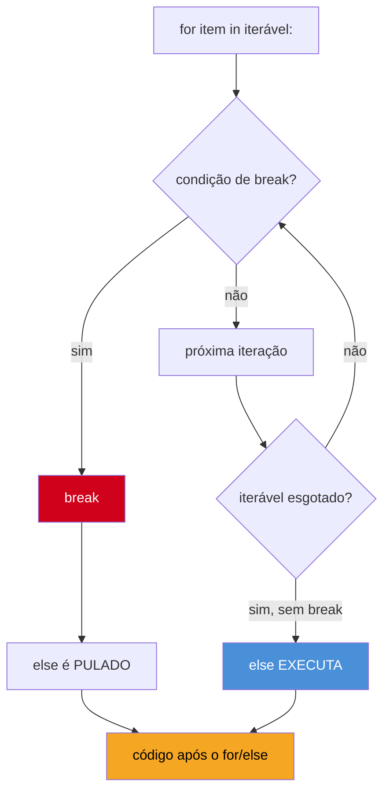

# Loops — for, while, range, enumerate, zip

> [!abstract] TL;DR
> O `for` do Python não é o `for` de Java/C — não existe contador, condição e incremento numa linha; existe **iteração sobre um iterável**, ponto. Quem escreve `for i in range(len(lista)): lista[i]` está portando um idioma de outra linguagem em vez de usar o de Python — o certo é `for item in lista`, e quando índice **e** valor forem necessários, `enumerate(lista)`. `range()` não é uma lista pré-calculada: é um objeto preguiçoso que produz números sob demanda. `zip()` itera várias sequências em paralelo e **trunca no menor** iterável, silenciosamente. E existe uma cláusula `else` de loop — sim, de loop — que a maioria dos devs experientes nunca usou porque nunca ouviu falar dela.

## O bug que abre esta nota

Um desenvolvedor migrando de Java escreve uma função para encontrar o primeiro produto em promoção numa lista, comparando preço atual com preço original:

```python
def achar_produto_em_promocao(produtos, precos_originais):
    encontrado = None
    for i in range(len(produtos)):
        if produtos[i].preco < precos_originais[i]:
            encontrado = produtos[i]
            break

    if encontrado is None:
        print("Nenhum produto em promoção")
    else:
        print(f"Promoção encontrada: {encontrado.nome}")
```

Funciona. Mas tem três sinais de "Java disfarçado de Python" nessa função só:

1. `range(len(produtos))` para pegar um índice que só serve para indexar duas listas em paralelo — quando `zip(produtos, precos_originais)` faria isso direto, sem índice nenhum.
2. Uma variável `encontrado` inicializada como sentinela (`None`) só para, depois do loop, testar se o `break` aconteceu ou não — um padrão que Python tem uma forma nativa de expressar: a cláusula `else` do `for`.
3. Nenhum uso de `enumerate()`, que existiria se a função também precisasse imprimir a posição do produto na lista.

Nenhum desses três pontos é "errado" no sentido de gerar bug — o código funciona. Mas cada um é uma oportunidade perdida de escrever a intenção de forma mais direta, e cada um aparece de forma quase idêntica em entrevista técnica de Python, porque são justamente os idiomas que separam "sabe a sintaxe" de "pensa em Python". Esta nota cobre os quatro blocos de construção de laços em Python — `for`, `while`, `range`, `enumerate`, `zip` — e o recurso menos conhecido de todos: o `else` de loop.

## O que é

Um **loop** (laço) repete um bloco de código enquanto uma condição for satisfeita, ou uma vez para cada item de uma coleção. Python tem exatamente duas construções de loop na linguagem: `while`, que repete **enquanto uma condição for verdadeira**, e `for`, que repete **uma vez para cada elemento de um iterável**. Não existe um terceiro tipo de loop C-style com inicialização/condição/incremento na própria sintaxe — o `for` do Python é, por natureza, o que outras linguagens chamam de `for-each` (ou `for...of` em JS, `for (var item : collection)` em Java).

Um **iterável** é qualquer objeto que Python sabe percorrer item a item — listas, tuplas, strings, dicionários, sets, arquivos abertos, `range()`, e qualquer objeto que implemente o protocolo de iteração (`__iter__`). `range()`, `enumerate()` e `zip()` são funções que **produzem** iteráveis prontos para alimentar um `for`, cada uma resolvendo um problema específico de laço.

## Por que importa

Escrever `for i in range(len(lista)): lista[i]` funciona, mas sinaliza imediatamente — em código de produção e em entrevista — que quem escreveu ainda pensa em índices numéricos como o jeito natural de percorrer uma coleção. Em Python, o índice é informação **secundária**, que você pede explicitamente com `enumerate()` quando precisa dela; o padrão default é iterar sobre os valores diretamente. Esse é um dos primeiros e mais visíveis divisores de água entre "escrever Python com sotaque de outra linguagem" e "escrever Python idiomático" — e reaparece constantemente em code review e em testes técnicos de entrevista.

## Como funciona

### O `for` é iteração, não contagem

A sintaxe básica:

```python
frutas = ["maçã", "banana", "uva"]

for fruta in frutas:
    print(fruta)
```

```
maçã
banana
uva
```

Não há índice em lugar nenhum dessa sintaxe porque não é necessário um índice para percorrer uma lista — o `for` pede ao iterável, um a um, "me dá o próximo item", até que não haja mais itens. Isso funciona identicamente para qualquer iterável, não só listas:

```python
for caractere in "abc":
    print(caractere)

for chave in {"a": 1, "b": 2}:
    print(chave)          # itera as CHAVES por padrão

for linha in open("arquivo.txt"):
    print(linha.strip())  # itera linha a linha, sem carregar o arquivo inteiro na memória
```

Segundo a [documentação oficial](https://docs.python.org/3/reference/compound_stmts.html#the-for-statement), a instrução `for` em Python "itera sobre os itens de qualquer sequência (uma lista ou uma string), na ordem em que aparecem na sequência" — e essa definição já foi generalizada, na prática moderna da linguagem, para qualquer objeto iterável, não só sequências. Por baixo dos panos, o `for` chama `iter()` no objeto para obter um **iterador**, e então chama `next()` repetidamente até capturar uma exceção `StopIteration` — esse mecanismo (o *iterator protocol*) é o assunto de uma nota inteira do [[03-Dominios/Tecnologia/Python/Funcional e idiomas avançados/index|Galho 4]]; aqui importa só saber que ele existe e que é o motivo pelo qual **qualquer** objeto que implemente `__iter__`/`__next__` — não só listas — pode ser usado num `for`.

> [!question]- Por que Python não tem um `for` clássico C-style (`for (i = 0; i < n; i++)`)?
> Porque o design da linguagem privilegia expressar "para cada item, faça X" em vez de "para cada posição numérica de 0 a N, faça X com o item nessa posição". A segunda forma é um detalhe de implementação (como percorrer um array por índice) vazando pra sintaxe; a primeira é a intenção real na esmagadora maioria dos casos. Quando você **de fato** precisa de um contador numérico — para gerar uma sequência de números, não para indexar uma coleção — Python oferece `range()`, que cobre exatamente esse caso sem reintroduzir a sintaxe de três partes.

### `range()` — não é uma lista, é um objeto preguiçoso

`range()` gera uma sequência de números inteiros, com três formas de chamada:

```python
range(stop)                 # 0, 1, 2, ..., stop-1
range(start, stop)          # start, start+1, ..., stop-1
range(start, stop, step)    # start, start+step, start+2*step, ... (até antes de stop)
```

```python
>>> list(range(5))
[0, 1, 2, 3, 4]
>>> list(range(2, 8))
[2, 3, 4, 5, 6, 7]
>>> list(range(10, 0, -2))
[10, 8, 6, 4, 2]
```

O detalhe que a [documentação oficial](https://docs.python.org/3/library/stdtypes.html#range) faz questão de destacar: `range` não é uma função, é um **tipo de sequência imutável** (`class range`). E o que separa esse tipo de uma `list` é fundamental — `range` é **preguiçoso** (*lazy*): ele não pré-calcula e guarda todos os números na memória quando você o cria. Ele guarda só três números — `start`, `stop`, `step` — e calcula cada valor sob demanda, no momento em que é pedido.

```python
>>> r = range(1_000_000_000)
>>> r
range(0, 1000000000)
>>> type(r)
<class 'range'>
```

Criar `range(1_000_000_000)` é instantâneo e usa uma quantidade de memória constante e minúscula — porque nenhum bilhão de inteiros foi de fato alocado. Compare com `list(range(1_000_000_000))`, que **materializa** todo mundo de uma vez e comeria vários gigabytes de RAM. Essa diferença — objeto que descreve como gerar valores vs. objeto que já contém todos os valores — é o mesmo princípio de preguiça (*laziness*) que reaparece, de forma muito mais poderosa, em geradores e no `itertools`, tema do Galho 4; aqui é só a primeira exposição prática ao conceito.

> [!warning] `range` não é um iterador
> É comum ouvir "`range` é preguiçoso, logo é um iterador" — mas não é exatamente isso. `range` é uma **sequência preguiçosa**: suporta `len()`, indexação (`r[3]`), *slicing* (`r[2:8]`) e pode ser percorrido várias vezes do início ao fim — tudo isso são propriedades de sequência, não de iterador. Um iterador de verdade se esgota depois de percorrido uma vez e não suporta indexação direta. `range` é reutilizável em múltiplos `for`s sem se esgotar; um iterador não é.

### `enumerate()` — a forma idiomática de pegar índice e valor juntos

Aqui está a correção direta do primeiro sinal de "Java disfarçado" da abertura. Quando você precisa da posição **e** do valor, a tentação de quem vem de outra linguagem é:

```python
# Não-idiomático — "traduzido" de linguagens C-style
for i in range(len(frutas)):
    print(i, frutas[i])
```

O jeito Python:

```python
for i, fruta in enumerate(frutas):
    print(i, fruta)
```

```
0 maçã
1 banana
2 uva
```

`enumerate(iterable, start=0)` retorna, segundo a [documentação oficial](https://docs.python.org/3/library/functions.html#enumerate), um objeto `enumerate` cujo `__next__()` produz tuplas `(contador, valor)` — o contador começa em `start` (0 por padrão) e incrementa a cada item. A [documentação oficial mostra sua equivalência lógica](https://docs.python.org/3/library/functions.html#enumerate) como um gerador simples:

```python
def enumerate(iterable, start=0):
    n = start
    for elem in iterable:
        yield n, elem
        n += 1
```

Ou seja: `enumerate()` não faz mágica nenhuma — é exatamente o padrão "contador manual + `for`" que você escreveria à mão, só que já pronto, testado, e sinalizando a intenção no nome da função. Um argumento `start` opcional cobre o caso comum de numeração começando em 1 em vez de 0 (útil pra exibir listas para humanos):

```python
for posicao, item in enumerate(["a", "b", "c"], start=1):
    print(f"{posicao}. {item}")
```

```
1. a
2. b
3. c
```

Segundo o [artigo de referência da Real Python sobre `enumerate()`](https://realpython.com/python-enumerate/), esse é um dos idiomas mais frequentemente citados como divisor entre código Python "traduzido de outra linguagem" e código Python nativo — precisamente porque `for i in range(len(x))` aparece com tanta regularidade em quem começou em C, Java ou C#, mesmo quando a intenção real era só "índice + valor juntos".

> [!warning] `enumerate()` só quando você realmente precisa do índice
> Se a única razão de usar índice é indexar de volta na mesma lista (`frutas[i]`), você não precisa de índice nenhum — `for fruta in frutas` já entrega o valor direto, sem indireção. Reserve `enumerate()` para quando o índice **em si** é útil (exibir posição pro usuário, montar um dicionário `{i: valor}`, comparar item com o anterior por posição). Usar `enumerate()` e nunca tocar na variável de índice é o mesmo tipo de ruído que `range(len(x))` — só troca uma forma não-idiomática por outra.

### `zip()` — iterar várias sequências em paralelo

Quando o problema não é "índice + valor" mas sim "um item desta lista e o item correspondente daquela outra lista, ao mesmo tempo", a resposta idiomática é `zip()` — não índice compartilhado.

```python
nomes = ["Ana", "Bruno", "Carla"]
idades = [28, 34, 41]

for nome, idade in zip(nomes, idades):
    print(f"{nome} tem {idade} anos")
```

```
Ana tem 28 anos
Bruno tem 34 anos
Carla tem 41 anos
```

Segundo a [documentação oficial](https://docs.python.org/3/library/functions.html#zip), `zip(*iterables, strict=False)` itera sobre vários iteráveis em paralelo, produzindo tuplas onde a *i*-ésima tupla contém o *i*-ésimo elemento de cada um dos iteráveis passados. `zip()` aceita **quantos** iteráveis forem necessários, não só dois:

```python
posicoes = [1, 2, 3]
for posicao, nome, idade in zip(posicoes, nomes, idades):
    print(posicao, nome, idade)
```

`zip()` também é preguiçoso — retorna um iterador, não uma lista pronta; se você quiser ver o resultado materializado, precisa envolver em `list()`:

```python
>>> zip(nomes, idades)
<zip object at 0x...>
>>> list(zip(nomes, idades))
[('Ana', 28), ('Bruno', 34), ('Carla', 41)]
```

> [!warning] `zip()` trunca silenciosamente no menor iterável — sem erro, sem aviso
> Se os iteráveis passados tiverem tamanhos diferentes, `zip()` para assim que o **mais curto** se esgota — os elementos restantes dos iteráveis mais longos são simplesmente descartados, sem exceção, sem warning:
> ```python
> >>> list(zip([1, 2, 3], ["a", "b", "c", "d", "e"]))
> [(1, 'a'), (2, 'b'), (3, 'c')]
> ```
> Isso é uma fonte real e silenciosa de bugs quando os dados vêm de fontes diferentes (ex.: duas colunas de um CSV que deveriam ter o mesmo número de linhas, mas uma tem uma linha faltando por corrupção de dados) — o programa simplesmente processa menos itens do que deveria, sem sinalizar nada. Desde o **Python 3.10**, existe o parâmetro `strict=True`: `zip(a, b, strict=True)` levanta `ValueError` se os tamanhos diferirem, tornando o descarte silencioso um erro explícito. Quando os iteráveis **devem** ter o mesmo tamanho por contrato, usar `strict=True` é a prática recomendada — evita que um bug de dados vire um bug de lógica invisível. Se o comportamento desejado for o oposto — preencher os buracos em vez de truncar — a ferramenta certa é `itertools.zip_longest()`, que aceita um `fillvalue` para os iteráveis mais curtos.

```python
>>> list(zip([1, 2, 3], ["a", "b", "c", "d"], strict=True))
Traceback (most recent call last):
  ...
ValueError: zip() argument 2 is longer than argument 1
```

### `while` — repetir enquanto uma condição for verdadeira

`while` não itera sobre nada — repete um bloco **enquanto uma expressão for truthy**, reavaliada a cada volta:

```python
tentativas = 0
while tentativas < 3:
    print(f"Tentativa {tentativas + 1}")
    tentativas += 1
```

```
Tentativa 1
Tentativa 2
Tentativa 3
```

A diferença de uso entre `for` e `while` não é estilística — é sobre **o que você sabe de antemão**. Use `for` quando você tem um iterável concreto (ou sabe quantas vezes repetir, via `range`). Use `while` quando o número de repetições depende de uma condição que só é conhecida em tempo de execução — esperar uma resposta de rede, ler até encontrar um sentinela, rodar até o usuário digitar "sair":

```python
comando = ""
while comando != "sair":
    comando = input("Digite um comando ('sair' para encerrar): ")
    print(f"Executando: {comando}")
```

Um padrão comum e propositalmente explícito é o `while True` com uma condição de saída no meio do corpo (não na cabeça do loop), quando a condição de parada só pode ser avaliada **depois** de algum trabalho já ter sido feito dentro do laço:

```python
while True:
    resposta = input("Digite um número positivo: ")
    if resposta.isdigit():
        break
    print("Entrada inválida, tente de novo.")
```

Esse é, aliás, o mesmo problema que o *walrus operator* (`:=`, coberto na [[03-Dominios/Tecnologia/Python/Core/03 - Operadores e expressões|nota 03]]) resolve de forma mais compacta em casos como leitura em loop: `while chunk := arquivo.read(8192):` combina a leitura e o teste de parada numa condição só, evitando o `while True` + `break` explícito quando o padrão se encaixa.

### `break` e `continue`

Dois comandos controlam o fluxo **dentro** de um laço, idênticos em espírito a Java/JS/C:

- **`break`** interrompe o laço imediatamente, pulando para o código depois dele — nenhuma iteração adicional acontece, nem o resto do corpo do laço na iteração atual.
- **`continue`** pula direto para a próxima iteração, ignorando o resto do corpo do laço na iteração atual — sem sair do laço inteiro.

```python
for numero in range(10):
    if numero == 5:
        break               # para completamente ao chegar em 5
    print(numero)
# imprime: 0 1 2 3 4

for numero in range(10):
    if numero % 2 == 0:
        continue            # pula os pares, mas continua o laço
    print(numero)
# imprime: 1 3 5 7 9
```

Em laços aninhados, `break` e `continue` afetam **apenas o laço mais interno** onde aparecem — Python não tem `break` rotulado (labeled break) como Java. Para sair de dois laços aninhados de uma vez, os idiomas comuns são: extrair o laço interno para uma função e usar `return`, levantar e capturar uma exceção customizada, ou usar uma variável de sinalização (*flag*) testada no laço externo.

### A cláusula `else` de loop — o recurso menos conhecido do Python

Aqui está a peça que resolve o segundo sinal de "Java disfarçado" da abertura, e é genuinamente pouco conhecida — inclusive entre devs experientes de Python. Tanto `for` quanto `while` podem ter uma cláusula `else` associada:

```python
for item in colecao:
    ...
else:
    ...   # executa quando o loop termina SEM break

while condicao:
    ...
else:
    ...   # executa quando a condição vira falsy, SEM break
```

A regra, segundo a [documentação oficial](https://docs.python.org/3/reference/compound_stmts.html#the-for-statement): o bloco `else` de um `for` ou `while` executa quando o laço termina **normalmente** — ou seja, o `for` esgotou o iterável, ou a condição do `while` ficou falsy — **sem que um `break` tenha interrompido o laço**. Se um `break` aconteceu, o `else` é pulado inteiramente. `return` e exceções não tratadas também pulam o `else`, pelo mesmo motivo: o laço não terminou "normalmente".

O nome `else` aqui costuma confundir quem lê pela primeira vez, porque não tem relação nenhuma com o `else` de um `if`. Segundo um post influente de [Alyssa Coghlan sobre a origem da sintaxe](https://python-notes.curiousefficiency.org/en/latest/python_concepts/break_else.html), uma das criadoras de propostas de linguagem do Python, a forma mais simples de pensar sobre isso — sugerida pelo próprio Raymond Hettinger, um dos membros mais influentes do core team — é ler `else` como **"no-break"**: o bloco roda "se não houve break".

O caso de uso canônico é **busca**: percorrer uma coleção procurando algo, e distinguir "achei" (saiu via `break`) de "não achei" (terminou o laço inteiro sem achar nada).

```python
def buscar_usuario(usuarios, email_procurado):
    for usuario in usuarios:
        if usuario.email == email_procurado:
            print(f"Encontrado: {usuario.nome}")
            break
    else:
        print("Usuário não encontrado")
```

Compare com a versão sem `else` de loop — a mesma função da abertura desta nota, com a sentinela manual:

```python
def buscar_usuario_sem_else(usuarios, email_procurado):
    encontrado = None
    for usuario in usuarios:
        if usuario.email == email_procurado:
            encontrado = usuario
            break

    if encontrado is None:
        print("Usuário não encontrado")
    else:
        print(f"Encontrado: {encontrado.nome}")
```

As duas versões fazem exatamente a mesma coisa. A diferença é que a segunda versão precisa de uma variável extra (`encontrado`) só para carregar a informação "o break aconteceu ou não" através da fronteira do laço — informação que o `else` de loop já expressa nativamente, sem variável nenhuma.



> [!question]- Por que o `else` de loop é tão pouco usado, se resolve um problema real?
> Um motivo genuíno de estilo: muita gente (incluindo o próprio [Guia de Estilo do Google para Python](https://google.github.io/styleguide/pyguide.html) em versões antigas, e vários guias de code review de empresas) considera o nome `else` **enganoso o suficiente** para preferir evitar a construção inteira, mesmo reconhecendo que ela funciona como documentado — a confusão de leitura (parece que `else` é "senão", como em `if`, quando na verdade significa "sem break") supera, para muita gente, o ganho de não precisar de uma variável sentinela. Na prática, o recurso é real, funciona, e aparece o suficiente em bibliotecas da própria biblioteca padrão e em código sênior para valer a pena reconhecer — mas escolher usá-lo ativamente em código de produção é uma decisão de estilo de equipe, não uma obrigação.

## Na prática

Reescrevendo a função de abertura com os idiomas certos — `zip()` no lugar de índice compartilhado, e `else` de loop no lugar da sentinela manual:

```python
def achar_produto_em_promocao(produtos, precos_originais):
    for produto, preco_original in zip(produtos, precos_originais, strict=True):
        if produto.preco < preco_original:
            print(f"Promoção encontrada: {produto.nome}")
            break
    else:
        print("Nenhum produto em promoção")
```

O `strict=True` também não é decoração: se `produtos` e `precos_originais` tiverem tamanhos diferentes — sinal de dado corrompido ou de um bug em outro lugar do sistema — a função falha alto e explícito (`ValueError`) em vez de silenciosamente comparar menos produtos do que deveria.

Um segundo exemplo, combinando `enumerate()` e `zip()` juntos — comum ao gerar relatórios numerados a partir de duas listas paralelas:

```python
produtos = ["Notebook", "Mouse", "Teclado"]
precos = [3200.00, 45.00, 120.00]

for posicao, (produto, preco) in enumerate(zip(produtos, precos), start=1):
    print(f"{posicao}. {produto}: R$ {preco:.2f}")
```

```
1. Notebook: R$ 3200.00
2. Mouse: R$ 45.00
3. Teclado: R$ 120.00
```

Repare na composição: `zip(produtos, precos)` produz tuplas `(produto, preco)`; `enumerate(...)` embrulha isso numa tupla externa `(posicao, (produto, preco))`; o desempacotamento `posicao, (produto, preco)` na cabeça do `for` desfaz as duas camadas de uma vez. É um padrão comum o suficiente para reconhecer de cara, mesmo que a primeira leitura pareça densa.

## Armadilhas

### (1) `for i in range(len(x))` quando `for item in x` ou `enumerate(x)` bastavam

Já coberto: use índice só quando o índice em si for necessário. Caso contrário, é ruído sintático herdado de outra linguagem.

### (2) Modificar uma lista enquanto itera sobre ela

> [!warning] Remover ou inserir itens numa lista durante o `for` pula elementos
> Percorrer uma lista com `for item in lista` e, dentro do laço, chamar `lista.remove(...)` ou `lista.append(...)` na **mesma** lista corrompe silenciosamente a iteração — não por acaso, mas porque o iterador interno da lista rastreia posição por índice, e remover um item desloca todos os índices seguintes uma casa para trás, fazendo o próximo `next()` pular um elemento:
> ```python
> >>> numeros = [1, 2, 3, 4, 5, 6]
> >>> for n in numeros:
> ...     if n % 2 == 0:
> ...         numeros.remove(n)
> >>> numeros
> [1, 3, 5]      # funcionou por "sorte" de paridade — resultado real seria [1, 3, 5] mas pulando 4 é fácil de não perceber em listas maiores
> ```
> O padrão seguro é iterar sobre uma **cópia** enquanto modifica o original — `for item in lista[:]` (slice completo cria uma cópia rasa) — ou, melhor ainda, construir uma lista nova em vez de mutar a original: `[item for item in lista if condicao]` (comprehension, tema do [[03-Dominios/Tecnologia/Python/Collections e Comprehensions/index|Galho 2]]). O mesmo problema, com sintoma diferente, ocorre ao adicionar itens a um dicionário ou set durante iteração sobre ele — Python levanta `RuntimeError: dictionary changed size during iteration` nesse caso, em vez de corromper silenciosamente.

### (3) Achar que `range()` é uma lista

`range(n)` não materializa `n` inteiros em memória — é um objeto que calcula cada valor sob demanda. Isso importa na prática quando `n` é muito grande: `list(range(10**9))` tenta alocar um bilhão de inteiros de uma vez (e provavelmente estoura memória); `range(10**9)` sozinho, usado direto num `for`, não tem esse custo.

### (4) Esquecer que `zip()` trunca sem avisar

Coberto em detalhe acima. Se os tamanhos devem ser iguais por contrato, use `strict=True` (Python 3.10+) para transformar um bug silencioso em erro explícito.

### (5) Confundir o `else` de loop com o `else` de `if`

O `else` de `for`/`while` executa quando **não houve `break`** — não tem relação com "senão" no sentido condicional. Ler mentalmente como "no-break" evita a confusão na hora de escrever e revisar código com essa construção.

## Prévia: iteração de verdade vem no Galho 4

Tudo nesta nota trata `for`, `range`, `enumerate` e `zip` como ferramentas prontas de uso — o suficiente para escrever laços idiomáticos desde já. O que acontece **por baixo** de cada `for` (o protocolo `__iter__`/`__next__`, a diferença entre iterável e iterador, como escrever seus próprios iteráveis preguiçosos com `yield`) é aprofundado no [[03-Dominios/Tecnologia/Python/Funcional e idiomas avançados/index|Galho 4 — Funcional e idiomas avançados]], que cobre generators, iterators e o restante do `itertools`. Não é necessário entender o mecanismo interno para usar `for` corretamente no dia a dia — mas vale saber que ele existe, porque explica coisas como "por que `range()` pode ser percorrido várias vezes mas um generator não pode".

## Em entrevista

Perguntas previsíveis sobre este tópico:

- **"Qual a diferença entre o `for` de Python e o `for` de Java/C?"** O `for` de Python é, por natureza, um `for-each`: itera sobre os itens de um iterável, sem sintaxe de índice/condição/incremento. Para simular um contador clássico, usa-se `range()`; para índice + valor, `enumerate()`.
- **"Por que usar `enumerate()` em vez de `range(len(x))`?"** `enumerate()` expressa a intenção diretamente (índice **e** valor, emparelhados) sem indireção manual de indexação; é mais legível, menos propenso a erro de off-by-one, e é o idioma reconhecido pela comunidade Python.
- **"O que acontece se os iteráveis passados a `zip()` tiverem tamanhos diferentes?"** `zip()` trunca silenciosamente no mais curto, sem erro. Desde o Python 3.10, `zip(a, b, strict=True)` levanta `ValueError` se os tamanhos diferirem — útil quando o contrato exige tamanhos iguais.
- **"`range(1000000)` aloca um milhão de inteiros na memória?"** Não — `range` é uma sequência preguiçosa: guarda só `start`/`stop`/`step` e calcula cada valor sob demanda. Diferente de `list(range(1000000))`, que materializa tudo de uma vez.
- **"O que a cláusula `else` de um `for` faz?"** Executa quando o laço termina sem que um `break` tenha ocorrido — útil para distinguir "encontrei e saí" de "percorri tudo e não encontrei" sem variável sentinela extra. Não tem relação com `else` de `if`.
- **"O que acontece se eu remover itens de uma lista dentro de um `for` que itera sobre ela?"** Comportamento indefinido na prática — elementos são pulados, porque a remoção desloca os índices que o iterador interno rastreia. A correção é iterar sobre uma cópia (`lista[:]`) ou construir uma lista nova.

### Frase pronta (inglês)

> Python's `for` loop is fundamentally a for-each construct — it iterates over the items of an iterable directly, with no index, condition, or increment in the syntax itself. Coming from Java or C, the instinct is to write `for i in range(len(x)): x[i]`, but that's translating another language's idiom into Python rather than using Python's own — `enumerate()` is the idiomatic way to get index and value together when you actually need the index. `range()` is worth knowing isn't a list: it's a lazy sequence that computes each value on demand instead of pre-allocating them, so `range(10**9)` is instant and cheap. `zip()` iterates multiple iterables in parallel and silently truncates to the shortest one — since Python 3.10, passing `strict=True` turns that silent truncation into an explicit `ValueError` when lengths should match. And there's a genuinely underused feature: both `for` and `while` support an `else` clause that runs only if the loop completes without hitting a `break` — it's the cleanest way to express a search-and-not-found pattern without a sentinel variable.

### Vocabulário

| Termo PT | Termo EN |
|---|---|
| laço / loop | loop |
| iterável | iterable |
| iterador | iterator |
| protocolo de iteração | iterator protocol |
| sequência preguiçosa | lazy sequence |
| desempacotamento | unpacking |
| cláusula else de loop | loop else clause |
| sentinela | sentinel |
| interromper (o laço) | break out (of the loop) |
| pular a iteração atual | skip the current iteration |
| truncar no menor | truncate to the shortest |
| laço aninhado | nested loop |

## O que vem a seguir

Com laços resolvidos, a próxima peça do Core é agrupar comportamento reutilizável em **funções**: como definir com `def`, os diferentes tipos de argumento (posicionais, nomeados, `*args`/`**kwargs`, valores default), e o modelo de escopo LEGB que determina onde Python procura uma variável — inclusive a armadilha clássica do argumento default mutável, que reaparece mencionada nesta trilha desde a nota de operadores. Tema da [[06 - Funções — definição, argumentos e escopo básico|nota 06]].

## Veja também

- [[03-Dominios/Tecnologia/Python/Core/03 - Operadores e expressões|03 — Operadores e expressões]] — o walrus operator (`:=`), útil em condições de `while`
- [[03-Dominios/Tecnologia/Python/Core/04 - Controle de fluxo — if-elif-else e match-case|04 — Controle de fluxo]] — truthiness, `if`/`elif`/`else`, base para entender a condição de um `while`
- [[03-Dominios/Tecnologia/Python/Core/06 - Funções — definição, argumentos e escopo básico|06 — Funções]] — próxima nota
- [[03-Dominios/Tecnologia/Python/Funcional e idiomas avançados/index|Funcional e idiomas avançados]] — Galho 4, onde o protocolo de iteração e generators são aprofundados
- [[03-Dominios/Tecnologia/Python/Core/index|Core]] — MOC do galho
- [[03-Dominios/Tecnologia/Python/index|Trilha Python]]

## Fontes

- Python Software Foundation. *The for statement*. docs.python.org, versão 3.14. https://docs.python.org/3/reference/compound_stmts.html#the-for-statement (acessado em 2026-07-09)
- Python Software Foundation. *Built-in Functions — enumerate()*. docs.python.org. https://docs.python.org/3/library/functions.html#enumerate (acessado em 2026-07-09)
- Python Software Foundation. *Built-in Functions — zip()*. docs.python.org. https://docs.python.org/3/library/functions.html#zip (acessado em 2026-07-09)
- Python Software Foundation. *Ranges — range*. docs.python.org, Sequence Types. https://docs.python.org/3/library/stdtypes.html#range (acessado em 2026-07-09)
- Real Python. *Python's enumerate(): Simplify Loops That Need Counters*. https://realpython.com/python-enumerate/ (acessado em 2026-07-09)
- Real Python. *Using the Python zip() Function for Parallel Iteration*. https://realpython.com/python-zip-function/ (acessado em 2026-07-09)
- Real Python. *Python range(): Represent Numerical Ranges*. https://realpython.com/python-range/ (acessado em 2026-07-09)
- Real Python. *Iterators and Iterables in Python: Run Efficient Iterations*. https://realpython.com/python-iterators-iterables/ (acessado em 2026-07-09)
- Python Morsels. *Python's range is a lazy sequence*. https://www.pythonmorsels.com/range-is-a-lazy-sequence/ (acessado em 2026-07-09)
- Coghlan, Alyssa. *Why does Python have a break/else construct on loops?*. python-notes.curiousefficiency.org. https://python-notes.curiousefficiency.org/en/latest/python_concepts/break_else.html (acessado em 2026-07-09)
- Trey Hunner. *How to loop with indexes in Python*. treyhunner.com. https://treyhunner.com/2016/04/how-to-loop-with-indexes-in-python/ (acessado em 2026-07-09)
