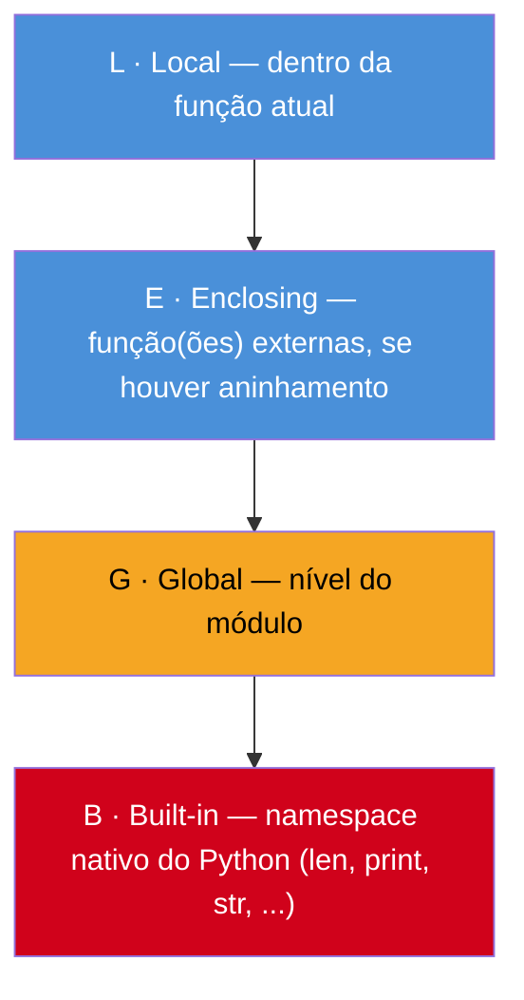

# Funções — definição, argumentos e escopo básico

> [!abstract] TL;DR
> Em Python, `def` cria um único objeto função por nome — **não existe overloading**: definir `calcular(a, b)` e depois `calcular(a, b, c)` não cria duas versões, a segunda **sobrescreve** a primeira. O que outras linguagens resolvem com overloading, Python resolve com **valores default**, `*args` (empacota posicionais extras numa tupla) e `**kwargs` (empacota nomeados extras num dicionário) — os dois maiores pontos de confusão de quem vem de Java ou C#. Desde o Python 3.8, `/` e `*` na assinatura permitem marcar parâmetros como **positional-only** ou **keyword-only** (PEP 570), refinando o contrato da função. `return` pode devolver múltiplos valores (na verdade, uma tupla só). E funções são **objetos de primeira classe**: podem ser guardadas em variável, passadas como argumento, devolvidas por outra função — a base de tudo que o Galho 4 (decorators, closures, generators) vai explorar a fundo. Por baixo de tudo isso está a regra **LEGB** (Local, Enclosing, Global, Built-in): a ordem em que Python procura o dono de um nome.

## O bug que abre esta nota

Um desenvolvedor migrando de Java escreve uma função de desconto que, dependendo do contexto, deveria aceitar dois ou três argumentos — em Java, isso seria um caso de manual para *method overloading*:

```java
// Java: duas assinaturas, mesmo nome, o compilador escolhe pela aridade
double calcularDesconto(double valor, double percentual) {
    return valor - (valor * percentual);
}

double calcularDesconto(double valor, double percentual, double taxaExtra) {
    return valor - (valor * percentual) - taxaExtra;
}
```

Ele tenta o equivalente direto em Python:

```python
def calcular_desconto(valor, percentual):
    return valor - (valor * percentual)

def calcular_desconto(valor, percentual, taxa_extra):
    return valor - (valor * percentual) - taxa_extra

print(calcular_desconto(100, 0.1))
```

E toma um `TypeError: calcular_desconto() missing 1 required positional argument: 'taxa_extra'`. Não é um bug de digitação — é o comportamento correto e documentado. Em Python, `def` não declara uma "sobrecarga" de um nome existente: ele **vincula o nome `calcular_desconto` a um novo objeto função**, e esse vínculo substitui qualquer coisa que já estivesse ligada àquele nome no mesmo namespace. A primeira definição de duas parâmetros simplesmente deixa de existir — o interpretador nunca chega a vê-la, porque no momento em que o módulo termina de carregar, `calcular_desconto` já aponta só para a segunda `def`.

Isso surpreende porque em Java, C#, C++ (linguagens estaticamente tipadas com *dispatch* resolvido em tempo de compilação) várias assinaturas com o mesmo nome coexistem como entidades distintas, escolhidas pelo compilador de acordo com o número e tipo dos argumentos da chamada. Python não tem esse mecanismo — nem poderia, sendo dinamicamente tipado: não há "tipo do argumento" disponível em tempo de definição pra desambiguar qual `def` deveria vencer. Em vez de overloading, Python oferece um conjunto diferente de ferramentas — default, `*args`, `**kwargs` — que resolvem o mesmo problema de negócio ("aceitar variações de chamada") de um jeito idiomaticamente diferente. Esta nota mapeia essas ferramentas, mais o modelo de resolução de nomes (LEGB) que decide, dentro do corpo de uma função, de onde vem cada variável que ela usa.

## O que é

Uma **função** em Python é definida com a palavra-chave `def`, um nome, uma lista de parâmetros entre parênteses, dois-pontos e um bloco indentado — o corpo da função:

```python
def saudacao(nome):
    """Retorna uma saudação personalizada."""
    return f"Olá, {nome}!"
```

Ao ser executada, essa instrução `def` faz duas coisas: cria um objeto função (com seu próprio código compilado, valores default, anotações etc.) e vincula esse objeto ao nome `saudacao` no namespace corrente — exatamente como `x = 5` vincula `5` a `x`. É por isso que uma função pode ser reatribuída, passada adiante, guardada numa lista: ela é um valor como qualquer outro.

Os **parâmetros** (`nome`, na assinatura) são os nomes declarados na definição; os **argumentos** são os valores passados numa chamada específica (`saudacao("Ana")` — `"Ana"` é o argumento). Python distingue várias *categorias* de parâmetro — posicional, nomeado, positional-only, keyword-only, `*args`, `**kwargs` — e a ordem em que eles podem aparecer na assinatura é regida por uma gramática fixa, coberta seção a seção nesta nota.

**Escopo** é a região do código onde um nome é visível. Toda vez que uma função referencia um nome que não foi atribuído localmente, o interpretador precisa decidir de onde puxar esse nome — e essa decisão segue uma ordem de busca fixa chamada **regra LEGB**.

## Por que importa

Funções são a unidade básica de reuso e organização de qualquer programa Python além de um script trivial — e a forma como Python trata argumentos (sem overloading, com `*args`/`**kwargs` e defaults) é, junto com o *duck typing*, uma das características que mais moldam o "jeito Python" de desenhar uma API. Bibliotecas populares como `requests`, `pandas` e o próprio `print()` da biblioteca padrão dependem pesadamente de `*args`/`**kwargs` para oferecer interfaces flexíveis sem precisar de dezenas de sobrecargas — entender o mecanismo por trás é pré-requisito pra ler a assinatura de qualquer função "avançada" da stdlib ou de terceiros.

Do lado de escopo, a regra LEGB é o que faz uma função "enxergar" (ou não) uma variável definida fora dela — e errar esse modelo mental gera dois tipos de bug muito comuns: `UnboundLocalError` (tentar usar uma variável local antes dela existir, porque Python já decidiu que o nome é local só por causa de uma atribuição mais abaixo no mesmo corpo) e confusão sobre por que uma função consegue *ler* uma variável global mas não consegue *reatribuí-la* sem `global` explícito. Essa nota cobre o modelo básico; closures de verdade (funções que capturam e mutam variáveis do escopo envolvente via `nonlocal`, e *factory functions* que fabricam outras funções) ficam para o Galho 4 — aqui a meta é o alicerce: como declarar, como chamar, e como o Python decide de onde vem cada nome.

## Como funciona

### `def`, o corpo da função e o `docstring`

A sintaxe mínima:

```python
def nome_da_funcao(parametro1, parametro2):
    """Docstring opcional, mas fortemente recomendado."""
    # corpo
    return resultado
```

Alguns detalhes que já divergem de linguagens C-like:

- **Não há tipo de retorno obrigatório na assinatura.** Uma anotação de tipo é opcional e não é verificada em tempo de execução (`def soma(a: int, b: int) -> int:` — as anotações são metadados que ferramentas como `mypy` checam estaticamente; o interpretador as ignora em tempo de execução, salvo para introspecção). Tipagem estática de verdade é assunto do Galho 5.
- **Uma função sem `return` explícito devolve `None`.** Não existe "função void" como conceito sintático separado — toda função devolve algo, mesmo que implicitamente `None`.
- **O docstring** (a string literal logo após a linha `def`) vira o atributo `__doc__` da função e é o que `help()` exibe — é convenção da comunidade documentar parâmetros, retorno e comportamento ali, seguindo formatos como Google style, NumPy style ou reStructuredText.

### Argumentos posicionais e nomeados (*keyword*)

Uma chamada de função em Python pode passar argumentos de duas formas, que podem ser combinadas na mesma chamada:

```python
def apresentar(nome, idade, cidade):
    print(f"{nome}, {idade} anos, mora em {cidade}")

# Posicional: a ordem importa, cada valor vai pro parâmetro correspondente
apresentar("Ana", 30, "Recife")

# Nomeado (keyword): a ordem NÃO importa, cada nome aponta pro parâmetro certo
apresentar(cidade="Recife", nome="Ana", idade=30)

# Misto: posicionais primeiro, depois nomeados
apresentar("Ana", cidade="Recife", idade=30)
```

A regra de sintaxe (imposta pelo parser, não uma convenção): **argumentos posicionais sempre vêm antes dos nomeados numa chamada**. `apresentar(nome="Ana", 30, "Recife")` é `SyntaxError` — uma vez que você nomeia um argumento, todos os seguintes também precisam ser nomeados.

O ganho prático de argumentos nomeados aparece quando a assinatura tem muitos parâmetros do mesmo tipo — passar todos posicionalmente vira uma sequência de valores ambígua e frágil a reordenação; nomear cada um documenta a intenção na própria chamada:

```python
# Ambíguo: o que é o quê, sem consultar a assinatura?
criar_usuario("João Silva", "joao@email.com", True, False, 30)

# Autoexplicativo
criar_usuario(
    nome="João Silva",
    email="joao@email.com",
    ativo=True,
    admin=False,
    idade=30,
)
```

### Valores default

Um parâmetro pode ter um valor default, tornando-o opcional na chamada:

```python
def saudacao(nome, saudacao_texto="Olá"):
    return f"{saudacao_texto}, {nome}!"

saudacao("Ana")               # "Olá, Ana!"
saudacao("Ana", "Bom dia")    # "Bom dia, Ana!"
saudacao("Ana", saudacao_texto="Boa noite")  # "Boa noite, Ana!"
```

Duas regras de gramática que o parser impõe:

1. **Parâmetros com default precisam vir depois dos sem default** (com exceção de parâmetros keyword-only, cobertos adiante, que escapam dessa restrição): `def f(a, b=1, c):` é `SyntaxError` — `c` não tem default e vem depois de `b`, que tem.
2. **O valor default é avaliado uma única vez**, no momento em que a instrução `def` é executada — não a cada chamada da função. Segundo a [documentação oficial](https://docs.python.org/3/reference/compound_stmts.html#function-definitions): *"Default parameter values are evaluated from left to right when the function definition is executed."*

Essa segunda regra é a origem exata da armadilha do **argumento default mutável**, já apresentada na [[03-Dominios/Tecnologia/Python/Core/02 - Tipos e variáveis|nota 02]]: como o objeto default é criado uma vez só e reutilizado em toda chamada subsequente, um default mutável (`lista=[]`, `dict={}`) acumula estado entre chamadas que não deveriam ter relação nenhuma entre si. Não vamos repetir a demonstração aqui — a nota 02 já dissecou o bug linha a linha — mas vale grifar a regra de ouro de novo, porque ela reaparece toda vez que se escreve uma assinatura nova: **nunca use uma lista, dicionário ou set como valor default; use `None` e crie o objeto mutável dentro do corpo da função.**

```python
def adicionar_tag(tag, tags=None):
    if tags is None:
        tags = []
    tags.append(tag)
    return tags
```

> [!warning] Default mutável não é exclusivo de listas
> A mesma regra vale para qualquer objeto mutável usado como default — `dict()`, `set()`, uma instância de classe própria que seja mutável, até um objeto `datetime.now()` "congelado" no momento da definição (que também é avaliado uma vez só, e por isso nunca reflete o instante real da chamada — outra pegadinha clássica, essa por avaliação única, não por mutabilidade).

### `*args`: empacotando posicionais extras

Esta é, segundo o próprio material da Real Python sobre o tema, uma das partes da sintaxe de funções que mais confunde quem vem de linguagens com overloading nativo — porque resolve exatamente o problema que overloading resolveria, mas de um jeito estruturalmente diferente: em vez de várias assinaturas fixas, **uma assinatura só que aceita um número variável de argumentos posicionais**, todos coletados numa tupla.

```python
def somar(*numeros):
    print(type(numeros), numeros)
    return sum(numeros)

somar(1, 2)          # <class 'tuple'> (1, 2)  →  3
somar(1, 2, 3, 4, 5)  # <class 'tuple'> (1, 2, 3, 4, 5)  →  15
somar()               # <class 'tuple'> ()  →  0
```

O nome `args` é **só uma convenção** — o operador que importa é o `*` (asterisco único) antes do nome; `def somar(*numeros)` funciona idêntico a `def somar(*args)`. A convenção existe porque é o nome usado universalmente em exemplos, documentação e código de terceiros, e seguir a convenção deixa a assinatura reconhecível de relance.

`*args` empacota (*packing*) qualquer quantidade de argumentos posicionais extras que não bateram com um parâmetro nomeado explícito. O mecanismo inverso também existe: **desempacotar** (*unpacking*) uma sequência existente para espalhar seus elementos como argumentos posicionais de uma chamada, usando o mesmo `*` do lado de fora da definição:

```python
def calcular_volume(largura, altura, profundidade):
    return largura * altura * profundidade

dimensoes = (2, 3, 4)
calcular_volume(*dimensoes)   # equivalente a calcular_volume(2, 3, 4)
```

O mesmo `*` tem papéis diferentes conforme o contexto: na **definição** da função, ele empacota; na **chamada**, ele desempacota. É a mesma dualidade de símbolo que aparece no desempacotamento de tuplas (`a, *resto = [1, 2, 3, 4]`) — assunto que o Galho 2 (Collections) aprofunda.

### `**kwargs`: empacotando nomeados extras

O par de `*args` para argumentos **nomeados**: `**` (dois asteriscos) antes de um nome de parâmetro coleta qualquer argumento nomeado que não bateu com um parâmetro explícito, empacotando tudo num **dicionário** — chave é o nome do argumento, valor é o valor passado.

```python
def criar_perfil(nome, **detalhes):
    print(type(detalhes), detalhes)
    return {"nome": nome, **detalhes}

criar_perfil("Ana", idade=30, cidade="Recife", ativo=True)
# <class 'dict'> {'idade': 30, 'cidade': 'Recife', 'ativo': True}
# {'nome': 'Ana', 'idade': 30, 'cidade': 'Recife', 'ativo': True}
```

De novo, `kwargs` é convenção de nome (abreviação de "keyword arguments"), não sintaxe obrigatória — o `**` é o que conta. E, igual a `*args`, `**kwargs` também tem um uso simétrico de desempacotamento na chamada: `**` na frente de um dicionário existente espalha suas entradas como argumentos nomeados.

```python
config = {"idade": 30, "cidade": "Recife", "ativo": True}
criar_perfil("Ana", **config)   # equivalente a criar_perfil("Ana", idade=30, cidade="Recife", ativo=True)
```

### A ordem obrigatória: posicional → `*args` → nomeado com default → `**kwargs`

Quando uma assinatura combina parâmetros comuns, `*args` e `**kwargs`, a gramática do Python impõe uma ordem fixa:

```python
def funcao(a, b, *args, c=10, **kwargs):
    print(a, b, args, c, kwargs)

funcao(1, 2, 3, 4, c=99, extra="sim")
# 1 2 (3, 4) 99 {'extra': 'sim'}
```

Um detalhe que costuma passar despercebido: **qualquer parâmetro declarado depois de `*args` só pode ser passado por nome** — nesse exemplo, `c` não pode receber valor posicionalmente, só como `c=...`, mesmo tendo um default. Isso acontece porque, uma vez que `*args` existe na assinatura, todo argumento posicional extra da chamada é engolido por ele — não sobra posição para mais nada depois. Esse comportamento é, na prática, uma forma implícita de keyword-only, e prepara terreno pra próxima seção, onde o mesmo efeito é obtido de forma **explícita** com um `*` solto.

> [!question]- Por que não simplesmente usar `**kwargs` pra tudo e nunca se preocupar com a ordem?
> Porque isso destrói a documentação embutida na assinatura e a checagem automática de erros do Python. Com `def f(nome, idade, cidade): ...`, uma chamada com argumento faltando ou com nome errado (`f(nome="Ana", idadee=30)`) levanta `TypeError` imediatamente, apontando o problema. Com `def f(**kwargs): ...`, o mesmo erro de digitação some silenciosamente dentro do dicionário — só vai aparecer (talvez) como `KeyError` em algum ponto mais fundo do corpo da função, longe do lugar onde o erro de fato aconteceu. `**kwargs` é ferramenta para casos legítimos de arity variável (decorators, wrappers, proxies de API) — não um substituto geral para declarar parâmetros normais.

### Positional-only (`/`) e keyword-only (`*`) — PEP 570 e PEP 3102

Além da restrição implícita que `*args` já impõe (tudo depois dele vira keyword-only), Python 3 tem dois marcadores explícitos que refinam ainda mais o contrato de uma função:

**Keyword-only** (disponível desde o Python 3.0, PEP 3102): um `*` solto (sem nome depois) na assinatura força que tudo à direita dele só possa ser passado por nome, mesmo sem existir um `*args` coletando posicionais antes:

```python
def criar_conexao(host, porta, *, timeout=30, retries=3):
    ...

criar_conexao("localhost", 5432, timeout=10)   # ok
criar_conexao("localhost", 5432, 10)           # TypeError — timeout precisa ser nomeado
```

**Positional-only** (Python 3.8+, [PEP 570](https://peps.python.org/pep-0570/)): uma `/` na assinatura marca que tudo à **esquerda** dela só pode ser passado por posição, nunca por nome:

```python
def dividir(a, b, /):
    return a / b

dividir(10, 2)      # ok → 5.0
dividir(a=10, b=2)  # TypeError — a e b são positional-only
```

Os dois marcadores podem coexistir na mesma assinatura, dividindo os parâmetros em até três zonas:

```python
def exemplo(pos_only, /, normal, *, kw_only):
    print(pos_only, normal, kw_only)

exemplo(1, 2, kw_only=3)             # ok
exemplo(1, normal=2, kw_only=3)      # ok — 'normal' está na zona do meio, aceita ambos
exemplo(pos_only=1, normal=2, kw_only=3)  # TypeError — pos_only não aceita nome
```

Segundo o próprio [PEP 570](https://peps.python.org/pep-0570/), a motivação central não é estética — é **evolução de API sem quebrar compatibilidade**. Se um parâmetro é positional-only, o nome dele pode ser renomeado numa versão futura da biblioteca sem quebrar código que já a consumia (já que ninguém estava usando aquele nome explicitamente). É também o que permite uma função aceitar `**kwargs` de verdade sem colidir com o nome de um parâmetro fixo — `def processar(dados, /, **opcoes)` aceita `opcoes` contendo até uma chave chamada `"dados"` sem ambiguidade, porque `dados` nunca é interpretado como nome de argumento nomeado. O PEP também nota que essa sintaxe já existia informalmente em funções nativas escritas em C (como `pow(x, y)`, que sempre foi posicional) — o `/` só trouxe pra Python puro uma capacidade que o CPython interno já tinha.

> [!question]- Isso é comum no dia a dia ou é recurso de nicho?
> É genuinamente menos usado que `*args`/`**kwargs` no código de aplicação — a maioria dos devs Python passa anos sem escrever um `/` numa assinatura própria. Mas aparece com frequência em **bibliotecas** e na própria documentação da stdlib (a partir do Python 3.8, `help()` mostra `/` nas assinaturas de funções nativas como `pow(x, y, mod=None, /)`), e é um detalhe que costuma aparecer em entrevistas de nível pleno/sênior justamente porque separa quem só usa Python de quem acompanhou a evolução da linguagem.

### `return` e múltiplos valores

`return` encerra a execução da função e devolve um valor ao chamador — sem `return` explícito (ou com `return` sem valor), a função devolve `None`. Uma função pode ter vários `return` em ramos diferentes; o primeiro que executar encerra a chamada ali.

Python não tem uma sintaxe dedicada para "retornar múltiplos valores" como algumas linguagens (Go, por exemplo, tem tipos de retorno múltiplo nativos). O que existe — e que parece múltiplo retorno na superfície — é **retornar uma tupla**, aproveitando que vírgulas sem parênteses já criam uma tupla implicitamente:

```python
def dividir_com_resto(a, b):
    quociente = a // b
    resto = a % b
    return quociente, resto   # cria uma tupla (quociente, resto)

resultado = dividir_com_resto(17, 5)
print(resultado)        # (3, 2) — é uma tupla só
print(type(resultado))  # <class 'tuple'>

# Desempacotando direto na atribuição:
q, r = dividir_com_resto(17, 5)
print(q, r)  # 3 2
```

O açúcar sintático de desempacotamento (`q, r = ...`) é o que dá a sensação de "múltiplos valores de retorno" — por baixo, é sempre um objeto tupla único sendo criado e depois desestruturado. Vale saber disso porque explica comportamentos que, sem esse modelo mental, pareceriam mágicos: por exemplo, por que `resultado = dividir_com_resto(17, 5)` guarda uma tupla inteira quando você não desempacota, ou por que ignorar um dos valores exige a convenção `_` (`_, resto = dividir_com_resto(17, 5)`).

### Funções são objetos de primeira classe (introdução)

Uma ideia que parece óbvia depois de dita, mas muda a forma de ler código Python: **uma função é um valor, do mesmo jeito que um `int` ou uma `str` são valores**. Isso significa que uma função pode:

```python
def cumprimentar(nome):
    return f"Olá, {nome}!"

# Atribuir a uma variável (sem chamar — sem parênteses!)
outra_referencia = cumprimentar
print(outra_referencia("Ana"))   # "Olá, Ana!" — mesma função, outro nome

# Guardar numa estrutura de dados
operacoes = {"cumprimentar": cumprimentar, "despedir": lambda n: f"Tchau, {n}!"}
print(operacoes["cumprimentar"]("Bia"))

# Passar como argumento para outra função
def aplicar(funcao, valor):
    return funcao(valor)

print(aplicar(cumprimentar, "Carlos"))

# Retornar de dentro de outra função
def fabrica_de_saudacao(idioma):
    if idioma == "pt":
        return cumprimentar
    return lambda n: f"Hello, {n}!"

saudar = fabrica_de_saudacao("pt")
print(saudar("Ana"))
```

Repare que `outra_referencia = cumprimentar` **não chama** a função — não tem parênteses. `cumprimentar` (sem parênteses) é a *referência ao objeto função*; `cumprimentar("Ana")` (com parênteses) é a *chamada* daquele objeto, que executa o corpo e devolve um resultado. Confundir os dois é um erro comum de iniciante: `funcao = cumprimentar()` guarda o **resultado** de já ter chamado a função (nesse caso, daria erro por faltar o argumento `nome`); `funcao = cumprimentar` guarda a **função em si**, pronta pra ser chamada depois.

Esse conceito — função como valor — é só a ponta do iceberg aqui. O tratamento de verdade, incluindo o que muda quando uma função interna referencia variáveis da função externa (closures reais, não só "função dentro de função"), decorators (`@algo`, que são literalmente funções que recebem e devolvem outras funções) e generators, é o coração do [[03-Dominios/Tecnologia/Python/Funcional e idiomas avançados/index|Galho 4]]. Por ora, a ideia a fixar é simples: **em Python, `def` não é um comando especial de "declarar comportamento" — é uma forma de criar um valor e vinculá-lo a um nome**, igual a qualquer atribuição.

### Escopo e a regra LEGB

Toda vez que uma linha de código referencia um nome, o interpretador precisa decidir **onde esse nome está vinculado**. Python resolve essa busca numa ordem fixa de quatro níveis, conhecida pelo acrônimo **LEGB**:



- **Local (L):** o corpo da função (ou lambda) que está executando agora. Nomes atribuídos dentro dessa função — incluindo os parâmetros — vivem aqui.
- **Enclosing (E):** existe só quando há funções aninhadas — o escopo da função *envolvente*, não o módulo. Vazio na maioria das funções de topo (assunto pleno no Galho 4, com closures reais).
- **Global (G):** o nível do módulo — tudo atribuído fora de qualquer função, no arquivo `.py` atual.
- **Built-in (B):** o namespace especial que o Python popula automaticamente com `len`, `print`, `str`, `Exception` e todo o resto do vocabulário nativo, sem precisar de `import`.

Python busca **nessa ordem exata**, e para no primeiro nível onde encontra o nome:

```python
x = "global"  # G

def externa():
    x = "enclosing"  # E

    def interna():
        x = "local"  # L
        print(x)     # busca em L primeiro → acha ali, para → "local"

    interna()

externa()
```

Se `interna()` não definisse `x` localmente, a busca continuaria para `E` (achando `"enclosing"`); se `externa()` também não definisse, continuaria para `G` (`"global"`); e se nem o módulo definisse `x`, continuaria para `B` — e como não existe `x` nativo no Python, o resultado final seria `NameError: name 'x' is not defined`.

**Ler** um nome de um escopo externo funciona sem cerimônia — uma função pode ler uma variável global livremente:

```python
contador_global = 0

def mostrar():
    print(contador_global)  # lê tranquilamente — busca L (não acha) → G (acha)

mostrar()  # 0
```

Mas **reatribuir** um nome dentro de uma função, por padrão, sempre cria (ou reusa) uma variável **local** nova — nunca modifica a global automaticamente:

```python
contador_global = 0

def incrementar():
    contador_global += 1  # ERRO — ver explicação abaixo
    print(contador_global)

incrementar()
```

Isso levanta `UnboundLocalError: cannot access local variable 'contador_global' where it is not associated with a value` — não porque `contador_global` não existe (existe, no escopo global), mas porque o Python, ao compilar o corpo de `incrementar`, detecta que `contador_global` recebe uma atribuição **em algum ponto da função** (`contador_global += 1` é, por baixo, `contador_global = contador_global + 1`, uma atribuição) e decide, para a função inteira, que aquele nome é **local**. Essa decisão vale para toda a função de uma vez — inclusive nas linhas *antes* da atribuição — o que é o motivo do erro: `contador_global` do lado direito de `+=` já está sendo tratado como a variável local (ainda inexistente), não a global.

> [!question]- Por que Python decide isso na hora de compilar, e não linha a linha em tempo de execução?
> Porque o compilador do CPython faz uma análise estática do corpo da função **antes** de executá-la, procurando qualquer atribuição a um nome (`=`, `+=`, `for nome in`, etc.) para decidir, de uma vez, se aquele nome é local àquela função. Essa decisão é fixa para toda a execução da função — não muda linha a linha. É uma escolha de design deliberada (evita que o significado de uma variável mude "no meio do caminho" dependendo de qual `if` rodou antes), mas o efeito colateral é justamente esse `UnboundLocalError` que parece incoerente à primeira vista, porque a variável "existe" no escopo global mas o interpretador se recusa a olhar pra lá.

Pra realmente reatribuir uma variável global de dentro de uma função, a palavra-chave `global` sinaliza explicitamente essa intenção:

```python
contador_global = 0

def incrementar():
    global contador_global
    contador_global += 1

incrementar()
print(contador_global)  # 1
```

`global` muda a decisão do compilador: em vez de tratar `contador_global` como local, ele passa a apontar para o nome do escopo do módulo. O equivalente para o nível **enclosing** (reatribuir uma variável de uma função externa a partir de uma função aninhada) é a palavra-chave `nonlocal` — mas usar `nonlocal` de verdade só faz sentido dentro de uma closure real, e o tratamento completo (incluindo *factory functions* que fabricam funções com estado capturado) é assunto do Galho 4. Aqui, o que importa fixar é o modelo: **ler atravessa escopos livremente seguindo L→E→G→B; reatribuir por padrão sempre cria local, e `global`/`nonlocal` são as válvulas de escape explícitas para mudar isso.**

> [!warning] `global` em excesso é sinal de design ruim, não de recurso "avançado"
> `global` funciona, mas seu uso frequente costuma indicar que o estado deveria estar encapsulado de outra forma — num parâmetro, num objeto, num valor de retorno. Código Python idiomático usa `global` raramente (configuração de módulo, contadores de instrumentação simples); abusar dele reintroduz os mesmos problemas de estado mutável compartilhado que tornam código difícil de testar e paralelizar em qualquer linguagem.

## Na prática

Reescrevendo a tentativa de "overload" do início da nota com as ferramentas certas — default para o caso mais comum, `*args`/`**kwargs` quando a variação é genuína, e uma assinatura clara em vez de duas `def`s que se anulam:

```python
def calcular_desconto(valor, percentual, *, taxa_extra=0.0):
    """
    Calcula o valor final após desconto percentual e, opcionalmente,
    uma taxa extra fixa.

    taxa_extra é keyword-only: força quem chama a nomear a intenção
    explicitamente, em vez de um terceiro número posicional ambíguo.
    """
    valor_com_desconto = valor - (valor * percentual)
    return valor_com_desconto - taxa_extra

# Caso "com dois argumentos"
print(calcular_desconto(100, 0.1))                       # 90.0

# Caso "com três argumentos" — agora explícito, não ambíguo
print(calcular_desconto(100, 0.1, taxa_extra=5))          # 85.0
```

Uma segunda aplicação prática, combinando `*args` e `**kwargs` num caso realista de *wrapper* — uma função que precisa repassar qualquer combinação de argumentos para outra, sem conhecer a assinatura de antemão (o mesmo mecanismo usado internamente por decorators, tema do Galho 4):

```python
import time

def medir_tempo(funcao, *args, **kwargs):
    """Chama 'funcao' com quaisquer argumentos, medindo o tempo gasto."""
    inicio = time.perf_counter()
    resultado = funcao(*args, **kwargs)   # desempacota tudo de volta
    duracao = time.perf_counter() - inicio
    print(f"{funcao.__name__} levou {duracao:.6f}s")
    return resultado

def somar_lista(*numeros, arredondar=False):
    total = sum(numeros)
    return round(total) if arredondar else total

medir_tempo(somar_lista, 1, 2, 3, 4, arredondar=True)
```

`medir_tempo` não precisa saber nada sobre a assinatura de `somar_lista` — ela empacota tudo que recebeu em `args`/`kwargs` e desempacota de volta na chamada real. É esse padrão de "empacotar aqui, desempacotar lá" que faz `*args`/`**kwargs` parecerem opacos a princípio e se tornarem óbvios depois de vistos em ação.

## Armadilhas

### (1) Achar que Python tem overloading

Já coberto na abertura: a segunda `def` de um mesmo nome sobrescreve, não sobrecarrega. Para simular o efeito de overloading, use default, `*args`/`**kwargs`, ou (em casos que exigem despacho por tipo de argumento) o decorator `@functools.singledispatch` da biblioteca padrão — fora do escopo desta nota introdutória, mas vale saber que existe para quando o caso de uso realmente pedir despacho por tipo.

### (2) Confundir a semântica de `*` e `**` na definição vs. na chamada

`*args`/`**kwargs` na **definição** empacotam; `*iteravel`/`**dicionario` numa **chamada** desempacotam. É o mesmo símbolo com papel invertido dependendo do lado em que aparece — a fonte mais comum de confusão de quem está aprendendo o tópico pela primeira vez.

### (3) Esquecer que `return a, b` é uma tupla, não "dois retornos"

Se o chamador não desempacota (`resultado = funcao()` em vez de `a, b = funcao()`), `resultado` vira a tupla inteira — não um erro, mas frequentemente não o que se pretendia. Verifique sempre se o código que consome o retorno desempacota corretamente.

### (4) `UnboundLocalError` por reatribuição acidental

Já coberto na seção de LEGB: qualquer atribuição a um nome dentro do corpo de uma função — mesmo que condicional, mesmo que depois de uma leitura aparentemente segura — faz o Python tratar aquele nome como local **na função inteira**. Se a intenção é modificar uma variável do escopo externo, `global` (ou `nonlocal`, dentro de closures) precisa ser declarado explicitamente.

### (5) Repetir a armadilha do default mutável

Já detalhada na nota 02 e revisitada aqui: um `def f(x, cache={})` acumula estado entre chamadas porque o dicionário default é criado uma única vez, na definição da função — não a cada chamada. Use `None` como sentinela e crie o objeto mutável dentro do corpo.

## Em entrevista

Perguntas previsíveis sobre este tópico:

- **"Por que Python não tem method overloading?"** Porque é uma linguagem dinamicamente tipada, sem *dispatch* resolvido em tempo de compilação por tipo/aridade de argumento; `def` com o mesmo nome apenas sobrescreve o vínculo anterior. O que overloading resolveria em Java é resolvido com defaults, `*args`/`**kwargs`, ou `functools.singledispatch` para despacho por tipo.
- **"Qual a diferença entre `*args` e `**kwargs`?"** `*args` empacota argumentos posicionais extras numa tupla; `**kwargs` empacota argumentos nomeados extras num dicionário. O mesmo `*`/`**` também desempacota (o inverso) quando usado numa chamada em vez de numa definição.
- **"O que é um parâmetro keyword-only e por que usar um?"** Parâmetro que só pode ser passado por nome (depois de `*` solto ou de `*args` na assinatura) — força clareza na chamada, útil quando a ordem posicional seria ambígua ou quando se quer proteger a API de mudanças futuras de ordem de parâmetros.
- **"O que é `/` numa assinatura de função? Desde quando existe?"** Marca parâmetros positional-only (só por posição, nunca por nome) — PEP 570, Python 3.8+. Usado sobretudo por bibliotecas para poder renomear parâmetros sem quebrar compatibilidade, e para permitir que `**kwargs` aceite uma chave com o mesmo nome de um parâmetro fixo sem colisão.
- **"Explique a regra LEGB."** Ordem de busca de nomes: Local (função atual) → Enclosing (função externa, se aninhada) → Global (módulo) → Built-in (namespace nativo). Leitura atravessa escopos livremente; reatribuição por padrão sempre cria uma variável local nova, a não ser que `global`/`nonlocal` seja declarado.
- **"Por que `x += 1` dentro de uma função pode gerar `UnboundLocalError` mesmo que `x` exista fora da função?"** Porque o Python detecta, estaticamente, que `x` recebe atribuição em algum ponto do corpo da função e trata `x` como variável local em toda a função — inclusive antes da atribuição. Sem `global x`, o lado direito de `x += 1` tenta ler uma variável local que ainda não existe.

### How to explain in English

> Python has no method overloading — defining `def func(a, b)` and then `def func(a, b, c)` doesn't create two overloads; the second definition simply replaces the first, because `def` just binds a name to a new function object. What overloading solves in languages like Java, Python solves differently: default parameter values, `*args` (which packs extra positional arguments into a tuple), and `**kwargs` (which packs extra keyword arguments into a dict). Since Python 3.8, PEP 570 added positional-only parameters marked with `/`, complementing the keyword-only parameters marked with `*` that existed since Python 3.0 — together they let you fully control which parameters can be passed by position, by keyword, or either. Under the hood, name resolution inside a function follows the LEGB rule: Local, Enclosing, Global, Built-in, searched in that order. Reading a name from an outer scope just works, but *assigning* to a name inside a function makes Python treat it as local for the entire function body — which is why you sometimes get an `UnboundLocalError` on a variable that clearly exists at module level; you need an explicit `global` (or `nonlocal` for enclosing scopes) to reassign it instead.

| Termo PT | Termo EN |
|---|---|
| argumento posicional | positional argument |
| argumento nomeado | keyword argument |
| valor default / valor padrão | default value |
| parâmetro | parameter |
| argumento | argument |
| empacotar | to pack |
| desempacotar | to unpack |
| positional-only | positional-only |
| keyword-only | keyword-only |
| sobrecarga de método | method overloading |
| função de primeira classe | first-class function |
| escopo | scope |
| regra LEGB | LEGB rule |
| namespace | namespace |
| erro de variável local não vinculada | `UnboundLocalError` |

## O que vem a seguir

Com funções e a resolução básica de nomes no bolso, a próxima nota volta pro tipo de dado mais onipresente em qualquer programa Python: strings. A [[07 - Strings e formatação|nota 07]] cobre f-strings, os principais métodos de `str`, e a distinção entre `str` (texto) e `bytes` (dados binários) — outro ponto onde quem vem de linguagens que não separam os dois de forma tão estrita costuma tropeçar.

## Veja também

- [[03-Dominios/Tecnologia/Python/Core/02 - Tipos e variáveis|02 — Tipos e variáveis]] — a armadilha do argumento default mutável, detalhada na origem
- [[03-Dominios/Tecnologia/Python/Core/03 - Operadores e expressões|03 — Operadores e expressões]] — desempacotamento de tupla no `return`, precedência
- [[03-Dominios/Tecnologia/Python/Funcional e idiomas avançados/index|Funcional e idiomas avançados]] — Galho 4: closures reais, `nonlocal`, decorators, generators
- [[03-Dominios/Tecnologia/Python/Core/index|Core]] — MOC do galho
- [[03-Dominios/Tecnologia/Python/index|Trilha Python]]

## Fontes

- Python Software Foundation. *Compound statements — Function definitions*. docs.python.org, versão 3.14. https://docs.python.org/3/reference/compound_stmts.html#function-definitions (acessado em 2026-07-09)
- Real Python. *Defining Your Own Python Function*. https://realpython.com/defining-your-own-python-function/ (acessado em 2026-07-09)
- Real Python. *Python args and kwargs: Demystified*. https://realpython.com/python-kwargs-and-args/ (acessado em 2026-07-09)
- Real Python. *Python Scope & the LEGB Rule: Resolving Names in Your Code*. https://realpython.com/python-scope-legb-rule/ (acessado em 2026-07-09)
- Coghlan, N.; et al. *PEP 570 — Python Positional-Only Parameters*. peps.python.org, aceito para Python 3.8. https://peps.python.org/pep-0570/ (acessado em 2026-07-09)
- Warsaw, B. *PEP 3102 — Keyword-Only Arguments*. peps.python.org, Python 3.0. https://peps.python.org/pep-3102/ (acessado em 2026-07-09)
- Python Software Foundation. *The Python Tutorial — More on Defining Functions* (default arguments, keyword arguments, arbitrary argument lists). docs.python.org. https://docs.python.org/3/tutorial/controlflow.html#more-on-defining-functions (acessado em 2026-07-09)
- Ramalho, L. *Fluent Python*, 2ª ed. — Capítulo 7, "Functions as First-Class Objects". O'Reilly Media.
