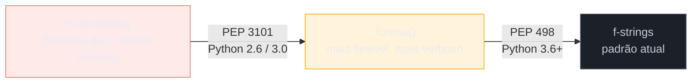
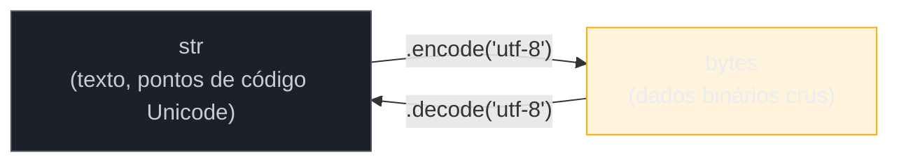

# Strings e formatação

> [!abstract] TL;DR
> `str` em Python é uma sequência **imutável** de pontos de código Unicode — todo método que "parece" alterar uma string (`.upper()`, `.replace()`, `.strip()`) na verdade devolve um objeto novo. Os métodos mais usados no dia a dia são `.strip()`, `.split()`, `.join()` e `.replace()`; `str.join(iteravel)` é do jeito que é (string chama o método, não a lista) porque você pode juntar **qualquer** iterável, não só listas, e não existe uma classe-base comum a todos os iteráveis onde esse método pudesse morar sem violar duck typing. Formatação de string passou por três gerações: `%`-formatting (herdado do `printf` de C, limitado e datado), `.format()` (PEP 3101, mais flexível mas verboso) e **f-strings** (PEP 498, Python 3.6+) — hoje o padrão, com expressões arbitrárias dentro de `{}`, format specs (`{valor:.2f}`), debug specifier (`{valor=}`, 3.8+) e suporte a expressões multi-linha desde o Python 3.12 (PEP 701). Por fim, `str` (texto) e `bytes` (dados binários crus) são tipos deliberadamente separados — a ponte entre eles é `.encode()`/`.decode()`, e o erro mais comum de quem ignora essa fronteira é o `UnicodeDecodeError`.

## O erro que aparece do nada num "código que sempre funcionou"

Um script de importação de dados roda todo dia sem problema, lendo arquivos CSV exportados de um sistema legado. Um dia, sem nenhuma mudança de código, ele explode:

```python
with open("relatorio_vendas.csv") as arquivo:
    conteudo = arquivo.read()
```

```
UnicodeDecodeError: 'utf-8' codec can't decode byte 0xe7 in position 142: invalid continuation byte
```

O reflexo mais comum é revisar o código linha por linha procurando um bug de lógica — mas não há nenhum. O arquivo de hoje veio de uma exportação feita no Excel de outra pessoa, salvo em **Latin-1** (também chamado `cp1252` no Windows) em vez de UTF-8. `open()` sem argumento de `encoding` assume UTF-8 por padrão no Python 3, e byte `0xe7` sozinho (o `ç` de "preço", em Latin-1) não forma uma sequência válida de UTF-8 — daí o `invalid continuation byte`. O código nunca teve bug; ele sempre esteve fazendo uma suposição implícita sobre codificação que, por acaso, batia com todo arquivo anterior — até não bater mais.

Esse é o tipo de armadilha que só faz sentido depois que você entende uma distinção que o Python leva a sério e outras linguagens (PHP, C antigo) historicamente não levavam: **texto e bytes são coisas diferentes**, e a conversão entre eles exige dizer, explicitamente, qual codificação está em jogo. Esta nota cobre o modelo mental de `str` (retomando e aprofundando a imutabilidade já tocada na [[03-Dominios/Tecnologia/Python/Core/02 - Tipos e variáveis|nota 02]]), os métodos e o slicing mais usados no dia a dia, as três gerações de formatação de string até chegar em f-strings, e por fim a fronteira `str`/`bytes` que causou o erro acima — e como evitá-lo.

## O que é

"Strings e formatação" em Python cobre quatro frentes que se encaixam numa progressão natural:

1. **`str` como sequência imutável** — o que isso implica na prática, além do que já foi visto na nota 02.
2. **Métodos de string mais usados** — as operações que aparecem em praticamente todo script Python: limpar espaços (`.strip()`), separar (`.split()`), juntar (`.join()`), substituir (`.replace()`).
3. **Slicing de strings** — extrair substrings e inverter texto usando a mesma sintaxe de fatiamento de sequências.
4. **Formatação** — como montar uma string a partir de variáveis, nas três gerações que a linguagem acumulou: `%`, `.format()` e f-strings.
5. **`str` vs `bytes`** — a fronteira entre texto e dados binários crus, e como atravessá-la com segurança via `encoding`.

## Por que importa

Strings são o tipo de dado mais onipresente em qualquer programa que não seja um exercício puramente numérico: nomes de arquivo, mensagens de log, respostas de API, conteúdo de banco de dados, texto exibido ao usuário. Errar o modelo mental de imutabilidade custa performance silenciosa (concatenação em loop, já vista na nota 02); usar a geração errada de formatação deixa código difícil de ler e propenso a bug de posição de argumento; e ignorar a fronteira `str`/`bytes` é a origem de uma classe inteira de bugs de produção — arquivos que "funcionam na minha máquina" e quebram no servidor porque o locale do sistema operacional assume uma codificação diferente. Entender essa fronteira também é pré-requisito direto para o Galho 10 (Web e APIs REST), onde toda requisição HTTP chega como bytes crus e precisa ser decodificada antes de virar texto utilizável.

## Como funciona

### Strings são imutáveis: o que isso implica além do já visto

A nota 02 já estabeleceu o fato central: `str` é imutável, e todo método que parece alterar uma string na verdade retorna um objeto novo, deixando o original intocado. Vale reforçar a mecânica com um exemplo que amarra os dois lados — mutação aparente vs. reatribuição real:

```python
nome = "python"
resultado = nome.upper()

print(nome)        # "python"  — o objeto original nunca mudou
print(resultado)    # "PYTHON" — objeto novo, criado por .upper()
print(nome is resultado)  # False — são objetos diferentes na memória
```

A implicação prática que a nota 02 já demonstrou é o custo O(n²) de concatenar em loop com `+=` (porque cada `+=` aloca e copia uma string inteira nova) versus o custo O(n) de `"".join(lista)`. Essa observação é a ponte direta para a próxima seção: `.join()` é, ao mesmo tempo, o método mais idiomático para montar strings a partir de uma coleção **e** o exemplo mais citado de "por que fica no lado errado" para quem vem de outras linguagens.

### Os métodos mais usados: `.strip()`, `.split()`, `.join()`, `.replace()`

**`.strip()`** remove espaços em branco (ou qualquer conjunto de caracteres passado como argumento) do início e do fim de uma string — não do meio:

```python
entrada_usuario = "   Ana Silva   \n"
print(entrada_usuario.strip())        # "Ana Silva"
print(entrada_usuario.lstrip())        # "Ana Silva   \n"  — só a esquerda
print(entrada_usuario.rstrip())        # "   Ana Silva"    — só a direita

codigo = "###produto###"
print(codigo.strip("#"))               # "produto" — remove um conjunto de caracteres específico, não só espaço
```

`.strip()` é quase sempre a primeira linha ao processar entrada de usuário ou dados lidos de arquivo — texto vindo de formulário, terminal ou CSV quase sempre carrega espaços e quebras de linha indesejadas nas pontas.

**`.split()`** quebra uma string em uma lista de substrings, usando um separador:

```python
csv_linha = "Ana,30,Recife"
campos = csv_linha.split(",")
print(campos)     # ['Ana', '30', 'Recife']

frase = "o rato roeu a roupa"
palavras = frase.split()            # sem argumento: separa por qualquer espaço em branco, colapsa múltiplos
print(palavras)   # ['o', 'rato', 'roeu', 'a', 'roupa']

data = "2026-07-09"
print(data.split("-", maxsplit=1))  # ['2026', '07-09'] — maxsplit limita o número de cortes
```

Sem argumento, `.split()` trata **qualquer sequência** de espaços em branco (espaço, tab, quebra de linha) como um único separador e ignora espaços nas pontas — diferente de `.split(" ")`, que trata cada espaço individual como um separador e pode gerar strings vazias em sequências de espaços repetidos.

**`.join()`** é o inverso de `.split()` — junta um iterável de strings usando a string em que o método é chamado como separador:

```python
palavras = ["o", "rato", "roeu", "a", "roupa"]
frase = " ".join(palavras)
print(frase)   # "o rato roeu a roupa"

campos = ["Ana", "30", "Recife"]
csv_linha = ",".join(campos)
print(csv_linha)   # "Ana,30,Recife"
```

> [!question]- Por que `str.join(lista)` e não `lista.join(str)`? Parece invertido.
> É a pergunta mais feita por quem vem de linguagens onde o método fica na coleção (Java tem `String.join(delimiter, list)` como método estático, mas JavaScript tem `array.join(separator)` — método na lista). A resposta oficial da comunidade Python, discutida extensivamente em discussões de design da linguagem, é que **você pode juntar qualquer iterável de strings** — não só uma `list`, mas também uma `tuple`, um `set`, um generator, o resultado de `.split()` de outra string, uma chave de vista (`dict.keys()`) — e não existe uma classe-base comum a todos os iteráveis do Python onde um método `.join()` pudesse morar sem violar o princípio de *duck typing* que a linguagem segue (qualquer objeto iterável serve, sem precisar herdar de uma classe específica). Colocar `.join()` na `str` também tem uma vantagem semântica: **quem sabe qual é o separador é a string**, então é ela quem "sabe" como juntar os elementos ao seu redor — o mesmo raciocínio que faz `.split()` e `.join()` serem operações complementares e simétricas, ambas vivendo em `str`. Prático: `.join()` também é o jeito idiomático (e O(n), não O(n²)) de concatenar várias strings de uma vez — muito mais rápido do que uma sequência de `+=` em loop.

**`.replace()`** substitui todas as ocorrências (ou até um número limitado) de uma substring por outra:

```python
frase = "eu gosto de java, java é legal"
print(frase.replace("java", "python"))              # "eu gosto de python, python é legal"
print(frase.replace("java", "python", 1))            # só a primeira ocorrência: "eu gosto de python, java é legal"
```

Uma menção rápida a `.format()` fecha o quarteto — mas como formatação merece tratamento próprio (é a segunda das três gerações cobertas mais adiante), ela é detalhada na seção "Formatação: três gerações", não aqui.

### Slicing de strings

Como qualquer sequência em Python (também vale para `list` e `tuple`), uma `str` suporta **fatiamento** (*slicing*) com a sintaxe `s[início:fim:passo]` — qualquer uma das três posições pode ser omitida:

```python
s = "python"
print(s[0])       # "p"   — indexação simples, primeiro caractere
print(s[1:4])     # "yth" — do índice 1 (inclusive) até 4 (exclusive)
print(s[:3])       # "pyt" — do início até o índice 3 (exclusive)
print(s[3:])       # "hon" — do índice 3 até o fim
print(s[-1])       # "n"   — índice negativo: último caractere
print(s[-3:])      # "hon" — os três últimos caracteres
```

O `passo` (terceiro valor) controla o intervalo entre caracteres — e um passo negativo percorre a string de trás para frente, o que dá o truque mais citado de slicing em Python: **reverter uma string com `s[::-1]`**:

```python
s = "python"
print(s[::-1])     # "nohtyp"
print(s[::2])       # "pto"    — do início ao fim, pulando de 2 em 2
print(s[::-2])      # "nhy"    — de trás pra frente, pulando de 2 em 2
```

`s[::-1]` funciona porque, ao omitir início e fim mas passar passo `-1`, o Python entende "percorra a sequência inteira, de trás pra frente" — o mesmo mecanismo genérico de slicing usado para qualquer sequência, não um recurso especial de string. É considerado o jeito mais idiomático (e um dos mais rápidos, porque a implementação em C evita o overhead de um loop Python explícito) de reverter uma string, mais do que `"".join(reversed(s))` ou um loop manual.

> [!warning] Slicing sempre cria uma string nova
> Como `str` é imutável, `s[1:4]` não é uma "visão" (*view*) sobre a string original — é sempre um objeto novo, com seu próprio espaço de memória. Para strings curtas isso é irrelevante; para processar arquivos gigantes em fatias repetidas, vale ter em mente que cada slice copia dados.

### Formatação: três gerações

Toda linguagem de programação de uso geral precisa de um jeito de montar uma string interpolando valores de variáveis. Python acumulou **três** desses jeitos ao longo de sua história — e entender por que existem três, e por que a terceira geração venceu, ajuda a ler código de qualquer época da linguagem.



#### Geração 1: `%`-formatting (estilo C, legado)

A mais antiga das três, herdada quase diretamente do `printf` de C. Usa o operador `%` entre uma string de formato (com placeholders como `%s`, `%d`, `%.2f`) e uma tupla (ou dicionário) de valores:

```python
nome = "Ana"
idade = 30
print("Nome: %s, Idade: %d" % (nome, idade))
# "Nome: Ana, Idade: 30"

preco = 19.999
print("Preço: R$ %.2f" % preco)
# "Preço: R$ 20.00"
```

Funciona, mas carrega limitações reais: o operador `%` é binário (aceita só dois operandos — a string e a tupla/dict de valores), o que torna difícil combinar formatação posicional com nomeada na mesma chamada; os códigos de formato (`%s`, `%d`) exigem saber de cor a letra certa para cada tipo; e um erro de contagem entre placeholders e valores na tupla produz `TypeError` só em tempo de execução, sem checagem antecipada. `%`-formatting não foi removido nem descontinuado — continua funcionando em qualquer versão do Python 3 — mas é considerado legado: aparece sobretudo em código antigo, ou em contextos específicos como formatação de mensagens de log (o módulo `logging` da stdlib ainda usa `%` internamente por razões de performance de lazy evaluation).

#### Geração 2: `.format()` (PEP 3101, Python 2.6/3.0)

Introduzido como substituto mais flexível do `%`, tratando formatação como uma chamada de método comum em vez de um operador binário. Suporta argumentos posicionais, nomeados, e reordenação:

```python
nome = "Ana"
idade = 30

print("Nome: {}, Idade: {}".format(nome, idade))
# "Nome: Ana, Idade: 30"

print("Nome: {0}, Idade: {1}, de novo: {0}".format(nome, idade))
# índices explícitos, reordenáveis e reutilizáveis: "Nome: Ana, Idade: 30, de novo: Ana"

print("Nome: {n}, Idade: {i}".format(n=nome, i=idade))
# argumentos nomeados: "Nome: Ana, Idade: 30"

preco = 19.999
print("Preço: R$ {:.2f}".format(preco))
# "Preço: R$ 20.00"
```

`.format()` resolveu boa parte das limitações do `%` — placeholders `{}` genéricos (sem precisar escolher `%s` vs `%d`), reordenação e reuso de argumento por índice, e uma mini-linguagem de format specs (o `:.2f` depois dos dois-pontos) que hoje é compartilhada com f-strings. O problema prático é a **verbosidade**: repetir cada nome de variável dentro de `{}` **e** de novo na lista de argumentos de `.format(...)` é redundante e cresce rápido em strings com muitos placeholders — o exato problema que a terceira geração resolveu.

#### Geração 3: f-strings (PEP 498, Python 3.6+) — o padrão atual

Uma **f-string** é uma string literal prefixada com `f` (ou `F`) onde qualquer expressão Python entre `{}` é avaliada **no lugar**, sem precisar repetir o nome em nenhuma lista de argumentos:

```python
nome = "Ana"
idade = 30

print(f"Nome: {nome}, Idade: {idade}")
# "Nome: Ana, Idade: 30"
```

A diferença central em relação às duas gerações anteriores: dentro de `{}` cabe **qualquer expressão Python válida**, não só o nome de uma variável — chamada de método, indexação, operação aritmética, até uma expressão condicional:

```python
preco = 19.999
qtd = 3

print(f"Total: R$ {preco * qtd:.2f}")           # expressão aritmética + format spec: "Total: R$ 59.997" -> "59.997" formatado como .2f: "60.00"
print(f"Nome em maiúsculas: {nome.upper()}")      # chamada de método
print(f"Status: {'ativo' if idade >= 18 else 'menor'}")  # expressão condicional
print(f"Primeiro item: {[1, 2, 3][0]}")            # indexação
```

**Format specs** funcionam igual à geração anterior — os dois-pontos dentro de `{}` introduzem a mesma mini-linguagem de formatação (largura, alinhamento, precisão, separador de milhar) documentada como *Format Specification Mini-Language* na documentação oficial:

```python
valor = 1234567.891

print(f"{valor:.2f}")        # "1234567.89"  — 2 casas decimais
print(f"{valor:,.2f}")        # "1,234,567.89" — separador de milhar + 2 casas
print(f"{valor:>15,.2f}")     # "   1,234,567.89" — alinhado à direita, largura 15
print(f"{42:05d}")            # "00042" — inteiro preenchido com zero, largura 5
print(f"{0.3567:.1%}")        # "35.7%" — formatado como percentual
```

**Debug specifier `{valor=}`** (novidade do Python 3.8): adicionar `=` logo antes do fechamento de `{}` imprime tanto o **texto da expressão** quanto o **valor**, sem precisar repetir a variável duas vezes numa f-string de debug:

```python
x = 10
y = 20

print(f"{x=}, {y=}")                # "x=10, y=20"
print(f"{x + y=}")                   # "x + y=30"
print(f"{x=:03d}")                   # "x=010" — combina debug specifier com format spec
```

Antes do 3.8, o padrão para debugar era escrever `print(f"x={x}, y={y}")` manualmente — repetindo cada nome. O `=` elimina essa repetição e é hoje uma das ferramentas mais citadas para debug rápido via `print`, substituindo boa parte do que antes exigiria um debugger de verdade para inspeções simples.

**F-strings multi-linha e expressões mais soltas (Python 3.12+, PEP 701):** até o Python 3.11, uma f-string tinha várias restrições sintáticas curiosas — não podia reutilizar o mesmo tipo de aspas usadas para delimitar a própria f-string dentro da expressão, não podia conter `\` (barra invertida, o que quebrava até escapes Unicode como `\N{SNOWMAN}`), e expressões multi-linha só funcionavam se a f-string inteira já fosse delimitada por aspas triplas. O PEP 701 (implementado via um novo parser PEG a partir do 3.9) removeu essas restrições artificiais:

```python
# Antes do 3.12, isso era SyntaxError:
nome = "Ana"
print(f"Saudação: {"Olá, " + nome}")   # aspas duplas dentro E fora — só válido a partir do 3.12

# Expressões multi-linha dentro de uma f-string de aspas triplas, com comentário:
dados = {"nome": "Ana", "idade": 30}
mensagem = f"""
Relatório: {
    dados["nome"].upper()  # comentário permitido dentro da expressão a partir do 3.12
    + " - " + str(dados["idade"])
}
"""
```

O PEP 701 não muda o comportamento semântico de f-strings já existentes — código escrito para versões anteriores continua funcionando idêntico. A mudança é puramente de **flexibilidade sintática**, tratando f-strings como uma construção de primeira classe do parser em vez de um caso especial tokenizado à parte (que era como f-strings eram implementadas desde o PEP 498 original).

> [!question]- F-strings são mais rápidas que `.format()` e `%`? Ou é só sobre legibilidade?
> As duas coisas. F-strings são avaliadas em tempo de compilação para bytecode que monta a string diretamente — sem o overhead de uma chamada de método (`.format()`) nem de parsing do operador `%` em tempo de execução. Em benchmarks amplamente reproduzidos pela comunidade, f-strings tendem a ser a opção mais rápida das três para o caso comum de interpolar algumas variáveis. Mas a motivação original do PEP 498, segundo o próprio texto do PEP, foi primariamente de **legibilidade** — eliminar a necessidade de repetir cada nome de variável duas vezes (uma dentro do placeholder, outra na lista de argumentos), que é o problema real de `.format()`. Performance foi um benefício bem-vindo, não o motivo central da proposta.

### Comparando com JavaScript: template literals são o parente mais próximo

Quem vem de JavaScript reconhece o espírito das f-strings quase imediatamente nos **template literals** (backticks, `${}`):

```javascript
// JavaScript
const nome = "Ana";
const idade = 30;
console.log(`Nome: ${nome}, Idade: ${idade}`);
```

```python
# Python
nome = "Ana"
idade = 30
print(f"Nome: {nome}, Idade: {idade}")
```

Ambos permitem **qualquer expressão** dentro dos delimitadores (`${}` em JS, `{}` em Python), ambos existem para resolver o mesmo problema histórico (concatenação manual verbosa e propensa a erro), e ambos são hoje o padrão idiomático recomendado em suas respectivas linguagens. As diferenças notáveis: template literals usam **backtick** como delimitador da string inteira (o que já os torna multi-linha por padrão, sem prefixo especial), enquanto f-strings usam o prefixo `f` antes de aspas normais e dependem de aspas triplas para o caso multi-linha; dentro do placeholder, JS exige o `$` antes de `{}` (`${expr}`), Python usa só `{expr}`. Semanticamente, porém, a analogia é próxima o bastante para servir de ponte mental direta: "f-string é o template literal do Python".

### `str` vs `bytes`: a fronteira que causou o erro da abertura

Todo o texto sobre o qual esta nota falou até aqui — literais, métodos, slicing, formatação — trabalha em cima do tipo `str`: uma sequência **imutável de pontos de código Unicode**. `str` não sabe, por si só, quantos bytes cada caractere ocupa em disco ou na rede — isso é decidido só no momento em que o texto precisa virar uma sequência de bytes concretos, seja para gravar num arquivo, mandar por socket, ou gerar um hash.

`bytes` é o outro tipo: uma sequência **imutável de inteiros entre 0 e 255** — dados binários crus, sem noção nenhuma de "caractere" ou "idioma". Um literal `bytes` usa o prefixo `b`:

```python
texto = "café"          # str — 4 pontos de código Unicode
dados = b"caf\xc3\xa9"   # bytes — 5 bytes crus (é assim que "café" fica em UTF-8)

print(len(texto))    # 4  — quatro CARACTERES
print(len(dados))    # 5  — cinco BYTES (o "é" ocupa 2 bytes em UTF-8)
print(type(texto), type(dados))  # <class 'str'> <class 'bytes'>
```

A ponte entre os dois é sempre explícita — nunca implícita — através de dois métodos simétricos:

- **`.encode(encoding)`**: transforma `str` → `bytes`, especificando qual codificação usar para mapear cada ponto de código para uma sequência de bytes.
- **`.decode(encoding)`**: transforma `bytes` → `str`, especificando qual codificação usar para interpretar aquela sequência de bytes de volta em pontos de código.

```python
texto = "café"
dados = texto.encode("utf-8")
print(dados)                # b'caf\xc3\xa9'

de_volta = dados.decode("utf-8")
print(de_volta)             # "café"
print(de_volta == texto)     # True
```

`"utf-8"` é o default de `.encode()`/`.decode()` desde o Python 3 (e a codificação recomendada para praticamente todo caso novo, por ser compatível com ASCII e cobrir todo o Unicode), mas nada obriga o argumento — e é exatamente omitir esse argumento, em qualquer ponto da cadeia, que causou o erro da abertura desta nota.



> [!warning] `UnicodeDecodeError` é sempre um problema de codificação incompatível, nunca um bug de lógica
> A mensagem `'utf-8' codec can't decode byte 0x.. in position ..: invalid continuation byte` (ou `invalid start byte`) significa que Python tentou interpretar uma sequência de bytes como UTF-8, e aqueles bytes específicos **não formam** uma sequência UTF-8 válida naquela posição. A causa quase sempre é a mesma: os bytes foram originalmente codificados numa codificação diferente (Latin-1/`cp1252`, comum em exportações do Windows/Excel; ou outra codificação regional), e alguém tentou decodificá-los como se fossem UTF-8. **Não existe** um jeito de adivinhar a codificação certa a partir só dos bytes com 100% de certeza — bibliotecas como `chardet` fazem uma estimativa estatística, mas a correção definitiva é sempre **saber** (ou perguntar, ou documentar) qual codificação a fonte de dados realmente usa, e passar isso explicitamente como argumento de `encoding=` em `open()` ou `.decode()`.

Voltando ao script da abertura: o fix é identificar a codificação real do arquivo (nesse caso, `cp1252`, o padrão de exportações do Excel em português no Windows) e declará-la explicitamente:

```python
# Antes: assume UTF-8 silenciosamente, quebra em arquivos de outra codificação
with open("relatorio_vendas.csv") as arquivo:
    conteudo = arquivo.read()

# Depois: declara a codificação real, explicitamente
with open("relatorio_vendas.csv", encoding="cp1252") as arquivo:
    conteudo = arquivo.read()
```

> [!question]- E se eu realmente não souber qual codificação um arquivo usa?
> Três saídas práticas, em ordem de preferência: (1) pergunte à fonte dos dados — na prática, a maioria dos casos de produção tem uma resposta conhecida (o sistema legado sempre exporta em Latin-1, a API sempre devolve UTF-8 etc.) e vale documentar isso uma vez para não repetir a investigação; (2) use a biblioteca `chardet` (ou `charset-normalizer`, seu sucessor mais moderno) para uma estimativa estatística da codificação mais provável, útil quando a fonte é desconhecida ou variável; (3) como último recurso, `.decode("utf-8", errors="replace")` ou `errors="ignore"` evita a exceção substituindo (ou descartando) os bytes problemáticos — mas isso corrompe silenciosamente os dados afetados, então só é aceitável quando perder um pouco de fidelidade é tolerável (por exemplo, num pipeline de indexação de busca aproximada), nunca em dados financeiros ou de auditoria.

## Na prática

Um exemplo único que amarra as três seções técnicas da nota — limpar entrada de usuário com `.strip()`/`.split()`, formatar um relatório com f-strings (incluindo format specs e o debug specifier), e lidar com a fronteira `str`/`bytes` ao gravar o resultado em disco:

```python
def processar_pedido(linha_csv: str) -> str:
    """
    Recebe uma linha de CSV bruta (nome,quantidade,preco_unitario),
    normaliza a entrada e devolve uma linha de relatório formatada.
    """
    # .strip() remove espaços/quebras de linha residuais; .split() separa os campos
    nome, quantidade_str, preco_str = linha_csv.strip().split(",")

    nome = nome.strip().title()               # "  ana silva " -> "Ana Silva"
    quantidade = int(quantidade_str.strip())
    preco_unitario = float(preco_str.strip())
    total = quantidade * preco_unitario

    # f-string com expressão aritmética, format spec de moeda e alinhamento
    linha_relatorio = (
        f"{nome:<20} | {quantidade:>3}x | "
        f"R$ {preco_unitario:>8.2f} | Total: R$ {total:>10.2f}"
    )

    # debug specifier — útil durante desenvolvimento, removido antes de produção
    # print(f"{nome=}, {quantidade=}, {preco_unitario=}, {total=}")

    return linha_relatorio


linhas_brutas = [
    "  ana silva , 3, 19.99",
    "carlos souza,10,5.50",
]

relatorio = "\n".join(processar_pedido(linha) for linha in linhas_brutas)
print(relatorio)
# Ana Silva            |   3x | R$    19.99 | Total: R$      59.97
# Carlos Souza         |  10x | R$     5.50 | Total: R$      55.00

# Gravando em disco: encoding EXPLÍCITO, nunca deixado implícito
with open("relatorio.txt", "w", encoding="utf-8") as arquivo:
    arquivo.write(relatorio)
```

Repare que `"\n".join(...)` reaparece aqui exatamente pela razão discutida antes: é o jeito idiomático (e O(n)) de juntar várias linhas processadas por um generator expression, em vez de acumular com `+=` num loop. E o `encoding="utf-8"` explícito no `open(..., "w", ...)` é a mesma lição do incidente da abertura, aplicada preventivamente: nunca deixe a codificação implícita quando o arquivo pode ser lido depois num ambiente com locale diferente.

## Armadilhas

### (1) Comparar strings com `%s` e esquecer a tupla de um elemento só

```python
nome = "Ana"
print("Nome: %s" % nome)     # funciona por acaso — Python aceita valor único sem tupla
print("Nome: %s, %s" % nome)  # TypeError: not enough arguments for format string — 'nome' não é uma tupla de 2
```

**Fix:** ao usar `%`-formatting com mais de um placeholder, sempre envolva os valores numa tupla explícita: `"%s, %s" % (a, b)`. Esse tipo de erro sutil de contagem é uma das razões que motivaram `.format()` e, depois, f-strings.

### (2) Misturar `str` e `bytes` na mesma operação

```python
texto = "erro: "
dados = b"algo deu errado"
print(texto + dados)   # TypeError: can only concatenate str (not "bytes") to str
```

**Fix:** decodifique os bytes para `str` (ou codifique o texto para `bytes`) antes de combinar — nunca misture os dois tipos diretamente. Python não converte implicitamente entre eles, do mesmo jeito que não converte implicitamente `"2" + 2` (nota 02) — é a mesma filosofia de tipagem forte aplicada aqui.

### (3) Esquecer que `.strip()` não remove espaços do meio

```python
frase = "muitos    espaços    no    meio"
print(frase.strip())   # "muitos    espaços    no    meio"  — sem mudança nenhuma no meio
```

**Fix:** para colapsar espaços internos repetidos, use `" ".join(frase.split())` — `.split()` sem argumento já trata sequências de espaço como um separador único, e `" ".join()` remonta com um único espaço entre cada palavra.

### (4) Usar f-string sem format spec para números que precisam de formatação

```python
preco = 19.999999
print(f"Preço: R$ {preco}")   # "Preço: R$ 19.999999" — provavelmente não é o que você queria mostrar
```

**Fix:** sempre que o valor for monetário, percentual, ou precisar de casas decimais fixas, use o format spec: `f"Preço: R$ {preco:.2f}"` → `"Preço: R$ 20.00"`.

## Em entrevista

Perguntas previsíveis sobre este tópico:

- **"Por que `str` é imutável em Python?"** Permite que strings sejam hasheáveis (usáveis como chave de dicionário ou elemento de set), permite interning seguro de literais curtos pelo interpretador (economia de memória), e simplifica compartilhamento entre threads (não há risco de uma thread mutar uma string que outra está lendo).
- **"Qual a diferença entre `.format()` e f-strings, além de sintaxe?"** F-strings avaliam a expressão diretamente no lugar do placeholder, sem repetir o nome numa lista de argumentos separada — mais legível e, por serem resolvidas em tempo de compilação para bytecode, geralmente mais rápidas. `.format()` continua útil quando a string de formato só é conhecida em tempo de execução (por exemplo, vinda de um arquivo de configuração ou de tradução/i18n), caso em que f-strings não servem — f-strings exigem que a expressão exista no código-fonte no momento em que a f-string é escrita.
- **"Por que `str.join()` e não `list.join()`?"** Porque `.join()` precisa funcionar com qualquer iterável (não só listas), e não existe uma classe-base comum a todos os iteráveis Python onde o método pudesse morar sem violar duck typing; semanticamente, também faz sentido que quem "sabe" o separador (a string) seja quem executa a junção.
- **"O que causa um `UnicodeDecodeError` e como você evita?"** Tentar decodificar bytes usando uma codificação diferente da que foi usada para codificá-los originalmente — por exemplo, ler um arquivo Latin-1 assumindo UTF-8. Evita-se declarando `encoding=` explicitamente em toda operação de leitura/escrita/decode, em vez de depender do default implícito do sistema.
- **"Como você reverteria uma string em Python?"** `s[::-1]` — slicing com passo -1, o jeito mais idiomático e um dos mais rápidos, por usar a implementação em C do slicing em vez de um loop explícito em Python.

### How to explain in English

> Python strings are immutable — every "mutating" method like `.upper()` or `.replace()` actually returns a new string object. The most common string operations are `.strip()` (trim whitespace), `.split()` (break into a list), `.join()` (the reverse of split — and it lives on `str`, not on `list`, because you can join any iterable, not just lists, and there's no common base class for all iterables to hang that method on), and `.replace()`. Python went through three generations of string formatting: `%`-formatting (inherited from C's printf, limited and legacy), `.format()` (more flexible but verbose — you repeat each variable name twice), and f-strings (PEP 498, Python 3.6+), which are the current standard — you embed any expression directly inside `{}`, use format specs like `{value:.2f}` for precision, and since Python 3.8 you can use the debug specifier `{value=}` to print both the expression and its value without repeating it. Since Python 3.12, PEP 701 lifted most syntactic restrictions on f-strings, so they can now span multiple lines and reuse quote characters freely. On the encoding side, Python strictly separates `str` (Unicode text) from `bytes` (raw binary data) — you cross that boundary explicitly with `.encode()` and `.decode()`, always specifying which encoding to use. The classic bug here is a `UnicodeDecodeError`, which almost always means someone tried to decode bytes using the wrong encoding — for example, reading a Latin-1 file assuming UTF-8, which was actually the Python default.

| PT | EN |
|----|----|
| string imutável | immutable string |
| método que retorna objeto novo | method that returns a new object |
| separador | separator / delimiter |
| fatiamento de string | string slicing |
| reverter uma string | reverse a string |
| formatação estilo printf/C | printf-style formatting |
| especificador de formato | format specifier |
| debug specifier (`{valor=}`) | debug specifier / self-documenting expression |
| codificação de caracteres | character encoding |
| dados binários crus | raw binary data |
| codificar / decodificar | to encode / to decode |
| byte inválido / sequência inválida | invalid byte / invalid sequence |

## O que vem a seguir

Com `str` e sua imutabilidade totalmente mapeadas — dos métodos básicos às três gerações de formatação e a fronteira com `bytes` — o próximo passo natural é o que acontece quando algo dá errado de verdade dentro de uma função: exceções. A [[08 - Erros e exceções|nota 08]] cobre `try`/`except`/`else`/`finally`, a hierarquia de exceções embutidas (inclusive `UnicodeDecodeError`, que você acabou de conhecer, e que é só mais uma subclasse de `ValueError`), e a diferença cultural entre EAFP ("easier to ask forgiveness than permission", o estilo idiomático em Python) e LBYL ("look before you leap", mais comum em linguagens como Java) — incluindo como capturar (e tratar de verdade, não só engolir) o erro de codificação que abriu esta nota.

## Fontes

- Real Python — "Python's F-String for String Interpolation and Formatting": https://realpython.com/python-f-strings/ (acessado 2026-07-09)
- Real Python — "Unicode & Character Encodings in Python: A Painless Guide": https://realpython.com/python-encodings-guide/ (acessado 2026-07-09)
- Real Python — "Python's Format Mini-Language for Tidy Strings": https://realpython.com/python-format-mini-language/ (acessado 2026-07-09)
- Guido van Rossum, Ka-Ping Yee, Georg Brandl — PEP 3101, "Advanced String Formatting": https://peps.python.org/pep-3101/ (acessado 2026-07-09)
- Eric V. Smith — PEP 498, "Literal String Interpolation": https://peps.python.org/pep-0498/ (acessado 2026-07-09)
- Pablo Galindo Salgado, Batuhan Taskaya, Lysandros Nikolaou, Marta Gómez Macías — PEP 701, "Syntactic formalization of f-strings": https://peps.python.org/pep-0701/ (acessado 2026-07-09)
- Python Software Foundation — "What's New In Python 3.12" (seção de f-strings): https://docs.python.org/3/whatsnew/3.12.html (acessado 2026-07-09)
- Python Software Foundation — "Built-in Types — Text Sequence Type — str" (docs.python.org, versão 3.14): https://docs.python.org/3/library/stdtypes.html#text-sequence-type-str (acessado 2026-07-09)
- Python Software Foundation — "Common string operations" (módulo `string`, Format Specification Mini-Language): https://docs.python.org/3/library/string.html (acessado 2026-07-09)
- Python bug tracker — Issue 36817, "Add = to f-strings for easier debugging": https://bugs.python.org/issue36817 (acessado 2026-07-09)
- Python Wiki — "UnicodeDecodeError": https://wiki.python.org/moin/UnicodeDecodeError (acessado 2026-07-09)

## Veja também

- [[03-Dominios/Tecnologia/Python/Core/02 - Tipos e variáveis|02 — Tipos e variáveis]] — imutabilidade de `str` introduzida ali, aprofundada aqui
- [[03-Dominios/Tecnologia/Python/Core/06 - Funções — definição, argumentos e escopo básico|06 — Funções]] — nota anterior deste galho
- [[08 - Erros e exceções|08 — Erros e exceções]] — próxima nota; cobre `UnicodeDecodeError` como exceção capturável
- [[03-Dominios/Tecnologia/Python/Core/index|Core]] — MOC do galho
- [[03-Dominios/Tecnologia/Python/index|Trilha Python]] (MOC central)
