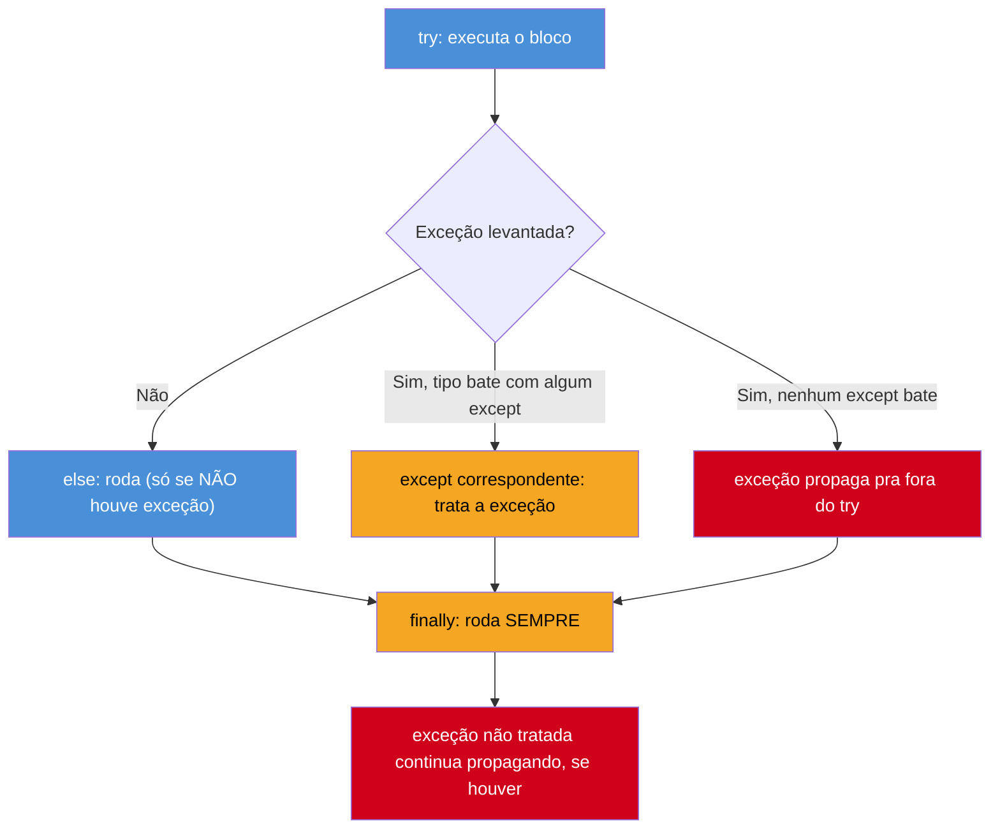
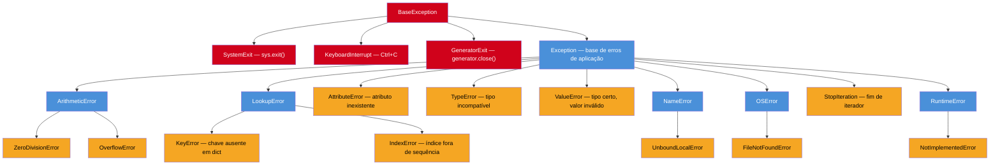

# Erros e exceções

> [!abstract] TL;DR
> Python trata erros com **exceções**, capturadas por `try`/`except`, com dois blocos complementares menos conhecidos: `else` (roda só se **não** houve exceção) e `finally` (roda **sempre**, aconteça o que acontecer). Toda exceção deriva de `BaseException`; quase tudo que o código de aplicação levanta ou captura deriva de `Exception` — o degrau abaixo, reservado a erros "normais" do programa, separado de sinais de controle do interpretador como `SystemExit` e `KeyboardInterrupt`. `raise` levanta uma exceção; `raise` sozinho dentro de um `except` **relança** a mesma exceção preservando o traceback original; `raise ... from ...` encadeia uma causa explícita. Criar exceções customizadas (herdando de `Exception`) é comum e barato em Python. E o traço cultural mais marcante do bloco todo: Python é uma linguagem fortemente **EAFP** ("easier to ask forgiveness than permission") — tentar a operação e capturar a exceção é o idioma preferido, não um teto de segurança; **LBYL** ("look before you leap"), o estilo checar-antes que domina linguagens como Java, é considerado menos idiomático aqui, e em certos casos (race conditions entre o check e o uso) é literalmente menos correto.

## O bug que abre esta nota

Uma desenvolvedora migrando de Java está escrevendo uma função que busca a configuração de um usuário num dicionário. Em Java, ela aprendeu a **checar antes de agir** — `containsKey` antes de `get`, `try/catch` reservado para os `checked exceptions` que o compilador obriga a declarar (`IOException`, `SQLException`) ou para erros de fato excepcionais:

```java
// Java: LBYL — checa a existência da chave antes de acessar
if (configuracoes.containsKey("timeout")) {
    int timeout = configuracoes.get("timeout");
    conectar(timeout);
} else {
    conectar(TIMEOUT_PADRAO);
}
```

Ela traduz o mesmo padrão para Python, linha a linha:

```python
# Tentativa "traduzida" de Java — funciona, mas soa estranho em Python
if "timeout" in configuracoes:
    timeout = configuracoes["timeout"]
    conectar(timeout)
else:
    conectar(TIMEOUT_PADRAO)
```

O código funciona. Não há bug de execução aqui — é um "bug" de idioma. Um revisor familiarizado com Python provavelmente pediria a reescrita:

```python
# EAFP — tenta acessar, captura a ausência
try:
    timeout = configuracoes["timeout"]
except KeyError:
    timeout = TIMEOUT_PADRAO
else:
    conectar(timeout)
```

Ou, para esse caso específico, algo ainda mais direto usando `dict.get`:

```python
conectar(configuracoes.get("timeout", TIMEOUT_PADRAO))
```

Por que a comunidade Python prefere a segunda forma a uma checagem explícita? A resposta não é estética — é uma combinação de **legibilidade** (o "caminho feliz" fica na frente, sem cercas condicionais), **correção sob concorrência** (checar e depois agir são duas operações separadas; entre elas, outra thread pode mudar o dicionário — um `TOCTOU`, *time-of-check to time-of-use*) e **desempenho** (a máquina virtual do CPython foi otimizada para que um `try` sem exceção seja quase de graça, enquanto uma checagem condicional roda incondicionalmente toda vez). Esta nota dissseca cada peça do mecanismo de exceções — `try`/`except`/`else`/`finally`, a hierarquia de tipos, `raise`, exceções customizadas — e fecha explicando por que EAFP é o estilo "de casa" em Python e o que isso implica na prática.

## O que é

Uma **exceção** é um evento que interrompe o fluxo normal de execução — pode representar um erro genuíno (dividir por zero, arquivo inexistente) ou apenas uma condição excepcional que o código sabe tratar (fim de um iterador, chave ausente num dicionário). Em Python, **toda exceção é um objeto**, instância de uma classe que deriva, direta ou indiretamente, de `BaseException`. Quando uma exceção é levantada (`raise`) e nada no caminho de chamadas a captura, o interpretador imprime o *traceback* — a pilha de chamadas até o ponto do erro — e encerra o programa (ou a thread) com um código de saída diferente de zero.

O bloco `try`/`except` é o mecanismo de captura: código que *pode* levantar uma exceção fica dentro de `try`; o tratamento fica em um ou mais blocos `except`, cada um associado a um tipo de exceção (ou tupla de tipos). Dois blocos adicionais, menos usados mas igualmente parte da sintaxe, completam a estrutura: `else` (roda só se o `try` terminou sem exceção) e `finally` (roda sempre, exceção ou não). A próxima seção detalha a ordem e a semântica exata de cada um.

## Por que importa

Tratamento de erro é uma das poucas áreas onde "traduzir literalmente" de outra linguagem para Python produz código que funciona mas soa errado — e às vezes produz bugs sutis de concorrência que só aparecem sob carga. Entender a hierarquia de exceções built-in é pré-requisito para escrever `except` específicos em vez de capturas genéricas demais (que escondem bugs) ou específicas demais (que deixam casos legítimos vazarem). `raise ... from ...` é o que torna um traceback de produção depurável quando uma camada de infraestrutura falha e o código de aplicação precisa traduzir isso para um erro de domínio sem perder a causa raiz. E EAFP não é só estilo: é a lente que explica por que tanta biblioteca padrão do Python devolve exceção em vez de código de erro (`dict[chave]` levanta `KeyError` em vez de devolver `null`/sentinel), e por que capturar `Exception` genérico (ou pior, usar `except:` nu) é considerado um cheiro de código sério o bastante para ter regra de lint dedicada (`E722`).

## Como funciona

### A ordem completa: `try` → `except` → `else` → `finally`

A forma mais completa da estrutura, com todos os blocos presentes:

```python
try:
    resultado = 10 / divisor
except ZeroDivisionError:
    print("Não é possível dividir por zero.")
except TypeError:
    print("Divisor precisa ser um número.")
else:
    print(f"Divisão bem-sucedida: {resultado}")
finally:
    print("Bloco try/except encerrado.")
```



O papel de cada bloco:

- **`try`** — o único obrigatório. Contém o código que pode levantar exceção. Deve ficar o mais **enxuto possível**: envolver mais código do que o necessário aumenta a chance de capturar (por engano) uma exceção que não tinha nada a ver com o que se pretendia tratar.
- **`except`** — um ou mais blocos, cada um associado a um tipo de exceção (ou tupla `except (TipoA, TipoB):`). Só o **primeiro** `except` cujo tipo bate com a exceção levantada (ou é superclasse dela) executa — a ordem importa, tipos mais específicos devem vir antes dos mais genéricos.
- **`else`** — **opcional**, roda **somente se o bloco `try` terminou sem levantar exceção nenhuma**. A diferença entre colocar código dentro do `try` ou dentro do `else` é sutil mas importante: código no `else` **não** está sob a proteção dos `except` daquele `try` — se ele levantar uma exceção do mesmo tipo capturado acima, ela **não** será capturada ali, vai propagar. Isso torna explícito o que faz parte da operação "arriscada" (dentro do `try`) e o que é consequência de ter dado certo (dentro do `else`).
- **`finally`** — **opcional**, roda **sempre**: com ou sem exceção, e mesmo se a exceção não foi tratada por nenhum `except` (nesse caso, o `finally` roda e a exceção continua propagando depois). É o lugar canônico para liberar recursos (fechar arquivo, conexão, lock) que precisam ser fechados independentemente do resultado.

> [!question]- Por que separar `else` do resto do `try`, já que ele só roda quando não houve erro mesmo?
> Porque `try` sem `else` deixa ambíguo qual código é a operação arriscada e qual é a continuação que só faz sentido se ela deu certo. Considere:
> ```python
> # Sem else — ambíguo
> try:
>     conexao = abrir_conexao()
>     dados = conexao.buscar_dados()   # se isso falhar, o except abaixo captura,
>                                        # mesmo não sendo o que se queria proteger
> except ConexaoError:
>     print("Falha ao conectar")
> ```
> ```python
> # Com else — claro
> try:
>     conexao = abrir_conexao()        # só isso está sob risco de ConexaoError
> except ConexaoError:
>     print("Falha ao conectar")
> else:
>     dados = conexao.buscar_dados()   # roda só se conectou; erro aqui NÃO vira "falha ao conectar"
> ```
> A [documentação oficial](https://docs.python.org/3/tutorial/errors.html) recomenda `else` exatamente por essa razão: "the use of the `else` clause is better than adding additional code to the `try` clause because it avoids accidentally catching an exception that wasn't raised by the code being protected by the `try` … `except` statement."

Segundo o próprio [tutorial de erros e exceções do Python](https://docs.python.org/3/tutorial/errors.html), se um `finally` chega a um `break`, `continue` ou `return`, ele executa **antes** dessas instruções tomarem efeito — e, a partir do Python 3.14, o compilador emite um `SyntaxWarning` quando `finally` contém `return`/`break`/`continue` que "engolem" uma exceção pendente sem relançá-la, justamente porque esse padrão costuma esconder bugs (a exceção original desaparece silenciosamente, substituída pelo valor de retorno do `finally`).

> [!warning] `finally` pode mascarar uma exceção
> Se o bloco `finally` tiver seu próprio `return` (ou `break`/`continue` dentro de um loop), ele **sobrescreve** qualquer exceção que estivesse propagando do `try`/`except` — a exceção original é descartada silenciosamente, sem traceback, sem aviso. É um dos bugs mais difíceis de rastrear em código Python, porque não há erro nenhum na tela: só um comportamento "estranho" onde uma falha esperada simplesmente não acontece.
> ```python
> def buscar(id):
>     try:
>         return banco.get(id)       # levanta ConexaoError
>     finally:
>         return None                # engole a ConexaoError — NUNCA faça isso
> ```

### Múltiplos `except` e captura de mais de um tipo

Quando tipos diferentes de exceção pedem tratamentos diferentes, cada um ganha seu próprio `except`, avaliados na ordem em que aparecem:

```python
try:
    valor = int(entrada_usuario)
    resultado = 100 / valor
except ValueError:
    print("Entrada não é um número válido.")
except ZeroDivisionError:
    print("Não é possível dividir por zero.")
```

Quando o tratamento é o mesmo para vários tipos, uma tupla agrupa os tipos num único `except`:

```python
try:
    processar(dados)
except (ValueError, TypeError, KeyError) as erro:
    print(f"Erro de dados: {erro}")
```

A cláusula `as nome` vincula a instância da exceção capturada a uma variável — útil para inspecionar a mensagem (`str(erro)`), o tipo (`type(erro)`), ou repassar a informação para um log estruturado.

### A hierarquia de exceções built-in

Todas as exceções em Python descem de `BaseException`. O nível logo abaixo dela se divide em dois grupos com propósitos bem diferentes: `Exception` (a base de praticamente todo erro "normal" de programa, a que a documentação recomenda herdar) e um punhado de exceções que representam **sinais de controle do próprio interpretador**, não erros de aplicação — `SystemExit`, `KeyboardInterrupt`, `GeneratorExit` — deliberadamente colocadas **fora** de `Exception` para não serem capturadas sem querer por um `except Exception` genérico.



(Árvore simplificada — a [hierarquia completa](https://docs.python.org/3/library/exceptions.html) tem mais de 60 classes, incluindo `Warning` e suas subclasses, que não são erros mas avisos.)

Os tipos mais comuns no dia a dia, e quando cada um é levantado:

| Exceção | Quando é levantada |
|---|---|
| `ValueError` | O tipo do argumento está certo, mas o **valor** é inapropriado — `int("abc")` (string com o tipo certo, mas conteúdo que não vira número). |
| `TypeError` | Uma operação recebe um objeto de **tipo** incompatível — `len(42)`, `"a" + 1`. |
| `KeyError` | Uma chave não existe num mapeamento (`dict`) — `{"a": 1}["b"]`. |
| `IndexError` | Um índice está fora do intervalo válido de uma sequência — `[1, 2, 3][10]`. |
| `AttributeError` | Um atributo ou método não existe no objeto — `"texto".metodo_inexistente()`. |
| `ZeroDivisionError` | O divisor de uma divisão ou módulo é zero — `10 / 0`. |
| `FileNotFoundError` | Um arquivo ou diretório solicitado não existe (subclasse de `OSError`). |
| `StopIteration` | Um iterador não tem mais itens — levantada internamente por `next()`; o `for` a captura automaticamente e é o motivo de o `for` conseguir parar sem erro visível. |
| `NotImplementedError` | Uma classe abstrata (ou método que deveria ser sobrescrito) foi chamada sem implementação concreta. |

`ValueError` vs `TypeError` é a distinção mais comum de errar: segundo a [documentação oficial](https://docs.python.org/3/library/exceptions.html), "passing arguments of the wrong type … should result in a `TypeError`, but passing arguments with the wrong value … should result in a `ValueError`". `int([1, 2])` (uma lista, tipo errado) é `TypeError`; `int("não é número")` (uma string, tipo certo, valor inválido) é `ValueError`.

> [!question]- Por que `SystemExit` e `KeyboardInterrupt` herdam de `BaseException` e não de `Exception`?
> Justamente para que um `except Exception:` genérico **não** os capture sem querer. Segundo a documentação, `KeyboardInterrupt` "inherits from `BaseException` so as to not be accidentally caught by code that catches `Exception` and thus prevent the interpreter from exiting" — a mesma lógica vale para `SystemExit`, levantada por `sys.exit()`. Se essas duas exceções herdassem de `Exception`, qualquer `try: ... except Exception: passa` espalhado pelo código (um padrão comum, ainda que questionável) bloquearia silenciosamente o `Ctrl+C` do usuário e o `sys.exit()` de qualquer biblioteca — um programa que se recusa a fechar é pior do que um programa que fecha rápido demais.

> [!warning] `except:` nu (sem tipo) captura TUDO — inclusive `KeyboardInterrupt`
> Um `except:` sem tipo nenhum é equivalente a `except BaseException:` — ele captura **literalmente qualquer coisa**, incluindo `KeyboardInterrupt` (o `Ctrl+C` do usuário) e `SystemExit` (o `sys.exit()` de qualquer parte do programa). Isso torna o programa impossível de interromper pelo teclado e pode mascarar bugs sérios (um `MemoryError`, uma corrupção de estado). O [PEP 8](https://peps.python.org/pep-0008/) e a regra de lint `E722` (flake8/ruff) proíbem esse padrão explicitamente: "A bare `except:` clause will catch `SystemExit` and `KeyboardInterrupt` exceptions, making it harder to interrupt a program with Control-C, and can disguise other problems. If you want to catch all exceptions that signal program errors, use `except Exception:`" — que já é bem mais seguro (não pega os sinais de controle), mas ainda deve ser reservado para casos onde de fato não há como prever o tipo (ex.: um wrapper genérico de log de erros no topo da aplicação).
> ```python
> try:
>     operacao_arriscada()
> except:                    # NUNCA — captura Ctrl+C, SystemExit, tudo
>     pass
>
> try:
>     operacao_arriscada()
> except Exception:          # aceitável em casos legítimos (handler de topo, log)
>     logger.exception("Falha inesperada")
> ```

### `raise`: levantando exceções

`raise` levanta uma exceção explicitamente — seguido de uma instância (ou classe, que Python instancia implicitamente sem argumentos):

```python
raise ValueError("idade não pode ser negativa")

# Equivalente a instanciar sem argumentos:
raise ValueError
```

Uma verificação de pré-condição típica combina `if` com `raise`, formalizando um contrato de função — a diferença para uma checagem LBYL "de fora" é que aqui a própria função se recusa a operar sobre um estado inválido, em vez de o chamador precisar adivinhar:

```python
def calcular_idade(ano_nascimento, ano_atual):
    if ano_nascimento > ano_atual:
        raise ValueError(
            f"ano de nascimento ({ano_nascimento}) não pode ser "
            f"posterior ao ano atual ({ano_atual})"
        )
    return ano_atual - ano_nascimento
```

### Re-raise: `raise` sozinho preserva o traceback

Dentro de um bloco `except`, `raise` **sem nada depois** relança a exceção que acabou de ser capturada — mantendo o traceback original intacto, como se o `except` nunca tivesse interceptado nada:

```python
def processar_pedido(pedido):
    try:
        validar(pedido)
    except ValueError:
        logger.warning(f"Pedido inválido: {pedido.id}")
        raise   # relança a MESMA ValueError, com o traceback original completo
```

Esse padrão — logar (ou fazer alguma limpeza) e relançar — é comum quando uma camada intermediária precisa **observar** o erro sem decidir como tratá-lo; a decisão fica para uma camada mais alta, mais próxima de onde há contexto suficiente para agir. A diferença crítica entre `raise` sozinho e `raise erro` (relançando a variável capturada por nome) é que o segundo **reseta** parte da informação de traceback em algumas versões do interpretador — a forma idiomática e mais segura é sempre `raise` sozinho quando a intenção é relançar exatamente o que foi pego.

### `raise ... from ...`: encadeando causas

Quando uma exceção é levantada **dentro** de um bloco `except`, Python automaticamente anexa a exceção original como contexto (`__context__`) — o traceback final mostra as duas, com a mensagem "During handling of the above exception, another exception occurred". Isso já acontece de graça:

```python
try:
    conexao = abrir_conexao_banco()
except OSError:
    raise RuntimeError("não foi possível inicializar o serviço")
    # traceback mostra a OSError original E a RuntimeError, encadeadas automaticamente
```

`raise ... from ...` torna esse encadeamento **explícito e intencional**, definindo qual exceção é a causa direta (atributo `__cause__`) de qual:

```python
try:
    resposta = api_externa.buscar(id)
except ConnectionError as erro_original:
    raise ServicoIndisponivelError(
        f"não foi possível buscar o recurso {id}"
    ) from erro_original
```

O traceback resultante deixa claro que `ServicoIndisponivelError` não surgiu do nada — foi uma tradução deliberada de um `ConnectionError` de infraestrutura para um erro de domínio da aplicação, sem perder a causa raiz que um time de plantão precisaria para diagnosticar o problema real.

Para o caso oposto — suprimir deliberadamente o encadeamento, quando a causa original é irrelevante ou até confusa para quem for ler o traceback — existe `from None`:

```python
try:
    valor = cache[chave]
except KeyError:
    raise ChaveNaoEncontradaError(chave) from None
    # traceback mostra só ChaveNaoEncontradaError, sem o "During handling..." do KeyError
```

> [!question]- Qual a diferença prática entre deixar o encadeamento automático e usar `from` explícito?
> O encadeamento automático (`__context__`) já aparece no traceback mesmo sem `from` — a diferença de usar `raise ... from erro` é semântica e de API: `from` define `__cause__`, que ferramentas de log estruturado e frameworks de observabilidade tratam como "a causa oficial", enquanto `__context__` é tratado como "aconteceu que outra exceção também estava rolando" (mais fraco, mais incidental). Em código de produção que atravessa camadas — infraestrutura → domínio → apresentação — `from` explícito é o que permite reconstruir a cadeia de causalidade completa num sistema de rastreamento de erros (Sentry, Datadog) sem depender de heurística.

### Exceções customizadas

Criar uma exceção própria é barato: basta herdar de `Exception` (ou de uma exceção built-in mais específica, quando o erro é de fato um caso especial de algo que já existe):

```python
class SaldoInsuficienteError(Exception):
    """Levantada quando uma operação excede o saldo disponível."""
    pass


class ContaBancaria:
    def __init__(self, saldo=0):
        self.saldo = saldo

    def sacar(self, valor):
        if valor > self.saldo:
            raise SaldoInsuficienteError(
                f"saldo de {self.saldo} insuficiente para sacar {valor}"
            )
        self.saldo -= valor
```

Uma exceção customizada pode carregar atributos extras além da mensagem — útil quando o código que captura precisa de dados estruturados, não só texto:

```python
class SaldoInsuficienteError(Exception):
    def __init__(self, saldo_disponivel, valor_solicitado):
        self.saldo_disponivel = saldo_disponivel
        self.valor_solicitado = valor_solicitado
        super().__init__(
            f"saldo de {saldo_disponivel} insuficiente para sacar {valor_solicitado}"
        )

try:
    conta.sacar(500)
except SaldoInsuficienteError as erro:
    print(f"Faltam {erro.valor_solicitado - erro.saldo_disponivel}")
```

Quando vale a pena criar uma **hierarquia** própria de exceções (em vez de uma classe solta): quando uma biblioteca ou módulo tem várias condições de erro relacionadas e quem consome o código pode querer capturar "qualquer erro deste domínio" de uma vez, sem enumerar cada subtipo:

```python
class ErroDePagamento(Exception):
    """Base para todos os erros do módulo de pagamento."""

class SaldoInsuficienteError(ErroDePagamento):
    pass

class CartaoExpiradoError(ErroDePagamento):
    pass

class GatewayIndisponivelError(ErroDePagamento):
    pass

# Quem consome pode ser específico...
try:
    processar_pagamento(pedido)
except CartaoExpiradoError:
    pedir_novo_cartao()

# ...ou genérico, capturando qualquer erro da família de uma vez
try:
    processar_pagamento(pedido)
except ErroDePagamento as erro:
    logger.error(f"Pagamento falhou: {erro}")
    notificar_usuario(erro)
```

Esse padrão — uma exceção base de módulo/pacote da qual todas as outras herdam — é praticamente universal em bibliotecas Python maduras: `requests` tem `RequestException` como base de `ConnectionError`, `Timeout`, `HTTPError`; SQLAlchemy tem `SQLAlchemyError`. Vale conhecer o padrão mesmo antes de precisar dele, porque reconhecer `except requests.exceptions.RequestException` numa base de código alheia já diz, de cara, "isso captura qualquer coisa que deu errado na requisição, sem especificar qual".

## EAFP vs LBYL

Chegamos ao ponto cultural mais importante desta nota. Python tem, na prática, dois estilos possíveis para lidar com uma operação que pode falhar:

- **LBYL** (*Look Before You Leap* — olhe antes de saltar): checar explicitamente as pré-condições antes de agir, normalmente com `if`.
- **EAFP** (*Easier to Ask Forgiveness than Permission* — mais fácil pedir perdão do que permissão): assumir que a operação vai funcionar, tentar, e capturar a exceção se não funcionar.

```python
# LBYL — checa antes
if "chave" in dicionario:
    valor = dicionario["chave"]
else:
    valor = valor_padrao

# EAFP — tenta e trata a falha
try:
    valor = dicionario["chave"]
except KeyError:
    valor = valor_padrao
```

O [glossário oficial do Python](https://docs.python.org/3/glossary.html) define EAFP como um "estilo de programação comum em Python que assume a existência de chaves ou atributos válidos e captura uma exceção se essa suposição se provar falsa" — descrevendo o estilo oposto, LBYL, como aquele "caracterizado pela presença de muitos statements `if`". A observação não é neutra: o próprio texto da documentação central da linguagem já denuncia qual estilo é considerado nativo.

Java, C#, e a maioria das linguagens com *checked exceptions* (o compilador obriga a declarar e tratar certas exceções) tendem para LBYL como padrão cultural — não por acaso: quando o compilador cobra explicitamente pelo tratamento de exceções, o custo de "levantar e capturar" fica mais visível no código-fonte (assinaturas de método carregando `throws IOException`), e checagens condicionais parecem mais baratas de escrever. Em Python, sem checked exceptions e com uma sintaxe de `try`/`except` leve, o cálculo se inverte.

### Por que EAFP, e não só "porque sim"

**1. Legibilidade — o caminho feliz fica na frente.** Segundo a [Real Python](https://realpython.com/python-lbyl-vs-eafp/), a versão EAFP "comunica melhor a intenção": a versão LBYL sugere que a presença da chave é o caso excepcional; a versão EAFP sugere que, normalmente, a chave existe, e o `except` é só o desvio. Em funções com várias pré-condições encadeadas, LBYL tende a empilhar `if`s aninhados que enterram a lógica de negócio real no meio de cercas defensivas; EAFP mantém o corpo principal linear e delega o tratamento de exceção para o fim.

**2. Correção sob concorrência — evita TOCTOU.** Um problema que LBYL introduz e EAFP evita por construção: entre o **check** ("a chave existe?") e o **use** ("acessa a chave"), outra thread, processo, ou mesmo uma chamada de rede pode alterar o estado verificado. Esse padrão de bug tem nome — *time-of-check to time-of-use* (TOCTOU) — e é uma classe real de vulnerabilidade em sistemas concorrentes, não só uma preocupação teórica: checar se um arquivo existe e depois abri-lo (`os.path.exists()` seguido de `open()`) tem uma janela onde outro processo pode apagar o arquivo entre as duas chamadas. A versão EAFP (`try: open(caminho) except FileNotFoundError:`) não tem essa janela, porque a checagem e o uso são **a mesma operação atômica**.

**3. Desempenho — `try` sem exceção é quase de graça no CPython.** Este é o ponto que mais surpreende quem vem de linguagens onde lançar/capturar exceção é caro (a JVM, por exemplo, tem overhead real de construção de stack trace em cada `throw`). No CPython, entrar num bloco `try` que **não** levanta exceção tem custo desprezível — a máquina virtual monta a tabela de tratamento de exceção em tempo de compilação, sem trabalho extra em tempo de execução até uma exceção de fato ser levantada. Uma checagem `if` condicional, por outro lado, roda **toda vez**, mesmo no caminho feliz. A implicação prática: em um laço que processa milhões de itens onde a chave costuma existir e a ausência é rara, EAFP tende a ser mais rápido que LBYL — o custo de levantar a exceção só é pago nos casos raros em que ela de fato acontece.

> [!question]- Isso significa que try/except é sempre mais rápido que if?
> Não — só quando a exceção é **rara** no caminho de execução real. Se a "exceção" vai acontecer na maioria das chamadas (por exemplo, um dicionário onde a chave costuma **não** existir), o custo de efetivamente levantar e capturar a exceção passa a pesar, e um `if` LBYL (ou `dict.get()`, que evita ambos os overheads) pode ser mais rápido. A regra prática: EAFP quando o caso de sucesso é o comum e a exceção é o desvio raro; reavaliar quando a exceção vira o caminho frequente.

### Quando LBYL ainda faz sentido

EAFP é o idioma dominante, não uma regra absoluta. LBYL continua apropriado quando:

- **A checagem evita efeitos colaterais indesejados de uma operação cara ou destrutiva** — por exemplo, confirmar que um usuário tem permissão antes de iniciar uma transação bancária, em vez de iniciar e reverter em caso de erro.
- **O `try` precisaria envolver muito código para capturar uma exceção que só pode vir de uma linha específica** — nesse caso, um `if` isolando só a pré-condição relevante é mais claro do que um `try` genérico demais, que corre o risco de capturar (por acidente) uma exceção do mesmo tipo vinda de outro lugar dentro do bloco.
- **A pré-condição é barata de checar e a exceção correspondente seria cara de montar** (tracebacks profundos, contexto grande).

A [Microsoft Python DevBlog](https://devblogs.microsoft.com/python/idiomatic-python-eafp-versus-lbyl/) resume esse equilíbrio: LBYL não está errado — é preciso manter os blocos `try` **estreitos**, porque envolver código demais arrisca suprimir exceções que não eram a intenção original de capturar.

## Na prática

Reescrevendo o exemplo de abertura da nota — busca de configuração — comparando as três formas possíveis lado a lado, do menos ao mais idiomático:

```python
# 1. LBYL puro — funciona, mas soa "traduzido" de outra linguagem
if "timeout" in configuracoes:
    timeout = configuracoes["timeout"]
else:
    timeout = TIMEOUT_PADRAO

# 2. EAFP com try/except — idiomático, útil quando o tratamento é mais complexo
# que um valor padrão simples (ex.: logar, levantar outra exceção, etc.)
try:
    timeout = configuracoes["timeout"]
except KeyError:
    timeout = TIMEOUT_PADRAO

# 3. dict.get() — o mais idiomático para o caso simples "valor padrão se ausente"
timeout = configuracoes.get("timeout", TIMEOUT_PADRAO)
```

Um segundo exemplo, mais completo, exercitando `try`/`except`/`else`/`finally` juntos, `raise ... from ...`, e uma exceção customizada — a função abre um arquivo de configuração, faz o parse, e traduz qualquer falha de infraestrutura para um erro de domínio, preservando a causa original:

```python
import json


class ConfiguracaoInvalidaError(Exception):
    """Levantada quando o arquivo de configuração não pode ser carregado ou é inválido."""


def carregar_configuracao(caminho):
    try:
        arquivo = open(caminho, "r", encoding="utf-8")
    except FileNotFoundError as erro:
        raise ConfiguracaoInvalidaError(
            f"arquivo de configuração não encontrado: {caminho}"
        ) from erro
    else:
        # só chega aqui se o open() teve sucesso — a abertura do arquivo
        # é o único trecho protegido pelo except acima
        try:
            conteudo = arquivo.read()
        finally:
            arquivo.close()   # fecha o arquivo sempre, mesmo se .read() falhar

    try:
        return json.loads(conteudo)
    except json.JSONDecodeError as erro:
        raise ConfiguracaoInvalidaError(
            f"arquivo de configuração {caminho} não é um JSON válido"
        ) from erro


try:
    config = carregar_configuracao("config.json")
except ConfiguracaoInvalidaError as erro:
    print(f"Erro: {erro}")
    print(f"Causa original: {erro.__cause__}")
```

(Na prática moderna, `open()` num gerenciador de contexto — `with open(caminho) as arquivo:` — substitui o `try/finally` manual de fechar o arquivo; context managers são assunto do Galho 4, mas vale registrar que o padrão manual acima é exatamente o que `with` automatiza por baixo dos panos.)

## Armadilhas

### (1) `except:` nu capturando `KeyboardInterrupt`/`SystemExit`

Já detalhado no `[!warning]` acima — nunca usar `except:` sem tipo. `except Exception:` é o piso mínimo aceitável quando de fato é preciso capturar "qualquer erro de aplicação".

### (2) Bloco `try` grande demais

Quanto mais código dentro de `try`, maior o risco de capturar (por acidente) uma exceção do mesmo tipo vinda de uma linha diferente da que se pretendia proteger. Um `except ValueError` pensado para `int(entrada)` pode acabar engolindo silenciosamente um `ValueError` completamente diferente, levantado três linhas abaixo por outra função.

### (3) Ordem errada de `except` (genérico antes de específico)

```python
try:
    processar(dados)
except Exception:         # captura TUDO aqui — o except abaixo nunca roda
    print("erro genérico")
except ValueError:         # código morto — Exception já capturou antes
    print("erro específico")
```

Python testa os `except` na ordem em que aparecem e para no primeiro que bate — um `except Exception` antes de um `except ValueError` torna o segundo inalcançável. A ordem correta é sempre do mais específico para o mais genérico.

### (4) Confundir `raise` com `raise erro_capturado`

Dentro de um `except Tipo as erro:`, `raise` sozinho relança a exceção original intacta; `raise erro` relança a mesma instância, mas pode alterar o traceback reportado dependendo do contexto — a forma idiomática para "relançar exatamente o que foi pego" é sempre `raise` sozinho, sem argumento.

### (5) `finally` com `return` engolindo exceção

Já coberto no `[!warning]` da seção `try/except/else/finally` — um `return` dentro de `finally` sobrescreve silenciosamente qualquer exceção pendente do `try`/`except`. Evite `return`, `break` ou `continue` dentro de `finally`.

### (6) Criar exceção customizada sem informação útil

```python
class ErroGenerico(Exception):
    pass

raise ErroGenerico()   # sem mensagem, sem contexto — inútil pra debugar depois
```

Toda exceção customizada deveria carregar, no mínimo, uma mensagem descritiva no `__init__` (via `super().__init__(mensagem)`), e idealmente os dados estruturados relevantes (IDs, valores) como atributos — não só texto solto.

## Em entrevista

Perguntas previsíveis sobre este tópico:

- **"Explique a ordem de execução de `try`/`except`/`else`/`finally`."** `try` roda primeiro; se levanta exceção que bate com algum `except`, esse `except` roda; se não levanta exceção nenhuma, `else` roda; `finally` roda sempre, por último, independente do que aconteceu antes — inclusive se a exceção não foi tratada por nenhum `except` (nesse caso, `finally` roda e a exceção continua propagando depois).
- **"Qual a diferença entre `Exception` e `BaseException`?"** `BaseException` é a raiz de toda a hierarquia; `Exception` é uma subclasse dela que agrupa os erros "normais" de aplicação. `SystemExit`, `KeyboardInterrupt` e `GeneratorExit` herdam diretamente de `BaseException`, não de `Exception`, justamente para não serem capturados por acidente por um `except Exception:` genérico. Exceções customizadas devem sempre herdar de `Exception` (ou de uma subclasse dela), nunca diretamente de `BaseException`.
- **"O que `raise` sozinho faz dentro de um `except`?"** Relança a exceção que acabou de ser capturada, preservando o traceback original — usado quando uma camada quer observar/logar o erro sem decidir seu tratamento final.
- **"Para que serve `raise ... from ...`?"** Encadeia explicitamente uma exceção nova a uma causa (define `__cause__`), preservando no traceback a exceção original que motivou a nova — comum ao traduzir um erro de infraestrutura (`ConnectionError`) para um erro de domínio da aplicação.
- **"O que é EAFP e por que Python prefere esse estilo a LBYL?"** EAFP ("easier to ask forgiveness than permission") é tentar a operação e tratar a exceção se ela falhar, em vez de checar pré-condições antes (LBYL, "look before you leap"). Python prefere EAFP por legibilidade (caminho feliz sem cercas condicionais), correção sob concorrência (evita bugs de TOCTOU entre checar e usar) e desempenho (um `try` sem exceção tem overhead desprezível no CPython, enquanto um `if` roda toda vez).
- **"Por que `except:` nu (sem tipo) é considerado má prática?"** Porque é equivalente a `except BaseException:` — captura literalmente tudo, incluindo `KeyboardInterrupt` (Ctrl+C) e `SystemExit`, tornando o programa difícil de interromper e escondendo bugs sérios. PEP 8 recomenda `except Exception:` como piso mínimo quando é preciso capturar "qualquer coisa".
- **"Qual a diferença entre `ValueError` e `TypeError`?"** `TypeError` é para tipo incompatível (passar uma lista onde se espera um `int`); `ValueError` é para tipo certo mas valor inválido (passar uma string não numérica para `int()`).

### How to explain in English

> Python handles errors with exceptions caught via `try`/`except`, plus two less-obvious clauses: `else` (runs only if the `try` block raised nothing) and `finally` (always runs, no matter what). Every exception derives from `BaseException`; application-level exceptions should derive from `Exception`, one level down — deliberately separated from interpreter control signals like `SystemExit` and `KeyboardInterrupt`, which sit outside `Exception` precisely so a broad `except Exception:` won't swallow them by accident. `raise` on its own inside an `except` re-raises the caught exception with its original traceback intact; `raise ... from ...` chains an explicit cause when translating a lower-level error into a domain-specific one. Custom exceptions are cheap to define — just subclass `Exception`. The biggest cultural point: Python is strongly EAFP ("easier to ask forgiveness than permission") — attempting the operation and catching the exception is the idiomatic default, not a last resort — unlike Java and other languages with checked exceptions, which lean LBYL ("look before you leap") by convention. EAFP wins on readability (the happy path stays unindented), correctness under concurrency (it avoids time-of-check-to-time-of-use bugs), and performance (CPython's `try` block has near-zero overhead when no exception is actually raised, unlike a condition that's evaluated on every call).

| Termo PT | Termo EN |
|---|---|
| exceção | exception |
| levantar (uma exceção) | to raise (an exception) |
| capturar (uma exceção) | to catch / to handle (an exception) |
| relançar | to re-raise |
| encadear (causas) | to chain (exceptions) |
| exceção customizada | custom exception |
| hierarquia de exceções | exception hierarchy |
| rastro de pilha / traceback | traceback |
| bloco `try` | try block |
| bloco de tratamento | handler / except clause |
| exceção nua (sem tipo) | bare except |
| pedir perdão em vez de permissão | ask forgiveness, not permission (EAFP) |
| olhar antes de saltar | look before you leap (LBYL) |
| condição de corrida entre checagem e uso | time-of-check to time-of-use (TOCTOU) |

## O que vem a seguir

Erros tratados, o galho fecha com o sistema de organização de código em si: a [[09 - Módulos e imports|nota 09]] — capstone do galho Core — cobre como Python importa módulos e pacotes, a diferença entre imports absolutos e relativos, e o idioma `if __name__ == "__main__":` que toda base de código Python usa para distinguir "executado diretamente" de "importado por outro módulo".

## Veja também

- [[03-Dominios/Tecnologia/Python/Core/02 - Tipos e variáveis|02 — Tipos e variáveis]] — `None`, `is` vs `==`, base para entender comparações de tipo em `except`
- [[03-Dominios/Tecnologia/Python/Core/06 - Funções — definição, argumentos e escopo básico|06 — Funções]] — funções como objetos de primeira classe, base para entender exceções como objetos
- [[03-Dominios/Tecnologia/Python/Funcional e idiomas avançados/index|Funcional e idiomas avançados]] — Galho 4: context managers (`with`), que automatizam o padrão `try/finally` de liberar recursos
- [[03-Dominios/Tecnologia/Python/Core/index|Core]] — MOC do galho
- [[03-Dominios/Tecnologia/Python/index|Trilha Python]]

## Fontes

- Python Software Foundation. *8. Errors and Exceptions — The Python Tutorial*. docs.python.org, versão 3.14. https://docs.python.org/3/tutorial/errors.html (acessado em 2026-07-09)
- Python Software Foundation. *Built-in Exceptions*. docs.python.org, versão 3.14. https://docs.python.org/3/library/exceptions.html (acessado em 2026-07-09)
- Python Software Foundation. *Glossary — EAFP*. docs.python.org. https://docs.python.org/3/glossary.html (acessado em 2026-07-09)
- Real Python. *LBYL vs EAFP: Preventing or Handling Errors in Python*. https://realpython.com/python-lbyl-vs-eafp/ (acessado em 2026-07-09)
- Real Python. *Python Exceptions: An Introduction*. https://realpython.com/python-exceptions/ (acessado em 2026-07-09)
- Real Python. *Python's raise: Effectively Raising Exceptions in Your Code*. https://realpython.com/python-raise-exception/ (acessado em 2026-07-09)
- Microsoft Python DevBlog. *Idiomatic Python: EAFP versus LBYL*. https://devblogs.microsoft.com/python/idiomatic-python-eafp-versus-lbyl/ (acessado em 2026-07-09)
- van Rossum, G.; et al. *PEP 8 — Style Guide for Python Code* (seção sobre `except:` nu). peps.python.org. https://peps.python.org/pep-0008/ (acessado em 2026-07-09)
- Python Morsels. *Catching all exceptions*. https://www.pythonmorsels.com/catching-all-exceptions/ (acessado em 2026-07-09)
- Ramalho, L. *Fluent Python*, 2ª ed. — Capítulo sobre tratamento de erros e o modelo de dados de exceções. O'Reilly Media.
