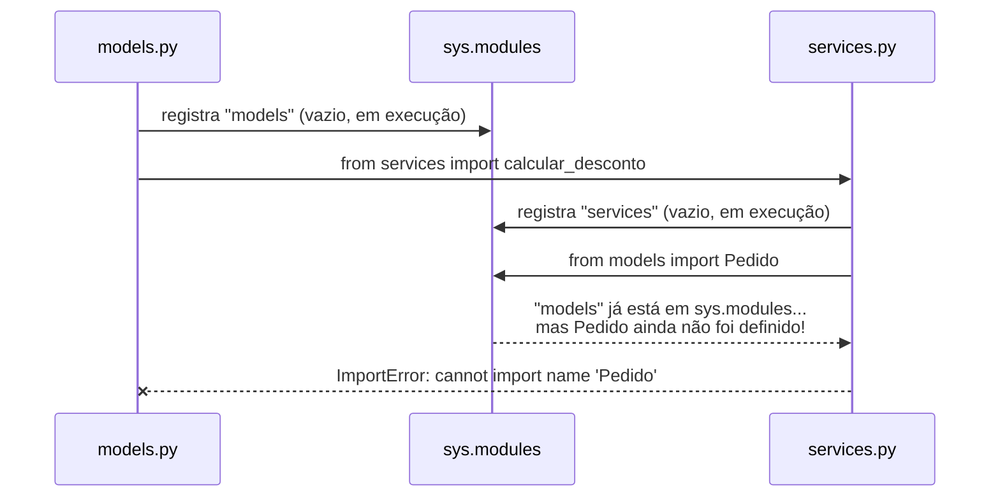
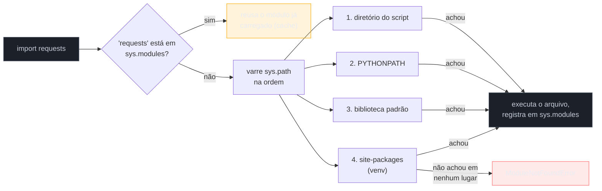

# Módulos e imports

> [!abstract] TL;DR
> Em Python, **qualquer arquivo `.py` já é um módulo** — não existe uma palavra-chave especial para declarar um. `import x` executa `x.py` inteiro (uma única vez, com resultado em cache) e vincula o módulo resultante a um nome; `from x import y` puxa um nome específico de dentro dele. Python encontra módulos varrendo `sys.path`, uma lista de diretórios montada na inicialização — mecanismo mais parecido com a resolução de módulos do Node.js (`node_modules`, caminho relativo ao arquivo) do que com o *classpath* fixo e compilado do Java. Um **pacote** é uma pasta com módulos dentro; desde o Python 3.3 ([PEP 420](https://peps.python.org/pep-0420/)) ela nem precisa de um `__init__.py` para ser reconhecida (*namespace package*) — mas ter esse arquivo continua sendo a forma canônica de declarar um **pacote regular**, com inicialização explícita. O bloco `if __name__ == "__main__":` existe porque **todo módulo tem uma variável `__name__`**, e ela vale `"__main__"` só quando aquele arquivo é o *ponto de entrada* da execução — nunca quando é importado por outro módulo. E **circular imports** — dois módulos que tentam se importar mutuamente — são o erro clássico de quem organiza mal as dependências entre arquivos; esta nota fecha o Galho 1 mostrando como reconhecer e evitar esse problema.

## O bug que abre esta nota

Um time está organizando um projeto Django/FastAPI de tamanho médio. Alguém cria `models.py` (definições de dados) e `services.py` (lógica de negócio que usa esses dados). Parece razoável que `services.py` precise importar algo de `models.py`:

```python
# models.py
from services import calcular_desconto  # models "empresta" uma função de services

class Pedido:
    def total_com_desconto(self):
        return calcular_desconto(self.total)
```

```python
# services.py
from models import Pedido  # services também precisa do tipo Pedido

def calcular_desconto(valor):
    return valor * 0.9

def processar(pedido: Pedido):
    ...
```

Ao rodar `python models.py` (ou importar `models` de qualquer outro lugar), o time recebe:

```
ImportError: cannot import name 'calcular_desconto' from partially initialized module 'services' (most likely due to a circular import)
```

A mensagem é literal: **"partially initialized module"**. Não é um erro de digitação nem de `PYTHONPATH` mal configurado — é a consequência direta de como o Python executa um módulo na primeira vez que ele é importado. Quando `models.py` começa a rodar e chega em `from services import calcular_desconto`, o Python vai buscar `services.py` — mas `services.py` começa executando `from models import Pedido`, e `models` **já está no meio da própria execução**, registrado no cache de módulos como "em andamento", mas ainda sem o nome `Pedido` definido (a classe só é criada mais abaixo no arquivo). O Python não espera `models.py` terminar; ele olha o módulo parcialmente pronto, não encontra `Pedido` ainda, e explode.

Esse é o erro mais comum e mais mal-entendido de quem começa a organizar um projeto Python em múltiplos arquivos — e é o ponto de partida perfeito pra entender, de baixo pra cima, como o sistema de import realmente funciona: o que é um módulo, como o Python encontra e executa um, o que significa "importar", e por que a ordem e a direção das dependências entre arquivos importam tanto quanto a lógica que eles contêm.

## O que é um módulo

Um **módulo**, em Python, é qualquer arquivo `.py` — não existe sintaxe especial de "declarar módulo". O próprio arquivo em que você está digitando `print("olá")` já é um módulo válido, importável por qualquer outro arquivo do mesmo projeto. Segundo a [documentação oficial](https://docs.python.org/3/tutorial/modules.html), *"a module is a file containing Python definitions and statements"* — um jeito de agrupar código relacionado (funções, classes, variáveis) num arquivo com nome próprio, para reuso em outros arquivos sem copiar e colar.

```python
# calculadora.py — este arquivo inteiro é o módulo "calculadora"
PI = 3.14159

def somar(a, b):
    return a + b

def area_circulo(raio):
    return PI * raio ** 2
```

Qualquer outro arquivo no mesmo projeto pode acessar esse conteúdo com `import`:

```python
# main.py
import calculadora

print(calculadora.somar(2, 3))          # 5
print(calculadora.area_circulo(4))      # 50.26544
print(calculadora.PI)                    # 3.14159
```

O nome do módulo (`calculadora`) é o nome do arquivo sem a extensão `.py`. Não existe um "compilador de módulos" separado nem uma etapa de *build* obrigatória — o próprio interpretador lê e executa o arquivo na hora do `import`, produzindo um objeto módulo que fica disponível pelo nome usado no `import`.

> [!question]- Módulo é a mesma coisa que biblioteca ou pacote?
> Não exatamente, embora os três termos apareçam misturados na conversa do dia a dia. **Módulo** é um único arquivo `.py`. **Pacote** é uma pasta contendo módulos (e possivelmente sub-pacotes), tratada como uma unidade importável — cobrimos isso adiante nesta nota. **Biblioteca** (ou *library*) é um termo mais informal, usado pra descrever uma coleção de pacotes/módulos publicada e distribuída como uma unidade instalável — `requests`, `numpy`, `pandas` são "bibliotecas", mas tecnicamente cada uma é implementada como um ou mais pacotes Python.

## Por que importa

Sem um sistema de módulos, todo programa Python de qualquer tamanho real precisaria viver num único arquivo gigante — o que é literalmente inviável a partir de algumas centenas de linhas, e impossível de reusar entre projetos. O sistema de import é o que permite:

- **Organização**: separar um projeto em arquivos com responsabilidade única (`models.py`, `services.py`, `views.py`), em vez de um `main.py` de 5000 linhas.
- **Reuso**: a biblioteca padrão inteira (`os`, `json`, `datetime`, `collections`...) e todo o ecossistema PyPI (`requests`, `django`, `fastapi`, `pytest`...) são, sob o capô, só módulos e pacotes importáveis pelo mesmo mecanismo que você usa nos seus próprios arquivos — não existe um caminho "especial" para bibliotecas de terceiros.
- **Namespace**: cada módulo tem seu próprio espaço de nomes. Duas bibliotecas diferentes podem ter uma função `parse()` cada uma sem colidir, porque você acessa por `biblioteca_a.parse()` e `biblioteca_b.parse()` — o módulo funciona como um prefixo automático que evita conflito de nomes.

E entender **como** o Python resolve um `import` — não só a sintaxe, mas o mecanismo de busca, cache e execução por trás — é o que separa quem só copia `import x` de exemplos de quem consegue diagnosticar um `ModuleNotFoundError`, um circular import, ou decidir corretamente entre import absoluto e relativo dentro de um pacote maior.

## Como funciona

### As três formas de `import`

```python
# Forma 1 — importa o módulo inteiro, acesso via prefixo
import math
print(math.sqrt(16))          # 4.0

# Forma 2 — importa nomes específicos direto pro namespace atual
from math import sqrt, pi
print(sqrt(16))                # 4.0 — sem prefixo "math."
print(pi)                      # 3.141592653589793

# Forma 3 — importa com um apelido (alias)
import numpy as np
from math import sqrt as raiz_quadrada
```

A diferença entre a Forma 1 e a Forma 2 não é só estilística — é sobre **o que fica vinculado a qual nome**:

- `import math` vincula o nome `math` (o módulo inteiro, como objeto) ao namespace atual. Para usar qualquer coisa de dentro dele, é preciso o prefixo: `math.sqrt`, `math.pi`.
- `from math import sqrt` executa o módulo `math` inteiro (se ainda não tiver sido executado) e depois vincula **só o nome `sqrt`** — a função em si, não o módulo — diretamente no namespace atual. `sqrt` passa a existir sem prefixo, mas `math` **não** existe nesse arquivo (a não ser que também seja importado separadamente).

```python
from math import sqrt
print(math.pi)   # NameError: name 'math' is not defined
```

`as` funciona igual nos dois casos: renomeia o que está sendo vinculado. É útil para evitar colisão de nomes (`import numpy as np` é convenção universal na comunidade de dados), para encurtar nomes longos, ou — dentro de um pacote — para dar um nome mais claro a um import relativo.

> [!warning] `from x import *` existe, mas evite
> `from math import *` importa **todos** os nomes públicos do módulo direto pro namespace atual, sem prefixo nenhum. Parece conveniente, mas polui o namespace de forma imprevisível — você não sabe, sem abrir `math.py`, quais nomes acabaram de aparecer, e um `*` de dois módulos diferentes pode colidir silenciosamente (o segundo `import *` sobrescreve nomes do primeiro sem aviso). A [documentação oficial](https://docs.python.org/3/tutorial/modules.html) recomenda evitar essa forma em código de produção; é aceitável em sessões exploratórias de REPL/notebook, nunca em módulos que outros vão importar.

### O que acontece de verdade quando você faz `import`

`import nome_do_modulo` não é uma instrução mágica — é, em essência, três passos que o interpretador executa em sequência:

1. **Encontrar** o arquivo que corresponde a `nome_do_modulo`, varrendo `sys.path` (a seção seguinte detalha essa busca).
2. **Executar** o arquivo inteiro, de cima a baixo, exatamente como se você tivesse rodado `python nome_do_modulo.py` — todo `def`, toda atribuição de nível de módulo, todo `print()` solto no topo do arquivo roda nesse momento.
3. **Cachear** o resultado dessa execução (o objeto módulo, com todos os seus nomes definidos) em `sys.modules`, um dicionário interno que o Python mantém — e **vincular** um nome a esse objeto no escopo de quem fez o `import`.

O detalhe mais importante desse processo, e a raiz direta do bug de circular import da abertura: **um módulo só é executado uma vez por processo**, não importa quantas vezes ele seja importado.

```python
# contador.py
print("Executando contador.py...")
valor = 0
```

```python
# main.py
import contador
import contador  # segunda vez — NÃO reexecuta contador.py
import contador  # terceira vez — também não

contador.valor = 99
print(contador.valor)  # 99
```

Rodando `main.py`, a mensagem `"Executando contador.py..."` aparece **uma única vez**. Da segunda chamada de `import contador` em diante, o Python encontra `"contador"` já presente em `sys.modules` e simplesmente reaproveita o objeto que já existe ali — nenhum código novo roda. Esse cache é o que permite dois módulos diferentes importarem um terceiro módulo compartilhado sem duplicar efeito colateral nenhum, e é também o mecanismo por trás do erro de "módulo parcialmente inicializado": quando um circular import acontece, o segundo `import` encontra o primeiro módulo já registrado em `sys.modules` — mas **ainda no meio da execução**, com só uma parte dos seus nomes definidos até aquele ponto.



### Como o Python encontra um módulo: `sys.path`

Quando você escreve `import requests`, como o interpretador sabe onde procurar o arquivo `requests`? A resposta é **`sys.path`**: uma lista de strings, cada uma um diretório, mantida em memória desde a inicialização do interpretador. O Python varre essa lista **na ordem**, e usa o primeiro módulo que encontrar com o nome pedido.

```python
import sys
print(sys.path)
# ['', '/usr/lib/python3.12', '/usr/lib/python3.12/lib-dynload',
#  '/home/user/projeto/.venv/lib/python3.12/site-packages', ...]
```

Segundo a [documentação oficial sobre a inicialização de `sys.path`](https://docs.python.org/3/library/sys_path_init.html), a lista é montada, tipicamente, nesta ordem:

1. **O diretório do script sendo executado** (ou o diretório atual, se você está no REPL interativo ou rodando com `-c`/`-m`). Essa é a primeira entrada — o que explica por que `python meu_script.py` sempre consegue importar outro arquivo `.py` que esteja na mesma pasta, sem configuração extra.
2. **O conteúdo da variável de ambiente `PYTHONPATH`**, se estiver definida — uma forma manual de injetar diretórios extras na busca.
3. **Os diretórios da biblioteca padrão** (`os`, `json`, `collections`...) — instalados junto com o próprio interpretador.
4. **Os diretórios de `site-packages`** — onde `pip install` coloca bibliotecas de terceiros, tipicamente dentro do ambiente virtual ativo.



Essa ordem — primeiro o diretório local, só depois a biblioteca padrão e pacotes instalados — é a origem de um bug clássico de iniciante: criar um arquivo chamado `json.py` no próprio projeto (achando que é só um nome qualquer) e, a partir dali, `import json` dentro de qualquer arquivo daquela pasta passa a carregar o **seu** `json.py`, não o módulo `json` da biblioteca padrão — porque o diretório local vem primeiro em `sys.path`. O sintoma costuma ser um `AttributeError` bizarro (`module 'json' has no attribute 'dumps'`) que não faz sentido até você perceber que o "módulo `json`" que está sendo importado nem é o da stdlib.

> [!question]- Isso é parecido com algum outro sistema de módulos que eu já conheço?
> Se você já mexeu com **Node.js**, `sys.path` tem um espírito muito próximo do algoritmo de resolução do `require()`/`import` do CommonJS/ESM: Node também prioriza o caminho relativo ao arquivo que está importando, depois sobe procurando pastas `node_modules`, terminando nos módulos *built-in* do runtime. A ideia de "vários lugares candidatos, buscados numa ordem, o primeiro que bate vence" é a mesma. Já o **classpath do Java** é conceitualmente diferente: ele é resolvido majoritariamente em tempo de *build*/empacotamento (JAR/WAR com estrutura fixa), com um verificador de tipos e um *linker* que resolvem nomes de classe de forma mais rígida antes da execução. Python (como Node) resolve tudo isso **em tempo de execução**, dinamicamente, o que dá mais flexibilidade (dá para manipular `sys.path` programaticamente antes de um import) mas também abre espaço para os bugs de "importei o arquivo errado" descritos acima — algo bem mais difícil de acontecer com um classpath fechado e verificado em *build*.

### Pacotes: pastas que viram módulos importáveis

Um **pacote** é uma pasta contendo módulos — e, opcionalmente, sub-pastas que são, elas próprias, sub-pacotes. A forma clássica ("pacote regular") marca a pasta com um arquivo `__init__.py`, mesmo que vazio:

```
meu_projeto/
├── main.py
└── loja/
    ├── __init__.py
    ├── produtos.py
    ├── pedidos.py
    └── pagamentos/
        ├── __init__.py
        ├── cartao.py
        └── pix.py
```

Com essa estrutura, os imports funcionam por caminho pontuado, seguindo a hierarquia de pastas:

```python
# main.py
from loja import produtos
from loja.pagamentos import cartao
from loja.pagamentos.pix import gerar_qrcode

produtos.listar()
cartao.processar(100)
gerar_qrcode(50)
```

O `__init__.py` de uma pasta roda **automaticamente** na primeira vez que qualquer módulo daquele pacote é importado — ele é o "módulo" que representa o pacote em si (`loja/__init__.py` é o código de `import loja`). Ele pode ficar vazio (só marcando "esta pasta é um pacote") ou conter inicialização real: reexportar símbolos de módulos internos pra simplificar o import de quem usa o pacote de fora, definir `__all__` (a lista de nomes que `from pacote import *` deveria trazer), ou rodar setup necessário na primeira importação.

```python
# loja/__init__.py
from .produtos import Produto          # reexporta pra facilitar
from .pedidos import Pedido, criar_pedido

# Agora, de fora, dá pra fazer:
# from loja import Produto, Pedido
# em vez do caminho completo from loja.produtos import Produto
```

#### Namespace packages: a alternativa sem `__init__.py` (PEP 420, Python 3.3+)

Desde o Python 3.3, o [PEP 420 — Implicit Namespace Packages](https://peps.python.org/pep-0420/) tornou o `__init__.py` **opcional** para que uma pasta seja tratada como pacote. Se o Python encontra uma pasta em `sys.path` que não tem `__init__.py` mas contém módulos `.py`, ele a trata como um **namespace package** — um mecanismo pensado originalmente para permitir que um mesmo nome de pacote lógico seja "montado" a partir de múltiplos diretórios físicos distintos (útil em plugins e distribuições modulares de uma biblioteca grande, como as antigas extensões do `namespace` do `google-cloud` ou do ecossistema `zope`).

A diferença prática mais importante entre os dois:

| | Pacote regular | Namespace package |
|---|---|---|
| Precisa de `__init__.py`? | Sim | Não |
| Pode "somar" módulos de várias pastas diferentes sob o mesmo nome? | Não — vive numa pasta só | Sim — essa é a motivação original do PEP 420 |
| `__path__` do pacote | Fixo, definido na criação | Computado dinamicamente; muda se `sys.path` mudar |
| Uso recomendado no dia a dia | **Padrão** — use isso a não ser que tenha um motivo específico | Nicho — bibliotecas grandes divididas em subpacotes distribuídos separadamente |

> [!warning] Namespace packages por acidente são uma fonte de bug silencioso
> Como o `__init__.py` virou opcional, é fácil esquecer de criar um por descuido — e o projeto continua "funcionando" (os imports resolvem, porque o Python trata a pasta como namespace package automaticamente), só que sem a inicialização explícita que você esperava rodar. É por isso que a prática recomendada continua sendo **criar `__init__.py` (mesmo vazio) em todo pacote regular do seu projeto**, deixando namespace packages implícitos para o caso de uso específico — múltiplas distribuições contribuindo pro mesmo namespace — para o qual o PEP 420 foi desenhado, não como economia de um arquivo vazio.

### Imports absolutos vs. relativos (PEP 328)

Dentro de um pacote com múltiplos módulos, existem duas formas de um módulo importar outro do mesmo pacote: **absoluta** (caminho completo, a partir da raiz do projeto) ou **relativa** (caminho relativo à posição do módulo que está importando, usando pontos).

```
loja/
├── __init__.py
├── produtos.py
├── pedidos.py
└── pagamentos/
    ├── __init__.py
    ├── cartao.py
    └── pix.py
```

```python
# loja/pedidos.py — import ABSOLUTO
from loja.produtos import Produto
from loja.pagamentos.cartao import processar_cartao
```

```python
# loja/pedidos.py — o MESMO import, na forma RELATIVA
from .produtos import Produto                 # "." = o pacote atual (loja)
from .pagamentos.cartao import processar_cartao
```

```python
# loja/pagamentos/cartao.py — import relativo subindo um nível
from ..produtos import Produto   # ".." = o pacote pai (loja), não o pacote atual (pagamentos)
```

A sintaxe de pontos foi formalizada pelo [PEP 328 — Imports: Multi-Line and Absolute/Relative](https://peps.python.org/pep-0328/): um ponto (`.`) significa "o pacote atual"; dois pontos (`..`) significam "um nível acima"; três pontos (`...`), dois níveis acima, e assim por diante. Antes do PEP 328, todo import em Python 2 era implicitamente relativo por padrão (um comportamento que gerava ambiguidade real quando um módulo interno do pacote tinha o mesmo nome de um módulo da biblioteca padrão) — o PEP tornou **absoluto o padrão** e introduziu a sintaxe explícita de pontos como a única forma de pedir um import relativo deliberadamente. Em Python 3, esse comportamento (absoluto por padrão) já é sempre o caso — não existe mais a ambiguidade que existia em Python 2.

Qual usar? A convenção da comunidade, reforçada pelo [Zen of Python](https://peps.python.org/pep-0020/) ("explicit is better than implicit"), historicamente favorece **imports absolutos** para código de aplicação — eles são mais fáceis de ler fora de contexto (um `from loja.pagamentos.cartao import processar_cartao` deixa claro de onde vem cada coisa, mesmo copiado e colado isolado numa issue do GitHub) e não quebram se um arquivo for movido de posição dentro do pacote sem que os pontos relativos sejam recalculados. Imports **relativos** são preferidos dentro de um pacote quando o objetivo é deixá-lo portátil — reduzir o acoplamento ao nome do pacote-raiz específico do projeto (útil quando o mesmo pacote pode ser instalado sob nomes/caminhos diferentes, ou movido de repositório) — e são a única forma de import válida quando o pacote em si ainda não está instalado como algo importável globalmente pelo nome absoluto.

> [!warning] Import relativo só funciona *dentro* de um pacote — nunca num script solto
> `from . import algo` só faz sentido quando o arquivo que contém essa linha está sendo executado **como parte de um pacote importado**, nunca quando é rodado diretamente como script top-level (`python arquivo.py`). Rodar um arquivo que usa import relativo diretamente resulta em `ImportError: attempted relative import with no known parent package` — porque, ao rodar como script, o `__name__` desse arquivo vira `"__main__"` e ele deixa de ter um "pacote pai" conhecido de onde os pontos poderiam subir. A forma correta de executar um módulo assim é via a flag `-m`, a partir da raiz do projeto: `python -m loja.pedidos`.

### `if __name__ == "__main__":` — por que existe

Todo módulo Python tem uma variável especial chamada `__name__`, definida automaticamente pelo interpretador antes de qualquer linha do arquivo rodar. O valor dela depende de **como o arquivo está sendo executado**:

- Se o arquivo é o **ponto de entrada** do programa — rodado diretamente com `python arquivo.py`, ou via `python -m pacote.arquivo` — `__name__` vale a string literal `"__main__"`.
- Se o arquivo está sendo **importado** por outro módulo — `import arquivo` ou `from pacote import arquivo` — `__name__` vale o nome do próprio módulo (`"arquivo"`, ou `"pacote.arquivo"` se dentro de um pacote), nunca `"__main__"`.

```python
# ferramenta.py
def processar(dados):
    return [d.upper() for d in dados]

print(f"ferramenta.py está rodando com __name__ = {__name__!r}")

if __name__ == "__main__":
    resultado = processar(["ana", "bia", "carlos"])
    print(resultado)
```

Rodando `python ferramenta.py` diretamente:

```
ferramenta.py está rodando com __name__ = '__main__'
['ANA', 'BIA', 'CARLOS']
```

Mas importando o mesmo arquivo de outro módulo:

```python
# main.py
import ferramenta
```

```
ferramenta.py está rodando com __name__ = 'ferramenta'
```

Repare: a linha `print(f"...")` **sempre roda** — ela não está dentro do `if`, então executa em ambos os casos, como qualquer código de nível de módulo (é o mesmo mecanismo já visto na seção "o que acontece de verdade quando você faz `import`": o arquivo inteiro é executado uma vez, do topo até o fim). O que **muda** é se o bloco dentro de `if __name__ == "__main__":` roda ou não — e é exatamente por isso que o idioma existe: ele permite escrever um arquivo que funciona **tanto como módulo reutilizável quanto como script executável**, sem que o comportamento de um vaze pro outro.

Segundo a [documentação oficial de `__main__`](https://docs.python.org/3/library/__main__.html), esse é o padrão recomendado para qualquer módulo que tenha lógica útil como biblioteca (funções, classes) **e** também precise ser rodado como ponto de entrada de um programa — testes rápidos de linha de comando, um script de manutenção, um CLI simples. Sem o `if`, qualquer código "de execução" solto no topo do arquivo (chamar a função, imprimir um resultado, rodar um loop principal) dispararia **toda vez que o arquivo é importado por qualquer outro módulo** — efeito colateral quase sempre indesejado.

```python
# SEM o idioma — bug: roda sempre, mesmo quando só quero importar processar()
def processar(dados):
    return [d.upper() for d in dados]

resultado = processar(["ana", "bia"])   # roda na hora do import!
print(resultado)                         # imprime toda vez que alguém importa este arquivo
```

```python
# COM o idioma — comportamento correto: só roda quando executado como script
def processar(dados):
    return [d.upper() for d in dados]

if __name__ == "__main__":
    resultado = processar(["ana", "bia"])
    print(resultado)
```

> [!question]- Por que Python não tem um `main()` obrigatório, como Java/C/Go?
> Porque Python não trata "programa" e "módulo" como conceitos separados na sintaxe — o mesmo arquivo pode ser as duas coisas, dependendo de como é invocado. Java exige uma classe com `public static void main(String[] args)` porque a JVM precisa de um ponto de entrada fixo e conhecido antes mesmo de rodar; Python simplesmente executa o arquivo de cima a baixo, e `if __name__ == "__main__":` é a convenção da comunidade — não uma exigência da linguagem — para simular esse mesmo comportamento de "só rode isto quando for o ponto de entrada real". A vantagem é flexibilidade (qualquer arquivo pode virar script sem estrutura extra); a desvantagem é que, sem essa convenção, é fácil escrever um módulo que tem efeitos colaterais indesejados só de ser importado.

### Circular imports: o problema e como evitar

Voltando ao bug de abertura: um **circular import** acontece quando o módulo A, no meio da sua própria execução, tenta importar algo do módulo B — e B, também no meio da sua execução, tenta importar algo de A que ainda não foi definido. Como cada módulo só executa uma vez e fica registrado em `sys.modules` assim que começa a rodar (não só quando termina), o segundo import "enxerga" o primeiro módulo pela metade.

O padrão mais comum de circular import em código real não é tão óbvio quanto o exemplo da abertura — costuma emergir gradualmente, conforme dois arquivos crescem e cada um passa a precisar de "só mais uma coisinha" do outro, até que a dependência vira mútua sem ninguém planejar assim. As formas mais confiáveis de resolver, da mais recomendada pra mais paliativa:

**1. Reestruturar a hierarquia de dependências (a solução de verdade).** Se `A` e `B` precisam um do outro, geralmente é sinal de que existe um terceiro conceito compartilhado que deveria morar num módulo à parte — extraia o que os dois precisam para um `common.py` (ou `types.py`, `shared.py`) que ambos importam, sem que `A` e `B` se importem diretamente:

```python
# ANTES: models.py e services.py se importam mutuamente

# DEPOIS:
# base.py — só o que é compartilhado, sem depender de models nem services
class PedidoBase:
    ...

# models.py
from base import PedidoBase

class Pedido(PedidoBase):
    ...

# services.py
from base import PedidoBase
from models import Pedido   # agora é seguro: models não depende de services

def processar(pedido: Pedido):
    ...
```

**2. Adiar o import para dentro da função (paliativo, mas legítimo em casos pontuais).** Mover o `import` de nível de módulo (topo do arquivo) para dentro da função que de fato usa aquele nome faz com que o import só seja resolvido **na hora da chamada** — momento em que ambos os módulos já terminaram de carregar por completo:

```python
# models.py
class Pedido:
    def total_com_desconto(self):
        from services import calcular_desconto   # import LOCAL, dentro da função
        return calcular_desconto(self.total)
```

Isso funciona porque, quando `total_com_desconto()` é finalmente *chamado* (não quando o módulo é importado), tanto `models` quanto `services` já terminaram de executar do início ao fim — não existe mais estado "parcial" pra travar o import. É uma saída pragmática, aceita amplamente na comunidade para casos legítimos e isolados, mas usada em excesso é sinal do mesmo problema da opção 1: os módulos estão desenhados com acoplamento circular, e a estrutura merece revisão.

**3. Fazer o import dentro do `if __name__ == "__main__":` ou depois da definição, quando aplicável.** Menos comum, mas às vezes o import só precisa acontecer para o bloco de execução como script, não para o módulo funcionar como biblioteca — nesse caso, movê-lo pro bloco de `main` já resolve, porque o import relativo só roda depois que o resto do módulo já carregou.

> [!warning] Circular import às vezes "funciona" só por sorte de ordem
> Um jeito enganoso desse bug é: o projeto roda sem erro por meses, até que alguém reordena os `import`s no topo de um arquivo (ou adiciona um novo import antes dos existentes) e o circular import, que sempre esteve latente, começa a estourar. Isso acontece porque a ordem de execução de `import`s no topo de um arquivo importa: se `A` for importado (e totalmente executado) **antes** de `B` tentar importar algo de `A`, o problema nunca se manifesta — mesmo que a dependência circular exista estruturalmente. Não depender dessa ordem por sorte é mais um motivo para preferir a solução 1 (reestruturar) sempre que possível.

## Na prática

Juntando os conceitos da nota num exemplo completo — um mini-projeto de linha de comando organizado em pacote, com `__init__.py`, imports relativos internos, e um ponto de entrada protegido por `if __name__ == "__main__":`:

```
conversor/
├── main.py
└── conversor_temperatura/
    ├── __init__.py
    ├── formulas.py
    └── cli.py
```

```python
# conversor_temperatura/formulas.py
def celsius_para_fahrenheit(celsius):
    return celsius * 9 / 5 + 32

def fahrenheit_para_celsius(fahrenheit):
    return (fahrenheit - 32) * 5 / 9
```

```python
# conversor_temperatura/cli.py
from .formulas import celsius_para_fahrenheit, fahrenheit_para_celsius  # import relativo

def executar():
    valor = float(input("Temperatura em Celsius: "))
    print(f"{valor}°C = {celsius_para_fahrenheit(valor)}°F")

if __name__ == "__main__":
    # Nunca dispara quando cli.py é importado por outro módulo do pacote —
    # só faz sentido se alguém rodar `python -m conversor_temperatura.cli`
    executar()
```

```python
# conversor_temperatura/__init__.py
from .cli import executar   # reexporta pra simplificar o import externo
```

```python
# main.py (ponto de entrada real do projeto, fora do pacote)
from conversor_temperatura import executar

if __name__ == "__main__":
    executar()
```

Rodar `python main.py` (a partir da pasta `conversor/`) funciona: `main.py` é o `"__main__"`, importa `executar` do pacote (que roda `__init__.py`, que roda `from .cli import executar` — um import relativo válido porque está dentro do pacote), e chama a função. Se, em vez disso, alguém tentasse `python conversor_temperatura/cli.py` diretamente, receberia `ImportError: attempted relative import with no known parent package` — exatamente o aviso coberto na seção anterior, porque rodar `cli.py` como script solto não dá ao Python nenhum "pacote pai" de onde o `.` do import relativo pudesse partir.

## Armadilhas

### (1) Nomear um arquivo próprio igual a um módulo da stdlib

Criar `json.py`, `random.py` ou `email.py` na raiz de um projeto faz qualquer `import json` daquele diretório (ou de qualquer arquivo cujo `sys.path` inclua essa pasta) carregar o **seu** arquivo em vez do módulo da biblioteca padrão — porque o diretório do script vem antes da biblioteca padrão em `sys.path`. Sintoma típico: `AttributeError` numa função que deveria existir no módulo real.

### (2) Circular import por acoplamento não planejado

Já coberto em detalhe: dois módulos que crescem organicamente até se importarem mutuamente. A solução de fundo é reestruturar (extrair um módulo compartilhado); import local dentro de função é paliativo aceitável, não a solução preferida em excesso.

### (3) Import relativo fora de um pacote

`from . import algo` só funciona quando o arquivo faz parte de um pacote sendo importado como tal — nunca ao rodar o arquivo diretamente como script top-level. O erro (`attempted relative import with no known parent package`) é comum em quem está aprendendo a estruturar um projeto em múltiplos arquivos pela primeira vez.

### (4) Esquecer que o módulo só executa uma vez

Qualquer código de nível de módulo com efeito colateral (abrir uma conexão, ler um arquivo de configuração, imprimir algo) roda **uma única vez**, na primeira importação — nunca de novo em importações subsequentes no mesmo processo, mesmo que pareça que "devia rodar de novo". Isso é uma feature (evita reinicializar recursos caros repetidamente), mas surpreende quem espera semântica de "toda vez que eu escrevo `import x`, o código de `x` roda de novo".

### (5) Esquecer o `if __name__ == "__main__":` em módulos com lógica de execução

Um módulo pensado pra ser importado como biblioteca, mas que tem uma chamada de função "solta" no topo do arquivo (sem o `if`), dispara aquele código **toda vez que qualquer outro módulo o importa** — inclusive em testes automatizados, que frequentemente importam módulos de produção sem querer executar comportamento de script.

## Em entrevista

Perguntas previsíveis sobre este tópico:

- **"O que é um módulo em Python?"** Qualquer arquivo `.py`. Não existe sintaxe especial para declarar um — o próprio arquivo, ao ser importado, vira um objeto módulo com todos os nomes definidos nele acessíveis via atributo.
- **"O que acontece, passo a passo, quando você faz `import x`?"** O Python procura `x` em `sys.modules` (cache); se não encontrar, varre `sys.path` na ordem (diretório do script → `PYTHONPATH` → biblioteca padrão → site-packages) até achar o arquivo; executa o arquivo inteiro do início ao fim; registra o resultado em `sys.modules`; vincula um nome no escopo de quem importou. Importações subsequentes do mesmo módulo reusam o cache — o arquivo não roda de novo.
- **"O que é um circular import e como você resolve?"** Dois módulos que se importam mutuamente, de forma que um deles está sendo importado enquanto ainda está "pela metade" da própria execução — o segundo import não encontra os nomes que ainda não foram definidos, e levanta `ImportError`. A solução preferida é reestruturar a dependência (extrair um módulo compartilhado, comum aos dois); mover o `import` pra dentro de uma função (import local) é um paliativo aceitável em casos pontuais.
- **"Para que serve `if __name__ == '__main__':`?"** `__name__` vale `"__main__"` só quando o arquivo é o ponto de entrada da execução (rodado diretamente ou via `-m`); vale o nome do módulo quando importado por outro arquivo. O idioma permite que um arquivo funcione tanto como biblioteca importável quanto como script executável, sem que o comportamento de execução direta rode sempre que o arquivo é importado.
- **"Qual a diferença entre import absoluto e relativo? Quando usar cada um?"** Absoluto usa o caminho completo a partir da raiz do pacote/projeto (`from loja.pagamentos import cartao`); relativo usa pontos indicando posição relativa ao módulo atual (`from . import cartao`, `from ..produtos import Produto`), formalizado no PEP 328. Absoluto é o padrão recomendado por legibilidade fora de contexto; relativo reduz acoplamento ao nome do pacote-raiz e só funciona dentro de um pacote sendo importado como tal — nunca em script rodado diretamente.
- **"O que é um namespace package e desde quando existe?"** Uma pasta tratada como pacote sem precisar de `__init__.py`, introduzida pelo PEP 420 no Python 3.3 — originalmente pensada para permitir que módulos de um mesmo namespace lógico venham de múltiplas distribuições/diretórios físicos diferentes. Uso de nicho; pacotes regulares com `__init__.py` continuam sendo a prática padrão recomendada.

### How to explain in English

> In Python, any `.py` file is already a module — there's no special keyword to declare one. `import x` runs `x.py` from top to bottom exactly once per process, caches the result in `sys.modules`, and binds a name to that module object; subsequent imports of the same module just reuse the cache instead of re-running the file. Python locates modules by scanning `sys.path`, a list of directories initialized at startup (script's own directory, `PYTHONPATH`, the standard library, then site-packages) — a resolution model closer in spirit to Node.js's `require()`/`node_modules` lookup than to Java's build-time classpath. A package is a folder of modules; since Python 3.3 (PEP 420) a folder can be treated as an implicit "namespace package" without an `__init__.py`, though regular packages with an explicit `__init__.py` remain the standard practice. `if __name__ == "__main__":` exists because every module has a `__name__` variable that's only set to the literal string `"__main__"` when that file is the actual entry point of execution — never when it's imported by another module — which is what lets a single file work both as an importable library and as a runnable script without the script-only code firing on every import. Circular imports happen when two modules try to import from each other while one of them is still mid-execution and hasn't finished defining everything yet; the fix of choice is restructuring the dependency (extracting a shared module both can import from), with a local, function-level import as an acceptable stopgap for isolated cases.

| Termo PT | Termo EN |
|---|---|
| módulo | module |
| pacote | package |
| pacote regular | regular package |
| namespace package | namespace package |
| import absoluto | absolute import |
| import relativo | relative import |
| import circular | circular import |
| caminho de busca de módulos | module search path |
| cache de módulos | module cache (`sys.modules`) |
| ponto de entrada | entry point |
| script vs. biblioteca | script vs. library |
| reexportar | to re-export |
| namespace | namespace |
| módulo parcialmente inicializado | partially initialized module |

## Fechamento do Galho 1 — Core

Este é o último post do Galho 1. Recapitulando o que as nove notas cobriram juntas:

1. [[01 - O que é Python e como ele executa|01 — O que é Python e como ele executa]] estabeleceu o modelo mental de base: o interpretador, o bytecode, o REPL, e a diferença entre CPython e outras implementações.
2. [[02 - Tipos e variáveis|02 — Tipos e variáveis]] mostrou que variável é rótulo, não caixa — dynamic + strong typing, mutabilidade, `None`, `is` vs `==`.
3. [[03 - Operadores e expressões|03 — Operadores e expressões]] cobriu a mecânica de expressões: aritméticos, comparação encadeada, bitwise, o walrus operator.
4. [[04 - Controle de fluxo — if-elif-else e match-case|04 — Controle de fluxo]] trouxe truthiness e o `match`/`case` moderno de pattern matching estrutural.
5. [[05 - Loops — for, while, range, enumerate, zip|05 — Loops]] detalhou `for` como for-each real, `range` preguiçoso, `enumerate`/`zip`, e a cláusula `else` de loop.
6. [[06 - Funções — definição, argumentos e escopo básico|06 — Funções]] explicou por que Python não tem overloading, o mecanismo de `*args`/`**kwargs`, e a regra LEGB de resolução de nomes.
7. **07 — Strings e formatação** cobriu f-strings, métodos de `str`, e a distinção `str` vs `bytes`.
8. **08 — Erros e exceções** tratou `try`/`except`/`else`/`finally`, a hierarquia de exceções, e o estilo EAFP tão característico de Python.
9. Esta nota fechou com o sistema de módulos e imports — a peça que transforma um conjunto de arquivos `.py` soltos num projeto de verdade.

Juntas, essas nove notas formam **o alicerce mínimo pra escrever Python com segurança**: como o interpretador executa código, como os dados se comportam, como controlar fluxo, como organizar lógica em funções e arquivos, e como lidar com erro. Nenhuma delas, sozinha, é "avançada" — mas a combinação das nove é o que separa quem está copiando exemplos de quem já tem o modelo mental correto da linguagem.

## O que vem a seguir

Com o Galho 1 completo, a trilha segue para dois galhos que se apoiam diretamente nesse alicerce:

- **[[03-Dominios/Tecnologia/Python/Collections e Comprehensions/index|Galho 2 — Collections e Comprehensions]]** (ainda não escrito) aprofunda as estruturas de dados que só foram tocadas de leve aqui — `list`, `dict`, `set`, `tuple` de verdade, comprehensions, `itertools`, desempacotamento avançado. É o próximo passo natural: agora que você sabe escrever funções e organizar módulos, o Galho 2 dá as ferramentas para manipular coleções de dados do jeito idiomático que torna código Python reconhecível à primeira vista.
- **[[03-Dominios/Tecnologia/Python/OO e Data Model/index|Galho 3 — OO e Data Model]]** (ainda não escrito) é onde a trilha entra em classes, dunder methods, properties, dataclasses e `Protocol`/ABC — o coração do que *Fluent Python* chama de "Pythonic Object-Oriented Programming". A fase muda de Iniciado para Adepto a partir daqui.

Ambos assumem que você já internalizou o conteúdo deste galho — especialmente escopo (nota 06) e o sistema de módulos (esta nota), já que classes em Python são, no fundo, mais um tipo de objeto vivendo dentro de módulos como qualquer outro.

## Veja também

- [[03-Dominios/Tecnologia/Python/Core/06 - Funções — definição, argumentos e escopo básico|06 — Funções]] — a regra LEGB, pré-requisito para entender por que módulo e função têm namespaces distintos
- [[03-Dominios/Tecnologia/Python/Core/01 - O que é Python e como ele executa|01 — O que é Python e como ele executa]] — o ciclo `.py` → bytecode → execução, base para entender por que um módulo só "roda" uma vez
- [[03-Dominios/Tecnologia/Python/Core/index|Core]] — MOC do galho
- [[03-Dominios/Tecnologia/Python/index|Trilha Python]]
- [[03-Dominios/Tecnologia/Java/index|Java]] — trilha irmã, mesmo padrão estrutural; ver o galho de *classpath*/*build* para o contraste com o sistema de import dinâmico do Python

## Fontes

- Python Software Foundation. *The Python Tutorial — Modules*. docs.python.org, versão 3.14. https://docs.python.org/3/tutorial/modules.html (acessado em 2026-07-09)
- Python Software Foundation. *The import system*. docs.python.org, versão 3.14. https://docs.python.org/3/reference/import.html (acessado em 2026-07-09)
- Python Software Foundation. *The initialization of the sys.path module search path*. docs.python.org, versão 3.14. https://docs.python.org/3/library/sys_path_init.html (acessado em 2026-07-09)
- Python Software Foundation. *`__main__` — Top-level code environment*. docs.python.org, versão 3.14. https://docs.python.org/3/library/__main__.html (acessado em 2026-07-09)
- Van Rossum, G. *PEP 328 — Imports: Multi-Line and Absolute/Relative*. peps.python.org, Python 2.5/3.0. https://peps.python.org/pep-0328/ (acessado em 2026-07-09)
- Cannon, E. *PEP 420 — Implicit Namespace Packages*. peps.python.org, aceito para Python 3.3. https://peps.python.org/pep-0420/ (acessado em 2026-07-09)
- Real Python. *Python Modules and Packages – An Introduction*. https://realpython.com/python-modules-packages/ (acessado em 2026-07-09)
- Real Python. *What Does if __name__ == "__main__" Do in Python?*. https://realpython.com/if-name-main-python/ (acessado em 2026-07-09)
- Real Python. *What's a Python Namespace Package, and What's It For?*. https://realpython.com/python-namespace-package/ (acessado em 2026-07-09)
- Coghlan, N. *Traps for the Unwary in Python's Import System*. python-notes.curiousefficiency.org. https://python-notes.curiousefficiency.org/en/latest/python_concepts/import_traps.html (acessado em 2026-07-09)
- Node.js contributors. *Modules: CommonJS modules*. nodejs.org, v26. https://nodejs.org/api/modules.html (acessado em 2026-07-09)
- Ramalho, L. *Fluent Python*, 2ª ed. — Capítulo 1, "The Python Data Model" (contexto de por que módulo/objeto compartilham o mesmo modelo de namespace). O'Reilly Media.
