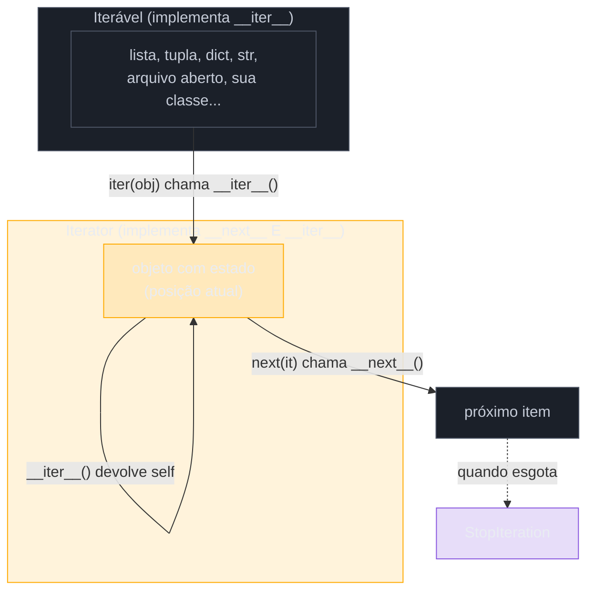
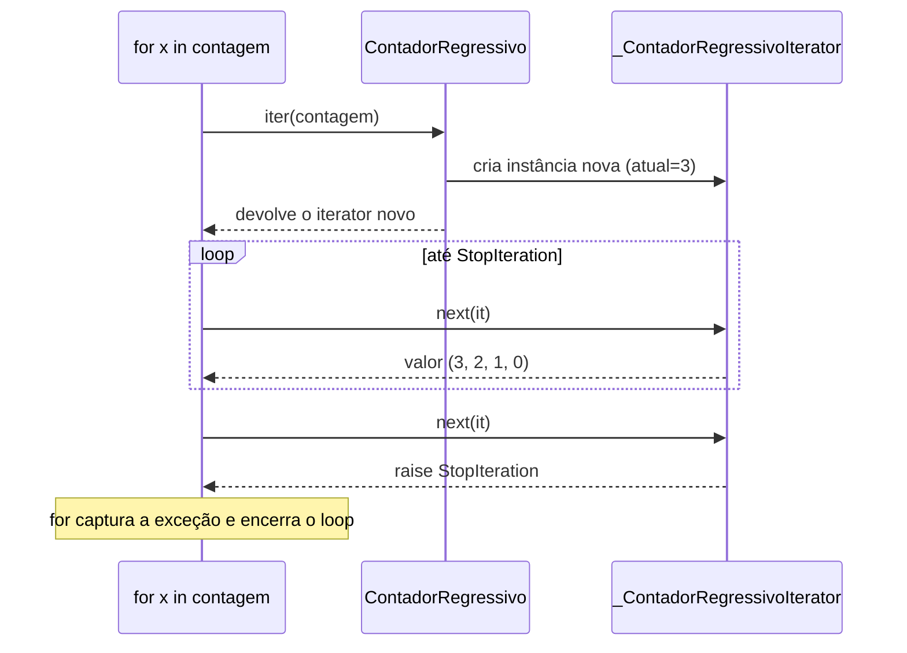

# Iterators e o protocolo `__iter__`/`__next__`

> [!abstract] TL;DR
> Um **iterável** é qualquer objeto que sabe produzir um iterador (implementa `__iter__`, chamado por `iter(obj)`); um **iterator** é o objeto que efetivamente avança, item a item, chamando `__next__()` (via `next(it)`) até levantar `StopIteration` para sinalizar o fim. São dois papéis **diferentes** — uma lista é iterável, mas não é, ela mesma, um iterador (`iter([1,2,3])` devolve um `list_iterator` novo, não a lista); é por isso que duas iterações simultâneas sobre a mesma lista não interferem uma na outra, mas duas iterações sobre o mesmo iterator competem pelo mesmo estado, consumindo-o. Todo iterator também é iterável — sua própria implementação de `__iter__` simplesmente devolve `self` — o que é o que permite usar `for x in it:` tanto num iterável "puro" (lista) quanto num iterator já em andamento. `for` faz isso por baixo dos panos: chama `iter()` uma vez, depois `next()` repetidamente, capturando `StopIteration` para sair do loop — nenhuma mágica, só duas chamadas de método plugadas na sintaxe.

## O bug que abre esta nota

Um pipeline de processamento de dados lê uma lista de pedidos duas vezes — uma para validar, outra para calcular o total — mas usa a **mesma variável** para as duas passagens, só que essa variável não é a lista original: é o resultado de `iter()` chamado sobre ela, guardado antes, achando que seria reutilizável como a lista:

```python
pedidos = [10.0, 25.5, 7.3, 42.0]

pedidos_iter = iter(pedidos)

total_bruto = sum(pedidos_iter)
print(f"Total: {total_bruto}")          # Total: 84.8

pedidos_validos = [p for p in pedidos_iter if p > 0]
print(f"Válidos: {pedidos_validos}")     # Válidos: []  <- vazio! por quê?
```

`sum()` percorre `pedidos_iter` até o fim — e um iterator, uma vez esgotado, **não reseta**. A segunda passagem sobre a mesma variável não encontra mais nada para consumir, porque não sobrou "posição inicial" para onde voltar: o estado interno do iterator já está apontando para além do último elemento. Não há erro, não há aviso — a segunda comprehension simplesmente produz uma lista vazia, silenciosamente.

O problema não está em `sum()` nem na comprehension — está em não distinguir **iterável** (`pedidos`, a lista, que pode gerar quantos iterators novos forem necessários) de **iterator** (`pedidos_iter`, um objeto com estado, que só pode ser percorrido uma vez). Esta nota dissseca exatamente essa distinção — o protocolo formal por trás dela, por que ela existe, e como `itertools` e o Data Model já apareceram nesse mesmo terreno nos galhos anteriores.

## O que é

O **protocolo iterator** é, junto com o Data Model geral ([[03-Dominios/Tecnologia/Python/OO e Data Model/03 - O Data Model — dunder methods essenciais|nota 03 do Galho 3]]), a peça de infraestrutura que faz `for x in obj:` funcionar em praticamente qualquer coisa em Python — listas, dicts, arquivos abertos, sockets, geradores, e qualquer classe própria que implemente o protocolo certo. A [documentação oficial](https://docs.python.org/3/tutorial/classes.html#iterators) define os dois papéis com precisão:

- **Iterável** (*iterable*): um objeto que implementa `__iter__()`, método que devolve um **iterator**. `iter(obj)` é a função embutida que chama `obj.__iter__()` por baixo.
- **Iterator**: um objeto que implementa `__next__()`, método que devolve o próximo item da sequência a cada chamada — e levanta `StopIteration` quando não há mais itens. `next(it)` é a função embutida que chama `it.__next__()`.

O ponto que costuma confundir quem chega vindo da nota do Data Model é: **todo iterator também precisa ser iterável**. Ou seja, um iterator implementa os *dois* métodos — `__next__()` (obrigatório, é o que faz ele ser iterator) e `__iter__()` (obrigatório também, para satisfazer o contrato de "ser iterável", mas trivial: basta devolver `self`). É exatamente esse `return self` que permite escrever `for x in meu_iterator:` diretamente sobre um iterator já em mãos, sem precisar de mais nada.



Um jeito rápido de verificar a distinção no REPL, com a própria lista do exemplo de abertura:

```python
>>> pedidos = [10.0, 25.5]
>>> pedidos.__iter__      # a lista TEM __iter__ (é iterável)
<method-wrapper '__iter__' of list object at 0x...>
>>> pedidos.__next__      # mas NÃO tem __next__ (não é, ela mesma, um iterator)
AttributeError: 'list' object has no attribute '__next__'
>>> it = iter(pedidos)
>>> type(it)
<class 'list_iterator'>
>>> it.__next__           # o list_iterator SIM tem __next__
<method-wrapper '__next__' of list_iterator object at 0x...>
>>> it.__iter__()  is it  # e seu __iter__ devolve a si mesmo
True
```

> [!question]- A nota 03 do Galho 3 já não cobriu `__iter__`? O que sobrou pra esta nota?
> A nota 03 cobriu `__iter__` como **uma peça do Data Model geral** — no contexto de "como uma classe ganha comportamento de tipo nativo" (junto com `__eq__`, `__len__`, `__getitem__`), e citou o fallback legado via `__getitem__` (quando `__iter__` está ausente, o `for` tenta `obj[0]`, `obj[1]`... até `IndexError`). O que ficou de fora, e é o foco *desta* nota, é o **protocolo iterator em si**: a separação formal entre o papel de "produzir um iterator" (`__iter__`) e o papel de "avançar item a item, com estado" (`__next__` + `StopIteration`) — os dois métodos, juntos, formando um objeto de segunda ordem que a nota anterior tratou de passagem. Também é o ponto de partida necessário para a próxima nota do galho, sobre `yield` — um generator **é**, por baixo, um objeto que implementa esse mesmo protocolo automaticamente.

## Por que importa

A separação entre iterável e iterator não é rigor acadêmico gratuito — ela resolve um problema real de **estado compartilhado versus estado independente**. Se `for x in lista:` reutilizasse a própria lista como "o iterator", duas iterações simultâneas sobre a mesma lista (um loop dentro de outro, por exemplo) colidiriam: o índice de uma avançaria o índice da outra. Como `iter(lista)` sempre cria um objeto **novo**, cada `for` recebe seu próprio "cursor" independente:

```python
numeros = [1, 2, 3]

for a in numeros:
    for b in numeros:
        print(a, b, end="  ")
```

Isso funciona sem confusão nenhuma — `for a in numeros` chama `iter(numeros)` uma vez, `for b in numeros` chama `iter(numeros)` de novo, e cada chamada devolve um `list_iterator` **distinto**, com seu próprio índice interno. Se `numeros` fosse, ela mesma, o iterator (com um único cursor compartilhado), o loop interno "roubaria" o progresso do loop externo, e a saída sairia corrompida ou incompleta.

O outro lado da moeda — o que pegou o exemplo de abertura desta nota — é que um **iterator já é o estado**, então ele é, por natureza, de uso único. A [Real Python](https://realpython.com/python-iterators-iterables/) resume essa assimetria assim: iteráveis "fornecem os dados que você quer iterar", enquanto iterators "controlam o processo de iteração em si" — e controlar um processo implica lembrar onde ele parou. Não existe (nem faria sentido existir) um `.reset()` embutido em iterators genéricos; a única forma de "recomeçar" é pedir um iterator novo ao iterável original, com `iter()` de novo.

> [!question]- Por que `StopIteration`, uma exceção, é o mecanismo de "acabou"? Não seria mais simples devolver um valor sentinela, tipo `None`?
> Porque `None` (ou qualquer outro valor) pode ser um item legítimo da sequência — um iterator sobre `[1, None, 3]` precisa conseguir devolver `None` como item real sem que isso seja confundido com "fim". Uma exceção é um canal de sinalização **completamente separado** do canal de valores de retorno: não há ambiguidade possível entre "o próximo item é `None`" e "não há próximo item". A [PEP 234](https://peps.python.org/pep-0234/) — que introduziu o protocolo iterator no Python 2.2, formalizando um padrão que várias bibliotecas já usavam de formas incompatíveis entre si — definiu `StopIteration` exatamente com esse raciocínio: uma exceção nova, dedicada só a esse propósito, para que nenhum valor de dado precisasse ser reservado como sentinela.

## Como funciona

### A forma pouco conhecida de `iter()`: dois argumentos

Além da forma de um argumento (`iter(obj)`, que chama `obj.__iter__()`), a [documentação oficial de `iter()`](https://docs.python.org/3/library/functions.html#iter) descreve uma segunda assinatura, `iter(callable, sentinela)`, que constrói um iterator a partir de **qualquer função sem argumentos**: a cada `next()`, o iterator chama `callable()`; se o valor devolvido for igual a `sentinela`, o iterator levanta `StopIteration` por conta própria — sem que `callable` precise saber nada sobre o protocolo iterator. É útil para "envelopar" APIs que já expõem uma função de "pegar o próximo item, ou um valor especial quando acabar" sem reescrevê-las como classe:

```python
from functools import partial

with open("log.txt") as arquivo:
    ler_linha = partial(arquivo.readline)
    for linha in iter(ler_linha, ""):   # readline() devolve "" no fim do arquivo
        processar(linha)
```

Esse padrão é menos comum no dia a dia do que a forma de um argumento, mas aparece o suficiente em código de bibliotecas (parsers de protocolo, leitura de sockets em blocos de tamanho fixo) para valer o reconhecimento — é o mesmo protocolo `StopIteration`, só que a fábrica do iterator é uma função embutida genérica, não uma classe escrita à mão.

### `iter()` e `next()`: as duas funções embutidas por trás de tudo

`iter()` e `next()` são funções embutidas (builtins) que fazem a ponte entre a sintaxe e os métodos dunder — o mesmo padrão de "sintaxe chama dunder" que a nota do Data Model já estabeleceu para `len()`, `repr()`, `==` etc.:

| Sintaxe / chamada | Dunder acionado | Contrato |
|---|---|---|
| `iter(obj)` | `obj.__iter__()` | devolve um objeto **iterator** (tem `__next__`) |
| `next(it)` | `it.__next__()` | devolve o próximo item, ou levanta `StopIteration` |
| `next(it, padrao)` | `it.__next__()` | devolve o próximo item, ou `padrao` **em vez de** levantar `StopIteration` |

O terceiro caso — `next()` com um segundo argumento — é um detalhe pouco lembrado mas útil: em vez de precisar de um `try/except StopIteration` só para tratar o caso "não tem mais nada, mas tudo bem", `next(it, None)` (ou qualquer outro valor-padrão) absorve o esgotamento silenciosamente:

```python
numeros = iter([1, 2])

print(next(numeros))          # 1
print(next(numeros))          # 2
print(next(numeros, "fim"))   # 'fim' — em vez de levantar StopIteration
print(next(numeros, "fim"))   # 'fim' de novo — iterator continua esgotado
```

### Implementando o protocolo do zero: a classe `Reverse`

O exemplo canônico da própria [documentação oficial](https://docs.python.org/3/tutorial/classes.html#iterators) é uma classe que itera uma sequência **de trás para frente** — algo que não existe pronto na linguagem (não há `reversed_for` embutido além da função `reversed()`, que por baixo faz exatamente isso):

```python
class Reverse:
    """Iterator para percorrer uma sequência de trás para frente."""

    def __init__(self, dados):
        self.dados = dados
        self.indice = len(dados)

    def __iter__(self):
        return self  # a própria instância também é o iterator

    def __next__(self):
        if self.indice == 0:
            raise StopIteration
        self.indice -= 1
        return self.dados[self.indice]


rev = Reverse("spam")

for letra in rev:
    print(letra, end="")
# maps
```

Repare na estrutura mínima: `__init__` guarda os dados e inicializa o **estado de progresso** (`self.indice`, começando no fim); `__iter__` devolve `self`, porque `Reverse` já É o iterator, não precisa de um objeto auxiliar separado; `__next__` faz duas coisas em toda chamada — checa se ainda há trabalho (`if self.indice == 0`) e, se sim, avança o estado **antes** de devolver o valor (`self.indice -= 1` seguido de `return`). É esse padrão — checar limite, atualizar estado, devolver valor — que se repete em praticamente todo iterator escrito à mão.

> [!warning] `Reverse("spam")` só pode ser percorrido **uma vez**
> Como `__iter__` devolve `self`, e `self.indice` é consumido a cada `__next__`, um segundo `for letra in rev:` sobre a **mesma instância** não imprime nada — `self.indice` já está em `0`. Isso é o comportamento correto e esperado de um iterator (é exatamente o bug do exemplo de abertura desta nota, só que numa classe própria em vez de um `list_iterator`). Se a intenção é permitir múltiplas iterações independentes sobre os mesmos dados, a solução é separar os dois papéis: uma classe **iterável** cujo `__iter__` cria e devolve um objeto **iterator novo** a cada chamada — não `self`.

### Separando os dois papéis: iterável reutilizável vs. iterator de uso único

A correção da armadilha acima — e o padrão real usado por `list`, `dict`, `range` e praticamente toda coleção da biblioteca padrão — é ter **duas classes**: uma que representa a coleção (iterável, sem estado de progresso) e outra que representa o progresso de uma iteração específica sobre ela (iterator, com estado):

```python
class ContadorRegressivo:
    """Iterável: pode ser percorrido quantas vezes forem necessárias."""

    def __init__(self, inicio):
        self.inicio = inicio

    def __iter__(self):
        # devolve um iterator NOVO a cada chamada — não self
        return _ContadorRegressivoIterator(self.inicio)


class _ContadorRegressivoIterator:
    """Iterator: guarda o estado de UMA passagem específica."""

    def __init__(self, atual):
        self.atual = atual

    def __iter__(self):
        return self  # todo iterator também é iterável — devolve a si mesmo

    def __next__(self):
        if self.atual < 0:
            raise StopIteration
        valor = self.atual
        self.atual -= 1
        return valor


contagem = ContadorRegressivo(3)

for n in contagem:
    print(n, end=" ")   # 3 2 1 0
print()

for n in contagem:      # segunda iteração — funciona de novo!
    print(n, end=" ")   # 3 2 1 0
```

Cada `for n in contagem:` chama `contagem.__iter__()`, que fabrica um `_ContadorRegressivoIterator` **novo**, com seu próprio `self.atual` zerado a partir do `inicio` original. É exatamente esse desenho que faz `list`, `str` e `dict` serem reutilizáveis: `list.__iter__` devolve um `list_iterator` novo toda vez, nunca a própria lista.



> [!question]- Por que separar em duas classes só pra isso? Não dá pra fazer tudo numa só?
> Dá, e a classe `Reverse` do exemplo anterior faz exatamente isso — mas ao custo de ser um objeto de **uso único**. A separação em duas classes existe justamente para desacoplar "os dados" (que podem ser consultados infinitas vezes) de "o progresso de uma consulta específica" (que é, por definição, consumido conforme avança). Na prática do dia a dia, a maioria das classes que você escreve não precisa desse desenho de duas classes — geralmente é mais simples delegar a iteração para uma estrutura interna já iterável (`return iter(self._dados)` dentro de `__iter__`, por exemplo) ou, melhor ainda, usar uma **generator function** (assunto da [[02 - Generators — yield e generator functions|próxima nota deste galho]]), que gera o objeto iterator inteiro automaticamente a partir de uma função com `yield` — sem escrever `__next__` manualmente.

### Como o `for` usa o protocolo por baixo

O que a sintaxe `for x in obj:` faz, de fato, é açúcar sintático para um laço explícito de `iter()` + `next()` dentro de um `try/except StopIteration`. A [documentação da instrução `for`](https://docs.python.org/3/reference/compound_stmts.html#the-for-statement) descreve exatamente essa expansão. Reescrever manualmente:

```python
obj = [10, 20, 30]

# Isto:
for x in obj:
    print(x)

# É equivalente a isto:
it = iter(obj)
while True:
    try:
        x = next(it)
    except StopIteration:
        break
    print(x)
```

Não há nada mágico em `for` além dessa tradução mecânica — e entender essa tradução é o que permite prever comportamentos como "modificar a lista durante o `for` corrompe a iteração" (o `list_iterator` guarda um índice numérico que não sabe que a lista mudou de tamanho por baixo dele) ou "iterar sobre um arquivo aberto consome o arquivo" (um objeto de arquivo é, ele mesmo, um iterator — `for linha in arquivo:` uma segunda vez, sem reabrir, não produz nada).

### A ponte com `itertools`: funções que devolvem iterators, não listas

O [[03-Dominios/Tecnologia/Python/Collections e Comprehensions/06 - itertools — os essenciais|Galho 2 já apresentou `itertools`]] pelo ângulo de "álgebra de iteração sem materializar listas" — `chain()`, `product()`, `islice()`, `groupby()`. O que fica mais claro agora, com o protocolo formal em mãos, é **por que** essas funções conseguem ser lazy: cada uma delas devolve um objeto que implementa o protocolo iterator (tem `__next__`, levanta `StopIteration` quando esgota) em vez de devolver uma lista pronta. `itertools.count()`, por exemplo, é essencialmente a mesma estrutura de `_ContadorRegressivoIterator` acima, só que contando para cima e sem limite:

```python
from itertools import count

contador = count(start=10, step=5)

print(next(contador))   # 10
print(next(contador))   # 15
print(next(contador))   # 20
# nunca levanta StopIteration — é um iterator infinito por design
```

A [documentação de `itertools`](https://docs.python.org/3/library/itertools.html) descreve o módulo como uma coleção de "ferramentas rápidas e eficientes em memória" — e a razão de serem eficientes em memória é exatamente essa: nenhuma delas materializa nada além do item atual em memória, porque todas seguem o mesmo contrato `__next__`/`StopIteration` desta nota, não um contrato de "devolver a coleção inteira de uma vez". `itertools.islice()`, em particular, é a ferramenta certa quando você precisa "pegar os primeiros N itens" de um iterator que não suporta fatiamento com `[:N]` (iterators, ao contrário de listas, não implementam `__getitem__` com slice) — é um caso de uso direto desta nota:

```python
from itertools import islice

numeros = iter(range(1_000_000_000))  # iterator "gigante", sem materializar nada

primeiros_cinco = list(islice(numeros, 5))
print(primeiros_cinco)   # [0, 1, 2, 3, 4]

# numeros[:5] levantaria TypeError — iterators não suportam slicing direto
```

**Iterator vs. iterable em uma frase:** iterável é quem *tem* os dados e sabe fabricar um cursor sobre eles; iterator é o próprio cursor, com estado, de uso único, que avança com `next()` e admite sua exaustão levantando `StopIteration`.

### Comparando com o `Iterator` de Java: mesma ideia, contrato diferente

Quem vem de Java já conhece uma versão nominal do mesmo padrão: a interface `Iterable<T>` (com o método `iterator()`) e a interface `Iterator<T>` (com `hasNext()` e `next()`). A ideia de fundo — separar "quem tem os dados" de "quem controla o avanço" — é idêntica; o que muda é **como o fim da sequência é sinalizado** e **como o contrato é declarado**:

| | Python | Java |
|---|---|---|
| Produz o iterator | `__iter__()`, chamado por `iter(obj)` | `iterator()`, declarado por `implements Iterable<T>` |
| Avança | `__next__()`, chamado por `next(it)` | `next()` |
| Sinaliza "acabou" | levanta `StopIteration` (exceção) | `hasNext()` devolve `false` **antes** de chamar `next()` |
| Contrato | estrutural/comportamental (duck typing — ver [[03-Dominios/Tecnologia/Python/OO e Data Model/03 - O Data Model — dunder methods essenciais|nota 03 do Galho 3]]) | nominal — `implements Iterator<T>` explícito, checado em tempo de compilação |

A diferença mais consequente na prática é a de "acabou": em Java, o código-cliente **pergunta antes** (`while (it.hasNext()) { it.next(); }`) — duas chamadas de método por item, uma de checagem e uma de avanço, nunca simultâneas. Em Python, o código-cliente **tenta e trata a falha** (`next(it)` dentro de um `try/except StopIteration`, como o `for` faz por baixo) — uma única chamada por item, que tanto avança quanto sinaliza o fim quando aplicável. É o mesmo espírito EAFP ("easier to ask forgiveness than permission") já visto na nota de erros e exceções do Galho 1: Python prefere tentar a operação e reagir à exceção a exigir uma pergunta de permissão prévia.

> [!question]- Isso significa que checar `hasNext()` toda vez em Java é mais "seguro" que o jeito Python?
> Não é uma questão de segurança — é uma questão de onde cada linguagem coloca a responsabilidade. Em Java, `hasNext()` e `next()` são dois métodos **desacoplados**: nada impede, tecnicamente, de chamar `next()` sem checar `hasNext()` antes (o resultado é uma `NoSuchElementException`, a exceção equivalente ao `StopIteration` de Python) — só que a convenção da linguagem empurra fortemente para checar antes. Python simplesmente formaliza esse mesmo caminho de erro como o **caminho principal** de sinalizar o fim, em vez de um caso de borda a ser evitado por convenção.

## Casos práticos

### Cenário 1: paginação de uma API externa sem carregar tudo na memória

Um serviço backend precisa consumir todos os registros de um endpoint paginado de terceiros (uma API de pagamentos, por exemplo) para reconciliar transações — mas a resposta completa pode ter centenas de milhares de itens, e carregar tudo numa lista antes de processar estouraria a memória do worker. A solução idiomática é uma classe iterável que busca uma página por vez, sob demanda, expondo o protocolo iterator ao chamador:

```python
import requests


class PaginasDeTransacoes:
    """Iterável: cada iter() começa a paginação do zero."""

    def __init__(self, url_base, token):
        self.url_base = url_base
        self.token = token

    def __iter__(self):
        return _IteradorDePaginas(self.url_base, self.token)


class _IteradorDePaginas:
    """Iterator: guarda o cursor de paginação de UMA varredura."""

    def __init__(self, url_base, token):
        self.url_base = url_base
        self.token = token
        self.cursor = None
        self.buffer = []
        self.acabou = False

    def __iter__(self):
        return self

    def __next__(self):
        if not self.buffer and not self.acabou:
            self._buscar_proxima_pagina()
        if not self.buffer:
            raise StopIteration
        return self.buffer.pop(0)

    def _buscar_proxima_pagina(self):
        resposta = requests.get(
            self.url_base,
            headers={"Authorization": f"Bearer {self.token}"},
            params={"cursor": self.cursor} if self.cursor else {},
        ).json()
        self.buffer = resposta["itens"]
        self.cursor = resposta.get("proximo_cursor")
        self.acabou = self.cursor is None


transacoes = PaginasDeTransacoes("https://api.pagamentos.exemplo/v1/transacoes", token="...")

for transacao in transacoes:
    reconciliar(transacao)   # processa uma transação por vez, uma página HTTP de cada vez
```

Nenhuma requisição extra acontece até o `for` realmente pedir o próximo item (`__next__`), e o buffer nunca guarda mais do que uma página por vez — exatamente o mesmo princípio de laziness que `itertools` aplica dentro da stdlib, só que aplicado a uma fonte de dados externa em vez de uma sequência em memória. E como `__iter__` da classe `PaginasDeTransacoes` sempre devolve um `_IteradorDePaginas` novo, a mesma instância de `transacoes` pode ser reutilizada em duas reconciliações diferentes sem que uma "roube" o cursor da outra.

### Cenário 2: parser de log gigante, linha a linha, sem carregar o arquivo inteiro

Um objeto de arquivo aberto em Python já **é** um iterator — `open(caminho)` devolve um objeto que implementa `__next__`, devolvendo uma linha por vez, sem nunca materializar o arquivo inteiro em memória. Isso é o que permite processar um log de vários gigabytes com uso de memória constante:

```python
def contar_erros_5xx(caminho_log):
    total = 0
    with open(caminho_log) as arquivo:
        # arquivo é, ele mesmo, um iterator — for chama next(arquivo) repetidamente
        for linha in arquivo:
            if " 5" in linha and "HTTP/1.1\" 5" in linha:
                total += 1
    return total
```

O detalhe que costuma virar armadilha aqui: como o objeto de arquivo é um iterator (não um iterável "puro"), tentar percorrê-lo **duas vezes** dentro do mesmo `with` (por exemplo, um segundo `for linha in arquivo:` logo depois do primeiro, sem `arquivo.seek(0)`) não levanta erro — só não produz nada, porque o cursor do arquivo já está no fim. É a mesma classe de bug do exemplo de abertura desta nota, só que com um arquivo em vez de uma lista.

## Armadilhas

> [!warning] Reusar um iterator já esgotado achando que ele "reseta"
> É o bug do exemplo de abertura desta nota. `sum(it)`, `list(it)`, um `for` que já rodou até o fim — qualquer um desses consome o iterator inteiramente. Uma segunda operação sobre a **mesma variável** de iterator não levanta erro nenhum; simplesmente não produz itens, porque não há de onde "puxar" mais nada. A correção é sempre pedir um iterator novo a partir do iterável original (`iter(dados)` de novo), ou, melhor, guardar o **iterável** (a lista, não o resultado de `iter()`) e deixar cada `for`/`sum`/`list()` chamar `iter()` implicitamente por conta própria.

> [!warning] Checar "é iterável?" com `hasattr(obj, "__iter__")` em vez de tentar de fato
> Tecnicamente funciona na maioria dos casos, mas viola o espírito EAFP do Python (já visto no [[03-Dominios/Tecnologia/Python/Core/08 - Erros e exceções|Galho 1, nota 08]]) e ignora o fallback legado via `__getitem__` (coberto na nota 03 do Galho 3) — uma classe antiga que só implementa `__getitem__` é iterável na prática, mas `hasattr(obj, "__iter__")` diria que não. O jeito idiomático é tentar `iter(obj)` dentro de um `try/except TypeError`, ou simplesmente deixar o `for` fazer o trabalho e deixar o erro (se houver) aparecer naturalmente.

> [!warning] Modificar a coleção original enquanto itera sobre ela
> Um `list_iterator` guarda um índice numérico interno, não uma "foto" dos dados. Remover ou adicionar itens de uma lista **enquanto** um `for` a percorre faz o índice do iterator dessincronizar da lista real — itens podem ser pulados (mais comum ao remover) ou repetidos, sem exceção nenhuma na maioria dos casos. A correção padrão é iterar sobre uma cópia (`for x in lista[:]:` ou `for x in list(lista):`) quando a lista original precisa ser modificada dentro do loop.

## Em entrevista

Perguntas previsíveis sobre este tópico:

- **"Qual a diferença entre iterável e iterator?"** Iterável implementa `__iter__()`, que devolve um iterator; iterator implementa `__next__()`, que devolve o próximo item ou levanta `StopIteration`. Todo iterator também é iterável (seu `__iter__` devolve `self`), mas nem todo iterável é um iterator — uma lista é iterável, mas não tem `__next__`. `iter(lista)` cria um `list_iterator` novo cada vez que é chamado; é isso que permite iterar a mesma lista várias vezes, em paralelo até.
- **"Por que iterar duas vezes sobre o mesmo iterator não funciona, mas iterar duas vezes sobre a mesma lista funciona?"** Porque a lista **não é** o iterator — é o iterável que fabrica um iterator novo (com estado zerado) a cada `iter()`. Um iterator, por definição, **é** o estado de uma passagem específica; uma vez esgotado (levantou `StopIteration`), ele continua esgotado — não há reset embutido.
- **"Por que `StopIteration` é uma exceção, e não um valor de retorno tipo `None`?"** Porque `None` (ou qualquer valor) pode ser um dado legítimo dentro da sequência — usar uma exceção separa completamente o canal "aqui está o próximo item" do canal "acabou", sem ambiguidade.
- **"Como o `for` funciona por baixo dos panos?"** Chama `iter(obj)` uma vez para obter o iterator, depois chama `next()` repetidamente dentro de um `try/except StopIteration`, saindo do loop quando a exceção aparece. É açúcar sintático puro sobre `iter()` + `next()`.
- **"Dá pra fazer uma classe iterável sem implementar `__next__`?"** Sim — `__iter__` pode devolver **outro objeto** (um iterator separado, ou o resultado de `iter()` sobre uma estrutura interna já iterável) em vez de `self`. Só é obrigatório que `__iter__` devolva *algo* que tenha `__next__`; não precisa ser a própria instância.
- **"O que `itertools.count()`/`cycle()`/`repeat()` têm em comum, do ponto de vista do protocolo?"** São iterators que nunca levantam `StopIteration` por conta própria — precisam ser combinados com `islice()`, `zip()` com um iterável finito, ou um `break` explícito para não rodar para sempre.

### How to explain in English

> An iterable is any object that implements `__iter__()`, which returns an iterator; an iterator implements `__next__()`, which returns the next value or raises `StopIteration` once exhausted. Every iterator is also iterable — its `__iter__()` just returns itself — which is what lets a `for` loop accept an iterator directly. The key distinction that trips people up: a list is iterable, but it isn't itself an iterator. Calling `iter()` on it produces a brand-new iterator object with its own internal position, which is exactly why you can nest two `for` loops over the same list without them interfering — but if you manually grab an iterator with `iter()` and pass that same object around, consuming it in one place exhausts it everywhere else, since an iterator *is* the state of one specific pass. `StopIteration` is an exception, not a sentinel value, precisely because `None` or any other value could be a legitimate item in the sequence.

| PT | EN |
|---|---|
| iterável | iterable |
| iterator | iterator |
| protocolo iterator | iterator protocol |
| esgotado / exaurido | exhausted |
| de uso único | single-use / one-shot |
| levantar uma exceção | to raise an exception |
| sentinela | sentinel (value) |
| laço / loop | loop |
| avançar (o iterator) | to advance (the iterator) |
| consumir (um iterator) | to consume (an iterator) |

## O que vem a seguir

O protocolo iterator manual — escrever `__init__`, `__iter__` e `__next__` à mão, controlando estado com atributos de instância — é exatamente o trabalho que uma **generator function** faz automaticamente por você: uma função com `yield` no corpo, ao ser chamada, devolve de graça um objeto que já implementa `__iter__` (devolvendo `self`) e `__next__` (retomando a função de onde parou a cada chamada). A [[02 - Generators — yield e generator functions|próxima nota]] mostra como isso funciona por dentro — e por que, na prática, quase ninguém escreve uma classe iterator manual como `Reverse` ou `_ContadorRegressivoIterator` em código de produção, preferindo `yield`.

- [[02 - Generators — yield e generator functions|02 — Generators: `yield` e generator functions]] — o mesmo protocolo, gerado automaticamente por uma função
- [[03 - yield from e delegação de generators|03 — `yield from` e delegação de generators]] — como um generator delega iteração para outro
- [[03-Dominios/Tecnologia/Python/OO e Data Model/03 - O Data Model — dunder methods essenciais|OO e Data Model, nota 03]] — `__iter__` no contexto mais amplo do Data Model, e o fallback legado via `__getitem__`
- [[03-Dominios/Tecnologia/Python/Collections e Comprehensions/06 - itertools — os essenciais|Collections, nota 06 — itertools]] — funções prontas que já devolvem iterators, agora com o protocolo formal por trás delas explicado

## Veja também

- [[03-Dominios/Tecnologia/Python/Funcional e idiomas avançados/index|Funcional e idiomas avançados]] — MOC do Galho 4
- [[03-Dominios/Tecnologia/Python/Core/08 - Erros e exceções|Core, nota 08 — Erros e exceções]] — EAFP, o mesmo espírito por trás de tentar `iter()`/`next()` em vez de checar `hasattr` antes
- [[03-Dominios/Tecnologia/Python/index|Trilha Python]]

## Fontes

- Python Software Foundation. *9.10. Iterators* — The Python Tutorial. docs.python.org, versão 3.14. https://docs.python.org/3/tutorial/classes.html#iterators (acessado em 2026-07-10)
- Python Software Foundation. *8.3. The `for` statement* — The Python Language Reference. docs.python.org, versão 3.14. https://docs.python.org/3/reference/compound_stmts.html#the-for-statement (acessado em 2026-07-10)
- Python Software Foundation. *itertools — Functions creating iterators for efficient looping*. docs.python.org, versão 3.14. https://docs.python.org/3/library/itertools.html (acessado em 2026-07-10)
- Yee, K.; van Rossum, G. *PEP 234 — Iterators*. peps.python.org, 2001. https://peps.python.org/pep-0234/ (acessado em 2026-07-10)
- Real Python. *Iterators and Iterables in Python: Run Efficient Iterations*. https://realpython.com/python-iterators-iterables/ (acessado em 2026-07-10)
- Real Python. Glossário, verbete *iterator*. https://realpython.com/ref/glossary/iterator/ (acessado em 2026-07-10)
- Ramalho, L. *Fluent Python: Clear, Concise, and Effective Programming*, 2ª ed. — Capítulo 17, "Iterators and Generators". O'Reilly Media, 2022.

Consultado em 2026-07-10.
