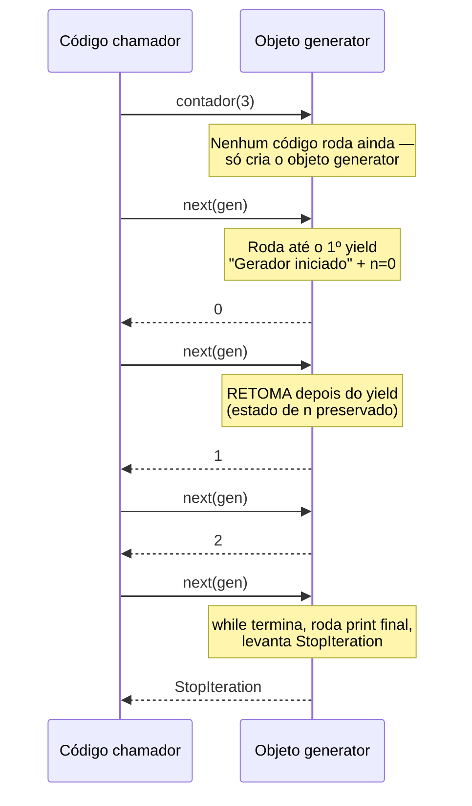
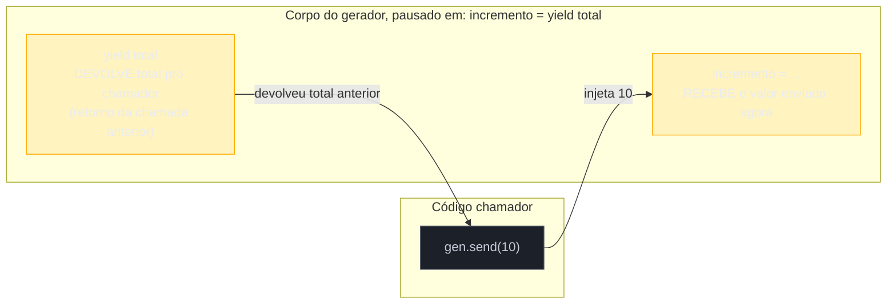
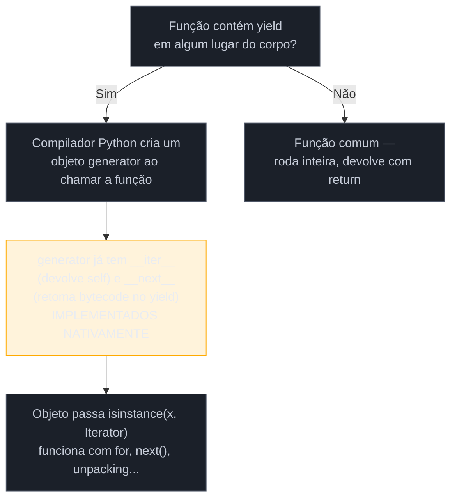

# Generators — yield e generator functions

> [!abstract] TL;DR
> Uma **generator function** é uma função comum com uma diferença sintática mínima e uma consequência gigantesca: em algum lugar do corpo dela existe a palavra-chave `yield` em vez de (ou além de) `return`. Essa única palavra muda o que a função *é*: ela deixa de executar do início ao fim numa chamada só e passa a **suspender** sua execução em cada `yield`, devolvendo um valor para quem chamou, e **retomar** exatamente de onde parou — com todas as variáveis locais, o ponto do laço, o estado da pilha de chamadas — na próxima vez que alguém pedir o próximo valor. Isso é diferente de uma **generator expression** (`(x for x in dados)`, já vista no Galho 2): a expressão é uma forma compacta de escrever um gerador simples numa linha; a generator function é uma função completa, com qualquer lógica — laços múltiplos, condicionais, `try/except`, chamadas a outras funções — que ainda assim produz valores um de cada vez, sob demanda (**lazy evaluation**), sem nunca precisar materializar a sequência inteira na memória. Além de `__next__()` (que avança e recebe o próximo valor), o protocolo de generators expõe três métodos que a maioria dos tutoriais de comprehension nunca menciona: `send(valor)` injeta um valor de volta *dentro* do gerador, no ponto exato onde ele estava pausado, tornando-o um canal de comunicação de mão dupla; `throw(excecao)` injeta uma exceção nesse mesmo ponto, permitindo que o gerador reaja e se recupere; `close()` encerra o gerador de forma limpa, levantando `GeneratorExit` internamente para acionar blocos `finally` de liberação de recursos. E generators implementam o protocolo iterator ([[01 - Iterators e o protocolo __iter__ __next__|`__iter__`/`__next__`]]) **automaticamente**, sem o desenvolvedor escrever uma linha desses dois métodos — é o compilador do Python que gera essa implementação por trás dos panos, assim que ele detecta `yield` em algum lugar do corpo da função.

## O problema que fez o Python 2.2 ganhar `yield`

Um desenvolvedor está escrevendo um script que processa um arquivo de log de 40 GB, linha por linha, procurando por entradas de erro. A primeira tentativa, natural para quem vem de uma mentalidade "carregar tudo, depois processar", é assim:

```python
def carregar_erros(caminho_arquivo):
    linhas = open(caminho_arquivo).readlines()   # lê o arquivo INTEIRO pra memória
    erros = [linha for linha in linhas if "ERROR" in linha]
    return erros

for erro in carregar_erros("app.log"):
    processar(erro)
```

Em uma máquina com 8 GB de RAM, esse código nunca termina de rodar — trava o processo, ou é morto pelo OOM killer do sistema operacional antes de imprimir qualquer coisa. O problema não é `processar()`; é que `readlines()` insiste em ter **o arquivo inteiro na memória** antes mesmo do primeiro `if "ERROR"` rodar. A comprehension seguinte piora: ela cria uma **segunda** lista, quase do mesmo tamanho da primeira, guardando cada linha de erro encontrada — mesmo que o chamador só precise processar um erro de cada vez e depois esquecê-lo.

A correção óbvia — trocar `readlines()` por iterar linha a linha, que já é o comportamento nativo de um arquivo aberto em Python — resolve a leitura, mas o problema estrutural continua: `carregar_erros` ainda quer **devolver uma lista** no fim. Enquanto a função for escrita como "monte a coleção inteira, depois `return` ela", o padrão de uso "produza um item, processe, esqueça, produza o próximo" nunca vai caber — porque `return` sempre significa "aqui está o resultado final, a função terminou, todo o estado dela morreu".

O que falta é uma função que consiga **pausar** no meio, entregar um valor, e continuar depois de onde parou — sem perder o progresso do laço, sem reiniciar do zero, sem devolver tudo de uma vez. É exatamente isso que `yield` introduziu na linguagem, formalizado na [PEP 255 — Simple Generators](https://peps.python.org/pep-0255/), no Python 2.2 (2001): a proposta descreve generators como uma forma de escrever funções que retomam sua execução, preservando estado local, em vez de recomeçar — resolvendo de forma nativa exatamente a classe de problema (iteração preguiçosa, produtores de sequência sem fim conhecido, pipelines de processamento) que o exemplo do log ilustra.

```python
def carregar_erros(caminho_arquivo):
    with open(caminho_arquivo) as arquivo:
        for linha in arquivo:          # o arquivo já é iterado linha a linha
            if "ERROR" in linha:
                yield linha             # PAUSA aqui, devolve a linha, espera o próximo pedido

for erro in carregar_erros("app.log"):  # só uma linha de log existe na memória por vez
    processar(erro)
```

A troca de `return erros` por `yield linha` transforma `carregar_erros` de uma função comum numa **generator function** — e o resto desta nota dissseca exatamente o que essa transformação significa por baixo do capô.

## O que é: `yield` suspende e retoma, `return` termina

A regra sintática é simples de enunciar e fácil de aplicar mal na primeira vez que se aprende: **qualquer função que contenha a palavra-chave `yield` em algum ponto do corpo — mesmo que condicionalmente, dentro de um `if` que talvez nunca seja alcançado — se torna uma generator function**. Não é o tipo do valor retornado que decide isso; é a presença sintática de `yield` em qualquer lugar do código da função, detectada pelo compilador do Python **antes** mesmo do código rodar.

Chamar uma generator function não executa o corpo dela. Isso surpreende quem espera o comportamento de uma função normal:

```python
def contador(limite):
    print("Gerador iniciado")
    n = 0
    while n < limite:
        yield n
        n += 1
    print("Gerador esgotado")

gen = contador(3)
print(gen)          # <generator object contador at 0x7f...> — nenhum "Gerador iniciado" impresso ainda
print(type(gen))    # <class 'generator'>
```

Chamar `contador(3)` **não** roda nenhuma linha do corpo — nem o primeiro `print`. O que essa chamada devolve é um **objeto generator**: uma estrutura que já sabe *como* executar o corpo da função, mas ainda não executou nada. É só quando alguém pede o primeiro valor — via `next(gen)` ou o `for` que chama isso implicitamente — que o corpo começa a rodar, e roda exatamente até o primeiro `yield`, onde congela:

```python
print(next(gen))    # imprime "Gerador iniciado", depois devolve 0 — parou no primeiro yield
print(next(gen))    # NÃO reimprime "Gerador iniciado" — retoma depois do yield, devolve 1
print(next(gen))    # devolve 2
print(next(gen))    # o while termina (n == 3), roda "Gerador esgotado", levanta StopIteration
```



O que fica preservado entre uma chamada e outra de `next()` não é só o valor de `n` — é **todo o estado de execução**: a posição exata dentro do laço `while`, a pilha de chamadas locais, quaisquer variáveis locais adicionais que existissem. A documentação oficial descreve isso chamando o objeto generator de uma implementação automática do [protocolo iterator](https://docs.python.org/3/reference/datamodel.html#generator-types): cada `yield` é o ponto onde `__next__()` (chamado pelo `for` ou por `next()`) devolve o controle ao chamador, e a próxima chamada a `__next__()` retoma exatamente ali, como se o corpo da função nunca tivesse saído do meio de um `while`.

> [!question]- Se `yield` não termina a função, por que o laço `while` do exemplo eventualmente para de rodar?
> Porque `yield` só pausa — quem decide **quando** parar de pedir mais valores é a condição do próprio laço (`n < limite`), exatamente como pausaria num `while` comum. Quando a condição do `while` deixa de ser verdadeira, o corpo da função chega ao fim naturalmente (sem `return` explícito, ou com um `return` sem valor) — e é **esse** término natural do corpo que faz o Python levantar `StopIteration` automaticamente na próxima chamada a `next()`, sinalizando "não há mais valores". Um `return valor` dentro de uma generator function não devolve `valor` para quem chama `next()` — ele vira o atributo `.value` da exceção `StopIteration` levantada (usado internamente por `yield from`, coberto na [[03 - yield from e delegação de generators|nota 03]] deste galho), não um valor normal de iteração.

## Generator function vs. generator expression: mesma ideia, escopos diferentes

A [[03-Dominios/Tecnologia/Python/Collections e Comprehensions/05 - Comprehensions — list, dict, set e generator expressions|nota 05 do Galho 2]] já cobriu generator expressions em detalhe — a sintaxe `(x**2 for x in range(1_000_000))`, a vantagem de memória sobre uma list comprehension, e o fato de que um generator expression é **de uso único**. O que essa nota não cobriu (porque ainda não era o momento) é: **o que exatamente aquela expressão devolve**? A resposta, agora que o mecanismo por trás está claro, é direta: um generator expression **é** uma generator function anônima, criada e chamada na mesma linha. `(x**2 for x in range(1_000_000))` é, na prática, equivalente a escrever uma função com `yield` e chamá-la imediatamente:

```python
# Generator expression — compacta, uma linha
gen_expr = (x**2 for x in range(5))

# Equivalente funcional, como generator function explícita
def _gen_equivalente():
    for x in range(5):
        yield x**2

gen_func = _gen_equivalente()

print(list(gen_expr))   # [0, 1, 4, 9, 16]
print(list(gen_func))   # [0, 1, 4, 9, 16] — mesmo resultado, mesmo tipo de objeto
print(type(gen_expr) is type(gen_func))   # True — ambos são <class 'generator'>
```

A diferença prática entre as duas formas não é o que elas produzem — é **quanta lógica cabe** em cada uma. Um generator expression é, por construção sintática, limitado a uma única expressão com no máximo um `for`/`if` por nível (a mesma regra de legibilidade discutida na nota de comprehensions se aplica aqui, ainda mais estritamente). Uma generator function é uma função Python completa: pode ter múltiplos `yield` em pontos diferentes do corpo, laços aninhados com lógica arbitrária entre eles, blocos `try/except/finally`, chamadas a outras funções, acumular estado auxiliar em variáveis locais — tudo o que uma função normal pode fazer, exceto devolver tudo de uma vez com `return`.

| | Generator expression | Generator function |
|---|---|---|
| Sintaxe | `(expr for x in it if cond)` | `def nome(): ... yield valor` |
| Onde vive | inline, dentro de uma expressão | definição de função nomeada (ou anônima só na forma acima) |
| Complexidade suportada | uma expressão, filtros simples | qualquer lógica: múltiplos `yield`, `try/except`, laços aninhados |
| Nomeável/reutilizável | não diretamente (precisa envolver em função) | sim — é uma função, chamável várias vezes (cada chamada = novo gerador) |
| Uso típico | transformação/filtro simples, argumento único de `sum()`/`any()`/`max()` | pipeline com múltiplas etapas, geração infinita, protocolos com estado (`send`/`throw`) |

O exemplo do log de erros da abertura desta nota já mostra por que a versão com `yield` era necessária ali: um generator expression não tem como abrir um arquivo com `with`, nem checar uma substring dentro de um `if` que precisa da variável `linha` já lida — a lógica é simples demais para caber numa linha, mas exatamente do tamanho certo para uma generator function de três linhas.

> [!warning] Nem toda função com laço "parece" precisar de `yield` até você medir a memória
> A tentação comum é só usar generator function quando o dataset é obviamente gigante (arquivos, streams de rede). Mas o ganho de lazy evaluation aparece mesmo em casos modestos: uma função que produz uma sequência que o chamador pode **interromper cedo** (por exemplo, parar de procurar assim que encontra o primeiro item que satisfaz uma condição) desperdiça trabalho se materializa a lista inteira antes de devolver — um gerador, nesse caso, produz só os itens que de fato foram consumidos antes do `break`, e nenhum a mais.

## Lazy evaluation: o "sob demanda" que já apareceu na nota de comprehensions, agora explicado

A nota de comprehensions descreveu o efeito de memória de um generator expression (200 bytes contra 8 MB para um milhão de itens) sem explicar o mecanismo por trás. Agora dá pra nomear exatamente o que está acontecendo: **lazy evaluation** — avaliação preguiçosa — significa que nenhum valor é calculado até o momento exato em que alguém pede aquele valor especificamente. Um gerador não "sabe" de antemão quais serão o quinto ou o centésimo valor que vai produzir; ele só computa o próximo quando `next()` é chamado, e esquece o valor anterior assim que ele é entregue (a menos que o código que consome explicitamente o guarde em algum lugar).

```python
def numeros_lazy():
    print("Calculando 1...")
    yield 1
    print("Calculando 2...")
    yield 2
    print("Calculando 3...")
    yield 3

gen = numeros_lazy()
print("Gerador criado, nada calculado ainda")

primeiro = next(gen)
print(f"Recebi: {primeiro}")
# Saída:
# Gerador criado, nada calculado ainda
# Calculando 1...
# Recebi: 1
```

Repare que "Calculando 2..." e "Calculando 3..." nunca aparecem nesse trecho — porque ninguém pediu o segundo ou terceiro valor ainda. Esse comportamento é o que permite a Python representar **sequências infinitas** como objetos comuns, sem violar as leis da física da memória: um gerador que nunca para (`while True: yield ...`) é um objeto perfeitamente válido, do tamanho de algumas dezenas de bytes, porque ele nunca precisa conter todos os valores — só sabe **como calcular o próximo**, sempre que alguém pedir:

```python
def naturais():
    n = 1
    while True:       # nunca termina — mas isso é OK, porque nada é pré-computado
        yield n
        n += 1

contador = naturais()
primeiros_cinco = [next(contador) for _ in range(5)]
print(primeiros_cinco)   # [1, 2, 3, 4, 5]
# `contador` continua vivo, pronto pra produzir o 6º valor a qualquer momento
```

Isso conecta diretamente com o [[01 - Iterators e o protocolo __iter__ __next__|protocolo iterator]] coberto na nota irmã: `for x in iteravel` sempre consome exatamente um valor por chamada de `__next__()`, então um `for` sobre um gerador infinito funciona perfeitamente — o que falta, e precisa vir de fora (um `if`, um `break`, um `itertools.islice`), é a condição de parada. Sem ela, o `for` roda para sempre, mas nunca "trava" por falta de memória — só consome tempo de CPU indefinidamente.

**Lazy evaluation em uma frase:** um gerador não guarda os valores que vai produzir — ele guarda a *receita* para calcular o próximo, e só a executa quando alguém pede.

## `send()`, `throw()`, `close()`: o gerador como via de mão dupla

Todo o exemplo até aqui tratou o gerador como um **produtor**: código externo pede valores, o gerador entrega, fim de história. Mas a [PEP 342 — Coroutines via Enhanced Generators](https://peps.python.org/pep-0342/) (Python 2.5, 2006) mudou isso — segundo o texto da própria PEP, "as funções geradoras do Python são quase corrotinas — mas não totalmente", porque faltava a elas passagem de valor bidirecional e injeção de exceção. A correção foi tornar `yield` uma **expressão** (não só um comando): `valor_recebido = yield valor_produzido` é sintaxe válida, e é o que abre a porta para os três métodos além de `next()`.

### `send(valor)`: injetar um valor no ponto exato da pausa

`gerador.send(valor)` retoma a execução do gerador, e faz o `yield` onde ele estava pausado **avaliar como `valor`** — como se `valor` fosse o resultado daquela expressão `yield`. É diferente de `next(gerador)`, que é equivalente a `gerador.send(None)`: sempre injeta `None` no ponto de pausa.

```python
def acumulador():
    total = 0
    while True:
        incremento = yield total     # yield DEVOLVE total, e RECEBE o próximo valor enviado
        total += incremento

gen = acumulador()
print(next(gen))          # 0 — inicia o gerador, roda até o primeiro yield, devolve total=0
print(gen.send(10))       # 10 — injeta 10 no yield pausado; total vira 10; roda até o PRÓXIMO yield, devolve 10
print(gen.send(5))        # 15 — injeta 5; total vira 15; devolve 15
print(gen.send(100))      # 115
```

> [!warning] A primeira chamada num gerador criado com `send()` precisa ser `send(None)` (ou `next()`)
> Um gerador recém-criado ainda não chegou a nenhum `yield` — não existe um ponto de pausa esperando receber valor nenhum. A [documentação oficial](https://docs.python.org/3/reference/expressions.html#generator.send) é explícita: chamar `send(valor)` com `valor` diferente de `None` num gerador que ainda não rodou levanta `TypeError`. É por isso que o exemplo acima chama `next(gen)` primeiro — só depois de alcançar o primeiro `yield` (e ter algo pausado ali) é que `send()` com um valor real faz sentido.

O diagrama abaixo mostra por que a leitura do código de `acumulador()` costuma confundir quem vê pela primeira vez: a linha `incremento = yield total` parece uma atribuição comum, mas na verdade tem **duas direções de dado passando por ela simultaneamente** — `total` sai pra fora (é o que `send()`/`next()` devolve), e o próximo valor enviado entra por dentro (vira `incremento`).



### `throw(excecao)`: injetar uma exceção no ponto da pausa

`gerador.throw(excecao)` levanta `excecao` exatamente no ponto onde o gerador está pausado — como se a linha do `yield` tivesse, naquele instante, disparado um `raise`. Se o corpo do gerador tem um `try/except` envolvendo o `yield`, ele pode capturar e se recuperar, continuando a produzir valores; se não capturar, a exceção se propaga para quem chamou `throw()`.

```python
def processador_resiliente():
    total = 0
    while True:
        try:
            item = yield total
            total += item
        except ValueError:
            print("Item inválido ignorado, gerador continua")
            # não há yield aqui dentro do except — o laço volta pro topo,
            # roda o try de novo, e PAUSA de novo no yield seguinte

gen = processador_resiliente()
next(gen)                          # inicia, total = 0
print(gen.send(10))                 # 10
print(gen.throw(ValueError))        # imprime a mensagem, depois devolve 10 de novo (laço volta ao yield)
print(gen.send(5))                  # 15 — o gerador se recuperou e continuou normalmente
```

### `close()`: encerrar de forma limpa, acionando `finally`

`gerador.close()` levanta `GeneratorExit` no ponto de pausa — um sinal de "pare, não vou pedir mais valores". Se o corpo do gerador tem um bloco `try/finally` envolvendo o `yield`, o `finally` roda antes do gerador realmente terminar, permitindo liberar recursos (fechar arquivos, conexões, locks) de forma determinística, mesmo que o consumidor tenha parado de iterar no meio:

```python
def leitor_com_cleanup(caminho):
    arquivo = open(caminho)
    try:
        for linha in arquivo:
            yield linha.strip()
    finally:
        print(f"Fechando {caminho}")
        arquivo.close()   # roda mesmo se close() for chamado antes do arquivo acabar

gen = leitor_com_cleanup("dados.txt")
print(next(gen))     # primeira linha
gen.close()           # imprime "Fechando dados.txt" — finally rodou, mesmo sem esgotar o arquivo
```

O contrato documentado de `close()` é preciso sobre o que conta como "encerramento limpo": se o gerador captura `GeneratorExit` e tenta produzir **outro** valor depois (mais um `yield`), o Python considera isso uma violação do protocolo e levanta `RuntimeError` — um gerador não tem permissão de "recusar" ser fechado produzindo mais dados. Se o gerador simplesmente deixa `GeneratorExit` se propagar (comportamento padrão, sem `except` para ela) ou já estava esgotado, `close()` devolve `None` silenciosamente. Vale registrar uma mudança recente: a partir do Python 3.13, se o gerador **retorna um valor** (não gera exceção) ao reagir ao `GeneratorExit`, esse valor passa a ser devolvido por `close()` — em versões anteriores isso não era suportado da mesma forma.

`close()` também é chamado automaticamente pelo coletor de lixo quando um objeto generator sai de escopo sem nunca ter sido explicitamente fechado ou esgotado — é uma rede de segurança, não uma desculpa para nunca chamar `close()` explicitamente quando o gerador segura um recurso que precisa de liberação determinística (nesses casos, `with` em torno do consumo, ou `contextlib.closing()`, são mais confiáveis do que depender do momento em que o GC decide agir).

> [!question]- Por que eu quase nunca vejo `send()`/`throw()`/`close()` usados diretamente em código de aplicação?
> Porque na prática a maior parte do uso de generators em Python é **unidirecional** — produzir uma sequência e consumi-la com `for`, que só chama `__next__()` internamente. `send()`/`throw()` são o alicerce de duas coisas mais visíveis: (1) `yield from`, que a [[03 - yield from e delegação de generators|nota 03]] deste galho cobre, usa esses três métodos internamente para delegar valores/exceções entre generators aninhados; e (2) o modelo de corrotinas que precedeu `async`/`await` no Python — antes da sintaxe nativa de `async def` (Python 3.5), bibliotecas como `asyncio` (em suas versões iniciais) e frameworks de corrotina construíam concorrência cooperativa **em cima** de generators decorados, usando exatamente `send()` para retomar cada corrotina com o resultado de uma operação assíncrona. Hoje, quem escreve código assíncrono moderno interage com `async`/`await` diretamente, raramente com `send()` cru — mas entender esse mecanismo explica *por que* `async def` e `await` existem no formato que existem: eles são, historicamente, açúcar sintático construído sobre a mesma capacidade de pausa/retomada que `yield`/`send()` introduziram primeiro.

## Por que generators implementam o protocolo iterator "de graça"

A [[01 - Iterators e o protocolo __iter__ __next__|nota 01]] deste galho detalha o protocolo iterator completo: para um objeto ser um iterator válido, ele precisa de um método `__iter__()` que devolva a si mesmo, e um `__next__()` que produza o próximo valor ou levante `StopIteration` quando esgotado. Escrever essa classe manualmente — como a nota 01 mostra — exige guardar estado explicitamente como atributos de instância (`self._posicao`, `self._dados`, etc.) e implementar a lógica de "onde eu parei" à mão.

Um objeto generator já **é** um iterator completo, sem o desenvolvedor escrever `__iter__` nem `__next__` em lugar nenhum. Isso não é uma coincidência de API parecida — é o compilador do Python fazendo o trabalho de "guardar onde parei" por trás dos panos: assim que uma função contém `yield`, o Python a compila para um objeto de tipo `generator`, que já vem com `__iter__()` (devolvendo a si mesmo) e `__next__()` (retomando a execução do bytecode exatamente no ponto do último `yield`) implementados nativamente, em C, dentro do próprio interpretador CPython.

```python
def gerador_simples():
    yield 1
    yield 2

gen = gerador_simples()

print(hasattr(gen, "__iter__"))   # True — sem o desenvolvedor ter escrito nada
print(hasattr(gen, "__next__"))    # True — idem
print(iter(gen) is gen)             # True — __iter__ devolve self, como o protocolo exige

# Prova de que gen É um iterator, não só "parece" um:
import collections.abc
print(isinstance(gen, collections.abc.Iterator))   # True
```

O "estado" que um iterator escrito manualmente guardaria em atributos de instância (`self.indice`, `self.dados_restantes`) é, num generator, o próprio **estado de execução da função** — a posição exata dentro do bytecode, os valores das variáveis locais, a pilha de laços aninhados em que ela estava. É essa equivalência — "os dados que um iterator manual guardaria em `self`" e "as variáveis locais que uma generator function já tem, de graça, por ser uma função" — que faz o *Fluent Python* (Ramalho) descrever generators como a forma **idiomática** de implementar iterators em Python: qualquer classe que precisaria de um `__iter__`/`__next__` manual para produzir uma sequência sob demanda quase sempre pode, em vez disso, expor um método que é uma generator function, delegando toda a complexidade de manter estado para o próprio mecanismo de `yield`.



**Em uma frase:** um generator é um iterator que o compilador do Python escreve para você, usando o próprio mecanismo de pausa/retomada de `yield` como o "estado interno" que um `__iter__`/`__next__` manual precisaria guardar à mão.

## Na prática: pipeline de processamento sem materializar nada no meio

Um caso realista que junta várias das ideias desta nota: processar um arquivo CSV grande, filtrando e transformando linha a linha, sem nunca ter mais de uma linha "viva" na memória ao mesmo tempo — o tipo de pipeline que bibliotecas como Click e pytest usam internamente para não sobrecarregar memória ao lidar com entradas potencialmente enormes.

```python
def ler_linhas(caminho):
    with open(caminho) as arquivo:
        for linha in arquivo:
            yield linha.strip()

def filtrar_validas(linhas):
    for linha in linhas:
        if linha and not linha.startswith("#"):
            yield linha

def parsear_valores(linhas):
    for linha in linhas:
        campos = linha.split(",")
        yield {"nome": campos[0], "valor": float(campos[1])}

# Nenhuma dessas três chamadas lê UMA linha do arquivo ainda —
# cada uma só cria um objeto generator, encadeado no anterior
pipeline = parsear_valores(filtrar_validas(ler_linhas("vendas.csv")))

# Só agora, ao iterar, o arquivo é de fato lido — uma linha por vez,
# passando pelas três etapas antes do próximo next() ser chamado
for registro in pipeline:
    if registro["valor"] > 1000:
        print(registro)
```

O ponto central para quem está aprendendo: `pipeline = parsear_valores(filtrar_validas(ler_linhas(...)))` não processa nada — só monta a "receita" de três etapas encadeadas. O trabalho de fato só acontece linha a linha, dentro do `for` final, e a memória usada em qualquer instante é proporcional a **uma linha**, não ao arquivo inteiro, não importa se o CSV tem 100 linhas ou 100 milhões.

## Armadilhas

> [!warning] Esquecer que um generator é de uso único (assim como generator expressions)
> Assim que um gerador é esgotado — seja por um `for` completo, por `list(gen)`, ou por qualquer consumo até o fim — ele não pode ser "reiniciado". Chamar a função geradora de novo (`gen = minha_funcao()`) cria um **novo** objeto generator, independente do anterior; não existe operação de "rebobinar" um gerador já existente.
> ```python
> def contador():
>     for i in range(3):
>         yield i
>
> gen = contador()
> print(list(gen))   # [0, 1, 2]
> print(list(gen))   # [] — já esgotado, para sempre
> gen_novo = contador()   # só uma nova CHAMADA cria um gerador novo
> print(list(gen_novo))    # [0, 1, 2]
> ```

> [!warning] `return` dentro de uma generator function não devolve o valor pra quem itera
> `return valor` numa generator function não faz `next()` devolver `valor` — ele encerra o gerador, levantando `StopIteration`, e `valor` fica acessível só através do atributo `.value` dessa exceção (usado internamente por `yield from`, coberto na próxima nota). Um `for` comum sobre o gerador simplesmente ignora esse valor — ele nunca aparece nos itens iterados.
> ```python
> def com_valor_final():
>     yield 1
>     yield 2
>     return "terminei"
>
> for x in com_valor_final():
>     print(x)   # imprime 1, depois 2 — "terminei" nunca aparece aqui
> ```

> [!warning] Chamar `send()`/`throw()`/`close()` num gerador que não está pausado num `yield` esperando isso
> Chamar qualquer um desses três métodos enquanto o gerador já está executando (por exemplo, de dentro dele mesmo, recursivamente) levanta `ValueError: generator already executing`. E, como já visto, `send(valor_nao_none)` num gerador recém-criado (que ainda não chegou a nenhum `yield`) levanta `TypeError` — a primeira interação sempre precisa ser `next()` ou `send(None)`.

> [!warning] Guardar um gerador esperando reaproveitar memória, mas segurando referências que impedem coleta de lixo
> Um gerador pausado no meio de um `for` mantém vivas todas as suas variáveis locais — incluindo referências a objetos grandes que ele já processou, se essas referências ainda estiverem em escopo dentro do corpo da função. Um gerador "esquecido" (nunca esgotado, nunca fechado explicitamente) pode segurar memória por mais tempo do que o esperado, até o coletor de lixo eventualmente chamar `close()` nele. Em pipelines de longa duração, fechar generators explicitamente (ou usar `with contextlib.closing(gen):`) é mais previsível do que confiar no GC.

## Em entrevista

Perguntas previsíveis sobre este tópico:

- **"O que diferencia uma generator function de uma função comum?"** A presença sintática da palavra-chave `yield` em algum ponto do corpo — detectada pelo compilador antes da execução, não pelo tipo do valor devolvido. Chamar uma generator function não executa nenhuma linha do corpo; devolve um objeto `generator` que só começa a rodar quando alguém chama `next()` nele (ou itera com `for`), e cada `yield` suspende a execução preservando todo o estado local, retomando exatamente dali na próxima chamada.
- **"Qual a diferença entre generator function e generator expression?"** Ambas produzem o mesmo tipo de objeto (`generator`) e seguem o mesmo protocolo — a diferença é de expressividade. Um generator expression é limitado a uma única expressão com no máximo um `for`/`if` por nível, sempre inline. Uma generator function é uma função completa: pode ter múltiplos `yield`, laços aninhados, `try/except/finally`, chamadas a outras funções — qualquer lógica arbitrária, com a mesma economia de memória.
- **"O que é lazy evaluation e por que generators a implementam?"** É a estratégia de nunca calcular um valor até que ele seja explicitamente pedido. Um gerador não guarda a sequência inteira — guarda só o estado necessário para calcular o próximo valor, quando `next()` é chamado. Isso permite representar sequências arbitrariamente grandes (ou infinitas) como objetos de tamanho fixo e pequeno, e permite pipelines onde nenhuma etapa intermediária materializa dados completos.
- **"Para que servem `send()`, `throw()` e `close()`?"** `send(valor)` retoma o gerador injetando `valor` como resultado da expressão `yield` onde ele estava pausado, tornando o gerador um canal bidirecional. `throw(excecao)` injeta uma exceção nesse mesmo ponto, permitindo que o gerador reaja com `try/except` e continue. `close()` levanta `GeneratorExit` no ponto de pausa, encerrando o gerador de forma limpa e acionando blocos `finally` para liberação de recursos — é chamado automaticamente pelo garbage collector se o desenvolvedor não chamar antes.
- **"Por que generators implementam o protocolo iterator sem o desenvolvedor escrever `__iter__`/`__next__`?"** Porque o compilador do Python, ao detectar `yield` no corpo de uma função, gera automaticamente um objeto de tipo `generator` que já implementa `__iter__` (devolvendo a si mesmo) e `__next__` (retomando a execução exatamente no ponto do último `yield`) nativamente, em C. O estado que um iterator manual guardaria em atributos de instância é, num generator, o próprio estado de execução da função — as variáveis locais e a posição no bytecode.
- **"`return` dentro de uma generator function funciona como em uma função comum?"** Não da mesma forma: `return valor` encerra o gerador levantando `StopIteration`, e `valor` fica acessível só pelo atributo `.value` dessa exceção — não é devolvido a quem está iterando com `for`. Esse mecanismo é a base de como `yield from` propaga um "valor de retorno" de um subgerador para o gerador delegante.
- **"O que acontece se eu esgotar um gerador e tentar iterar de novo?"** Nada — a segunda iteração não produz erro, produz uma sequência vazia. Um gerador é estritamente de uso único; para "reiniciar", é preciso chamar a função geradora de novo, o que cria um objeto generator completamente novo e independente.

### How to explain in English

> A **generator function** is a regular function that contains the `yield` keyword somewhere in its body — that single syntactic detail, detected by the compiler before the function even runs, is what makes it a generator rather than a normal function. Calling it doesn't execute any code; it returns a `generator` object that only starts running when something asks for the next value (via `next()` or a `for` loop), and every `yield` suspends execution — preserving all local state — until the next value is requested. This is **lazy evaluation**: a generator never holds its full sequence in memory, only the recipe to compute the next item on demand, which is why a generator over a billion items and a generator over three items both use a fixed, tiny amount of memory. A **generator expression** (`(x for x in items)`) produces the exact same kind of object — it's just a one-line generator function, limited to a single expression, whereas a full generator function can hold arbitrary logic: multiple `yield` statements, nested loops, `try/except/finally`. Beyond the basic `next()`, generators expose three methods that turn them from one-way producers into two-way channels: `send(value)` resumes the generator and makes the paused `yield` expression evaluate to `value`; `throw(exception)` raises that exception at the pause point, letting the generator catch and recover from it; `close()` raises `GeneratorExit` at the pause point, triggering any `finally` blocks for cleanup — the mechanism `async`/`await` was historically built on top of, before native coroutine syntax existed. Generators implement the iterator protocol (`__iter__`/`__next__`) automatically, for free — the compiler generates both methods natively as soon as it detects `yield`, using the function's own execution state as the "position" a manually written iterator would otherwise need to track by hand in instance attributes.

| PT | EN |
|---|---|
| gerador / generator function | generator function |
| expressão geradora | generator expression |
| avaliação preguiçosa | lazy evaluation |
| suspender / retomar (execução) | to suspend / to resume (execution) |
| esgotado (gerador já consumido) | exhausted (generator) |
| enviar um valor pro gerador | to send a value into the generator |
| injetar uma exceção | to throw / inject an exception |
| encerrar o gerador | to close the generator |
| corrotina | coroutine |
| protocolo de iterador | iterator protocol |
| gerar de graça / automaticamente | to get for free / automatically |

## O que vem a seguir

Um generator sozinho já resolve produção preguiçosa de sequências — mas pipelines reais frequentemente precisam de um gerador que **delega** parte do trabalho para outro gerador, sem perder a transparência de `send()`/`throw()`/valores de retorno através da cadeia. É exatamente esse problema — e a sintaxe `yield from` que o resolve — que a [[03 - yield from e delegação de generators|nota 03]] deste galho cobre a seguir, junto com o caso de uso clássico de achatar estruturas aninhadas usando subgenerators.

- [[03 - yield from e delegação de generators|03 — `yield from` e delegação de generators]] — como um gerador delega produção (e recebe `send`/`throw`) para outro gerador
- [[01 - Iterators e o protocolo __iter__ __next__|01 — Iterators e o protocolo `__iter__`/`__next__`]] — o protocolo que generators implementam automaticamente
- [[03-Dominios/Tecnologia/Python/Collections e Comprehensions/05 - Comprehensions — list, dict, set e generator expressions|Collections 05 — Comprehensions e generator expressions]] — a forma compacta de generator function coberta primeiro
- [[03-Dominios/Tecnologia/Python/Collections e Comprehensions/06 - itertools — os essenciais|Collections 06 — itertools]] — ferramentas prontas da stdlib construídas sobre o mesmo protocolo de generators

## Veja também

- [[04 - Closures de verdade|04 — Closures de verdade]] — outro mecanismo de "estado preservado entre chamadas", mas via variáveis capturadas em vez de execução pausada
- [[08 - Context managers via generator|08 — Context managers via generator]] — usa exatamente o par `yield`/`try-finally` desta nota para implementar `__enter__`/`__exit__`
- [[03-Dominios/Tecnologia/Python/index|Trilha Python]]

## Fontes

- Schemenauer, N.; Peters, T.; Hetland, M. L. *PEP 255 — Simple Generators*. peps.python.org, 2001. https://peps.python.org/pep-0255/ (acessado em 2026-07-10)
- van Rossum, G.; Eby, P. F. *PEP 342 — Coroutines via Enhanced Generators*. peps.python.org, 2005. https://peps.python.org/pep-0342/ (acessado em 2026-07-10)
- Python Software Foundation. *6. Expressions — Generator-iterator methods (`send`, `throw`, `close`)*. docs.python.org, versão 3.14. https://docs.python.org/3/reference/expressions.html#generator-iterator-methods (acessado em 2026-07-10)
- Python Software Foundation. *3. Data model — Generator types*. docs.python.org, versão 3.14. https://docs.python.org/3/reference/datamodel.html#generator-types (acessado em 2026-07-10)
- Real Python. *How to Use Generators and yield in Python*. https://realpython.com/introduction-to-python-generators/ (acessado em 2026-07-10)
- Real Python. *Using Advanced Generator Methods* (send, throw, close). https://realpython.com/lessons/advanced-generator-methods/ (acessado em 2026-07-10)
- Ramalho, L. *Fluent Python*, 2ª ed. — Capítulo sobre iteradores e geradores clássicos (a nota trata generators como a forma idiomática de implementar o protocolo iterator). O'Reilly Media, 2022.
- Python Software Foundation. *What's New in Python 2.5 — PEP 342: New Generator Features*. docs.python.org. https://docs.python.org/2.5/whatsnew/pep-342.html (acessado em 2026-07-10)
