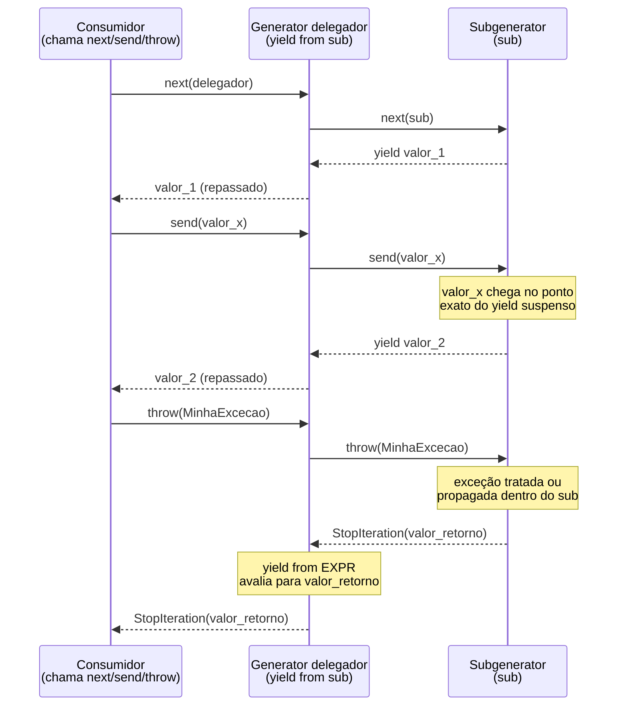

# yield from e delegação de generators

> [!abstract] TL;DR
> `yield from subgen` delega, de forma transparente, toda a iteração de um generator para outro: cada valor que o *subgenerator* produz sobe direto para quem está consumindo o *delegador*, e — o que importa de verdade — `send()`, `throw()` e `close()` chamados no delegador também são repassados para dentro do subgenerator, junto com o valor de retorno dele (via `StopIteration.value`). Antes do Python 3.3 (PEP 380, 2011), fatorar um `yield` para dentro de outra função exigia um loop manual (`for v in subgen: yield v`) que reproduzia apenas a metade fácil do protocolo — e quebrava silenciosamente em qualquer código que dependesse de `send`/`throw`/valor de retorno. `yield from` existe para fazer generators componíveis: dá pra fatorar, aninhar e encadear generators do mesmo jeito que se fatora funções normais, sem perder nenhuma parte do protocolo estabelecido em [[03-Dominios/Tecnologia/Python/Funcional e idiomas avançados/02 - Generators — yield e generator functions|Generators — yield e generator functions]].

Esta nota pressupõe o protocolo iterator ([[03-Dominios/Tecnologia/Python/Funcional e idiomas avançados/01 - Iterators e o protocolo __iter__ __next__|nota 01]]) e generators básicos com `yield`, `send()`, `throw()` e `close()` ([[03-Dominios/Tecnologia/Python/Funcional e idiomas avançados/02 - Generators — yield e generator functions|nota 02]]). Se esses dois conceitos ainda não estão sólidos, vale revisitá-los antes de seguir — o resto desta nota assume que "generator implementa o protocolo iterator de graça" e "`send()` reinjeta um valor no ponto do `yield`" já são frases que fazem sentido sem explicação adicional.

## O problema: fatorar código com `yield` sem quebrar o protocolo

Imagine que você tem um generator que percorre uma árvore de categorias de um catálogo de e-commerce — cada categoria pode ter subcategorias, e cada subcategoria pode ter mais subcategorias, recursivamente, até chegar nas categorias-folha (as que de fato têm produtos). Você quer um generator `percorrer(categoria)` que produza, em sequência, todas as categorias-folha da árvore, não importa a profundidade.

A tentação natural — sobretudo vindo de quem já é confortável com recursão em funções normais — é escrever isso de forma recursiva, chamando `percorrer` de dentro de si mesma:

```python
def percorrer_ingenuo(categoria):
    if not categoria.subcategorias:
        yield categoria
        return
    for sub in categoria.subcategorias:
        for folha in percorrer_ingenuo(sub):   # precisa re-yieldar manualmente
            yield folha
```

Funciona — para o caso simples de "só produzir valores". Mas repare no `for folha in percorrer_ingenuo(sub): yield folha`: isso é um loop manual de re-yield, e ele só resolve a metade fácil do protocolo generator. Se alguém chamar `.send(valor)` no generator externo esperando que esse valor chegue no `yield categoria` de dentro da recursão mais profunda, ele **não chega** — o `for` consome o subgenerator via `__next__()` puro, ignorando `send()`. Se alguém chamar `.throw(Exception)` no generator externo esperando propagar a exceção para dentro da recursão, ela **não propaga automaticamente** para o subgenerator certo — ela estoura no ponto do `for`, não no `yield` de dentro. E se o subgenerator mais profundo tiver um `return valor_final`, esse valor **se perde**: o loop `for` não tem como capturar o que veio no `StopIteration.value` daquele generator.

Esse é exatamente o problema que a [PEP 380](https://peps.python.org/pep-0380/) — aceita por Guido van Rossum em 26 de junho de 2011, implementada no Python 3.3 — descreve na sua motivação: "um pedaço de código contendo `yield` não pode ser fatorado e colocado numa função separada da mesma forma que outro código qualquer" sem perder parte do comportamento. A solução é uma palavra-chave que faz a delegação **completa**, não só a metade visível:

```python
def percorrer(categoria):
    if not categoria.subcategorias:
        yield categoria
        return
    for sub in categoria.subcategorias:
        yield from percorrer(sub)   # delegação completa, não só re-yield
```

Troca de `for folha in percorrer(sub): yield folha` por `yield from percorrer(sub)`. Visualmente é quase a mesma coisa. Semanticamente, é uma categoria de mecanismo diferente — e o resto desta nota explica exatamente por quê.

## O que `yield from` realmente faz

`yield from <expr>` recebe qualquer **iterável** (não precisa ser generator — pode ser uma lista, uma string, outro objeto iterator) e faz três coisas ao mesmo tempo, continuamente, até o iterável se esgotar:

1. **Puxa** cada valor produzido pelo iterável interno (o *subgenerator* ou *subiterador*) e **entrega** esse valor pra quem estiver consumindo o generator externo (o *delegador*) — como se o próprio delegador tivesse feito `yield` daquele valor.
2. **Repassa** qualquer valor enviado via `.send(valor)` no delegador diretamente para dentro do subgenerator, no ponto exato onde ele está suspenso.
3. **Propaga** qualquer exceção lançada via `.throw()` no delegador para dentro do subgenerator (via o `.throw()` dele), e propaga `.close()` da mesma forma — e, ao final, captura o valor de retorno do subgenerator (`StopIteration.value`) e o disponibiliza como o **valor da própria expressão** `yield from`.

> [!question]- "Delegação transparente" quer dizer o quê, exatamente?
> Quer dizer que, do ponto de vista de quem está **consumindo** o generator externo (chamando `next()` ou `send()` nele), não há diferença observável entre "esse valor veio de um `yield` direto aqui dentro" e "esse valor veio de um `yield` dentro de um subgenerator, três níveis de delegação abaixo". A cadeia de delegação inteira se comporta como um único generator "achatado" — o consumidor não precisa saber, e normalmente não sabe, que existe uma árvore de generators por trás. É a mesma ideia de transparência que uma função normal tem ao chamar outra função: quem chama não precisa saber quantas camadas de chamada existem por baixo para receber o `return`.

A [PEP 380](https://peps.python.org/pep-0380/) formaliza isso descrevendo o que `yield from EXPR` **expande para**, em pseudocódigo — cerca de 30 linhas de tratamento de protocolo que cobrem: obter o iterador de `EXPR`, fazer o primeiro `next()`, entrar num loop que trata separadamente "o consumidor chamou `send()`", "o consumidor chamou `throw()`" e "o consumidor chamou `close()`" (via `GeneratorExit`), repassando cada caso para o método correspondente do subiterador, e finalmente capturando `StopIteration` para extrair `.value`. Ninguém escreve esse pseudocódigo à mão — é exatamente o trabalho que `yield from` poupa.



Repare nos dois últimos passos do diagrama: quando o subgenerator se esgota (levanta `StopIteration` internamente, o que acontece sozinho quando ele chega ao fim do corpo ou executa um `return`), o **valor** carregado por esse `StopIteration` vira o valor da expressão `yield from` — não um `yield` a mais, um **valor de retorno de expressão**, algo que só existe porque `yield from` foi desenhado como expressão, não como statement puro.

`yield from` em uma frase: é `for v in sub: yield v` com superpoderes — a mesma iteração, mas com `send`, `throw`, `close` e valor de retorno todos repassados pro subgenerator automaticamente, em vez de precisarem ser reimplementados à mão.

## Propagação de valores enviados (`send`)

O exemplo mais didático de por que a versão manual (`for v in sub: yield v`) falha é com `send()`. Considere um subgenerator que **usa** o valor recebido via `send()`, não só produz valores:

```python
def acumulador():
    total = 0
    while True:
        valor = yield total
        if valor is None:
            continue
        total += valor

def delegador():
    yield from acumulador()

gen = delegador()
next(gen)          # "arranca" o generator, avança até o primeiro yield: devolve 0
print(gen.send(10))  # 10
print(gen.send(5))   # 15
print(gen.send(20))  # 35
```

Isso funciona porque `yield from acumulador()` está de fato encaminhando cada `.send(valor)` chamado em `gen` para dentro do `yield total` suspenso lá dentro de `acumulador()`. Se você trocasse `yield from acumulador()` por `for total in acumulador(): yield total`, o programa quebraria de um jeito sutil: o `for` consome `acumulador()` chamando `next()` implicitamente — nunca `send()` — então o `valor = yield total` de dentro de `acumulador` **sempre receberia `None`**, o acumulador nunca acumularia nada de verdade, e o bug não geraria nenhum erro, só um resultado silenciosamente errado. Esse é o tipo de defeito que passa despercebido em code review, porque o código "roda sem exceção" — só produz o resultado errado.

## Propagação de exceções (`throw` e `close`)

O mesmo raciocínio vale para `.throw()`. Se o consumidor externo chama `gen.throw(ValorInvalidoError)`, `yield from` repassa essa exceção para dentro do subgenerator ativo, no ponto exato onde ele está suspenso — dando a ele a chance de tratá-la com um `try/except` ao redor do `yield`, ou deixá-la subir. Sem `yield from`, reproduzir esse comportamento manualmente exigiria capturar a exceção no delegador e chamar `.throw()` explicitamente no subgenerator — código que praticamente ninguém escreve certo na primeira tentativa, porque envolve casos de borda (o subgenerator pode não ter `try/except`, pode levantar uma exceção diferente, pode já estar fechado).

`.close()` segue a mesma lógica: fechar o generator delegador propaga `GeneratorExit` para dentro do subgenerator ativo — permitindo que blocos `finally` dentro dele rodem (por exemplo, para liberar um recurso que o subgenerator estava segurando), antes do delegador terminar de fechar.

> [!warning] Capturar `GeneratorExit` sem relançar quebra a composição
> A própria [PEP 380](https://peps.python.org/pep-0380/) documenta essa limitação explicitamente: "um bloco de código que captura `GeneratorExit` sem depois relançá-lo não pode ser fatorado [para um subgenerator] mantendo exatamente o mesmo comportamento". Se um generator tem um `except GeneratorExit: <faz algo e não relança>` no corpo, mover esse bloco para dentro de um subgenerator chamado via `yield from` muda o comportamento observável — porque `close()` espera, por protocolo, que `GeneratorExit` suba (ou seja engolida de um jeito que ainda termine o generator). É um caso raro, mas é a única ressalva formal que a própria proposta reconhece como refatoração não 100% transparente.

## O valor de retorno: `StopIteration.value`

Generators podem ter `return valor` no corpo — isso não devolve `valor` como um `yield` (não produz mais um item pra iteração), mas anexa `valor` ao `StopIteration` que o generator levanta ao terminar. Quem consome o generator via `for` nunca vê esse valor (o `for` captura o `StopIteration` internamente e descarta o `.value`). Mas quem delega via `yield from` **recebe** esse valor como o resultado da própria expressão:

```python
def processa_lote(itens):
    processados = 0
    for item in itens:
        yield item.upper()
        processados += 1
    return processados          # vira StopIteration(processados)

def pipeline(lotes):
    total_geral = 0
    for lote in lotes:
        total_lote = yield from processa_lote(lote)   # captura o return
        total_geral += total_lote
    return total_geral

lotes = [["a", "b"], ["c", "d", "e"]]
gen = pipeline(lotes)
for item in gen:
    print(item)
# a
# b
# c
# d
# e
```

`total_lote = yield from processa_lote(lote)` é a linha que importa: `processa_lote` produz `"A"`, `"B"` (dois itens, no lote 1), e ao terminar levanta `StopIteration(2)` — porque `processados` chegou a `2`. `yield from` captura esse `2` e o atribui a `total_lote`, exatamente como se `processa_lote` fosse uma função normal que "retornasse" `2` depois de também ter produzido valores pelo caminho. Isso é impossível de reproduzir de forma limpa com o loop manual `for v in sub: yield v` — não existe onde capturar o `.value` do `StopIteration` num `for` comum sem reescrever o loop à mão com `try/except StopIteration as e: return e.value`.

> [!question]- Por que `return` dentro de um generator não simplesmente "sai" como numa função normal?
> Porque semanticamente ele **sai** — o `return` encerra a execução do generator ali, exatamente como faria numa função normal. A diferença é só *como* esse encerramento é comunicado para fora: uma função normal devolve o valor via `return` puro; um generator, por já estar no meio de um protocolo de iteração baseado em exceções (`StopIteration` é o sinal padrão de "acabou"), precisa embutir esse valor *dentro* do `StopIteration` que ele já ia levantar de qualquer forma. `return valor` dentro de um generator é literalmente açúcar sintático para `raise StopIteration(valor)` — só que sem os problemas de levantar `StopIteration` manualmente dentro de um generator (que a [PEP 479](https://peps.python.org/pep-0479/) baniu, transformando isso em `RuntimeError`, justamente para evitar que um `StopIteration` acidental dentro do corpo do generator fosse confundido com o fim legítimo da iteração).

## Sob o capô: a expansão equivalente

Vale ver, ao menos uma vez, uma versão simplificada do que `yield from EXPR` "significa" em termos do protocolo generator mais básico — não para memorizar, mas para consolidar por que a versão manual é tão trabalhosa de acertar. A [PEP 380](https://peps.python.org/pep-0380/) apresenta essa expansão formalmente em pseudocódigo; a versão abaixo é uma simplificação didática, sem tratar todos os casos de borda (a real cobre também o caso de `close()` sendo chamado antes do primeiro `next()`, entre outros):

```python
# yield from SUBGEN é, em espírito, equivalente a:

_sub = iter(SUBGEN)
_valor_enviado = None
_resultado = None
while True:
    try:
        if _valor_enviado is None:
            _proximo = next(_sub)
        else:
            _proximo = _sub.send(_valor_enviado)
    except StopIteration as e:
        _resultado = e.value      # aqui nasce o "valor de retorno" de yield from
        break
    try:
        _valor_enviado = yield _proximo   # repassa pro consumidor externo
    except GeneratorExit:
        _sub.close()
        raise
    except BaseException as exc:
        _sub.throw(exc)            # repassa exceção recebida via .throw()
        _valor_enviado = None
```

Repare no tamanho: são mais de quinze linhas para reproduzir manualmente o que `yield from` faz em uma. E essa versão simplificada ainda erra alguns detalhes finos (por exemplo, tratar corretamente o caso em que `_sub.throw()` por sua vez levanta um novo `StopIteration`, sinalizando que o subgenerator tratou a exceção e terminou). É exatamente esse tipo de código — denso, cheio de casos de borda, fácil de escrever errado — que motivou a PEP 380 a existir como sintaxe dedicada em vez de "só documentar o padrão e deixar cada um implementar".

## `yield from` vs. alternativas próximas

Antes de ir para os casos práticos, vale posicionar `yield from` contra dois primos próximos com os quais ele costuma ser confundido — `itertools.chain` e o loop `for` manual — porque a escolha errada entre eles é uma fonte comum de código subutilizado (ou de bugs sutis, como já visto na seção de `send()`):

| Ferramenta | Repassa `send`/`throw`/`close`? | Captura valor de retorno? | Quando usar |
|---|---|---|---|
| `yield from subgen` | Sim, integralmente | Sim (`StopIteration.value`) | Subgenerator é de fato um generator (tem estado interno, pode receber `send`/`throw`) ou você precisa do valor de retorno dele |
| `for v in subgen: yield v` | Não (só consome via `next()`) | Não (descarta o `StopIteration.value`) | Você precisa **transformar** cada valor em trânsito (ex.: `yield v * 2`), ou o "subgenerator" é algo simples onde `send`/`throw`/retorno nunca vão importar |
| `itertools.chain(a, b, c)` | Não é generator delegado — é um iterador que concatena vários iteráveis em sequência | Não (não tem noção de "valor de retorno" de generator) | Concatenar **múltiplos** iteráveis estáticos (listas, tuplas, outros generators já esgotáveis) sem nenhuma necessidade de `send`/`throw`; mais direto e mais idiomático quando não há delegação bidirecional envolvida |

`itertools.chain` (já apresentado no Galho 2, [[03-Dominios/Tecnologia/Python/Collections e Comprehensions/index|Collections e Comprehensions]]) e `yield from` resolvem problemas parecidos na superfície — "juntar vários iteráveis num só" — mas partem de motivações diferentes: `chain` é sobre **concatenação** de sequências que já existem; `yield from` é sobre **delegação** de um generator para outro, preservando um canal de comunicação bidirecional que `chain` nunca teve motivo para existir. Um pipeline que só concatena listas fixas normalmente é mais claro com `itertools.chain(*listas)`; um pipeline que delega para generators com estado (como o `acumulador()` da seção anterior) só funciona corretamente com `yield from`.

## Casos práticos

### Flatten de estruturas aninhadas

O exemplo mais citado de `yield from` — e o que aparece com mais frequência em entrevistas técnicas — é achatar (*flatten*) uma estrutura aninhada arbitrariamente profunda, como uma lista de listas de listas:

```python
def flatten(estrutura):
    """Achata uma lista arbitrariamente aninhada de números."""
    for item in estrutura:
        if isinstance(item, list):
            yield from flatten(item)   # delega pra chamada recursiva
        else:
            yield item

dados = [1, [2, 3, [4, 5, [6]], 7], 8]
print(list(flatten(dados)))
# [1, 2, 3, 4, 5, 6, 7, 8]
```

Esse padrão — `yield from` chamando a própria função recursivamente — é o motivo pelo qual `yield from` costuma ser apresentado como "recursão para generators". Cada nível de aninhamento vira uma nova instância do generator, delegando pro nível seguinte, até chegar num item que não é lista — que aí sim é produzido com `yield` direto. A cadeia inteira de delegação (que pode ter profundidade arbitrária) se comporta, para quem consome `flatten(dados)` com um `for`, como um único generator plano — exatamente a "transparência" descrita na seção anterior.

### Pipeline de generators (composição de etapas)

Outro uso real e comum: compor várias etapas de processamento de dados como generators separados, e usar `yield from` para expor a composição como um único generator, sem esconder a estrutura em uma função monolítica:

```python
def ler_linhas(caminho):
    with open(caminho, encoding="utf-8") as f:
        for linha in f:
            yield linha.rstrip("\n")

def filtrar_vazias(linhas):
    for linha in linhas:
        if linha.strip():
            yield linha

def normalizar(linhas):
    for linha in linhas:
        yield linha.strip().lower()

def pipeline_arquivo(caminho):
    """Composição das três etapas, exposta como um único generator."""
    yield from normalizar(filtrar_vazias(ler_linhas(caminho)))
```

Aqui `yield from` não está delegando recursivamente — está **compondo** três generators independentes, cada um responsável por uma única transformação (ler, filtrar, normalizar), numa cadeia lazy: nenhuma linha do arquivo é lida até que alguém peça o primeiro item de `pipeline_arquivo(...)`, e cada linha passa pelas três etapas antes da próxima ser sequer lida do disco. Cada etapa poderia, isoladamente, ter sido escrita como `for linha in origem: yield linha_transformada` — mas usar `yield from` no ponto de composição final garante que, se alguma dessas etapas precisar futuramente de `send()` (por exemplo, para ajustar dinamicamente um filtro em runtime) ou levantar uma exceção customizada tratável via `.throw()`, o pipeline continua funcionando sem reescrever a camada de composição.

### Delegação com tratamento de exceção e liberação de recurso

O terceiro caso prático mostra por que a propagação de `throw()`/`close()` não é só um detalhe teórico — ela é o que permite que um subgenerator libere recursos corretamente mesmo quando é consumido só indiretamente, através de um delegador. Imagine um generator que abre uma conexão simulada e a fecha de forma garantida, não importa como a iteração termine:

```python
def linhas_de_conexao(nome_recurso):
    print(f"[abrindo {nome_recurso}]")
    try:
        for i in range(1, 4):
            valor = yield f"{nome_recurso}:linha-{i}"
            if valor == "abortar":
                raise ValueError(f"abortado em {nome_recurso}")
    finally:
        print(f"[fechando {nome_recurso}]")   # roda mesmo em close()/throw()

def consumir_varios(recursos):
    for nome in recursos:
        yield from linhas_de_conexao(nome)

gen = consumir_varios(["db-primaria", "db-replica"])
print(next(gen))   # [abrindo db-primaria] -> db-primaria:linha-1
gen.close()         # [fechando db-primaria] — finally roda mesmo sem terminar a iteração
```

Ao chamar `gen.close()` no delegador, `yield from` propaga `GeneratorExit` para dentro de `linhas_de_conexao("db-primaria")`, que está suspenso no `yield` — isso faz o `finally` rodar e imprimir `[fechando db-primaria]`, exatamente como aconteceria se `close()` tivesse sido chamado diretamente no subgenerator, sem nenhuma camada de delegação no meio. Se `consumir_varios` tivesse sido escrito com o loop manual `for linha in linhas_de_conexao(nome): yield linha`, o `close()` do delegador **não propagaria** `GeneratorExit` para dentro do subgenerator da mesma forma — o `for` simplesmente pararia de pedir `next()`, deixando o generator interno suspenso, com o `finally` pendente de rodar até o coletor de lixo eventualmente encerrá-lo (o que acontece, mas em um momento não determinístico, e não imediatamente no `close()`). Para código que depende de liberar recursos (conexões, arquivos, locks) de forma determinística, essa diferença de timing é exatamente o tipo de bug que só aparece sob carga em produção.

### Um pipeline de comandos bidirecional (comunicação vai e volta de verdade)

Os três casos anteriores mostram `yield from` produzindo valores (com exceção do acumulador, que só ilustrou `send()` isolado). Vale um último exemplo que junta as três capacidades — valores produzidos, valores enviados e exceções — porque é o cenário onde a diferença entre `yield from` e o loop manual deixa de ser sutil e passa a ser a diferença entre "funciona" e "não funciona":

```python
class ComandoInvalido(Exception):
    pass

def processador_de_lote(nome_lote):
    resultados = []
    while True:
        try:
            comando = yield f"{nome_lote}: aguardando comando"
        except ComandoInvalido as exc:
            yield f"{nome_lote}: erro tratado — {exc}"
            continue
        if comando == "finalizar":
            return resultados
        resultados.append(f"{nome_lote}:{comando}")

def coordenador(nomes_lote):
    relatorio = {}
    for nome in nomes_lote:
        sub = processador_de_lote(nome)
        # delega, mas ainda quer decidir quando enviar/lançar em cada subgenerator
        primeira_mensagem = yield from sub
        relatorio[nome] = primeira_mensagem
    return relatorio
```

Esse esqueleto — um subgenerator que mantém uma máquina de estados própria (`while True` esperando comandos), tratando exceções específicas de domínio (`ComandoInvalido`) e devolvendo um resultado agregado via `return` — só é compunível com `yield from` porque as três coisas que ele depende (receber via `send()`, receber `.throw(ComandoInvalido(...))` e devolver `resultados` via `return`) são justamente as três que a versão manual com `for` não propaga. É o tipo de padrão que aparece em geradores usados como "processadores de comando" — parsers de protocolo linha a linha, máquinas de estado para parsing de streaming, ou consumidores de filas que precisam reagir tanto a itens normais quanto a sinais especiais (erro, cancelamento, fim de lote) — todos beneficiados pela composição transparente que `yield from` garante.

## Armadilhas comuns

> [!warning] Confundir `yield from iteravel` com `for v in iteravel: yield v` em qualquer contexto
> Para simples produção de valores sem `send`/`throw`/valor de retorno em jogo, as duas formas são observacionalmente equivalentes — e por isso o erro passa despercebido por muito tempo. O problema aparece só quando alguém, em algum ponto futuro do código, começa a depender de `send()`, `.throw()` ou do valor de retorno do subgenerator, e a versão com `for` silenciosamente não propaga nada disso. A prática mais segura: usar `yield from` por padrão sempre que o "subgenerator" for de fato um generator (não uma lista/tupla estática), reservando o `for` explícito para os casos em que você **precisa** interceptar/transformar cada valor no meio do caminho (ex.: `for v in sub: yield v * 2` — aí sim o `for` é necessário, porque `yield from` não permite transformar valores em trânsito).

> [!warning] Recursão sem caso base em `yield from` recursivo
> No exemplo de `flatten`, o caso base é implícito: quando `item` não é `list`, a função não chama `flatten` de novo, ela faz `yield item` direto. Esquecer esse caso base (por exemplo, tratar `str` como iterável genérico dentro de `flatten` sem checar `isinstance(item, str)` primeiro) causa recursão infinita silenciosa em runtime — porque uma string é iterável, e iterar sobre ela produz strings de um caractere, que também são iteráveis, indefinidamente. É um erro clássico de quem generaliza demais a condição de "é uma sequência aninhada" sem excluir explicitamente strings (e bytes) do caso recursivo.

> [!warning] `yield from` não funciona em `async def` — o equivalente é `async for`
> `yield from` é sintaxe específica de generators síncronos regulares (`def` com `yield`). Dentro de um **async generator** (`async def` com `yield`), `yield from` não é sintaxe válida — o Python levanta `SyntaxError`. A composição equivalente em código assíncrono usa `async for item in subgen: yield item` explicitamente, porque a PEP 380 antecede o `async`/`await` (PEP 492, 2015) e nunca foi estendida para cobrir o caso assíncrono da mesma forma transparente. Esse é um tópico que retomamos com profundidade quando a trilha chegar em [[03-Dominios/Tecnologia/Python/Concorrência e paralelismo/index|Concorrência e paralelismo]] e `asyncio`.

## Fundamento teórico: generators como corrotinas restritas

`yield from` só faz sentido pleno quando se entende que, a partir da introdução de `send()` na [PEP 342](https://peps.python.org/pep-0342/) (Python 2.5, 2006), generators deixaram de ser "só produtores de valores" e passaram a ser uma forma restrita de **corrotina** — uma função que pode ser suspensa e retomada, recebendo dados na retomada, não só devolvendo dados na suspensão. A palavra "restrita" importa: um generator clássico só pode ceder controle (`yield`) para seu chamador **imediato**, nunca para um chamador mais acima na pilha. Isso é exatamente a limitação que a motivação da PEP 380 descreve — "não dá para fatorar um trecho com `yield` numa função separada sem que essa função vire, ela também, um generator, exigindo iteração e re-`yield` explícitos".

`yield from` resolve essa limitação criando uma **cadeia transparente de suspensão**: o subgenerator continua só podendo suspender para seu chamador imediato (o delegador), mas o delegador, por sua vez, repassa automaticamente essa suspensão para cima, até quem estiver de fato consumindo a cadeia inteira. O efeito observável é como se a restrição "só posso ceder pro meu chamador imediato" tivesse sido contornada — mas na verdade ela nunca foi violada, só automatizada em cada elo da cadeia. Essa distinção é relevante historicamente porque é o mesmo problema — "como compor corrotinas em cadeia sem reimplementar o protocolo manualmente em cada nível" — que, anos depois, motivou parte do desenho de `async`/`await` (PEP 492, 2015): `await` faz, para corrotinas nativas assíncronas, algo estruturalmente parecido com o que `yield from` faz para generators síncronos, delegando a suspensão através de camadas de chamada. Não é coincidência que, por um tempo, a própria biblioteca `asyncio` (antes de `async`/`await` virarem sintaxe própria) foi implementada usando generators decorados com `@asyncio.coroutine` e `yield from` como mecanismo de delegação — a ponte histórica entre os dois mecanismos é direta.

> [!warning] Cadeias profundas de `yield from` têm custo de repasse por nível
> Cada `next()`/`send()` chamado no generator mais externo de uma cadeia de delegação precisa atravessar, em CPython, cada nível intermediário até chegar no subgenerator que de fato está suspenso no `yield` — o repasse não é "gratuito": é trabalho de VM proporcional à profundidade da cadeia a cada valor produzido. Para o exemplo de `flatten` desta nota, com estruturas de profundidade razoável (dezenas de níveis), isso é irrelevante. Mas em pipelines com **centenas** de camadas de delegação encadeadas — algo mais comum em código gerado programaticamente do que em código escrito à mão — o overhead de atravessar a cadeia inteira a cada item pode se tornar mensurável. Não é motivo para evitar `yield from`; é motivo para não empilhar delegação além do que a estrutura do problema realmente pede.

## Em entrevista

"Explique `yield from`" é uma pergunta comum em entrevistas de nível pleno/sênior para Python, porque separa quem só decorou "serve pra chamar generator dentro de generator" de quem entende o protocolo por baixo. A resposta forte tem três camadas, na ordem certa:

1. **O que faz visivelmente**: delega a iteração completa de um subiterável para o generator delegador — cada valor produzido pelo subiterável sobe transparente para o consumidor.
2. **O que faz por baixo, que um `for` manual não faz**: repassa `send()` e `throw()` para dentro do subgenerator no ponto exato de suspensão dele, e captura o valor de `return` do subgenerator (via `StopIteration.value`) como o valor da própria expressão `yield from`.
3. **Quando usar de verdade**: composição de generators (pipelines de processamento lazy) e recursão sobre estruturas aninhadas (flatten), onde o subgenerator precisa se comportar exatamente como se seu código estivesse "colado" dentro do generator externo.

> [!question]- O entrevistador pergunta: "então `yield from` é só açúcar sintático para um `for` com `yield`?"
> Não — e essa é a pegadinha mais comum da pergunta. Para o caso trivial (só produzir valores, sem `send`/`throw`/retorno), os dois são observacionalmente equivalentes, então é tentador dizer "sim, é açúcar sintático". Mas a resposta precisa é: `yield from` é açúcar sintático para um protocolo bem mais completo — a própria PEP 380 formaliza isso como uma expansão de ~30 linhas cobrindo `send`, `throw`, `close` e `StopIteration.value`, nenhuma delas coberta por um `for` simples. Vale citar o exemplo do acumulador com `send()`: é o jeito mais rápido de mostrar, ao vivo, um caso onde a versão com `for` produz um bug silencioso (sempre recebe `None`) que `yield from` não tem.

> [!question]- "Me dá um exemplo de código que usaria isso" — o que responder na hora, sem preparo?
> `flatten` é a resposta segura e universalmente reconhecível: uma função de 5 linhas que achata uma lista arbitrariamente aninhada, usando `yield from flatten(item)` no caso recursivo. Ela é curta o suficiente para escrever de cabeça num quadro branco ou compartilhar de tela, ilustra a delegação recursiva (o uso mais comum de `yield from` no dia a dia, mais comum até que composição de pipeline), e abre naturalmente para uma pergunta de acompanhamento previsível — "o que acontece se eu passar uma string dentro da lista?" — que é exatamente a armadilha do caso base tratada nesta nota. Ter esse exemplo pronto, sem precisar reconstruir do zero sob pressão, é o tipo de preparo que faz a diferença entre "sei explicar o conceito" e "sei aplicar o conceito ao vivo".

## How to explain in English

| PT-BR | English |
|---|---|
| delegação de generator | generator delegation |
| subgenerator | subgenerator |
| generator delegador | delegating generator |
| valor de retorno do generator | generator return value |
| achatar estrutura aninhada | flatten a nested structure |
| pipeline de generators | generator pipeline |
| repassar exceção | propagate / forward the exception |
| esgotar o iterável | exhaust the iterable |

**Ready-made sentence for interviews:**

> "`yield from` delegates iteration to a subgenerator transparently — not just the values it yields, but also `send()`, `throw()`, and `close()` get forwarded to the exact suspension point inside the subgenerator, and its return value becomes available through `StopIteration.value`. A plain `for v in sub: yield v` loop only reproduces the value-yielding part, so it silently breaks anything that depends on sending values in or capturing a return value out — which is exactly the gap PEP 380 was written to close."

## O que vem a seguir

`yield from` fecha o bloco "generators e iteração" do galho — a próxima nota muda de eixo, de iteração para **escopo e estado capturado**: [[03-Dominios/Tecnologia/Python/Funcional e idiomas avançados/04 - Closures de verdade|04 — Closures de verdade]] explica como uma função interna "lembra" variáveis do escopo onde foi criada, o papel de `nonlocal`, e a armadilha clássica do *late binding* em closures dentro de loops — um mecanismo tão fundamental para decorators (as próximas duas notas do galho) quanto generators são para pipelines lazy.

- [[03-Dominios/Tecnologia/Python/Funcional e idiomas avançados/04 - Closures de verdade|04 — Closures de verdade]] — muda de "como produzir uma sequência de valores" para "como uma função captura estado do escopo em que nasceu"; pré-requisito direto para decorators.
- [[03-Dominios/Tecnologia/Python/Funcional e idiomas avançados/08 - Context managers via generator|08 — Context managers via generator]] — reaproveita o mesmo generator com `yield`, mas usado para dividir `__enter__`/`__exit__` em vez de produzir uma sequência.
- [[03-Dominios/Tecnologia/Python/Collections e Comprehensions/index|Galho 2 — Collections e Comprehensions]] — onde `itertools` (já visto ali) resolve, com funções prontas da stdlib, boa parte do que `yield from` resolveria manualmente em pipelines simples.

## Fontes

- PEP 380 — *Syntax for Delegating to a Subgenerator*: https://peps.python.org/pep-0380/ (motivação, semântica formal, ressalvas sobre `GeneratorExit` e `StopIteration` explícito)
- PEP 342 — *Coroutines via Enhanced Generators*: https://peps.python.org/pep-0342/ (introdução de `send()`/`throw()`/`close()`, origem de generators como corrotina restrita)
- PEP 479 — *Change StopIteration handling inside generators*: https://peps.python.org/pep-0479/ (por que `return valor` dentro de generator não pode simplesmente `raise StopIteration(valor)` cru)
- PEP 492 — *Coroutines with async and await syntax*: https://peps.python.org/pep-0492/ (contexto de por que `yield from` não se estende a `async def`/async generators)
- Documentação oficial — *The yield statement* (referência de linguagem, seção sobre `yield from`): https://docs.python.org/3/reference/simple_stmts.html#the-yield-statement
- Documentação oficial — módulo `itertools` (composição de iteradores como alternativa/complemento a `yield from` em pipelines simples): https://docs.python.org/3/library/itertools.html
- Real Python — *How to Use Generators and yield in Python*: https://realpython.com/introduction-to-python-generators/
- Fluent Python (Luciano Ramalho), 2ª edição — capítulo sobre *Classic Coroutines* / iteradores e generators, seção sobre `yield from` e delegação

Consultado em 2026-07-10.
