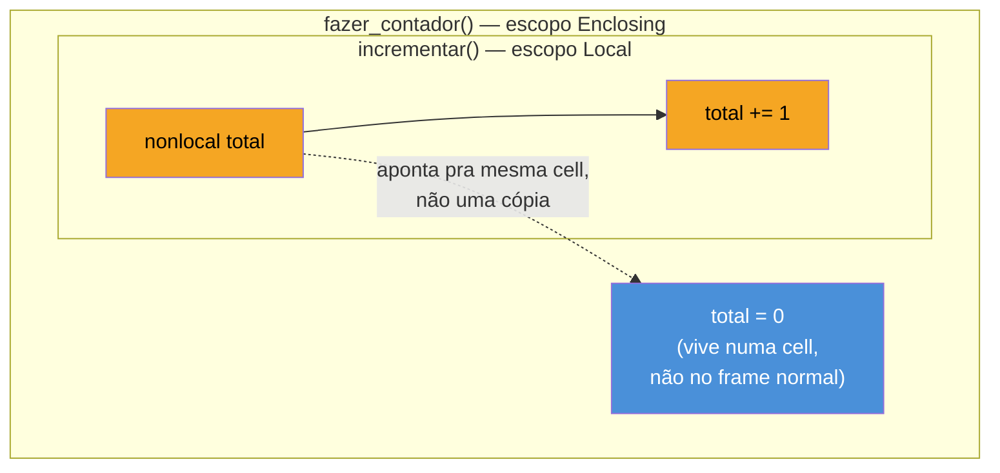
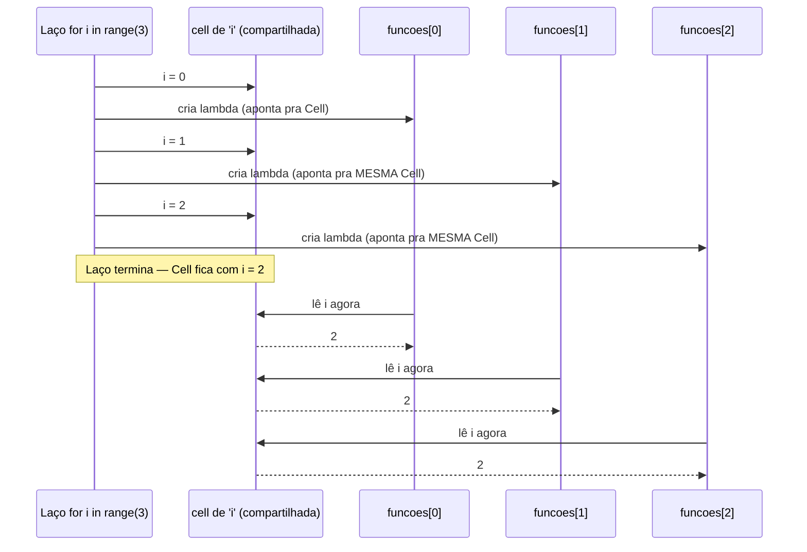

# Closures de verdade

> [!abstract] TL;DR
> Uma **closure** é uma função que carrega consigo o escopo de onde nasceu: quando uma função interna referencia uma variável da função externa que a envolve (uma **free variable**), Python não copia o valor daquela variável para dentro da função interna — ele mantém uma **referência viva** à célula de memória onde ela mora, mesmo depois que a função externa já terminou de executar e, em teoria, deveria ter descartado suas variáveis locais. Ler uma free variable funciona de graça; **reatribuí-la** exige a palavra-chave `nonlocal` (PEP 3104, Python 3.0), o par de `global` para o escopo enclosing. Esse mecanismo é o que torna possível **factory functions** — funções que fabricam e devolvem outras funções, cada uma com seu próprio estado privado e independente. E é também a origem de uma armadilha clássica: como a busca da free variable acontece **no momento em que a closure é chamada**, não no momento em que ela foi criada (**late binding**), lambdas criadas dentro de um loop compartilhando a mesma variável de controle todas terminam enxergando o **mesmo** valor final — não o valor que existia "na hora" de cada iteração. Java resolve esse risco na raiz proibindo lambdas de capturar variáveis mutáveis (`effectively final`); Python resolve com disciplina do desenvolvedor: capturar o valor explicitamente, via parâmetro default ou `functools.partial`.

## O bug que abre esta nota

Um desenvolvedor está montando uma pequena interface com três botões, um para cada categoria de produto de uma loja, e quer que cada botão, ao ser clicado, imprima o nome da sua própria categoria:

```python
categorias = ["Eletrônicos", "Livros", "Roupas"]

callbacks = []
for categoria in categorias:
    def ao_clicar():
        print(f"Categoria selecionada: {categoria}")
    callbacks.append(ao_clicar)

for callback in callbacks:
    callback()
```

A expectativa razoável — e o motivo de essa armadilha pegar tanta gente de surpresa — é que a saída seja `Eletrônicos`, `Livros`, `Roupas`, uma por callback, na ordem em que cada função foi "capturada" dentro do loop. A saída real é:

```text
Categoria selecionada: Roupas
Categoria selecionada: Roupas
Categoria selecionada: Roupas
```

As três funções, criadas em três iterações diferentes do `for`, imprimem exatamente a mesma coisa: o **último** valor que `categoria` assumiu. Não é um bug de cópia acidental nem uma falha do interpretador — é uma consequência direta e documentada de como Python resolve nomes dentro de uma closure, chamada **late binding**: cada `ao_clicar` não guarda o valor de `categoria` no instante em que foi definida — ela guarda uma referência à *variável* `categoria`, e só vai perguntar "qual é o valor disso agora?" no momento em que for de fato chamada. Como o loop já terminou quando os callbacks rodam, e `categoria` é a mesma variável reaproveitada nas três voltas do `for`, todas as três funções enxergam o valor que sobrou lá: `"Roupas"`.

Essa nota dissseca esse mecanismo até o fim: o que exatamente uma closure guarda (não é o valor — é uma célula compartilhada), como `nonlocal` permite reatribuir uma free variable, como *factory functions* usam esse mecanismo para fabricar funções com estado próprio, e as duas ou três formas idiomáticas de consertar a armadilha do loop quando ela aparecer de verdade em código de produção.

## O que é: closure é função + escopo capturado

A [[03-Dominios/Tecnologia/Python/Core/06 - Funções — definição, argumentos e escopo básico|nota 06 do Core]] já introduziu a regra **LEGB** e deixou explícito, na própria seção de escopo, que o tratamento completo de closures ficaria para este galho. Vale recapitular rapidamente o ponto onde aquela nota parou, porque é exatamente daqui que esta continua: o nível **Enclosing (E)** do LEGB só existe quando há uma função aninhada dentro de outra, e nomes atribuídos na função externa ficam visíveis (para leitura) dentro da função interna, um nível acima do Local.

Uma **closure**, tecnicamente, não é qualquer função aninhada — é uma função interna que **referencia pelo menos uma variável do escopo enclosing** e é devolvida (ou de alguma forma sobrevive) além do tempo de vida normal da função externa. Essa variável referenciada, sem ser nem parâmetro nem atribuição local da função interna, é chamada de **free variable** — "livre" porque não está vinculada (bound) ao escopo local de quem a usa.

```python
def fazer_multiplicador(fator):
    def multiplicar(numero):
        return numero * fator   # 'fator' é uma free variable aqui
    return multiplicar

dobrar = fazer_multiplicador(2)
triplicar = fazer_multiplicador(3)

print(dobrar(5))       # 10
print(triplicar(5))    # 15
```

O ponto que costuma soar contraintuitivo na primeira leitura: `fazer_multiplicador(2)` termina de executar — sua chamada volta, seu frame de execução deveria, em princípio, deixar de existir — e ainda assim `dobrar(5)` continua enxergando `fator = 2` normalmente, muito depois. `dobrar` **é** uma closure: ela carrega consigo o pedaço do escopo de `fazer_multiplicador` de que precisa (nesse caso, só `fator`), independentemente de `fazer_multiplicador` já ter retornado.

> [!question]- Isso não deveria vazar memória? Como uma variável "de uma função que já terminou" continua viva?
> Porque o modelo mental de "quando a função termina, suas variáveis locais são destruídas" está incompleto para quem faz parte de uma closure. O interpretador do CPython detecta, em tempo de **compilação** do código-fonte (a mesma análise estática que decide o LEGB de cada nome), que `fator` é referenciada por uma função aninhada que sobrevive ao retorno de `fazer_multiplicador`. Quando isso acontece, `fator` deixa de ser uma variável local comum (guardada direto no frame de pilha, descartada quando a função retorna) e passa a viver numa **cell** — um pequeno objeto de heap, alocado à parte, cujo único trabalho é guardar uma referência a um valor. `fazer_multiplicador` referencia essa cell; `multiplicar` também referencia essa mesma cell. Enquanto qualquer um dos dois estiver vivo — e `dobrar`/`triplicar` claramente continuam vivos, guardados em variáveis do módulo — a cell (e o valor que ela aponta) não é coletada pelo garbage collector. É o mesmo princípio de contagem de referências que mantém qualquer outro objeto Python vivo; cells não são um caso especial nesse sentido, só um nível extra de indireção.

## Por que importa

Closures são o mecanismo por trás de várias ferramentas que este galho já cobriu ou vai cobrir: decorators (próxima nota) são, por definição, closures que envolvem a função original; `functools.partial` e memoização manual dependem de estado capturado; até mesmo o padrão de fábrica de validadores, parsers configuráveis, e callbacks de UI (como o exemplo de abertura) se apoiam em closures para carregar configuração sem precisar de uma classe inteira só para guardar um valor e um método `__call__`. Entender o mecanismo de verdade — que uma closure captura a **variável**, não o **valor**, e que essa captura é resolvida tardiamente — é o que separa quem usa closures corretamente de quem tropeça na armadilha do loop na primeira vez que escreve uma em produção (e, frequentemente, na segunda e na terceira também, até internalizar o modelo).

## Como funciona

### `nonlocal`: reatribuindo uma free variable

Ler uma free variable, como no exemplo de `fazer_multiplicador`, não exige nada especial — segue a mesma regra de leitura "atravessa escopos livremente" que a nota do Core já estabeleceu para o LEGB inteiro. O problema aparece quando a função interna tenta **reatribuir** essa variável, não só lê-la:

```python
def fazer_contador():
    total = 0
    def incrementar():
        total += 1   # UnboundLocalError
        return total
    return incrementar

contador = fazer_contador()
contador()
```

Isso levanta `UnboundLocalError: cannot access local variable 'total' where it is not associated with a value` — o mesmo erro, pela mesma razão, que a nota do Core já documentou para o caso `global`: o compilador detecta uma atribuição a `total` dentro do corpo de `incrementar()` (`total += 1` é, por baixo, `total = total + 1`) e decide, para a função inteira, que `total` é uma variável **local** de `incrementar` — não a free variable de `fazer_contador`. Como nenhuma atribuição prévia deu um valor a essa suposta variável local antes da linha `total += 1`, o lado direito da expressão tenta ler algo que ainda não existe.

A correção é a palavra-chave `nonlocal`, formalizada na [PEP 3104 — Access to Names in Outer Scopes](https://peps.python.org/pep-3104/) e introduzida no Python 3.0 (não existe em Python 2):

```python
def fazer_contador():
    total = 0
    def incrementar():
        nonlocal total
        total += 1
        return total
    return incrementar

contador = fazer_contador()
print(contador())   # 1
print(contador())   # 2
print(contador())   # 3
```

`nonlocal total` instrui o compilador a não tratar `total` como local a `incrementar` — em vez disso, qualquer atribuição a `total` dentro dessa função deve mirar a variável do escopo enclosing mais próximo que já a declara (nesse caso, `fazer_contador`). A diferença crucial em relação a `global` está bem no nome do PEP: `nonlocal` busca no escopo **enclosing** mais próximo (E do LEGB), nunca no módulo (G) — se não existir nenhuma função externa que já tenha atribuído aquele nome antes, `nonlocal nome_qualquer` é, ele mesmo, um `SyntaxError` em tempo de compilação, não um erro de runtime.



> [!warning] `nonlocal` não alcança o escopo global — só o enclosing mais próximo
> `nonlocal x` procura `x` nas funções externas que envolvem a função atual, parando na primeira que já tem `x` atribuído — e, crucialmente, **nunca** olha para o escopo do módulo. Se a única atribuição a `x` estiver no nível global, `nonlocal x` levanta `SyntaxError: no binding for nonlocal 'x' found` já na hora de importar/compilar o módulo, não quando a função roda. Para modificar uma variável de módulo de dentro de uma função (aninhada ou não), a ferramenta certa continua sendo `global`, já coberta na nota do Core.

### Free variables por baixo do capô: `__closure__`, cells e `co_freevars`

O que uma closure "carrega consigo" não é mágico nem invisível — é introspectável diretamente no objeto função, e olhar para isso deixa o mecanismo de captura por referência muito mais concreto:

```python
def fazer_multiplicador(fator):
    def multiplicar(numero):
        return numero * fator
    return multiplicar

dobrar = fazer_multiplicador(2)

print(dobrar.__code__.co_freevars)          # ('fator',) — nomes das free variables
print(dobrar.__closure__)                   # (<cell at 0x...: int object at 0x...>,)
print(dobrar.__closure__[0].cell_contents)  # 2 — o valor atual guardado na cell
```

`dobrar.__code__.co_freevars` é uma tupla com os **nomes** das variáveis que a função reconhece como livres — informação estática, decidida em tempo de compilação. `dobrar.__closure__` é a contraparte em tempo de execução: uma tupla de objetos `cell` (classe `types.CellType`), um por free variable, na mesma ordem de `co_freevars`. Cada `cell` tem um único atributo relevante, `cell_contents`, que é o valor atualmente guardado ali — e é justamente esse nível de indireção (a função não guarda `2` diretamente; ela guarda uma referência a uma cell que guarda `2`) que permite duas funções diferentes compartilharem a mesma cell e, por consequência, o mesmo estado mutável:

```python
def fazer_par_de_funcoes():
    total = 0

    def incrementar():
        nonlocal total
        total += 1

    def consultar():
        return total

    return incrementar, consultar

incrementar, consultar = fazer_par_de_funcoes()
print(consultar())   # 0
incrementar()
incrementar()
print(consultar())   # 2 — as duas closures compartilham a MESMA cell de 'total'
```

`incrementar` e `consultar` são duas funções distintas, mas ambas apontam para a mesma `cell` de `total` — mutar `total` através de uma é imediatamente visível pela outra, exatamente como duas variáveis apontando para o mesmo objeto mutável em qualquer outro contexto Python. Esse compartilhamento de cell entre closures-irmãs (funções aninhadas na mesma função externa) é a peça que faltava para entender por que a armadilha do loop, na próxima seção, afeta *todas* as closures criadas dentro dele ao mesmo tempo — elas não são independentes, compartilham a cell da variável de controle do `for`.

### Factory functions: fabricando funções com estado próprio

Uma **factory function** é uma função cujo trabalho é justamente esse — devolver outra função, pré-configurada com estado capturado via closure, em vez de devolver um dado comum. É o padrão que substitui, em muitos casos legítimos, uma classe inteira com um único método além de `__init__`:

```python
def fazer_validador(minimo, maximo):
    def validar(valor):
        if not (minimo <= valor <= maximo):
            raise ValueError(f"{valor} fora do intervalo [{minimo}, {maximo}]")
        return valor
    return validar

validar_idade = fazer_validador(0, 120)
validar_percentual = fazer_validador(0, 100)

validar_idade(30)          # ok
validar_percentual(150)    # ValueError: 150 fora do intervalo [0, 100]
```

`validar_idade` e `validar_percentual` são duas closures **independentes**, cada uma com sua própria cópia das free variables `minimo`/`maximo` — diferente do exemplo anterior de `incrementar`/`consultar`, que compartilhavam cell porque nasceram da **mesma** chamada de `fazer_par_de_funcoes()`. Aqui, cada chamada de `fazer_validador(...)` cria um novo par de cells, isolado das demais: é esse isolamento por chamada que faz factory functions serem uma alternativa genuína a uma classe pequena — cada função devolvida tem seu próprio estado privado, sem precisar de `self`, sem precisar de uma classe declarada à parte, e sem risco de uma instância vazar estado para outra.

```python
def fazer_acumulador():
    """Cada chamada cria um NOVO total, independente de qualquer outro acumulador."""
    total = 0
    def adicionar(valor):
        nonlocal total
        total += valor
        return total
    return adicionar

carrinho_1 = fazer_acumulador()
carrinho_2 = fazer_acumulador()

print(carrinho_1(100))   # 100
print(carrinho_1(50))    # 150
print(carrinho_2(10))    # 10 — independente de carrinho_1, cell diferente
```

> [!question]- Isso é diferente de simplesmente usar uma classe com `__init__` e `__call__`?
> Funcionalmente, para um caso simples como esse, o resultado observável é equivalente — ambos guardam estado privado por instância/chamada. A diferença é de peso e intenção: uma classe com `__init__`/`__call__` (coberta no [[03-Dominios/Tecnologia/Python/OO e Data Model/index|Galho 3]]) é mais explícita quando o estado tem múltiplos atributos relacionados, precisa de vários métodos além do "chamável", ou se beneficia de herança/composição. Uma factory function é mais enxuta quando o "objeto" é essencialmente um único comportamento parametrizado — um validador, um multiplicador, um callback de UI — sem necessidade real de uma API orientada a objetos por cima. O *Fluent Python* (Ramalho) descreve exatamente esse espectro: closures cobrem o caso simples de "função com estado" sem o cerimonial de uma classe; quando o estado cresce em complexidade, uma classe (ou um decorator baseado em classe, tema que a próxima nota toca de leve) tende a comunicar a intenção com mais clareza.

## Late binding: a armadilha do loop, explicada até o fim

Voltando ao bug de abertura, agora com o vocabulário completo — cell, free variable, compartilhamento entre closures-irmãs — o mecanismo fica totalmente transparente. O ponto-chave: **a variável de controle de um `for` não é recriada a cada iteração** — é a mesma variável, reatribuída repetidamente. Toda closure criada dentro do laço, se referenciar essa variável, aponta para a **mesma cell**, porque todas nasceram no mesmo escopo (o corpo do `for`, que não introduz um escopo novo em Python — só funções e alguns comprehensions introduzem escopo):

```python
funcoes = []
for i in range(3):
    funcoes.append(lambda: i)

resultados = [f() for f in funcoes]
print(resultados)   # [2, 2, 2] — não [0, 1, 2]
```



Nenhuma das três lambdas "guardou" `0`, `1` ou `2` no momento em que foi criada — todas guardaram uma referência à **mesma** cell de `i`, e só perguntam "qual é o valor de `i` agora?" no instante em que são efetivamente chamadas (`f()`), que acontece **depois** que o `for` já rodou até o fim. Esse comportamento — resolver o valor de uma free variable no momento da **chamada**, não no momento da **definição** — é o que a comunidade Python chama de **late binding** (vinculação tardia), em oposição a **early binding** (vinculação antecipada, onde o valor seria congelado no instante em que a função é criada). Python é late-binding por padrão para closures; não existe uma opção de configuração para mudar isso — é preciso desenhar o código para contornar, quando o comportamento não é o desejado.

> [!question]- Por que Python escolheu late binding em vez de early binding, se early binding evita essa armadilha inteira?
> Porque late binding é o que faz o resto do modelo de closures funcionar de forma útil e previsível no caso comum — que é justamente o caso do `fazer_contador()`/`nonlocal` visto antes: quando uma closure existe *para* observar mudanças subsequentes numa variável do escopo enclosing (um contador que incrementa, um acumulador, um cache que cresce), ela **precisa** ver o valor atual, não um valor congelado do passado. Se Python fizesse early binding por padrão, `nonlocal` e o padrão inteiro de "closure com estado mutável" (a seção anterior) deixariam de funcionar como esperado — cada chamada de `incrementar()` estaria lendo uma cópia congelada e desatualizada de `total`. A armadilha do loop é o preço de um design que, na maioria absoluta dos outros casos, é exatamente o comportamento certo. Linguagens como JavaScript enfrentaram o mesmo dilema com `var` (function-scoped, mesmo problema de late binding num loop) e resolveram introduzindo `let` (block-scoped, ES6/2015) — que cria uma variável (e, por extensão, uma binding) *nova* a cada iteração de um `for`. Python não tem um equivalente de `let` para loops; a correção precisa ser explícita no código, como as próximas duas seções mostram.

### Correção 1: parâmetro default, avaliado na definição

A ferramenta mais idiomática para capturar o valor **no momento da criação** da closure é reaproveitar uma regra já estabelecida pela [[03-Dominios/Tecnologia/Python/Core/06 - Funções — definição, argumentos e escopo básico|nota 06 do Core]]: **valores default são avaliados uma única vez, no momento em que a instrução `def`/`lambda` é executada** — não a cada chamada. Isso é exatamente o oposto do comportamento de uma free variable, e é essa diferença de timing que resolve a armadilha:

```python
funcoes = []
for i in range(3):
    funcoes.append(lambda i=i: i)   # i=i: o 'i' da direita é lido AGORA, vira default

resultados = [f() for f in funcoes]
print(resultados)   # [0, 1, 2] — correto
```

`lambda i=i: i` parece redundante à primeira vista — o mesmo nome dos dois lados do `=` — mas os dois `i`s significam coisas diferentes: o `i` à **direita** do `=` é lido do escopo enclosing (o loop), no exato instante em que aquela linha do `for` está rodando, e seu valor é copiado para dentro do default do parâmetro. O `i` à **esquerda** é um parâmetro novo, local à lambda, que só existe dentro dela — deixa de ser uma free variable e passa a ser uma variável local comum, resolvida no escopo L do LEGB, não mais no E. É a mesma técnica aplicável a `def` normal, não só a `lambda`:

```python
callbacks = []
for categoria in categorias:
    def ao_clicar(categoria=categoria):   # captura o valor da vez
        print(f"Categoria selecionada: {categoria}")
    callbacks.append(ao_clicar)
```

### Correção 2: `functools.partial`, aplicação parcial explícita

Uma segunda ferramenta, mais explícita sobre a intenção de "fixar um argumento agora", é `functools.partial` — que a [[07 - functools — ferramentas funcionais|nota 07]] deste galho cobre em profundidade, mas que já vale conhecer aqui como solução direta ao problema do late binding:

```python
from functools import partial

def imprimir_categoria(categoria):
    print(f"Categoria selecionada: {categoria}")

callbacks = [partial(imprimir_categoria, categoria) for categoria in categorias]

for callback in callbacks:
    callback()
# Categoria selecionada: Eletrônicos
# Categoria selecionada: Livros
# Categoria selecionada: Roupas
```

`partial(imprimir_categoria, categoria)` cria um novo objeto chamável que já tem o primeiro argumento posicional fixado no valor **atual** de `categoria` — a leitura acontece no momento em que `partial(...)` é chamado, dentro do corpo do `for`, exatamente como o parâmetro default da correção anterior. A diferença é estilística: `partial` comunica explicitamente "estou pré-preenchendo um argumento", o que costuma deixar a intenção mais legível quando a função de callback já existe pronta em outro lugar (em vez de precisar declarar uma nova `lambda`/`def` só para fixar o valor).

### Correção 3: uma função-fábrica extra (o padrão mais explícito de todos)

A terceira via, mais verbosa mas mais explícita para quem lê o código pela primeira vez, é introduzir deliberadamente **um novo escopo de função** por iteração — voltando ao próprio padrão de factory function já visto nesta nota:

```python
def fazer_callback(categoria):
    def ao_clicar():
        print(f"Categoria selecionada: {categoria}")
    return ao_clicar

callbacks = [fazer_callback(categoria) for categoria in categorias]
```

Cada chamada de `fazer_callback(categoria)` cria uma cell **nova**, isolada, para aquele `categoria` — porque, como visto na seção de factory functions, cada invocação de uma função gera seu próprio conjunto de cells, independente das anteriores. O `categoria` do `for` externo continua sendo lido late-binding, mas isso não importa mais: ele só é lido **uma vez**, no exato instante da chamada `fazer_callback(categoria)`, e passado como argumento — a partir daí, o `categoria` que a closure interna enxerga é o parâmetro local de `fazer_callback`, imune a qualquer mudança futura da variável do `for`.

| Correção | Mecanismo | Quando preferir |
|---|---|---|
| Parâmetro default (`lambda i=i: ...`) | Default avaliado na definição, vira variável local | Correção rápida, in-line, quando a função já é curta |
| `functools.partial` | Fixa argumento no momento da chamada de `partial()` | Quando a função de callback já existe separada, ou quando fixar múltiplos argumentos |
| Função-fábrica extra | Nova chamada de função = novas cells, isoladas | Quando a lógica interna já é complexa o bastante para merecer nome próprio |

> [!warning] `list(map(...))` ou uma comprehension geradora de closures tem o mesmo risco
> A armadilha não é exclusiva de `for` clássico — qualquer construção que crie múltiplas closures referenciando a **mesma** variável de controle tem o mesmo comportamento. `[lambda: i for i in range(3)]` sofre exatamente do mesmo late binding que o `for` explícito, porque a variável de uma list comprehension (desde Python 3, onde comprehensions têm seu próprio escopo) ainda é reatribuída a cada iteração *dentro* daquele escopo interno da comprehension — a cell é única para aquele escopo, compartilhada por todas as lambdas criadas ali dentro. As mesmas três correções acima se aplicam sem modificação.

## Comparação: como outras linguagens tratam captura de closures

Python não é a única linguagem onde esse tipo de armadilha já apareceu — é, na verdade, um problema clássico o bastante para ter moldado decisões de design em várias linguagens populares:

| Linguagem | Modelo de captura | Consequência para o loop clássico |
|---|---|---|
| **Python** | Por referência (cell compartilhada), late binding | Armadilha existe; correção manual necessária (default, `partial`, factory) |
| **Java** (lambdas, desde Java 8) | Por valor, restrito a variáveis `final`/**effectively final** | Armadilha **impossível de compilar** — o código nem chega a rodar |
| **JavaScript** (`var`, pré-ES6) | Por referência, function-scoped | Mesma armadilha do Python clássico |
| **JavaScript** (`let`, ES6+) | Por referência, mas **block-scoped**: nova binding a cada iteração de `for` | Armadilha corrigida na linguagem — `let` já produz o comportamento que Python precisa simular manualmente |

O contraste mais instrutivo é com **Java**: uma lambda Java só pode capturar uma variável local se ela for `final` (declarada assim explicitamente) ou **effectively final** — um termo introduzido no Java 8 para variáveis que, mesmo sem a palavra-chave `final`, nunca são reatribuídas depois da inicialização. O compilador Java recusa compilar uma lambda que tente capturar uma variável reatribuída depois:

```java
// Java: isto NÃO compila
List<Runnable> callbacks = new ArrayList<>();
for (int i = 0; i < 3; i++) {
    callbacks.add(() -> System.out.println(i));
    // Erro de compilação: "local variables referenced from a lambda
    // expression must be final or effectively final" —
    // 'i' é reatribuída a cada iteração do for clássico, então NÃO é effectively final
}
```

O idioma Java correto para esse caso usa `for-each` sobre uma coleção (onde a variável de iteração é, de fato, uma **nova** binding a cada volta — sem reatribuição visível) ou copia o valor para uma variável local nova antes de criar a lambda:

```java
// Java: for-each cria uma NOVA variável 'categoria' a cada iteração — effectively final
for (String categoria : categorias) {
    callbacks.add(() -> System.out.println("Categoria: " + categoria));
}
```

A diferença filosófica é a raiz de tudo: Java resolveu o problema **estaticamente**, recusando compilar qualquer código ambíguo — o risco de late binding sobre uma variável mutável simplesmente não existe no runtime, porque o compilador barra o cenário na origem. Python, sendo uma linguagem dinâmica sem essa camada de checagem em tempo de compilação, permite o cenário perigoso rodar sem aviso nenhum — a responsabilidade de evitá-lo cai inteiramente sobre quem escreve o código, com as três correções manuais vistas nesta nota. É um exemplo concreto de um trade-off recorrente entre as duas famílias de linguagem: checagem estática rígida troca flexibilidade de runtime por garantias em tempo de compilação; tipagem dinâmica e captura por referência trocam essas garantias por um modelo mais simples e mais poderoso (permite mutação legítima via `nonlocal`), ao custo de armadilhas como esta precisarem ser aprendidas e evitadas deliberadamente.

> [!question]- Por que Java não sofre desse problema mesmo capturando "por valor"? Isso não perde funcionalidade?
> Perde, sim — de forma deliberada. Capturar por valor significa que uma lambda Java **nunca pode mutar** uma variável local do escopo que a envolve através da captura (o equivalente Java a um `nonlocal` que reatribui uma free variable simplesmente não existe para variáveis locais capturadas). Quando um desenvolvedor Java precisa desse tipo de estado mutável compartilhado por uma lambda, a saída idiomática é encapsular o valor num objeto mutável de referência única — um array de um elemento, um `AtomicInteger`, ou um campo de instância de uma classe — e capturar a *referência* a esse objeto (que em si é `final`/effectively final), mutando o *conteúdo* dele por dentro. É uma restrição deliberada de design pensada primariamente para concorrência: variáveis locais compartilhadas e mutáveis entre threads (o cenário mais comum de "uma lambda que sobrevive além do método que a criou" em Java) são uma fonte clássica de *race conditions*; proibir a captura mutável elimina essa classe de bug inteira, ao custo da flexibilidade que `nonlocal` oferece em Python.

## Na prática

Um caso mais próximo de produção real, combinando factory function e a correção da armadilha de loop: gerar uma lista de validadores de campo para um formulário, cada um fechando sobre sua própria configuração de limites — o tipo de código que apareceria numa camada de validação de entrada de uma API:

```python
def fazer_validador_de_intervalo(nome_campo, minimo, maximo):
    def validar(valor):
        if not (minimo <= valor <= maximo):
            raise ValueError(
                f"{nome_campo}: {valor} fora do intervalo [{minimo}, {maximo}]"
            )
        return valor
    return validar

configuracoes = [
    ("idade", 0, 120),
    ("percentual_desconto", 0, 100),
    ("quantidade", 1, 1000),
]

# Cada validador nasce de uma CHAMADA separada de fazer_validador_de_intervalo —
# sem risco de late binding, porque cada chamada gera cells novas e isoladas.
validadores = {
    nome_campo: fazer_validador_de_intervalo(nome_campo, minimo, maximo)
    for nome_campo, minimo, maximo in configuracoes
}

validadores["idade"](30)                    # ok, devolve 30
validadores["percentual_desconto"](150)      # ValueError: percentual_desconto: 150 fora do intervalo [0, 100]
```

Repare que este código não precisou de nenhuma das três correções explícitas da seção anterior (parâmetro default, `partial`, função-fábrica extra) — ele já **é** o padrão de função-fábrica desde o início: `nome_campo`, `minimo` e `maximo` são parâmetros de `fazer_validador_de_intervalo`, não variáveis de um `for` externo sendo capturadas diretamente. Essa é, na prática, a lição estrutural desta nota inteira: sempre que uma closure precisa capturar um valor que varia — de um loop, de uma lista de configuração, de qualquer fonte externa — passar esse valor como **argumento** de uma função que devolve a closure é o jeito mais robusto de garantir que cada closure recebe seu próprio valor, isolado de qualquer mudança futura na variável de origem.

## Armadilhas

> [!warning] Achar que a armadilha do loop é sobre `lambda` especificamente
> Não é — é sobre late binding de free variables em geral. `def` aninhado dentro de um `for` tem exatamente o mesmo comportamento que `lambda`; `lambda` só aparece com mais frequência nesse cenário porque é a forma mais compacta de criar uma função inline dentro de uma comprehension ou de um `.append()` num loop.

> [!warning] Esquecer `nonlocal` e receber `UnboundLocalError` numa closure que só queria incrementar um contador
> Já demonstrado na seção de `nonlocal`: `total += 1` dentro de uma função aninhada, sem `nonlocal total` declarado antes, faz o compilador tratar `total` como variável local nova — e como ela nunca foi atribuída antes daquela linha, o `+=` (que precisa ler o valor atual primeiro) levanta `UnboundLocalError`. A mensagem de erro do Python moderno (3.11+) já cita o nome da variável e costuma deixar claro que o problema é de escopo, mas o `nonlocal` continua sendo a correção, não uma reestruturação do código.

> [!warning] Mutar um objeto mutável capturado NÃO precisa de `nonlocal`
> `nonlocal` só é necessário para **reatribuir** o nome da free variable (`total = total + 1`, `total += 1`). Se a free variable já é um objeto mutável (uma lista, um dicionário) e a closure só chama métodos que mutam o conteúdo dele (`.append(...)`, `[chave] = valor`), isso **não** conta como atribuição ao nome — o compilador não marca a variável como local, porque não há nenhum `=` mirando o nome em si.
> ```python
> def fazer_coletor():
>     itens = []
>     def coletar(item):
>         itens.append(item)   # muta o conteúdo — NÃO precisa de nonlocal
>         return itens
>     return coletar
>
> coletar = fazer_coletor()
> coletar("a")
> coletar("b")
> print(coletar("c"))   # ['a', 'b', 'c'] — funciona sem nonlocal
> ```
> A diferença é sutil, mas é a mesma distinção entre "reatribuir um nome" e "mutar o objeto que o nome aponta" que já apareceu em outras notas da trilha (por exemplo, na armadilha do argumento default mutável, no Core).

## Em entrevista

Perguntas previsíveis sobre este tópico:

- **"O que é uma closure em Python? Dê um exemplo."** Uma função interna que referencia uma ou mais variáveis do escopo enclosing (free variables) e sobrevive ao retorno da função externa que a criou — normalmente porque é devolvida por ela. Exemplo clássico: uma factory function como `fazer_multiplicador(fator)`, que devolve uma função `multiplicar` fechando sobre `fator`.
- **"Qual a diferença entre `global` e `nonlocal`?"** `global` afeta o escopo do módulo (nível G do LEGB); `nonlocal` afeta o escopo enclosing mais próximo que já atribui aquele nome (nível E), nunca o módulo. Ambos são necessários apenas para **reatribuir** um nome de fora do escopo local — leitura funciona sem eles.
- **"O que é late binding em closures, e por que a armadilha clássica de `lambda` num loop acontece?"** Free variables são resolvidas no momento em que a closure é **chamada**, não no momento em que é **criada**. Como a variável de controle de um `for` é reatribuída (não recriada) a cada iteração, todas as closures criadas dentro do loop compartilham a mesma cell — e todas leem o valor final, que sobrou depois que o loop terminou, não o valor "da vez".
- **"Como corrigir a armadilha do late binding num loop?"** Três formas idiomáticas: (1) parâmetro default (`lambda i=i: ...`), que é avaliado na definição, não na chamada; (2) `functools.partial`, fixando o argumento no momento certo; (3) uma função-fábrica extra, onde cada chamada gera uma cell nova e isolada.
- **"Como Java evita esse mesmo problema com lambdas?"** Java exige que variáveis locais capturadas por uma lambda sejam `final` ou *effectively final* (nunca reatribuídas após inicialização) — o compilador recusa compilar código que tentaria capturar uma variável mutável, eliminando o cenário de late binding perigoso na origem, ao custo de nunca poder mutar uma variável local capturada diretamente através da lambda.
- **"O que uma closure Python guarda de fato — o valor da variável ou a variável em si?"** A variável em si, via um objeto `cell` compartilhado (introspectável em `função.__closure__`, com o valor atual em `.cell_contents`) — não uma cópia do valor. É essa referência compartilhada que permite `nonlocal` funcionar e que também é a causa raiz do late binding.

### How to explain in English

> A **closure** is a function that captures variables from its enclosing scope — called **free variables** — and keeps them alive even after the outer function that defined them has returned. Python does this by storing free variables in **cell objects** rather than copying their values directly into the inner function; the inner function holds a reference to the same cell the outer function used, which is why mutating that variable through `nonlocal` (introduced in Python 3.0 via PEP 3104) is visible to any other closure sharing the same cell. This reference-based, **late-binding** model — where a free variable's value is looked up at call time, not at definition time — is what causes the classic loop-closure bug: lambdas created inside a `for` loop that reference the loop variable all end up returning the loop's **final** value, because they all point to the same cell, and the loop has already finished by the time any of them actually run. The fix is to force the value to be captured at definition time instead — either via a default argument (`lambda i=i: ...`, since default values are evaluated once, when the function is defined), `functools.partial`, or wrapping the closure creation in its own factory function call, which allocates a fresh, isolated cell per call. Java sidesteps this problem entirely at compile time: lambdas can only capture local variables that are `final` or **effectively final** (never reassigned after initialization), so the mutable-capture scenario that causes Python's loop bug simply won't compile in Java — the trade-off is that a Java lambda can never mutate a captured local variable directly, unlike Python's `nonlocal`.

| Termo PT | Termo EN |
|---|---|
| variável livre | free variable |
| célula / objeto cell | cell object |
| vinculação tardia | late binding |
| vinculação antecipada | early binding |
| função-fábrica | factory function |
| capturar por referência | capture by reference |
| capturar por valor | capture by value |
| effectively final (Java) | effectively final |
| aplicação parcial | partial application |
| escopo envolvente | enclosing scope |

## O que vem a seguir

Closures são a peça final que faltava antes de entender decorators de verdade — um decorator é, no fundo, uma função que recebe outra função, cria uma closure em torno dela (o *wrapper*), e devolve essa closure no lugar da função original. A [[05 - Decorators — fundamentos|nota 05]] deste galho parte exatamente daqui: `@decorador` acima de uma função não é sintaxe mágica, é açúcar sintático para `funcao = decorador(funcao)` — e o `decorador(funcao)` que devolve o `wrapper` é uma factory function, no mesmo molde do `fazer_multiplicador` e do `fazer_validador_de_intervalo` vistos nesta nota.

- [[05 - Decorators — fundamentos|05 — Decorators: fundamentos]] — decorators como closures que envolvem a função original
- [[06 - Decorators com argumentos e functools.wraps|06 — Decorators com argumentos e functools.wraps]] — decorator factories, três níveis de função aninhada
- [[07 - functools — ferramentas funcionais|07 — functools: ferramentas funcionais]] — `functools.partial` em profundidade, `lru_cache` (memoização via estado capturado)

## Veja também

- [[03-Dominios/Tecnologia/Python/Core/06 - Funções — definição, argumentos e escopo básico|Core 06 — Funções, argumentos e escopo básico]] — a regra LEGB completa, `global`, `UnboundLocalError`; pré-requisito direto desta nota
- [[02 - Generators — yield e generator functions|02 — Generators: yield e generator functions]] — outro mecanismo de "estado preservado entre chamadas", via execução pausada em vez de variáveis capturadas
- [[03-Dominios/Tecnologia/Python/OO e Data Model/index|OO e Data Model]] — Galho 3: quando uma classe com `__init__`/`__call__` é a alternativa mais clara a uma factory function
- [[03-Dominios/Tecnologia/Python/index|Trilha Python]]

## Fontes

- van Rossum, G.; GvR, et al. *PEP 3104 — Access to Names in Outer Scopes*. peps.python.org, Python 3.0. https://peps.python.org/pep-3104/ (acessado em 2026-07-10)
- Python Software Foundation. *The Python Tutorial — 9.2. Python Scopes and Namespaces*. docs.python.org, versão 3.14. https://docs.python.org/3/tutorial/classes.html#python-scopes-and-namespaces (acessado em 2026-07-10)
- Python Software Foundation. *7. Simple statements — The nonlocal statement*. docs.python.org, versão 3.14. https://docs.python.org/3/reference/simple_stmts.html#the-nonlocal-statement (acessado em 2026-07-10)
- Python Software Foundation. *3. Data model — Cell objects, `function.__closure__`, `types.CellType`*. docs.python.org, versão 3.14. https://docs.python.org/3/reference/datamodel.html (acessado em 2026-07-10)
- Real Python. *Python Closures: Common Use Cases and Examples*. https://realpython.com/python-closure/ (acessado em 2026-07-10)
- Real Python. *Python Inner Functions: What Are They Good For?*. https://realpython.com/inner-functions-what-are-they-good-for/ (acessado em 2026-07-10)
- Ramalho, L. *Fluent Python*, 2ª ed. — Capítulo 7, "Functions as First-Class Objects" (seções sobre closures, `nonlocal` e late binding em closures dentro de loops). O'Reilly Media, 2022.
- Baeldung. *Why Do We Need Effectively Final?*. https://www.baeldung.com/java-lambda-effectively-final-local-variables (acessado em 2026-07-10)
- Oracle. *The Java Tutorials — Lambda Expressions* (variáveis capturadas precisam ser final ou effectively final). https://docs.oracle.com/javase/tutorial/java/javaOO/lambdaexpressions.html (acessado em 2026-07-10)
