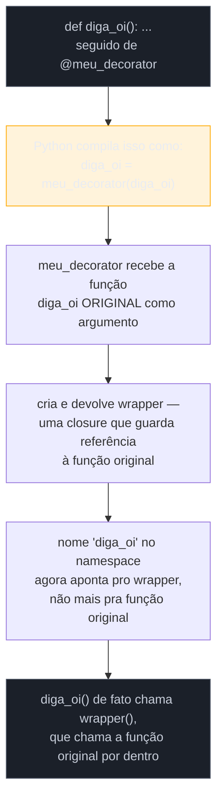
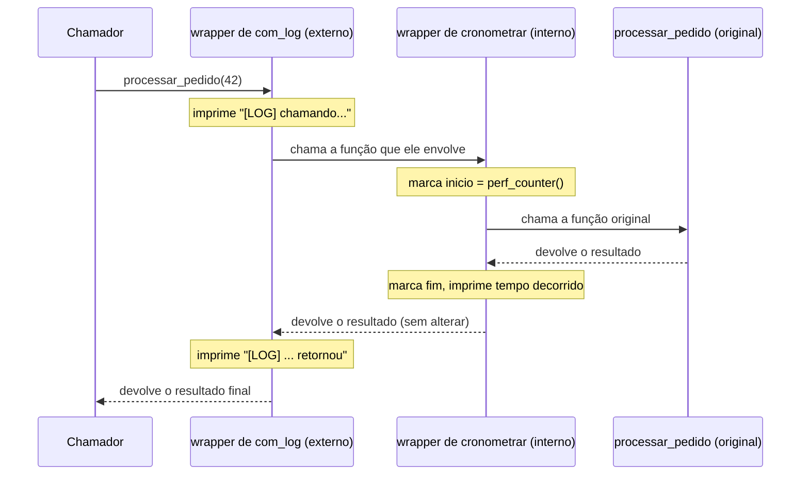

# Decorators — fundamentos

> [!abstract] TL;DR
> Um **decorator** em Python não é uma feature mágica da linguagem — é a consequência direta de duas propriedades que já existem antes dele: funções são **cidadãos de primeira classe** (podem ser passadas como argumento, devolvidas por outra função, guardadas em variáveis, exatamente como um `int` ou uma `str`), e a sintaxe `@decorador` acima de uma `def` é, palavra por palavra, **açúcar sintático** para `funcao = decorador(funcao)` logo depois da definição — é a própria [documentação oficial](https://docs.python.org/3/glossary.html#term-decorator) quem descreve a equivalência dessa forma. Um decorator é, no fim, apenas uma função que recebe outra função como argumento e devolve uma terceira (geralmente um `wrapper` que chama a original por dentro, envolvendo-a com comportamento extra) — sem exigir nenhuma sintaxe nova além da que já existia para funções normais. Essa nota cobre o decorator na sua forma mais simples, **sem argumentos próprios** (`@meu_decorator`, não `@meu_decorator(1, 2)` — isso fica para a próxima nota), usando `*args`/`**kwargs` no `wrapper` para aceitar qualquer assinatura, com três casos de uso reais que aparecem em código de produção: logging, cronometragem (timing) e memoização manual (sem `functools.lru_cache`, que é o kit pronto de uma nota futura — aqui o objetivo é entender o mecanismo por baixo dele).

## O problema: instrumentar uma função sem reescrever seu corpo

Um time descobre, em produção, que uma função de processamento de pedidos está lenta — mas ninguém sabe exatamente quanto, nem quando. A resposta óbvia é medir:

```python
import time

def processar_pedido(pedido_id):
    inicio = time.perf_counter()
    # ... lógica real de processamento ...
    resultado = {"pedido_id": pedido_id, "status": "processado"}
    fim = time.perf_counter()
    print(f"processar_pedido levou {fim - inicio:.4f}s")
    return resultado
```

Funciona — até o time perceber que precisa da mesma medição em outras dez funções: `calcular_frete`, `validar_pagamento`, `enviar_notificacao`. Copiar `inicio = time.perf_counter()` / `fim = time.perf_counter()` / `print(...)` para dentro de cada uma delas é o tipo de duplicação que qualquer desenvolvedor experiente reconhece como sinal de alerta: a lógica de "como medir tempo" está emaranhada com a lógica de "o que a função faz", e qualquer mudança na primeira (por exemplo, trocar `print` por um logger estruturado) exige editar todas as dez funções, uma por uma, torcendo para não esquecer nenhuma.

O que falta é uma forma de dizer "pegue esta função, e execute-a **envolvida** por este comportamento extra" — sem tocar no corpo da função original, sem duplicar a lógica de medição, e reaproveitável em qualquer função, com qualquer assinatura. É exatamente esse problema — separar "o que a função faz" de "o que acontece antes e depois dela rodar" — que motivou a introdução formal da sintaxe `@` no Python 2.4 (2004), descrita na [PEP 318 — Decorators for Functions and Methods](https://peps.python.org/pep-0318/): antes dela, transformações como `classmethod()`/`staticmethod()` (já existentes desde o Python 2.2) exigiam escrever `metodo = classmethod(metodo)` **depois** da definição, longe visualmente do `def`, o que a PEP descreve como algo que "pode ser confuso e resultar em erros" — o efeito colateral (a transformação) ficava desconectado, no código, do ponto onde a função era declarada.

## O pré-requisito: funções como cidadãos de primeira classe

> [!question]- O que exatamente significa "função de primeira classe" — não é só dizer que dá pra guardar uma função numa variável?
> É mais do que isso: significa que uma função, em Python, é um **objeto comum** — do mesmo jeito que um `int`, uma `str` ou uma lista são objetos. E "objeto comum" tem uma consequência prática precisa: qualquer coisa que se pode fazer com um `int` (atribuir a uma variável, passar como argumento, devolver de outra função, guardar numa lista, comparar com `==`, checar o tipo com `type()`) também se pode fazer com uma função — sem sintaxe especial, sem "modo função" diferente do "modo dado". `def processar_pedido(pedido_id): ...` cria um objeto do tipo `function` e associa esse objeto ao nome `processar_pedido` no namespace atual — o nome é só um rótulo apontando pro objeto, exatamente como `x = 5` associa o nome `x` ao objeto `5`.

Antes de decorators fazerem qualquer sentido, vale tornar essa ideia concreta:

```python
def saudacao(nome):
    return f"Olá, {nome}!"

# 1. Atribuir a uma variável — o objeto função não muda, ganha um segundo nome
cumprimentar = saudacao
print(cumprimentar("Ana"))   # "Olá, Ana!" — mesma função, chamada por outro nome

# 2. Passar como argumento — a função vira um valor comum sendo entregue
def aplicar(funcao, valor):
    return funcao(valor)

print(aplicar(saudacao, "Bruno"))   # "Olá, Bruno!"

# 3. Devolver de dentro de outra função
def escolher_saudacao(formal):
    def saudacao_formal(nome):
        return f"Prezado(a) {nome},"
    def saudacao_informal(nome):
        return f"E aí, {nome}!"
    return saudacao_formal if formal else saudacao_informal

minha_saudacao = escolher_saudacao(formal=False)
print(minha_saudacao("Carla"))   # "E aí, Carla!"

# 4. Guardar numa estrutura de dados, como qualquer outro valor
operacoes = {
    "somar": lambda a, b: a + b,
    "saudar": saudacao,
}
print(operacoes["somar"](2, 3))        # 5
print(operacoes["saudar"]("Duda"))     # "Olá, Duda!"
```

Repare que em nenhum desses quatro casos `saudacao` foi **chamada** ao ser passada adiante — `saudacao` (sem parênteses) é o objeto função; `saudacao("Ana")` (com parênteses) é a chamada, que executa o corpo e devolve o resultado. Confundir os dois — passar `funcao()` quando a intenção era passar `funcao` — é um dos erros mais comuns de quem está aprendendo esse idioma: `aplicar(saudacao(), "Bruno")` tentaria chamar `saudacao` sem o argumento `nome` obrigatório, e levantaria `TypeError` antes mesmo de `aplicar` rodar.

Essa capacidade de tratar função como dado — passível de ser recebida como parâmetro e devolvida como resultado — é o que a literatura de linguagens de programação chama de **funções de alta ordem** (*higher-order functions*, quando uma função recebe e/ou devolve outra função) e é o alicerce comum a decorators, [[04 - Closures de verdade|closures]] e ao próprio `map`/`filter`/`sorted(key=...)` que o Galho 2 já usou sem nomear formalmente esse mecanismo.

**Em uma frase:** "primeira classe" significa que uma função é só mais um objeto Python — pode ser guardada, passada e devolvida como qualquer valor, sem cerimônia especial.

## O mecanismo: um decorator é uma função que recebe função e devolve função

Com "função como dado" estabelecido, um decorator é uma consequência quase óbvia: é uma função que recebe **uma função** como argumento e devolve **outra função** — geralmente uma versão "envolvida" (*wrapped*) da original, com comportamento extra antes e/ou depois da chamada real.

```python
def meu_decorator(funcao):
    def wrapper():
        print("Antes de chamar a função")
        funcao()
        print("Depois de chamar a função")
    return wrapper

def diga_oi():
    print("Oi!")

diga_oi = meu_decorator(diga_oi)   # reatribui o NOME diga_oi para o wrapper
diga_oi()
# Antes de chamar a função
# Oi!
# Depois de chamar a função
```

Essa última linha antes da chamada — `diga_oi = meu_decorator(diga_oi)` — é o coração de tudo. `meu_decorator(diga_oi)` recebe o objeto função original, cria um novo objeto função (`wrapper`, que **fecha sobre** — captura — o parâmetro `funcao` como uma [[04 - Closures de verdade|closure]], guardando uma referência à função original mesmo depois que `meu_decorator` já retornou) e devolve esse novo objeto. A reatribuição `diga_oi = ...` faz o nome `diga_oi` no namespace passar a apontar para o `wrapper`, não mais para a função original — a função original ainda existe, como um objeto vivo na memória, mas só é alcançável através do `wrapper`, que a chama internamente.

A sintaxe `@meu_decorator` é literalmente uma forma mais curta de escrever exatamente essas duas linhas — a definição da função e a reatribuição do nome — numa só:

```python
@meu_decorator
def diga_oi():
    print("Oi!")

diga_oi()
```



É esse comportamento que o [glossário oficial do Python](https://docs.python.org/3/glossary.html#term-decorator) descreve de forma direta: "a sintaxe do decorator é meramente açúcar sintático" (*"the decorator syntax is merely syntactic sugar"*), e apresenta a mesma equivalência com o exemplo canônico de `@staticmethod` — `def f(arg): ...` seguido de `f = staticmethod(f)` é *semanticamente* idêntico a escrever `@staticmethod` acima de `def f(arg): ...`. Não existe nenhuma capacidade nova sendo adicionada à linguagem por `@` — é puramente uma questão de onde, visualmente, a transformação aparece no código: colada à declaração da função, em vez de numa linha separada, potencialmente distante, depois dela.

> [!question]- Se é só açúcar sintático, por que não escrever sempre `funcao = decorador(funcao)` direto, sem `@`?
> Tecnicamente dá — e código legado de antes do Python 2.4 fazia exatamente isso. A diferença é de legibilidade e de intenção: `@decorador` aparece **imediatamente acima** da assinatura da função, no mesmo lugar onde um leitor já está olhando para entender "o que essa função é e faz". A forma antiga (`funcao = decorador(funcao)`) exige rolar até depois do corpo inteiro da função — que pode ter dezenas de linhas — para descobrir que ela foi transformada. A PEP 318 documenta essa exata motivação: manter a declaração da transformação próxima da declaração da função que ela transforma, evitando o cenário onde alguém lê o `def`, assume que é uma função "normal", e só descobre o decorator depois, ou nunca.

## `*args` e `**kwargs`: o `wrapper` precisa aceitar qualquer assinatura

O `wrapper` do exemplo anterior só funciona porque `diga_oi` não recebe nenhum argumento. Um decorator de uso geral — que o time inteiro vai aplicar em funções com assinaturas completamente diferentes entre si (`processar_pedido(pedido_id)`, `calcular_frete(origem, destino, peso=None)`, `validar_pagamento(*itens)`) — não pode assumir nenhuma assinatura fixa. A solução é `*args`/`**kwargs`, já cobertos no Galho 1 como a forma de uma função aceitar qualquer número de argumentos posicionais e nomeados:

```python
def meu_decorator(funcao):
    def wrapper(*args, **kwargs):
        print(f"Chamando {funcao.__name__} com args={args}, kwargs={kwargs}")
        resultado = funcao(*args, **kwargs)
        print(f"{funcao.__name__} devolveu {resultado!r}")
        return resultado
    return wrapper

@meu_decorator
def somar(a, b):
    return a + b

@meu_decorator
def saudar(nome, saudacao="Olá"):
    return f"{saudacao}, {nome}!"

somar(2, 3)
# Chamando somar com args=(2, 3), kwargs={}
# somar devolveu 5

saudar("Duda", saudacao="Oi")
# Chamando saudar com args=('Duda',), kwargs={'saudacao': 'Oi'}
# saudar devolveu 'Oi, Duda!'
```

O padrão `wrapper(*args, **kwargs)` seguido de `funcao(*args, **kwargs)` dentro dele é o esqueleto universal de praticamente todo decorator "genérico" — o `wrapper` captura qualquer combinação de argumentos posicionais e nomeados que o chamador passar, e simplesmente repassa exatamente a mesma combinação para a função original, sem precisar saber, de antemão, quantos argumentos ela espera ou como eles se chamam. É o mesmo mecanismo de "empacotar e desempacotar" que `*args`/`**kwargs` sempre fazem — aqui aplicado especificamente para tornar um decorator agnóstico à assinatura de quem ele decora.

> [!warning] Esquecer de `return` o resultado da função original dentro do `wrapper`
> Um erro comum de quem escreve o primeiro decorator: chamar `funcao(*args, **kwargs)` dentro do `wrapper`, mas esquecer de `return` esse valor — fazendo o `wrapper` devolver `None` implicitamente, mesmo que a função original devolvesse algo útil.
> ```python
> def decorator_com_bug(funcao):
>     def wrapper(*args, **kwargs):
>         funcao(*args, **kwargs)   # chamou, mas não guardou nem devolveu o resultado
>     return wrapper
>
> @decorator_com_bug
> def somar(a, b):
>     return a + b
>
> resultado = somar(2, 3)
> print(resultado)   # None — o valor 5 foi calculado e descartado
> ```
> Todo decorator que envolve uma função que devolve algo precisa, explicitamente, `return funcao(*args, **kwargs)` (ou guardar em variável e devolver depois de alguma lógica extra) — o `return` não é opcional só porque a função original "já rodou".

## Três casos de uso reais

### Logging: registrar toda chamada sem poluir a lógica de negócio

```python
def com_log(funcao):
    def wrapper(*args, **kwargs):
        print(f"[LOG] chamando {funcao.__name__}{args}")
        resultado = funcao(*args, **kwargs)
        print(f"[LOG] {funcao.__name__} retornou {resultado!r}")
        return resultado
    return wrapper

@com_log
def calcular_frete(peso_kg, distancia_km):
    return round(peso_kg * distancia_km * 0.05, 2)

calcular_frete(10, 200)
# [LOG] chamando calcular_frete(10, 200)
# [LOG] calcular_frete retornou 10.0
```

Em produção, `print` viraria uma chamada a um logger de verdade (`logging.getLogger(__name__).info(...)`), possivelmente com nível configurável e formatação estruturada — mas o mecanismo é idêntico. A função `calcular_frete` nunca soube que estava sendo logada; sua lógica de negócio (multiplicar peso, distância e uma taxa) fica limpa, sem nenhum código de infraestrutura misturado nela.

### Cronometragem: medir tempo de execução sem editar o corpo da função

```python
import time

def cronometrar(funcao):
    def wrapper(*args, **kwargs):
        inicio = time.perf_counter()
        resultado = funcao(*args, **kwargs)
        fim = time.perf_counter()
        print(f"{funcao.__name__} levou {fim - inicio:.6f}s")
        return resultado
    return wrapper

@cronometrar
def processar_pedido(pedido_id):
    time.sleep(0.1)   # simula trabalho real
    return {"pedido_id": pedido_id, "status": "processado"}

processar_pedido(42)
# processar_pedido levou 0.100XXXs
```

Este é exatamente o problema da abertura desta nota, resolvido: a lógica de "como medir tempo" existe **uma única vez**, dentro de `cronometrar`, e qualquer função ganha essa instrumentação só ganhando a linha `@cronometrar` acima da definição — sem duplicar `time.perf_counter()` em cada uma. Trocar `print` por envio de métrica a um sistema de observabilidade (StatsD, Prometheus, o que for) significa editar `cronometrar` uma vez, não as dez funções que o usam.

### Memoização manual: cachear resultados sem `functools.lru_cache`

Memoização é a técnica de guardar o resultado de uma chamada cara (tipicamente recursiva ou com I/O) associado aos argumentos que a produziram, para nunca recalcular a mesma combinação duas vezes. A versão manual — sem o decorator pronto da biblioteca padrão, que fica para a nota 07 deste galho — usa um dicionário guardado como estado da closure do `wrapper`:

```python
def memoizar(funcao):
    cache = {}   # dicionário vive na closure de wrapper, uma vez por função decorada

    def wrapper(*args):
        if args not in cache:
            cache[args] = funcao(*args)
        return cache[args]

    return wrapper

@memoizar
def fibonacci(n):
    if n < 2:
        return n
    return fibonacci(n - 1) + fibonacci(n - 2)

fibonacci(30)   # rápido — cada sub-resultado de fibonacci(n) é calculado só uma vez
```

Sem `@memoizar`, `fibonacci(30)` recalcula o mesmo `fibonacci(15)` (por exemplo) dezenas de milhares de vezes, porque a recursão ingênua refaz cada sub-chamada do zero a cada ramo da árvore de chamadas. Com o cache, a segunda vez que `wrapper` é chamado com um `n` já visto, ele devolve o valor guardado em `cache[args]` diretamente, sem executar o corpo de `fibonacci` de novo — transformando uma recursão exponencial em uma linear, porque cada valor de `n` só paga o custo de cálculo uma única vez.

> [!warning] `args not in cache` exige que os argumentos sejam *hashable*
> `cache[args]` usa a tupla `args` (o `*args` empacotado) como chave de dicionário — e chaves de dicionário precisam ser *hashable*. Isso funciona sem problema para argumentos como `int`, `str`, `float` ou tuplas de valores hashable, mas quebra com `TypeError: unhashable type` se alguém chamar a função decorada passando uma lista ou um dicionário como argumento posicional. Essa memoização manual também ignora `**kwargs` por completo (o `wrapper` só aceita `*args`) — uma limitação real que a versão robusta da biblioteca padrão (`functools.lru_cache`/`functools.cache`, cobertos na nota 07) resolve tratando `args` e `kwargs` juntos, com opções de tamanho máximo de cache e estatísticas de acerto/erro.

> [!question]- Por que o `cache = {}` funciona mesmo sendo criado dentro de `memoizar`, que já terminou de rodar quando `wrapper` é chamado depois?
> Porque `cache` é uma variável **livre** capturada pela closure de `wrapper` — o mesmo mecanismo detalhado na [[04 - Closures de verdade|nota anterior]] deste galho. `memoizar(fibonacci)` roda uma única vez, na hora em que `@memoizar` é aplicado; nesse momento, `cache = {}` cria o dicionário e `wrapper` fecha sobre ele. Toda chamada subsequente a `fibonacci(...)` (que na verdade é uma chamada a `wrapper(...)`) acessa o **mesmo** dicionário `cache`, porque é a mesma closure sendo reutilizada — não um novo `cache` a cada chamada. É essa persistência entre chamadas, vinda da closure, que faz o cache de fato acumular resultados ao longo do tempo, em vez de recomeçar vazio a cada `fibonacci(n)`.

**Em uma frase:** os três casos de uso — log, tempo, cache — são a mesma forma repetida: `wrapper` faz algo antes e/ou depois de chamar a função original, e o decorator existe para não duplicar esse "algo" em cada função que precisa dele.

## Empilhando decorators simples: dois `@` na mesma função

Nada impede aplicar mais de um decorator sem argumento à mesma função — e isso acontece o tempo todo em código real, quando uma função precisa de log **e** cronometragem, por exemplo. A sintaxe empilha um `@` por linha, acima do `def`:

```python
@com_log
@cronometrar
def processar_pedido(pedido_id):
    time.sleep(0.1)
    return {"pedido_id": pedido_id, "status": "processado"}

processar_pedido(42)
```

A pergunta natural é: em que ordem os dois decorators de fato envolvem a função? A resposta sai direto da equivalência com `funcao = decorador(funcao)` já estabelecida: decorators empilhados são aplicados **de baixo para cima**, o mais próximo do `def` primeiro. O trecho acima é exatamente equivalente a:

```python
def processar_pedido(pedido_id):
    ...

processar_pedido = com_log(cronometrar(processar_pedido))
```

`cronometrar` envolve a função original primeiro, produzindo um `wrapper` que mede tempo; `com_log` então envolve **esse** `wrapper`, produzindo um segundo `wrapper` que loga. Na hora de *chamar* `processar_pedido(42)`, a ordem de execução é inversa à ordem de aninhamento — quem roda primeiro é o decorator mais externo (`com_log`, o mais próximo do topo na sintaxe), porque é ele quem o nome `processar_pedido` aponta para depois de tudo:



Inverter a ordem dos `@` (`@cronometrar` acima de `@com_log`) muda o resultado: o tempo medido por `cronometrar` passaria a incluir o tempo que `com_log` leva para imprimir suas duas linhas, porque `cronometrar` estaria envolvendo o `wrapper` de `com_log`, não mais a função original diretamente. Para os dois decorators simples desta nota, essa diferença costuma ser irrelevante na prática (imprimir duas linhas é rápido); mas o princípio — **a ordem de empilhamento importa, e é sempre baixo-para-cima na aplicação, topo-para-baixo na execução** — se torna crítico assim que decorators fazem algo com efeito colateral mais caro (abrir uma transação de banco, adquirir um lock), e é revisitado com mais profundidade na [[06 - Decorators com argumentos e functools.wraps|nota 06]], quando os decorators empilhados também recebem argumentos próprios.

> [!question]- Por que aplicar de baixo para cima parece contraintuitivo à primeira vista?
> Porque a leitura visual do código (de cima para baixo) sugere, erradamente, que `@com_log` "acontece primeiro". Mas nenhum decorator "acontece" numa ordem temporal separada — os dois são só chamadas de função aninhadas, e chamadas de função aninhadas sempre resolvem de dentro para fora, como qualquer expressão matemática: `com_log(cronometrar(processar_pedido))` precisa calcular `cronometrar(processar_pedido)` **primeiro**, porque esse é o argumento que `com_log` está esperando receber. A ordem de aplicação dos decorators é, literalmente, a mesma regra de precedência que resolve `f(g(x))` — calcula-se `g(x)` antes de poder chamar `f`.

## O efeito colateral que esta nota deixa passar (de propósito)

Um leitor atento que rodar `help(processar_pedido)` ou `processar_pedido.__name__` depois de aplicar `@cronometrar` vai notar algo estranho: em vez de `"processar_pedido"` e sua docstring original, aparece `"wrapper"` e a docstring (ou ausência dela) de `wrapper`.

```python
@cronometrar
def processar_pedido(pedido_id):
    """Processa um pedido e devolve seu status."""
    return {"pedido_id": pedido_id, "status": "processado"}

print(processar_pedido.__name__)   # "wrapper" — não "processar_pedido"
print(processar_pedido.__doc__)    # None — a docstring original sumiu
```

Isso acontece porque, como já visto, `processar_pedido` **é literalmente** o objeto `wrapper` depois da decoração — o nome aponta para um objeto função diferente do original, e esse objeto tem sua própria identidade (`__name__`, `__doc__`, `__module__`). Em código de produção isso não é um detalhe cosmético: ferramentas de introspecção (debuggers, geradores de documentação automática, frameworks web que usam o nome da função de view para gerar rotas) podem se comportar de forma errada se toda função decorada aparecer com o mesmo `__name__` genérico `"wrapper"`.

Essa nota deixa esse problema propositalmente sem solução: a correção — `functools.wraps`, mais um decorator aplicado dentro do próprio decorator, que copia os metadados da função original de volta para o `wrapper` — é o assunto de abertura da [[06 - Decorators com argumentos e functools.wraps|nota 06]], junto com decorators que recebem argumentos próprios (`@meu_decorator(arg1, arg2)`), que exigem um terceiro nível de função aninhada além do que esta nota cobriu.

## Decorator não é anotação: por que a comparação com Java engana

Quem chega em Python vindo de Java tende a olhar para `@decorador` e pensar em `@Override`, `@Transactional` ou `@Test` — e a semelhança visual não é coincidência: a PEP 318 registra explicitamente que a notação `@` foi emprestada de Java. Mas a semelhança para por aí, e tratar as duas coisas como equivalentes gera expectativas erradas.

| | Anotação Java (`@Override`, `@Transactional`) | Decorator Python (`@meu_decorator`) |
|---|---|---|
| O que é | Metadado declarativo, lido por um processador (compilador, ou um framework via reflection) em algum momento depois | Uma chamada de função de verdade, executada no momento em que o módulo é importado |
| Quando "roda" | Não "roda" sozinha — outro código (Spring, o compilador) decide o que fazer com ela | Roda imediatamente: `decorador(funcao)` é uma chamada Python normal, com todo o poder da linguagem disponível dentro dela |
| Quem pode escrever uma nova | Requer processamento de anotações (`AnnotationProcessor`) ou reflection — mecanismo separado da linguagem | Qualquer função (ou classe com `__call__`) que aceite um argumento e devolva outro — nenhuma API especial |
| Pode alterar o comportamento por si só | Não — sem um processador de anotações rodando, `@Override` sozinho não faz nada em tempo de execução | Sim — o decorator *é* a transformação; não existe "decorator sem efeito" a menos que ele explicitamente devolva a função original sem modificação |

A diferença central: uma anotação Java é **passiva** — é só um rótulo que outro sistema (o compilador, um container de DI, um framework de testes) escolhe interpretar ou ignorar. Um decorator Python é **ativo** — ele é código Python de verdade, chamado de verdade, no momento em que a definição da função é processada (isto é, quando o módulo é importado), e o que ele faz com a função que recebe é decisão sua, sem intermediário nenhum. `@staticmethod` funciona porque `staticmethod` é uma função (na prática, um tipo *callable*) que sabe transformar o objeto função que recebe — não porque existe um "processador de decorators" especial rodando por trás dela, do jeito que existe um processador de anotações em Java.

## Armadilhas

> [!warning] Aplicar um decorator sem parênteses acima de uma função que ele não foi feito pra decorar
> `@meu_decorator` (sem parênteses depois do nome) é sempre uma referência ao objeto decorator, aplicada como está — não uma chamada. Escrever `@meu_decorator()` num decorator simples como os desta nota (que recebe só a função, nenhum argumento próprio) levanta `TypeError`, porque `meu_decorator()` chamaria `meu_decorator` sem o argumento `funcao` obrigatório. Decorators que aceitam argumentos próprios (`@meu_decorator(1, 2)`) têm uma estrutura de três camadas de função aninhada diferente — coberta só na próxima nota — e não devem ser confundidos com o decorator simples desta nota.

> [!warning] Decorar um método de instância esquecendo do `self`
> `*args` no `wrapper` normalmente resolve isso de graça (porque `self` chega como o primeiro item de `args`), mas é fácil escrever um decorator "de teste" com uma assinatura fixa (`def wrapper(x):`) que funciona em uma função solta e quebra ao decorar um método, porque `self` aparece como argumento extra inesperado. A prática segura é sempre escrever `wrapper(*args, **kwargs)`, mesmo quando o decorator só vai ser usado, por enquanto, em funções soltas — porque a mesma função decoradora frequentemente acaba sendo reaproveitada em métodos de classe mais tarde.

> [!warning] Decorator que muta estado global sem isolar por função decorada
> No exemplo de `memoizar`, o dicionário `cache` é criado **uma vez por chamada a `memoizar`** — ou seja, uma vez por função decorada, não um cache global compartilhado entre todas. Um erro fácil de cometer é mover `cache = {}` para fora de `memoizar` (no nível do módulo), o que faria **todas** as funções decoradas com esse mesmo decorator compartilharem o mesmo dicionário — misturando resultados de `fibonacci(5)` com resultados de qualquer outra função que usasse o mesmo `@memoizar`, e criando colisões de chave silenciosas entre funções diferentes que por acaso recebem os mesmos argumentos.

## Em entrevista

Perguntas previsíveis sobre este tópico:

- **"O que é um decorator em Python?"** Uma função que recebe outra função como argumento e devolve uma terceira função (tipicamente um `wrapper` que chama a original, envolvida por comportamento extra). A sintaxe `@decorador` acima de uma `def` é açúcar sintático — o próprio glossário oficial do Python descreve isso — para `funcao = decorador(funcao)` logo depois da definição.
- **"O que significa dizer que funções são 'cidadãos de primeira classe' em Python?"** Significa que uma função é um objeto comum, do mesmo jeito que um `int` ou uma `str`: pode ser atribuída a uma variável, passada como argumento para outra função, devolvida como resultado de outra função, e guardada em estruturas de dados (listas, dicionários) — sem sintaxe especial diferente da usada para qualquer outro valor.
- **"Por que o `wrapper` de um decorator genérico usa `*args, **kwargs`?"** Porque o decorator, para ser reutilizável em qualquer função, não pode assumir uma assinatura fixa. `*args`/`**kwargs` empacotam qualquer combinação de argumentos posicionais e nomeados recebidos pelo `wrapper`, e são desempacotados de volta ao chamar a função original — deixando o decorator agnóstico ao número e nome dos parâmetros de quem ele decora.
- **"Decorators sem argumento e decorators com argumento são a mesma coisa?"** Não. Um decorator sem argumento próprio (`@meu_decorator`) tem dois níveis de função: o decorator recebe a função e devolve o `wrapper`. Um decorator com argumento próprio (`@meu_decorator(x, y)`) precisa de um terceiro nível: uma função externa que recebe `x`/`y` e devolve o decorator de fato — assunto da próxima nota deste galho, junto com `functools.wraps`.
- **"O que acontece com `__name__` e a docstring de uma função depois de decorada?"** Eles são sobrescritos pelos do `wrapper`, porque o nome da função original passa a apontar para o objeto `wrapper`, que tem sua própria identidade. Isso é resolvido aplicando `functools.wraps(funcao_original)` como decorator do próprio `wrapper` — copiando `__name__`, `__doc__`, `__module__` e outros metadados de volta.
- **"Dê um exemplo de caso de uso real de decorator."** Logging (registrar toda chamada e seu resultado sem poluir a lógica de negócio), cronometragem (medir tempo de execução de qualquer função aplicando a mesma linha `@cronometrar`), e memoização (cachear resultados de chamadas caras usando um dicionário mantido vivo pela closure do `wrapper`) — os três seguem o mesmo padrão: fazer algo antes e/ou depois de chamar a função original, sem duplicar essa lógica em cada função.

### How to explain in English

> A **decorator** in Python is a function that takes another function as an argument and returns a third function — typically a `wrapper` that calls the original, adding behavior before and/or after it runs. The `@decorator` syntax above a `def` is pure syntactic sugar: it's exactly equivalent to writing `function = decorator(function)` right after the definition, as the official Python glossary states directly. This works at all because functions in Python are **first-class objects** — they can be assigned to variables, passed as arguments, returned from other functions, and stored in data structures, just like an `int` or a `str`. A generic decorator's `wrapper` uses `*args, **kwargs` to accept any call signature, forwarding whatever it receives straight to the original function — which is what makes the same decorator reusable across functions with completely different parameter lists. Common real-world uses are logging (record every call without polluting business logic), timing (measure execution time by adding one line above any function), and memoization (cache results of expensive calls in a dictionary kept alive by the wrapper's closure) — the same shape every time: do something before and/or after calling the original function, in exactly one place instead of duplicated across every function that needs it.

| PT | EN |
|---|---|
| decorator / decorador | decorator |
| cidadão de primeira classe | first-class citizen / first-class object |
| função de alta ordem | higher-order function |
| açúcar sintático | syntactic sugar |
| envolver (uma função) | to wrap (a function) |
| empacotar/desempacotar argumentos | to pack / to unpack arguments |
| memoização | memoization |
| cronometragem / medir tempo | timing |
| preservar metadados | to preserve metadata |

## O que vem a seguir

O decorator desta nota tem uma limitação dupla: ele não aceita argumentos próprios, e ele apaga a identidade (`__name__`, docstring) da função original. A [[06 - Decorators com argumentos e functools.wraps|nota 06]] resolve os dois problemas — mostrando o terceiro nível de aninhamento necessário para um *decorator factory* (`@decorador(config)`) e introduzindo `functools.wraps` como a correção padrão para preservar metadados, além de explicar a ordem de aplicação quando vários decorators são empilhados na mesma função.

- [[06 - Decorators com argumentos e functools.wraps|06 — Decorators com argumentos e `functools.wraps`]] — decorator factory, três níveis de função, preservação de metadados
- [[04 - Closures de verdade|04 — Closures de verdade]] — o mecanismo de captura de variável livre que faz `cache = {}` sobreviver entre chamadas de `wrapper`
- [[07 - functools — ferramentas funcionais|07 — `functools`: ferramentas funcionais]] — `lru_cache`/`cache`, a versão robusta da memoização manual desta nota

## Veja também

- [[01 - Iterators e o protocolo __iter__ __next__|01 — Iterators e o protocolo `__iter__`/`__next__`]] — outro caso de "protocolo implementado por convenção de nomes de método", não por sintaxe especial
- [[03-Dominios/Tecnologia/Python/OO e Data Model/index|OO e Data Model]] — `@property`, `@classmethod`, `@staticmethod`: decorators embutidos que usam exatamente este mecanismo
- [[03-Dominios/Tecnologia/Python/index|Trilha Python]]

## Fontes

- Python Software Foundation. *Glossary — decorator*. docs.python.org, versão 3.14. https://docs.python.org/3/glossary.html#term-decorator (acessado em 2026-07-10)
- Smith, K. D.; Jewett, J. J.; Montanaro, S.; Baxter, A. *PEP 318 — Decorators for Functions and Methods*. peps.python.org, 2003. https://peps.python.org/pep-0318/ (acessado em 2026-07-10)
- Real Python. *Primer on Python Decorators*. https://realpython.com/primer-on-python-decorators/ (acessado em 2026-07-10)
- Python Software Foundation. *functools — Higher-order functions and operations on callable objects*. docs.python.org, versão 3.14. https://docs.python.org/3/library/functools.html (acessado em 2026-07-10)
- Ramalho, L. *Fluent Python*, 2ª ed. — Capítulo sobre funções de primeira classe e decorators (funções como objetos, decorators e closures como o mesmo alicerce). O'Reilly Media, 2022.
