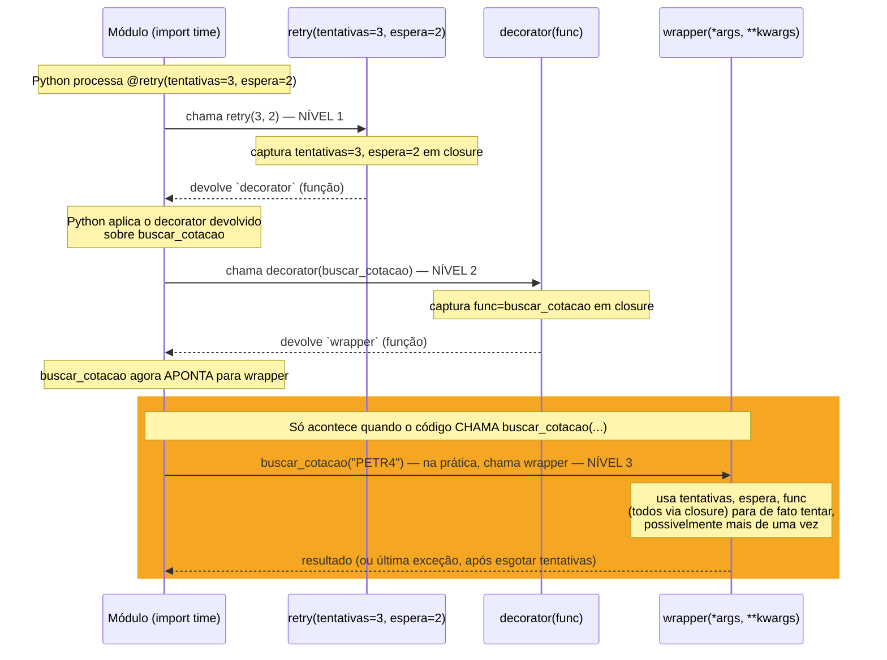
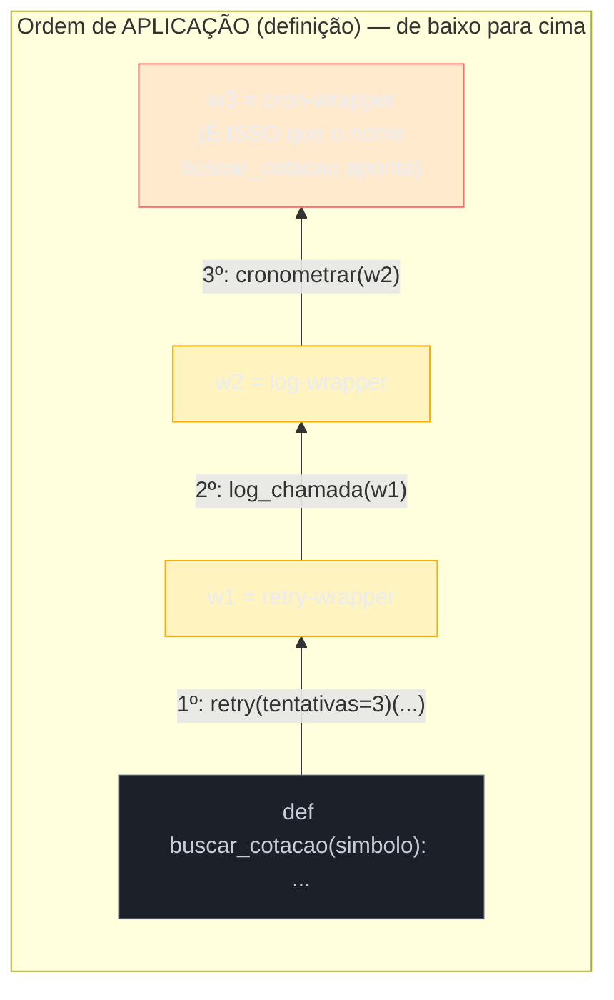
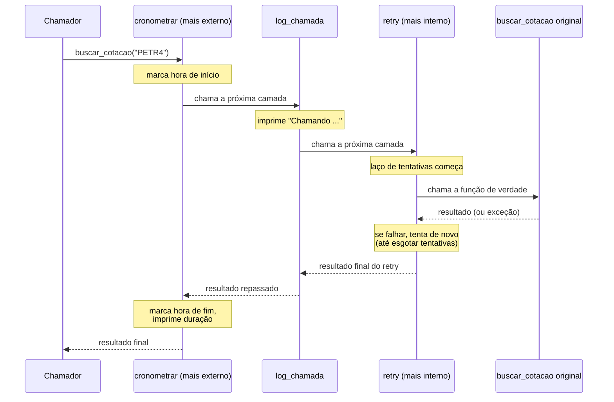
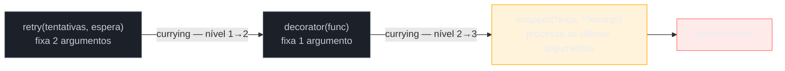

# Decorators com argumentos e functools.wraps

> [!abstract] TL;DR
> Um decorator simples, como visto na [[05 - Decorators — fundamentos|nota 05]] deste galho, recebe a função e devolve outra — dois níveis de função (`decorator` → `wrapper`). Para um decorator receber **argumentos próprios** (`@retry(tentativas=3)` em vez de `@retry`), é preciso um terceiro nível: uma **decorator factory**, uma função que recebe os argumentos de configuração e *devolve* um decorator — que por sua vez recebe a função e devolve o wrapper. São três funções aninhadas, três `def` um dentro do outro, e entender qual delas roda em qual momento (definição vs. chamada) é o que separa quem decora funções de quem só copia exemplos do Stack Overflow sem saber por quê funcionam. Ao lado disso, todo decorator — com ou sem argumentos — tem um efeito colateral incômodo: a função decorada perde sua identidade (`__name__`, `__doc__`, `__module__`) e passa a se apresentar como `wrapper`, quebrando introspecção, debugging e frameworks (Flask, FastAPI, pytest) que dependem desses metadados para funcionar corretamente. `functools.wraps` corrige isso copiando os atributos da função original de volta para o wrapper — e é considerado obrigatório, não opcional, em qualquer decorator de produção. Por fim, decorators **empilhados** (`@a @b def f(): ...`) são aplicados de baixo para cima na definição (`f = a(b(f))`), mas executam de fora para dentro na chamada — um padrão de "camadas de cebola" que decide, por exemplo, se um decorator de cache vê os argumentos já validados por um decorator de validação, ou vice-versa.

## O problema: e se o decorator precisar de configuração?

A nota anterior mostrou como escrever `@log_chamada`, `@cronometrar`, `@cache_simples` — decorators que recebem a função decorada e nada mais. Eles funcionam bem enquanto o comportamento do decorator é **fixo**: sempre loga do mesmo jeito, sempre mede tempo do mesmo jeito. Mas um caso realista de produção raramente é fixo assim. Considere uma chamada de rede instável, que às vezes falha por timeout e vale a pena tentar de novo:

```python
def buscar_cotacao(simbolo):
    resposta = requests.get(f"https://api.cotacoes.com/{simbolo}")
    resposta.raise_for_status()
    return resposta.json()
```

O comportamento que se quer é: "se falhar, tente de novo até N vezes, esperando alguns segundos entre tentativas." Só que "N vezes" e "alguns segundos" **variam por chamador** — buscar uma cotação de bolsa pode tolerar 5 tentativas com 2 segundos de espera; disparar um webhook de auditoria pode exigir só 2 tentativas, sem esperar nada, porque atrasar é pior do que falhar rápido. Um decorator simples, sintaticamente, não tem onde guardar esses dois números:

```python
def retry(func):
    def wrapper(*args, **kwargs):
        # ... quantas tentativas? quanto esperar? não há como saber
        return func(*args, **kwargs)
    return wrapper
```

A tentação de quem só conhece decorators simples é tentar `@retry(tentativas=3)` direto, esperando que o Python "resolva" de algum jeito. Ele resolve — mas não do jeito que a intuição sugere, e o erro resultante costuma confundir:

```python
@retry(tentativas=3)
def buscar_cotacao(simbolo):
    ...

# TypeError: retry() got an unexpected keyword argument 'tentativas'
```

> [!question]- Por que esse erro acontece exatamente nesse formato — "argumento inesperado", e não algo sobre decorators?
> Porque `@retry(tentativas=3)` **não é sintaxe especial de decorator** — é só uma chamada de função comum, `retry(tentativas=3)`, escrita antes de um `def`. O Python primeiro avalia essa chamada, obtém um valor de retorno, e **é esse valor** que vira o decorator de fato, aplicado à função logo abaixo — exatamente como a [[05 - Decorators — fundamentos|nota 05]] descreveu para `@meu_decorator` sem parênteses, só que aqui há uma etapa extra antes. Como `retry` foi escrito para receber `func` (a função a decorar) como único parâmetro, chamá-la com `tentativas=3` bate direto contra essa assinatura — é o mesmo erro que aconteceria chamando `retry(tentativas=3)` em qualquer contexto, decorator ou não. O Python não tem noção nenhuma de "decorator com argumentos" como conceito sintático separado; o `@` sempre faz a mesma coisa (chama o que vem depois dele com a função logo abaixo como argumento) — o "argumento extra" precisa vir de uma função **diferente**, que devolve o decorator de verdade.

## Decorator factory: a função que fabrica decorators

A solução é dar ao Python exatamente o que o `@` espera: algo que, quando chamado com a função decorada, sabe o que fazer. Só que agora esse "algo" precisa **também** saber `tentativas` e o intervalo de espera — e a única forma de uma função levar essa informação junto, sem variáveis globais nem estado externo, é via **closure** (mecanismo coberto na [[04 - Closures de verdade|nota 04]] deste galho): a função mais interna captura as variáveis das funções externas, mesmo depois delas terem retornado.

Isso exige três níveis de função aninhada, não dois:

```python
import time
import functools

def retry(tentativas=3, espera=1):
    """Nível 1 — DECORATOR FACTORY.
    Recebe os argumentos de CONFIGURAÇÃO do decorator (não a função).
    Roda IMEDIATAMENTE, no momento em que o Python processa a linha @retry(...).
    Devolve o decorator de verdade (nível 2)."""

    def decorator(func):
        """Nível 2 — O DECORATOR EM SI.
        Recebe a FUNÇÃO A SER DECORADA (é o que o @ de fato aplica).
        Roda uma vez, no momento da DEFINIÇÃO da função decorada.
        Devolve o wrapper (nível 3), que substitui a função original."""

        @functools.wraps(func)
        def wrapper(*args, **kwargs):
            """Nível 3 — O WRAPPER.
            Roda a cada CHAMADA da função decorada — é aqui que o
            comportamento (retry, cronometragem, etc.) de fato acontece.
            Tem acesso a `tentativas`, `espera` (do nível 1) e `func` (do
            nível 2) via closure — nenhum deles é passado explicitamente."""
            ultima_excecao = None
            for tentativa in range(1, tentativas + 1):
                try:
                    return func(*args, **kwargs)
                except Exception as erro:
                    ultima_excecao = erro
                    print(f"Tentativa {tentativa}/{tentativas} falhou: {erro}")
                    if tentativa < tentativas:
                        time.sleep(espera)
            raise ultima_excecao

        return wrapper

    return decorator


@retry(tentativas=3, espera=2)
def buscar_cotacao(simbolo):
    resposta = requests.get(f"https://api.cotacoes.com/{simbolo}")
    resposta.raise_for_status()
    return resposta.json()
```

O ponto que costuma travar quem vê isso pela primeira vez: `@retry(tentativas=3, espera=2)` **não** é "o decorator `retry`, com dois argumentos". É uma chamada de função — `retry(tentativas=3, espera=2)` — que **acontece primeiro**, produz um valor (a função `decorator`), e é **esse valor** que o `@` de fato aplica sobre `buscar_cotacao`. Reescrevendo sem açúcar sintático, a linha inteira é equivalente a:

```python
decorator_configurado = retry(tentativas=3, espera=2)   # roda o nível 1 agora
buscar_cotacao = decorator_configurado(buscar_cotacao)    # roda o nível 2 agora, devolve o wrapper
```

E só quando alguém de fato chama `buscar_cotacao("PETR4")` é que o **nível 3** (o `wrapper`) roda — e é aí, e só aí, que o laço de `retry` de fato tenta a chamada de rede, possivelmente várias vezes.



O diagrama deixa visível a distinção mais importante desta nota: os **níveis 1 e 2 rodam uma única vez**, no momento em que o interpretador processa a definição de `buscar_cotacao` (a etapa de "montagem" descrita na nota 05, agora com uma camada extra). O **nível 3 roda a cada chamada** — potencialmente centenas ou milhares de vezes ao longo da vida do programa, sempre reutilizando os mesmos valores de `tentativas`, `espera` e `func` capturados pela closure lá atrás.

**Decorator factory em uma frase:** é uma função comum que devolve um decorator — a única razão de existir é dar ao decorator um lugar (a closure) para guardar argumentos de configuração que o `@` sozinho não tem como passar.

> [!warning] Esquecer os parênteses quando o decorator É uma factory
> `@retry` (sem parênteses) sobre uma função decorada por uma factory que exige argumentos aplica a **função factory em si** como decorator — e ela recebe a função decorada no lugar de `tentativas`. O erro resultante costuma ser `TypeError: 'function' object is not callable` (porque `retry(minha_funcao)` devolve a função `decorator`, e o Python tenta aí aplicar *essa* função devolvida como se fosse o decorator final, sobre nada) ou um erro mais confuso ainda, dependendo de quantos parâmetros tenham `default`. A regra prática: se `def` do decorator tem uma camada a mais que recebe argumentos de configuração (não `func`), o `@` **sempre** precisa de parênteses — mesmo vazios (`@retry()`), se todos os parâmetros tiverem valor-padrão.

### O truque de aceitar as duas formas: `@decorator` e `@decorator(args)`

Bibliotecas maduras (Click, pytest) frequentemente permitem as duas sintaxes para o mesmo decorator — `@meu_decorator` e `@meu_decorator(config=valor)`. Isso é possível checando, dentro da factory, se o primeiro argumento recebido já é a função a decorar (uso sem parênteses, direto) ou um argumento de configuração de fato (uso com parênteses):

```python
def retry(func=None, *, tentativas=3, espera=1):
    def decorator(f):
        @functools.wraps(f)
        def wrapper(*args, **kwargs):
            for tentativa in range(1, tentativas + 1):
                try:
                    return f(*args, **kwargs)
                except Exception:
                    if tentativa == tentativas:
                        raise
                    time.sleep(espera)
        return wrapper

    if func is not None:
        # usado como @retry (sem parênteses) — func já é a função decorada
        return decorator(func)
    # usado como @retry(tentativas=5) — devolve o decorator, que ainda vai ser chamado
    return decorator


@retry                        # funciona: func recebe a função direto
def a(): ...

@retry(tentativas=5)          # funciona: func é None, devolve `decorator`
def b(): ...
```

Esse padrão (parâmetro `func=None` posicional, resto *keyword-only* via `*`) aparece em bibliotecas reais exatamente para poupar o usuário de decorar todo mundo com parênteses vazios só porque a implementação por baixo é uma factory. Não é obrigatório escrever decorators assim — para a maior parte do código de aplicação, exigir sempre `@retry()` (com parênteses, mesmo vazios, quando existe uma factory) é mais simples de manter e menos propenso a essa ambiguidade.

## `functools.wraps`: devolvendo a identidade da função original

Repare que todo exemplo acima já incluiu `@functools.wraps(func)` decorando o `wrapper` — sem explicar por quê. É hora de abrir essa caixa.

Todo wrapper — com ou sem decorator factory por cima — é, sintaticamente, uma função **nova**, definida dentro do decorator. E toda função nova em Python carrega seus próprios metadados: seu próprio `__name__`, seu próprio `__doc__`, seu próprio `__module__`. Sem nenhuma intervenção, decorar uma função **substitui** essa função pelo wrapper — e o wrapper leva consigo a identidade de "wrapper", não a da função original:

```python
def log_chamada(func):
    def wrapper(*args, **kwargs):
        print(f"Chamando {func.__name__}")
        return func(*args, **kwargs)
    return wrapper

@log_chamada
def calcular_frete(peso, distancia):
    """Calcula o frete com base em peso (kg) e distância (km)."""
    return peso * distancia * 0.5

print(calcular_frete.__name__)   # 'wrapper' — não 'calcular_frete'!
print(calcular_frete.__doc__)     # None — a docstring original desapareceu
print(calcular_frete.__module__)  # ainda correto, mas por acidente de escopo, não por design
```

Isso não é um detalhe cosmético. `__name__` e `__doc__` não são só "informação bonita para exibir" — várias partes do próprio Python e do ecossistema **dependem** deles para funcionar corretamente:

- **`help(calcular_frete)`** mostraria a assinatura e a docstring de `wrapper`, não de `calcular_frete` — inútil para quem consulta a documentação embutida.
- **Debuggers e tracebacks** exibem `wrapper` em vez do nome real da função, tornando um traceback de produção mais difícil de ler — "em que função, exatamente, essa exceção nasceu?" vira uma pergunta que exige abrir o código-fonte, em vez de responder sozinha.
- **Frameworks web** que usam o nome da função como identificador interno quebram literalmente. O caso mais citado é o Flask: `@app.route()` usa, por padrão, `func.__name__` como *endpoint* interno da rota. Duas rotas diferentes, ambas decoradas por um decorator sem `functools.wraps`, chegam ao Flask com o mesmo `__name__` (`"wrapper"`) — e o framework levanta `AssertionError: View function mapping is overwriting an existing endpoint function: wrapper`, um erro que parece não ter relação nenhuma com o decorator até alguém investigar a fundo.
- **Ferramentas de introspecção** (geração automática de documentação de API, como no FastAPI/OpenAPI; frameworks de testes como pytest, que usam nomes e assinaturas para descobrir e reportar testes) leem `__name__`, `__doc__` e a assinatura da função para gerar saída correta — sem esses metadados preservados, a documentação gerada mostra `wrapper(*args, **kwargs)` em vez da assinatura real e útil da função decorada.

`functools.wraps(func)`, aplicado como decorator sobre o `wrapper`, resolve isso copiando os metadados relevantes de `func` (a função original) para `wrapper` (a função que efetivamente substitui `func` no namespace do módulo). Segundo a [documentação oficial do módulo `functools`](https://docs.python.org/3/library/functools.html#functools.wraps), por padrão são copiados diretamente: `__module__`, `__name__`, `__qualname__`, `__annotations__`, `__type_params__` (desde Python 3.12) e `__doc__` — e o `__dict__` do wrapper é **atualizado** (não substituído) com o `__dict__` da função original, preservando atributos customizados que o wrapper já tivesse.

```python
import functools

def log_chamada(func):
    @functools.wraps(func)
    def wrapper(*args, **kwargs):
        print(f"Chamando {func.__name__}")
        return func(*args, **kwargs)
    return wrapper

@log_chamada
def calcular_frete(peso, distancia):
    """Calcula o frete com base em peso (kg) e distância (km)."""
    return peso * distancia * 0.5

print(calcular_frete.__name__)   # 'calcular_frete' — correto agora
print(calcular_frete.__doc__)     # 'Calcula o frete com base em peso (kg) e distância (km).'
```

`functools.wraps(func)` é, ele mesmo, um decorator produzido por uma decorator factory — `wraps` recebe `func` (o argumento de configuração: "qual função copiar os metadados") e devolve o decorator de verdade, que é aplicado sobre `wrapper`. É o mesmo padrão de três níveis desta nota, só que já pronto na biblioteca padrão, para resolver exatamente o problema que decorators de wrapper sempre criam.

### `__wrapped__`: a referência de volta ao original

Desde o Python 3.2, `functools.wraps` também adiciona um atributo extra ao wrapper: `__wrapped__`, apontando de volta para a função original que foi decorada. Esse atributo não está na lista de "cópia de metadados" — ele é uma **referência**, não uma cópia, e serve a um propósito diferente: permitir que ferramentas de introspecção (e até outras partes do próprio `functools`, como `lru_cache()`) consigam "atravessar" a camada do decorator e enxergar a função de verdade por trás dela.

```python
print(calcular_frete.__wrapped__)          # <function calcular_frete at 0x...>
print(calcular_frete.__wrapped__ is not calcular_frete)   # True — são objetos diferentes
```

`inspect.signature()`, por exemplo, segue `__wrapped__` automaticamente por padrão, o que significa que `inspect.signature(calcular_frete)` devolve a assinatura real de `calcular_frete(peso, distancia)` — não a assinatura genérica `(*args, **kwargs)` do wrapper — mesmo sem `functools.wraps` copiar `__signature__` diretamente. É essa mecânica, funcionando por baixo dos panos, que faz frameworks modernos como o **FastAPI** conseguirem inspecionar a assinatura de funções decoradas para gerar validação de parâmetros e documentação OpenAPI automaticamente, mesmo quando a função passou por uma cadeia de decorators antes de chegar até o framework.

> [!warning] `functools.wraps` esquecido não é erro de sintaxe — é bug silencioso
> Nada no código quebra na hora se você esquecer o `@functools.wraps(func)`. O decorator funciona, a função decorada roda, o resultado é correto. O bug só aparece depois, e em lugares distantes de onde foi introduzido: um `AssertionError` do Flask em produção, um teste do pytest que reporta o nome errado da função que falhou, uma ferramenta de profiling que agrupa a CPU gasta em dezenas de funções diferentes sob o rótulo genérico `"wrapper"`, tornando o relatório inútil. Por isso `functools.wraps` é tratado, em qualquer style guide ou linter sério (incluindo checagens do `ruff`, ferramenta padrão de lint moderna em Python), como **obrigatório** em qualquer decorator escrito para produção — não uma otimização opcional.

## Decorators empilhados: aplicação de baixo para cima, execução de fora para dentro

Uma função pode ter mais de um decorator, um em cada linha, imediatamente acima da definição:

```python
@cronometrar
@log_chamada
@retry(tentativas=3)
def buscar_cotacao(simbolo):
    ...
```

A leitura intuitiva — "primeiro `cronometrar`, depois `log_chamada`, depois `retry`" — está certa para a **aplicação** (o momento da definição), mas ao contrário da ordem visual: decorators empilhados são aplicados de **baixo para cima**. O decorator mais próximo da função (`@retry(tentativas=3)`, aqui) é aplicado primeiro; o resultado dessa aplicação é o que o próximo decorator para cima (`@log_chamada`) recebe como `func`; e assim sucessivamente até o topo. Sem açúcar sintático, o bloco acima equivale exatamente a:

```python
buscar_cotacao = cronometrar(log_chamada(retry(tentativas=3)(buscar_cotacao)))
```

Lendo de dentro para fora: primeiro `retry(tentativas=3)` (a factory) roda e devolve um decorator; esse decorator é aplicado a `buscar_cotacao`, produzindo um wrapper — chame-o de `w1`. Depois `log_chamada(w1)` produz um segundo wrapper, `w2`. Por fim `cronometrar(w2)` produz o wrapper final, que é o que o nome `buscar_cotacao` de fato passa a apontar no módulo.



Já a **execução** — o que roda quando alguém chama `buscar_cotacao("PETR4")` — segue a ordem oposta, de fora para dentro, exatamente como esperado de qualquer chamada de função aninhada: chamar `w3` (o wrapper de `cronometrar`, o mais externo) é o primeiro código a rodar; ele, em algum ponto do seu corpo, chama `w2` (o de `log_chamada`); que, por sua vez, chama `w1` (o de `retry`); que finalmente chama a função original `buscar_cotacao`. Se cada wrapper tem lógica antes *e* depois da chamada que ele envolve (como `cronometrar`, que mede tempo antes e depois), o efeito visual é o de **camadas de cebola**: entra de fora para dentro, sai de dentro para fora.



Essa ordem **importa de verdade**, não é só curiosidade acadêmica. `@retry` sendo o mais interno, aqui, significa que cada tentativa individual é medida separadamente por `log_chamada` (que loga uma vez por tentativa, dentro do laço de retry) mas o tempo total de `cronometrar` inclui todas as tentativas somadas — porque `cronometrar` está do lado de fora, vendo o retry inteiro como uma única chamada. Inverter a ordem (`retry` por fora, `cronometrar` por dentro) mudaria completamente o que está sendo medido: cada tentativa individual teria seu próprio cronômetro, e não existiria uma medida do tempo total incluindo as tentativas que falharam.

> [!question]- Isso significa que a ordem de decorators empilhados é sempre significativa, mesmo quando "não parece"?
> Sim, quase sempre — mesmo quando o efeito é sutil o bastante para passar despercebido em testes rápidos. Dois casos clássicos onde a ordem quebra silenciosamente, além do exemplo de cronometragem acima: (1) um decorator de **cache** (`@lru_cache`) colocado *antes* de um decorator de **validação de argumentos** faz o cache guardar resultados de chamadas que nunca foram validadas — o cache "vê" os argumentos crus, não os já sanitizados; colocado *depois* da validação, o cache só armazena entradas que já passaram pelo filtro. (2) um decorator de **autenticação** (`@requer_login`) colocado *depois* de um decorator de **logging de acesso** (`@log_acesso`) faz o log registrar até tentativas de acesso não autenticadas, porque o log roda antes da checagem de login; na ordem inversa, requisições não autenticadas nunca chegam a ser logadas, porque `requer_login` barra a chamada antes dela alcançar `log_acesso`. Nenhuma dessas combinações está "errada" em abstrato — a escolha depende do requisito real (quer logar tentativas negadas, ou só acessos bem-sucedidos?). O erro é não pensar sobre isso deliberadamente, tratando a pilha de decorators como uma lista sem ordem.

### Decorator factory vs. `functools.partial`: duas formas de fixar argumentos

Vale comparar decorator factories com uma ferramenta prima, também da biblioteca padrão: `functools.partial`. As duas resolvem problemas parecidos — "fixar alguns argumentos agora, receber o resto depois" — mas em contextos diferentes. `functools.partial(func, *args_fixos, **kwargs_fixos)` recebe uma função **já existente** e devolve uma nova função-parcial, com alguns argumentos já preenchidos:

```python
import functools

def multiplicar(x, y):
    return x * y

dobro = functools.partial(multiplicar, 2)   # fixa x=2
print(dobro(21))   # 42 — equivalente a multiplicar(2, 21)
```

Isso é currying parcial explícito, mas de uma **função só**, sem a etapa de "envolver o comportamento de outra função" que caracteriza um decorator. `functools.partial` responde à pergunta "como chamo essa função de novo, com alguns argumentos sempre iguais?"; uma decorator factory responde a uma pergunta diferente: "como faço **qualquer** função (que eu nem escrevi ainda) ganhar um comportamento extra, configurável, ao redor da chamada original?". Um decorator produz uma função nova que **substitui** a original no namespace (e tipicamente aceita `*args, **kwargs` genéricos, para funcionar com qualquer assinatura); `partial` produz uma função nova que **coexiste** com a original, chamando-a por dentro com alguns argumentos pré-preenchidos, sem adicionar comportamento — só fixar valores.

Os dois mecanismos, aliás, combinam bem: é comum usar `functools.partial` **dentro** do wrapper de um decorator, quando o comportamento adicionado por sua vez precisa repassar argumentos fixos para uma chamada auxiliar (por exemplo, um decorator de retry que delega o `sleep` configurado para uma função utilitária via `partial`, evitando repetir os mesmos argumentos em cada ponto de chamada dentro do wrapper).

## Fundamento teórico: currying, funções de ordem superior e o Decorator Pattern

A estrutura de três níveis desta nota não é um truque *ad hoc* da sintaxe de Python — ela é uma instância direta de um conceito da programação funcional bem mais antigo que a linguagem: **currying** (o nome vem do lógico Haskell Curry, também nome do próprio *paradigma* funcional Haskell). Currying é a técnica de transformar uma função que recebe vários argumentos numa **cadeia de funções, cada uma recebendo um único argumento (ou grupo de argumentos), e devolvendo a próxima função da cadeia** — até o último passo, que finalmente produz o resultado. `retry(tentativas, espera)(func)(*args, **kwargs)` é, estruturalmente, uma cadeia curried de três aplicações: a primeira fixa `tentativas`/`espera`, a segunda fixa `func`, a terceira finalmente processa os argumentos de chamada.

Python não tem currying automático embutido na sintaxe de `def` (ao contrário de Haskell, onde toda função de múltiplos argumentos é curried por padrão, ou de linguagens como JavaScript, onde bibliotecas o adicionam via `curry()`), mas o mecanismo de **closures + funções aninhadas** — já coberto na nota 04 — permite escrever exatamente esse padrão manualmente sempre que for útil. Uma decorator factory é, sob esse ângulo, currying aplicado a um caso de uso específico: "fixar a configuração primeiro, a função-alvo depois, os argumentos de chamada por último" — três curries em sequência, um por nível de `def`.

Essa lente também explica por que decorators são chamados de **funções de ordem superior** (*higher-order functions*): uma função de ordem superior é qualquer função que recebe outra função como argumento, devolve outra função como resultado, ou as duas coisas ao mesmo tempo. `retry` (a factory) devolve uma função; `decorator` (nível 2) recebe uma função **e** devolve outra; `functools.wraps` recebe uma função e devolve um decorator. Em Python, funções sendo objetos de primeira classe (podem ser passadas, armazenadas, devolvidas, como qualquer outro valor — sem essa propriedade, nada disto seria sintaticamente possível) é a base que sustenta toda a cadeia: sem funções de primeira classe, uma "função que devolve função" nem faria sentido como conceito.



Vale conectar isso também ao **Decorator Pattern** do catálogo clássico de padrões de projeto (GoF — *Gang of Four*, *Design Patterns*, 1994): o padrão descreve "anexar responsabilidades adicionais a um objeto dinamicamente, oferecendo uma alternativa flexível a subclasses para estender funcionalidade". A ideia central — envolver um comportamento existente com uma camada adicional, sem alterar o código original, de forma componível (várias camadas empilhadas) — é exatamente o que decorators de função fazem em Python, só que a linguagem tem sintaxe dedicada (`@`) e closures para implementar isso com funções, em vez de exigir a hierarquia de classes/interfaces que o padrão GoF original descreve para linguagens orientadas a objetos sem funções de primeira classe (a versão clássica do padrão usa uma interface comum entre o objeto decorado e o decorador, com composição via referência a objeto — muito mais cerimônia do que três `def`s aninhados). É por isso que "decorator", em Python, carrega o mesmo nome do padrão de design: a linguagem incorporou a ideia central do padrão como recurso sintático de primeira classe, em vez de deixá-la como uma convenção de arquitetura orientada a objetos que o desenvolvedor precisa reimplementar à mão a cada vez.

**Em uma frase:** um decorator com argumentos é currying aplicado à composição de funções — cada nível de `def` fixa um grupo de argumentos e devolve a próxima função da cadeia — e essa mesma composição é a implementação, em código funcional, do que o Decorator Pattern do GoF descreve em termos de objetos e classes.

## Casos práticos

### Cenário 1: decorator de permissão parametrizado por papel

Um sistema com múltiplos papéis de usuário (`"admin"`, `"editor"`, `"leitor"`) precisa de um único decorator reaproveitável, configurado com o papel mínimo exigido em cada rota — o tipo de decorator que só uma factory resolve, porque o papel exigido muda por função decorada:

```python
import functools

class PermissaoNegada(Exception):
    pass

def requer_papel(papel_minimo):
    hierarquia = {"leitor": 1, "editor": 2, "admin": 3}

    def decorator(func):
        @functools.wraps(func)
        def wrapper(usuario, *args, **kwargs):
            if hierarquia.get(usuario.papel, 0) < hierarquia[papel_minimo]:
                raise PermissaoNegada(
                    f"{usuario.nome} (papel: {usuario.papel}) "
                    f"precisa de ao menos '{papel_minimo}'"
                )
            return func(usuario, *args, **kwargs)
        return wrapper
    return decorator


@requer_papel("editor")
def publicar_artigo(usuario, artigo):
    print(f"{usuario.nome} publicou: {artigo}")

@requer_papel("admin")
def apagar_usuario(usuario, alvo):
    print(f"{usuario.nome} apagou {alvo}")
```

A closure de `decorator` (nível 2) captura tanto `papel_minimo` (do nível 1) quanto `hierarquia` (também definida no nível 1, fora de `decorator` — capturada junto). Cada chamada a `requer_papel(...)` com um papel diferente cria uma closure independente — `requer_papel("editor")` e `requer_papel("admin")` não compartilham `papel_minimo` entre si, exatamente como a [[04 - Closures de verdade|nota 04]] descreve para closures que capturam variáveis de escopos diferentes.

### Cenário 2: `functools.wraps` importa mesmo em código que "nunca vai pra produção"

Um time decide não usar `functools.wraps` num decorator de cache interno, com o argumento "é só um script de análise de dados, ninguém vai rodar `help()` nisso". O código funciona por meses — até alguém decidir escrever testes automatizados para as funções decoradas, usando `pytest`, que por padrão usa o nome da função (via introspecção) para nomear cada teste no relatório:

```python
def cache_simples(func):
    resultados = {}
    def wrapper(*args):
        if args not in resultados:
            resultados[args] = func(*args)
        return resultados[args]
    return wrapper

@cache_simples
def processar_lote_a(dados): ...

@cache_simples
def processar_lote_b(dados): ...
```

`processar_lote_a.__name__` e `processar_lote_b.__name__` são, ambos, `"wrapper"` — indistinguíveis um do outro por nome. Ferramentas que dependem de nomes únicos (alguns coletores de teste, sistemas de métricas que agrupam por nome de função, decoradores de terceiros que fazem `functools.lru_cache` interno usando `func.__name__` como parte de uma chave) passam a colidir silenciosamente entre `processar_lote_a` e `processar_lote_b`. Adicionar `@functools.wraps(func)` — uma linha — resolve retroativamente, sem tocar em mais nada. O custo de não usar `wraps` desde o início não aparece no dia em que o decorator é escrito; aparece meses depois, em outra parte do código que ninguém conectou ao decorator original.

### Cenário 3: pilha real de três decorators numa rota de API

Fechando o ciclo desta nota: um endpoint de API que precisa de autenticação, cache de resposta e logging de acesso — os três decorators desta nota (com argumentos, com `functools.wraps`, empilhados) trabalhando juntos:

```python
@log_acesso(nivel="info")
@cache_resposta(ttl_segundos=30)
@requer_papel("editor")
def listar_relatorios(usuario):
    ...  # consulta cara ao banco de dados
```

Aplicando a regra de "baixo para cima" desta nota: `requer_papel("editor")` é aplicado primeiro — a checagem de permissão é a camada mais **interna**. Em seguida `cache_resposta(ttl_segundos=30)` envolve o resultado já autorizado. Por fim `log_acesso(nivel="info")` é a camada mais **externa**. Na execução, a ordem se inverte: toda chamada primeiro passa pelo log de acesso (registrando a tentativa, autorizada ou não, **antes** de saber se vai ser barrada — o time decidiu, deliberadamente, que quer visibilidade de tentativas negadas), depois verifica o cache (se já existe uma resposta válida para aquele usuário nos últimos 30 segundos, nem chega a checar permissão de novo nem a rodar a consulta), e só na ausência de cache a checagem de permissão de fato roda, seguida da consulta real ao banco.

Repare que essa ordem específica tem uma implicação sutil: como `log_acesso` está fora de `cache_resposta`, **toda** chamada é logada, mesmo as que acabam resolvidas inteiramente pelo cache (sem tocar o banco) — decisão correta se o objetivo é auditar "quem pediu o quê e quando", errada se o objetivo fosse medir apenas carga real no banco de dados. Sem `functools.wraps` em cada um dos três decorators, `listar_relatorios.__name__` seria `"wrapper"` depois da primeira camada aplicada — e qualquer ferramenta de observabilidade que tentasse identificar essa rota pelo nome da função veria só ruído, não importando quantas camadas corretas de lógica estivessem por baixo.

## Armadilhas comuns

> [!warning] Confundir o nível 1 (factory) com o nível 2 (decorator) ao escrever a assinatura
> Um erro comum de quem está aprendendo é escrever `def retry(func, tentativas=3):` — misturando, na mesma assinatura, o argumento que deveria vir do nível 2 (`func`, a função decorada) com o argumento que deveria vir do nível 1 (`tentativas`, configuração). Isso só funciona se o decorator for sempre usado sem parênteses e sem argumento nenhum além do padrão — o que anula a razão de existir de uma factory. Se `tentativas` precisa ser configurável por quem usa o decorator, ele **tem** que estar na assinatura da função mais externa (o nível 1), nunca misturado com `func` na mesma função.

> [!warning] Aninhar `functools.wraps` no nível errado quando há factory
> Em um decorator com três níveis, `@functools.wraps(func)` decora o **wrapper** (nível 3) — nunca o `decorator` (nível 2) nem a `factory` (nível 1). É um erro relativamente raro, mas acontece quando alguém copia o padrão de decorator simples (dois níveis) e cola a linha de `wraps` no lugar errado ao adicionar o nível extra da factory. O sintoma é o mesmo de esquecer `wraps` por completo: `__name__` e `__doc__` continuam mostrando `wrapper`, mesmo com a linha `@functools.wraps` presente em algum lugar do código — só que no nível errado.

> [!warning] Assumir que `functools.wraps` copia a assinatura de chamada, não só metadados
> `functools.wraps` não muda o fato de que o `wrapper` continua aceitando `(*args, **kwargs)` — ele só copia atributos como `__name__`/`__doc__`/`__annotations__` de volta. `inspect.signature()` consegue mostrar a assinatura correta porque segue `__wrapped__` manualmente (é um comportamento de `inspect`, não de `wraps`) — mas isso não significa que o Python passa a validar os argumentos passados ao wrapper contra a assinatura original antes de chamar `func`. Um `wrapper(*args, **kwargs)` continua aceitando qualquer combinação de argumentos sintaticamente, delegando a validação de fato para a hora em que `func(*args, **kwargs)` é finalmente chamado dentro dele.

## Em entrevista

Perguntas previsíveis sobre este tópico:

- **"Como um decorator recebe argumentos próprios, tipo `@app.route('/users', methods=['GET'])`?"** Ele não recebe argumentos diretamente — o que existe é uma **decorator factory**: uma função que recebe os argumentos de configuração (`'/users'`, `methods=['GET']`) e devolve o decorator de verdade, que só então é aplicado sobre a função abaixo. São três níveis de função aninhada: a factory (roda uma vez, na definição, recebe a configuração), o decorator (roda uma vez, recebe a função e devolve o wrapper) e o wrapper (roda a cada chamada, com acesso à configuração e à função original via closure).
- **"Por que `functools.wraps` é considerado obrigatório em decorators de produção?"** Porque sem ele, a função decorada perde sua identidade — `__name__`, `__doc__`, `__module__`, `__qualname__` passam a refletir o wrapper interno, não a função original. Isso quebra introspecção (`help()`, debuggers), e frameworks que dependem desses metadados — o exemplo canônico é o Flask, que usa `func.__name__` como identificador interno de rota e levanta `AssertionError` quando dois decorators sem `wraps` produzem, ambos, um wrapper chamado `"wrapper"`.
- **"O que exatamente `functools.wraps` copia?"** Por padrão, atribui diretamente `__module__`, `__name__`, `__qualname__`, `__annotations__`, `__type_params__` (desde 3.12) e `__doc__`, e atualiza (merge, não substitui) o `__dict__` do wrapper com o da função original. Também adiciona `__wrapped__`, uma referência de volta à função original, usada por ferramentas de introspecção como `inspect.signature()` para "enxergar através" do wrapper.
- **"Decorators empilhados aplicam de cima para baixo ou de baixo para cima?"** De **baixo para cima**, na definição: o decorator mais próximo da função é aplicado primeiro, e o resultado alimenta o próximo decorator acima. `@a @b def f(): ...` equivale a `f = a(b(f))`. Na **execução** (quando `f` é de fato chamada), a ordem se inverte: o decorator mais externo (`a`) é o primeiro código a rodar, e ele decide quando (e se) delega para a camada de baixo — um padrão de "camadas de cebola".
- **"A ordem de decorators empilhados importa na prática?"** Sim, sempre que os decorators têm efeitos colaterais que interagem — cache vendo (ou não) dados já validados, logging capturando (ou não) tentativas barradas por autenticação, cronometragem incluindo (ou não) o tempo de retries. Trocar a ordem muda o comportamento observável, mesmo sem nenhum erro de sintaxe — é um bug silencioso comum quando alguém reordena decorators "por estética" sem considerar a semântica de cada camada.
- **"Como um decorator consegue ser usado tanto como `@meu_decorator` quanto `@meu_decorator(config=valor)`?"** Com um parâmetro posicional `func=None` na factory: se `func` vier preenchido (uso sem parênteses, o Python já chamou a factory passando a função direto), a factory aplica o decorator imediatamente; se `func` for `None` (uso com parênteses, os argumentos de configuração vieram primeiro), a factory devolve o decorator normalmente, para ser aplicado na sequência.

### How to explain in English

> A decorator that takes its own arguments — like `@retry(attempts=3)` — isn't special syntax; it's a **decorator factory**: a function that receives the configuration arguments and returns the actual decorator, which is only then applied to the function below it. That requires three levels of nested functions instead of two: the factory (runs once, at definition time, captures the configuration via closure), the decorator (runs once, receives the function and returns the wrapper), and the wrapper (runs on every call, with access to both the configuration and the original function through closure). Separately, every decorator has a side effect worth fixing: the wrapper function that replaces the original loses its identity — `__name__`, `__doc__`, and other metadata now describe the wrapper, not the decorated function. `functools.wraps(func)` fixes this by copying those attributes back, and it's treated as mandatory in production code, not optional — frameworks like Flask rely on `func.__name__` internally (as a route endpoint identifier), and omitting `wraps` causes silent bugs that surface far from the decorator itself, like `AssertionError: View function mapping is overwriting an existing endpoint function` when two undecorated-looking functions collide under the same `"wrapper"` name. Finally, stacked decorators (`@a @b def f(): ...`) are applied bottom-to-top at definition time — equivalent to `f = a(b(f))` — but execute top-to-bottom (outside-in) at call time, an "onion layers" pattern where the order genuinely changes behavior whenever the decorators have interacting side effects, like caching seeing validated versus raw arguments depending on which layer runs first.

| PT | EN |
|---|---|
| decorator com argumentos | decorator with arguments / parameterized decorator |
| fábrica de decorators | decorator factory |
| níveis de aninhamento | levels of nesting |
| preservar metadados | preserve metadata |
| decorators empilhados | stacked / chained decorators |
| aplicação (de baixo para cima) | application (bottom-to-top) |
| execução (de fora para dentro) | execution (outside-in) |
| assinatura da função | function signature |
| introspecção | introspection |
| identificador de rota (endpoint) | route endpoint |

## O que vem a seguir

Decorators — simples ou parametrizados — resolvem "envolver comportamento em torno de uma chamada de função". Mas envolver comportamento em torno de um **bloco de código arbitrário** (não uma função inteira, um trecho qualquer dentro de outra função) é um problema diferente, que Python resolve com um protocolo próprio: os context managers, o `with`, e os métodos `__enter__`/`__exit__` — inclusive uma forma de escrevê-los usando o mesmo mecanismo de `yield`/`try-finally` já visto na nota de generators deste galho.

- [[07 - Context managers e o protocolo with|07 — Context managers e o protocolo `with`]] — outra forma de "código antes e depois", desta vez em torno de um bloco, não de uma função inteira
- [[05 - Decorators — fundamentos|05 — Decorators — fundamentos]] — o mecanismo de dois níveis que esta nota estende para três
- [[04 - Closures de verdade|04 — Closures de verdade]] — o mecanismo que permite os níveis externos "passarem" configuração para o wrapper sem parâmetros explícitos
- [[03-Dominios/Tecnologia/Python/index|Trilha Python]]

## Fontes

- Python Software Foundation. *functools — Higher-order functions and operations on callable objects* (`wraps`, `update_wrapper`, `WRAPPER_ASSIGNMENTS`, `__wrapped__`). docs.python.org, versão 3.14. https://docs.python.org/3/library/functools.html#functools.wraps (acessado em 2026-07-10)
- Real Python. *Primer on Python Decorators* (decorators com argumentos, decorators aninhados, `functools.wraps`). https://realpython.com/primer-on-python-decorators/ (acessado em 2026-07-10)
- Real Python. *Python Bytecode: A Guide to CPython Under the Hood* e glossário — referência cruzada sobre introspecção via `inspect`. https://realpython.com/ref/glossary/decorator/ (acessado em 2026-07-10)
- Ramalho, L. *Fluent Python*, 2ª ed. — capítulo sobre decorators e closures (decorator factories, `functools.wraps`, ordem de aplicação em decorators empilhados). O'Reilly Media, 2022.
- PEP 318 — *Decorators for Functions and Methods*. peps.python.org, 2003. https://peps.python.org/pep-0318/ (acessado em 2026-07-10)
- Gamma, E.; Helm, R.; Johnson, R.; Vlissides, J. *Design Patterns: Elements of Reusable Object-Oriented Software* — capítulo sobre o Decorator Pattern (base conceitual do nome "decorator" em Python). Addison-Wesley, 1994.
- bobbyhadz. *AssertionError: View function mapping is overwriting an existing endpoint function* — caso real de colisão de `__name__` de rotas Flask decoradas sem `functools.wraps`. https://bobbyhadz.com/blog/view-function-mapping-is-overwriting-an-existing-endpoint-function (acessado em 2026-07-10)
- FastAPI (documentação oficial) — dependência de assinatura de função via introspecção para validação e geração de esquema OpenAPI. https://fastapi.tiangolo.com/ (acessado em 2026-07-10)

Consultado em 2026-07-10.
