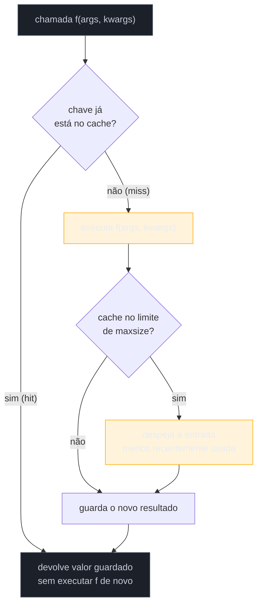
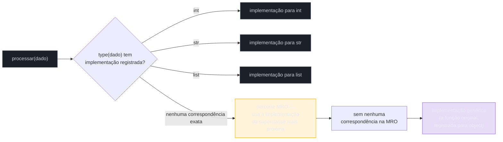

# functools — ferramentas funcionais

> [!abstract] TL;DR
> `functools` é a caixa de ferramentas da stdlib para programação funcional idiomática em Python: pega padrões que o time inteiro reescreveria manualmente — cache de resultado, fixação parcial de argumentos, acumulação, polimorfismo por tipo — e oferece a versão testada, otimizada e documentada de cada um. `@lru_cache`/`@cache` memoizam de verdade (a mão-feita da [[05 - Decorators — fundamentos|nota 05]] só cobre `*args` hashable; a versão da stdlib trata `**kwargs`, tem tamanho máximo configurável com política de despejo LRU, é thread-safe e expõe `cache_info()`/`cache_clear()`). `functools.partial` fixa argumentos de uma função existente, devolvendo uma nova função com assinatura mais enxuta — currying explícito de um único nível, sem a cerimônia de uma closure escrita à mão. `functools.reduce` acumula um iterável num valor único aplicando repetidamente uma função de dois argumentos — saiu de built-in para `functools` no Python 3 porque, segundo o próprio PEP 3100, "um loop é mais legível na maioria das vezes", e porque `sum()`/`any()`/`all()`/`max()`/`min()` já cobrem os casos mais comuns com nomes que dizem a intenção. `@singledispatch`/`@singledispatchmethod` implementam polimorfismo por **tipo do primeiro argumento** — uma forma de overloading que Python não tem nativamente — despachando para implementações registradas conforme o tipo em runtime, uma alternativa a cadeias de `isinstance()`/`if` que fica mais perto de como [[03-Dominios/Tecnologia/Python/OO e Data Model/06 - ABC e Protocol — tipagem estrutural|Protocol e ABC]] tratam polimorfismo estrutural — só que aqui a decisão acontece por dispatch dinâmico, não por herança ou verificação estática.

## O problema: reescrever a mesma engenharia toda vez

A [[05 - Decorators — fundamentos|nota 05]] deste galho terminou com um decorator de memoização escrito à mão — `memoizar`, um dicionário guardado na closure de `wrapper`, indexando por `args`. Funciona, mas carrega três limitações que qualquer versão "de produção" vai bater a cabeça em algum momento: ignora `**kwargs` por completo (o `wrapper` só aceita `*args`), cresce sem limite (nenhuma política de despejo — um processo de longa duração com muitos argumentos distintos eventualmente esgota memória), e não é thread-safe (duas threads escrevendo no mesmo dicionário ao mesmo tempo podem corromper o estado interno do cache).

```python
def memoizar(funcao):
    cache = {}
    def wrapper(*args):
        if args not in cache:
            cache[args] = funcao(*args)
        return cache[args]
    return wrapper
```

Esse é só um dos quatro problemas recorrentes que esta nota resolve com ferramentas prontas da biblioteca padrão. Os outros três: "preciso de uma versão desta função com alguns argumentos já fixados" (resolvido manualmente com uma closure, ou com `lambda x: funcao(x, argumento_fixo)`); "preciso reduzir uma lista inteira a um único valor acumulado" (resolvido manualmente com um `for` e uma variável acumuladora); "preciso que uma função se comporte diferente dependendo do **tipo** do argumento que recebe" (resolvido manualmente com uma cadeia de `isinstance()`/`if`/`elif`, que cresce a cada tipo novo e vive no mesmo arquivo, difícil de estender de fora).

`functools` — "ferramentas para funções de ordem superior e operações sobre objetos chamáveis", segundo a [documentação oficial](https://docs.python.org/3/library/functools.html) — existe porque esses quatro padrões são comuns o bastante, e sutis o bastante de acertar corretamente, para merecerem uma implementação única, testada pela comunidade inteira, em vez de N reimplementações levemente diferentes (e levemente erradas) espalhadas por N projetos.

## `lru_cache` e `cache`: memoização de verdade

`functools.lru_cache`, adicionado em Python 3.2, resolve exatamente o problema que `memoizar` tentou resolver à mão — só que de forma completa. "LRU" significa **Least Recently Used**: quando o cache atinge seu tamanho máximo, a entrada usada há mais tempo é a primeira a ser descartada, para abrir espaço para uma nova.

```python
from functools import lru_cache

@lru_cache(maxsize=128)
def fibonacci(n):
    if n < 2:
        return n
    return fibonacci(n - 1) + fibonacci(n - 2)

fibonacci(30)   # rápido: cada fibonacci(n) calculado só uma vez, mesmo com recursão ingênua
```

O mecanismo por dentro é o mesmo princípio de `memoizar` — um dicionário associando argumentos ao resultado já calculado — mas com engenharia adicional em cada ponta:

- **Trata `*args` e `**kwargs` juntos** na chave de cache, não só `*args` como a versão manual.
- **`maxsize`** (padrão `128`) limita quantas entradas distintas o cache guarda; ao atingir o limite, a entrada menos recentemente usada é despejada. `maxsize=None` desativa esse limite — o cache cresce sem parar, exatamente como o `memoizar` manual, mas com o resto dos benefícios.
- **`typed`** (padrão `False`): se `True`, argumentos de tipos diferentes que comparariam iguais (`3` e `3.0`) são tratados como chaves de cache **distintas** — por padrão, `f(3)` e `f(3.0)` compartilham a mesma entrada, porque `3 == 3.0`.
- **Thread-safe**: a estrutura interna permanece coerente sob atualização concorrente — a versão manual de `memoizar`, um `dict` puro sem nenhuma lock, não oferece essa garantia.
- **Instrumentação embutida**: `cache_info()` devolve uma `namedtuple` com `hits`, `misses`, `maxsize`, `currsize` — permite medir, em produção, se o cache está de fato ajudando. `cache_clear()` esvazia o cache manualmente. `cache_parameters()` (desde 3.9) devolve um dict com os valores de `maxsize`/`typed` usados na criação.

```python
@lru_cache(maxsize=32)
def buscar_pep(numero):
    # chamada de rede cara — simplificado
    ...

buscar_pep(8)
buscar_pep(8)      # bate no cache — não refaz a chamada de rede
buscar_pep.cache_info()   # CacheInfo(hits=1, misses=1, maxsize=32, currsize=1)
```

`functools.cache`, adicionado em Python 3.9, é literalmente `lru_cache(maxsize=None)` — um cache **sem limite**, mais simples e um pouco mais rápido que `lru_cache` com tamanho porque não precisa manter a lista ligada interna que rastreia ordem de uso para a política LRU. É a escolha certa quando o número de combinações distintas de argumentos é conhecido e pequeno (memoizar um cálculo puro com poucas entradas possíveis), ou quando o processo tem vida curta o bastante para "sem limite" não ser um risco real de memória.

```python
from functools import cache

@cache
def fatorial(n):
    return n * fatorial(n - 1) if n else 1
```

> [!question]- Qual a diferença prática entre `@cache` e `@lru_cache(maxsize=None)`, já que são a mesma coisa por dentro?
> Nenhuma diferença de comportamento — são literalmente equivalentes, e a documentação oficial confirma isso: `@cache` é definido como um atalho para `lru_cache(maxsize=None)`. A diferença é só de **legibilidade da intenção**: `@cache` comunica diretamente "quero memoização sem limite, sem pensar em política de despejo", enquanto `@lru_cache(maxsize=None)` parece, à primeira vista, uma configuração específica de uma ferramenta mais genérica — o leitor precisa saber que `None` desativa o limite para entender a intenção. Prefira `@cache` quando o requisito de fato é "sem limite, ponto final"; prefira `@lru_cache(maxsize=N)` explicitamente quando o requisito real é limitar o crescimento do cache.



> [!warning] `lru_cache`/`cache` exigem argumentos hashable — e não protegem contra funções impuras
> Assim como a versão manual, `lru_cache`/`cache` usam os argumentos como chave de dicionário — passar uma lista, um dicionário ou qualquer objeto mutável não-hashable levanta `TypeError: unhashable type`. Além disso, os dois decorators pressupõem que a função é **pura** (mesmo argumento sempre produz o mesmo resultado): decorar uma função que depende de estado externo mutável (`datetime.now()`, uma variável global que muda, uma leitura de arquivo que pode ter sido atualizado) com `@cache` faz a função "congelar" o primeiro resultado indefinidamente para aquela combinação de argumentos — um bug silencioso, porque nada no código sinaliza que o cache está devolvendo um valor obsoleto. A documentação oficial também deixa explícito: não use com **generators** nem funções **async** — o valor cacheado seria o objeto generator/coroutine em si, não o resultado da iteração/await, o que quase nunca é o comportamento desejado.

### `lru_cache` como decorator de método: a armadilha do `self`

Aplicar `@lru_cache` diretamente sobre um método de instância funciona, mas com uma pegadinha que vale conhecer antes de bater nela em produção: `self` entra na chave de cache junto com os outros argumentos — o que significa que o cache é, na prática, compartilhado entre instâncias diferentes só na estrutura (cada `self` distinto gera uma chave distinta), mas **cada instância mantém sua entrada própria presa ao cache da classe inteira**, porque `lru_cache` é aplicado à função (o método, antes de virar bound method), não a cada instância individualmente. Isso significa que, enquanto o cache existir, ele mantém uma referência viva a cada `self` que já passou por ali — impedindo o garbage collector de coletar instâncias que, de outra forma, já estariam sem nenhuma outra referência apontando para elas. Para métodos, uma alternativa comum é aplicar o cache a uma função auxiliar fora da classe, recebendo só os dados relevantes (não `self` inteiro), ou usar um cache por instância, guardado em `__init__`.

## `partial`: aplicação parcial de função

`functools.partial(func, *args, **keywords)` recebe uma função já existente e devolve um novo objeto chamável com alguns argumentos **já preenchidos** — os argumentos restantes só chegam na hora da chamada de fato:

```python
from functools import partial

def multiplicar(x, y):
    return x * y

dobro = partial(multiplicar, 2)   # fixa x=2
print(dobro(21))   # 42 — equivalente a multiplicar(2, 21)

base_dois = partial(int, base=2)
print(base_dois("10010"))   # 18 — equivalente a int("10010", base=2)
```

O nome técnico para esse padrão é **aplicação parcial** (não confundir com *currying* completo, embora os dois estejam relacionados: currying transforma uma função de N argumentos numa cadeia de N funções de um argumento cada; `partial` fixa um grupo arbitrário de argumentos de uma vez, sem forçar a cadeia inteira). Os argumentos passados na chamada final são **anexados** aos posicionais já fixados, e argumentos nomeados passados na chamada **estendem e sobrescrevem** os já fixados — não os substituem por completo:

```python
consultar = partial(requisitar_api, metodo="GET", timeout=5)

consultar("/usuarios")                    # GET /usuarios, timeout=5
consultar("/usuarios", timeout=30)        # GET /usuarios, timeout=30 — sobrescreve só o timeout
```

Um objeto `partial` expõe `func` (a função original), `args` (a tupla de posicionais fixados) e `keywords` (o dict de nomeados fixados) como atributos introspectáveis — mas, diferente de um decorator bem-feito, **não** copia `__name__`/`__doc__` automaticamente; `partial` não é `functools.wraps`, e um `dobro.__name__` levanta `AttributeError` a menos que seja atribuído manualmente.

> [!question]- Por que não usar `lambda x: multiplicar(2, x)` em vez de `partial(multiplicar, 2)`? Fazem a mesma coisa, não fazem?
> Observacionalmente, sim, para o caso simples — as duas formas produzem uma função equivalente. A diferença é de **intenção comunicada** e de algumas propriedades técnicas: `partial` deixa explícito, só pelo nome, que a operação é "fixar argumentos", sem exigir que quem lê interprete o corpo de uma lambda para entender isso. `partial` também é **picklable** quando `func` e os argumentos fixados são picklable — útil em contextos de `multiprocessing`, onde `lambda`s não podem ser serializadas (Python não sabe picklar uma função anônima definida inline). E `partial` preserva introspecção parcial via seus atributos `func`/`args`/`keywords`, o que ferramentas de debugging conseguem inspecionar de forma padronizada — uma `lambda` fechando sobre uma closure exige abrir o código para entender o que está fixado. Para casos simples de um único argumento, a escolha é largamente estilística; `partial` tende a vencer quando o número de argumentos fixados cresce, ou quando o resultado precisa atravessar um `multiprocessing.Pool`.

`partial` também aparece como uma das três correções idiomáticas para a armadilha de late binding em closures dentro de loops, já vista na [[04 - Closures de verdade|nota 04]] deste galho — fixar o valor da variável de iteração **no momento em que `partial(...)` é chamado**, em vez de deixar uma closure capturar a variável de controle do `for` por referência.

```python
callbacks = [partial(imprimir_categoria, categoria) for categoria in categorias]
```

### `partialmethod`: a versão para métodos

`functools.partialmethod` (Python 3.4+) resolve um problema que `partial` sozinho não resolve bem: usar aplicação parcial **dentro** da definição de uma classe, onde o primeiro argumento (`self`) só existe depois da instanciação — algo que `partial` não sabe lidar, porque ele fixa argumentos posicionais na ordem em que são passados, sem noção de "isto vai virar um bound method depois":

```python
from functools import partialmethod

class Celula:
    def __init__(self):
        self._viva = False

    def definir_estado(self, estado):
        self._viva = bool(estado)

    ativar = partialmethod(definir_estado, True)
    desativar = partialmethod(definir_estado, False)

c = Celula()
c.ativar()
print(c._viva)   # True
```

`partialmethod` é sensível a **descriptors** — se `func` for um método comum, `classmethod` ou `staticmethod`, ele delega corretamente para o protocolo de descriptor na hora de resolver `self`/`cls`; um `partial` comum aplicado diretamente num corpo de classe não faz essa distinção e trata `self` como só mais um argumento posicional a ser passado explicitamente.

## `reduce`: por que saiu de built-in

`functools.reduce(function, iterable, initial=None)` acumula um iterável inteiro num único valor, aplicando `function` repetidamente sobre um par (acumulado, próximo item):

```python
from functools import reduce

total = reduce(lambda acumulado, x: acumulado + x, [1, 2, 3, 4, 5])
# ((((1+2)+3)+4)+5) = 15
```

Em Python 2, `reduce` era built-in — não precisava de import. A mudança para `functools` aconteceu no Python 3, junto de uma limpeza deliberada do namespace de builtins descrita no [PEP 3100 — Miscellaneous Python 3.0 Plans](https://peps.python.org/pep-3100/), que lista explicitamente `reduce()` na seção "to be removed" com a justificativa: *"put in functools, a loop is more readable most of the times"*. O PEP referencia diretamente um post do próprio Guido van Rossum, ["The fate of reduce() in Python 3000"](https://www.artima.com/weblogs/viewpost.jsp?thread=98196), onde ele argumenta que `reduce()`, ao contrário de `map()` e `filter()` (que sobreviveram, ainda que hoje list comprehensions costumem ser preferidas), tende a produzir código genuinamente mais difícil de ler quando a operação de acumulação não é imediatamente óbvia — forçando quem lê a "executar" a redução mentalmente, item por item, para entender o que o código faz. A chegada de `sum()`, `any()`, `all()`, `max()`, `min()` como builtins cobriu os usos mais comuns de `reduce()` com nomes que já dizem a intenção — `sum(numeros)` é mais legível que `reduce(lambda a, b: a + b, numeros)`, mesmo fazendo exatamente a mesma coisa.

> [!question]- Se `reduce` é "menos legível", por que ele ainda existe? Por que não foi simplesmente removido?
> Porque, apesar da crítica de legibilidade para os casos **simples** (soma, produto, máximo — todos cobertos por builtins dedicados), `reduce` continua sendo a ferramenta certa para acumulações **genuinamente arbitrárias**, onde não existe um builtin equivalente e um `for` explícito seria só uma reescrita mais verbosa da mesma lógica, sem ganho real de clareza. Casos onde `reduce` ainda faz sentido: compor uma cadeia de funções (`reduce(lambda f, g: lambda x: g(f(x)), funcoes)`, produzindo uma pipeline), reduzir uma lista de dicionários fazendo merge progressivo, ou qualquer acumulação cuja "operação de combinação" não tem nome pronto na stdlib. A régua prática, adotada por boa parte da comunidade e refletida no próprio guia de estilo do Python: se existe um builtin nomeado para o que você está fazendo (`sum`, `any`, `all`, `max`, `min`, ou até uma comprehension), use-o; se a operação de acumulação é de fato arbitrária e não tem nome, `reduce` é uma ferramenta legítima — só não a primeira escolha por padrão.

```python
# Prefira builtins nomeados quando cobrem o caso:
soma = sum(numeros)                      # não reduce(lambda a, b: a + b, numeros)
maior = max(numeros)                     # não reduce(lambda a, b: a if a > b else b, numeros)

# reduce ainda vale quando a operação não tem nome pronto:
from functools import reduce
pipeline = reduce(lambda f, g: lambda x: g(f(x)), [validar, normalizar, salvar])
resultado_final = pipeline(dado_bruto)
```

O parâmetro `initial` (posicional em versões anteriores; aceita também como keyword desde Python 3.14) serve dois papéis: define o valor de partida da acumulação (útil quando o "elemento neutro" da operação não é o primeiro item do próprio iterável — por exemplo, `reduce(operator.add, listas_de_listas, [])` para achatar uma lista de listas começando de uma lista vazia) e evita `TypeError: reduce() of empty iterable with no initial value` quando o iterável pode estar vazio.

> [!warning] `reduce` sem `initial` falha silenciosamente diferente do esperado em iteráveis vazios
> `reduce(func, [])` sem um terceiro argumento levanta `TypeError`, não devolve um valor "neutro" como `0` ou `[]`. Isso é coerente (não existe um jeito genérico de `reduce` adivinhar qual seria o elemento neutro de uma função arbitrária), mas surpreende quem espera que `reduce` se comporte como `sum([])` (que devolve `0` por convenção). Sempre que o iterável de entrada pode legitimamente estar vazio, passar `initial` explicitamente é a única forma de evitar essa exceção.

`itertools.accumulate()` é o parente próximo de `reduce` que vale mencionar: em vez de devolver só o resultado final, `accumulate` produz **todos** os resultados intermediários da redução, como um generator — útil quando o caminho da acumulação importa tanto quanto o destino (por exemplo, um saldo acumulado dia a dia, não só o total do mês).

## `singledispatch` e `singledispatchmethod`: polimorfismo por tipo de argumento

Python não tem *function overloading* nativo — ao contrário de Java ou C++, não é possível declarar duas funções com o mesmo nome e assinaturas diferentes e deixar a linguagem escolher qual chamar conforme o tipo dos argumentos. A saída idiomática tradicional é uma cadeia de `isinstance()`:

```python
def processar(dado):
    if isinstance(dado, int):
        return dado * 2
    elif isinstance(dado, str):
        return dado.upper()
    elif isinstance(dado, list):
        return sorted(dado)
    else:
        raise TypeError(f"Tipo não suportado: {type(dado)}")
```

Esse padrão funciona, mas tem um problema de **abertura/fechamento**: adicionar suporte a um tipo novo exige editar essa função central, mesmo que o tipo novo venha de outra parte do código — ou pior, de uma biblioteca de terceiros que o autor original não previu. `functools.singledispatch` (Python 3.4+) resolve isso invertendo o controle: em vez de uma função central que conhece todos os tipos, existe uma função **genérica** (o comportamento padrão, para `object`) e implementações **registradas** separadamente, uma por tipo, que podem viver em qualquer lugar do código — inclusive em outro módulo:

```python
from functools import singledispatch

@singledispatch
def processar(dado):
    raise TypeError(f"Tipo não suportado: {type(dado)}")

@processar.register
def _(dado: int):
    return dado * 2

@processar.register
def _(dado: str):
    return dado.upper()

@processar.register
def _(dado: list):
    return sorted(dado)

processar(21)          # 42
processar("python")    # "PYTHON"
processar([3, 1, 2])   # [1, 2, 3]
```

O dispatch acontece sobre o **tipo do primeiro argumento** — daí "single" (contraste com *multiple dispatch*, onde vários argumentos influenciam a escolha, algo que Python não tem embutido). `@processar.register` inspeciona a **anotação de tipo** do único parâmetro da função registrada para saber a qual tipo aquela implementação corresponde — é por isso que os type hints (`dado: int`, `dado: str`) não são cosméticos aqui: eles são o mecanismo real de registro, lido em runtime pelo próprio `singledispatch`. Desde Python 3.7, é possível também passar o tipo explicitamente como argumento do decorator (`@processar.register(int)`), útil quando a assinatura da função não tem anotação, ou quando o tipo é algo que não dá para expressar limpo como anotação.



Quando não existe implementação registrada exatamente para o tipo do argumento, `singledispatch` percorre a **MRO** (Method Resolution Order) do tipo, buscando a implementação registrada mais específica entre as superclasses — e cai na implementação genérica (a função original, decorada com `@singledispatch`, que atua como implementação para `object`) só se nada na MRO tiver registro. Isso significa que registrar uma implementação para uma ABC (`collections.abc.Sequence`, por exemplo) cobre automaticamente qualquer subclasse virtual dela, sem precisar registrar cada tipo concreto individualmente.

Desde Python 3.11, `register()` também aceita `typing.Union` (ou a sintaxe `int | float`) na anotação, permitindo uma única implementação cobrir vários tipos de uma vez:

```python
@processar.register
def _(dado: int | float):
    return dado * 2
```

`processar.dispatch(tipo)` permite consultar, sem chamar a função, qual implementação seria escolhida para um tipo dado — útil para debugging ou testes. `processar.registry` expõe um `MappingProxyType` (somente leitura) com todos os tipos registrados e suas implementações — introspectável, mas não editável diretamente por fora de `register()`.

### `singledispatchmethod`: a mesma ideia dentro de uma classe

`functools.singledispatchmethod` (Python 3.8+) adapta o mesmo mecanismo para métodos, despachando pelo tipo do **primeiro argumento além de `self`/`cls`** — não por `self` em si, que seria sempre a mesma classe:

```python
from functools import singledispatchmethod

class Negador:
    @singledispatchmethod
    def negar(self, arg):
        raise NotImplementedError(f"Não sei negar {type(arg)}")

    @negar.register
    def _(self, arg: int):
        return -arg

    @negar.register
    def _(self, arg: bool):
        return not arg

n = Negador()
n.negar(5)       # -5
n.negar(True)    # False
```

Uma restrição a observar: quando `singledispatchmethod` combina com outro decorator (`@classmethod`, `@staticmethod`, `@abstractmethod`), ele precisa ser o decorator **mais externo** — a documentação oficial é explícita sobre essa ordem, porque `singledispatchmethod` precisa enxergar a função crua para inspecionar a assinatura corretamente antes de qualquer outro decorator envolvê-la.

### A ponte com Protocol/ABC: dois eixos de polimorfismo diferentes

Vale conectar `singledispatch` com o que a nota [[03-Dominios/Tecnologia/Python/OO e Data Model/06 - ABC e Protocol — tipagem estrutural|06 do Galho 3 (OO e Data Model)]] chamou de tipagem nominal (`abc.ABC`) e tipagem estrutural (`typing.Protocol`) — os três mecanismos resolvem "como uma função/método se comporta de forma diferente conforme o tipo do que recebe", mas em eixos diferentes:

| Mecanismo | Onde a decisão mora | Quando é resolvida | Precisa herdar/registrar? |
|---|---|---|---|
| Cadeia de `isinstance()`/`if` | Dentro da própria função, centralizada | Runtime, a cada chamada | Não — checa o tipo diretamente |
| `abc.ABC` + `@abstractmethod` (Galho 3) | Cada subclasse implementa seu próprio método | Runtime (dispatch normal de método, via `self`) | Sim — herança obrigatória |
| `typing.Protocol` (Galho 3) | Cada classe já tem os métodos certos, sem saber do Protocol | **Estática** (mypy/pyright); estrutural em runtime só com `@runtime_checkable` | Não — duck typing formalizado |
| `functools.singledispatch` | Implementações registradas separadamente, fora da classe do dado | Runtime, por tipo do argumento, via MRO | Não — registro explícito via `.register`, sem herança |

A diferença mais importante para escolher entre eles: ABC e Protocol resolvem "este **objeto** sabe se comportar de um jeito específico" — o polimorfismo mora no objeto, via método próprio (`.draw()`, `.speak()`). `singledispatch` resolve um problema estruturalmente diferente: "esta **função livre** precisa se comportar diferente dependendo do tipo do argumento que recebe" — útil exatamente quando não existe (ou não convém criar) uma hierarquia de classes com um método comum, porque os tipos envolvidos são todos externos (tipos embutidos como `int`/`str`/`list`, tipos de bibliotecas de terceiros que não podem ganhar um método novo). Um serializador que precisa transformar `int`, `datetime`, `Decimal` e `list` em JSON, por exemplo, não pode adicionar um método `.to_json()` a nenhum desses tipos embutidos — `singledispatch` é o encaixe natural, porque o comportamento por tipo vive fora dos próprios tipos.

> [!question]- Isso significa que `singledispatch` é sempre melhor que uma cadeia de `isinstance()`?
> Não necessariamente — para dois ou três tipos, com lógica simples, uma cadeia de `if isinstance(...)` continua perfeitamente legível e não introduz nenhuma indireção extra para quem lê o código pela primeira vez. `singledispatch` compensa o custo de indireção (várias funções `_` espalhadas, é preciso ler `.register` para entender onde cada tipo é tratado) quando: (1) o número de tipos tende a crescer ao longo do tempo, e cada tipo novo deveria poder ser adicionado **sem editar** a função original — o caso de plugins, ou de uma biblioteca cujos usuários precisam estender o comportamento para tipos próprios; (2) os tipos envolvidos vêm de módulos diferentes, e forçar todo o `if/elif` numa função central criaria um acoplamento (aquele módulo precisaria importar todos os tipos possíveis, mesmo os que a maioria dos usuários nunca usa); (3) a legibilidade de cada implementação por tipo se beneficia de estar isolada (uma função só, testável sozinha) em vez de um bloco dentro de um `if` gigante. Fora desses cenários, a cadeia de `isinstance()` é a escolha mais simples e igualmente correta.

## Casos práticos

### Cenário 1: cache de consulta cara com invalidação por TTL manual

Um serviço consulta uma API de cotações, cara e rate-limited, e quer cachear por um tempo curto — mas `lru_cache` sozinho não tem noção de "expirar depois de N segundos", só de "despejar quando o cache está cheio". A solução combina `lru_cache` com uma chave que inclui uma janela de tempo truncada:

```python
import time
from functools import lru_cache

@lru_cache(maxsize=256)
def _buscar_cotacao_cacheada(simbolo, janela_de_tempo):
    return requisitar_cotacao_na_api(simbolo)   # chamada de rede real

def buscar_cotacao(simbolo, ttl_segundos=30):
    janela_de_tempo = int(time.time() // ttl_segundos)
    return _buscar_cotacao_cacheada(simbolo, janela_de_tempo)
```

`janela_de_tempo` muda a cada `ttl_segundos`, o que faz `_buscar_cotacao_cacheada` receber uma chave diferente automaticamente quando a "janela" avança — um novo miss no cache, forçando uma nova chamada de rede. Dentro da mesma janela, chamadas repetidas com o mesmo `simbolo` batem no cache normalmente. É um truque conhecido, mas com uma ressalva: entradas de janelas antigas continuam ocupando espaço no cache até serem despejadas pela política LRU normal (não há expiração ativa) — para TTL de verdade, com expiração ativa e mais controle fino, bibliotecas dedicadas (`cachetools`, com sua própria `TTLCache`) são a ferramenta certa; este padrão serve bem quando o objetivo é só "reduzir carga sem trazer uma dependência nova".

### Cenário 2: `reduce` legítimo — compondo uma pipeline de validadores

Um formulário de cadastro precisa rodar uma sequência de validadores sobre o mesmo dado, cada um podendo transformar o valor antes de passar adiante — o tipo de acumulação sem nome pronto na stdlib, onde `reduce` continua sendo a ferramenta certa em vez de um `for` explícito:

```python
from functools import reduce

def validar_nao_vazio(texto):
    if not texto.strip():
        raise ValueError("Campo não pode ser vazio")
    return texto.strip()

def normalizar_espacos(texto):
    return " ".join(texto.split())

def capitalizar(texto):
    return texto.title()

validadores = [validar_nao_vazio, normalizar_espacos, capitalizar]

def aplicar_pipeline(valor, funcoes):
    return reduce(lambda acumulado, funcao: funcao(acumulado), funcoes, valor)

resultado = aplicar_pipeline("  joão   da   silva  ", validadores)
# "João Da Silva"
```

Aqui, cada "passo" da redução não é uma soma nem um máximo — é "aplicar a próxima função ao resultado da anterior", uma operação sem builtin dedicado. Reescrever isso como um `for` explícito (`valor_atual = valor; for f in validadores: valor_atual = f(valor_atual)`) não seria mais legível — só mais longo, para exatamente a mesma ideia. É o caso de uso que sobrevive à crítica de legibilidade do PEP 3100: a operação de acumulação não tem nome pronto, então nomeá-la via `reduce` (e uma função auxiliar como `aplicar_pipeline`) comunica a intenção melhor do que um loop cru faria.

### Cenário 3: serializador JSON via `singledispatch`, estendido por outro módulo

Um serializador de eventos de domínio para logging estruturado precisa lidar com tipos que crescem com o tempo — cada novo tipo de evento é adicionado por um time diferente, sem coordenação central:

```python
# serializacao.py
from functools import singledispatch
from datetime import date, datetime
from decimal import Decimal

@singledispatch
def para_json(valor):
    raise TypeError(f"Sem serializador registrado para {type(valor)}")

@para_json.register
def _(valor: (date, datetime)):
    return valor.isoformat()

@para_json.register
def _(valor: Decimal):
    return float(valor)
```

```python
# modulo_de_pedidos.py — outro time, outro arquivo, sem tocar em serializacao.py
from serializacao import para_json
from modulo_de_pedidos.tipos import StatusPedido

@para_json.register
def _(valor: StatusPedido):
    return valor.name.lower()
```

O time responsável por `StatusPedido` estende `para_json` sem precisar editar `serializacao.py`, sem precisar de permissão para mudar um módulo que outros times também usam, e sem risco de conflito de merge num arquivo central que cresceria a cada tipo novo — a mesma vantagem estrutural que motivou a comparação com Protocol na seção anterior: o comportamento por tipo é registrado de fora, não centralizado dentro de uma função gigante.

## Armadilhas comuns

> [!warning] Aplicar `@lru_cache` a um método sem pensar no ciclo de vida do `self`
> Como discutido na seção de `lru_cache`, decorar um método diretamente com `@lru_cache` faz o cache manter uma referência a cada `self` distinto que já passou por ali, prendendo instâncias vivas na memória mesmo depois que todo o resto do código já não tem mais nenhuma referência a elas — um vazamento de memória sutil, que só aparece em profiling de longa duração, não em testes unitários curtos.

> [!warning] Confundir `reduce(func, iterable)` sem `initial` com um "valor neutro" implícito
> `reduce` sobre um iterável vazio, sem `initial`, levanta `TypeError` em vez de devolver algo como `0` — diferente de `sum([])`, que devolve `0` por convenção do próprio builtin. Qualquer código que usa `reduce` sobre uma coleção cujo tamanho não é garantido precisa passar `initial` explicitamente, ou tratar o `TypeError` no chamador.

> [!warning] Esquecer que `singledispatch` despacha só pelo **primeiro** argumento
> `singledispatch` não é *multiple dispatch* — só o tipo do primeiro parâmetro decide qual implementação registrada roda. Uma função que precisaria variar comportamento conforme a combinação de **dois** tipos de argumento (por exemplo, uma operação binária entre tipos numéricos diferentes) não é resolvida por `singledispatch` sozinho; exigiria uma estrutura de despacho adicional (uma tabela de pares de tipos, por exemplo) construída por cima.

> [!warning] Anotação de tipo errada ou ausente quebra o registro silenciosamente
> `@processar.register` sem anotação de tipo no parâmetro, e sem passar o tipo explicitamente como argumento do decorator, faz o Python tentar inferir o tipo pela anotação — e se não houver nenhuma, o registro falha com um erro relativamente claro (`TypeError: Invalid first argument`), mas é fácil, ao copiar/colar uma implementação existente, esquecer de trocar a anotação de tipo do parâmetro e registrar a implementação errada por engano (por exemplo, deixar `dado: int` numa função que na verdade trata `str`) — o registro "funciona" sintaticamente, mas a implementação nunca é chamada para o tipo pretendido, e o comportamento observado é "cai sempre na implementação genérica", sem erro nenhum indicando por quê.

## Em entrevista

Perguntas previsíveis sobre este tópico:

- **"Qual a diferença entre `@lru_cache` e `@cache`?"** `@cache` (3.9+) é um atalho para `lru_cache(maxsize=None)` — um cache sem limite de tamanho, mais simples e um pouco mais rápido por não manter a estrutura de rastreamento de uso da política LRU. `@lru_cache` com `maxsize` finito adiciona uma política de despejo: quando o cache enche, a entrada menos recentemente usada é descartada.
- **"Por que memoizar manualmente com um dicionário na closure não é o suficiente para produção?"** Ignora `**kwargs` (só cobre `*args`), não tem limite de tamanho (risco de crescimento sem controle), e não é thread-safe. `lru_cache`/`cache` resolvem os três, além de expor `cache_info()`/`cache_clear()` para observabilidade.
- **"O que `functools.partial` faz, e como isso difere de uma `lambda` equivalente?"** `partial(func, *args, **kwargs)` fixa parte dos argumentos de uma função existente, devolvendo um novo chamável. Difere de uma `lambda` equivalente por ser picklable (importante em `multiprocessing`), por expor os argumentos fixados como atributos introspectáveis (`func`, `args`, `keywords`), e por comunicar a intenção "aplicação parcial" só pelo nome.
- **"Por que `reduce()` saiu de built-in no Python 3?"** O PEP 3100 listou `reduce()` para remoção do namespace global com a justificativa de que um loop explícito costuma ser mais legível — reforçado por um post de Guido van Rossum sobre o assunto. A chegada de builtins nomeados (`sum`, `any`, `all`, `max`, `min`) cobriu os casos mais comuns com nomes que já expressam a intenção; `reduce` continua disponível via `functools` para acumulações genuinamente arbitrárias, sem builtin equivalente.
- **"Como Python implementa algo parecido com function overloading, já que não tem isso nativamente?"** `functools.singledispatch` (funções livres) e `functools.singledispatchmethod` (métodos) despacham para implementações registradas conforme o **tipo do primeiro argumento**, inspecionado via anotação de tipo ou passado explicitamente a `.register`. Não é overloading no sentido de C++/Java (que também considera número e tipos de todos os parâmetros); é dispatch de único argumento, resolvido em runtime, com fallback via MRO até a implementação genérica.
- **"Quando `singledispatch` é melhor que uma cadeia de `isinstance()`?"** Quando o número de tipos tratados tende a crescer com o tempo e precisa ser extensível **sem editar a função original** — o caso de plugins, bibliotecas com pontos de extensão, ou tipos espalhados por módulos diferentes que não deveriam precisar de um import central conhecendo todos eles.

### How to explain in English

> `functools` is the standard library's toolbox for functional-style patterns that would otherwise get reimplemented, slightly wrong, in every codebase: real memoization via `@lru_cache`/`@cache` (bounded or unbounded caching, thread-safe, with hit/miss stats — a proper upgrade from a hand-rolled dictionary-based decorator, which typically ignores keyword arguments and has no eviction policy or thread safety); `partial`, which freezes some arguments of an existing function and returns a new, narrower-signature callable — partial application, picklable unlike an equivalent lambda, which matters for `multiprocessing`; `reduce`, which folds an iterable down to a single value by repeatedly applying a two-argument function — moved out of builtins in Python 3 per PEP 3100, on the argument (traced back to a Guido van Rossum blog post) that an explicit loop is usually more readable, with named builtins like `sum`/`any`/`all`/`max`/`min` covering the common cases and `reduce` remaining the right tool only for genuinely nameless accumulations; and `singledispatch`/`singledispatchmethod`, which give Python a form of type-based polymorphism it lacks natively — a generic function plus separately registered implementations, dispatched by the type of the first argument at runtime, falling back through the type's MRO to a default implementation. That last one solves a structurally different problem than `Protocol`/`ABC`: those put behavior on the object itself (a method the object implements or is structurally shaped to have); `singledispatch` puts behavior in a free function that varies by the type it receives — the right fit when the types involved are built-ins or third-party types that can't gain a new method.

| PT | EN |
|---|---|
| memoização | memoization |
| aplicação parcial | partial application |
| currying | currying |
| política de despejo (LRU) | eviction policy (LRU) |
| acumulação | folding / reduction |
| despacho por tipo | type-based dispatch |
| função genérica | generic function |
| sobrecarga de função | function overloading |
| ordem de resolução de método (MRO) | method resolution order (MRO) |
| implementação registrada | registered implementation |

## O que vem a seguir

`functools` fecha o kit de ferramentas funcionais deste galho — memoização, aplicação parcial, acumulação e dispatch por tipo, todos resolvendo problemas que decorators e closures, sozinhos, resolveriam de forma mais verbosa e mais propensa a erro. A próxima nota volta para um problema estrutural diferente: envolver comportamento em torno de um **bloco de código**, não de uma função inteira — usando o mesmo mecanismo de `yield` já visto nas notas de generators, aplicado ao protocolo `with`.

- [[08 - Context managers via generator|08 — Context managers via generator]] — `@contextlib.contextmanager`, `yield` dividindo `__enter__`/`__exit__`
- [[05 - Decorators — fundamentos|05 — Decorators: fundamentos]] — a memoização manual que esta nota estendeu com `lru_cache`/`cache`
- [[04 - Closures de verdade|04 — Closures de verdade]] — o mecanismo por trás da correção de late binding via `partial`
- [[03-Dominios/Tecnologia/Python/OO e Data Model/06 - ABC e Protocol — tipagem estrutural|OO e Data Model 06 — ABC e Protocol]] — o outro eixo de polimorfismo, por objeto em vez de por função livre
- [[03-Dominios/Tecnologia/Python/index|Trilha Python]]

## Fontes

- Python Software Foundation. *functools — Higher-order functions and operations on callable objects* (`lru_cache`, `cache`, `partial`, `partialmethod`, `reduce`, `singledispatch`, `singledispatchmethod`). docs.python.org, versão 3.14. https://docs.python.org/3/library/functools.html (acessado em 2026-07-10)
- van Rossum, G. et al. *PEP 3100 — Miscellaneous Python 3.0 Plans* — seção de builtins removidos, incluindo `reduce()`. peps.python.org. https://peps.python.org/pep-3100/ (acessado em 2026-07-10)
- van Rossum, G. *The fate of reduce() in Python 3000*. Artima Weblogs, 2005. https://www.artima.com/weblogs/viewpost.jsp?thread=98196 (acessado em 2026-07-10)
- Real Python. *Python's reduce(): From Functional to Pythonic Style*. https://realpython.com/python-reduce-function/ (acessado em 2026-07-10)
- Real Python. *functools — Python Standard Library reference*. https://realpython.com/ref/stdlib/functools/ (acessado em 2026-07-10)
- Ramalho, L. *Fluent Python*, 2ª ed. — Capítulo 7, "Functions as First-Class Objects" (`reduce`, `partial`, funções de ordem superior) e capítulo sobre tipagem estática/protocolos (contraste com `singledispatch`). O'Reilly Media, 2022.
- PEP 443 — *Single-dispatch generic functions*. peps.python.org, 2012. https://peps.python.org/pep-0443/ (acessado em 2026-07-10)

Consultado em 2026-07-10.
