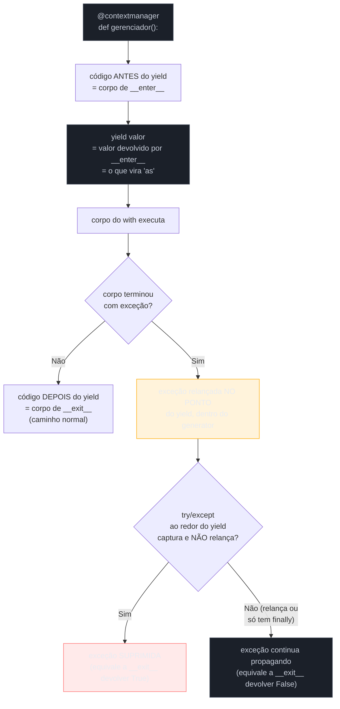
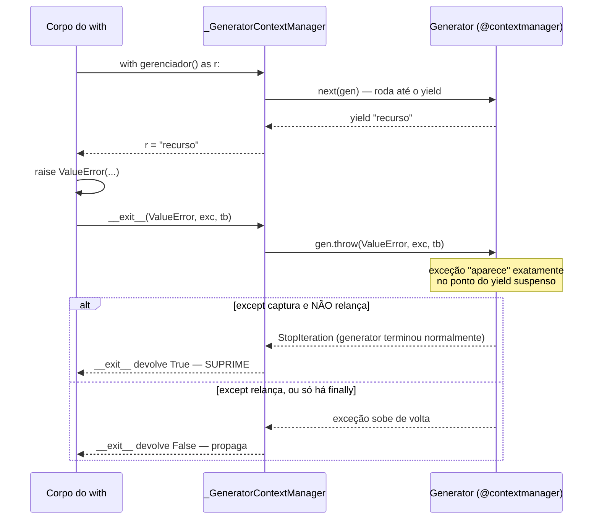

# Context managers via generator

> [!abstract] TL;DR
> `@contextlib.contextmanager` transforma uma função geradora com **um único `yield`** num context manager completo, sem escrever `__enter__`/`__exit__` manualmente: tudo antes do `yield` roda como `__enter__`, o valor passado ao `yield` vira o que fica em `as`, e tudo depois do `yield` roda como `__exit__`. Se o corpo do `with` levantar uma exceção, ela é relançada **dentro do generator, exatamente no ponto do `yield`** — por isso o padrão é `try: yield recurso finally: liberar(recurso)`, com o `finally` (ou um `except` que relança) sempre envolvendo o `yield`. Capturar a exceção sem relançar suprime ela — o equivalente exato de `__exit__` devolver `True`. `contextlib.suppress` e `ExitStack` são dois utilitários prontos que resolvem, respectivamente, "engolir tipos específicos de exceção" e "gerenciar um número variável de recursos" sem escrever nenhuma das duas formas de context manager do zero.

Esta nota pressupõe generators com `yield`, `send()` e `throw()` ([[03-Dominios/Tecnologia/Python/Funcional e idiomas avançados/02 - Generators — yield e generator functions|nota 02]]) e o protocolo `__enter__`/`__exit__` escrito como classe, já coberto em [[03-Dominios/Tecnologia/Python/OO e Data Model/07 - Operator overloading e protocolos avançados|OO e Data Model, nota 07]]. Se esse protocolo de classe ainda não estiver sólido, vale revisitar aquela nota primeiro — esta aqui assume que "`__exit__` recebe `(exc_type, exc_value, traceback)` e um retorno truthy suprime a exceção" já é uma frase que faz sentido sem explicação adicional. O que muda aqui não é o protocolo — é a **ferramenta** usada para implementá-lo.

## O problema: duas classes inteiras para gerenciar dois recursos simples

Imagine um desenvolvedor que precisa de dois context managers pequenos e sem relação nenhuma entre si: um para medir quanto tempo um bloco de código leva para rodar, e outro para trocar temporariamente o diretório de trabalho do processo e garantir que ele volte ao original ao sair do bloco — mesmo se o código dentro do `with` falhar. Seguindo o padrão que já conhece da nota anterior, ele escreve duas classes:

```python
import os
import time


class Cronometro:
    def __enter__(self):
        self._inicio = time.perf_counter()
        return self

    def __exit__(self, exc_type, exc_value, traceback):
        self.duracao = time.perf_counter() - self._inicio
        print(f"Bloco levou {self.duracao:.4f}s")
        return False   # não suprime nada


class MudarDiretorio:
    def __init__(self, novo_dir):
        self.novo_dir = novo_dir

    def __enter__(self):
        self.dir_original = os.getcwd()
        os.chdir(self.novo_dir)
        return self.novo_dir

    def __exit__(self, exc_type, exc_value, traceback):
        os.chdir(self.dir_original)   # volta sempre, com ou sem erro
        return False


with Cronometro():
    time.sleep(0.1)

with MudarDiretorio("/tmp"):
    print(os.getcwd())
```

Funciona — mas repare no tamanho: duas classes, quatro métodos, `self` explícito guardando estado que só existe para servir de ponte entre `__enter__` e `__exit__`. Para um recurso que "prepara, cede o controle, depois desfaz" — o padrão mais comum de longe entre context managers — isso é peso estrutural desproporcional ao problema. É exatamente esse peso que a biblioteca padrão resolve com `contextlib.contextmanager`: a mesma coisa, escrita como uma função com um `yield` no meio.

## O que é

[`contextlib.contextmanager`](https://docs.python.org/3/library/contextlib.html#contextlib.contextmanager) é um decorator da biblioteca padrão que recebe uma **função geradora com exatamente um `yield`** e devolve uma *factory* de context managers — uma função que, quando chamada, produz um objeto pronto para uso em `with`, sem que o desenvolvedor precise escrever `__enter__`/`__exit__` em lugar nenhum. Por trás dos panos, o decorator envolve o generator numa classe auxiliar (`_GeneratorContextManager`) que já implementa o protocolo completo — ela existe, só que o desenvolvedor nunca a vê nem escreve.

```python
from contextlib import contextmanager


@contextmanager
def cronometro():
    inicio = time.perf_counter()
    yield
    duracao = time.perf_counter() - inicio
    print(f"Bloco levou {duracao:.4f}s")


@contextmanager
def mudar_diretorio(novo_dir):
    dir_original = os.getcwd()
    os.chdir(novo_dir)
    try:
        yield novo_dir
    finally:
        os.chdir(dir_original)   # volta sempre, com ou sem erro


with cronometro():
    time.sleep(0.1)

with mudar_diretorio("/tmp") as destino:
    print(f"Agora em {destino}")
```

Duas funções, um `yield` cada, zero `self`. O comportamento observável — o que o código que usa `with cronometro():` vê — é idêntico ao das duas classes anteriores.

## Por que importa

`@contextmanager` não é só "menos digitação" — é a ferramenta que a própria biblioteca padrão usa internamente com frequência (`contextlib.chdir`, partes de `unittest.mock`, bibliotecas de teste como `pytest` para fixtures) sempre que o padrão "preparar → ceder → desfazer" não justifica uma classe inteira. Segundo a [documentação oficial](https://docs.python.org/3/library/contextlib.html#contextlib.contextmanager), o decorator existe precisamente para que escrever um context manager "não exija criar uma classe nem lidar diretamente com o protocolo `__enter__`/`__exit__`". Isso importa por três razões práticas:

- **Menos código para o caso comum.** A maioria dos context managers do mundo real segue o padrão simples: adquirir recurso, cedê-lo, liberar recurso — exatamente a forma que `try/yield/finally` captura em três linhas, contra as ~8-10 linhas de uma classe equivalente.
- **Estado como variável local, não atributo de instância.** Tudo que precisa sobreviver entre "antes" e "depois" do `yield` já é uma variável local da função — Python resolve isso de graça via closure do generator, sem precisar pendurar nada em `self`.
- **Reaproveita `try`/`finally`, o idioma que qualquer desenvolvedor Python já conhece**, em vez de introduzir uma API nova (`__enter__`/`__exit__`) para o mesmo problema que `try`/`finally` já resolve há décadas.

## Como funciona

### O `yield` como ponto de divisão entre `__enter__` e `__exit__`

A regra central, e a única coisa que realmente precisa ser internalizada: **tudo antes do `yield` é o corpo de `__enter__`; o valor passado ao `yield` é o que `__enter__` devolveria (e que vira o `as`); tudo depois do `yield` é o corpo de `__exit__`.**



O mapeamento é direto o suficiente para memorizar numa frase: **"antes do yield, `__enter__`; depois do yield, `__exit__`; o que passa pelo yield é o `as`."** O único ponto que exige mais cuidado — e que é a fonte de quase todo bug em código escrito com `@contextmanager` — é o que acontece quando o corpo do `with` levanta uma exceção, e é o assunto da próxima seção.

> [!question]- Por que só pode ter **um** `yield` na função?
> Porque o protocolo `with` só tem um ponto de "ceder controle" (`__enter__` devolve um valor uma vez) e um ponto de "retomar controle" (`__exit__` roda uma vez, ao sair do bloco). Se a função geradora tivesse dois `yield`s, não haveria correspondência clara com esse protocolo de duas fases — o generator por trás do `_GeneratorContextManager` espera consumir exatamente um valor de `next()` na entrada e retomar a execução exatamente uma vez na saída. Um segundo `yield` levantaria `RuntimeError: generator didn't stop` quando o `_GeneratorContextManager` tentasse fechar o generator e descobrisse que ele ainda tinha mais um `yield` pela frente, em vez de terminar.

### Tratamento de exceção: por que o `try`/`finally` precisa envolver o `yield`

Este é o mecanismo mais importante — e o menos intuitivo à primeira vista — da nota inteira. Quando o corpo do `with` levanta uma exceção, ela **não** aparece como um valor de retorno nem como algo que o generator "recebe passivamente". Ela é **relançada dentro do generator, no ponto exato onde o `yield` estava suspenso** — como se, naquela linha específica, um `raise` tivesse acontecido.

```python
@contextmanager
def gerenciador_de_recurso():
    print("adquirindo recurso")
    try:
        yield "recurso"
    except ValueError as exc:
        print(f"tratando ValueError: {exc}")
        # não relança — SUPRIME a exceção
    finally:
        print("liberando recurso (roda sempre)")


with gerenciador_de_recurso() as r:
    print(f"usando {r}")
    raise ValueError("algo deu errado")

print("chegou aqui — a exceção foi suprimida!")
```

```
adquirindo recurso
usando recurso
tratando ValueError: algo deu errado
liberando recurso (roda sempre)
chegou aqui — a exceção foi suprimida!
```

O `raise ValueError(...)` dentro do `with` não "sai" direto para fora do bloco — ele **entra no generator pelo `yield`**, como se a linha `yield "recurso"` tivesse, naquele instante, sido substituída por `raise ValueError("algo deu errado")`. É por isso que o `try`/`except` precisa **envolver** o `yield`, e não vir antes ou depois dele: só assim ele intercepta a exceção no ponto em que ela de fato chega dentro do generator.

Segundo a [documentação oficial](https://docs.python.org/3/library/contextlib.html#contextlib.contextmanager), "se uma exceção não tratada ocorre no bloco, ela é relançada dentro do generator no ponto onde o `yield` ocorreu" — e a própria documentação é explícita sobre a responsabilidade que isso implica: "você pode usar um `try...except...finally` para trapear o erro (se houver) ou garantir que alguma limpeza aconteça. Se uma exceção for trapeada apenas para fins de log ou alguma ação (em vez de suprimi-la inteiramente), o generator deve relançá-la".



### `.throw()` é o mecanismo, não uma analogia

A relação entre "exceção do `with` reaparece no `yield`" e `.throw()` não é uma comparação solta — é o **mesmo mecanismo**, literalmente. O `_GeneratorContextManager` por trás de `@contextmanager` implementa `__exit__` chamando `gen.throw(exc_type, exc_value, traceback)` no generator — o método `.throw()` que a [[03-Dominios/Tecnologia/Python/Funcional e idiomas avançados/02 - Generators — yield e generator functions|nota 02]] já apresentou como parte do protocolo generator básico. Se a chamada a `gen.throw()` propagar a exceção de volta para fora do generator (porque ele não a capturou, ou capturou e relançou), `__exit__` devolve `False`, e a exceção original continua propagando através do `with`. Se `gen.throw()` fizer o generator terminar normalmente (via `return` implícito ou explícito, sem relançar), isso significa "a exceção foi tratada" — e `__exit__` devolve `True`, suprimindo.

> [!warning] Sem `try`/`finally` (ou `try`/`except` + `raise`) ao redor do `yield`, o cleanup não roda em caso de erro
> ```python
> @contextmanager
> def conexao_ruim(host):
>     conn = abrir(host)
>     yield conn
>     conn.fechar()   # NÃO roda se o bloco with levantar exceção!
> ```
> Se o corpo do `with` levanta uma exceção, ela reaparece no `yield` e, sem um `try`/`finally` envolvendo essa linha, a execução da função geradora **pula direto** para fora — nunca alcançando `conn.fechar()`. É o mesmo vazamento de recurso que o `with` deveria eliminar, só que reintroduzido por engano dentro da implementação do próprio context manager. A regra fixa: tudo que precisa rodar independentemente de exceção vai dentro de um `finally` (ou de um `except` que relança no final), nunca solto depois do `yield` sem proteção.

> [!question]- Se eu não colocar nenhum `try`/`except`/`finally` ao redor do `yield`, o que acontece com a exceção?
> Ela simplesmente **propaga para fora do generator sem ser tratada** — o que é exatamente o comportamento correto quando o context manager não tem nenhuma limpeza condicional a fazer (só cleanup incondicional, coberto por um `finally`, ou nenhuma limpeza nenhuma). O `_GeneratorContextManager` interpreta "a exceção saiu do generator sem ser capturada" como "não suprimir" — equivalente a `__exit__` devolver `False`/`None`. O erro real não é "esquecer o `try`" quando não há nada a limpar; é esquecer o `finally` quando **há** algo que precisa rodar sempre (fechar arquivo, liberar lock, reverter transação) — nesse caso, sem `finally`, a limpeza só roda no caminho feliz.

## Comparação com o protocolo de classe

A [[03-Dominios/Tecnologia/Python/OO e Data Model/07 - Operator overloading e protocolos avançados|nota 07 do Galho 3]] já cobriu o protocolo `__enter__`/`__exit__` escrito manualmente como classe — inclusive um exemplo de `Transacao` quase idêntico ao `Cronometro` desta nota. Vale a comparação lado a lado, porque a escolha entre as duas formas é uma decisão real de design, não só estilo:

| | Classe (`__enter__`/`__exit__`) | `@contextmanager` (generator) |
|---|---|---|
| Verbosidade | maior — dois métodos, `self` explícito | menor — uma função, um `yield` |
| Estado entre entrada e saída | atributos de `self` | variáveis locais (closure natural do generator) |
| Suprimir exceção | `return True` em `__exit__` | capturar no `except` ao redor do `yield` e **não** relançar |
| Relação com exceção | recebida como três argumentos posicionais (`exc_type, exc_value, traceback`) | relançada literalmente no ponto do `yield`, via `.throw()` interno |
| Reutilizável como decorator de função | precisa herdar de `ContextDecorator` explicitamente | de graça — `contextmanager()` já usa `ContextDecorator` internamente desde o Python 3.2 |
| Uso único vs. reentrante | depende de como a classe é escrita — controle total | **uso único por padrão**: chamar a mesma instância duas vezes em `with` levanta `RuntimeError` |
| Quando escolher | lógica complexa, múltiplos métodos auxiliares, estado rico, precisa herdar/compor com outras classes | caso comum: abrir/fechar recurso simples, sem necessidade de métodos extras na própria classe |

O ponto mais sutil da tabela é "uso único vs. reentrante": um objeto criado por `@contextmanager` (a instância de `_GeneratorContextManager` devolvida pela chamada, ex.: `gerenciador_de_recurso()`) só funciona **uma vez** dentro de um `with` — usar a mesma instância numa segunda entrada levanta `RuntimeError: generator didn't yield` (porque o generator por trás já foi consumido até o fim). Uma classe escrita à mão, por outro lado, pode ser desenhada para ser reentrante ou reutilizável se o desenvolvedor quiser — é uma escolha de design, não uma limitação automática do protocolo de classe.

> [!question]- "Isso significa que `@contextmanager` é sempre pior para reuso?"
> Não — significa que a *factory function* decorada (`gerenciador_de_recurso`, a função em si) pode ser chamada quantas vezes forem necessárias, cada chamada produzindo uma instância nova e utilizável uma vez: `with gerenciador_de_recurso(): ...` funciona perfeitamente em um loop, chamado a cada iteração. O que não funciona é guardar o **resultado de uma chamada específica** (`cm = gerenciador_de_recurso()`) numa variável e tentar usar esse mesmo objeto `cm` em dois blocos `with` diferentes. Na prática, isso raramente é um problema real — o padrão natural de uso já é chamar a função de novo a cada `with`, não guardar e reaproveitar a instância.

## Na prática: reescrevendo a `Transacao` da nota anterior

Fechando o paralelo com a nota do Galho 3, a mesma `Transacao` de banco de dados, lado a lado nas duas formas — reforçando que o comportamento observável é idêntico, só a implementação muda:

```python
from contextlib import contextmanager


# Forma 1: classe (já vista em OO e Data Model, nota 07)
class Transacao:
    def __init__(self, conexao):
        self.conexao = conexao

    def __enter__(self):
        print("BEGIN — iniciando transação")
        self.conexao.executar("BEGIN")
        return self.conexao

    def __exit__(self, exc_type, exc_value, traceback):
        if exc_type is None:
            print("COMMIT — tudo certo, confirmando")
            self.conexao.executar("COMMIT")
        else:
            print(f"ROLLBACK — erro detectado: {exc_type.__name__}: {exc_value}")
            self.conexao.executar("ROLLBACK")
        return False   # não suprime a exceção


# Forma 2: generator + @contextmanager — mesmo comportamento
@contextmanager
def transacao(conexao):
    print("BEGIN — iniciando transação")
    conexao.executar("BEGIN")
    try:
        yield conexao
    except Exception:
        print("ROLLBACK — erro detectado")
        conexao.executar("ROLLBACK")
        raise   # relança — equivalente a __exit__ devolver False
    else:
        print("COMMIT — tudo certo, confirmando")
        conexao.executar("COMMIT")


with transacao(conexao) as conn:
    conn.executar("INSERT INTO pedidos (id) VALUES (42)")
# COMMIT roda — bloco terminou sem exceção

with transacao(conexao) as conn:
    conn.executar("INSERT INTO pedidos (id) VALUES (43)")
    raise ValueError("estoque insuficiente")
# ROLLBACK roda — exceção detectada dentro do generator, depois relançada
```

Repare no `try/except Exception/else` da versão generator: o `else` (que só roda se **não** houve exceção no `try`) é o jeito idiomático de separar "código que roda no caminho feliz" de "código que roda sempre" — equivalente a checar `if exc_type is None:` dentro de `__exit__` na versão classe. O `raise` sem argumento dentro do `except` relança a exceção original (com o traceback preservado), o mesmo efeito de `__exit__` devolver `False`.

## Bônus: `contextlib.suppress` e `ExitStack`

Dois utilitários prontos da mesma biblioteca que resolvem, sem escrever nenhuma das duas formas de context manager, dois padrões que apareceriam repetidamente se cada desenvolvedor tivesse que implementá-los à mão.

### `contextlib.suppress` — engolir tipos específicos de exceção

O padrão "suprimir exceções de tipos conhecidos e esperados" — já visto como exemplo didático (`IgnorarErros`) na nota do Galho 3 — vem pronto:

```python
from contextlib import suppress

with suppress(FileNotFoundError):
    os.remove("arquivo_que_talvez_nao_exista.tmp")
# se o arquivo não existir, a exceção é suprimida silenciosamente;
# se existir outro tipo de erro (PermissionError, por exemplo), ele propaga normalmente
```

Isso é exatamente equivalente a `try: os.remove(...) except FileNotFoundError: pass`, mas expresso como uma única linha declarativa. Segundo a [documentação oficial](https://docs.python.org/3/library/contextlib.html#contextlib.suppress), `suppress` é **reentrante** — pode ser usado em blocos `with` aninhados dentro de si mesmo sem problema, ao contrário de `ExitStack` (próxima seção), que é reutilizável mas não reentrante. A partir do Python 3.12, `suppress` também sabe remover exceções suprimidas de dentro de um `ExceptionGroup`, cobrindo o caso de código que usa `except*` (grupos de exceção).

> [!warning] `suppress` é para exceções **esperadas e específicas** — não para "engolir tudo"
> `with suppress(Exception):` compila e roda, mas suprime absolutamente qualquer erro dentro do bloco — incluindo bugs genuínos que nada têm a ver com a intenção original. É o mesmo risco já discutido para `return True` incondicional em `__exit__`: sempre nomear o(s) tipo(s) de exceção específico(s) que de fato se espera e sabe tratar, nunca a classe base `Exception` (ou pior, `BaseException`) como forma de "silenciar erros".

### `ExitStack` — gerenciar um número variável de recursos

O problema que `ExitStack` resolve não tem solução limpa com `with` comum: e se o número de recursos a abrir só é conhecido em runtime? `with a, b, c:` exige que `a`, `b`, `c` sejam conhecidos estaticamente no código; não dá para escrever um `with` com uma quantidade variável de gerenciadores de contexto usando só a sintaxe nativa.

```python
from contextlib import ExitStack

nomes_arquivos = ["a.txt", "b.txt", "c.txt"]   # quantidade só conhecida em runtime

with ExitStack() as stack:
    arquivos = [stack.enter_context(open(nome)) for nome in nomes_arquivos]
    # todos os arquivos abertos aqui; TODOS são fechados corretamente
    # ao sair do 'with', mesmo que algum deles falhe no meio do caminho
    for f in arquivos:
        processar(f.read())
```

`stack.enter_context(cm)` chama `cm.__enter__()`, empilha `cm.__exit__` numa pilha de callbacks internos, e devolve o que `__enter__()` devolveu — exatamente como se aquele context manager tivesse sido escrito diretamente num `with`. Ao sair do bloco `with ExitStack()`, todos os `__exit__` empilhados são chamados **na ordem inversa** de entrada (o último recurso aberto é o primeiro fechado — a mesma ordem de "pilha" que `with` aninhados já teriam, só que decidida em runtime em vez de estaticamente no código). `ExitStack` também aceita `stack.callback(funcao, *args)` para empilhar funções de limpeza simples que não são context managers completos — úteis quando a limpeza é "só chame esta função ao sair", sem precisar embrulhar isso num objeto com `__enter__`/`__exit__`.

Segundo a [documentação oficial](https://docs.python.org/3/library/contextlib.html#contextlib.ExitStack), `ExitStack` é **reutilizável mas não reentrante**: a mesma instância pode ser usada em múltiplos blocos `with` **separados e sequenciais** (`with stack: ...` duas vezes, uma depois da outra), mas **não aninhada dentro de si mesma** (`with stack: with stack: ...` quebra, porque a saída do bloco interno já esvazia a pilha de callbacks que o bloco externo esperava usar).

Dois métodos adicionais completam o kit para casos mais específicos: `stack.push(cm)` empilha o `__exit__` de um context manager **sem** chamar `__enter__()` — útil quando a preparação do recurso já aconteceu por outro caminho, e só a limpeza precisa entrar na pilha; `stack.pop_all()` transfere todos os callbacks acumulados para uma `ExitStack` nova, devolvida, sem executá-los — o padrão "tudo ou nada" para quando vários recursos precisam abrir com sucesso antes de decidir se ficam abertos além do bloco `with` original (se algum falhar no meio, o `with` original ainda limpa tudo; se todos abrirem bem, `pop_all()` transfere a responsabilidade de fechar para fora daquele bloco específico).

## Casos práticos

### Cenário 1: fixture de teste que abre e derruba um serviço temporário

Um padrão extremamente comum em suítes de teste (o mesmo espírito de uma *fixture* de `pytest`, que internamente também aceita generators com `yield` para separar setup de teardown): subir um serviço temporário — um banco em memória, um servidor HTTP de mentira, um broker de fila local — antes do teste, e garantir que ele seja derrubado mesmo se o teste falhar no meio:

```python
import subprocess
import time
from contextlib import contextmanager


@contextmanager
def servico_temporario(porta=8000):
    print(f"subindo serviço de teste na porta {porta}")
    processo = subprocess.Popen(["python", "-m", "http.server", str(porta)])
    time.sleep(0.3)   # dá tempo do processo subir antes de ceder o controle
    try:
        yield f"http://localhost:{porta}"
    finally:
        processo.terminate()
        processo.wait()
        print("serviço de teste derrubado")


def test_endpoint_responde():
    with servico_temporario() as base_url:
        resposta = fazer_requisicao(f"{base_url}/status")
        assert resposta.status_code == 200
        # se este assert falhar, o finally acima AINDA derruba o processo —
        # sem isso, o processo do servidor de teste vazaria a cada teste que falha,
        # esgotando portas disponíveis depois de algumas dezenas de execuções
```

O detalhe que faz esse padrão valer a pena versus abrir o processo direto no corpo do teste: sem o `with`, um `assert` que falha no meio do teste interrompe a execução ali mesmo, e o `processo.terminate()` — se estivesse escrito depois do `assert`, sem `finally` — nunca rodaria. Em uma suíte com centenas de testes, isso significa dezenas de processos de servidor de teste "zumbis" acumulados ao final de uma execução com falhas, um problema clássico de CI que parece intermitente até alguém rastrear a causa até um teardown ausente.

### Cenário 2: gerenciador de lock com timeout e log de contenção

Um segundo padrão comum em código de produção: um lock (de arquivo, de banco, distribuído via Redis) que precisa registrar quanto tempo o código esperou para adquiri-lo — útil para diagnosticar contenção sob carga — e garantir a liberação mesmo em caso de erro:

```python
import time
from contextlib import contextmanager


@contextmanager
def lock_com_metrica(lock, nome_recurso, timeout=5.0):
    inicio_espera = time.perf_counter()
    adquirido = lock.acquire(timeout=timeout)
    espera = time.perf_counter() - inicio_espera

    if not adquirido:
        raise TimeoutError(f"não conseguiu lock em '{nome_recurso}' após {timeout}s")

    if espera > 0.1:
        print(f"[alerta] esperou {espera:.3f}s pelo lock em '{nome_recurso}' — possível contenção")

    try:
        yield
    finally:
        lock.release()


with lock_com_metrica(lock_estoque, "estoque-produto-42"):
    atualizar_estoque(produto_id=42, delta=-1)
```

Repare que a checagem de timeout (`raise TimeoutError(...)`) acontece **antes** do `yield` — ou seja, dentro do que corresponderia a `__enter__` na versão classe. Se `__enter__` levanta uma exceção, o `with` nunca chega a executar o corpo do bloco, e `__exit__` (o código depois do `yield`, aqui) **não roda** — não há nada para liberar, porque o lock nunca foi de fato adquirido. Esse é um caso de borda que vale ter internalizado: uma falha em `__enter__` (ou no código antes do `yield`) pula direto para fora, sem passar pelo `finally` do próprio `@contextmanager`.

## Fundamento teórico: `@contextmanager` como caso particular de corrotina restrita

O mecanismo por trás de `@contextmanager` não é uma peça isolada de sintaxe — é uma aplicação direta do que a [[03-Dominios/Tecnologia/Python/Funcional e idiomas avançados/02 - Generators — yield e generator functions|nota 02]] já estabeleceu sobre generators desde a introdução de `send()`/`throw()` pela [PEP 342](https://peps.python.org/pep-0342/) (Python 2.5, 2006): um generator não é só um produtor de valores, é uma função que pode ser **suspensa e retomada**, inclusive recebendo uma exceção injetada de fora no ponto exato da suspensão. `@contextmanager` usa exatamente essas duas capacidades — `next()` para "arrancar" o generator até o primeiro (e único) `yield`, e `.throw()` para injetar a exceção do bloco `with`, se houver — e nada além delas. Não existe API separada, não existe caminho especial: `_GeneratorContextManager.__enter__` é essencialmente `next(self.gen)`, e `_GeneratorContextManager.__exit__` é essencialmente `self.gen.throw(...)` quando há exceção, ou `next(self.gen)` (esperando `StopIteration`) quando não há.

Essa economia conceitual é o motivo pelo qual `@contextmanager` conseguiu ser implementado como algumas dezenas de linhas na biblioteca padrão, em vez de exigir suporte novo do interpretador: o protocolo `with` (formalizado pela [PEP 343](https://peps.python.org/pep-0343/)) e o protocolo generator (formalizado pela PEP 342) já eram, cada um, mecanismos completos e independentes — `@contextmanager` é a ponte que os conecta, traduzindo um vocabulário (`__enter__`/`__exit__`) para o outro (`next`/`throw` num generator de um único `yield`). Entender essa ponte é o que separa "sei usar o decorator" de "sei explicar por que ele funciona sem herança nem sintaxe especial nenhuma" — a mesma distinção que a nota do Galho 3 já traçou entre "sei usar `with`" e "sei escrever meu próprio gerenciador de contexto".

## Armadilhas comuns

> [!warning] Esquecer que só pode haver um `yield`
> Um segundo `yield` (por exemplo, tentando "resetar" o recurso no meio do bloco) quebra o protocolo — o `_GeneratorContextManager` espera que o generator produza exatamente um valor e depois termine (via `return` implícito, `StopIteration`, ou exceção). O sintoma é `RuntimeError: generator didn't stop` ao sair do `with`.

> [!warning] Capturar a exceção genérica demais e esquecer de relançar
> ```python
> @contextmanager
> def gerenciador():
>     yield
>     try:
>         pass
>     except Exception:
>         pass   # suprime TUDO, mesmo bugs não relacionados
> ```
> O mesmo risco de `except Exception: pass` em qualquer código Python, só que aqui o efeito colateral é silencioso especificamente para quem usa `with gerenciador():` — a exceção nunca chega no chamador, e o bug correspondente passa despercebido até alguém notar que um `with` "engole" erros inesperados.

> [!warning] Tentar reusar a mesma instância de `@contextmanager` em dois `with`
> ```python
> cm = gerenciador_de_recurso()
> with cm:
>     ...
> with cm:   # RuntimeError: generator didn't yield — o generator já foi consumido
>     ...
> ```
> A correção é sempre chamar a função de novo (`with gerenciador_de_recurso():` a cada vez), não guardar e reaproveitar o objeto devolvido por uma chamada específica.

> [!warning] Aninhar a mesma instância de `ExitStack` dentro de si mesma
> ```python
> stack = ExitStack()
> with stack:
>     with stack:   # a saída do bloco INTERNO já esvazia a pilha inteira
>         stack.callback(liberar_recurso_a)
>     # liberar_recurso_a já rodou aqui — o bloco externo não tem mais nada pra desfazer
> ```
> `ExitStack` é reutilizável (a mesma instância serve para blocos `with` sequenciais, um depois do outro), mas **não reentrante** — ao contrário de `contextlib.suppress`. Aninhar a mesma instância dentro de si mesma faz a saída do bloco mais interno disparar toda a limpeza acumulada até ali, deixando o bloco externo "vazio" quando ele tentar sair. A correção é sempre criar uma `ExitStack()` nova para cada nível de aninhamento, em vez de reaproveitar a mesma instância.

## Em entrevista

- **"O que `@contextlib.contextmanager` faz?"** Transforma uma função geradora com um `yield` num context manager completo: tudo antes do `yield` é `__enter__`, o valor cedido ao `yield` vira o `as`, e tudo depois do `yield` é `__exit__` — sem escrever nenhuma classe.
- **"Como uma exceção do bloco `with` chega dentro do generator?"** Ela é relançada **no ponto exato do `yield`**, via `gen.throw()` internamente — como se, naquela linha, um `raise` daquela exceção específica tivesse acontecido. Por isso o `try`/`except`/`finally` precisa envolver o `yield`, não vir antes ou depois.
- **"Como suprimir uma exceção usando `@contextmanager`?"** Capturando a exceção num `except` ao redor do `yield` e **não relançando** — equivalente exato a `__exit__` devolver `True` na versão classe.
- **"Por que o `finally` (ou `except` + `raise`) importa tanto nesse padrão?"** Porque sem ele, uma exceção no bloco `with` faz a execução pular direto para fora da função geradora, nunca alcançando o código de limpeza que vem depois do `yield` — reintroduzindo exatamente o vazamento de recurso que o `with` deveria evitar.
- **"Qual a diferença entre implementar como classe e com `@contextmanager`?"** Verbosidade (dois métodos vs. uma função), onde o estado vive (`self` vs. variáveis locais), e uso único por padrão na versão generator (a mesma instância não pode entrar em dois `with` diferentes) contra controle total de reentrância/reuso na versão classe.
- **"Para que serve `ExitStack`?"** Para gerenciar um número **variável** ou dinâmico de context managers — algo que `with a, b, c:` não resolve porque exige que os gerenciadores sejam conhecidos estaticamente no código. `stack.enter_context(cm)` entra em cada um e garante que todos sejam fechados, na ordem inversa, ao sair do bloco.
- **"E `contextlib.suppress`?"** Açúcar sintático para `try/except Tipo: pass` — suprime tipos específicos e esperados de exceção dentro do bloco, sem precisar de nenhuma classe ou generator escrito à mão. É reentrante (funciona aninhado em si mesmo), diferente de `ExitStack`.
- **"Como `@contextmanager` consegue funcionar sem nenhum suporte especial do interpretador?"** Ele só reaproveita duas capacidades que generators já têm desde a PEP 342: `next()` para rodar o generator até o `yield` (equivalente a `__enter__`) e `.throw()` para injetar a exceção do bloco `with` de volta no ponto exato do `yield` (equivalente a `__exit__` recebendo `exc_type`/`exc_value`/`traceback`). Não há mágica de linguagem — é o protocolo `with` da PEP 343 conectado ao protocolo generator da PEP 342 por uma classe auxiliar de algumas dezenas de linhas.

### How to explain in English

> `@contextlib.contextmanager` turns a generator function with a single `yield` into a full context manager, without writing a class. Everything before the `yield` runs as `__enter__`; the value passed to `yield` becomes whatever gets bound after `as`; everything after the `yield` runs as `__exit__`. The subtle part is exception handling: if the `with` block raises, that exception is re-raised **inside the generator, at the exact point where `yield` was suspended** — under the hood, via the generator's `.throw()` method — so the `try`/`except`/`finally` has to wrap the `yield`, not sit before or after it. Catching the exception and not re-raising suppresses it, exactly like `__exit__` returning `True`; letting it propagate (or explicitly re-raising) matches `__exit__` returning `False`. Compared to writing `__enter__`/`__exit__` as a class, the generator form is more compact for the common "acquire, yield, release" pattern, but a given context manager instance is single-use by default — calling it again for a second `with` raises `RuntimeError`. Two ready-made helpers round out the toolkit: `contextlib.suppress(SomeError)` swallows a specific, expected exception type in one line, and `ExitStack` manages a variable or dynamically-determined number of context managers, entering each with `enter_context()` and unwinding all of them, in reverse order, when the `with` block exits.

| PT-BR | English |
|---|---|
| gerenciador de contexto baseado em generator | generator-based context manager |
| ponto de divisão | split point |
| relançar dentro do generator | re-raised inside the generator |
| suprimir a exceção | suppress the exception |
| pilha de callbacks de saída | exit callback stack |
| uso único | single use |
| reentrante | reentrant |
| reutilizável (não reentrante) | reusable (not reentrant) |
| número variável de recursos | variable number of resources |

## O que vem a seguir

Este é o fechamento do bloco de "generators aplicados" do galho — a mesma ferramenta (`yield`, com o que já foi visto em [[03-Dominios/Tecnologia/Python/Funcional e idiomas avançados/02 - Generators — yield e generator functions|generators]] e [[03-Dominios/Tecnologia/Python/Funcional e idiomas avançados/03 - yield from e delegação de generators|yield from]]) aplicada a um terceiro papel: dividir um recurso em fase de entrada e fase de saída, em vez de produzir uma sequência de valores. A [[09 - Capstone — funcional e idiomas avançados|nota 09, capstone do galho]] amarra generators, closures e decorators — incluindo os context managers desta nota — num exemplo único, fechando o Galho 4 antes de a trilha seguir para tipagem moderna.

- [[09 - Capstone — funcional e idiomas avançados|09 — Capstone: funcional e idiomas avançados]] — recapitula o galho inteiro, incluindo os padrões desta nota, num exemplo integrado.
- [[03-Dominios/Tecnologia/Python/OO e Data Model/07 - Operator overloading e protocolos avançados|OO e Data Model, nota 07 — Operator overloading e protocolos avançados]] — o protocolo de classe que esta nota compara e complementa.
- [[03-Dominios/Tecnologia/Python/Funcional e idiomas avançados/02 - Generators — yield e generator functions|02 — Generators: yield e generator functions]] — a mecânica de `send()`/`throw()`/`close()` que `@contextmanager` usa por baixo dos panos.
- [[03-Dominios/Tecnologia/Python/Core/08 - Erros e exceções|Core, nota 08 — Erros e exceções]] — `try`/`except`/`finally`, o idioma que `@contextmanager` reaproveita em vez de introduzir uma API nova.
- [[03-Dominios/Tecnologia/Python/Funcional e idiomas avançados/index|Funcional e idiomas avançados]] — MOC do galho.

O fio condutor que liga esta nota às duas anteriores do galho é sempre o mesmo `yield`: em [[03-Dominios/Tecnologia/Python/Funcional e idiomas avançados/02 - Generators — yield e generator functions|generators simples]] ele produz uma sequência; em [[03-Dominios/Tecnologia/Python/Funcional e idiomas avançados/03 - yield from e delegação de generators|yield from]] ele delega essa produção para outro generator; aqui, ele divide uma função em duas metades — preparação e limpeza.

Três papéis diferentes, uma única palavra-chave, e a mesma mecânica de suspensão e retomada por trás de todos eles.

## Fontes

- Python Software Foundation. *contextlib — Utilities for with-statement contexts — `contextmanager`*. docs.python.org, versão 3.14. https://docs.python.org/3/library/contextlib.html#contextlib.contextmanager (acessado em 2026-07-10)
- Python Software Foundation. *contextlib — `suppress`*. docs.python.org, versão 3.14. https://docs.python.org/3/library/contextlib.html#contextlib.suppress (acessado em 2026-07-10)
- Python Software Foundation. *contextlib — `ExitStack`*. docs.python.org, versão 3.14. https://docs.python.org/3/library/contextlib.html#contextlib.ExitStack (acessado em 2026-07-10)
- Python Software Foundation. *contextlib — Single use, reusable and reentrant context managers*. docs.python.org, versão 3.14. https://docs.python.org/3/library/contextlib.html#single-use-reusable-and-reentrant-context-managers (acessado em 2026-07-10)
- Python Software Foundation. *3. Data model — With Statement Context Managers*. docs.python.org, versão 3.14. https://docs.python.org/3/reference/datamodel.html#with-statement-context-managers (acessado em 2026-07-10)
- van Rossum, G.; Coghlan, N. *PEP 343 — The "with" Statement*. peps.python.org. https://peps.python.org/pep-0343/ (acessado em 2026-07-10)
- Ramalho, L. *Fluent Python: Clear, Concise, and Effective Programming*, 2ª ed. — Capítulo 16, "Context Managers and else Blocks", seção sobre `contextlib.contextmanager`. O'Reilly Media, 2022.
- Real Python. *Python's with Statement: Manage External Resources Safely*. https://realpython.com/python-with-statement/ (acessado em 2026-07-10)
