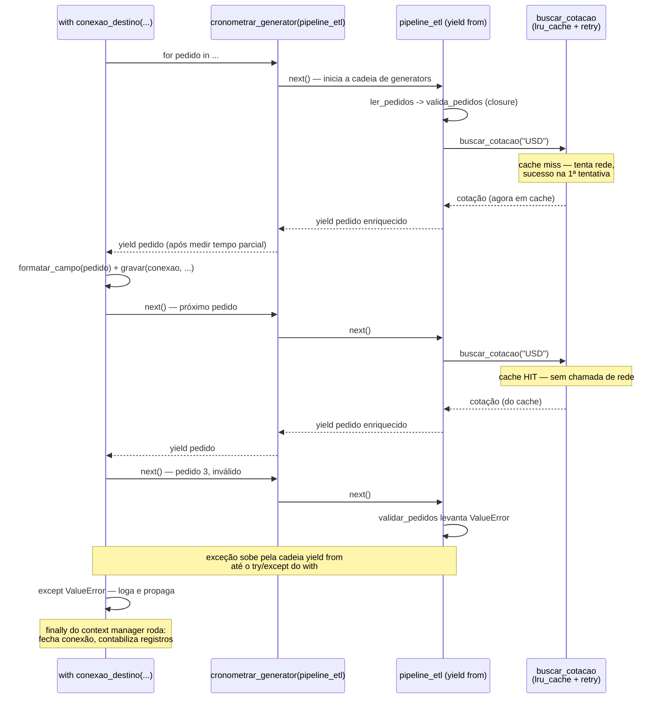

# Capstone — funcional e idiomas avançados

> [!abstract] TL;DR
> Esta nota fecha o Galho 4 amarrando as oito peças anteriores num único pipeline de ETL (extract-transform-load) lazy: generators encadeados via [[03 - yield from e delegação de generators|`yield from`]] leem, validam e enriquecem registros um de cada vez, sem nunca materializar a lista inteira; um [[04 - Closures de verdade|closure]] fabrica validadores configuráveis; dois [[05 - Decorators — fundamentos|decorators]] — um sem argumento (cronometragem) e um com argumento via [[06 - Decorators com argumentos e functools.wraps|decorator factory + `functools.wraps`]] (retry) — instrumentam os estágios mais frágeis; [[07 - functools — ferramentas funcionais|`functools.lru_cache` e `singledispatch`]] resolvem, respectivamente, uma consulta cara repetida e a serialização por tipo de saída; e um [[08 - Context managers via generator|context manager via generator]] abre e garante o fechamento da conexão com o destino dos dados. Por baixo de tudo isso está o mesmo [[01 - Iterators e o protocolo __iter__ __next__|protocolo iterator]] `__iter__`/`__next__` que abriu o galho — cada generator da cadeia já o implementa de graça, e é exatamente esse protocolo comum que permite compor generators, decorators e context managers como peças de um único mecanismo, não como três recursos desconexos da linguagem.

## O problema: os oito mecanismos, juntos, num pipeline real

Cada nota deste galho isolou um mecanismo — generators produzem valores sob demanda, closures carregam estado capturado, decorators envolvem chamadas, `functools` resolve padrões funcionais recorrentes, context managers via generator dividem `__enter__`/`__exit__`. Isolados, cada um é simples de entender. O que raramente aparece nas notas técnicas — e é exatamente o que um pipeline de dados real exige — é **como esses mecanismos se encaixam quando usados juntos, no mesmo trecho de código**, sem que um atrapalhe o outro.

Um time de dados recebe um arquivo de pedidos de e-commerce, potencialmente enorme (algumas dezenas de milhões de linhas por dia), e precisa: ler cada registro, validar campos obrigatórios, converter o valor do pedido para dólar usando uma cotação (consulta cara, a mesma moeda se repete milhares de vezes por arquivo), medir e logar quanto tempo cada estágio leva, tolerar falhas transitórias na consulta de cotação sem derrubar o pipeline inteiro, e gravar o resultado numa conexão que precisa ser aberta e fechada de forma garantida — mesmo se o processamento falhar no meio. Nenhuma dessas exigências, isoladamente, é nova para quem já leu as oito notas anteriores. A pergunta desta capstone é: como tudo isso convive no mesmo pipeline, sem virar uma sopa de decorators empilhados sem critério?

O resto desta nota constrói esse pipeline peça por peça, na ordem em que as notas do galho o ensinaram, e termina com o programa inteiro rodando de ponta a ponta.

## O esqueleto: generators encadeados via `yield from`

A espinha dorsal do pipeline é uma cadeia de generators, no mesmo padrão de composição já visto na [[02 - Generators — yield e generator functions|nota 02]] (o exemplo de "pipeline de processamento sem materializar nada no meio") e formalizado com `yield from` na [[03 - yield from e delegação de generators|nota 03]]:

```python
def ler_pedidos(linhas_brutas):
    """Estágio 1: parseia cada linha crua num dict. Generator simples."""
    for linha in linhas_brutas:
        campos = linha.strip().split(",")
        yield {
            "id": campos[0],
            "moeda": campos[1],
            "valor": float(campos[2]),
        }


def validar_pedidos(pedidos, validador):
    """Estágio 2: aplica um validador (closure — ver seção seguinte) a cada pedido."""
    for pedido in pedidos:
        yield validador(pedido)


def enriquecer_com_cotacao(pedidos):
    """Estágio 3: converte o valor para USD usando uma cotação (consulta cara)."""
    for pedido in pedidos:
        cotacao = buscar_cotacao(pedido["moeda"])   # definida adiante — lru_cache + retry
        pedido["valor_usd"] = round(pedido["valor"] * cotacao, 2)
        yield pedido


def pipeline_etl(linhas_brutas, validador):
    """Composição das três etapas — um único generator 'achatado' para quem consome."""
    yield from enriquecer_com_cotacao(
        validar_pedidos(
            ler_pedidos(linhas_brutas),
            validador,
        )
    )
```

Nenhuma dessas quatro chamadas lê, valida ou enriquece nada — cada uma só devolve um objeto generator, exatamente como a [[02 - Generators — yield e generator functions|nota 02]] explicou para `ler_erros`/`filtrar_validas`/`parsear_valores`. O trabalho real só começa quando algo itera `pipeline_etl(...)` — um `for`, um `list()`, ou (como no fechamento desta nota) outro generator consumindo-o. `yield from` aqui não está delegando recursão (o caso de `flatten`, na nota 03) — está **compondo** três generators independentes numa única cadeia lazy, o mesmo papel que a nota 03 descreveu para `pipeline_arquivo`. Se um dia um quarto estágio precisar de `send()` ou de capturar um valor de retorno via `StopIteration.value` (por exemplo, um contador de registros descartados), `yield from` já garante que esse contrato se propaga sem reescrever a composição — um `for v in sub: yield v` no lugar de `yield from` quebraria essa garantia silenciosamente, exatamente o bug que a nota 03 descreveu para o caso do `acumulador()`.

> [!question]- Por que não escrever isso como uma função única com um `for` gigante e três `if`s dentro?
> Funcionaria — mas perderia exatamente a composicionalidade que motiva generators em primeiro lugar. Cada estágio (`ler_pedidos`, `validar_pedidos`, `enriquecer_com_cotacao`) é testável isoladamente, sem precisar simular o pipeline inteiro; e cada um pode ser reaproveitado em outro pipeline (por exemplo, um pipeline de auditoria que só lê e valida, sem enriquecer). É a mesma vantagem que composição tem sobre lógica monolítica em qualquer contexto — só que aqui a "peça" reutilizável é um generator, não um objeto.

Por baixo, `pipeline_etl(...)` **é** um objeto que implementa `__iter__` (devolvendo a si mesmo) e `__next__` (retomando a execução no ponto do último `yield`) — exatamente o [[01 - Iterators e o protocolo __iter__ __next__|protocolo iterator]] da nota 01, só que gerado automaticamente pelo compilador a partir da presença de `yield`/`yield from` no corpo. Um `for pedido in pipeline_etl(...):`, no fim das contas, faz a mesma coisa que faria sobre a classe `_ContadorRegressivoIterator` escrita à mão na nota 01: chama `iter()` uma vez, depois `next()` repetidamente, capturando `StopIteration` para saber quando parar — só que aqui não existe nenhuma classe escrita à mão, porque `yield`/`yield from` geram essa implementação de graça.


Repare que só um registro está "vivo" em memória a qualquer instante — o mesmo princípio de laziness que a nota 02 mediu em bytes (200 bytes contra 8 MB), aqui aplicado a um arquivo de pedidos que pode ter dezenas de milhões de linhas sem que o processo jamais precise de memória proporcional ao arquivo inteiro.

## O validador: uma closure fabricando comportamento configurável

`validar_pedidos` recebe um `validador` — uma função pronta, não uma classe. É aqui que a [[04 - Closures de verdade|nota 04]] entra: em vez de uma classe `ValidadorDeFaixa` com `__init__`/`__call__`, uma **factory function** fecha sobre os limites aceitáveis e devolve uma função pronta para uso:

```python
def fazer_validador_de_faixa(campo, minimo, maximo):
    """Factory: devolve um validador fechando sobre campo/minimo/maximo."""
    def validar(pedido):
        valor = pedido[campo]
        if not (minimo <= valor <= maximo):
            raise ValueError(
                f"pedido {pedido['id']}: {campo}={valor} fora de [{minimo}, {maximo}]"
            )
        return pedido
    return validar


validador_de_valor = fazer_validador_de_faixa("valor", minimo=0.01, maximo=100_000)
```

`validar` é uma closure: `campo`, `minimo` e `maximo` são **free variables**, capturadas por referência numa cell, exatamente como a [[04 - Closures de verdade|nota 04]] descreveu para `fazer_validador(minimo, maximo)`. Cada chamada de `fazer_validador_de_faixa(...)` cria cells novas e isoladas — dois validadores diferentes (um para `"valor"`, outro para `"quantidade"`, por exemplo) não compartilham estado nenhum entre si, mesmo vindo da mesma factory. É esse isolamento por chamada que torna a factory reaproveitável em qualquer campo do pedido, sem precisar de uma classe nova por regra de validação.

> [!warning] Não confundir esta closure com a armadilha do late binding em loop
> Se o pipeline precisasse gerar um validador por campo dentro de um `for campo in campos_obrigatorios:`, a mesma armadilha de late binding que a nota 04 dissecou (lambdas/closures dentro de um loop compartilhando a variável de controle) se aplicaria aqui sem modificação — a correção seria a mesma: passar o valor como argumento de uma chamada de função (o próprio padrão de `fazer_validador_de_faixa`, que já resolve isso, porque `campo` é parâmetro, não variável de loop capturada diretamente).

**Em uma frase:** o validador não é uma classe com estado porque não precisa ser — uma closure carrega exatamente o estado que uma instância carregaria, sem o cerimonial de `self`.

## Instrumentando os estágios: dois decorators, dois níveis de complexidade

### Cronometragem: decorator simples aplicado a uma função que devolve generator

O time quer medir quanto tempo cada estágio leva. O decorator mais simples do galho — o `cronometrar` da [[05 - Decorators — fundamentos|nota 05]] — parece a ferramenta óbvia:

```python
import functools
import time


def cronometrar(func):
    @functools.wraps(func)
    def wrapper(*args, **kwargs):
        inicio = time.perf_counter()
        resultado = func(*args, **kwargs)
        fim = time.perf_counter()
        print(f"[timing] {func.__name__} levou {fim - inicio:.6f}s")
        return resultado
    return wrapper


@cronometrar
def ler_pedidos(linhas_brutas):
    for linha in linhas_brutas:
        ...
```

Só que aplicar isso ingenuamente a `ler_pedidos` — uma **generator function** — não mede o que parece medir. A [[02 - Generators — yield e generator functions|nota 02]] já deixou isso plantado: chamar uma generator function **não executa o corpo dela**, só devolve um objeto generator. `wrapper` chama `func(*args, **kwargs)`, recebe esse objeto quase instantaneamente, e imprime um tempo praticamente zero — porque nenhuma linha lida com uma linha real do arquivo ainda rodou. O trabalho de fato só acontece depois, quando `for pedido in pipeline_etl(...)` itera o resultado — fora do `wrapper`, fora da medição.

```python
@cronometrar
def ler_pedidos(linhas_brutas):
    for linha in linhas_brutas:
        yield {"id": ..., "moeda": ..., "valor": ...}

# [timing] ler_pedidos levou 0.000003s  <- quase zero, mesmo pra um arquivo de 40 GB!
```

> [!question]- Isso é um bug em `cronometrar`, ou uma limitação genuína de decorar generators?
> Nenhum dos dois — é uma consequência direta e correta do que `yield` faz, que a nota 02 já ensinou: `func(*args, **kwargs)` devolve o objeto generator instantaneamente, e é isso que `wrapper` mede. O "bug" está em aplicar, sem ajuste, um decorator desenhado para funções que **retornam um valor de uma vez** a uma função que **produz valores ao longo do tempo**. A correção é fazer o próprio `wrapper` iterar o generator por dentro — só assim o tempo medido inclui o tempo de consumo real, não só o de criação do objeto.

A correção reaproveita exatamente `yield from` — o `wrapper` vira, ele mesmo, uma generator function, delegando para o generator original enquanto mede o tempo total até o esgotamento:

```python
def cronometrar_generator(func):
    @functools.wraps(func)
    def wrapper(*args, **kwargs):
        inicio = time.perf_counter()
        total_itens = 0
        try:
            for item in func(*args, **kwargs):
                total_itens += 1
                yield item
        finally:
            fim = time.perf_counter()
            print(f"[timing] {func.__name__} produziu {total_itens} itens em {fim - inicio:.4f}s")
    return wrapper


@cronometrar_generator
def ler_pedidos(linhas_brutas):
    for linha in linhas_brutas:
        campos = linha.strip().split(",")
        yield {"id": campos[0], "moeda": campos[1], "valor": float(campos[2])}
```

Esse `wrapper` é, ele mesmo, uma peça que amarra três notas de uma vez: é um **decorator** (nota 05) que devolve um **generator** (nota 02) cujo `for item in func(...): yield item` é o padrão que a [[03 - yield from e delegação de generators|nota 03]] chamaria de "loop manual de re-yield" — aqui usado deliberadamente em vez de `yield from`, porque o `wrapper` precisa **interceptar** cada item (contar, cronometrar) antes de repassá-lo, e a nota 03 já registrou essa exata ressalva: `yield from` não permite transformar/interceptar valores em trânsito; `for v in sub: yield v` é a ferramenta certa quando isso é necessário. O `try/finally` ao redor do `for` garante que o tempo total é impresso mesmo que o consumidor pare de iterar cedo (um `break` no `for` externo) ou que um erro estoure no meio — o mesmo cuidado de liberação garantida que a [[08 - Context managers via generator|nota 08]] vai formalizar na seção seguinte, só que aqui aplicado a uma métrica, não a um recurso.

### Retry configurável: decorator factory com `functools.wraps`

A consulta de cotação (`buscar_cotacao`, usada dentro de `enriquecer_com_cotacao`) fala com um serviço externo — instável o suficiente para falhar de forma transitória. O decorator certo aqui precisa de **configuração** (quantas tentativas, quanto esperar), o que exige o terceiro nível de função aninhada que a [[06 - Decorators com argumentos e functools.wraps|nota 06]] descreveu como *decorator factory*:

```python
class ServicoDeCotacaoIndisponivel(Exception):
    pass


def retry(tentativas=3, espera=0.5):
    """Nível 1 — factory: recebe a CONFIGURAÇÃO, roda uma vez, na definição."""
    def decorator(func):
        """Nível 2 — decorator: recebe a FUNÇÃO, roda uma vez, devolve o wrapper."""
        @functools.wraps(func)
        def wrapper(*args, **kwargs):
            """Nível 3 — wrapper: roda a CADA chamada."""
            ultimo_erro = None
            for tentativa in range(1, tentativas + 1):
                try:
                    return func(*args, **kwargs)
                except ServicoDeCotacaoIndisponivel as erro:
                    ultimo_erro = erro
                    print(f"[retry] tentativa {tentativa}/{tentativas} falhou: {erro}")
                    if tentativa < tentativas:
                        time.sleep(espera)
            raise ultimo_erro
        return wrapper
    return decorator
```

`@retry(tentativas=3, espera=0.5)` **não** é sintaxe especial — é a chamada `retry(tentativas=3, espera=0.5)` rodando primeiro, produzindo a função `decorator`, que **é** o que de fato decora `buscar_cotacao` logo abaixo, exatamente como a [[06 - Decorators com argumentos e functools.wraps|nota 06]] formalizou. `functools.wraps(func)` sobre `wrapper` garante que `buscar_cotacao.__name__` continue sendo `"buscar_cotacao"`, não `"wrapper"` — sem isso, qualquer log de erro do `try/except` acima, ou uma ferramenta de profiling agrupando por nome de função, misturaria `buscar_cotacao` com qualquer outra função também decorada por `retry`, o mesmo bug silencioso que a nota 06 documentou para o caso do Flask.

## `functools`: cache para a consulta cara, dispatch por tipo pra saída

### `lru_cache` empilhado com `retry` — e a ordem importa

A consulta de cotação é cara (chamada de rede) e a mesma moeda aparece repetidamente num arquivo de pedidos — o padrão exato que a [[07 - functools — ferramentas funcionais|nota 07]] descreveu para memoização de verdade. Empilhando `lru_cache` com `retry` na mesma função:

```python
@functools.lru_cache(maxsize=256)
@retry(tentativas=3, espera=0.5)
def buscar_cotacao(moeda):
    """Consulta cara + instável — cacheada E resiliente a falhas transitórias."""
    return consultar_api_de_cambio(moeda)
```

A ordem aqui não é arbitrária — é a mesma lição de "empilhamento de baixo para cima" da [[06 - Decorators com argumentos e functools.wraps|nota 06]], aplicada com um propósito bem concreto: `retry` (mais próximo da função) é aplicado primeiro, então `lru_cache` (mais externo) envolve **o resultado já resiliente** de `retry`. Isso significa que o cache só guarda cotações que **já sobreviveram** às tentativas de retry — uma cotação obtida com sucesso, mesmo que tenha exigido duas tentativas, é cacheada normalmente; uma consulta que falha todas as tentativas nunca chega a poluir o cache com uma entrada inválida (o erro simplesmente propaga, sem `lru_cache` interceptar nada, porque `lru_cache` só guarda **retornos**, não exceções). Se a ordem fosse invertida (`retry` por fora, `lru_cache` por dentro), cada tentativa de retry recalcularia contra o cache em vez de contra o serviço de verdade — um comportamento sutilmente errado que só apareceria sob falha real, não em testes do caminho feliz.

> [!question]- `lru_cache` não deveria ficar mais perto da função, pra não cachear nada relacionado a retry?
> A intuição de "mais perto = mais direto" é razoável, mas inverte a semântica desejada aqui. O que se quer cachear é "o resultado final e correto para esta moeda", não "o resultado da primeira tentativa, com ou sem sucesso". Colocando `lru_cache` por fora, ele só vê o que `retry` já garantiu ser um sucesso (ou uma exceção que nunca chega a ser cacheada) — exatamente o comportamento certo. É o mesmo raciocínio que a nota 06 usou para o exemplo de cache-e-validação: o cache deve ver os dados já processados pela camada de baixo, não os dados crus.

### `singledispatch`: formatar a saída conforme o tipo do valor

O estágio final do pipeline grava cada pedido no destino, mas o formato de serialização varia conforme o tipo do campo — um `dict` vira uma linha `chave=valor`, uma `datetime` vira ISO 8601, o resto vira `str()` puro. Em vez de uma cadeia de `isinstance()` dentro da função de gravação, `functools.singledispatch` (nota 07) despacha por tipo:

```python
@functools.singledispatch
def formatar_campo(valor):
    return str(valor)


@formatar_campo.register
def _(valor: dict):
    return ";".join(f"{k}={v}" for k, v in valor.items())


@formatar_campo.register
def _(valor: float):
    return f"{valor:.2f}"
```

`formatar_campo(pedido)` (o `dict` inteiro) usa a implementação registrada para `dict`; `formatar_campo(pedido["valor_usd"])` (um `float`) usa a de `float`; qualquer tipo sem implementação registrada cai na função genérica. Se amanhã outro time do sistema adicionar um novo tipo de campo (um `Decimal`, por exemplo), a implementação extra pode ser registrada **de fora deste módulo**, sem editar `formatar_campo` — a mesma vantagem estrutural que a nota 07 descreveu para o serializador de eventos de domínio estendido por múltiplos times.

## O recurso: conexão com o destino, via context manager de generator

Falta o pedaço final: abrir uma conexão com o destino dos dados (um data warehouse simulado) e garantir que ela seja fechada, com ou sem erro no meio do processamento. É exatamente o caso de uso central da [[08 - Context managers via generator|nota 08]]:

```python
from contextlib import contextmanager


@contextmanager
def conexao_destino(nome_destino):
    print(f"[conexao] abrindo conexão com {nome_destino}")
    conexao = {"destino": nome_destino, "aberta": True, "registros_gravados": 0}
    try:
        yield conexao
    except Exception:
        print(f"[conexao] erro durante a gravação — mantendo o que já foi gravado")
        raise
    finally:
        conexao["aberta"] = False
        print(f"[conexao] fechando conexão com {nome_destino} "
              f"({conexao['registros_gravados']} registros gravados)")


def gravar(conexao, pedido_formatado):
    # simulação de escrita real no destino
    conexao["registros_gravados"] += 1
```

`yield conexao` divide a função exatamente como a nota 08 ensinou: tudo antes é `__enter__` (abrir a conexão), o valor cedido ao `yield` é o que vira o `as`, e tudo depois é `__exit__` (fechar, com contabilidade final). Se o corpo do `with` levantar uma exceção — um `ValueError` de um pedido malformado que escapou da validação, por exemplo — ela reaparece **dentro do generator, no ponto exato do `yield`**, via `.throw()` interno; o `except Exception: ... raise` intercepta só para logar, e o `raise` sem argumento relança, preservando o traceback original — equivalente a `__exit__` devolver `False`. O `finally` garante que a conexão é fechada e a contagem final é impressa **de qualquer forma**, sucesso ou falha — o mesmo padrão do `lock_com_metrica` da nota 08, agora aplicado a uma conexão de gravação em vez de um lock.

## O pipeline completo, de ponta a ponta

Juntando as seis peças — generators encadeados, closure validadora, decorator de timing (versão generator-aware), decorator de retry empilhado com `lru_cache`, `singledispatch` para formatação, e o context manager de conexão:

```python
linhas_de_exemplo = [
    "1,USD,120.50",
    "2,EUR,340.00",
    "3,USD,-15.00",   # inválido — valor negativo
    "4,BRL,980.25",
]

validador_de_valor = fazer_validador_de_faixa("valor", minimo=0.01, maximo=100_000)

with conexao_destino("data-warehouse") as conexao:
    try:
        for pedido in cronometrar_generator(pipeline_etl)(linhas_de_exemplo, validador_de_valor):
            linha_formatada = formatar_campo(pedido)
            gravar(conexao, linha_formatada)
            print(f"[gravado] {linha_formatada}")
    except ValueError as erro:
        print(f"[pipeline abortado] {erro}")
```

Saída (resumida, com o pedido `3` interrompendo o pipeline na validação):

```text
[conexao] abrindo conexão com data-warehouse
[gravado] id=1;moeda=USD;valor=120.5;valor_usd=120.50
[gravado] id=2;moeda=EUR;valor=340.0;valor_usd=367.20
[pipeline abortado] pedido 3: valor=-15.0 fora de [0.01, 100000]
[conexao] erro durante a gravação — mantendo o que já foi gravado
[conexao] fechando conexão com data-warehouse (2 registros gravados)
```

Repare no que cada mecanismo contribuiu, na ordem em que este pipeline os usa:

1. **Generators + `yield from`** ([[01 - Iterators e o protocolo __iter__ __next__|01]], [[02 - Generators — yield e generator functions|02]], [[03 - yield from e delegação de generators|03]]) — o pipeline nunca materializa a lista de pedidos inteira; um erro no terceiro registro interrompe a iteração exatamente ali, sem ter processado (ou sequer lido) um quarto registro.
2. **Closure** ([[04 - Closures de verdade|04]]) — `validador_de_valor` carrega `campo`/`minimo`/`maximo` sem precisar de uma classe.
3. **Decorators** ([[05 - Decorators — fundamentos|05]], [[06 - Decorators com argumentos e functools.wraps|06]]) — `cronometrar_generator` mede o tempo real de consumo (não de criação) do generator; `retry` tolera falhas transitórias na cotação, configurável por chamada.
4. **`functools`** ([[07 - functools — ferramentas funcionais|07]]) — `lru_cache` evita repetir a consulta de câmbio para a mesma moeda; `singledispatch` formata cada campo conforme seu tipo, extensível de fora.
5. **Context manager via generator** ([[08 - Context managers via generator|08]]) — a conexão é aberta uma vez, e fechada **de qualquer forma**, mesmo quando o pipeline aborta no meio por causa de um `ValueError`.



## Casos práticos

### Cenário 1: processando múltiplos arquivos de origem com `ExitStack`

Em produção, o pipeline raramente lê um único arquivo — um job noturno costuma processar um lote de arquivos, um por região ou por hora, cuja quantidade só é conhecida em runtime. `with a, b, c:` exige que os arquivos sejam conhecidos estaticamente no código; a [[08 - Context managers via generator|nota 08]] já resolveu exatamente esse problema com `contextlib.ExitStack`:

```python
from contextlib import ExitStack


def processar_lote(caminhos_de_arquivo, validador):
    with ExitStack() as pilha_de_recursos, conexao_destino("data-warehouse") as conexao:
        arquivos_abertos = [
            pilha_de_recursos.enter_context(open(caminho, encoding="utf-8"))
            for caminho in caminhos_de_arquivo
        ]
        total_gravado = 0
        for arquivo in arquivos_abertos:
            for pedido in cronometrar_generator(pipeline_etl)(arquivo, validador):
                gravar(conexao, formatar_campo(pedido))
                total_gravado += 1
        return total_gravado
```

`ExitStack` garante que **todos** os arquivos abertos são fechados ao sair do `with`, mesmo que um deles falhe no meio (um arquivo corrompido na quinta posição do lote, por exemplo) — sem precisar aninhar um `with open(...)` por arquivo, o que seria impraticável para uma lista cujo tamanho só existe em runtime. Repare que `conexao_destino(...)` (o context manager de generator desta capstone) e `ExitStack()` (o utilitário pronto da nota 08) convivem no mesmo `with` composto — dois mecanismos de gerenciamento de recurso diferentes, cada um resolvendo a parte do problema para a qual foi desenhado: um número fixo e conhecido de recursos (a conexão) versus um número variável (os arquivos do lote).

### Cenário 2: estendendo `formatar_campo` de outro módulo, sem tocar no pipeline

Um segundo time, responsável por um novo tipo de campo (`StatusPedido`, um `Enum`), precisa que o pipeline serialize esse tipo corretamente — mas sem permissão (nem necessidade) de editar o módulo do pipeline. É exatamente a vantagem estrutural de `singledispatch` que a [[07 - functools — ferramentas funcionais|nota 07]] descreveu para o serializador de eventos de domínio:

```python
# pipeline_etl.py — módulo original, do time de dados
from enum import Enum


class StatusPedido(Enum):
    PENDENTE = "pendente"
    ENVIADO = "enviado"
    CANCELADO = "cancelado"


# --------------------------------------------------------------
# modulo_de_status.py — outro time, outro arquivo, sem editar pipeline_etl.py
from pipeline_etl import formatar_campo, StatusPedido


@formatar_campo.register
def _(valor: StatusPedido):
    return valor.value.upper()
```

Depois desse registro, qualquer `pedido["status"]` do tipo `StatusPedido` que passe por `formatar_campo(...)` dentro do pipeline original já é serializado corretamente — sem que o time do pipeline precise saber, de antemão, que `StatusPedido` existiria. É a mesma vantagem de abertura/fechamento (adicionar comportamento sem editar código existente) que justificou `singledispatch` em vez de uma cadeia de `isinstance()` centralizada dentro de `formatar_campo`.

## Armadilhas comuns

> [!warning] Decorar uma generator function como se fosse uma função comum
> Já demonstrado nesta nota: `@cronometrar` aplicado ingenuamente a `ler_pedidos` mede o tempo de **criar** o objeto generator (quase zero), não o tempo de **consumi-lo**. A correção é o `wrapper` iterar o generator por dentro (`for item in func(...): yield item`, dentro de um `try/finally` se houver limpeza) — o que torna o próprio `wrapper` uma generator function.

> [!warning] Ordem de `@lru_cache`/`@retry` invertida
> Colocar `retry` por fora de `lru_cache` faz cada tentativa de retry recalcular contra o resultado cacheado da tentativa anterior, em vez de contra o serviço de verdade — um bug que só aparece sob falha real do serviço externo, não em testes do caminho feliz. A ordem correta empilha `retry` mais perto da função (roda primeiro) e `lru_cache` por fora (só cacheia resultados já resilientes).

> [!warning] Esquecer `functools.wraps` em qualquer camada do pipeline
> Sem `wraps`, `buscar_cotacao.__name__` viraria `"wrapper"` depois de `retry` — e qualquer log de erro (`[retry] tentativa 2/3 falhou`) que tentasse identificar a função de origem por nome se tornaria inútil, exatamente o bug silencioso que a nota 06 documentou para o Flask.

> [!warning] Context manager de conexão sem `finally` ao redor do `yield`
> Se `conexao_destino` não envolvesse o `yield` num `try/finally`, um `ValueError` no meio do pipeline pularia direto para fora da função geradora — a conexão nunca seria fechada, e a contagem final de registros gravados nunca seria impressa. É o mesmo vazamento de recurso que a nota 08 descreveu para `conexao_ruim`.

## Em entrevista

"Descreva um pipeline de dados que você construiria usando os idiomas funcionais de Python" é o tipo de pergunta de nível pleno/sênior que testa exatamente a síntese desta nota — não decorar cada mecanismo isoladamente, mas saber quando cada um se aplica dentro do mesmo problema.

- **"Por que usar generators encadeados em vez de listas intermediárias num pipeline de ETL?"** Memória constante independente do tamanho da entrada — cada registro passa pelas etapas uma vez, sem que o pipeline inteiro precise caber em memória. `yield from` compõe os estágios como uma cadeia única e transparente, propagando `send()`/`throw()`/valor de retorno caso algum estágio precise deles no futuro.
- **"Por que um decorator de timing simples não funciona direto numa função geradora?"** Porque chamar a função decorada só cria o objeto generator — não executa o corpo. O `wrapper` precisa iterar o generator por dentro (virando, ele mesmo, uma generator function) para medir o tempo de consumo real, não o de criação.
- **"Como você tornaria uma consulta cara e instável mais robusta?"** Empilhando `@lru_cache` (evita repetir a consulta para os mesmos argumentos) com um `@retry(tentativas=N)` configurável (tolera falhas transitórias) — na ordem certa: `retry` mais perto da função, `lru_cache` por fora, para que só resultados já bem-sucedidos sejam cacheados.
- **"Como garantir que um recurso (conexão, arquivo, lock) seja liberado mesmo se o processamento falhar no meio?"** `@contextlib.contextmanager` com `try/finally` envolvendo o `yield` — tudo antes é preparo, tudo depois é limpeza garantida, mesmo quando uma exceção do bloco `with` reaparece dentro do generator no ponto exato do `yield`.
- **"O que os generators, decorators e context managers deste pipeline têm em comum, por baixo?"** Todos se apoiam no mesmo par `__iter__`/`__next__` (protocolo iterator) e no par `send()`/`throw()` que `yield` implementa automaticamente — um generator já é um iterator completo sem o desenvolvedor escrever nenhum dunder method, e `@contextmanager` só reaproveita `next()`/`.throw()` para traduzir esse mesmo protocolo para `__enter__`/`__exit__`.

## How to explain in English

> A lazy ETL pipeline in Python composes exactly the idioms this branch covered: chained generators (`yield from`) stream records one at a time instead of loading the whole file into memory; a closure-based factory builds configurable validators without a class; a timing decorator has to iterate the generator internally (not just call it) to measure real consumption time, not object-creation time; a parameterized `@retry(...)` decorator factory — built with `functools.wraps` to preserve the original function's identity — tolerates transient failures in an expensive lookup; stacking `@lru_cache` outside `@retry` ensures only successful, retried results get cached, never a failed attempt; `functools.singledispatch` formats each field by its runtime type without a chain of `isinstance()` checks; and a generator-based context manager (`@contextlib.contextmanager`) guarantees the destination connection closes exactly once, even when the pipeline aborts mid-stream on a validation error re-raised inside the generator at the exact `yield` point. Underneath all of it is the same iterator protocol (`__iter__`/`__next__`) that opened this branch — every generator already implements it for free, which is precisely what makes generators, decorators, and context managers composable as one mechanism instead of three unrelated language features.

| PT | EN |
|---|---|
| pipeline lazy de dados | lazy data pipeline |
| encadear generators | chain generators |
| fábrica de validador | validator factory |
| decorator consciente de generator | generator-aware decorator |
| empilhamento de decorators | decorator stacking |
| cache que só guarda sucesso | cache that only stores successes |
| dispatch por tipo | type-based dispatch |
| liberação garantida de recurso | guaranteed resource cleanup |
| protocolo iterador subjacente | underlying iterator protocol |

## Fechamento do Galho 4 — Funcional e idiomas avançados

Esta é a última nota do Galho 4. Recapitulando o que as nove notas cobriram juntas:

1. [[01 - Iterators e o protocolo __iter__ __next__|01 — Iterators e o protocolo `__iter__`/`__next__`]] estabeleceu o protocolo formal por trás de `for`: iterável (`__iter__`) versus iterator (`__next__` + `StopIteration`), a armadilha de reusar um iterator já esgotado, e a ponte com `itertools`.
2. [[02 - Generators — yield e generator functions|02 — Generators: `yield` e generator functions]] mostrou como `yield` transforma uma função comum numa fábrica de generators, que implementa o protocolo da nota 01 automaticamente — lazy evaluation, e o trio `send()`/`throw()`/`close()` que torna um generator uma via de mão dupla.
3. [[03 - yield from e delegação de generators|03 — `yield from` e delegação de generators]] formalizou a composição transparente de generators — propagando valores, exceções e valor de retorno através de uma cadeia de delegação, essencial para o `pipeline_etl` desta capstone.
4. [[04 - Closures de verdade|04 — Closures de verdade]] explicou como uma função interna captura variáveis do escopo onde nasceu (free variables em cells), `nonlocal`, factory functions, e a armadilha clássica de late binding em loops.
5. [[05 - Decorators — fundamentos|05 — Decorators: fundamentos]] mostrou o decorator como consequência de funções serem cidadãos de primeira classe — `funcao = decorador(funcao)`, `*args`/`**kwargs` genéricos, e os três casos de uso canônicos (log, timing, memoização manual).
6. [[06 - Decorators com argumentos e functools.wraps|06 — Decorators com argumentos e `functools.wraps`]] estendeu para decorator factories de três níveis (`@retry(tentativas=3)`), `functools.wraps` como correção obrigatória de identidade, e a ordem de aplicação/execução de decorators empilhados.
7. [[07 - functools — ferramentas funcionais|07 — `functools`: ferramentas funcionais]] entregou o kit pronto — `lru_cache`/`cache` (memoização robusta), `partial`/`partialmethod` (aplicação parcial), `reduce` (e por que saiu de built-in), `singledispatch`/`singledispatchmethod` (polimorfismo por tipo).
8. [[08 - Context managers via generator|08 — Context managers via generator]] mostrou `@contextlib.contextmanager` dividindo `__enter__`/`__exit__` num único `yield`, o mecanismo de exceção relançada no ponto do `yield`, e os utilitários `contextlib.suppress`/`ExitStack`.
9. Esta nota fechou amarrando as oito num pipeline de ETL lazy único: generators compostos via `yield from`, uma closure validadora, dois decorators (simples e parametrizado, ambos `functools.wraps`-corretos), `lru_cache` empilhado com `retry`, `singledispatch` para formatação, e um context manager de generator garantindo liberação de recurso — tudo apoiado no mesmo protocolo iterator da nota 01.

Juntas, essas nove notas formam **o lado funcional de Python** que complementa o lado orientado a objetos do [[03-Dominios/Tecnologia/Python/OO e Data Model/index|Galho 3]]: onde aquele galho usou classes e o Data Model como veículo principal, este usou funções de primeira classe, `yield` e composição — dois vocabulários diferentes para os mesmos problemas de estado, comportamento reutilizável e protocolo, e a maioria do código Python de produção mistura os dois livremente, como este pipeline fez ao combinar `dict`s simples com generators, closures e decorators sem precisar de uma única classe própria.

## O que vem a seguir

Todo o código desta nota — as assinaturas de `ler_pedidos`, `validar_pedidos`, `fazer_validador_de_faixa`, `cronometrar_generator`, `retry`, `buscar_cotacao` — está sem type hints, exatamente como as nove notas do galho trataram o assunto até aqui: o foco foi o mecanismo em runtime, não sua documentação estática. Isso muda a partir daqui. **[[03-Dominios/Tecnologia/Python/Tipagem moderna/index|Galho 5 — Tipagem moderna]]** (ainda não escrito) retoma exatamente essas assinaturas e pergunta "como eu anoto isso de um jeito que `mypy`/`pyright` consigam checar antes do código rodar?" — um generator que produz `dict[str, Any]` é bem menos útil, para uma ferramenta de tipagem estática, do que um `Iterator[Pedido]` com `Pedido` como um `TypedDict` ou uma dataclass tipada; um decorator genérico como `cronometrar_generator`, que hoje aceita `*args`/`**kwargs` sem nenhuma garantia de tipo, ganha uma assinatura precisa com `ParamSpec`/`TypeVar` (Python 3.10+) que preserva a assinatura da função decorada para o verificador de tipos — o mesmo problema de "perda de identidade" que `functools.wraps` resolveu em runtime, agora resolvido também em tempo de checagem estática.

- **[[03-Dominios/Tecnologia/Python/Tipagem moderna/index|Galho 5 — Tipagem moderna]]** — type hints completos, `Generic`/`TypeVar`/`ParamSpec` para tipar generators e decorators com precisão, `mypy`/`pyright`, e Pydantic como evolução runtime das dataclasses do [[03-Dominios/Tecnologia/Python/OO e Data Model/05 - Dataclasses|Galho 3]].
- [[07 - functools — ferramentas funcionais|07 — functools]] — `singledispatch` já é tipado por natureza (a anotação de tipo é o mecanismo de registro); o Galho 5 explica por que isso é, na prática, uma forma de *type-driven dispatch* — só que resolvida em runtime, não estaticamente.
- [[03-Dominios/Tecnologia/Python/index|Trilha Python]] — MOC da trilha.

## Fontes

- Python Software Foundation. *9.10. Iterators* — The Python Tutorial. docs.python.org, versão 3.14. https://docs.python.org/3/tutorial/classes.html#iterators (acessado em 2026-07-10)
- Python Software Foundation. *3. Data model — Generator types*. docs.python.org, versão 3.14. https://docs.python.org/3/reference/datamodel.html#generator-types (acessado em 2026-07-10)
- Python Software Foundation. *contextlib — Utilities for with-statement contexts*. docs.python.org, versão 3.14. https://docs.python.org/3/library/contextlib.html (acessado em 2026-07-10)
- Python Software Foundation. *functools — Higher-order functions and operations on callable objects*. docs.python.org, versão 3.14. https://docs.python.org/3/library/functools.html (acessado em 2026-07-10)
- Schemenauer, N.; Peters, T.; Hetland, M. L. *PEP 255 — Simple Generators*. peps.python.org, 2001. https://peps.python.org/pep-0255/ (acessado em 2026-07-10)
- van Rossum, G.; Eby, P. F. *PEP 342 — Coroutines via Enhanced Generators*. peps.python.org, 2005. https://peps.python.org/pep-0342/ (acessado em 2026-07-10)
- PEP 380 — *Syntax for Delegating to a Subgenerator*. peps.python.org, 2011. https://peps.python.org/pep-0380/ (acessado em 2026-07-10)
- Smith, K. D.; Jewett, J. J.; Montanaro, S.; Baxter, A. *PEP 318 — Decorators for Functions and Methods*. peps.python.org, 2003. https://peps.python.org/pep-0318/ (acessado em 2026-07-10)
- van Rossum, G.; Coghlan, N. *PEP 343 — The "with" Statement*. peps.python.org, 2005. https://peps.python.org/pep-0343/ (acessado em 2026-07-10)
- Ramalho, L. *Fluent Python: Clear, Concise, and Effective Programming*, 2ª ed. — Capítulos sobre iteradores/generators, funções de primeira classe/decorators, e context managers. O'Reilly Media, 2022.
- Real Python. *How to Use Generators and yield in Python*. https://realpython.com/introduction-to-python-generators/ (acessado em 2026-07-10)
- Real Python. *Primer on Python Decorators*. https://realpython.com/primer-on-python-decorators/ (acessado em 2026-07-10)
- Real Python. *Python's with Statement: Manage External Resources Safely*. https://realpython.com/python-with-statement/ (acessado em 2026-07-10)

Consultado em 2026-07-10.
