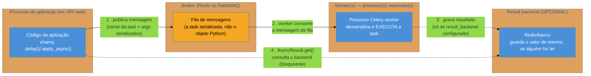
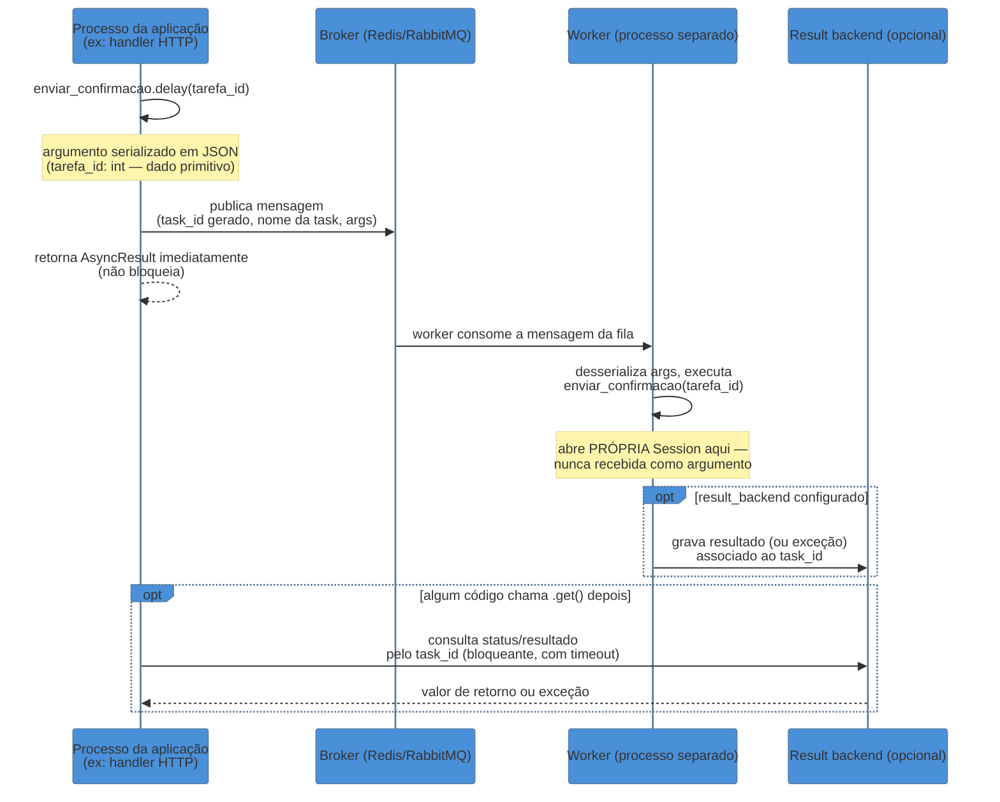

# Celery fundamentos — broker, worker e tasks

> [!abstract] TL;DR
> **Celery** é uma task queue: a aplicação Python define funções marcadas com `@app.task`/`@shared_task`, um **broker** (Redis ou RabbitMQ) enfileira as chamadas dessas funções como mensagens, e um ou mais **workers** — processos inteiramente separados do processo web — consomem essa fila e executam o código de verdade. `.delay(*args)` é o atalho para disparar; `.apply_async(args=[...], countdown=..., eta=..., queue=...)` é a forma completa, com agendamento e roteamento de fila. O retorno de uma task disparada é um `AsyncResult` — um handle, não o resultado; `.get()` bloqueia esperando o valor, e é raramente usado em produção porque anula o propósito de rodar em background. Guardar o resultado exige um **result backend** separado (Redis, banco), e é **opcional** — se ninguém vai ler o retorno, não configure um. Argumentos de task são serializados (JSON por padrão) para atravessar o broker como texto; isso significa que só dado serializável pode virar argumento — nunca um objeto com estado vivo, como uma `Session` do SQLAlchemy.

## O worker que "funcionava" até não funcionar mais

Uma equipe estava construindo a API de Tarefas da trilha (a mesma que os Galhos 9-13 desenvolveram, agora ganhando processamento assíncrono). Alguém precisava enviar um e-mail de confirmação sempre que uma tarefa fosse concluída, sem travar a resposta HTTP esperando o SMTP responder. A solução óbvia: uma task Celery. O primeiro rascunho, escrito às pressas, ficou assim:

```python
from celery import shared_task
from app.database import SessionLocal
from app.models import Tarefa

@shared_task
def enviar_confirmacao(tarefa: Tarefa, session):
    # "session" é a mesma Session do SQLAlchemy que o endpoint já tinha aberto —
    # por que abrir outra, se já existe uma pronta?
    tarefa_atualizada = session.merge(tarefa)
    enviar_email(tarefa_atualizada.usuario.email, tarefa_atualizada.titulo)
```

```python
@router.post("/tarefas/{tarefa_id}/concluir")
def concluir_tarefa(tarefa_id: int, db: Session = Depends(get_db)):
    tarefa = db.query(Tarefa).get(tarefa_id)
    tarefa.status = "concluida"
    db.commit()

    enviar_confirmacao.delay(tarefa, db)  # passa o objeto E a sessão direto
    return {"status": "ok"}
```

Em desenvolvimento, com o worker Celery rodando em modo `--pool=solo` no mesmo processo (uma configuração comum para debugar localmente), isso **funcionou**. A equipe fez deploy. Em produção, com o worker rodando em processos de verdade, separados do processo web, a primeira chamada já quebrou — mas não com um erro óbvio de "isso não deveria funcionar assim". Quebrou com:

```
kombu.exceptions.EncodeError: Object of type Session is not JSON serializable
```

A correção ingênua, sugerida por alguém no time que já tinha visto esse erro antes: "troca o serializer pra pickle, ele serializa qualquer objeto Python". E de fato, trocando `task_serializer='json'` por `task_serializer='pickle'` no `celeryconfig.py`, o erro de serialização sumiu — o `Session` (e a instância de `Tarefa` anexada a ela) agora "viajava" inteira até o worker. Só que o comportamento em produção continuou errado, de um jeito muito mais difícil de depurar: às vezes o e-mail saía com dados desatualizados, às vezes a task simplesmente lançava `DetachedInstanceError` ao tentar acessar `tarefa_atualizada.usuario`, e ocasionalmente — sob carga, quando o worker demorava alguns segundos pra pegar a mensagem da fila — o processo inteiro travava numa conexão de banco morta.

O que estava acontecendo, camada por camada, é o assunto desta nota: por que um objeto como uma `Session` nunca deveria atravessar a fronteira entre processo web e worker, o que o Celery realmente move de um lado para o outro (não é o objeto Python, é uma mensagem), e como a arquitetura correta — task recebendo só o `tarefa_id`, abrindo sua própria sessão — evita a classe inteira de bug.

## A arquitetura: aplicação, broker e worker são três processos, não um

O erro de origem do bug acima é conceitual antes de ser técnico: tratar `.delay()` como uma chamada de função comum, que "simplesmente roda em outro lugar" mas continua fazendo parte do mesmo espaço de memória. Não é isso que acontece. Celery tem três papéis distintos, e cada um roda como **processo separado**, geralmente em máquinas separadas:



O ponto central do diagrama: entre a aplicação e o worker não existe compartilhamento de memória, nem passagem de referência de objeto — existe uma **mensagem**, texto (ou bytes) que atravessa a rede via broker. Tudo que sai da aplicação em direção ao worker precisa, obrigatoriamente, ser transformado nesse formato de mensagem primeiro. É exatamente esse passo — serialização — que o `Session` do bug de abertura não sobrevive de forma segura, mesmo quando alguma biblioteca "consegue" serializá-lo tecnicamente.

> [!question]- Se o broker só guarda a mensagem, quem executa o código da task de fato?
> O worker. A aplicação nunca executa a task — ela só publica uma mensagem descrevendo "quero que a task chamada `enviar_confirmacao` rode com estes argumentos". O broker guarda essa mensagem numa fila até algum worker disponível consumi-la. É o **worker** — um processo Celery rodando `celery -A app worker`, tipicamente em outra máquina ou outro container, com seu próprio processo Python, seu próprio import da aplicação, sua própria conexão de banco — que desserializa a mensagem e chama a função Python de verdade. Esse desacoplamento é o motivo de a API responder rápido: o endpoint HTTP só precisa do tempo de publicar a mensagem no broker (milissegundos), não do tempo de a task inteira rodar.

### Definindo uma task: `@app.task` e `@shared_task`

Uma task Celery começa como uma função Python comum, decorada:

```python
# celery_app.py — a instância da aplicação Celery, configurada com o broker
from celery import Celery

app = Celery(
    "minha_api",
    broker="redis://localhost:6379/0",   # onde as mensagens são enfileiradas
    backend="redis://localhost:6379/1",  # OPCIONAL — só se alguém for ler o resultado
)
```

```python
# tasks.py
from celery_app import app

@app.task
def somar(a: int, b: int) -> int:
    return a + b
```

`@app.task` amarra a função a uma instância específica de `Celery` — a que tem o broker configurado. Isso funciona bem em projetos pequenos, mas cria um problema em qualquer projeto maior: os módulos que definem tasks (`tasks.py` de cada domínio da aplicação) acabariam precisando importar a instância `app` de um módulo central, criando acoplamento de import cedo demais — e complicando testes, porque testar uma task isoladamente exigiria sempre a `app` real configurada.

`@shared_task`, o decorator preferido para bibliotecas e para projetos com múltiplos módulos de tasks, resolve isso adiando o vínculo: a função é registrada como task **sem** amarrar a nenhuma instância `Celery` específica no momento da definição — o vínculo com a `app` correta acontece depois, quando o Celery monta a aplicação (padrão usado, por exemplo, na integração oficial com Django, onde cada app Django pode ter seu próprio `tasks.py` sem importar a instância central):

```python
# app/tarefas/tasks.py — módulo de domínio, sem importar a instância Celery central
from celery import shared_task

@shared_task
def enviar_confirmacao(tarefa_id: int) -> None:
    ...
```

> [!tip] Regra prática
> Em projeto pequeno com uma única instância `Celery` clara, `@app.task` é direto e sem ambiguidade. Em projeto com múltiplos módulos de tasks espalhados por domínios (o caso comum a partir de uma certa escala), `@shared_task` evita import circular e mantém cada módulo de tasks desacoplado de onde a instância `Celery` é montada.

### Subindo o worker: um processo à parte

A definição da task, sozinha, não faz nada rodar — ela só registra a função no *registry* de tasks conhecidas pela aplicação Celery. O código que de fato consome a fila e executa é outro comando, outro processo:

```bash
celery -A celery_app worker --loglevel=info
```

Esse comando inicia um processo (ou, mais realisticamente, um *pool* de processos/threads/greenlets, dependendo do `--pool` escolhido) que:

1. Conecta no broker configurado em `celery_app.py`.
2. Fica escutando a fila (por padrão, a fila `celery`) por novas mensagens.
3. Para cada mensagem, desserializa o nome da task e os argumentos, encontra a função correspondente no *registry*, e chama essa função com esses argumentos — num processo Python que é **inteiramente diferente** do processo que chamou `.delay()`.

Esse ponto 3 é o que explica por que o `Session` do bug de abertura nunca poderia ter atravessado a fronteira de forma segura: mesmo que a serialização "funcionasse" tecnicamente (como aconteceu ao trocar para `pickle`), o objeto reconstruído no worker não é *a mesma* `Session` — é uma cópia dos dados que estavam nela no momento da serialização, sem a conexão de banco viva que a tornava útil. É basicamente enviar uma fotografia de uma conversa telefônica e esperar que o destinatário consiga continuar falando com a outra ponta.

## `.delay()` vs `.apply_async()`: o atalho e a forma completa

Disparar uma task nunca chama a função diretamente (`enviar_confirmacao(tarefa_id)` executaria o código **no processo atual**, de forma síncrona — o oposto do que se quer). Existem dois métodos para publicar a mensagem no broker:

```python
# .delay() — atalho, cobre o caso comum: só passar argumentos posicionais/nomeados
enviar_confirmacao.delay(tarefa_id)

# equivalente completo, via .apply_async()
enviar_confirmacao.apply_async(args=[tarefa_id])
```

`.delay(*args, **kwargs)` é açúcar sintático para o caso mais simples de `.apply_async()`. Sempre que a task precisa de controle além de "rodar assim que possível, na fila padrão", `.apply_async()` é a forma que expõe essa configuração:

```python
from datetime import datetime, timedelta, timezone

# Agendar para daqui a 10 segundos
enviar_confirmacao.apply_async(args=[tarefa_id], countdown=10)

# Agendar para um horário absoluto específico (precisa ser timezone-aware)
horario_envio = datetime.now(timezone.utc) + timedelta(hours=2)
enviar_confirmacao.apply_async(args=[tarefa_id], eta=horario_envio)

# Rotear para uma fila específica — não a fila "celery" padrão
enviar_confirmacao.apply_async(args=[tarefa_id], queue="notificacoes")
```

| Parâmetro | O que faz |
|-----------|-----------|
| `args` / `kwargs` | Argumentos posicionais/nomeados passados à task — os mesmos que `.delay()` aceita como `*args`/`**kwargs` |
| `countdown` | Atraso relativo, em segundos, antes de a task ficar elegível para execução |
| `eta` | Horário absoluto (`datetime` timezone-aware) a partir do qual a task pode rodar |
| `queue` | Nome da fila para onde a mensagem é publicada — permite workers dedicados a filas específicas (ex: uma fila `notificacoes` de baixa prioridade separada de `pagamentos`, de alta prioridade) |
| `retry` / `retry_policy` | Controla resiliência na **publicação** da mensagem em si (se o broker estiver indisponível no momento do `.apply_async()`) — diferente de retry de **execução** da task, que é assunto da próxima nota do galho |

> [!question]- Por que rotear para filas diferentes, se todas as tasks acabam rodando "em background" de qualquer forma?
> Porque nem todo background é igual em urgência. Uma task de envio de e-mail transacional (confirmação de conta, redefinição de senha) idealmente roda em segundos; uma task de geração de relatório mensal pode esperar minutos sem problema algum. Se as duas competem pela mesma fila e pelo mesmo pool de workers, uma rajada de relatórios pode fazer o e-mail de redefinição de senha demorar minutos — péssima experiência, e sem nenhum motivo técnico real para acontecer. Roteamento de fila (`queue=`) combinado com workers dedicados por fila (`celery -A app worker -Q notificacoes` só consome a fila `notificacoes`) resolve isso: prioridades diferentes ganham capacidade de processamento isolada, sem uma fila "roubar" workers da outra.

`countdown`/`eta` diferem de agendamento **periódico** (rodar toda meia-noite, todo dia 1º do mês) — isso é Celery Beat, um componente separado, coberto na próxima nota do galho ([[03 - Celery em produção — retries, idempotência e Celery Beat|03 — Celery em produção]]).

## `AsyncResult`: um handle, não o valor

`.delay()`/`.apply_async()` retornam imediatamente — a publicação da mensagem no broker é rápida, e a função nunca espera a task terminar de rodar. O que ela retorna é um objeto `AsyncResult`: uma referência ao `task_id` gerado para essa execução, que pode ser usada depois para consultar o estado ou o resultado — **se** um result backend estiver configurado.

```python
resultado = enviar_confirmacao.delay(tarefa_id)

print(resultado.id)      # o task_id — uma string UUID, disponível sempre
print(resultado.status)  # 'PENDING', 'STARTED', 'SUCCESS', 'FAILURE', ... — exige result backend
print(resultado.ready())  # True/False — a task já terminou (com sucesso ou falha)?
```

Buscar o valor de retorno de verdade é `.get()`:

```python
valor = resultado.get(timeout=5)  # BLOQUEIA a thread atual até a task terminar (ou timeout)
```

> [!warning] `.get()` em código de produção que precisa responder rápido
> **O que acontece:** o processo que chamou `.delay()` (tipicamente um handler HTTP) chama `resultado.get()` logo em seguida, esperando o valor de retorno antes de responder ao cliente. **Por quê:** `.get()` bloqueia a thread/processo chamador até o worker terminar de executar a task e gravar o resultado no backend — na prática, isso reintroduz exatamente a latência síncrona que o Celery foi chamado para eliminar. Se a task falhar ou nunca for consumida (broker fora do ar, worker parado), `.get()` sem `timeout` trava indefinidamente, e mesmo com `timeout` o caller inteiro fica preso esperando. **Como evitar:** tratar o disparo como *fire-and-forget* por padrão — a resposta HTTP não depende do resultado da task. Quando o cliente realmente precisa saber quando a task terminou (ex: acompanhar o progresso de um processamento longo), o padrão correto é a aplicação devolver o `task_id` na resposta e o cliente fazer *polling* num endpoint separado (`GET /tarefas/status/{task_id}`) que consulta `AsyncResult(task_id).status` — nunca o processo original bloqueado num `.get()` síncrono.

### O result backend é opcional — e tem custo quando não é

Um detalhe frequentemente ignorado: **guardar o resultado de uma task exige infraestrutura própria**, separada do broker. `backend="redis://.../1"` na configuração da `Celery` diz ao worker "depois de rodar a task, grava o valor de retorno (ou a exceção, em caso de falha) neste backend, associado ao `task_id`". Se ninguém nunca vai consultar esse valor — o caso comum de tasks que só têm efeito colateral, como enviar um e-mail ou gravar algo no banco — configurar um result backend só adiciona trabalho: cada execução de task grava um registro que nunca será lido, e esses registros se acumulam (o Celery expira resultados automaticamente após um tempo configurável, `result_expires`, mas até lá ocupam espaço).

```python
# Sem result backend: a task roda, tem efeito colateral, e ninguém consulta o retorno.
# Configuração mais enxuta — e comum — para tasks fire-and-forget:
app = Celery("minha_api", broker="redis://localhost:6379/0")
# backend omitido de propósito
```

```python
# Com result backend: só quando ALGUÉM de fato vai chamar .get()/.status/.result depois.
app = Celery(
    "minha_api",
    broker="redis://localhost:6379/0",
    backend="redis://localhost:6379/1",  # DB separado do broker, boa prática — evita competir pelo mesmo namespace de chaves
)
```

> [!tip] Regra prática
> Pergunte, antes de configurar um result backend: "algum código, em algum lugar, vai chamar `.get()` ou consultar `.status` desse `task_id`?". Se a resposta for não — o caso da maioria das tasks de notificação, processamento em lote, ou qualquer coisa cujo sucesso/falha só importa para logs/observabilidade — não configure. Menos infraestrutura para manter, menos escrita desnecessária no Redis/banco a cada execução.

## Serialização de argumentos: por que JSON é o padrão certo

Toda mensagem publicada no broker precisa ser texto (ou bytes) — não existe forma de o broker "guardar um objeto Python" diretamente. Isso significa que os argumentos passados a `.delay()`/`.apply_async()` passam, obrigatoriamente, por um serializer antes de sair do processo da aplicação, e por um deserializer correspondente quando o worker consome a mensagem.

Desde a versão 4, o Celery usa **JSON como serializer padrão** — uma mudança deliberada em relação a versões antigas, que usavam `pickle` por padrão. A razão é a mesma discutida em [[03-Dominios/Tecnologia/Python/Segurança/02 - Injeção — SQL, template, comando e deserialização insegura|Segurança, nota 02 — deserialização insegura]]: `pickle.loads()` não faz *parse* de dado, executa código durante a desserialização — e um broker de mensagens é, por definição, um canal onde nem sempre é trivial garantir que **só** a própria aplicação publica mensagens (um broker mal configurado, credenciais vazadas, um serviço vizinho com acesso à mesma instância Redis). Aceitar `pickle` como serializer de tasks significa que qualquer um capaz de publicar uma mensagem na fila do Celery ganha execução de código arbitrário no worker no momento em que a mensagem é consumida — exatamente o mecanismo já desenvolvido naquela nota, aqui aplicado à fila de tasks em vez de a um cache ou upload. JSON, por não ter *hooks* de execução no seu parser, fecha essa classe de vulnerabilidade inteira: o pior que uma mensagem JSON malformada ou maliciosa pode causar é um erro de desserialização, nunca execução de código.

```python
# celery_app.py — sendo explícito sobre o serializer (já é o padrão desde Celery 4,
# mas declarar explicitamente documenta a decisão e evita regressão acidental)
app = Celery(
    "minha_api",
    broker="redis://localhost:6379/0",
    task_serializer="json",
    result_serializer="json",
    accept_content=["json"],  # rejeita qualquer outra coisa — inclusive pickle — na desserialização
)
```

`accept_content=["json"]` é a parte que realmente fecha a porta: mesmo que algum worker antigo, mal configurado, ainda tivesse `pickle` habilitado, restringir os formatos **aceitos** na desserialização impede que uma mensagem `pickle` maliciosa seja processada, independente de qual serializer a aplicação usa para publicar.

> [!question]- Se o Celery ainda suporta `pickle` como opção, quando (se algum dia) faz sentido usar?
> Praticamente nunca, e a própria documentação do Celery trata isso como legado a ser evitado. O único cenário onde `pickle` historicamente aparecia era passar objetos Python complexos (uma instância de classe de domínio, por exemplo) como argumento sem se preocupar em serializar manualmente. Mas isso é, ele mesmo, o padrão errado — não porque `pickle` "falha tecnicamente", mas porque objetos complexos como argumento de task quase sempre escondem estado que não deveria atravessar a fronteira entre processos (a próxima seção desta nota desenvolve exatamente esse ponto com a `Session` do SQLAlchemy). A correção certa nunca é "trocar o serializer para aceitar objetos maiores" — é reduzir o argumento a dado primitivo serializável (um ID, uma string, um dicionário simples) e reconstruir o que for necessário **dentro** da task, no processo do worker.

### O erro do bug de abertura: por que uma `Session` nunca é argumento de task

Voltando ao incidente do início da nota: mesmo além do problema de serialização (JSON rejeita, `pickle` "aceita" mas de forma perigosa), passar uma `Session` do SQLAlchemy como argumento de task está estruturalmente errado, por um motivo independente de qual serializer está configurado. Uma `Session` não é dado — é um objeto com **estado vivo**: uma conexão (ou pool de conexões) de banco de dados aberta, uma transação potencialmente em andamento, um *identity map* de objetos já carregados. Nada disso sobrevive a atravessar um processo diferente:

- A conexão de banco que a `Session` mantinha estava aberta no processo **web**, associada àquele processo — não existe forma de "transportar" uma conexão TCP viva para outro processo via uma mensagem JSON ou `pickle`.
- Mesmo que a serialização "funcionasse" tecnicamente (via `pickle`, reconstruindo alguma aproximação do objeto), o resultado no worker é uma cópia congelada do estado no momento da serialização — qualquer acesso a um relacionamento não carregado (`tarefa_atualizada.usuario`, no exemplo de abertura) dispara `DetachedInstanceError`, porque a sessão original que faria o lazy loading não existe mais ali.
- Se por acaso a task rodar rápido o suficiente para "parecer" funcionar em teste manual, ela ainda está fazendo commit/rollback numa sessão que não pertence ao seu próprio ciclo de vida — sob concorrência real, isso é uma fonte garantida de dados inconsistentes ou conexões de banco vazadas.

A correção estrutural é sempre a mesma, e generaliza para qualquer objeto com estado vivo (sessões de banco, conexões de rede, handles de arquivo, clientes HTTP): **a task recebe o identificador**, não o objeto, e reconstrói o que precisa dentro do próprio processo do worker.

```python
# Corrigido — a task recebe só o ID (int, serializável trivialmente em JSON),
# e abre sua PRÓPRIA sessão, dentro do worker, com seu próprio ciclo de vida.
from celery import shared_task
from app.database import SessionLocal
from app.models import Tarefa

@shared_task
def enviar_confirmacao(tarefa_id: int) -> None:
    db = SessionLocal()  # sessão nova, aberta NESTE processo (o worker)
    try:
        tarefa = db.query(Tarefa).get(tarefa_id)
        if tarefa is None:
            return  # tarefa pode ter sido removida entre o disparo e a execução — tratar, não assumir
        enviar_email(tarefa.usuario.email, tarefa.titulo)
    finally:
        db.close()  # a sessão pertence a este processo; ele é responsável por fechá-la
```

```python
@router.post("/tarefas/{tarefa_id}/concluir")
def concluir_tarefa(tarefa_id: int, db: Session = Depends(get_db)):
    tarefa = db.query(Tarefa).get(tarefa_id)
    tarefa.status = "concluida"
    db.commit()

    enviar_confirmacao.delay(tarefa_id)  # só o ID atravessa a fronteira
    return {"status": "ok"}
```

> [!warning] Objeto com estado vivo (Session, conexão, client HTTP) como argumento de task
> **O que acontece:** uma instância de `Session` do SQLAlchemy (ou qualquer objeto que encapsule conexão de banco, socket de rede, handle de arquivo) é passada diretamente como argumento de `.delay()`/`.apply_async()`. **Por quê:** a task roda em outro processo — potencialmente outra máquina — que não tem acesso ao estado de conexão do processo original. Com JSON, isso falha imediatamente e de forma visível (`EncodeError`); com `pickle`, "funciona" na aparência mas produz uma cópia congelada e desconectada do objeto, gerando falhas sutis (`DetachedInstanceError`, dados desatualizados, conexões de banco vazadas) que só aparecem sob carga real, não em teste manual local. **Como evitar:** a task recebe identificadores primitivos (IDs, strings, dicionários simples com dado, não objetos vivos) e reconstrói qualquer recurso com estado — sessão de banco, cliente HTTP, conexão — dentro do próprio corpo da task, no processo do worker.

Essa regra generaliza além de `Session`: qualquer objeto que "signifique algo" só porque está vinculado a um processo específico em execução — um objeto de request do framework web, um client de conexão persistente, um lock em memória — não sobrevive a virar argumento de task, pela mesma razão estrutural.

## Juntando as peças: o fluxo completo

Recapitulando o ciclo de vida completo de uma task, do disparo à (opcional) leitura do resultado:



O que vale reter em uma frase: **entre a aplicação e o worker só atravessa mensagem — nunca objeto vivo, nunca memória compartilhada** — e é essa fronteira, respeitada por construção (argumentos primitivos, serializer restrito a JSON), que torna Celery seguro e previsível de operar, em vez de uma fonte recorrente de bugs sutis de estado vazado entre processos.

## Casos práticos

### Cenário 1: rotear notificações urgentes para longe de relatórios pesados

Uma aplicação de e-commerce dispara duas famílias de tasks completamente diferentes em volume e urgência: confirmação de pedido (precisa sair em segundos) e geração de relatório de vendas mensal (pode levar minutos, roda sob demanda de um painel administrativo). No início, as duas tasks foram publicadas na fila padrão (`celery`), consumida por um único pool de workers. Em um fim de mês, um gerente disparou três relatórios pesados ao mesmo tempo — e, por alguns minutos, os workers ficaram inteiramente ocupados processando relatórios, com confirmações de pedido acumulando na fila atrás deles. Nenhum e-mail de confirmação foi perdido, mas todos saíram atrasados, alguns o suficiente para o cliente já ter aberto um chamado de suporte perguntando "meu pedido foi mesmo confirmado?".

A correção não mexeu em nenhuma lógica de negócio — só em roteamento e topologia de workers:

```python
# celery_app.py
app.conf.task_routes = {
    "app.tasks.confirmar_pedido": {"queue": "urgente"},
    "app.tasks.gerar_relatorio_vendas": {"queue": "relatorios"},
}
```

```bash
# Dois pools de workers, cada um consumindo só a sua fila —
# um relatório pesado nunca mais compete por capacidade com uma confirmação de pedido
celery -A celery_app worker -Q urgente --concurrency=8 --loglevel=info
celery -A celery_app worker -Q relatorios --concurrency=2 --loglevel=info
```

`task_routes` evita ter que passar `queue=` manualmente em todo `.apply_async()` espalhado pelo código — o roteamento vira uma decisão centralizada, versionada junto da configuração da aplicação, em vez de uma convenção que cada desenvolvedor precisa lembrar de aplicar caso a caso.

### Cenário 2: testar uma task sem subir broker nem worker

Um time novo na trilha, ao escrever o primeiro teste automatizado para `enviar_confirmacao`, tentou rodar `enviar_confirmacao.delay(tarefa_id)` dentro do próprio teste — e o teste travou, porque não havia broker nem worker rodando no ambiente de CI, e a mensagem publicada nunca seria consumida por ninguém. A solução não é subir um Redis efêmero para cada rodada de testes (viável, mas pesado para um teste unitário) — é a flag `task_always_eager`, que faz o Celery executar a task **de forma síncrona, no mesmo processo**, sem broker, sem worker, sem rede:

```python
# conftest.py — só para o ambiente de teste, nunca em produção
import pytest
from celery_app import app

@pytest.fixture(autouse=True)
def celery_eager_mode():
    app.conf.task_always_eager = True
    app.conf.task_eager_propagates = True  # exceções da task propagam pro teste, em vez de serem só logadas
    yield
    app.conf.task_always_eager = False
```

```python
def test_enviar_confirmacao_envia_email(db_session, tarefa_concluida):
    enviar_confirmacao.delay(tarefa_concluida.id)  # roda SÍNCRONO, no processo do teste
    # a asserção pode checar direto o efeito colateral (mock de envio de e-mail chamado,
    # registro de log criado), sem polling nem espera
    assert mock_enviar_email.called
```

> [!warning] `task_always_eager=True` fora do ambiente de teste
> Essa flag existe para tornar testes determinísticos e rápidos — nunca para "simplificar" um ambiente de desenvolvimento ou, pior, produção. Com `task_always_eager=True`, a task roda no mesmo processo e na mesma thread que a chamou, o que reintroduz exatamente o comportamento síncrono e bloqueante que o Celery existe para eliminar, e mascara bugs de serialização (como o do início desta nota) que só aparecem quando a task de fato atravessa processos diferentes. Restringir essa flag ao `conftest.py`/configuração de teste, nunca a um arquivo de configuração compartilhado com desenvolvimento ou produção, evita que ela vaze para onde não deveria estar.

## Como explicar em inglês

Uma forma direta de descrever a arquitetura numa entrevista técnica:

> "Celery decouples the calling process from the code that actually runs. The application defines tasks — plain Python functions decorated with `@app.task` or `@shared_task` — and calling `.delay()` doesn't execute that function; it serializes the call into a message and publishes it to a broker, Redis or RabbitMQ. A completely separate worker process consumes that queue, deserializes the message, and runs the real function. Because it's a message crossing a process boundary — not a shared-memory function call — only serializable data can be passed as arguments: primitives, not live objects like a database session or an open connection. JSON is the default serializer specifically because it can't execute code during deserialization, unlike `pickle`, which historically was the default and is now considered a security liability for anything consuming a shared queue."

| PT | EN |
|----|----|
| fila de tarefas | task queue |
| corretor de mensagens | message broker |
| processo consumidor | worker process |
| disparar (uma task) | to dispatch / to enqueue (a task) |
| bloqueante | blocking |
| efeito colateral | side effect |
| execução ansiosa/síncrona (modo de teste) | eager execution |

## Fontes

- **Celery Project** — [*First Steps with Celery*](https://docs.celeryq.dev/en/stable/getting-started/first-steps-with-celery.html) — arquitetura básica (broker, worker, backend), `@app.task`, `.delay()`. Consultado em 2026-07.
- **Celery Project** — [*Calling Tasks*](https://docs.celeryq.dev/en/stable/userguide/calling.html) — `.apply_async()` completo, `countdown`, `eta`, `queue`, e as diferenças em relação a `.delay()`. Consultado em 2026-07.
- **Celery Project** — [*Security — Serializers*](https://docs.celeryq.dev/en/stable/userguide/security.html) — recomendação explícita de JSON sobre `pickle` como serializer de tasks, e os riscos de aceitar `pickle` de uma fila compartilhada. Consultado em 2026-07.
- **Celery Project** — [*Tasks — Shared Task*](https://docs.celeryq.dev/en/stable/userguide/tasks.html) — diferença entre `@app.task` e `@shared_task`, motivação para bibliotecas e módulos desacoplados da instância `Celery`. Consultado em 2026-07.
- **Real Python** — [*Asynchronous Tasks With Django and Celery*](https://realpython.com/asynchronous-tasks-with-django-and-celery/) — exemplos práticos de definição de task, disparo, e consulta de `AsyncResult`. Consultado em 2026-07.

## O que vem a seguir

Os fundamentos aqui — tasks, broker, worker, `AsyncResult` — cobrem o disparo de uma task isolada, assumindo que tudo dá certo na primeira tentativa. Produção nunca é tão gentil: brokers caem, workers reiniciam no meio de uma execução, e a mesma task pode acabar rodando duas vezes. A próxima nota fecha essa lacuna.

- [[03 - Celery em produção — retries, idempotência e Celery Beat|03 — Celery em produção: retries, idempotência e Celery Beat]] — retries automáticos, o cuidado de tornar uma task idempotente (rodar duas vezes sem efeito duplicado), e Celery Beat para tarefas agendadas/periódicas.
- [[01 - Panorama — Celery vs RQ vs aio-pika vs aiokafka|01 — Panorama: Celery vs RQ vs aio-pika vs aiokafka]] — onde Celery se encaixa entre as outras opções de mensageria em Python, e quando um desacoplamento mais simples (RQ) ou mais direto (aio-pika) compensa a complexidade adicional do Celery.
- [[03-Dominios/Tecnologia/Python/Segurança/02 - Injeção — SQL, template, comando e deserialização insegura|Segurança, nota 02 — deserialização insegura]] — desenvolve em profundidade por que `pickle.loads()` de fonte não confiável é execução de código, não parsing; a base da recomendação de JSON como serializer padrão do Celery nesta nota.
