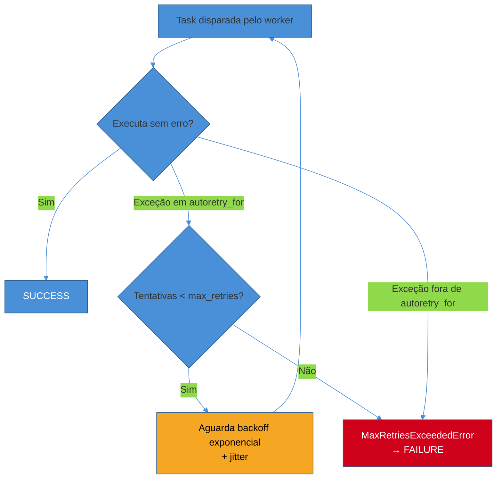
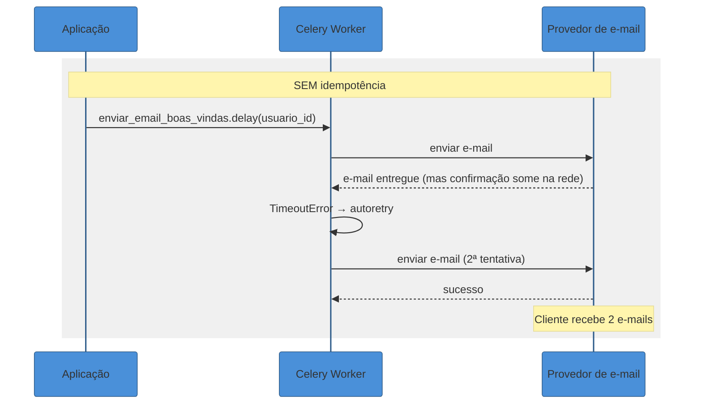
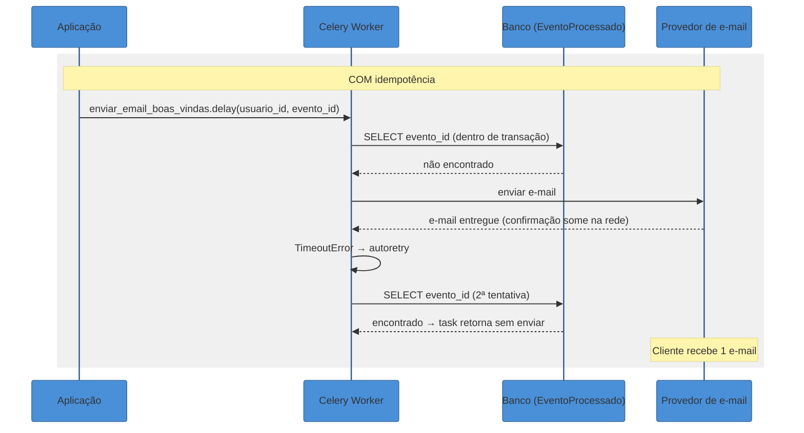

# Celery em produção — retries, idempotência e Celery Beat

> [!abstract] TL;DR
> Celery é **at-least-once por padrão**: se uma task falha (ou parece falhar — timeout de rede, worker morto, broker instável), ela é reexecutada, e reexecução significa que o efeito da task pode acontecer **mais de uma vez**. `autoretry_for` + `retry_backoff` automatizam esse reenvio com backoff exponencial, mas não resolvem o problema real — quem resolve é a task ser **idempotente**: uma chave de deduplicação (um `evento_id` único), checada e gravada na mesma transação do efeito de negócio, e upsert em vez de insert cego. Celery Beat agenda tasks periódicas (`beat_schedule`, sintaxe crontab-like) rodando como processo separado do worker, dentro do mesmo ecossistema de broker/monitoramento do Celery — diferente do cron do sistema operacional, que não sabe nada sobre filas, retries ou falhas de worker. Flower é o dashboard web pra visualizar tudo isso em produção.

## O incidente: o e-mail que chegou duas vezes

Uma manhã de terça, o time de suporte recebe um chamado: "recebi dois e-mails de boas-vindas idênticos, é bug?". A princípio parece bobagem — um e-mail a mais não quebra nada — mas o padrão se repete em outros dez clientes na mesma janela de vinte minutos, e alguém decide investigar.

A task em questão é simples, do tipo que qualquer sistema com onboarding tem:

```python
from celery import shared_task

@shared_task
def enviar_email_boas_vindas(usuario_id: int):
    usuario = buscar_usuario(usuario_id)
    smtp_client.enviar(
        destinatario=usuario.email,
        assunto="Bem-vindo!",
        corpo=render_template("boas_vindas.html", usuario=usuario),
    )
```

Nos logs do worker, a história aparece completa. A task roda, chama `smtp_client.enviar(...)`, o provedor de e-mail **recebe e processa a mensagem com sucesso** — mas a resposta HTTP de confirmação demora mais que o timeout configurado no cliente SMTP, e a chamada estoura uma `TimeoutError` do lado do Celery. Do ponto de vista da task, a chamada falhou. Do ponto de vista do provedor de e-mail, o envio foi um sucesso completo — o e-mail já estava a caminho da caixa de entrada do cliente antes mesmo do timeout estourar no worker.

Sem nenhuma configuração de retry explícita, essa falha simplesmente propagaria uma exceção e a task ficaria marcada como `FAILURE` — chato, mas sem duplicação. O problema é que alguém, em uma iteração anterior, adicionou `autoretry_for=(TimeoutError,)` exatamente para tornar o sistema mais resiliente a instabilidades de rede como essa. E funcionou como projetado: o Celery capturou o `TimeoutError`, agendou uma nova tentativa, e a segunda execução — que não tinha nenhuma visibilidade sobre o fato de que a primeira já tinha entregue o e-mail com sucesso — enviou tudo de novo.

Esse é o ponto central desta nota, e vale nomear com precisão antes de seguir: **o retry funcionou perfeitamente bem**. O bug não está no mecanismo de retry — está na suposição implícita de que a task podia ser reexecutada sem produzir um efeito colateral duplicado. Essa é exatamente a mesma disciplina de **at-least-once + idempotência** já coberta em [[03-Dominios/Engenharia/Comunicação entre Sistemas/4 - Comunicação assíncrona/03 - Garantias de entrega e ordenação|Garantias de entrega e ordenação]] — Celery não é uma exceção à regra, é só mais um sistema onde ela se aplica, e onde ignorá-la custa caro.

> [!question]- Mas a task não fez nada de errado — ela recebeu um erro de verdade (timeout). Isso não é "culpa" da infraestrutura de rede, não do código da task?
> É exatamente esse o ponto: **nenhum código de task pode distinguir, de dentro dela, entre "a operação falhou de verdade" e "a operação teve sucesso, mas a confirmação se perdeu no caminho de volta"**. Do ponto de vista da task, os dois casos são indistinguíveis — ambos aparecem como uma exceção estourada na chamada. É exatamente por isso que a responsabilidade de lidar com essa ambiguidade não pode ficar só no mecanismo de retry (que está correto em tentar de novo) — ela precisa ficar na task, na forma de idempotência. O retry decide *quando* tentar de novo; a idempotência decide *o que acontece* quando a segunda tentativa roda em cima de um efeito que já aconteceu.

## Retries automáticos — o mecanismo, não o problema

O Celery oferece dois caminhos para configurar retry: manual (chamando `self.retry(...)` explicitamente dentro da task, com controle total sobre a lógica) e automático, via `autoretry_for`, que é o caminho recomendado quando o critério de "deve tentar de novo" é simplesmente "essa exceção específica foi levantada".

```python
from celery import shared_task
from requests.exceptions import ConnectionError, Timeout

@shared_task(
    autoretry_for=(ConnectionError, Timeout),
    retry_backoff=True,
    retry_backoff_max=600,
    retry_jitter=True,
    max_retries=5,
)
def enviar_email_boas_vindas(usuario_id: int):
    usuario = buscar_usuario(usuario_id)
    smtp_client.enviar(
        destinatario=usuario.email,
        assunto="Bem-vindo!",
        corpo=render_template("boas_vindas.html", usuario=usuario),
    )
```

Cada parâmetro resolve um problema específico:

- **`autoretry_for=(ConnectionError, Timeout)`** — lista de classes de exceção que, se levantadas dentro da task, disparam retry automático. Por padrão, nenhuma exceção é autorretentada — é preciso listar explicitamente quais tipos de falha o sistema considera "vale tentar de novo" (erro transitório de rede) versus quais não (um `ValueError` porque o `usuario_id` não existe — retentar isso não resolve nada, o dado continua inválido).
- **`retry_backoff=True`** — ativa **backoff exponencial**: a primeira retentativa espera 1 segundo, a segunda 2, a terceira 4, a quarta 8, e assim por diante. O motivo de existir é simples — se a causa da falha for uma instabilidade momentânea (um serviço externo sobrecarregado, uma rede congestionada), martelar retentativas em sequência rápida só piora a sobrecarga; esperar progressivamente mais dá tempo pro sistema externo se recuperar.
- **`retry_backoff_max=600`** — teto pro crescimento exponencial (10 minutos por padrão). Sem esse teto, uma sequência longa de falhas faria o delay crescer indefinidamente (16, 32, 64, 128... minutos), o que na prática não ajuda em nada — depois de alguns minutos de espera, mais backoff não muda a chance de sucesso.
- **`retry_jitter=True`** (default) — em vez de usar o delay calculado exatamente, sorteia um valor aleatório entre zero e esse delay. Isso existe para evitar o efeito de manada: se cem tasks falharem no mesmo segundo por causa de uma queda momentânea de um serviço externo, sem jitter todas elas reagendariam para o exato mesmo segundo futuro, martelando o serviço externo simultaneamente de novo assim que ele voltar.
- **`max_retries=5`** — teto de tentativas (default é 3). Depois da quinta falha, o Celery desiste e levanta `MaxRetriesExceededError`, deixando a task marcada como `FAILURE` definitivamente — nesse ponto, o problema deixa de ser transitório e vira algo que precisa de intervenção humana (ou de ir para uma fila de erro dedicada, tema da nota 07 deste galho).

> [!warning] `autoretry_for` genérico demais
> **O que acontece:** alguém configura `autoretry_for=(Exception,)` "pra garantir que nada escape sem retentar".
> **Por quê:** isso transforma **todo** erro em candidato a retry — inclusive bugs de programação genuínos, como um `KeyError` porque o payload da task veio malformado, ou um `ValueError` de validação de negócio que nunca vai passar, não importa quantas vezes a task rode de novo. O resultado é a task martelando `max_retries` vezes contra um erro permanente, atrasando a detecção do bug real (que só aparece nos logs depois da última tentativa) e desperdiçando ciclos de worker.
> **Como evitar:** listar apenas exceções genuinamente **transitórias** — erros de rede, timeouts, indisponibilidade momentânea de um serviço externo, deadlock de banco. Erros de validação, dados malformados e bugs de lógica devem propagar direto, sem retry, para aparecer no monitoramento (Flower, Sentry) o quanto antes.

### Retry manual — quando a decisão não é só "essa exceção, sempre retry"

`autoretry_for` cobre o caso comum: "se essa exceção acontecer, sempre tente de novo, sempre com o mesmo backoff". Às vezes a lógica precisa de mais nuance — retentar só sob certas condições do payload, alterar o delay dinamicamente com base num header de `Retry-After` que a própria API externa devolveu, ou logar algo diferente a cada tentativa. Para esses casos, o Celery expõe `self.retry(...)` dentro de uma task com `bind=True`:

```python
from celery import shared_task
from celery.exceptions import MaxRetriesExceededError
import requests

@shared_task(bind=True, max_retries=5)
def notificar_webhook_cliente(self, cliente_id: int, payload: dict):
    try:
        resposta = requests.post(
            buscar_url_webhook(cliente_id), json=payload, timeout=5
        )
        resposta.raise_for_status()
    except requests.HTTPError as exc:
        if exc.response.status_code == 429:
            # A API do cliente pediu explicitamente pra esperar —
            # respeita o Retry-After em vez de usar o backoff padrão
            delay = int(exc.response.headers.get("Retry-After", 30))
            raise self.retry(exc=exc, countdown=delay)
        # Erros 4xx que não são 429 são permanentes — não adianta retentar
        raise
    except requests.ConnectionError as exc:
        try:
            raise self.retry(exc=exc, countdown=2 ** self.request.retries)
        except MaxRetriesExceededError:
            logger.error("Webhook do cliente %s esgotou retries", cliente_id)
            raise
```

O `self.request.retries` expõe o número da tentativa atual, o que permite implementar qualquer variação de backoff sem depender do mecanismo pronto de `retry_backoff` — útil quando a política de espera precisa reagir a informação que só existe em tempo de execução (como um header `Retry-After`), algo que `autoretry_for` sozinho não tem como fazer, porque ele decide o delay antes de qualquer inspeção da exceção específica.

O diagrama abaixo resume o ciclo de vida de uma task com retry automático:



**Resumo em uma frase:** `autoretry_for` + `retry_backoff` automatizam o *quando* tentar de novo de forma resiliente a instabilidade transitória — mas não dizem nada sobre o *o que acontece* quando a segunda tentativa roda em cima de um efeito que a primeira já produziu, que é exatamente o problema que a idempotência resolve.

## Idempotência aplicada — código real, não o conceito de novo

A definição formal de idempotência — processar a mesma mensagem N vezes produz o mesmo efeito que processar 1 vez, e por que at-least-once torna isso obrigatório — já está coberta em [[03-Dominios/Engenharia/Comunicação entre Sistemas/4 - Comunicação assíncrona/03 - Garantias de entrega e ordenação|Garantias de entrega e ordenação]]. O que esta seção faz é mostrar como essa disciplina vira código Python real dentro de uma task Celery — sem repetir a teoria, só a aplicação.

### Sem proteção — o cenário do incidente

```python
@shared_task(autoretry_for=(TimeoutError,), retry_backoff=True, max_retries=5)
def enviar_email_boas_vindas(usuario_id: int):
    usuario = buscar_usuario(usuario_id)
    smtp_client.enviar(
        destinatario=usuario.email,
        assunto="Bem-vindo!",
        corpo=render_template("boas_vindas.html", usuario=usuario),
    )
    # Nenhum registro de que este e-mail já foi enviado.
    # Se essa chamada "falhar" depois de já ter tido sucesso do lado
    # do provedor, o retry manda o e-mail de novo.
```

### Com chave de idempotência — checagem prévia dentro de uma transação

A correção introduz um identificador único para o evento de negócio que a task representa — não o `usuario_id` sozinho (que se repete em outras tasks legítimas, como um segundo e-mail de aniversário), mas um `evento_id` que representa *este disparo específico* do e-mail de boas-vindas:

```python
from django.db import transaction

@shared_task(autoretry_for=(TimeoutError,), retry_backoff=True, max_retries=5)
def enviar_email_boas_vindas(usuario_id: int, evento_id: str):
    with transaction.atomic():
        # SELECT ... FOR UPDATE evita corrida entre duas execuções
        # concorrentes da mesma task (ex: reentrega + retry manual simultâneos)
        ja_processado = (
            EventoProcessado.objects
            .select_for_update()
            .filter(evento_id=evento_id)
            .exists()
        )
        if ja_processado:
            logger.info("Evento %s já processado, ignorando", evento_id)
            return

        usuario = buscar_usuario(usuario_id)
        smtp_client.enviar(
            destinatario=usuario.email,
            assunto="Bem-vindo!",
            corpo=render_template("boas_vindas.html", usuario=usuario),
        )

        # Registrado NA MESMA transação do efeito de negócio —
        # não numa escrita separada, depois, sem garantia de atomicidade
        EventoProcessado.objects.create(evento_id=evento_id)
```

O `evento_id` é gerado uma única vez, no momento em que a task é **disparada** (por exemplo, `enviar_email_boas_vindas.delay(usuario.id, f"boas-vindas-{usuario.id}-{uuid4()}")`), nunca recalculado dentro da task — se fosse recalculado a cada execução, cada retentativa geraria um `evento_id` diferente, e a checagem de deduplicação nunca encontraria a entrada anterior.

> [!warning] Escrever o efeito de negócio e o registro de deduplicação em transações separadas
> **O que acontece:** o time implementa a checagem de idempotência, mas grava `EventoProcessado.objects.create(...)` numa chamada separada, fora do bloco `transaction.atomic()` do efeito principal — por exemplo, depois de um `commit` implícito de autocommit.
> **Por quê:** isso abre uma janela real onde o efeito de negócio (o e-mail foi enviado) já aconteceu, mas o registro de que aconteceu ainda não foi persistido. Se o worker morrer exatamente nessa janela — antes de gravar `EventoProcessado`, mas depois de enviar o e-mail — o Celery vai reentregar a task (porque nunca recebeu confirmação de sucesso), e a checagem de deduplicação não vai encontrar nada, porque o registro nunca chegou a existir.
> **Como evitar:** o efeito de negócio e o registro de "já processei isso" precisam estar dentro da **mesma transação atômica** — ou os dois commitam juntos, ou nenhum dos dois commita. É a mesma regra, reafirmada aqui em código Python/Django, que a nota de garantias de entrega já estabeleceu em termos gerais.

### Upsert em vez de insert cego

Quando o efeito de negócio é uma escrita em banco (não uma chamada externa como envio de e-mail), a forma mais robusta de idempotência é deixar o próprio banco absorver a repetição, em vez de checar manualmente antes de agir:

```python
@shared_task(autoretry_for=(OperationalError,), retry_backoff=True, max_retries=5)
def registrar_pagamento_aprovado(pedido_id: int, valor: str):
    with connection.cursor() as cursor:
        cursor.execute(
            """
            INSERT INTO faturas (pedido_id, valor, status)
            VALUES (%s, %s, 'cobrado')
            ON CONFLICT (pedido_id) DO UPDATE
                SET status = EXCLUDED.status, valor = EXCLUDED.valor
            """,
            [pedido_id, valor],
        )
```

Rodar essa task duas, três ou dez vezes para o mesmo `pedido_id` produz sempre a mesma linha final na tabela `faturas` — o `ON CONFLICT` faz o SGBD tratar a repetição de forma atômica, sem precisar de uma tabela extra de eventos processados nem de uma checagem explícita antes do `INSERT`. Essa é a tática preferida sempre que o efeito é puramente uma escrita em banco relacional — só quando o efeito colateral é **externo ao banco** (enviar e-mail, chamar uma API de terceiros, publicar em outro broker) é que a tabela `EventoProcessado` com checagem prévia se torna necessária, porque não existe um "upsert" nativo para "não mande o e-mail duas vezes".

### O caso mais simples: operações naturalmente idempotentes

Uma terceira tática, mais barata que as duas anteriores quando aplicável, é desenhar o efeito de negócio para que ele já seja idempotente por natureza — sem precisar de checagem nenhuma:

```python
# Idempotente por natureza: setar um status é seguro rodar N vezes
@shared_task
def marcar_pedido_como_enviado(pedido_id: int):
    Pedido.objects.filter(id=pedido_id).update(status="enviado")

# NÃO idempotente: incrementar soma o efeito a cada execução
@shared_task
def registrar_visualizacao(produto_id: int):
    Produto.objects.filter(id=produto_id).update(visualizacoes=F("visualizacoes") + 1)
```

`update(status="enviado")` rodado dez vezes produz o mesmo estado final que rodado uma vez — é um `set`, não um `increment`. Já `visualizacoes=F("visualizacoes") + 1` soma um a cada execução, então uma reentrega dobra a contagem. Sempre que a semântica de negócio permitir — e nem sempre permite, contadores genuínos de eventos precisam mesmo somar — trocar `increment` por `set` elimina a necessidade de qualquer proteção adicional.

O diagrama abaixo contrasta os dois caminhos completos, do disparo da task até o efeito observável:





**Resumo em uma frase:** a diferença entre os dois diagramas não é o retry — é o fato de a segunda execução saber, com uma checagem atômica, que a primeira já produziu o efeito.

### Quanto tempo guardar a chave de idempotência

Uma pergunta prática que aparece assim que a tabela `EventoProcessado` cresce em produção: por quanto tempo manter cada registro? A resposta depende da janela real de reentrega possível. Celery reentrega uma task tipicamente dentro de minutos a horas (limitada por `max_retries` e `retry_backoff_max`) — então, para efeitos disparados por retry automático, guardar a chave por alguns dias já cobre folgadamente qualquer reentrega legítima. A exceção é quando a mesma task pode ser **redisparada manualmente** por um operador ou por um job de reconciliação muito depois do evento original (por exemplo, reprocessar pagamentos de um dia específico após descobrir um bug) — nesse caso, a chave de idempotência precisa sobreviver pelo tempo que essa reconciliação puder acontecer, o que costuma significar meses, não dias, ou nunca expirar automaticamente e sim ser limpa por um processo de arquivamento explícito e auditado.

> [!warning] TTL curto demais na chave de idempotência
> **O que acontece:** um time configura uma limpeza automática que apaga registros de `EventoProcessado` com mais de 24 horas, para manter a tabela pequena. Meses depois, uma reconciliação manual redispara pagamentos de uma semana específica para corrigir um bug identificado tardiamente.
> **Por quê:** como os registros de deduplicação daquela janela já foram apagados pela limpeza automática, a checagem de idempotência não encontra nada — a task roda como se fosse a primeira vez, e os pagamentos são processados de novo, duplicando o efeito que a reconciliação deveria ter corrigido, não repetido.
> **Como evitar:** dimensionar o TTL da tabela de deduplicação pela janela real de **todo** redisparo possível — não só o de retry automático do broker, mas também o de reprocessamento manual/operacional — e, quando essa janela for incerta ou potencialmente longa, preferir arquivamento explícito e auditável a expiração automática silenciosa.

## Celery Beat — tarefas periódicas dentro do ecossistema Celery

Retry e idempotência resolvem "o que fazer quando uma task específica precisa rodar de novo por causa de uma falha". Celery Beat resolve um problema diferente: "como disparar uma task automaticamente em um horário ou intervalo programado" — um relatório diário às 6h, uma limpeza de sessões expiradas a cada hora, uma sincronização de estoque a cada quinze minutos.

A configuração vive em `app.conf.beat_schedule`, com uma sintaxe crontab-like para os horários mais elaborados:

```python
from celery import Celery
from celery.schedules import crontab

app = Celery("minha_app")

app.conf.beat_schedule = {
    "limpar-sessoes-expiradas": {
        "task": "tasks.limpar_sessoes_expiradas",
        "schedule": 3600.0,  # a cada 1 hora, em segundos
    },
    "relatorio-diario": {
        "task": "tasks.gerar_relatorio_diario",
        "schedule": crontab(hour=6, minute=0),  # todo dia às 6h
    },
    "sincronizar-estoque": {
        "task": "tasks.sincronizar_estoque",
        "schedule": crontab(minute="*/15"),  # a cada 15 minutos
        "args": ("fornecedor_principal",),
    },
}
app.conf.timezone = "America/Sao_Paulo"
```

O campo `schedule` aceita três formatos: um número (segundos como `float`/`int`), um `timedelta`, ou um objeto `crontab()` — que reproduz a mesma expressividade do cron do Unix (`minute`, `hour`, `day_of_week`, `day_of_month`, `month_of_year`), incluindo padrões como `*/15` para "a cada 15 unidades". O fuso horário usado por padrão é UTC; `app.conf.timezone` sobrescreve isso globalmente.

> [!question]- Por que não simplesmente usar o cron do sistema operacional, que já existe e todo mundo conhece?
> Porque o cron tradicional não sabe nada sobre o **resto do ecossistema Celery** — ele dispararia um script Python isolado, fora da fila, sem passar pelo broker, sem aparecer no Flower, sem herdar retry automático, sem respeitar as filas e prioridades já configuradas pros workers. Rodar `python manage.py gerar_relatorio` via cron do SO significa que essa execução não tem nenhuma das garantias que o resto do sistema de tasks já tem — se ela travar, ninguém no monitoramento do Celery vê; se ela precisar de retry, é preciso reimplementar essa lógica do zero, fora do framework. Celery Beat, em vez de rodar o trabalho ele mesmo, apenas **empurra uma mensagem pro mesmo broker** (Redis/RabbitMQ) no horário configurado — a task cai na mesma fila que qualquer outra task disparada por `.delay()`, é pega por qualquer worker disponível, tem os mesmos retries automáticos se configurados, e aparece no mesmo dashboard de monitoramento. A vantagem central não é "sintaxe diferente de cron" — é **integração total com a infraestrutura que já existe**.

O detalhe operacional que costuma pegar quem está subindo Celery Beat pela primeira vez em produção: **Beat é um processo separado do worker**, e só pode haver **uma instância de Beat rodando por vez** — se duas instâncias do scheduler estiverem ativas simultaneamente (por exemplo, por engano numa configuração de deploy com múltiplas réplicas), cada tarefa periódica dispara duas vezes, uma para cada instância do Beat, o que é o mesmo tipo de duplicação discutido nas seções anteriores, só que originada no scheduler em vez do worker.

```bash
# Processo do worker (executa as tasks)
celery -A minha_app worker --loglevel=info

# Processo do Beat (dispara as tasks no horário certo) — separado, uma única instância
celery -A minha_app beat --loglevel=info
```

> [!warning] Múltiplas instâncias de Celery Beat rodando ao mesmo tempo
> **O que acontece:** um deploy com escalonamento horizontal sobe duas ou mais réplicas do processo Beat (por exemplo, porque o time tratou Beat e worker como o mesmo tipo de processo escalável, sem diferenciar).
> **Por quê:** cada instância de Beat mantém seu próprio relógio e dispara a task no horário configurado, independentemente das outras — não existe coordenação nativa entre instâncias de Beat vanilla para decidir "só uma de nós dispara agora". O resultado é a mesma tarefa periódica sendo enfileirada N vezes, uma por instância de Beat ativa.
> **Como evitar:** manter exatamente uma réplica do processo Beat em produção (não escalonável horizontalmente da forma ingênua), ou usar uma solução de scheduler distribuído com lock (como `celery-beat` combinado com um mecanismo de eleição de líder, ou backends de terceiros desenhados para múltiplas instâncias). A idempotência da própria task (seção anterior) também ajuda como segunda camada de defesa — mas o problema deveria ser resolvido na infraestrutura, não só absorvido pela task.

## Monitoramento com Flower

Uma vez que retries, idempotência e tarefas periódicas estão em produção, a pergunta operacional inevitável é "o que está acontecendo agora nas minhas filas?" — quantas tasks estão em execução, quantas falharam na última hora, qual worker está sobrecarregado. **Flower** é o dashboard web de referência do ecossistema Celery para responder essas perguntas: mostra tasks em tempo real (pendentes, ativas, com sucesso, falhadas), estatísticas por fila e por worker, e histórico de execuções individuais com argumentos, resultado e tempo de execução.

```bash
pip install flower
celery -A minha_app flower --port=5555
```

A tela principal do Flower lista, por worker, quantas tasks estão ativas, quantas foram processadas, quantas falharam e quantas foram retentadas — o número de retries por task específica é exatamente o sinal que expõe, em produção, se a configuração de `autoretry_for` desta nota está fazendo o que deveria: um pico repentino de retries numa task que normalmente roda limpa costuma ser o primeiro indício visível de que um serviço externo do qual ela depende está degradado. Clicar numa task individual mostra seus argumentos, o resultado (ou a exceção, se falhou), o tempo de execução e o histórico de tentativas — o mesmo tipo de informação que, sem Flower, exigiria vasculhar logs brutos do worker linha por linha.

Flower também expõe métricas no formato Prometheus (endpoint `/metrics`) e tem dashboards prontos para Grafana — o que o torna a peça natural de observabilidade quando o volume de tasks justifica alerta automatizado (por exemplo, "alertar se a taxa de falha de uma fila específica passar de X% em 5 minutos") em vez de olhar o dashboard manualmente. Esta nota não desenvolve a fundo a configuração de Flower em produção (autenticação via Basic Auth/OAuth2, integração detalhada com Prometheus/Grafana) — o objetivo aqui é só situar a ferramenta como a resposta padrão de mercado para "quero ver minhas filas Celery" antes de qualquer investimento maior em observabilidade.

> [!tip] Flower não substitui alerta, só visualização
> Flower é excelente para investigação manual — "por que essa task específica falhou às 14h32?" — mas não é, por si só, um sistema de alerta. Times que operam Celery em produção séria normalmente combinam Flower (inspeção visual sob demanda) com o endpoint Prometheus dele alimentando um Alertmanager, ou com uma ferramenta de rastreamento de erros dedicada (Sentry, por exemplo) capturando as exceções não tratadas que escapam do `autoretry_for`. Depender só do dashboard aberto numa aba do navegador significa descobrir o problema quando alguém lembrar de olhar, não quando ele acontece.

## Casos práticos

### Cenário 1: cobrança duplicada por worker morto antes do `ack`

Um serviço de e-commerce processa aprovação de pagamento numa task Celery que debita o saldo do cupom de desconto do cliente e dispara a confirmação do pedido:

```python
@shared_task(autoretry_for=(OperationalError,), retry_backoff=True, max_retries=3)
def processar_pagamento_aprovado(pedido_id: int, evento_id: str):
    with transaction.atomic():
        if EventoProcessado.objects.filter(evento_id=evento_id).exists():
            return
        pedido = Pedido.objects.select_for_update().get(id=pedido_id)
        pedido.debitar_cupom()
        pedido.confirmar()
        EventoProcessado.objects.create(evento_id=evento_id)
```

Durante um deploy, o worker que estava processando essa task é encerrado pelo orquestrador (SIGTERM seguido de SIGKILL após o grace period) no meio da execução — depois de `pedido.confirmar()` já ter sido chamado, mas antes do commit da transação chegar ao banco. Como a transação nunca commitou, o efeito inteiro (débito de cupom, confirmação, registro do evento) é revertido atomicamente — o Celery, sem confirmação (`ack`) da task, reentrega a mensagem para outro worker, que reprocessa do zero. Como o registro em `EventoProcessado` também fazia parte da mesma transação revertida, a checagem de deduplicação não encontra nada e a task roda como se fosse a primeira vez — corretamente, porque, do ponto de vista do sistema, o efeito de fato não tinha acontecido ainda. Esse é o comportamento **certo**: a atomicidade da transação garante que "efeito de negócio" e "registro de dedução" vivem ou morrem juntos, exatamente como a seção anterior descreveu — sem essa atomicidade, o cenário seria o oposto: débito de cupom aplicado duas vezes.

### Cenário 2: tarefa periódica duplicada por dois processos Beat ativos

Um time migra a infraestrutura de workers Celery para Kubernetes e, sem perceber a diferença entre worker e Beat, configura o Deployment do Beat com `replicas: 3` — o mesmo padrão de escalonamento horizontal usado para os workers, que fazem sentido escalar (mais réplicas processam mais tasks em paralelo). Às 6h da manhã seguinte, o relatório diário de vendas chega três vezes na caixa de entrada da diretoria — cada uma das três réplicas do Beat disparou `gerar_relatorio_diario` de forma independente, porque nenhuma delas tinha conhecimento da existência das outras duas. A correção envolveu dois ajustes: reduzir o Deployment do Beat para exatamente uma réplica (`replicas: 1`, sem autoscaling), e adicionar uma checagem de idempotência na própria task de relatório (um registro de "relatório do dia X já gerado", seguindo o mesmo padrão da seção anterior) como segunda camada de defesa contra reexecução acidental, seja por múltiplas instâncias de Beat, seja por um operador disparando a task manualmente por engano.

## Como explicar em inglês

> "Celery gives you at-least-once delivery by default, not exactly-once — if a task fails, or even just *looks* like it failed because the acknowledgment got lost on the way back, Celery retries it, and that means the task's side effect can run more than once. `autoretry_for` plus `retry_backoff` automate *when* to retry with exponential backoff and jitter, so you don't hammer a struggling downstream service — but that's orthogonal to the real fix, which is making the task idempotent: a unique idempotency key checked and written inside the same atomic transaction as the business effect, or an upsert that lets the database itself absorb the duplicate. Celery Beat is the scheduler for periodic tasks — it runs as a separate process from the worker, and it only pushes a message onto the same broker at the scheduled time, so the task inherits the same retry logic, queueing and monitoring as any other task. That's the real advantage over a traditional OS cron job, which would run completely outside that infrastructure. The one operational trap with Beat: only one instance should ever run at a time, because two active schedulers will both fire the same periodic task independently."

| PT | EN |
|----|----|
| Retentativa automática | Automatic retry |
| Backoff exponencial | Exponential backoff |
| Jitter | Jitter |
| Chave de idempotência | Idempotency key |
| Efeito colateral duplicado | Duplicated side effect |
| Tarefa periódica | Periodic task |
| Processo scheduler (Beat) | Scheduler process |
| Confirmação (ack) | Acknowledgment (ack) |
| Reentrega | Redelivery |
| Fila de tarefas | Task queue |

## O que vem a seguir

Retry automático, idempotência disciplinada e Celery Beat cobrem o que uma task Celery precisa para ser confiável em produção — mas Celery não é a única ferramenta de fila em Python, e às vezes a complexidade operacional dele (broker dedicado, Beat como processo separado, backend de resultado opcional) é mais do que um projeto pequeno precisa.

- [[04 - RQ — a fila simples sobre Redis|04 — RQ: a fila simples sobre Redis]] — a fila deliberadamente mais simples, sem retry sofisticado nem scheduling nativo maduro, e quando essa simplicidade compensa.
- [[03-Dominios/Engenharia/Comunicação entre Sistemas/4 - Comunicação assíncrona/03 - Garantias de entrega e ordenação|Garantias de entrega e ordenação]] — a base conceitual de at-least-once e idempotência aplicada nesta nota.

## Veja também

- [[02 - Celery fundamentos — broker, worker e tasks|02 — Celery fundamentos: broker, worker e tasks]] — arquitetura de broker/worker/task e `.delay()`/`.apply_async()`, pré-requisito desta nota.
- [[01 - Panorama — Celery vs RQ vs aio-pika vs aiokafka|01 — Panorama: Celery vs RQ vs aio-pika vs aiokafka]] — onde Celery se encaixa entre as outras ferramentas de mensageria Python.
- [[07 - Garantias de entrega na prática — DLQ e Outbox em Python|07 — Garantias de entrega na prática: DLQ e Outbox em Python]] — o que fazer quando `max_retries` se esgota (Dead Letter Queue) e como publicar eventos de forma atômica com a transação de negócio (Outbox).

## Fontes

- Celery — [*Tasks — Celery 5.6.3 documentation*](https://docs.celeryq.dev/en/stable/userguide/tasks.html) (acessado 2026-07-12) — `autoretry_for`, `retry_backoff`, `retry_backoff_max`, `retry_jitter`, `max_retries`.
- Celery — [*Periodic Tasks — Celery 5.6.3 documentation*](https://docs.celeryq.dev/en/stable/userguide/periodic-tasks.html) (acessado 2026-07-12) — `beat_schedule`, `crontab()`, timezone, processo Beat separado do worker.
- Celery — [*celery.schedules — Celery 5.6.3 documentation*](https://docs.celeryq.dev/en/stable/reference/celery.schedules.html) (acessado 2026-07-12) — referência completa da API de `crontab`.
- Flower — [*Flower — Flower 2.0.0 documentation*](https://flower.readthedocs.io/) (acessado 2026-07-12) — dashboard de monitoramento, métricas Prometheus, integração Grafana.
- TestDriven.io — [*Automatically Retrying Failed Celery Tasks*](https://testdriven.io/blog/retrying-failed-celery-tasks/) (acessado 2026-07-12) — exemplos práticos de `autoretry_for` em produção.
- [[03-Dominios/Engenharia/Comunicação entre Sistemas/4 - Comunicação assíncrona/03 - Garantias de entrega e ordenação|Garantias de entrega e ordenação]] — conceito de at-least-once e idempotência reaproveitado por referência nesta nota.
